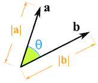

# 第二章：机器学习数学

机器学习用户需要对机器学习概念和算法有一定的了解。熟悉数学是机器学习的重要方面。我们通过理解语言的基本概念和结构来学习编程。同样，我们通过理解数学概念和算法来学习机器学习，数学用于解决复杂的计算问题，是理解和欣赏许多计算机科学概念的学科。数学在掌握理论概念和选择正确算法方面起着基本作用。本章涵盖了**机器学习**的**线性代数**和**微积分**的基础知识。

在本章中，我们将涵盖以下主题：

+   线性代数

+   环境设置

+   在 Intellij 中设置 Scala 环境

+   在命令行上设置 Scala 环境

+   领域

+   向量

+   向量空间

+   向量类型：

+   密集向量

+   稀疏向量

+   Spark 中的向量

+   向量运算

+   超平面

+   机器学习中的向量

+   矩阵

+   介绍

+   矩阵类型：

+   密集矩阵

+   CSC 矩阵

+   Spark 中的矩阵

+   矩阵运算

+   行列式

+   特征值和特征向量

+   奇异值分解

+   机器学习中的矩阵

+   函数

+   定义

+   函数类型：

+   线性函数

+   多项式函数

+   身份函数

+   常数函数

+   概率分布函数

+   高斯函数

+   功能组合

+   假设

+   梯度下降

+   先验、似然和后验

+   微积分

+   微分计算

+   积分微积分

+   拉格朗日乘数

+   绘图

# 线性代数

线性代数是解决线性方程组和变换的研究。向量、矩阵和行列式是线性代数的基本工具。我们将使用**Breeze**详细学习这些内容。Breeze 是用于数值处理的基础线性代数库。相应的 Spark 对象是 Breeze 的包装器，并作为 Spark ML 库的公共接口，以确保即使 Breeze 在内部发生变化，Spark ML 库的一致性也得到保证。

# 在 Intellij 中设置 Scala 环境

最好使用像 IntelliJ 这样的 IDE 来编辑 Scala 代码，它提供了更快的开发工具和编码辅助。代码完成和检查使编码和调试更快更简单，确保您专注于学习机器学习的最终目标。

IntelliJ 2016.3 将 Akka、Scala.meta、Memory view、Scala.js 和 Migrators 作为 Scala 插件的一部分引入到 IntelliJ IDE 中。现在，让我们按照以下步骤在 Intellij 中设置 Scala 环境：

1.  转到首选项 | 插件，并验证是否安装了 Scala 插件。SBT 是 Scala 的构建工具，默认配置如下截图所示：


1.  选择文件 | 新建 | 从现有资源创建项目 | $GIT_REPO/Chapter_02/breeze 或$GIT_REPO/Chapter_02/spark。这里，$GIT_REPO 是您克隆了书籍源代码的存储库路径。

1.  通过选择 SBT 选项导入项目：


1.  保持 SBT 的默认选项，然后单击完成。

1.  SBT 将花一些时间从`build.sbt`中导入引用。


1.  最后，在源文件上右键单击，然后选择运行'Vector'。


# 在命令行上设置 Scala 环境

要在本地设置环境，请按照下面列出的步骤进行：

1.  转到`第二章`的根目录，并选择适当的文件夹。

```scala
 $ cd /PATH/spark-ml/Chapter_02/breeze

```

或者，选择以下内容：

```scala
 $ cd /PATH/spark-ml/Chapter_02/spark

```

1.  编译代码。

```scala
      $ sbt compile

```

1.  运行编译后的代码，并选择要运行的程序（显示的类取决于是否在 Spark 或 Breeze 文件夹中执行`sbt run`）。

```scala
 $ sbt run

 Multiple main classes detected, select one to run:
 ....
 Enter number:

```

# 领域

领域是数学中定义的基本结构。我们现在将看一下最基本的类型。

# 实数

实数是我们可以想到的任何数字；实数包括整数（0, 1, 2, 3）、有理数（2/6, 0.768, 0.222...，3.4）和无理数（π，&Sqrt;3）。实数可以是正数、负数或零。另一方面，虚数就像&Sqrt;−1（负 1 的平方根）；请注意，无穷大不是实数。

# 复数

我们知道一个数的平方永远不可能是负数。在这种情况下，我们如何解决*x2* = *-9*？在数学中，我们有 i 的概念，作为一个解，即*x* = *3i*。诸如 i、-i、3i 和 2.27i 的数字称为虚数。"一个实数" + "一个虚数"形成一个"复数"。

*复数 = (实部) + (虚部) I*

以下示例展示了使用 Breeze 库进行数学运算的复数表示：

```scala
import breeze.linalg.DenseVector 
import breeze.math.Complex 
val i = Complex.i 

// add 
println((1 + 2 * i) + (2 + 3 * i)) 

// sub 
println((1 + 2 * i) - (2 + 3 * i)) 

// divide 
println((5 + 10 * i) / (3 - 4 * i)) 

// mul 
println((1 + 2 * i) * (-3 + 6 * i)) 
println((1 + 5 * i) * (-3 + 2 * i)) 

// neg 
println(-(1 + 2 * i)) 

// sum of complex numbers 
val x = List((5 + 7 * i), (1 + 3 * i), (13 + 17 * i)) 
println(x.sum) 
// product of complex numbers 
val x1 = List((5 + 7 * i), (1 + 3 * i), (13 + 17 * i)) 
println(x1.product) 
// sort list of complex numbers 
val x2 = List((5 + 7 * i), (1 + 3 * i), (13 + 17 * i)) 
println(x2.sorted) 

```

上述代码给出了以下结果：

```scala
3.0 + 5.0i
-1.0 + -1.0i -1.0 + 2.0i
-15.0 + 0.0i
-13.0 + -13.0i
-1.0 + -2.0i
19.0 + 27.0i
-582.0 + 14.0i
List(1.0 + 3.0i, 5.0 + 7.0i, 13.0 + 17.0i)

```

# 向量

向量是一个数学对象，描述为一组有序的数字。它类似于一个集合，只是向量中保持顺序。所有成员都是实数的一部分。具有维度 n 的向量在几何上表示为*n*维空间中的一个点。向量的原点从零开始。

例子：

```scala
[2, 4, 5, 9, 10]
[3.14159, 2.718281828, −1.0, 2.0]
[1.0, 1.1, 2.0]

```

# 向量空间

线性代数被广泛认为是向量空间的代数。实数或复数类型的向量对象可以通过将向量与标量数*α*相乘来进行加法和缩放。

向量空间是一组可以相加和相乘的向量对象。两个向量可以组合成第三个向量或向量空间中的另一个对象。向量空间的公理具有有用的性质。向量空间中的空间有助于研究物理空间的性质，例如，找出物体的近或远。向量空间的一个例子是三维欧几里德空间中的向量集合。向量空间*V*在域*F*上具有以下属性：

+   向量加法：由*v + w*表示，其中*v*和*w*是空间*V*的元素

+   标量乘法：用*α * v*表示，其中*α*是*F*的元素

+   结合性：由*u + (v + w) = (u + v) + w*表示，其中*u*、*v*和*w*是空间*V*的元素

+   可交换：由*v + w = w + v*表示

+   分配：由*α * (v + w) = α * v + α * w*表示

在机器学习中，特征是向量空间的维度。

# 向量类型

在 Scala 中，我们将使用 Breeze 库来表示向量。向量可以表示为密集向量或稀疏向量。

# Breeze 中的向量

Breeze 使用两种基本向量类型-`breeze.linalg.DenseVector`和`breeze.linalg.SparseVector`-来表示前面显示的两种向量类型。

`DenseVector`是一个围绕数组的包装器，支持数值运算。让我们首先看一下密集向量的计算；我们将使用 Breeze 创建一个密集向量对象，然后将索引三更新为一个新值。

```scala
import breeze.linalg.DenseVector 
val v = DenseVector(2f, 0f, 3f, 2f, -1f) 
v.update(3, 6f) 
println(v) 

```

这给出了以下结果：`DenseVector (2.0, 0.0, 3.0, 6.0, -1.0)`

`SparseVector`是一个大部分值为零的向量，并支持数值运算。让我们看一下稀疏向量的计算；我们将使用 Breeze 创建一个稀疏向量对象，然后将值更新为 1。

```scala
import breeze.linalg.SparseVectorval sv:SparseVector[Double] = 
SparseVector(5)() 
sv(0) = 1 
sv(2) = 3 
sv(4) = 5 
val m:SparseVector[Double] = sv.mapActivePairs((i,x) => x+1) 
println(m) 

```

这给出了以下结果：`SparseVector((0,2.0), (2,4.0), (4,6.0))`

# Spark 中的向量

Spark MLlib 使用 Breeze 和 JBlas 进行内部线性代数运算。它使用自己的类来表示使用`org.apache.spark.mllib.linalg.Vector`工厂定义的向量。本地向量具有整数类型和基于 0 的索引。其值存储为双精度类型。本地向量存储在单台机器上，不能分布。Spark MLlib 支持两种类型的本地向量，使用工厂方法创建的密集和稀疏向量。

以下代码片段显示了如何在 Spark 中创建基本的稀疏和密集向量：

```scala
val dVectorOne: Vector = Vectors.dense(1.0, 0.0, 2.0) 
println("dVectorOne:" + dVectorOne) 
//  Sparse vector (1.0, 0.0, 2.0, 3.0) 
// corresponding to nonzero entries. 
val sVectorOne: Vector = Vectors.sparse(4,  Array(0, 2,3), 
   Array(1.0, 2.0, 3.0)) 
// Create a sparse vector (1.0, 0.0, 2.0, 2.0) by specifying its 
// nonzero entries. 
val sVectorTwo: Vector = Vectors.sparse(4, Seq((0, 1.0), (2, 2.0), 
  (3, 3.0))) 

```

上述代码产生以下输出：

```scala
dVectorOne:[1.0,0.0,2.0]
sVectorOne:(4,[0,2,3],[1.0,2.0,3.0])
sVectorTwo:(4,[0,2,3],[1.0,2.0,3.0])

```

Spark 提供了各种方法来访问和发现向量值，如下所示：

```scala
val sVectorOneMax = sVectorOne.argmax
val sVectorOneNumNonZeros = sVectorOne.numNonzeros
val sVectorOneSize = sVectorOne.size
val sVectorOneArray = sVectorOne.toArray
val sVectorOneJson = sVectorOne.toJson

println("sVectorOneMax:" + sVectorOneMax)
println("sVectorOneNumNonZeros:" + sVectorOneNumNonZeros)
println("sVectorOneSize:" + sVectorOneSize)
println("sVectorOneArray:" + sVectorOneArray)
println("sVectorOneJson:" + sVectorOneJson)
val dVectorOneToSparse = dVectorOne.toSparse

```

前面的代码产生了以下输出：

```scala
sVectorOneMax:3
sVectorOneNumNonZeros:3
sVectorOneSize:4
sVectorOneArray:[D@38684d54
sVectorOneJson:{"type":0,"size":4,"indices":[0,2,3],"values":
  [1.0,2.0,3.0]}
dVectorOneToSparse:(3,[0,2],[1.0,2.0])

```

# 向量操作

向量可以相加，相减，并且可以乘以标量。向量的其他操作包括找到平均值，归一化，比较和几何表示。

+   加法操作：此代码显示了向量对象上的逐元素加法操作：

```scala
        // vector's 
        val v1 = DenseVector(3, 7, 8.1, 4, 5) 
        val v2 = DenseVector(1, 9, 3, 2.3, 8) 
        // elementwise add operation 
        def add(): Unit = { 
          println(v1 + v2) 
        } 

```

这段代码给出的结果如下：`DenseVector(4.0, 16.0, 11.1, 6.3, 13.0)`

+   乘法和点操作：这是一种代数操作，它接受两个相等长度的数字序列，并返回一个数字；代数上，它是两个数字序列对应条目的乘积的和。数学上表示如下：



```scala
        a   b = |a| × |b| × cos(θ) OR a   b = ax × bx + ay × by 

        import breeze.linalg.{DenseVector, SparseVector} 
        val a = DenseVector(0.56390, 0.36231, 0.14601, 0.60294, 
           0.14535) 
        val b = DenseVector(0.15951, 0.83671, 0.56002, 0.57797, 
           0.54450) 
       println(a.t * b) 
       println(a dot b) 

```

前面的代码给出了以下结果：

```scala
 0.9024889161, 0.9024889161

        import breeze.linalg.{DenseVector, SparseVector} 
        val sva = 
           SparseVector(0.56390,0.36231,0.14601,0.60294,0.14535) 
        val svb = 
           SparseVector(0.15951,0.83671,0.56002,0.57797,0.54450) 
        println(sva.t * svb) 
        println(sva dot svb) 

```

最后的代码给出的结果如下：`0.9024889161, 0.9024889161`

+   寻找平均值：此操作返回向量元素沿第一个数组维度的平均值，其大小不等于`1`。数学上表示如下：

```scala
        import breeze.linalg.{DenseVector, SparseVector} 
        import breeze.stats.mean 
        val mean = mean(DenseVector(0.0,1.0,2.0)) 
        println(mean) 

```

这给出了以下结果：

`1.0`

```scala
        import breeze.linalg.{DenseVector, SparseVector} 
        import breeze.stats.mean 
        val svm = mean(SparseVector(0.0,1.0,2.0)) 
        val svm1 = mean(SparseVector(0.0,3.0)) 
        println(svm, svm1) 

```

这给出了以下结果：

 (1.0,1.5)

+   归一化向量：每个向量都有一个大小，使用毕达哥拉斯定理计算，如*|v| = sqrt(x² + y² + z²);* 这个大小是从原点(`0,0,0`)到向量指示的点的长度。如果向量的大小是`1`，则向量是正规的。归一化向量意味着改变它，使其指向相同的方向（从原点开始），但其大小为一。因此，归一化向量是一个指向相同方向的向量，但其规范（长度）为`1`。它由^X 表示，并由以下公式给出：


其中是的范数。它也被称为单位向量。

```scala
        import breeze.linalg.{norm, DenseVector, SparseVector} 
        import breeze.stats.mean 
        val v = DenseVector(-0.4326, -1.6656, 0.1253, 0.2877, -
          1.1465) 
        val nm = norm(v, 1) 

        //Normalizes the argument such that its norm is 1.0 
        val nmlize = normalize(v) 

        // finally check if the norm of normalized vector is 1 or not 
        println(norm(nmlize)) 

```

这给出了以下结果：

```scala
 Norm(of dense vector) = 3.6577

 Normalized vector is = DenseVector(-0.2068389122442966,  
      -0.7963728438143791, 0.05990965257561341, 0.1375579173663526,     
      -0.5481757117154094)

 Norm(of normalized vector) = 0.9999999999999999

```

+   显示向量中的最小和最大元素：

```scala
        import breeze.linalg._ 
        val v1 = DenseVector(2, 0, 3, 2, -1) 
        println(argmin(v1)) 
        println(argmax(v1)) 
        println(min(v1)) 
        println(max(v1)) 

```

这给出了以下结果：

`4, 2, -1, 3`

+   比较操作：这比较两个向量是否相等，以及进行小于或大于的操作：

```scala
        import breeze.linalg._ 
        val a1 = DenseVector(1, 2, 3) 
        val b1 = DenseVector(1, 4, 1) 
        println((a1 :== b1)) 
        println((a1 :<= b1)) 
        println((a1 :>= b1)) 
        println((a1 :< b1)) 
        println((a1 :> b1)) 

```

这给出了以下结果：

```scala
 BitVector(0), BitVector(0, 1), BitVector(0, 2),   
      BitVector(1),    
      BitVector(2)

```

+   向量的几何表示：


# 超平面

如果*n*不是 1,2 或 3，实数域的向量很难可视化。熟悉的对象如线和平面对于任何值的*n*都是有意义的。沿着向量*v*定义的方向的线*L*，通过向量*u*标记的点*P*，可以写成如下形式：

*L = {u + tv | t* *&in; R}*

给定两个非零向量*u*和*v*，如果这两个向量不在同一条直线上，并且其中一个向量是另一个的标量倍数，则它们确定一个平面。两个向量的加法是通过将向量头尾相接以创建一个三角形序列来完成的。如果*u*和*v*在一个平面上，那么它们的和也在*u*和*v*的平面上。由两个向量*u*和*v*表示的平面可以用数学方式表示如下：

*{P + su + tv | s, t* *&in; R}*

我们可以将平面的概念推广为一组*x + 1*个向量和*P, v1, . . . , vx*在*R*, n 中，其中*x ≤ n*确定一个 x 维超平面：

*(P + X x i=1 λivi | λi* *&in; **R)*

# 机器学习中的向量

在机器学习中，特征使用 n 维向量表示。在机器学习中，要求用数字格式表示数据对象，以便进行处理和统计分析。例如，图像使用像素向量表示。

# 矩阵

在域*F*上的矩阵是一个二维数组，其条目是*F*的元素。实数域上的矩阵示例如下：

*1 2 3*

*10 20 30*

先前的矩阵有两行三列；我们称之为*2×3*矩阵。 传统上通过数字来指代行和列。 第 1 行是(*1 2 3*)，第 2 行是(*10 20 30*)；第 1 列是(*1 10*)，第 2 列是(*2 20*)，第 3 列是(*3 30*)。 通常，具有 m 行 n 列的矩阵称为*m×n*矩阵。 对于矩阵*A*，元素(*i, j*)被定义为第 i 行和第 j 列中的元素，并使用 Ai, j 或 Aij 表示。 我们经常使用 pythonese 表示法，*A[i, j]*。 第*i*行是向量(*A[i, 0], A[i, 1], A[i, 2], , A[i, m − 1]*)，第 j 列是向量(*A[0, j], A[1, j], A[2, j], , A[n − 1, j]*)。

# 矩阵类型

在 Scala 中，我们将使用 Breeze 库来表示矩阵。 矩阵可以表示为密集矩阵或 CSC 矩阵。

+   **密集矩阵**：使用构造方法调用创建密集矩阵。 可以访问和更新其元素。 它是列主序的，可以转置为行主序。

```scala
        val a = DenseMatrix((1,2),(3,4)) 
          println("a : n" + a) 
         val m = DenseMatrix.zerosInt 

        The columns of a matrix can be accessed as Dense Vectors, and    
        the rows as  Dense Matrices. 

          println( "m.rows :" + m.rows + " m.cols : "  + m.cols) 
          m(::,1) 
         println("m : n" + m) 

```

+   **转置矩阵**：转置矩阵意味着交换其行和列。 P×Q 矩阵的转置，写作 MT，是一个 Q×P 矩阵，使得（MT）j, I = Mi, j 对于每个 I &in; P，j &in; Q。 向量转置以创建矩阵行。

```scala
        m(4,::) := DenseVector(5,5,5,5,5).t 
        println(m) 

```

上述程序的输出如下：

```scala

 a : 
 1  2 
 3  4 
 Created a 5x5 matrix
 0  0  0  0  0 
 0  0  0  0  0 
 0  0  0  0  0 
 0  0  0  0  0 
 0  0  0  0  0 
 m.rows :5 m.cols : 5
 First Column of m : 
            DenseVector(0, 0, 0, 0, 0)
            Assigned 5,5,5,5,5 to last row of m.

 0  0  0  0  0 
 0  0  0  0  0 
 0  0  0  0  0 
      0  0  0  0  0 
      5  5  5  5  5 

```

+   **CSC 矩阵**：**CSC**矩阵被称为**压缩稀疏列**矩阵。 CSC 矩阵支持所有矩阵操作，并使用`Builder`构建。

```scala
        val builder = new CSCMatrix.BuilderDouble 
        builder.add(3,4, 1.0) 
        // etc. 
        val myMatrix = builder.result() 

```

# Spark 中的矩阵

Spark 中的本地矩阵具有整数类型的行和列索引。 值为双精度类型。 所有值都存储在单台机器上。 MLlib 支持以下矩阵类型：

+   **密集矩阵**：条目值存储在列主序的单个双精度数组中。

+   **稀疏矩阵**：非零条目值以列主序的 CSC 格式存储的矩阵。 例如，以下稠密矩阵存储在一维数组[`2.0, 3.0, 4.0, 1.0, 4.0, 5.0`]中，矩阵大小为(3, 2)：

`2.0 3.0``4.0 1.0``4.0 5.0`

这是一个密集和稀疏矩阵的示例：

```scala
       val dMatrix: Matrix = Matrices.dense(2, 2, Array(1.0, 2.0, 3.0, 
          4.0)) 
        println("dMatrix: n" + dMatrix) 

        val sMatrixOne: Matrix = Matrices.sparse(3, 2, Array(0, 1, 3), 
           Array(0, 2, 1), Array(5, 6, 7)) 
        println("sMatrixOne: n" + sMatrixOne) 

        val sMatrixTwo: Matrix = Matrices.sparse(3, 2, Array(0, 1, 3), 
           Array(0, 1, 2), Array(5, 6, 7)) 
        println("sMatrixTwo: n" + sMatrixTwo) 

```

上述代码的输出如下：

```scala
 [info] Running linalg.matrix.SparkMatrix 
 dMatrix: 
 1.0  3.0 
 2.0  4.0 
 sMatrixOne: 
 3 x 2 CSCMatrix
 (0,0) 5.0
 (2,1) 6.0
 (1,1) 7.0
 sMatrixTwo: 
 3 x 2 CSCMatrix
 (0,0) 5.0
 (1,1) 6.0
 (2,1) 7.0

```

# Spark 中的分布式矩阵

Spark 中的分布式矩阵具有长类型的行和列索引。 它具有双精度值，以分布方式存储在一个或多个 RDD 中。 Spark 中已实现了四种不同类型的分布式矩阵。 它们都是`DistributedMatrix`的子类。


`RowMatrix`：`RowMatrix`是一种无意义的行索引的面向行的分布式矩阵。 （在面向行的矩阵中，数组的行的连续元素在内存中是连续的）。 `RowMatrix`实现为其行的 RDD。 每行是一个本地向量。 列数必须小于或等于*2³¹*，以便将单个本地向量传输到驱动程序，并且还可以使用单个节点进行存储或操作。

以下示例显示了如何从`Vectors`类创建行矩阵（密集和稀疏）：

```scala
val spConfig = (new 
    SparkConf).setMaster("local").setAppName("SparkApp") 
     val sc = new SparkContext(spConfig) 
     val denseData = Seq( 
       Vectors.dense(0.0, 1.0, 2.1), 
       Vectors.dense(3.0, 2.0, 4.0), 
       Vectors.dense(5.0, 7.0, 8.0), 
       Vectors.dense(9.0, 0.0, 1.1) 
     ) 
     val sparseData = Seq( 
       Vectors.sparse(3, Seq((1, 1.0), (2, 2.1))), 
       Vectors.sparse(3, Seq((0, 3.0), (1, 2.0), (2, 4.0))), 
       Vectors.sparse(3, Seq((0, 5.0), (1, 7.0), (2, 8.0))), 
       Vectors.sparse(3, Seq((0, 9.0), (2, 1.0))) 
     ) 

val denseMat = new RowMatrix(sc.parallelize(denseData, 2)) 
val sparseMat = new RowMatrix(sc.parallelize(sparseData, 2)) 

println("Dense Matrix - Num of Rows :" + denseMat.numRows()) 
println("Dense Matrix - Num of Cols:" + denseMat.numCols()) 
println("Sparse Matrix - Num of Rows :" + sparseMat.numRows()) 
println("Sparse Matrix - Num of Cols:" + sparseMat.numCols()) 

sc.stop() 

```

上述代码的输出如下：

```scala
Using Spark's default log4j profile: 
org/apache/spark/log4j-  
defaults.properties
16/01/27 04:51:59 INFO SparkContext: Running Spark version 
1.6.0
Dense Matrix - Num of Rows :4
Dense Matrix - Num of Cols:3
...
Sparse Matrix - Num of Rows :4
Sparse Matrix - Num of Cols :3

```

`IndexedRowMatrix`：`IndexedRowMatrix`类似于`RowMatrix`，但具有行索引，可用于标识行并执行连接。 在以下代码清单中，我们创建一个 4x3 的`IndexedMatrix`，并使用适当的行索引：

```scala
val data = Seq(
(0L, Vectors.dense(0.0, 1.0, 2.0)),
(1L, Vectors.dense(3.0, 4.0, 5.0)),
(3L, Vectors.dense(9.0, 0.0, 1.0))
).map(x => IndexedRow(x._1, x._2))
val indexedRows: RDD[IndexedRow] = sc.parallelize(data, 2)
val indexedRowsMat = new IndexedRowMatrix(indexedRows)
 println("Indexed Row Matrix - No of Rows: " + 
indexedRowsMat.numRows())
 println("Indexed Row Matrix - No of Cols: " + 
indexedRowsMat.numCols())

```

上述代码清单的输出如下：

```scala
Indexed Row Matrix - No of Rows: 4
Indexed Row Matrix - No of Cols: 3

```

`CoordinateMatrix`：这是以坐标列表（COO）格式存储的分布式矩阵，由其条目的 RDD 支持。

COO 格式存储了一个（行，列，值）元组的列表。 条目按（行索引，然后列索引）排序，以提高随机访问时间。 此格式适用于增量矩阵构建。

```scala
val entries = sc.parallelize(Seq( 
      (0, 0, 1.0), 
      (0, 1, 2.0), 
      (1, 1, 3.0), 
      (1, 2, 4.0), 
      (2, 2, 5.0), 
      (2, 3, 6.0), 
      (3, 0, 7.0), 
      (3, 3, 8.0), 
      (4, 1, 9.0)), 3).map { case (i, j, value) => 
      MatrixEntry(i, j, value) 
    } 
val coordinateMat = new CoordinateMatrix(entries) 
println("Coordinate Matrix - No of Rows: " + 
  coordinateMat.numRows()) 
println("Coordinate Matrix - No of Cols: " + 
  coordinateMat.numCols()) 

```

上述代码的输出如下：

```scala
Coordinate Matrix - No of Rows: 5
Coordinate - No of Cols: 4

```

# 矩阵操作

可以对矩阵执行不同类型的操作。

+   **逐元素加法**：给定两个矩阵*a*和*b*，两者的加法（a + b）意味着将两个矩阵的每个元素相加。

Breeze

```scala
        val a = DenseMatrix((1,2),(3,4)) 
        val b = DenseMatrix((2,2),(2,2)) 
        val c = a + b 
        println("a: n" + a) 
        println("b: n" + b) 
        println("a + b : n" + c) 

```

最后一段代码的输出如下：

```scala
 a:1  2 
 3  4 
 b: 2  2 
 2  2 
 a + b : 
 3  4 
 5  6 

```

+   **逐元素乘法**：在这个操作中，矩阵*a*的每个元素都与矩阵相乘

Breeze

```scala
        a :* b  
        val d = a*b 
        println("Dot product a*b : n" + d) 

```

前面命令的输出如下：

```scala
 Dot product a*b :
 6   6 
 14  14

```

+   **逐元素比较**：在这个操作中，将矩阵*a*的每个元素与*b*进行比较。Breeze 中的代码如下所示：

Breeze

```scala
        a :< b 

```

前面代码的输出如下：

```scala
 a :< b 
 false  false 
 false  false

```

+   **原地加法**：这意味着将*a*的每个元素加 1。

Breeze

前面代码的输出如下：

```scala
 Inplace Addition : a :+= 1
 2  3 
 4  5 
      value = a :+= 1
 println("Inplace Addition : a :+= 1n" + e)

```

+   **逐元素求和**：这用于添加矩阵的所有元素。Breeze 中的代码如下所示：

Breeze

```scala
        val sumA = sum(a) 
        println("sum(a):n" + sumA) 

```

前述代码的输出如下：

```scala
 sum(a):
 14

```

+   **逐元素最大值**：为了找到矩阵中所有元素的最大值，我们使用

```scala
        a.max

```

Breeze

Breeze 中的代码可以写成如下形式：

```scala
        println("a.max:n" + a.max) 

```

+   **逐元素 argmax**：这用于获取具有最大值的元素的位置。

Breeze

代码：

```scala
        println("argmax(a):n" + argmax(a)) 

```

前面命令的输出如下：

```scala
 argmax(a):
 (1,1)

```

+   **Ceiling**：这将每个矩阵元素四舍五入到下一个整数。

Breeze

代码：

```scala
        val g = DenseMatrix((1.1, 1.2), (3.9, 3.5)) 
        println("g: n" + g) 
        val gCeil =ceil(g) 
        println("ceil(g)n " + gCeil) 

```

前面代码的输出如下：

```scala
 g: 
          1.1  1.2 
          3.9  3.5 

 ceil(g)
          2.0  2.0 
          4.0  4.0 

```

+   **Floor**：Floor 将每个元素的值四舍五入为较低值的最接近整数。

Breeze

代码：

```scala
        val gFloor =floor(g) 
        println("floor(g)n" + gFloor) 

```

输出将如下所示：

```scala
 floor(g)
 1.0  1.0
 3.0  3.0

```

# 行列式

`tr` M 表示矩阵*M*的迹；它是沿对角线的元素的总和。矩阵的迹通常被用作矩阵的“大小”的度量。行列式被称为沿其对角线的元素的乘积。


行列式主要用于线性方程组；它指示列是否线性相关，并且还有助于找到矩阵的逆。对于大矩阵，行列式是使用拉普拉斯展开来计算的。

```scala
val detm: Matrix = Matrices.dense(3, 3, Array(1.0, 3.0, 5.0, 2.0, 
  4.0, 6.0, 2.0, 4.0, 5.0)) 
print(det(detm)) 

```

# 特征值和特征向量

*Ax = b*是从静态问题中产生的线性方程。另一方面，特征值用于动态问题。让我们将 A 视为一个具有 x 作为向量的矩阵；我们现在将在线性代数中解决新方程*Ax= λx*。

当*A*乘以*x*时，向量*x*改变了它的方向。但是有一些向量与*Ax*的方向相同-这些被称为**特征向量**，对于这些特征向量，以下方程成立：

*Ax= λx*

在最后一个方程中，向量*Ax*是向量*x*的λ倍，*λ*被称为特征值。特征值*λ*给出了向量的方向-如果它被反转，或者在相同的方向上。

*Ax= λx*也传达了*det(A - λI) = 0*，其中*I*是单位矩阵。这确定了*n*个特征值。

特征值问题定义如下：

*A x = λ x*

*A x-λ x = 0*

*A x-λ I x = 0*

*(A-λ I) x = 0*

如果*x*不为零，则前述方程只有解当且仅当*|A-λ I| = 0*。使用这个方程，我们可以找到特征值。

```scala
val A = DenseMatrix((9.0,0.0,0.0),(0.0,82.0,0.0),(0.0,0.0,25.0)) 
val es = eigSym(A) 
val lambda = es.eigenvalues 
val evs = es.eigenvectors 
println("lambda is : " + lambda) 
println("evs is : " + evs) 

```

这段最后的代码给出了以下结果：

```scala
lambda is : DenseVector(9.0, 25.0, 82.0)
evs is : 1.0  0.0  0.0 
0.0  0.0  1.0 
0.0  1.0  -0.0 

```

# 奇异值分解

矩阵*M*的奇异值分解：*m x n*（实数或复数）是一个形式为*UΣV*的分解，其中*U*是一个*m x R*矩阵。*Σ*是一个*R x R*的矩形对角矩阵，对角线上有非负实数，*V*是一个*n x r*酉矩阵。*r*等于矩阵*M*的秩。

Sigma 的对角线条目*Σii*被称为*M*的奇异值。*U*的列和*V*的列分别称为*M*的左奇异向量和右奇异向量。

以下是 Apache Spark 中 SVD 的示例：

```scala
package linalg.svd 

import org.apache.spark.{SparkConf, SparkContext} 
import org.apache.spark.mllib.linalg.distributed.RowMatrix 
import org.apache.spark.mllib.linalg.{Matrix,       
SingularValueDecomposition, Vector, Vectors} 
object SparkSVDExampleOne { 

  def main(args: Array[String]) { 
    val denseData = Seq( 
      Vectors.dense(0.0, 1.0, 2.0, 1.0, 5.0, 3.3, 2.1), 
      Vectors.dense(3.0, 4.0, 5.0, 3.1, 4.5, 5.1, 3.3), 
      Vectors.dense(6.0, 7.0, 8.0, 2.1, 6.0, 6.7, 6.8), 
      Vectors.dense(9.0, 0.0, 1.0, 3.4, 4.3, 1.0, 1.0) 
    ) 
    val spConfig = (new 
      SparkConf).setMaster("local").setAppName("SparkSVDDemo") 
    val sc = new SparkContext(spConfig) 
    val mat: RowMatrix = new RowMatrix(sc.parallelize(denseData, 2)) 

     // Compute the top 20 singular values and corresponding    
       singular vectors. 
    val svd: SingularValueDecomposition[RowMatrix, Matrix] = 
    mat.computeSVD(7, computeU = true) 
    val U: RowMatrix = svd.U // The U factor is a RowMatrix. 
    val s: Vector = svd.s // The singular values are stored in a 
      local dense  vector. 
    val V: Matrix = svd.V // The V factor is a local dense matrix. 
    println("U:" + U) 
    println("s:" + s) 
    println("V:" + V) 
    sc.stop() 
  } 
}

```

# 机器学习中的矩阵

矩阵被用作数学对象来表示图像、实际机器学习应用中的数据集，如面部或文本识别、医学成像、主成分分析、数值精度等。

例如，特征分解在这里得到解释。许多数学对象可以通过将它们分解为组成部分或找到普遍性质来更好地理解。

就像整数被分解成质因数一样，矩阵分解被称为特征分解，其中我们将矩阵分解为特征向量和特征值。

矩阵*A*的特征向量*v*是这样的，乘以*A*只改变*v*的比例，如下所示：

*Av = λv*

标量*λ*称为与该特征向量对应的特征值。然后矩阵*A*的特征分解如下：

*A = V diag(λ)V −1*

矩阵的特征分解与矩阵共享许多事实。如果任何一个特征值为 0，则矩阵是奇异的。实对称矩阵的特征分解也可用于优化二次表达式等。特征向量和特征值用于**主成分分析**。

以下示例显示了如何使用`DenseMatrix`来获取特征值和特征向量：

```scala
// The data 
val msData = DenseMatrix( 
  (2.5,2.4), (0.5,0.7), (2.2,2.9), (1.9,2.2), (3.1,3.0), 
  (2.3,2.7), (2.0,1.6), (1.0,1.1), (1.5,1.6), (1.1,0.9)) 

def main(args: Array[String]): Unit = { 
       val pca = breeze.linalg.princomp(msData) 

       print("Center" , msData(*,::) - pca.center) 

       //the covariance matrix of the data 

       print("covariance matrix", pca.covmat) 

       // the eigenvalues of the covariance matrix, IN SORTED ORDER 
       print("eigen values",pca.eigenvalues) 

       // eigenvectors 
       print("eigen vectors",pca.loadings) 
       print(pca.scores) 
} 

```

这给我们以下结果：

```scala
eigen values = DenseVector(1.2840277121727839, 0.04908339893832732)
eigen vectors = -0.6778733985280118  -0.735178655544408 

```

# 函数

要定义数学对象如函数，我们必须首先了解集合是什么。

集合是一个无序的对象集合，如 S = {-4, 4, -3, 3, -2, 2, -1, 1, 0}。如果集合 S 不是无限的，我们用|S|表示元素的数量，这被称为集合的基数。如果*A*和*B*是有限集合，则*|A**&rarrb;**B|=|A|**&rarrb;**|B|*，这被称为笛卡尔积。

对于集合 A 中的每个输入元素，函数从另一个集合 B 中分配一个单一的输出元素。A 称为函数的定义域，B 称为值域。函数是一组*(x, y)*对，其中没有这些对具有相同的第一个元素。

例如：定义域为{1, 2, 3, . . .}的函数，将其输入加倍得到集合{(1,2),(2,4),(3,6),(4,8),...}

例如：定义域为{1, 2, 3, . . .}，值域为{1, 2, 3, . . .}的函数，将其输入的数字相乘得到{((1,1),1),((1,2),2)),...,((2,1),2),((2,2),4),((2,3),6),... ((3,1),3),((3,2),6),((3,3),9),...

给定输入的输出称为该输入的像。函数 f 下 q 的像用*f (q)*表示。如果*f(q)=s*，我们说 q 在 f 下映射到 s。我们将其写为*q->s*。所有输出被选择的集合称为值域。

当我们想要说 f 是一个定义域为 D，值域为*F*的函数时，我们将其写为*f: D -> F*。

# 函数类型

**程序与函数**：

过程是对计算的描述，给定一个输入，产生一个输出。

函数或计算问题不指示如何从给定输入计算输出。

相同的规范可能存在许多方法。

对于每个输入，计算问题可能有几种可能的输出。

我们将在 Breeze 中编写程序；通常称为函数，但我们将保留该术语用于数学对象。

+   **一一函数**：

*f : D -> F* 如果*f (x) = f (y)*意味着*x = y*，即*x*和*y*都在*D*中，则*f : D -> F*是一一函数。

+   **满射函数**：

*F: D -> F* 如果对于每个*F*的元素*z*，存在一个元素 a 在*D*中，使得*f (a) = z*，则称为满射。

如果函数是一一对应的并且满射的，则它是可逆的。

+   **线性函数**：线性函数是其图形为直线的函数。线性函数的形式为*z = f(x) = a + bx*。线性函数有一个因变量和一个自变量。因变量是*z*，自变量是*x*。


+   **多项式函数**：多项式函数只涉及 x 的非负整数幂，如二次的、三次的、四次的等等。我们可以给出多项式的一般定义，并定义它的次数。次数为 n 的多项式是形式为*f(x) = anx n + an−1x n−1 + . . . + a2x 2 + a1x + a0*的函数，其中 a 是实数，也称为多项式的系数。

例如：*f(x) = 4x 3 − 3x 2 + 2*


+   **恒等函数**：对于任何域*D*，*idD: D -> D*将每个域元素*d*映射到它自己。


+   **常数函数**：这是一个特殊的函数，表示为一条水平线。


+   **概率分布函数**：用于定义特定实验不同结果的相对可能性。它为每个潜在结果分配一个概率。所有结果的概率必须总和等于 1。通常，概率分布是均匀分布。这意味着它为每个结果分配相同的概率。当我们掷骰子时，可能的结果是 1、2、3、4、5，概率定义为*Pr(1) = Pr(2) = Pr(3) = Pr(4) = Pr(5) = 1/5*。

+   **高斯函数**：当事件数量很大时，可以使用高斯函数来描述事件。高斯分布被描述为一个连续函数，也称为正态分布。正态分布的均值等于中位数，并且关于中心对称。

# 函数组合

对于函数*f: A -> B*和*g: B -> C*，函数*f*和函数*g*的函数组合是函数*(g o f): A -> C*，由*(g o f)(x) = g(f(x))*定义。例如，如果*f : {1,2,3} -> {A,B,C,D}*和*g : {A,B,C,D} -> {4,5}*，*g(y)=y2*和*f(x)=x+1*的组合是*(g o f)(x)=(x+1)2*。

函数组合是将一个函数应用于另一个函数的结果。因此，在*(g o f)(x) = g(f(x))*中，首先应用*f()*，然后是*g()*。一些函数可以分解为两个（或更多）更简单的函数。

# 假设

*X*表示输入变量，也称为输入特征，*y*表示我们试图预测的输出或目标变量。对*(x, y)*这对被称为一个训练示例，用于学习的数据集是一个包含*m*个训练示例的列表，其中*{(x, y)}*是一个训练集。我们还将使用*X*表示输入值的空间，*Y*表示输出值的空间。对于一个训练集，为了学习一个函数*h: X → Y*，使得*h(x)*是*y*值的预测值。函数*h*被称为**假设**。

当要预测的目标变量是连续的时，我们称学习问题为回归问题。当*y*可以取少量离散值时，我们称之为分类问题。

假设我们选择将*y*近似为*x*的线性函数。

假设函数如下：


在这个最后的假设函数中，*θi*是参数，也称为权重，它们参数化从*X*到*Y*的线性函数空间。为了简化表示法，我们还引入了一个约定，即让*x0 = 1*（这是截距项），如下所示：


在 RHS 上，我们将*θ*和*x*都视为向量，n 是输入变量的数量。

现在在我们继续之前，重要的是要注意，我们现在将从数学基础过渡到学习算法。优化成本函数和学习*θ*将奠定理解机器学习算法的基础。

给定一个训练集，我们如何学习参数*θ*？一种可能的方法是让*h(x)*接近给定训练示例的*y*。我们将定义一个函数，用于衡量每个*θ*值的*h(x(i))*与相应的*y(i)*之间的接近程度。我们将这个函数定义为成本函数。


# 梯度下降

梯度下降的 SGD 实现使用数据示例的简单分布式采样。损失是优化问题的一部分，因此是真子梯度。


这需要访问完整的数据集，这并不是最佳的。


参数*miniBatchFraction*指定要使用的完整数据的分数。在这个子集上的梯度的平均值


是随机梯度。*S*是大小为*|S|= miniBatchFraction*的样本子集。

在以下代码中，我们展示了如何使用随机梯度下降在小批量上计算权重和损失。该程序的输出是一组权重和损失的向量。

```scala
object SparkSGD { 
 def main(args: Array[String]): Unit = { 
    val m = 4 
    val n = 200000 
    val sc = new SparkContext("local[2]", "") 
    val points = sc.parallelize(0 until m, 
      2).mapPartitionsWithIndex { (idx, iter) => 
      val random = new Random(idx) 
      iter.map(i => (1.0, 
       Vectors.dense(Array.fill(n)(random.nextDouble())))) 
    }.cache() 
    val (weights, loss) = GradientDescent.runMiniBatchSGD( 
      points, 
      new LogisticGradient, 
      new SquaredL2Updater, 
      0.1, 
      2, 
      1.0, 
      1.0, 
      Vectors.dense(new ArrayDouble)) 
    println("w:"  + weights(0)) 
    println("loss:" + loss(0)) 
    sc.stop() 
  } 

```

# 先验，似然和后验

贝叶斯定理陈述如下：

*后验=先验*似然*

这也可以表示为*P(A|B) = (P(B|A) * P(A)) / P(B)*，其中*P(A|B)*是给定*B*的* A*的概率，也称为后验。

**先验**：表示在观察数据对象之前或之前的知识或不确定性的概率分布

**后验**：表示在观察数据对象后参数可能性的条件概率分布

**似然**：落入特定类别或类别的概率。

这表示为：


# 微积分

微积分是一种数学工具，有助于研究事物的变化。它为建模存在变化的系统提供了一个框架，并推断了这些模型的预测。

# 微分微积分

微积分的核心是导数，其中导数被定义为给定函数相对于其变量之一的瞬时变化率。寻找导数的研究被称为微分。几何上，已知点的导数由函数图的切线的斜率给出，前提是导数存在，并且在该点被定义。

微分是积分的反向。微分有几个应用，比如在物理学中，位移的导数是速度，速度的导数是加速度。导数主要用于找到函数的最大值或最小值。

在机器学习中，我们处理对具有数百个或更多维度的变量或特征进行操作的函数。我们计算变量的每个维度的导数，并将这些偏导数组合成一个向量，这给我们所谓的梯度。类似地，对梯度进行二阶导数运算给我们一个被称为**海森**的矩阵。

梯度和海森矩阵的知识帮助我们定义诸如下降方向和下降速率之类的事物，告诉我们应该如何在函数空间中移动，以便到达最底部点，以最小化函数。

以下是一个简单目标函数的例子（使用向量化符号表示的带有权重*x*、*N*数据点和*D*维度的线性回归：


拉格朗日乘数法是微积分中在涉及约束时最大化或最小化函数的标准方法。

# 积分微积分

积分微积分将颗粒状的部分连接在一起以找到总数。它也被称为反微分，其中微分是将其分成小块并研究其在前一节中描述的变化。

积分通常用于找到函数图形下方的面积。

# 拉格朗日乘数

在数学优化问题中，拉格朗日乘数法被用作在等式约束下找到函数的局部极小值和极大值的工具。一个例子涉及找到在给定约束条件下的最大熵分布。

这最好通过一个例子来解释。假设我们必须最大化*K(x, y) = -x2 -y2，以*y = x + 1*为约束。

约束函数为*g(x, y) = x-y+1=0*。然后*L*乘数变为这样：


关于*x*、*y*和λ的微分，并设置为*0*，我们得到以下结果：


解决上述方程，我们得到*x=-0.5*，*y=0.5*，*lambda=-1*。

# 绘图

在这一部分，我们将看到如何使用 Breeze 从 Breeze `DenseVector`创建一个简单的线图。

Breeze 使用了大部分 Scala 绘图工具的功能，尽管 API 不同。在下面的例子中，我们创建了两个向量`x1`和`y`，并绘制了一条线并将其保存为 PNG 文件：

```scala
package linalg.plot 
import breeze.linalg._ 
import breeze.plot._ 

object BreezePlotSampleOne { 
  def main(args: Array[String]): Unit = { 

    val f = Figure() 
    val p = f.subplot(0) 
    val x = DenseVector(0.0,0.1,0.2,0.3,0.4,0.5,0.6,0.7,0.8) 
    val y = DenseVector(1.1, 2.1, 0.5, 1.0,3.0, 1.1, 0.0, 0.5,2.5) 
    p += plot(x,  y) 
    p.xlabel = "x axis" 
    p.ylabel = "y axis" 
    f.saveas("lines-graph.png") 
  } 
 } 

```

上述代码生成了以下线图：


Breeze 还支持直方图。这是为各种样本大小`100,000`和`100,0000`绘制的，以及`100`个桶中的正态分布随机数。

```scala
package linalg.plot 
import breeze.linalg._ 
import breeze.plot._ 

object BreezePlotGaussian { 
  def main(args: Array[String]): Unit = { 
    val f = Figure() 
    val p = f.subplot(2, 1, 1) 
    val g = breeze.stats.distributions.Gaussian(0, 1) 
    p += hist(g.sample(100000), 100) 
    p.title = "A normal distribution" 
    f.saveas("plot-gaussian-100000.png") 
  } 
 } 

```


下一张图片显示了具有 1000000 个元素的高斯分布：


具有 100 个元素的高斯分布

# 摘要

在本章中，您学习了线性代数的基础知识，这对机器学习很有用，以及向量和矩阵等基本构造。您还学会了如何使用 Spark 和 Breeze 对这些构造进行基本操作。我们研究了诸如 SVD 之类的技术来转换数据。我们还研究了线性代数中函数类型的重要性。最后，您学会了如何使用 Breeze 绘制基本图表。在下一章中，我们将介绍机器学习系统、组件和架构的概述。
