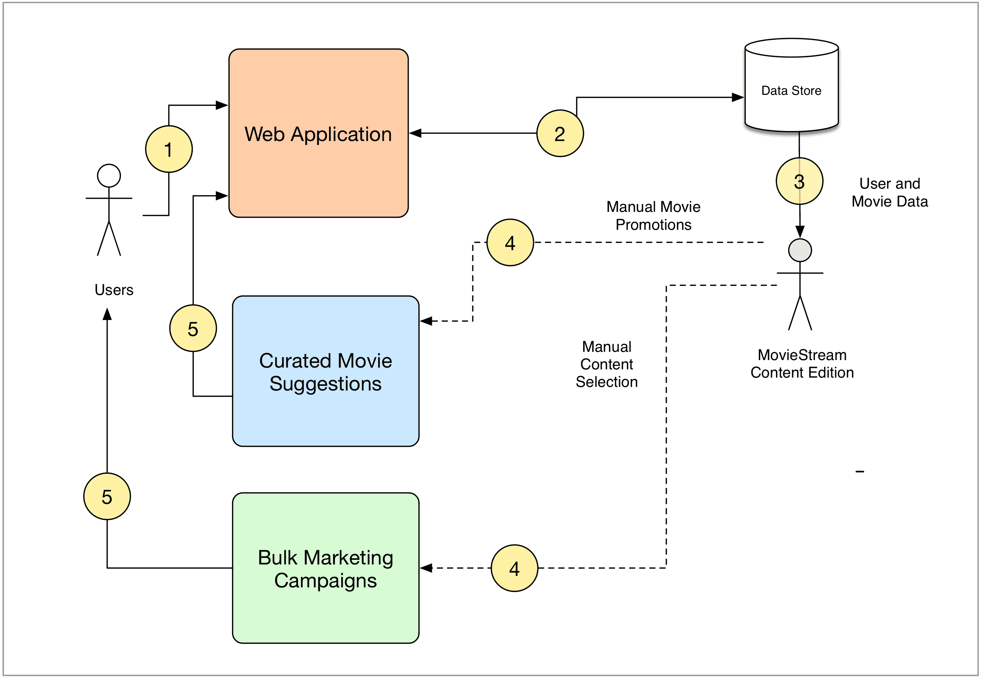
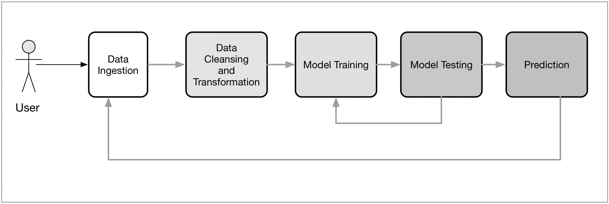
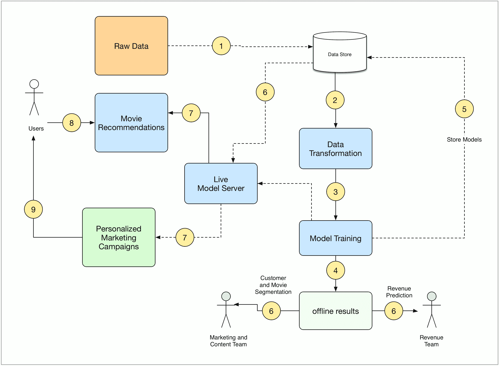
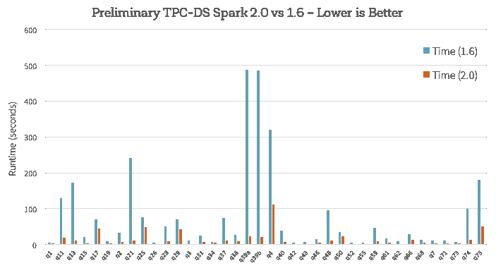
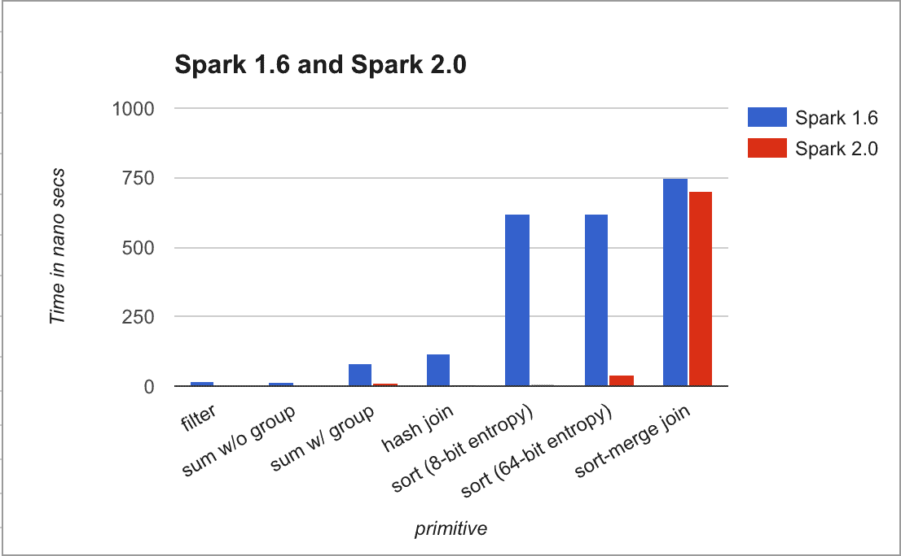
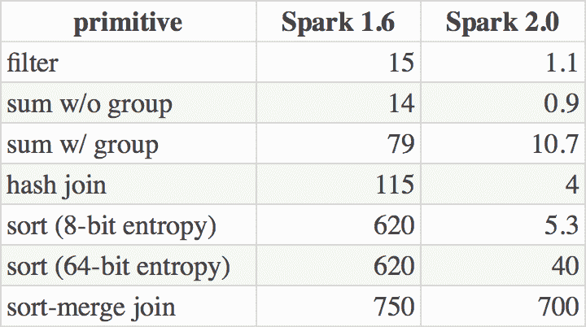
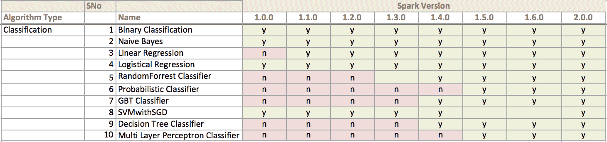
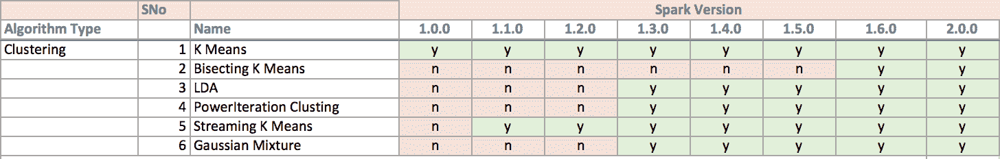
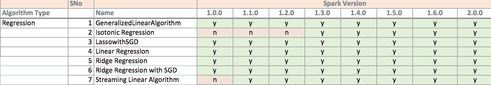

# 第三章：设计一个机器学习系统

在本章中，我们将为一个智能的、分布式的机器学习系统设计一个高层架构，该系统以 Spark 作为其核心计算引擎。我们将专注于采用自动化机器学习系统来支持业务的关键领域，对现有的基于 Web 的业务架构进行重新设计。

在我们深入研究我们的场景之前，我们将花一些时间了解机器学习是什么。

然后我们将：

+   介绍一个假设的业务场景

+   提供当前架构的概述

+   探索机器学习系统可以增强或替代某些业务功能的各种方式

+   基于这些想法提供一个新的架构

现代大规模数据环境包括以下要求：

+   它必须与系统的其他组件集成，特别是与数据收集和存储系统、分析和报告以及前端应用程序集成

+   它应该易于扩展，并且独立于其他架构。理想情况下，这应该以水平和垂直可扩展的形式存在

+   它应该允许对所考虑的工作负载类型进行有效的计算，即机器学习和迭代分析应用

+   如果可能的话，它应该支持批处理和实时工作负载

作为一个框架，Spark 符合这些标准。然而，我们必须确保在 Spark 上设计的机器学习系统也符合这些标准。实施一个最终导致我们的系统在这些要求中的一个或多个方面失败的算法是没有意义的。

# 什么是机器学习？

机器学习是数据挖掘的一个子领域。虽然数据挖掘已经存在了 50 多年，但机器学习是一个子集，其中使用大量机器来分析和从大型数据集中提取知识。

机器学习与计算统计密切相关。它与数学优化有着密切的联系；它为该领域提供了方法、理论和应用领域。机器学习被应用于各种类型的计算任务，其中设计和编程明确算法是不可行的。示例应用包括垃圾邮件过滤、光学字符识别（OCR）、搜索引擎和计算机视觉。机器学习有时与数据挖掘结合使用，后者更注重探索性数据分析，被称为无监督学习。

根据学习系统可用的学习信号的性质，机器学习系统可以分为三类。学习算法从提供的输入中发现结构。它可以有一个目标（隐藏的模式），或者它可以是一种试图找到特征的手段。

+   无监督学习：学习系统没有给出输出的标签。它自己从给定的输入中找到结构

+   监督学习：系统由人类提供输入和期望的输出，目标是学习一个模型将输入映射到输出

+   强化学习：系统与环境互动，在没有人明确告诉它是否接近目标的情况下，执行一个规定的目标

在后面的章节中，我们将把监督学习和无监督学习映射到各个章节。

# 介绍 MovieStream

为了更好地说明我们架构的设计，我们将介绍一个实际的场景。假设我们刚刚被任命为 MovieStream 的数据科学团队负责人，MovieStream 是一个虚构的互联网业务，向用户提供流媒体电影和电视节目。

MovieStream 系统概述如下图所示：

MovieStream 的当前架构

正如我们在前面的图表中所看到的，目前，MovieStream 的内容编辑团队负责决定在网站的各个部分推广和展示哪些电影和节目。他们还负责为 MovieStream 的大规模营销活动创建内容，其中包括电子邮件和其他直接营销渠道。目前，MovieStream 基本上收集了用户在聚合基础上观看的标题的基本数据，并且可以访问用户在注册服务时收集的一些人口统计数据。此外，他们可以访问其目录中标题的一些基本元数据。

MovieStream 可以以自动化的方式处理许多目前由内容团队处理的功能。

# 机器学习系统的业务用例

也许我们应该回答的第一个问题是，“为什么要使用机器学习？”

为什么 MovieStream 不简单地继续人为决策？使用机器学习有许多原因（当然也有一些原因不使用），但最重要的原因在这里提到：

+   涉及的数据规模意味着随着 MovieStream 的增长，完全依赖人类参与很快变得不可行。

+   基于模型驱动的方法，如机器学习和统计学，通常可以从数据集的规模和复杂性导致人类无法发现的模式中受益。

+   模型驱动的方法可以避免人为和情感偏见（只要正确的流程得到仔细应用）。

然而，并没有理由为什么模型驱动和人为驱动的流程和决策不能共存。例如，许多机器学习系统依赖于接收标记数据来训练模型。通常，标记这样的数据是昂贵的、耗时的，并需要人类的输入。这种情况的一个很好的例子是将文本数据分类到类别中或为文本分配情感指标。许多现实世界的系统使用某种形式的人为驱动系统来为这样的数据生成标签（或至少部分）以为模型提供训练数据。然后这些模型用于在更大规模的实时系统中进行预测。

在 MovieStream 的背景下，我们不必担心我们的机器学习系统会使内容团队变得多余。事实上，我们将看到我们的目标是减轻耗时的任务负担，让机器学习能够更好地执行，同时提供工具让团队更好地了解用户和内容。例如，这可能帮助他们选择要为目录获取的新内容（这涉及相当大的成本，因此是业务的关键方面）。

# 个性化

在 MovieStream 业务中，机器学习最重要的潜在应用之一是个性化。一般来说，个性化是指根据各种因素调整用户的体验和呈现给他们的内容，这些因素可能包括用户行为数据以及外部因素。

**推荐**本质上是个性化的一个子集。推荐通常指向用户呈现一系列我们希望用户感兴趣的项目。推荐可以用于网页（例如，相关产品的推荐），通过电子邮件或其他直接营销渠道，通过移动应用程序等等。

个性化与推荐非常相似，但推荐通常专注于向用户明确呈现产品或内容，而个性化更加通用，通常更加隐含。例如，将个性化应用于 MovieStream 网站的搜索可能允许我们根据关于用户的可用数据，调整给定用户的搜索结果。这可能包括基于推荐的数据（在搜索产品或内容的情况下），但也可能包括各种其他因素，如地理位置和过去的搜索历史。用户可能不会意识到搜索结果是针对其特定配置文件进行调整；这就是为什么个性化往往更加隐含。

# 定向营销和客户分割

与推荐类似，定向营销使用模型来选择针对用户的目标。虽然通常推荐和个性化专注于一对一的情况，分割方法可能会尝试根据特征和可能的行为数据将用户分配到组中。这种方法可能相当简单，也可能涉及尝试根据特征和可能的行为数据将用户分配到组中的机器学习模型，如聚类。无论哪种方式，结果都是一组分段分配，这可能使我们能够了解每个用户组的广泛特征，了解在组内使他们相似的因素，以及了解使他们与其他组中的其他人不同的因素。

这可以帮助 MovieStream 更好地了解用户行为的驱动因素，也可能允许更广泛的定位方法，其中以组为目标，而不是（或更可能是，除了）个性化的直接一对一定位。

这些方法也可以在我们不一定有标记数据可用的情况下（例如某些用户和内容配置文件数据），但我们仍希望执行比完全一刀切方法更加集中的定位时提供帮助。

# 预测建模和分析

机器学习可以应用的第三个领域是预测分析。这是一个非常广泛的术语，在某种程度上，它也包括推荐、个性化和定位。在这种情况下，由于推荐和分割有些不同，我们使用术语“预测建模”来指代寻求进行预测的其他模型。一个例子是一个模型，可以在任何关于标题可能受欢迎程度的数据可用之前，预测新标题的潜在观看活动和收入。MovieStream 可以利用过去的活动和收入数据，以及内容属性，创建一个回归模型，可以用来预测全新标题的情况。

另一个例子是，我们可以使用分类模型自动为我们只有部分数据的新标题分配标签、关键词或类别。

# 机器学习模型的类型

虽然我们有一个例子，但还有许多其他例子，其中一些我们将在相关章节中介绍每个机器学习任务时进行介绍。

然而，我们可以广泛地将前述用例和方法分为两类机器学习：

+   **监督学习**：这些类型的模型使用标记数据进行学习。推荐引擎、回归和分类是监督学习方法的例子。这些模型中的标签可以是用户-电影评分（用于推荐）、电影标签（在前述分类示例中）、或收入数字（用于回归）。我们将在第四章中介绍监督学习模型，*使用 Spark 构建推荐引擎*，第六章，*使用 Spark 构建分类模型*，和第七章，*使用 Spark 构建回归模型*。

+   **无监督学习**：当模型不需要标记数据时，我们称之为无监督学习。这些类型的模型试图学习或提取数据中的一些潜在结构，或将数据减少到其最重要的特征。聚类、降维和一些形式的特征提取，如文本处理，都是无监督技术，将在第八章，*使用 Spark 构建聚类模型*，第九章，*使用 Spark 进行降维*，和第十章，*使用 Spark 进行高级文本处理*中进行讨论。

# 数据驱动机器学习系统的组件

我们机器学习系统的高级组件如下图所示。该图说明了我们获取数据和存储数据的机器学习流程。然后我们将其转换为可用作机器学习模型输入的形式；训练、测试和改进我们的模型；然后将最终模型部署到我们的生产系统。随着新数据的生成，该过程将重复进行。

一个通用的机器学习流程

# 数据摄入和存储

我们机器学习流程的第一步将是获取我们训练模型所需的数据。与许多其他企业一样，MovieStream 的数据通常由用户活动、其他系统（通常称为机器生成的数据）和外部来源（例如某个用户访问网站时的时间和天气）生成。

这些数据可以通过各种方式进行摄入，例如从浏览器和移动应用事件日志中收集用户活动数据，或访问外部 Web API 来收集地理位置或天气数据。

一旦收集机制就位，通常需要存储数据。这包括原始数据、中间处理产生的数据以及最终模型结果，用于生产环境中。

数据存储可能会很复杂，涉及各种系统，包括 HDFS、Amazon S3 和其他文件系统；诸如 MySQL 或 PostgreSQL 的 SQL 数据库；分布式 NoSQL 数据存储，如 HBase、Cassandra 和 DynamoDB；以及 Solr 或 Elasticsearch 等搜索引擎，用于流数据系统，如 Kafka、Flume 或 Amazon Kinesis。

为了本书的目的，我们将假设相关数据对我们可用，因此我们将专注于以下流程中的处理和建模步骤。

# 数据清洗和转换

大多数机器学习算法都是基于特征操作的，这些特征通常是输入变量的数值表示，将用于模型。

虽然我们可能希望花费大部分时间探索机器学习模型，但通过前面的摄入步骤从各种系统和来源收集的数据，在大多数情况下都是以原始形式存在的。例如，我们可能记录用户事件，比如用户何时查看电影信息页面、观看电影或提供其他反馈的详细信息。我们还可能收集外部信息，比如用户的位置（例如通过他们的 IP 地址提供）。这些事件日志通常会包含有关事件的文本和数字信息的组合（也可能包括其他形式的数据，如图像或音频）。

为了在我们的模型中使用原始数据，在几乎所有情况下，我们需要进行预处理，这可能包括：

+   **过滤数据**：假设我们想要从原始数据的子集创建模型，比如只使用最近几个月的活动数据或只使用符合某些条件的事件。

+   **处理缺失、不完整或损坏的数据**：许多真实世界的数据集在某种程度上是不完整的。这可能包括缺失的数据（例如由于缺少用户输入）或不正确或有缺陷的数据（例如由于数据摄入或存储错误、技术问题或错误、软件或硬件故障）。我们可能需要过滤掉不良数据，或者决定一种方法来填补缺失的数据点（例如使用数据集的平均值来填补缺失点）。

+   **处理潜在的异常、错误和离群值**：错误或离群值的数据可能会扭曲模型训练的结果，因此我们可能希望过滤这些情况或使用能够处理离群值的技术。

+   **合并不同的数据源**：例如，我们可能需要将每个用户的事件数据与不同的内部数据源（如用户资料）以及外部数据（如地理位置、天气和经济数据）进行匹配。

+   **聚合数据**：某些模型可能需要以某种方式聚合的输入数据，比如计算每个用户的不同事件类型的总和。

一旦我们对数据进行了初始预处理，通常需要将数据转换为适合机器学习模型的表示形式。对于许多模型类型，这种表示形式将采用包含数值数据的向量或矩阵结构。数据转换和特征提取过程中常见的挑战包括：

+   将分类数据（如地理位置的国家或电影的类别）编码为数值表示。

+   从文本数据中提取有用的特征。

+   处理图像或音频数据。

+   将数值数据转换为分类数据，以减少变量可以取值的数量。一个例子是将年龄变量转换为区间（比如 25-35，45-55 等）。

+   转换数值特征；例如，对数值变量应用对数变换可以帮助处理取值范围非常大的变量。

+   对数值特征进行归一化和标准化，确保模型的所有不同输入变量具有一致的尺度。许多机器学习模型需要标准化的输入才能正常工作。

+   特征工程，即将现有变量组合或转换为新特征的过程。例如，我们可以创建一个新变量，即某些其他数据的平均值，比如用户观看电影的平均次数。

我们将通过本书中的示例涵盖所有这些技术。

这些数据清洗、探索、聚合和转换步骤可以使用 Spark 的核心 API 函数以及 SparkSQL 引擎来进行，更不用说其他外部的 Scala、Java 或 Python 库。我们可以利用 Spark 的 Hadoop 兼容性从各种存储系统中读取数据并写入数据。

如果涉及流式输入，我们还可以利用 Spark 流处理。

# 模型训练和测试循环

一旦我们的训练数据适合我们的模型，我们可以进行模型的训练和测试阶段。在这个阶段，我们主要关注模型选择。这可以是选择最适合我们任务的建模方法，或者给定模型的最佳参数设置。事实上，模型选择这个术语通常指的是这两个过程，因为在许多情况下，我们可能希望尝试各种模型，并选择表现最佳的模型（每个模型的最佳参数设置）。在这个阶段，探索不同模型的组合（称为集成方法）也很常见。

这通常是一个相当简单的过程，即在训练数据集上运行我们选择的模型，并在测试数据集上测试其性能（即一组数据，用于评估模型在训练阶段未见过的模型）。这个过程被称为交叉验证。

有时，模型会出现过拟合或者不完全收敛，这取决于数据集的类型和使用的迭代次数。

使用集成方法，如梯度提升树和随机森林，是避免过拟合的机器学习和 Spark 中使用的技术。

然而，由于我们通常处理的数据规模很大，通常有必要在我们完整数据集的一个较小代表样本上进行这个初始的训练-测试循环，或者在可能的情况下使用并行方法进行模型选择。

对于管道的这一部分，Spark 内置的机器学习库 MLlib 非常合适。在本书中，我们将主要关注使用 MLlib 和 Spark 的核心功能，对各种机器学习技术进行模型训练、评估和交叉验证步骤。

# 模型部署和集成

一旦找到了最佳的训练-测试循环，我们可能仍然面临将模型部署到生产系统的任务，以便用于进行可操作的预测。

通常，这个过程涉及将训练好的模型导出到一个中央数据存储中，生产系统可以从中获取最新版本。因此，实时系统会定期更新模型，以便使用新训练的模型。

# 模型监控和反馈

在生产中监控机器学习系统的性能非常重要。一旦部署了最佳训练的模型，我们希望了解它在“野外”的表现。它在新的、未见过的数据上表现如我们所期望的吗？它的准确性是否足够？事实上，无论我们在早期阶段进行了多少模型选择和调整，衡量真正性能的唯一方法是观察在生产系统中发生的情况。

除了批处理模式的模型创建外，还有使用 Spark 流处理构建的实时模型。

另外，请记住，模型准确度和预测性能只是现实世界系统的一个方面。通常，我们关注与业务绩效相关的其他指标（例如收入和盈利能力）或用户体验（例如在我们网站上花费的时间以及我们的用户总体活跃度）。在大多数情况下，我们无法轻易将模型预测性能与这些业务指标相匹配。推荐或定位系统的准确性可能很重要，但它只间接与我们关心的真正指标相关，即我们是否正在改善用户体验、活动性和最终收入。

因此，在现实世界的系统中，我们应该监控模型准确度指标以及业务指标。如果可能的话，我们应该能够在生产中尝试不同的模型，以便通过对模型进行更改来优化这些业务指标。这通常是通过实时分割测试来完成的。然而，正确地进行这项工作并不容易，实时测试和实验是昂贵的，因为错误、性能不佳以及使用基准模型（它们提供了我们测试生产模型的对照）可能会对用户体验和收入产生负面影响。

这一阶段的另一个重要方面是**模型反馈**。这是我们的模型预测通过用户行为反馈到模型的过程。在现实世界的系统中，我们的模型实质上通过影响决策和潜在用户行为来影响自己未来的训练数据。

例如，如果我们部署了一个推荐系统，那么通过推荐，我们可能会影响用户行为，因为我们只允许用户有限的选择。我们希望这个选择对我们的模型是相关的；然而，这种反馈循环反过来又会影响我们模型的训练数据。这又反过来影响现实世界的性能。可能会陷入一个不断变窄的反馈循环；最终，这可能会对模型准确度和我们重要的业务指标产生负面影响。

幸运的是，我们有一些机制可以尝试限制这种反馈循环的潜在负面影响。这些机制包括通过让一小部分来自未接触我们模型的用户的数据提供一些无偏的训练数据，或者在探索和开发的平衡方式上保持原则，以了解更多关于我们的数据，以及利用我们所学到的知识来改善系统的性能。

我们将在第十一章中简要介绍*使用 Spark Streaming 进行实时机器学习*。

# 批处理与实时

在前面的章节中，我们概述了常见的批处理方法，即使用所有数据或所有数据的子集定期重新训练模型。由于前面的管道需要一些时间才能完成，因此可能无法使用这种方法立即更新模型以适应新数据的到来。

虽然在本书中我们将主要介绍批处理机器学习方法，但有一类被称为**在线学习**的机器学习算法；它们在新数据被馈送到模型时立即更新，从而实现实时系统。一个常见的例子是线性模型的在线优化算法，比如随机梯度下降。我们可以通过示例学习这个算法。这些方法的优势在于系统可以非常快速地对新信息做出反应，同时系统可以适应底层行为的变化（即，如果输入数据的特征和分布随时间变化，这在现实世界的情况下几乎总是发生的）。

然而，在生产环境中，在线学习模型也面临着自己独特的挑战。例如，实时摄取和转换数据可能很困难。在纯在线设置中进行适当的模型选择也可能很复杂。在线培训和模型选择和部署阶段的延迟可能对真实实时需求来说太高（例如，在在线广告中，延迟要求以两位数毫秒为单位）。最后，面向批处理的框架可能使处理流式处理的实时过程变得尴尬。

幸运的是，Spark 的实时流处理非常适合实时机器学习工作流。我们将在第十一章中探讨 Spark Streaming 和在线学习，*使用 Spark Streaming 进行实时机器学习*

由于真实实时机器学习系统固有的复杂性，在实践中，许多系统针对近实时操作。这本质上是一种混合方法，其中模型不一定在新数据到达时立即更新；相反，新数据被收集到一小组训练数据的小批次中。这些小批次可以被馈送到在线学习算法中。在许多情况下，这种方法与定期批处理过程相结合，该过程可能在整个数据集上重新计算模型并执行更复杂的处理和模型选择。这可以确保实时模型不会随着时间的推移而退化。

另一种类似的方法涉及对更复杂的模型进行近似更新，以便在新数据到达时，定期以批处理过程重新计算整个模型。通过这种方式，模型可以从新数据中学习，但由于应用了近似值，随着时间的推移，模型会变得越来越不准确。定期重新计算通过在所有可用数据上重新训练模型来解决这个问题。

# Apache Spark 中的数据管道

正如我们所看到的电影镜头用例，运行一系列机器学习算法来处理和学习数据是非常常见的。另一个例子是简单的文本文档处理工作流，其中可以包括几个阶段：

+   将文档的文本拆分成单词

+   将文档的单词转换为数字特征向量

+   从特征向量和标签中学习预测模型

Spark MLlib 将这样的工作流表示为管道；它由顺序的管道阶段（转换器和估计器）组成，这些阶段按特定顺序运行。

管道被指定为一系列阶段。每个阶段都是一个转换器或一个估计器。转换器将一个数据框转换为另一个数据框。另一方面，估计器是一个学习算法。管道阶段按顺序运行，并且输入数据框在通过每个阶段时进行转换。

在转换器阶段，对数据框调用`transform()`方法。对于估计器阶段，调用`fit()`方法以生成一个转换器（它成为 PipelineModel 或拟合管道的一部分）。转换器的`transform()`方法在数据框上执行。

# 机器学习系统的架构

现在我们已经探讨了我们的机器学习系统在 MovieStream 环境中可能的工作方式，我们可以为我们的系统概述一个可能的架构：

MovieStream 的未来架构

正如我们所看到的，我们的系统包含了前面图表中概述的机器学习管道；该系统还包括：

+   收集关于用户、他们的行为和我们的内容标题的数据

+   将这些数据转换为特征

+   训练我们的模型，包括我们的训练测试和模型选择阶段

+   将训练好的模型部署到我们的实时模型服务系统以及将这些模型用于离线流程

+   通过推荐和定位页面将模型结果反馈到 MovieStream 网站

+   将模型结果反馈到 MovieStream 的个性化营销渠道

+   使用离线模型为 MovieStream 的各个团队提供工具，以更好地了解用户行为、内容目录的特征和业务收入的驱动因素

在下一节中，我们稍微偏离了 Movie Stream，概述了 MLlib-Spark 的机器学习模块。

# Spark MLlib

Apache Spark 是一个用于大型数据集处理的开源平台。它非常适合迭代的机器学习任务，因为它利用了 RDD 等内存数据结构。MLlib 是 Spark 的机器学习库。MLlib 提供了各种学习算法的功能-监督和无监督。它包括各种统计和线性代数优化。它与 Apache Spark 一起发布，因此可以避免像其他库那样的安装问题。MLlib 支持 Scala、Java、Python 和 R 等多种高级语言。它还提供了一个高级 API 来构建机器学习管道。

MLlib 与 Spark 的集成有很多好处。Spark 设计用于迭代计算周期；它为大型机器学习算法提供了高效的实现平台，因为这些算法本身就是迭代的。

Spark 数据结构的任何改进都会直接为 MLlib 带来收益。Spark 庞大的社区贡献帮助加快了新算法对 MLlib 的引入。

Spark 还有其他 API，如 Pipeline API GraphX，可以与 MLlib 一起使用；它使得在 MLlib 之上构建有趣的用例更容易。

# Spark ML 在 Spark MLlib 上的性能改进

Spark 2.0 使用了 Tungsten 引擎，该引擎利用了现代编译器和 MPP 数据库的思想。它在运行时发出优化的字节码，将查询折叠成一个单一函数。因此，不需要虚拟函数调用。它还使用 CPU 寄存器来存储中间数据。这种技术被称为整体阶段代码生成。

参考：https://databricks.com/blog/2016/05/11/apache-spark-2-0-technical-preview-easier-faster-and-smarter.html 来源：https://databricks.com/blog/2016/05/11/apache-spark-2-0-technical-preview-easier-faster-and-smarter.html

即将出现的表格和图表显示了 Spark 1.6 和 Spark 2.0 之间单函数改进的情况：

比较 Spark 1.6 和 Spark 2.0 之间单行函数性能改进的图表

比较 Spark 1.6 和 Spark 2.0 之间单行函数性能改进的表格。

# 比较 MLlib 支持的算法

在本节中，我们将看一下 MLlib 版本支持的各种算法。

# 分类

在 1.6 版本中，支持超过 10 种分类算法，而当 Spark ML 版本 1.0 发布时，只支持 3 种算法。

# 聚类

在聚类算法方面进行了相当大的投资，从 1.0.0 的 1 种算法支持到 1.6.0 的 6 种实现支持。

# 回归

传统上，回归并不是主要关注的领域，但最近已经成为焦点，从 1.2.0 版本到 1.3.0 版本新增了 3-4 个新算法。

# MLlib 支持的方法和开发者 API

MLlib 提供了学习算法的快速和分布式实现，包括各种线性模型、朴素贝叶斯、支持向量机和决策树集成（也称为随机森林）用于分类和回归问题，交替进行。

**最小二乘法**（显式和隐式反馈）用于协同过滤。它还支持 k 均值聚类和**主成分分析**（**PCA**）用于聚类和降维。

该库提供了一些低级原语和基本实用程序，用于凸优化（[`spark.apache.org/docs/latest/mllib-optimization.html`](http://spark.apache.org/docs/latest/mllib-optimization.html)）、分布式线性代数（支持向量和矩阵）、统计分析（使用 Breeze 和本地函数）、特征提取，并支持各种 I/O 格式，包括对 LIBSVM 格式的本机支持。

它还支持通过 Spark SQL 和 PMML（[`en.wikipedia.org/wiki/Predictive_Model_Markup_Language`](https://en.wikipedia.org/wiki/Predictive_Model_Markup_Language)）（Guazzelli 等人，2009）进行数据集成。您可以在此链接找到有关 PMML 支持的更多信息：[`spark.apache.org/docs/1.6.0/mllib-pmml-model-export.html`](https://spark.apache.org/docs/1.6.0/mllib-pmml-model-export.html)。

**算法优化**涉及 MLlib 包括许多优化，以支持高效的分布式学习和预测。

用于推荐的 ALS 算法利用了阻塞来减少 JVM 垃圾收集开销，并利用更高级别的线性代数操作。决策树使用了来自 PLANET 项目的想法（参考：[`dl.acm.org/citation.cfm?id=1687569`](http://dl.acm.org/citation.cfm?id=1687569)），例如数据相关的特征离散化以减少通信成本，以及树集成在树内和树间并行学习。

广义线性模型是使用优化算法学习的，这些算法并行计算梯度，使用快速的基于 C++的线性代数库进行工作。

计算。算法受益于高效的通信原语。特别是，树形聚合可以防止驱动程序成为瓶颈。

模型更新部分地组合在一小组执行器上。然后将它们发送到驱动程序。这种实现减少了驱动程序需要处理的负载。测试表明，这些功能将聚合时间缩短了一个数量级，特别是在具有大量分区的数据集上。

（参考：[`databricks.com/blog/2014/09/22/spark-1-1-mllib-performance-improvements.html`](https://databricks.com/blog/2014/09/22/spark-1-1-mllib-performance-improvements.html)）

**Pipeline API**包括实用的机器学习管道，通常涉及一系列数据预处理、特征提取、模型拟合和验证阶段。

大多数机器学习库不提供对管道构建的各种功能的本机支持。在处理大规模数据集时，将端到端管道连接在一起的过程在网络开销的角度来看既费力又昂贵。

**利用 Spark 的生态系统**：MLlib 包括一个旨在解决这些问题的包。

`spark.ml`包通过提供一组统一的高级 API（[`arxiv.org/pdf/1505.06807.pdf`](http://arxiv.org/pdf/1505.06807.pdf)）来简化多阶段学习管道的开发和调优。它包括使用户能够在其专门的算法中替换标准学习方法的 API。

# Spark 集成

MLlib 受益于 Spark 生态系统中的组件。Spark 核心提供了一个执行引擎，其中包含超过 80 个用于转换数据（数据清洗和特征化）的操作符。

MLlib 使用了与 Spark 打包在一起的其他高级库，如 Spark SQL。它提供了集成数据功能、SQL 和结构化数据处理，简化了数据清洗和预处理。它支持 DataFrame 抽象，这对于`spark.ml`包是基本的。

**GraphX**（[`www.usenix.org/system/files/conference/osdi14/osdi14-paper-gonzalez.pdf`](https://www.usenix.org/system/files/conference/osdi14/osdi14-paper-gonzalez.pdf)）支持大规模图处理，并具有强大的 API，用于实现可以视为大型稀疏图问题的学习算法，例如 LDA。

**Spark Streaming**（[`www.cs.berkeley.edu/~matei/papers/2013/sosp_spark_streaming.pdf`](https://www.cs.berkeley.edu/~matei/papers/2013/sosp_spark_streaming.pdf)）允许处理实时数据流，并支持在线学习算法的开发，就像 Freeman（2015）中所述。我们将在本书的一些后续章节中涵盖流处理。

# MLlib 愿景

MLlib 的愿景是提供一个可扩展的机器学习平台，可以处理大规模数据集，并且相对于现有系统（如 Hadoop）具有更快的处理时间。

它还努力为监督和无监督学习分类、回归和聚类等领域尽可能多的算法提供支持。

# MLlib 版本比较

在本节中，我们将比较各个版本的 MLlib 和新增的功能。

# Spark 1.6 到 2.0

基于 DataFrame 的 API 将成为主要 API。

基于 RDD 的 API 正在进入维护模式。MLlib 指南（[`spark.apache.org/docs/2.0.0/ml-guide.html`](http://spark.apache.org/docs/2.0.0/ml-guide.html)）提供了更多细节。

以下是 Spark 2.0 中引入的新功能：

+   **ML 持久性**：基于 DataFrames 的 API 支持在 Scala、Java、Python 和 R 中保存和加载 ML 模型和管道

+   **R 中的 MLlib**：SparkR 在此版本中提供了 MLlib 的 API，用于广义线性模型、朴素贝叶斯、k 均值聚类和生存回归

+   **Python**：2.0 中的 PySpark 支持新的 MLlib 算法，如 LDA、广义线性回归、高斯混合模型等

基于 DataFrames 的 API 新增了 GMM、二分 K 均值聚类、MaxAbsScaler 特征转换器。

# 总结

在本章中，我们了解了数据驱动的自动化机器学习系统中固有的组件。我们还概述了这样一个系统在现实世界中可能的高层架构。我们还从性能的角度对 MLlib-Spark 的机器学习库与其他机器学习实现进行了概述。最后，我们看了一下从 Spark 1.6 到 Spark 2.0 各个版本的新功能。

在下一章中，我们将讨论如何获取常见机器学习任务的公开可用数据集。我们还将探讨处理、清洗和转换数据的一般概念，以便用于训练机器学习模型。
