# 第四章：使用 Spark 获取、处理和准备数据

机器学习是一个非常广泛的领域，如今，应用可以在包括网络和移动应用、物联网和传感器网络、金融服务、医疗保健以及各种科学领域等领域找到。

因此，机器学习可用的数据范围是巨大的。在本书中，我们将主要关注业务应用。在这种情况下，可用的数据通常包括组织内部的数据（例如金融服务公司的交易数据）以及外部数据源（例如同一金融服务公司的金融资产价格数据）。

例如，您会从第三章中回忆起，*设计一个机器学习系统*，我们假想的互联网业务 Movie Stream 的主要内部数据来源包括网站上可用电影的数据，服务的用户以及他们的行为。这包括有关电影和其他内容的数据（例如标题，类别，描述，图片，演员和导演），用户信息（例如人口统计学，位置等），以及用户活动数据（例如网页浏览，标题预览和浏览，评分，评论，以及*喜欢*，*分享*等社交数据，包括 Facebook 和 Twitter 等社交网络资料）。

在这个例子中，外部数据源可能包括天气和地理位置服务，第三方电影评分和评论网站，比如*IMDB*和*Rotten Tomatoes*等。

一般来说，要获取真实世界服务和企业的内部数据是非常困难的，因为这些数据具有商业敏感性（特别是购买活动数据，用户或客户行为以及收入数据），对相关组织具有巨大的潜在价值。这也是为什么这些数据通常是应用机器学习的最有用和有趣的数据--一个能够做出准确预测的好的机器学习模型可能具有很高的价值（比如机器学习竞赛的成功，比如*Netflix Prize*和*Kaggle*）。

在本书中，我们将利用公开可用的数据集来说明数据处理和机器学习模型训练的概念。

在本章中，我们将：

+   简要介绍机器学习中通常使用的数据类型。

+   提供获取有趣数据集的例子，这些数据集通常可以在互联网上公开获取。我们将在整本书中使用其中一些数据集来说明我们介绍的模型的使用。

+   了解如何处理、清理、探索和可视化我们的数据。

+   介绍各种技术，将我们的原始数据转换为可以用作机器学习算法输入的特征。

+   学习如何使用外部库以及 Spark 内置功能来规范输入特征。

# 访问公开可用的数据集

幸运的是，虽然商业敏感数据可能很难获得，但仍然有许多有用的公开数据集可用。其中许多经常被用作特定类型的机器学习问题的基准数据集。常见数据来源的例子包括：

+   **UCI 机器学习库**：这是一个包含近 300 个各种类型和大小的数据集的集合，用于分类、回归、聚类和推荐系统等任务。列表可在[`archive.ics.uci.edu/ml/`](http://archive.ics.uci.edu/ml/)找到。

+   **Amazon AWS 公共数据集**：这是一组通常非常庞大的数据集，可以通过 Amazon S3 访问。这些数据集包括人类基因组计划，Common Crawl 网络语料库，维基百科数据和 Google 图书 Ngrams。这些数据集的信息可以在[`aws.amazon.com/publicdatasets/`](http://aws.amazon.com/publicdatasets/)找到。

+   **Kaggle**：这是 Kaggle 举办的机器学习竞赛中使用的数据集的集合。领域包括分类、回归、排名、推荐系统和图像分析。这些数据集可以在[`www.kaggle.com/competitions`](http://www.kaggle.com/competitions)的竞赛部分找到。

+   **KDnuggets**：这里有一个详细的公共数据集列表，包括之前提到的一些。列表可在[`www.kdnuggets.com/datasets/index.html`](http://www.kdnuggets.com/datasets/index.html)找到。

根据具体领域和机器学习任务的不同，还有许多其他资源可以找到公共数据集。希望你也可能接触到一些有趣的学术或商业数据！

为了说明 Spark 中与数据处理、转换和特征提取相关的一些关键概念，我们将下载一个常用的用于电影推荐的数据集；这个数据集被称为**MovieLens**数据集。由于它适用于推荐系统以及潜在的其他机器学习任务，它作为一个有用的示例数据集。

# MovieLens 100k 数据集

MovieLens 100k 数据集是与一组用户对一组电影的评分相关的 10 万个数据点。它还包含电影元数据和用户配置文件。虽然它是一个小数据集，但你可以快速下载并在其上运行 Spark 代码。这使得它非常适合作为示例。

你可以从[`files.grouplens.org/datasets/movielens/ml-100k.zip`](http://files.grouplens.org/datasets/movielens/ml-100k.zip)下载数据集。

下载数据后，使用终端解压缩它：

```scala
>unzip ml-100k.zip
inflating: ml-100k/allbut.pl 
inflating: ml-100k/mku.sh 
inflating: ml-100k/README
 ...
inflating: ml-100k/ub.base 
inflating: ml-100k/ub.test

```

这将创建一个名为`ml-100k`的目录。进入此目录并检查内容。重要的文件是`u.user`（用户配置文件）、`u.item`（电影元数据）和`u.data`（用户对电影的评分）：

```scala
 >cd ml-100k

```

`README`文件包含有关数据集的更多信息，包括每个数据文件中存在的变量。我们可以使用 head 命令来检查各个文件的内容。

例如，我们可以看到`u.user`文件包含用户 ID、年龄、性别、职业和邮政编码字段，用管道(`|`)字符分隔：

```scala
$ head -5 u.user
 1|24|M|technician|85711
 2|53|F|other|94043
 3|23|M|writer|32067
 4|24|M|technician|43537
 5|33|F|other|15213

```

`u.item`文件包含电影 ID、标题、发布日期和 IMDB 链接字段以及一组与电影类别数据相关的字段。它也是用`|`字符分隔的：

```scala
$head -5 u.item
 1|Toy Story (1995)|01-Jan-1995||http://us.imdb.com/M/title-
 exact?Toy%20Story%20(1995)|0|0|0|1|1|1|0|0|0|0|0|0|0|0|0|0|0|0|0
 2|GoldenEye (1995)|01-Jan-1995||http://us.imdb.com/M/title-
 exact?GoldenEye%20(1995)|0|1|1|0|0|0|0|0|0|0|0|0|0|0|0|0|1|0|0
 3|Four Rooms (1995)|01-Jan-1995||http://us.imdb.com/M/title-
 exact?Four%20Rooms%20(1995)|0|0|0|0|0|0|0|0|0|0|0|0|0|0|0|0|1|0|0
 4|Get Shorty (1995)|01-Jan-1995||http://us.imdb.com/M/title-
 exact?Get%20Shorty%20(1995)|0|1|0|0|0|1|0|0|1|0|0|0|0|0|0|0|0|0|0
 5|Copycat (1995)|01-Jan-1995||http://us.imdb.com/M/title-
 exact?Copycat%20(1995)|0|0|0|0|0|0|1|0|1|0|0|0|0|0|0|0|1|0|0

```

前面列出的数据格式如下：

```scala
movie id | movie title | release date | video release date | IMDb 
 URL | unknown | Action | Adventure | Animation | Children's | 
 Comedy | Crime | Documentary | Drama | Fantasy | Film-Noir | 
 Horror | Musical | Mystery | Romance | Sci-Fi | Thriller | War | 
 Western |

```

最后 19 个字段是电影的流派，1 表示电影属于该流派，0 表示不属于；电影可以同时属于几种流派。

电影 ID 是`u.data`数据集中使用的 ID。它包含 943 个用户对 1682 个项目的 100000 个评分。每个用户至少对 20 部电影进行了评分。用户和项目从 1 开始编号。数据是随机排序的。这是一个以制表符分隔的字段列表：

```scala
user id | item id | rating | timestamp

```

时间戳是自 1970 年 1 月 1 日 UTC 以来的 Unix 秒。

让我们看一下`u.data`文件中的一些数据：

```scala
>head -5 u.data
1962423881250949
1863023891717742
223771878887116
244512880606923
1663461886397596

```

# 探索和可视化你的数据

本章的源代码可以在`PATH/spark-ml/Chapter04`找到：

+   Python 代码位于`/MYPATH/spark-ml/Chapter_04/python`

+   Scala 代码位于`/MYPATH/spark-ml/Chapter_04/scala`

Python 示例可用于 1.6.2 和 2.0.0 版本；我们将在本书中专注于 2.0.0 版本：

```scala
├── 1.6.2
│   ├── com
│   │   ├── __init__.py
│   │   └── sparksamples
│   │       ├── __init__.py
│   │       ├── movie_data.py
│   │       ├── plot_user_ages.py
│   │       ├── plot_user_occupations.py
│   │       ├── rating_data.py
│   │       ├── user_data.py
│   │       ├── util.py
│   │       
│   └── __init__.py
├── 2.0.0
│   └── com
│       ├── __init__.py
│       └── sparksamples
│           ├── __init__.py
│           ├── movie_data.py
│           ├── plot_user_ages.py
│           ├── plot_user_occupations.py
│           ├── rating_data.py
│           ├── spark-warehouse
│           ├── user_data.py
│           ├── util.py
│           

```

Scala 示例的结构如下所示：

```scala
├── 1.6.2
│   ├── build.sbt
│   ├── spark-warehouse
│   ├── src
│   │   └── main
│   │       └── scala
│   │           └── org
│   │               └── sparksamples
│   │                   ├── CountByRatingChart.scala
│   │                   ├── exploredataset
│   │                   │   ├── explore_movies.scala
│   │                   │   ├── explore_ratings.scala
│   │                   │   └── explore_users.scala
│   │                   ├── featureext
│   │                   │   ├── ConvertWordsToVectors.scala
│   │                   │   ├── StandardScalarSample.scala
│   │                   │   └── TfIdfSample.scala
│   │                   ├── MovieAgesChart.scala
│   │                   ├── MovieDataFillingBadValues.scala
│   │                   ├── MovieData.scala
│   │                   ├── RatingData.scala
│   │                   ├── UserAgesChart.scala
│   │                   ├── UserData.scala
│   │                   ├── UserOccupationChart.scala
│   │                   ├── UserRatingsChart.scala
│   │                   └── Util.scala

```

Scala 2.0.0 示例：

```scala
├── 2.0.0
│   ├── build.sbt
│   ├── src
│   │   └── main
│   │       └── scala
│   │           └── org
│   │               └── sparksamples
│   │                   ├── CountByRatingChart.scala
│   │                   ├── df
│   │                   ├── exploredataset
│   │                   │   ├── explore_movies.scala
│   │                   │   ├── explore_ratings.scala
│   │                   │   └── explore_users.scala
│   │                   ├── featureext
│   │                   │   ├── ConvertWordsToVectors.scala
│   │                   │   ├── StandardScalarSample.scala
│   │                   │   └── TfIdfSample.scala
│   │                   ├── MovieAgesChart.scala
│   │                   ├── MovieDataFillingBadValues.scala
│   │                   ├── MovieData.scala
│   │                   ├── RatingData.scala
│   │                   ├── UserAgesChart.scala
│   │                   ├── UserData.scala
│   │                   ├── UserOccupationChart.scala
│   │                   ├── UserRatingsChart.scala
│   │                   └── Util.scala

```

转到以下目录并运行以下命令来运行示例：

```scala
 $ cd /MYPATH/spark-ml/Chapter_04/scala/2.0.0
 $ sbt compile
 $ sbt run

```

# 探索用户数据集

首先，我们将分析 MovieLens 用户的特征。

我们使用`custom_schema`将`|`分隔的数据加载到 DataFrame 中。这个 Python 代码在`com/sparksamples/Util.py`中：

```scala
def get_user_data(): 
  custom_schema = StructType([ 
  StructField("no", StringType(), True), 
  StructField("age", IntegerType(), True), 
  StructField("gender", StringType(), True), 
  StructField("occupation", StringType(), True), 
  StructField("zipCode", StringType(), True) 
]) 
frompyspark.sql import SQLContext 
frompyspark.sql.types import * 

sql_context = SQLContext(sc) 

user_df = sql_context.read  
  .format('com.databricks.spark.csv')  
  .options(header='false', delimiter='|')  
  .load("%s/ml-100k/u.user"% PATH, schema =  
custom_schema) 
returnuser_df

```

这个函数是从`user_data.py`中调用的，如下所示：

```scala
user_data = get_user_data() 
print(user_data.first)

```

你应该看到类似于这样的输出：

```scala
u'1|24|M|technician|85711'

```

代码清单：

+   [`github.com/ml-resources/spark-ml/blob/branch-ed2/Chapter_04/python/2.0.0/com/sparksamples/user_data.py`](https://github.com/ml-resources/spark-ml/blob/branch-ed2/Chapter_04/python/2.0.0/com/sparksamples/user_data.py)

+   [`github.com/ml-resources/spark-ml/blob/branch-ed2/Chapter_04/python/2.0.0/com/sparksamples/util.py`](https://github.com/ml-resources/spark-ml/blob/branch-ed2/Chapter_04/python/2.0.0/com/sparksamples/util.py)

将数据加载到 DataFrame 中的 Scala 中的类似代码如下。此代码在`Util.scala`中：

```scala

val customSchema = StructType(Array( 
StructField("no", IntegerType, true), 
StructField("age", StringType, true), 
StructField("gender", StringType, true), 
StructField("occupation", StringType, true), 
StructField("zipCode", StringType, true))); 
val spConfig = (new 
 SparkConf).setMaster("local").setAppName("SparkApp") 
val spark = SparkSession 
  .builder() 
  .appName("SparkUserData").config(spConfig) 
  .getOrCreate() 

val user_df = spark.read.format("com.databricks.spark.csv") 
  .option("delimiter", "|").schema(customSchema) 
  .load("/home/ubuntu/work/ml-resources/spark-ml/data/ml-
 100k/u.user") 
val first = user_df.first() 
println("First Record : " + first)

```

你应该看到类似于这样的输出：

```scala
u'1|24|M|technician|85711'

```

代码清单在：[`github.com/ml-resources/spark-ml/blob/branch-ed2/Chapter_04/scala/2.0.0/src/main/scala/org/sparksamples/UserData.scala`](https://github.com/ml-resources/spark-ml/blob/branch-ed2/Chapter_04/scala/2.0.0/src/main/scala/org/sparksamples/UserData.scala)

正如我们所看到的，这是我们用户数据文件的第一行，由`"|"`字符分隔。

`first`函数类似于`collect`，但它只将 RDD 的第一个元素返回给驱动程序。我们还可以使用`take(k)`来仅将 RDD 的前*k*个元素收集到驱动程序。

我们将使用之前创建的 DataFrame，并使用`groupBy`函数，然后是`count()`和`collect()`来计算用户数、性别、邮政编码和职业。然后计算用户数、性别、职业和邮政编码的数量。我们可以通过运行以下代码来实现这一点。请注意，我们不需要对数据进行缓存，因为这个大小是不必要的：

```scala
num_users = user_data.count() 
num_genders = 
 len(user_data.groupBy("gender").count().collect()) 
num_occupation = 
 len(user_data.groupBy("occupation").count().collect()) 
num_zipcodes = 
 len(user_data.groupby("zipCode").count().collect()) 
print("Users: "+ str(num_users)) 
print("Genders: "+ str(num_genders)) 
print("Occupation: "+ str(num_occupation)) 
print("ZipCodes: "+ str(num_zipcodes))

```

你将看到以下输出：

```scala
Users: 943
Genders: 2
Occupations: 21
ZIPCodes: 795

```

同样，我们可以使用 Scala 实现获取用户数、性别、职业和邮政编码的逻辑。

```scala
val num_genders = user_df.groupBy("gender").count().count() 
val num_occupations = 
 user_df.groupBy("occupation").count().count() 
val num_zipcodes = user_df.groupBy("zipCode").count().count() 

println("num_users : "+ user_df.count()) 
println("num_genders : "+ num_genders) 
println("num_occupations : "+ num_occupations) 
println("num_zipcodes: "+ num_zipcodes) 
println("Distribution by Occupation") 
println(user_df.groupBy("occupation").count().show())

```

你将看到以下输出：

```scala
num_users: 943
num_genders: 2
num_occupations: 21
num_zipcodes: 795

```

在此处找到代码清单：[`github.com/ml-resources/spark-ml/blob/branch-ed2/Chapter_04/scala/2.0.0/src/main/scala/org/sparksamples/UserData.scala`](https://github.com/ml-resources/spark-ml/blob/branch-ed2/Chapter_04/scala/2.0.0/src/main/scala/org/sparksamples/UserData.scala)

接下来，我们将创建一个直方图来分析用户年龄的分布。

在 Python 中，首先我们将`DataFrame`获取到变量`user_data`中。接下来，我们将调用`select('age')`并将结果收集到 Row 对象的列表中。然后，我们迭代并提取年龄参数并填充`user_ages_list`。

我们将使用 Python matplotlib 库的`hist`函数。

```scala
user_data = get_user_data() 
user_ages = user_data.select('age').collect() 
user_ages_list = [] 
user_ages_len = len(user_ages) 
for i in range(0, (user_ages_len - 1)): 
    user_ages_list.append(user_ages[i].age) 
plt.hist(user_ages_list, bins=20, color='lightblue', normed=True) 
fig = matplotlib.pyplot.gcf() 
fig.set_size_inches(16, 10) 
plt.show()

```

在此处找到代码清单：[`github.com/ml-resources/spark-ml/blob/branch-ed2/Chapter_04/python/2.0.0/com/sparksamples/plot_user_ages.py`](https://github.com/ml-resources/spark-ml/blob/branch-ed2/Chapter_04/python/2.0.0/com/sparksamples/plot_user_ages.py)

我们将`user_ages_list`和我们直方图的箱数（在这种情况下为 20）一起传递给`hist`函数。使用`normed=True`参数，我们还指定希望直方图被归一化，以便每个桶代表落入该桶的整体数据的百分比。

你将看到包含直方图图表的图像，看起来类似于这里显示的图像。正如我们所看到的，MovieLens 用户的年龄有些偏向年轻的观众。大量用户的年龄在 15 到 35 岁左右。

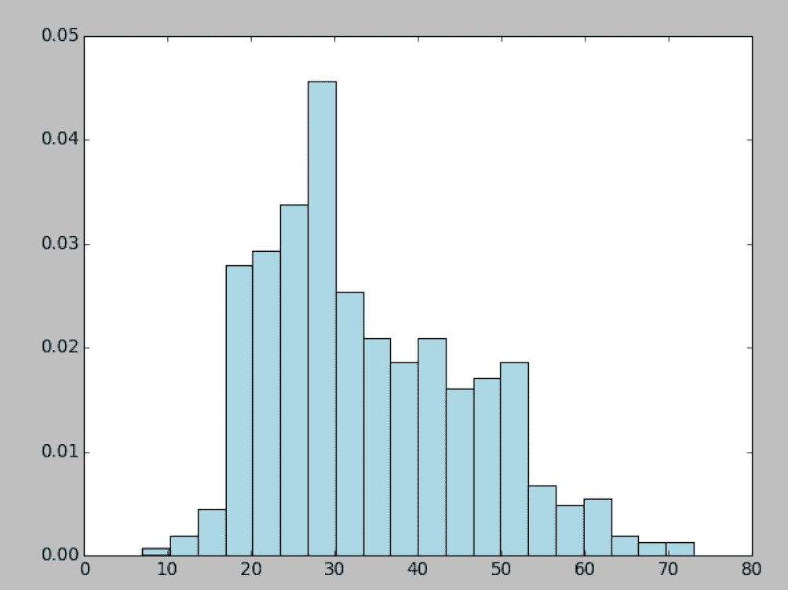

用户年龄的分布

对于 Scala 直方图图表，我们使用基于 JFreeChart 的库。我们将数据分成 16 个箱子来显示分布。

我们使用[`github.com/wookietreiber/scala-chart`](https://github.com/wookietreiber/scala-chart)库从 Scala 映射`m_sorted`创建条形图。

首先，我们使用`select("age")`函数从`userDataFrame`中提取`ages_array`。

然后，我们填充`mx` Map，这是用于显示的箱子。我们对 mx Map 进行排序以创建`ListMap`，然后用它来填充`DefaultCategorySet ds`：

```scala
val userDataFrame = Util.getUserFieldDataFrame() 
val ages_array = userDataFrame.select("age").collect() 

val min = 0 
val max = 80 
val bins = 16 
val step = (80/bins).toInt 
var mx = Map(0 ->0) 
for (i <- step until (max + step) by step) { 
  mx += (i -> 0) 
} 
for( x <- 0 until ages_array.length) { 
  val age = Integer.parseInt( 
    ages_array(x)(0).toString) 
  for(j <- 0 until (max + step) by step) { 
    if(age >= j && age < (j + step)){ 
      mx = mx + (j -> (mx(j) + 1)) 
    } 
  } 
} 

val mx_sorted =  ListMap(mx.toSeq.sortBy(_._1):_*) 
val ds = new org.jfree.data.category.DefaultCategoryDataset 
mx_sorted.foreach{ case (k,v) => ds.addValue(v,"UserAges", k)} 
val chart = ChartFactories.BarChart(ds) 
chart.show() 
Util.sc.stop()

```

完整的代码可以在`UserAgesChart.scala`文件中找到，并在此处列出：

在此处找到代码清单：[`github.com/ml-resources/spark-ml/blob/branch-ed2/Chapter_04/scala/2.0.0/src/main/scala/org/sparksamples/UserAgesChart.scala`](https://github.com/ml-resources/spark-ml/blob/branch-ed2/Chapter_04/scala/2.0.0/src/main/scala/org/sparksamples/UserAgesChart.scala)

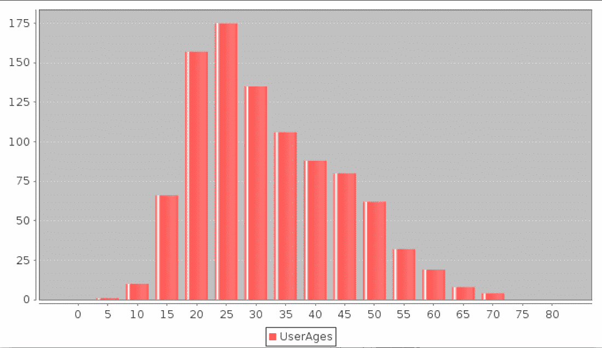

# 按职业计数

我们统计用户各种职业的数量。

实施以下步骤以获取职业 DataFrame 并填充列表，然后使用 Matplotlib 显示。

1.  获取`user_data`。

1.  使用`groupby("occupation")`提取职业计数并对其调用`count()`。

1.  从行列表中提取`tuple("occupation","count")`的列表。

1.  创建`x_axis`和`y_axis`中的值的`numpy`数组。

1.  创建类型为 bar 的图表。

1.  显示图表。

完整的代码清单如下：

```scala
user_data = get_user_data() 
user_occ = user_data.groupby("occupation").count().collect() 

user_occ_len = len(user_occ) 
user_occ_list = [] 
for i in range(0, (user_occ_len - 1)): 
element = user_occ[i] 
count = element. __getattr__('count') 
tup = (element.occupation, count) 
    user_occ_list.append(tup) 

x_axis1 = np.array([c[0] for c in user_occ_list]) 
y_axis1 = np.array([c[1] for c in user_occ_list]) 
x_axis = x_axis1[np.argsort(y_axis1)] 
y_axis = y_axis1[np.argsort(y_axis1)] 

pos = np.arange(len(x_axis)) 
width = 1.0 

ax = plt.axes() 
ax.set_xticks(pos + (width / 2)) 
ax.set_xticklabels(x_axis) 

plt.bar(pos, y_axis, width, color='lightblue') 
plt.xticks(rotation=30) 
fig = matplotlib.pyplot.gcf() 
fig.set_size_inches(20, 10) 
plt.show()

```

您生成的图像应该看起来像这里的图像。看起来最普遍的职业是**学生**，**其他**，**教育工作者**，**管理员**，**工程师**和**程序员**。

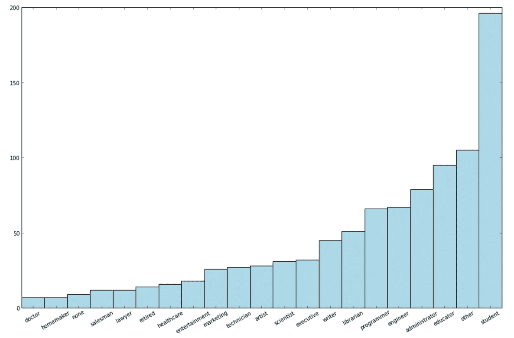

用户职业分布

在此处找到代码清单：[`github.com/ml-resources/spark-ml/blob/branch-ed2/Chapter_04/python/2.0.0/com/sparksamples/plot_user_occupations.py`](https://github.com/ml-resources/spark-ml/blob/branch-ed2/Chapter_04/python/2.0.0/com/sparksamples/plot_user_occupations.py)

在 Scala 中，我们按以下步骤进行操作：

1.  首先获取`userDataFrame`

1.  我们提取职业列：

```scala
        userDataFrame.select("occupation")

```

1.  按职业对行进行分组：

```scala
        val occupation_groups =
          userDataFrame.groupBy("occupation").count()

```

1.  按计数对行进行排序：

```scala
        val occupation_groups_sorted = 
          occupation_groups.sort("count")

```

1.  从`occupation_groups_collection`中填充默认类别集 ds

1.  显示 Jfree Bar Chart

完整的代码清单如下：

```scala
        val userDataFrame = Util.getUserFieldDataFrame() 
        val occupation = userDataFrame.select("occupation") 
        val occupation_groups = 
         userDataFrame.groupBy("occupation").count() 
        val occupation_groups_sorted = occupation_groups.sort("count") 
        occupation_groups_sorted.show() 
        val occupation_groups_collection = 
         occupation_groups_sorted.collect() 

        val ds = new org.jfree.data.category.DefaultCategoryDataset 
        val mx = scala.collection.immutable.ListMap() 

        for( x <- 0 until occupation_groups_collection.length) { 
          val occ = occupation_groups_collection(x)(0) 
          val count = Integer.parseInt(
            occupation_groups_collection(x)(1).toString) 
          ds.addValue(count,"UserAges", occ.toString) 
        } 

        val chart = ChartFactories.BarChart(ds) 
        val font = new Font("Dialog", Font.PLAIN,5); 

        chart.peer.getCategoryPlot.getDomainAxis(). 
        setCategoryLabelPositions(CategoryLabelPositions.UP_90); 
        chart.peer.getCategoryPlot.getDomainAxis.setLabelFont(font) 
        chart.show() 
        Util.sc.stop()

```

此代码的输出如下所示：

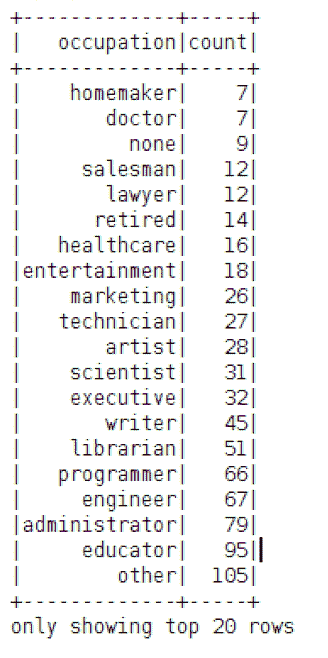

以下图显示了从先前源代码生成的 JFreeChart：

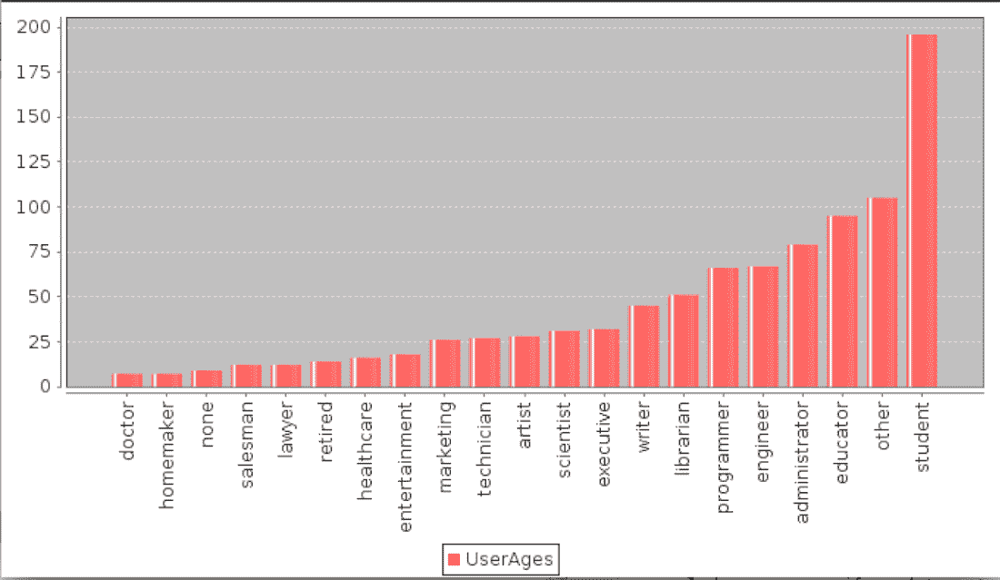

在此处找到代码清单：[`github.com/ml-resources/spark-ml/blob/branched2/Chapter_04/scala/2.0.0/src/main/scala/org/sparksamples/UserOccupationChart.scala`](https://github.com/ml-resources/spark-ml/blob/branched2/Chapter_04/scala/2.0.0/src/main/scala/org/sparksamples/UserOccupationChart.scala)

# 电影数据集

接下来，我们将调查电影目录的一些属性。我们可以检查电影数据文件的一行，就像我们之前对用户数据所做的那样，然后计算电影的数量：

我们将通过使用格式`com.databrick.spark.csv`进行解析并给出`|`分隔符来创建电影数据的 DataFrame。然后，我们使用`CustomSchema`来填充 DataFrame 并返回它：

```scala
def getMovieDataDF() : DataFrame = { 
  val customSchema = StructType(Array( 
  StructField("id", StringType, true), 
  StructField("name", StringType, true), 
  StructField("date", StringType, true), 
  StructField("url", StringType, true))); 
  val movieDf = spark.read.format(
    "com.databricks.spark.csv") 
     .option("delimiter", "|").schema(customSchema) 
     .load(PATH_MOVIES) 
  return movieDf 
}

```

然后从`MovieData` Scala 对象调用此方法。

实施以下步骤以过滤日期并将其格式化为`Year`：

1.  创建一个临时视图。

1.  使用`SparkSession`.`Util.spark`将函数`Util.convertYear`注册为 UDF（这是我们的自定义类）。

1.  在此`SparkSession`上执行 SQL，如下所示。

1.  将生成的 DataFrame 按`Year`分组并调用`count()`函数。

逻辑的完整代码清单如下：

```scala
def getMovieYearsCountSorted(): scala.Array[(Int,String)] = { 
  val movie_data_df = Util.getMovieDataDF() 
  movie_data_df.createOrReplaceTempView("movie_data") 
  movie_data_df.printSchema() 

  Util.spark.udf.register("convertYear", Util.convertYear _) 
  movie_data_df.show(false) 

  val movie_years = Util.spark.sql(
    "select convertYear(date) as year from movie_data") 
  val movie_years_count = movie_years.groupBy("year").count() 
  movie_years_count.show(false) 
  val movie_years_count_rdd = movie_years_count.rdd.map(
   row => (Integer.parseInt(row(0).toString), row(1).toString)) 
  val movie_years_count_collect = movie_years_count_rdd.collect() 
  val movie_years_count_collect_sort = 
  movie_years_count_collect.sortBy(_._1) 
} 

def main(args: Array[String]) { 
  val movie_years = MovieData.getMovieYearsCountSorted() 
  for( a <- 0 to (movie_years.length -1)){ 
    print(movie_years(a)) 
  } 
}

```

输出将与此处显示的类似：

```scala
(1900,1)
(1922,1)
(1926,1)
(1930,1)
(1931,1)
(1932,1)
(1933,2)
(1934,4)
(1935,4)
(1936,2)
(1937,4)
(1938,3)
(1939,7)
(1940,8)
(1941,5)
(1942,2)
(1943,4)
(1944,5)
(1945,4)
(1946,5)
(1947,5)
(1948,3)
(1949,4)
(1950,7)
(1951,5)
(1952,3)
(1953,2)
(1954,7)
(1955,5)
(1956,4)
(1957,8)
(1958,9)
(1959,4)
(1960,5)
(1961,3)
(1962,5)
(1963,6)
(1964,2)
(1965,5)
(1966,2)
(1967,5)
(1968,6)
(1969,4)
(1970,3)
(1971,7)
(1972,3)
(1973,4)
(1974,8)
(1975,6)
(1976,5)
(1977,4)
(1978,4)
(1979,9)
(1980,8)
(1981,12)
(1982,13)
(1983,5)
(1984,8)
(1985,7)
(1986,15)
(1987,13)
(1988,11)
(1989,15)
(1990,24)
(1991,22)
(1992,37)
(1993,126)
(1994,214)
(1995,219)
(1996,355)
(1997,286)
(1998,65)

```

在此处找到代码清单：[`github.com/ml-resources/spark-ml/blob/branch-ed2/Chapter_04/scala/2.0.0/src/main/scala/org/sparksamples/MovieData.scala`](https://github.com/ml-resources/spark-ml/blob/branch-ed2/Chapter_04/scala/2.0.0/src/main/scala/org/sparksamples/MovieData.scala)

接下来，我们绘制先前创建的电影收藏年龄的图表。我们在 Scala 中使用 JFreeChart，并从`MovieData.getMovieYearsCountSorted()`创建的收藏中填充`org.jfree.data.category.DefaultCategoryDataset`。

```scala
object MovieAgesChart { 
  def main(args: Array[String]) { 
    val movie_years_count_collect_sort =            
    MovieData.getMovieYearsCountSorted() 

    val ds = new 
      org.jfree.data.category.DefaultCategoryDataset 
    for(i <- movie_years_count_collect_sort){ 
      ds.addValue(i._2.toDouble,"year", i._1) 
    } 
    val  chart = ChartFactories.BarChart(ds) 
    chart.show() 
    Util.sc.stop() 
  } 
}

```

请注意，大多数电影来自 1996 年。创建的图表如下所示：

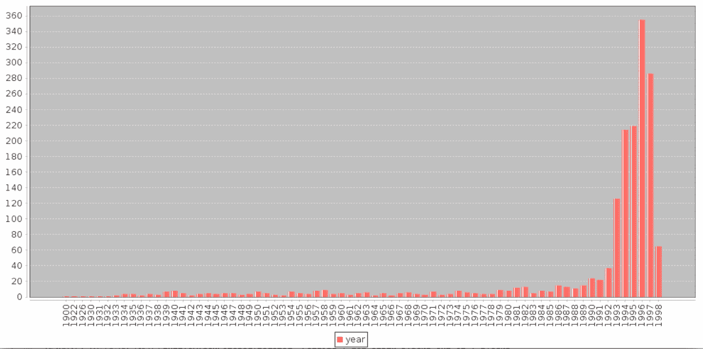

电影年龄分布

在此处找到代码清单：[`github.com/ml-resources/spark-ml/blob/branch-ed2/Chapter_04/scala/2.0.0/src/main/scala/org/sparksamples/MovieAgesChart.scala`](https://github.com/ml-resources/spark-ml/blob/branch-ed2/Chapter_04/scala/2.0.0/src/main/scala/org/sparksamples/MovieAgesChart.scala)

# 探索评分数据集

现在让我们来看一下评分数据：

代码位于`RatingData`下：

```scala
object RatingData { 
  def main(args: Array[String]) { 
    val customSchema = StructType(Array( 
      StructField("user_id", IntegerType, true), 
      StructField("movie_id", IntegerType, true), 
      StructField("rating", IntegerType, true), 
      StructField("timestamp", IntegerType, true))) 

    val spConfig = (new SparkConf).setMaster("local").
      setAppName("SparkApp") 
    val spark = SparkSession.builder() 
      .appName("SparkRatingData").config(spConfig) 
      .getOrCreate() 

    val rating_df = spark.read.format("com.databricks.spark.csv") 
     .option("delimiter", "t").schema(customSchema) 
     .load("../../data/ml-100k/u.data") 
    rating_df.createOrReplaceTempView("df") 
    val num_ratings = rating_df.count() 
    val num_movies = Util.getMovieDataDF().count() 
    val first = rating_df.first() 
    println("first:" + first) 
    println("num_ratings:" + num_ratings) 
  } 
}

```

上述代码的输出如下所示：

```scala
First: 196 242 3 881250949
num_ratings:100000

```

有 100,000 个评分，与用户和电影数据集不同，这些记录是用制表符（`"t"`）分隔的。正如你可能已经猜到的，我们可能想要计算一些基本的摘要统计和评分值的频率直方图。让我们现在来做这个。

数据被分开了。正如你可能已经猜到的，我们可能想要计算一些基本的摘要统计和评分值的频率直方图。让我们现在来做这个：）。正如你可能已经猜到的，我们可能想要计算一些基本的摘要统计和评分值的频率直方图。让我们现在来做这个：

我们将计算最大、最小和平均评分。我们还将计算每个用户和每部电影的评分。我们正在使用 Spark SQL 来提取电影评分的最大、最小和平均值。

```scala
val max = Util.spark.sql("select max(rating)  from df") 
max.show() 

val min = Util.spark.sql("select min(rating)  from df") 
min.show() 

val avg = Util.spark.sql("select avg(rating)  from df") 
avg.show()

```

上述代码的输出如下所示：

```scala
+----------------+
|.  max(rating)  |
+----------------+
|              5 |
+----------------+

+----------------+
|.  min(rating)  |
+----------------+
|              1 |
+----------------+

+-----------------+
|.  avg(rating)   |
+-----------------+
|         3.52986 |
+-----------------+

```

在此处找到代码清单：[`github.com/ml-resources/spark-ml/blob/branch-ed2/Chapter_04/scala/2.0.0/src/main/scala/org/sparksamples/RatingData.scala`](https://github.com/ml-resources/spark-ml/blob/branch-ed2/Chapter_04/scala/2.0.0/src/main/scala/org/sparksamples/RatingData.scala)

# 评分计数条形图

从结果来看，用户对电影的平均评分大约为 3.5，因此我们可能期望评分的分布会偏向稍高的评分。让我们通过使用与职业相似的过程创建一个评分值的条形图来看看这是否成立。

绘制评分与计数的代码如下所示。这在文件`CountByRatingChart.scala`中可用：

```scala
object CountByRatingChart { 
  def main(args: Array[String]) { 
    val customSchema = StructType(Array( 
      StructField("user_id", IntegerType, true), 
      StructField("movie_id", IntegerType, true), 
      StructField("rating", IntegerType, true), 
      StructField("timestamp", IntegerType, true))) 

   val  spConfig = (new SparkConf).setMaster("local").
     setAppName("SparkApp") 
   val  spark = SparkSession 
      .builder() 
      .appName("SparkRatingData").config(spConfig) 
      .getOrCreate() 
   val rating_df = spark.read.format("com.databricks.spark.csv") 
      .option("delimiter", "t").schema(customSchema) 

   val rating_df_count = rating_df.groupBy("rating").
     count().sort("rating") 

   rating_df_count.show() 
   val rating_df_count_collection = rating_df_count.collect() 

   val ds = new org.jfree.data.category.DefaultCategoryDataset 
   val mx = scala.collection.immutable.ListMap() 

   for( x <- 0 until rating_df_count_collection.length) { 
      val occ = rating_df_count_collection(x)(0) 
      val count = Integer.parseInt( 
        rating_df_count_collection(x)(1).toString) 
      ds.addValue(count,"UserAges", occ.toString) 
    } 

    val chart = ChartFactories.BarChart(ds) 
    val font = new Font("Dialog", Font.PLAIN,5); 
    chart.peer.getCategoryPlot.getDomainAxis(). 
    setCategoryLabelPositions(CategoryLabelPositions.UP_90); 
    chart.peer.getCategoryPlot.getDomainAxis.setLabelFont(font) 
    chart.show() 
    Util.sc.stop() 
  } 
}

```

在执行上一个代码后，您将得到以下条形图：

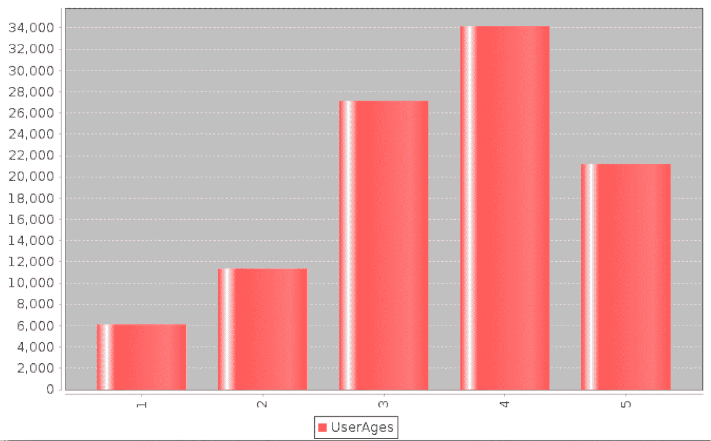

# 评分数量的分布

我们还可以查看每个用户所做评分的分布。回想一下，我们之前通过使用制表符分割评分来计算了上述代码中使用的`rating_data` RDD。我们现在将在下面的代码中再次使用`rating_data`变量。

代码位于`UserRatingChart`类中。我们将从`u.data`文件创建一个 DataFrame，该文件是以制表符分隔的，然后按每个用户给出的评分数量进行分组并按升序排序。

```scala
object UserRatingsChart { 
  def main(args: Array[String]) { 

  } 
}

```

让我们首先尝试显示评分。

```scala
val customSchema = StructType(Array( 
  StructField("user_id", IntegerType, true), 
  StructField("movie_id", IntegerType, true), 
  StructField("rating", IntegerType, true), 
  StructField("timestamp", IntegerType, true))) 

val spConfig = (new      
    SparkConf).setMaster("local").setAppName("SparkApp") 
val spark = SparkSession 
   .builder() 
   .appName("SparkRatingData").config(spConfig) 
   .getOrCreate() 

val rating_df = spark.read.format("com.databricks.spark.csv") 
   .option("delimiter", "t").schema(customSchema) 
   .load("../../data/ml-100k/u.data") 

val rating_nos_by_user =       
    rating_df.groupBy("user_id").count().sort("count") 
val ds = new org.jfree.data.category.DefaultCategoryDataset 
  rating_nos_by_user.show(rating_nos_by_user.collect().length)

```

上述代码的输出如下所示：

```scala
+-------+-----+
|user_id|count|
+-------+-----+
|    636|   20|
|    572|   20|
|    926|   20|
|    824|   20|
|    166|   20|
|    685|   20|
|    812|   20|
|    418|   20|
|    732|   20|
|    364|   20|
....
 222|  387|
|    293|  388|
|     92|  388|
|    308|  397|
|    682|  399|
|     94|  400|
|      7|  403|
|    846|  405|
|    429|  414|
|    279|  434|
|    181|  435|
|    393|  448|
|    234|  480|
|    303|  484|
|    537|  490|
|    416|  493|
|    276|  518|
|    450|  540|
|     13|  636|
|    655|  685|
|    405|  737|
+-------+-----+

```

在以文本方式显示数据后，让我们通过从`rating_nos_by_user DataFrame`中加载数据到`DefaultCategorySet`来使用 JFreeChart 显示数据。

```scala
val step = (max/bins).toInt 
for(i <- step until (max + step) by step) { 
  mx += (i -> 0); 
} 
for( x <- 0 until rating_nos_by_user_collect.length) { 
  val user_id =
    Integer.parseInt(rating_nos_by_user_collect(x)(0).toString) 
  val count = 
    Integer.parseInt(rating_nos_by_user_collect(x)(1).toString) 
  ds.addValue(count,"Ratings", user_id) 
} 

val chart = ChartFactories.BarChart(ds) 
chart.peer.getCategoryPlot.getDomainAxis().setVisible(false) 

chart.show() 
Util.sc.stop()

```

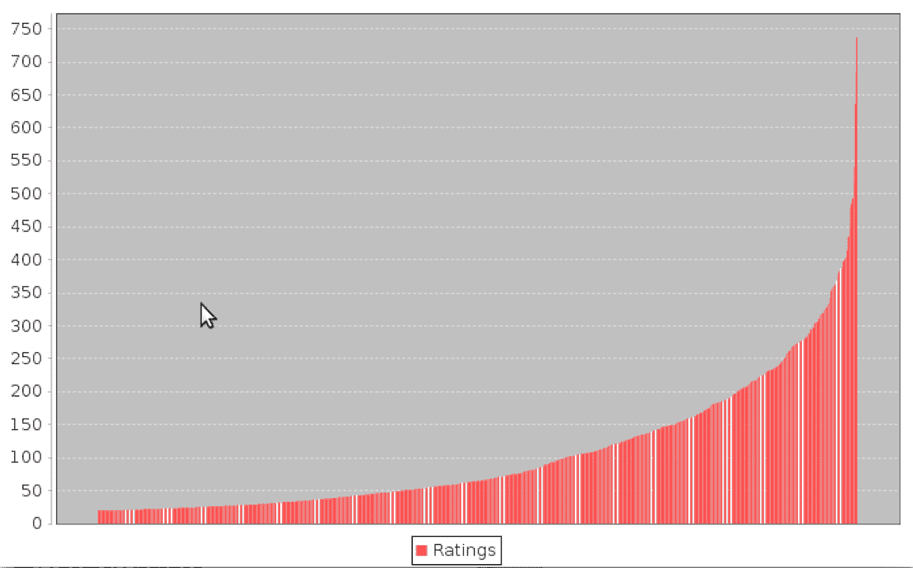

在前面的图表中，x 轴是用户 ID，y 轴是评分数量，从最低的 20 到最高的 737 不等。

# 处理和转换您的数据

为了使原始数据可用于机器学习算法，我们首先需要清理数据，并可能以各种方式对其进行转换，然后从转换后的数据中提取有用的特征。转换和特征提取步骤是密切相关的，在某些情况下，某些转换本身就是特征提取的一种情况。

我们已经看到了在电影数据集中清理数据的需要的一个例子。一般来说，现实世界的数据集包含不良数据、缺失数据点和异常值。理想情况下，我们会纠正不良数据；然而，这通常是不可能的，因为许多数据集来自某种不能重复的收集过程（例如在 Web 活动数据和传感器数据中的情况）。缺失值和异常值也很常见，可以以类似于不良数据的方式处理。总的来说，广泛的选择如下：

+   **过滤或删除具有不良或缺失值的记录**：有时是不可避免的；然而，这意味着丢失不良或缺失记录的好部分。

+   填补坏数据或缺失数据：我们可以尝试根据我们可用的其余数据为坏数据或缺失数据分配一个值。方法可以包括分配零值，分配全局均值或中位数，插值附近或类似的数据点（通常在时间序列数据集中），等等。决定正确的方法通常是一个棘手的任务，取决于数据、情况和个人经验。

+   对异常值应用健壮的技术：异常值的主要问题在于它们可能是正确的值，即使它们是极端的。它们也可能是错误的。很难知道你正在处理哪种情况。异常值也可以被移除或填充，尽管幸运的是，有统计技术（如健壮回归）来处理异常值和极端值。

+   对潜在异常值应用转换：另一种处理异常值或极端值的方法是应用转换，比如对具有潜在异常值或显示潜在值范围较大的特征应用对数或高斯核转换。这些类型的转换可以减弱变量规模的大幅变化对结果的影响，并将非线性关系转换为线性关系。

# 填补坏数据或缺失数据

让我们看一下电影评论的年份并清理它。

我们已经看到了一个过滤坏数据的例子。在前面的代码之后，以下代码片段将填充方法应用于坏的发布日期记录，将空字符串分配为 1900（稍后将被中位数替换）：

```scala
Util.spark.udf.register("convertYear", Util.convertYear _) 
movie_data_df.show(false) 

val movie_years = Util.spark.sql("select convertYear(date) as year from   movie_data") 

movie_years.createOrReplaceTempView("movie_years") 
Util.spark.udf.register("replaceEmptyStr", replaceEmptyStr _) 

val years_replaced =  Util.spark.sql("select replaceEmptyStr(year) 
  as r_year from movie_years")

```

在前面的代码中，我们使用了此处描述的`replaceEmtryStr`函数：

```scala
def replaceEmptyStr(v : Int): Int = { 
  try { 
    if(v.equals("") ) { 
      return 1900 
    } else { 
      returnv 
    } 
  }catch{ 
    case e: Exception => println(e) 
     return 1900 
  } 
}

```

接下来，我们提取不是 1900 年的经过筛选的年份，将`Array[Row]`替换为`Array[int]`并计算各种指标：

+   条目的总和

+   条目的总数

+   年份的平均值

+   年份的中位数

+   转换后的总年数

+   1900 的计数

```scala
val movie_years_filtered = movie_years.filter(x =>(x == 1900) ) 
val years_filtered_valid = years_replaced.filter(x => (x != 
  1900)).collect() 
val years_filtered_valid_int = new 
  ArrayInt 
for( i <- 0 until years_filtered_valid.length -1){ 
val x = Integer.parseInt(years_filtered_valid(i)(0).toString) 
  years_filtered_valid_int(i) = x 
} 
val years_filtered_valid_int_sorted = 
  years_filtered_valid_int.sorted 

val years_replaced_int = new Array[Int] 
  (years_replaced.collect().length) 

val years_replaced_collect = years_replaced.collect() 

for( i <- 0 until years_replaced.collect().length -1){ 
  val x = Integer.parseInt(years_replaced_collect(i)(0).toString) 
  years_replaced_int(i) = x 
} 

val years_replaced_rdd = Util.sc.parallelize(years_replaced_int) 

val num = years_filtered_valid.length 
var sum_y = 0 
years_replaced_int.foreach(sum_y += _) 
println("Total sum of Entries:"+ sum_y) 
println("Total No of Entries:"+ num) 
val mean = sum_y/num 
val median_v = median(years_filtered_valid_int_sorted) 
Util.sc.broadcast(mean) 
println("Mean value of Year:"+ mean) 
println("Median value of Year:"+ median_v) 
val years_x = years_replaced_rdd.map(v => replace(v , median_v)) 
println("Total Years after conversion:"+ years_x.count()) 
var count = 0 
Util.sc.broadcast(count) 
val years_with1900 = years_x.map(x => (if(x == 1900) {count +=1})) 
println("Count of 1900: "+ count)

```

前面代码的输出如下；替换为中位数后带有`1900`的值表明我们的处理是成功的

```scala
Total sum of Entries:3344062
Total No of Entries:1682
Mean value of Year:1988
Median value of Year:1995
Total Years after conversion:1682
Count of 1900: 0
Count of 1900: 0

```

在此处查找代码列表：[`github.com/ml-resources/spark-ml/blob/branch-ed2/Chapter_04/scala/2.0.0/src/main/scala/org/sparksamples/MovieDataFillingBadValues.scala`](https://github.com/ml-resources/spark-ml/blob/branch-ed2/Chapter_04/scala/2.0.0/src/main/scala/org/sparksamples/MovieDataFillingBadValues.scala)

我们在这里计算了发布年份的均值和中位数。从输出中可以看出，中位数发布年份要高得多，因为年份的分布是倾斜的。虽然要准确决定在给定情况下使用哪个填充值并不总是直截了当的，但在这种情况下，由于这种偏斜，使用中位数是可行的。

注意，前面的代码示例严格来说不太可扩展，因为它需要将所有数据收集到驱动程序中。我们可以使用 Spark 的`mean`函数来计算数值 RDD 的均值，但目前没有中位数函数可用。我们可以通过创建自己的函数或使用`sample`函数创建的数据集样本来计算中位数来解决这个问题（我们将在接下来的章节中看到更多）。

# 从数据中提取有用的特征

数据清理完成后，我们准备从数据中提取实际特征，用于训练机器学习模型。

“特征”是我们用来训练模型的变量。每一行数据包含我们想要提取为训练示例的信息。

几乎所有的机器学习模型最终都是基于数字表示形式的向量进行工作；因此，我们需要将原始数据转换为数字。

特征大致分为几类，如下所示：

+   **数值特征**：这些特征通常是实数或整数，例如我们之前使用的用户年龄。

+   **分类特征**：这些特征指的是变量在任何给定时间可以取一组可能状态中的一个。我们数据集中的示例可能包括用户的性别或职业，或电影类别。

+   **文本特征**：这些是从数据中的文本内容派生出来的特征，例如电影标题、描述或评论。

+   **其他特征**：大多数其他类型的特征最终都以数值形式表示。例如，图像、视频和音频可以表示为一组数值数据。地理位置可以表示为纬度和经度或地理哈希数据。

在这里，我们将涵盖数值、分类和文本特征。

# 数值特征

任何普通数字和数值特征之间有什么区别？实际上，任何数值数据都可以用作输入变量。然而，在机器学习模型中，您会了解每个特征的权重向量。这些权重在将特征值映射到结果或目标变量（在监督学习模型的情况下）中起着作用。

因此，我们希望使用有意义的特征，即模型可以学习特征值和目标变量之间的关系的特征。例如，年龄可能是一个合理的特征。也许增长年龄和某个结果之间存在直接关系。同样，身高是一个可以直接使用的数值特征的很好的例子。

我们经常会看到，数值特征在其原始形式下不太有用，但可以转化为更有用的表示。位置就是这样一个例子。

使用原始位置（比如纬度和经度）可能并不那么有用，除非我们的数据确实非常密集，因为我们的模型可能无法学习原始位置和结果之间的有用关系。然而，某种聚合或分箱表示的位置（例如城市或国家）与结果之间可能存在关系。

# 分类特征

分类特征不能以其原始形式用作输入，因为它们不是数字；相反，它们是变量可以取的一组可能值的成员。在前面提到的示例中，用户职业是一个可以取学生、程序员等值的分类变量。

为了将分类变量转换为数值表示，我们可以使用一种常见的方法，称为**1-of-k**编码。需要使用 1-of-k 编码这样的方法来表示。

需要使用 1-of-k 编码这样的方法来表示名义变量，使其对机器学习任务有意义。有序变量可能以其原始形式使用，但通常以与名义变量相同的方式进行编码。

假设变量可以取 k 个可能的值。如果我们为每个可能的值分配一个从 1 到 k 的索引，那么我们可以使用长度为 k 的二进制向量来表示变量的给定状态；在这里，除了对应于给定变量状态的索引处的条目设置为 1 之外，所有条目都为零。

例如，学生是[0]，程序员是[1]

因此，值为：

学生变成[1,0]

程序员变成[0,1]

提取两个职业的二进制编码，然后创建长度为 21 的二进制特征向量：

```scala
val ratings_grouped = rating_df.groupBy("rating") 
ratings_grouped.count().show() 
val ratings_byuser_local = rating_df.groupBy("user_id").count() 
val count_ratings_byuser_local = ratings_byuser_local.count() 
ratings_byuser_local.show(ratings_byuser_local.collect().length) 
val movie_fields_df = Util.getMovieDataDF() 
val user_data_df = Util.getUserFieldDataFrame() 
val occupation_df = user_data_df.select("occupation").distinct() 
occupation_df.sort("occupation").show() 
val occupation_df_collect = occupation_df.collect() 

var all_occupations_dict_1:Map[String, Int] = Map() 
var idx = 0; 
// for loop execution with a range 
for( idx <- 0 to (occupation_df_collect.length -1)){ 
  all_occupations_dict_1 += 
    occupation_df_collect(idx)(0).toString() -> idx 
} 

println("Encoding of 'doctor : " + 
 all_occupations_dict_1("doctor")) 
println("Encoding of 'programmer' : " + 
 all_occupations_dict_1("programmer"))

```

前面`println`语句的输出如下：

```scala
Encoding of 'doctor : 20
Encoding of 'programmer' : 5

var k = all_occupations_dict_1.size 
var binary_x = DenseVector.zerosDouble 
var k_programmer = all_occupations_dict_1("programmer") 
binary_x(k_programmer) = 1 
println("Binary feature vector: %s" + binary_x) 
println("Length of binary vector: " + k)

```

前面命令的输出，显示了二进制特征向量和二进制向量的长度：

```scala
Binary feature vector: %sDenseVector(0.0, 0.0, 0.0, 0.0, 0.0, 1.0, 0.0, 0.0, 0.0, 0.0, 0.0, 0.0, 0.0, 0.0, 0.0, 0.0, 0.0, 0.0, 0.0, 0.0, 0.0)
Length of binary vector: 21

```

在此处查找代码清单：[`github.com/ml-resources/spark-ml/blob/branch-ed2/Chapter_04/scala/2.0.0/src/main/scala/org/sparksamples/RatingData.scala`](https://github.com/ml-resources/spark-ml/blob/branch-ed2/Chapter_04/scala/2.0.0/src/main/scala/org/sparksamples/RatingData.scala)

# 派生特征

正如我们之前提到的，通常有必要从一个或多个可用变量计算派生特征。我们希望派生特征可以提供比仅使用原始形式的变量更多的信息。

例如，我们可以计算每个用户对其评分的所有电影的平均评分。这将是一个特征，可以为我们的模型提供*用户特定*的截距（事实上，这是推荐模型中常用的方法）。我们已经从原始评分数据中创建了一个新特征，可以帮助我们学习更好的模型。

从原始数据派生特征的示例包括计算平均值、中位数、方差、总和、差异、最大值或最小值和计数。我们已经在创建`电影年龄`特征时看到了这种情况，该特征是从电影的发行年份和当前年份派生出来的。通常，使用这些转换的背后思想是以某种方式总结数值数据，这可能会使模型更容易学习特征，例如通过分箱特征。这些常见的示例包括年龄、地理位置和时间等变量。

# 将时间戳转换为分类特征

#### 提取一天中的时间

为了说明如何从数值数据中派生分类特征，我们将使用用户对电影的评分时间。从时间戳中提取日期和时间，然后提取一天中的`小时`。

我们需要一个函数来提取评分时间戳（以秒为单位）的`datetime`表示；我们现在将创建这个函数：从时间戳中提取日期和时间，然后提取一天中的`小时`。这将导致每个评分的一天中的小时的 RDD。

Scala

首先，我们定义一个函数，该函数从日期字符串中提取`currentHour`：

```scala
def getCurrentHour(dateStr: String) : Integer = { 
  var currentHour = 0 
  try { 
    val date = new Date(dateStr.toLong) 
    return int2Integer(date.getHours) 
  } catch { 
    case _ => return currentHour 
  } 
  return 1 
}

```

前面代码的输出如下：

```scala
Timestamps DataFrame is extracted from rating_df by creating a TempView df and running a select statement.

```

相关代码清单：

```scala
val customSchema = StructType(Array( 
StructField("user_id", IntegerType, true), 
StructField("movie_id", IntegerType, true), 
StructField("rating", IntegerType, true), 
StructField("timestamp", IntegerType, true))) 

val spConfig = (new 
 SparkConf).setMaster("local").setAppName("SparkApp") 
val spark = SparkSession 
  .builder() 
  .appName("SparkRatingData").config(spConfig) 
  .getOrCreate() 

val rating_df = spark.read.format("com.databricks.spark.csv") 
  .option("delimiter", "t").schema(customSchema) 
  .load("../../data/ml-100k/u.data") 
rating_df.createOrReplaceTempView("df") 
Util.spark.udf.register("getCurrentHour", getCurrentHour _) 

val timestamps_df = 
 Util.spark.sql("select getCurrentHour(timestamp) as hour from 
 df") 
timestamps_df.show()

```

在以下链接找到代码清单：[`github.com/ml-resources/spark-ml/blob/branch-ed2/Chapter_04/scala/2.0.0/src/main/scala/org/sparksamples/RatingData.scala`](https://github.com/ml-resources/spark-ml/blob/branch-ed2/Chapter_04/scala/2.0.0/src/main/scala/org/sparksamples/RatingData.scala)

# 提取一天中的时间

我们已经将原始时间数据转换为表示给出评分的一天中的小时的分类特征。

现在，假设我们决定这是一个太粗糙的表示。也许我们想进一步完善转换。我们可以将每个一天中的小时值分配到表示一天中的时间的定义桶中。

例如，我们可以说早晨是从上午 7 点到上午 11 点，午餐是从上午 11 点到下午 1 点，依此类推。使用这些时间段，我们可以创建一个函数，根据输入的小时来分配一天中的时间。

Scala

在 Scala 中，我们定义一个函数，该函数以 24 小时制的绝对时间作为输入，并返回一天中的时间：`早晨`、`午餐`、`下午`、`晚上`或`夜晚`。

```scala
def assignTod(hr : Integer) : String = { 
if(hr >= 7 && hr < 12){ 
return"morning" 
}else if ( hr >= 12 && hr < 14) { 
return"lunch" 
  } else if ( hr>= 14 && hr < 18) { 
return"afternoon" 
  } else if ( hr>= 18 && hr.<(23)) { 
return"evening" 
  } else if ( hr>= 23 && hr <= 24) { 
return"night" 
  } else if (  hr< 7) { 
return"night" 
  } else { 
return"error" 
  } 
}

```

我们将此函数注册为 UDF，并在 select 调用中对 temp 视图时间戳进行调用。

```scala
Util.spark.udf.register("assignTod", assignTod _) 
timestamps_df.createOrReplaceTempView("timestamps") 
val tod = Util.spark.sql("select assignTod(hour) as tod from 
 timestamps") 
tod.show()

```

在以下链接找到代码清单：[`github.com/ml-resources/spark-ml/blob/branch-ed2/Chapter_04/scala/2.0.0/src/main/scala/org/sparksamples/RatingData.scala`](https://github.com/ml-resources/spark-ml/blob/branch-ed2/Chapter_04/scala/2.0.0/src/main/scala/org/sparksamples/RatingData.scala)

我们现在已经将时间戳变量（可以取数千个值，可能以原始形式对模型没有用）转换为小时（取 24 个值），然后转换为一天中的时间（取五个可能的值）。现在我们有了一个分类特征，我们可以使用之前概述的相同的 1-of-k 编码方法来生成一个二进制特征向量。

# 文本特征

在某种程度上，文本特征是一种分类和派生特征的形式。让我们以电影描述为例（我们的数据集中没有）。在这里，原始文本不能直接使用，即使作为分类特征，因为每个文本可能的值几乎是无限的。我们的模型几乎不会看到两次相同特征的出现，也无法有效学习。因此，我们希望将原始文本转换为更适合机器学习的形式，因为每个文本可能的值几乎是无限的。

处理文本的方法有很多种，自然语言处理领域致力于处理、表示和建模文本内容。全面的处理超出了本书的范围，但我们将介绍一种简单和标准的文本特征提取方法；这种方法被称为词袋模型表示。

词袋模型方法将文本内容视为文本中的单词和可能的数字的集合（这些通常被称为术语）。词袋模型的过程如下：

+   **分词**：首先，对文本应用某种形式的分词，将其分割成一组标记（通常是单词、数字等）。一个例子是简单的空格分词，它在每个空格上分割文本，并可能删除不是字母或数字的标点符号和其他字符。

+   **停用词去除**：接下来，通常会去除非常常见的词，比如"the"、"and"和"but"（这些被称为停用词）。

+   **词干提取**：下一步可以包括词干提取，指的是将一个词语减少到其基本形式或词干。一个常见的例子是复数变成单数（例如，dogs 变成 dog，等等）。有许多词干提取的方法，文本处理库通常包含各种词干提取算法，例如 OpenNLP、NLTK 等。详细介绍词干提取超出了本书的范围，但欢迎自行探索这些库。

+   **向量化**：最后一步是将处理后的术语转换为向量表示。最简单的形式可能是二进制向量表示，如果一个术语存在于文本中则赋值为 1，如果不存在则赋值为 0。这与我们之前遇到的分类 1-of-k 编码基本相同。与 1-of-k 编码一样，这需要一个术语字典，将给定的术语映射到索引号。你可能会发现，即使在停用词去除和词干提取之后，可能仍然有数百万个可能的术语。因此，使用稀疏向量表示计算`time.computetime.computetime.compute`时间变得至关重要。

在第十章中，*使用 Spark 进行高级文本处理*，我们将涵盖更复杂的文本处理和特征提取，包括加权术语的方法；这些方法超出了我们之前看到的基本二进制编码。

# 简单的文本特征提取

为了展示用二进制向量表示提取文本特征的示例，我们可以使用现有的电影标题。

首先，我们将创建一个函数，用于剥离每部电影的发行年份，如果有年份存在的话，只留下电影的标题。

我们将使用正则表达式，在电影标题中搜索括号之间的年份。如果我们找到与这个正则表达式匹配的内容，我们将仅提取标题直到第一个匹配的索引（即标题字符串中开括号的索引）。

Scala

首先，我们创建一个函数，该函数接受输入字符串并使用正则表达式过滤输出。

```scala
def processRegex(input:String):String= { 
  val pattern = "^[^(]*".r 
  val output = pattern.findFirstIn(input) 
  return output.get 
}

```

提取只有原始标题的 DataFrame 并创建一个名为`titles`的临时视图。使用 Spark 注册上面创建的函数，然后在`select`语句中对 DataFrame 运行它。

```scala
val raw_title = 
 org.sparksamples.Util.getMovieDataDF().select("name"
 raw_title.show() 
raw_title.createOrReplaceTempView("titles") 
Util.spark.udf.register("processRegex", processRegex _) 
val processed_titles = Util.spark.sql( 
"select processRegex(name) from titles") 
processed_titles.show() 
val titles_rdd = processed_titles.rdd.map(r => r(0).toString) 
titles_rdd.take(5).foreach(println)

```

前面代码的输出如下：

```scala
//Output of raw_title.show()
+--------------------+
|           UDF(name)|
+--------------------+
|          Toy Story |
|          GoldenEye |
|         Four Rooms |
|         Get Shorty |
|            Copycat |
|     Shanghai Triad |
|     Twelve Monkeys |
|               Babe |
|   Dead Man Walking |
|        Richard III |
|              Seven |
|Usual Suspects, The |
|   Mighty Aphrodite |
|        Postino, Il |
| Mr. Holland's Opus |
|       French Twist |
|From Dusk Till Dawn |
| White Balloon, The |
|     Antonia's Line |
| Angels and Insects |
+--------------------+

//titles_rdd.take(5).foreach(println)
Toy Story
GoldenEye
Four Rooms
Get Shorty
Copycat

```

然后，将我们的函数应用于原始标题，并对提取的标题应用标记化方案，将它们转换为术语，我们将使用我们之前介绍的简单的空格标记化：

接下来，我们将`titles`拆分成单词

```scala
val title_terms = titles_rdd.map(x => x.split("")) 
title_terms.take(5).foreach(_.foreach(println)) 
println(title_terms.count())

```

应用这种简单的标记化得到以下结果：

```scala
Toy
Story
GoldenEye
Four
Rooms
Get
Shorty
Copycat

```

然后，我们转换单词的 rdd 并找到单词的总数-我们得到总单词的集合以及`"Dead"`和`"Rooms"`的索引。

```scala
val all_terms_dic = new ListBuffer[String]() 
val all_terms = title_terms.flatMap(title_terms => title_terms).distinct().collect() 
for (term <- all_terms){ 
  all_terms_dic += term 
} 

println(all_terms_dic.length) 
println(all_terms_dic.indexOf("Dead")) 
println(all_terms_dic.indexOf("Rooms"))

```

这将导致以下输出：

```scala
Total number of terms: 2645
Index of term 'Dead': 147
Index of term 'Rooms': 1963

```

我们还可以使用 Spark 的`zipWithIndex`函数更有效地实现相同的结果。这个函数接受一个值的 RDD，并将它们与索引合并在一起，创建一个新的键值对 RDD，其中键将是术语，值将是术语字典中的索引。我们将使用`collectAsMap`将键值对 RDD 收集到驱动程序作为 Python `dict`方法：

Scala

```scala
val all_terms_withZip = title_terms.flatMap(title_terms =>
  title_terms).distinct().zipWithIndex().collectAsMap() 
println(all_terms_withZip.get("Dead")) 
println(all_terms_withZip.get("Rooms"))

```

输出如下：

```scala
Index of term 'Dead': 147
Index of term 'Rooms': 1963

```

# 标题的稀疏向量

最后一步是创建一个将一组术语转换为稀疏向量表示的函数。为此，我们将创建一个空的稀疏矩阵，其中有一行，列数等于字典中术语的总数。然后，我们将遍历输入术语列表中的每个术语，并检查该术语是否在我们的术语字典中。如果是，我们将在对应于字典映射中的术语的索引处为向量分配一个值`1`：

提取的术语：

Scala

```scala
def create_vector(title_terms:Array[String], 
  all_terms_dic:ListBuffer[String]): CSCMatrix[Int] = { 
  var idx = 0 
  val x = CSCMatrix.zerosInt 
  title_terms.foreach(i => { 
    if (all_terms_dic.contains(i)) { 
      idx = all_terms_dic.indexOf(i) 
      x.update(0, idx, 1) 
    } 
  }) 
  return x 
} 

val term_vectors = title_terms.map(title_terms =>
 create_vector(title_terms, all_terms_dic)) 
term_vectors.take(5).foreach(println)

```

然后，我们可以检查我们新的稀疏向量 RDD 的前几条记录：

```scala
1 x 2453 CSCMatrix
(0,622) 1
(0,1326) 1
1 x 2453 CSCMatrix
(0,418) 1
1 x 2453 CSCMatrix
(0,729) 1
(0,996) 1
1 x 2453 CSCMatrix
(0,433) 1
(0,1414) 1
1 x 2453 CSCMatrix
(0,1559) 1

```

在以下网址找到代码清单：[`github.com/ml-resources/spark-ml/blob/branch-ed2/Chapter_04/scala/2.0.0/src/main/scala/org/sparksamples/exploredataset/explore_movies.scala`](https://github.com/ml-resources/spark-ml/blob/branch-ed2/Chapter_04/scala/2.0.0/src/main/scala/org/sparksamples/exploredataset/explore_movies.scala)

我们可以看到，每个电影标题现在都被转换为稀疏向量。我们可以看到，我们提取了两个术语的标题在向量中有两个非零条目，我们只提取了一个术语的标题有一个非零条目，依此类推。

请注意在前面示例代码中使用了 Spark 的`broadcast`方法来创建一个包含术语字典的广播变量。在实际应用中，这样的术语字典可能非常庞大，因此不建议使用广播变量。

# 归一化特征

一旦特征被提取为向量的形式，常见的预处理步骤是对数值数据进行归一化。其背后的想法是以一种方式转换每个数值特征，使其缩放到标准大小。我们可以执行不同类型的归一化，如下所示：

+   归一化特征：这通常是应用于数据集中的单个特征的转换，例如，减去均值（使特征居中）或应用标准正态转换（使特征的平均值为零，标准差为 1）。

+   归一化特征向量：这通常是应用于数据集中给定行的所有特征的转换，使得结果特征向量具有归一化长度。也就是说，我们将确保向量中的每个特征都被缩放，使得向量的范数为 1（通常是在 L1 或 L2 范数上）。

我们将以第二种情况为例。我们可以使用`numpy`的`norm`函数通过首先计算随机向量的 L2 范数，然后将向量中的每个元素除以这个范数来实现向量归一化：

```scala
//val vector = DenseVector.rand(10) 
val vector = DenseVector(0.49671415, -0.1382643, 
0.64768854,1.52302986, -0.23415337, -0.23413696, 1.57921282, 
  0.76743473, -0.46947439, 0.54256004) 
val norm_fact = norm(vector) 
val vec = vector/norm_fact 
println(norm_fact) 
println(vec)

```

前面代码的输出如下：

```scala
2.5908023998401077
DenseVector(0.19172212826059407, -0.053367366036303286, 
 0.24999534508690138, 0.5878602938201672, -0.09037870661786127, -
 0.09037237267282516, 0.6095458380374597, 0.2962150760889223, -
 0.18120810372453483, 0.20941776186153152)

```

# 使用 ML 进行特征归一化

Spark 在其机器学习库中提供了一些内置函数用于特征缩放和标准化。这些包括`StandardScaler`，它应用标准正态转换，以及`Normalizer`，它应用我们在前面示例代码中展示的相同特征向量归一化。

我们将在接下来的章节中探讨这些方法的使用，但现在，让我们简单比较一下使用 MLlib 的`Normalizer`和我们自己的结果：

```scala
from pyspark.mllib.feature import Normalizer 
normalizer = Normalizer() 
vector = sc.parallelize([x])

```

在导入所需的类之后，我们将实例化`Normalizer`（默认情况下，它将使用 L2 范数，就像我们之前做的那样）。请注意，在 Spark 的大多数情况下，我们需要为`Normalizer`提供 RDD 作为输入（它包含`numpy`数组或 MLlib 向量）；因此，我们将从我们的向量`x`创建一个单元素 RDD，以便说明目的。

然后，我们将在 RDD 上使用`Normalizer`的`transform`函数。由于 RDD 中只有一个向量，我们将通过调用`first`将我们的向量返回给驱动程序，最后通过调用`toArray`函数将向量转换回`numpy`数组：

```scala
normalized_x_mllib = 
  normalizer.transform(vector).first().toArray()

```

最后，我们可以打印出与之前相同的细节，比较结果：

```scala
print"x:n%s" % x 
print"2-Norm of x: %2.4f" % norm_x_2 
print"Normalized x MLlib:n%s" % normalized_x_mllib 
print"2-Norm of normalized_x_mllib: %2.4f" % 
 np.linalg.norm(normalized_x_mllib)

```

您将得到与我们自己的代码完全相同的归一化向量。但是，使用 MLlib 的内置方法肯定比编写我们自己的函数更方便和高效！等效的 Scala 实现如下：

```scala
object FeatureNormalizer { 
  def main(args: Array[String]): Unit = { 
    val v = Vectors.dense(0.49671415, -0.1382643, 0.64768854, 
      1.52302986, -0.23415337, -0.23413696, 1.57921282, 
      0.76743473, -0.46947439, 0.54256004) 
    val normalizer = new Normalizer(2) 
    val norm_op = normalizer.transform(v) 
    println(norm_op) 
  } 
}

```

前面代码的输出如下：

```scala
[0.19172212826059407,-
 0.053367366036303286,0.24999534508690138,0.5878602938201672,-
 0.09037870661786127,-
 0.09037237267282516,0.6095458380374597,0.2962150760889223,-
 0.18120810372453483,0.20941776186153152]

```

# 使用特征提取包

虽然每次都从这些常见任务中获得。当然，我们可以为此目的创建自己的可重用代码库；但是，幸运的是，我们可以依赖现有的工具和包。由于 Spark 支持 Scala、Java 和 Python 绑定，我们可以使用这些语言中提供的包，这些包提供了处理和提取特征并将其表示为向量的复杂工具。一些用于特征提取的包的示例包括 Python 中的`scikit-learn`、`gensim`、`scikit-image`、`matplotlib`和`NLTK`，Java 中的`OpenNLP`，以及 Scala 中的`Breeze`和`Chalk`。实际上，自从 1.0 版本以来，`Breeze`一直是 Spark MLlib 的一部分，我们将在后面的章节中看到如何使用一些 Breeze 功能进行线性代数。

# TFID

**tf-idf**是**术语频率-逆文档频率**的简称。它是一个数值统计量，旨在反映一个词对于集合或语料库中的文档的重要性。它在信息检索和文本挖掘中用作加权因子。tf-idf 值与单词在文档中出现的次数成比例增加。它受到语料库中单词频率的影响，有助于调整一些在一般情况下更频繁出现的单词。

tf-idf 被搜索引擎或文本处理引擎用作评分和排名用户查询的文档相关性的工具。

最简单的排名函数是通过对每个查询术语的 tf-idf 求和来计算的；更复杂的排名函数是这个简单模型的变体。

在术语频率`tf(t,d)`计算中，一种选择是使用文档中术语的原始频率：术语 t 在文档`d`中出现的次数。如果`t`的原始频率是`f(t,d)`，那么简单的`tf`方案是`tf(t,d) = ft,d`。

Spark 的`tf(t.d)`实现使用了哈希。通过应用哈希函数，将原始单词映射到索引（术语）。使用映射的索引计算术语频率。

参考：

+   [`spark.apache.org/docs/1.6.0/api/scala/index.html#org.apache.spark.mllib.feature.HashingTF`](https://spark.apache.org/docs/1.6.0/api/scala/index.html#org.apache.spark.mllib.feature.HashingTF)

+   [`en.wikipedia.org/wiki/Tf%E2%80%93idf`](https://en.wikipedia.org/wiki/Tf%E2%80%93idf)

+   [`spark.apache.org/docs/1.6.0/mllib-feature-extraction.html`](https://spark.apache.org/docs/1.6.0/mllib-feature-extraction.html)

# IDF

**逆文档频率**（**IDF**）表示单词提供的信息量：术语在语料库中是常见的还是罕见的。它是包含该单词的文档的总数与包含该术语的文档数量的倒数的对数比例**TF-IDF**

TF-IDF 是通过将 TF 和 IDF 相乘来计算的。

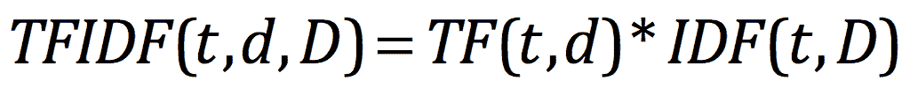

以下示例计算 Apache Spark `README.md`文件中每个术语的 TFIDF：

```scala
object TfIdfSample{ 
  def main(args: Array[String]) { 
    // TODO replace with path specific to your machine 
    val file = Util.SPARK_HOME + "/README.md" 
    val spConfig = (new        
      SparkConf).setMaster("local").setAppName("SparkApp") 
    val sc = new SparkContext(spConfig) 
    val documents: RDD[Seq[String]] =      
      sc.textFile(file).map(_.split("").toSeq) 
    print("Documents Size:" + documents.count) 
    val hashingTF = new HashingTF() 
    val tf = hashingTF.transform(documents) 
    for(tf_ <- tf) { 
      println(s"$tf_") 
    } 
    tf.cache() 
    val idf = new IDF().fit(tf) 
    val tfidf = idf.transform(tf) 
    println("tfidf size : " + tfidf.count) 
    for(tfidf_ <- tfidf) { 
      println(s"$tfidf_") 
    } 
  } 
}

```

在以下位置找到代码清单：[`github.com/ml-resources/spark-ml/blob/branch-ed2/Chapter_04/scala2.0.0/src/main/scala/org/sparksamples/featureext/TfIdfSample.scala`](https://github.com/ml-resources/spark-ml/blob/branch-ed2/Chapter_04/scala2.0.0/src/main/scala/org/sparksamples/featureext/TfIdfSample.scala)

# Word2Vector

Word2Vec 工具以文本数据作为输入，并将单词向量作为输出。该工具从训练文本数据中构建词汇表并学习单词的向量表示。生成的单词向量文件可以用作许多自然语言处理和机器学习应用的特征。

调查学习到的表示的最简单方法是找到用户指定单词的最接近单词。

Apache Spark 中的 Word2Vec 实现计算单词的分布式向量表示。与 Google 提供的单机 Word2Vec 实现相比，Apache Spark 的实现是一种更可扩展的方法。

([`code.google.com/archive/p/word2vec/`](https://code.google.com/archive/p/word2vec/))

Word2Vec 可以使用两种学习算法实现：连续词袋和连续跳字。

# 跳字模型

跳字模型的训练目标是找到对预测文档或句子中周围单词有用的单词表示。给定一系列单词*w1,* *w2, w3, . . , wT*，跳字模型最大化以下平均对数概率：

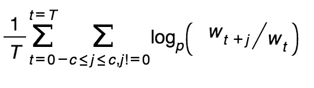

*c*是训练上下文的大小（可以是中心词*wt*的函数）。较大的*c*会导致更多的训练示例，从而提高准确性，但训练时间会增加。基本的跳字式公式使用`softmax`函数定义了*p(wt+j |wt)*：

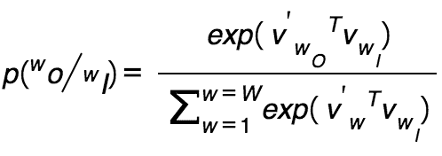

*v[w]*，*v' *和，*w*是*输入*和*输出*单词的向量表示，*W*是词汇表中的单词数

在 Spark 中，使用分层软最大值方法来预测单词*wi*给定单词*wj*。

以下示例显示了如何使用 Apache Spark 创建单词向量。

```scala
object ConvertWordsToVectors{ 
  def main(args: Array[String]) { 
    val file =  
      "/home/ubuntu/work/ml-resources/" + 
      "spark-ml/Chapter_04/data/text8_10000" 
    val conf = new SparkConf().setMaster("local").
      setAppName("Word2Vector") 
    val sc = new SparkContext(conf) 
    val input = sc.textFile(file).map(line => line.split("").toSeq) 
    val word2vec = new Word2Vec() 
    val model = word2vec.fit(input) 
    val vectors = model.getVectors 
    vectors foreach (  
      (t2) =>println (t2._1 + "-->" + t2._2.mkString("")) 
    ) 
  } 
}

```

在以下位置找到代码清单：[`github.com/ml-resources/spark-ml/blob/branch-ed2/Chapter_04/scala/2.0.0/src/main/scala/org/sparksamples/featureext/ConvertWordsToVectors.scala`](https://github.com/ml-resources/spark-ml/blob/branch-ed2/Chapter_04/scala/2.0.0/src/main/scala/org/sparksamples/featureext/ConvertWordsToVectors.scala)

上述代码的输出：

```scala
ideas-->0.0036772825 -9.474439E-4 0.0018383651 -6.24215E-4 -
 0.0042944895 -5.839545E-4 -0.004661157 -0.0024960344 0.0046632644 -
 0.00237432 -5.5691406E-5 -0.0033026629 0.0032463844 -0.0019799764 -
 0.0016042799 0.0016129494 -4.099998E-4 0.0031266063 -0.0051537985 
 0.004354736 -8.4361364E-4 0.0016157745 -0.006367187 0.0037806155 -
 4.4071436E-4 8.62155E-4 0.0051918332 0.004437387 -0.0012511226 -
 8.7162864E-4 -0.0035564564 -4.2263913E-4 -0.0020519749 -
 0.0034343079 0.0035128237 -0.0014698022 -7.263344E-4 -0.0030510207 
 -1.05513E-4 0.003316195 0.001853326 -0.003090298 -7.3562167E-4 -
 0.004879414 -0.007057088 1.1937474E-4 -0.0017973455 0.0034448127 
 0.005289607 9.6152216E-4 0.002103868 0.0016721261 -9.6310966E-4 
 0.0041839285 0.0035658625 -0.0038187192 0.005523701 -1.8146896E-4 -
 0.006257453 6.5041234E-4 -0.006894542 -0.0013860351 -4.7463065E-4 
 0.0044280654 -7.142674E-4 -0.005085546 -2.7047616E-4 0.0026938762 -
 0.0020157609 0.0051508015 -0.0027767695 0.003554946 -0.0052921847 
 0.0020432177 -0.002188367 -0.0010223344 -0.0031813548 -0.0032866944 
 0.0020323955 -0.0015844131 -0.0041034482 0.0044767153 -2.5071128E-4 
 0.0022343954 0.004051373 -0.0021706335 8.161181E-4 0.0042591896 
 0.0036099665 -0.0024891358 -0.0043153367 -0.0037649528 -
 0.0033249175 -9.5358933E-4 -0.0041675125 0.0029751007 -0.0017840122 
 -5.3287676E-4 1.983675E-4 -1.9737136E-5

```

# 标准缩放器

标准缩放器通过对训练集中的样本使用列摘要统计数据，将数据集的特征标准化为单位方差并去除均值（可选）。

这个过程是一个非常常见的预处理步骤。

标准化可以提高优化过程中的收敛速度。它还可以防止具有较大方差的特征在模型训练过程中产生过大的影响。

`StandardScaler`类在构造函数中具有以下参数：

新的 StandardScaler（withMean: Boolean, withStd: Boolean）

+   `withMean`：默认为`False`。在缩放之前使用均值对数据进行中心化。它将构建一个密集输出，在稀疏输入上不起作用，并将引发异常。

+   `withStd`：默认为`True`。将数据缩放到单位标准差。

注释

可用@Since("1.1.0" )

```scala
object StandardScalarSample { 
  def main(args: Array[String]) { 
    val conf = new SparkConf().setMaster("local"). 
     setAppName("Word2Vector") 
    val sc = new SparkContext(conf) 
    val data = MLUtils.loadLibSVMFile( sc, 
      org.sparksamples.Util.SPARK_HOME +         
      "/data/mllib/sample_libsvm_data.txt") 

    val scaler1 = new StandardScaler().fit(data.map(x => x.features) 
    val scaler2 = new StandardScaler(withMean = true, 
      withStd = true).fit(data.map(x => x.features)) 
    // scaler3 is an identical model to scaler2, and will produce   
    //identical transformations 
    val scaler3 = new StandardScalerModel(scaler2.std, scaler2.mean) 

    // data1 will be unit variance. 
    val data1 = data.map(x => 
      (x.label, scaler1.transform(x.features))) 
    println(data1.first())
    // Without converting the features into dense vectors, 
    //transformation with zero mean will raise 
    // exception on sparse vector. 
    // data2 will be unit variance and zero mean. 
    val data2 = data.map(x => (x.label,       
      scaler2.transform(Vectors.dense(x.features.toArray)))) 
    println(data2.first()) 
  } 
}

```

在以下链接找到代码清单：[`github.com/ml-resources/spark-ml/blob/branch-ed2/Chapter_04/scala/2.0.0/src/main/scala/org/sparksamples/featureext/StandardScalarSample.scala`](https://github.com/ml-resources/spark-ml/blob/branch-ed2/Chapter_04/scala/2.0.0/src/main/scala/org/sparksamples/featureext/StandardScalarSample.scala)

# 总结

在本章中，我们看到了如何找到常见的、公开可用的数据集，这些数据集可以用来测试各种机器学习模型。您学会了如何加载、处理和清理数据，以及如何应用常见技术将原始数据转换为特征向量，这些特征向量可以作为我们模型的训练样本。

在下一章中，您将学习推荐系统的基础知识，探索如何创建推荐模型，使用模型进行预测，并评估模型。
