# 第五章：使用 Spark 构建推荐引擎

现在您已经学会了数据处理和特征提取的基础知识，我们将继续详细探讨各个机器学习模型，首先是推荐引擎。

推荐引擎可能是公众所知的最好的机器学习模型之一。即使人们不确切知道推荐引擎是什么，他们很可能通过使用流行网站（如亚马逊、Netflix、YouTube、Twitter、LinkedIn 和 Facebook）来体验过。推荐是所有这些业务的核心部分，在某些情况下，推荐引擎推动了它们相当大比例的收入。

推荐引擎的理念是预测人们可能喜欢什么，并揭示项目之间的关系，以帮助发现过程；在这方面，它们与搜索引擎相似，实际上通常是互补的，后者也在发现中发挥作用。然而，与搜索引擎不同，推荐引擎试图向人们呈现他们并非必然搜索或甚至可能从未听说过的相关内容。

通常，推荐引擎试图建模用户和某种类型项目之间的连接。例如，在我们的电影流场景中，我们可以使用推荐引擎向用户展示他们可能喜欢的电影。如果我们能做到这一点，我们可以通过我们的服务保持用户的参与，这对我们的用户和我们都是有利的。同样，如果我们能够很好地向用户展示与给定电影相关的电影，我们可以帮助他们在我们的网站上发现和导航，从而提高我们用户的体验、参与度和我们内容对他们的相关性。

然而，推荐引擎不仅限于电影、书籍或产品。本章将探讨的技术可以应用于几乎任何用户对项目的关系，以及用户对用户的连接，比如社交网络上的连接，使我们能够做出推荐，比如你可能认识的人或者应该关注谁。

推荐引擎在两种一般情况下最有效，它们并不是互斥的。这里进行了解释：

+   **用户可用选项的大量**：当有大量可用项目时，用户要找到他们想要的东西变得越来越困难。当用户知道他们在寻找什么时，搜索可以帮助，但通常，合适的项目可能是他们以前不知道的东西。在这种情况下，被推荐相关的用户可能不知道的项目可以帮助他们发现新项目。

+   **涉及个人口味的显著程度**：当个人口味在选择中起到重要作用时，推荐模型（通常利用众人的智慧方法）可以帮助根据具有相似口味配置的其他人的行为发现项目。

在本章中，我们将涵盖以下主题：

+   介绍各种类型的推荐引擎

+   使用关于用户偏好的数据构建推荐模型

+   使用训练好的模型为特定用户计算推荐，同时为给定项目计算类似项目，即相关项目

+   应用标准评估指标来衡量我们创建的模型在预测能力方面的表现如何

# 推荐模型的类型

推荐系统得到了广泛研究，有许多不同的方法，但其中两种可能最为普遍：基于内容的过滤和协同过滤。最近，其他方法，如排名模型，也变得越来越受欢迎。在实践中，许多方法是混合的，将许多不同方法的元素纳入模型或模型组合。

# 基于内容的过滤

基于内容的方法试图使用项目的内容或属性，以及两个内容之间的相似性概念，来生成与给定项目相似的项目。这些属性通常是文本内容，如标题、名称、标签和附加到项目的其他元数据，或者在媒体的情况下，它们可能包括从音频和视频内容中提取的项目的其他特征。

以类似的方式，用户推荐可以基于用户或用户资料的属性生成，然后使用相似度的度量来将其与项目属性进行匹配。例如，用户可以由他们互动过的项目的组合属性来表示。这就成为了他们的用户资料，然后将其与项目属性进行比较，以找到与用户资料匹配的项目。

这些是为每个用户或项目创建描述其性质的资料的几个例子：

+   电影资料包括有关演员、流派、受欢迎程度等的属性。

+   用户资料包括人口统计信息或对特定问题的回答。

+   内容过滤使用资料来关联用户或项目。

+   基于关键词重叠的新项目与用户资料的相似度使用 Dice 系数进行计算。还有其他方法。

# 协同过滤

协同过滤仅依赖于过去的行为，如先前的评分或交易。其背后的思想是相似性的概念。

基本思想是用户对项目进行评分，隐式或显式地。过去口味相似的用户将来口味也会相似。

在基于用户的方法中，如果两个用户表现出类似的偏好，即以广泛相同方式与相同项目互动的模式，那么我们会假设他们在口味上相似。为了为给定用户生成未知项目的推荐，我们可以使用表现出类似行为的其他用户的已知偏好。我们可以通过选择一组相似的用户并计算基于他们对项目的偏好的某种形式的综合评分来实现这一点。总体逻辑是，如果其他人对一组项目有类似的口味，这些项目很可能是推荐的良好候选项。

我们还可以采用基于项目的方法，计算项目之间的相似度。这通常基于现有的用户-项目偏好或评分。那些倾向于被类似用户评价的项目在这种方法下会被归类为相似的。一旦我们有了这些相似性，我们可以根据用户与其互动的项目来表示用户，并找到与这些已知项目相似的项目，然后推荐给用户。同样，一组与已知项目相似的项目被用来生成一个综合评分，以估计未知项目。

基于用户和基于项目的方法通常被称为最近邻模型，因为估计的分数是基于最相似的用户或项目集合计算的，即它们的邻居。

传统的协同过滤算法将用户表示为项目的 N 维向量，其中 N 是不同项目的数量。向量的分量是正面或负面项目。为了计算最佳项目，该算法通常将向量分量乘以频率的倒数，即评价该项目的用户数量的倒数，使得不太知名的项目更加相关。对于大多数用户来说，这个向量非常稀疏。该算法基于与用户最相似的少数用户生成推荐。它可以使用一种称为余弦相似度的常见方法来衡量两个用户*X*和*Y*的相似度，即两个向量之间的夹角的余弦值。

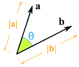

最后，有许多基于模型的方法试图对用户-物品偏好本身进行建模，以便通过将模型应用于未知的用户-物品组合来直接估计新的偏好。

协同过滤的两种主要建模方法如下：

+   **邻域方法**：

+   以用户为中心的方法集中在计算用户之间的关系

+   以物品为中心的方法根据同一用户对相邻物品的评分来评估用户对物品的偏好

+   使用居中余弦距离进行相似性计算，也称为**皮尔逊相关系数**

+   **潜在因子模型**：

+   **潜在因子模型**（LFM）方法通过表征用户和物品来解释评分，以找到隐藏的潜在特征

+   在电影中，诸如动作或戏剧、演员类型等都是潜在因子

+   在用户中，喜欢电影评分的特征是潜在因子的一个例子

+   类型包括神经网络、潜在狄利克雷分配、矩阵分解

在下一节中，我们将讨论矩阵分解模型。

# 矩阵分解

由于 Spark 的推荐模型目前只包括矩阵分解的实现，因此我们将把注意力集中在这类模型上。这种关注是有充分理由的；然而，这些类型的模型在协同过滤中一直表现出色，并且在著名的比赛中，如 Netflix 奖，它们一直是最佳模型之一。

矩阵分解假设：

+   每个用户可以用 n 个属性或特征来描述。例如，特征一可能是一个数字，表示每个用户对动作电影的喜欢程度。

+   每个物品可以用一组 n 个属性或特征来描述。与前面的例子相连，电影的特征一可能是一个数字，表示电影与纯动作的接近程度。

+   如果我们将用户的每个特征乘以物品的相应特征并将所有内容相加，这将是用户给出该物品评分的良好近似。

有关 Netflix 奖的最佳算法的更多信息和简要概述，请参阅[`techblog.netflix.com/2012/04/netflix-recommendations-beyond-5-stars.html`](http://techblog.netflix.com/2012/04/netflix-recommendations-beyond-5-stars.html)。

# 显式矩阵分解

当我们处理由用户自己提供的用户偏好数据时，我们称之为显式偏好数据。这包括用户对物品的评分、点赞、喜欢等。

我们可以将这些评分组成一个二维矩阵，以用户为行，物品为列。每个条目表示用户对某个物品的评分。由于在大多数情况下，每个用户只与相对较小的一组物品进行了交互，因此该矩阵只有少数非零条目，即非常稀疏。

举个简单的例子，假设我们有一组电影的以下用户评分：

Tom: 星球大战，5

Jane: 泰坦尼克号，4

Bill: 蝙蝠侠，3

Jane: 星球大战，2

Bill: 泰坦尼克号，3

我们将形成以下评分矩阵：

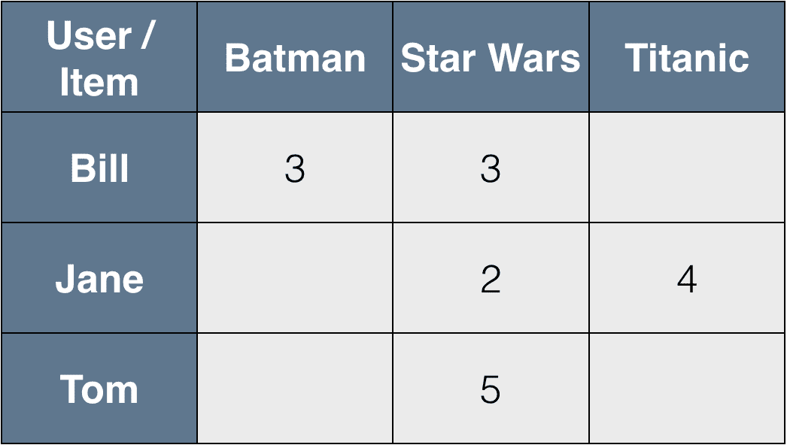

一个简单的电影评分矩阵

矩阵分解（或矩阵完成）试图直接对用户-物品矩阵进行建模，将其表示为较低维度的两个较小矩阵的乘积。因此，这是一种降维技术。如果我们有**U**个用户和**I**个物品，那么我们的用户-物品矩阵的维度为 U x I，可能看起来像下图所示的矩阵：

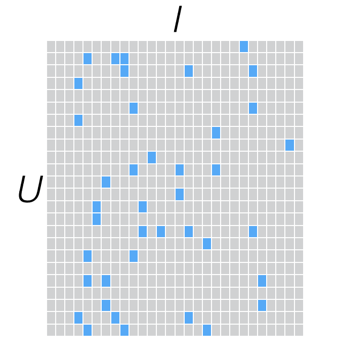

一个稀疏的评分矩阵

如果我们想要找到一个低维（低秩）的用户-物品矩阵的近似值，维度为**k**，我们将得到两个矩阵：一个是用户大小为 U x k 的矩阵，另一个是物品大小为 I x k 的矩阵；这些被称为因子矩阵。如果我们将这两个因子矩阵相乘，我们将重构原始评分矩阵的近似版本。请注意，原始评分矩阵通常非常稀疏，而每个因子矩阵是密集的，如下图所示：

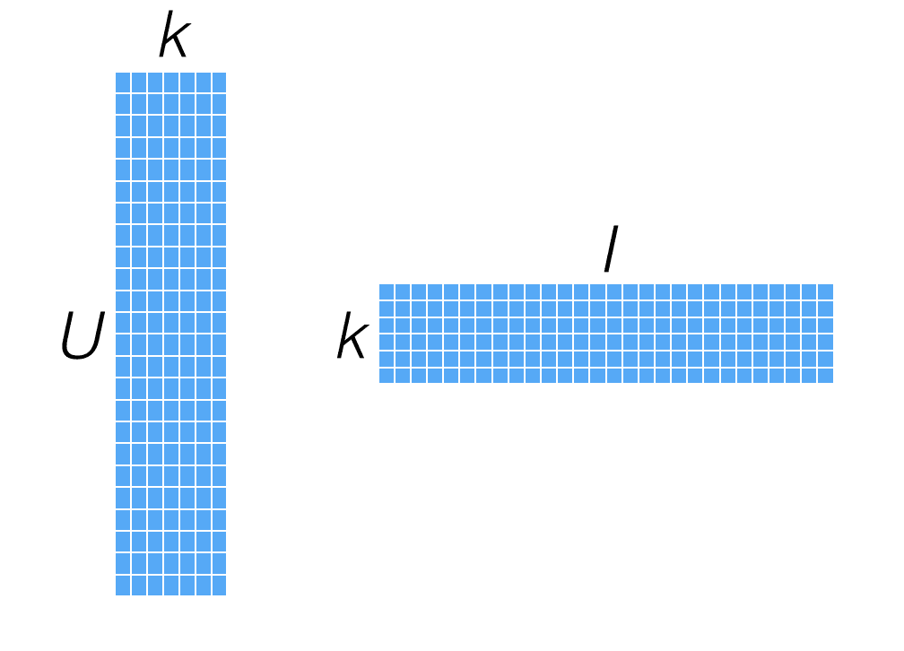

用户和物品因子矩阵

这些模型通常也被称为潜在特征模型，因为我们试图发现一些隐藏特征（由因子矩阵表示），这些特征解释了用户-物品评分矩阵中固有的行为结构。虽然潜在特征或因子通常不是直接可解释的，但它们可能代表一些东西，比如用户倾向于喜欢某个导演、类型、风格或一组演员的电影。

由于我们直接对用户-物品矩阵进行建模，因此这些模型中的预测相对简单：要计算用户和物品的预测评分，我们将计算用户因子矩阵的相关行（即用户的因子向量）与物品因子矩阵的相关行（即物品的因子向量）之间的向量点积。

这在下图中突出显示的向量中得到了说明：

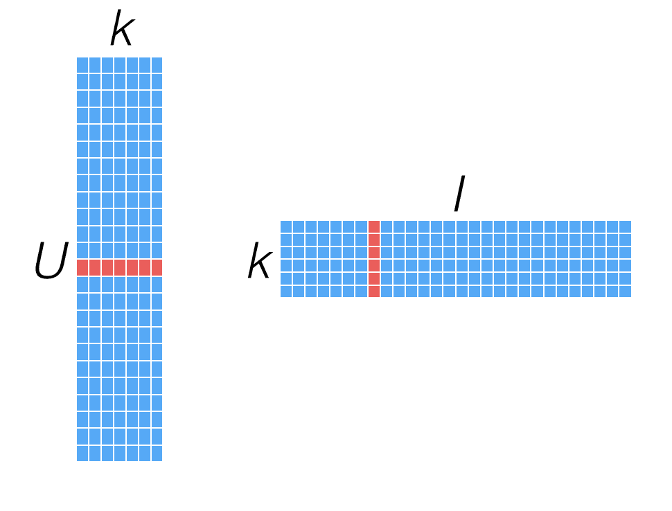

从用户和物品因子向量计算推荐

要找出两个物品之间的相似性，我们可以使用与最近邻模型中使用的相似性度量相同的度量，只是我们可以直接使用因子向量，通过计算两个物品因子向量之间的相似性，如下图所示：

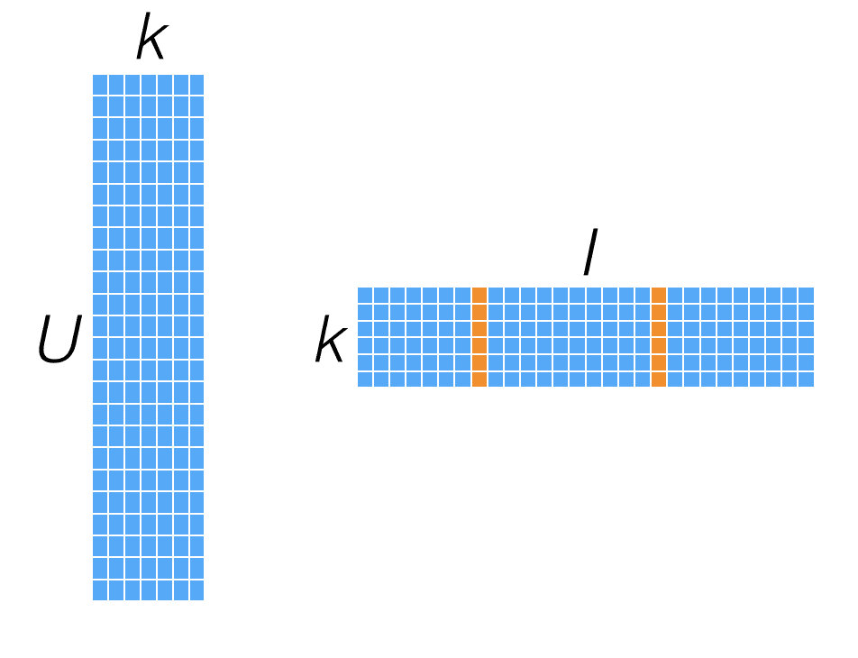

使用物品因子向量计算相似性

因子化模型的好处在于一旦模型创建完成，推荐的计算相对容易。然而，对于非常庞大的用户和物品集，这可能会成为一个挑战，因为它需要跨可能有数百万用户和物品因子向量的存储和计算。另一个优势，正如前面提到的，是它们往往提供非常好的性能。

Oryx（[`github.com/OryxProject/oryx`](https://github.com/OryxProject/oryx)）和 Prediction.io（[`github.com/PredictionIO/PredictionIO`](https://github.com/PredictionIO/PredictionIO)）等项目专注于为大规模模型提供模型服务，包括基于矩阵因子分解的推荐系统。

不足之处在于，与最近邻模型相比，因子化模型相对更复杂，而且在模型的训练阶段通常需要更多的计算资源。

# 隐式矩阵因子分解

到目前为止，我们已经处理了诸如评分之类的显式偏好。然而，我们可能能够收集到的许多偏好数据是隐式反馈，即用户和物品之间的偏好并未直接给出，而是从他们可能与物品的互动中暗示出来。例如，二进制数据，比如用户是否观看了一部电影，是否购买了一个产品，以及计数数据，比如用户观看一部电影的次数。

处理隐式数据有许多不同的方法。MLlib 实现了一种特定的方法，将输入评分矩阵视为两个矩阵：一个是二进制偏好矩阵**P**，另一个是置信权重矩阵**C**。

例如，假设我们之前看到的用户-电影评分实际上是每个用户观看该电影的次数。这两个矩阵看起来可能像以下截图中显示的矩阵。在这里，矩阵**P**告诉我们电影被用户观看了，矩阵**C**代表置信度加权，以观看次数的形式--通常情况下，用户观看电影的次数越多，他们实际上喜欢它的置信度就越高。

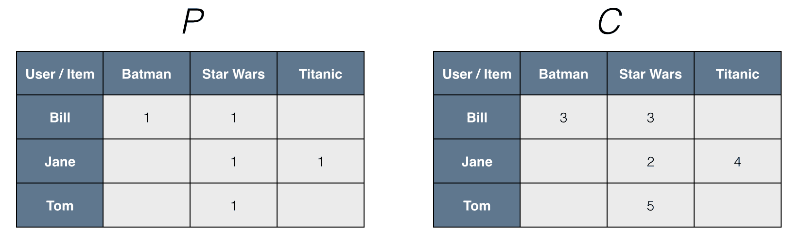

隐式偏好和置信度矩阵的表示

隐式模型仍然创建用户和物品因子矩阵。然而，在这种情况下，模型试图逼近的矩阵不是整体评分矩阵，而是偏好矩阵**P**。如果我们通过计算用户和物品因子向量的点积来计算推荐，得分将不是对评分的直接估计。它将更多地是对用户对物品的偏好的估计；尽管不严格在 0 到 1 之间，这些得分通常会相当接近 0 到 1 的范围。

简而言之，矩阵分解方法通过从评分模式中推断出的因子向量来表征用户和物品。用户和物品因子之间的高置信度或对应关系会导致推荐。两种主要的数据类型是显式反馈，如评分（由稀疏矩阵表示），和隐式反馈，如购买历史、搜索模式、浏览历史和点击流数据（由密集矩阵表示）。

# 矩阵分解的基本模型

用户和物品都被映射到维度为*f*的联合潜在因子空间中，用户-物品交互在该空间中被建模为内积。物品*i*与向量*q*相关联，其中*q*衡量物品具有潜在因子的程度，用户*u*与向量*p*相关联，其中*p*衡量用户对物品的兴趣程度。

*q*和*p*之间的点积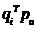捕捉了用户*u*和物品*I*之间的交互，即用户对物品的兴趣。模型的关键是找到向量*q*和*p*。

设计模型，获取用户和物品之间的潜在关系。生成评分矩阵的低维表示。对评分矩阵执行 SVD 以获取*Q*、*S*、*P*。将矩阵*S*降维到*k*维以获取*q*和*p*。

**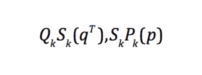**

现在，计算推荐：

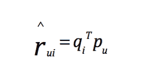

优化函数（对观察到的评分）如下图所示；学习潜在因子向量*q*和*p*，系统最小化一组评分的正则化平方误差。

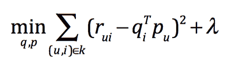

使用的学习算法是**随机梯度下降**（**SGD**）或**交替最小二乘**（**ALS**）。

# 交替最小二乘

ALS 是解决矩阵分解问题的优化技术；这种技术功能强大，性能良好，并且已被证明相对容易在并行环境中实现。因此，它非常适合像 Spark 这样的平台。在撰写本书时，它是 Spark ML 中唯一实现的推荐模型。

ALS 通过迭代地解决一系列最小二乘回归问题来工作。在每次迭代中，用户或物品因子矩阵中的一个被视为固定，而另一个则使用固定因子和评分数据进行更新。然后，解决的因子矩阵依次被视为固定，而另一个被更新。这个过程持续进行直到模型收敛（或者达到固定次数的迭代）：


目标函数不是凸的，因为*q*和*p*都是未知的，但是如果我们固定其中一个未知数，优化可以被解决。如前所述，ALS 在固定*q*和*p*之间交替。

Spark 的协同过滤文档包含了支持 ALS 算法实现显式和隐式数据的论文的引用。您可以在 http://spark.apache.org/docs/latest/ml-collaborative-filtering.html 上查看文档。

以下代码解释了如何从头开始实现 ALS 算法。

让我们举个例子，展示它是如何实现的，并看一个真实的 3 部电影和 3 个用户的矩阵：

```scala
Array2DRowRealMatrix 
{{0.5306513708,0.5144338501,0.5183049}, 
{0.0612665269,0.0595122885,0.0611548878}, 
{0.3215637836,0.2964382622,0.1439834964}}

```

电影矩阵的第一次迭代是随机选择的：

```scala
ms = {RealVector[3]@3600} 
 0 = {ArrayRealVector@3605} "{0.489603683; 0.5979051631}" 
 1 = {ArrayRealVector@3606} "{0.2069873135; 0.4887559609}" 
 2 = {ArrayRealVector@3607} "{0.5286582698; 0.6787608323}"

```

用户矩阵的第一次迭代是随机选择的：

```scala
us = {RealVector[3]@3602} 
 0 = {ArrayRealVector@3611} "{0.7964247309; 0.091570682}" 
 1 = {ArrayRealVector@3612} "{0.4509758768; 0.0684475614}" 
 2 = {ArrayRealVector@3613} "{0.7812240904; 0.4180722562}"

```

挑选用户矩阵`us`的第一行，计算`XtX`（矩阵）和`Xty`（向量），如下面的代码所示：

```scala
m: {0.489603683; 0.5979051631} 
us: [Lorg.apache.commons.math3.linear.RealVector;@75961f16 
 XtX: Array2DRowRealMatrix{{0.0,0.0},{0.0,0.0}} 
 Xty: {0; 0}

```

j:0

```scala
u: {0.7964247309; 0.091570682} 
u.outerProduct(u): 
   Array2DRowRealMatrix{{0.634292352,0.0729291558},
   {0.0729291558,0.0083851898}} 
XtX = XtX.add(u.outerProduct(u)): 
   Array2DRowRealMatrix{{0.634292352,0.0729291558},
   {0.0729291558,0.0083851898}} 
R.getEntry(i, j)):0.5306513708051035 
u.mapMultiply(R.getEntry(i, j): {0.4226238752; 0.0485921079} 
Xty = Xty.add(u.mapMultiply(R.getEntry(i, j))): {0.4226238752; 
   0.0485921079}

```

挑选用户矩阵`us`的第二行，并按照下面的代码向`XtX`（矩阵）和`Xty`（向量）添加值：

j:1

```scala
u: {0.4509758768; 0.0684475614} 
u.outerProduct(u): Array2DRowRealMatrix{{0.2033792414,0.030868199},{0.030868199,0.0046850687}} 
XtX = XtX.add(u.outerProduct(u)): Array2DRowRealMatrix{{0.8376715935,0.1037973548},{0.1037973548,0.0130702585}} 
R.getEntry(i, j)):0.5144338501354986 
u.mapMultiply(R.getEntry(i, j): {0.2319972566; 0.0352117425} 
Xty = Xty.add(u.mapMultiply(R.getEntry(i, j))): {0.6546211318; 0.0838038505}

```

j:2

```scala
u: {0.7812240904; 0.4180722562} 
u.outerProduct(u): 
   Array2DRowRealMatrix{{0.6103110794,0.326608118},
   {0.326608118,0.1747844114}} 
XtX = XtX.add(u.outerProduct(u)): 
   Array2DRowRealMatrix{{1.4479826729,0.4304054728},
   {0.4304054728,0.1878546698}} 
R.getEntry(i, j)):0.5183049000396933 
u.mapMultiply(R.getEntry(i, j): {0.4049122741; 0.2166888989} 
Xty = Xty.add(u.mapMultiply(R.getEntry(i, j))): {1.0595334059; 
   0.3004927494} 
After Regularization XtX: 
   Array2DRowRealMatrix{{1.4779826729,0.4304054728},
   {0.4304054728,0.1878546698}} 
After Regularization XtX: Array2DRowRealMatrix{{1.4779826729,0.4304054728},{0.4304054728,0.2178546698}}

```

计算`ms`（使用`XtX`和`XtY`的 Cholesky 分解的电影矩阵）的第一行的值：

```scala
CholeskyDecomposition{0.7422344051; -0.0870718111}

```

经过我们每一行的步骤后，我们得到了：

```scala
ms = {RealVector[3]@5078} 
 0 = {ArrayRealVector@5125} "{0.7422344051; -0.0870718111}" 
 1 = {ArrayRealVector@5126} "{0.0856607011; -0.007426896}" 
 2 = {ArrayRealVector@5127} "{0.4542083563; -0.392747909}"

```

列出了先前解释的数学实现的源代码：

```scala
object AlternatingLeastSquares { 

  var movies = 0 
  var users = 0 
  var features = 0 
  var ITERATIONS = 0 
  val LAMBDA = 0.01 // Regularization coefficient 

  private def vector(n: Int): RealVector = 
    new ArrayRealVector(Array.fill(n)(math.random)) 

  private def matrix(rows: Int, cols: Int): RealMatrix = 
    new Array2DRowRealMatrix(Array.fill(rows, cols)(math.random)) 

  def rSpace(): RealMatrix = { 
    val mh = matrix(movies, features) 
    val uh = matrix(users, features) 
    mh.multiply(uh.transpose()) 
  } 

  def rmse(targetR: RealMatrix, ms: Array[RealVector], us: 
   Array[RealVector]): Double = { 
    val r = new Array2DRowRealMatrix(movies, users) 
    for (i <- 0 until movies; j <- 0 until users) { 
      r.setEntry(i, j, ms(i).dotProduct(us(j))) 
    } 
    val diffs = r.subtract(targetR) 
    var sumSqs = 0.0 
    for (i <- 0 until movies; j <- 0 until users) { 
      val diff = diffs.getEntry(i, j) 
      sumSqs += diff * diff 
    } 
    math.sqrt(sumSqs / (movies.toDouble * users.toDouble)) 
  } 

  def update(i: Int, m: RealVector, us: Array[RealVector], R: 
   RealMatrix) : RealVector = { 
    val U = us.length 
    val F = us(0).getDimension 
    var XtX: RealMatrix = new Array2DRowRealMatrix(F, F) 
    var Xty: RealVector = new ArrayRealVector(F) 
    // For each user that rated the movie 
    for (j <- 0 until U) { 
      val u = us(j) 
      // Add u * u^t to XtX 
      XtX = XtX.add(u.outerProduct(u)) 
      // Add u * rating to Xty 
      Xty = Xty.add(u.mapMultiply(R.getEntry(i, j))) 
    } 
    // Add regularization coefs to diagonal terms 
    for (d <- 0 until F) { 
      XtX.addToEntry(d, d, LAMBDA * U) 
    } 
    // Solve it with Cholesky 
    new CholeskyDecomposition(XtX).getSolver.solve(Xty) 
  } 

  def main(args: Array[String]) { 

    movies = 100 
    users = 500 
    features = 10 
    ITERATIONS = 5 
    var slices = 2 

    val spark = 
     SparkSession.builder.master("local[2]").
     appName("AlternatingLeastS
   quares").getOrCreate() 
    val sc = spark.sparkContext 

    val r_space = rSpace() 

    // Initialize m and u randomly 
    var ms = Array.fill(movies)(vector(features)) 
    var us = Array.fill(users)(vector(features)) 

    // Iteratively update movies then users 
    val Rc = sc.broadcast(r_space) 
    var msb = sc.broadcast(ms) 
    var usb = sc.broadcast(us) 
    for (iter <- 1 to ITERATIONS) { 
      println(s"Iteration $iter:") 
      ms = sc.parallelize(0 until movies, slices) 
        .map(i => update(i, msb.value(i), usb.value, Rc.value)) 
        .collect() 
      msb = sc.broadcast(ms) // Re-broadcast ms because it was 
   updated 
      us = sc.parallelize(0 until users, slices) 
        .map(i => update(i, usb.value(i), msb.value, 
   Rc.value.transpose())) 
        .collect() 
      usb = sc.broadcast(us) // Re-broadcast us because it was 
   updated 
      println("RMSE = " + rmse(r_space, ms, us)) 
      println() 
    } 

    spark.stop() 
  } 
}

```

您可以在以下网址找到代码清单：[`github.com/ml-resources/spark-ml/blob/branch-ed2/Chapter_05/2.0.0/scala-spark-app/src/main/scala/com/spark/recommendation/AlternatingLeastSquares.scala`](https://github.com/ml-resources/spark-ml/blob/branch-ed2/Chapter_05/2.0.0/scala-spark-app/src/main/scala/com/spark/recommendation/AlternatingLeastSquares.scala)

# 从数据中提取正确的特征

在这一部分，我们将使用显式评分数据，没有额外的用户、物品元数据或其他与用户-物品交互相关的信息。因此，我们需要的输入特征只是用户 ID、电影 ID 和分配给每个用户和电影对的评分。

# 从 MovieLens 100k 数据集中提取特征

在这个例子中，我们将使用在上一章中使用的相同的 MovieLens 数据集。在下面的代码中，将使用放置 MovieLens 100k 数据集的目录作为输入路径。

首先，让我们检查原始评分数据集：

```scala
object FeatureExtraction { 

def getFeatures(): Dataset[FeatureExtraction.Rating] = { 
  val spark = SparkSession.builder.master("local[2]").appName("FeatureExtraction").getOrCreate() 

  import spark.implicits._ 
  val ratings = spark.read.textFile("/data/ml-100k 2/u.data").map(parseRating) 
  println(ratings.first()) 

  return ratings 
} 

case class Rating(userId: Int, movieId: Int, rating: Float) 
def parseRating(str: String): Rating = { 
  val fields = str.split("t") 
  Rating(fields(0).toInt, fields(1).toInt, fields(2).toFloat) 
}

```

您可以在以下网址找到代码清单：[`github.com/ml-resources/spark-ml/blob/branch-ed2/Chapter_05/2.0.0/scala-spark-app/src/main/scala/com/spark/recommendation/FeatureExtraction.scala`](https://github.com/ml-resources/spark-ml/blob/branch-ed2/Chapter_05/2.0.0/scala-spark-app/src/main/scala/com/spark/recommendation/FeatureExtraction.scala)

您将看到类似于以下代码行的输出：

```scala
16/09/07 11:23:38 INFO CodeGenerator: Code generated in 7.029838 ms
16/09/07 11:23:38 INFO Executor: Finished task 0.0 in stage 0.0 (TID 
   0). 1276 bytes result sent to driver
16/09/07 11:23:38 INFO TaskSetManager: Finished task 0.0 in stage 0.0 
   (TID 0) in 82 ms on localhost (1/1)
16/09/07 11:23:38 INFO TaskSchedulerImpl: Removed TaskSet 0.0, whose 
   tasks have all completed, from pool
16/09/07 11:23:38 INFO DAGScheduler: ResultStage 0 (first at 
   FeatureExtraction.scala:25) finished in 0.106 s
16/09/07 11:23:38 INFO DAGScheduler: Job 0 finished: first at 
   FeatureExtraction.scala:25, took 0.175165 s
16/09/07 11:23:38 INFO CodeGenerator: Code generated in 6.834794 ms
Rating(196,242,3.0)

```

请记住，这个数据集（使用案例映射到`Rating`类）由`userID`、`movieID`、`rating`和`timestamp`字段组成，由制表符（`"t"`）字符分隔。我们不需要训练模型时的评分时间，所以下面的代码片段中我们只是提取了前三个字段：

```scala
case class Rating(userId: Int, movieId: Int, rating: Float) 
def parseRating(str: String): Rating = { 
  val fields = str.split("t") 
  Rating(fields(0).toInt, fields(1).toInt, fields(2).toFloat) 
}

```

您可以在以下网址找到代码清单：[`github.com/ml-resources/spark-ml/blob/branch-ed2/Chapter_05/2.0.0/scala-spark-app/src/main/scala/com/spark/recommendation/FeatureExtraction.scala`](https://github.com/ml-resources/spark-ml/blob/branch-ed2/Chapter_05/2.0.0/scala-spark-app/src/main/scala/com/spark/recommendation/FeatureExtraction.scala)

我们将首先将每条记录分割为`"t"`字符，这样我们就得到了一个`String[]`数组。然后我们将使用案例类来映射并保留数组的前`3`个元素，分别对应`userID`、`movieID`和`rating`。

# 训练推荐模型

一旦我们从原始数据中提取了这些简单的特征，我们就可以继续进行模型训练；ML 会为我们处理这些。我们所要做的就是提供正确解析的输入数据集以及我们选择的模型参数。

将数据集分割为训练集和测试集，比例为 80:20，如下面的代码所示：

```scala
def createALSModel() { 
  val ratings = FeatureExtraction.getFeatures(); 

  val Array(training, test) = ratings.randomSplit(Array(0.8, 0.2)) 
  println(training.first()) 
}

```

您可以在以下网址找到代码清单：[`github.com/ml-resources/spark-ml/blob/branch-ed2/Chapter_05/2.0.0/scala-spark-app/src/main/scala/com/spark/recommendation/ALSModeling.scala`](https://github.com/ml-resources/spark-ml/blob/branch-ed2/Chapter_05/2.0.0/scala-spark-app/src/main/scala/com/spark/recommendation/ALSModeling.scala)

您将看到以下输出：

```scala
16/09/07 13:23:28 INFO Executor: Finished task 0.0 in stage 1.0 (TID 
   1). 1768 bytes result sent to driver
16/09/07 13:23:28 INFO TaskSetManager: Finished task 0.0 in stage 1.0 
   (TID 1) in 459 ms on localhost (1/1)
16/09/07 13:23:28 INFO TaskSchedulerImpl: Removed TaskSet 1.0, whose 
   tasks have all completed, from pool
16/09/07 13:23:28 INFO DAGScheduler: ResultStage 1 (first at 
   FeatureExtraction.scala:34) finished in 0.459 s
16/09/07 13:23:28 INFO DAGScheduler: Job 1 finished: first at 
   FeatureExtraction.scala:34, took 0.465730 s
Rating(1,1,5.0)

```

# 在 MovieLens 100k 数据集上训练模型

我们现在准备训练我们的模型！我们模型所需的其他输入如下：

+   `rank`：这指的是我们 ALS 模型中的因子数量，也就是我们低秩近似矩阵中的隐藏特征数量。通常来说，因子数量越多越好，但这直接影响内存使用，无论是计算还是存储模型用于服务，特别是对于大量用户或物品。因此，在实际应用中，这通常是一个权衡。它还影响所需的训练数据量。

+   在 10 到 200 的范围内选择一个秩通常是合理的。

+   `iterations`：这是指要运行的迭代次数。虽然 ALS 中的每次迭代都保证会减少评级矩阵的重构误差，但 ALS 模型在相对较少的迭代后就会收敛到一个相当不错的解决方案。因此，在大多数情况下，我们不需要运行太多次迭代--大约 10 次通常是一个很好的默认值。

+   `numBlocks`：这是用户和物品将被分区成的块的数量，以并行化计算（默认为 10）。该数字取决于集群节点的数量以及数据的分区方式。

+   `regParam`：这指定 ALS 中的正则化参数（默认为 1.0）。常数*λ*称为正则化参数，如果用户和物品矩阵的分量过大（绝对值），它会对其进行惩罚。这对于数值稳定性很重要，几乎总是会使用某种形式的正则化。

+   `implicitPrefs`：这指定是否使用显式反馈 ALS 变体或者适用于隐式反馈数据的变体；默认为 false，表示使用显式反馈。

+   `alpha`：这是 ALS 隐式反馈变体适用的参数，它控制对偏好观察的*基线*置信度（默认为 1.0）。

+   `nonnegative`：这指定是否使用最小二乘法的非负约束（默认为`false`）。

我们将使用默认的`rank`，`5`个`maxIter`，以及`regParam`参数为`0.01`来说明如何训练我们的模型，如下面的代码所示：

```scala
// Build the recommendation model using ALS on the training data 
val als = new ALS() 
  .setMaxIter(5) 
  .setRegParam(0.01) 
  .setUserCol("userId") 
  .setItemCol("movieId") 
  .setRatingCol("rating") 

val model = als.fit(training)

```

您可以在[`github.com/ml-resources/spark-ml/blob/branch-ed2/Chapter_05/2.0.0/scala-spark-app/src/main/scala/com/spark/recommendation/ALSModeling.scala`](https://github.com/ml-resources/spark-ml/blob/branch-ed2/Chapter_05/2.0.0/scala-spark-app/src/main/scala/com/spark/recommendation/ALSModeling.scala)找到代码清单。

这将返回一个`ALSModel`对象，其中包含用户和物品因子。它们分别称为`userFactors`和`itemFactors`。

例如，`model.userFactors`。

您将看到以下输出：

```scala
16/09/07 13:08:16 INFO MapPartitionsRDD: Removing RDD 16 from 
   persistence list
16/09/07 13:08:16 INFO BlockManager: Removing RDD 16
16/09/07 13:08:16 INFO Instrumentation: ALS-als_1ca69e2ffef7-
   10603412-1: training finished
16/09/07 13:08:16 INFO SparkContext: Invoking stop() from shutdown 
   hook
[id: int, features: array<float>]

```

我们可以看到这些因子的形式是`Array[float]`。

MLlib 的 ALS 实现中使用的操作是惰性转换，因此实际计算只有在我们对用户和物品因子的 DataFrame 调用某种操作时才会执行。在下面的代码中，我们可以使用 Spark 操作（如`count`）来强制执行计算：

```scala
model.userFactors.count()

```

这将触发计算，并且我们将看到类似以下代码行的大量输出文本：

```scala
16/09/07 13:21:54 INFO Executor: Running task 0.0 in stage 53.0 (TID 
   166)
16/09/07 13:21:54 INFO ShuffleBlockFetcherIterator: Getting 10 non-
   empty blocks out of 10 blocks
16/09/07 13:21:54 INFO ShuffleBlockFetcherIterator: Started 0 remote 
   fetches in 0 ms
16/09/07 13:21:54 INFO Executor: Finished task 0.0 in stage 53.0 (TID 
   166). 1873 bytes result sent to driver
16/09/07 13:21:54 INFO TaskSetManager: Finished task 0.0 in stage 
   53.0 (TID 166) in 12 ms on localhost (1/1)
16/09/07 13:21:54 INFO TaskSchedulerImpl: Removed TaskSet 53.0, whose 
   tasks have all completed, from pool
16/09/07 13:21:54 INFO DAGScheduler: ResultStage 53 (count at 
   ALSModeling.scala:25) finished in 0.012 s
16/09/07 13:21:54 INFO DAGScheduler: Job 7 finished: count at 
   ALSModeling.scala:25, took 0.123073 s
16/09/07 13:21:54 INFO CodeGenerator: Code generated in 11.162514 ms
943

```

如果我们对电影因子调用`count`，将会使用以下代码完成：

```scala
model.itemFactors.count()

```

这将触发计算，并且我们将得到以下输出：

```scala
16/09/07 13:23:32 INFO TaskSetManager: Starting task 0.0 in stage 
   68.0 (TID 177, localhost, partition 0, ANY, 5276 bytes)
16/09/07 13:23:32 INFO Executor: Running task 0.0 in stage 68.0 (TID 
   177)
16/09/07 13:23:32 INFO ShuffleBlockFetcherIterator: Getting 10 non-
   empty blocks out of 10 blocks
16/09/07 13:23:32 INFO ShuffleBlockFetcherIterator: Started 0 remote 
   fetches in 0 ms
16/09/07 13:23:32 INFO Executor: Finished task 0.0 in stage 68.0 (TID 
   177). 1873 bytes result sent to driver
16/09/07 13:23:32 INFO TaskSetManager: Finished task 0.0 in stage 
   68.0 (TID 177) in 3 ms on localhost (1/1)
16/09/07 13:23:32 INFO TaskSchedulerImpl: Removed TaskSet 68.0, whose 
   tasks have all completed, from pool
16/09/07 13:23:32 INFO DAGScheduler: ResultStage 68 (count at 
   ALSModeling.scala:26) finished in 0.003 s
16/09/07 13:23:32 INFO DAGScheduler: Job 8 finished: count at 
   ALSModeling.scala:26, took 0.072450 s

1651

```

如预期的那样，我们为每个用户（`943`个因子）和每部电影（`1651`个因子）都有一个因子数组。

# 使用隐式反馈数据训练模型

MLlib 中的标准矩阵分解方法处理显式评分。要处理隐式数据，可以使用`trainImplicit`方法。它的调用方式类似于标准的`train`方法。还有一个额外的参数`alpha`，可以设置（同样，正则化参数`lambda`应该通过测试和交叉验证方法进行选择）。

`alpha`参数控制应用的基线置信度权重。较高水平的`alpha`倾向于使模型更加确信缺失数据意味着用户-物品对的偏好不存在。

从 Spark 版本 2.0 开始，如果评分矩阵是从其他信息推断出来的，即从其他信号中推断出来的，您可以将`setImplicitPrefs`设置为`true`以获得更好的结果，如下例所示：

```scala
val als = new ALS() 
  .setMaxIter(5) 
  .setRegParam(0.01) 
  .setImplicitPrefs(true) 
  .setUserCol("userId") 
  .setItemCol("movieId") 
  .setRatingCol("rating")

```

作为练习，尝试将现有的 MovieLens 数据集转换为隐式数据集。一种可能的方法是通过在某个水平上对评分应用阈值，将其转换为二进制反馈（0 和 1）。

另一种方法可能是将评分值转换为置信权重（例如，也许低评分可能意味着零权重，甚至是负权重，这是 MLlib 实现支持的）。

在此数据集上训练模型，并将以下部分的结果与您的隐式模型生成的结果进行比较。

# 使用推荐模型

现在我们已经训练好模型，准备使用它进行预测。

# ALS 模型推荐

从 Spark v2.0 开始，`org.apache.spark.ml.recommendation.ALS`建模是因子分解算法的阻塞实现，它将“用户”和“产品”因子分组到块中，并通过在每次迭代时仅向每个产品块发送每个用户向量的一份副本，并且仅对需要该用户特征向量的产品块进行通信，从而减少通信。

在这里，我们将从电影数据集中加载评分数据，其中每一行包括用户、电影、评分和时间戳。然后我们将训练一个 ALS 模型，默认情况下该模型适用于显式偏好（`implicitPrefs`为`false`）。我们将通过测量评分预测的均方根误差来评估推荐模型，具体如下：

```scala
object ALSModeling { 

  def createALSModel() { 
    val ratings = FeatureExtraction.getFeatures(); 

    val Array(training, test) = ratings.randomSplit(Array(0.8, 
   0.2)) 
    println(training.first()) 

    // Build the recommendation model using ALS on the training 
   data 
    val als = new ALS() 
      .setMaxIter(5) 
      .setRegParam(0.01) 
      .setUserCol("userId") 
      .setItemCol("movieId") 
      .setRatingCol("rating") 

    val model = als.fit(training) 
    println(model.userFactors.count()) 
    println(model.itemFactors.count()) 

    val predictions = model.transform(test) 
    println(predictions.printSchema()) 

}

```

您可以在以下链接找到代码列表：[`github.com/ml-resources/spark-ml/blob/branch-ed2/Chapter_05/2.0.0/scala-spark-app/src/main/scala/com/spark/recommendation/ALSModeling.scala`](https://github.com/ml-resources/spark-ml/blob/branch-ed2/Chapter_05/2.0.0/scala-spark-app/src/main/scala/com/spark/recommendation/ALSModeling.scala)

以下是前述代码的输出：

```scala
16/09/07 17:58:42 INFO SparkContext: Created broadcast 26 from 
   broadcast at DAGScheduler.scala:1012
16/09/07 17:58:42 INFO DAGScheduler: Submitting 1 missing tasks from 
   ResultStage 67 (MapPartitionsRDD[138] at count at 
   ALSModeling.scala:31)
16/09/07 17:58:42 INFO TaskSchedulerImpl: Adding task set 67.0 with 1 
   tasks
16/09/07 17:58:42 INFO TaskSetManager: Starting task 0.0 in stage 
   67.0 (TID 176, localhost, partition 0, ANY, 5276 bytes)
16/09/07 17:58:42 INFO Executor: Running task 0.0 in stage 67.0 (TID 
   176)
16/09/07 17:58:42 INFO ShuffleBlockFetcherIterator: Getting 10 non-
   empty blocks out of 10 blocks
16/09/07 17:58:42 INFO ShuffleBlockFetcherIterator: Started 0 remote 
   fetches in 0 ms
16/09/07 17:58:42 INFO Executor: Finished task 0.0 in stage 67.0 (TID 
   176). 1960 bytes result sent to driver
16/09/07 17:58:42 INFO TaskSetManager: Finished task 0.0 in stage 
   67.0 (TID 176) in 3 ms on localhost (1/1)
16/09/07 17:58:42 INFO TaskSchedulerImpl: Removed TaskSet 67.0, whose 
   tasks have all completed, from pool
16/09/07 17:58:42 INFO DAGScheduler: ResultStage 67 (count at 
   ALSModeling.scala:31) finished in 0.003 s
16/09/07 17:58:42 INFO DAGScheduler: Job 7 finished: count at 
   ALSModeling.scala:31, took 0.060748 s
100
root
 |-- userId: integer (nullable = true)
 |-- movieId: integer (nullable = true)
 |-- rating: float (nullable = true)
 |-- timestamp: long (nullable = true)
 |-- prediction: float (nullable = true)

```

在我们继续之前，请注意以下关于用户和物品推荐的示例使用了 Spark v1.6 的 MLlib。请按照代码列表获取使用`org.apache.spark.mllib.recommendation.ALS`创建推荐模型的详细信息。

# 用户推荐

在这种情况下，我们希望为给定的用户生成推荐的物品。这通常采用*top-K*列表的形式，即我们的模型预测用户最有可能喜欢的*K*个物品。这是通过计算每个物品的预测得分并根据这个得分对列表进行排名来实现的。

执行此计算的确切方法取决于所涉及的模型。例如，在基于用户的方法中，使用相似用户对物品的评分来计算对用户的推荐；而在基于物品的方法中，计算基于用户评分的物品与候选物品的相似性。

在矩阵分解中，因为我们直接对评分矩阵进行建模，所以预测得分可以通过用户因子向量和物品因子向量之间的向量点积来计算。

# 从 MovieLens 100k 数据集生成电影推荐

由于 MLlib 的推荐模型是基于矩阵分解的，我们可以使用模型计算出的因子矩阵来计算用户的预测分数（或评分）。我们将专注于使用 MovieLens 数据的显式评分情况；然而，使用隐式模型时，方法是相同的。

`MatrixFactorizationModel`类有一个方便的`predict`方法，可以计算给定用户和项目组合的预测分数，如下面的代码所示：

```scala
val predictedRating = model.predict(789, 123)

```

输出如下：

```scala
14/03/30 16:10:10 INFO SparkContext: Starting job: lookup at 
   MatrixFactorizationModel.scala:45
14/03/30 16:10:10 INFO DAGScheduler: Got job 30 (lookup at 
   MatrixFactorizationModel.scala:45) with 1 output partitions 
   (allowLocal=false)
...
14/03/30 16:10:10 INFO SparkContext: Job finished: lookup at 
   MatrixFactorizationModel.scala:46, took 0.023077 s
predictedRating: Double = 3.128545693368485

```

正如我们所看到的，这个模型预测用户`789`对电影`123`的评分为`3.12`。

请注意，您可能会看到与本节中显示的结果不同的结果，因为 ALS 模型是随机初始化的。因此，模型的不同运行将导致不同的解决方案。

`predict`方法也可以接受一个`(user, item)` ID 的 RDD 作为输入，并为每个生成预测。我们可以使用这个方法同时为许多用户和项目进行预测。

为了为用户生成*top-K*推荐项目，`MatrixFactorizationModel`提供了一个方便的方法叫做`recommendProducts`。这需要两个参数：`user`和`num`，其中`user`是用户 ID，`num`是要推荐的项目数。

它返回按预测分数排序的前`num`个项目。在这里，分数是通过用户因子向量和每个项目因子向量之间的点积计算的。

让我们按照以下方式为用户`789`生成前`10`个推荐项目：

```scala
val userId = 789 
val K = 10 
val topKRecs = model.recommendProducts(userId, K)

```

现在，我们已经为用户`789`的每部电影预测了一组评分。如果我们打印出来，通过编写以下代码行，我们可以检查这个用户的前`10`个推荐：

```scala
println(topKRecs.mkString("n"))

```

您应该在控制台上看到以下输出：

```scala
Rating(789,715,5.931851273771102)
Rating(789,12,5.582301095666215)
Rating(789,959,5.516272981542168)
Rating(789,42,5.458065302395629)
Rating(789,584,5.449949837103569)
Rating(789,750,5.348768847643657)
Rating(789,663,5.30832117499004)
Rating(789,134,5.278933936827717)
Rating(789,156,5.250959077906759)
Rating(789,432,5.169863417126231)

```

# 检查推荐

我们可以通过快速查看用户评价过的电影和推荐的电影的标题来对这些推荐进行一次检查。首先，我们需要加载电影数据，这是我们在上一章中探讨的数据集之一。在下面的代码中，我们将收集这些数据作为`Map[Int, String]`方法，将电影 ID 映射到标题：

```scala
val movies = sc.textFile("/PATH/ml-100k/u.item") 
val titles = movies.map(line => 
   line.split("|").take(2)).map(array => (array(0).toInt,
   array(1))).collectAsMap() 
titles(123)

```

上述代码将产生以下输出：

```scala
res68: String = Frighteners, The (1996)

```

对于我们的用户`789`，我们可以找出他们评价过的电影，取得评分最高的`10`部电影，然后检查标题。我们将首先使用`keyBy` Spark 函数从我们的`ratings` RDD 中创建一个键值对的 RDD，其中键将是用户 ID。然后，我们将使用`lookup`函数将这个键（即特定的用户 ID）的评分返回给驱动程序，如下所述：

```scala
val moviesForUser = ratings.keyBy(_.user).lookup(789)

```

让我们看看这个用户评价了多少部电影。这将是`moviesForUser`集合的`size`：

```scala
println(moviesForUser.size)

```

我们将看到这个用户已经评价了`33`部电影。

接下来，我们将通过对`moviesForUser`集合使用`Rating`对象的`rating`字段进行排序，取得评分最高的`10`部电影。然后，我们将从我们的电影标题映射中提取相关产品 ID 附加到`Rating`类的电影标题，并打印出带有其评分的前`10`个标题，如下所示：

```scala
moviesForUser.sortBy(-_.rating).take(10).map(rating => 
   (titles(rating.product), rating.rating)).foreach(println)

```

您将看到以下输出显示：

```scala
(Godfather, The (1972),5.0)
(Trainspotting (1996),5.0)
(Dead Man Walking (1995),5.0)
(Star Wars (1977),5.0)
(Swingers (1996),5.0)
(Leaving Las Vegas (1995),5.0)
(Bound (1996),5.0)
(Fargo (1996),5.0)
(Last Supper, The (1995),5.0)
(Private Parts (1997),4.0)

```

现在，让我们看看这个用户的前`10`个推荐，并查看标题，使用与我们之前使用的相同方法（请注意，推荐已经排序）：

```scala
topKRecs.map(rating => (titles(rating.product), 
   rating.rating)).foreach(println)

```

输出如下：

```scala
(To Die For (1995),5.931851273771102)
(Usual Suspects, The (1995),5.582301095666215)
(Dazed and Confused (1993),5.516272981542168)
(Clerks (1994),5.458065302395629)
(Secret Garden, The (1993),5.449949837103569)
(Amistad (1997),5.348768847643657)
(Being There (1979),5.30832117499004)
(Citizen Kane (1941),5.278933936827717)
(Reservoir Dogs (1992),5.250959077906759)
(Fantasia (1940),5.169863417126231)

```

我们留给您决定这些推荐是否有意义。

# 项目推荐

项目推荐是关于回答以下问题的：对于某个项目，与之最相似的项目是什么？在这里，相似性的精确定义取决于所涉及的模型。在大多数情况下，相似性是通过使用某些相似性度量来比较两个项目的向量表示来计算的。常见的相似性度量包括皮尔逊相关系数和余弦相似度用于实值向量，以及杰卡德相似度用于二进制向量。

# 为 MovieLens 100k 数据集生成相似的电影

当前的`MatrixFactorizationModel`API 不直接支持项目之间的相似度计算。因此，我们需要创建自己的代码来完成这个任务。

我们将使用余弦相似度度量，并使用 jblas 线性代数库（MLlib 的依赖项）来计算所需的向量点积。这类似于现有的`predict`和`recommendProducts`方法的工作方式，只是我们将使用余弦相似度而不仅仅是点积。

我们想要使用我们的相似度度量来比较我们选择的项目的因子向量与其他项目的因子向量。为了执行线性代数计算，我们首先需要从因子向量中创建一个向量对象，这些因子向量的形式是`Array[Double]`。`JBLAS`类`DoubleMatrix`以`Array[Double]`作为构造函数参数，如下所示：

```scala
import org.jblas.DoubleMatrix

```

使用以下构造函数从数组实例化`DoubleMatrix`。

`jblas`类是一个用 Java 编写的线性代数库。它基于 BLAS 和 LAPACK，是矩阵计算的事实行业标准，并使用像`ATLAS`这样的实现来进行计算例程，使得 jBLAS 非常快速。

它是对 BLAS 和 LAPACK 例程的轻量级封装。BLAS 和 LAPACK 包起源于 Fortran 社区。

让我们看一个例子：

```scala
public DoubleMatrix(double[] newData)

```

使用`newData`作为数据数组创建一个列向量。对创建的`DoubleMatrix`的任何更改都将在输入数组`newData`中进行更改。

让我们创建一个简单的`DoubleMatrix`：

```scala
val aMatrix = new DoubleMatrix(Array(1.0, 2.0, 3.0))

```

以下是前面代码的输出：

```scala
aMatrix: org.jblas.DoubleMatrix = [1.000000; 2.000000; 3.000000]

```

请注意，使用 jblas，向量表示为一维的`DoubleMatrix`类，而矩阵表示为二维的`DoubleMatrix`类。

我们需要一个方法来计算两个向量之间的余弦相似度。余弦相似度是*n*维空间中两个向量之间角度的度量。首先计算向量之间的点积，然后将结果除以分母，分母是每个向量的范数（或长度）相乘在一起（具体来说，余弦相似度中使用 L2 范数）。

在线性代数中，向量的大小称为的范数。我们将讨论几种不同类型的范数。在本讨论中，我们将向量 v 定义为一组有序的数字。

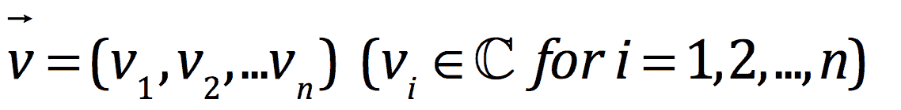

一范数：向量的一范数（也称为 L1 范数或均值范数）如下图所示，并定义为其组件的绝对值的总和：

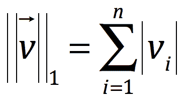

二范数（也称为 L2 范数、均方根范数、最小二乘范数）

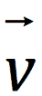向量的范数如下图所示：

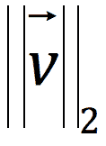

此外，它被定义为其组件的绝对值的平方和的平方根：

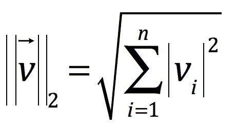

这样，余弦相似度是一个归一化的点积。余弦相似度测量值介于`-1`和`1`之间。值为`1`意味着完全相似，而值为 0 意味着独立（即没有相似性）。这个度量是有用的，因为它还捕捉到了负相似性，即值为`-1`意味着向量不仅不相似，而且完全不相似：

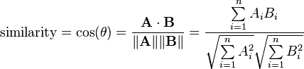

让我们在这里创建我们的`cosineSimilarity`函数：

```scala
def cosineSimilarity(vec1: DoubleMatrix, vec2: DoubleMatrix): Double = { 
  vec1.dot(vec2) / (vec1.norm2() * vec2.norm2()) 
}

```

请注意，我们为这个函数定义了一个`Double`的返回类型。虽然 Scala 具有类型推断功能，我们并不需要这样做。然而，为 Scala 函数记录返回类型通常是有用的。

让我们尝试对项目`567`的项目因子之一进行操作。我们需要从我们的模型中收集一个项目因子；我们将使用`lookup`方法来做到这一点，方式与我们之前收集特定用户的评分的方式类似。在下面的代码行中，我们还将使用`head`函数，因为`lookup`返回一个值数组，我们只需要第一个值（实际上，只会有一个值，即这个项目的因子向量）。

由于这将是一个构造函数`Array[Double]`，因此我们需要从中创建一个`DoubleMatrix`对象，并计算与自身的余弦相似度，如下所示：

```scala
val itemId = 567 
val itemFactor = model.productFeatures.lookup(itemId).head 
val itemVector = new DoubleMatrix(itemFactor) 
cosineSimilarity(itemVector, itemVector)

```

相似度度量应该衡量两个向量在某种意义上的接近程度。在下面的示例中，我们可以看到我们的余弦相似度度量告诉我们，这个项目向量与自身相同，这是我们所期望的。

```scala
res113: Double = 1.0

```

现在，我们准备将我们的相似度度量应用于每个项目，如下所示：

```scala
val sims = model.productFeatures.map{ case (id, factor) => 
  val factorVector = new DoubleMatrix(factor) 
  val sim = cosineSimilarity(factorVector, itemVector) 
  (id, sim) 
}

```

接下来，我们可以通过对每个项目的相似度分数进行排序来计算前 10 个最相似的项目：

```scala
// recall we defined K = 10 earlier 
val sortedSims = sims.top(K)(Ordering.by[(Int, Double), Double] { 
   case (id, similarity) => similarity })

```

在上述代码片段中，我们使用了 Spark 的`top`函数，这是一种在分布式方式中计算*top-K*结果的高效方法，而不是使用`collect`将所有数据返回到驱动程序并在本地进行排序（请记住，在推荐模型的情况下，我们可能会处理数百万用户和项目）。

我们需要告诉 Spark 如何对`sims` RDD 中的`(项目 ID，相似度分数)`对进行排序。为此，我们将传递一个额外的参数给`top`，这是一个 Scala`Ordering`对象，告诉 Spark 应该按照键值对中的值进行排序（即按照`相似度`进行排序）。

最后，我们可以打印与给定项目计算出的最高相似度度量的 10 个项目：

```scala
println(sortedSims.take(10).mkString("n"))

```

您将看到以下类似的输出：

```scala
(567,1.0000000000000002)
(1471,0.6932331537649621)
(670,0.6898690594544726)
(201,0.6897964975027041)
(343,0.6891221044611473)
(563,0.6864214133620066)
(294,0.6812075443259535)
(413,0.6754663844488256)
(184,0.6702643811753909)
(109,0.6594872765176396)

```

毫不奇怪，我们可以看到排名最高的相似项是我们的项目。其余的是我们项目集中的其他项目，按照我们的相似度度量进行排名。

# 检查相似项目

让我们看看我们选择的电影的标题是什么：

```scala
println(titles(itemId))

```

上述代码将打印以下输出：

```scala
    Wes Craven's New Nightmare (1994)

```

与用户推荐一样，我们可以对项目之间的相似性计算进行感知检查，并查看最相似电影的标题。这次，我们将取前 11 个，以便排除给定的电影。因此，我们将在列表中取 1 到 11 的数字：

```scala
val sortedSims2 = sims.top(K + 1)(Ordering.by[(Int, Double), 
   Double] { case (id, similarity) => similarity }) 
sortedSims2.slice(1, 11).map{ case (id, sim) => (titles(id), sim) 
   }.mkString("n")

```

您将看到显示电影标题和分数的输出类似于此输出：

```scala
(Hideaway (1995),0.6932331537649621)
(Body Snatchers (1993),0.6898690594544726)
(Evil Dead II (1987),0.6897964975027041)
(Alien: Resurrection (1997),0.6891221044611473)
(Stephen King's The Langoliers (1995),0.6864214133620066)
(Liar Liar (1997),0.6812075443259535)
(Tales from the Crypt Presents: Bordello of Blood (1996),0.6754663844488256)
(Army of Darkness (1993),0.6702643811753909)
(Mystery Science Theater 3000: The Movie (1996),0.6594872765176396)
(Scream (1996),0.6538249646863378)

```

再次注意，由于随机模型初始化，您可能会看到完全不同的结果。

现在，您已经使用余弦相似度计算了相似的项目，请尝试对用户因子向量执行相同操作，以计算给定用户的相似用户。

# 评估推荐模型的性能

我们如何知道我们训练的模型是否是一个好模型？我们需要能够以某种方式评估其预测性能。评估指标是模型预测能力或准确性的度量。有些是直接衡量模型预测模型目标变量的能力，例如均方误差，而其他指标则关注模型在预测可能不会直接优化的事物方面的表现，但通常更接近我们在现实世界中关心的内容，例如平均精度。

评估指标提供了一种标准化的方式，用于比较具有不同参数设置的相同模型的性能，并比较跨不同模型的性能。使用这些指标，我们可以执行模型选择，从我们希望评估的模型集中选择表现最佳的模型。

在这里，我们将向您展示如何计算推荐系统和协同过滤模型中使用的两个常见评估指标：**均方误差**（**MSE**）和**K 处的平均精度**（**MAPK**）。

# ALS 模型评估

从 Spark v2.0 开始，我们将使用`org.apache.spark.ml.evaluation.RegressionEvaluator`来解决回归问题。回归评估是衡量拟合模型在留出测试数据上表现如何的度量标准。在这里，我们将使用**均方根误差**（**RMSE**），它只是 MSE 度量的平方根：

```scala
object ALSModeling { 

  def createALSModel() { 
    val ratings = FeatureExtraction.getFeatures(); 

    val Array(training, test) = ratings.randomSplit(Array(0.8, 0.2)) 
    println(training.first()) 

    // Build the recommendation model using ALS on the training data 
    val als = new ALS() 
      .setMaxIter(5) 
      .setRegParam(0.01) 
      .setUserCol("userId") 
      .setItemCol("movieId") 
      .setRatingCol("rating") 

    val model = als.fit(training) 
    println(model.userFactors.count()) 
    println(model.itemFactors.count()) 

    val predictions = model.transform(test) 
    println(predictions.printSchema()) 

    val evaluator = new RegressionEvaluator() 
      .setMetricName("rmse") 
      .setLabelCol("rating") 
      .setPredictionCol("prediction") 
    val rmse = evaluator.evaluate(predictions) 

    println(s"Root-mean-square error = $rmse") 
  } 

  def main(args: Array[String]) { 
    createALSModel() 
  } 

}

```

你可以在[`github.com/ml-resources/spark-ml/blob/branch-ed2/Chapter_05/2.0.0/scala-spark-app/src/main/scala/com/spark/recommendation/ALSModeling.scala`](https://github.com/ml-resources/spark-ml/blob/branch-ed2/Chapter_05/2.0.0/scala-spark-app/src/main/scala/com/spark/recommendation/ALSModeling.scala)找到代码清单。

你将看到如下输出：

```scala
16/09/07 17:58:45 INFO ShuffleBlockFetcherIterator: Getting 4 non-
   empty blocks out of 200 blocks
16/09/07 17:58:45 INFO ShuffleBlockFetcherIterator: Getting 2 non-
   empty blocks out of 200 blocks
16/09/07 17:58:45 INFO ShuffleBlockFetcherIterator: Started 0 remote 
   fetches in 0 ms
16/09/07 17:58:45 INFO ShuffleBlockFetcherIterator: Started 0 remote 
   fetches in 0 ms
16/09/07 17:58:45 INFO ShuffleBlockFetcherIterator: Getting 1 non-
   empty blocks out of 10 blocks
16/09/07 17:58:45 INFO ShuffleBlockFetcherIterator: Getting 1 non-
   empty blocks out of 10 blocks
16/09/07 17:58:45 INFO ShuffleBlockFetcherIterator: Started 0 remote 
   fetches in 0 ms
16/09/07 17:58:45 INFO ShuffleBlockFetcherIterator: Started 0 remote 
   fetches in 0 ms
Root-mean-square error = 2.1487554400294777

```

在我们进一步进行之前，请注意以下评估示例使用 Spark v1.6 中的 MLLib。请按照代码清单获取使用`org.apache.spark.mllib.recommendation.ALS`创建推荐模型的详细信息。

# 均方误差

MSE 是用户-物品评分矩阵重建误差的直接度量。它也是某些模型中被最小化的目标函数，特别是包括 ALS 在内的许多矩阵分解技术。因此，在显式评分设置中通常使用它。

它被定义为平方误差之和除以观察次数。而平方误差则是给定用户-物品对的预测评分与实际评分之间的差的平方。

我们将以用户`789`为例。让我们从之前计算的`moviesForUser`集合的`Ratings`中取出该用户的第一个评分：

```scala
val actualRating = moviesForUser.take(1)(0)

```

以下是输出：

```scala
actualRating: org.apache.spark.mllib.recommendation.Rating = 
   Rating(789,1012,4.0)

```

我们将看到该用户-物品组合的评分为 4。接下来，我们将计算模型的预测评分：

```scala
val predictedRating = model.predict(789, actualRating.product)

```

模型预测评分的输出如下：

```scala
...
14/04/13 13:01:15 INFO SparkContext: Job finished: lookup at MatrixFactorizationModel.scala:46, took 0.025404 s
predictedRating: Double = 4.001005374200248

```

我们将看到预测评分约为 4，非常接近实际评分。最后，我们将计算实际评分和预测评分之间的平方误差：

```scala
val squaredError = math.pow(predictedRating - actualRating.rating, 
   2.0)

```

上述代码将输出平方误差：

```scala
squaredError: Double = 1.010777282523947E-6

```

因此，为了计算数据集的整体 MSE，我们需要为每个（`用户`，`电影`，`实际评分`，`预测评分`）条目计算这个平方误差，将它们相加，然后除以评分数量。我们将在以下代码片段中执行此操作。

注意：以下代码改编自 Apache Spark ALS 的编程指南，网址为[`spark.apache.org/docs/latest/mllib-collaborative-filtering.html`](http://spark.apache.org/docs/latest/mllib-collaborative-filtering.html)。

首先，我们将从`ratings` RDD 中提取用户和产品 ID，并使用`model.predict`对每个用户-物品对进行预测。我们将使用用户-物品对作为键，预测评分作为值：

```scala
val usersProducts = ratings.map{ case Rating(user, product, 
   rating)  => (user, product)} 
val predictions = model.predict(usersProducts).map{ 
    case Rating(user, product, rating) => ((user, product), 
   rating) 
}

```

接下来，我们将提取实际评分，并将`ratings` RDD 映射，使用户-物品对成为键，实际评分成为值。现在我们有了两个具有相同键形式的 RDD，我们可以将它们连接在一起，创建一个新的 RDD，其中包含每个用户-物品组合的实际和预测评分：

```scala
val ratingsAndPredictions = ratings.map{ 
  case Rating(user, product, rating) => ((user, product), rating) 
}.join(predictions)

```

最后，我们将通过使用`reduce`求和平方误差，并除以记录数量的`count`方法来计算 MSE：

```scala
val MSE = ratingsAndPredictions.map{ 
    case ((user, product), (actual, predicted)) =>  math.pow((actual - predicted), 2) 
}.reduce(_ + _) / ratingsAndPredictions.count 
println("Mean Squared Error = " + MSE)

```

输出如下：

```scala
Mean Squared Error = 0.08231947642632852

```

通常使用 RMSE，它只是 MSE 度量的平方根。这更具可解释性，因为它与基础数据（即本例中的评分）具有相同的单位。它相当于预测和实际评分之间差异的标准差。我们可以简单地计算如下：

```scala
val RMSE = math.sqrt(MSE) 
println("Root Mean Squared Error = " + RMSE)

```

上述代码将打印 RMSE：

```scala
Root Mean Squared Error = 0.2869137090247319

```

为了解释前面的结果，请记住以下定义。降低 RMSE 值意味着预测值与实际值的拟合更好。在解释 RMSE 时，请记住实际数据的最小值和最大值。

# K 处的平均精度

在*K*处的平均精度是数据集中所有实例的**K 处的平均精度**(**APK**)指标的平均值。APK 是信息检索常用的度量标准。APK 是对响应查询呈现的*top-K*文档的平均相关性分数的度量。对于每个查询实例，我们将*top-K*结果集与实际相关文档集进行比较，也就是查询的真实相关文档集。

在 APK 指标中，结果集的顺序很重要，如果结果文档既相关又相关文档在结果中排名较高，则 APK 得分会更高。因此，这是推荐系统的一个很好的指标；通常，我们会为每个用户计算*top-K*推荐的项目，并将这些项目呈现给用户。当然，我们更喜欢那些具有最高预测分数的项目的模型，这些项目在推荐列表的顶部呈现时，实际上是用户最相关的项目。APK 和其他基于排名的指标也更适合隐式数据集的评估指标；在这里，MSE 没有太多意义。

为了评估我们的模型，我们可以使用 APK，其中每个用户相当于一个查询，而*top-K*推荐项目集是文档结果集。相关文档，也就是在这种情况下的真相，是用户交互的项目集。因此，APK 试图衡量我们的模型在预测用户会发现相关并选择与之交互的项目方面有多好。

以下平均精度计算的代码基于[`github.com/benhamner/Metrics`](https://github.com/benhamner/Metrics)。

更多关于 MAPK 的信息可以在[`www.kaggle.com/wiki/MeanAveragePrecision`](https://www.kaggle.com/wiki/MeanAveragePrecision)找到。

我们的计算 APK 的函数如下所示：

```scala
def avgPrecisionK(actual: Seq[Int], predicted: Seq[Int], k: Int): 
   Double = { 
    val predK = predicted.take(k) 
    var score = 0.0 
    var numHits = 0.0 
    for ((p, i) <- predK.zipWithIndex) { 
      if (actual.contains(p)) { 
        numHits += 1.0 
        score += numHits / (i.toDouble + 1.0) 
      } 
    } 
    if (actual.isEmpty) { 
      1.0 
    } else { 
      score / scala.math.min(actual.size, k).toDouble 
    } 
  }

```

如您所见，这需要输入一个与用户相关联的“实际”项目 ID 列表和另一个“预测”ID 列表，以便我们的估计对用户是相关的。

我们可以计算我们示例用户`789`的 APK 指标如下。首先，我们将提取用户的实际电影 ID，如下所示：

```scala
val actualMovies = moviesForUser.map(_.product)

```

输出如下：

```scala
actualMovies: Seq[Int] = ArrayBuffer(1012, 127, 475, 93, 1161, 286, 
   293, 9, 50, 294, 181, 1, 1008, 508, 284, 1017, 137, 111, 742, 248, 
   249, 1007, 591, 150, 276, 151, 129, 100, 741, 288, 762, 628, 124)

```

然后，我们将使用先前制作的电影推荐来使用`K = 10`计算 APK 得分：

```scala
val predictedMovies = topKRecs.map(_.product)

```

这是输出：

```scala
predictedMovies: Array[Int] = Array(27, 497, 633, 827, 602, 849, 401, 
   584, 1035, 1014)

```

以下代码将产生平均精度：

```scala
val apk10 = avgPrecisionK(actualMovies, predictedMovies, 10)

```

前面的代码将打印以下命令行：

```scala
apk10: Double = 0.0

```

在这种情况下，我们可以看到我们的模型并没有很好地预测这个用户的相关电影，因为 APK 得分为`0`。

为了计算每个用户的 APK 并对其进行平均以计算整体 MAPK，我们需要为数据集中的每个用户生成推荐列表。虽然这在大规模上可能相当密集，但我们可以使用我们的 Spark 功能来分发计算。然而，一个限制是每个工作节点必须有完整的项目因子矩阵可用，以便它可以计算相关用户向量和所有项目向量之间的点积。当项目数量非常高时，这可能是一个问题，因为项目矩阵必须适合一个机器的内存中。

实际上，没有简单的方法可以解决这个限制。一种可能的方法是仅使用近似技术，如局部敏感哈希([`en.wikipedia.org/wiki/Locality-sensitive_hashing`](http://en.wikipedia.org/wiki/Locality-sensitive_hashing))，为总项目集的子集计算推荐。

我们现在将看看如何做。首先，我们将收集项目因子并从中形成一个`DoubleMatrix`对象：

```scala
val itemFactors = model.productFeatures.map { case (id, factor) => 
   factor }.collect() 
val itemMatrix = new DoubleMatrix(itemFactors) 
println(itemMatrix.rows, itemMatrix.columns)

```

前面代码的输出如下：

```scala
(1682,50)

```

这给我们一个具有`1682`行和`50`列的矩阵，这是我们从`1682`部电影中期望的因子维度为`50`的矩阵。接下来，我们将将项目矩阵作为广播变量分发，以便它在每个工作节点上都可用：

```scala
val imBroadcast = sc.broadcast(itemMatrix)

```

您将看到以下输出：

```scala
14/04/13 21:02:01 INFO MemoryStore: ensureFreeSpace(672960) called 
   with curMem=4006896, maxMem=311387750
14/04/13 21:02:01 INFO MemoryStore: Block broadcast_21 stored as 
   values to memory (estimated size 657.2 KB, free 292.5 MB)
imBroadcast: 
   org.apache.spark.broadcast.Broadcast[org.jblas.DoubleMatrix] = 
   Broadcast(21)

```

现在我们准备为每个用户计算推荐。我们将通过对每个用户因子应用`map`函数来执行用户因子向量和电影因子矩阵之间的矩阵乘法来实现这一点。结果是一个向量（长度为`1682`，即我们拥有的电影数量），其中包含每部电影的预测评分。然后，我们将按预测评分对这些预测进行排序：

```scala
val allRecs = model.userFeatures.map{ case (userId, array) => 
  val userVector = new DoubleMatrix(array) 
  val scores = imBroadcast.value.mmul(userVector) 
  val sortedWithId = scores.data.zipWithIndex.sortBy(-_._1) 
  val recommendedIds = sortedWithId.map(_._2 + 1).toSeq 
  (userId, recommendedIds) 
}

```

您将在屏幕上看到以下内容：

```scala
allRecs: org.apache.spark.rdd.RDD[(Int, Seq[Int])] = MappedRDD[269] 
   at map at <console>:29

```

我们现在有一个 RDD，其中包含每个用户 ID 的电影 ID 列表。这些电影 ID 按照估计的评分顺序排列。

请注意，我们需要将返回的电影 ID 加 1（如前面的代码片段中所示），因为项目因子矩阵是从 0 开始索引的，而我们的电影 ID 从`1`开始。

我们还需要每个用户的电影 ID 列表，作为`actual`参数传递给我们的 APK 函数。我们已经准备好了`ratings` RDD，所以我们可以从中提取用户和电影 ID。

如果我们使用 Spark 的`groupBy`操作符，我们将得到一个 RDD，其中包含每个用户 ID 的`(userid, movieid)`对列表（因为用户 ID 是我们执行`groupBy`操作的键），如下所示：

```scala
val userMovies = ratings.map{ case Rating(user, product, rating) 
   => (user, product) }.groupBy(_._1)

```

上述代码的输出如下：

```scala
userMovies: org.apache.spark.rdd.RDD[(Int, Seq[(Int, Int)])] = 
  MapPartitionsRDD[277] at groupBy at <console>:21

```

最后，我们可以使用 Spark 的`join`操作符在用户 ID 键上将这两个 RDD 连接在一起。然后，对于每个用户，我们有实际和预测的电影 ID 列表，我们可以将其传递给我们的 APK 函数。类似于我们计算 MSE 的方式，我们将使用`reduce`操作来对这些 APK 分数进行求和，并除以用户数量，即`allRecs` RDD 的计数，如下面的代码所示：

```scala
val K = 10 
val MAPK = allRecs.join(userMovies).map{ case (userId, (predicted, actualWithIds)) => 
  val actual = actualWithIds.map(_._2).toSeq 
  avgPrecisionK(actual, predicted, K) 
}.reduce(_ + _) / allRecs.count 
println("Mean Average Precision at K = " + MAPK)

```

上述代码将打印`K`处的`平均精度`如下：

```scala
Mean Average Precision at K = 0.030486963254725705

```

我们的模型实现了一个相当低的 MAPK。但是，请注意，推荐任务的典型值通常相对较低，特别是如果项目集非常大的话。

尝试一些`lambda`和`rank`（如果您使用 ALS 的隐式版本，则还有`alpha`）的参数设置，并查看是否可以找到基于 RMSE 和 MAPK 评估指标表现更好的模型。

# 使用 MLlib 的内置评估函数

虽然我们已经从头开始计算了 MSE、RMSE 和 MAPK，这是一个有用的学习练习，但是 MLlib 提供了方便的函数来在`RegressionMetrics`和`RankingMetrics`类中为我们执行这些操作。

# RMSE 和 MSE

首先，我们将使用`RegressionMetrics`计算 MSE 和 RMSE 指标。我们将通过传入表示每个数据点的预测和真实值的键值对 RDD 来实例化`RegressionMetrics`实例，如下面的代码片段所示。在这里，我们将再次使用我们在之前示例中计算的`ratingsAndPredictions` RDD：

```scala
import org.apache.spark.mllib.evaluation.RegressionMetrics 
val predictedAndTrue = ratingsAndPredictions.map { case ((user, 
   product), (predicted, actual)) => (predicted, actual) } 
val regressionMetrics = new RegressionMetrics(predictedAndTrue)

```

然后，我们可以访问各种指标，包括 MSE 和 RMSE。我们将在这里打印出这些指标：

```scala
println("Mean Squared Error = " + 
   regressionMetrics.meanSquaredError) 
println("Root Mean Squared Error = " + 
   regressionMetrics.rootMeanSquaredError)

```

在以下命令行中，您将看到 MSE 和 RMSE 的输出与我们之前计算的指标完全相同：

```scala
Mean Squared Error = 0.08231947642632852
Root Mean Squared Error = 0.2869137090247319

```

# MAP

正如我们对 MSE 和 RMSE 所做的那样，我们可以使用 MLlib 的`RankingMetrics`类来计算基于排名的评估指标。类似地，与我们自己的平均精度函数一样，我们需要传入一个键值对的 RDD，其中键是用户的预测项目 ID 数组，而值是实际项目 ID 的数组。

在`RankingMetrics`中，平均精度在 K 函数的实现与我们的略有不同，因此我们将得到不同的结果。但是，如果我们选择`K`非常高（比如至少与我们的项目集中的项目数量一样高），则整体平均精度（MAP，不使用 K 阈值）的计算与我们的函数相同。

首先，我们将使用`RankingMetrics`计算 MAP 如下：

```scala
import org.apache.spark.mllib.evaluation.RankingMetrics 
val predictedAndTrueForRanking = allRecs.join(userMovies).map{ 
   case (userId, (predicted, actualWithIds)) => 
    val actual = actualWithIds.map(_._2) 
    (predicted.toArray, actual.toArray) 
} 
val rankingMetrics = new 
   RankingMetrics(predictedAndTrueForRanking) 
println("Mean Average Precision = " + 
   rankingMetrics.meanAveragePrecision)

```

您将在屏幕上看到以下输出：

```scala
Mean Average Precision = 0.07171412913757183

```

接下来，我们将使用我们的函数以与之前完全相同的方式计算 MAP，只是将`K`设置为一个非常高的值，比如`2000`：

```scala
val MAPK2000 = allRecs.join(userMovies).map{ case (userId, 
   (predicted, actualWithIds)) => 
  val actual = actualWithIds.map(_._2).toSeq 
  avgPrecisionK(actual, predicted, 2000) 
}.reduce(_ + _) / allRecs.count 
println("Mean Average Precision = " + MAPK2000)

```

您将看到我们自己函数计算的 MAP 与使用`RankingMetrics`计算的 MAP 相同：

```scala
Mean Average Precision = 0.07171412913757186.

```

我们将不在本章涵盖交叉验证，因为我们将在接下来的几章中提供详细的处理。但是，请注意，探讨在即将到来的章节中探索的交叉验证技术可以用于使用 MSE、RMSE 和 MAP 等性能指标来评估推荐模型的性能，这些指标我们在本节中已经涵盖。

# FP-Growth 算法

我们将应用 FP-Growth 算法来找出经常推荐的电影。

FP-Growth 算法已在 Han 等人的论文中描述，*Mining frequent patterns without candidate generation*，可在[`dx.doi.org/10.1145/335191.335372`](http://dx.doi.org/10.1145/335191.335372)上找到，其中**FP**代表**frequent pattern**。对于给定的交易数据集，FP-Growth 的第一步是计算项目频率并识别频繁项目。FP-Growth 算法实现的第二步使用后缀树（FP-tree）结构来编码交易；这是在不显式生成候选集的情况下完成的，通常对于大型数据集来说生成候选集是昂贵的。

# FP-Growth 基本示例

让我们从一个非常简单的随机数字数据集开始：

```scala
val transactions = Seq( 
      "r z h k p", 
      "z y x w v u t s", 
      "s x o n r", 
      "x z y m t s q e", 
      "z", 
      "x z y r q t p") 
      .map(_.split(" "))

```

我们将找出最频繁的项目（在本例中是字符）。首先，我们将按如下方式获取 Spark 上下文：

```scala
val sc = new SparkContext("local[2]", "Chapter 5 App")

```

将我们的数据转换为 RDD：

```scala
val rdd = sc.parallelize(transactions, 2).cache()

```

初始化`FPGrowth`实例：

```scala
val fpg = new FPGrowth()

```

FP-Growth 可以配置以下参数：

+   `minSupport`：被识别为频繁项集的最小支持数。例如，如果一个项目在 10 个交易中出现 3 次，则其支持率为 3/10=0.3。

+   `numPartitions`：要分发工作的分区数。

设置`minsupport`和 FP-Growth 实例的分区数，并在 RDD 对象上调用 run。分区数应设置为数据集中的分区数--数据将从中加载的工作节点数，如下所示：

```scala
val model = fpg.setMinSupport(0.2).setNumPartitions(1).run(rdd)

```

获取输出的项目集并打印：

```scala
model.freqItemsets.collect().foreach { 
itemset => 
        println(itemset.items.mkString( 
"[", ",", "]") + ", " + itemset.freq 
  )

```

前面代码的输出如下，您可以看到`[Z]`出现最多：

```scala
[s], 3
[s,x], 3
[s,x,z], 2
[s,z], 2
[r], 3
[r,x], 2
[r,z], 2
[y], 3
[y,s], 2
[y,s,x], 2
[y,s,x,z], 2
[y,s,z], 2
[y,x], 3
[y,x,z], 3
[y,t], 3
[y,t,s], 2
[y,t,s,x], 2
[y,t,s,x,z], 2
[y,t,s,z], 2
[y,t,x], 3
[y,t,x,z], 3
[y,t,z], 3
[y,z], 3
[q], 2
[q,y], 2
[q,y,x], 2
[q,y,x,z], 2
[q,y,t], 2
[q,y,t,x], 2
[q,y,t,x,z], 2
[q,y,t,z], 2
[q,y,z], 2
[q,x], 2
[q,x,z], 2
[q,t], 2
[q,t,x], 2
[q,t,x,z], 2
[q,t,z], 2
[q,z], 2
[x], 4
[x,z], 3
[t], 3
[t,s], 2
[t,s,x], 2
[t,s,x,z], 2
[t,s,z], 2
[t,x], 3
[t,x,z], 3
[t,z], 3
[p], 2
[p,r], 2
[p,r,z], 2
[p,z], 2
[z], 5

```

# 应用于 Movie Lens 数据的 FP-Growth

让我们将算法应用于 Movie Lens 数据，以找到我们频繁的电影标题：

1.  通过编写以下代码行来实例化`SparkContext`：

```scala
        val sc = Util.sc 
        val rawData = Util.getUserData() 
        rawData.first()

```

1.  获取原始评分并通过编写以下代码行打印第一个：

```scala
        val rawRatings = rawData.map(_.split("t").take(3)) 
        rawRatings.first() 
        val ratings = rawRatings.map { case Array(user, movie, 
           rating) => 
        Rating(user.toInt, movie.toInt, rating.toDouble) } 
            val ratingsFirst = ratings.first() 
        println(ratingsFirst)

```

1.  加载电影数据并获取标题如下：

```scala
        val movies = Util.getMovieData() 
        val titles = movies.map(line => 
        line.split("|").take(2)).map(array 
        => (array(0).toInt, array(1))).collectAsMap() 
        titles(123)

```

1.  接下来，我们将使用 FP-Growth 算法找出从 501 到 900 号用户中 400 个用户最频繁的电影。

1.  首先通过编写以下代码行创建 FP-Growth 模型：

```scala
        val model = fpg 
              .setMinSupport(0.1) 
              .setNumPartitions(1) 
              .run(rddx)

```

1.  其中`0.1`是要考虑的最小截止值，`rddx`是加载到 400 个用户的原始电影评分的 RDD。一旦我们有了模型，我们可以迭代`overitemsetr`，`itemset`并打印结果。

完整的代码清单在此处给出，并且也可以在[`github.com/ml-resources/spark-ml/blob/branch-ed2/Chapter_05/scala-spark-app/src/main/scala/MovieLensFPGrowthApp.scala`](https://github.com/ml-resources/spark-ml/blob/branch-ed2/Chapter_05/scala-spark-app/src/main/scala/MovieLensFPGrowthApp.scala)找到。

可以通过编写以下代码行来完成：

```scala
            var eRDD = sc.emptyRDD 
            var z = Seq[String]() 

            val l = ListBuffer() 
            val aj = new ArrayString 
            var i = 0 
            for( a <- 501 to 900) { 
              val moviesForUserX = ratings.keyBy(_.user). 
                lookup(a) 
             val moviesForUserX_10 = 
               moviesForUserX.sortBy(-_.rating).take(10) 
             val moviesForUserX_10_1 = moviesForUserX_10.map
               (r => r.product) 
             var temp = "" 
             for( x <- moviesForUserX_10_1){ 
                if(temp.equals("")) 
                  temp = x.toString 
                else { 
                  temp =  temp + " " + x 
                } 
             } 
             aj(i) = temp 
             i += 1 
            } 
            z = aj 
            val transaction = z.map(_.split(" ")) 
            val rddx = sc.parallelize(transaction, 2).cache() 
            val fpg = new FPGrowth() 
            val model = fpg 
              .setMinSupport(0.1) 
              .setNumPartitions(1) 
              .run(rddx) 
            model.freqItemsets.collect().foreach { itemset => 
              println(itemset.items.mkString("[", ",", "]") 
                + ", " + itemset.freq) 
            } 
            sc.stop()

```

前面示例的输出如下：

```scala
        [302], 40
 [258], 59
 [100], 49
 [286], 50
 [181], 45
 [127], 60
 [313], 59
 [300], 49
 [50], 94

```

这为用户 ID 501 到 900 提供了具有最大频率的电影。

# 摘要

在本章中，我们使用 Spark 的 ML 和 MLlib 库来训练协同过滤推荐模型，并学习如何使用该模型来预测给定用户可能偏好的项目。我们还使用我们的模型来找到与给定项目相似或相关的项目。最后，我们探索了评估我们推荐模型的预测能力的常见指标。

在下一章中，您将学习如何使用 Spark 训练模型来对数据进行分类，并使用标准评估机制来衡量模型的性能。
