# 第六章：使用 Spark 构建分类模型

在本章中，您将学习分类模型的基础知识，以及它们在各种情境中的应用。分类通常指将事物分类到不同的类别中。在分类模型的情况下，我们通常希望基于一组特征分配类别。这些特征可能代表与物品或对象、事件或背景相关的变量，或者这些变量的组合。

最简单的分类形式是当我们有两个类别时；这被称为二元分类。其中一个类通常被标记为正类（分配标签 1），而另一个被标记为负类（分配标签-1，有时为 0）。下图显示了一个具有两个类的简单示例。在这种情况下，输入特征具有两个维度，并且特征值在图中的 x 和 y 轴上表示。我们的任务是训练一个模型，可以将这个二维空间中的新数据点分类为一个类（红色）或另一个类（蓝色）。

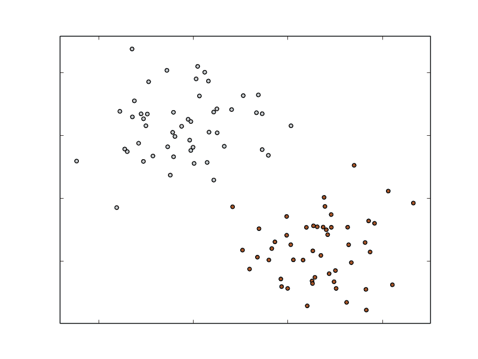

一个简单的二元分类问题

如果我们有超过两个类别，我们将称之为多类分类，类别通常使用从 0 开始的整数编号（例如，五个不同的类别的标签范围从 0 到 4）。示例如下图所示。再次强调，为了便于说明，假设输入特征是二维的：

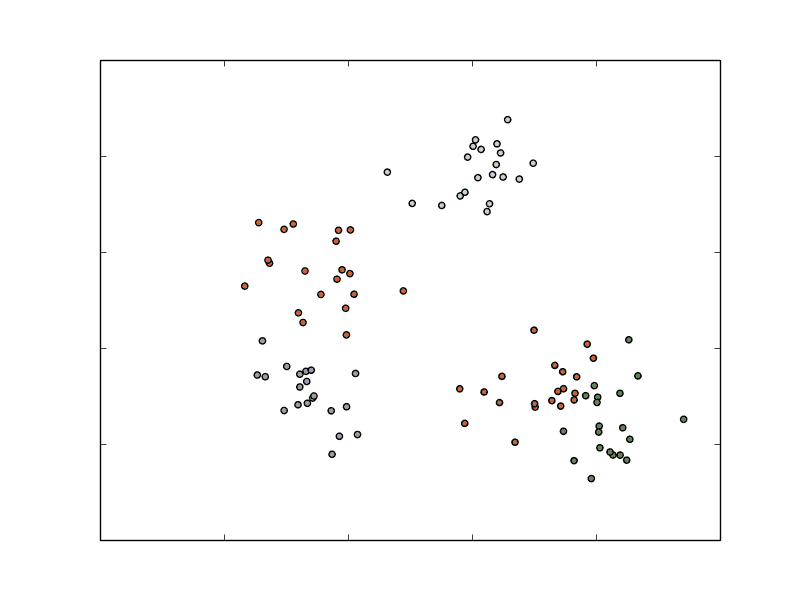

一个简单的多类分类问题

分类是一种监督学习的形式，我们通过包含已知目标或感兴趣结果的训练示例来训练模型（即，模型受这些示例结果的监督）。分类模型可以在许多情况下使用，但一些常见的例子包括以下几种：

+   预测互联网用户点击在线广告的概率；在这里，类别的性质是二元的（即点击或不点击）

+   检测欺诈；同样，在这种情况下，类别通常是二元的（欺诈或无欺诈）

+   预测贷款违约（二元）

+   对图像、视频或声音进行分类（通常是多类，可能有很多不同的类）

+   将新闻文章、网页或其他内容分配到类别或标签中（多类）

+   发现电子邮件和网络垃圾邮件、网络入侵和其他恶意行为（二元或多类）

+   检测故障情况，例如计算机系统或网络中的故障

+   按照客户或用户购买产品或使用服务的概率对其进行排名

+   预测可能停止使用产品、服务或提供者的客户或用户（称为流失）

这只是一些可能的用例。事实上，可以说分类是现代企业中最广泛使用的机器学习和统计技术之一，尤其是在线企业。

在本章中，我们将进行以下操作：

+   讨论 ML 库中可用的分类模型类型

+   使用 Spark 从原始输入数据中提取适当的特征

+   使用 ML 库训练多个分类模型

+   使用我们的分类模型进行预测

+   应用多种标准评估技术来评估我们模型的预测性能

+   说明如何使用第四章中的一些特征提取方法来改善模型性能，*使用 Spark 获取、处理和准备数据*

+   探索参数调整对模型性能的影响，并学习如何使用交叉验证来选择最优的模型参数

# 分类模型的类型

我们将探讨 Spark 中可用的三种常见分类模型：线性模型、决策树和朴素贝叶斯模型。线性模型虽然较为简单，但相对容易扩展到非常大的数据集。决策树是一种强大的非线性技术，可能更难扩展（幸运的是，ML 库会为我们处理这个问题！）并且训练时计算量更大，但在许多情况下提供领先的性能。朴素贝叶斯模型更简单，但易于高效训练和并行化（事实上，它们只需要对数据集进行一次遍历）。在适当的特征工程使用的情况下，它们也可以在许多情况下提供合理的性能。朴素贝叶斯模型还提供了一个良好的基准模型，可以用来衡量其他模型的性能。

目前，Spark 的 ML 库支持线性模型、决策树和朴素贝叶斯模型的二元分类，以及决策树和朴素贝叶斯模型的多类分类。在本书中，为了简化示例，我们将专注于二元情况。

# 线性模型

线性模型（或广义线性模型）的核心思想是，我们将感兴趣的预测结果（通常称为**目标**或**因变量**）建模为应用于输入变量（也称为特征或自变量）的简单线性预测器的函数。

*y = f(W^Tx)*

在这里，*y*是目标变量，*w*是参数向量（称为**权重向量**），*x*是输入特征向量。

*wTx*是权重向量*w*和特征向量*x*的线性预测器（或向量点积）。对于这个线性预测器，我们应用了一个函数*f*（称为**链接函数**）。

线性模型实际上可以用于分类和回归，只需改变链接函数。标准线性回归（在下一章中介绍）使用恒等链接（即*y =W^Tx*直接），而二元分类使用本文讨论的替代链接函数。

让我们来看一下在线广告的例子。在这种情况下，如果在网页上显示的广告（称为**曝光**）没有观察到点击，则目标变量将为 0（在数学处理中通常被分配为-1 的类标签）。如果发生了点击，则目标变量将为 1。每个曝光的特征向量将由与曝光事件相关的变量组成（例如与用户、网页、广告和广告商相关的特征，以及与事件背景相关的各种其他因素，如使用的设备类型、时间和地理位置）。

因此，我们希望找到一个模型，将给定的输入特征向量（广告曝光）映射到预测结果（点击或未点击）。为了对新数据点进行预测，我们将采用新的特征向量（未见过，因此我们不知道目标变量是什么），并计算与我们的权重向量的点积。然后应用相关的链接函数，结果就是我们的预测结果（在某些模型的情况下，应用阈值到预测结果）。

给定一组以特征向量和目标变量形式的输入数据，我们希望找到最适合数据的权重向量，即我们最小化模型预测和实际观察结果之间的某种误差。这个过程称为模型拟合、训练或优化。

更正式地说，我们试图找到最小化所有训练示例的损失（或错误）的权重向量，该损失是从某个损失函数计算出来的。损失函数将权重向量、特征向量和给定训练示例的实际结果作为输入，并输出损失。实际上，损失函数本身是由链接函数有效地指定的；因此，对于给定类型的分类或回归（即给定链接函数），存在相应的损失函数。

有关线性模型和损失函数的更多细节，请参阅*Spark 编程指南*中与二元分类相关的线性方法部分[`spark.apache.org/docs/latest/mllib-linear-methods.html#binary-classification`](http://spark.apache.org/docs/latest/mllib-linear-methods.html#binary-classification)和[`spark.apache.org/docs/latest/ml-classification-regression.html#linear-methods`](http://spark.apache.org/docs/latest/ml-classification-regression.html#linear-methods)。

另请参阅维基百科关于广义线性模型的条目[`en.wikipedia.org/wiki/Generalized_linear_model`](http://en.wikipedia.org/wiki/Generalized_linear_model)。

虽然对线性模型和损失函数的详细处理超出了本书的范围，但 Spark ML 提供了两个适用于二元分类的损失函数（您可以从 Spark 文档中了解更多信息）。第一个是逻辑损失，它等同于一个称为**逻辑回归**的模型，而第二个是铰链损失，它等同于线性**支持向量机**（**SVM**）。请注意，SVM 并不严格属于广义线性模型的统计框架，但可以像它一样使用，因为它本质上指定了损失和链接函数。

在下图中，我们展示了逻辑损失和铰链损失相对于实际零一损失的情况。零一损失是二元分类的真实损失--如果模型预测正确，则为零，如果模型预测错误，则为一。它实际上没有被使用的原因是它不是一个可微的损失函数，因此不可能轻松地计算梯度，因此非常难以优化。

其他损失函数是零一损失的近似，这使得优化成为可能：

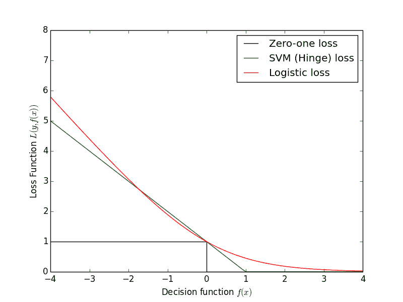

逻辑、铰链和零一损失函数

前面的损失图是从 scikit-learn 示例调整而来的[`scikit-learn.org/stable/auto_examples/linear_model/plot_sgd_loss_functions.html`](http://scikit-learn.org/stable/auto_examples/linear_model/plot_sgd_loss_functions.html)。

# 逻辑回归

逻辑回归是一个概率模型，也就是说，它的预测值介于 0 和 1 之间，对于二元分类，等同于模型对数据点属于正类的概率的估计。逻辑回归是最广泛使用的线性分类模型之一。

如前所述，逻辑回归中使用的链接函数是 logit 链接：

*1 / (1 + exp(- W^Tx)) a*

逻辑回归的相关损失函数是逻辑损失：

*log(1 + exp(-y W^Tx)) *

这里，*y*是实际的目标变量（正类别为 1，负类别为-1）。

# 多项式逻辑回归

多项式逻辑回归推广到多类问题；它允许结果变量有两个以上的类别。与二元逻辑回归一样，多项式逻辑回归也使用最大似然估计来评估概率。

多项式逻辑回归主要用于被解释变量是名义的情况。多项式逻辑回归是一个分类问题，其中观察到的特征和参数的线性组合可以用来计算依赖变量的每个特定结果的概率。

在本章中，我们将使用一个不同的数据集，而不是我们用于推荐模型的数据集，因为 MovieLens 数据对于我们解决分类问题并不多。我们将使用 Kaggle 上的一项竞赛数据集。该数据集由 StumbleUpon 提供，问题涉及对给定网页进行分类，判断其是短暂的（即短暂存在，很快就不再流行）还是长青的（即持续流行）在他们的网页内容推荐页面上。

此处使用的数据集可以从[`www.kaggle.com/c/stumbleupon/data`](http://www.kaggle.com/c/stumbleupon/data)下载。

下载训练数据（`train.tsv`）-您需要在下载数据集之前接受条款和条件。

您可以在[`www.kaggle.com/c/stumbleupon`](http://www.kaggle.com/c/stumbleupon)找到有关该竞赛的更多信息。

可以在[`github.com/ml-resources/spark-ml/tree/branch-ed2/Chapter_06/2.0.0/src/scala/org/sparksamples/classification/stumbleupon`](https://github.com/ml-resources/spark-ml/tree/branch-ed2/Chapter_06/2.0.0/src/scala/org/sparksamples/classification/stumbleupon)找到开始的代码列表。

以下是使用 Spark SQLContext 存储为临时表的 StumbleUpon 数据集的一瞥：

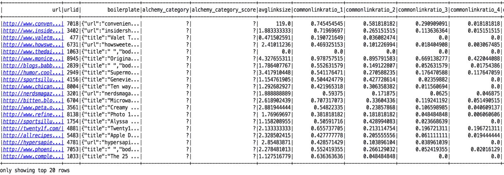

# 可视化 StumbleUpon 数据集

我们运行了自定义逻辑，将特征数量减少到两个，以便我们可以在二维平面上可视化数据集，保持数据集中的线条不变。

```scala
{ 
 val sc = new SparkContext("local[1]", "Classification") 

  // get StumbleUpon dataset 'https://www.kaggle.com/c/stumbleupon' 
  val records = sc.textFile( 
   SparkConstants.PATH + "data/train_noheader.tsv").map( 
   line => line.split("\t")) 

  val data_persistent = records.map { r => 
    val trimmed = r.map(_.replaceAll("\"", "")) 
    val label = trimmed(r.size - 1).toInt 
    val features = trimmed.slice(4, r.size - 1).map( 
     d => if (d == "?") 0.0 else d.toDouble) 
    val len = features.size.toInt 
    val len_2 = math.floor(len/2).toInt 
    val x = features.slice(0,len_2) 

    val y = features.slice(len_2 -1 ,len ) 
    var i=0 
    var sum_x = 0.0 
    var sum_y = 0.0 
    while (i < x.length) { 
    sum_x += x(i) 
    i += 1 
 } 

 i = 0 
 while (i < y.length) { 
   sum_y += y(i) 
   i += 1 
 } 

 if (sum_y != 0.0) { 
    if(sum_x != 0.0) { 
       math.log(sum_x) + "," + math.log(sum_y) 
    }else { 
       sum_x + "," + math.log(sum_y) 
    }   
 }else { 
    if(sum_x != 0.0) { 
         math.log(sum_x) + "," + 0.0 
    }else { 
        sum_x + "," + 0.0 
    } 
  } 

} 
val dataone = data_persistent.first() 
  data_persistent.saveAsTextFile(SparkConstants.PATH + 
   "/results/raw-input-log") 
  sc.stop() 

} 

```

一旦我们将数据转换为二维格式，就会对*x*和*y*应用对数尺度以方便绘图。在我们的情况下，我们使用 D3.js 进行绘图，如下所示。这些数据将被分类为两类，并且我们将使用相同的基础图像来显示分类：


# 从 Kaggle/StumbleUpon 长青分类数据集中提取特征

在开始之前，我们将删除文件的第一行列名标题，以便我们更容易在 Spark 中处理数据。切换到您下载数据的目录（这里称为`PATH`），运行以下命令以删除第一行，并将结果导出到一个名为`train_noheader.tsv`的新文件中：

```scala
  > sed 1d train.tsv > train_noheader.tsv 

```

现在，我们准备启动我们的 Spark shell（记得从您的 Spark 安装目录运行此命令）：

```scala
  >./bin/spark-shell --driver-memory 4g  

```

您可以直接在 Spark shell 中输入本章剩余部分的代码。

与之前章节类似，我们将将原始训练数据加载到 RDD 中，并进行检查：

```scala
val rawData = sc.textFile("/PATH/train_noheader.tsv") 
val records = rawData.map(line => line.split("\t")) 
records.first() 

```

屏幕上会看到以下内容：

```scala
Array[String] = Array("http://www.bloomberg.com/news/2010-12-23/ibm-predicts-holographic-calls-air-breathing-batteries-by-2015.html", "4042", ...  

```

您可以通过阅读数据集页面上的概述来检查可用的字段，如前面提到的。前两列包含页面的 URL 和 ID。下一列包含一些原始文本内容。下一列包含分配给页面的类别。接下来的 22 列包含各种数字或分类特征。最后一列包含目标--1 表示长青，而 0 表示非长青。

我们将从直接使用可用的数字特征开始。由于每个分类变量都是二进制的，我们已经对这些变量进行了*1-of-k*编码，因此我们不需要进行进一步的特征提取。

由于数据格式的原因，在初始处理过程中，我们将不得不进行一些数据清理，去除额外的引号字符（`"`）。数据集中还存在缺失值；它们由`"?"`字符表示。在这种情况下，我们将简单地为这些缺失值分配一个零值。

```scala
import org.apache.spark.mllib.regression.LabeledPoint 
import org.apache.spark.mllib.linalg.Vectors 
val data = records.map { r => 
  val trimmed = r.map(_.replaceAll("\"", "")) 
  val label = trimmed(r.size - 1).toInt 
  val features = trimmed.slice(4, r.size - 1).map(d => if (d ==   "?") 0.0 else d.toDouble) 
  LabeledPoint(label, Vectors.dense(features)) 
} 

```

在上述代码中，我们从最后一列中提取了`label`变量，并在清理和处理缺失值后，提取了列 5 到 25 的`features`数组。我们将`label`变量转换为整数值，将`features`变量转换为`Array[Double]`。最后，我们将`label`和`features`包装在`LabeledPoint`实例中，将特征转换为 MLlib 向量。

我们还将缓存数据并计算数据点的数量如下：

```scala
data.cache 
val numData = data.count 

```

您将看到`numData`的值为`7395`。

稍后我们将更详细地探索数据集，但现在我们会告诉您数值数据中有一些负特征值。正如我们之前看到的，朴素贝叶斯模型需要非负特征，并且如果遇到负值，将会抛出错误。因此，现在我们将通过将任何负特征值设置为零来为朴素贝叶斯模型创建我们输入特征向量的版本。

```scala
val nbData = records.map { r => 
  val trimmed = r.map(_.replaceAll("\"", "")) 
  val label = trimmed(r.size - 1).toInt 
  val features = trimmed.slice(4, r.size - 1).map(d => if (d ==  
  "?") 0.0 else d.toDouble).map(d => if (d < 0) 0.0 else d) 
  LabeledPoint(label, Vectors.dense(features)) 
}  

```

# StumbleUponExecutor

StumbleUponExecutor ([`github.com/ml-resources/spark-ml/blob/branch-ed2/Chapter_06/2.0.0/scala-spark-app/src/main/scala/org/sparksamples/classification/stumbleupon/StumbleUponExecutor.scala`](https://github.com/ml-resources/spark-ml/blob/branch-ed2/Chapter_06/2.0.0/scala-spark-app/src/main/scala/org/sparksamples/classification/stumbleupon/StumbleUponExecutor.scala)) 对象可用于选择和运行相应的分类模型；例如，要运行`LogisiticRegression`并执行逻辑回归管道，将程序参数设置为 LR。有关其他命令，请参考以下代码片段：

```scala
case "LR" => LogisticRegressionPipeline.logisticRegressionPipeline(vectorAssembler, dataFrame) 

case "DT" => DecisionTreePipeline.decisionTreePipeline(vectorAssembler, dataFrame) 

case "RF" => RandomForestPipeline.randomForestPipeline(vectorAssembler, dataFrame) 

case "GBT" => GradientBoostedTreePipeline.gradientBoostedTreePipeline(vectorAssembler, dataFrame) 

case "NB" => NaiveBayesPipeline.naiveBayesPipeline(vectorAssembler, dataFrame) 

case "SVM" => SVMPipeline.svmPipeline(sparkContext) 

```

让我们通过将 StumbleUpon 数据集分成 80%的训练集和 20%的测试集来进行训练；使用`LogisticRegression`和`TrainValidationSplit`从 Spark 构建模型，并获得关于测试数据的评估指标：

```scala
// create logisitic regression object 
val lr = new LogisticRegression() 

```

为了创建一个管道对象，我们将使用`ParamGridBuilder`。`ParamGridBuilder`用于构建参数网格，这是一个供估计器选择或搜索的参数列表，以便进行最佳模型选择。您可以在以下链接找到更多详细信息：

[`spark.apache.org/docs/2.0.0/api/java/org/apache/spark/ml/tuning/ParamGridBuilder.html`](https://spark.apache.org/docs/2.0.0/api/java/org/apache/spark/ml/tuning/ParamGridBuilder.html)

```scala
-------------------------------------------------------------------------------------------
org.apache.spark.ml.tuning 
Class ParamGridBuilder 
Builder for a param grid used in grid search-based model selection. 
-------------------------------------------------------------------------------------------

// set params using ParamGrid builder 
val paramGrid = new ParamGridBuilder() 
  .addGrid(lr.regParam, Array(0.1, 0.01)) 
  .addGrid(lr.fitIntercept) 
  .addGrid(lr.elasticNetParam, Array(0.0, 0.25, 0.5, 0.75, 1.0)) 
  .build() 

// set pipeline to run the vector assembler and logistic regression // estimator 
val pipeline = new Pipeline().setStages(Array(vectorAssembler, 
 lr)) 

```

我们将使用`TrainValidationSplit`进行超参数调整。与`CrossValidator`相比，它对每个参数组合进行一次评估，而不是*k*次。它创建一个单一的训练、测试数据集对，并且基于`trainRatio`参数进行训练和测试的拆分。

`Trainvalidationsplit`接受`Estimator`，在`estimatorParamMaps`参数中提供的一组`ParamMaps`，以及`Evaluator`。有关更多信息，请参考以下链接：

[`spark.apache.org/docs/latest/api/scala/index.html#org.apache.spark.ml.tuning.TrainValidationSplit`](http://spark.apache.org/docs/latest/api/scala/index.html#org.apache.spark.ml.tuning.TrainValidationSplit)

```scala
-------------------------------------------------------------------------------------------
org.apache.spark.ml.tuning 
Class TraiValidationSplit 
Validation for hyper-parameter tuning. Randomly splits the input dataset into train and validation sets. 
-------------------------------------------------------------------------------------------

// use train validation split and regression evaluator for //evaluation 
val trainValidationSplit = new TrainValidationSplit() 
  .setEstimator(pipeline) 
  .setEvaluator(new RegressionEvaluator) 
  .setEstimatorParamMaps(paramGrid) 
  .setTrainRatio(0.8) 

val Array(training, test) = dataFrame.randomSplit(Array(0.8, 0.2), seed = 12345) 

// run the estimator 
val model = trainValidationSplit.fit(training) 

val holdout = model.transform(test).select("prediction","label") 

// have to do a type conversion for RegressionMetrics 
val rm = new RegressionMetrics(holdout.rdd.map(x => (x(0).asInstanceOf[Double], x(1).asInstanceOf[Double]))) 

logger.info("Test Metrics") 
logger.info("Test Explained Variance:") 
logger.info(rm.explainedVariance) 
logger.info("Test R² Coef:") 
logger.info(rm.r2) 
logger.info("Test MSE:") 
logger.info(rm.meanSquaredError) 
logger.info("Test RMSE:") 
logger.info(rm.rootMeanSquaredError) 

val totalPoints = test.count() 
val lrTotalCorrect = holdout.rdd.map(
  x => if (x(0).asInstanceOf[Double] == x(1).asInstanceOf[Double]) 
  1 else 0).sum() 
val accuracy = lrTotalCorrect/totalPoints 
println("Accuracy of LogisticRegression is: ", accuracy) 

```

您将看到以下输出显示：

```scala
Accuracy of LogisticRegression is: ,0.6374918354016982
Mean Squared Error:,0.3625081645983018
Root Mean Squared Error:,0.6020865092312747  

```

代码清单可以在此链接找到：[`github.com/ml-resources/spark-ml/blob/branch-ed2/Chapter_06/2.0.0/scala-spark-app/src/main/scala/org/sparksamples/classification/stumbleupon/LogisticRegressionPipeline.scala`](https://github.com/ml-resources/spark-ml/blob/branch-ed2/Chapter_06/2.0.0/scala-spark-app/src/main/scala/org/sparksamples/classification/stumbleupon/LogisticRegressionPipeline.scala)

在这两个截图中显示了预测和实际数据的二维散点图可视化：

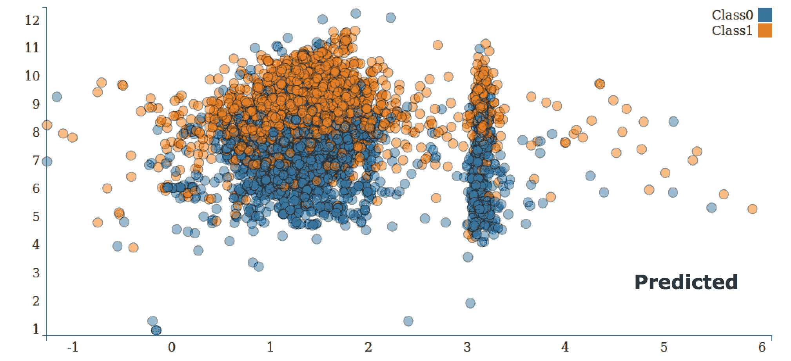

# 线性支持向量机

SVM 是回归和分类的强大且流行的技术。与逻辑回归不同，它不是概率模型，而是根据模型评估是正面还是负面来预测类别。

SVM 链接函数是恒等链接，因此预测的结果如下：

*y = w^Tx*

因此，如果*wTx*的评估大于或等于阈值 0，SVM 将把数据点分配给类 1；否则，SVM 将把它分配给类 0。

（此阈值是 SVM 的模型参数，可以进行调整）。

SVM 的损失函数称为铰链损失，定义如下：

*max(0, 1 - yw^Tx)*

SVM 是最大间隔分类器--它试图找到一个权重向量，使得类尽可能分开。已经证明在许多分类任务上表现良好，线性变体可以扩展到非常大的数据集。

SVM 有大量的理论支持，超出了本书的范围，但您可以访问[`en.wikipedia.org/wiki/Support_vector_machine`](http://en.wikipedia.org/wiki/Support_vector_machine)和[`www.support-vector-machines.org/`](http://www.support-vector-machines.org/)了解更多详情。

在下图中，我们根据之前解释的简单二元分类示例，绘制了逻辑回归（蓝线）和线性 SVM（红线）的不同决策函数。

您可以看到 SVM 有效地聚焦于距离决策函数最近的点（边际线用红色虚线显示）：

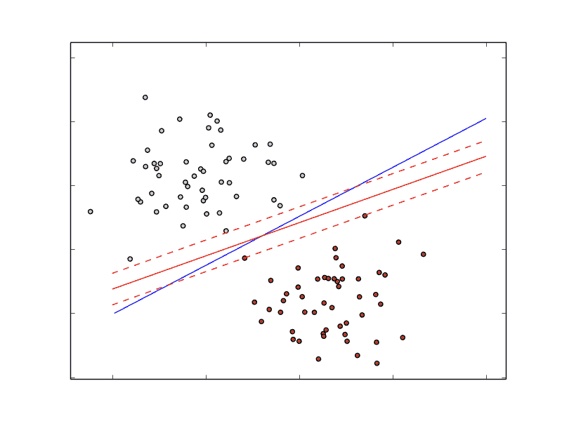

逻辑回归和线性 SVM 的二元分类决策函数

让我们通过将 StumbleUpon 数据集分为 80%的训练集和 20%的测试集，使用 Spark 中的 SVM 构建模型，并在测试数据周围获取评估指标：

```scala
// read stumble upon dataset as rdd 
val records = sc.textFile("/home/ubuntu/work/ml-resources/spark-ml/train_noheader.tsv").map(line => line.split("\t")) 

// get features and label from the rdd 
val data = records.map { r => 
    val trimmed = r.map(_.replaceAll("\"", "")) 
    val label = trimmed(r.size - 1).toInt 
    val features = trimmed.slice(4, r.size - 1).map(d => if (d == "?") 0.0 else d.toDouble) 
    LabeledPoint(label, Vectors.dense(features)) 
  } 

  // params for SVM 
  val numIterations = 10 

  // Run training algorithm to build the model 
  val svmModel = SVMWithSGD.train(data, numIterations) 

  // Clear the default threshold. 
  svmModel.clearThreshold() 

  val svmTotalCorrect = data.map { point => 
    if(svmModel.predict(point.features) == point.label) 1 else 0 
  }.sum() 

  // calculate accuracy 
  val svmAccuracy = svmTotalCorrect / data.count() 
  println(svmAccuracy) 
} 

```

您将看到以下输出显示：

```scala
 Area under ROC = 1.0  

```

代码清单可在[`github.com/ml-resources/spark-ml/blob/branch-ed2/Chapter_06/2.0.0/scala-spark-app/src/main/scala/org/sparksamples/classification/stumbleupon/SVMPipeline.scala`](https://github.com/ml-resources/spark-ml/blob/branch-ed2/Chapter_06/2.0.0/scala-spark-app/src/main/scala/org/sparksamples/classification/stumbleupon/SVMPipeline.scala)找到。

# 朴素贝叶斯模型

朴素贝叶斯是一个概率模型，通过计算数据点属于给定类的概率来进行预测。朴素贝叶斯模型假设每个特征对分配给类的概率做出独立贡献（假设特征之间具有条件独立性）。

由于这个假设，每个类的概率成为特征出现给定类的概率以及该类的概率的乘积函数。这使得训练模型变得可行且相对简单。类先验概率和特征条件概率都是从数据集中的频率估计得出的。分类是通过选择最可能的类来执行的，给定特征和类概率。

还对特征分布做出了假设（其参数是从数据中估计得出的）。Spark ML 实现了多项式朴素贝叶斯，假设特征分布是代表特征的非负频率计数的多项式分布。

它适用于二元特征（例如，1-of-k 编码的分类特征），通常用于文本和文档分类（正如我们在第四章中看到的，*使用 Spark 获取、处理和准备数据*，词袋向量是典型的特征表示）。

在 Spark 文档的*ML - 朴素贝叶斯*部分查看更多信息，网址为[`spark.apache.org/docs/latest/ml-classification-regression.html#naive-bayes`](http://spark.apache.org/docs/latest/ml-classification-regression.html#naive-bayes)。

维基百科页面[`en.wikipedia.org/wiki/Naive_Bayes_classifier`](http://en.wikipedia.org/wiki/Naive_Bayes_classifier)对数学公式有更详细的解释。

在下图中，我们展示了朴素贝叶斯在我们简单的二元分类示例上的决策函数：

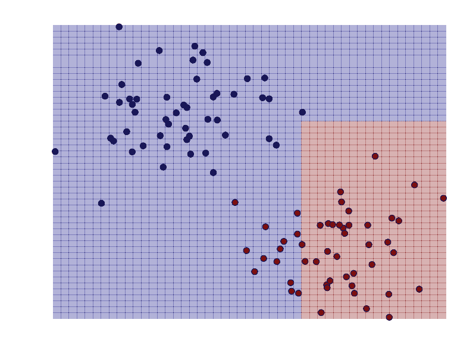

朴素贝叶斯的决策函数用于二元分类

让我们将 StumbleUpon 数据集分成 80%的训练集和 20%的测试集，使用 Spark 中的朴素贝叶斯构建模型，并在测试数据周围获取评估指标如下：

```scala
// split data randomly into training and testing dataset 
val Array(training, test) = dataFrame.randomSplit(Array(0.8, 0.2), seed = 12345) 

// Set up Pipeline 
val stages = new mutable.ArrayBuffer[PipelineStage]() 

val labelIndexer = new StringIndexer() 
  .setInputCol("label") 
  .setOutputCol("indexedLabel") 
stages += labelIndexer 

// create naive bayes model 
val nb = new NaiveBayes() 

stages += vectorAssembler 
stages += nb 
val pipeline = new Pipeline().setStages(stages.toArray) 

// Fit the Pipeline 
val startTime = System.nanoTime() 
val model = pipeline.fit(training) 
val elapsedTime = (System.nanoTime() - startTime) / 1e9 
println(s"Training time: $elapsedTime seconds") 

val holdout = model.transform(test).select("prediction","label") 

// Select (prediction, true label) and compute test error 
val evaluator = new MulticlassClassificationEvaluator() 
  .setLabelCol("label") 
  .setPredictionCol("prediction") 
  .setMetricName("accuracy") 
val mAccuracy = evaluator.evaluate(holdout) 
println("Test set accuracy = " + mAccuracy) 

```

您将看到以下输出显示：

```scala
Training time: 2.114725642 seconds
Accuracy: 0.5660377358490566   

```

完整的代码清单可在[`github.com/ml-resources/spark-ml/blob/branch-ed2/Chapter_06/2.0.0/scala-spark-app/src/main/scala/org/sparksamples/classification/stumbleupon/NaiveBayesPipeline.scala`](https://github.com/ml-resources/spark-ml/blob/branch-ed2/Chapter_06/2.0.0/scala-spark-app/src/main/scala/org/sparksamples/classification/stumbleupon/NaiveBayesPipeline.scala)找到。

在这里显示了预测和实际数据的二维散点图的可视化：


# 决策树

决策树模型是一种强大的非概率技术，可以捕捉更复杂的非线性模式和特征交互。已经证明在许多任务上表现良好，相对容易理解和解释，可以处理分类和数值特征，并且不需要输入数据进行缩放或标准化。它们非常适合包含在集成方法中（例如，决策树模型的集成，称为决策森林）。

决策树模型构建了一棵树，其中叶子表示对类 0 或 1 的类分配，分支是一组特征。在下图中，我们展示了一个简单的决策树，其中二元结果是**呆在家里**或**去海滩**。特征是外面的天气。

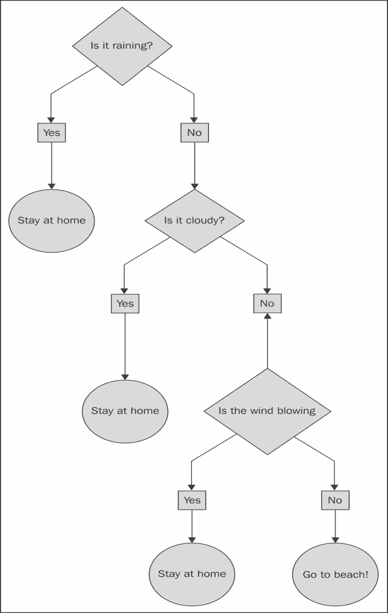

一个简单的决策树

决策树算法是自顶向下的方法，从根节点（或特征）开始，然后在每一步选择一个特征，该特征通过信息增益来衡量数据集的最佳分割。信息增益是从节点不纯度（标签在节点上相似或同质的程度）减去由分割创建的两个子节点的不纯度的加权和计算而来。对于分类任务，有两种可以用来选择最佳分割的度量。这些是基尼不纯度和熵。

有关决策树算法和分类的不纯度度量的更多细节，请参阅[`spark.apache.org/docs/latest/ml-classification-regression.html#decision-tree-classifier`](http://spark.apache.org/docs/latest/ml-classification-regression.html#decision-tree-classifier)中的*ML Library - Decision Tree*部分的*Spark 编程指南*。

在下面的截图中，我们已经绘制了决策树模型的决策边界，就像我们之前对其他模型所做的那样。我们可以看到决策树能够拟合复杂的非线性模型：

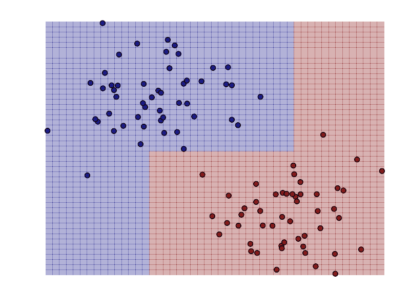

二元分类的决策树的决策函数

让我们将 StumbleUpon 数据集分成 80%的训练集和 20%的测试集，使用 Spark 中的决策树构建模型，并在测试数据周围获取评估指标如下：

```scala
// split data randomly into training and testing dataset 
val Array(training, test) = dataFrame.randomSplit(Array(0.8, 0.2), seed = 12345) 

// Set up Pipeline 
val stages = new mutable.ArrayBuffer[PipelineStage]() 

val labelIndexer = new StringIndexer() 
  .setInputCol("label") 
  .setOutputCol("indexedLabel") 
stages += labelIndexer 

// create Decision Tree Model 
val dt = new DecisionTreeClassifier() 
  .setFeaturesCol(vectorAssembler.getOutputCol) 
  .setLabelCol("indexedLabel") 
  .setMaxDepth(5) 
  .setMaxBins(32) 
  .setMinInstancesPerNode(1) 
  .setMinInfoGain(0.0) 
  .setCacheNodeIds(false) 
  .setCheckpointInterval(10) 

stages += vectorAssembler 
stages += dt 
val pipeline = new Pipeline().setStages(stages.toArray) 

// Fit the Pipeline 
val startTime = System.nanoTime() 
val model = pipeline.fit(training) 
val elapsedTime = (System.nanoTime() - startTime) / 1e9 
println(s"Training time: $elapsedTime seconds") 

val holdout = model.transform(test).select("prediction","label") 

// Select (prediction, true label) and compute test error 
val evaluator = new MulticlassClassificationEvaluator() 
  .setLabelCol("label") 
  .setPredictionCol("prediction") 
  .setMetricName("accuracy") 
val mAccuracy = evaluator.evaluate(holdout) 
println("Test set accuracy = " + mAccuracy) 

```

您将看到以下输出显示：

```scala
Accuracy: 0.3786163522012579  

```

代码清单可在[`github.com/ml-resources/spark-ml/blob/branch-ed2/Chapter_06/2.0.0/scala-spark-app/src/main/scala/org/sparksamples/classification/stumbleupon/DecisionTreePipeline.scala`](https://github.com/ml-resources/spark-ml/blob/branch-ed2/Chapter_06/2.0.0/scala-spark-app/src/main/scala/org/sparksamples/classification/stumbleupon/DecisionTreePipeline.scala)找到。

在下面的图中显示了二维散点图中预测和实际数据的可视化：


# 树的集成

集成方法是一种机器学习算法，它创建由一组其他基本模型组成的模型。Spark 机器学习支持两种主要的集成算法：随机森林和梯度提升树。

# 随机森林

随机森林被称为决策树的集成，由许多决策树组成。与决策树一样，随机森林可以处理分类特征，支持多类别分类，并且不需要特征缩放。

Spark ML 支持随机森林用于二元和多类别分类以及使用连续和分类特征进行回归。

让我们通过将样本 lib SVM 数据分为 80%的训练和 20%的测试，使用 Spark 中的随机森林分类器来构建模型，并获得关于测试数据的评估指标。模型可以被持久化并加载以供以后使用。

让我们通过将 StumbleUpon 数据集分为 80%的训练和 20%的测试，使用 Spark 中的随机森林树来构建模型，并获得关于测试数据的评估指标：

```scala
// split data randomly into training and testing dataset 
val Array(training, test) = dataFrame.randomSplit(Array(0.8, 0.2), seed = 12345) 

// Set up Pipeline 
val stages = new mutable.ArrayBuffer[PipelineStage]() 

val labelIndexer = new StringIndexer() 
  .setInputCol("label") 
  .setOutputCol("indexedLabel") 
stages += labelIndexer 

// create Random Forest Model 
val rf = new RandomForestClassifier() 
  .setFeaturesCol(vectorAssembler.getOutputCol) 
  .setLabelCol("indexedLabel") 
  .setNumTrees(20) 
  .setMaxDepth(5) 
  .setMaxBins(32) 
  .setMinInstancesPerNode(1) 
  .setMinInfoGain(0.0) 
  .setCacheNodeIds(false) 
  .setCheckpointInterval(10) 

stages += vectorAssembler 
stages += rf 
val pipeline = new Pipeline().setStages(stages.toArray) 

// Fit the Pipeline 
val startTime = System.nanoTime() 
val model = pipeline.fit(training) 
val elapsedTime = (System.nanoTime() - startTime) / 1e9 
println(s"Training time: $elapsedTime seconds") 

val holdout = model.transform(test).select("prediction","label") 

// Select (prediction, true label) and compute test error 
val evaluator = new MulticlassClassificationEvaluator() 
  .setLabelCol("label") 
  .setPredictionCol("prediction") 
  .setMetricName("accuracy") 
val mAccuracy = evaluator.evaluate(holdout) 
println("Test set accuracy = " + mAccuracy) 

```

您将看到以下输出显示：

```scala
Accuracy: 0.348  

```

完整的代码清单可在[`github.com/ml-resources/spark-ml/blob/branch-ed2/Chapter_06/2.0.0/scala-spark-app/src/main/scala/org/sparksamples/classification/stumbleupon/RandomForestPipeline.scala`](https://github.com/ml-resources/spark-ml/blob/branch-ed2/Chapter_06/2.0.0/scala-spark-app/src/main/scala/org/sparksamples/classification/stumbleupon/RandomForestPipeline.scala)找到。

在这里显示了二维散点图中的预测和实际数据的可视化：

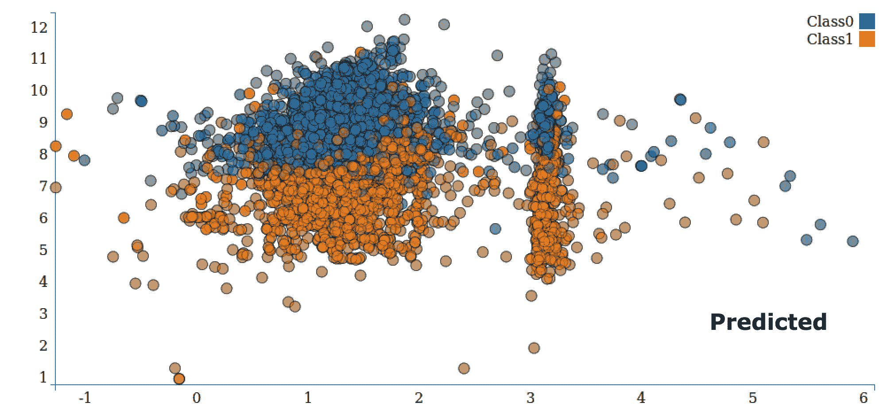

# 梯度提升树

梯度提升树是决策树的集成。梯度提升树迭代训练决策树以最小化损失函数。梯度提升树处理分类特征，支持多类别分类，并且不需要特征缩放。

Spark ML 使用现有的决策树实现梯度提升树。它支持分类和回归。

让我们通过将 StumbleUpon 数据集分为 80%的训练和 20%的测试，使用 Spark 中的梯度提升树来构建模型，并获得关于测试数据的评估指标：

```scala
// split data randomly into training and testing dataset 
val Array(training, test) = dataFrame.randomSplit(Array(0.8, 0.2), seed = 12345) 

// Set up Pipeline 
val stages = new mutable.ArrayBuffer[PipelineStage]() 

val labelIndexer = new StringIndexer() 
  .setInputCol("label") 
  .setOutputCol("indexedLabel") 
stages += labelIndexer 

// create GBT Model 
val gbt = new GBTClassifier() 
  .setFeaturesCol(vectorAssembler.getOutputCol) 
  .setLabelCol("indexedLabel") 
  .setMaxIter(10) 

stages += vectorAssembler 
stages += gbt 
val pipeline = new Pipeline().setStages(stages.toArray) 

// Fit the Pipeline 
val startTime = System.nanoTime() 
val model = pipeline.fit(training) 
val elapsedTime = (System.nanoTime() - startTime) / 1e9 
println(s"Training time: $elapsedTime seconds") 

val holdout = model.transform(test).select("prediction","label") 

// have to do a type conversion for RegressionMetrics 
val rm = new RegressionMetrics(holdout.rdd.map(x => (x(0).asInstanceOf[Double], x(1).asInstanceOf[Double]))) 

logger.info("Test Metrics") 
logger.info("Test Explained Variance:") 
logger.info(rm.explainedVariance) 
logger.info("Test R² Coef:") 
logger.info(rm.r2) 
logger.info("Test MSE:") 
logger.info(rm.meanSquaredError) 
logger.info("Test RMSE:") 
logger.info(rm.rootMeanSquaredError) 

val predictions = model.transform(test).select("prediction").rdd.map(_.getDouble(0)) 
val labels = model.transform(test).select("label").rdd.map(_.getDouble(0)) 
val accuracy = new MulticlassMetrics(predictions.zip(labels)).precision 
println(s"  Accuracy : $accuracy") 

```

您将看到以下输出显示：

```scala
Accuracy: 0.3647  

```

代码清单可以在[`github.com/ml-resources/spark-ml/blob/branch-ed2/Chapter_06/2.0.0/scala-spark-app/src/main/scala/org/sparksamples/classification/stumbleupon/GradientBoostedTreePipeline.scala`](https://github.com/ml-resources/spark-ml/blob/branch-ed2/Chapter_06/2.0.0/scala-spark-app/src/main/scala/org/sparksamples/classification/stumbleupon/GradientBoostedTreePipeline.scala)找到。

在以下图表中显示了二维散点图中的预测可视化：

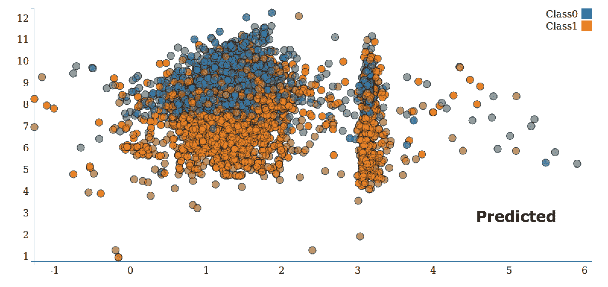

# 多层感知器分类器

神经网络是一个复杂的自适应系统，它根据通过它流动的信息改变其内部结构，使用权重。优化多层神经网络的权重称为**反向传播**。反向传播略微超出了本书的范围，并涉及激活函数和基本微积分。

多层感知器分类器基于前馈人工神经网络。它由多个层组成。每个神经层与网络中的下一个神经层完全连接，输入层中的节点表示输入数据。所有其他节点通过使用节点的权重和偏差执行输入的线性组合，并应用激活或链接函数将输入映射到输出。

让我们通过将样本`libsvm`数据分为 80%的训练和 20%的测试，使用 Spark 中的多层感知器分类器来构建模型，并获得关于测试数据的评估指标：

```scala
package org.sparksamples.classification.stumbleupon 

import org.apache.spark.ml.classification.MultilayerPerceptronClassifier 
import org.apache.spark.ml.evaluation.MulticlassClassificationEvaluator 
import org.apache.spark.sql.SparkSession 

// set VM Option as -Dspark.master=local[1] 
object MultilayerPerceptronClassifierExample { 

  def main(args: Array[String]): Unit = { 
    val spark = SparkSession 
      .builder 
      .appName("MultilayerPerceptronClassifierExample") 
      .getOrCreate() 

    // Load the data stored in LIBSVM format as a DataFrame. 
    val data = spark.read.format("libsvm") 
      .load("/Users/manpreet.singh/Sandbox/codehub/github/machinelearning/spark-ml/Chapter_06/2.0.0/scala-spark-app/src/main/scala/org/sparksamples/classification/dataset/spark-data/sample_multiclass_classification_data.txt") 

    // Split the data into train and test 
    val splits = data.randomSplit(Array(0.8, 0.2), seed = 1234L) 
    val train = splits(0) 
    val test = splits(1) 

    // specify layers for the neural network: 
    // input layer of size 4 (features),  
    //two intermediate of size 5 and 4 
    // and output of size 3 (classes) 
    val layers = ArrayInt 

    // create the trainer and set its parameters 
    val trainer = new MultilayerPerceptronClassifier() 
      .setLayers(layers) 
      .setBlockSize(128) 
      .setSeed(1234L) 
      .setMaxIter(100) 

    // train the model 
    val model = trainer.fit(train) 

    // compute accuracy on the test set 
    val result = model.transform(test) 
    val predictionAndLabels = result.select("prediction", "label") 
    val evaluator = new MulticlassClassificationEvaluator() 
      .setMetricName("accuracy") 

    println("Test set accuracy = " + 
     evaluator.evaluate(predictionAndLabels)) 

    spark.stop() 
  } 
} 

```

您将看到以下输出显示：

```scala
Precision = 1.0  

```

代码清单可在[`github.com/ml-resources/spark-ml/blob/branch-ed2/Chapter_06/2.0.0/scala-spark-app/src/main/scala/org/sparksamples/classification/stumbleupon/MultilayerPerceptronClassifierExample.scala`](https://github.com/ml-resources/spark-ml/blob/branch-ed2/Chapter_06/2.0.0/scala-spark-app/src/main/scala/org/sparksamples/classification/stumbleupon/MultilayerPerceptronClassifierExample.scala)找到。

在我们进一步进行之前，请注意以下特征提取和分类的示例使用 Spark v1.6 中的 MLLib 包。请按照之前提到的代码清单来使用 Spark v2.0 基于 Dataframe 的 API。截至 Spark 2.0，基于 RDD 的 API 已进入维护模式。

# 从数据中提取正确的特征

您可能还记得第四章中的内容，*使用 Spark 获取、处理和准备数据*，大多数机器学习模型都是在特征向量的数值数据上操作的。此外，对于监督学习方法，如分类和回归，我们需要提供目标变量（或在多类情况下的变量）以及特征向量。

MLlib 中的分类模型操作`LabeledPoint`的实例，它是目标变量（称为`label`）和`feature`向量的包装器。

```scala
case class LabeledPoint(label: Double, features: Vector) 

```

在大多数分类使用的示例中，您将遇到已经以向量格式存在的现有数据集，但在实践中，您通常会从需要转换为特征的原始数据开始。正如我们已经看到的，这可能涉及预处理和转换，如对数值特征进行分箱处理，对特征进行缩放和归一化，以及对分类特征使用 1-of-k 编码。

# 训练分类模型

现在我们已经从数据集中提取了一些基本特征并创建了我们的输入 RDD，我们已经准备好训练多个模型了。为了比较不同模型的性能和使用情况，我们将使用逻辑回归、SVM、朴素贝叶斯和决策树来训练一个模型。您会注意到，训练每个模型看起来几乎相同，尽管每个模型都有自己特定的模型参数，可以设置。Spark ML 在大多数情况下设置了合理的默认值，但在实践中，最佳参数设置应该使用评估技术来选择，我们将在本章后面介绍。

# 在 Kaggle/StumbleUpon 永久分类数据集上训练分类模型

现在，我们可以将 Spark ML 中的模型应用于我们的输入数据。首先，我们需要导入所需的类，并为每个模型设置一些最小输入参数。对于逻辑回归和 SVM，这是迭代次数，而对于决策树模型，这是最大树深度。

```scala
import  
org.apache.spark.mllib.classification.LogisticRegressionWithSGD 
import org.apache.spark.mllib.classification.SVMWithSGD 
import org.apache.spark.mllib.classification.NaiveBayes 
import org.apache.spark.mllib.tree.DecisionTree 
import org.apache.spark.mllib.tree.configuration.Algo 
import org.apache.spark.mllib.tree.impurity.Entropy  
val numIterations = 10 
val maxTreeDepth = 5 

```

现在，依次训练每个模型。首先，我们将训练逻辑回归模型如下：

```scala
val lrModel = LogisticRegressionWithSGD.train(data, numIterations) 

```

您将看到以下输出：

```scala
...
14/12/06 13:41:47 INFO DAGScheduler: Job 81 finished: reduce at RDDFunctions.scala:112, took 0.011968 s
14/12/06 13:41:47 INFO GradientDescent: GradientDescent.runMiniBatchSGD finished. Last 10 stochastic losses 0.6931471805599474, 1196521.395699124, Infinity, 1861127.002201189, Infinity, 2639638.049627607, Infinity, Infinity, Infinity, Infinity
lrModel: org.apache.spark.mllib.classification.LogisticRegressionModel = (weights=[-0.11372778986947886,-0.511619752777837, 
...  

```

接下来，我们将这样训练一个 SVM 模型：

```scala
val svmModel = SVMWithSGD.train(data, numIterations) 

```

您现在将看到以下输出：

```scala
...
14/12/06 13:43:08 INFO DAGScheduler: Job 94 finished: reduce at RDDFunctions.scala:112, took 0.007192 s
14/12/06 13:43:08 INFO GradientDescent: GradientDescent.runMiniBatchSGD finished. Last 10 stochastic losses 1.0, 2398226.619666797, 2196192.9647478117, 3057987.2024311484, 271452.9038284356, 3158131.191895948, 1041799.350498323, 1507522.941537049, 1754560.9909073508, 136866.76745605646
svmModel: org.apache.spark.mllib.classification.SVMModel = (weights=[-0.12218838697834929,-0.5275107581589767,
...  

```

然后，我们将训练朴素贝叶斯模型；请记住使用您特殊的非负特征数据集：

```scala
val nbModel = NaiveBayes.train(nbData) 

```

以下是输出：

```scala
...
14/12/06 13:44:48 INFO DAGScheduler: Job 95 finished: collect at NaiveBayes.scala:120, took 0.441273 s
nbModel: org.apache.spark.mllib.classification.NaiveBayesModel = org.apache.spark.mllib.classification.NaiveBayesModel@666ac612 
...  

```

最后，我们将训练我们的决策树。

```scala
val dtModel = DecisionTree.train(data, Algo.Classification, Entropy, maxTreeDepth) 

```

输出如下：

```scala
...
14/12/06 13:46:03 INFO DAGScheduler: Job 104 finished: collectAsMap at DecisionTree.scala:653, took 0.031338 s
...
total: 0.343024
findSplitsBins: 0.119499
findBestSplits: 0.200352
chooseSplits: 0.199705
dtModel: org.apache.spark.mllib.tree.model.DecisionTreeModel = DecisionTreeModel classifier of depth 5 with 61 nodes 
...  

```

请注意，我们将决策树的模式或算法设置为`Classification`，并使用`Entropy`不纯度度量。

# 使用分类模型

我们现在已经对我们的输入标签和特征进行了四个模型的训练。现在我们将看到如何使用这些模型对我们的数据集进行预测。目前，我们将使用相同的训练数据来说明每个模型的预测方法。

# 为 Kaggle/StumbleUpon 永久分类数据集生成预测

我们将以逻辑回归模型为例（其他模型使用方式相同）：

```scala
val dataPoint = data.first 
val prediction = lrModel.predict(dataPoint.features) 

```

以下是输出：

```scala
prediction: Double = 1.0  

```

我们看到，在我们的训练数据集中，第一个数据点的模型预测标签为 1（即永久）。让我们检查这个数据点的真实标签。

```scala
val trueLabel = dataPoint.label 

```

您可以看到以下输出：

```scala
trueLabel: Double = 0.0  

```

所以，在这种情况下，我们的模型出错了！

我们还可以通过传入`RDD[Vector]`来批量进行预测：

```scala
val predictions = lrModel.predict(data.map(lp => lp.features)) 
predictions.take(5) 

```

以下是输出：

```scala
Array[Double] = Array(1.0, 1.0, 1.0, 1.0, 1.0)  

```

# 评估分类模型的性能

当我们使用我们的模型进行预测时，就像我们之前做的那样，我们如何知道预测是好还是不好？我们需要能够评估我们的模型的表现如何。在二元分类中常用的评估指标包括预测准确度和错误、精确度和召回率、精确-召回曲线下面积、接收器操作特征（ROC）曲线、ROC 曲线下面积（AUC）和 F-度量。

# 准确率和预测错误

二元分类的预测错误可能是可用的最简单的度量。它是被错误分类的训练示例数除以总示例数。同样，准确率是正确分类的示例数除以总示例数。

通过对每个输入特征进行预测并将其与真实标签进行比较，我们可以计算我们在训练数据中模型的准确率。我们将总结正确分类的实例数，并将其除以数据点的总数以获得平均分类准确率。

```scala
val lrTotalCorrect = data.map { point => 
  if (lrModel.predict(point.features) == point.label) 1 else 0 
}.sum  
val lrAccuracy = lrTotalCorrect / data.count 

```

输出如下：

```scala
lrAccuracy: Double = 0.5146720757268425  

```

这给我们带来了 51.5％的准确率，看起来并不特别令人印象深刻！我们的模型只正确分类了一半的训练示例，这似乎与随机机会一样好。

模型做出的预测通常不是完全 1 或 0。输出通常是一个实数，必须转换为类预测。这是通过分类器的决策或评分函数中的阈值来实现的。

例如，二元逻辑回归是一个概率模型，它在评分函数中返回类 1 的估计概率。因此，典型的决策阈值为 0.5。也就是说，如果被估计为类 1 的概率高于 50％，模型决定将该点分类为类 1；否则，它将被分类为类 0。

阈值本身实际上是一种可以在某些模型中进行调整的模型参数。它还在评估度量中发挥作用，我们现在将看到。

其他模型呢？让我们计算其他三个的准确率：

```scala
val svmTotalCorrect = data.map { point => 
  if (svmModel.predict(point.features) == point.label) 1 else 0 
}.sum 
val nbTotalCorrect = nbData.map { point => 
  if (nbModel.predict(point.features) == point.label) 1 else 0 
}.sum 

```

请注意，决策树预测阈值需要明确指定，如下所示：

```scala
val dtTotalCorrect = data.map { point => 
  val score = dtModel.predict(point.features) 
  val predicted = if (score > 0.5) 1 else 0  
  if (predicted == point.label) 1 else 0 
}.sum  

```

我们现在可以检查其他三个模型的准确性。首先是 SVM 模型，如下所示：

```scala
val svmAccuracy = svmTotalCorrect / numData 

```

以下是 SVM 模型的输出：

```scala
svmAccuracy: Double = 0.5146720757268425  

```

接下来是我们的朴素贝叶斯模型。

```scala
val nbAccuracy = nbTotalCorrect / numData 

```

输出如下：

```scala
nbAccuracy: Double = 0.5803921568627451  

```

最后，我们计算决策树的准确率：

```scala
val dtAccuracy = dtTotalCorrect / numData 

```

输出如下：

```scala
dtAccuracy: Double = 0.6482758620689655  

```

我们可以看到 SVM 和朴素贝叶斯的表现也相当糟糕。决策树模型的准确率为 65％，但这仍然不是特别高。

# 精确度和召回率

在信息检索中，精确度是结果质量的常用度量，而召回率是结果完整性的度量。

在二元分类环境中，精确度被定义为真正例数（即被正确预测为类 1 的示例数）除以真正例数和假正例数之和（即被错误预测为类 1 的示例数）。因此，我们可以看到，如果分类器预测为类 1 的每个示例实际上都是类 1（即没有假正例），则可以实现 1.0（或 100％）的精确度。

召回率被定义为真正例数除以真正例数和假反例数之和（即模型错误预测为类 0 的实例数）。我们可以看到，如果模型没有错过任何属于类 1 的示例（即没有假反例），则可以实现 1.0（或 100％）的召回率。

通常，精确度和召回率是相互关联的；通常，较高的精确度与较低的召回率相关，反之亦然。为了说明这一点，假设我们构建了一个总是预测类别 1 的模型。在这种情况下，模型预测将没有假阴性，因为模型总是预测 1；它不会错过任何类别 1。因此，对于这个模型，召回率将为 1.0。另一方面，假阳性率可能非常高，这意味着精确度会很低（这取决于数据集中类的确切分布）。

精确度和召回率作为独立的度量并不特别有用，但通常一起使用以形成一个聚合或平均度量。精确度和召回率也依赖于模型选择的阈值。

直观地，以下是一些模型将始终预测类别 1 的阈值水平。因此，它将具有召回率为 1，但很可能精确度较低。在足够高的阈值下，模型将始终预测类别 0。然后，模型将具有召回率为 0，因为它无法实现任何真阳性，并且可能有许多假阴性。此外，其精确度得分将是未定义的，因为它将实现零真阳性和零假阳性。

**精确度-召回率**（**PR**）曲线在下图中绘制了给定模型的精确度与召回率结果，随着分类器的决策阈值的改变。这个 PR 曲线下的面积被称为平均精度。直观地，PR 曲线下的面积为 1.0 将等同于一个完美的分类器，将实现 100%的精确度和召回率。

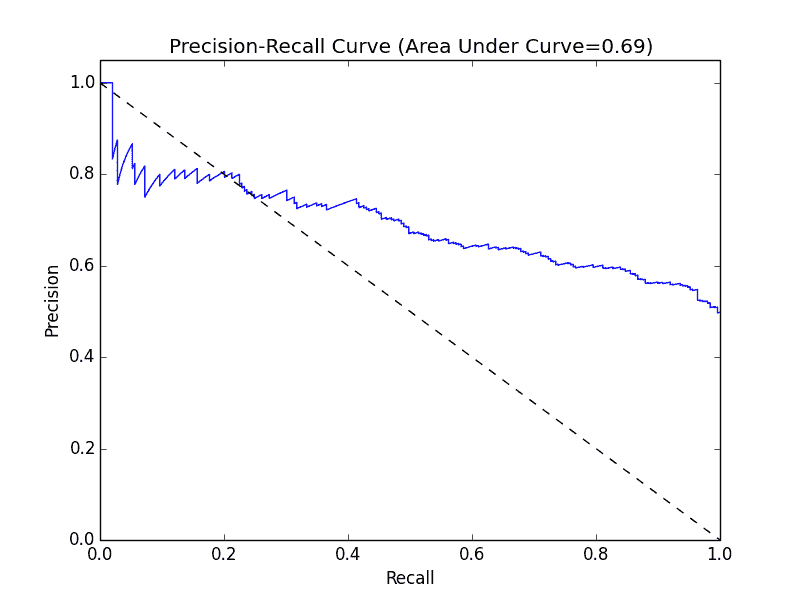

精确度-召回率曲线

请参阅[`en.wikipedia.org/wiki/Precision_and_recall`](http://en.wikipedia.org/wiki/Precision_and_recall)和[`en.wikipedia.org/wiki/Average_precision#Average_precision`](http://en.wikipedia.org/wiki/Average_precision)以获取有关精确度、召回率和 PR 曲线下面积的更多详细信息。

# ROC 曲线和 AUC

ROC 曲线是与 PR 曲线类似的概念。它是分类器的真阳性率与假阳性率的图形表示。

**真阳性率**（**TPR**）是真阳性的数量除以真阳性和假阴性的总和。换句话说，它是真阳性与所有正例的比率。这与我们之前看到的召回率相同，通常也被称为灵敏度。

**假阳性率**（**FPR**）是假阳性的数量除以假阳性和真阴性的总和（即正确预测为类别 0 的示例数量）。换句话说，它是假阳性与所有负例的比率。

与精确度和召回率类似，ROC 曲线（在下图中绘制）表示分类器在不同决策阈值下 TPR 与 FPR 的性能折衷。曲线上的每个点代表分类器决策函数中的不同阈值。

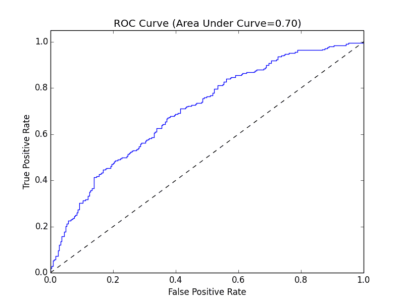

ROC 曲线

ROC 曲线下的面积（通常称为 AUC）代表了一个平均值。同样，AUC 为 1.0 将代表一个完美的分类器。面积为 0.5 被称为随机分数。因此，实现 AUC 为 0.5 的模型不比随机猜测更好。

由于 PR 曲线下面积和 ROC 曲线下面积都被有效地归一化（最小为 0，最大为 1），我们可以使用这些度量来比较具有不同参数设置的模型，甚至比较完全不同的模型。因此，这些指标在模型评估和选择方面很受欢迎。

MLlib 带有一组内置例程，用于计算二元分类的 PR 曲线和 ROC 曲线下的面积。在这里，我们将为我们的每个模型计算这些度量：

```scala
import org.apache.spark.mllib.evaluation.BinaryClassificationMetrics 
val metrics = Seq(lrModel, svmModel).map { model =>  
  val scoreAndLabels = data.map { point => 
    (model.predict(point.features), point.label) 
  } 
  val metrics = new BinaryClassificationMetrics(scoreAndLabels) 
  (model.getClass.getSimpleName, metrics.areaUnderPR, metrics.areaUnderROC) 
} 

```

与之前训练朴素贝叶斯模型和计算准确率一样，我们需要使用我们创建的`nbData`版本的数据集来计算分类指标。

```scala
val nbMetrics = Seq(nbModel).map{ model => 
  val scoreAndLabels = nbData.map { point => 
    val score = model.predict(point.features) 
    (if (score > 0.5) 1.0 else 0.0, point.label) 
  } 
  val metrics = new BinaryClassificationMetrics(scoreAndLabels) 
  (model.getClass.getSimpleName, metrics.areaUnderPR,  
  metrics.areaUnderROC) 
} 

```

请注意，因为`DecisionTreeModel`模型没有实现其他三个模型实现的`ClassificationModel`接口，我们需要在以下代码中单独计算该模型的结果：

```scala
val dtMetrics = Seq(dtModel).map{ model => 
  val scoreAndLabels = data.map { point => 
    val score = model.predict(point.features) 
    (if (score > 0.5) 1.0 else 0.0, point.label) 
  } 
  val metrics = new BinaryClassificationMetrics(scoreAndLabels) 
  (model.getClass.getSimpleName, metrics.areaUnderPR,  
  metrics.areaUnderROC) 
} 
val allMetrics = metrics ++ nbMetrics ++ dtMetrics 
allMetrics.foreach{ case (m, pr, roc) =>  
  println(f"$m, Area under PR: ${pr * 100.0}%2.4f%%, Area under  
  ROC: ${roc * 100.0}%2.4f%%")  
} 

```

你的输出将类似于这里的输出：

```scala
LogisticRegressionModel, Area under PR: 75.6759%, Area under ROC: 50.1418%
SVMModel, Area under PR: 75.6759%, Area under ROC: 50.1418%
NaiveBayesModel, Area under PR: 68.0851%, Area under ROC: 58.3559%
DecisionTreeModel, Area under PR: 74.3081%, Area under ROC: 64.8837%  

```

我们可以看到，所有模型在平均精度指标上取得了大致相似的结果。

逻辑回归和支持向量机的 AUC 结果约为 0.5。这表明它们的表现甚至不如随机机会！我们的朴素贝叶斯和决策树模型稍微好一些，分别达到了 0.58 和 0.65 的 AUC。但就二元分类性能而言，这仍然不是一个很好的结果。

虽然我们在这里没有涉及多类分类，但 MLlib 提供了一个类似的评估类，称为`MulticlassMetrics`，它提供了许多常见指标的平均版本。

# 改进模型性能和调整参数

那么，出了什么问题？为什么我们复杂的模型的表现甚至不如随机机会？我们的模型有问题吗？

回想一下，我们最初只是将数据投放到我们的模型中。事实上，我们甚至没有将所有数据都投放到模型中，只是那些易于使用的数值列。此外，我们对这些数值特征没有进行大量分析。

# 特征标准化

我们使用的许多模型对输入数据的分布或规模做出了固有的假设。其中最常见的假设形式之一是关于正态分布特征的。让我们更深入地研究一下我们特征的分布。

为此，我们可以将特征向量表示为 MLlib 中的分布矩阵，使用`RowMatrix`类。`RowMatrix`是由向量组成的 RDD，其中每个向量是矩阵的一行。

`RowMatrix`类带有一些有用的方法来操作矩阵，其中之一是在矩阵的列上计算统计数据的实用程序。

```scala
import org.apache.spark.mllib.linalg.distributed.RowMatrix 
val vectors = data.map(lp => lp.features) 
val matrix = new RowMatrix(vectors) 
val matrixSummary = matrix.computeColumnSummaryStatistics() 

```

以下代码语句将打印矩阵的均值：

```scala
println(matrixSummary.mean) 

```

这里是输出：

```scala
0.41225805299526636,2.761823191986623,0.46823047328614004, ...  

```

以下代码语句将打印矩阵的最小值：

```scala
println(matrixSummary.min) 

```

这里是输出：

```scala
[0.0,0.0,0.0,0.0,0.0,0.0,0.0,-1.0,0.0,0.0,0.0,0.045564223,-1.0, ...  

```

以下代码语句将打印矩阵的最大值：

```scala
println(matrixSummary.max) 

```

输出如下：

```scala
[0.999426,363.0,1.0,1.0,0.980392157,0.980392157,21.0,0.25,0.0,0.444444444, ...  

```

以下代码语句将打印矩阵的方差：

```scala
println(matrixSummary.variance) 

```

方差的输出是：

```scala
[0.1097424416755897,74.30082476809638,0.04126316989120246, ...  

```

以下代码语句将打印矩阵的非零数：

```scala
println(matrixSummary.numNonzeros) 

```

这里是输出：

```scala
[5053.0,7354.0,7172.0,6821.0,6160.0,5128.0,7350.0,1257.0,0.0, ...  

```

`computeColumnSummaryStatistics`方法计算特征的各列统计数据，包括均值和方差，并将每个统计数据存储在一个向量中，每列一个条目（也就是在我们的情况下，每个特征一个条目）。

从上面的均值和方差输出中，我们可以清楚地看到第二个特征的均值和方差比其他一些特征要高得多（你会发现还有一些其他类似的特征，还有一些更极端的特征）。因此，我们的数据在原始形式下明显不符合标准的高斯分布。为了使数据更适合我们的模型，我们可以对每个特征进行标准化，使其均值为零，标准差为单位。我们可以通过以下方式实现：从每个特征值中减去列均值，然后除以特征的列标准差。

*(x - μ) / sqrt(variance)*

实际上，对于输入数据集中的每个特征向量，我们可以简单地对先前的均值向量进行逐元素减法运算，然后对特征向量进行逐元素除法运算，除以特征标准差向量。标准差向量本身可以通过对方差向量进行逐元素平方根运算得到。

正如我们在[第四章中提到的，*使用 Spark 获取、处理和准备数据*，我们幸运地可以访问 Spark 的`StandardScaler`的便利方法来完成这个任务。

`StandardScaler`的工作方式与我们在该章节中使用的 Normalizer 特征基本相同。我们将通过传入两个参数来实例化它，告诉它是否从数据中减去平均值，以及是否应用标准差缩放。然后，我们将在我们的输入向量上拟合`StandardScaler`。最后，我们将在`transform`函数中传入一个输入向量，然后返回一个标准化向量。我们将在以下`map`函数中执行此操作，以保留数据集中的`label`：

```scala
import org.apache.spark.mllib.feature.StandardScaler 
val scaler = new StandardScaler(withMean = true, withStd = true).fit(vectors) 
val scaledData = data.map(lp => LabeledPoint(lp.label, scaler.transform(lp.features))) 

```

我们的数据现在应该是标准化的。让我们检查原始和标准化特征的第一行。

```scala
println(data.first.features) 

```

前面一行代码的输出如下：

```scala
0.789131,2.055555556,0.676470588,0.205882353,  

```

以下代码将是标准化特征的第一行：

```scala
println(scaledData.first.features) 

```

输出如下：

```scala
[1.1376439023494747,-0.08193556218743517,1.025134766284205,-0.0558631837375738,  

```

正如我们所看到的，通过应用标准化公式，第一个特征已经被转换。我们可以通过从第一个特征中减去平均值（我们之前计算过的）并将结果除以方差的平方根（我们之前计算过的）来检查这一点。

```scala
println((0.789131 - 0.41225805299526636)/ math.sqrt(0.1097424416755897)) 

```

结果应该等于我们缩放向量的第一个元素：

```scala
1.137647336497682  

```

现在我们可以使用标准化的数据重新训练我们的模型。我们将仅使用逻辑回归模型来说明特征标准化的影响（因为决策树和朴素贝叶斯不受此影响）。

```scala
val lrModelScaled = LogisticRegressionWithSGD.train(scaledData, numIterations) 
val lrTotalCorrectScaled = scaledData.map { point => 
  if (lrModelScaled.predict(point.features) == point.label) 1 else  
  0 
}.sum 
val lrAccuracyScaled = lrTotalCorrectScaled / numData 
val lrPredictionsVsTrue = scaledData.map { point =>  
  (lrModelScaled.predict(point.features), point.label)  
} 
val lrMetricsScaled = new BinaryClassificationMetrics(lrPredictionsVsTrue) 
val lrPr = lrMetricsScaled.areaUnderPR 
val lrRoc = lrMetricsScaled.areaUnderROC 
println(f"${lrModelScaled.getClass.getSimpleName}\nAccuracy: ${lrAccuracyScaled * 100}%2.4f%%\nArea under PR: ${lrPr * 100.0}%2.4f%%\nArea under ROC: ${lrRoc * 100.0}%2.4f%%")  

```

结果应该看起来类似于这样：

```scala
LogisticRegressionModel
Accuracy: 62.0419%
Area under PR: 72.7254%
Area under ROC: 61.9663%   

```

仅仅通过对特征进行标准化，我们已经将逻辑回归的准确性和 AUC 从 50%（不比随机好）提高到了 62%。

# 额外的特征

我们已经看到，我们需要小心地对特征进行标准化和可能的归一化，对模型性能的影响可能很严重。在这种情况下，我们仅使用了部分可用的特征。例如，我们完全忽略了类别变量和 boilerplate 变量列中的文本内容。

这是为了便于说明而做的，但让我们评估添加额外特征（如类别特征）的影响。

首先，我们将检查类别，并形成一个索引到类别的映射，您可能会认识到这是对这个分类特征进行 1-of-k 编码的基础：

```scala
val categories = records.map(r => r(3)).distinct.collect.zipWithIndex.toMap 
val numCategories = categories.size 
println(categories) 

```

不同类别的输出如下：

```scala
Map("weather" -> 0, "sports" -> 6, "unknown" -> 4, "computer_internet" -> 12, "?" -> 11, "culture_politics" -> 3, "religion" -> 8, "recreation" -> 2, "arts_entertainment" -> 9, "health" -> 5, "law_crime" -> 10, "gaming" -> 13, "business" -> 1, "science_technology" -> 7)  

```

以下代码将打印类别的数量：

```scala
println(numCategories) 

```

以下是输出：

```scala
14  

```

因此，我们需要创建一个长度为 14 的向量来表示这个特征，并为每个数据点的相关类别的索引分配一个值为 1。然后，我们可以将这个新的特征向量放在其他数值特征向量的前面，如下所示：

```scala
val dataCategories = records.map { r => 
  val trimmed = r.map(_.replaceAll("\"", "")) 
  val label = trimmed(r.size - 1).toInt 
  val categoryIdx = categories(r(3)) 
  val categoryFeatures = Array.ofDim[Double 
  categoryFeatures(categoryIdx) = 1.0 
  val otherFeatures = trimmed.slice(4, r.size - 1).map(d => if   (d == "?") 0.0 else d.toDouble) 
  val features = categoryFeatures ++ otherFeatures 
  LabeledPoint(label, Vectors.dense(features)) 
} 
println(dataCategories.first) 

```

您应该看到类似于这里显示的输出。您可以看到我们特征向量的第一部分现在是一个长度为 14 的向量，其中在相关类别索引处有一个非零条目。

```scala
LabeledPoint(0.0[0.0,1.0,0.0,0.0,0.0,0.0,0.0,0.0,0.0,0.0,0.0,0.0,0.0,0.0,0.789131,2.055555556,0.676470588,0.205882353,0.047058824,0.023529412,0.443783175,0.0,0.0,0.09077381,0.0,0.245831182,0.003883495,1.0,1.0,24.0,0.0,5424.0,170.0,8.0,0.152941176,0.079129575])  

```

同样，由于我们的原始特征没有标准化，我们应该在对这个扩展数据集进行新模型训练之前，使用与之前相同的`StandardScaler`方法进行转换：

```scala
val scalerCats = new StandardScaler(withMean = true, withStd = true).fit(dataCategories.map(lp => lp.features)) 
val scaledDataCats = dataCategories.map(lp => LabeledPoint(lp.label, scalerCats.transform(lp.features))) 

```

我们可以像之前一样检查缩放前后的特征。

```scala
println(dataCategories.first.features) 

```

输出如下：

```scala
0.0,1.0,0.0,0.0,0.0,0.0,0.0,0.0,0.0,0.0,0.0,0.0,0.0,0.0,0.789131,2.055555556 ...  

```

以下代码将打印缩放后的特征：

```scala
println(scaledDataCats.first.features) 

```

您将在屏幕上看到以下内容：

```scala
[-0.023261105535492967,2.720728254208072,-0.4464200056407091,-0.2205258360869135, ...  

```

虽然原始的原始特征是稀疏的（即有许多条目为零），但如果我们从每个条目中减去平均值，我们将得到一个非稀疏（密集）表示，就像前面的例子中所示的那样。在这种情况下，这并不是一个问题，因为数据规模很小，但通常大规模的现实世界问题具有极其稀疏的输入数据和许多特征（在线广告和文本分类是很好的例子）。在这种情况下，不建议失去这种稀疏性，因为等效的密集表示的内存和处理要求可能会随着许多百万特征的增加而迅速增加。我们可以使用`StandardScaler`并将`withMean`设置为`false`来避免这种情况。

现在我们准备使用扩展的特征集训练一个新的逻辑回归模型，然后我们将评估其性能。

```scala
val lrModelScaledCats = LogisticRegressionWithSGD.train(scaledDataCats, numIterations) 
val lrTotalCorrectScaledCats = scaledDataCats.map { point => 
  if (lrModelScaledCats.predict(point.features) == point.label) 1 else 0 
}.sum 
val lrAccuracyScaledCats = lrTotalCorrectScaledCats / numData 
val lrPredictionsVsTrueCats = scaledDataCats.map { point =>  
  (lrModelScaledCats.predict(point.features), point.label)  
} 
val lrMetricsScaledCats = new BinaryClassificationMetrics(lrPredictionsVsTrueCats) 
val lrPrCats = lrMetricsScaledCats.areaUnderPR 
val lrRocCats = lrMetricsScaledCats.areaUnderROC 
println(f"${lrModelScaledCats.getClass.getSimpleName}\nAccuracy: ${lrAccuracyScaledCats * 100}%2.4f%%\nArea under PR: ${lrPrCats * 100.0}%2.4f%%\nArea under ROC: ${lrRocCats * 100.0}%2.4f%%")  

```

您应该看到类似于这样的输出：

```scala
LogisticRegressionModel
Accuracy: 66.5720%
Area under PR: 75.7964%
Area under ROC: 66.5483%  

```

通过对我们的数据应用特征标准化转换，我们将准确度和 AUC 指标从 50%提高到 62%，然后通过将类别特征添加到我们的模型中，我们进一步提高到了 66%（记得对我们的新特征集应用标准化）。

比赛中最佳的模型性能是 AUC 为 0.88906（请参阅[`www.kaggle.com/c/stumbleupon/leaderboard/private`](http://www.kaggle.com/c/stumbleupon/leaderboard/private)）。

在[`www.kaggle.com/c/stumbleupon/forums/t/5680/beating-the-benchmark-leaderboard-auc-0-878`](http://www.kaggle.com/c/stumbleupon/forums/t/5680/beating-the-benchmark-leaderboard-auc-0-878)中概述了实现几乎与最高性能相当的方法。

请注意，我们尚未使用的特征仍然存在；尤其是在 boilerplate 变量中的文本特征。领先的竞赛提交主要使用 boilerplate 特征和基于原始文本内容的特征来实现他们的性能。正如我们之前看到的，虽然添加类别可以提高性能，但大多数变量并不是很有用作预测因子，而文本内容却具有很高的预测性。

研究一些在这些比赛中表现最佳的方法可以让您了解特征提取和工程在模型性能中起到了关键作用。

# 使用正确的数据形式

模型性能的另一个关键方面是使用每个模型的正确数据形式。之前我们看到，将朴素贝叶斯模型应用于我们的数值特征会导致性能非常差。这是因为模型本身存在缺陷吗？

在这种情况下，请记住 MLlib 实现了一个多项式模型。该模型适用于非零计数数据的输入形式。这可以包括分类特征的二进制表示（例如之前介绍的 1-of-k 编码）或频率数据（例如文档中单词出现的频率）。我们最初使用的数值特征不符合这种假定的输入分布，因此模型表现不佳可能并不奇怪。

为了说明这一点，我们将仅使用类别特征，当进行 1-of-k 编码时，这符合模型的正确形式。我们将创建一个新的数据集，如下所示：

```scala
val dataNB = records.map { r => 
  val trimmed = r.map(_.replaceAll("\"", "")) 
  val label = trimmed(r.size - 1).toInt 
  val categoryIdx = categories(r(3)) 
  val categoryFeatures = Array.ofDimDouble 
  categoryFeatures(categoryIdx) = 1.0 
  LabeledPoint(label, Vectors.dense(categoryFeatures)) 
} 

```

接下来，我们将训练一个新的朴素贝叶斯模型并评估其性能。

```scala
val nbModelCats = NaiveBayes.train(dataNB) 
val nbTotalCorrectCats = dataNB.map { point => 
  if (nbModelCats.predict(point.features) == point.label) 1 else 0 
}.sum 
val nbAccuracyCats = nbTotalCorrectCats / numData 
val nbPredictionsVsTrueCats = dataNB.map { point =>  
  (nbModelCats.predict(point.features), point.label)  
} 
val nbMetricsCats = new BinaryClassificationMetrics(nbPredictionsVsTrueCats) 
val nbPrCats = nbMetricsCats.areaUnderPR 
val nbRocCats = nbMetricsCats.areaUnderROC 
println(f"${nbModelCats.getClass.getSimpleName}\nAccuracy: ${nbAccuracyCats * 100}%2.4f%%\nArea under PR: ${nbPrCats * 100.0}%2.4f%%\nArea under ROC: ${nbRocCats * 100.0}%2.4f%%") 

```

您应该看到以下输出：

```scala
NaiveBayesModel
Accuracy: 60.9601%
Area under PR: 74.0522%
Area under ROC: 60.5138%

```

因此，通过确保我们使用正确形式的输入，我们将朴素贝叶斯模型的性能略微从 58%提高到 60%。

# 调整模型参数

前面的部分展示了特征提取和选择对模型性能的影响，以及输入数据的形式和模型对数据分布的假设。到目前为止，我们只是简单地讨论了模型参数，但它们在模型性能中也起着重要作用。

MLlib 的默认训练方法使用每个模型参数的默认值。让我们更深入地研究一下它们。

# 线性模型

逻辑回归和支持向量机共享相同的参数，因为它们使用相同的**随机梯度下降**（**SGD**）的优化技术。它们只在应用的损失函数上有所不同。如果我们看一下 MLlib 中逻辑回归的类定义，我们会看到以下定义：

```scala
class LogisticRegressionWithSGD private ( 
  private var stepSize: Double, 
  private var numIterations: Int, 
  private var regParam: Double, 
  private var miniBatchFraction: Double) 
  extends GeneralizedLinearAlgorithm[LogisticRegressionModel] ... 

```

我们可以看到可以传递给构造函数的参数是`stepSize`、`numIterations`、`regParam`和`miniBatchFraction`。其中，除了`regParam`之外，所有参数都与底层优化技术有关。

逻辑回归的实例化代码初始化了`gradient`、`updater`和`optimizer`，并为`optimizer`（在本例中为`GradientDescent`）设置了相关参数。

```scala
private val gradient = new LogisticGradient() 
private val updater = new SimpleUpdater() 
override val optimizer = new GradientDescent(gradient, updater) 
  .setStepSize(stepSize) 
  .setNumIterations(numIterations) 
  .setRegParam(regParam) 
  .setMiniBatchFraction(miniBatchFraction) 

```

`LogisticGradient`设置了定义我们逻辑回归模型的逻辑损失函数。

虽然对优化技术的详细处理超出了本书的范围，但 MLlib 为线性模型提供了两种优化器：SGD 和 L-BFGS。L-BFGS 通常更准确，并且参数更少需要调整。

SGD 是默认值，而 L-BGFS 目前只能通过`LogisticRegressionWithLBFGS`直接用于逻辑回归。自己试一试，并将结果与 SGD 找到的结果进行比较。

有关更多详细信息，请参阅[`spark.apache.org/docs/latest/mllib-optimization.html`](http://spark.apache.org/docs/latest/mllib-optimization.html)。

为了调查剩余参数设置的影响，我们将创建一个辅助函数，它将根据一组参数输入训练逻辑回归模型。首先，我们将导入所需的类：

```scala
import org.apache.spark.rdd.RDD 
import org.apache.spark.mllib.optimization.Updater 
import org.apache.spark.mllib.optimization.SimpleUpdater 
import org.apache.spark.mllib.optimization.L1Updater 
import org.apache.spark.mllib.optimization.SquaredL2Updater 
import org.apache.spark.mllib.classification.ClassificationModel 

```

接下来，我们将定义一个辅助函数来训练给定一组输入的模型：

```scala
def trainWithParams(input: RDD[LabeledPoint], regParam: Double, numIterations: Int, updater: Updater, stepSize: Double) = { 
  val lr = new LogisticRegressionWithSGD 
  lr.optimizer.setNumIterations(numIterations).  
  setUpdater(updater).setRegParam(regParam).setStepSize(stepSize) 
  lr.run(input) 
} 

```

最后，我们将创建第二个辅助函数，以获取输入数据和分类模型，并生成相关的 AUC 指标：

```scala
def createMetrics(label: String, data: RDD[LabeledPoint], model: ClassificationModel) = { 
  val scoreAndLabels = data.map { point => 
    (model.predict(point.features), point.label) 
  } 
  val metrics = new BinaryClassificationMetrics(scoreAndLabels) 
  (label, metrics.areaUnderROC) 
} 

```

我们还将缓存我们的缩放数据集，包括类别，以加快速度

我们将使用多个模型训练运行来探索这些不同的参数设置，如下所示：

```scala
scaledDataCats.cache 

```

# 迭代

许多机器学习方法都是迭代的，通过多次迭代收敛到一个解（最小化所选损失函数的最优权重向量）。SGD 通常需要相对较少的迭代次数才能收敛到一个合理的解，但可以运行更多次迭代来改善解。我们可以通过尝试一些不同的`numIterations`参数设置，并像这样比较 AUC 结果来看到这一点：

```scala
val iterResults = Seq(1, 5, 10, 50).map { param => 
  val model = trainWithParams(scaledDataCats, 0.0, param, new  
SimpleUpdater, 1.0) 
  createMetrics(s"$param iterations", scaledDataCats, model) 
} 
iterResults.foreach { case (param, auc) => println(f"$param, AUC =  
${auc * 100}%2.2f%%") } 

```

你的输出应该是这样的：

```scala
1 iterations, AUC = 64.97%
5 iterations, AUC = 66.62%
10 iterations, AUC = 66.55%
50 iterations, AUC = 66.81%  

```

因此，我们可以看到一旦完成了一定数量的迭代，迭代次数对结果的影响很小。

# 步长

在 SGD 中，步长参数控制算法在更新模型权重向量之后每个训练样本时所采取的步骤方向的梯度。较大的步长可能加快收敛，但步长太大可能会导致收敛问题，因为好的解决方案被超越。学习率确定我们采取的步骤大小，以达到（局部或全局）最小值。换句话说，我们沿着目标函数创建的表面的斜率方向向下走，直到我们到达一个山谷。

我们可以看到改变步长的影响在这里：

```scala
val stepResults = Seq(0.001, 0.01, 0.1, 1.0, 10.0).map { param => 
  val model = trainWithParams(scaledDataCats, 0.0, numIterations, new SimpleUpdater, param) 
  createMetrics(s"$param step size", scaledDataCats, model) 
} 
stepResults.foreach { case (param, auc) => println(f"$param, AUC =  
${auc * 100}%2.2f%%") } 

```

这将给我们以下结果，显示增加步长太多可能开始对性能产生负面影响：

```scala
0.001 step size, AUC = 64.95%
0.01 step size, AUC = 65.00%
0.1 step size, AUC = 65.52%
1.0 step size, AUC = 66.55%
10.0 step size, AUC = 61.92%

```

# 正则化

在前面的逻辑回归代码中，我们简要介绍了`Updater`类。MLlib 中的`Updater`类实现了正则化。正则化可以通过有效地惩罚模型复杂性来帮助避免模型对训练数据的过度拟合。这可以通过向损失函数添加一个项来实现，该项作用是随着模型权重向量的函数增加损失。

在实际使用情况下，几乎总是需要正则化，但当特征维度非常高（即可以学习的有效变量权重数量很高）相对于训练样本数量时，正则化尤为重要。

当没有或很低的正则化时，模型可能会过拟合。没有正则化时，大多数模型会在训练数据集上过拟合。这是使用交叉验证技术进行模型拟合的一个关键原因（我们现在将介绍）。

在我们进一步进行之前，让我们定义一下过拟合和欠拟合数据的含义。过拟合发生在模型学习训练数据中的细节和噪音，从而对新数据的性能产生负面影响的程度。模型不应该过于严格地遵循训练数据集，在欠拟合中，模型既不能对训练数据建模，也不能推广到新数据。

相反，当应用正则化时，鼓励简化模型，当正则化很高时，模型性能可能会受到影响，导致数据欠拟合。

MLlib 中可用的正则化形式如下：

+   `SimpleUpdater`：这等同于没有正则化，是逻辑回归的默认值

+   `SquaredL2Updater`：这实现了基于权重向量的平方 L2 范数的正则化器；这是 SVM 模型的默认值

+   `L1Updater`：这应用基于权重向量的 L1 范数的正则化器；这可能导致权重向量中的稀疏解（因为不太重要的权重被拉向零）

正则化及其与优化的关系是一个广泛而深入研究的领域。有关更多信息，请参考以下链接：

+   一般正则化概述：[`en.wikipedia.org/wiki/Regularization_(mathematics)`](http://en.wikipedia.org/wiki/Regularization_(mathematics))

+   L2 正则化：[`en.wikipedia.org/wiki/Tikhonov_regularization`](http://en.wikipedia.org/wiki/Tikhonov_regularization)

+   过拟合和欠拟合：[`en.wikipedia.org/wiki/Overfitting`](http://en.wikipedia.org/wiki/Overfitting) 过拟合和 L1 与 L2 正则化的详细概述：[`citeseerx.ist.psu.edu/viewdoc/download?doi=10.1.1.92.9860&rep=rep1&type=pdf`](http://citeseerx.ist.psu.edu/viewdoc/download?doi=10.1.1.92.9860&rep=rep1&type=pdf)

让我们使用`SquaredL2Updater`来探索一系列正则化参数的影响。

```scala
val regResults = Seq(0.001, 0.01, 0.1, 1.0, 10.0).map { param => 
  val model = trainWithParams(scaledDataCats, param, numIterations, new SquaredL2Updater, 1.0) 
  createMetrics(s"$param L2 regularization parameter",  
scaledDataCats, model) 
} 
regResults.foreach { case (param, auc) => println(f"$param, AUC =  
${auc * 100}%2.2f%%") } 

```

你的输出应该像这样：

```scala
0.001 L2 regularization parameter, AUC = 66.55%
0.01 L2 regularization parameter, AUC = 66.55%
0.1 L2 regularization parameter, AUC = 66.63%
1.0 L2 regularization parameter, AUC = 66.04%
10.0 L2 regularization parameter, AUC = 35.33%  

```

正如我们所看到的，在正则化水平较低时，模型性能没有太大影响。然而，随着正则化的增加，我们可以看到欠拟合对我们模型评估的影响。

当使用 L1 正则化时，您将会得到类似的结果。通过对 AUC 指标进行相同的正则化参数评估，尝试使用 L1Updater。

# 决策树

决策树控制树的最大深度，从而控制模型的复杂性。更深的树会导致更复杂的模型，能够更好地拟合数据。

对于分类问题，我们还可以在`Gini`和`Entropy`之间选择两种不纯度度量。

# 调整树深度和不纯度

我们将以与逻辑回归模型相似的方式来说明树深度的影响。

首先，我们需要在 Spark shell 中创建另一个辅助函数，如下所示：

```scala
import org.apache.spark.mllib.tree.impurity.Impurity 
import org.apache.spark.mllib.tree.impurity.Entropy 
import org.apache.spark.mllib.tree.impurity.Gini 

def trainDTWithParams(input: RDD[LabeledPoint], maxDepth: Int, impurity: Impurity) = { 
  DecisionTree.train(input, Algo.Classification, impurity, maxDepth) 
} 

```

现在，我们准备计算不同树深度设置下的 AUC 指标。在这个例子中，我们将简单地使用我们的原始数据集，因为我们不需要数据被标准化。

请注意，决策树模型通常不需要特征被标准化或归一化，也不需要分类特征被二进制编码。

首先，使用`Entropy`不纯度度量和不同的树深度来训练模型，如下所示：

```scala
val dtResultsEntropy = Seq(1, 2, 3, 4, 5, 10, 20).map { param => 
  val model = trainDTWithParams(data, param, Entropy) 
  val scoreAndLabels = data.map { point => 
    val score = model.predict(point.features) 
    (if (score > 0.5) 1.0 else 0.0, point.label) 
  } 
  val metrics = new BinaryClassificationMetrics(scoreAndLabels) 
  (s"$param tree depth", metrics.areaUnderROC) 
} 
dtResultsEntropy.foreach { case (param, auc) => println(f"$param, AUC = ${auc * 100}%2.2f%%") } 

```

上述代码应该输出以下结果：

```scala
1 tree depth, AUC = 59.33%
2 tree depth, AUC = 61.68%
3 tree depth, AUC = 62.61%
4 tree depth, AUC = 63.63%
5 tree depth, AUC = 64.88%
10 tree depth, AUC = 76.26%
20 tree depth, AUC = 98.45%  

```

接下来，我们将使用`Gini`不纯度度量执行相同的计算（我们省略了代码，因为它非常相似，但可以在代码包中找到）。你的结果应该看起来像这样：

```scala
1 tree depth, AUC = 59.33%
2 tree depth, AUC = 61.68%
3 tree depth, AUC = 62.61%
4 tree depth, AUC = 63.63%
5 tree depth, AUC = 64.89%
10 tree depth, AUC = 78.37%
20 tree depth, AUC = 98.87%  

```

从前面的结果中可以看出，增加树深度参数会导致更准确的模型（正如预期的那样，因为模型允许在更大的树深度下变得更复杂）。很可能在更高的树深度下，模型会显著地过度拟合数据集。随着树深度的增加，泛化能力会降低，泛化是指机器学习模型学习的概念如何适用于模型从未见过的示例。

这两种不纯度度量的性能几乎没有什么区别。

# 朴素贝叶斯模型

最后，让我们看看改变朴素贝叶斯的`lambda`参数会产生什么影响。这个参数控制加法平滑，处理当`class`和`feature`值在数据集中没有同时出现的情况。

更多关于加法平滑的细节，请参见[`en.wikipedia.org/wiki/Additive_smoothing`](http://en.wikipedia.org/wiki/Additive_smoothing)。

我们将采用与之前相同的方法，首先创建一个方便的训练函数，然后使用不同水平的`lambda`来训练模型，如下所示：

```scala
def trainNBWithParams(input: RDD[LabeledPoint], lambda: Double) = { 
  val nb = new NaiveBayes 
  nb.setLambda(lambda) 
  nb.run(input) 
} 
val nbResults = Seq(0.001, 0.01, 0.1, 1.0, 10.0).map { param => 
  val model = trainNBWithParams(dataNB, param) 
  val scoreAndLabels = dataNB.map { point => 
    (model.predict(point.features), point.label) 
  } 
  val metrics = new BinaryClassificationMetrics(scoreAndLabels) 
  (s"$param lambda", metrics.areaUnderROC) 
} 
nbResults.foreach { case (param, auc) => println(f"$param, AUC = ${auc * 100}%2.2f%%")  
} 

```

训练的结果如下：

```scala
0.001 lambda, AUC = 60.51%
0.01 lambda, AUC = 60.51%
0.1 lambda, AUC = 60.51%
1.0 lambda, AUC = 60.51%
10.0 lambda, AUC = 60.51%  

```

我们可以看到在这种情况下`lambda`没有影响，因为如果特征和类标签的组合在数据集中没有出现在一起，这不会成为问题。

# 交叉验证

到目前为止，在这本书中，我们只是简要提到了交叉验证和样本外测试的概念。交叉验证是现实世界机器学习的关键部分，是许多模型选择和参数调整流程的核心。

交叉验证的基本思想是我们想知道我们的模型在未见数据上的表现如何。在真实的、实时数据上评估这一点（例如在生产系统中）是有风险的，因为我们并不真正知道训练好的模型是否是最佳的，能够对新数据进行准确的预测。正如我们之前在正则化方面看到的那样，我们的模型可能已经过度拟合了训练数据，在未经训练的数据上做出预测可能很差。

交叉验证提供了一种机制，我们可以使用可用数据集的一部分来训练我们的模型，另一部分来评估这个模型的性能。由于模型在训练阶段没有见过这部分数据，当在数据集的这部分上评估模型的性能时，可以给我们一个关于我们的模型在新数据点上的泛化能力的估计。

在这里，我们将使用训练-测试分离来实现一个简单的交叉验证评估方法。我们将把我们的数据集分成两个不重叠的部分。第一个数据集用于训练我们的模型，称为**训练集**。第二个数据集，称为**测试集**或**留出集**，用于使用我们选择的评估指标评估我们的模型的性能。实际使用的常见分割包括 50/50、60/40 和 80/20 的分割，但只要训练集不太小以至于模型无法学习（通常至少 50%是一个实际的最小值），你可以使用任何分割。

在许多情况下，会创建三组数据：一个训练集，一个评估集（类似于前面提到的测试集，用于调整模型参数，如 lambda 和步长），以及一个测试集（从不用于训练模型或调整任何参数，只用于生成对完全未见数据的估计真实性能）。

在这里，我们将探讨一个简单的训练-测试分离方法。还有许多更详尽和复杂的交叉验证技术。

一个流行的例子是**K 折交叉验证**，其中数据集被分成*K*个不重叠的折叠。模型在*K-1*个数据折叠上进行训练，并在剩下的保留的折叠上进行测试。这个过程重复*K*次，然后对结果进行平均以得到交叉验证分数。训练-测试分割实际上就像是两折交叉验证。

其他方法包括留一交叉验证和随机抽样。更多细节请参见[`en.wikipedia.org/wiki/Cross-validation_(statistics)`](http://en.wikipedia.org/wiki/Cross-validation_(statistics))的文章。

首先，我们将把数据集分成 60%的训练集和 40%的测试集（我们将在这里使用一个常数随机种子 123，以确保我们获得相同的结果以便进行说明）。

```scala
val trainTestSplit = scaledDataCats.randomSplit(Array(0.6, 0.4), 123) 
val train = trainTestSplit(0) 
val test = trainTestSplit(1) 

```

接下来，我们将计算感兴趣的评估指标（再次，我们将使用 AUC）的一系列正则化参数设置。请注意，这里我们将使用更精细的步长在评估的正则化参数之间，以更好地说明 AUC 的差异，在这种情况下差异非常小。

```scala
val regResultsTest = Seq(0.0, 0.001, 0.0025, 0.005, 0.01).map { param => 
  val model = trainWithParams(train, param, numIterations, new SquaredL2Updater, 1.0) 
  createMetrics(s"$param L2 regularization parameter", test, model) 
} 
regResultsTest.foreach { case (param, auc) => println(f"$param, AUC = ${auc * 100}%2.6f%%")  
} 

```

接下来，我们将计算在训练集上训练的结果，以及在测试集上评估的结果，如下所示：

```scala
0.0 L2 regularization parameter, AUC = 66.480874%
0.001 L2 regularization parameter, AUC = 66.480874%
0.0025 L2 regularization parameter, AUC = 66.515027%
0.005 L2 regularization parameter, AUC = 66.515027%
0.01 L2 regularization parameter, AUC = 66.549180%  

```

现在，让我们将这与在训练集上进行训练和测试的结果进行比较。

（这是我们之前在所有数据上进行训练和测试的做法）。同样，我们将省略代码，因为它非常相似（但它在代码包中是可用的）：

```scala
0.0 L2 regularization parameter, AUC = 66.260311%
0.001 L2 regularization parameter, AUC = 66.260311%
0.0025 L2 regularization parameter, AUC = 66.260311%
0.005 L2 regularization parameter, AUC = 66.238294%
0.01 L2 regularization parameter, AUC = 66.238294%  

```

因此，我们可以看到当我们在相同的数据集上训练和评估我们的模型时，通常在正则化较低时会获得最高的性能。这是因为我们的模型已经看到了所有的数据点，并且在低水平的正则化下，它可以过度拟合数据集并获得更高的性能。

相比之下，当我们在一个数据集上训练并在另一个数据集上测试时，通常略高水平的正则化会导致更好的测试集性能。

在交叉验证中，我们通常会找到参数设置（包括正则化以及其他各种参数，如步长等），以获得最佳的测试集性能。然后我们将使用这些参数设置在所有数据上重新训练模型，以便在新数据上进行预测。

回想一下第五章，*使用 Spark 构建推荐引擎*，我们没有涉及交叉验证。您可以应用我们之前使用的相同技术，将该章节中的评分数据集分成训练集和测试集。然后，您可以尝试在训练集上尝试不同的参数设置，同时在测试集上评估 MSE 和 MAP 性能指标，方式类似于我们之前所做的。试一试吧！

# 总结

在本章中，我们介绍了 Spark MLlib 中可用的各种分类模型，并且我们看到了如何在输入数据上训练模型，以及如何使用标准指标和度量来评估它们的性能。我们还探讨了如何应用一些先前介绍的技术来转换我们的特征。最后，我们调查了使用正确的输入数据格式或分布对模型性能的影响，以及增加更多数据对我们的模型，调整模型参数和实施交叉验证的影响。

在下一章中，我们将采用类似的方法来深入 MLlib 的回归模型。
