# 第七章：使用 Spark 构建回归模型

在本章中，我们将继续探讨第六章中涵盖的内容，*使用 Spark 构建分类模型*。虽然分类模型处理代表离散类别的结果，但回归模型涉及可以取任何实际值的目标变量。基本原理非常相似--我们希望找到一个将输入特征映射到预测目标变量的模型。与分类一样，回归也是一种监督学习形式。

回归模型可用于预测几乎任何感兴趣的变量。一些例子包括以下内容：

+   预测股票回报和其他经济变量

+   预测贷款违约损失金额（这可以与预测违约概率的分类模型相结合，而回归模型则在违约情况下预测金额）

+   推荐（来自第五章的交替最小二乘因子化模型，*使用 Spark 构建推荐引擎*，在每次迭代中使用线性回归）

+   基于用户行为和消费模式，在零售、移动或其他业务中预测**客户终身价值**（**CLTV**）

在本章的不同部分，我们将做以下工作：

+   介绍 ML 中可用的各种回归模型

+   探索回归模型的特征提取和目标变量转换

+   使用 ML 训练多个回归模型

+   查看如何使用训练好的模型进行预测

+   使用交叉验证调查回归的各种参数设置对性能的影响

# 回归模型的类型

线性模型（或广义线性模型）的核心思想是，我们将感兴趣的预测结果（通常称为目标或因变量）建模为应用于输入变量（也称为特征或自变量）的简单线性预测器的函数。

*y = f(w^Tx)*

在这里，*y*是目标变量，*w*是参数向量（称为权重向量），*x*是输入特征向量。

*w^Tx*是权重向量*w*和特征向量*x*的线性预测器（或向量点积）。对于这个线性预测器，我们应用了一个函数*f*（称为链接函数）。

线性模型实际上可以通过改变链接函数来用于分类和回归，标准线性回归使用恒等链接（即*y = w^Tx*直接），而二元分类使用其他链接函数，如本文所述。

Spark 的 ML 库提供了不同的回归模型，如下所示：

+   线性回归

+   广义线性回归

+   逻辑回归

+   决策树

+   随机森林回归

+   梯度提升树

+   生存回归

+   等温回归

+   岭回归

回归模型定义了因变量和一个或多个自变量之间的关系。它构建了最适合独立变量或特征值的模型。

与支持向量机和逻辑回归等分类模型不同，线性回归用于预测具有广义值的因变量的值，而不是预测确切的类标签。

线性回归模型本质上与其分类对应物相同，唯一的区别是线性回归模型使用不同的损失函数、相关链接函数和决策函数。Spark ML 提供了标准的最小二乘回归模型（尽管计划使用其他类型的广义线性回归模型进行回归）。

# 最小二乘回归

你可能还记得第六章《使用 Spark 构建分类模型》中提到，广义线性模型可以应用各种损失函数。最小二乘法使用的损失函数是平方损失，定义如下：

*½ (w^Tx - y)²*

在这里，与分类设置一样，*y*是目标变量（这次是实值），*w*是权重向量，*x*是特征向量。

相关的链接函数是恒等链接，决策函数也是恒等函数，通常在回归中不会应用阈值。因此，模型的预测简单地是*y = w^Tx*。

ML 库中的标准最小二乘回归不使用正则化。正则化用于解决过拟合问题。观察平方损失函数，我们可以看到对于错误预测的点，损失会被放大，因为损失被平方了。这意味着最小二乘回归容易受到数据集中的异常值和过拟合的影响。通常，对于分类问题，我们应该在实践中应用一定程度的正则化。

带有 L2 正则化的线性回归通常称为岭回归，而应用 L1 正则化称为套索。

当数据集较小或示例数量较少时，模型过拟合的倾向非常高，因此强烈建议使用 L1、L2 或弹性网络等正则化器。

有关 Spark MLlib 文档中线性最小二乘法的部分，请参阅[`spark.apache.org/docs/latest/mllib-linear-methods.html#linear-least-squares-lasso-and-ridge-regression`](http://spark.apache.org/docs/latest/mllib-linear-methods.html#linear-least-squares-lasso-and-ridge-regression)以获取更多信息。

# 回归的决策树

就像使用线性模型进行回归任务需要改变使用的损失函数一样，使用决策树进行回归需要改变使用的节点不纯度度量。不纯度度量称为**方差**，定义方式与最小二乘线性回归的平方损失相同。

有关决策树算法和回归不纯度度量的更多详细信息，请参阅 Spark 文档中的*MLlib - 决策树*部分[`spark.apache.org/docs/latest/mllib-decision-tree.html`](http://spark.apache.org/docs/latest/mllib-decision-tree.html)。

现在，我们将绘制一个只有一个输入变量的回归问题的简单示例，横轴显示在*x*轴上，目标变量显示在*y*轴上。线性模型的预测函数由红色虚线表示，而决策树的预测函数由绿色虚线表示。我们可以看到决策树允许将更复杂、非线性的模型拟合到数据中：

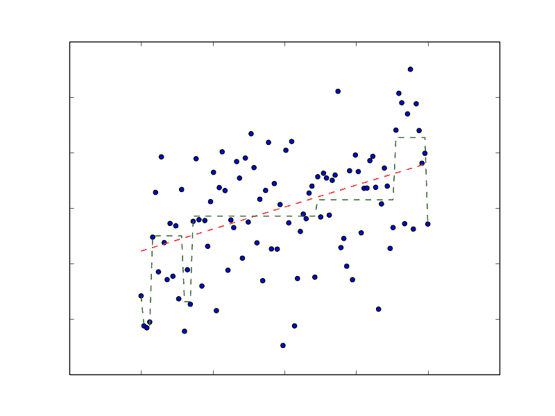

# 评估回归模型的性能

我们在第六章《使用 Spark 构建分类模型》中看到，分类模型的评估方法通常侧重于与实际类成员关联的预测类成员相关的测量。这些是二元结果（预测类是否正确），模型是否刚好预测正确并不那么重要；我们最关心的是正确和错误预测的数量。

在处理回归模型时，我们很少能够精确预测目标变量，因为目标变量可以取任意实值。然而，我们自然希望了解我们的预测值与真实值的偏差有多大，因此我们将利用一个考虑整体偏差的度量。

用于衡量回归模型性能的一些标准评估指标包括**均方误差**（**MSE**）和**均方根误差**（**RMSE**），**平均绝对误差**（**MAE**），R 平方系数等等。

# 均方误差和均方根误差

MSE 是用作最小二乘回归的损失函数的平方误差的平均值：

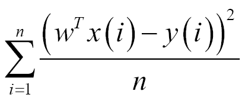

它是所有数据点的预测值和实际目标变量之间差异的平方之和，除以数据点的数量。

RMSE 是 MSE 的平方根。MSE 以目标变量的平方为单位进行测量，而 RMSE 以与目标变量相同的单位进行测量。由于其公式，MSE，就像它导出的平方损失函数一样，有效地严厉地惩罚更大的误差。

为了评估基于误差度量的平均预测，我们将首先对`LabeledPoint`实例的 RDD 中的每个输入特征向量进行预测，通过使用一个函数计算每个记录的误差，该函数将预测值和真实目标值作为输入。这将返回一个包含误差值的`[Double]` RDD。然后我们可以使用包含双精度值的 RDD 的平均方法找到平均值。

让我们定义我们的平方误差函数如下：

```scala
Scala  
def squaredError(actual:Double, pred : Double) : Double = { 
  return Math.pow( (pred - actual), 2.0) 
} 

```

# 平均绝对误差

MAE 是预测值和实际目标之间绝对差异的平均值，表示如下：

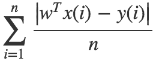

MAE 在原则上类似于 MSE，但它不像 MSE 那样严厉地惩罚大偏差。

我们计算 MAE 的函数如下：

```scala
Scala 
def absError(actual:Double, pred: Double) : Double = { 
  return Math.abs( (pred - actual)) 
} 

```

# 均方根对数误差

这个测量并不像 MSE 和 MAE 那样被广泛使用，但它被用作使用自行车共享数据集的 Kaggle 竞赛的度量标准。实际上，它是对预测值和目标值进行对数变换后的 RMSE。当目标变量的范围很大，并且在预测值和目标值本身很高时，您不一定希望惩罚大误差时，这个测量是有用的。当您关心百分比误差而不是绝对误差的值时，它也是有效的。

Kaggle 竞赛评估页面可以在[`www.kaggle.com/c/bike-sharing-demand/details/evaluation`](https://www.kaggle.com/c/bike-sharing-demand/details/evaluation)找到。

计算 RMSLE 的函数如下所示：

```scala
Scala 
def squaredLogError(actual:Double, pred : Double) : Double = { 
  return Math.pow( (Math.log(pred +1) - Math.log(actual +1)), 2.0) 
} 

```

# R 平方系数

R 平方系数，也称为确定系数，是衡量模型拟合数据集的程度的指标。它通常用于统计学。它衡量目标变量的变化程度;这是由输入特征的变化来解释的。R 平方系数通常取 0 到 1 之间的值，其中 1 等于模型的完美拟合。

# 从数据中提取正确的特征

由于回归的基础模型与分类情况相同，我们可以使用相同的方法来创建输入特征。唯一的实际区别是目标现在是一个实值变量，而不是一个分类变量。ML 库中的`LabeledPoint`类已经考虑到了这一点，因为`label`字段是`Double`类型，所以它可以处理这两种情况。

# 从自行车共享数据集中提取特征

为了说明本章中的概念，我们将使用自行车共享数据集。该数据集包含自行车共享系统中每小时自行车租赁数量的记录。它还包含与日期、时间、天气、季节和假日信息相关的变量。

数据集可在[`archive.ics.uci.edu/ml/datasets/Bike+Sharing+Dataset`](http://archive.ics.uci.edu/ml/datasets/Bike+Sharing+Dataset)找到。

点击数据文件夹链接，然后下载`Bike-Sharing-Dataset.zip`文件。

自行车共享数据是由波尔图大学的 Hadi Fanaee-T 丰富了天气和季节数据，并在以下论文中使用：

Fanaee-T，Hadi 和 Gama Joao，事件标签组合集成检测器和背景知识，*人工智能进展*，第 1-15 页，斯普林格柏林海德堡，2013 年。

该论文可在[`link.springer.com/article/10.1007%2Fs13748-013-0040-3`](http://link.springer.com/article/10.1007%2Fs13748-013-0040-3)找到。

一旦你下载了`Bike-Sharing-Dataset.zip`文件，解压它。这将创建一个名为`Bike-Sharing-Dataset`的目录，其中包含`day.csv`、`hour.csv`和`Readme.txt`文件。

`Readme.txt`文件包含有关数据集的信息，包括变量名称和描述。看一下文件，你会发现我们有以下可用的变量：

+   `instant`：这是记录 ID

+   `dteday`：这是原始日期

+   `season`：这指的是不同的季节，如春季、夏季、冬季和秋季

+   `yr`：这是年份（2011 或 2012）

+   `mnth`：这是一年中的月份

+   `hr`：这是一天中的小时

+   `holiday`：这显示这一天是否是假日

+   `weekday`：这是一周的某一天

+   `workingday`：这指的是这一天是否是工作日

+   `weathersit`：这是描述特定时间天气的分类变量

+   `temp`：这是标准化的温度

+   `atemp`：这是标准化的体感温度

+   `hum`：这是标准化的湿度

+   风速：这是标准化的风速

+   `cnt`：这是目标变量，即该小时的自行车租赁次数

我们将使用`hour.csv`中包含的每小时数据。如果你看一下数据集的第一行，你会发现它包含列名作为标题。以下代码片段打印标题和前 20 条记录：

```scala
val spark = SparkSession 
  .builder 
  .appName("BikeSharing") 
  .master("local[1]") 
  .getOrCreate() 

// read from csv 
val df = spark.read.format("csv").option("header", 
   "true").load("/dataset/BikeSharing/hour.csv") 
df.cache() 

df.registerTempTable("BikeSharing") 
print(df.count()) 

spark.sql("SELECT * FROM BikeSharing").show() 

```

前面的代码片段应该输出以下结果：

```scala
 root
 |-- instant: integer (nullable = true)
 |-- dteday: timestamp (nullable = true)
 |-- season: integer (nullable = true)
 |-- yr: integer (nullable = true)
 |-- mnth: integer (nullable = true)
 |-- hr: integer (nullable = true)
 |-- holiday: integer (nullable = true)
 |-- weekday: integer (nullable = true)
 |-- workingday: integer (nullable = true)
 |-- weathersit: integer (nullable = true)
 |-- temp: double (nullable = true)
 |-- atemp: double (nullable = true)
 |-- hum: double (nullable = true)
 |-- windspeed: double (nullable = true)
 |-- casual: integer (nullable = true)
 |-- registered: integer (nullable = true)
 |-- cnt: integer (nullable = true)

```

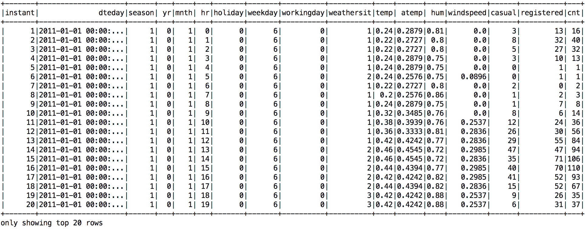

我们将使用 Scala 来演示本章的示例。本章的源代码可以在以下位置找到[`github.com/ml-resources/spark-ml/tree/branch-ed2/Chapter_07`](https://github.com/ml-resources/spark-ml/tree/branch-ed2/Chapter_07)。

我们将像往常一样加载数据集并对其进行检查；从前一个数据框中获取记录计数如下：

```scala
print(df.count()) 

```

这应该输出以下结果：

```scala
    17,379

```

所以，我们的数据集中有 17,379 条每小时的记录。我们已经检查了列名。我们将忽略记录 ID 和原始日期列。我们还将忽略`casual`和`registered`计数目标变量，并专注于总计变量`cnt`（这是其他两个计数的总和）。我们剩下 12 个变量。前 8 个是分类的，而最后 4 个是标准化的实值变量。

```scala
// drop record id, date, casual and registered columns 
val df1 = 
   df.drop("instant").drop("dteday").drop("casual")
   .drop("registered") 
df1.printSchema() 

```

这段代码的最后一部分应该输出以下结果：

```scala
 root
 |-- season: integer (nullable = true)
 |-- yr: integer (nullable = true)
 |-- mnth: integer (nullable = true)
 |-- hr: integer (nullable = true)
 |-- holiday: integer (nullable = true)
 |-- weekday: integer (nullable = true)
 |-- workingday: integer (nullable = true)
 |-- weathersit: integer (nullable = true)
 |-- temp: double (nullable = true)
 |-- atemp: double (nullable = true)
 |-- hum: double (nullable = true)
 |-- windspeed: double (nullable = true)
 |-- cnt: integer (nullable = true)

```

所有列都被转换为 double；以下代码片段显示了如何做到这一点：

```scala
// convert to double: season,yr,mnth,hr,holiday,weekday,workingday,weathersit,temp,atemp,hum,windspeed,casual,registered,cnt 
val df2 = df1.withColumn("season", 
   df1("season").cast("double")).withColumn("yr", 
   df1("yr").cast("double")) 
  .withColumn("mnth", df1("mnth").cast("double")).withColumn("hr", 
     df1("hr").cast("double")).withColumn("holiday", 
     df1("holiday").cast("double")) 
  .withColumn("weekday", 
     df1("weekday").cast("double")).withColumn("workingday", 
     df1("workingday").cast("double")).withColumn("weathersit", 
     df1("weathersit").cast("double")) 
  .withColumn("temp", 
     df1("temp").cast("double")).withColumn("atemp", 
     df1("atemp").cast("double")).withColumn("hum", 
     df1("hum").cast("double")) 
  .withColumn("windspeed", 
     df1("windspeed").cast("double")).withColumn("label", 
     df1("label").cast("double")) 

df2.printSchema() 

```

前面的代码应该输出以下结果：

```scala
 root
 |-- season: double (nullable = true)
 |-- yr: double (nullable = true)
 |-- mnth: double (nullable = true)
 |-- hr: double (nullable = true)
 |-- holiday: double (nullable = true)
 |-- weekday: double (nullable = true)
 |-- workingday: double (nullable = true)
 |-- weathersit: double (nullable = true)
 |-- temp: double (nullable = true)
 |-- atemp: double (nullable = true)
 |-- hum: double (nullable = true)
 |-- windspeed: double (nullable = true)
 |-- label: double (nullable = true)

```

自行车共享数据集是分类的，需要使用**向量组装器**和**向量索引器**进行处理，如下所述：

+   向量组装器是一个转换器，它将一系列列组合成单个向量列。它将原始特征组合成特征向量，以便训练线性回归和决策树等 ML 模型。

+   向量索引器索引从向量组装器传递的分类特征。它会自动决定哪些特征是分类的，并将实际值转换为类别索引。

在我们的情况下，df2 中除了`label`之外的所有列都被`VectorAssembler`转换为`rawFeatures`。

给定类型为`Vector`的输入列和名为`maxCategories`的`param`，它根据不同的值决定哪些特征应该是分类的，其中最多有`maxCategories`的特征被声明为分类的。

```scala
// drop label and create feature vector 
val df3 = df2.drop("label") 
val featureCols = df3.columns 

val vectorAssembler = new 
   VectorAssembler().setInputCols(featureCols)
   .setOutputCol("rawFeatures") 
val vectorIndexer = new 
   VectorIndexer().setInputCol("rawFeatures")
   .setOutputCol("features").setMaxCategories(4) 

```

完整的代码清单可在[`github.com/ml-resources/spark-ml/blob/branch-ed2/Chapter_07/scala/2.0.0/scala-spark-app/src/main/scala/org/sparksamples/regression/bikesharing/BikeSharingExecutor.scala`](https://github.com/ml-resources/spark-ml/blob/branch-ed2/Chapter_07/scala/2.0.0/scala-spark-app/src/main/scala/org/sparksamples/regression/bikesharing/BikeSharingExecutor.scala)找到。

# 训练和使用回归模型

回归模型的训练遵循与分类模型相同的程序。我们只需将训练数据传递给相关的训练方法。

# BikeSharingExecutor

`BikeSharingExecutor`对象可用于选择和运行相应的回归模型，例如，要运行`LinearRegression`并执行线性回归管道，将程序参数设置为`LR_<type>`，其中`type`是数据格式；对于其他命令，请参考以下代码片段：

```scala
def executeCommand(arg: String, vectorAssembler: VectorAssembler, 
   vectorIndexer: VectorIndexer, dataFrame: DataFrame, spark: 
   SparkSession) = arg match { 
    case "LR_Vectors" => 
     LinearRegressionPipeline.linearRegressionWithVectorFormat
     (vectorAssembler, vectorIndexer, dataFrame) 
    case "LR_SVM" => 
     LinearRegressionPipeline.linearRegressionWithSVMFormat(spark) 

    case "GLR_Vectors" => 
     GeneralizedLinearRegressionPipeline
     .genLinearRegressionWithVectorFormat(vectorAssembler, 
      vectorIndexer, dataFrame) 
    case "GLR_SVM"=> 
     GeneralizedLinearRegressionPipeline
     .genLinearRegressionWithSVMFormat(spark) 

    case "DT_Vectors" => DecisionTreeRegressionPipeline
     .decTreeRegressionWithVectorFormat(vectorAssembler, 
     vectorIndexer, dataFrame) 
    case "DT_SVM"=> 
     GeneralizedLinearRegressionPipeline
     .genLinearRegressionWithSVMFormat(spark) 

    case "RF_Vectors" => 
     RandomForestRegressionPipeline
     .randForestRegressionWithVectorFormat(vectorAssembler, 
     vectorIndexer, dataFrame) 
    case "RF_SVM"=> 
     RandomForestRegressionPipeline
     .randForestRegressionWithSVMFormat(spark) 

    case "GBT_Vectors" => 
     GradientBoostedTreeRegressorPipeline
     .gbtRegressionWithVectorFormat(vectorAssembler, vectorIndexer, 
     dataFrame) 
    case "GBT_SVM"=> 
     GradientBoostedTreeRegressorPipeline
     .gbtRegressionWithSVMFormat(spark) 

} 

```

代码清单可在此链接找到：

[`github.com/ml-resources/spark-ml/blob/branch-ed2/Chapter_07/scala/2.0.0/scala-spark-app/src/main/scala/org/sparksamples/regression/bikesharing/BikeSharingExecutor.scala`](https://github.com/ml-resources/spark-ml/blob/branch-ed2/Chapter_07/scala/2.0.0/scala-spark-app/src/main/scala/org/sparksamples/regression/bikesharing/BikeSharingExecutor.scala)

# 在自行车共享数据集上训练回归模型

### 线性回归

线性回归是最常用的算法。回归分析的核心是通过数据图拟合一条直线的任务。线性方程式由*y = c + b*x*描述，其中*y* = 估计的因变量，*c* = 常数，*b* = 回归系数，*x* = 自变量。

让我们通过将自行车共享数据集分为 80%的训练和 20%的测试，使用 Spark 的回归评估器使用`LinearRegression`构建模型，并获得关于测试数据的评估指标。`linearRegressionWithVectorFormat`方法使用分类数据，而`linearRegressionWithSVMFormat`使用`Bike-sharing`数据集的`libsvm`格式。

```scala
def linearRegressionWithVectorFormat(vectorAssembler: 
   VectorAssembler, vectorIndexer: VectorIndexer, dataFrame: 
   DataFrame) = { 
  val lr = new LinearRegression() 
    .setFeaturesCol("features") 
    .setLabelCol("label") 
    .setRegParam(0.1) 
    .setElasticNetParam(1.0) 
    .setMaxIter(10) 

  val pipeline = new Pipeline().setStages(Array(vectorAssembler, 
   vectorIndexer, lr)) 

  val Array(training, test) = dataFrame.randomSplit(Array(0.8, 
   0.2), seed = 12345) 

  val model = pipeline.fit(training) 

  val fullPredictions = model.transform(test).cache() 
  val predictions = 
   fullPredictions.select("prediction").rdd.map(_.getDouble(0)) 
  val labels = 
   fullPredictions.select("label").rdd.map(_.getDouble(0)) 
  val RMSE = new 
   RegressionMetrics(predictions.zip(labels)).rootMeanSquaredError 
  println(s"  Root mean squared error (RMSE): $RMSE") 
} 

def linearRegressionWithSVMFormat(spark: SparkSession) = { 
  // Load training data 
  val training = spark.read.format("libsvm") 
    .load("/dataset/BikeSharing/lsvmHours.txt") 

  val lr = new LinearRegression() 
    .setMaxIter(10) 
    .setRegParam(0.3) 
    .setElasticNetParam(0.8) 

  // Fit the model 
  val lrModel = lr.fit(training) 

  // Print the coefficients and intercept for linear regression 
  println(s"Coefficients: ${lrModel.coefficients} Intercept: 
   ${lrModel.intercept}") 

  // Summarize the model over the training set and print out some 
   metrics 
  val trainingSummary = lrModel.summary 
  println(s"numIterations: ${trainingSummary.totalIterations}") 
  println(s"objectiveHistory: 
   ${trainingSummary.objectiveHistory.toList}") 
  trainingSummary.residuals.show() 
  println(s"RMSE: ${trainingSummary.rootMeanSquaredError}") 
  println(s"r2: ${trainingSummary.r2}") 
} 

```

前面的代码应该显示以下输出。请注意，残差代表表达式残差：（标签-预测值）

```scala
+-------------------+
|          residuals|
+-------------------+
|  32.92325797801143|
|  59.97614044359903|
|  35.80737062786482|
|-12.509886468051075|
|-25.979774633117792|
|-29.352862474201224|
|-5.9517346926691435|
| 18.453701019500947|
|-24.859327293384787|
| -47.14282080103287|
| -27.50652100848832|
| 21.865309097336535|
|  4.037722798853395|
|-25.691348213368343|
| -13.59830538387368|
|  9.336691727080336|
|  12.83461983259582|
|  -20.5026155752185|
| -34.83240621318937|
| -34.30229437825615|
+-------------------+
only showing top 20 rows
RMSE: 149.54567868651284
r2: 0.3202369690447968

```

代码清单可在[`github.com/ml-resources/spark-ml/blob/branch-ed2/Chapter_07/scala/2.0.0/scala-spark-app/src/main/scala/org/sparksamples/regression/bikesharing/LinearRegressionPipeline.scala`](https://github.com/ml-resources/spark-ml/blob/branch-ed2/Chapter_07/scala/2.0.0/scala-spark-app/src/main/scala/org/sparksamples/regression/bikesharing/LinearRegressionPipeline.scala)找到。

# 广义线性回归

线性回归遵循高斯分布，而**广义线性模型**（**GLM**）是线性模型的规范，其中响应变量`Y`遵循指数分布族中的某个分布。

让我们通过将自行车共享数据集分为 80%的训练和 20%的测试，使用 Spark 的回归评估器使用`GeneralizedLinearRegression`构建模型，并获得关于测试数据的评估指标。

```scala
@transient lazy val logger = Logger.getLogger(getClass.getName) 

def genLinearRegressionWithVectorFormat(vectorAssembler: 
   VectorAssembler, vectorIndexer: VectorIndexer, dataFrame: 
   DataFrame) = { 
   val lr = new GeneralizedLinearRegression() 
    .setFeaturesCol("features") 
    .setLabelCol("label") 
    .setFamily("gaussian") 
    .setLink("identity") 
    .setMaxIter(10) 
    .setRegParam(0.3) 

  val pipeline = new Pipeline().setStages(Array(vectorAssembler, 
   vectorIndexer, lr)) 

  val Array(training, test) = dataFrame.randomSplit(Array(0.8, 
   0.2), seed = 12345) 

  val model = pipeline.fit(training) 

  val fullPredictions = model.transform(test).cache() 
  val predictions = 
   fullPredictions.select("prediction").rdd.map(_.getDouble(0)) 
  val labels = 
   fullPredictions.select("label").rdd.map(_.getDouble(0)) 
  val RMSE = new 
   RegressionMetrics(predictions.zip(labels)).rootMeanSquaredError 
  println(s"  Root mean squared error (RMSE): $RMSE") 
} 

def genLinearRegressionWithSVMFormat(spark: SparkSession) = { 
  // Load training data 
  val training = spark.read.format("libsvm") 
    .load("/dataset/BikeSharing/lsvmHours.txt") 

  val lr = new GeneralizedLinearRegression() 
    .setFamily("gaussian") 
    .setLink("identity") 
    .setMaxIter(10) 
    .setRegParam(0.3) 

  // Fit the model 
  val model = lr.fit(training) 

  // Print the coefficients and intercept for generalized linear 
   regression model 
  println(s"Coefficients: ${model.coefficients}") 
  println(s"Intercept: ${model.intercept}") 

  // Summarize the model over the training set and print out some 
   metrics 
  val summary = model.summary 
  println(s"Coefficient Standard Errors: 
   ${summary.coefficientStandardErrors.mkString(",")}") 
  println(s"T Values: ${summary.tValues.mkString(",")}") 
  println(s"P Values: ${summary.pValues.mkString(",")}") 
  println(s"Dispersion: ${summary.dispersion}") 
  println(s"Null Deviance: ${summary.nullDeviance}") 
  println(s"Residual Degree Of Freedom Null: 
   ${summary.residualDegreeOfFreedomNull}") 
  println(s"Deviance: ${summary.deviance}") 
  println(s"Residual Degree Of Freedom: 
   ${summary.residualDegreeOfFreedom}") 
  println(s"AIC: ${summary.aic}") 
  println("Deviance Residuals: ") 
  summary.residuals().show()   
} 

```

这应该输出以下结果：

估计系数和截距的标准误差。

如果`[GeneralizedLinearRegression.fitIntercept]`设置为 true，则返回的最后一个元素对应于截距。

前面代码中的系数标准误差如下：

```scala
1.1353970394903834,2.2827202289405677,0.5060828045490352,0.1735367945
   7103457,7.062338310890969,0.5694233355369813,2.5250738792716176,
2.0099641224706573,0.7596421898012983,0.6228803024758551,0.0735818071
   8894239,0.30550603737503224,12.369537640641184

```

估计系数和截距的 T 统计量如下：

```scala
T Values: 15.186791802016964,33.26578339676457,-
   11.27632316133038,8.658129103690262,-
   3.8034120518318013,2.6451862430890807,0.9799958329796699,
3.731755243874297,4.957582264860384,6.02053185645345,-
   39.290272209592864,5.5283417898112726,-0.7966500413552742

```

估计系数和截距的双侧 p 值如下：

```scala
P Values: 0.0,0.0,0.0,0.0,1.4320532622846827E-
   4,0.008171946193283652,0.3271018275330657,1.907562616410008E-
   4,7.204877614519489E-7,
1.773422964035376E-9,0.0,3.2792739856901676E-8,0.42566519676340153

```

离散度如下：

```scala
Dispersion: 22378.414478769333

```

拟合模型的离散度对于“二项式”和“泊松”族取 1.0，否则由残差 Pearson 卡方统计量（定义为 Pearson 残差的平方和）除以残差自由度估计。

前面代码的空偏差输出如下：

```scala
Null Deviance: 5.717615910707208E8

```

残差自由度如下：

```scala
Residual Degree Of Freedom Null: 17378

```

在逻辑回归分析中，偏差用来代替平方和的计算。偏差类似于线性回归中的平方和计算，是对逻辑回归模型中数据拟合不足的度量。当“饱和”模型可用时（具有理论上完美的拟合模型），通过将给定模型与饱和模型进行比较来计算偏差。

偏差：`3.886235458383082E8`

参考：[`en.wikipedia.org/wiki/Logistic_regression`](https://en.wikipedia.org/wiki/Logistic_regression)

**自由度**：

自由度的概念是从样本中估计总体统计量的原则的核心。 “自由度”通常缩写为 df。

将 df 视为在从另一个估计值中估计一个统计量时需要放置的数学限制。前面的代码将产生以下输出：

```scala
Residual Degree Of Freedom: 17366

```

阿凯克信息准则（AIC）是对给定数据集的统计模型相对质量的度量。给定数据的一组模型，AIC 估计每个模型相对于其他模型的质量。因此，AIC 提供了模型选择的一种方法。

参考：[`en.wikipedia.org/wiki/Akaike_information_criterion`](https://en.wikipedia.org/wiki/Akaike_information_criterion)

拟合模型输出的 AIC 如下：

```scala
AIC: 223399.95490762248
+-------------------+
|  devianceResiduals|
+-------------------+
| 32.385412453563546|
|   59.5079185994115|
|  34.98037491140896|
|-13.503450469022432|
|-27.005954440659032|
|-30.197952952158246|
| -7.039656861683778|
| 17.320193923055445|
|  -26.0159703272054|
| -48.69166247116218|
| -29.50984967584955|
| 20.520222192742004|
| 1.6551311183207815|
|-28.524373674665213|
|-16.337935852841838|
|  6.441923904310045|
|   9.91072545492193|
|-23.418896074866524|
|-37.870797650696346|
|-37.373301622332946|
+-------------------+
only showing top 20 rows

```

完整的代码清单可在此链接找到：

[`github.com/ml-resources/spark-ml/blob/branch-ed2/Chapter_07/scala/2.0.0/scala-spark-app/src/main/scala/org/sparksamples/regression/bikesharing/GeneralizedLinearRegressionPipeline.scala`](https://github.com/ml-resources/spark-ml/blob/branch-ed2/Chapter_07/scala/2.0.0/scala-spark-app/src/main/scala/org/sparksamples/regression/bikesharing/GeneralizedLinearRegressionPipeline.scala)

# 决策树回归

决策树模型是一种强大的、非概率的技术，可以捕捉更复杂的非线性模式和特征交互。它们已被证明在许多任务上表现良好，相对容易理解和解释，可以处理分类和数值特征，并且不需要输入数据进行缩放或标准化。它们非常适合包含在集成方法中（例如，决策树模型的集成，称为决策森林）。

决策树算法是一种自顶向下的方法，从根节点（或特征）开始，然后在每一步选择一个特征，该特征通过信息增益来衡量数据集的最佳拆分。信息增益是从节点不纯度（标签在节点上相似或同质的程度）减去由拆分创建的两个子节点的不纯度的加权和来计算的。

让我们通过将自行车共享数据集分成 80%的训练和 20%的测试，使用 Spark 中的`DecisionTreeRegression`和回归评估器来构建模型，并获得测试数据周围的评估指标。

```scala
@transient lazy val logger = Logger.getLogger(getClass.getName) 

def decTreeRegressionWithVectorFormat(vectorAssembler: 
   VectorAssembler, vectorIndexer: VectorIndexer, dataFrame: 
   DataFrame) = { 
  val lr = new DecisionTreeRegressor() 
    .setFeaturesCol("features") 
    .setLabelCol("label") 

  val pipeline = new Pipeline().setStages(Array(vectorAssembler, 
   vectorIndexer, lr)) 

  val Array(training, test) = dataFrame.randomSplit(Array(0.8, 
   0.2), seed = 12345) 

  val model = pipeline.fit(training) 

  // Make predictions. 
  val predictions = model.transform(test) 

  // Select example rows to display. 
  predictions.select("prediction", "label", "features").show(5) 

  // Select (prediction, true label) and compute test error. 
  val evaluator = new RegressionEvaluator() 
    .setLabelCol("label") 
    .setPredictionCol("prediction") 
    .setMetricName("rmse") 
  val rmse = evaluator.evaluate(predictions) 
  println("Root Mean Squared Error (RMSE) on test data = " + rmse) 

  val treeModel = 
   model.stages(1).asInstanceOf[DecisionTreeRegressionModel] 
  println("Learned regression tree model:\n" + 
   treeModel.toDebugString)  } 

def decTreeRegressionWithSVMFormat(spark: SparkSession) = { 
  // Load training data 
  val training = spark.read.format("libsvm") 
    .load("/dataset/BikeSharing/lsvmHours.txt") 

  // Automatically identify categorical features, and index them. 
  // Here, we treat features with > 4 distinct values as 
   continuous. 
  val featureIndexer = new VectorIndexer() 
    .setInputCol("features") 
    .setOutputCol("indexedFeatures") 
    .setMaxCategories(4) 
    .fit(training) 

  // Split the data into training and test sets (30% held out for 
   testing). 
  val Array(trainingData, testData) = 
   training.randomSplit(Array(0.7, 0.3)) 

  // Train a DecisionTree model. 
  val dt = new DecisionTreeRegressor() 
    .setLabelCol("label") 
    .setFeaturesCol("indexedFeatures") 

  // Chain indexer and tree in a Pipeline. 
  val pipeline = new Pipeline() 
    .setStages(Array(featureIndexer, dt)) 

  // Train model. This also runs the indexer. 
  val model = pipeline.fit(trainingData) 

  // Make predictions. 
  val predictions = model.transform(testData) 

  // Select example rows to display. 
  predictions.select("prediction", "label", "features").show(5) 

  // Select (prediction, true label) and compute test error. 
  val evaluator = new RegressionEvaluator() 
    .setLabelCol("label") 
    .setPredictionCol("prediction") 
    .setMetricName("rmse") 
  val rmse = evaluator.evaluate(predictions) 
  println("Root Mean Squared Error (RMSE) on test data = " + rmse) 

  val treeModel = 
   model.stages(1).asInstanceOf[DecisionTreeRegressionModel] 
  println("Learned regression tree model:\n" + 
   treeModel.toDebugString) 
} 

```

这应该输出以下结果：

```scala
Coefficients: [17.243038451366886,75.93647669134975,-5.7067532504873215,1.5025039716365927,-26.86098264575616,1.5062307736563205,2.4745618796519953,7.500694154029075,3.7659886477986215,3.7500707038132464,-2.8910492341273235,1.6889417934600353]
Intercept: -9.85419267296242

Coefficient Standard Errors: 1.1353970394903834,2.2827202289405677,0.5060828045490352,0.17353679457103457,7.062338310890969,0.5694233355369813,2.5250738792716176,2.0099641224706573,0.7596421898012983,0.6228803024758551,0.07358180718894239,0.30550603737503224,12.369537640641184
T Values: 15.186791802016964,33.26578339676457,-11.27632316133038,8.658129103690262,-3.8034120518318013,2.6451862430890807,0.9799958329796699,3.731755243874297,4.957582264860384,6.02053185645345,-39.290272209592864,5.5283417898112726,-0.7966500413552742
P Values: 0.0,0.0,0.0,0.0,1.4320532622846827E-4,0.008171946193283652,0.3271018275330657,1.907562616410008E-4,7.204877614519489E-7,1.773422964035376E-9,0.0,3.2792739856901676E-8,0.42566519676340153
Dispersion: 22378.414478769333

Null Deviance: 5.717615910707208E8
Residual Degree Of Freedom Null: 17378
Deviance: 3.886235458383082E8
Residual Degree Of Freedom: 17366

AIC: 223399.95490762248
Deviance Residuals:
+-------------------+
|  devianceResiduals|
+-------------------+
| 32.385412453563546|
|   59.5079185994115|
|  34.98037491140896|
|-13.503450469022432|
|-27.005954440659032|
|-30.197952952158246|
| -7.039656861683778|
| 17.320193923055445|
|  -26.0159703272054|
| -48.69166247116218|
| -29.50984967584955|
| 20.520222192742004|
| 1.6551311183207815|
|-28.524373674665213|
|-16.337935852841838|
|  6.441923904310045|
|   9.91072545492193|
|-23.418896074866524|
|-37.870797650696346|
|-37.373301622332946|
+-------------------+
only showing top 20 rows

```

请参考前一节（广义线性回归）以了解如何解释结果。

代码清单可在[`github.com/ml-resources/spark-ml/blob/branch-ed2/Chapter_07/scala/2.0.0/scala-spark-app/src/main/scala/org/sparksamples/regression/bikesharing/DecisionTreeRegressionPipeline.scala`](https://github.com/ml-resources/spark-ml/blob/branch-ed2/Chapter_07/scala/2.0.0/scala-spark-app/src/main/scala/org/sparksamples/regression/bikesharing/DecisionTreeRegressionPipeline.scala)找到。

# 树的集成

集成方法是一种机器学习算法，它创建由一组其他基本模型组成的模型。Spark 机器学习支持两种主要的集成算法：`RandomForest`和`GradientBoostedTrees`。

# 随机森林回归

随机森林被称为决策树的集成，由许多决策树组成。与决策树一样，随机森林可以处理分类特征，支持多类别，并且不需要特征缩放。

让我们通过将自行车共享数据集分为 80%的训练和 20%的测试，使用 Spark 中的`RandomForestRegressor`和回归评估器构建模型，并获得关于测试数据的评估指标。

```scala
@transient lazy val logger = Logger.getLogger(getClass.getName) 

def randForestRegressionWithVectorFormat(vectorAssembler: 
  VectorAssembler, vectorIndexer: VectorIndexer, dataFrame: 
   DataFrame) = { 
   val lr = new RandomForestRegressor() 
    .setFeaturesCol("features") 
    .setLabelCol("label") 

  val pipeline = new Pipeline().setStages(Array(vectorAssembler, 
   vectorIndexer, lr)) 

  val Array(training, test) = dataFrame.randomSplit(Array(0.8, 
   0.2), seed = 12345) 

  val model = pipeline.fit(training) 

  // Make predictions. 
  val predictions = model.transform(test) 

  // Select example rows to display. 
  predictions.select("prediction", "label", "features").show(5) 

  // Select (prediction, true label) and compute test error. 
  val evaluator = new RegressionEvaluator() 
    .setLabelCol("label") 
    .setPredictionCol("prediction") 
    .setMetricName("rmse") 
  val rmse = evaluator.evaluate(predictions) 
  println("Root Mean Squared Error (RMSE) on test data = " + rmse) 

  val treeModel = 
   model.stages(1).asInstanceOf[RandomForestRegressionModel] 
  println("Learned regression tree model:\n" + treeModel.toDebugString)  } 

def randForestRegressionWithSVMFormat(spark: SparkSession) = { 
  // Load training data 
  val training = spark.read.format("libsvm") 
    .load("/dataset/BikeSharing/lsvmHours.txt") 

  // Automatically identify categorical features, and index them. 
  // Set maxCategories so features with > 4 distinct values are 
   treated as continuous. 
  val featureIndexer = new VectorIndexer() 
    .setInputCol("features") 
    .setOutputCol("indexedFeatures") 
    .setMaxCategories(4) 
    .fit(training) 

  // Split the data into training and test sets (30% held out for 
   testing). 
  val Array(trainingData, testData) = 
   training.randomSplit(Array(0.7, 0.3)) 

  // Train a RandomForest model. 
  val rf = new RandomForestRegressor() 
    .setLabelCol("label") 
    .setFeaturesCol("indexedFeatures") 

  // Chain indexer and forest in a Pipeline. 
  val pipeline = new Pipeline() 
    .setStages(Array(featureIndexer, rf)) 

  // Train model. This also runs the indexer. 
  val model = pipeline.fit(trainingData) 

  // Make predictions. 
  val predictions = model.transform(testData) 

  // Select example rows to display. 
  predictions.select("prediction", "label", "features").show(5) 

  // Select (prediction, true label) and compute test error. 
  val evaluator = new RegressionEvaluator() 
    .setLabelCol("label") 
    .setPredictionCol("prediction") 
    .setMetricName("rmse") 
  val rmse = evaluator.evaluate(predictions) 
  println("Root Mean Squared Error (RMSE) on test data = " + rmse) 

  val rfModel = 
   model.stages(1).asInstanceOf[RandomForestRegressionModel] 
  println("Learned regression forest model:\n" + 
   rfModel.toDebugString) 
} 

```

这应该输出以下结果：

```scala
RandomForest:   init: 2.114590873
total: 3.343042855
findSplits: 1.387490192
findBestSplits: 1.191715923
chooseSplits: 1.176991821

+------------------+-----+--------------------+
|        prediction|label|            features|
+------------------+-----+--------------------+
| 70.75171441904584|  1.0|(12,[0,1,2,3,4,5,...|
| 53.43733657257549|  1.0|(12,[0,1,2,3,4,5,...|
| 57.18242812368521|  1.0|(12,[0,1,2,3,4,5,...|
| 49.73744636247659|  1.0|(12,[0,1,2,3,4,5,...|
|56.433579398691144|  1.0|(12,[0,1,2,3,4,5,...|

Root Mean Squared Error (RMSE) on test data = 123.03866156451954
Learned regression forest model:
RandomForestRegressionModel (uid=rfr_bd974271ffe6) with 20 trees
 Tree 0 (weight 1.0):
 If (feature 9 <= 40.0)
 If (feature 9 <= 22.0)
 If (feature 8 <= 13.0)
 If (feature 6 in {0.0})
 If (feature 1 in {0.0})
 Predict: 35.0945945945946
 Else (feature 1 not in {0.0})
 Predict: 63.3921568627451
 Else (feature 6 not in {0.0})
 If (feature 0 in {0.0,1.0})
 Predict: 83.05714285714286
 Else (feature 0 not in {0.0,1.0})
 Predict: 120.76608187134502
 Else (feature 8 > 13.0)
 If (feature 3 <= 21.0)
 If (feature 3 <= 12.0)
 Predict: 149.56363636363636
 Else (feature 3 > 12.0)
 Predict: 54.73593073593074
 Else (feature 3 > 21.0)
 If (feature 6 in {0.0})
 Predict: 89.63333333333334
 Else (feature 6 not in {0.0})
 Predict: 305.6588235294118

```

前面的代码使用各种特征及其值创建决策树。

代码清单可在[`github.com/ml-resources/spark-ml/blob/branch-ed2/Chapter_07/scala/2.0.0/scala-spark-app/src/main/scala/org/sparksamples/regression/bikesharing/RandomForestRegressionPipeline.scala`](https://github.com/ml-resources/spark-ml/blob/branch-ed2/Chapter_07/scala/2.0.0/scala-spark-app/src/main/scala/org/sparksamples/regression/bikesharing/RandomForestRegressionPipeline.scala)找到。

# 梯度提升树回归

梯度提升树是决策树的集成。梯度提升树迭代训练决策树以最小化损失函数。梯度提升树处理分类特征，支持多类别，并且不需要特征缩放。

Spark ML 使用现有的决策树实现梯度提升树。它支持分类和回归。

让我们通过将自行车共享数据集分为 80%的训练和 20%的测试，使用 Spark 中的 GBTRegressor 和回归评估器构建模型，并获得关于测试数据的评估指标。

```scala
@transient lazy val logger = Logger.getLogger(getClass.getName) 

def gbtRegressionWithVectorFormat(vectorAssembler: 
   VectorAssembler, vectorIndexer: VectorIndexer, dataFrame: 
   DataFrame) = { 
  val lr = new GBTRegressor() 
    .setFeaturesCol("features") 
    .setLabelCol("label") 
    .setMaxIter(10) 

  val pipeline = new Pipeline().setStages(Array(vectorAssembler, 
   vectorIndexer, lr)) 

  val Array(training, test) = dataFrame.randomSplit(Array(0.8, 
   0.2), seed = 12345) 

  val model = pipeline.fit(training) 

  // Make predictions. 
  val predictions = model.transform(test) 

  // Select example rows to display. 
  predictions.select("prediction", "label", "features").show(5) 

  // Select (prediction, true label) and compute test error. 
  val evaluator = new RegressionEvaluator() 
    .setLabelCol("label") 
    .setPredictionCol("prediction") 
    .setMetricName("rmse") 
  val rmse = evaluator.evaluate(predictions) 
  println("Root Mean Squared Error (RMSE) on test data = " + rmse) 

  val treeModel = model.stages(1).asInstanceOf[GBTRegressionModel] 
  println("Learned regression tree model:\n" + 
   treeModel.toDebugString)  } 

def gbtRegressionWithSVMFormat(spark: SparkSession) = { 
  // Load training data 
  val training = spark.read.format("libsvm") 
    .load("/dataset/BikeSharing/lsvmHours.txt") 

  // Automatically identify categorical features, and index them. 
  // Set maxCategories so features with > 4 distinct values are 
   treated as continuous. 
  val featureIndexer = new VectorIndexer() 
    .setInputCol("features") 
    .setOutputCol("indexedFeatures") 
    .setMaxCategories(4) 
    .fit(training) 

  // Split the data into training and test sets (30% held out for 
   testing). 
  val Array(trainingData, testData) = 
   training.randomSplit(Array(0.7, 0.3)) 

  // Train a GBT model. 
  val gbt = new GBTRegressor() 
    .setLabelCol("label") 
    .setFeaturesCol("indexedFeatures") 
    .setMaxIter(10) 

  // Chain indexer and GBT in a Pipeline. 
  val pipeline = new Pipeline() 
    .setStages(Array(featureIndexer, gbt)) 

  // Train model. This also runs the indexer. 
  val model = pipeline.fit(trainingData) 

  // Make predictions 
  val predictions = model.transform(testData) 

  // Select example rows to display.
   predictions.select("prediction", "label", "features").show(5) 

  // Select (prediction, true label) and compute test error. 
  val evaluator = new RegressionEvaluator() 
    .setLabelCol("label") 
    .setPredictionCol("prediction") 
    .setMetricName("rmse") 
  val rmse = evaluator.evaluate(predictions) 
  println("Root Mean Squared Error (RMSE) on test data = " + rmse) 

  val gbtModel = model.stages(1).asInstanceOf[GBTRegressionModel] 
  println("Learned regression GBT model:\n" + 
   gbtModel.toDebugString) 
} 

```

这应该输出以下结果：

```scala
RandomForest:   init: 1.366356823
total: 1.883186039
findSplits: 1.0378687
findBestSplits: 0.501171071
chooseSplits: 0.495084674

+-------------------+-----+--------------------+
|         prediction|label|            features|
+-------------------+-----+--------------------+
|-20.753742348814352|  1.0|(12,[0,1,2,3,4,5,...|
|-20.760717579684087|  1.0|(12,[0,1,2,3,4,5,...|
| -17.73182527714976|  1.0|(12,[0,1,2,3,4,5,...|
| -17.73182527714976|  1.0|(12,[0,1,2,3,4,5,...|
|   -21.397094071362|  1.0|(12,[0,1,2,3,4,5,...|
+-------------------+-----+--------------------+
only showing top 5 rows

Root Mean Squared Error (RMSE) on test data = 73.62468541448783
Learned regression GBT model:
GBTRegressionModel (uid=gbtr_24c6ef8f52a7) with 10 trees
 Tree 0 (weight 1.0):
 If (feature 9 <= 41.0)
 If (feature 3 <= 12.0)
 If (feature 3 <= 3.0)
 If (feature 3 <= 2.0)
 If (feature 6 in {1.0})
 Predict: 24.50709219858156
 Else (feature 6 not in {1.0})
 Predict: 74.94945848375451
 Else (feature 3 > 2.0)
 If (feature 6 in {1.0})
 Predict: 122.1732283464567
 Else (feature 6 not in {1.0})
 Predict: 206.3304347826087
 Else (feature 3 > 3.0)
 If (feature 8 <= 18.0)
 If (feature 0 in {0.0,1.0})
 Predict: 137.29818181818183
 Else (feature 0 not in {0.0,1.0})
 Predict: 257.90157480314963

```

代码清单可在[`github.com/ml-resources/spark-ml/blob/branch-ed2/Chapter_07/scala/2.0.0/scala-spark-app/src/main/scala/org/sparksamples/regression/bikesharing/GradientBoostedTreeRegressorPipeline.scala`](https://github.com/ml-resources/spark-ml/blob/branch-ed2/Chapter_07/scala/2.0.0/scala-spark-app/src/main/scala/org/sparksamples/regression/bikesharing/GradientBoostedTreeRegressorPipeline.scala)找到。

# 改进模型性能和调整参数

在第六章中，*使用 Spark 构建分类模型*，我们展示了特征转换和选择如何对模型的性能产生很大影响。在本章中，我们将专注于可以应用于数据集的另一种转换类型：转换目标变量本身。

# 转换目标变量

请记住，许多机器学习模型，包括线性模型，对输入数据和目标变量的分布做出假设。特别是，线性回归假设正态分布。

在许多实际情况下，线性回归的分布假设并不成立。例如，在这种情况下，我们知道自行车租赁数量永远不会是负数。这一点就应该表明正态分布的假设可能存在问题。为了更好地了解目标分布，通常最好绘制目标值的直方图。

我们现在将创建目标变量分布的图表如下所示：

Scala

绘制原始数据的代码可以在[`github.com/ml-resources/spark-ml/blob/branch-ed2/Chapter_07/scala/1.6.2/scala-spark-app/src/main/scala/org/sparksamples/PlotRawData.scala`](https://github.com/ml-resources/spark-ml/blob/branch-ed2/Chapter_07/scala/1.6.2/scala-spark-app/src/main/scala/org/sparksamples/PlotRawData.scala)找到。

```scala
object PlotRawData { 

  def main(args: Array[String]) { 
    val records = Util.getRecords()._1 
    val records_x = records.map(r => r(r.length -1)) 
    var records_int = new ArrayInt.length) 
    print(records_x.first()) 
    val records_collect = records_x.collect() 

    for (i <- 0 until records_collect.length){ 
      records_int(i) = records_collect(i).toInt 
    } 
    val min_1 = records_int.min 
    val max_1 = records_int.max 

    val min = min_1 
    val max = max_1 
    val bins = 40 
    val step = (max/bins).toInt 

    var mx = Map(0 -> 0) 
    for (i <- step until (max + step) by step) { 
      mx += (i -> 0); 
    } 

    for(i <- 0 until records_collect.length){ 
      for (j <- 0 until (max + step) by step) { 
        if(records_int(i) >= (j) && records_int(i) < (j + step)){ 
          mx = mx + (j -> (mx(j) + 1)) 
        } 
      } 
    } 
    val mx_sorted = ListMap(mx.toSeq.sortBy(_._1):_*) 
    val ds = new org.jfree.data.category.DefaultCategoryDataset 
    var i = 0 
    mx_sorted.foreach{ case (k,v) => ds.addValue(v,"", k)} 

    val chart = ChartFactories.BarChart(ds) 
    val font = new Font("Dialog", Font.PLAIN,4); 

    chart.peer.getCategoryPlot.getDomainAxis(). 
      setCategoryLabelPositions(CategoryLabelPositions.UP_90); 
    chart.peer.getCategoryPlot.getDomainAxis.setLabelFont(font) 
    chart.show() 
    Util.sc.stop() 
  } 
} 

```

前述输出的图如下所示：

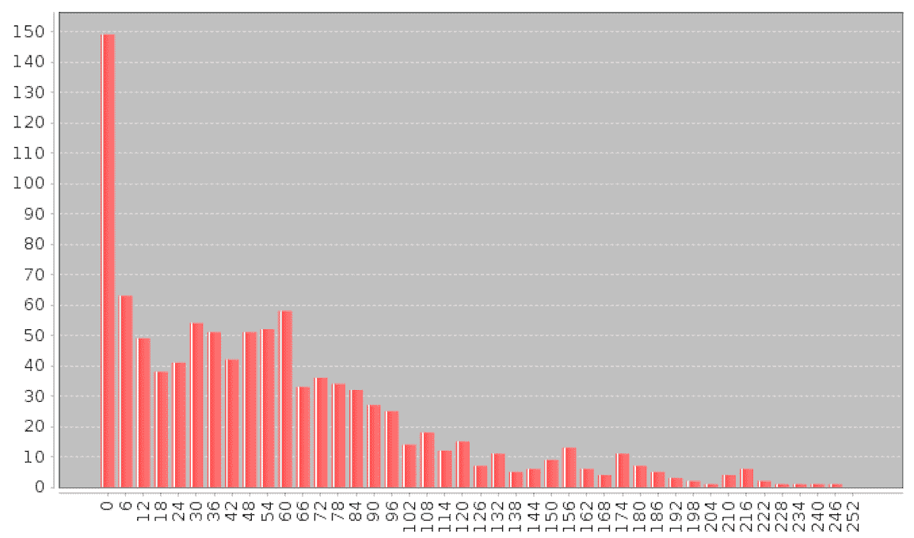

我们处理这种情况的一种方法是对目标变量应用转换，即我们取目标值的对数而不是原始值。这通常被称为对目标变量进行对数转换（此转换也可以应用于特征值）。

我们将对以下目标变量应用对数变换，并使用以下代码绘制对数变换后的值的直方图：

Scala

```scala
object PlotLogData { 

  def main(args: Array[String]) { 
    val records = Util.getRecords()._1 
    val records_x = records.map( 
      r => Math.log(r(r.length -1).toDouble)) 
    var records_int = new ArrayInt.length) 
    print(records_x.first()) 
    val records_collect = records_x.collect() 

    for (i <- 0 until records_collect.length){ 
      records_int(i) = records_collect(i).toInt 
    } 
    val min_1 = records_int.min 
    val max_1 = records_int.max 

    val min = min_1.toFloat 
    val max = max_1.toFloat 
    val bins = 10 
    val step = (max/bins).toFloat 

    var mx = Map(0.0.toString -> 0) 
    for (i <- step until (max + step) by step) { 
      mx += (i.toString -> 0); 
    } 

    for(i <- 0 until records_collect.length){ 
      for (j <- 0.0 until (max + step) by step) { 
        if(records_int(i) >= (j) && records_int(i) < (j + step)){ 
          mx = mx + (j.toString -> (mx(j.toString) + 1)) 
        } 
      } 
    } 
    val mx_sorted = ListMap(mx.toSeq.sortBy(_._1.toFloat):_*) 
    val ds = new org.jfree.data.category.DefaultCategoryDataset 
    var i = 0 
    mx_sorted.foreach{ case (k,v) => ds.addValue(v,"", k)} 

    val chart = ChartFactories.BarChart(ds) 
    val font = new Font("Dialog", Font.PLAIN,4); 

    chart.peer.getCategoryPlot.getDomainAxis(). 
      setCategoryLabelPositions(CategoryLabelPositions.UP_90); 
    chart.peer.getCategoryPlot.getDomainAxis.setLabelFont(font) 
    chart.show() 
    Util.sc.stop() 
  } 
} 

```

前面输出的图表如下所示：

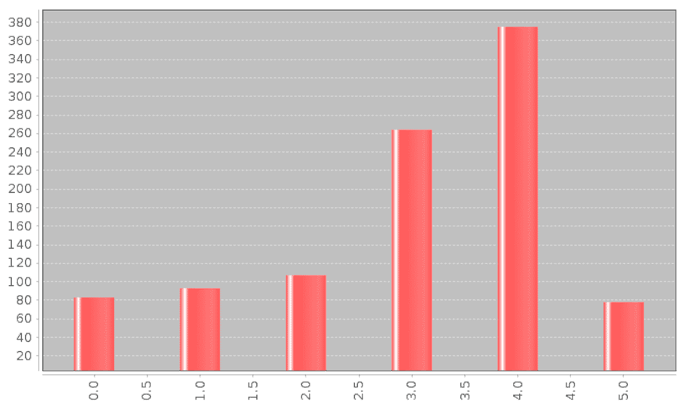

第二种转换类型在目标值不取负值，并且可能取值范围非常广泛的情况下非常有用，那就是对变量取平方根。

我们将在以下代码中应用平方根变换，再次绘制结果目标变量的分布：

从对数和平方根变换的图表中，我们可以看到两者都相对于原始值产生了更均匀的分布。虽然它们仍然不是正态分布，但与原始目标变量相比，它们更接近正态分布。

# 对对数变换目标的训练影响

那么，应用这些转换对模型性能有影响吗？让我们以对数变换数据为例，评估我们之前使用的各种指标。

我们将首先对线性模型进行操作，通过对每个`LabeledPoint` RDD 的`label`字段应用对数函数。在这里，我们只会对目标变量进行转换，不会对特征进行任何转换。

然后，我们将在转换后的数据上训练模型，并形成预测值与真实值的 RDD。

请注意，现在我们已经转换了目标变量，模型的预测将在对数尺度上，转换后数据集的目标值也将在对数尺度上。因此，为了使用我们的模型并评估其性能，我们必须首先通过使用`numpy exp`函数将对数数据转换回原始尺度，对预测值和真实值都进行指数化。

最后，我们将计算模型的 MSE、MAE 和 RMSLE 指标：

Scala

```scala
object LinearRegressionWithLog{ 

  def main(args: Array[String]) { 

    val recordsArray = Util.getRecords() 
    val records = recordsArray._1 
    val first = records.first() 
    val numData = recordsArray._2 

    println(numData.toString()) 
    records.cache()
     print("Mapping of first categorical feature column: " + 
       Util.get_mapping(records, 2)) 
    var list = new ListBuffer[Map[String, Long]]() 
    for( i <- 2 to 9){ 
      val m =  Util.get_mapping(records, i) 
      list += m 
    } 
    val mappings = list.toList 
    var catLen = 0 
    mappings.foreach( m => (catLen +=m.size)) 

    val numLen = records.first().slice(11, 15).size 
    val totalLen = catLen + numLen
    print("Feature vector length for categorical features:"+ 
       catLen)
     print("Feature vector length for numerical features:" +
       numLen)
     print("Total feature vector length: " + totalLen) 

    val data = { 
      records.map(r => LabeledPoint(Math.log(Util.extractLabel(r)),
         Util.extractFeatures(r, catLen, mappings)))
    } 
    val first_point = data.first() 
    println("Linear Model feature vector:" + 
       first_point.features.toString) 
    println("Linear Model feature vector length: " + 
       first_point.features.size) 

    val iterations = 10 
    val step = 0.025 
    val intercept =true 
    val linear_model = LinearRegressionWithSGD.train(data, 
       iterations, step) 
    val x = linear_model.predict(data.first().features) 
    val true_vs_predicted = data.map(p => (Math.exp(p.label), 
       Math.exp(linear_model.predict(p.features)))) 
    val true_vs_predicted_csv = data.map(p => p.label + " ," + 
       linear_model.predict(p.features)) 
    val format = new java.text.SimpleDateFormat(
       "dd-MM-yyyy-hh-mm-ss") 
    val date = format.format(new java.util.Date()) 
    val save = false 
    if (save){ 
         true_vs_predicted_csv.saveAsTextFile( 
           "./output/linear_model_" + date + ".csv") 
    } 
    val true_vs_predicted_take5 = true_vs_predicted.take(5) 
    for(i <- 0 until 5) { 
      println("True vs Predicted: " + "i :" + 
         true_vs_predicted_take5(i)) 
    } 

    Util.calculatePrintMetrics(true_vs_predicted, 
       "LinearRegressioWithSGD Log")
  } 
} 

```

前面代码的输出将类似于以下内容：

```scala
LinearRegressioWithSGD Log - Mean Squared Error: 5055.089410453301
LinearRegressioWithSGD Log - Mean Absolute Error: 51.56719871511336
LinearRegressioWithSGD Log - Root Mean Squared Log 
   Error:1.7785399629180894

```

代码清单可在以下链接找到：

+   [`github.com/ml-resources/spark-ml/tree/branch-ed2/Chapter_07/scala/2.0.0/scala-spark-app/src/main/scala/org/sparksamples/regression/ linearregression/LinearRegressionWithLog.scala`](https://github.com/ml-resources/spark-ml/tree/branch-ed2/Chapter_07/scala/2.0.0/scala-spark-app/src/main/scala/org/sparksamples/regression/%20linearregression/LinearRegressionWithLog.scala)

+   [`github.com/ml-resources/spark-ml/tree/branch-ed2/Chapter_07/scala/2.0.0/scala-spark-app/src/main/scala/org/sparksamples/regression/ linearregression/LinearRegression.scala`](https://github.com/ml-resources/spark-ml/tree/branch-ed2/Chapter_07/scala/2.0.0/scala-spark-app/src/main/scala/org/sparksamples/regression/%20linearregression/LinearRegression.scala)

如果我们将这些前面的结果与原始目标变量的结果进行比较，我们会发现所有三个值都变得更糟。

```scala
LinearRegressioWithSGD - Mean Squared Error: 35817.9777663029
LinearRegressioWithSGD - Mean Absolute Error: 136.94887209426008
LinearRegressioWithSGD - Root Mean Squared Log Error: 
    1.4482391780194306
LinearRegressioWithSGD Log - Mean Squared Error: 60192.54096079104
LinearRegressioWithSGD Log - Mean Absolute Error: 
    170.82191606911752
LinearRegressioWithSGD Log - Root Mean Squared Log Error: 
    1.9587586971094555

```

# 调整模型参数

到目前为止，在本章中，我们已经通过在相同数据集上进行训练和测试来说明了 MLlib 回归模型的模型训练和评估的概念。现在，我们将使用与之前类似的交叉验证方法来评估不同参数设置对模型性能的影响。

# 创建训练和测试集以评估参数。

第一步是为交叉验证目的创建测试和训练集。

在 Scala 中，拆分更容易实现，并且`randomSplit`函数可用：

```scala
val splits = data.randomSplit(Array(0.8, 0.2), seed = 11L) 
val training = splits(0).cache() 
val test = splits(1) 

```

# 决策树的数据拆分

最后一步是对决策树模型提取的特征应用相同的方法。

Scala

```scala
val splits = data_dt.randomSplit(Array(0.8, 0.2), seed = 11L) 
val training = splits(0).cache() 
val test = splits(1) 

```

# 线性模型参数设置的影响

现在我们已经准备好了我们的训练和测试集，我们准备研究不同参数设置对模型性能的影响。我们将首先对线性模型进行评估。我们将创建一个方便的函数，通过在训练集上训练模型，并在不同的参数设置下在测试集上评估相关性能指标。

我们将使用 RMSLE 评估指标，因为这是 Kaggle 竞赛中使用的指标，这样可以让我们将模型结果与竞赛排行榜进行比较，看看我们的表现如何。

评估函数在这里定义：

Scala

```scala
def evaluate(train: RDD[LabeledPoint],test: RDD[LabeledPoint], 
  iterations:Int,step:Double, 
  intercept:Boolean): Double ={ 
  val linReg =  
    new LinearRegressionWithSGD().setIntercept(intercept) 

  linReg.optimizer.setNumIterations(iterations).setStepSize(step) 
  val linear_model = linReg.run(train) 

  val true_vs_predicted = test.map(p => (p.label,  
    linear_model.predict(p.features))) 
  val rmsle = Math.sqrt(true_vs_predicted.map{  
    case(t, p) => Util.squaredLogError(t, p)}.mean()) 
  return rmsle 
} 

```

请注意，在接下来的部分，由于 SGD 的一些随机初始化，您可能会得到略有不同的结果。但是，您的结果是可以比较的。

# 迭代

正如我们在评估分类模型时看到的，通常情况下，我们期望使用 SGD 训练的模型随着迭代次数的增加而获得更好的性能，尽管随着迭代次数超过某个最小值，性能的提高将放缓。请注意，在这里，我们将步长设置为 0.01，以更好地说明在较高的迭代次数下的影响。

我们使用不同的迭代次数在 Scala 中实现了相同的功能，如下所示：

```scala
val data = LinearRegressionUtil.getTrainTestData() 
val train_data = data._1 
val test_data = data._2 
val iterations = 10 
//LinearRegressionCrossValidationStep$ 
//params = [1, 5, 10, 20, 50, 100, 200] 
val iterations_param = Array(1, 5, 10, 20, 50, 100, 200) 
val step =0.01 
//val steps_param = Array(0.01, 0.025, 0.05, 0.1, 1.0) 
val intercept =false 

val i = 0 
val results = new ArrayString 
val resultsMap = new scala.collection.mutable.HashMap[String, 
   String] 
val dataset = new DefaultCategoryDataset() 
for(i <- 0 until iterations_param.length) { 
  val iteration = iterations_param(i) 
  val rmsle = LinearRegressionUtil.evaluate(train_data, 
   test_data,iteration,step,intercept) 
  //results(i) = step + ":" + rmsle 
  resultsMap.put(iteration.toString,rmsle.toString) 
  dataset.addValue(rmsle, "RMSLE", iteration) 
} 

```

对于 Scala 实现，我们使用了 JfreeChart 的 Scala 版本。实现在 20 次迭代时达到最小的 RMSLE：

```scala
  Map(5 -> 0.8403179051522236, 200 -> 0.35682322830872604, 50 -> 
   0.07224447567763903, 1 -> 1.6381266770967882, 20 -> 
   0.23992956602621263, 100 -> 0.2525579338412989, 10 -> 
   0.5236271681647611) 

```

前面输出的图如下所示：

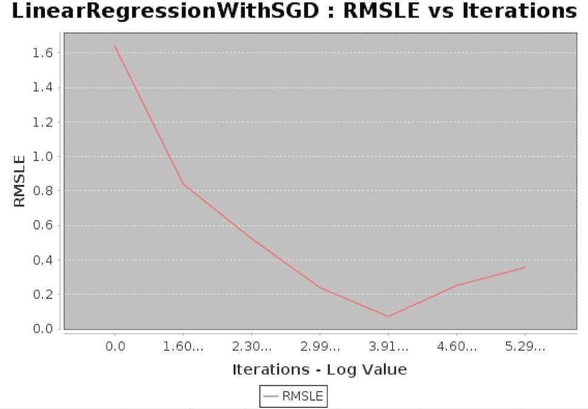

# 步长

我们将在下面的代码中对步长执行类似的分析：

Scala

```scala
val steps_param = Array(0.01, 0.025, 0.05, 0.1, 1.0) 
val intercept =false 

val i = 0 
val results = new ArrayString 
val resultsMap = new scala.collection.mutable.HashMap[String, String] 
val dataset = new DefaultCategoryDataset() 
for(i <- 0 until steps_param.length) { 
  val step = steps_param(i) 
  val rmsle = LinearRegressionUtil.evaluate(train_data, 
         test_data,iterations,step,intercept) 
  resultsMap.put(step.toString,rmsle.toString) 
  dataset.addValue(rmsle, "RMSLE", step) 
} 

```

前面代码的输出如下：

```scala
    [1.7904244862988534, 1.4241062778987466, 1.3840130355866163, 
   1.4560061007109475, nan]

```

前面输出的图如下所示：

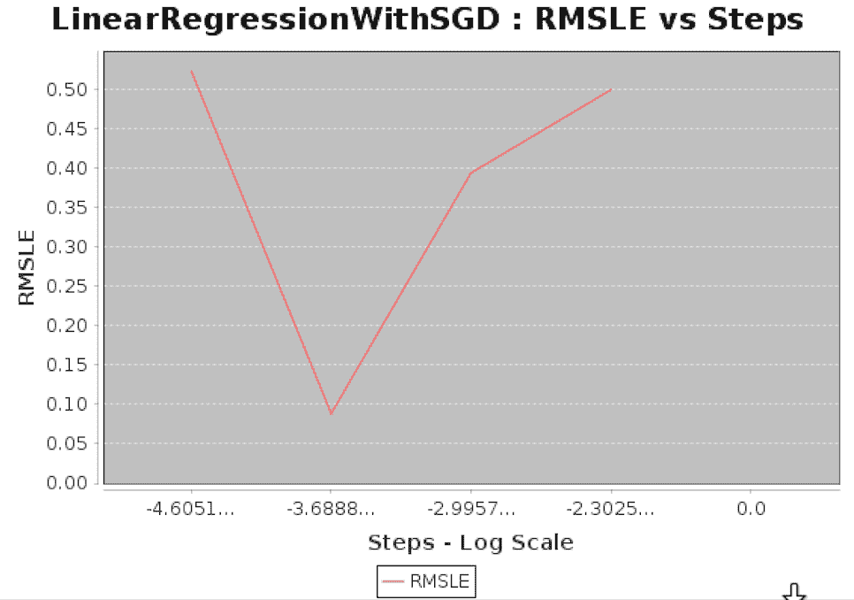

现在我们可以看到为什么在最初训练线性模型时避免使用默认步长。默认值设置为*1.0*，在这种情况下，导致 RMSLE 指标输出为`nan`。这通常意味着 SGD 模型已经收敛到了一个非常糟糕的局部最小值，这是优化算法容易超过好的解决方案的情况。 

我们还可以看到，对于较低的步长和相对较少的迭代次数（这里我们使用了 10 次），模型性能略差。然而，在前面的*迭代*部分，我们看到对于较低的步长设置，更多的迭代次数通常会收敛到更好的解决方案。

一般来说，设置步长和迭代次数涉及权衡。较低的步长意味着收敛速度较慢，但稍微更有保证。然而，它需要更多的迭代次数，在计算和时间方面更加昂贵，特别是在非常大规模的情况下。

选择最佳参数设置可能是一个密集的过程，涉及在许多参数设置的组合上训练模型并选择最佳结果。每个模型训练实例都涉及一定数量的迭代，因此当在非常大的数据集上执行时，这个过程可能非常昂贵和耗时。模型初始化也会对结果产生影响，无论是达到全局最小值，还是在梯度下降图中达到次优局部最小值。

# L2 正则化

在第六章中，*使用 Spark 构建分类模型*，我们看到正则化会惩罚模型复杂性，形式上是一个额外的损失项，是模型权重向量的函数。L2 正则化惩罚权重向量的 L2 范数，而 L1 正则化惩罚权重向量的 L1 范数。

我们预计随着正则化的增加，训练集性能会下降，因为模型无法很好地拟合数据集。然而，我们也期望一定程度的正则化将导致最佳的泛化性能，这可以通过测试集上的最佳性能来证明。

# L1 正则化

我们可以对不同水平的 L1 正则化应用相同的方法，如下所示：

```scala
params = [0.0, 0.01, 0.1, 1.0, 10.0, 100.0, 1000.0] 
metrics = [evaluate(train_data, test_data, 10, 0.1, param, 'l1', 
   False) for param in params] 
print params 
print metrics 
plot(params, metrics) 
fig = matplotlib.pyplot.gcf() 
pyplot.xscale('log') 

```

再次，当以图表形式绘制时，结果更加清晰。我们看到 RMSLE 有一个更加微妙的下降，需要一个非常高的值才会导致反弹。在这里，所需的 L1 正则化水平比 L2 形式要高得多；然而，整体性能较差：

```scala
[0.0, 0.01, 0.1, 1.0, 10.0, 100.0, 1000.0]
[1.5384660954019971, 1.5384518080419873, 1.5383237472930684, 
    1.5372017600929164, 1.5303809928601677, 1.4352494587433793, 
    4.7551250073268614]

```

使用 L1 正则化可以鼓励稀疏的权重向量。在这种情况下是否成立？我们可以通过检查权重向量中零的条目数来找出答案，随着正则化水平的增加，零的条目数也在增加。

```scala
model_l1 = LinearRegressionWithSGD.train(train_data, 10, 0.1, 
   regParam=1.0, regType='l1', intercept=False) 
model_l1_10 = LinearRegressionWithSGD.train(train_data, 10, 0.1, 
   regParam=10.0, regType='l1', intercept=False) 
model_l1_100 = LinearRegressionWithSGD.train(train_data, 10, 0.1, 
   regParam=100.0, regType='l1', intercept=False) 
print "L1 (1.0) number of zero weights: " + 
   str(sum(model_l1.weights.array == 0)) 
print "L1 (10.0) number of zeros weights: " + 
   str(sum(model_l1_10.weights.array == 0)) 
print "L1 (100.0) number of zeros weights: " + 
   str(sum(model_l1_100.weights.array == 0)) 

```

从结果中可以看出，正如我们所预期的，随着 L1 正则化水平的增加，模型权重向量中零特征权重的数量也在增加。

```scala
L1 (1.0) number of zero weights: 4
L1 (10.0) number of zeros weights: 20
L1 (100.0) number of zeros weights: 55

```

# 截距

线性模型的最终参数选项是是否使用截距。截距是添加到权重向量的常数项，有效地解释了目标变量的平均值。如果数据已经居中或标准化，则不需要截距；然而，在任何情况下使用截距通常也不会有坏处。

我们将评估在模型中添加截距项的影响：

Scala

```scala
object LinearRegressionCrossValidationIntercept{ 
  def main(args: Array[String]) { 
    val data = LinearRegressionUtil.getTrainTestData() 
    val train_data = data._1 
    val test_data = data._2 

    val iterations = 10 
    val step = 0.1 
    val paramsArray = new ArrayBoolean 
    paramsArray(0) = true 
    paramsArray(1) = false 
    val i = 0 
    val results = new ArrayString 
    val resultsMap = new scala.collection.mutable.HashMap[ 
    String, String] 
    val dataset = new DefaultCategoryDataset() 
    for(i <- 0 until 2) { 
      val intercept = paramsArray(i) 
      val rmsle = LinearRegressionUtil.evaluate(train_data,  
        test_data,iterations,step,intercept) 
      results(i) = intercept + ":" + rmsle 
      resultsMap.put(intercept.toString,rmsle.toString) 
      dataset.addValue(rmsle, "RMSLE", intercept.toString) 
    } 
    val chart = new LineChart( 
      "Steps" , 
      "LinearRegressionWithSGD : RMSLE vs Intercept") 
    chart.exec("Steps","RMSLE",dataset) 
    chart.lineChart.getCategoryPlot().getRangeAxis().setRange( 
    1.56, 1.57) 
    chart.pack( ) 
    RefineryUtilities.centerFrameOnScreen( chart ) 
    chart.setVisible( true ) 
    println(results) 
  } 
} 

```

上述输出的图表如下所示：

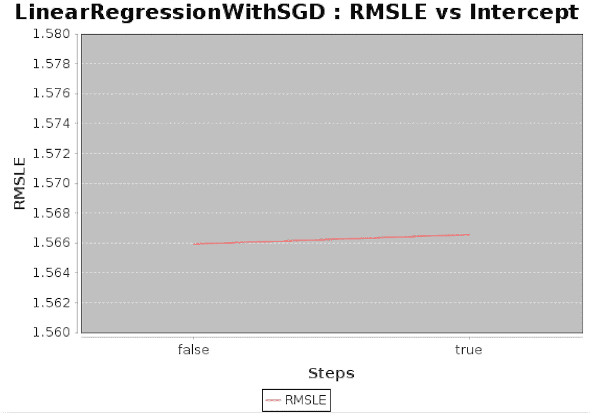

如前图所示，当截距为 true 时，RMSLE 值略高于截距为 false 时。

# 决策树参数设置的影响

决策树提供两个主要参数：最大树深度和最大箱数。我们现在将对决策树模型的参数设置效果进行相同的评估。我们的起点是创建一个模型的评估函数，类似于之前用于线性回归的函数。该函数如下所示：

Scala

```scala
def evaluate(train: RDD[LabeledPoint],test: RDD[LabeledPoint], 
  categoricalFeaturesInfo: scala.Predef.Map[Int, Int], 
  maxDepth :Int, maxBins: Int): Double = { 
    val impurity = "variance" 
    val decisionTreeModel = DecisionTree.trainRegressor(train, 
      categoricalFeaturesInfo, 
      impurity, maxDepth, maxBins) 
    val true_vs_predicted = test.map(p => (p.label,  
      decisionTreeModel.predict(p.features))) 
    val rmsle = Math.sqrt(true_vs_predicted.map{  
      case(t, p) => Util.squaredLogError(t, p)}.mean()) 
      return rmsle 
  } 

```

# 树深度

通常我们期望性能会随着更复杂的树（即更深的树）而提高。较低的树深度起到一种正则化的作用，可能会出现与线性模型中的 L2 或 L1 正则化类似的情况，即存在一个最优的树深度与测试集性能相关。

在这里，我们将尝试增加树的深度，以查看它们对测试集 RMSLE 的影响，保持箱数的默认水平为`32`：

Scala

```scala
val data = DecisionTreeUtil.getTrainTestData() 
  val train_data = data._1 
  val test_data = data._2 
  val iterations = 10 
  val bins_param = Array(2, 4, 8, 16, 32, 64, 100) 
  val depth_param = Array(1, 2, 3, 4, 5, 10, 20) 
  val bin = 32 
  val categoricalFeaturesInfo = scala.Predef.Map[Int, Int]() 
  val i = 0 
  val results = new ArrayString 
  val resultsMap = new scala.collection.mutable.HashMap[ 
    String, String] 
  val dataset = new DefaultCategoryDataset() 
  for(i <- 0 until depth_param.length) { 
    val depth = depth_param(i) 
    val rmsle = DecisionTreeUtil.evaluate( 
    train_data, test_data, categoricalFeaturesInfo, depth, bin) 

    resultsMap.put(depth.toString,rmsle.toString) 
    dataset.addValue(rmsle, "RMSLE", depth) 
  } 
  val chart = new LineChart( 
    "MaxDepth" , 
    "DecisionTree : RMSLE vs MaxDepth") 
  chart.exec("MaxDepth","RMSLE",dataset) 
  chart.pack() 
  RefineryUtilities.centerFrameOnScreen( chart ) 
  chart.setVisible( true ) 
  print(resultsMap) 
} 

```

上述输出的图表如下所示：

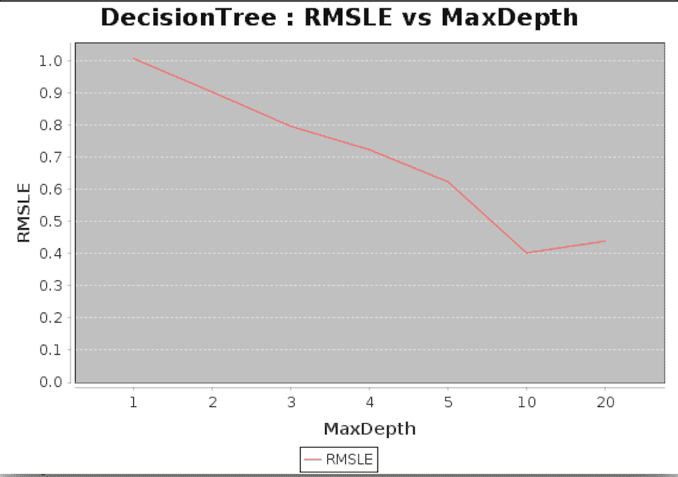

# 最大箱数

最后，我们将评估决策树箱数设置的影响。与树深度一样，更多的箱数应该允许模型变得更复杂，并可能有助于处理更大的特征维度。在一定程度之后，它不太可能再有帮助，实际上可能会由于过拟合而影响测试集的性能。

Scala

```scala
object DecisionTreeMaxBins{ 
  def main(args: Array[String]) { 
    val data = DecisionTreeUtil.getTrainTestData() 
    val train_data = data._1 
    val test_data = data._2 
    val iterations = 10 
    val bins_param = Array(2, 4, 8, 16, 32, 64, 100) 
    val maxDepth = 5 
    val categoricalFeaturesInfo = scala.Predef.Map[Int, Int]() 
    val i = 0 
    val results = new ArrayString 
    val resultsMap = new scala.collection.mutable.HashMap[ 
        String, String] 
    val dataset = new DefaultCategoryDataset() 
    for(i <- 0 until bins_param.length) { 
      val bin = bins_param(i) 
      val rmsle = { 
        DecisionTreeUtil.evaluate(train_data, test_data, 
         categoricalFeaturesInfo, 5, bin) 
      } 
      resultsMap.put(bin.toString,rmsle.toString) 
      dataset.addValue(rmsle, "RMSLE", bin) 
    } 
    val chart = new LineChart( 
      "MaxBins" , 
      "DecisionTree : RMSLE vs MaxBins") 
    chart.exec("MaxBins","RMSLE",dataset) 
    chart.pack( ) 
    RefineryUtilities.centerFrameOnScreen( chart ) 
    chart.setVisible( true ) 
    print(resultsMap) 
  } 

```

上述输出的图表如下所示：

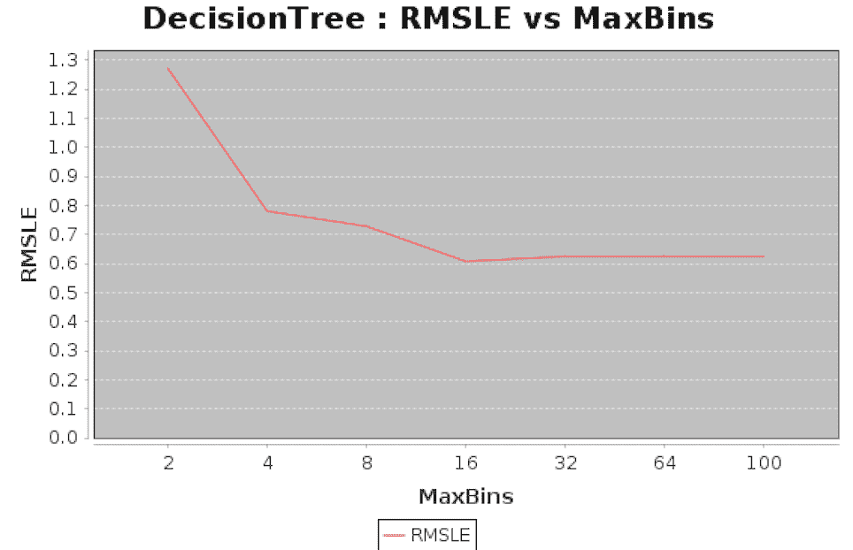

# 梯度提升树的参数设置影响

梯度提升树有两个主要参数：迭代次数和最大深度。我们将对这些进行变化并观察效果。

# 迭代

Scala

```scala
object GradientBoostedTreesIterations{ 

  def main(args: Array[String]) { 
    val data = GradientBoostedTreesUtil.getTrainTestData() 
    val train_data = data._1 
    val test_data = data._2 

    val iterations_param = Array(1, 5, 10, 15, 18) 

    val i = 0 
    val resultsMap = new scala.collection.mutable.HashMap[ 
        String, String] 
    val dataset = new DefaultCategoryDataset() 
    for(i <- 0 until iterations_param.length) { 
      val iteration = iterations_param(i) 
      val rmsle = GradientBoostedTreesUtil.evaluate(train_data,  
        test_data,iteration,maxDepth) 
      resultsMap.put(iteration.toString,rmsle.toString) 
      dataset.addValue(rmsle, "RMSLE", iteration) 
    } 
    val chart = new LineChart( 
      "Iterations" , 
      "GradientBoostedTrees : RMSLE vs Iterations") 
    chart.exec("Iterations","RMSLE",dataset) 
    chart.pack( ) 
    chart.lineChart.getCategoryPlot().
       getRangeAxis().setRange(1.32, 1.37) 
    RefineryUtilities.centerFrameOnScreen( chart ) 
    chart.setVisible( true ) 
    print(resultsMap) 
  } 
} 

```

上述输出的图表如下所示：

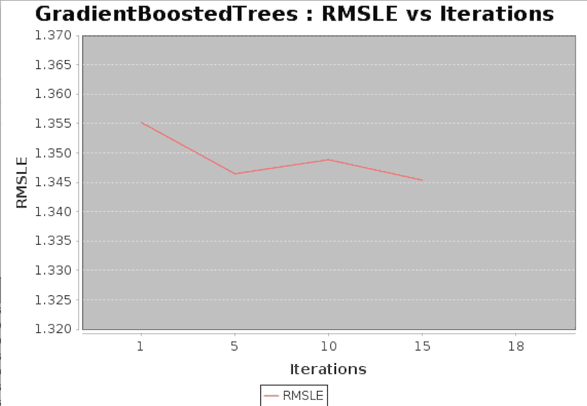

# MaxBins

接下来我们看一下改变最大箱数如何影响 RMSLE 值。

Scala

让我们看一下 Scala 中的示例实现。我们将计算最大箱数为`10`、`16`、`32`和`64`时的 RMSLE 值。

```scala
object GradientBoostedTreesMaxBins{ 

  def main(args: Array[String]) { 
    val data = GradientBoostedTreesUtil.getTrainTestData() 
    val train_data = data._1 
    val test_data = data._2 

    val maxBins_param = Array(10,16,32,64) 
    val iteration = 10 
    val maxDepth = 3 

    val i = 0 
    val resultsMap =  
    new scala.collection.mutable.HashMap[String, String] 
    val dataset = new DefaultCategoryDataset() 
    for(i <- 0 until maxBins_param.length) { 
      val maxBin = maxBins_param(i) 
      val rmsle = GradientBoostedTreesUtil.evaluate(train_data, 
         test_data,iteration,maxDepth, maxBin) 

      resultsMap.put(maxBin.toString,rmsle.toString) 
      dataset.addValue(rmsle, "RMSLE", maxBin) 
    } 
    val chart = new LineChart( 
      "Max Bin" , 
      "GradientBoostedTrees : RMSLE vs MaxBin") 
    chart.exec("MaxBins","RMSLE",dataset) 
    chart.pack( ) 
    chart.lineChart.getCategoryPlot(). 
        getRangeAxis().setRange(1.35, 1.37) 
    RefineryUtilities.centerFrameOnScreen( chart ) 
    chart.setVisible(true) 
    print(resultsMap) 
  } 

```

上述输出的图表如下所示：

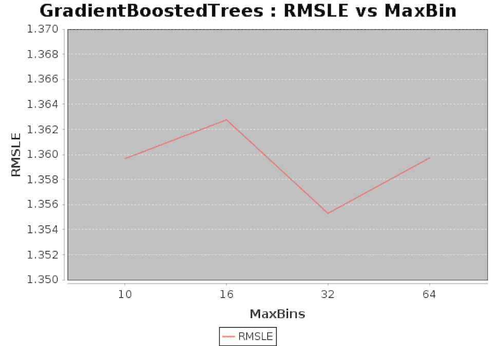

# 总结

在本章中，您看到了如何在回归模型的背景下使用 ML 库的线性模型、决策树、梯度提升树、岭回归和等温回归功能。我们探讨了分类特征提取，以及在回归问题中应用转换对目标变量的影响。最后，我们实现了各种性能评估指标，并使用它们来实施交叉验证练习，探讨线性模型和决策树中各种参数设置对测试集模型性能的影响。

在下一章中，我们将介绍一种不同的机器学习方法，即无监督学习，特别是聚类模型。
