# 第八章：使用 Spark 构建聚类模型

在过去的几章中，我们涵盖了监督学习方法，其中训练数据带有我们想要预测的真实结果的标签（例如，推荐的评级和分类的类分配，或者在回归的情况下是真实目标变量）。

接下来，我们将考虑没有可用标记数据的情况。这被称为**无监督学习**，因为模型没有受到真实目标标签的监督。无监督情况在实践中非常常见，因为在许多真实场景中获取标记的训练数据可能非常困难或昂贵（例如，让人类为分类标签标记训练数据）。然而，我们仍然希望学习数据中的一些潜在结构，并使用这些结构进行预测。

这就是无监督学习方法可以发挥作用的地方。无监督学习模型也经常与监督模型结合使用；例如，应用无监督技术为监督模型创建新的输入特征。

聚类模型在许多方面类似于分类模型的无监督等价物。在分类中，我们试图学习一个模型，可以预测给定训练示例属于哪个类。该模型本质上是从一组特征到类的映射。

在聚类中，我们希望对数据进行分段，以便将每个训练示例分配给一个称为**簇**的段。这些簇的作用很像类，只是真实的类分配是未知的。

聚类模型有许多与分类相同的用例；其中包括以下内容：

+   根据行为特征和元数据将用户或客户分成不同的群体

+   在网站上对内容进行分组或在零售业务中对产品进行分组

+   寻找相似基因的簇

+   在生态学中对社区进行分割

+   创建图像段，用于图像分析应用，如目标检测

在本章中，我们将：

+   简要探讨几种聚类模型

+   从数据中提取特征，特别是使用一个模型的输出作为我们聚类模型的输入特征

+   训练一个聚类模型并使用它进行预测

+   应用性能评估和参数选择技术来选择要使用的最佳簇数

# 聚类模型的类型

有许多不同形式的聚类模型可用，从简单到极其复杂。Spark MLlib 目前提供 k-means 聚类，这是最简单的方法之一。然而，它通常非常有效，而且其简单性意味着相对容易理解并且可扩展。

# k-means 聚类

k-means 试图将一组数据点分成*K*个不同的簇（其中*K*是模型的输入参数）。

更正式地说，k-means 试图找到簇，以便最小化每个簇内的平方误差（或距离）。这个目标函数被称为**簇内平方误差和**（**WCSS**）。

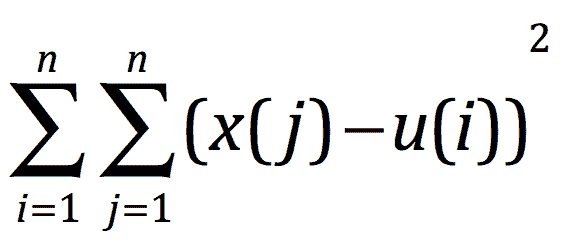

它是每个簇中每个点与簇中心之间的平方误差的总和。

从一组*K*个初始簇中心开始（这些中心是计算为簇中所有数据点的平均向量），K-means 的标准方法在两个步骤之间进行迭代：

1.  将每个数据点分配给最小化 WCSS 的簇。平方和等于平方欧氏距离；因此，这相当于根据欧氏距离度量将每个点分配给**最接近**的簇中心。

1.  根据第一步的簇分配计算新的簇中心。

该算法进行到达到最大迭代次数或收敛为止。**收敛**意味着在第一步期间簇分配不再改变；因此，WCSS 目标函数的值也不再改变。

有关更多详细信息，请参考 Spark 关于聚类的文档[`spark.apache.org/docs/latest/mllib-clustering.html`](http://spark.apache.org/docs/latest/mllib-clustering.html)或参考[`en.wikipedia.org/wiki/K-means_clustering`](http://en.wikipedia.org/wiki/K-means_clustering)。

为了说明 K-means 的基础知识，我们将使用我们在第六章中展示的多类分类示例中所示的简单数据集，*使用 Spark 构建分类模型*。回想一下，我们有五个类别，如下图所示：

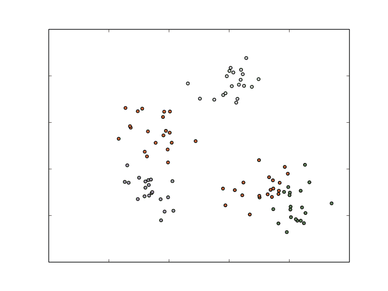

多类数据集

然而，假设我们实际上不知道真实的类别。如果我们使用五个簇的 k-means，那么在第一步之后，模型的簇分配可能是这样的：

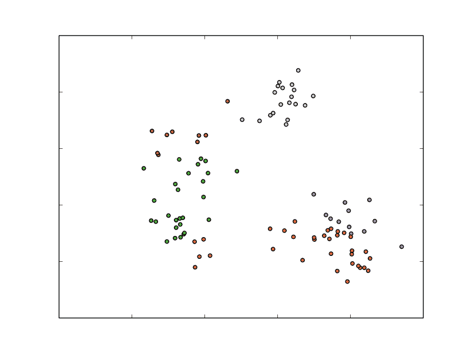

第一次 K-means 迭代后的簇分配

我们可以看到，k-means 已经相当好地挑选出了每个簇的中心。在下一次迭代之后，分配可能看起来像下图所示的那样：

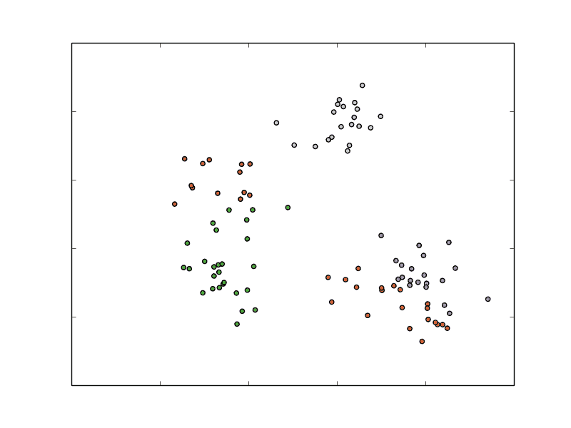

第二次 K-means 迭代后的簇分配

事情开始稳定下来，但总体簇分配与第一次迭代后基本相同。一旦模型收敛，最终的分配可能看起来像这样：

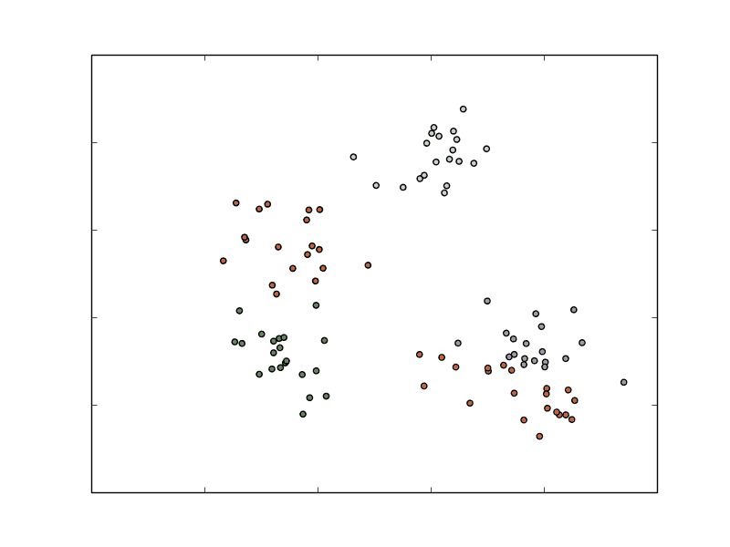

K-means 的最终簇分配

正如我们所看到的，模型已经相当好地分离了这五个簇。最左边的三个相当准确（有一些错误的点）。然而，右下角的两个簇不太准确。

这说明：

+   K-means 的迭代性质

+   模型对于最初选择簇中心的方法的依赖性（这里，我们将使用随机方法）

+   最终的簇分配对于分离良好的数据可能非常好，但对于更困难的数据可能较差

# 初始化方法

k-means 的标准初始化方法通常简称为随机方法，它首先随机将每个数据点分配给一个簇，然后进行第一个更新步骤。

Spark ML 提供了这种初始化方法的并行变体，称为**K-means++**，这是默认的初始化方法。

有关更多信息，请参阅[`en.wikipedia.org/wiki/K-means_clustering#Initialization_methods`](http://en.wikipedia.org/wiki/K-means_clustering#Initialization_methods)和[`en.wikipedia.org/wiki/K-means%2B%2B`](http://en.wikipedia.org/wiki/K-means%2B%2B)。

使用 K-means++的结果如下所示。请注意，这一次，困难的右下角点大部分被正确地聚类了：

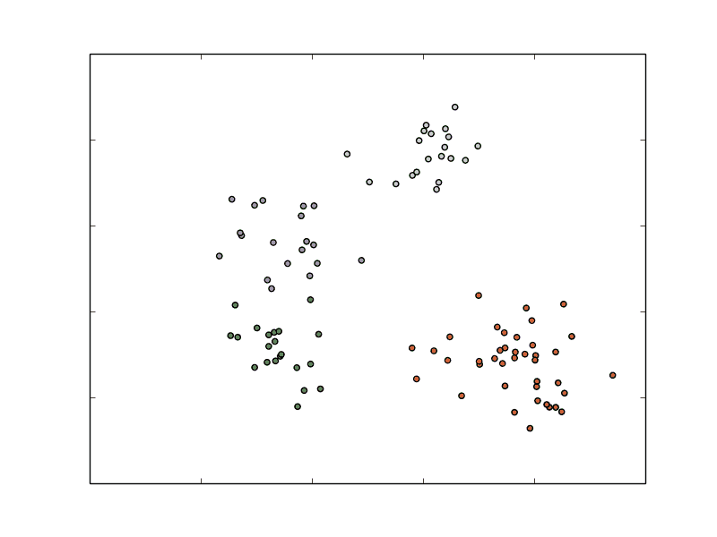

K-means++的最终簇分配

还有许多其他的 K-means 变体；它们侧重于初始化方法或核心模型。其中一个更常见的变体是**模糊 K-means**。这个模型不像 K-means 那样将每个点分配给一个簇（所谓的硬分配）。相反，它是 K-means 的软版本，其中每个点可以属于许多簇，并且由相对于每个簇的成员资格表示。因此，对于*K*个簇，每个点被表示为一个 K 维成员资格向量，向量中的每个条目表示在每个簇中的成员资格比例。

# 混合模型

**混合模型**本质上是模糊 K 均值背后思想的延伸；然而，它假设存在一个生成数据的潜在概率分布。例如，我们可能假设数据点是从一组 K 个独立的高斯（正态）概率分布中抽取的。簇分配也是软的，因此每个点在 K 个潜在概率分布中都由*K*成员权重表示。

有关混合模型的更多详细信息和混合模型的数学处理，请参见[`en.wikipedia.org/wiki/Mixture_model`](http://en.wikipedia.org/wiki/Mixture_model)。

# 分层聚类

**分层聚类**是一种结构化的聚类方法，它会产生一个多级别的簇层次结构，其中每个簇可能包含许多子簇。因此，每个子簇都与父簇相关联。这种形式的聚类通常也被称为**树状聚类**。

凝聚聚类是一种自下而上的方法：

+   每个数据点都开始在自己的簇中

+   评估每对簇之间的相似性（或距离）

+   找到最相似的一对簇；然后将这对簇合并成一个新的簇

+   该过程重复进行，直到只剩下一个顶层簇

**分裂聚类**是一种自上而下的方法，从一个簇开始，然后在每个阶段将一个簇分裂成两个，直到所有数据点都被分配到自己的底层簇中。

**自上而下聚类**比自下而上聚类更复杂，因为需要第二个平面聚类算法作为“子程序”。如果我们不生成完整的层次结构到单个文档叶子，自上而下聚类具有更高的效率。

您可以在[`en.wikipedia.org/wiki/Hierarchical_clustering`](http://en.wikipedia.org/wiki/Hierarchical_clustering)找到更多信息。

# 从数据中提取正确的特征

与迄今为止遇到的大多数机器学习模型一样，k 均值聚类需要数值向量作为输入。我们已经看到的用于分类和回归的相同特征提取和转换方法也适用于聚类。

与最小二乘回归一样，由于 k 均值使用平方误差函数作为优化目标，它往往会受到异常值和具有大方差的特征的影响。

聚类可以用来检测异常值，因为它们可能会引起很多问题。

对于回归和分类情况，输入数据可以被标准化和规范化以克服这一问题，这可能会提高准确性。然而，在某些情况下，如果例如目标是根据某些特定特征找到分割，可能不希望标准化数据。

# 从 MovieLens 数据集中提取特征

在使用聚类算法之前，我们将使用 ALS 算法获取用户和项目（电影）的数值特征：

1.  首先将数据`u.data`加载到 DataFrame 中：

```scala
      val ratings = spark.sparkContext 
      .textFile(DATA_PATH + "/u.data") 
      .map(_.split("\t")) 
      .map(lineSplit => Rating(lineSplit(0).toInt, 
        lineSplit(1).toInt,  lineSplit(2).toFloat, 
        lineSplit(3).toLong)) 
      .toDF()

```

1.  然后我们将其按 80:20 的比例分割，得到训练和测试数据：

```scala
      val Array(training, test) =  
        ratings.randomSplit(Array(0.8, 0.2))

```

1.  我们实例化`ALS`类，将最大迭代次数设置为`5`，正则化参数设置为`0.01`：

```scala
      val als = new ALS() 
        .setMaxIter(5) 
        .setRegParam(0.01) 
        .setUserCol("userId") 
        .setItemCol("movieId") 
        .setRatingCol("rating")

```

1.  然后我们创建一个模型，然后计算预测：

```scala
      val model = als.fit(training) 
      val predictions = model.transform(test)

```

1.  接着计算`userFactors`和`itemFactors`：

```scala
      val itemFactors = model.itemFactors 
      itemFactors.show() 

      val userFactors = model.userFactors 
      userFactors.show()

```

1.  我们将它们转换为 libsvm 格式并将它们持久化在一个文件中。请注意，我们持久化所有特征以及两个特征：

```scala
      val itemFactorsOrdererd = itemFactors.orderBy("id") 
      val itemFactorLibSVMFormat = 
        itemFactorsOrdererd.rdd.map(x => x(0) + " " + 
        getDetails(x(1).asInstanceOf
          [scala.collection.mutable.WrappedArray[Float]])) 
      println("itemFactorLibSVMFormat.count() : " + 
        itemFactorLibSVMFormat.count()) 
      print("itemFactorLibSVMFormat.first() : " + 
        itemFactorLibSVMFormat.first()) 

      itemFactorLibSVMFormat.coalesce(1)
        .saveAsTextFile(output + "/" + date_time + 
        "/movie_lens_items_libsvm")

```

`movie_lens_items_libsvm`的输出将如下所示：

```scala
          1 1:0.44353345 2:-0.7453435 3:-0.55146646 4:-0.40894786 
          5:-0.9921601 6:1.2012635 7:0.50330496 8:-0.23256435     
          9:0.55483425 10:-1.4781344
 2 1:0.34384087 2:-1.0242497 3:-0.20907198 4:-0.102892995 
          5:-1.0616653 6:1.1338154 7:0.5742042 8:-0.46505615  
          9:0.3823278 10:-1.0695107 3 1:-0.04743084 2:-0.6035447  
          3:-0.7999673 4:0.16897096    
          5:-1.0216197 6:0.3304353 7:1.5495727 8:0.2972699  
          9:-0.6855238 
          10:-1.5391738
 4 1:0.24745995 2:-0.33971268 3:0.025664425 4:0.16798466 
          5:-0.8462472 6:0.6734541 7:0.7537076 8:-0.7119413  
          9:0.7475001 
          10:-1.965572
 5 1:0.30903652 2:-0.8523586 3:-0.54090345 4:-0.7004097 
          5:-1.0383878 6:1.1784278 7:0.5125761 8:0.2566347         
          9:-0.020201845   
          10:-1.118083
 ....
 1681 1:-0.14603947 2:-0.4475343 3:-0.50514024 4:-0.7221697 
          5:-0.7997808 6:0.21069092 7:0.22631708 8:-0.32458723 
          9:0.20187362 10:-1.2734087
 1682 1:0.21975909 2:0.45303428 3:-0.73912954 4:-0.40584692 
          5:-0.5299451 6:0.79586357 7:0.5154468 8:-0.4033669  
          9:0.2220822 
          10:-0.70235217

```

1.  接下来，我们持久化前两个特征（具有最大变化）并将它们持久化在一个文件中：

```scala
      var itemFactorsXY = itemFactorsOrdererd.rdd.map( 
        x => getXY(x(1).asInstanceOf
        [scala.collection.mutable.WrappedArray[Float]])) 
      itemFactorsXY.first() 
      itemFactorsXY.coalesce(1).saveAsTextFile(output + "/" + 
        date_time + "/movie_lens_items_xy")

```

`movie_lens_items_xy`的输出将如下所示：

```scala
          2.254384458065033, 0.5487040132284164
          -2.0540390759706497, 0.5557805597782135
          -2.303591560572386, -0.047419726848602295
          -0.7448508385568857, -0.5028514862060547
          -2.8230229914188385, 0.8093537855893373
          -1.4274845123291016, 1.4835840165615082
          -1.3214656114578247, 0.09438827633857727
          -2.028286747634411, 1.0806758720427752
          -0.798517256975174, 0.8371041417121887
          -1.556841880083084, -0.8985426127910614
          -1.0867036543786526, 1.7443277575075626
          -1.4234793484210968, 0.6246072947978973
          -0.04958712309598923, 0.14585793018341064

```

1.  接下来我们计算`userFactors`的 libsvm 格式：

```scala
      val userFactorsOrdererd = userFactors.orderBy("id") 
      val userFactorLibSVMFormat = 
        userFactorsOrdererd.rdd.map(x => x(0) + " " + 
        getDetails(x(1).asInstanceOf
          [scala.collection.mutable.WrappedArray[Float]])) 
      println("userFactorLibSVMFormat.count() : " + 
        userFactorLibSVMFormat.count()) 
      print("userFactorLibSVMFormat.first() : " + 
        userFactorLibSVMFormat.first()) 

      userFactorLibSVMFormat.coalesce(1)
        .saveAsTextFile(output + "/" + date_time + 
        "/movie_lens_users_libsvm")

```

`movie_lens_users_libsvm`的输出将如下所示：

```scala
 1 1:0.75239724 2:0.31830165 3:0.031550772 4:-0.63495475 
          5:-0.719721 6:0.5437525 7:0.59800273 8:-0.4264512  
          9:0.6661331 
          10:-0.9702077
 2 1:-0.053673547 2:-0.24080916 3:-0.6896337 4:-0.3918436   
          5:-0.4108574 6:0.663401 7:0.1975566 8:0.43086317 9:1.0833738 
          10:-0.9398713
 3 1:0.6261427 2:0.58282375 3:-0.48752788 4:-0.36584544 
          5:-1.1869227 6:0.14955235 7:-0.17821303 8:0.3922112 
          9:0.5596394 10:-0.83293504
 4 1:1.0485783 2:0.2569924 3:-0.48094323 4:-1.8882223 
          5:-1.4912299 6:0.50734115 7:1.2781366 8:0.028034585 
          9:1.1323715 10:0.4267411
 5 1:0.31982875 2:0.13479441 3:0.5392742 4:0.33915272 
          5:-1.1892766 6:0.33669636 7:0.38314193 8:-0.9331541 
          9:0.531006 10:-1.0546529
 6 1:-0.5351592 2:0.1995535 3:-0.9234565 4:-0.5741345 
          5:-0.4506062 6:0.35505387 7:0.41615438 8:-0.32665777 
          9:0.22966743 10:-1.1040379
 7 1:0.41014928 2:-0.32102737 3:-0.73221415 4:-0.4017513 
          5:-0.87815255 6:0.3717881 7:-0.070220165 8:-0.5443932 
          9:0.24361002 10:-1.2957898
 8 1:0.2991327 2:0.3574251 3:-0.03855041 4:-0.1719838 
          5:-0.840421 6:0.89891523 7:0.024321048 8:-0.9811069 
          9:0.57676667 10:-1.2015694
 9 1:-1.4988179 2:0.42335498 3:0.5973782 4:-0.11305857 
          5:-1.3311529 6:0.91228217 7:1.461522 8:1.4502159 9:0.5554214 
          10:-1.5014526
 10 1:0.5876411 2:-0.26684982 3:-0.30273324 4:-0.78348076 
          5:-0.61448336 6:0.5506227 7:0.2809167 8:-0.08864456 
          9:0.57811487 10:-1.1085391

```

1.  接下来我们提取前两个特征并将它们持久化在一个文件中：

```scala
      var userFactorsXY = userFactorsOrdererd.rdd.map( 
        x => getXY(x(1).asInstanceOf
        [scala.collection.mutable.WrappedArray[Float]])) 
      userFactorsXY.first() 
      userFactorsXY.coalesce(1).saveAsTextFile(output + "/" + 
        date_time + "/movie_lens_user_xy")

```

`movie_lens_user_xy`的输出将如下所示：

```scala
          -0.2524261102080345, 0.4112294316291809
 -1.7868174277245998, 1.435323253273964
 -0.8313295543193817, 0.09025487303733826
 -2.55482479929924, 3.3726249802857637
 0.14377352595329285, -0.736962765455246
 -2.283802881836891, -0.4298199713230133
 -1.9229961037635803, -1.2950050458312035
 -0.39439742639660835, -0.682673366740346
 -1.9222962260246277, 2.8779889345169067
 -1.3799060583114624, 0.21247059851884842

```

我们将需要*xy*特征来对两个特征进行聚类，以便我们可以创建一个二维图。

# K-means - 训练聚类模型

在 Spark ML 中，对 K-means 进行训练采用了与其他模型类似的方法——我们将包含训练数据的 DataFrame 传递给`KMeans`对象的 fit 方法。

在这里，我们使用 libsvm 数据格式。

# 在 MovieLens 数据集上训练聚类模型

我们将为我们通过运行推荐模型生成的电影和用户因子训练模型。

我们需要传入簇的数量*K*和算法运行的最大迭代次数。如果从一次迭代到下一次迭代的目标函数的变化小于容差水平（默认容差为 0.0001），则模型训练可能会运行少于最大迭代次数。

Spark ML 的 k-means 提供了随机和 K-means ||初始化，其中默认为 K-means ||。由于这两种初始化方法在某种程度上都是基于随机选择的，因此每次模型训练运行都会返回不同的结果。

K-means 通常不会收敛到全局最优模型，因此进行多次训练运行并从这些运行中选择最优模型是一种常见做法。MLlib 的训练方法公开了一个选项，可以完成多个模型训练运行。通过评估损失函数的评估，选择最佳训练运行作为最终模型。

1.  首先，我们创建一个`SparkSession`实例，并使用它来加载`movie_lens_users_libsvm`数据：

```scala
      val spConfig = (new 
        SparkConf).setMaster("local[1]").setAppName("SparkApp"). 
        set("spark.driver.allowMultipleContexts", "true") 

      val spark = SparkSession 
        .builder() 
        .appName("Spark SQL Example") 
        .config(spConfig) 
        .getOrCreate() 

      val datasetUsers = spark.read.format("libsvm").load( 
        "./OUTPUT/11_10_2016_10_28_56/movie_lens_users_libsvm/part-
        00000") 
      datasetUsers.show(3)

```

输出是：

```scala
          +-----+--------------------+
 |label|            features|
 +-----+--------------------+
 |  1.0|(10,[0,1,2,3,4,5,...|
 |  2.0|(10,[0,1,2,3,4,5,...|
 |  3.0|(10,[0,1,2,3,4,5,...|
 +-----+--------------------+
 only showing top 3 rows

```

1.  然后我们创建一个模型：

```scala
      val kmeans = new KMeans().setK(5).setSeed(1L) 
      val modelUsers = kmeans.fit(datasetUsers)

```

1.  最后，我们使用用户向量数据集训练一个 K-means 模型：

```scala
      val modelUsers = kmeans.fit(datasetUsers)

```

**K-means**：使用聚类模型进行预测。

使用训练好的 K-means 模型是简单的，并且类似于我们迄今为止遇到的其他模型，如分类和回归。

通过将 DataFrame 传递给模型的 transform 方法，我们可以对多个输入进行预测：

```scala
      val predictedUserClusters = modelUsers.transform(datasetUsers) 
      predictedUserClusters.show(5)

```

结果输出是预测列中每个数据点的聚类分配：

```scala
+-----+--------------------+----------+
|label|            features|prediction|
+-----+--------------------+----------+
|  1.0|(10,[0,1,2,3,4,5,...|         2|
|  2.0|(10,[0,1,2,3,4,5,...|         0|
|  3.0|(10,[0,1,2,3,4,5,...|         0|
|  4.0|(10,[0,1,2,3,4,5,...|         2|
|  5.0|(10,[0,1,2,3,4,5,...|         2|
+-----+--------------------+----------+
only showing top 5 rows

```

由于随机初始化，聚类分配可能会从模型的一次运行到另一次运行发生变化，因此您的结果可能与之前显示的结果不同。聚类 ID 本身没有固有含义；它们只是从 0 开始的任意标记。

# K-means - 解释 MovieLens 数据集上的簇预测

我们已经介绍了如何对一组输入向量进行预测，但是我们如何评估预测的好坏呢？我们稍后将介绍性能指标；但是在这里，我们将看到如何手动检查和解释我们的 k-means 模型所做的聚类分配。

虽然无监督技术的优点是不需要我们提供标记的训练数据，但缺点是通常需要手动解释结果。通常，我们希望进一步检查找到的簇，并可能尝试解释它们并为它们分配某种标签或分类。

例如，我们可以检查我们找到的电影的聚类，尝试看看是否有一些有意义的解释，比如在聚类中的电影中是否有共同的流派或主题。我们可以使用许多方法，但我们将从每个聚类中取几部最接近聚类中心的电影开始。我们假设这些电影最不可能在其聚类分配方面边缘化，因此它们应该是最具代表性的电影之一。通过检查这些电影集，我们可以看到每个聚类中的电影共享哪些属性。

# 解释电影簇

我们将尝试通过将数据集与预测输出数据集中的电影名称进行连接，列出与每个聚类相关联的电影：

```scala
Cluster : 0
--------------------------
+--------------------+
|                name|
+--------------------+
|    GoldenEye (1995)|
|   Four Rooms (1995)|
|Shanghai Triad (Y...|
|Twelve Monkeys (1...|
|Dead Man Walking ...|
|Usual Suspects, T...|
|Mighty Aphrodite ...|
|Antonia's Line (1...|
|   Braveheart (1995)|
|  Taxi Driver (1976)|
+--------------------+
only showing top 10 rows

Cluster : 1
--------------------------
+--------------------+
|                name|
+--------------------+
|     Bad Boys (1995)|
|Free Willy 2: The...|
|        Nadja (1994)|
|     Net, The (1995)|
|       Priest (1994)|
|While You Were Sl...|
|Ace Ventura: Pet ...|
|   Free Willy (1993)|
|Remains of the Da...|
|Sleepless in Seat...|
+--------------------+
only showing top 10 rows

Cluster : 2
--------------------------
+--------------------+
|                name|
+--------------------+
|    Toy Story (1995)|
|   Get Shorty (1995)|
|      Copycat (1995)|
|  Richard III (1995)|
|Seven (Se7en) (1995)|
|Mr. Holland's Opu...|
|From Dusk Till Da...|
|Brothers McMullen...|
|Batman Forever (1...|
|   Disclosure (1994)|
+--------------------+
only showing top 10 rows

Cluster : 3
--------------------------
+--------------------+
|                name|
+--------------------+
|         Babe (1995)|
|  Postino, Il (1994)|
|White Balloon, Th...|
|Muppet Treasure I...|
|Rumble in the Bro...|
|Birdcage, The (1996)|
|    Apollo 13 (1995)|
|Belle de jour (1967)|
| Crimson Tide (1995)|
|To Wong Foo, Than...|
+--------------------+
only showing top 10 rows

```

# 解释电影簇

在本节中，我们将回顾代码，其中我们获取每个标签的预测并将它们保存在文本文件中，并绘制二维散点图。

我们将创建两个散点图，一个用于用户，另一个用于项目（在这种情况下是电影）：

```scala
object MovieLensKMeansPersist { 

  val BASE= "./data/movie_lens_libsvm_2f" 
  val time = System.currentTimeMillis() 
  val formatter = new SimpleDateFormat("dd_MM_yyyy_hh_mm_ss") 

  import java.util.Calendar 
  val calendar = Calendar.getInstance() 
  calendar.setTimeInMillis(time) 
  val date_time = formatter.format(calendar.getTime()) 

  def main(args: Array[String]): Unit = { 

    val spConfig = ( 
    new SparkConf).setMaster("local[1]"). 
    setAppName("SparkApp"). 
      set("spark.driver.allowMultipleContexts", "true") 

    val spark = SparkSession 
      .builder() 
      .appName("Spark SQL Example") 
      .config(spConfig) 
      .getOrCreate() 

    val datasetUsers = spark.read.format("libsvm").load( 
      BASE + "/movie_lens_2f_users_libsvm/part-00000") 
    datasetUsers.show(3) 

    val kmeans = new KMeans().setK(5).setSeed(1L) 
    val modelUsers = kmeans.fit(datasetUsers) 

    // Evaluate clustering by computing Within  
    //Set Sum of Squared Errors. 

    val predictedDataSetUsers = modelUsers.transform(datasetUsers) 
    print(predictedDataSetUsers.first()) 
    print(predictedDataSetUsers.count()) 
    val predictionsUsers = 
    predictedDataSetUsers.select("prediction"). 
    rdd.map(x=> x(0)) 
    predictionsUsers.saveAsTextFile( 
    BASE + "/prediction/" + date_time + "/users") 

    val datasetItems = spark.read.format("libsvm").load( 
      BASE + "/movie_lens_2f_items_libsvm/part-00000") 
    datasetItems.show(3) 

    val kmeansItems = new KMeans().setK(5).setSeed(1L) 
    val modelItems = kmeansItems.fit(datasetItems) 
    // Evaluate clustering by computing Within  
    //Set Sum of Squared Errors. 
    val WSSSEItems = modelItems.computeCost(datasetItems) 
    println(s"Items :  Within Set Sum of Squared Errors = 
      $WSSSEItems") 

    // Shows the result. 
    println("Items - Cluster Centers: ") 
    modelUsers.clusterCenters.foreach(println) 
    val predictedDataSetItems = modelItems.transform(datasetItems) 
    val predictionsItems = predictedDataSetItems. 
      select("prediction").rdd.map(x=> x(0)) 
    predictionsItems.saveAsTextFile(BASE + "/prediction/" +  
      date_time + "/items") 
    spark.stop() 
  }

```


具有用户数据的 K 均值聚类

上图显示了用户数据的 K 均值聚类。

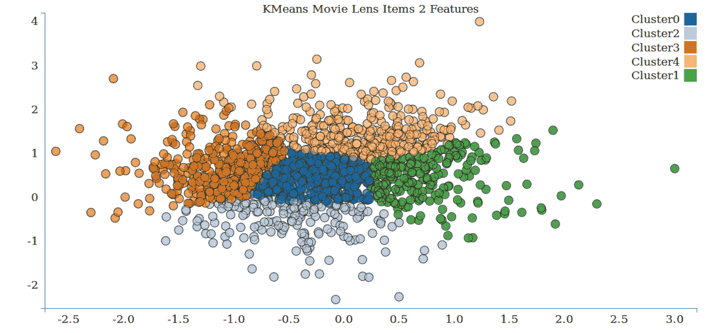

具有项目数据的 K 均值聚类图

上图显示了项目数据的 K 均值聚类。

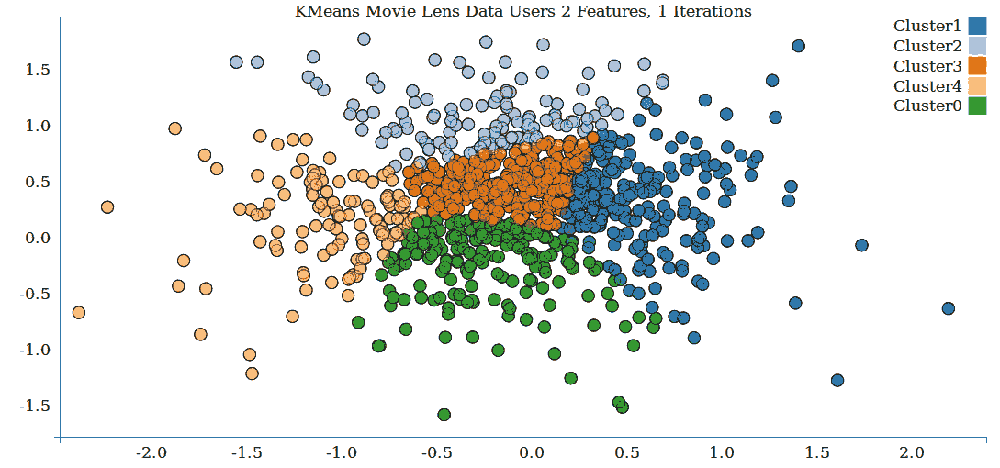

K 均值绘制聚类数的效果

上图显示了具有两个特征和一个迭代的用户数据的 K 均值聚类。

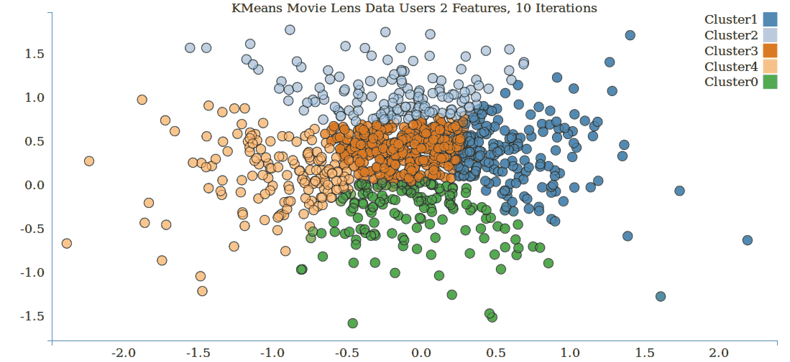

上图显示了具有两个特征和 10 次迭代的用户数据的 K 均值聚类。请注意聚类边界的移动。

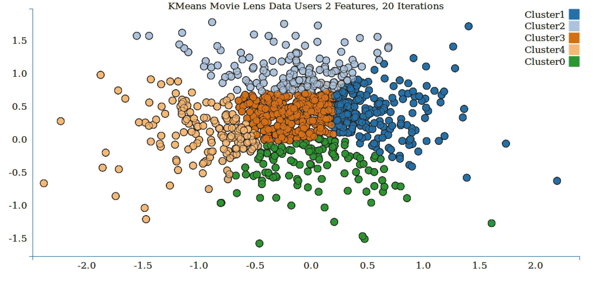

上图显示了具有两个特征和 10 次迭代的用户数据的 K 均值聚类。请注意聚类边界的移动。

# K 均值-评估聚类模型的性能

使用回归、分类和推荐引擎等模型，可以应用许多评估指标来分析聚类模型的性能和数据点的聚类好坏。聚类评估通常分为内部评估和外部评估。内部评估是指使用相同的数据来训练模型和进行评估的情况。外部评估是指使用训练数据之外的数据进行评估。

# 内部评估指标

常见的内部评估指标包括我们之前介绍的 WCSS（这恰好是 K 均值的目标函数）、Davies-Bouldin 指数、Dunn 指数和轮廓系数。所有这些指标都倾向于奖励集群，其中集群内的元素相对较近，而不同集群中的元素相对较远。

聚类评估的维基百科页面[`en.wikipedia.org/wiki/Cluster_analysis#Internal_evaluation`](http://en.wikipedia.org/wiki/Cluster_analysis)有更多细节。

# 外部评估指标

由于聚类可以被视为无监督分类，如果有某种标记（或部分标记）的数据可用，我们可以使用这些标签来评估聚类模型。我们可以使用模型对集群（即类标签）进行预测，并使用类似于分类评估的指标来评估预测（即基于真正和假负率）。

这些包括 Rand 指标、F 指标、Jaccard 指数等。

有关聚类外部评估的更多信息，请参见[`en.wikipedia.org/wiki/Cluster_analysis#External_evaluation`](http://en.wikipedia.org/wiki/Cluster_analysis)。

# 在 MovieLens 数据集上计算性能指标

Spark ML 提供了一个方便的`computeCost`函数，用于计算给定 DataFrame 的 WSSS 目标函数。我们将为以下项目和用户训练数据计算此指标：

```scala
val WSSSEUsers = modelUsers.computeCost(datasetUsers) 
println(s"Users :  Within Set Sum of Squared Errors = $WSSSEUsers") 
val WSSSEItems = modelItems.computeCost(datasetItems)   
println(s"Items :  Within Set Sum of Squared Errors = $WSSSEItems")

```

这应该输出类似于以下结果：

```scala
Users :  Within Set Sum of Squared Errors = 2261.3086181660324
Items :  Within Set Sum of Squared Errors = 5647.825222497311

```

衡量 WSSSE 有效性的最佳方法是如下部分所示的迭代次数。

# 迭代对 WSSSE 的影响

让我们找出迭代对 MovieLens 数据集的 WSSSE 的影响。我们将计算各种迭代值的 WSSSE 并绘制输出。

代码清单如下：

```scala
object MovieLensKMeansMetrics { 
  case class RatingX(userId: Int, movieId: Int, rating: Float, 
    timestamp: Long) 
  val DATA_PATH= "../../../data/ml-100k" 
  val PATH_MOVIES = DATA_PATH + "/u.item" 
  val dataSetUsers = null 

  def main(args: Array[String]): Unit = { 

    val spConfig = (new 
      SparkConf).setMaster("local[1]").setAppName("SparkApp"). 
      set("spark.driver.allowMultipleContexts", "true") 

    val spark = SparkSession 
      .builder() 
      .appName("Spark SQL Example") 
      .config(spConfig) 
      .getOrCreate() 

    val datasetUsers = spark.read.format("libsvm").load( 
      "./data/movie_lens_libsvm/movie_lens_users_libsvm/part-
      00000") 
    datasetUsers.show(3) 

    val k = 5 
    val itr = Array(1,10,20,50,75,100) 
    val result = new ArrayString 
    for(i <- 0 until itr.length){ 
      val w = calculateWSSSE(spark,datasetUsers,itr(i),5,1L) 
      result(i) = itr(i) + "," + w 
    } 
    println("----------Users----------") 
    for(j <- 0 until itr.length) { 
      println(result(j)) 
    } 
    println("-------------------------") 

    val datasetItems = spark.read.format("libsvm").load( 
      "./data/movie_lens_libsvm/movie_lens_items_libsvm/"+     
      "part-00000") 

    val resultItems = new ArrayString 
    for(i <- 0 until itr.length){ 
      val w = calculateWSSSE(spark,datasetItems,itr(i),5,1L) 
      resultItems(i) = itr(i) + "," + w 
    } 

    println("----------Items----------") 
    for(j <- 0 until itr.length) { 
      println(resultItems(j)) 
    } 
    println("-------------------------") 

    spark.stop() 
  } 

  import org.apache.spark.sql.DataFrame 

  def calculateWSSSE(spark : SparkSession, dataset : DataFrame,  
    iterations : Int, k : Int, seed : Long) : Double = { 
    val x = dataset.columns 

    val kmeans =  
      new KMeans().setK(k).setSeed(seed).setMaxIter(iterations) 

    val model = kmeans.fit(dataset) 
    val WSSSEUsers = model.computeCost(dataset) 
    return WSSSEUsers 

  }

```

输出是：

```scala
----------Users----------
1,2429.214784372865
10,2274.362593105573
20,2261.3086181660324
50,2261.015660051977
75,2261.015660051977
100,2261.015660051977
-------------------------

----------Items----------
1,5851.444935665099
10,5720.505597821477
20,5647.825222497311
50,5637.7439669472005
75,5637.7439669472005
100,5637.7439669472005

```

让我们绘制这些数字以更好地了解：

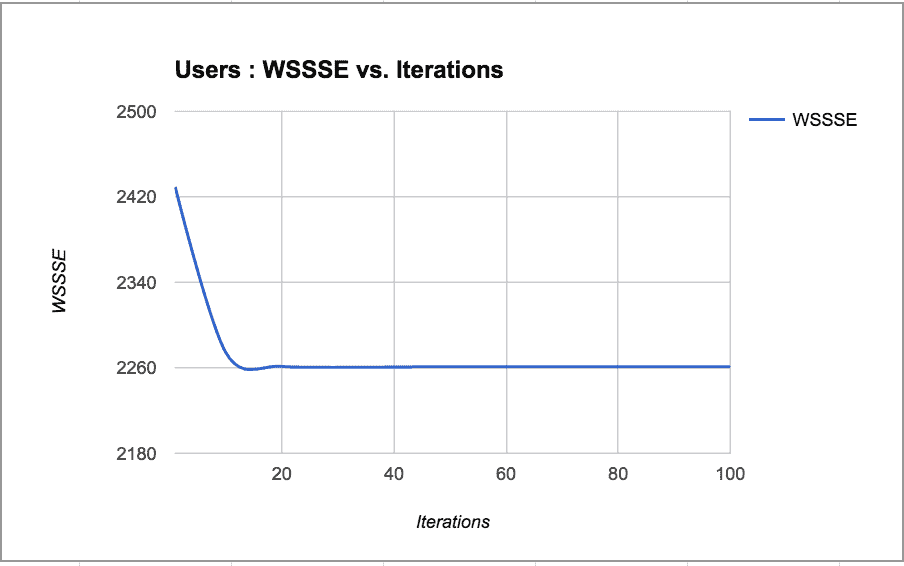

用户 WSSSE 与迭代次数

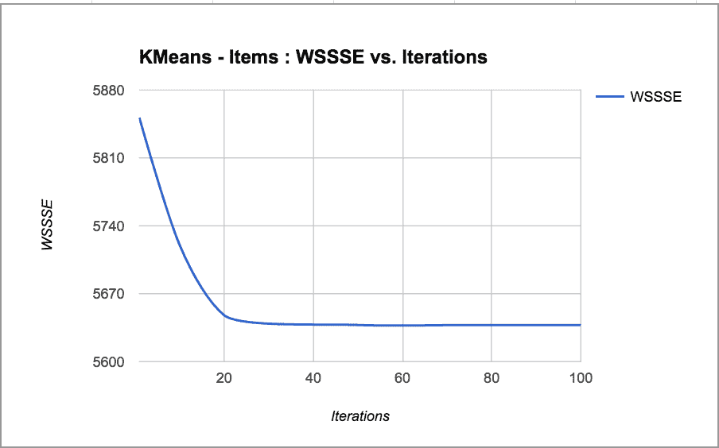

项目 WSSSE 与迭代次数

# 二分 KMeans

这是通用 KMeans 的变体。

参考：[`www.siam.org/meetings/sdm01/pdf/sdm01_05.pdf`](http://www.siam.org/meetings/sdm01/pdf/sdm01_05.pdf)

算法的步骤是：

1.  通过随机选择一个点，比如 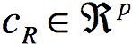 然后计算*M*的质心*w*并计算：

*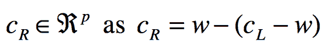*

**质心**是聚类的中心。质心是一个包含每个变量的一个数字的向量，其中每个数字是该聚类中观察值的平均值。

1.  将*M =[x1, x2, ... xn]*分成两个子聚类*M[L]*和*M[R]*，根据以下规则：

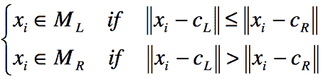

1.  计算*M[L]*和*M[R]*的质心*w[L]*和*w[R]*，如第 2 步所示。

1.  如果 *w[L] = c[L]* 和 *w[R] = c[R]*，则停止。

否则，让 c[L]= w[L] c[R] = w[R]，转到第 2 步。

# 二分 K 均值-训练聚类模型

在 Spark ML 中进行二分 K 均值的训练涉及采用类似其他模型的方法--我们将包含训练数据的 DataFrame 传递给`KMeans`对象的 fit 方法。请注意，这里我们使用 libsvm 数据格式：

1.  实例化聚类对象：

```scala
        val spConfig = (new                         
        SparkConf).setMaster("local[1]").setAppName("SparkApp"). 
        set("spark.driver.allowMultipleContexts", "true") 

        val spark = SparkSession 
          .builder() 
          .appName("Spark SQL Example") 
          .config(spConfig) 
          .getOrCreate() 

        val datasetUsers = spark.read.format("libsvm").load( 
          BASE + "/movie_lens_2f_users_libsvm/part-00000") 
        datasetUsers.show(3)

```

命令`show(3)`的输出如下所示：

```scala
 +-----+--------------------+
 |label|            features|
 +-----+--------------------+
 |  1.0|(2,[0,1],[0.37140...|
 |  2.0|(2,[0,1],[-0.2131...|
 |  3.0|(2,[0,1],[0.28579...|
 +-----+--------------------+
 only showing top 3 rows

```

创建`BisectingKMeans`对象并设置参数：

```scala
          val bKMeansUsers = new BisectingKMeans() 
          bKMeansUsers.setMaxIter(10) 
          bKMeansUsers.setMinDivisibleClusterSize(5)

```

1.  训练数据：

```scala
          val modelUsers = bKMeansUsers.fit(datasetUsers) 

          val movieDF = Util.getMovieDataDF(spark) 
          val predictedUserClusters = 
            modelUsers.transform(datasetUsers) 
          predictedUserClusters.show(5)

```

输出是：

```scala
          +-----+--------------------+----------+
 |label|            features|prediction|
 +-----+--------------------+----------+
 |  1.0|(2,[0,1],[0.37140...|         3|
 |  2.0|(2,[0,1],[-0.2131...|         3|
 |  3.0|(2,[0,1],[0.28579...|         3|
 |  4.0|(2,[0,1],[-0.6541...|         1|
 |  5.0|(2,[0,1],[0.90333...|         2|
 +-----+--------------------+----------+
 only showing top 5 rows

```

1.  按聚类显示电影：

```scala
        val joinedMovieDFAndPredictedCluster = 
          movieDF.join(predictedUserClusters,predictedUserClusters
          ("label") === movieDF("id")) 
        print(joinedMovieDFAndPredictedCluster.first()) 
        joinedMovieDFAndPredictedCluster.show(5)

```

输出是：

```scala
 +--+---------------+-----------+-----+--------------------+----------+
 |id|          name|       date|label|      features|prediction|
 +--+---------------+-----------+-----+--------------------+----------+
 | 1| Toy Story (1995)  |01-Jan-1995|  1.0|(2,[0,1],[0.37140...|3|
 | 2| GoldenEye (1995)  |01-Jan-1995|  2.0|(2,[0,1],[-0.2131...|3|
 | 3|Four Rooms (1995)  |01-Jan-1995|  3.0|(2,[0,1],[0.28579...|3|
 | 4| Get Shorty (1995) |01-Jan-1995|  4.0|(2,[0,1],[-0.6541...|1|
 | 5| Copycat (1995)    |01-Jan-1995|  5.0|(2,[0,1],[0.90333...|2|
 +--+----------------+-----------+-----+--------------------+----------+
 only showing top 5 rows

```

让我们按照聚类编号打印电影：

```scala
        for(i <- 0 until 5) { 
          val prediction0 =     
          joinedMovieDFAndPredictedCluster.filter("prediction == " + i) 
          println("Cluster : " + i) 
          println("--------------------------") 
          prediction0.select("name").show(10) 
        }

```

输出是：

```scala
          Cluster : 0
 +--------------------+
 |                name|
 +--------------------+
 |Antonia's Line (1...|
 |Angels and Insect...|
 |Rumble in the Bro...|
 |Doom Generation, ...|
 |     Mad Love (1995)|
 | Strange Days (1995)|
 |       Clerks (1994)|
 |  Hoop Dreams (1994)|
 |Legends of the Fa...|
 |Professional, The...|
 +--------------------+
 only showing top 10 rows

 Cluster : 1
 --------------------------

 +--------------------+
 |                name|
 +--------------------+
 |   Get Shorty (1995)|
 |Dead Man Walking ...|
 |  Richard III (1995)|
 |Seven (Se7en) (1995)|
 |Usual Suspects, T...|
 |Mighty Aphrodite ...|
 |French Twist (Gaz...|
 |Birdcage, The (1996)|
 |    Desperado (1995)|
 |Free Willy 2: The...|
 +--------------------+
 only showing top 10 rows

 Cluster : 2
 --------------------------
 +--------------------+
          |                name|
 +--------------------+
          |      Copycat (1995)|
          |Shanghai Triad (Y...|
 |  Postino, Il (1994)|
          |From Dusk Till Da...|
          |   Braveheart (1995)|
 |Batman Forever (1...|
 |        Crumb (1994)|
          |To Wong Foo, Than...|
 |Billy Madison (1995)|
 |Dolores Claiborne...|
          +--------------------+
 only showing top 10 rows

          Cluster : 3
          --------------------------
          +--------------------+
 |                name|
          +--------------------+
          |    Toy Story (1995)|
 |    GoldenEye (1995)|
 |   Four Rooms (1995)|
 |Twelve Monkeys (1...|
          |         Babe (1995)|
 |Mr. Holland's Opu...|
 |White Balloon, Th...|
 |Muppet Treasure I...|
          |  Taxi Driver (1976)|
          |Brothers McMullen...|
 +--------------------+
          only showing top 10 rows

```

让我们计算 WSSSE：

```scala
          val WSSSEUsers = modelUsers.computeCost(datasetUsers) 
          println(s"Users : Within Set Sum of Squared Errors =                      $WSSSEUsers") 

          println("Users : Cluster Centers: ") 
          modelUsers.clusterCenters.foreach(println)

```

输出是：

```scala
          Users : Within Set Sum of Squared Errors = 220.213984126387
          Users : Cluster Centers: 
          [-0.5152650631965345,-0.17908608684257435]
          [-0.7330009110582011,0.5699292831746033]
          [0.4657482296168242,0.07541218866995708]
          [0.07297392612510972,0.7292946749843259]

```

接下来我们对物品进行预测：

```scala
          val datasetItems = spark.read.format("libsvm").load( 
            BASE + "/movie_lens_2f_items_libsvm/part-00000") 
          datasetItems.show(3) 

          val kmeansItems = new BisectingKMeans().setK(5).setSeed(1L) 
          val modelItems = kmeansItems.fit(datasetItems) 

          // Evaluate clustering by computing Within Set 
          // Sum of Squared Errors. 
          val WSSSEItems = modelItems.computeCost(datasetItems) 
          println(s"Items : Within Set Sum of Squared Errors = 
            $WSSSEItems") 

          // Shows the result. 
          println("Items - Cluster Centers: ") 
          modelUsers.clusterCenters.foreach(println) 

          Items: within Set Sum of Squared Errors = 538.4272487824393 
          Items - Cluster Centers:  
            [-0.5152650631965345,-0.17908608684257435] 
            [-0.7330009110582011,0.5699292831746033] 
            [0.4657482296168242,0.07541218866995708] 
            [0.07297392612510972,0.7292946749843259]

```

源代码：

[`github.com/ml-resources/spark-ml/blob/branch-ed2/Chapter_08/scala/2.0.0/src/main/scala/org/sparksamples/kmeans/BisectingKMeans.scala`](https://github.com/ml-resources/spark-ml/blob/branch-ed2/Chapter_08/scala/2.0.0/src/main/scala/org/sparksamples/kmeans/BisectingKMeans.scala)

1.  绘制用户和物品聚类。

接下来，让我们选择两个特征，并绘制用户和物品聚类及其各自的聚类：

```scala
          object BisectingKMeansPersist { 
            val PATH = "/home/ubuntu/work/spark-2.0.0-bin-hadoop2.7/" 
            val BASE = "./data/movie_lens_libsvm_2f" 

            val time = System.currentTimeMillis() 
            val formatter = new 
              SimpleDateFormat("dd_MM_yyyy_hh_mm_ss") 

            import java.util.Calendar 
            val calendar = Calendar.getInstance() 
            calendar.setTimeInMillis(time) 
            val date_time = formatter.format(calendar.getTime()) 

            def main(args: Array[String]): Unit = { 

              val spConfig = (new     
                SparkConf).setMaster("local[1]")
                .setAppName("SparkApp"). 
              set("spark.driver.allowMultipleContexts", "true") 

              val spark = SparkSession 
                .builder() 
                .appName("Spark SQL Example") 
                .config(spConfig) 
                .getOrCreate() 

              val datasetUsers = spark.read.format("libsvm").load( 
                BASE + "/movie_lens_2f_users_libsvm/part-00000") 

              val bKMeansUsers = new BisectingKMeans() 
              bKMeansUsers.setMaxIter(10) 
              bKMeansUsers.setMinDivisibleClusterSize(5) 

              val modelUsers = bKMeansUsers.fit(datasetUsers) 
              val predictedUserClusters = 
                modelUsers.transform(datasetUsers) 

              modelUsers.clusterCenters.foreach(println) 
              val predictedDataSetUsers = 
                modelUsers.transform(datasetUsers) 
              val predictionsUsers =       
                predictedDataSetUsers.select("prediction")
                .rdd.map(x=> x(0)) 
               predictionsUsers.saveAsTextFile(BASE + 
                 "/prediction/" +      
               date_time + "/bkmeans_2f_users")    

               val datasetItems = 
                 spark.read.format("libsvm").load(BASE + 
                 "/movie_lens_2f_items_libsvm/part-00000") 

               val kmeansItems = new 
                 BisectingKMeans().setK(5).setSeed(1L) 
               val modelItems = kmeansItems.fit(datasetItems) 

               val predictedDataSetItems = 
                 modelItems.transform(datasetItems) 
               val predictionsItems =      
                 predictedDataSetItems.select("prediction")
                 .rdd.map(x=> x(0)) 
                 predictionsItems.saveAsTextFile(BASE + 
                 "/prediction/" +         
               date_time + "/bkmeans_2f_items") 
               spark.stop() 
            } 
          }

```

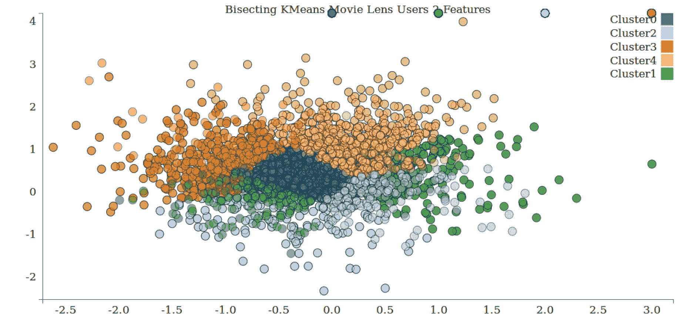

用聚类绘制 MovieLens 用户数据

上述图表显示了两个特征的用户聚类的样子。

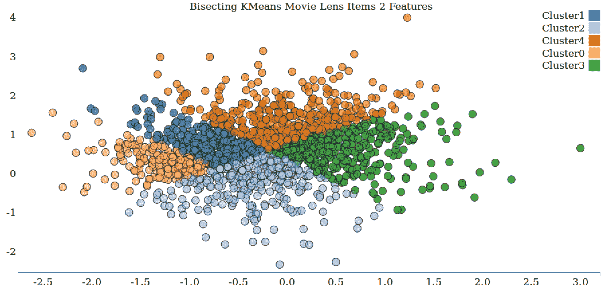

用聚类绘制 MovieLens 物品（电影）数据

上述图表显示了两个特征的物品聚类的样子。

# WSSSE 和迭代

在本节中，我们评估了对 K 均值算法进行二分时迭代次数对 WSSSE 的影响。

源代码是：

```scala
object BisectingKMeansMetrics { 
  case class RatingX(userId: Int, movieId: Int,  
    rating: Float, timestamp: Long) 
  val DATA_PATH= "../../../data/ml-100k" 
  val PATH_MOVIES = DATA_PATH + "/u.item" 
  val dataSetUsers = null 

  def main(args: Array[String]): Unit = { 

    val spConfig = ( 
      new SparkConf).setMaster("local[1]").setAppName("SparkApp"). 
      set("spark.driver.allowMultipleContexts", "true") 

    val spark = SparkSession 
      .builder() 
      .appName("Spark SQL Example") 
      .config(spConfig) 
      .getOrCreate() 

    val datasetUsers = spark.read.format("libsvm").load( 
      "./data/movie_lens_libsvm/movie_lens_users_libsvm/part-
      00000") 
    datasetUsers.show(3) 

    val k = 5 
    val itr = Array(1,10,20,50,75,100) 
    val result = new ArrayString 
    for(i <- 0 until itr.length){ 
      val w = calculateWSSSE(spark,datasetUsers,itr(i),5) 
      result(i) = itr(i) + "," + w 
    } 
    println("----------Users----------") 
    for(j <- 0 until itr.length) { 
      println(result(j)) 
    } 
    println("-------------------------") 

    val datasetItems = spark.read.format("libsvm").load( 
      "./data/movie_lens_libsvm/movie_lens_items_libsvm/part-
      00000") 
    val resultItems = new ArrayString 
    for(i <- 0 until itr.length){ 
      val w = calculateWSSSE(spark,datasetItems,itr(i),5) 
      resultItems(i) = itr(i) + "," + w 
    } 

    println("----------Items----------") 
    for(j <- 0 until itr.length) { 
      println(resultItems(j)) 
    } 
    println("-------------------------") 

    spark.stop() 
  } 

  import org.apache.spark.sql.DataFrame 

  def calculateWSSSE(spark : SparkSession, dataset : DataFrame, 
    iterations : Int, k : Int) : Double = 
  { 
    val x = dataset.columns 

    val bKMeans = new BisectingKMeans() 
    bKMeans.setMaxIter(iterations) 
    bKMeans.setMinDivisibleClusterSize(k) 

    val model = bKMeans.fit(dataset) 
    val WSSSE = model.computeCost(dataset) 
    return WSSSE 

  } 
}

```

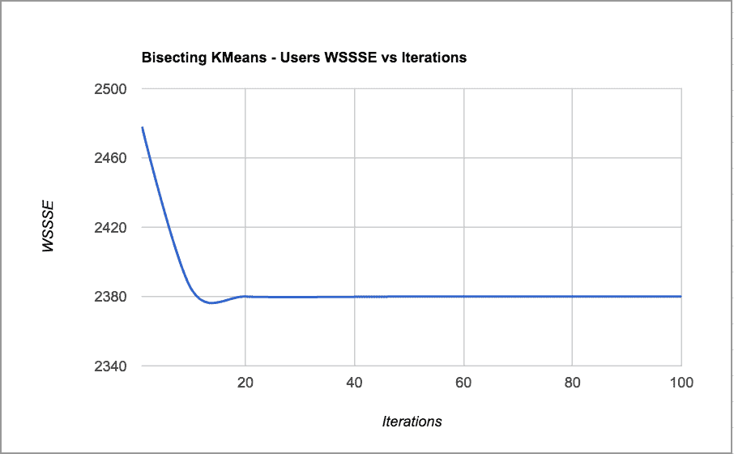

图：用户迭代的 WSSSE

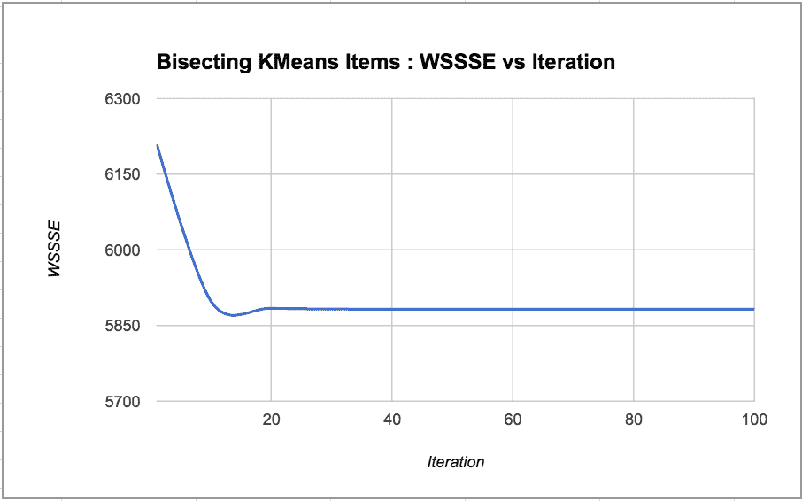

图：在二分 K 均值情况下物品的 WSSSE 与迭代次数

很明显，该算法在 20 次迭代后对用户和物品都达到了最佳的 WSSSE。

# 高斯混合模型

混合模型是一个人口中子群体的概率模型。这些模型用于对子群体的统计推断，给定汇总人口的观察结果。

**高斯混合模型**（**GMM**）是一个以高斯分量密度的加权和表示的混合模型。它的模型系数是使用迭代的**期望最大化**（**EM**）算法或从训练模型的**最大后验**（**MAP**）估计的。

`spark.ml`的实现使用 EM 算法。

它具有以下参数：

+   **k**：期望的聚类数量

+   **convergenceTol**：在认为收敛达到的对数似然的最大变化

+   **maxIterations**：执行而不收敛的最大迭代次数

+   **initialModel**：可选的起始点，从这里开始 EM 算法

（如果省略此参数，将从数据中构造一个随机起始点）

# 使用 GMM 进行聚类

我们将为用户和物品（在这种情况下是电影）创建聚类，以更好地了解算法如何对用户和物品进行分组。

执行以下步骤：

1.  加载用户的`libsvm`文件。

1.  创建一个高斯混合实例。该实例具有以下可配置的参数：

```scala
       final val featuresCol: Param[String] 
       Param for features column name. 
       final val k: IntParam 
       Number of independent Gaussians in the mixture model. 
       final val 
       maxIter: IntParam 
       Param for maximum number of iterations (>= 0). 
       final val predictionCol: Param[String] 
       Param for prediction column name. 
       final val probabilityCol: Param[String] 
       Param for Column name for predicted class conditional 
       probabilities. 
       final val seed: LongParam 
       Param for random seed. 
       final val tol: DoubleParam

```

1.  在我们的情况下，我们将只设置高斯分布的数量和种子数：

```scala
       val gmmUsers = new GaussianMixture().setK(5).setSeed(1L)

```

1.  创建一个用户模型：

```scala
       Print Covariance and Mean
      for (i <- 0 until modelUsers.gaussians.length) { 
        println("Users: weight=%f\ncov=%s\nmean=\n%s\n" format 
          (modelUsers.weights(i), modelUsers.gaussians(i).cov,                           
          modelUsers.gaussians(i).mean)) 
      }

```

完整的代码清单是：

```scala
          object GMMClustering { 

            def main(args: Array[String]): Unit = { 
              val spConfig = (new SparkConf).setMaster("local[1]"). 
                setAppName("SparkApp"). 
                set("spark.driver.allowMultipleContexts", "true") 

              val spark = SparkSession 
                .builder() 
                .appName("Spark SQL Example") 
                .config(spConfig) 
                .getOrCreate() 

              val datasetUsers = spark.read.format("libsvm").                
               load("./data/movie_lens_libsvm/movie_lens_users_libsvm/"
               + "part-00000") 
              datasetUsers.show(3) 

              val gmmUsers = new GaussianMixture().setK(5).setSeed(1L) 
              val modelUsers = gmmUsers.fit(datasetUsers) 

              for (i <- 0 until modelUsers.gaussians.length) { 
                println("Users : weight=%f\ncov=%s\nmean=\n%s\n" 
                   format (modelUsers.weights(i),  
                   modelUsers.gaussians(i).cov,  
                   modelUsers.gaussians(i).mean)) 
                } 

              val dataSetItems = spark.read.format("libsvm").load( 
                "./data/movie_lens_libsvm/movie_lens_items_libsvm/" + 
                "part-00000") 

              val gmmItems = new 
                  GaussianMixture().setK(5).setSeed(1L) 
              val modelItems = gmmItems.fit(dataSetItems) 

              for (i <- 0 until modelItems.gaussians.length) { 
                println("Items : weight=%f\ncov=%s\nmean=\n%s\n" 
                   format (modelUsers.weights(i), 
                   modelUsers.gaussians(i).cov, 
                   modelUsers.gaussians(i).mean)) 
              } 
              spark.stop() 
            }

```

# 用 GMM 聚类绘制用户和物品数据

在这一部分，我们将看一下基于 GMM 的聚类边界随着迭代次数的增加而移动：

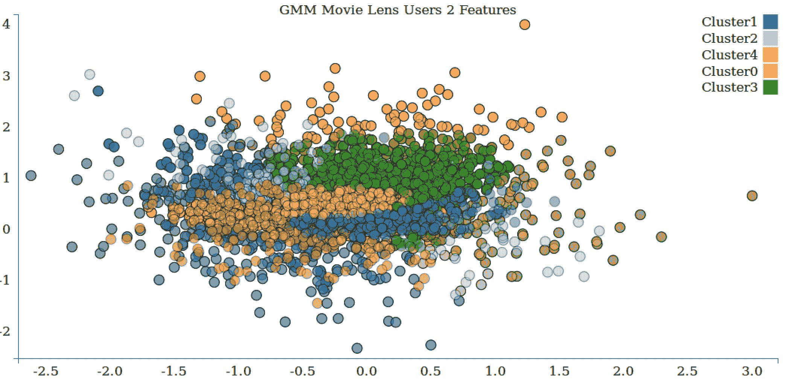

MovieLens 用户数据通过 GMM 分配的聚类图

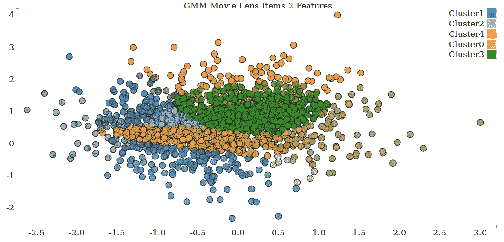

MovieLens 项目数据通过 GMM 分配的聚类图

# GMM - 迭代次数对聚类边界的影响

让我们看一下随着 GMM 迭代次数的增加，聚类边界如何变化：

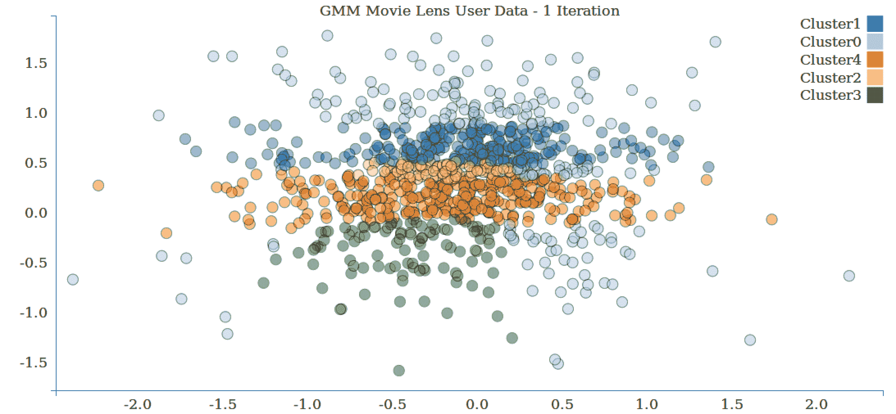

使用一次迭代的用户数据的 GMM 聚类图

上图显示了使用一次迭代的用户数据的 GMM 聚类。

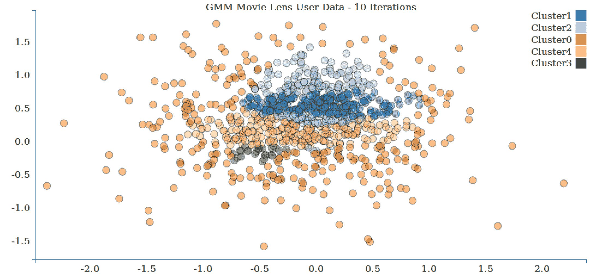

使用 10 次迭代的用户数据的 GMM 聚类图

上图显示了使用 10 次迭代的用户数据的 GMM 聚类。

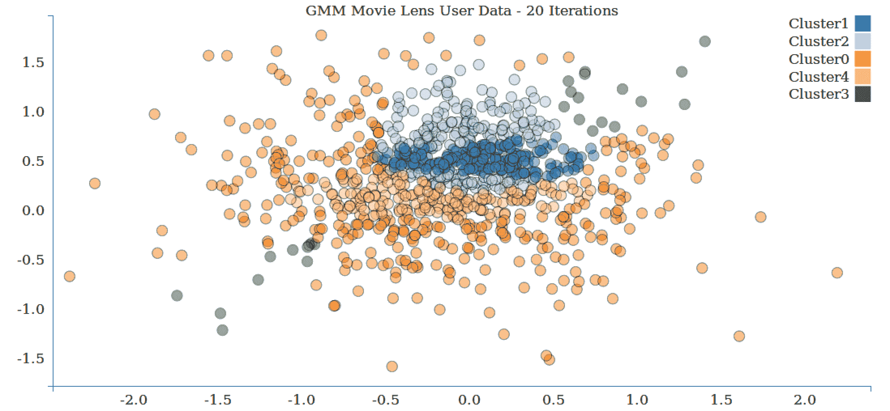

使用 20 次迭代的用户数据的 GMM 聚类图

上图显示了使用 20 次迭代的用户数据的 GMM 聚类。

# 总结

在本章中，我们探讨了一种从未标记数据中学习结构的新模型类别 -- 无监督学习。我们通过所需的输入数据和特征提取进行了工作，并看到如何使用一个模型的输出（在我们的例子中是推荐模型）作为另一个模型的输入（我们的 k-means 聚类模型）。最后，我们评估了聚类模型的性能，既使用了对聚类分配的手动解释，也使用了数学性能指标。

在下一章中，我们将介绍另一种无监督学习方法，用于将数据减少到其最重要的特征或组件 -- 降维模型。
