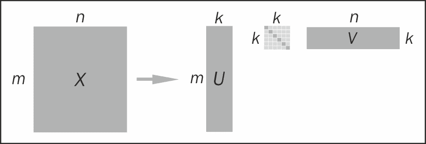
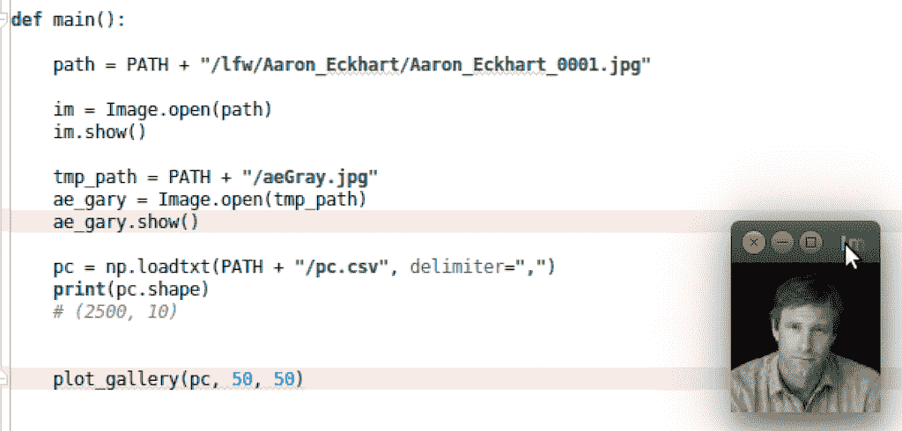
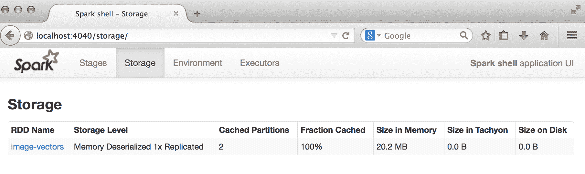
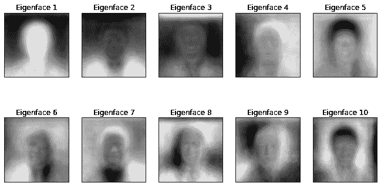
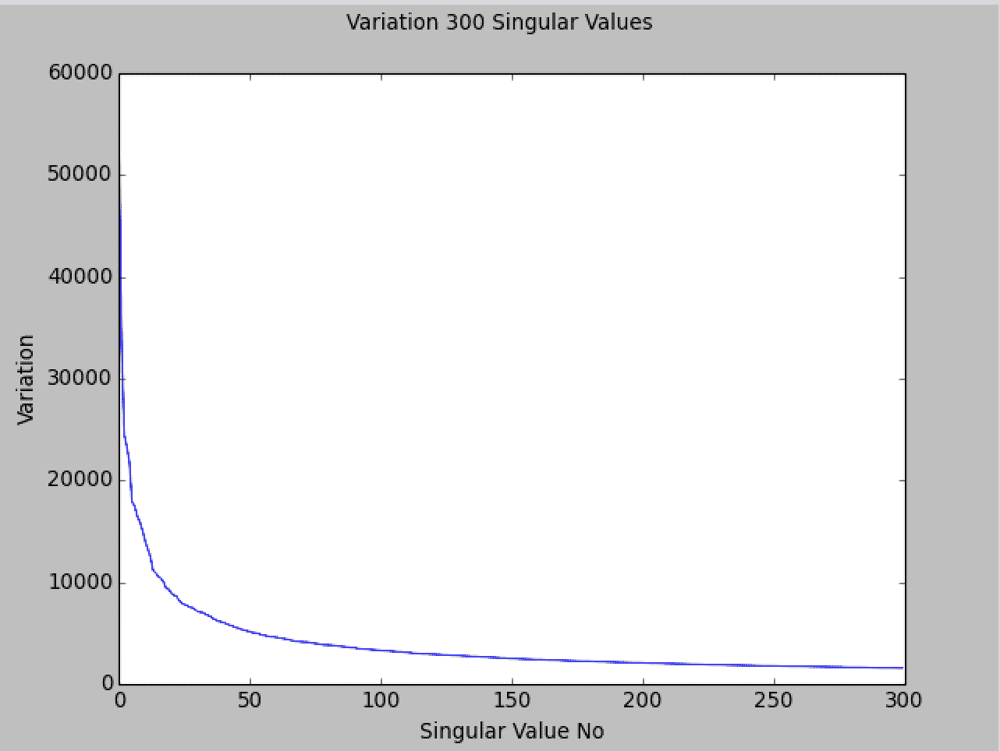
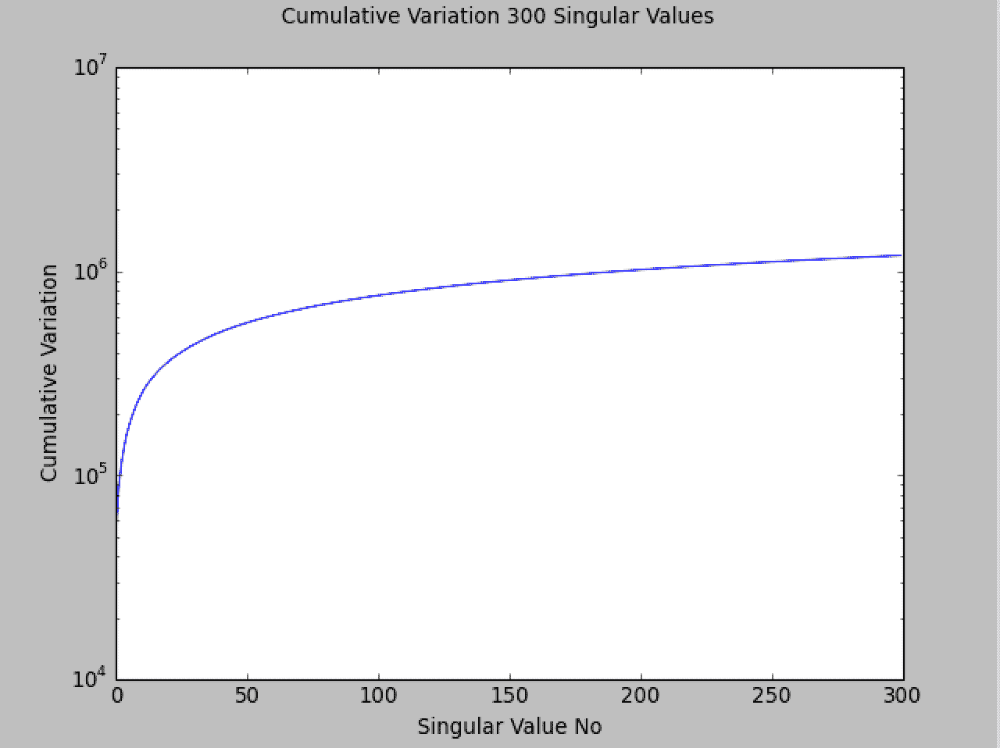

# 第九章：使用 Spark 进行降维

在本章的过程中，我们将继续探索**降维**的无监督学习模型。

与迄今为止我们所涵盖的模型（如回归、分类和聚类）不同，降维并不专注于进行预测。相反，它试图对具有特征维度*D*（即我们的特征向量的长度）的输入数据进行处理，并提取维度*k*的数据表示，其中*k*通常明显小于*D*。因此，它是一种预处理或特征转换，而不是一种独立的预测模型。

重要的是，提取的表示仍应能够捕获原始数据的大部分变异性或结构。其背后的想法是，大多数数据源都会包含某种潜在结构。这种结构通常是未知的（通常称为潜在特征或潜在因素），但如果我们能够揭示部分结构，我们的模型就可以从中学习并进行预测，而不是直接从原始数据中进行预测，原始数据可能存在噪声或包含许多无关特征。换句话说，降维会丢弃数据中的一些噪声，并保留其中存在的隐藏结构。

在某些情况下，原始数据的维度远高于我们拥有的数据点数量，因此，如果没有降维，其他机器学习模型（如分类和回归）将很难学习任何东西，因为它们需要拟合的参数数量远大于训练样本的数量（在这种意义上，这些方法与我们在分类和回归中看到的正则化方法有些相似）。

降维技术的一些用例包括以下内容：

+   探索性数据分析

+   提取特征以训练其他机器学习模型

+   减少预测阶段非常大模型的存储和计算要求（例如，进行预测的生产系统）

+   将大量文本文档减少到一组隐藏的主题或概念

+   当我们的数据具有非常多的特征时（例如在处理文本、声音、图像或视频数据时，这些数据往往是高维的），使模型的学习和泛化变得更容易

在本章中，我们将进行以下操作：

+   介绍 MLlib 中可用的降维模型类型

+   处理人脸图像以提取适合降维的特征

+   使用 MLlib 训练降维模型

+   可视化和评估结果

+   为我们的降维模型执行参数选择

# 降维的类型

MLlib 提供了两种降维模型；这些模型彼此密切相关。这些模型是**主成分分析**（**PCA**）和**奇异值分解**（**SVD**）。

# 主成分分析

PCA 作用于数据矩阵*X*，并试图从*X*中提取一组*k*个主成分。这些主成分彼此不相关，并且计算它们的方式是，第一个主成分解释了输入数据中的最大变异性。然后，每个后续的主成分依次计算，以便它解释了最大的变异性，前提是它与迄今为止计算的主成分是独立的。

这样，返回的 *k* 个主成分保证能够解释输入数据中的最大变化量。实际上，每个主成分的特征维度与原始数据矩阵相同。因此，实际进行降维需要投影步骤，其中原始数据被投影到由主成分表示的 *k* 维空间中。

# 奇异值分解

SVD 旨在将维度为 *m x n* 的矩阵 *X* 分解为这三个组件矩阵：

+   *U* 的维度为 *m x m*

+   *S*，大小为 *m x n* 的对角矩阵；*S* 的条目被称为**奇异值**

+   *VT* 的维度为 *n x n*

*X = U * S * V ^T*

从前面的公式可以看出，我们实际上并没有降低问题的维度，因为通过乘以 *U*、*S* 和 *V*，我们重构了原始矩阵。实际上，通常计算截断奇异值分解。也就是说，只保留最高的 *k* 个奇异值，它们代表数据中的最大变化量，而其余的则被丢弃。然后基于组件矩阵重构 *X* 的公式是近似的，如下所示：

*X ~ U[k] * S[k] * V[k T]*

截断奇异值分解的示意图如下所示：



截断奇异值分解

保留前 *k* 个奇异值类似于在 PCA 中保留前 *k* 个主成分。实际上，SVD 和 PCA 直接相关，我们稍后会在本章中看到。

对 PCA 和 SVD 的详细数学处理超出了本书的范围。

在 Spark 文档中可以找到降维的概述：[`spark.apache.org/docs/latest/mllib-dimensionality-reduction.html`](http://spark.apache.org/docs/latest/mllib-dimensionality-reduction.html)。

以下链接分别包含 PCA 和 SVD 的更深入的数学概述：[`en.wikipedia.org/wiki/Principal_component_analysis`](http://en.wikipedia.org/wiki/Principal_component_analysis) 和 [`en.wikipedia.org/wiki/Singular_value_decomposition`](http://en.wikipedia.org/wiki/Singular_value_decomposition)。

# 与矩阵分解的关系

PCA 和 SVD 都是矩阵分解技术，它们将数据矩阵分解为具有比原始矩阵更低维度（或秩）的子组件矩阵。许多其他降维技术都是基于矩阵分解的。

您可能还记得另一个矩阵分解的例子，即协同过滤，我们在第六章中已经看到了，*使用 Spark 构建分类模型*。协同过滤的矩阵分解方法通过将评分矩阵分解为两个组件来工作：用户因子矩阵和物品因子矩阵。每个矩阵的维度都低于原始数据，因此这些方法也充当降维模型。

许多最佳的协同过滤方法都包括基于 SVD 的模型。Simon Funk 对 Netflix 奖的方法就是一个著名的例子。您可以在[`sifter.org/~simon/journal/20061211.html`](http://sifter.org/~simon/journal/20061211.html)上查看。

# 聚类作为降维

我们在上一章中介绍的聚类模型也可以用于一种形式的降维。工作方式如下：

+   假设我们使用 K 均值聚类模型对高维特征向量进行聚类，得到 *k* 个聚类中心。

+   我们可以表示原始数据点中的每一个数据点与每个聚类中心的距离。也就是说，我们可以计算数据点到每个聚类中心的距离。结果是每个数据点的一组 *k* 个距离。

+   这些*k*距离可以形成一个新的*k*维向量。现在，我们可以将我们的原始数据表示为相对于原始特征维度的较低维度的新向量。

根据使用的距离度量，这可能导致数据的降维和一种非线性转换形式，使我们能够学习一个更复杂的模型，同时仍然受益于线性模型的速度和可扩展性。例如，使用高斯或指数距离函数可以近似一个非常复杂的非线性特征转换。

# 从数据中提取正确的特征

与迄今为止我们所探索的所有机器学习模型一样，降维模型也是在我们数据的特征向量表示上操作的。

在本章中，我们将深入探讨图像处理领域，使用**野外标记人脸**（**LFW**）数据集的面部图像。该数据集包含来自互联网的超过 13,000 张面部图像，并属于知名公众人物。这些面部带有人名标签。

# 从 LFW 数据集中提取特征

为了避免下载和处理非常庞大的数据集，我们将使用一部分图像，使用以 A 开头的人名。该数据集可以从[`vis-www.cs.umass.edu/lfw/lfw-a.tgz`](http://vis-www.cs.umass.edu/lfw/lfw-a.tgz)下载。

有关更多详细信息和数据的其他变体，请访问[`vis-www.cs.umass.edu/lfw/`](http://vis-www.cs.umass.edu/lfw/)。

原始研究论文的引用是：

*Gary B. Huang*，*Manu Ramesh*，*Tamara Berg*和*Erik Learned-Miller*。*野外标记人脸：用于研究非受限环境中人脸识别的数据库*。马萨诸塞大学阿默斯特分校，技术报告 07-49，2007 年 10 月。

它可以从[`vis-www.cs.umass.edu/lfw/lfw.pdf`](http://vis-www.cs.umass.edu/lfw/lfw.pdf)下载。

使用以下命令解压数据：

```scala
>tar xfvz lfw-a.tgz

```

这将创建一个名为`lfw`的文件夹，其中包含许多子文件夹，每个人一个。

# 探索面部数据

我们将使用 Spark 应用程序来分析数据。确保数据解压缩到`data`文件夹中，如下所示：

```scala
Chapter_09
|-- 2.0.x
|   |-- python
|   |-- scala
|-- data

```

实际的代码在`scala`文件夹中，除了一些图表在`python`文件夹中：

```scala
scala
|-- src
|   |-- main
|   |   |-- java
|   |   |-- resources
|   |   |-- scala
|   |   |   |-- org
|   |   |       |-- sparksamples
|   |   |           |-- ImageProcessing.scala
|   |   |           |-- Util.scala
|   |   |-- scala-2.11
|   |-- test

```

现在我们已经解压了数据，我们面临一个小挑战。Spark 为我们提供了一种读取文本文件和自定义 Hadoop 输入数据源的方法。但是，没有内置功能允许我们读取图像。

Spark 提供了一个名为`wholeTextFiles`的方法，允许我们一次操作整个文件，与我们迄今为止一直使用的`textFile`方法相比，后者操作文本文件（或多个文件）中的各行。

我们将使用`wholeTextFiles`方法来访问每个文件的位置。使用这些文件路径，我们将编写自定义代码来加载和处理图像。在下面的示例代码中，我们将使用 PATH 来引用您提取`lfw`子目录的目录。

我们可以使用通配符路径规范（在下面的代码片段中突出显示*字符）告诉 Spark 在`lfw`目录下的每个目录中查找文件：

```scala
val spConfig = (new SparkConf).setMaster("local[1]")
  .setAppName("SparkApp")
  .set("spark.driver.allowMultipleContexts", "true") 
val sc = new SparkContext(spConfig) 
val path = PATH +  "/lfw/*" 
val rdd = sc.wholeTextFiles(path) 
val first = rdd.first 
println(first)

```

运行`first`命令可能需要一些时间，因为 Spark 首先会扫描指定的目录结构以查找所有可用的文件。完成后，您应该看到类似于此处显示的输出：

```scala
first: (String, String) =  (file:/PATH/lfw/Aaron_Eckhart /Aaron_Eckhart_0001.jpg,??JFIF????? ...

```

您将看到`wholeTextFiles`返回一个包含键值对的 RDD，其中键是文件位置，而值是整个文本文件的内容。对于我们的目的，我们只关心文件路径，因为我们不能直接将图像数据作为字符串处理（请注意，在 shell 输出中显示为“二进制无意义”）。

让我们从 RDD 中提取文件路径。请注意，之前文件路径以`file:`文本开头。这是 Spark 在读取文件时使用的，以区分不同的文件系统（例如，本地文件系统的`file://`，HDFS 的`hdfs://`，Amazon S3 的`s3n://`等）。

在我们的情况下，我们将使用自定义代码来读取图像，因此我们不需要路径的这一部分。因此，我们将使用以下`map`函数将其删除：

```scala
val files = rdd.map { case (fileName, content) =>
  fileName.replace("file:", "") }

```

上述函数将显示去除了`file:`前缀的文件位置：

```scala
/PATH/lfw/Aaron_Eckhart/Aaron_Eckhart_0001.jpg

```

接下来，我们将看到我们要处理多少个文件：

```scala
println(files.count)

```

运行这些命令会在 Spark 中创建大量嘈杂的输出，因为它会将所有读取到的文件路径输出到控制台。忽略这部分，但在命令完成后，输出应该看起来像这样：

```scala
..., /PATH/lfw/Azra_Akin/Azra_Akin_0003.jpg:0+19927,
  /PATH/lfw/Azra_Akin/Azra_Akin_0004.jpg:0+16030
...
14/09/18 20:36:25 INFO SparkContext: Job finished:
  count at  <console>:19, took 1.151955 s
1055

```

因此，我们可以看到我们有`1055`张图像可以使用。

# 可视化面部数据

尽管 Scala 或 Java 中有一些工具可用于显示图像，但这是 Python 和`matplotlib`库发光的一个领域。我们将使用 Scala 来处理和提取图像并运行我们的模型，使用 IPython 来显示实际的图像。

您可以通过打开新的终端窗口并启动新的笔记本来运行单独的 IPython 笔记本，如下所示：

```scala
>ipython notebook

```

如果使用 Python Notebook，您应该首先执行以下代码片段，以确保在每个笔记本单元格之后内联显示图像（包括`%`字符）：`%pylab inline`

或者，您可以启动一个普通的 IPython 控制台，而不是 Web 笔记本，使用以下命令启用`pylab`绘图功能：

```scala
>ipython --pylab

```

在撰写本书时，MLlib 中的降维技术仅在 Scala 或 Java 中可用，因此我们将继续使用 Scala Spark shell 来运行模型。因此，您不需要运行 PySpark 控制台。

我们已经提供了本章的完整 Python 代码，既作为 Python 脚本，也作为 IPython 笔记本格式。有关安装 IPython 的说明，请参阅代码包。

让我们显示通过之前提取的第一个路径给出的图像，使用 PIL 的图像库：

```scala
from PIL import Image, ImageFilter 
path = PATH + "/lfw/Aaron_Eckhart/Aaron_Eckhart_0001.jpg" 
im = Image.open(path) 
im.show()

```

您应该看到截图显示如下：



# 提取面部图像作为向量

虽然本书不涵盖图像处理的全部内容，但您需要了解一些基础知识才能继续。每个彩色图像可以表示为一个像素的三维数组或矩阵。前两个维度，即*x*和*y*轴，表示每个像素的位置，而第三个维度表示每个像素的**红**、**蓝**和**绿**（**RGB**）颜色值。

灰度图像每个像素只需要一个值（没有 RGB 值），因此它可以表示为一个普通的二维矩阵。对于许多与图像相关的图像处理和机器学习任务，通常会对灰度图像进行操作。我们将通过首先将彩色图像转换为灰度图像来实现这一点。

在机器学习任务中，将图像表示为向量而不是矩阵也是一种常见做法。我们通过将矩阵的每一行（或者每一列）连接起来形成一个长向量来实现这一点（这被称为“重塑”）。这样，每个原始的灰度图像矩阵被转换成一个特征向量，可用作机器学习模型的输入。

幸运的是，内置的 Java **抽象窗口工具包**（**AWT**）包含各种基本的图像处理功能。我们将定义一些实用函数来使用`java.awt`类执行此处理。

# 加载图像

第一个是从文件中读取图像的函数。

```scala
import java.awt.image.BufferedImage 
def loadImageFromFile(path: String): BufferedImage = { 
  ImageIO.read(new File(path)) 
}

```

上述代码在`Util.scala`中可用。

这将返回一个`java.awt.image.BufferedImage`类的实例，它存储图像数据，并提供许多有用的方法。让我们通过将第一张图像加载到我们的 Spark shell 中来测试一下：

```scala
val aePath = "/PATH/lfw/Aaron_Eckhart/Aaron_Eckhart_0001.jpg" 
val aeImage = loadImageFromFile(aePath)

```

您应该在 shell 中看到显示的图像细节。

```scala
aeImage: java.awt.image.BufferedImage = BufferedImage@f41266e: 
type =  5 ColorModel: #pixelBits = 24 numComponents = 3 color space =  java.awt.color.ICC_ColorSpace@7e420794 transparency = 1 has 
alpha =  false isAlphaPre = false ByteInterleavedRaster: 
width = 250 height =  250 #numDataElements 3 dataOff[0] = 2

```

这里有很多信息。我们特别感兴趣的是图像的宽度和高度是`250`像素，正如我们所看到的，有三个组件（即 RGB 值）在前面的输出中被突出显示。

# 将图像转换为灰度并调整大小

我们将定义的下一个函数将采用我们用前述函数加载的图像，将图像从彩色转换为灰度，并调整图像的宽度和高度。

这些步骤并不是严格必要的，但在许多情况下都会为了效率而执行。使用 RGB 彩色图像而不是灰度图像会使要处理的数据量增加三倍。同样，较大的图像会显著增加处理和存储开销。我们的原始 250 x 250 图像代表每个图像使用三个颜色组件的 187,500 个数据点。对于 1055 个图像集，这是 197,812,500 个数据点。即使存储为整数值，每个存储的值占用 4 字节的内存，因此仅 1055 个图像就代表大约 800 MB 的内存！正如您所看到的，图像处理任务很快就会变得极其占用内存。

如果我们将图像转换为灰度并将其调整为 50 x 50 像素，我们只需要每个图像 2500 个数据点。对于我们的 1055 个图像，这相当于 10 MB 的内存，这对于说明目的来说更容易管理。

让我们定义我们的处理函数。我们将在一步中执行灰度转换和调整大小，使用`java.awt.image`包：

```scala
def processImage(image: BufferedImage, width: Int, height: Int): 
  BufferedImage = { 
    val bwImage = new BufferedImage(width, height, 
    BufferedImage.TYPE_BYTE_GRAY) 
    val g = bwImage.getGraphics() 
    g.drawImage(image, 0, 0, width, height, null) 
    g.dispose() 
    bwImage 
  }

```

函数的第一行创建了一个所需宽度和高度的新图像，并指定了灰度颜色模型。第三行将原始图像绘制到这个新创建的图像上。`drawImage`方法会为我们处理颜色转换和调整大小！最后，我们返回新处理过的图像。

让我们在样本图像上测试一下。我们将把它转换为灰度，并将其调整为 100 x 100 像素：

```scala
val grayImage = processImage(aeImage, 100, 100)

```

您应该在控制台上看到以下输出：

```scala
grayImage: java.awt.image.BufferedImage = BufferedImage@21f8ea3b:  
type = 10 ColorModel: #pixelBits = 8 numComponents = 1 color space =  java.awt.color.ICC_ColorSpace@5cd9d8e9 transparency = 1 has 
alpha =  false isAlphaPre = false ByteInterleavedRaster: 
width = 100 height =  100 #numDataElements 1 dataOff[0] = 0

```

从突出显示的输出中可以看出，图像的宽度和高度确实是`100`，颜色组件的数量是`1`。

接下来，我们将把处理过的图像保存到临时位置，以便我们可以读取它并使用 Python 应用程序显示它。

```scala
import javax.imageio.ImageIO 
import java.io.File 
ImageIO.write(grayImage, "jpg", new File("/tmp/aeGray.jpg"))

```

您应该在控制台上看到`true`的结果，表示您已成功将图像保存到`/tmp`目录中的`aeGray.jpg`文件中。

最后，我们将在 Python 中读取图像，并使用 matplotlib 显示图像。将以下代码键入到您的 IPython Notebook 或 shell 中（请记住这应该在一个新的终端窗口中打开）：

```scala
tmp_path = PATH + "/aeGray.jpg"
ae_gary = Image.open(tmp_path)
ae_gary.show()

```

这应该显示图像（再次注意，我们这里没有显示图像）。您会看到它是灰度的，与原始图像相比质量稍差。此外，您会注意到轴的比例不同，表示新的 100 x 100 尺寸，而不是原始的 250 x 250 尺寸。


# 提取特征向量

处理管道中的最后一步是提取实际的特征向量，这些向量将成为我们降维模型的输入。正如我们之前提到的，原始灰度像素数据将成为我们的特征。我们将通过展平二维像素矩阵来形成这些向量。`BufferedImage`类提供了一个实用方法来执行此操作，我们将在我们的函数中使用它，如下所示：

```scala
def getPixelsFromImage(image: BufferedImage): Array[Double] = { 
  val width = image.getWidth 
  val height = image.getHeight 
  val pixels = Array.ofDimDouble 
  image.getData.getPixels(0, 0, width, height, pixels) 
}

```

然后，我们可以将这三个函数合并成一个实用函数，该函数接受文件位置以及所需图像的宽度和高度，并返回包含像素数据的原始`Array[Double]`值。

```scala
def extractPixels(path: String, width: Int, height: Int):
  Array[Double] = { 
    val raw = loadImageFromFile(path) 
    val processed = processImage(raw, width, height) 
    getPixelsFromImage(processed) 
  }

```

将这个前述函数应用于包含所有图像文件路径的 RDD 的每个元素，将为我们提供一个包含每个图像的像素数据的新 RDD。让我们这样做，并检查前几个元素，如下所示：

```scala
val pixels = files.map(f => extractPixels(f, 50, 50)) 
println(pixels.take(10).map(_.take(10).mkString   ("", ",", ", 
  ...")).mkString("n"))

```

您应该看到类似于以下的输出：

```scala
0.0,0.0,0.0,0.0,0.0,0.0,1.0,1.0,0.0,0.0, ...
241.0,243.0,245.0,244.0,231.0,205.0,177.0,160.0,150.0,147.0, ...
253.0,253.0,253.0,253.0,253.0,253.0,254.0,254.0,253.0,253.0, ...
244.0,244.0,243.0,242.0,241.0,240.0,239.0,239.0,237.0,236.0, ...
44.0,47.0,47.0,49.0,62.0,116.0,173.0,223.0,232.0,233.0, ...
0.0,0.0,0.0,0.0,0.0,0.0,0.0,0.0,0.0,0.0, ...
1.0,1.0,1.0,1.0,1.0,1.0,1.0,1.0,0.0,0.0, ...
26.0,26.0,27.0,26.0,24.0,24.0,25.0,26.0,27.0,27.0, ...
240.0,240.0,240.0,240.0,240.0,240.0,240.0,240.0,240.0,240.0, ...
0.0,0.0,0.0,0.0,0.0,0.0,0.0,0.0,0.0,0.0, ...

```

最后一步是为每个图像创建一个 MLlib`vector`实例。我们将缓存 RDD 以加快后续的计算速度：

```scala
import org.apache.spark.mllib.linalg.Vectors 
val vectors = pixels.map(p => Vectors.dense(p)) 
// the setName method create a human-readable name that is 
// displayed in the Spark Web UI 
vectors.setName("image-vectors") 
// remember to cache the vectors to speed up computation 
vectors.cache

```

我们之前使用`setName`函数为 RDD 分配了一个名称。在这种情况下，我们称之为`image-vectors`。这样我们在查看 Spark 网络界面时可以更容易地识别它。

# 标准化

在运行降维模型之前，特别是对于 PCA，将输入数据标准化是一种常见做法。就像我们在第六章中所做的那样，*使用 Spark 构建分类模型*，我们将使用 MLlib 的`feature`包提供的内置`StandardScaler`来进行这个操作。在这种情况下，我们只会从数据中减去平均值。

```scala
import org.apache.spark.mllib.linalg.Matrix 
import org.apache.spark.mllib.linalg.distributed.RowMatrix 
import org.apache.spark.mllib.feature.StandardScaler 
val scaler = new StandardScaler(withMean = true, withStd = false)
  .fit(vectors)

```

**标准缩放器**：通过使用训练集中样本的列摘要统计信息，通过去除均值并缩放到单位标准差来标准化特征。

`@param``withMean`：默认为`False`。这会在缩放之前使用均值对数据进行居中。它构建了一个密集输出，因此在稀疏输入上不起作用，并引发异常。

`@param withStd`：默认为`True`。这会将数据缩放到单位标准差。

```scala
class StandardScaler @Since("1.1.0") (withMean: Boolean,
  withStd: Boolean) extends Logging

```

调用`fit`会触发对我们的`RDD[Vector]`的计算。你应该会看到类似于下面显示的输出：

```scala
...
14/09/21 11:46:58 INFO SparkContext: Job finished: reduce at  
RDDFunctions.scala:111, took 0.495859 s
scaler: org.apache.spark.mllib.feature.StandardScalerModel =  org.apache.spark.mllib.feature.StandardScalerModel@6bb1a1a1

```

请注意，减去均值适用于密集输入数据。在图像处理中，我们总是有密集的输入数据，因为每个像素都有一个值。然而，对于稀疏向量，从每个输入中减去均值向量将会将稀疏数据转换为密集数据。对于非常高维的输入，这可能会耗尽可用的内存资源，因此不建议这样做。

最后，我们将使用返回的`scaler`将原始图像向量转换为减去列均值的向量。

```scala
val scaledVectors = vectors.map(v => scaler.transform(v))

```

我们之前提到，调整大小的灰度图像将占用大约 10MB 的内存。确实，你可以通过在网页浏览器中输入`http://localhost:4040/storage/`来查看 Spark 应用程序监视器存储页面上的内存使用情况。

由于我们给我们的图像向量 RDD 取了一个友好的名字`image-vectors`，你应该会看到类似以下的屏幕截图（请注意，由于我们使用的是`Vector[Double]`，每个元素占用 8 个字节而不是 4 个字节；因此，我们实际上使用了 20MB 的内存）：



内存中图像向量的大小

# 训练降维模型

MLlib 中的降维模型需要向量作为输入。然而，与操作`RDD[Vector]`的聚类不同，PCA 和 SVD 计算是作为分布式`RowMatrix`的方法提供的（这种差异主要是语法上的，因为`RowMatrix`只是`RDD[Vector]`的一个包装器）。

# 在 LFW 数据集上运行 PCA

现在我们已经将图像像素数据提取到向量中，我们可以实例化一个新的`RowMatrix`。

`def computePrincipalComponents(k: Int)`: 矩阵

计算前`k`个主成分。行对应于观测值，列对应于变量。主成分存储为大小为 n-by-`k`的本地矩阵。每列对应一个主成分，列按组件方差的降序排列。行数据不需要首先“居中”；每列的均值为`0`是不必要的。

请注意，这不能在具有超过`65535`列的矩阵上计算。

`K`是前几个主成分的数量。

它返回一个大小为 n-by-k 的矩阵，其列是主成分

注解

@Since( "1.0.0" )

调用`computePrincipalComponents`方法来计算我们分布式矩阵的前`K`个主成分：

```scala
import org.apache.spark.mllib.linalg.Matrix 
import org.apache.spark.mllib.linalg.distributed.RowMatrix 
val matrix = new RowMatrix(scaledVectors) 
val K = 10 
val pc = matrix.computePrincipalComponents(K)

```

在模型运行时，你可能会在控制台上看到大量的输出。

如果你看到警告，比如 WARN LAPACK: Failed to load implementation from: com.github.fommil.netlib.NativeSystemLAPACK 或 WARN LAPACK: Failed to load implementation from: com.github.fommil.netlib.NativeRefLAPACK，你可以安全地忽略这些警告。

这意味着 MLlib 使用的基础线性代数库无法加载本机例程。在这种情况下，将使用基于 Java 的回退，速度较慢，但就本例而言，没有什么可担心的。

一旦模型训练完成，您应该在控制台上看到类似以下显示的结果：

```scala
pc: org.apache.spark.mllib.linalg.Matrix = 
-0.023183157256614906  -0.010622723054037303  ... (10 total)
-0.023960537953442107  -0.011495966728461177  ...
-0.024397470862198022  -0.013512219690177352  ...
-0.02463158818330343   -0.014758658113862178  ...
-0.024941633606137027  -0.014878858729655142  ...
-0.02525998879466241   -0.014602750644394844  ...
-0.025494722450369593  -0.014678013626511024  ...
-0.02604194423255582   -0.01439561589951032   ...
-0.025942214214865228  -0.013907665261197633  ...
-0.026151551334429365  -0.014707035797934148  ...
-0.026106572186134578  -0.016701471378568943  ...
-0.026242986173995755  -0.016254664123732318  ...
-0.02573628754284022   -0.017185663918352894  ...
-0.02545319635905169   -0.01653357295561698   ...
-0.025325893980995124  -0.0157082218373399...

```

# 可视化特征脸

现在我们已经训练好了 PCA 模型，结果是什么？让我们检查一下结果矩阵的维度：

```scala
val rows = pc.numRows 
val cols = pc.numCols 
println(rows, cols)

```

正如您从控制台输出中看到的那样，主成分的矩阵有`2500`行和`10`列。

```scala
(2500,10)

```

回想一下，每个图像的维度是 50 x 50，所以这里我们有前 10 个主成分，每个主成分的维度与输入图像相同。这些主成分可以被视为捕获原始数据中最大变化的一组潜在（或隐藏）特征。

在面部识别和图像处理中，这些主成分通常被称为**特征脸**，因为 PCA 与原始数据的协方差矩阵的特征值分解密切相关。

更多细节请参见[`en.wikipedia.org/wiki/Eigenface`](http://en.wikipedia.org/wiki/Eigenface)。

由于每个主成分的维度与原始图像相同，因此每个成分本身可以被视为图像，并且可以将其表示为图像，从而可以像输入图像一样可视化特征脸。

与本书中经常做的一样，我们将使用 Breeze 线性代数库的功能以及 Python 的 numpy 和 matplotlib 来可视化特征脸。

首先，我们将把 pc 变量（一个 MLlib 矩阵）提取到 Breeze 的`DenseMatrix`中，如下所示：

```scala
import breeze.linalg.DenseMatrix 
val pcBreeze = new DenseMatrix(rows, cols, pc.toArray)

```

Breeze 在`linalg`包中提供了一个有用的函数，用于将矩阵写入 CSV 文件。我们将使用这个函数将主成分保存到临时 CSV 文件中。

```scala
import breeze.linalg.csvwrite 
csvwrite(new File("/tmp/pc.csv"), pcBreeze)

```

接下来，我们将在 IPython 中加载矩阵，并将主成分可视化为图像。幸运的是，numpy 提供了一个从我们创建的 CSV 文件中读取矩阵的实用函数。

```scala
pcs = np.loadtxt(PATH + "/pc.csv", delimiter=",") 
print(pcs.shape)

```

您应该看到以下输出，确认我们读取的矩阵与我们保存的矩阵具有相同的维度：

```scala
(2500, 10)

```

我们需要一个实用函数来显示图像，我们在这里定义：

```scala
def plot_gallery(images, h, w, n_row=2, n_col=5): 
        """Helper function to plot a gallery of portraits""" 
        plt.figure(figsize=(1.8 * n_col, 2.4 * n_row)) 
        plt.subplots_adjust(bottom=0, left=.01, right=.99, top=.90,
          hspace=.35) 
        for i in range(n_row * n_col): 
            plt.subplot(n_row, n_col, i + 1) 
            plt.imshow(images[:, i].reshape((h, w)),  
                cmap=plt.cm.gray) 
            plt.title("Eigenface %d" % (i + 1), size=12) 
            plt.xticks(()) 
            plt.yticks(()) 

  plt.show()

```

这个前面的函数是从**scikit-learn**文档中的 LFW 数据集示例代码中改编的，可在[`scikit-learn.org/stable/auto_examples/applications/face_recognition.html`](http://scikit-learn.org/stable/auto_examples/applications/face_recognition.html)找到。

现在我们将使用这个函数来绘制前 10 个特征脸，如下所示：

```scala
plot_gallery(pcs, 50, 50)

```

这个最后的命令应该显示以下图表：



前 10 个特征脸

# 解释特征脸

从前面的图像中，我们可以看到 PCA 模型有效地提取了重复变化模式，这些模式代表了面部图像的各种特征。每个主成分可以像聚类模型一样被解释。与聚类一样，准确解释每个主成分代表的内容并不总是直接的。

从这些图像中，我们可以看到有些图像似乎捕捉到了方向因素（例如图像 6 和 9），有些则聚焦在头发图案上（例如图像 4、5、7 和 10），而其他一些似乎与面部特征如眼睛、鼻子和嘴相关（图像 1、7 和 9）。

# 使用降维模型

能够以这种方式可视化模型的结果是很有趣的；然而，使用降维的整体目的是创建数据的更紧凑表示，同时仍然捕获原始数据集中的重要特征和变异性。为此，我们需要使用训练好的模型将原始数据投影到由主成分表示的新的低维空间中。

# 在 LFW 数据集上使用 PCA 投影数据

我们将通过将每个 LFW 图像投影到一个十维向量中来说明这个概念。这是通过图像矩阵与主成分矩阵的矩阵乘法来实现的。由于图像矩阵是一个分布式 MLlib`RowMatrix`，Spark 会通过`multiply`函数来为我们分布计算。

```scala
val projected = matrix.multiply(pc) 
println(projected.numRows, projected.numCols)

```

上述函数将给出以下输出：

```scala
(1055,10)

```

注意，每个维度为 2500 的图像已经被转换为大小为 10 的向量。让我们来看一下前几个向量：

```scala
println(projected.rows.take(5).mkString("n"))

```

以下是输出：

```scala
[2648.9455749636277,1340.3713412351376,443.67380716760965, -353.0021423043161,52.53102289832631,423.39861446944354, 413.8429065865399,-484.18122999722294,87.98862070273545, -104.62720604921965]
[172.67735747311974,663.9154866829355,261.0575622447282, -711.4857925259682,462.7663154755333,167.3082231097332, -71.44832640530836,624.4911488194524,892.3209964031695, -528.0056327351435]
[-1063.4562028554978,388.3510869550539,1508.2535609357597, 361.2485590837186,282.08588829583596,-554.3804376922453, 604.6680021092125,-224.16600191143075,-228.0771984153961, -110.21539201855907]
[-4690.549692385103,241.83448841252638,-153.58903325799685, -28.26215061165965,521.8908276360171,-442.0430200747375, -490.1602309367725,-456.78026845649435,-78.79837478503592, 70.62925170688868]
[-2766.7960144161225,612.8408888724891,-405.76374113178616, -468.56458995613974,863.1136863614743,-925.0935452709143, 69.24586949009642,-777.3348492244131,504.54033662376435, 257.0263568009851]

```

由于投影数据是向量形式，我们可以将投影作为另一个机器学习模型的输入。例如，我们可以将这些投影输入与从各种没有人脸的图像生成的输入数据一起使用，来训练一个人脸识别模型。或者，我们可以训练一个多类分类器，其中每个人是一个类，从而创建一个学习识别特定人脸所属的模型。

# PCA 和 SVD 之间的关系

我们之前提到 PCA 和 SVD 之间存在着密切的关系。事实上，我们可以恢复相同的主成分，并且也可以使用 SVD 将投影应用到主成分空间中。

在我们的例子中，通过计算 SVD 得到的右奇异向量将等同于我们计算得到的主成分。我们可以通过首先在图像矩阵上计算 SVD，然后将右奇异向量与 PCA 的结果进行比较来验证这一点。与 PCA 一样，SVD 计算作为分布式`RowMatrix`上的函数提供：

```scala
val svd = matrix.computeSVD(10, computeU = true) 
println(s"U dimension: (${svd.U.numRows}, ${svd.U.numCols})") 
println(s"S dimension: (${svd.s.size}, )") 
println(s"V dimension: (${svd.V.numRows}, ${svd.V.numCols})")

```

我们可以看到 SVD 返回一个维度为 1055 x 10 的矩阵`U`，一个长度为`10`的奇异值向量`S`，以及一个维度为 2500 x 10 的右奇异向量矩阵`V`。

```scala
U dimension: (1055, 10)
S dimension: (10, )
V dimension: (2500, 10)

```

矩阵 V 与 PCA 的结果完全相等（忽略数值的符号和浮点数容差）。我们可以使用下一个实用程序函数来验证这一点，通过大致比较每个矩阵的数据数组来比较它们：

```scala
def approxEqual(array1: Array[Double], array2: Array[Double],    
tolerance: Double = 1e-6): Boolean = { 
  // note we ignore sign of the principal component / 
  // singular vector elements 
  val bools = array1.zip(array2).map { case (v1, v2) => if    
    (math.abs(math.abs(v1) - math.abs(v2)) > 1e-6) false else true } 
  bools.fold(true)(_ & _) 
}

```

我们将在一些测试数据上测试该函数，如下所示：

```scala
println(approxEqual(Array(1.0, 2.0, 3.0), Array(1.0, 2.0, 3.0)))

```

这将给出以下输出：

```scala
true

```

让我们尝试另一组测试数据：

```scala
println(approxEqual(Array(1.0, 2.0, 3.0), Array(3.0, 2.0, 1.0)))

```

这将给出以下输出：

```scala
false

```

最后，我们可以应用我们的相等函数如下：

```scala
println(approxEqual(svd.V.toArray, pc.toArray))

```

以下是输出：

```scala
true

```

PCA 和 SVD 都可以用来计算主成分和相应的特征值/奇异值；计算协方差矩阵的额外步骤可能会导致在计算特征向量时出现数值舍入误差。SVD 总结了数据偏离零的方式，而 PCA 总结了数据偏离平均数据样本的方式。

另一个保持的关系是矩阵`U`和向量`S`（或者严格来说，对角矩阵`S`）的乘积等同于将我们原始图像数据投影到前 10 个主成分空间中的 PCA 投影。

我们现在将展示这确实是这样。我们首先使用 Breeze 将`U`中的每个向量与`S`进行逐元素乘法。然后我们将比较 PCA 投影向量中的每个向量与我们 SVD 投影中的等价向量，并统计相等情况的数量，如下所示：

```scala
val breezeS = breeze.linalg.DenseVector(svd.s.toArray) 
val projectedSVD = svd.U.rows.map { v =>  
  val breezeV = breeze.linalg.DenseVector(v.toArray) 
  val multV = breezeV :* breezeS 
  Vectors.dense(multV.data) 
} 
projected.rows.zip(projectedSVD).map { case (v1, v2) =>
  approxEqual(v1.toArray, v2.toArray) }.filter(b => true).count

```

上述代码应该显示一个结果为 1055，这是我们所期望的，确认了 PCA 的每一行投影等于`projectedSVD`的每一行。

请注意，上述代码中突出显示的**：***运算符表示向量的逐元素乘法。

# 评估降维模型

PCA 和 SVD 都是确定性模型。也就是说，给定某个特定的输入数据集，它们总是会产生相同的结果。这与我们迄今为止看到的许多模型形成对比，这些模型依赖于某种随机因素（最常见的是模型权重向量的初始化等）。

这两种模型都保证返回前几个主成分或奇异值，因此唯一的参数是*k*。与聚类模型一样，增加*k*总是会提高模型性能（对于聚类来说是相关的错误函数，而对于 PCA 和 SVD 来说是*k*个成分解释的总变异量）。因此，选择*k*的值是在尽可能捕捉数据结构的同时保持投影数据的维度低之间的权衡。

# 评估 LFW 数据集上 SVD 的*k*

我们将检查通过对图像数据进行 SVD 计算得到的奇异值。我们可以验证每次运行时奇异值是相同的，并且它们以递减顺序返回，如下所示：

```scala
val sValues = (1 to 5).map { 
  i => matrix.computeSVD(i,  computeU = false).s 
} 
sValues.foreach(println)

```

这段代码应该生成类似于以下内容的输出：

```scala
[54091.00997110354]
[54091.00997110358,33757.702867982436]
[54091.00997110357,33757.70286798241,24541.193694775946]
[54091.00997110358,33757.70286798242,24541.19369477593, 23309.58418888302]
[54091.00997110358,33757.70286798242,24541.19369477593, 23309.584188882982,21803.09841158358]

```

# 奇异值

奇异值让我们理解降维的空间和时间的权衡。

与评估聚类的*k*值一样，在 SVD（和 PCA）的情况下，通常有必要绘制更大范围的*k*的奇异值，并查看图表上的点，看看每个额外奇异值所解释的额外方差量在哪个点开始明显变平。

我们将首先计算前 300 个奇异值，如下所示：

```scala
val svd300 = matrix.computeSVD(300, computeU = false) 
val sMatrix = new DenseMatrix(1, 300, svd300.s.toArray) 
println(sMatrix) 
csvwrite(new File("/home/ubuntu/work/ml-resources/
  spark-ml/Chapter_09/data/s.csv"), sMatrix)

```

我们将把奇异值向量 S 写入临时 CSV 文件（就像我们之前对 Eigenfaces 矩阵所做的那样），然后在 IPython 控制台中读取它，绘制每个*k*的奇异值。

```scala
file_name = '/home/ubuntu/work/ml-resources/spark-ml/Chapter_09/data/s.csv' 
data = np.genfromtxt(file_name, delimiter=',')  
plt.plot(data) 
plt.suptitle('Variation 300 Singular Values ') 
plt.xlabel('Singular Value No') 
plt.ylabel('Variation') 
plt.show()

```

您应该看到类似于这里显示的图像：



前 300 个奇异值

在前 300 个奇异值累积变化中也出现了类似的模式（我们将在*y*轴上绘制对数刻度）。

```scala
plt.plot(cumsum(data)) 
plt.yscale('log') 
plt.suptitle('Cumulative Variation 300 Singular Values ') 
plt.xlabel('Singular Value No') 
plt.ylabel('Cumulative Variation') 
plt.show()

```

Python 绘图的完整源代码可以在以下链接找到：[`github.com/ml-resources/spark-ml/tree/branch-ed2/Chapter_09/data/python`](https://github.com/ml-resources/spark-ml/tree/branch-ed2/Chapter_09/data/python)



前 300 个奇异值的累积和

我们可以看到，在*k*的某个数值范围之后（在这种情况下大约为 100），图形明显变平。这表明与*k*值相当的奇异值（或主成分）可能足够解释原始数据的变化。

当然，如果我们正在使用降维来帮助提高另一个模型的性能，我们可以使用与该模型相同的评估方法来帮助我们选择*k*的值。

例如，我们可以使用 AUC 指标，结合交叉验证，来选择分类模型的模型参数以及降维模型的*k*值。然而，这会增加计算成本，因为我们需要重新计算完整的模型训练和测试流程。

# 摘要

在本章中，我们探索了两种新的无监督学习方法，PCA 和 SVD，用于降维。我们看到如何提取特征，并训练这些模型使用面部图像数据。我们可视化了模型的结果，以 Eigenfaces 的形式展现，看到如何将模型应用于将原始数据转换为降维表示，并调查了 PCA 和 SVD 之间的密切联系。

在下一章中，我们将更深入地探讨使用 Spark 进行文本处理和分析的技术。
