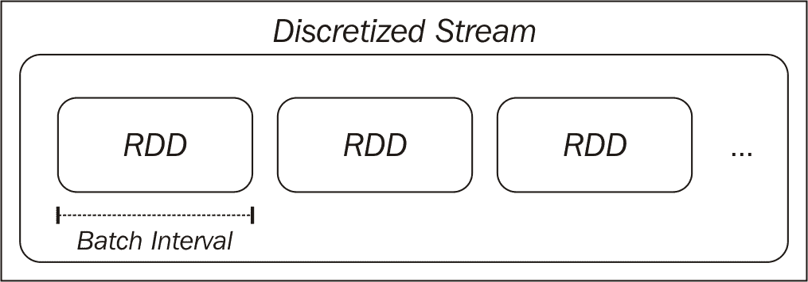
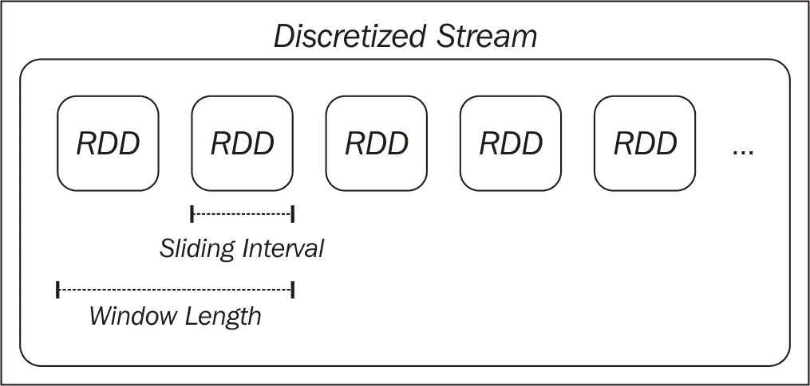

# 第十一章：使用 Spark Streaming 进行实时机器学习

到目前为止，在本书中，我们专注于批量数据处理。也就是说，我们所有的分析、特征提取和模型训练都应用于一个不变的数据集。这与 Spark 的 RDD 的核心抽象非常契合，RDD 是不可变的分布式数据集。一旦创建，RDD 的底层数据不会改变，尽管我们可能通过 Spark 的转换和操作符创建新的 RDD。

我们的关注也集中在批量机器学习模型上，我们在固定的批量训练数据集上训练模型，通常表示为特征向量的 RDD（在监督学习模型的情况下还有标签）。

在本章中，我们将：

+   介绍在线学习的概念，即在新数据可用时训练和更新模型

+   探索使用 Spark Streaming 进行流处理

+   了解 Spark Streaming 如何与在线学习方法结合

+   介绍结构化流处理的概念

以下部分使用 RDD 作为分布式数据集。类似地，我们可以在流数据上使用 DataFrame 或 SQL 操作。

有关 DataFrame 和 SQL 操作的更多详细信息，请参见[`spark.apache.org/docs/2.0.0-preview/sql-programming-guide.html`](https://spark.apache.org/docs/2.0.0-preview/sql-programming-guide.html)。

# 在线学习

我们在本书中应用的批量机器学习方法侧重于处理现有的固定训练数据集。通常，这些技术也是迭代的，我们对训练数据进行多次通过以收敛到最佳模型。

相比之下，在线学习是基于以完全增量的方式对训练数据进行一次顺序通过（即一次处理一个训练样本）。在看到每个训练样本后，模型对该样本进行预测，然后接收真实结果（例如，分类的标签或回归的真实目标）。在线学习的理念是，模型在接收到新信息时不断更新，而不是定期进行批量训练。

在某些情况下，当数据量非常大或生成数据的过程变化迅速时，在线学习方法可以更快地适应并几乎实时地进行，而无需在昂贵的批处理过程中重新训练。

然而，在纯在线方式下，并不一定非要使用在线学习方法。事实上，当我们使用随机梯度下降（SGD）优化来训练分类和回归模型时，我们已经看到了在批处理设置中使用在线学习模型的例子。SGD 在每个训练样本后更新模型。然而，为了收敛到更好的结果，我们仍然对训练数据进行了多次通过。

在纯在线设置中，我们不会（或者可能无法）对训练数据进行多次通过；因此，我们需要在输入到达时处理每个输入。在线方法还包括小批量方法，其中我们不是一次处理一个输入，而是处理一小批训练数据。

在线和批量方法也可以在现实世界的情况下结合使用。例如，我们可以使用批量方法定期（比如每天）对模型进行离线重新训练。然后，我们可以将训练好的模型部署到生产环境，并使用在线方法实时更新（即在批量重新训练之间的白天）以适应环境的任何变化。这与 lambda 架构非常相似，lambda 架构是支持批量和流处理方法的数据处理架构。

正如我们将在本章中看到的，在线学习设置可以很好地适应流处理和 Spark Streaming 框架。

有关在线机器学习的更多详细信息，请参见[`en.wikipedia.org/wiki/Online_machine_learning`](http://en.wikipedia.org/wiki/Online_machine_learning)。

# 流处理

在介绍使用 Spark 进行在线学习之前，我们将首先探讨流处理的基础知识，并介绍 Spark Streaming 库。

除了核心 Spark API 和功能之外，Spark 项目还包含另一个主要库（就像 MLlib 是一个主要项目库一样）称为**Spark Streaming**，它专注于实时处理数据流。

数据流是连续的记录序列。常见的例子包括来自网络或移动应用的活动流数据，时间戳日志数据，交易数据，以及来自传感器或设备网络的事件流。

批处理方法通常涉及将数据流保存到中间存储系统（例如 HDFS 或数据库），并在保存的数据上运行批处理。为了生成最新的结果，批处理必须定期运行（例如每天，每小时，甚至每几分钟）以处理最新可用的数据。

相比之下，基于流的方法将处理应用于生成的数据流。这允许几乎实时处理（与典型的批处理相比，处理时间为亚秒到几分之一秒的时间范围，而不是分钟，小时，天甚至几周）。

# Spark Streaming 简介

处理流处理的一些不同的一般技术。其中最常见的两种如下：

+   对每个记录进行单独处理，并在看到时立即处理。

+   将多个记录合并成**小批次**。这些小批次可以根据时间或批次中的记录数量来划分。

Spark Streaming 采用第二种方法。Spark Streaming 的核心原语是**离散流**或**DStream**。DStream 是一系列小批次，其中每个小批次都表示为 Spark RDD：



离散流抽象

DStream 由其输入源和称为**批处理间隔**的时间窗口定义。流被分成与批处理间隔相等的时间段（从应用程序的起始时间开始）。流中的每个 RDD 将包含由 Spark Streaming 应用程序在给定批处理间隔期间接收的记录。如果在给定间隔中没有数据，则 RDD 将为空。

# 输入源

Spark Streaming **接收器**负责从**输入源**接收数据，并将原始数据转换为由 Spark RDD 组成的 DStream。

Spark Streaming 支持各种输入源，包括基于文件的源（其中接收器监视到达输入位置的新文件并从每个新文件中读取的内容创建 DStream）和基于网络的源（例如与基于套接字的源，Twitter API 流，Akka actors 或消息队列和分布式流和日志传输框架通信的接收器，如 Flume，Kafka 和 Amazon Kinesis）。

有关输入源的文档，请参阅[`spark.apache.org/docs/latest/streaming-programming-guide.html#input-dstreams`](http://spark.apache.org/docs/latest/streaming-programming-guide.html#input-dstreams)以获取更多详细信息和链接到各种高级源。

# 转换

正如我们在第一章中看到的，*使用 Spark 快速入门*，以及本书中的其他地方，Spark 允许我们对 RDD 应用强大的转换。由于 DStreams 由 RDD 组成，Spark Streaming 提供了一组可用于 DStreams 的转换；这些转换类似于 RDD 上可用的转换。这些包括`map`，`flatMap`，`filter`，`join`和`reduceByKey`。

Spark Streaming 转换，如适用于 RDD 的转换，对 DStream 底层数据的每个元素进行操作。也就是说，转换实际上应用于 DStream 中的每个 RDD，进而将转换应用于 RDD 的元素。

Spark Streaming 还提供了诸如 reduce 和 count 之类的操作符。这些操作符返回由单个元素组成的 DStream（例如，每个批次的计数值）。与 RDD 上的等效操作符不同，这些操作不会直接触发 DStreams 上的计算。也就是说，它们不是操作，但它们仍然是转换，因为它们返回另一个 DStream。

# 跟踪状态

当我们处理 RDD 的批处理时，保持和更新状态变量相对简单。我们可以从某个状态开始（例如，值的计数或总和），然后使用广播变量或累加器并行更新此状态。通常，我们会使用 RDD 操作将更新后的状态收集到驱动程序，并更新全局状态。

对于 DStreams，这会更加复杂，因为我们需要以容错的方式跨批次跟踪状态。方便的是，Spark Streaming 在键值对的 DStream 上提供了`updateStateByKey`函数，它为我们处理了这一点，允许我们创建任意状态信息的流，并在看到每个批次数据时更新它。例如，状态可以是每个键被看到的次数的全局计数。因此，状态可以表示每个网页的访问次数，每个广告的点击次数，每个用户的推文数，或者每个产品的购买次数，等等。

# 一般的转换

Spark Streaming API 还公开了一个通用的`transform`函数，它允许我们访问流中每个批次的基础 RDD。也就是说，高级函数如`map`将 DStream 转换为另一个 DStream，而`transform`允许我们将 RDD 中的函数应用于另一个 RDD。例如，我们可以使用 RDD `join`运算符将流的每个批次与我们在流应用程序之外单独计算的现有 RDD 进行连接（可能是在 Spark 或其他系统中）。

完整的转换列表和有关每个转换的更多信息在 Spark 文档中提供，网址为[`spark.apache.org/docs/latest/streaming-programming-guide.html#transformations-on-dstreams`](http://spark.apache.org/docs/latest/streaming-programming-guide.html#transformations-on-dstreams)。

# 操作

虽然我们在 Spark Streaming 中看到的一些操作符，如 count，在批处理 RDD 的情况下不是操作，但 Spark Streaming 具有 DStreams 上的操作概念。操作是输出运算符，当调用时，会触发 DStream 上的计算。它们如下：

+   `print`：这将每个批次的前 10 个元素打印到控制台，通常用于调试和测试。

+   `saveAsObjectFile`、`saveAsTextFiles`和`saveAsHadoopFiles`：这些函数将每个批次输出到与 Hadoop 兼容的文件系统，并使用从批次开始时间戳派生的文件名（如果适用）。

+   `forEachRDD`：此运算符是最通用的，允许我们对 DStream 的每个批次中的 RDD 应用任意处理。它用于应用副作用，例如将数据保存到外部系统，为测试打印数据，将数据导出到仪表板等。

请注意，与 Spark 的批处理一样，DStream 操作符是**惰性**的。就像我们需要在 RDD 上调用`count`等操作来确保处理发生一样，我们需要调用前面的操作符之一来触发 DStream 上的计算。否则，我们的流应用实际上不会执行任何计算。

# 窗口操作符

由于 Spark Streaming 操作的是按时间顺序排列的批处理数据流，因此引入了一个新概念，即**窗口**。`窗口`函数计算应用于流的滑动窗口的转换。

窗口由窗口的长度和滑动间隔定义。例如，使用 10 秒的窗口和 5 秒的滑动间隔，我们将每 5 秒计算一次结果，基于 DStream 中最新的 10 秒数据。例如，我们可能希望计算过去 10 秒内页面浏览次数最多的网站，并使用滑动窗口每 5 秒重新计算这个指标。

下图说明了一个窗口化的 DStream：



窗口化的 DStream

# 使用 Spark Streaming 进行缓存和容错处理

与 Spark RDD 类似，DStreams 可以被缓存在内存中。缓存的用例与 RDD 的用例类似-如果我们希望多次访问 DStream 中的数据（可能执行多种类型的分析或聚合，或者输出到多个外部系统），那么缓存数据将会有所好处。状态操作符，包括`window`函数和`updateStateByKey`，会自动进行这种操作以提高效率。

请记住，RDD 是不可变的数据集，并且由其输入数据源和**血统**（即应用于 RDD 的一系列转换和操作）来定义。RDD 的容错性是通过重新创建由于工作节点故障而丢失的 RDD（或 RDD 的分区）来实现的。

由于 DStreams 本身是 RDD 的批处理，它们也可以根据需要重新计算以处理工作节点的故障。然而，这取决于输入数据是否仍然可用。如果数据源本身是容错和持久的（例如 HDFS 或其他容错的数据存储），那么 DStream 可以被重新计算。

如果数据流源通过网络传输（这在流处理中很常见），Spark Streaming 的默认持久化行为是将数据复制到两个工作节点。这允许在发生故障时重新计算网络 DStreams。然而，请注意，当一个节点失败时，任何接收到但*尚未复制*的数据可能会丢失。

Spark Streaming 还支持在驱动节点发生故障时进行恢复。然而，目前对于基于网络的数据源，工作节点内存中的数据在这种情况下将会丢失。因此，Spark Streaming 在面对驱动节点或应用程序故障时并不完全容错。而是可以使用 lambda 架构。例如，夜间批处理可以通过并在发生故障时纠正事情。

有关更多详细信息，请参见[`spark.apache.org/docs/latest/streaming-programming-guide.html#caching-persistence`](http://spark.apache.org/docs/latest/streaming-programming-guide.html#caching-persistence)和[`spark.apache.org/docs/latest/streaming-programming-guide.html#fault-tolerance-properties`](http://spark.apache.org/docs/latest/streaming-programming-guide.html#fault-tolerance-properties)。

# 创建基本的流应用程序

我们现在将通过创建我们的第一个 Spark Streaming 应用程序来说明我们之前介绍的 Spark Streaming 的一些基本概念。

我们将扩展第一章中使用的示例应用程序，*使用 Spark 快速上手*，在那里我们使用了一个小型的产品购买事件示例数据集。在这个例子中，我们将创建一个简单的生产者应用程序，随机生成事件并通过网络连接发送。然后，我们将创建一些 Spark Streaming 消费者应用程序来处理这个事件流。

本章的示例项目包含您需要的代码。它被称为`scala-spark-streaming-app`。它包括一个 Scala SBT 项目定义文件，示例应用程序源代码，以及一个包含名为`names.csv`的文件的`srcmainresources`目录。

项目的`build.sbt`文件包含以下项目定义：

```scala
name := "scala-spark-streaming-app" 
version := "1.0" 
scalaVersion := "2.11.7"
val sparkVersion = "2.0.0" 

libraryDependencies ++= Seq(
  "org.apache.spark" %% "spark-core" % sparkVersion, 
  "org.apache.spark" %% "spark-mllib" % sparkVersion, 
  "org.jfree" % "jfreechart" % "1.0.14", 
  "com.github.wookietreiber" % "scala-chart_2.11" % "0.5.0", 
  "org.apache.spark" %% "spark-streaming" % sparkVersion 
)

```

请注意，我们添加了对 Spark MLlib 和 Spark Streaming 的依赖，其中包括对 Spark 核心的依赖。

`names.csv`文件包含一组 20 个随机生成的用户名。我们将使用这些名称作为我们生产者应用程序中数据生成函数的一部分：

```scala
Miguel,Eric,James,Juan,Shawn,James,Doug,Gary,Frank,Janet,Michael,
James,Malinda,Mike,Elaine,Kevin,Janet,Richard,Saul,Manuela

```

# 生产者应用程序

我们的生产者需要创建一个网络连接，并生成一些随机购买事件数据发送到这个连接上。首先，我们将定义我们的对象和主方法定义。然后，我们将从`names.csv`资源中读取随机名称，并创建一组带有价格的产品，从中我们将生成我们的随机产品事件：

```scala
/** 
  * A producer application that generates random "product 
  * events", up to 5 per second, and sends them over a network  
  * connection 
*/ 
object StreamingProducer { 

  def main(args: Array[String]) { 

    val random = new Random() 

    // Maximum number of events per second 
    val MaxEvents = 6 

    // Read the list of possible names 
    val namesResource = 
      this.getClass.getResourceAsStream("/names.csv") 
    val names = scala.io.Source.fromInputStream(namesResource) 
      .getLines() 
      .toList 
      .head 
      .split(",") 
      .toSeq 

    // Generate a sequence of possible products 
    val products = Seq( 
      "iPhone Cover" -> 9.99, 
      "Headphones" -> 5.49, 
      "Samsung Galaxy Cover" -> 8.95, 
      "iPad Cover" -> 7.49 
    )

```

使用名称列表和产品名称到价格的映射，我们将创建一个函数，该函数将从这些来源中随机选择产品和名称，生成指定数量的产品事件：

```scala
/** Generate a number of random product events */ 
def generateProductEvents(n: Int) = { 
  (1 to n).map { i => 
    val (product, price) = 
      products(random.nextInt(products.size)) 
    val user = random.shuffle(names).head 
      (user, product, price) 
  } 
}

```

最后，我们将创建一个网络套接字，并设置我们的生产者监听此套接字。一旦建立连接（这将来自我们的消费者流应用程序），生产者将开始以每秒 0 到 5 个之间的随机速率生成随机事件：

```scala
// create a network producer 
val listener = new ServerSocket(9999) 
println("Listening on port: 9999") 

while (true) { 
  val socket = listener.accept() 
  new Thread() { 
    override def run = { 
      println("Got client connected from: " + 
        socket.getInetAddress) 
      val out = new PrintWriter(socket.getOutputStream(), true) 

      while (true) { 
        Thread.sleep(1000) 
        val num = random.nextInt(MaxEvents) 
        val productEvents = generateProductEvents(num) 
        productEvents.foreach{ event => 
          out.write(event.productIterator.mkString(",")) 
          out.write("n") 
        } 
        out.flush() 
        println(s"Created $num events...") 
      } 
      socket.close() 
    } 
  }.start() 
}

```

这个生产者示例是基于 Spark Streaming 示例中的`PageViewGenerator`示例。

可以通过转到`scala-spark-streaming-app`的基本目录并使用 SBT 运行应用程序来运行生产者，就像我们在第一章中所做的那样，*使用 Spark 快速启动*：

```scala
>cd scala-spark-streaming-app
>sbt
[info] ...
>

```

使用`run`命令来执行应用程序：

```scala
>run

```

您应该看到类似以下的输出：

```scala
...
Multiple main classes detected, select one to run:

[1] StreamingProducer
[2] SimpleStreamingApp
[3] StreamingAnalyticsApp
[4] StreamingStateApp
[5] StreamingModelProducer
[6] SimpleStreamingModel
[7] MonitoringStreamingModel

Enter number:

```

选择`StreamingProducer`选项。应用程序将开始运行，您应该看到以下输出：

```scala
[info] Running StreamingProducer
Listening on port: 9999

```

我们可以看到生产者正在端口`9999`上监听，等待我们的消费者应用连接。

# 创建基本的流式应用程序

接下来，我们将创建我们的第一个流式程序。我们将简单地连接到生产者并打印出每个批次的内容。我们的流式代码如下：

```scala
/** 
  * A simple Spark Streaming app in Scala 
**/ 
object SimpleStreamingApp { 
  def main(args: Array[String]) { 
    val ssc = new StreamingContext("local[2]", "First Streaming 
      App", Seconds(10)) 
    val stream = ssc.socketTextStream("localhost", 9999) 

    // here we simply print out the first few elements of each batch 
    stream.print() 
    ssc.start() 
    ssc.awaitTermination() 
  } 
}

```

看起来相当简单，这主要是因为 Spark Streaming 为我们处理了所有复杂性。首先，我们初始化了一个`StreamingContext`（这是我们迄今为止使用的`SparkContext`的流式等价物），指定了用于创建`SparkContext`的类似配置选项。但是请注意，这里我们需要提供批处理间隔，我们将其设置为 10 秒。

然后，我们使用预定义的流式源`socketTextStream`创建了我们的数据流，该流从套接字主机和端口读取文本，并创建了一个`DStream[String]`。然后我们在 DStream 上调用`print`函数；这个函数打印出每个批次的前几个元素。

在 DStream 上调用`print`类似于在 RDD 上调用`take`。它只显示前几个元素。

我们可以使用 SBT 运行此程序。打开第二个终端窗口，保持生产者程序运行，并运行`sbt`：

```scala
**>**sbt
[info] ...
>run

```

同样，您应该看到几个选项可供选择：

```scala
Multiple main classes detected, select one to run:

[1] StreamingProducer
[2] SimpleStreamingApp
[3] StreamingAnalyticsApp
[4] StreamingStateApp
[5] StreamingModelProducer
[6] SimpleStreamingModel
[7] MonitoringStreamingModel

```

运行`SimpleStreamingApp`主类。您应该看到流式程序启动，并显示类似于此处显示的输出：

```scala
...
14/11/15 21:02:23 INFO scheduler.ReceiverTracker: ReceiverTracker 
started
14/11/15 21:02:23 INFO dstream.ForEachDStream:  
metadataCleanupDelay  
=  -1
14/11/15 21:02:23 INFO dstream.SocketInputDStream: 
metadataCleanupDelay = -1
14/11/15 21:02:23 INFO dstream.SocketInputDStream: Slide time =  
10000 ms
14/11/15 21:02:23 INFO dstream.SocketInputDStream: Storage level = 
StorageLevel(false, false, false, false, 1)
14/11/15 21:02:23 INFO dstream.SocketInputDStream: Checkpoint 
interval = null
14/11/15 21:02:23 INFO dstream.SocketInputDStream: Remember      
duration = 10000 ms
14/11/15 21:02:23 INFO dstream.SocketInputDStream: Initialized and 
validated  
org.apache.spark.streaming.dstream.SocketInputDStream@ff3436d
14/11/15 21:02:23 INFO dstream.ForEachDStream: Slide time = 
10000   
ms
14/11/15 21:02:23 INFO dstream.ForEachDStream: Storage level = 
StorageLevel(false, false, false, false, 1)
14/11/15 21:02:23 INFO dstream.ForEachDStream: Checkpoint 
interval  
=  null
14/11/15 21:02:23 INFO dstream.ForEachDStream: Remember duration = 
10000 ms
14/11/15 21:02:23 INFO dstream.ForEachDStream: Initialized and 
validated   
org.apache.spark.streaming.dstream.ForEachDStream@5a10b6e8
14/11/15 21:02:23 INFO scheduler.ReceiverTracker: Starting 1 
receivers
14/11/15 21:02:23 INFO spark.SparkContext: Starting job: runJob at 
ReceiverTracker.scala:275
...

```

同时，您应该看到运行生产者的终端窗口显示类似以下内容：

```scala
...
Got client connected from: /127.0.0.1
Created 2 events...
Created 2 events...
Created 3 events...
Created 1 events...
Created 5 events...
...

```

大约 10 秒后，这是我们流式批处理间隔的时间，由于我们使用了`print`运算符，Spark Streaming 将在流上触发计算。这应该显示批次中的前几个事件，看起来类似以下输出：

```scala
...
14/11/15 21:02:30 INFO spark.SparkContext: Job finished: take at 
DStream.scala:608, took 0.05596 s
-------------------------------------------
Time: 1416078150000 ms
-------------------------------------------
Michael,Headphones,5.49
Frank,Samsung Galaxy Cover,8.95
Eric,Headphones,5.49
Malinda,iPad Cover,7.49
James,iPhone Cover,9.99
James,Headphones,5.49
Doug,iPhone Cover,9.99
Juan,Headphones,5.49
James,iPhone Cover,9.99
Richard,iPad Cover,7.49
...

```

请注意，您可能会看到不同的结果，因为生产者每秒生成随机数量的随机事件。

您可以通过按*Ctrl* + *C*来终止流式应用程序。如果您愿意，您也可以终止生产者（如果这样做，您将需要在创建我们将创建的下一个流式程序之前重新启动它）。

# 流式分析

接下来，我们将创建一个稍微复杂一些的流式处理程序。在第一章中，*使用 Spark 快速上手*，我们对产品购买数据集计算了一些指标。这些指标包括购买总数、唯一用户数、总收入以及最受欢迎的产品（以及其购买数量和总收入）。

在这个例子中，我们将在购买事件流上计算相同的指标。关键区别在于这些指标将按批次计算并打印出来。

我们将在这里定义我们的流应用程序代码：

```scala
/** 
 * A more complex Streaming app, which computes statistics and 
   prints the results for each batch in a DStream 
*/ 
object StreamingAnalyticsApp { 

  def main(args: Array[String]) { 

    val ssc = new StreamingContext("local[2]", "First Streaming 
      App", Seconds(10)) 
    val stream = ssc.socketTextStream("localhost", 9999) 

    // create stream of events from raw text elements 
    val events = stream.map { record => 
      val event = record.split(",") 
      (event(0), event(1), event(2)) 
    }

```

首先，我们创建了完全相同的`StreamingContext`和套接字流，就像我们之前做的那样。我们的下一步是对原始文本应用`map`转换，其中每条记录都是表示购买事件的逗号分隔字符串。`map`函数将文本拆分并创建一个`(用户，产品，价格)`元组。这说明了在 DStream 上使用`map`以及它与在 RDD 上操作时的相同之处。

接下来，我们将使用`foreachRDD`在流中的每个 RDD 上应用任意处理，以计算我们需要的指标并将其打印到控制台：

```scala
/* 
  We compute and print out stats for each batch. 
  Since each batch is an RDD, we call forEeachRDD on the 
  DStream, and apply the usual RDD functions 
  we used in Chapter 1\. 
*/ 
events.foreachRDD { (rdd, time) => 
  val numPurchases = rdd.count() 
  val uniqueUsers = rdd.map { case (user, _, _) => user 
    }.distinct().count() 
  val totalRevenue = rdd.map { case (_, _, price) => 
    price.toDouble }.sum() 
  val productsByPopularity = rdd 
    .map { case (user, product, price) => (product, 1) } 
    .reduceByKey(_ + _) 
    .collect() 
    .sortBy(-_._2) 
  val mostPopular = productsByPopularity(0) 

  val formatter = new SimpleDateFormat 
  val dateStr = formatter.format(new 
    Date(time.milliseconds)) 
  println(s"== Batch start time: $dateStr ==") 
  println("Total purchases: " + numPurchases) 
  println("Unique users: " + uniqueUsers) 
  println("Total revenue: " + totalRevenue) 
  println("Most popular product: %s with %d 
    purchases".format(mostPopular._1, mostPopular._2)) 
} 

// start the context 
ssc.start() 
ssc.awaitTermination() 

} 

}

```

如果您比较一下在前面的`foreachRDD`块中操作 RDD 的代码与第一章中使用的代码，*使用 Spark 快速上手*，您会注意到它们几乎是相同的代码。这表明我们可以通过操作底层 RDD 以及使用内置的更高级别的流操作，在流设置中应用任何与 RDD 相关的处理。

通过调用`sbt run`并选择`StreamingAnalyticsApp`来再次运行流处理程序。

请记住，如果之前终止了程序，您可能还需要重新启动生产者。这应该在启动流应用程序之前完成。

大约 10 秒后，您应该会看到与以下类似的流处理程序输出：

```scala
...
14/11/15 21:27:30 INFO spark.SparkContext: Job finished: collect 
at 
Streaming.scala:125, took 0.071145 s
== Batch start time: 2014/11/15 9:27 PM ==
Total purchases: 16
Unique users: 10
Total revenue: 123.72
Most popular product: iPad Cover with 6 purchases
...

```

您可以再次使用*Ctrl* + *C*终止流处理程序。

# 有状态的流式处理

最后，我们将使用`updateStateByKey`函数应用**有状态**流式处理的概念，以计算每个用户的全局收入和购买数量的状态，并将其与每个 10 秒批次的新数据进行更新。我们的`StreamingStateApp`应用程序如下所示：

```scala
object StreamingStateApp { 
  import org.apache.spark.streaming.StreamingContext

```

我们首先定义一个`updateState`函数，该函数将根据当前批次的新数据和运行状态值计算新状态。在这种情况下，我们的状态是一个`(产品数量，收入)`对的元组，我们将为每个用户保留这些状态。我们将根据当前批次的`(产品，收入)`对集合和当前时间的累积状态计算新状态。

请注意，我们将处理当前状态的`Option`值，因为它可能为空（这将是第一个批次的情况），我们需要定义一个默认值，我们将使用`getOrElse`来实现，如下所示：

```scala
def updateState(prices: Seq[(String, Double)], currentTotal: 
  Option[(Int, Double)]) = { 
  val currentRevenue = prices.map(_._2).sum 
  val currentNumberPurchases = prices.size 
  val state = currentTotal.getOrElse((0, 0.0)) 
  Some((currentNumberPurchases + state._1, currentRevenue + 
   state._2)) 
} 

def main(args: Array[String]) { 

  val ssc = new StreamingContext("local[2]", "First Streaming 
    App", Seconds(10)) 
  // for stateful operations, we need to set a checkpoint location 
  ssc.checkpoint("/tmp/sparkstreaming/") 
  val stream = ssc.socketTextStream("localhost", 9999) 

  // create stream of events from raw text elements 
  val events = stream.map { record => 
    val event = record.split(",") 
    (event(0), event(1), event(2).toDouble) 
  } 

  val users = events.map{ case (user, product, price) => 
    (user, (product, price)) } 
  val revenuePerUser = users.updateStateByKey(updateState) 
  revenuePerUser.print() 

  // start the context 
  ssc.start() 
  ssc.awaitTermination() 

  } 
}

```

在应用了与之前示例中相同的字符串拆分转换后，我们在 DStream 上调用了`updateStateByKey`，传入了我们定义的`updateState`函数。然后我们将结果打印到控制台。

使用`sbt run`启动流处理示例，并选择`[4] StreamingStateApp`（如果需要，也重新启动生产者程序）。

大约 10 秒后，您将开始看到第一组状态输出。我们将再等待 10 秒钟以查看下一组输出。您将看到整体全局状态正在更新：

```scala
...
-------------------------------------------
Time: 1416080440000 ms
-------------------------------------------
(Janet,(2,10.98))
(Frank,(1,5.49))
(James,(2,12.98))
(Malinda,(1,9.99))
(Elaine,(3,29.97))
(Gary,(2,12.98))
(Miguel,(3,20.47))
(Saul,(1,5.49))
(Manuela,(2,18.939999999999998))
(Eric,(2,18.939999999999998))
...
-------------------------------------------
Time: 1416080441000 ms
-------------------------------------------
(Janet,(6,34.94))
(Juan,(4,33.92))
(Frank,(2,14.44))
(James,(7,48.93000000000001))
(Malinda,(1,9.99))
(Elaine,(7,61.89))
(Gary,(4,28.46))
(Michael,(1,8.95))
(Richard,(2,16.439999999999998))
(Miguel,(5,35.95))
...

```

我们可以看到每个用户的购买数量和收入总额在每个数据批次中都会增加。

现在，看看您是否可以将此示例调整为使用 Spark Streaming 的`window`函数。例如，您可以每隔 30 秒滑动一次，在过去一分钟内计算每个用户的类似统计信息。

# 使用 Spark Streaming 进行在线学习

正如我们所见，Spark Streaming 使得以与使用 RDD 类似的方式处理数据流变得容易。使用 Spark 的流处理原语结合 ML Library SGD-based 方法的在线学习能力，我们可以创建实时的机器学习模型，并在流中的新数据到达时更新它们。

# 流式回归

Spark 在`StreamingLinearAlgorithm`类中提供了内置的流式机器学习模型。目前，只有线性回归实现可用-`StreamingLinearRegressionWithSGD`-但未来版本将包括分类。

流式回归模型提供了两种使用方法：

+   `trainOn`：这需要`DStream[LabeledPoint]`作为其参数。这告诉模型在输入 DStream 的每个批次上进行训练。可以多次调用以在不同的流上进行训练。

+   `predictOn`：这也接受`DStream[LabeledPoint]`。这告诉模型对输入 DStream 进行预测，返回一个包含模型预测的新`DStream[Double]`。

在幕后，流式回归模型使用`foreachRDD`和`map`来完成这一点。它还在每个批次后更新模型变量，并公开最新训练的模型，这使我们可以在其他应用程序中使用这个模型或将其保存到外部位置。

流式回归模型可以像标准批处理回归一样配置步长和迭代次数的参数-使用的模型类是相同的。我们还可以设置初始模型权重向量。

当我们首次开始训练模型时，可以将初始权重设置为零向量，或随机向量，或者从离线批处理过程的结果中加载最新模型。我们还可以决定定期将模型保存到外部系统，并使用最新模型状态作为起点（例如，在节点或应用程序故障后重新启动时）。

# 一个简单的流式回归程序

为了说明流式回归的使用，我们将创建一个类似于前面的简单示例，使用模拟数据。我们将编写一个生成器程序，它生成随机特征向量和目标变量，给定一个已知的固定权重向量，并将每个训练示例写入网络流。

我们的消费应用程序将运行一个流式回归模型，对我们的模拟数据流进行训练和测试。我们的第一个示例消费者将简单地将其预测打印到控制台上。

# 创建流式数据生成器

数据生成器的操作方式类似于我们的产品事件生成器示例。回想一下第五章中的*使用 Spark 构建推荐引擎*，线性模型是权重向量*w*和特征向量*x*（即*wTx*）的线性组合（或向量点积）。我们的生成器将使用固定的已知权重向量和随机生成的特征向量生成合成数据。这些数据完全符合线性模型的制定，因此我们期望我们的回归模型能够很容易地学习到真实的权重向量。

首先，我们将设置每秒的最大事件数（比如 100）和特征向量中的特征数（在本例中也是 100）：

```scala
/** 
 * A producer application that generates random linear 
 regression data. 
*/ 
object StreamingModelProducer { 
  import breeze.linalg._ 

  def main(args: Array[String]) { 

    // Maximum number of events per second 
    val MaxEvents = 100 
    val NumFeatures = 100 

    val random = new Random()

```

`generateRandomArray`函数创建指定大小的数组，其中的条目是从正态分布中随机生成的。我们将首先使用这个函数来生成我们已知的固定权重向量`w`，它将在生成器的整个生命周期内保持不变。我们还将创建一个随机的`intercept`值，它也将是固定的。权重向量和`intercept`将用于生成我们流中的每个数据点：

```scala
/** Function to generate a normally distributed dense vector */ 
def generateRandomArray(n: Int) = Array.tabulate(n)(_ => 
  random.nextGaussian()) 

// Generate a fixed random model weight vector 
val w = new DenseVector(generateRandomArray(NumFeatures)) 
val intercept = random.nextGaussian() * 10

```

我们还需要一个函数来生成指定数量的随机数据点。每个事件由一个随机特征向量和我们通过计算已知权重向量与随机特征向量的点积并添加`intercept`值得到的目标组成：

```scala
/** Generate a number of random product events */ 
def generateNoisyData(n: Int) = { 
  (1 to n).map { i => 
    val x = new DenseVector(generateRandomArray(NumFeatures)) 
    val y: Double = w.dot(x) 
    val noisy = y + intercept //+ 0.1 * random.nextGaussian() 
    (noisy, x) 
  } 
}

```

最后，我们将使用类似于之前生产者的代码来实例化网络连接，并每秒以文本格式通过网络发送随机数量的数据点（介于 0 和 100 之间）：

```scala
// create a network producer 
  val listener = new ServerSocket(9999) 
  println("Listening on port: 9999") 

  while (true) { 
    val socket = listener.accept() 
    new Thread() { 
      override def run = { 
        println("Got client connected from: " + 
          socket.getInetAddress) 
        val out = new PrintWriter(socket.getOutputStream(), 
          true) 

        while (true) { 
          Thread.sleep(1000) 
          val num = random.nextInt(MaxEvents) 
          val data = generateNoisyData(num) 
          data.foreach { case (y, x) => 
            val xStr = x.data.mkString(",") 
            val eventStr = s"$yt$xStr" 
            out.write(eventStr) 
            out.write("n") 
            } 
            out.flush() 
            println(s"Created $num events...") 
          } 
          socket.close() 
        } 
      }.start() 
    } 
  } 
}

```

您可以使用`sbt run`启动生产者，然后选择执行`StreamingModelProducer`的主方法。这应该会导致以下输出，从而表明生产者程序正在等待来自我们流式回归应用程序的连接：

```scala
[info] Running StreamingModelProducer
Listening on port: 9999

```

# 创建流式回归模型

在我们的示例的下一步中，我们将创建一个流式回归程序。基本布局和设置与我们之前的流式分析示例相同：

```scala
/** 
  * A simple streaming linear regression that prints out predicted   
   value for each batch 
 */ 
object SimpleStreamingModel { 

  def main(args: Array[String]) { 

  val ssc = new StreamingContext("local[2]", "First Streaming       
    App", Seconds(10)) 
  val stream = ssc.socketTextStream("localhost", 9999)

```

在这里，我们将设置特征数量，以匹配输入数据流中的记录。然后，我们将创建一个零向量，用作流式回归模型的初始权重向量。最后，我们将选择迭代次数和步长：

```scala
val NumFeatures = 100 
val zeroVector = DenseVector.zerosDouble 
val model = new StreamingLinearRegressionWithSGD() 
  .setInitialWeights(Vectors.dense(zeroVector.data)) 
  .setNumIterations(1) 
  .setStepSize(0.01)

```

接下来，我们将再次使用`map`函数将输入 DStream 转换为`LabeledPoint`实例，其中每个记录都是我们输入数据的字符串表示，包含目标值和特征向量：

```scala
// create a stream of labeled points 
val labeledStream = stream.map { event => 
  val split = event.split("t") 
  val y = split(0).toDouble 
  val features = split(1).split(",").map(_.toDouble) 
  LabeledPoint(label = y, features = Vectors.dense(features)) 
}

```

最后一步是告诉模型在转换后的 DStream 上进行训练和测试，并打印出每个批次中前几个元素的预测值 DStream：

```scala
// train and test model on the stream, and print predictions
// for illustrative purposes 
    model.trainOn(labeledStream) 
    //model.predictOn(labeledStream).print() 
    model.predictOnValues(labeledStream.map(lp => (lp.label,       
    lp.features))).print() 

    ssc.start() 
    ssc.awaitTermination() 

  } 
}

```

请注意，因为我们在流式处理中使用了与批处理相同的 MLlib 模型类，如果选择，我们可以对每个批次的训练数据进行多次迭代（这只是`LabeledPoint`实例的 RDD）。

在这里，我们将把迭代次数设置为`1`，以模拟纯在线学习。在实践中，您可以将迭代次数设置得更高，但请注意，每批训练时间会增加。如果每批训练时间远远高于批间隔时间，流式模型将开始落后于数据流的速度。

这可以通过减少迭代次数、增加批间隔时间或通过添加更多 Spark 工作节点来增加流式程序的并行性来处理。

现在，我们准备在第二个终端窗口中使用`sbt run`运行`SimpleStreamingModel`，方式与我们为生产者所做的方式相同（记住选择正确的主方法以供 SBT 执行）。一旦流式程序开始运行，您应该在生产者控制台中看到以下输出：

```scala
Got client connected from: /127.0.0.1
...
Created 10 events...
Created 83 events...
Created 75 events...
...

```

大约 10 秒后，您应该开始看到模型预测被打印到流式应用程序控制台，类似于这里显示的内容：

```scala
14/11/16 14:54:00 INFO StreamingLinearRegressionWithSGD: Model 
updated at time 1416142440000 ms
14/11/16 14:54:00 INFO StreamingLinearRegressionWithSGD: Current 
model: weights, [0.05160959387864821,0.05122747155689144,-
0.17224086785756998,0.05822993392274008,0.07848094246845688,-
0.1298315806501979,0.006059323642394124, ...
...
14/11/16 14:54:00 INFO JobScheduler: Finished job streaming job 
1416142440000 ms.0 from job set of time 1416142440000 ms
14/11/16 14:54:00 INFO JobScheduler: Starting job streaming job 
1416142440000 ms.1 from job set of time 1416142440000 ms
14/11/16 14:54:00 INFO SparkContext: Starting job: take at 
DStream.scala:608
14/11/16 14:54:00 INFO DAGScheduler: Got job 3 (take at 
DStream.scala:608) with 1 output partitions (allowLocal=true)
14/11/16 14:54:00 INFO DAGScheduler: Final stage: Stage 3(take at 
DStream.scala:608)
14/11/16 14:54:00 INFO DAGScheduler: Parents of final stage: List()
14/11/16 14:54:00 INFO DAGScheduler: Missing parents: List()
14/11/16 14:54:00 INFO DAGScheduler: Computing the requested 
partition locally
14/11/16 14:54:00 INFO SparkContext: Job finished: take at 
DStream.scala:608, took 0.014064 s
-------------------------------------------
Time: 1416142440000 ms
-------------------------------------------
-2.0851430248312526
4.609405228401022
2.817934589675725
3.3526557917118813
4.624236379848475
-2.3509098272485156
-0.7228551577759544
2.914231548990703
0.896926579927631
1.1968162940541283
...

```

恭喜！您已经创建了您的第一个流式在线学习模型！

您可以通过在每个终端窗口中按下*Ctrl* + *C*来关闭流式应用程序（以及可选地关闭生产者）。

# 流式 K 均值

MLlib 还包括 K 均值聚类的流式版本；这被称为`StreamingKMeans`。该模型是小批量 K 均值算法的扩展，其中模型根据前几批计算的簇中心和当前批计算的簇中心的组合进行更新。

`StreamingKMeans`支持*遗忘*参数*alpha*（使用`setDecayFactor`方法设置）；这控制模型在给予新数据权重时的侵略性。alpha 值为 0 意味着模型只使用新数据，而 alpha 值为`1`时，自流应用程序开始以来的所有数据都将被使用。

我们将不在这里进一步介绍流式 K 均值（Spark 文档[`spark.apache.org/docs/latest/mllib-clustering.html#streaming-clustering`](http://spark.apache.org/docs/latest/mllib-clustering.html#streaming-clustering)中包含更多细节和示例）。但是，也许您可以尝试将前面的流式回归数据生成器调整为生成`StreamingKMeans`模型的输入数据。您还可以调整流式回归应用程序以使用`StreamingKMeans`。

您可以通过首先选择簇数*K*，然后通过以下方式生成每个数据点来创建聚类数据生成器：

+   随机选择一个簇索引。

+   使用特定正态分布参数生成随机向量以用于每个簇。也就是说，每个*K*簇将具有均值和方差参数，从中将使用类似于我们前面的`generateRandomArray`函数的方法生成随机向量。

这样，属于同一簇的每个数据点将从相同的分布中抽取，因此我们的流式聚类模型应该能够随着时间学习正确的簇中心。

# 在线模型评估

将机器学习与 Spark Streaming 结合使用有许多潜在的应用和用例，包括使模型或一组模型随着新的训练数据的到来保持最新，从而使它们能够快速适应不断变化的情况或背景。

另一个有用的应用是以在线方式跟踪和比较多个模型的性能，并可能实时执行模型选择，以便始终使用性能最佳的模型来生成实时数据的预测。

这可以用于对模型进行实时的“A/B 测试”，或与更高级的在线选择和学习技术结合使用，例如贝叶斯更新方法和赌博算法。它也可以简单地用于实时监控模型性能，从而能够在某些情况下做出响应或调整。

在本节中，我们将介绍对我们的流式回归示例的简单扩展。在这个例子中，我们将比较两个具有不同参数的模型随着在输入流中看到更多数据而不断变化的误差率。

# 使用 Spark Streaming 比较模型性能

由于我们在生产者应用程序中使用已知的权重向量和截距生成训练数据，我们期望我们的模型最终能够学习到这个潜在的权重向量（在本例中我们没有添加随机噪声）。

因此，我们应该看到模型的误差率随着时间的推移而减少，因为它看到越来越多的数据。我们还可以使用标准的回归误差指标来比较多个模型的性能。

在这个例子中，我们将创建两个具有不同学习率的模型，同时在相同的数据流上对它们进行训练。然后我们将为每个模型进行预测，并测量每个批次的均方误差（MSE）和均方根误差（RMSE）指标。

我们的新监控流模型代码如下：

```scala
/** 
 * A streaming regression model that compares the model             
 * performance of two models, printing out metrics for 
 * each batch 
*/ 
object MonitoringStreamingModel { 
  import org.apache.spark.SparkContext._ 

  def main(args: Array[String]) { 

    val ssc = new StreamingContext("local[2]", "First Streaming 
      App", Seconds(10)) 
    val stream = ssc.socketTextStream("localhost", 9999) 

    val NumFeatures = 100 
    val zeroVector = DenseVector.zerosDouble 
    val model1 = new StreamingLinearRegressionWithSGD() 
      .setInitialWeights(Vectors.dense(zeroVector.data)) 
      .setNumIterations(1) 
      .setStepSize(0.01) 

    val model2 = new StreamingLinearRegressionWithSGD() 
      .setInitialWeights(Vectors.dense(zeroVector.data)) 
      .setNumIterations(1) 
      .setStepSize(1.0) 

    // create a stream of labeled points 
    val labeledStream = stream.map { event => 
    val split = event.split("t") 
    val y = split(0).toDouble 
    val features = split(1).split(",").map(_.toDouble) 
    LabeledPoint(label = y, features =   
      Vectors.dense(features)) 
    }

```

请注意，前面大部分的设置代码与我们简单的流模型示例相同。但是，我们创建了两个`StreamingLinearRegressionWithSGD`的实例：一个学习率为`0.01`，另一个学习率设置为`1.0`。

接下来，我们将在输入流上训练每个模型，并使用 Spark Streaming 的`transform`函数创建一个包含每个模型的误差率的新 DStream：

```scala
// train both models on the same stream 
model1.trainOn(labeledStream) 
model2.trainOn(labeledStream) 

// use transform to create a stream with model error rates 
val predsAndTrue = labeledStream.transform { rdd => 
  val latest1 = model1.latestModel() 
  val latest2 = model2.latestModel() 
  rdd.map { point => 
    val pred1 = latest1.predict(point.features) 
    val pred2 = latest2.predict(point.features) 
    (pred1 - point.label, pred2 - point.label) 
  } 
}

```

最后，我们将使用`foreachRDD`来计算每个模型的 MSE 和 RMSE 指标，并将它们打印到控制台上：

```scala
// print out the MSE and RMSE metrics for each model per batch 
predsAndTrue.foreachRDD { (rdd, time) => 
  val mse1 = rdd.map { case (err1, err2) => err1 * err1 
  }.mean() 
  val rmse1 = math.sqrt(mse1) 
  val mse2 = rdd.map { case (err1, err2) => err2 * err2 
  }.mean() 
  val rmse2 = math.sqrt(mse2) 
  println( 
    s""" 
       |------------------------------------------- 
       |Time: $time 
       |------------------------------------------- 
     """.stripMargin) 
  println(s"MSE current batch: Model 1: $mse1; Model 2: 
    $mse2") 
  println(s"RMSE current batch: Model 1: $rmse1; Model 2:
    $rmse2") 
  println("...n") 
} 

ssc.start() 
ssc.awaitTermination() 

  } 
}

```

如果您之前终止了生产者，请通过执行`sbt run`并选择`StreamingModelProducer`来重新启动它。一旦生产者再次运行，在第二个终端窗口中，执行`sbt run`并选择`MonitoringStreamingModel`的主类。

您应该看到流式程序启动，大约 10 秒后，第一批数据将被处理，打印出类似以下的输出：

```scala
...
14/11/16 14:56:11 INFO SparkContext: Job finished: mean at 
StreamingModel.scala:159, took 0.09122 s

-------------------------------------------
Time: 1416142570000 ms
-------------------------------------------

MSE current batch: Model 1: 97.9475827857361; Model 2: 
97.9475827857361
RMSE current batch: Model 1: 9.896847113385965; Model 2: 
9.896847113385965
...

```

由于两个模型都从相同的初始权重向量开始，我们看到它们在第一批次上都做出了相同的预测，因此具有相同的误差。

如果我们让流式程序运行几分钟，我们应该最终会看到其中一个模型已经开始收敛，导致误差越来越低，而另一个模型由于过高的学习率而趋于发散，变得更差：

```scala
...
14/11/16 14:57:30 INFO SparkContext: Job finished: mean at 
StreamingModel.scala:159, took 0.069175 s

-------------------------------------------
Time: 1416142650000 ms
 -------------------------------------------

MSE current batch: Model 1: 75.54543031658632; Model 2: 
10318.213926882852
RMSE current batch: Model 1: 8.691687426304878; Model 2: 
101.57860959317593
...

```

如果您让程序运行几分钟，最终应该会看到第一个模型的误差率变得非常小：

```scala
...
14/11/16 17:27:00 INFO SparkContext: Job finished: mean at 
StreamingModel.scala:159, took 0.037856 s

-------------------------------------------
Time: 1416151620000 ms
-------------------------------------------

MSE current batch: Model 1: 6.551475362521364; Model 2: 
1.057088005456417E26
RMSE current batch: Model 1: 2.559584998104451; Model 2: 
1.0281478519436867E13
...

```

再次注意，由于随机数据生成，您可能会看到不同的结果，但总体结果应该是相同的-在第一批次中，模型将具有相同的误差，随后，第一个模型应该开始生成越来越小的误差。

# 结构化流处理

使用 Spark 2.0 版本，我们有结构化流处理，它表示应用程序的输出等同于在数据的前缀上执行批处理作业。结构化流处理处理引擎内部的一致性和可靠性以及与外部系统的交互。结构化流是一个简单的数据框架和数据集 API。

用户提供他们想要运行的查询以及输入和输出位置。然后系统逐渐执行查询，保持足够的状态以从故障中恢复，在外部存储中保持结果的一致性等。

结构化流处理承诺构建实时应用程序的模型更简单，建立在 Spark Streaming 中最有效的功能上。然而，结构化流处理在 Spark 2.0 中处于 alpha 阶段。

# 摘要

在本章中，我们连接了在线机器学习和流数据分析之间的一些关键点。我们介绍了 Spark Streaming 库和 API，用于基于熟悉的 RDD 功能进行数据流的连续处理，并通过示例演示了流分析应用程序，说明了这种功能。

最后，我们在涉及计算和比较输入特征向量流上的模型性能的流应用程序中使用了 ML 库的流回归模型。
