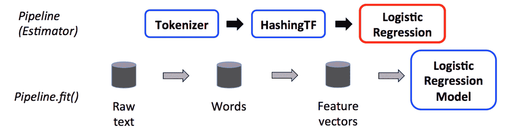
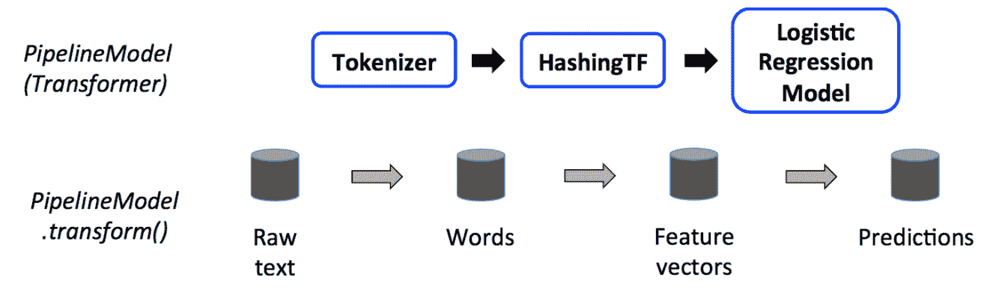
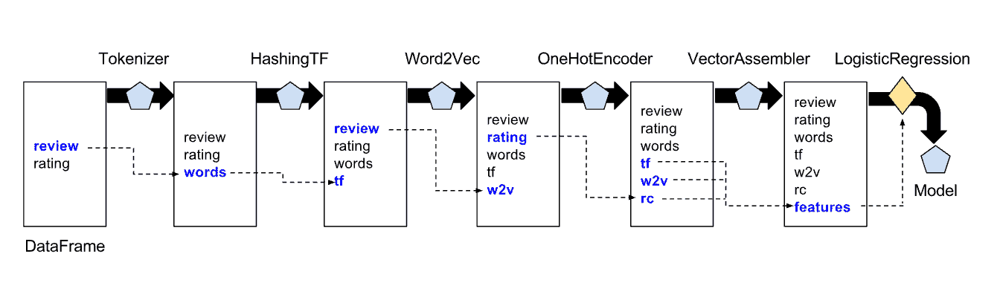
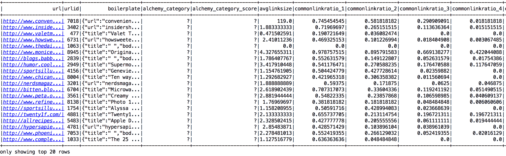
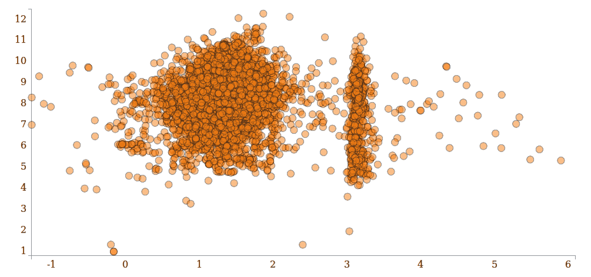
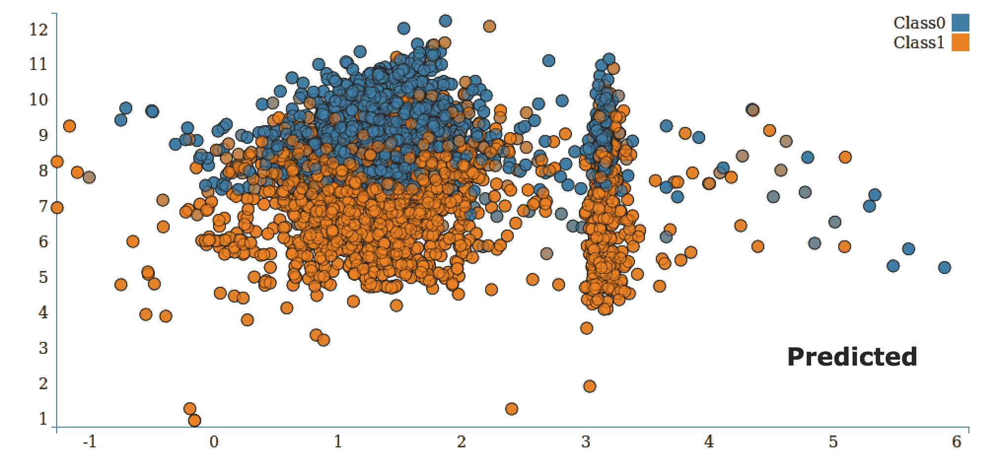
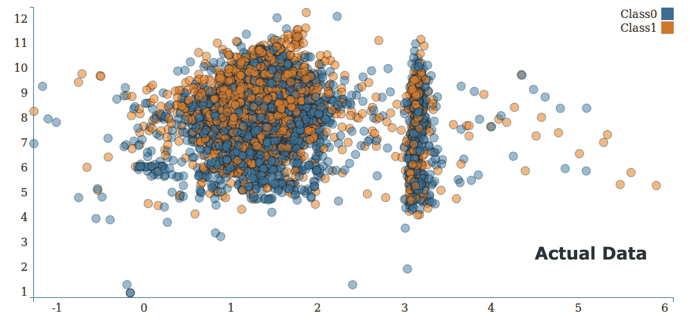
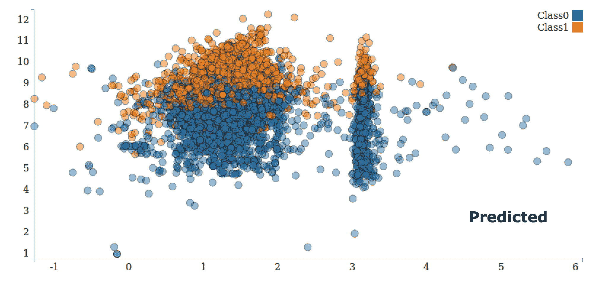

# 第十二章：Spark ML 的管道 API

在本章中，您将学习 ML 管道的基础知识以及它们如何在各种情境中使用。管道由几个组件组成。ML 管道利用 Spark 平台和机器学习提供关键功能，使大规模学习管道的构建变得简单。

# 管道介绍

管道 API 是在 Spark 1.2 中引入的，受到了 scikit-learn 的启发。管道的概念是为了便于创建、调整和检查 ML 工作流。

ML 管道提供了一组建立在 DataFrame 之上的高级 API，帮助用户创建和调整实用的机器学习管道。Spark 机器学习中的多种算法可以组合成一个单一的管道。

ML 管道通常涉及一系列数据预处理、特征提取、模型拟合和验证阶段。

让我们以文本分类为例，其中文档经过预处理阶段，如标记化、分割和清理，提取特征向量，并使用交叉验证训练分类模型。许多涉及预处理和算法的步骤可以使用管道连接在一起。管道通常位于 ML 库之上，编排工作流程。

# 数据帧

Spark 管道由一系列阶段定义，每个阶段都是一个转换器或估计器。这些阶段按顺序运行，输入 DataFrame 在通过每个阶段时进行转换。

DataFrame 是通过管道流动的基本数据结构或张量。DataFrame 由一系列行的数据集表示，并支持许多类型，如数值、字符串、二进制、布尔、日期时间等。

# 管道组件

ML 管道或 ML 工作流是一系列转换器和估计器，安排成将管道模型拟合到输入数据集的顺序。

# 转换器

转换器是一个包括特征转换器和学习模型的抽象。转换器实现了`transform()`方法，将一个 DataFrame 转换为另一个 DataFrame。

特征转换器接收一个 DataFrame，读取文本，将其映射到一个新列，并输出一个新的 DataFrame。

学习模型接收一个 DataFrame，读取包含特征向量的列，预测每个特征向量的标签，并输出一个包含预测标签的新 DataFrame。

自定义转换器需要遵循以下步骤：

1.  实现`transform`方法。

1.  指定 inputCol 和 outputCol。

1.  接受`DataFrame`作为输入，并返回`DataFrame`作为输出。

简而言之，**转换器**：`DataFrame =[transform]=> DataFrame`。

# 估计器

估计器是对在数据集上拟合模型的学习算法的抽象。

估计器实现了一个`fit()`方法，该方法接收一个 DataFrame 并生成一个模型。学习算法的一个例子是`LogisticRegression`。

简而言之，**估计器**是：`DataFrame =[fit]=> Model`。

在以下示例中，`PipelineComponentExample`介绍了转换器和估计器的概念：

```scala
import org.apache.spark.ml.classification.LogisticRegression 
import org.apache.spark.ml.linalg.{Vector, Vectors} 
import org.apache.spark.ml.param.ParamMap 
import org.apache.spark.sql.Row 
import org.utils.StandaloneSpark 

object PipelineComponentExample { 

  def main(args: Array[String]): Unit = { 
    val spark = StandaloneSpark.getSparkInstance() 

    // Prepare training data from a list of (label, features) tuples. 
    val training = spark.createDataFrame(Seq( 
      (1.0, Vectors.dense(0.0, 1.1, 0.1)), 
      (0.0, Vectors.dense(2.0, 1.0, -1.0)), 
      (0.0, Vectors.dense(2.0, 1.3, 1.0)), 
      (1.0, Vectors.dense(0.0, 1.2, -0.5)) 
    )).toDF("label", "features") 

    // Create a LogisticRegression instance. This instance is an Estimator. 
    val lr = new LogisticRegression() 
    // Print out the parameters, documentation, and any default values. 
    println("LogisticRegression parameters:n" + lr.explainParams() + "n") 

    // We may set parameters using setter methods. 
    lr.setMaxIter(10) 
      .setRegParam(0.01) 

    // Learn a LogisticRegression model.
    // This uses the parameters stored in lr. 
    val model1 = lr.fit(training) 
    // Since model1 is a Model (i.e., a Transformer produced by an Estimator), 
    // we can view the parameters it used during fit(). 
    // This prints the parameter (name: value) pairs,
    // where names are unique IDs for this 
    // LogisticRegression instance. 
    println("Model 1 was fit using parameters: " + 
    model1.parent.extractParamMap) 

    // We may alternatively specify parameters using a ParamMap, 
    // which supports several methods for specifying parameters. 
    val paramMap = ParamMap(lr.maxIter -> 20) 
    .put(lr.maxIter, 30) // Specify 1 Param.
    // This overwrites the original maxIter. 
    .put(lr.regParam -> 0.1, lr.threshold -> 0.55) // Specify multiple Params. 

    // One can also combine ParamMaps. 
    val paramMap2 = ParamMap(lr.probabilityCol ->             
      "myProbability") 
    // Change output column name. 
    val paramMapCombined = paramMap ++ paramMap2 

    // Now learn a new model using the paramMapCombined parameters. 
    lr.set* methods. 
    val model2 = lr.fit(training, paramMapCombined) 
    println("Model 2 was fit using parameters: " + 
      model2.parent.extractParamMap) 

    // Prepare test data. 
    val test = spark.createDataFrame(Seq( 
      (1.0, Vectors.dense(-1.0, 1.5, 1.3)), 
      (0.0, Vectors.dense(3.0, 2.0, -0.1)), 
      (1.0, Vectors.dense(0.0, 2.2, -1.5)) 
        )).toDF("label", "features") 

    // Make predictions on test data using the 
    // Transformer.transform() method. 
    // LogisticRegression.transform will only use the 'features' 
    // column. 
    // Note that model2.transform() outputs a 'myProbability' 
    // column instead of the usual 
    // 'probability' column since we renamed the       
    lr.probabilityCol 
    parameter previously. 
    model2.transform(test) 
      .select("features", "label", "myProbability", 
      "prediction") 
      .collect() 
      .foreach { case Row(features: Vector, label: Double, prob: 
        Vector, prediction: Double) => 
        println(s"($features, $label) -> prob=$prob, 
        prediction=$prediction") 
      } 
   } 
} 

```

您将看到以下输出：

```scala
Model 2 was fit using parameters: {
logreg_158888baeffa-elasticNetParam: 0.0,
logreg_158888baeffa-featuresCol: features,
logreg_158888baeffa-fitIntercept: true,
logreg_158888baeffa-labelCol: label,
logreg_158888baeffa-maxIter: 30,
logreg_158888baeffa-predictionCol: prediction,
logreg_158888baeffa-probabilityCol: myProbability,
logreg_158888baeffa-rawPredictionCol: rawPrediction,
logreg_158888baeffa-regParam: 0.1,
logreg_158888baeffa-standardization: true,
logreg_158888baeffa-threshold: 0.55,
logreg_158888baeffa-tol: 1.0E-6
}
17/02/12 12:32:49 INFO Instrumentation: LogisticRegression-
logreg_158888baeffa-268961738-2: training finished
17/02/12 12:32:49 INFO CodeGenerator: Code generated in 26.525405    
ms
17/02/12 12:32:49 INFO CodeGenerator: Code generated in 11.387162   
ms
17/02/12 12:32:49 INFO SparkContext: Invoking stop() from shutdown 
hook
([-1.0,1.5,1.3], 1.0) -> 
prob=[0.05707304171033984,0.9429269582896601], prediction=1.0
([3.0,2.0,-0.1], 0.0) -> 
prob=[0.9238522311704088,0.0761477688295912], prediction=0.0
([0.0,2.2,-1.5], 1.0) -> 
prob=[0.10972776114779145,0.8902722388522085], prediction=1.0

```

代码清单：

[`github.com/ml-resources/spark-ml/blob/branch-ed2/Chapter_12/2.0.0/spark-ai-apps/src/main/scala/org/textclassifier/PipelineComponentExample.scala`](https://github.com/ml-resources/spark-ml/blob/branch-ed2/Chapter_12/2.0.0/spark-ai-apps/src/main/scala/org/textclassifier/PipelineComponentExample.scala)

# 管道的工作原理

我们运行一系列算法来处理和学习给定的数据集。例如，在文本分类中，我们将每个文档分割成单词，并将单词转换为数值特征向量。最后，我们使用这个特征向量和标签学习一个预测模型。

Spark ML 将这样的工作流程表示为一个管道，它由一系列 PipelineStages（转换器和估计器）组成，按特定顺序运行。

*PipelineStages*中的每个阶段都是组件之一，可以是转换器或估计器。在输入 DataFrame 通过阶段流动时，阶段按特定顺序运行。

以下图片来自[`spark.apache.org/docs/latest/ml-pipeline.html#dataframe`](https://spark.apache.org/docs/latest/ml-pipeline.html#dataframe)。

在下图中，**dp**文档管道演示了文档工作流程，其中 Tokenizer、Hashing 和 Logistic Regression 是管道的组件。`Pipeline.fit()`方法显示了原始文本如何通过管道进行转换：



当调用`Pipeline.fit()`方法时，在第一个阶段，原始文本使用**Tokenizer**转换器被标记为单词，然后在第二个阶段，单词使用词频转换器转换为特征向量。在最后一个阶段，对**Estimator Logistic Regression**调用`fit()`方法以获得特征向量上的**Logistic Regression Model**（PipelineModel）。

管道是一个估计器，在运行`fit()`之后，它会产生一个 PipelineModel，这是一个转换器：



在测试数据上调用`PipelineModels.transform`方法并进行预测。

管道可以是线性的，即阶段被指定为有序数组，也可以是非线性的，其中数据流形成**有向无环图**（**DAG**）。管道和 PipelineModels 在实际运行管道之前执行运行时检查。

DAG 管道示例如下：



以下示例`TextClassificationPipeline`介绍了转换器和估计器的概念：

```scala
package org.textclassifier 

import org.apache.spark.ml.{Pipeline, PipelineModel} 
import org.apache.spark.ml.classification.LogisticRegression 
import org.apache.spark.ml.feature.{HashingTF, Tokenizer} 
import org.apache.spark.ml.linalg.Vector 
import org.utils.StandaloneSpark 

/** 
* Created by manpreet.singh on 12/02/17\. 
 */ 
object TextClassificationPipeline { 

  def main(args: Array[String]): Unit = { 
    val spark = StandaloneSpark.getSparkInstance() 

   // Prepare training documents from a list of (id, text, label) 
   // tuples. 
   val training = spark.createDataFrame(Seq( 
     (0L, "a b c d e spark", 1.0), 
     (1L, "b d", 0.0), 
     (2L, "spark f g h", 1.0), 
     (3L, "hadoop mapreduce", 0.0) 
    )).toDF("id", "text", "label") 

    // Configure an ML pipeline, which consists of three stages: 
    // tokenizer, hashingTF, and lr. 
    val tokenizer = new Tokenizer() 
      .setInputCol("text") 
      .setOutputCol("words") 
    val hashingTF = new HashingTF() 
      .setNumFeatures(1000) 
      .setInputCol(tokenizer.getOutputCol) 
      .setOutputCol("features") 
    val lr = new LogisticRegression() 
      .setMaxIter(10) 
      .setRegParam(0.001) 
    val pipeline = new Pipeline() 
      .setStages(Array(tokenizer, hashingTF, lr)) 

    // Fit the pipeline to training documents. 
    val model = pipeline.fit(training)

    // Now we can optionally save the fitted pipeline to disk 
    model.write.overwrite().save("/tmp/spark-logistic-regression-
      model") 

    // We can also save this unfit pipeline to disk 
    pipeline.write.overwrite().save("/tmp/unfit-lr-model") 

    // And load it back in during production 
    val sameModel = PipelineModel.load("/tmp/spark-logistic-
      regression-model") 

    // Prepare test documents, which are unlabeled (id, text) tuples. 
    val test = spark.createDataFrame(Seq( 
      (4L, "spark i j k"), 
      (5L, "l m n"), 
      (6L, "spark hadoop spark"), 
      (7L, "apache hadoop") 
    )).toDF("id", "text") 

    // Make predictions on test documents. 
    model.transform(test) 
      .select("id", "text", "probability", "prediction") 
      .collect() 
      .foreach { case Row(id: Long, text: String, prob: Vector, 
        prediction: Double) => 
        println(s"($id, $text) --> prob=$prob, 
        prediction=$prediction") 
      } 
    } 
 } 

```

您将看到以下输出：

```scala
17/02/12 12:46:22 INFO Executor: Finished task 0.0 in stage 
30.0    
(TID 
30). 1494 bytes result sent to driver
17/02/12 12:46:22 INFO TaskSetManager: Finished task 0.0 in stage 
30.0 (TID 30) in 84 ms on localhost (1/1)
17/02/12 12:46:22 INFO TaskSchedulerImpl: Removed TaskSet 30.0,    
whose tasks have all completed, from pool 
17/02/12 12:46:22 INFO DAGScheduler: ResultStage 30 (head at 
LogisticRegression.scala:683) finished in 0.084 s
17/02/12 12:46:22 INFO DAGScheduler: Job 29 finished: head at 
LogisticRegression.scala:683, took 0.091814 s
17/02/12 12:46:22 INFO CodeGenerator: Code generated in 5.88911 ms
17/02/12 12:46:22 INFO CodeGenerator: Code generated in 8.320754 ms
17/02/12 12:46:22 INFO CodeGenerator: Code generated in 9.082379 ms
(4, spark i j k) --> 
prob=[0.15964077387874084,0.8403592261212592], 
prediction=1.0
(5, l m n) --> prob=[0.8378325685476612,0.16216743145233883], 
prediction=0.0
(6, spark hadoop spark) --> prob=    
[0.06926633132976247,0.9307336686702374], prediction=1.0 (7, apache hadoop) --> prob=   
[0.9821575333444208,0.01784246665557917], 
prediction=0.0

```

代码清单：[`github.com/ml-resources/spark-ml/blob/branch-ed2/Chapter_12/2.0.0/spark-ai-apps/src/main/scala/org/textclassifier/TextClassificationPipeline.scala`](https://github.com/ml-resources/spark-ml/blob/branch-ed2/Chapter_12/2.0.0/spark-ai-apps/src/main/scala/org/textclassifier/TextClassificationPipeline.scala)

# 带有示例的机器学习管道

正如前几节讨论的那样，新的 ML 库中最大的特性之一是引入了管道。管道提供了机器学习流程的高级抽象，并极大简化了整个工作流程。

我们将演示在 Spark 中使用`StumbleUpon`数据集创建管道的过程。

此处使用的数据集可以从[`www.kaggle.com/c/stumbleupon/data`](http://www.kaggle.com/c/stumbleupon/data)下载。

下载训练数据（`train.tsv`）--您需要在下载数据集之前接受条款和条件。您可以在[`www.kaggle.com/c/stumbleupon`](http://www.kaggle.com/c/stumbleupon)找到有关比赛的更多信息。

这是将`StumbleUpon`数据集存储为 Spark SQLContext 临时表的一瞥：



这是`StumbleUpon`数据集的可视化：



# StumbleUponExecutor

`StumbleUponExecutor`对象可用于选择和运行相应的分类模型，例如运行`LogisiticRegression`并执行逻辑回归管道，或将程序参数设置为`LR`。有关其他命令，请参阅以下代码片段：

在我们继续之前，先简要介绍一下逻辑回归估计器。逻辑回归适用于类别几乎是线性可分的分类问题。它在特征空间中寻找单一的线性决策边界。Spark 中有两种类型的逻辑回归估计器：二项逻辑回归估计器用于预测二元结果，多项逻辑回归估计器用于预测多类结果。

```scala
case "LR" =>             
  LogisticRegressionPipeline.logisticRegressionPipeline(
  vectorAssembler, dataFrame) 

case "DT" =>       
  DecisionTreePipeline.decisionTreePipeline(vectorAssembler, 
  dataFrame) 

case "RF" => 
  RandomForestPipeline.randomForestPipeline(vectorAssembler, 
  dataFrame) 

case
  GradientBoostedTreePipeline.gradientBoostedTreePipeline
  (vectorAssembler, dataFrame) 

case "NB" =>                   
  NaiveBayesPipeline.naiveBayesPipeline(vectorAssembler, 
  dataFrame) 

case "SVM" => SVMPipeline.svmPipeline(sparkContext) 

```

代码清单：[`github.com/ml-resources/spark-ml/blob/branch-ed2/Chapter_12/2.0.0/spark-ai-apps/src/main/scala/org/stumbleuponclassifier/StumbleUponExecutor.scala`](https://github.com/ml-resources/spark-ml/blob/branch-ed2/Chapter_12/2.0.0/spark-ai-apps/src/main/scala/org/stumbleuponclassifier/StumbleUponExecutor.scala)

**决策树管道：**管道使用决策树估计器对 StumbleUpon 数据集进行分类，作为 ML 工作流的一部分。

在 Spark 中，决策树估计器基本上使用轴对齐的线性决策边界将特征空间划分为半空间。效果是我们有一个非线性决策边界，可能不止一个：

```scala
package org.stumbleuponclassifier 

import org.apache.log4j.Logger 
import org.apache.spark.ml.classification.DecisionTreeClassifier 
import org.apache.spark.ml.evaluation.MulticlassClassification
  Evaluator 
import org.apache.spark.ml.feature.{StringIndexer,       
  VectorAssembler} 
import org.apache.spark.ml.{Pipeline, PipelineStage} 
import org.apache.spark.sql.DataFrame 
import scala.collection.mutable 

/** 
  * Created by manpreet.singh on 01/05/16\. 
  */ 
object DecisionTreePipeline { 
  @transient lazy val logger = Logger.getLogger(getClass.getName) 

  def decisionTreePipeline(vectorAssembler: VectorAssembler, 
    dataFrame: DataFrame) = { 
    val Array(training, test) = dataFrame.randomSplit(Array(0.9, 
      0.1), seed = 12345) 

    // Set up Pipeline 
    val stages = new mutable.ArrayBuffer[PipelineStage]() 

    val labelIndexer = new StringIndexer() 
      .setInputCol("label") 
      .setOutputCol("indexedLabel") 
    stages += labelIndexer 

    val dt = new DecisionTreeClassifier() 
      .setFeaturesCol(vectorAssembler.getOutputCol) 
      .setLabelCol("indexedLabel") 
      .setMaxDepth(5) 
      .setMaxBins(32) 
      .setMinInstancesPerNode(1) 
      .setMinInfoGain(0.0) 
      .setCacheNodeIds(false) 
      .setCheckpointInterval(10) 

    stages += vectorAssembler 
    stages += dt 
    val pipeline = new Pipeline().setStages(stages.toArray) 

    // Fit the Pipeline 
    val startTime = System.nanoTime() 
    //val model = pipeline.fit(training) 
    val model = pipeline.fit(dataFrame) 
    val elapsedTime = (System.nanoTime() - startTime) / 1e9 
    println(s"Training time: $elapsedTime seconds") 

    //val holdout = 
    // model.transform(test).select("prediction","label") 
    val holdout = 
      model.transform(dataFrame).select("prediction","label") 

    // Select (prediction, true label) and compute test error 
    val evaluator = new MulticlassClassificationEvaluator() 
      .setLabelCol("label") 
      .setPredictionCol("prediction") 
      .setMetricName("accuracy") 
    val mAccuracy = evaluator.evaluate(holdout) 
    println("Test set accuracy = " + mAccuracy) 
  } 
} 

```

您将看到以下输出显示：

```scala
Accuracy: 0.3786163522012579  

```

代码清单：[`github.com/ml-resources/spark-ml/blob/branch-ed2/Chapter_12/2.0.0/spark-ai-apps/src/main/scala/org/stumbleuponclassifier/DecisionTreePipeline.scala`](https://github.com/ml-resources/spark-ml/blob/branch-ed2/Chapter_12/2.0.0/spark-ai-apps/src/main/scala/org/stumbleuponclassifier/DecisionTreePipeline.scala)

这里显示了 2 维散点图中预测数据的可视化：



这里显示了 2 维散点图中实际数据的可视化：



**朴素贝叶斯管道：**管道使用朴素贝叶斯估计器对 StumbleUpon 数据集进行分类，作为 ML 工作流的一部分。

朴素贝叶斯估计器认为类中特定特征的存在与任何其他特征的存在无关。朴素贝叶斯模型易于构建，特别适用于非常大的数据集：

```scala
package org.stumbleuponclassifier 

import org.apache.log4j.Logger 
import org.apache.spark.ml.classification.NaiveBayes 
import org.apache.spark.ml.evaluation.MulticlassClassification
  Evaluator 
import org.apache.spark.ml.feature.{StringIndexer, 
  VectorAssembler} 
import org.apache.spark.ml.{Pipeline, PipelineStage} 
import org.apache.spark.sql.DataFrame 
import scala.collection.mutable 

/** 
  * Created by manpreet.singh on 01/05/16\. 
  */ 
object NaiveBayesPipeline { 
  @transient lazy val logger = 
  Logger.getLogger(getClass.getName) 

  def naiveBayesPipeline(vectorAssembler: VectorAssembler, 
    dataFrame: DataFrame) = { 
    val Array(training, test) = dataFrame.randomSplit(Array(0.9, 
      0.1), seed = 12345) 

    // Set up Pipeline 
    val stages = new mutable.ArrayBuffer[PipelineStage]() 

    val labelIndexer = new StringIndexer() 
      .setInputCol("label") 
      .setOutputCol("indexedLabel") 
    stages += labelIndexer 

    val nb = new NaiveBayes() 

    stages += vectorAssembler 
    stages += nb 
    val pipeline = new Pipeline().setStages(stages.toArray) 

    // Fit the Pipeline 
    val startTime = System.nanoTime() 
    // val model = pipeline.fit(training) 
    val model = pipeline.fit(dataFrame) 
    val elapsedTime = (System.nanoTime() - startTime) / 1e9 
    println(s"Training time: $elapsedTime seconds") 

    // val holdout = 
    // model.transform(test).select("prediction","label") 
    val holdout = 
      model.transform(dataFrame).select("prediction","label") 

    // Select (prediction, true label) and compute test error 
    val evaluator = new MulticlassClassificationEvaluator() 
      .setLabelCol("label") 
      .setPredictionCol("prediction") 
      .setMetricName("accuracy") 
    val mAccuracy = evaluator.evaluate(holdout) 
    println("Test set accuracy = " + mAccuracy) 
  } 
} 

```

您将看到以下输出显示：

```scala
Training time: 2.114725642 seconds
Accuracy: 0.5660377358490566

```

代码清单：[`github.com/ml-resources/spark-ml/blob/branch-ed2/Chapter_12/2.0.0/spark-ai-apps/src/main/scala/org/stumbleuponclassifier/NaiveBayesPipeline.scala`](https://github.com/ml-resources/spark-ml/blob/branch-ed2/Chapter_12/2.0.0/spark-ai-apps/src/main/scala/org/stumbleuponclassifier/NaiveBayesPipeline.scala)

这里显示了 2 维散点图中预测数据的可视化：



这里显示了 2 维散点图中实际数据的可视化：


**梯度提升管道：**管道使用梯度提升树估计器对 StumbleUpon 数据集进行分类，作为 ML 工作流的一部分。

梯度提升树估计器是用于回归和分类问题的机器学习方法。**梯度提升树**（GBTs）和随机森林都是学习树集成的算法。GBTs 迭代训练决策树以最小化损失函数。spark.mllib 支持 GBTs。

```scala
package org.stumbleuponclassifier 

import org.apache.log4j.Logger 
import org.apache.spark.ml.classification.GBTClassifier 
import org.apache.spark.ml.feature.{StringIndexer, 
   VectorAssembler} 
import org.apache.spark.ml.{Pipeline, PipelineStage} 
import org.apache.spark.mllib.evaluation.{MulticlassMetrics, 
   RegressionMetrics} 
import org.apache.spark.sql.DataFrame 

import scala.collection.mutable 

/** 
  * Created by manpreet.singh on 01/05/16\. 
  */ 
object GradientBoostedTreePipeline { 
  @transient lazy val logger = 
    Logger.getLogger(getClass.getName) 
    def gradientBoostedTreePipeline(vectorAssembler: 
      VectorAssembler, dataFrame: DataFrame) = { 
      val Array(training, test) = dataFrame.randomSplit(Array(0.9, 
      0.1), seed = 12345) 

    // Set up Pipeline 
    val stages = new mutable.ArrayBuffer[PipelineStage]() 

      val labelIndexer = new StringIndexer() 
      .setInputCol("label") 
      .setOutputCol("indexedLabel") 
    stages += labelIndexer 

    val gbt = new GBTClassifier() 
      .setFeaturesCol(vectorAssembler.getOutputCol) 
      .setLabelCol("indexedLabel") 
      .setMaxIter(10) 

    stages += vectorAssembler 
    stages += gbt 
    val pipeline = new Pipeline().setStages(stages.toArray) 

    // Fit the Pipeline 
    val startTime = System.nanoTime() 
    //val model = pipeline.fit(training) 
    val model = pipeline.fit(dataFrame) 
    val elapsedTime = (System.nanoTime() - startTime) / 1e9 
    println(s"Training time: $elapsedTime seconds") 

    // val holdout = 
    // model.transform(test).select("prediction","label") 
    val holdout = 
    model.transform(dataFrame).select("prediction","label") 

    // have to do a type conversion for RegressionMetrics 
    val rm = new RegressionMetrics(holdout.rdd.map(x => 
      (x(0).asInstanceOf[Double], x(1).asInstanceOf[Double]))) 

    logger.info("Test Metrics") 
    logger.info("Test Explained Variance:") 
    logger.info(rm.explainedVariance) 
    logger.info("Test R² Coef:") 
    logger.info(rm.r2) 
    logger.info("Test MSE:") 
    logger.info(rm.meanSquaredError) 
    logger.info("Test RMSE:") 
    logger.info(rm.rootMeanSquaredError) 

    val predictions = model.transform(test).select("prediction")
    .rdd.map(_.getDouble(0)) 
    val labels = model.transform(test).select("label")
    .rdd.map(_.getDouble(0)) 
    val accuracy = new 
      MulticlassMetrics(predictions.zip(labels)).precision 
    println(s"  Accuracy : $accuracy") 
  } 

  def savePredictions(predictions:DataFrame, testRaw:DataFrame, 
    regressionMetrics: RegressionMetrics, filePath:String) = { 
    predictions 
      .coalesce(1) 
      .write.format("com.databricks.spark.csv") 
      .option("header", "true") 
      .save(filePath) 
  } 

} 

```

您将看到以下输出显示：

```scala
Accuracy: 0.3647

```

代码清单：[`github.com/ml-resources/spark-ml/blob/branch-ed2/Chapter_12/2.0.0/spark-ai-apps/src/main/scala/org/stumbleuponclassifier/GradientBoostedTreePipeline.scala`](https://github.com/ml-resources/spark-ml/blob/branch-ed2/Chapter_12/2.0.0/spark-ai-apps/src/main/scala/org/stumbleuponclassifier/GradientBoostedTreePipeline.scala)

这里显示了 2 维散点图中预测的可视化：


以下显示了 2 维散点图中实际数据的可视化：


# 总结

在本章中，我们介绍了 Spark ML Pipeline 及其组件的基础知识。我们看到如何在输入 DataFrame 上训练模型，以及如何通过运行它们通过 spark ML 管道 API 来评估它们的性能，使用标准指标和度量标准。我们探讨了如何应用一些技术，如转换器和估计器。最后，我们通过在 Kaggle 的 StumbleUpon 数据集上应用不同的算法来调查管道 API。

机器学习是行业中的新星。它确实解决了许多业务问题和用例。我们希望我们的读者能够找到新的创新方式，使这些方法更加强大，并延伸了解支撑学习和智能的原则的旅程。有关机器学习和 Spark 的进一步练习和阅读，请参考[`www.kaggle.com`](https://www.kaggle.com)和[`databricks.com/spark/`](https://databricks.com/spark/)。
