# 第三章：人工智能与机器学习

在本章中，我们将定义我们所说的人工智能、机器学习和认知计算。我们将研究机器学习领域内常见的算法类别及其更广泛的应用，包括以下内容：

+   监督学习

+   无监督学习

+   强化学习

+   深度学习

+   自然语言处理

+   认知计算

+   Apache Spark 的机器学习库`MLlib`以及如何将其用于在机器学习管道中实现这些算法

# 人工智能

人工智能是一个广泛的术语，用于描述表现出智能行为的机器的理论和应用。人工智能包括许多应用研究领域，包括机器学习和随后的深度学习，如图*3.1*所示：

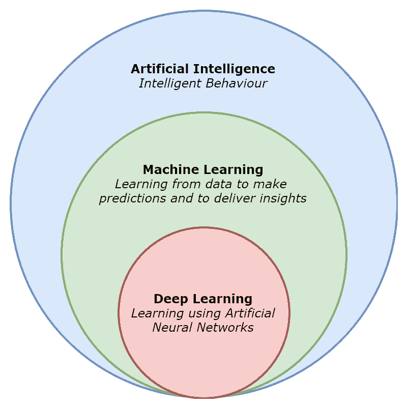

图 3.1：人工智能概述

# 机器学习

机器学习是人工智能更广泛主题下的一个应用研究领域，它通过检测数据中的模式、趋势和关系来学习，以便进行预测，并最终提供可操作的见解以帮助决策。机器学习模型可以分为三种主要类型：*监督学习*、*无监督学习*和*r*强化学习*。

# 监督学习

在监督学习中，目标是学习一个函数，该函数能够将输入*x*映射到输出*y*，给定一个标记过的输入-输出对集*D*，其中*D*被称为训练集，*N*是训练集中的输入-输出对的数量：

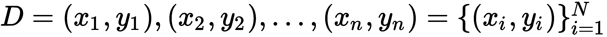

在监督学习模型的简单应用中，每个训练输入*x[i]*是一个表示模型特征（如价格、年龄和温度）的数值向量。在复杂应用中，*x[i]*可能代表更复杂的对象，如时间序列、图像和文本。

当输出*y[i]*（也称为响应变量）在本质上属于分类性质时，这个问题被称为分类问题，其中*y[i]*属于一个由*K*个元素或可能的分类组成的有限集：

当输出*y[i]*是一个实数时，这个问题被称为回归问题。

这在实践中意味着什么呢？嗯，训练集*D*本质上是一个已经将输入特征映射到输出的数据集。换句话说，我们已经知道训练数据集的答案——它是*标记过的*。例如，如果问题是根据在线广告的花费来预测电子商务网站的月销售额（即回归问题），训练数据集就已经将广告成本（输入特征）映射到已知的月销售额（输出），如图*3.2*所示：

图 3.2：线性回归训练数据集

监督学习算法将使用这个标记的训练数据集来计算一个数学函数，该函数是给定输入特征的最佳输出预测器。然后可以将该函数应用于测试数据集以量化其准确性，之后应用于它以前从未见过的数据集以进行预测！

回归问题是我们希望预测一个数值结果的地方。回归算法的例子包括**线性回归**和**回归树**，实际应用案例包括价格、重量和温度预测。分类问题是我们希望预测一个分类结果的地方。分类算法的例子包括**逻辑回归**、**多项式逻辑回归**和**分类树**，实际应用案例包括图像分类和电子邮件垃圾邮件分类。我们将在第四章《使用 Apache Spark 的监督学习》中更详细地研究这些算法，在那里我们还将开发可以应用于实际应用案例并能够量化其准确性的监督学习模型。

# 无监督学习

在无监督学习中，目标是揭示隐藏的关系、趋势和模式，给定只有输入数据*x[i]*而没有输出*y[i]*。在这种情况下，我们有以下内容：

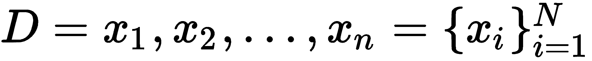

在实践中，这意味着在没有已知和正确答案的情况下，重点在于揭示数据集中的有趣模式和趋势。随后，由于问题定义不够明确，我们也没有被告知数据中包含哪些类型的模式，无监督学习通常被称为**知识发现**。**聚类**是一个无监督学习算法的例子，其目标是将数据点分割成组，其中特定组中的所有数据点都共享相似的特征或属性，如图*3.3*所示。聚类的实际应用案例包括文档分类和为营销目的聚类客户：

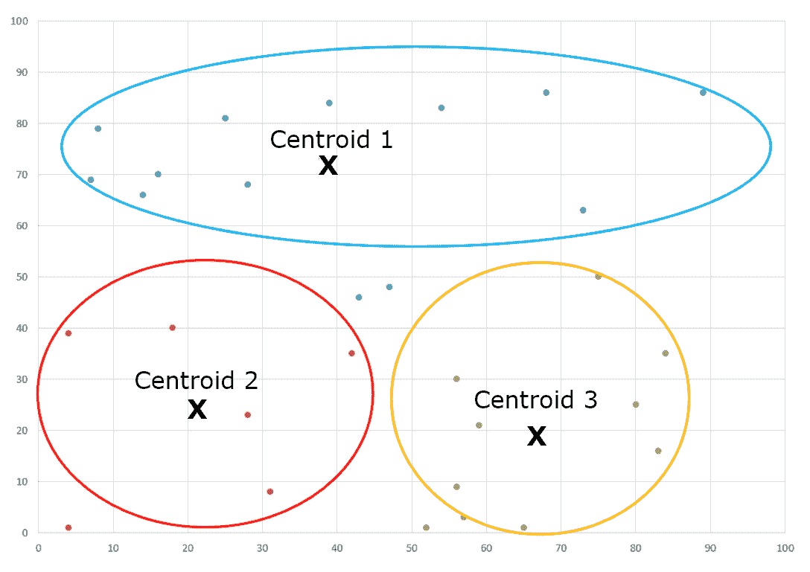

图 3.3：聚类无监督学习模型

我们将在第五章《使用 Apache Spark 的无监督学习》中更详细地研究无监督学习算法，包括实际应用的动手开发。

# 强化学习

在强化学习中，使用奖励（或惩罚）系统来影响行为，基于代理与其更广泛环境之间的交互。代理将从环境中接收状态信息，并根据该状态执行一个*动作*。由于该动作，环境将过渡到一个新的状态，然后将其提供给代理，通常伴随着奖励（或惩罚）。因此，代理的目标是最大化它收到的累积奖励。例如，考虑一个孩子从不良行为中学习良好行为，并因其良好行为而从父母那里得到奖励的情况。在机器的例子中，考虑基于计算机的棋类游戏玩家的例子。通过将深度学习与强化学习相结合，计算机可以学习如何以不断提高的性能水平玩棋类游戏，以至于随着时间的推移，它们几乎不可战胜！

强化学习超出了本书的范围。然而，要了解更多关于应用于游戏中的深度强化学习，请访问[`deepmind.com/blog/deep-reinforcement-learning/`](https://deepmind.com/blog/deep-reinforcement-learning/)。

# 深度学习

在深度学习，作为机器学习更广泛领域的一个子领域，目标仍然是学习一个函数，但通过采用模仿人类大脑中发现的神经网络架构的架构，以便使用概念或表示的层次结构从经验中学习。这使得我们能够开发更复杂和强大的函数，以更好地预测结果。

许多机器学习模型采用双层架构，其中某种函数将输入映射到输出。然而，在人类大脑中，存在多层处理，换句话说，是一个神经网络。通过模仿自然神经网络，**人工神经网络（ANN**）能够学习复杂的非线性表示，对输入特征没有限制，非常适合广泛的令人兴奋的应用场景，包括语音、图像和模式识别、**自然语言处理（NLP**）、欺诈检测、预测和价格预测。

# 自然神经元

深度学习算法模仿了人类大脑中发现的神经网络架构。如果我们研究人类大脑中的一个单个自然神经元，我们会发现三个主要的研究领域，如图*图 3.4*所示：

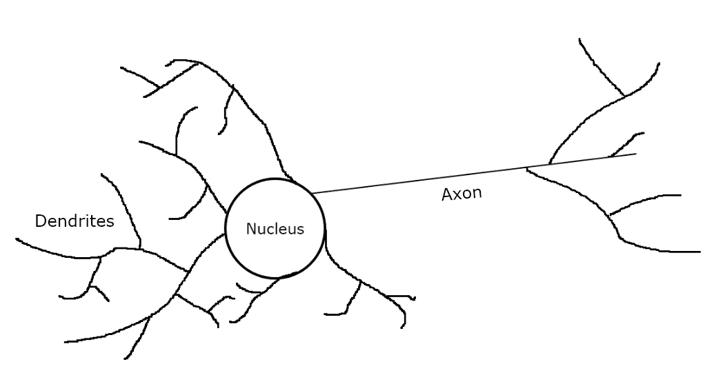

图 3.4：一个自然神经元

树突接收来自其他神经元的化学信号和电脉冲，这些信号在细胞体中被收集和汇总。位于细胞体内的细胞核是神经元的控制中心，负责调节细胞功能，产生构建新树突所需的蛋白质，以及制造用作信号的神经递质化学物质。信号可以分为抑制性或兴奋性。如果是抑制性的，这意味着它们不会被传递到其他神经元。如果是兴奋性的，这意味着它们将通过轴突传递到其他神经元。轴突负责在神经元之间传递信号，在某些情况下，距离可以长达几米或短至几微米。因此，神经元作为一个单一的逻辑单元，最终负责传递信息，而平均人类大脑可能包含大约 1000 亿个神经元。

# 人工神经元

自然神经元的核心理念可以概括为信号处理系统的组成部分。在这个通用信号处理系统中，树突接收到的信号可以被认为是输入。细胞核可以被认为是中央处理单元，它收集和汇总输入，并根据净输入幅度和激活函数，通过轴突传递输出。这个基于自然神经元建模的通用信号处理系统被称为**人工神经元**，并在*图 3.5*中展示：

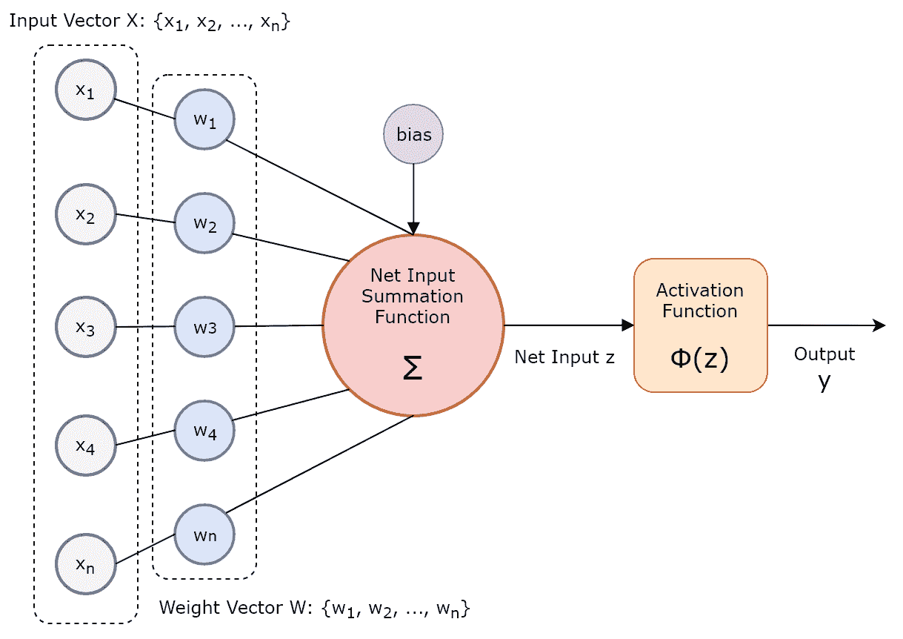

图 3.5：人工神经元

# 权重

在人工神经元中，权重可以放大或衰减信号，并用于模拟自然界中发现的与其他神经元建立的连接。通过改变权重向量，我们可以根据输入值与权重的汇总（称为加权或净输入*z*）来影响神经元是否会激活：

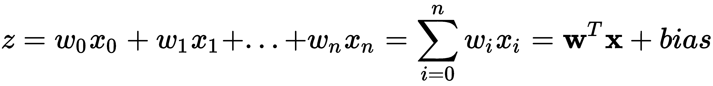

# 激活函数

一旦计算了加权输入加上偏差，就使用**激活函数**（用希腊字母*phi*（Φ）表示）来确定神经元的输出以及它是否被激活。为了做出这个决定，激活函数通常是一个介于两个值之间的非线性函数，从而为人工神经网络（ANNs）添加了非线性。由于大多数现实世界数据在复杂用例中往往是非线性的，我们需要人工神经网络具有学习这些非线性概念或表示的能力。这通过非线性激活函数得以实现。激活函数的例子包括 Heaviside 阶跃函数、Sigmoid 函数和对数正切函数。

# Heaviside 阶跃函数

Heaviside 阶跃函数是一种基本的不连续函数，它将值与一个简单的阈值进行比较，用于输入数据*线性可分*的分类。如果加权总和加上偏差超过某个阈值，则神经元被激活，该阈值用下面的方程中的希腊字母*theta*（θ）表示。如果没有超过，则神经元不被激活。以下阶跃函数是一个介于*1*和*-1*之间的 Heaviside 阶跃函数的例子：

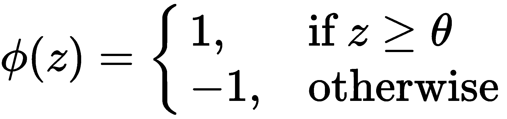

这个 Heaviside 阶跃函数如图*3.6*所示：

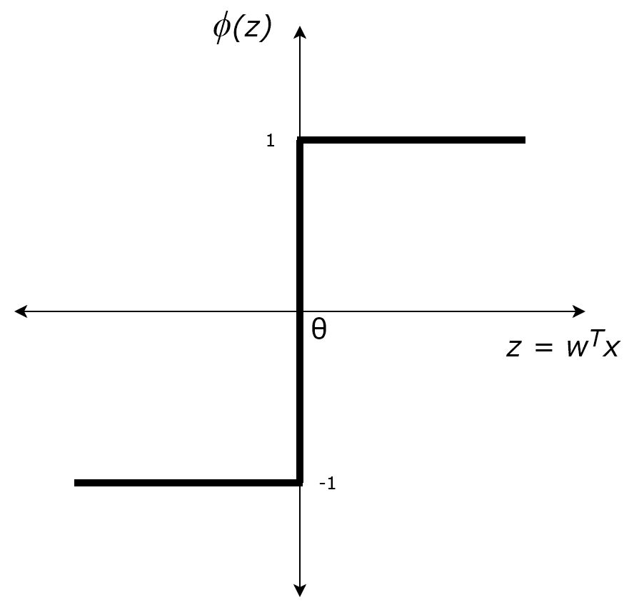

图 3.6：Heaviside 阶跃激活函数

# Sigmoid 函数

Sigmoid 函数是一种非线性数学函数，表现出 sigmoid 曲线，如图*3.7*所示，通常指的是 sigmoid 或逻辑函数：

在这种情况下，sigmoid 激活函数介于 0 和 1 之间，对所有实数输入值都有平滑的定义，这使得它比基本的 Heaviside 阶跃函数是一个更好的激活函数选择。这是因为，与 Heaviside 阶跃函数不同，非线性激活函数可以区分那些*非线性可分*的数据，例如图像和视频数据。请注意，使用 sigmoid 函数作为激活函数时，人工神经元实际上对应于逻辑回归模型：

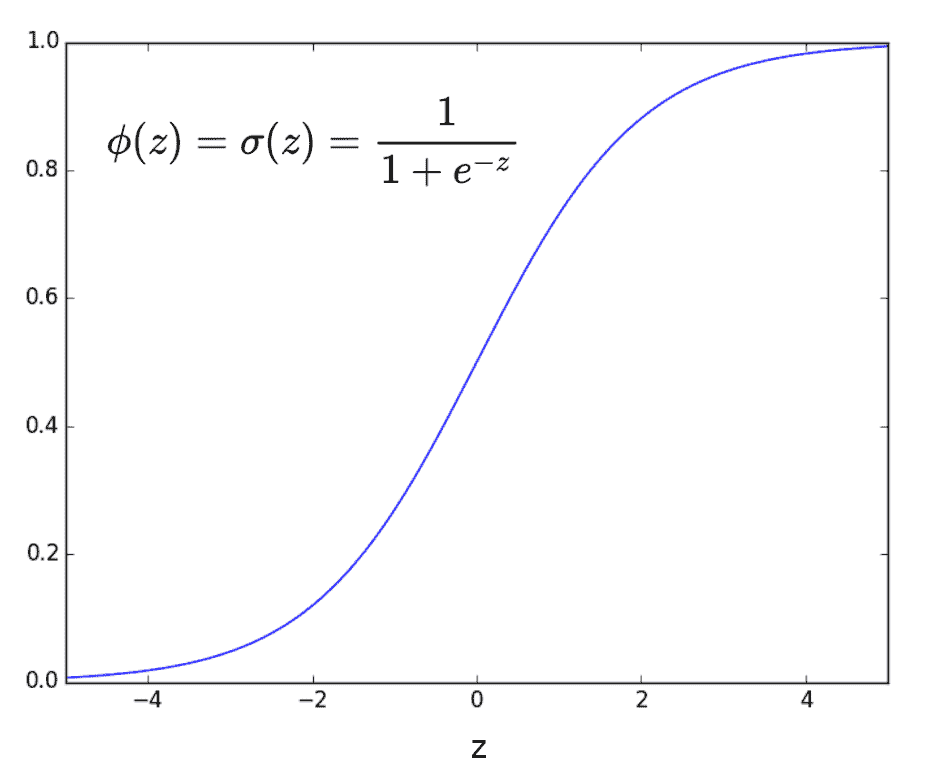

图 3.7：Sigmoid 激活函数

# 双曲正切函数

最后，双曲正切函数，如图*3.8*所示，是双曲正弦函数和余弦函数的比值：

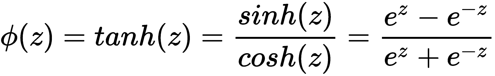

在这个例子中，基于双曲正切函数的激活函数介于*1*和*-1*之间，类似于 sigmoid 函数，对所有实数输入值都有平滑的定义：

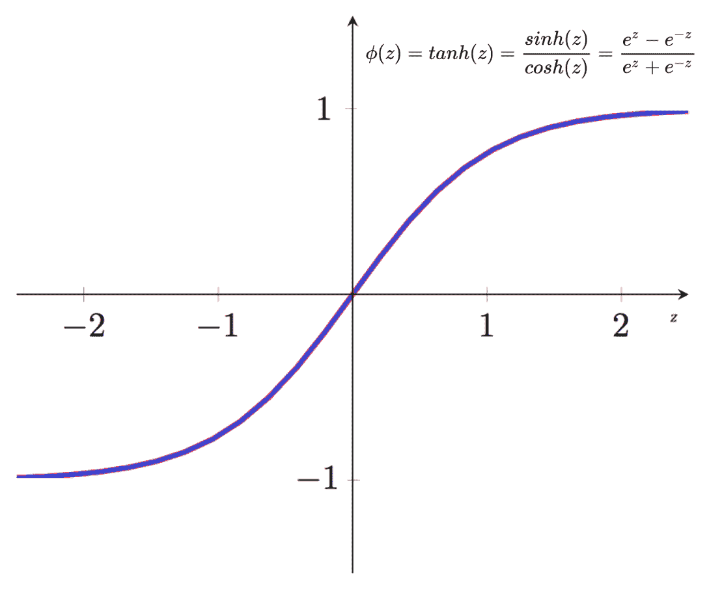

图 3.8：双曲正切函数

# 人工神经网络

**人工神经网络**（**ANN**）是一组相互连接的人工神经元，其中人工神经元被聚合成相互连接的**神经****层**，可以分为三种类型：

+   **输入层**接收来自外部世界的输入信号，并将这些输入信号传递到下一层。

+   **隐藏层**（如果有），对这些信号进行计算并将它们传递到输出层。因此，隐藏层（的）的输出作为最终输出的输入。

+   **输出层**计算最终输出，然后以某种方式影响外部世界。

人工神经元通过具有相关权重的**边**连接到相邻的神经网络层。一般来说，增加更多的隐藏神经网络层可以提高人工神经网络（ANN）学习更复杂概念或表示的能力。它们被称为**隐藏**层，因为它们不直接与外界交互。请注意，所有 ANN 都有一个输入层和一个输出层，以及零个或多个隐藏层。仅在一个方向上传播信号的人工神经网络，换句话说，信号由输入层接收并转发到下一层进行处理的，被称为**前馈**网络。信号可能被传播回已经处理过该信号的人工神经元或神经层的 ANN 被称为**反馈**网络。*图 3.9*展示了前馈 ANN 的逻辑架构，其中每个圆圈代表一个人工神经元，有时被称为**节点**或**单元**，箭头代表人工神经元之间相邻神经网络层的**边**或**连接**：

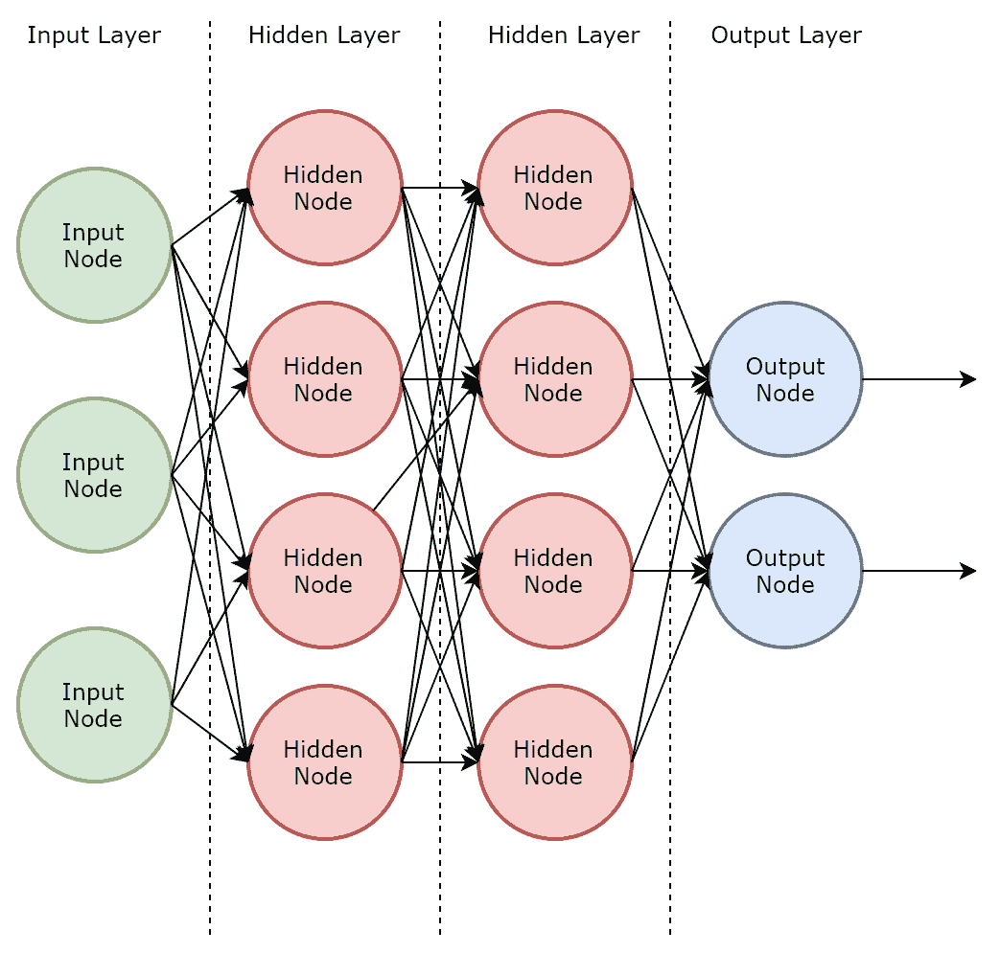

图 3.9：前馈人工神经网络

根据其架构，ANN 可以分为两类。**单层**或**单层**ANN 的特点是所有组成人工神经元都聚集在同一层，没有隐藏层。一个单层感知器是单层 ANN 的一个例子，它只包含输入节点和输出节点之间的一层链接。**多层**ANN 的特点是人工神经元分布在多个相互连接的层中。多层感知器是多层 ANN 的一个例子，它包含一个或多个隐藏层。

ANN 通过优化其权重以产生期望的结果来学习，并且通过改变权重，ANN 可以为相同的输入产生不同的结果。优化权重的目标是通过找到最佳权重组合来最小化**损失函数**——一个计算不准确预测代价的函数，从而最佳预测结果。回想一下，权重代表与其他神经元建立的连接；因此，通过改变权重，ANN 实际上是通过改变神经元之间的连接来模拟自然神经网络的。在讨论感知器时，以下子节中将提供学习最优权重系数的各种过程。

# 单层感知器

*图 3.10*展示了单层感知器的架构。在这个单层感知器中，推导出一个最优的权重系数集，当乘以输入特征时，决定是否激活神经元。初始权重被随机设置，如果加权输入产生的预测输出与期望输出匹配（例如，在监督学习分类的上下文中），则不对权重进行更改。如果预测输出与期望输出不匹配，则更新权重以减少误差。

这使得单层感知器最适合作为分类器，但仅当类别是*线性可分*时：

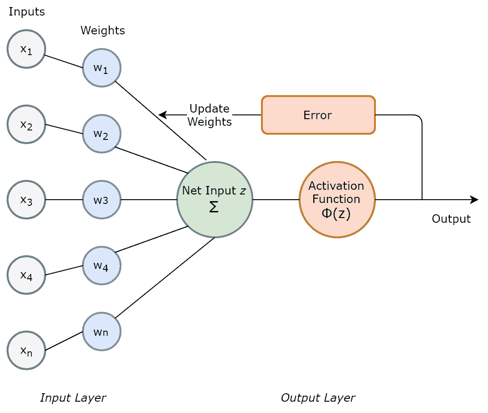

图 3.10：单层感知器

# 多层感知器

多层感知器与单层感知器不同，这是由于引入了一个或多个隐藏层，使它们能够学习非线性函数。*图 3.11*展示了包含一个隐藏层的多层感知器架构：

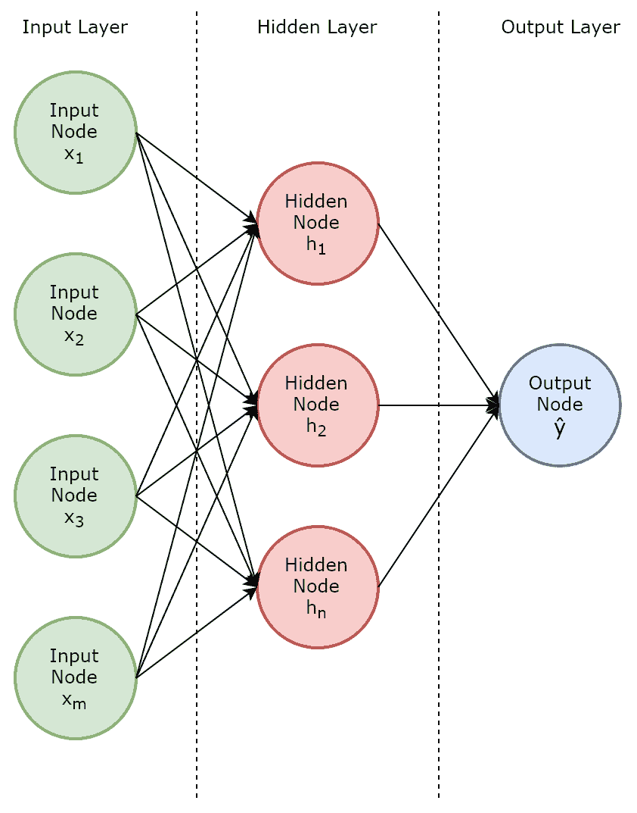

图 3.11：多层感知器

**反向传播**是一种监督学习过程，通过这个过程多层感知器和其它人工神经网络可以学习，也就是说，推导出一个最优的权重系数集。反向传播的第一步实际上是**正向传播**，在这个过程中，所有权重最初被随机设置，然后计算网络的输出（类似于单层感知器，但这次涉及一个或多个隐藏层）。如果预测输出与期望输出不匹配，输出节点的总误差将通过整个网络反向传播，以尝试重新调整网络中的所有权重，从而在输出层减少误差。

多层神经网络，如多层感知器，通常计算量更大，因为优化权重的过程涉及更多的权重和计算。因此，训练神经网络，这通常也涉及大量数据点以学习大量最优权重系数，需要 CPU 和内存资源，这在以前可能并不容易获得或成本效益高。然而，随着分布式系统的出现，如第一章《大数据生态系统》中描述的，以及成本效益高、高性能和具有弹性的分布式集群的可用性，这些集群支持由通用硬件托管的数据处理，人工神经网络和深度学习的研究已经爆炸式增长，它们在令人兴奋的现实世界人工智能用例中的应用也是如此，包括以下内容：

+   医疗保健和疾病防治，包括预测诊断、药物发现和基因本体

+   语音识别，包括语言翻译

+   图像识别，包括视觉搜索

+   理论物理学和天体物理学，包括卫星图像分类和引力波探测

在本节中，我们讨论了两种特定的 ANN 类型，单层感知器和多层感知器，我们将在第七章《使用 Apache Spark 的深度学习》中更详细地研究，包括实际应用的动手开发。其他类别的神经网络包括**卷积****神经网络**（也在第七章《使用 Apache Spark 的深度学习》中描述），**循环神经网络**、**Kohonen 自组织神经网络**和**模块化****神经网络**，这些超出了本书的范围。要了解更多关于 ANN 和令人兴奋的深度学习领域，请访问[`deeplearning.net/`](http://deeplearning.net/)。

# NLP

自然语言处理（NLP）是指包括机器学习、语言学、信息工程和数据管理在内的一组计算机科学学科，用于分析和理解自然语言，包括语音和文本。NLP 可以应用于广泛的现实世界用例，包括以下内容：

+   **命名实体识别**（NER）：自动从文本中识别和解析实体，包括人名、物理地址和电子邮件地址

+   **关系抽取**：自动识别解析实体之间关系的类型

+   **机器翻译和转录**：自动将一种自然语言翻译成另一种语言，例如，从英语翻译成中文

+   **搜索**：自动在大量结构化、半结构化和非结构化文档和对象中进行搜索，以满足自然语言查询

+   **语音识别**：自动从人类语音中提取意义

+   **情感分析**：自动识别人类对某个主题或实体的情感

+   **问答系统**：自动回答自然、完整的疑问

在自然语言处理（NLP）中，常用的一种技术是开发一个数据工程管道，该管道对文本进行预处理，以便为机器学习模型生成特征。常见的预处理技术包括**分词**（将文本分割成更小、更简单的单元，称为标记，标记通常是单个单词或术语）、**词干提取**和**词形还原**（将标记还原到基本形式），以及移除**停用词**（如*I*、*this*和*at*）。生成的术语集被转换成特征，然后输入到机器学习模型中。将术语集转换为特征的一个非常基础的算法称为**词袋模型**，它简单地计算每个唯一术语的出现次数，从而将文本转换为数值特征向量。

自然语言处理（NLP）很重要，因为它提供了一种在人工智能系统/机器和人类之间实现真正无缝交互的手段，例如通过对话界面。我们将在第六章，*使用 Apache Spark 的自然语言处理*中更详细地研究 NLP，包括实际应用的动手开发。

# 认知计算

与 NLP 类似，认知计算实际上是指一系列计算机科学学科，包括机器学习、深度学习、NLP、统计学、商业智能、数据工程和信息检索，这些学科共同用于开发模拟人类思维过程的系统。认知系统的实际应用包括能够理解自然人类语言的聊天机器人和虚拟助手（如亚马逊 Alexa、谷歌助手和微软 Cortana），它们提供包括问答、个性化推荐和信息检索系统在内的上下文对话界面。

# Apache Spark 中的机器学习管道

为了结束本章，我们将探讨如何使用 Apache Spark 实现我们之前讨论的算法，通过查看其机器学习库`MLlib`的工作原理。`MLlib`提供了一套工具，旨在使机器学习变得易于访问、可扩展且易于部署。

注意，截至 Spark 2.0，基于 RDD 的`MLlib` API 处于维护模式。本书中的示例将使用基于 DataFrame 的 API，这是`MLlib`的当前主要 API。有关更多信息，请访问[`spark.apache.org/docs/latest/ml-guide.html`](https://spark.apache.org/docs/latest/ml-guide.html)。

在高层次上，机器学习模型的典型实现可以被视为一系列按顺序排列的算法，如下所示：

1.  特征提取、转换和选择

1.  基于这些特征向量和标签训练预测模型

1.  使用训练好的预测模型进行预测

1.  评估模型性能和准确性

`MLlib`公开了两个核心抽象，这些抽象促进了高级管道，并允许在 Apache Spark 中开发机器学习模型：

+   **转换器**：正式来说，转换器将一个 DataFrame（见第一章，*大数据生态系统*）转换为另一个 DataFrame。新的 DataFrame 通常包含一个或多个附加到其上的新列。在机器学习模型的上下文中，输入 DataFrame 可能包含一个包含相关特征向量的列。然后，转换器将这个输入 DataFrame 作为输入，并为每个特征向量预测一个标签。转换器将输出一个新的 DataFrame，其中包含一个包含预测标签的新列。

+   **估计器**：从形式上讲，估计器抽象了一个学习算法。在实践中，估计器是一种学习算法，例如逻辑回归算法。在这种情况下，估计器在 `MLlib` 中被称为 *LogisticRegression*。估计器将接受一个输入 DataFrame 并对其调用 `fit()` 方法。`fit()` 方法的输出，也就是估计器的输出，将是一个 *训练好的模型*。在这个例子中，*LogisticRegression* 估计器将生成一个训练好的 *LogisticRegressionModel* 模型对象。实际上，模型对象本身就是一个 *转换器*，因为训练好的模型现在可以接受包含新特征向量的新 DataFrame 并对其做出预测。

返回到我们对管道的定义，这现在可以扩展。实际上，管道是一个有序的阶段序列，其中每个阶段要么是一个转换器，要么是一个估计器。

*图 3.12* 展示了一个用于训练模型的管道。在 *图 3.12* 中，NLP *转换* 被应用于将原始训练文本标记化为一组单词或术语。标记化器被称为特征 *转换器*。然后应用一个名为 HashingTF 的算法来将术语集转换为固定长度的特征向量（HashingTF 最终使用哈希函数计算术语频率）。HashingTF 也是一个 *转换器*。然后通过 `LogisticRegression.fit()` 将 *LogisticRegression* 估计器应用于这些特征向量，以生成一个训练好的 *LogisticRegressionModel*，它本身也是一种 *转换器*：

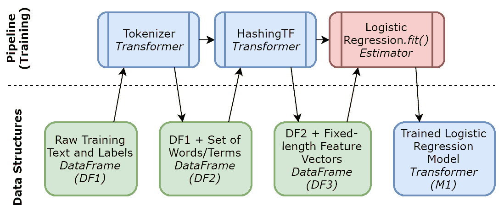

图 3.12：MLlib 训练管道

*图 3.13* 展示了一个用于测试模型的管道。在这个图中，类似于训练管道，使用标记化器特征 *转换器* 从原始测试文本中提取术语，然后应用 HashingTF *转换器* 将术语集转换为固定长度的特征向量。然而，由于我们已经在 *图 3.12* 中的训练管道中生成了一个训练好的模型，因此特征向量被作为输入传递到这个训练好的模型 *转换器* 中，以便进行预测并输出一个包含这些测试数据预测的新 DataFrame：

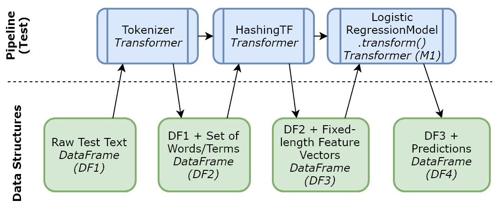

图 3.13：MLlib 测试管道

除了提供常见的机器学习算法和方法来提取、转换和选择模型特征以及其他管道抽象之外，`MLlib` 还公开了将训练好的模型和管道保存到底层文件系统的方法，这样在需要时可以稍后加载。`MLlib` 还提供了涵盖统计、线性代数和数据工程操作的实用方法。要了解更多关于 `MLlib` 的信息，请访问 [`spark.apache.org/docs/latest/ml-guide.html`](http://spark.apache.org/docs/latest/ml-guide.html)。

# 摘要

在本章中，我们定义了人工智能、机器学习和认知计算的含义。我们以高层次探讨了常见的机器学习算法，包括深度学习和人工神经网络，同时还简要介绍了 Apache Spark 的机器学习库`MLlib`以及如何将其用于在机器学习管道中实现这些算法。

在下一章中，我们将开始使用`PySpark`和`MLlib`开发、部署和测试应用于实际用例的监督式机器学习模型。
