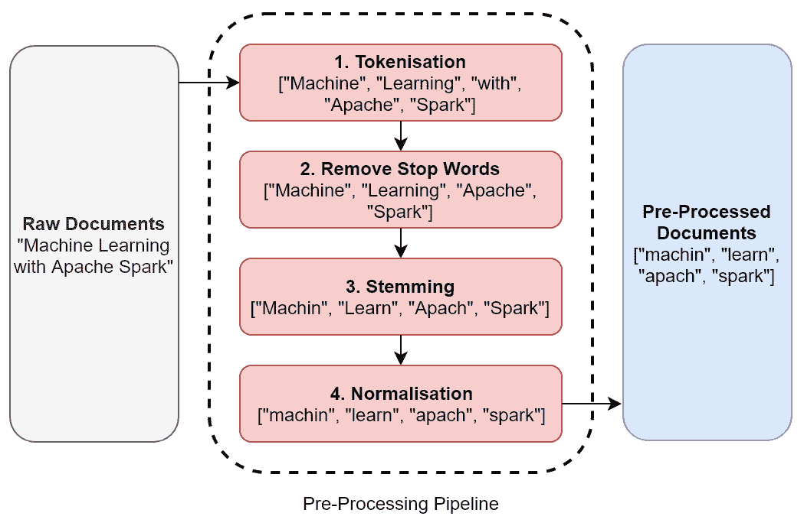
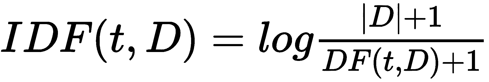
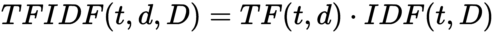
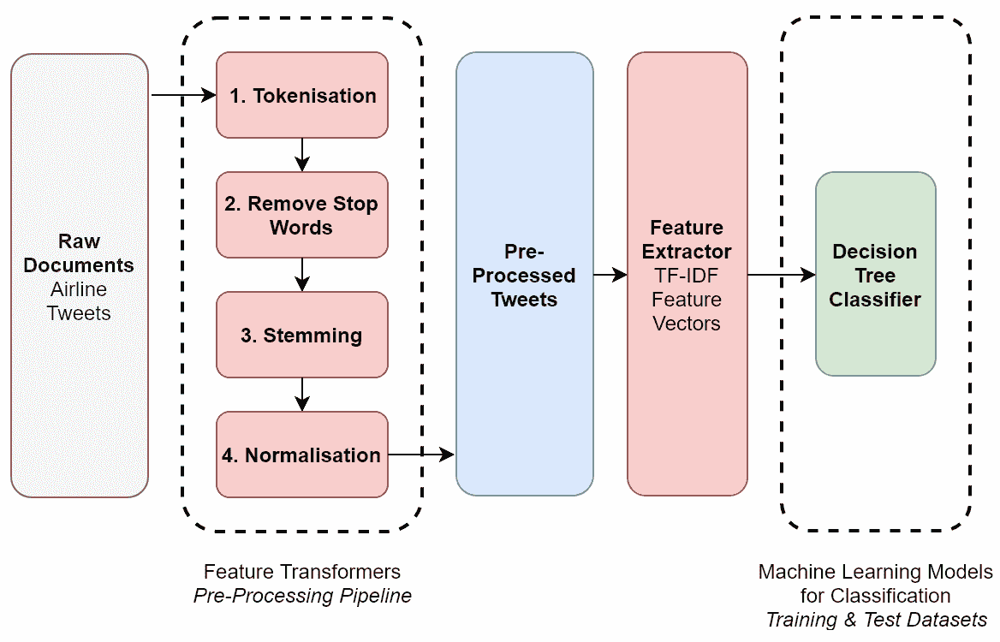

# 第六章：使用 Apache Spark 进行自然语言处理

在本章中，我们将研究和实现常用的自然语言处理（NLP）算法，这些算法可以帮助我们开发能够自动分析和理解人类文本和语音的机器。具体来说，我们将研究和实现以下几类与 NLP 相关的计算机科学算法：

+   特征转换器，包括以下内容：

    +   分词

    +   词干提取

    +   词形还原

    +   规范化

+   特征提取器，包括以下内容：

    +   词袋模型

    +   词频-逆文档频率

# 特征转换器

自然语言处理背后的基本概念是将人类文本和语音视为数据——就像我们在本书中迄今为止遇到的结构化和非结构化数值和分类数据源一样——同时保留其*上下文*。然而，自然语言是出了名的难以理解，即使是对于人类来说也是如此，更不用说机器了！自然语言不仅包括数百种不同的口语语言，具有不同的书写系统，而且还提出了其他挑战，如不同的语调、屈折、俚语、缩写、隐喻和讽刺。特别是书写系统和通信平台为我们提供了可能包含拼写错误、非传统语法和结构松散的句子的文本。

因此，我们的第一个挑战是将自然语言转换为机器可以使用的、同时保留其潜在上下文的数据。此外，当应用于机器学习时，我们还需要将自然语言转换为特征向量，以便训练机器学习模型。好吧，有两种广泛的计算机科学算法帮助我们应对这些挑战——**特征提取器**，它帮助我们从自然语言数据中提取相关特征，以及**特征转换器**，它帮助我们缩放、转换和/或修改这些特征，以便为后续建模做准备。在本小节中，我们将讨论特征转换器以及它们如何帮助我们将自然语言数据转换为更容易处理的结构。首先，让我们介绍一些 NLP 中的常见定义。

# 文档

在 NLP 中，文档代表文本的逻辑容器。容器本身可以是任何在您的用例上下文中有意义的东西。例如，一个文档可以指一篇单独的文章、记录、社交媒体帖子或推文。

# 语料库

一旦你定义了你的文档代表什么，语料库就被定义为一系列逻辑上的文档集合。使用之前的例子，语料库可以代表一系列文章（例如，一本杂志或博客）或一系列推文（例如，带有特定标签的推文）。

# 预处理管道

在自然语言处理中涉及的基本任务之一是尝试尽可能标准化来自不同来源的文档，以进行预处理。预处理不仅帮助我们标准化文本，通常还能减少原始文本的大小，从而降低后续过程和模型计算复杂度。以下小节描述了可能构成典型有序预处理管道的常见预处理技术。

# 分词

分词是指将文本分割成单个*标记*或术语的技术。正式来说，一个标记被定义为代表原始文本子集的字符序列。非正式来说，标记通常是组成原始文本的不同单词，并且这些单词是通过使用空白和其他标点符号进行分割的。例如，句子“使用 Apache Spark 的机器学习”可能产生一个以数组或列表形式持久化的标记集合，表示为`["Machine", "Learning", "with", "Apache", "Spark"]`。

# 停用词

停用词是在给定语言中常用的单词，用于结构化句子语法，但它们在确定其潜在意义或情感方面不一定有帮助。例如，在英语中，常见的停用词包括*and*、*I*、*there*、*this*和*with*。因此，一个常见的预处理技术是通过基于特定语言的停用词查找来过滤这些单词，从而从标记集合中移除它们。使用我们之前的例子，我们的过滤标记列表将是`["Machine", "Learning", "Apache", "Spark"]`。

# 词干提取

词干提取是指将单词还原到共同基础或*词干*的技术。例如，单词“connection”、“connections”、“connective”、“connected”和“connecting”都可以还原到它们的共同词干“connect”。词干提取不是一个完美的过程，词干提取算法可能会出错。然而，为了减少数据集的大小以训练机器学习模型，它是一种有价值的技巧。使用我们之前的例子，我们的过滤词干列表将是`["Machin", "Learn", "Apach", "Spark"]`。

# 词形还原

虽然词干提取可以快速将单词还原到基本形式，但它并没有考虑到上下文，因此不能区分在句子或上下文中位置不同而具有不同意义的单词。词形还原并不是简单地基于共同词干来还原单词，而是旨在仅移除屈折词尾，以便返回一个称为*词元*的单词的词典形式。例如，单词*am*、*is*、*being*和*was*可以被还原为词元*be*，而词干提取器则无法推断出这种上下文意义。

虽然词形还原可以在更大程度上保留上下文和意义，但它是以额外的计算复杂度和处理时间为代价的。因此，使用我们之前的例子，我们的过滤词元列表可能看起来像 `["Machine", "Learning", "Apache", "Spark"]`。

# 正规化

最后，正规化指的是一系列常用的技术，用于标准化文本。典型的正规化技术包括将所有文本转换为小写，删除选定的字符、标点符号和其他字符序列（通常使用正则表达式），以及通过应用特定于语言的常用缩写和俚语词典来扩展缩写。

*图 6.1* 展示了一个典型的有序预处理管道，该管道用于标准化原始书面文本：



图 6.1：典型的预处理管道

# 特征提取器

我们已经看到特征转换器如何通过预处理管道将我们的文档进行转换、修改和标准化，从而将原始文本转换为一系列标记。*特征提取器*将这些标记提取出来，并生成特征向量，这些向量可以用于训练机器学习模型。在 NLP 中使用的典型特征提取器的两个常见例子是**词袋模型**和**词频-逆文档频率**（**TF-IDF**）算法。

# 词袋模型

*词袋模型*方法简单地计算每个独特单词在原始或标记文本中出现的次数。例如，给定文本 "Machine Learning with Apache Spark, Apache Spark's MLlib and Apache Kafka"，词袋模型将为我们提供一个以下数值特征向量：

| Machine | Learning | with | Apache | Spark | MLlib | Kafka |
| --- | --- | --- | --- | --- | --- | --- |
| 1 | 1 | 1 | 3 | 2 | 1 | 1 |

注意，每个独特的单词都是一个特征或维度，而词袋模型方法是一种简单的技术，通常用作基准模型，以比较更高级特征提取器的性能。

# 词频-逆文档频率

**TF-IDF** 旨在通过提供每个词在整个语料库中出现的频率的**重要性**指标来改进词袋模型方法。

让我们用 *TF(t, d)* 来表示**词频**，即一个词 *t* 在文档 *d* 中出现的次数。我们还可以用 *DF(t, D)* 来表示**文档频率**，即包含该词 *t* 的文档数量，在我们的语料库 *D* 中。然后我们可以定义**逆文档频率** *IDF(t, D)* 如下：



IDF 为我们提供了一个衡量一个词重要性的度量，考虑到该词在整个语料库中出现的频率，其中*|D|*是我们语料库中文档的总数，*D*。在语料库中不那么常见的词具有更高的 IDF 度量。然而，请注意，由于使用了对数，如果一个词出现在所有文档中，其 IDF 变为 0——即*log(1)*。因此，IDF 提供了一个度量标准，更重视描述文档中重要但罕见的词。

最后，为了计算 TF–IDF 度量，我们只需将词频乘以逆文档频率，如下所示：



这意味着 TF–IDF 度量与一个词在文档中出现的次数成比例增加，同时抵消了该词在整个语料库中的频率。这一点很重要，因为仅凭词频可能突出显示像“a”、“I”和“the”这样的词，这些词在特定文档中非常常见，但并不能帮助我们确定文本的潜在含义或情感。通过使用 TF–IDF，我们可以减少这些类型词语对我们分析的影响。

# 案例研究 – 情感分析

现在我们将这些特征转换器和特征提取器应用于一个非常现代的真实世界用例——情感分析。在情感分析中，目标是分类潜在的文本情感——例如，作者对文本主题是积极、中立还是消极。对许多组织来说，情感分析是一项重要的技术，用于更好地了解他们的客户和目标市场。例如，零售商可以使用情感分析来衡量公众对特定产品的反应，或政治家可以评估公众对政策或新闻条目的情绪。在我们的案例研究中，我们将研究关于航空公司的推文，以预测客户是否对他们表示正面或负面的评论。我们的分析然后可以被航空公司用来通过关注那些被分类为负面情感的推文来改善他们的客户服务。

我们用于案例研究的推文语料库已从**Figure Eight**下载，这是一家为商业提供高质量真实世界机器学习训练数据集的公司。Figure Eight 还提供了一个“数据人人共享”平台，包含可供公众下载的开放数据集，网址为[`www.figure-eight.com/data-for-everyone/`](https://www.figure-eight.com/data-for-everyone/)。

如果你从本书附带的 GitHub 仓库或 Figure Eight 的 Data for Everyone 平台上的任何文本编辑器打开 `twitter-data/airline-tweets-labelled-corpus.csv`，你将找到一组 14,872 条关于主要航空公司的推文，这些推文是在 2015 年 2 月从 Twitter 上抓取的。这些推文也已经为我们预先标记，包括正面、负面或中性的情感分类。该数据集中的相关列在以下表中描述：

| **列名** | **数据类型** | **描述** |
| --- | --- | --- |
| `unit_id` | `Long` | 唯一标识符（主键） |
| `airline_sentiment` | `String` | 情感分类——正面、中性或负面 |
| `airline` | `String` | 航空公司名称 |
| `text` | `String` | 推文的文本内容 |

我们的目标将是使用这个推文语料库来训练一个机器学习模型，以预测关于特定航空公司的未来推文对该航空公司的情感是正面还是负面。

# NLP 流程

在我们查看案例研究的 Python 代码之前，让我们可视化我们将构建的端到端 NLP 流程。本案例研究的 NLP 流程如图 *6.2* 所示：



图 6.2：端到端 NLP 流程

# Apache Spark 中的 NLP

截至 Spark 2.3.2 版本，标记化（tokenization）和停用词去除（stop-word removal）功能转换器（以及其他众多功能），以及 TF–IDF 特征提取器在 `MLlib` 中原生支持。尽管在 Spark 2.3.2 中可以通过对 Spark 数据框上的转换（通过**用户定义函数**（**UDFs**）和应用于 RDDs 的映射函数）间接实现词干提取（stemming）、词形还原（lemmatization）和标准化，但我们将使用一个名为 `spark-nlp` 的第三方 Spark 库来执行这些特征转换。这个第三方库已被设计用来通过提供一个易于使用的 API 来扩展 `MLlib` 中已有的功能，以便在 Spark 数据框上进行大规模的分布式 NLP 标注。要了解更多关于 `spark-nlp` 的信息，请访问 [`nlp.johnsnowlabs.com/`](https://nlp.johnsnowlabs.com/)。最后，我们将使用 `MLlib` 中已经原生支持的估计器和转换器——正如我们在前面的章节中所见——来训练我们的最终机器学习分类模型。

注意，通过使用 `MLlib` 内置的特征转换器和提取器，然后使用第三方 `spark-nlp` 库提供的特征转换器，最后应用本地的 `MLlib` 估算器，我们将在我们的流程中需要显式定义和开发数据转换阶段，以符合两个不同库期望的底层数据结构。虽然这由于其低效性不推荐用于生产级流程，但本节的一个目的就是演示如何使用这两个库进行 NLP。读者将能够根据所讨论用例的要求选择合适的库。

根据您的环境设置，有几种方法可以用来安装 `spark-nlp`，具体描述见[`nlp.johnsnowlabs.com/quickstart.html`](https://nlp.johnsnowlabs.com/quickstart.html)。然而，根据我们在第二章中配置的本地开发环境* 设置本地开发环境*，我们将使用 `pip` 来安装 `spark-nlp`，这是 Anaconda 分发版中捆绑的另一个常用 Python 包管理器（截至写作时，`spark-nlp` 通过 `conda` 仓库不可用，因此我们将使用 `pip`）。要为我们的 Python 环境安装 `spark-nlp`，只需执行以下命令，这将安装 `spark-nlp` 的 1.7.0 版本（这是截至写作时的最新版本，并且与 Spark 2.x 兼容）：

```py
> pip install spark-nlp==1.7.0
```

然后，我们需要告诉 Spark 它可以在哪里找到 `spark-nlp` 库。我们可以通过在 `{SPARK_HOME}/conf/spark-defaults.conf` 中定义一个额外的参数，或者在实例化 Spark 上下文时在我们的代码中设置 `spark.jars` 配置来实现，如下所示：

```py
conf = SparkConf().set("spark.jars", '/opt/anaconda3/lib/python3.6/sitepackages/sparknlp/lib/sparknlp.jar')
   .setAppName("Natural Language Processing - Sentiment Analysis")
sc = SparkContext(conf=conf)
```

请参阅第二章，*设置本地开发环境*，以获取有关定义 Apache Spark 配置的更多详细信息。请注意，在多节点 Spark 集群中，所有第三方 Python 包要么需要在所有 Spark 节点上安装，要么您的 Spark 应用程序本身需要打包成一个包含所有第三方依赖项的自包含文件。然后，这个自包含文件将被分发到 Spark 集群的所有节点上。

我们现在已准备好在 Apache Spark 中开发我们的 NLP 流程，以便对航空推文语料库进行情感分析！让我们按以下步骤进行：

以下小节描述了对应于本用例的 Jupyter 笔记本中相关的每个单元格，该笔记本称为 `chp06-01-natural-language-processing.ipynb`。它可以在本书附带的 GitHub 仓库中找到。

1.  除了导入标准的 PySpark 依赖项之外，我们还需要导入相关的`spark-nlp`依赖项，包括其`Tokenizer`、`Stemmer`和`Normalizer`类，如下所示：

```py
import findspark
findspark.init()
from pyspark import SparkContext, SparkConf
from pyspark.sql import SQLContext
from pyspark.sql.functions import *
from pyspark.sql.types import StructType, StructField
from pyspark.sql.types import LongType, DoubleType, IntegerType, StringType, BooleanType
from pyspark.ml.feature import VectorAssembler
from pyspark.ml.feature import StringIndexer
from pyspark.ml.feature import Tokenizer
from pyspark.ml.feature import StopWordsRemover
from pyspark.ml.feature import HashingTF, IDF
from pyspark.ml import Pipeline, PipelineModel
from pyspark.ml.classification import DecisionTreeClassifier
from pyspark.ml.evaluation import BinaryClassificationEvaluator
from pyspark.mllib.evaluation import MulticlassMetrics

from sparknlp.base import *
from sparknlp.annotator import Tokenizer as NLPTokenizer
from sparknlp.annotator import Stemmer, Normalizer
```

1.  接下来，我们像往常一样实例化一个`SparkContext`。请注意，然而，在这种情况下，我们明确告诉 Spark 使用`spark-jars`配置参数在哪里找到`spark-nlp`库。然后，我们可以调用我们的`SparkContext`实例上的`getConf()`方法来查看当前的 Spark 配置，如下所示：

```py
conf = SparkConf().set("spark.jars", '/opt/anaconda3/lib/python3.6/site-packages/sparknlp/lib/sparknlp.jar')
   .setAppName("Natural Language Processing - Sentiment Analysis")
sc = SparkContext(conf=conf)
sqlContext = SQLContext(sc)
sc.getConf().getAll()
```

1.  在将我们的航空公司推文语料库从`twitter-data/airline-tweets-labelled-corpus.csv`加载到名为`airline_tweets_df`的 Spark 数据框之后，我们生成一个新的标签列。现有的数据集已经包含一个名为`airline_sentiment`的标签列，该列基于手动预分类，可以是`"positive"`、`"neutral"`或`"negative"`。尽管积极的信息自然是始终受欢迎的，但在现实中，最有用的信息通常是负面的。通过自动识别和研究负面信息，组织可以更有效地关注如何根据负面反馈改进他们的产品和服务。因此，我们将创建一个名为`negative_sentiment_label`的新标签列，如果基础情感被分类为`"negative"`则为`"true"`，否则为`"false"`，如下面的代码所示：

```py
airline_tweets_with_labels_df = airline_tweets_df
   .withColumn("negative_sentiment_label",
      when(col("airline_sentiment") == "negative", lit("true"))
      .otherwise(lit("false")))
   .select("unit_id", "text", "negative_sentiment_label")
```

1.  我们现在准备构建并应用我们的预处理管道到我们的原始推文语料库！在这里，我们展示了如何利用 Spark 的`MLlib`自带的特征转换器，即其`Tokenizer`和`StopWordsRemover`转换器。首先，我们使用`Tokenizer`转换器对每条推文的原始文本内容进行分词，从而得到一个包含解析后的标记列表的新列。然后，我们将包含标记的该列传递给`StopWordsRemover`转换器，该转换器从列表中移除英语语言（默认）的停用词，从而得到一个包含过滤后标记列表的新列。在下一单元格中，我们将展示如何利用`spark-nlp`第三方库中可用的特征转换器。然而，`spark-nlp`需要一个`string`类型的列作为其初始输入，而不是标记列表。因此，最终的语句将过滤后的标记列表重新连接成一个空格分隔的`string`列，如下所示：

```py
filtered_df = airline_tweets_with_labels_df
   .filter("text is not null")
tokenizer = Tokenizer(inputCol="text", outputCol="tokens_1")
tokenized_df = tokenizer.transform(filtered_df)
remover = StopWordsRemover(inputCol="tokens_1", 
   outputCol="filtered_tokens")
preprocessed_part_1_df = remover.transform(tokenized_df)
preprocessed_part_1_df = preprocessed_part_1_df
   .withColumn("concatenated_filtered_tokens",
      concat_ws(" ", col("filtered_tokens")))
```

1.  我们现在可以展示如何利用`spark-nlp`第三方库中可用的功能转换器和标注器，即其`DocumentAssember`转换器和`Tokenizer`、`Stemmer`、`Normalizer`标注器。首先，我们从字符串列创建标注文档，这些文档作为`spark-nlp`管道的初始输入。然后，我们应用`spark-nlp`的`Tokenizer`和`Stemmer`标注器，将我们的过滤令牌列表转换为词根列表。最后，我们应用其`Normalizer`标注器，该标注器默认将词根转换为小写。所有这些阶段都在一个*管道*中定义，正如我们在第四章中看到的，*使用 Apache Spark 进行监督学习*，这是一个有序的机器学习和数据转换步骤列表，在 Spark 数据帧上执行。

我们在我们的数据集上执行我们的管道，得到一个新的数据帧`preprocessed_df`，我们只保留后续分析和建模所需的相关列，即`unit_id`（唯一记录标识符）、`text`（推文的原始原始文本内容）、`negative_sentiment_label`（我们新的标签）和`normalised_stems`（作为预处理管道结果的一个过滤、词根化和归一化的`spark-nlp`数组），如下面的代码所示：

```py
document_assembler = DocumentAssembler()
   .setInputCol("concatenated_filtered_tokens")
tokenizer = NLPTokenizer()
   .setInputCols(["document"]).setOutputCol("tokens_2")
stemmer = Stemmer().setInputCols(["tokens_2"])
   .setOutputCol("stems")
normalizer = Normalizer()
   .setInputCols(["stems"]).setOutputCol("normalised_stems")
pipeline = Pipeline(stages=[document_assembler, tokenizer, stemmer,
   normalizer])
pipeline_model = pipeline.fit(preprocessed_part_1_df)
preprocessed_df = pipeline_model.transform(preprocessed_part_1_df)
preprocessed_df.select("unit_id", "text", 
   "negative_sentiment_label", "normalised_stems")
```

1.  在我们能够使用`MLlib`的本地特征提取器从我们的词根令牌数组创建特征向量之前，还有一个最后的预处理步骤。包含我们的词根令牌的列，即`normalised_stems`，将这些令牌持久化在专门的`spark-nlp`数组结构中。我们需要将这个`spark-nlp`数组转换回标准的令牌列表，以便我们可以应用`MLlib`的本地 TF-IDF 算法。我们通过首先分解`spark-nlp`数组结构来实现这一点，这会产生一个新数据帧观察结果，对应于数组中的每个元素。然后，我们在`unit_id`上对 Spark 数据帧进行分组，这是每个唯一推文的键，在将词根使用空格分隔符聚合到一个新的字符串列`tokens`之前。最后，我们应用`split`函数到这个列上，将聚合的字符串转换为字符串列表或令牌，如下面的代码所示：

```py
exploded_df = preprocessed_df
   .withColumn("stems", explode("normalised_stems"))
   .withColumn("stems", col("stems").getItem("result"))
   .select("unit_id", "negative_sentiment_label", "text", "stems")

aggregated_df = exploded_df.groupBy("unit_id")
   .agg(concat_ws(" ", collect_list(col("stems"))), 
      first("text"), first("negative_sentiment_label"))
   .toDF("unit_id", "tokens", "text", "negative_sentiment_label")
   .withColumn("tokens", split(col("tokens"), " ")
      .cast("array<string>"))
```

1.  我们现在准备好从我们的过滤、词干提取和归一化的标记列表中生成特征向量了！正如所讨论的，我们将使用 TF–IDF 特征提取器来生成特征向量，而不是基本的词袋方法。TF–IDF 特征提取器是`MLlib`的本地功能，分为两部分。首先，我们通过将我们的标记列表传递到`MLlib`的`HashingTF`转换器中来生成**词频**（**TF**）特征向量。然后，我们将`MLlib`的**逆文档频率**（**IDF**）估计器拟合到包含词频特征向量的数据框中，如下面的代码所示。结果是包含在名为`features`的列中的新的 Spark 数据框，其中包含我们的 TF–IDF 特征向量：

```py
hashingTF = HashingTF(inputCol="tokens", outputCol="raw_features",
   numFeatures=280)
features_df = hashingTF.transform(aggregated_df)
idf = IDF(inputCol="raw_features", outputCol="features")
idf_model = idf.fit(features_df)
scaled_features_df = idf_model.transform(features_df)
```

1.  正如我们在第四章，*使用 Apache Spark 进行监督学习*中所见，由于我们的标签列本质上是分类的，我们需要将其应用到`MLlib`的`StringIndexer`中，以便识别和索引所有可能的分类。结果是包含索引标签列的新 Spark 数据框，名为`"label"`，如果`negative_sentiment_label`为`true`，则其值为 0.0，如果`negative_sentiment_label`为`false`，则其值为 1.0，如下面的代码所示：

```py
indexer = StringIndexer(inputCol = "negative_sentiment_label", 
   outputCol = "label").fit(scaled_features_df)
scaled_features_indexed_label_df = indexer.transform(scaled_features_df)
```

1.  我们现在准备好创建训练和测试数据框，以便训练和评估后续的机器学习模型。我们像往常一样使用`randomSplit`方法（如下面的代码所示）来实现这一点，但在这个案例中，90%的所有观察结果将进入我们的训练数据框，剩下的 10%将进入我们的测试数据框：

```py
train_df, test_df = scaled_features_indexed_label_df
   .randomSplit([0.9, 0.1], seed=12345)
```

1.  在这个例子中，我们将训练一个监督决策树分类器（参见第四章，*使用 Apache Spark 进行监督学习*），以便帮助我们判断给定的推文是正面情绪还是负面情绪。正如第四章，*使用 Apache Spark 进行监督学习*中所述，我们将`MLlib`的`DecisionTreeClassifier`估计器拟合到我们的训练数据框中，以训练我们的分类树，如下面的代码所示：

```py
decision_tree = DecisionTreeClassifier(featuresCol = 'features',
   labelCol = 'label')
decision_tree_model = decision_tree.fit(train_df)
```

1.  现在我们已经训练好了一个分类树，我们可以将其应用到我们的测试数据框中，以便对测试推文进行分类。正如我们在第四章，*使用 Apache Spark 进行监督学习*中所做的那样，我们使用`transform()`方法（如下面的代码所示）将我们的训练好的分类树应用到测试数据框中，然后研究其预测的分类：

```py
test_decision_tree_predictions_df = decision_tree_model
   .transform(test_df)
print("TEST DATASET PREDICTIONS AGAINST ACTUAL LABEL: ")
test_decision_tree_predictions_df.select("prediction", "label",
   "text").show(10, False)
```

例如，我们的决策树分类器预测了以下来自我们的测试数据框的推文是负面情绪：

+   "我需要你...成为一个更好的航空公司。^LOL"

+   "如果不能保证家长会和孩子一起坐，就不要承诺卖票"

+   "解决了，我很烦等你们。我想退款，并想和某人谈谈这件事。"

+   "我本想回复你的网站，直到我看到那个真的很长的形式。在商业中，新座位很糟糕"

人类也可能将这些推文归类为负面情感！但更重要的是，航空公司可以使用这个模型以及它识别的推文来关注改进的领域。根据这个推文样本，这些领域可能包括网站可用性、票务营销以及处理退款所需的时间。

1.  最后，为了量化我们训练的分类树的准确性，让我们使用以下代码在测试数据上计算其混淆矩阵：

```py
predictions_and_label = test_decision_tree_predictions_df
   .select("prediction", "label").rdd
metrics = MulticlassMetrics(predictions_and_label)
print("N = %g" % test_decision_tree_predictions_df.count())
print(metrics.confusionMatrix())
```

得到的混淆矩阵如下所示：

|  | **预测 *y *= 0 (负面)** | **预测 *y* = 1 (非负)** |
| --- | --- | --- |
| **实际 *y* = 0****(负面)** | 725 | 209 |
| **实际 *y* = 1****(非负)** | 244 | 325 |

我们可以这样解释这个混淆矩阵——在总共 1,503 条测试推文中，我们的模型表现出以下特性：

+   正确地将 725 条实际上是情感负面的推文分类为负面情感

+   正确地将 325 条实际上是情感非负的推文分类为非负情感

+   错误地将 209 条实际上是负情感的推文分类为非负情感

+   错误地将 244 条实际上是情感非负的推文分类为负面情感

+   总体准确率 = 70%

+   总体错误率 = 30%

+   灵敏度 = 57%

+   特异性 = 78%

因此，基于默认的阈值值 0.5（在这个案例研究中是合适的，因为我们没有对哪种错误更好有偏好），我们的决策树分类器有 70%的整体准确率，这相当不错！

1.  为了完整性，让我们训练一个决策树分类器，但使用从词袋算法中导出的特征向量。请注意，当我们应用`HashingTF`转换器到我们的预处理语料库以计算词频（TF）特征向量时，我们已经计算了这些特征向量。因此，我们只需重复我们的机器学习流程，但仅基于`HashingTF`转换器的输出，如下所示：

```py
# Create Training and Test DataFrames based on the Bag of Words Feature Vectors
bow_indexer = StringIndexer(inputCol = "negative_sentiment_label",
   outputCol = "label").fit(features_df)
bow_features_indexed_label_df = bow_indexer.transform(features_df)
   .withColumnRenamed("raw_features", "features")
bow_train_df, bow_test_df = bow_features_indexed_label_df
   .randomSplit([0.9, 0.1], seed=12345)

# Train a Decision Tree Classifier using the Bag of Words Feature Vectors
bow_decision_tree = DecisionTreeClassifier(featuresCol = 
   'features', labelCol = 'label')
bow_decision_tree_model = bow_decision_tree.fit(bow_train_df)

# Apply the Bag of Words Decision Tree Classifier to the Test DataFrame and generate the Confusion Matrix
bow_test_decision_tree_predictions_df = bow_decision_tree_model
   .transform(bow_test_df)
bow_predictions_and_label = bow_test_decision_tree_predictions_df
   .select("prediction", "label").rdd
bow_metrics = MulticlassMetrics(bow_predictions_and_label)
print("N = %g" % bow_test_decision_tree_predictions_df.count())
print(bow_metrics.confusionMatrix())
```

注意，得到的混淆矩阵与我们使用`IDF`估计器在*缩放*特征向量上训练的决策树分类器时得到的混淆矩阵完全相同。这是因为我们的推文语料库相对较小，有 14,872 个文档，因此基于语料库中词频的缩放词频（TF）特征向量将对这个特定模型的预测质量产生微乎其微的影响。

1.  `MLlib` 提供的一个非常有用的功能是将训练好的机器学习模型保存到磁盘上以供以后使用。我们可以通过将训练好的决策树分类器保存到单节点开发环境的本地磁盘上，来利用这个功能。在多节点集群中，训练好的模型也可以简单地通过使用相关的文件系统前缀（例如 `hdfs://<HDFS NameNode URL>/<HDFS Path>`）保存到分布式文件系统，如 Apache Hadoop 分布式文件系统（参见第一章，*大数据生态系统*），如下面的代码所示：

```py
bow_decision_tree_model.save('<Target filesystem path to save MLlib Model>')
```

我们用于对航空公司推文进行情感分析的训练好的决策树分类器也已推送到本书配套的 GitHub 仓库中，可以在 `chapter06/models/airline-sentiment-analysis-decision-tree-classifier` 中找到。

# 摘要

在本章中，我们研究了、实现了并评估了在自然语言处理中常用的算法。我们使用特征转换器对文档语料库进行了预处理，并使用特征提取器从处理后的语料库中生成了特征向量。我们还将这些常见的 NLP 算法应用于机器学习。我们训练并测试了一个情感分析模型，该模型用于预测推文的潜在情感，以便组织可以改进其产品和服务的提供。在第八章，*使用 Apache Spark 的实时机器学习*中，我们将扩展我们的情感分析模型，使其能够使用 Spark Streaming 和 Apache Kafka 在实时环境中运行。

在下一章中，我们将亲身体验探索令人兴奋且前沿的深度学习世界！
