# 第七章：使用 Apache Spark 进行深度学习

在本章中，我们将亲身体验深度学习这个激动人心且前沿的世界！我们将结合使用第三方深度学习库和 Apache Spark 的`MLlib`来执行精确的光学字符识别（**OCR**），并通过以下类型的人工神经网络和机器学习算法自动识别和分类图像：

+   多层感知器

+   卷积神经网络

+   迁移学习

# 人工神经网络

如我们在第三章《人工智能与机器学习》中所研究的，**人工神经网络**（**ANN**）是一组连接的人工神经元，它们被聚合为三种类型的链接神经网络层——输入层、零个或多个隐藏层和输出层。**单层**ANN 仅由输入节点和输出节点之间的*一个*层链接组成，而**多层**ANN 的特点是人工神经元分布在多个链接层中。

信号仅沿一个方向传播的人工神经网络——也就是说，信号被输入层接收并转发到下一层进行处理——被称为**前馈**网络。信号可能被传播回已经处理过该信号的输入神经元或神经层的 ANN 被称为**反馈**网络。

**反向传播**是一种监督学习过程，通过这个过程多层 ANN 可以学习——也就是说，推导出一个最优的权重系数集。首先，所有权重都最初设置为随机，然后计算网络的输出。如果预测输出与期望输出不匹配，则输出节点的总误差会通过整个网络反向传播，以尝试重新调整网络中的所有权重，以便在输出层减少误差。换句话说，反向传播通过迭代权重调整过程来最小化实际输出和期望输出之间的差异。

# 多层感知器

**单层感知器**（**SLP**）是一种基本的人工神经网络（ANN），它仅由两层节点组成——一个包含输入节点的输入层和一个包含输出节点的输出层。然而，**多层感知器**（**MLP**）在输入层和输出层之间引入了一个或多个隐藏层，这使得它们能够学习非线性函数，如图 7.1 所示：

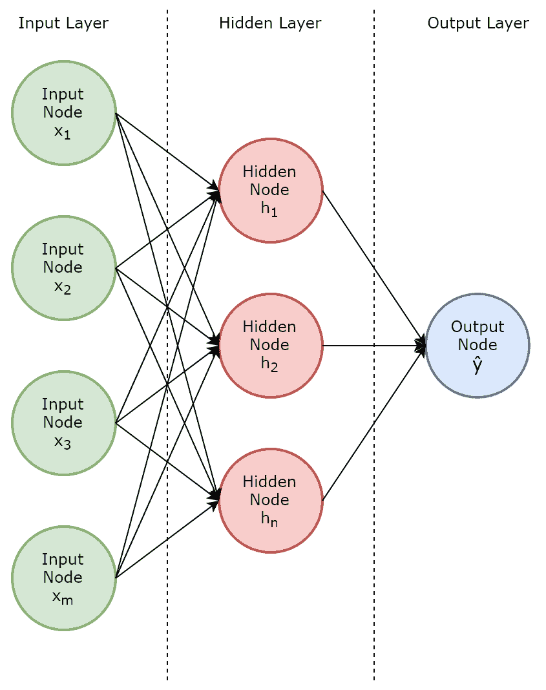

图 7.1：多层感知器神经网络架构

# MLP 分类器

Apache Spark 的机器学习库`MLlib`提供了一个现成的**多层感知器分类器**（**MLPC**），可以应用于需要从*k*个可能的类别中进行预测的分类问题。

# 输入层

在`MLlib`的 MLPC 中，输入层的节点代表输入数据。让我们将这个输入数据表示为一个具有*m*个特征的向量，*X*，如下所示：

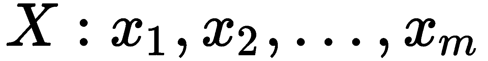

# 隐藏层

然后将输入数据传递到隐藏层。为了简化，让我们假设我们只有一个隐藏层*h¹*，并且在这个隐藏层中，我们有*n*个神经元，如下所示：

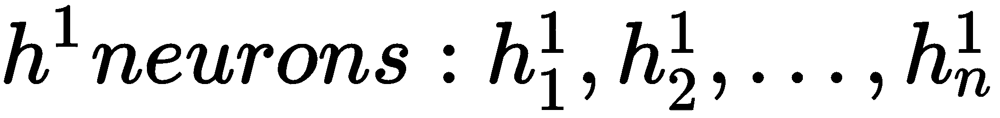

对于这些隐藏神经元中的每一个，激活函数的净输入*z*是输入数据集向量*X*乘以一个权重集向量*W*^n（对应于分配给隐藏层中*n*个神经元的权重集），其中每个权重集向量*W*^n 包含*m*个权重（对应于我们输入数据集向量*X*中的*m*个特征），如下所示：

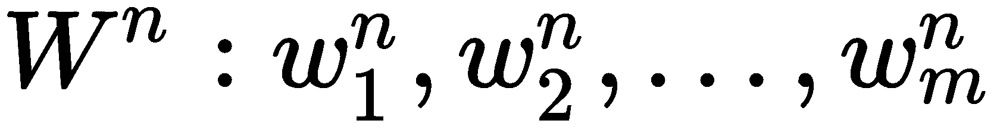

在线性代数中，将一个向量乘以另一个向量的乘积称为**点积**，它输出一个由*z*表示的标量（即一个数字），如下所示：

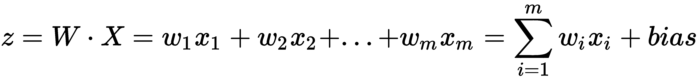

**偏差**，如第三章《人工智能与机器学习》中所示，并在*图 3.5*中展示，是一个独立的常数，类似于回归模型中的截距项，并且可以添加到前馈神经网络的非输出层。它被称为独立，因为偏差节点没有连接到前面的层。通过引入一个常数，我们可以允许激活函数的输出向左或向右移动该常数，从而增加人工神经网络学习模式的有效性，提供基于数据移动决策边界的功能。

注意，在一个包含*n*个隐藏神经元的单隐藏层中，将计算*n*个点积运算，如图*图 7.2*所示：

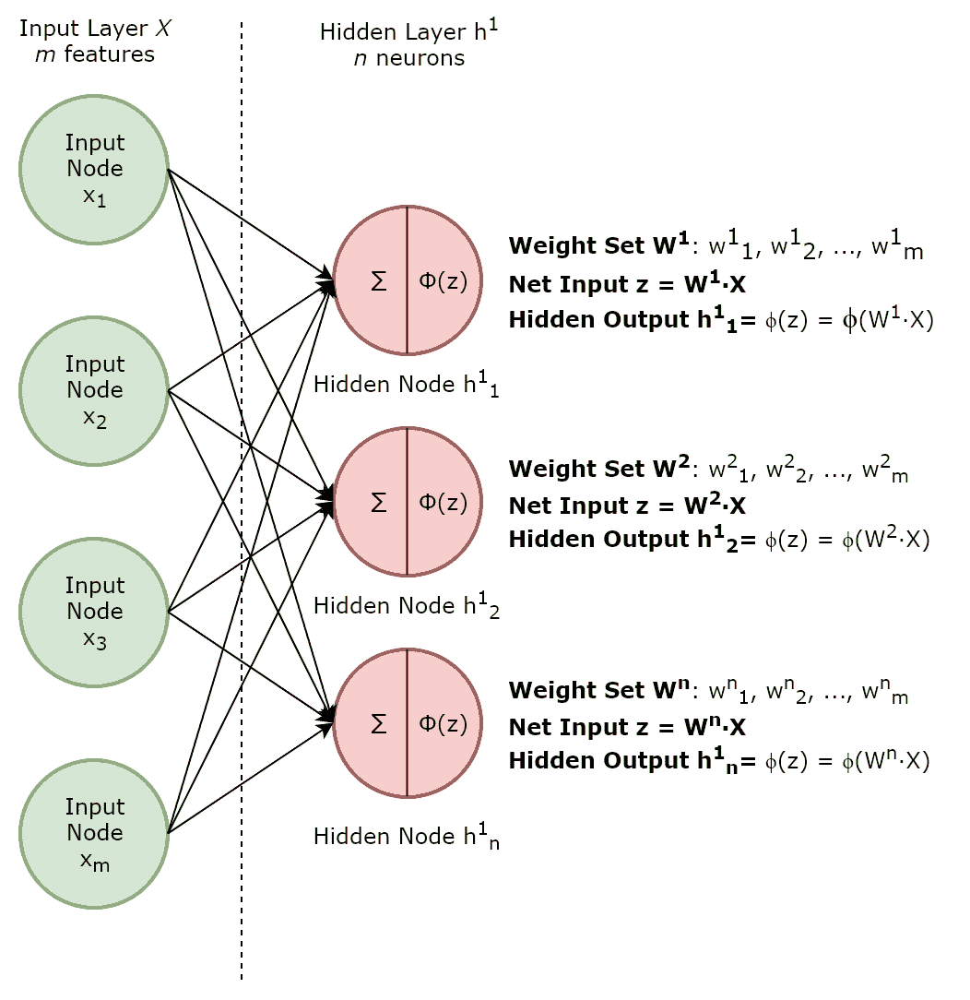

图 7.2：隐藏层净输入和输出

在`MLlib`的 MLPC 中，隐藏神经元使用**sigmoid**激活函数，如下公式所示：

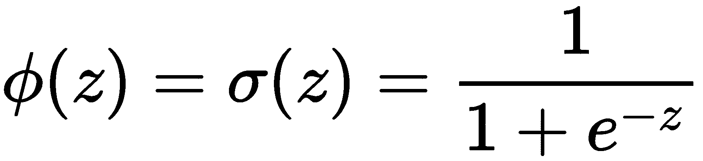

正如我们在第三章《人工智能与机器学习》中看到的，Sigmoid（或逻辑）函数在 0 和 1 之间有界，并且对所有实数输入值都有平滑的定义。通过使用 sigmoid 激活函数，隐藏层中的节点实际上对应于一个逻辑回归模型。如果我们研究 sigmoid 曲线，如图*图 7.3*所示，我们可以声明，如果净输入*z*是一个大的正数，那么 sigmoid 函数的输出，以及我们隐藏神经元的激活函数，将接近 1。相反，如果净输入 z 是一个具有大绝对值的负数，那么 sigmoid 函数的输出将接近 0：

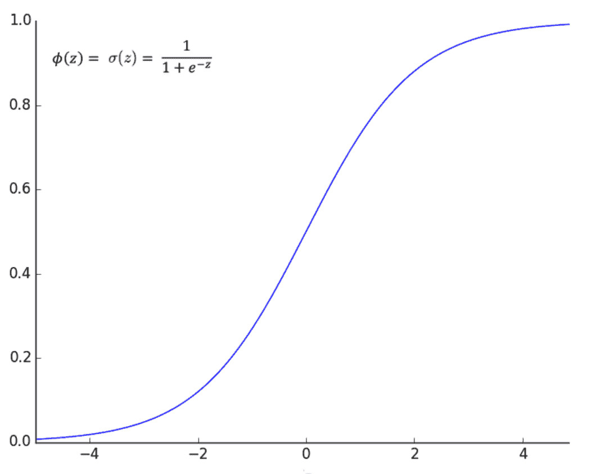

图 7.3：sigmoid 函数

在所有情况下，每个隐藏神经元都会接收净输入，即*z*，它是输入数据*X*和权重集*W^n*的点积，再加上一个偏置，并将其应用于 sigmoid 函数，最终输出一个介于 0 和 1 之间的数字。在所有隐藏神经元计算了它们的激活函数的结果之后，我们就会从隐藏层*h¹*中得到*n*个隐藏输出，如下所示：

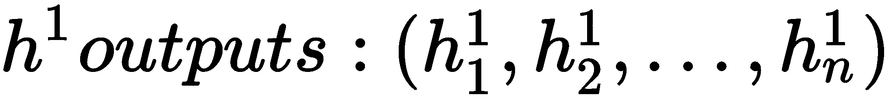

# 输出层

隐藏层的输出随后被用作输入，以计算输出层的最终输出。在我们的例子中，我们只有一个隐藏层，即*h¹*，其输出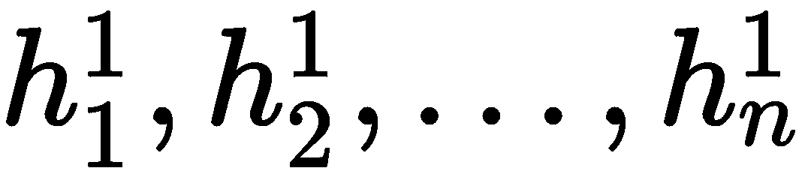。这些输出随后成为输出层的*n*个输入。

输出层神经元的激活函数的净输入是隐藏层计算出的这些*n*个输入，乘以一个权重集向量，即*W^h*，其中每个权重集向量*W^h*包含*n*个权重（对应于*n*个隐藏层输入）。为了简化，让我们假设我们输出层只有一个输出神经元。因此，这个神经元的权重集向量如下所示：

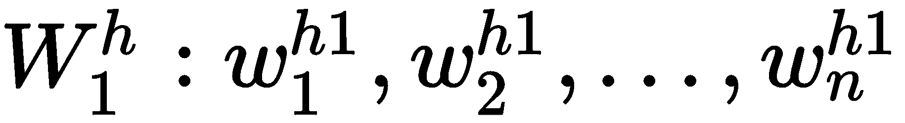

再次强调，由于我们是在乘以向量，我们使用点积计算，这将计算以下表示我们的净输入*z*的标量：

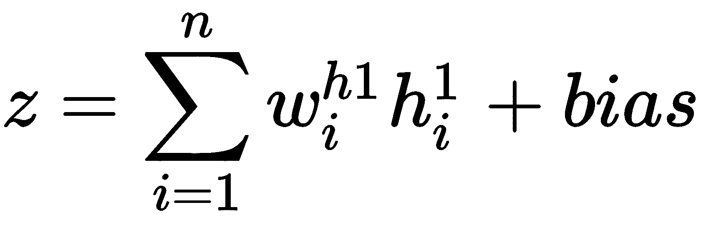

在`MLlib`的 MLPC 中，输出神经元使用 softmax 函数作为激活函数，它通过预测*k*个类别而不是标准的二分类来扩展逻辑回归。此函数具有以下形式：

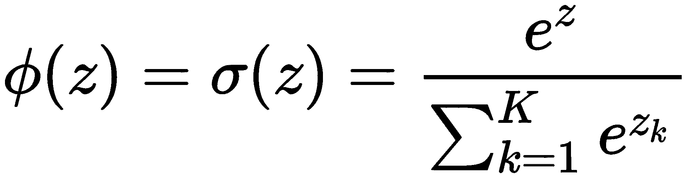

因此，输出层的节点数对应于你希望预测的可能类别数。例如，如果你的用例有五个可能的类别，那么你将训练一个输出层有五个节点的 MLP。因此，激活函数的最终输出是相关输出神经元所做的预测，如图*7.4*所示：

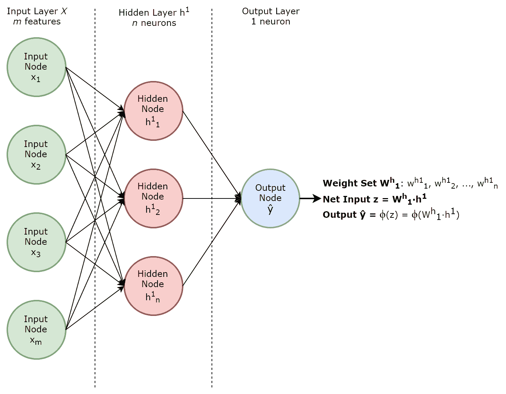

图 7.4：输出层净输入和输出

注意，*图 7.4* 说明了 MLP 的初始**正向传播**，其中输入数据传播到隐藏层，隐藏层的输出传播到输出层，在那里计算最终输出。MLlib 的 MLPC 随后使用**反向传播**来训练神经网络并学习模型，通过迭代权重调整过程最小化实际输出和期望输出之间的差异。MLPC 通过寻求最小化**损失函数**来实现这一点。损失函数计算了关于分类问题的不准确预测所付出的代价的度量。MLPC 使用的特定损失函数是**逻辑损失函数**，其中具有高置信度预测的惩罚较小。要了解更多关于损失函数的信息，请访问[`en.wikipedia.org/wiki/Loss_functions_for_classification`](https://en.wikipedia.org/wiki/Loss_functions_for_classification)。

# 案例研究 1 – OCR

证明 MLP 强大功能的一个很好的实际案例是 OCR。在 OCR 中，挑战是识别人类书写，将每个手写符号分类为字母。在英文字母的情况下，有 26 个字母。因此，当应用于英语时，OCR 实际上是一个具有*k*=26 个可能类别的分类问题！

我们将要使用的这个数据集是从加州大学（**加州大学**）的机器学习仓库中提取的，该仓库位于[`archive.ics.uci.edu/ml/index.php`](https://archive.ics.uci.edu/ml/index.php)。我们将使用的特定字母识别数据集，可以从本书附带的 GitHub 仓库以及[`archive.ics.uci.edu/ml/datasets/letter+recognition`](https://archive.ics.uci.edu/ml/datasets/letter+recognition)获取，由 Odesta 公司的 David J. Slate 创建；地址为 1890 Maple Ave；Suite 115；Evanston, IL 60201，并在 P. W. Frey 和 D. J. Slate 合著的论文《使用荷兰风格自适应分类器的字母识别》（来自《机器学习》第 6 卷第 2 期，1991 年 3 月）中使用。

*图 7.5* 展示了该数据集的视觉示例。我们将训练一个 MLP 分类器来识别和分类每个符号，例如*图 7.5*中所示，将其识别为英文字母：

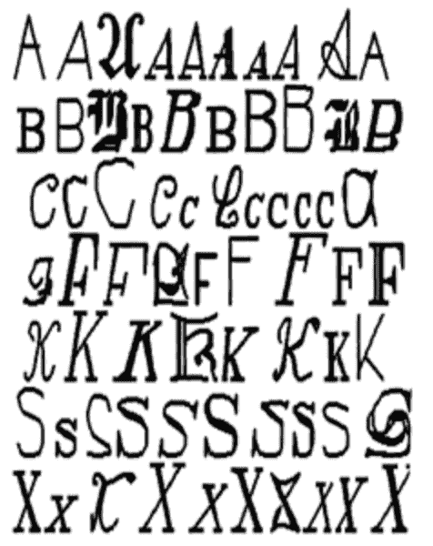

图 7.5：字母识别数据集

# 输入数据

在我们进一步探讨我们特定数据集的架构之前，让我们首先了解 MLP 如何真正帮助我们解决这个问题。首先，正如我们在第五章中看到的，“使用 Apache Spark 进行无监督学习”，在研究图像分割时，图像可以被分解为像素强度值（用于灰度图像）或像素 RGB 值（用于彩色图像）的矩阵。然后可以生成一个包含(*m* x *n*)数值元素的单一向量，对应于图像的像素高度(*m*)和宽度(*n*)。

# 训练架构

现在，想象一下，我们想要使用我们的整个字母识别数据集来训练一个 MLP，如图*图 7.6*所示：

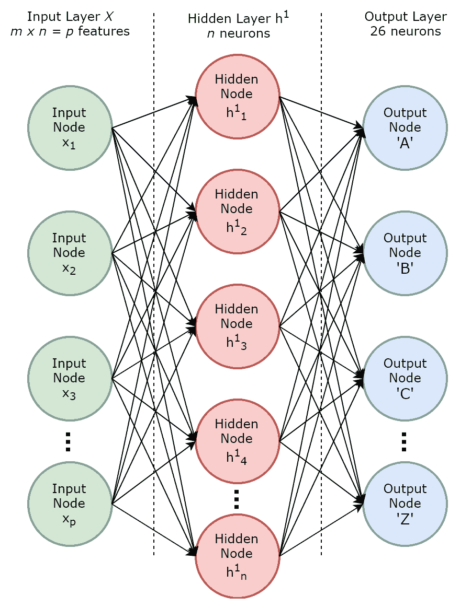

图 7.6：用于字母识别的多层感知器

在我们的 MLP 中，输入层有*p*（= *m* x *n*）个神经元，它们代表图像中的*p*个像素强度值。一个单一的隐藏层有*n*个神经元，输出层有 26 个神经元，代表英语字母表中的 26 个可能的类别或字母。在训练这个神经网络时，由于我们最初不知道应该分配给每一层的权重，我们随机初始化权重并执行第一次前向传播。然后我们迭代地使用反向传播来训练神经网络，从而得到一组经过优化的权重，使得输出层做出的预测/分类尽可能准确。

# 隐藏层中的模式检测

隐藏层中神经元的任务是学习在输入数据中检测模式。在我们的例子中，隐藏层中的神经元将检测构成更广泛符号的某些子结构。这如图*图 7.7*所示，我们假设隐藏层中的前三个神经元分别学会了识别正斜杠、反斜杠和水平线类型的模式：


图 7.7：隐藏层中的神经元检测模式和子结构

# 输出层的分类

在我们的神经网络中，输出层中的第一个神经元被训练来决定给定的符号是否是大写英文字母**A**。假设隐藏层中的前三个神经元被激活，我们预计输出层中的第一个神经元将被激活，而剩下的 25 个神经元不会被激活。这样，我们的 MLP 就会将这个符号分类为字母**A**！

注意，我们的训练架构仅使用单个隐藏层，这只能学习非常简单的模式。通过添加更多隐藏层，人工神经网络可以学习更复杂的模式，但这会以计算复杂性、资源和训练运行时间的增加为代价。然而，随着分布式存储和处理技术的出现，正如在第一章“大数据生态系统”中讨论的，其中大量数据可以存储在内存中，并且可以在分布式方式下对数据进行大量计算，今天我们能够训练具有大量隐藏层和隐藏神经元的极其复杂的神经网络。这种复杂的神经网络目前正在应用于广泛的领域，包括人脸识别、语音识别、实时威胁检测、基于图像的搜索、欺诈检测和医疗保健的进步。

# Apache Spark 中的 MLP

让我们回到我们的数据集，并在 Apache Spark 中训练一个 MLP 来识别和分类英文字母。如果你在任何文本编辑器中打开 `ocr-data/letter-recognition.data`，无论是来自本书配套的 GitHub 仓库还是来自 UCI 的机器学习仓库，你将找到 20,000 行数据，这些数据由以下模式描述：

| **列名** | **数据类型** | **描述** |
| --- | --- | --- |
| `lettr` | `字符串` | 英文字母（26 个值之一，从 A 到 Z） |
| `x-box` | `整数` | 矩形水平位置 |
| `y-box` | `整数` | 矩形垂直位置 |
| `width` | `整数` | 矩形宽度 |
| `high` | `整数` | 矩形高度 |
| `onpix` | `整数` | 颜色像素总数 |
| `x-bar` | `整数` | 矩形内颜色像素的 x 均值 |
| `y-bar` | `整数` | 矩形内颜色像素的 y 均值 |
| `x2bar` | `整数` | x 的方差平均值 |
| `y2bar` | `整数` | y 的方差平均值 |
| `xybar` | `整数` | x 和 y 的相关平均值 |
| `x2ybr` | `整数` | x 和 y 的平均值 |
| `xy2br` | `整数` | x 和 y 的平方平均值 |
| `x-ege` | `整数` | 从左到右的平均边缘计数 |
| `xegvy` | `整数` | `x-ege` 与 y 的相关性 |
| `y-ege` | `整数` | 从下到上的平均边缘计数 |
| `yegvx` | `整数` | `y-ege` 与 x 的相关性 |

此数据集描述了 16 个数值属性，这些属性基于扫描字符图像的像素分布的统计特征，如 *图 7.5* 中所示。这些属性已经标准化并线性缩放到 0 到 15 的整数范围内。对于每一行，一个名为 `lettr` 的标签列表示它所代表的英文字母，其中没有特征向量映射到多个类别——也就是说，每个特征向量只映射到英文字母表中的一个字母。

你会注意到我们没有使用原始图像本身的像素数据，而是使用从像素分布中得到的统计特征。然而，当我们从第五章，“使用 Apache Spark 进行无监督学习”中学习到的知识时，我们特别关注将图像转换为数值特征向量时，我们将在下一刻看到的相同步骤可以遵循来使用原始图像本身训练 MLP 分类器。

让我们现在使用这个数据集来训练一个 MLP 分类器以识别符号并将它们分类为英文字母表中的字母：

以下小节描述了对应于本用例的 Jupyter 笔记本中每个相关的单元格，该笔记本称为`chp07-01-multilayer-perceptron-classifier.ipynb`。这个笔记本可以在本书附带的 GitHub 仓库中找到。

1.  首先，我们像往常一样导入必要的 PySpark 库，包括`MLlib`的`MultilayerPerceptronClassifier`分类器和`MulticlassClassificationEvaluator`评估器，如下面的代码所示：

```py
import findspark
findspark.init()
from pyspark import SparkContext, SparkConf
from pyspark.sql import SQLContext
from pyspark.ml.feature import VectorAssembler
from pyspark.ml.classification import MultilayerPerceptronClassifier
from pyspark.ml.evaluation import MulticlassClassificationEvaluator
```

1.  在实例化 Spark 上下文之后，我们现在准备好将我们的数据集导入 Spark 数据框中。请注意，在我们的情况下，我们已经将数据集预处理为 CSV 格式，其中我们将`lettr`列从`string`数据类型转换为表示英文字母表中 26 个字符之一的`numeric`数据类型。这个预处理好的 CSV 文件可以在本书附带的 GitHub 仓库中找到。一旦我们将这个 CSV 文件导入 Spark 数据框中，我们就使用`VectorAssembler`生成特征向量，包含 16 个特征列，就像通常那样。因此，生成的 Spark 数据框，称为`vectorised_df`，包含两个列——表示英文字母表中 26 个字符之一的数值`label`列，以及包含我们的特征向量的`features`列：

```py
letter_recognition_df = sqlContext.read
   .format('com.databricks.spark.csv')
   .options(header = 'true', inferschema = 'true')
   .load('letter-recognition.csv')
feature_columns = ['x-box','y-box','width','high','onpix','x-bar',
   'y-bar','x2bar','y2bar','xybar','x2ybr','xy2br','x-ege','xegvy',
   'y-ege','yegvx']
vector_assembler = VectorAssembler(inputCols = feature_columns,
   outputCol = 'features')
vectorised_df = vector_assembler.transform(letter_recognition_df)
   .withColumnRenamed('lettr', 'label').select('label', 'features')
```

1.  接下来，我们使用以下代码以 75%到 25%的比例将我们的数据集分为训练集和测试集：

```py
train_df, test_df = vectorised_df
   .randomSplit([0.75, 0.25], seed=12345)
```

1.  现在，我们已经准备好训练我们的 MLP 分类器。首先，我们必须定义我们神经网络各自层的尺寸。我们通过定义一个包含以下元素的 Python 列表来完成此操作：

    +   第一个元素定义了输入层的尺寸。在我们的情况下，我们的数据集中有 16 个特征，因此我们将此元素设置为`16`。

    +   下一个元素定义了中间隐藏层的尺寸。我们将定义两个隐藏层，分别大小为`8`和`4`。

    +   最后一个元素定义了输出层的尺寸。在我们的情况下，我们有 26 个可能的类别，代表英文字母表中的 26 个字母，因此我们将此元素设置为`26`：

```py
layers = [16, 8, 4, 26]
```

1.  现在我们已经定义了我们的神经网络架构，我们可以使用`MLlib`的`MultilayerPerceptronClassifier`分类器来训练一个 MLP，并将其拟合到训练数据集上，如下面的代码所示。记住，`MLlib`的`MultilayerPerceptronClassifier`分类器为隐藏神经元使用 sigmoid 激活函数，为输出神经元使用 softmax 激活函数：

```py
multilayer_perceptron_classifier = MultilayerPerceptronClassifier(
   maxIter = 100, layers = layers, blockSize = 128, seed = 1234)
multilayer_perceptron_classifier_model = 
   multilayer_perceptron_classifier.fit(train_df)
```

1.  我们现在可以将我们的训练好的 MLP 分类器应用到测试数据集上，以预测 16 个与像素相关的数值特征代表英语字母表中的 26 个字母中的哪一个，如下所示：

```py
test_predictions_df = multilayer_perceptron_classifier_model
   .transform(test_df)
print("TEST DATASET PREDICTIONS AGAINST ACTUAL LABEL: ")
test_predictions_df.select("label", "features", "probability",
   "prediction").show()

TEST DATASET PREDICTIONS AGAINST ACTUAL LABEL: 
+-----+--------------------+--------------------+----------+
|label| features| probability|prediction|
+-----+--------------------+--------------------+----------+
| 0|[1.0,0.0,2.0,0.0,...|[0.62605849526384...| 0.0|
| 0|[1.0,0.0,2.0,0.0,...|[0.62875656935176...| 0.0|
| 0|[1.0,0.0,2.0,0.0,...|[0.62875656935176...| 0.0|
+-----+--------------------+--------------------+----------+
```

1.  接下来，我们使用以下代码计算我们训练好的 MLP 分类器在测试数据集上的准确性。在我们的案例中，它的表现非常糟糕，准确率仅为 34%。我们可以得出结论，在我们的数据集中，具有大小分别为 8 和 4 的两个隐藏层的 MLP 在识别和分类扫描图像中的字母方面表现非常糟糕：

```py
prediction_and_labels = test_predictions_df
   .select("prediction", "label")
accuracy_evaluator = MulticlassClassificationEvaluator(
   metricName = "accuracy")
precision_evaluator = MulticlassClassificationEvaluator(
   metricName = "weightedPrecision")
recall_evaluator = MulticlassClassificationEvaluator(
   metricName = "weightedRecall")
print("Accuracy on Test Dataset = %g" % accuracy_evaluator
   .evaluate(prediction_and_labels))
print("Precision on Test Dataset = %g" % precision_evaluator
   .evaluate(prediction_and_labels))
print("Recall on Test Dataset = %g" % recall_evaluator
   .evaluate(prediction_and_labels))

Accuracy on Test Dataset = 0.339641
Precision on Test Dataset = 0.313333
Recall on Test Dataset = 0.339641
```

1.  我们如何提高我们神经网络分类器的准确性？为了回答这个问题，我们必须重新审视我们对隐藏层功能的定义。记住，隐藏层中神经元的任务是学习在输入数据中检测模式。因此，在我们的神经网络架构中定义更多的隐藏神经元应该会增加我们的神经网络检测更多模式并具有更高分辨率的能力。为了测试这个假设，我们将我们两个隐藏层中的神经元数量分别增加到 16 和 12，如下面的代码所示。然后，我们重新训练我们的 MLP 分类器并将其重新应用到测试数据集上。这导致了一个性能远更好的模型，准确率达到 72%：

```py
new_layers = [16, 16, 12, 26]
new_multilayer_perceptron_classifier = 
   MultilayerPerceptronClassifier(maxIter = 400, 
      layers = new_layers, blockSize = 128, seed = 1234)
new_multilayer_perceptron_classifier_model = 
   new_multilayer_perceptron_classifier.fit(train_df)
new_test_predictions_df = 
   new_multilayer_perceptron_classifier_model.transform(test_df)
print("New Accuracy on Test Dataset = %g" % accuracy_evaluator
   .evaluate(new_test_predictions_df
   .select("prediction", "label")))
```

# 卷积神经网络

我们已经看到，MLPs 可以通过一个或多个中间隐藏层对单个输入向量进行转换来识别和分类小图像，如 OCR 中的字母和数字。然而，MLP 的一个局限性是它们在处理较大图像时的扩展能力，这不仅要考虑单个像素强度或 RGB 值，还要考虑图像本身的高度、宽度和深度。

**卷积神经网络**（**CNNs**）假设输入数据具有网格状拓扑结构，因此它们主要用于识别和分类图像中的对象，因为图像可以被表示为像素的网格。

# 端到端神经网络架构

卷积神经网络的端到端架构如图*7.8*所示：

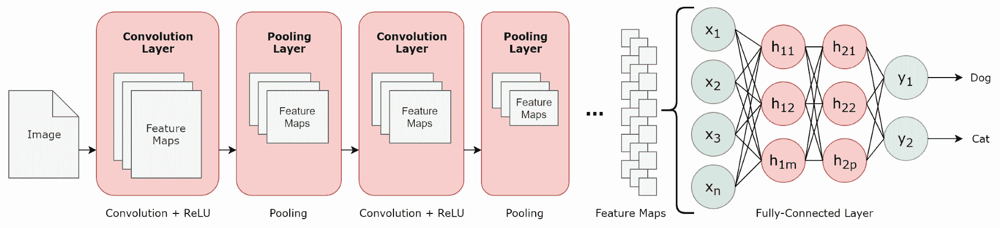

图 7.8：卷积神经网络架构

在以下小节中，我们将描述构成卷积神经网络（CNN）的每一层和变换。

# 输入层

由于卷积神经网络（CNN）主要用于图像分类，因此输入 CNN 的数据是具有维度*h*（像素高度）、*w*（像素宽度）和*d*（深度）的图像矩阵。在 RGB 图像的情况下，深度将是三个相应的颜色通道，即**红色**、**绿色**和**蓝色**（**RGB**）。这如图 7.9 所示：

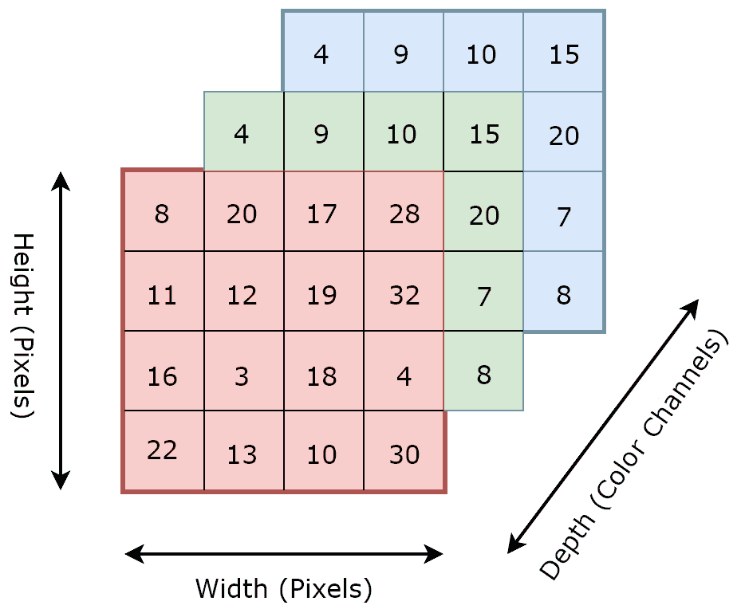

图 7.9：图像矩阵维度

# 卷积层

CNN 中接下来发生的转换是在*卷积*层中处理的。卷积层的目的是在图像中检测特征，这是通过使用**滤波器**（也称为核）实现的。想象一下拿一个放大镜观察一个图像，从图像的左上角开始。当我们从左到右和从上到下移动放大镜时，我们检测到放大镜移动过的每个位置的不同特征。在高层上，这就是卷积层的工作，其中放大镜代表滤波器或核，滤波器每次移动的步长大小，通常是像素级，被称为**步长**大小。卷积层的输出称为**特征图**。

让我们通过一个例子来更好地理解卷积层中进行的处理过程。想象一下，我们有一个 3 像素（高度）乘以 3 像素（宽度）的图像。为了简化，我们将在例子中忽略代表图像深度的第三维度，但请注意，现实世界的卷积对于 RGB 图像是在三个维度上计算的。接下来，想象一下我们的滤波器是一个 2 像素（高度）乘以 2 像素（宽度）的矩阵，并且我们的步长大小是 1 像素。

这些相应的矩阵在*图 7.10*中展示：

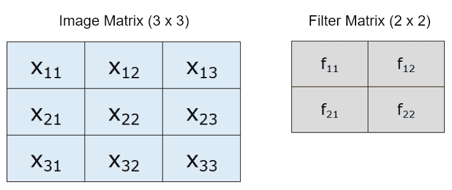

图 7.10：图像矩阵和滤波器矩阵

首先，我们将我们的滤波器矩阵放置在图像矩阵的左上角，并在该位置进行两个矩阵的**矩阵乘法**。然后，我们将滤波器矩阵向右移动我们的步长大小——1 个像素，并在该位置进行矩阵乘法。我们继续这个过程，直到滤波器矩阵穿越整个图像矩阵。结果的特征图矩阵在*图 7.11*中展示：

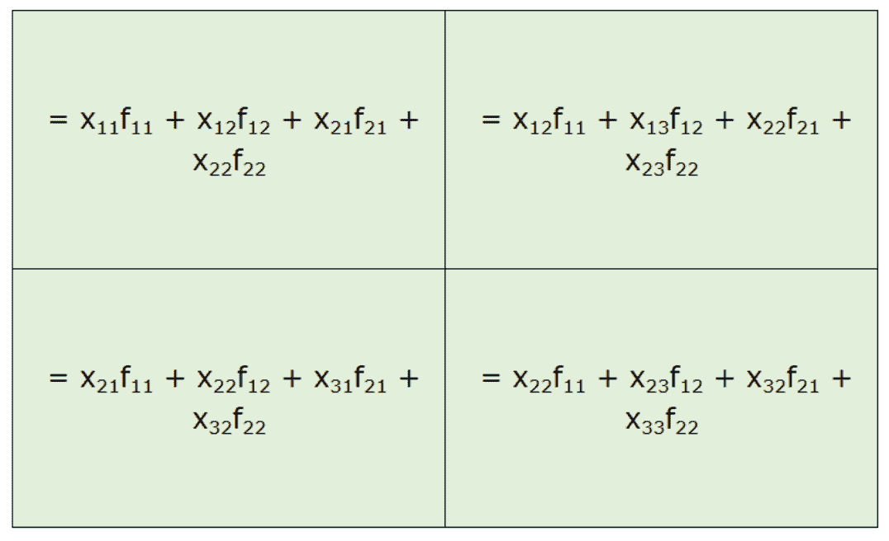

图 7.11：特征图

注意，特征图的维度比卷积层的输入矩阵小。为了确保输出维度与输入维度匹配，通过一个称为**填充**的过程添加了一个零值像素层。此外，滤波器必须具有与输入图像相同的通道数——因此，在 RGB 图像的情况下，滤波器也必须具有三个通道。

那么，卷积是如何帮助神经网络学习的呢？为了回答这个问题，我们必须回顾一下过滤器概念。过滤器本身是训练用来检测图像中特定模式的权重矩阵，不同的过滤器可以用来检测不同的模式，如边缘和其他特征。例如，如果我们使用一个预先训练用来检测简单边缘的过滤器，当我们把这个过滤器移动到图像上时，如果存在边缘，卷积计算将输出一个高值实数（作为矩阵乘法和求和的结果），如果不存在边缘，则输出一个低值实数。

当过滤器完成对整个图像的遍历后，输出是一个特征图矩阵，它表示该过滤器在图像所有部分的卷积。通过在每一层的不同卷积中使用不同的过滤器，我们得到不同的特征图，这些特征图构成了卷积层的输出。

# 矩形线性单元

与其他神经网络一样，激活函数定义了节点的输出，并用于使我们的神经网络能够学习非线性函数。请注意，我们的输入数据（构成图像的 RGB 像素）本身是非线性的，因此我们需要一个非线性激活函数。**矩形线性单元**（**ReLU**）在 CNN 中常用，其定义如下：

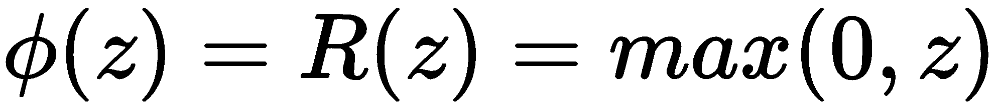

换句话说，ReLU 函数对其输入数据中的每个负值返回 0，对其输入数据中的每个正值返回其本身值。这如图 7.12 所示：

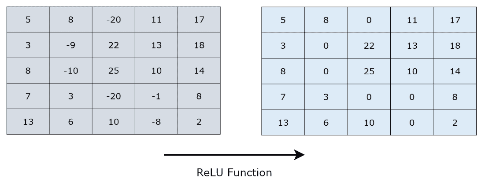

图 7.12：ReLU 函数

ReLU 函数可以绘制如图 7.13 所示：

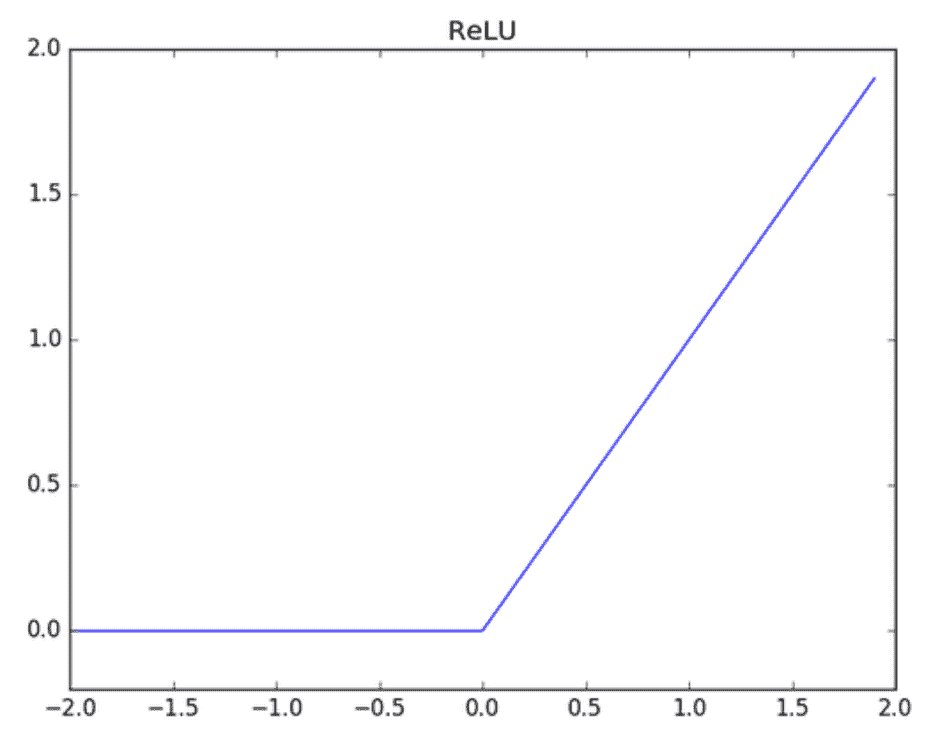

图 7.13：ReLU 函数图

# 池化层

CNN 中接下来发生的变换在*池化*层中处理。池化层的目标是在保持原始输入数据的空间方差的同时，减少卷积层输出的特征图维度（但不是深度）。换句话说，通过减小数据的大小，可以减少计算复杂性、内存需求和训练时间，同时克服过拟合，以便在测试数据中检测到训练期间检测到的模式，即使它们的形状有所变化。给定一个特定的窗口大小，有各种池化算法可用，包括以下几种：

+   **最大池化**：取每个窗口中的最大值

+   **平均池化**：取每个窗口的平均值

+   **求和池化**：取每个窗口中值的总和

*图 7.14*显示了使用 2x2 窗口大小对 4x4 特征图执行最大池化的效果：

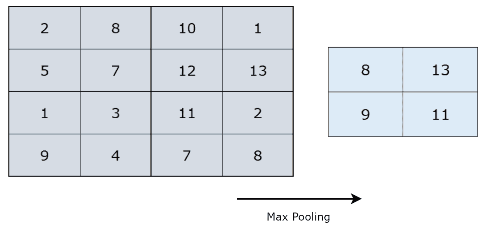

图 7.14：使用 2x2 窗口对 4x4 特征图进行最大池化

# 全连接层

在经过一系列卷积和池化层将 3-D 输入数据转换后，一个全连接层将最后一个卷积和池化层输出的特征图展平成一个长的 1-D 特征向量，然后将其用作一个常规 ANN 的输入数据，在这个 ANN 中，每一层的所有神经元都与前一层的所有神经元相连。

# 输出层

在这个人工神经网络（ANN）中，输出神经元使用诸如 softmax 函数（如 MLP 分类器中所示）这样的激活函数来分类输出，从而识别和分类输入图像数据中的对象！

# 案例研究 2 - 图像识别

在这个案例研究中，我们将使用一个预训练的 CNN 来识别和分类它以前从未遇到过的图像中的对象。

# 通过 TensorFlow 使用 InceptionV3

我们将使用的预训练 CNN 被称为 **Inception-v3**。这个深度 CNN 是在 **ImageNet** 图像数据库（一个包含大量标记图像的计算机视觉算法学术基准，覆盖了广泛的名词）上训练的，可以将整个图像分类为日常生活中发现的 1,000 个类别，例如“披萨”、“塑料袋”、“红葡萄酒”、“桌子”、“橙子”和“篮球”，仅举几例。

Inception-v3 深度 CNN 是由 **TensorFlow** (TM)，一个最初在 Google 的 AI 组织内部开发的开源机器学习框架和软件库，用于高性能数值计算，开发和训练的。

要了解更多关于 TensorFlow、Inception-v3 和 ImageNet 的信息，请访问以下链接：

+   **ImageNet:** [`www.image-net.org/`](http://www.image-net.org/)

+   **TensorFlow:** [`www.tensorflow.org/`](https://www.tensorflow.org/)

+   **Inception-v3:** [`www.tensorflow.org/tutorials/images/image_recognition`](https://www.tensorflow.org/tutorials/images/image_recognition)

# Apache Spark 的深度学习管道

在这个案例研究中，我们将通过一个名为 `sparkdl` 的第三方 Spark 包来访问 Inception-v3 TensorFlow 深度 CNN。这个 Spark 包是由 Apache Spark 的原始创建者成立的公司 Databricks 开发的，并为 Apache Spark 中的可扩展深度学习提供了高级 API。

要了解更多关于 Databricks 和 `sparkdl` 的信息，请访问以下链接：

+   **Databricks**: [`databricks.com/`](https://databricks.com/)

+   **sparkdl**: [`github.com/databricks/spark-deep-learning`](https://github.com/databricks/spark-deep-learning)

# 图像库

我们将用于测试预训练的 Inception-v3 深度卷积神经网络（CNN）的图像已从 **Open Images v4** 数据集中选取，这是一个包含超过 900 万张图片的集合，这些图片是在 Creative Common Attribution 许可下发布的，并且可以在 [`storage.googleapis.com/openimages/web/index.html`](https://storage.googleapis.com/openimages/web/index.html) 找到。

在本书配套的 GitHub 仓库中，您可以找到 30 张鸟类图像（`image-recognition-data/birds`）和 30 张飞机图像（`image-recognition-data/planes`）。*图 7.15* 显示了您可能在这些测试数据集中找到的一些图像示例：

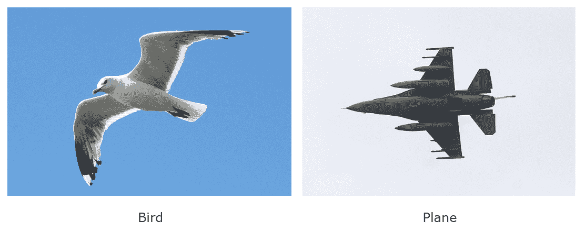

图 7.15：Open Images v4 数据集的示例图像

在本案例研究中，我们的目标将是将预训练的 Inception-v3 深度 CNN 应用到这些测试图像上，并量化训练好的分类器模型在区分单个测试数据集中鸟类和飞机图像时的准确率。

# PySpark 图像识别应用程序

注意，为了本案例研究的目的，我们不会使用 Jupyter notebook 进行开发，而是使用具有 `.py` 文件扩展名的标准 Python 代码文件。本案例研究提供了一个关于如何开发和执行生产级管道的初步了解；而不是在我们的代码中显式实例化 `SparkContext`，我们将通过 Linux 命令行将我们的代码及其所有依赖项提交给 `spark-submit`（包括任何第三方 Spark 包，如 `sparkdl`）。

现在，让我们看看如何通过 PySpark 使用 Inception-v3 深度 CNN 来对测试图像进行分类。在我们的基于 Python 的图像识别应用程序中，我们执行以下步骤（编号与 Python 代码文件中的编号注释相对应）：

以下名为 `chp07-02-convolutional-neural-network-transfer-learning.py` 的 Python 代码文件，可以在本书配套的 GitHub 仓库中找到。

1.  首先，使用以下代码，我们导入所需的 Python 依赖项，包括来自第三方 `sparkdl` 包的相关模块和 `MLlib` 内置的 `LogisticRegression` 分类器：

```py
from sparkdl import DeepImageFeaturizer
from pyspark.sql.functions import *
from pyspark.sql import SparkSession
from pyspark.ml.image import ImageSchema
from pyspark.ml import Pipeline
from pyspark.ml.classification import LogisticRegression
from pyspark.ml.evaluation import MulticlassClassificationEvaluator
```

1.  与我们的 Jupyter notebook 案例研究不同，我们没有必要实例化一个 `SparkContext`，因为当我们通过命令行执行 PySpark 应用程序时，这会为我们完成。在本案例研究中，我们将创建一个 `SparkSession`，如下所示，它作为 Spark 执行环境（即使它已经在运行）的入口点，它包含 SQLContext。因此，我们可以使用 `SparkSession` 来执行与之前所见相同的类似 SQL 的操作，同时仍然使用 Spark Dataset/DataFrame API：

```py
spark = SparkSession.builder.appName("Convolutional Neural Networks - Transfer Learning - Image Recognition").getOrCreate()
```

1.  截至 2.3 版本，Spark 通过其 `MLlib` API 提供了对图像数据源的原生支持。在此步骤中，我们通过在 `MLlib` 的 `ImageSchema` 类上调用 `readImages` 方法，将我们的鸟类和飞机测试图像从本地文件系统加载到名为 `birds_df` 和 `planes_df` 的 Spark 数据帧中。然后，我们用 `0` 文字标签所有鸟类图像，用 `1` 文字标签所有飞机图像，如下所示：

```py
path_to_img_directory = 'chapter07/data/image-recognition-data'
birds_df = ImageSchema.readImages(path_to_img_directory + "/birds")
   .withColumn("label", lit(0))
```

```py
planes_df = ImageSchema.readImages(path_to_img_directory + 
   "/planes").withColumn("label", lit(1))
```

1.  现在我们已经将测试图像加载到分别以它们的标签区分的单独 Spark 数据框中，我们相应地将它们合并为单个训练和测试数据框。我们通过使用 Spark 数据框 API 的`unionAll`方法来实现这一点，该方法简单地将一个数据框附加到另一个数据框上，如下面的代码所示：

```py
planes_train_df, planes_test_df = planes_df
   .randomSplit([0.75, 0.25], seed=12345)
birds_train_df, birds_test_df = birds_df
   .randomSplit([0.75, 0.25], seed=12345)
train_df = planes_train_df.unionAll(birds_train_df)
test_df = planes_test_df.unionAll(birds_test_df)
```

1.  与之前的案例研究一样，我们需要从我们的输入数据生成特征向量。然而，我们不会从头开始训练一个深度 CNN——即使有分布式技术，这也可能需要好几天——我们将利用预训练的 Inception-v3 深度 CNN。为此，我们将使用称为**迁移学习**的过程。在这个过程中，解决一个机器学习问题获得的知识被应用于不同但相关的问题。为了在我们的案例研究中使用迁移学习，我们采用第三方`sparkdl` Spark 包的`DeepImageFeaturizer`模块。`DeepImageFeaturizer`不仅将我们的图像转换为数值特征，还通过剥离预训练神经网络的最后一层来执行快速迁移学习，然后使用所有先前层的输出作为标准分类算法的特征。在我们的案例中，`DeepImageFeaturizer`将剥离预训练的 Inception-v3 深度 CNN 的最后一层，如下所示：

```py
featurizer = DeepImageFeaturizer(inputCol = "image", 
   outputCol = "features", modelName = "InceptionV3")
```

1.  现在我们已经通过迁移学习从预训练的 Inception-v3 深度 CNN 的所有先前层中提取了特征，我们将它们输入到分类算法中。在我们的案例中，我们将使用`MLlib`的`LogisticRegression`分类器，如下所示：

```py
logistic_regression = LogisticRegression(maxIter = 20, 
   regParam = 0.05, elasticNetParam = 0.3, labelCol = "label")
```

1.  要执行迁移学习和逻辑回归模型训练，我们构建一个标准的`pipeline`并将该管道拟合到我们的训练数据框中，如下所示：

```py
pipeline = Pipeline(stages = [featurizer, logistic_regression])
model = pipeline.fit(train_df)
```

1.  现在我们已经训练了一个分类模型，使用由 Inception-v3 深度 CNN 推导出的特征，我们将我们的训练逻辑回归模型应用于测试数据框以进行正常预测，如下面的代码所示：

```py
test_predictions_df = model.transform(test_df)
test_predictions_df.select("image.origin", "prediction")
   .show(truncate=False)
```

1.  最后，我们使用`MLlib`的`MulticlassClassificationEvaluator`在测试数据框上量化我们模型的准确性，如下所示：

```py
accuracy_evaluator = MulticlassClassificationEvaluator(
   metricName = "accuracy")
print("Accuracy on Test Dataset = %g" % accuracy_evaluator
   .evaluate(test_predictions_df.select("label", "prediction")))
```

# Spark 提交

我们现在可以运行我们的图像识别应用程序了！由于它是一个 Spark 应用程序，我们可以在 Linux 命令行通过`spark-submit`来执行它。为此，导航到我们安装 Apache Spark 的目录（见第二章，*设置本地开发环境*）。然后，我们可以通过传递以下命令行参数来执行`spark-submit`程序：

+   `--master`: Spark Master 的 URL。

+   `--packages`: Spark 应用程序运行所需的第三方库和依赖项。在我们的案例中，我们的图像识别应用程序依赖于`sparkdl`第三方库的可用性。

+   `--py-files`：由于我们的图像识别应用程序是一个 PySpark 应用程序，我们将传递应用程序依赖的任何 Python 代码文件的文件系统路径。在我们的情况下，由于我们的图像识别应用程序包含在一个单独的代码文件中，因此没有其他依赖项需要传递给`spark-submit`。

+   最后一个参数是包含我们的 Spark 驱动程序的 Python 代码文件的路径，即`chp07-02-convolutional-neural-network-transfer-learning.py`。

因此，执行的最后命令如下：

```py
> cd {SPARK_HOME}
> bin/spark-submit --master spark://192.168.56.10:7077 --packages databricks:spark-deep-learning:1.2.0-spark2.3-s_2.11 chapter07/chp07-02-convolutional-neural-network-transfer-learning.py
```

# 图像识别结果

假设图像识别应用程序运行成功，你应该会在控制台看到以下结果输出：

| **Origin** | **Prediction** |
| --- | --- |
| `planes/plane-005.jpg` | `1.0` |
| `planes/plane-008.jpg` | `1.0` |
| `planes/plane-009.jpg` | `1.0` |
| `planes/plane-016.jpg` | `1.0` |
| `planes/plane-017.jpg` | `0.0` |
| `planes/plane-018.jpg` | `1.0` |
| `birds/bird-005.jpg` | `0.0` |
| `birds/bird-008.jpg` | `0.0` |
| `birds/bird-009.jpg` | `0.0` |
| `birds/bird-016.jpg` | `0.0` |
| `birds/bird-017.jpg` | `0.0` |
| `birds/bird-018.jpg` | `0.0` |

`Origin`列指的是图像的绝对文件系统路径，`Prediction`列中的值如果是我们的模型预测图像中的物体是飞机，则为`1.0`；如果是鸟，则为`0.0`。当在测试数据集上运行时，我们的模型具有惊人的 92%的准确率。我们的模型唯一的错误是在`plane-017.jpg`上，如图*7.16*所示，它被错误地分类为鸟，而实际上它是一架飞机：

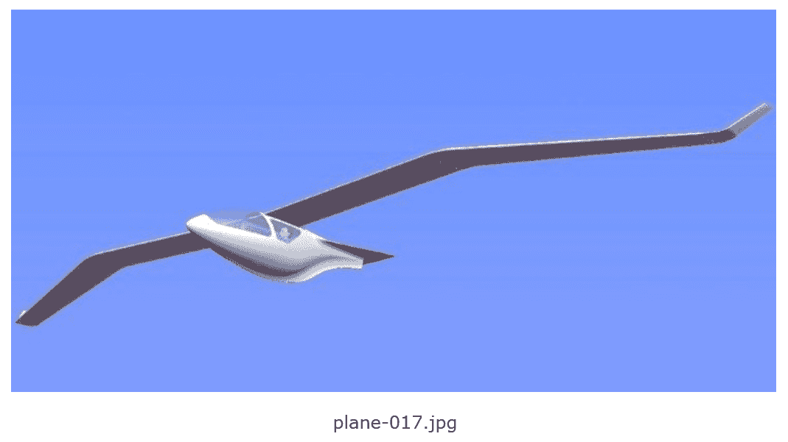

图 7.16：plane-017.jpg 的错误分类

如果我们查看*图 7.16*中的`plane-017.jpg`，我们可以快速理解模型为什么会犯这个错误。尽管它是一架人造飞机，但它被物理建模成鸟的样子，以提高效率和空气动力学性能。

在这个案例研究中，我们使用预训练的 CNN 对图像进行特征提取。然后，我们将得到的特征传递给标准的逻辑回归算法，以预测给定图像是鸟还是飞机。

# 案例研究 3 – 图像预测

在案例研究 2（图像识别）中，我们在训练最终的逻辑回归分类器之前，仍然明确地为我们的测试图像进行了标注。在这个案例研究中，我们将简单地发送随机图像到预训练的 Inception-v3 深度 CNN，而不对其进行标注，并让 CNN 本身对图像中包含的物体进行分类。同样，我们将利用第三方`sparkdl` Spark 包来访问预训练的 Inception-v3 CNN。

我们将使用的随机图像再次从**Open Images v4 数据集**下载，可以在本书附带的 GitHub 仓库中的`image-recognition-data/assorted`找到。*图 7.17*显示了测试数据集中可能找到的一些典型图像：

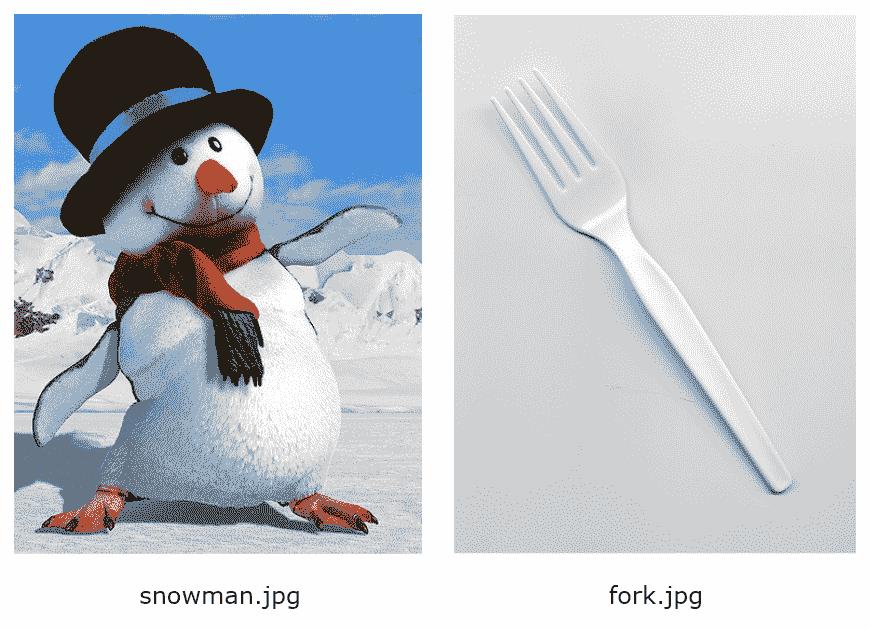

图 7.17：随机图像组合

# PySpark 图像预测应用程序

在我们的基于 Python 的图像预测应用程序中，我们按照以下步骤进行（编号与 Python 代码文件中的注释编号相对应）：

以下名为`chp07-03-convolutional-neural-network-image-predictor.py`的 Python 代码文件，可以在本书附带的 GitHub 存储库中找到。

1.  首先，我们像往常一样导入所需的 Python 依赖项，包括来自第三方`sparkdl` Spark 包的`DeepImagePredictor`类，如下所示：

```py
from sparkdl import DeepImagePredictor
from pyspark.sql import SparkSession
from pyspark.ml.image import ImageSchema
```

1.  接下来，我们创建一个`SparkSession`，它作为 Spark 执行环境的入口点，如下所示：

```py
spark = SparkSession.builder.appName("Convolutional Neural Networks - Deep Image Predictor").getOrCreate()
```

1.  然后，我们使用我们在上一个案例研究中首次遇到的`ImageSchema`类的`readImages`方法将我们的随机图像组合加载到 Spark 数据框中，如下所示：

```py
assorted_images_df = ImageSchema.readImages(
   "chapter07/data/image-recognition-data/assorted")
```

1.  最后，我们将包含我们的随机图像组合的 Spark 数据框传递给`sparkdl`的`DeepImagePredictor`，它将应用指定的预训练神经网络来对图像中的对象进行分类。在我们的案例中，我们将使用预训练的 Inception-v3 深度 CNN。我们还告诉`DeepImagePredictor`按置信度降序返回每个图像的前 10 个（`topK=10`）预测分类，如下所示：

```py
deep_image_predictor = DeepImagePredictor(inputCol = "image", 
   outputCol = "predicted_label", modelName = "InceptionV3", 
   decodePredictions = True, topK = 10)
predictions_df = deep_image_predictor.transform(assorted_images_df)
predictions_df.select("image.origin", "predicted_label")
   .show(truncate = False)
```

要运行此 PySpark 图像预测应用程序，我们再次通过命令行调用`spark-submit`，如下所示：

```py
> cd {SPARK_HOME}
> bin/spark-submit --master spark://192.168.56.10:7077 --packages databricks:spark-deep-learning:1.2.0-spark2.3-s_2.11 chapter07/chp07-03-convolutional-neural-network-image-predictor.py
```

# 图像预测结果

假设图像预测应用程序运行成功，您应该在控制台看到以下结果输出：

| **原始** | **首次预测标签** |
| --- | --- |
| `assorted/snowman.jpg` | `泰迪熊` |
| `assorted/bicycle.jpg` | `山地自行车` |
| `assorted/house.jpg` | `图书馆` |
| `assorted/bus.jpg` | `有轨电车` |
| `assorted/banana.jpg` | `香蕉` |
| `assorted/pizza.jpg` | `披萨` |
| `assorted/toilet.jpg` | `马桶座圈` |
| `assorted/knife.jpg` | `大刀` |
| `assorted/apple.jpg` | `红富士（苹果）` |
| `assorted/pen.jpg` | `圆珠笔` |
| `assorted/lion.jpg` | `狮子` |
| `assorted/saxophone.jpg` | `萨克斯风` |
| `assorted/zebra.jpg` | `斑马` |
| `assorted/fork.jpg` | `勺子` |
| `assorted/car.jpg` | `敞篷车` |

如您所见，预训练的 Inception-v3 深度 CNN 具有惊人的识别和分类图像中对象的能力。尽管本案例研究中提供的图像相对简单，但 Inception-v3 CNN 在 ImageNet 图像数据库上的前五错误率——即模型未能将其正确答案预测为其前五个猜测之一的情况——仅为 3.46%。请记住，Inception-v3 CNN 试图将整个图像分类到 1,000 个类别中，因此仅 3.46%的前五错误率确实令人印象深刻，并且清楚地展示了卷积神经网络以及一般的人工神经网络在检测和学习模式时的学习能力和力量！

# 摘要

在本章中，我们亲身体验了激动人心且前沿的深度学习世界。我们开发了能够以惊人的准确率识别和分类图像中的应用程序，并展示了人工神经网络在检测和学习输入数据中的模式方面的真正令人印象深刻的学习能力。

在下一章中，我们将扩展我们的机器学习模型部署，使其超越批量处理，以便从数据中学习并在实时中进行预测！
