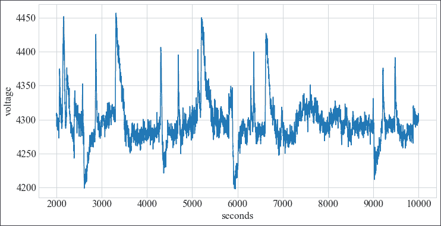
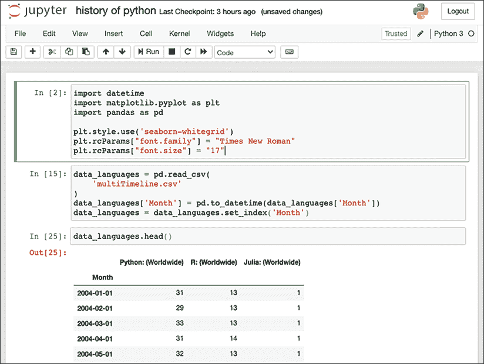

# 第一章：使用 Python 介绍时间序列

这本书讲的是关于 Python 的时间序列机器学习，你可以将本章看作是时间序列的入门课程。在本章中，我们将介绍时间序列、时间序列研究的历史，以及如何使用 Python 进行时间序列分析。

我们将从时间序列的定义及其主要特性开始。接着，我们将探讨不同科学领域中时间序列研究的历史，这些领域为该学科奠定了基础，例如人口学、天文学、医学和经济学。

然后，我们将探讨 Python 在时间序列方面的能力，以及为什么 Python 是做时间序列机器学习的首选语言。最后，我将介绍如何安装 Python 中用于时间序列分析和机器学习的主要库，并将涵盖与时间序列和机器学习相关的 Python 基础知识。

我们将覆盖以下主题：

+   什么是时间序列？

    +   时间序列的特性

+   时间序列与预测 – 过去与现在

    +   人口学

    +   遗传学

    +   天文学

    +   经济学

    +   气象学

    +   医学

    +   应用统计学

+   Python 与时间序列

那么，什么是时间序列呢？让我们从定义开始！

# 什么是时间序列？

由于这是一本关于时间序列数据的书，我们应该首先澄清我们所讨论的内容。在本节中，我们将介绍时间序列及其特性，并深入探讨与机器学习和统计学相关的不同问题和分析类型。

许多学科，如金融、公共行政、能源、零售和医疗保健，主要依赖时间序列数据。微观经济学和宏观经济学的很多领域依赖于应用统计学，特别是侧重于时间序列分析和建模。以下是一些时间序列数据的例子：

+   股票指数的每日收盘值

+   每周某疾病的感染人数

+   每周的火车事故系列

+   每日降水量

+   传感器数据，如每小时的温度测量

+   每年人口增长

+   一家公司若干年内的季度盈利

这仅仅是举几个例子。任何涉及时间变化的数据都可以视为时间序列。

也许有必要简要定义一下什么被视为时间序列。

定义：时间序列是按时间顺序排列的观测数据集。

这是一个非常广泛的定义。或者我们也可以说，时间序列是按时间顺序排列的数据点序列，或者说时间序列是一个随机过程的结果。

从形式上讲，我们可以有两种方式定义时间序列。第一种是将其定义为从时间域到实数域的映射：


其中  和 。

另一种定义时间序列的方法是将其视为一个随机过程：


在这里， 或  表示随机变量 X 在时间点 t 的值。

如果 T 是实数集，它就是一个连续时间随机过程。如果 T 是整数集，我们称其为离散时间的随机过程。在后者的情况下，惯例是写作 。

由于时间是数据集的主要索引，因此，时间序列数据集描述了世界如何随时间变化。它们通常涉及如何通过过去影响现在或未来的问题。

监控和数据收集的增加带来了对统计学和机器学习技术的需求，这些技术应用于时间序列，以预测和描述复杂系统或系统内组件的行为。与时间序列打交道的一个重要部分是如何基于过去预测未来。这就是所谓的预测。

一些方法允许将商业周期作为额外特征添加。这些额外的特征称为**外生**特征——它们是依赖于时间的解释性变量。我们将在*第三章*，*时间序列预处理*中讨论特征生成的示例。

## 时间序列的特征

这是一个从 Google 趋势导出的时间序列数据集示例，展示了 Python、R 和 Julia 的搜索量：


图 1.1：时间序列数据集的提取

这是一个**多变量**时间序列，包含 Python、R 和 Julia 的列。第一列是索引列，是一个日期列，周期为每月。如果我们只有一个变量，我们称其为**单变量**序列。如果我们只有一种编程语言而不是三种，那么这个数据集将是单变量的。

时间序列通常以离散时间形式出现，其中每个点之间的时间差是相同的。时间序列的最重要特征如下：

+   值的长期变化（**趋势**）

+   季节性变化（**季节性**）

+   不规则或周期性成分

趋势是某事物发展或变化的一般方向，例如序列中的长期增加或减少。一个可以观察到趋势的例子是全球变暖，这是过去半个世纪温度持续上升的过程。

下面是来自 NASA 发布的 GISS 表面温度分析数据集中的过去 100 年全球表面温度变化的图表：


图 1.2：1880 年至 2019 年间的 GISS 表面温度分析

如你在*图 1.2*中所见，温度变化在 20 世纪中期之前围绕 0 波动；然而，从那时起，整体温度逐年上升的趋势变得十分明显。

季节性是指在特定的、不到一年的规律间隔内发生的变化。季节性可以在不同的时间跨度上发生，例如每日、每周、每月或每年。每周季节性的一个例子是冰淇淋的销售量在每个周末都会增加。此外，根据你所居住的地方，冰淇淋可能只在春夏季节出售。这是一种年度变化。

除了季节性变化和趋势外，还有一些变动，它们的频率不固定，或者以非季节性频率的方式波动。我们中的一些人可能能基于现有知识对这些变动进行解释。

作为一个不规则的周期性变化例子，银行假期每年可能会落在不同的日历日期上，而促销活动则可能取决于商业决策，例如推出新产品。作为一个非季节性变化的周期性变化例子，毫秒级别的变化或发生在超过一年时间段的变化，将不被称为季节性效应。

**平稳性**是指时间序列在时间推移中其分布不会发生变化，如其总结统计量所描述的那样。如果一个时间序列是平稳的，那么它意味着该序列没有趋势，也没有确定性的季节性变化，尽管其他周期性变化是允许的。这是我们将在*第五章*，*使用移动平均和自回归模型进行预测*中讨论的算法中的一个重要特性。为了应用这些方法，我们需要通过去除季节性和趋势，将非平稳数据转换为平稳数据。

我们将在*第二章*，*使用 Python 进行时间序列分析*和*第三章*，*时间序列预处理*中更详细地讨论这些以及其他概念。

确定、量化和分解这些以及其他特征的任务被称为**时间序列** **分析**。探索性时间序列分析通常是在进行任何特征转换和机器学习之前的第一步。

# 时间序列与预测——过去与现在

时间序列自古以来就被研究，而从那时起，时间序列分析和预测已经取得了长足的进展。多种学科为应用于时间序列的技术发展做出了贡献，包括数学、天文学、人口统计学和统计学。许多创新最初来自数学，后来是统计学，最终是机器学习。许多应用统计学的创新源于人口统计学（用于公共管理）、经济学或其他领域。

在本节中，我将概述从简单方法到今天可用的机器学习方法的发展路径。我将尝试绘制自工业革命以来到现代，与时间序列相关的概念发展图谱。我们将在*第四章*，*基于时间序列的机器学习导论*中处理更技术性和最新的内容。

时间序列的研究仍有很多进展可期。可穿戴传感器和物联网的发展意味着大数据可以用来进行分析和预测。近几年，随着大量数据集的可用性用于基准测试和竞赛，已经帮助创造出新的方法，正如我们将在后续章节中讨论的那样。

## 人口学

大部分早期用于建立时间序列分析理论和实践的工作来源于公共管理中应用的人口学。本节中提到的许多人要么是公共服务人员，要么出于对抽象问题的兴趣在私人领域作出了贡献。

约翰·格朗特，最初是一名帽商，后来对伦敦教区记录的死亡记录产生了兴趣。在 1662 年，他在《*自然与政治观察：关于死亡账单的研究*》一书中发布了公共卫生统计数据。该书除了包含有关流行病学的统计数据外，还包含了第一张生命表。**生命表**（也叫死亡表或精算表）是一种表格，显示了每个年龄段的人在其下一次生日之前死亡的概率。格朗特通过死亡账单得出结论，这些账单由教区书记员生成，记录了伦敦市及其周边地区英格兰教会墓地的埋葬情况。

格朗特的书籍具有深远的影响，他被广泛认为是人口学的奠基人。格朗特被选为皇家学会会员；然而，在 1666 年伦敦大火中，他的房屋被烧毁，导致破产，最终他在 53 岁时死于黄疸和肝病。

其中，他启发了瑞士数学家雅各布·伯努利的著作《*猜想艺术*》，该书写于 1684 年至 1689 年之间，并于 1713 年死后出版，是组合数学和概率论中的一部里程碑式著作，其中包括了——在众多内容中——大数法则的第一个版本。

大数法则描述了当实验重复进行多次时会发生什么。伯努利证明，在一个有两个结果的机会游戏中（比如抛硬币），无论是胜利还是失败，如果重复很多次，游戏的胜利次数比例会趋近于真实的、预期的概率。

人口学历史上的另一个重大里程碑出现在 1689 年，由德国教授和神职人员卡斯帕·诺伊曼（Caspar Neumann）撰写的文章《*关于布雷斯劳出生与死亡的生与死的反思*》中（译名：Reflections about the Life and Death of People Who Were Born and Died in Breslau）。诺伊曼将这篇论文发送给了著名哲学家和数学家戈特弗里德·莱布尼茨，并将他的数据提供给了伦敦皇家学会。

许多后续的研究工作都基于本文中的数据和统计资料。1693 年，埃德蒙·哈雷在《皇家学会哲学汇刊》上发表了一篇关于生命年金的文章（《*人类死亡率的估算*》），他基于诺伊曼的数据编制了死亡率表。**年金**是定期支付的款项，例如抵押贷款、保险和养老金支付。哈雷的文章为精算科学的发展提供了指导，并帮助英国政府根据购买者的年龄，确定出售退休收入保险的适当价格。稍后我们将在天文学部分再次提到哈雷。

亚伯拉罕·德·莫伊夫是一位法国人，由于法国胡格诺派的宗教迫害，他年轻时移居英格兰。今天，他最为人知的是他在正态分布和概率论方面的贡献。1724 年，他出版了一本名为《*基于生命的年金*》的书，书封面如下面所示，内容涉及死亡率统计和年金理论的基础。


图 1.3：基于生命的年金

德·莫伊夫还因提出二项分布的近似方法和研究泊松分布（后来以西蒙·丹尼斯·泊松的名字命名）而被铭记。

在具备了一些统计学基础后，我们现在开始进入对未来的预测，这时时间序列预测就派上用场了。1751 年，本杰明·富兰克林在他的文章《*关于人口增长、人类繁衍等的观察*》中研究了人口增长及其极限，预测了英国殖民地的指数增长。他预测英国王室殖民地的人口每 25 年翻一番，并认为这一增长有潜力传播自由政治传统，增强英格兰的力量。他的预测被证明是正确的，指数增长一直持续到 19 世纪 50 年代，当时美国人口超过了英格兰。

受富兰克林的影响，英格兰牧师托马斯·罗伯特·马尔萨斯提出了人口增长将超出粮食生产增长的担忧。在他的假设中，虽然人口增长是指数型的，但粮食供应和其他资源的增长是线性的，这最终将导致社会崩溃和大规模人口死亡。18 世纪末，他描述了日益加剧的饥荒和贫困（后来被称为“*马尔萨斯陷阱*”）。

许多其他统计学和数学概念是基于人口数据发展出来的。阿道夫·凯特莱（Adolphe Quetelet），一位来自今天比利时根特的天文学家、数学家和社会学家，将统计方法引入社会科学，用来描述犯罪率、婚姻率和自杀率等背后的关系。他呼吁建立一种“社会物理学”，揭示社会现象背后的规律，从而显示上帝的工作。除了其他成就外，他还发展了身体质量指数，最初被称为凯特莱指数。在他 1835 年的书《*论人类*》（英译名：Treatise on Man）中，他根据正态分布描述了“平均人”的概念。凯特莱的学生皮埃尔·费尔霍斯特（Pierre Verhulst）发展了逻辑斯蒂函数，作为人口增长模型。

西蒙·丹尼斯·泊松（Siméon Denis Poisson）于 1837 年发表了《*论刑事和民事案件判断的概率*》（法文原名：《Recherches sur la probabilité des jugements en matière criminelle et en matière civile》），在其中阐述了关于在给定区间内发生的离散事件的概率理论。泊松分布就是以他的名字命名的。

威廉·莱克西斯（Wilhelm Lexis），人口统计学时间序列分析的先驱，发表了名为《*统计系列稳定性理论*》的论文（1879），介绍了如今被称为莱克西斯比率的量度。该比率区分了稳定系列，其中引发观察到的比率的潜在概率分布保持不变，和非稳定系列。这些稳定的时间序列不会受到除了随机噪声以外的任何力量的影响。用今天的术语来说，稳定的时间序列将被称为白噪声过程或零阶移动平均。

为了区分稳定与非稳定的时间序列，莱克西斯创建了一个检验统计量，该统计量等于观察到的比率的离散度与如果每个观察到的比率的潜在概率在所有观察中相等时应有的离散度之比。如果这个比率 Q 大于 1.41，他认为这意味着该时间序列是不稳定的，或者用他的话说，受物理力量的影响。莱克西斯后来成为德国联邦保险监管局保险咨询委员会的成员。

## 遗传学

弗朗西斯·高尔顿（Francis Galton），一位维多利亚时代的英国科学家，出生在一个著名的银行家和枪械制造商家族中，家族中有多位皇家学会成员。高尔顿是一位高产的作家和研究者。今天，他主要因创造了“优生学”一词而被人们记住，优生学是研究未来世代种族质量变化的学科，重点关注人类的理想品质。优生学与种族主义和白人至上主义有着密切的联系。

加尔顿对许多科学学科感兴趣，如心理学、统计学、心理物理学、摄影等。凭借他的贡献，他在 1909 年被封为爵士。除此之外，他还为人体测量学做出了贡献，这是一种对人体进行系统测量和描述的方法。为此，他重新发现了相关性的概念（该概念最早由法国物理学家奥古斯特·布雷维斯于 1846 年提出），并描述了前臂长度与身高、头宽与头深、头长与身高之间的相关性（1888 年）。

他的一个门徒（兼传记作者）是卡尔·皮尔逊，皮尔逊出生于伦敦伊斯灵顿的贵格会家庭，父亲是皇室律师（Queen's Counsel）。他在剑桥大学学习数学，在海德堡大学学习物理学与哲学，在柏林大学学习生理学，之后回到伦敦学习法律。在伦敦，他结识了加尔顿，两人保持了联系。

加尔顿去世后，皮尔逊成为首位担任加尔顿在遗嘱中捐赠的优生学讲座教授的人。皮尔逊主要的兴趣在于将生物统计学应用于遗传背景中。他被认为是标准差的发明者，标准差是衡量正态分布变异性的一种方法，替代了卡尔·弗里德里希·高斯的平均误差概念。他还对统计学做出了贡献，包括卡方检验、统计显著性的 p 值、现代相关性、主成分分析和直方图等。

皮尔逊继费舍尔之后成为了加尔顿优生学教授（后改名为加尔顿遗传学讲座教授）。费舍尔在进化理论方面做出了许多创新，涉及拟态、亲代投资以及 1:1 性别比例背后的费舍尔原理。在统计学方面，他描述了线性判别分析、费舍尔信息量、F 分布以及学生 t 分布。

他在统计学方面的贡献为时间序列分析中的统计检验和一些经典模型奠定了基础。费舍尔于 1952 年被伊丽莎白二世女王封为骑士。然而，他与种族主义观点的关联——例如，他支持德国纳粹党提出的灭绝政策，目的是改善遗传基因——导致了近期对他工作的重新评估。

因此，**伦敦大学学院**（**UCL**）的罗纳德·费舍尔中心被更名为计算生物学中心，UCL 也就其在传播优生学中的作用公开道歉。

## 天文学

彗星、小行星的观测以及太阳和行星的运动已被记录了很长时间，人们通过研究这些记录来理解这些运动的规律性、相互关系以及我们在宇宙中的位置。我们在前面提到的人口学部分中提到的英国天文学家和地球物理学家埃德蒙·哈雷，应用了艾萨克·牛顿在 1687 年提出的运动定律，研究历史上的彗星现象。哈雷彗星是一颗肉眼可见的彗星，几乎在全球范围内都有目击记录，且至少已有约 2000 年的历史，被古希腊的文献和巴比伦的天文表格所记载。

例如，在公元前 12 年，它出现在接近耶稣基督诞生日期的时刻，导致有人猜测这可能是圣经故事中伯利恒之星的来源。1066 年，这颗彗星在英格兰出现，被认为是神的讯息，预示着哈罗德二世的命运，哈罗德二世在同年于黑斯廷斯战役中阵亡，战斗对手是由征服者威廉领导的诺曼征服军。

哈雷将多次彗星出现联系在一起，得出结论认为每次看到的是同一颗彗星，并计算出其周期约为 75-76 年。今天，这颗彗星以他的名字命名，以示敬意，称为**哈雷彗星**。这一结论发表于《*彗星天文学概要*》（1705 年）。哈雷彗星将于 2061 年重新出现。

该图显示了哈雷彗星的轨道（来源：Wikimedia Commons）：


图 1.4：哈雷彗星轨道

德国博学家卡尔·弗里德里希·高斯于 1801 年设计了一种确定矮行星谷神星轨道的方法。谷神星位于火星和木星之间的小行星带中。高斯基于一位天主教神父兼天文学家朱塞佩·皮亚奇的观察结果进行推算，皮亚奇在同年 1 月至 2 月间追踪了一个天体，后来失去了该天体的踪迹。

此后，线性拟合方法被应用于天体的运动，最著名的是**最小二乘法**。这一方法最早由阿德里安-玛丽·勒让德在 1805 年描述（"*méthode des moindres carrés*"），但今天通常将其归功于高斯。高斯在 1809 年后来发表了关于该方法的研究；然而，他在勒让德的基础上进行了大幅扩展，其中之一就是发明了以他命名的高斯分布（也叫正态分布或钟形曲线）。

**最小二乘法**是线性回归方法的基础，在该方法中，方程组中的参数被估计出来。这是一种统计程序，通过最小化绘制曲线的平方残差和来找到一组数据点的最佳拟合。

仅仅一年后，皮埃尔-西蒙·拉普拉斯证明了**中心极限定理**，大致说明独立变量的和，即使它们不来自正态分布，仍会趋向正态分布。这为最小二乘法和正态分布在大数据集中的应用提供了重要的理论支持。从那时起，正态分布在统计学领域产生了深远的影响，均值和标准差等度量方法被广泛用来描述它。

拉普拉斯对行星运动非常感兴趣，但他也提出了潮汐运动的动态系统理论和概率论。有趣的是，拉普拉斯曾是拿破仑·波拿巴的考试官，在 1784 年拿破仑在巴黎的军事学校就读时，拉普拉斯担任了他的考官。

拉普拉斯最著名的贡献之一是继承法则，描述的是给定过去的事件，某个事件发生的概率。他提出的日出例子用来说明继承法则，就是给定太阳过去升起的天数，明天太阳升起的概率：


拉普拉斯对日出问题的假设是，我们对这件事的了解仅限于用于公式的观察天数。他实际上警告过，按照这个背景应用规则是错误的，因为我们对太阳和地球的运动了解要远远超过这些。

受天文计算的启发，奥古斯丁-路易·柯西于 1847 年发明了梯度下降优化算法（发表于法国科学院的期刊《法国科学院公报》），其中通过反向梯度的重复步伐来寻找局部最小值。

随后出现了许多其他的优化和曲线拟合创新。1944 年，由肯尼斯·莱文伯格首次发布，1963 年由唐纳德·马奎特重新发现的莱文伯格-马奎特算法（也称为阻尼最小二乘法）可用于曲线拟合问题，其中因变量是模型参数的非线性组合（非线性问题）。它结合了高斯-牛顿算法，这是高斯在 1809 年发布的牛顿算法的一种变体，以及大约一百年前发明的梯度下降法。

## 经济学

威廉·普雷费尔于 1759 年出生在苏格兰，来自一个牧师家庭，是家中的第四个儿子。他与安德鲁·梅克尔（打谷机的发明者）成为学徒，之后成为詹姆斯·瓦特在博尔顿与瓦特蒸汽机厂的私人助理。

他的生活如此多彩，以至于可以写成几本小说。1789 年，他参与了巴黎攻占巴士底狱的事件。之后，他作为威廉·杜尔（William Duer）的一名代理人，参与了一个可能是挪用公款的计划，与 Scioto 公司一起向愿意移民的法国人出售价值无用的俄亥俄州土地契约。回到伦敦后，他开设了一家银行，最终破产。后来，他因欠债被关进了债务人监狱——弗利特监狱，关了几年。之后，他成为了英国的秘密特工，从 1789 年到 1796 年，伪造法国货币“指定票”以破坏法国政府。指定票很快变得毫无价值，通货膨胀进一步削弱了法国政府。他还为金属加工机械和船只获得了几项发明专利。

然而，普雷福的主要成就之一，是他推广了几种可视化图表，如饼图、柱状图和时间序列图。虽然尼古拉·奥雷姆（Nicole Oresme）在几百年前的出版物中就展示了柱状图，但普雷福有时被认为是柱状图的发明人。

这里有两张图表，分别是柱状图和时间序列图，均来自他于 1786 年出版的《*商业与政治地图集*》（图片来源：维基百科）：


图 1.5：普雷福的《商业与政治地图集》中的可视化图表

左侧是普雷福用来进行苏格兰进出口数据定量比较的柱状图。右侧是时间序列图，用来展示英国的贸易平衡随时间变化的情况。

## 气象学

古希腊哲学家亚里士多德是第一个撰写关于天气及其测量的文献的人；然而，直到很久以后，才开始有了第一次的天气预报。副海军上将罗伯特·菲茨罗伊（Robert FitzRoy）于 1854 年创立了英国的国家气象局——气象办公室。菲茨罗伊已经在历史上占据了重要地位，他曾是贝格尔号（HMS Beagle）的舰长，这艘船带着刚刚毕业的博物学家查尔斯·达尔文（Charles Darwin）环游世界，且在进化论和自然选择理论的形成过程中起到了关键作用。

在电报和气压计（气压计的一种形式）的支持下，气象局收集了伦敦不同地点的天气数据。1859 年，当皇家查尔特号蒸汽快船从澳大利亚墨尔本返回利物浦时，在风暴中在威尔士海岸的岩石上触礁，导致约 450 人丧生。这场灾难促成了风暴预警系统的发展，后来这一系统被扩展到一般天气预报。事实上，正是 FitzRoy 创造了*forecast*（预报）这个词，尽管当时许多同代人称其为“庸医般的天气预言”。目前尚不清楚他的预报是否遵循了任何系统。他因这一工作而遭到科学界的广泛嘲笑，特别是由 Sir Francis Galton 批评，他曾出版过一本名为《*Meteorographica*》的书，并后来出版了第一张天气图。FitzRoy 在 1865 年割喉自杀。风暴预警系统暂时中断，几年前才恢复并延续至今。

第一个使用大气和海洋的天气模型是在 1920 年代由 Lewis Fry Richardson 尝试的，他的工作基于挪威人 Vilhelm Bjerknes 的研究，后者是斯德哥尔摩大学流体动力学和热力学微分方程讲师。然而，在计算机出现之前，这些模型并不实际可行——Richardson 花了大约六周的时间进行有限区域的天气预报。尽管他的预测方法基本正确，但由于数值不稳定性，他的预测最终是错误的。当他意识到自己的工作可能会对化学武器设计者有价值时，他放弃了这项工作。

第一个计算机化的天气模型是在**电子数值积分和计算机**（**ENIAC**）上编程的。ENIAC 由 John Mauchly 和 J. Presper Eckert 设计，能够运行任意的操作序列；然而，它并不是从磁带读取程序，而是通过插线板开关来读取。这个 15x9 米的巨型机器今天展览于华盛顿特区的史密森学会。ENIAC 由 17,500 个真空管组成，最初用于氢弹的计算，然后被用于采用新的数值天气预测方法将天气预报延伸到一天或两天以上。该计算机由 Klara von Neumann 编程。

这是 ENIAC 的照片（来源：维基共享资源）：


图 1.6：电子数值积分和计算机（ENIAC）

你可以看到 Betty Snyder，ENIAC 的最早程序员之一，站在 ENIAC 前面。

后来，约瑟夫·斯马戈林斯基（Joseph Smagorinsky）和道格拉斯·利利（Douglas Lilly）开发了一个用于计算流体力学的湍流数学模型。这个模型——斯马戈林斯基-利利模型，至今仍在使用，使用了关于风、云层覆盖、降水、大气压力和地球与太阳辐射的数据作为输入。斯马戈林斯基继续领导关于全球变暖的研究，研究气候对二氧化碳浓度增加的敏感性。

移动传感器阵列和计算机模型的引入大大提高了预测的准确性。气象局或其他来源（最重要的是商业飞机飞行时收集）的传感器收集了有价值的温度和风速数据。今天，在七天的窗口期内，天气预报大约 80%的时间是准确的。COVID 大流行期间，由于某些时期航班减少了约 75%，商业航班的停飞导致近期预测准确性降低。

## 医学

1901 年，威廉·恩特霍芬（Willem Einthoven）将电报接收器中使用的弦式电流计应用于生理学。恩特霍芬在荷兰莱顿工作，他改进了之前的设计，制造了首个实用的心电图（ECG）。心电图对监测和筛查心脏功能至关重要，它可以检测心律失常、冠状动脉血流不足和电解质紊乱。由于这项创新的重要性，恩特霍芬于 1924 年获得了诺贝尔生理学或医学奖。

汉斯·伯格（Hans Berger）在 1924 年记录了首个人体脑电图（EEG）记录。EEG 通过将电极放置在头皮上来测量大脑的电活动。脑电图记录展示了大脑在一段时间内的自发电活动。

这是一个脑电图（EEG）信号的图表（来自德国 DHBW 的 Oliver Roesler 上传的 EEG Eye State 数据集）：



图 1.7：脑电图信号

在脑电图中，大脑的电活动通过放置在头皮上的电极进行记录。其信号通常表现为强烈的振荡（也称为脑波），覆盖多个频率范围，最显著的有：

+   阿尔法波（8-12 赫兹）通常发生在放松状态下，尤其是在闭眼时

+   贝塔波（16-31 赫兹）信号表示更加活跃的思维

+   伽玛波（大于 32 赫兹）表示跨模态的感官处理

脑电图的医学用途非常广泛——除了其他用途外，EEG 可用于诊断癫痫、睡眠障碍、肿瘤、中风、麻醉深度、昏迷和脑死亡。

## 应用统计学

应用统计学和数学也为时间序列的工作提供了灵感和基础。托马斯·贝叶斯（Thomas Bayes）牧师（发音为 /bez/）证明了一个定理，该定理描述了基于先验知识的事件发生的概率。贝叶斯定理被认为是贝叶斯推断的基础，这是一种统计推断方法。

我们将在*第九章*，*时间序列的概率模型*中进一步讨论这一点。贝叶斯的手稿在他去世后两年（1761 年）由他的朋友理查德·普赖斯以大量编辑过的形式呈交给皇家学会。

傅里叶变换在滤波中非常重要，它将信号从时间域转换为频域表示。函数的三角分解由约瑟夫·傅里叶于 1807 年发现，但一个快速算法最早由高斯在 1805 年左右发明（尽管直到他去世后才发表，且是以拉丁文发表的），然后 160 年后由 J.W. Cooley 和约翰·图基重新发现。

经典的时间序列建模方法由乔治·博克斯和吉威廉·詹金斯于 1970 年在他们的著作《*时间序列分析、预测与控制*》中提出。最重要的是，他们正式化了 ARIMA 和 ARMAX 模型，并描述了如何将其应用于时间序列预测。我们将在*第五章*，*利用移动平均和自回归模型进行预测*中讨论这些模型。

# Python 在时间序列中的应用

对于时间序列，主要有两种语言，R 和 Python，值得简要比较这两者，并描述是什么让 Python 与众不同。Python 是目前最受欢迎的编程语言之一。根据 2021 年 2 月的 TIOBE 数据，它仅次于 C 和 Java。

| **排名** | **语言** | **评分** |
| --- | --- | --- |
| 1 | C | 16.34% |
| 2 | Java | 11.29% |
| 3 | Python | 10.86% |
| 4 | C++ | 6.88% |
| ... | ... | ... |
| 11 | R | 1.56% |
| ... | ... | ... |
| 29 | Julia | 0.52% |

图 1.8：TIOBE 语言使用统计数据

我加入了 R 和 Julia 这两种用于数据科学的其他语言，以支持 Python 是最受欢迎的数据科学语言这一观点。在比较 Python、R 和 Julia 的搜索量时，我们可以看到，Python 远远超过 R，而 Julia 则排在第三位，遥不可及。实际上，Python 的排名类似于 C、Java 和 C++等语言。而 R 的排名则接近汇编语言和 Groovy，Julia 则处于 Prolog 等专业语言的水平。

R 的社区由统计学家和数学家组成，R 的优势在于统计学和绘图（ggplot）。R 的弱点在于其工具支持以及几乎没有一致的代码风格规范。

另一方面，Python 在统计学和科学计算方面追赶上了，通过 NumPy、SciPy 和 pandas 等库，它在数据科学的使用率和可用性方面已经超越了 R。

Python 在机器学习库方面非常突出。以下库完全或主要是用 Python 编写的：

+   Scikit-learn 是用 Python 和 Cython（类似于 C 编程语言的 Python 方言）编写的。它提供了一个非常大范围的算法实现，用于训练和评估机器学习模型。

+   Statsmodels 提供了统计测试和模型，如广义线性模型（GLM）、ARMA 等。

+   Keras 是一个用于训练神经网络的 Python 抽象，它与 TensorFlow 和其他库进行交互。

一些最受欢迎的机器学习框架——那些在开发中得到广泛使用并具有大量可扩展算法的框架，例如 TensorFlow、PyTorch 和 XGBoost——也主要用 Python 编写，或为 Python 提供一流的接口。

此外，作为一种通用语言，Python 非常适合在你想超越数据分析的情况下使用。借助 Python，你可以实现构建端到端机器学习系统所需的完整数据流，并能够将其部署并与公司后端平台集成。

以下时间序列图展示了根据 Google Trends 的数据显示，Python 和 R 的流行程度。由于 Julia 几乎没有在图表底部出现，因此被省略。

最近，COVID 疫情影响了 Python 的流行度，但其他编程语言的搜索量也出现下降。


图 1.9：Python 与 R 的使用情况随时间变化

Python 在过去几年明显超过了 R，尽管必须承认这种比较并不完全公平，因为 Python 的应用范围远远大于 R。然而，Python 也是数据科学（尤其是时间序列）中最受支持的语言之一。到 2021 年 2 月，如果我们在 GitHub 上搜索时间序列，发现其库数量大约是 R 的五倍（包括 Jupyter 笔记本的库）。对于 Julia，我发现大约有 104 个库。具体数字请见下表：

| **语言** | **时间序列库** |
| --- | --- |
| Jupyter Notebook | 11,297 |
| Python | 4,891 |
| R | 3,656 |
| Julia | 104 |

图 1.10：TIOBE 语言使用统计数据

为了简要展示专注于时间序列的 Python 机器学习项目，以下是 GitHub 上一些著名库的简短列表：

+   prophet

+   sktime

+   gluon-ts

+   tslearn

+   pyts

+   seglearn

+   darts

+   cesium

+   pmdarima

这些截图（来自 gitcompare.com）总结了这些库的一些统计数据，如星标数（有多少人喜欢该库）、分支数（有多少人复制了该库以便研究或做更改）、库的年龄（库存在了多长时间）以及其他：


图 1.11：著名 Python 库的库统计数据

在本书中，我们将介绍许多时间序列库。接下来的章节中，我们会讨论一些 Python 数据科学库，但如果你想全面了解这些库中的任何一个，你应该阅读专门介绍 Python 数据科学的书籍，甚至是 NumPy 和 pandas 的书籍。

## 安装库

本书中，你将需要的用于维护和安装 Python 库的两个主要工具是 conda 和 pip。

请注意，接下来两个小节中的命令应该从系统终端执行，或者 – 在 conda 的情况下 – 使用 Anaconda 导航器。对于 Windows 和 Mac 用户，有图形用户界面可用，可以搜索并安装库，而不需要依赖终端。

**conda** 与 Python、R 和其他语言一起工作，用于依赖管理和环境封装。conda 还通过维护与 Python 库相关的库列表来帮助安装系统库。

开始使用 conda 的最佳方式是按照以下链接中的说明安装 anaconda：[`docs.continuum.io/anaconda/install/`](https://docs.continuum.io/anaconda/install/)。

还有一个带有精美设计的 conda 图形界面，如下截图所示：


图 1.12：Anaconda 导航器

Anaconda 导航器可以在 macOS 和 Microsoft Windows 上安装。

或者，你可以完全依赖终端。例如，下面是如何从终端安装 NumPy 库：

```py
conda install numpy 
```

另外，如果你想使用 R 编程语言，也可以使用 conda：

```py
conda install r-caret 
```

请参阅 conda 文档，获取详细的介绍和教程。conda 还会安装 Python 和 pip 的版本，所以你可以使用 pip 或 conda 安装 Python 库，同时通过 conda 管理你的环境。

终端命令可以从系统终端或从 Jupyter 环境中执行，在 notebook 或 JupyterLab 中，通过在命令前加上感叹号。

例如，来自终端中的一个命令：

```py
pip install xgboost 
```

可以在 Jupyter 环境中按如下方式编写：

```py
!pip install xgboost 
```

在 Jupyter 中的感叹号告诉解释器这是一个 shell 命令。在 Jupyter 的最新版本中，使用 pip 命令时已不再需要感叹号。

让我们快速看看如何在终端中启动 Python 并安装库的简单会话：


图 1.13：终端窗口

pip 是 Python 库的包管理器。以下是来自终端的一些有用命令：

```py
# install NumPy: 
pip install numpy
# install a particular version:
pip install numpy==1.20.0
# upgrade a library:
pip install -U numpy
# install all libraries listed in a requirements file:
pip install -r production/requirements.txt
# write a list of all installed libraries and their versions to a file:
pip freeze > production/requirements.txt 
```

你可以安装不同版本的 Python 和 pip 以及不同版本的库。这些可以作为环境进行维护，你可以在它们之间进行切换。Virtualenv 是一个用于维护环境的工具：

```py
# create a new environment myenv:
virtualenv myenv
# activate the myenv environment:
source myenv/bin/activate
# install dependencies or run python, for example:
python
# leave the environment again:
deactivate 
```

`activate`命令将会修改你的`$PATH`变量，指向`virtualenv bin/`目录，其中包含 Python 和 pip 可执行文件等内容。这意味着你可以使用这些作为选项。通常，你应该会看到提示符反映这一变化。

请注意，对于环境的激活，你可以使用完整路径或相对路径。在 Windows 中，激活命令略有不同——你需要运行一个 shell 脚本：

```py
# activate the myenv environment:
myenv\Scripts\activate.bat 
```

## Jupyter 笔记本和 JupyterLab

Jupyter 代表 Julia、Python、R。它是一个用于运行这些和其他支持语言（如 Scala 和 C）脚本的交互式平台。

你可以通过终端在电脑上启动一个笔记本服务器，像这样：

```py
jupyter notebook 
```

你应该会看到浏览器打开一个新标签页，显示 Jupyter 笔记本。我加载数据科学语言时间序列的笔记本开头大概是这样的：



图 1.14：Jupyter 笔记本

或者，我们也可以使用 JupyterLab，这是下一代笔记本服务器，带来了显著的可用性改进。

你可以通过终端启动一个 JupyterLab 笔记本服务器，像这样：

```py
jupyter lab 
```

JupyterLab 看起来与默认的 Jupyter 服务器有些不同，正如下面的截图所示（来自 JupyterLab 的 GitHub 仓库）：


图 1.15：JupyterLab

这两个工具，无论是 Jupyter 笔记本还是 JupyterLab，都将为你提供一个**集成开发环境**（**IDE**），用于编写本书中将介绍的代码。

最后，了解如何在 Jupyter 内部获得帮助是非常实用的。这时，问号就派上用场了。问号（?）用于在笔记本中提供帮助，像这样：


图 1.16：笔记本内帮助

如果你想访问函数的签名或完整的源代码列表，也可以在函数名后加一个或两个问号。这项功能可以节省大量时间——你不需要再去 Google 搜索代码或类、函数的定义，可以在毫秒内直接获取信息。

## NumPy

NumPy 是 Python 科学计算的基础库，因为许多库都依赖它。像 PyTorch 和 TensorFlow 这样的库提供了与 NumPy 的接口，使得数据的导入/导出变得非常简单。pandas 基本上是一个围绕 NumPy 数组构建的高级接口。

SciPy 也建立在 NumPy 之上。SciPy 代表*科学 Python*，包含从数学常数到积分、优化、插值、信号处理等功能。

NumPy 允许你在不同维度上操作矩阵并对其进行计算。你可能主要使用 pandas 或其他库，并不常接触 NumPy；然而，为了更深入的理解和高性能，了解 NumPy 无疑是非常重要的。

以下是 NumPy 中的一些基本命令。这些命令应该在 Python 解释器中执行。我们将创建一维和二维数组：

```py
import numpy as np
# 1 dimensional array:
x1 = np.array([1, 2, 3])
>>> array([0, 1, 2])
x2 = np.arange(3)
>>> array([0, 1, 2])
x1 == x2 
>>> True
# 2 dimensional array: 
y = np.array([(1, 2, 3),(4, 5, 6)]) 
```

NumPy 提供了非常方便的文档功能；例如，要检索 `optimize.fmin` 函数的文档，可以使用此命令（为简洁起见，我省略了一些行）：

```py
>> np.info(optimize.fmin)
fmin(func, x0, args=(), xtol=0.0001, ftol=0.0001, maxiter=None, maxfun=None,full_output=0, disp=1, retall=0, callback=None)
Minimize a function using the downhill simplex algorithm.
Parameters
----------
func : callable func(x,*args)
    The objective function to be minimized.
x0 : ndarray
    Initial guess.
args : tuple
    Extra arguments passed to func, i.e. ``f(x,*args)``.
callback : callable
    Called after each iteration, as callback(xk), where xk is the
    current parameter vector.
Returns
-------
xopt : ndarray
    Parameter that minimizes function.
fopt : float
    Value of function at minimum: ``fopt = func(xopt)``.
iter : int
    Number of iterations performed.
…
Notes
-----
Uses a Nelder-Mead simplex algorithm to find the minimum of function of
one or more variables. 
```

## pandas

pandas 是一个允许通过列名等索引访问矩阵或数组作为表格的库——这称为 **DataFrame**。单个列或单个行可以作为 Series 访问，Series 是 pandas 中的另一种数据类型。这些 Series 实际上是 NumPy 数组。

pandas 库包含用于从 CSV、Excel 和许多其他格式导入和导出数据的函数和类；用于选择和切片数据的函数；以及类似于结构化查询语言（SQL）的合并、连接、分组和聚合函数。你还可以直接从 pandas 绘制图表，因为 pandas 集成了 matplotlib，但它也与其他绘图库如 bokeh 一起使用：

```py
import pandas as pd
# read a csv file:
df = pd.read_csv('value.csv')
# find how many rows in a dataframe:
len(df)
# return the head or tail of a dataframe:
df.head()
df.tail()
# print the full dataframe:
with pd.option_context(
  'display.max_rows', None,
  'display.max_columns', None
):
  print(df)
# create a dataframe:
df2 = pd.DataFrame({"A": [1, 2], "B": [3, 4]})
# plot two columns against each other:
df2.plot(x='A', y='B', kind='scatter')
# save the dataframe to a csv:
df2.to_csv('new_file.csv', index=False)
# output to NumPy matrix:
df2.to_numpy() 
```

上一条命令的输出应该如下所示：

```py
array([[1, 3],
       [2, 4]]) 
```

## Python 中的最佳实践

在本节中，我想谈谈良好的编码规范。关于这个话题已经有整本书籍写成，本节内容无法全面涵盖；不过，我的目标是至少提供一些基础要点和提示。对于初学者以上的编码，尤其是在企业环境或任何组织中，良好的实践显得尤为重要。

写出通用代码使其便于维护和增强并不容易，这需要经验。只有以其他人能够读懂的方式表达想法的代码，才对团队有用。最重要的原则之一是 DRY（不要重复自己），通过减少重复，使每个功能在系统中找到其独特的表示方式。

这不是一个完整的列表，但其他一些原则包括以下内容：

+   文档

+   依赖管理

+   代码验证

+   错误处理

+   测试（特别是单元测试）

其中一些原则已经有整本书籍来阐述，细节内容超出了本节的范围。每一个原则在你进入生产环境时都至关重要，以确保你的代码可靠。

每当我回到自己的项目中，无论是工作还是私人生活，我都会觉得自己是个傻瓜，意识到自己没有写足够的文档。发生这种情况时，我不得不花费精力重新构建代码的正确思维表示。如果做得正确，编写文档可以帮助你进入工作状态。其他人阅读你的代码，或者几个月后重新查看的你自己，会很高兴你写了文档，尤其是针对函数、类和模块（文档字符串）。

依赖封装意味着你的代码是隔离的、可移植的，并且是可重现的。在过去几年中，Python 中用于管理依赖关系和环境的两个主要工具是 conda 和 pip，这些我们在前面的章节中已经提到过。

风格和约定的混乱会使任何项目变得一团糟，不仅难以阅读，也难以维护。Python 最重要的编码风格之一是 Python 增强提案 8，简称 PEP 8。你可以在[`bit.ly/3evsgIW`](http://bit.ly/3evsgIW)找到 PEP 8 的风格指南。

一些工具已经被开发出来，用于检查 Python 代码是否遵循 PEP 8（以及一些额外的约定）。这些工具可以帮助你使代码更具可读性和可维护性，同时节省时间和脑力；例如，Flake8、Black、mypy 或 Pylint。Flake8 和 Pylint 不仅检查编码风格，还检查常见的编码错误和潜在的 bug。如果你想对 Python 脚本运行 Flake8 测试，你可以例如输入：

```py
flake8 --shore-source --show-pep8 myscript.py 
```

Black 可以提醒你格式问题，或自动修复文件、模块甚至整个项目中的格式问题。pydocstyle 检查文档的存在以及文档是否符合文档风格指南。

此外，由一些高水平项目的开发人员创建了更深入的开发和编码风格，并且这些风格非常具有指导性。scikit-learn 项目的指南可以在[`bitly.com/3etFrtz`](http://bitly.com/3etFrtz)找到。对于 pandas，你可以在[`bit.ly/2OlpCKZ`](http://bit.ly/2OlpCKZ)比较风格。

单元测试是一种为模块、类和其他代码单元设置测试的方法。Python 中最受欢迎的单元测试库之一是 pytest。你可以在 pytest 文档中了解更多关于 pytest 的信息：[`docs.pytest.org/en/stable/`](https://docs.pytest.org/en/stable/)

# 摘要

在本章中，我们介绍了时间序列、时间序列研究的历史以及 Python 在时间序列中的应用。

我们从时间序列的定义及其主要特性开始。然后，我们回顾了时间序列在不同科学学科中的研究历史，如人口学和遗传学、天文学、经济学、气象学、医学和应用统计学。

然后，我们介绍了 Python 在时间序列分析方面的功能，并探讨了为什么 Python 是进行时间序列机器学习的首选语言。最后，我描述了如何安装和使用 Python 进行时间序列分析和机器学习，并介绍了与时间序列和机器学习相关的 Python 基础知识。

在下一章，我们将讨论使用 Python 进行时间序列分析。
