# 第二章：使用 Python 进行时间序列分析

时间序列分析围绕熟悉数据集并提出想法和假设展开。它可以被看作是“数据科学家的讲故事”，并且是机器学习中的一个关键步骤，因为它可以为在训练机器学习模型时测试的假设和结论提供信息和帮助。大致而言，时间序列分析和机器学习之间的主要区别在于，时间序列分析不包括正式的统计建模和推断。

尽管这可能让人感到不知所措，似乎很复杂，但它通常是一个非常结构化的过程。在本章中，我们将通过 Python 来处理时间序列模式的基础知识。在 Python 中，我们可以通过交互式查询数据，使用我们手头的一些工具来进行时间序列分析。这从创建和加载时间序列数据集开始，到识别趋势和季节性。我们将概述时间序列分析的结构，并通过例子展示在 Python 中的理论和实践组成部分。

主要的例子将使用伦敦和德里的空气污染数据集。你可以在本书的 GitHub 仓库中找到这个例子，作为 Jupyter notebook。

我们将涵盖以下主题：

+   什么是时间序列分析？

+   在 Python 中处理时间序列

+   理解变量

+   揭示变量之间的关系

+   识别趋势和季节性

我们将从时间序列分析的特征化和定义开始。

# 什么是时间序列分析？

**时间序列分析**（**TSA**）一词指的是时间序列的统计方法，或趋势和季节性分析。它通常是一个 *临时的* 探索性分析，通常涉及可视化分布、趋势、周期模式以及特征之间、特征与目标之间的关系。

更一般地说，我们可以说 TSA 大致是针对时间序列数据的 **探索性数据分析**（**EDA**）。然而，这种比较可能会误导，因为 TSA 可以同时包含描述性和探索性元素。

我们快速来看一下描述性分析和探索性分析之间的区别：

+   **描述性分析**总结数据集的特征

+   **探索性分析**分析模式、趋势或变量之间的关系

因此，TSA 是对数据集的初步调查，目的是发现模式，特别是趋势和季节性，并获得初步的见解、检验假设，并提取有意义的总结性统计数据。

定义：时间序列分析（TSA）是从时间序列中提取摘要和其他统计信息的过程，最重要的是趋势和季节性的分析。

由于 TSA 的一个重要部分是通过可视化收集统计数据并以图形方式表示数据集，因此在本章中，我们将进行很多绘图。许多在本章中描述的统计数据和图形是特定于 TSA 的，因此即使你熟悉 EDA，你也会发现一些新的内容。

TSA 的一部分是收集和审查数据，检查变量的分布（以及变量类型），并检查错误、异常值和缺失值。某些错误、变量类型和异常可以得到修正，因此 EDA 通常与预处理和特征工程一起进行，其中选择和转换列及字段。从数据加载到机器学习的整个过程是高度迭代的，可能会在不同阶段涉及多个 TSA 实例。

下面是处理时间序列时的几个关键步骤：

+   导入数据集

+   数据清理

+   理解变量

+   揭示变量之间的关系

+   识别趋势和季节性

+   预处理（包括特征工程）

+   训练机器学习模型

导入数据可以看作是 TSA 之前的步骤，而数据清理、特征工程和训练机器学习模型并不严格属于 TSA。

导入数据包括解析，例如提取日期。TSA 的三个核心步骤是理解变量、揭示变量之间的关系以及识别趋势和季节性。每一个步骤都有很多内容要讲解，在本章中，我们将在专门的章节里更详细地讨论它们。

属于 TSA 的步骤，导向预处理（特征工程）和机器学习的过程是高度迭代的，可以通过以下时间序列机器学习飞轮清晰地看到：

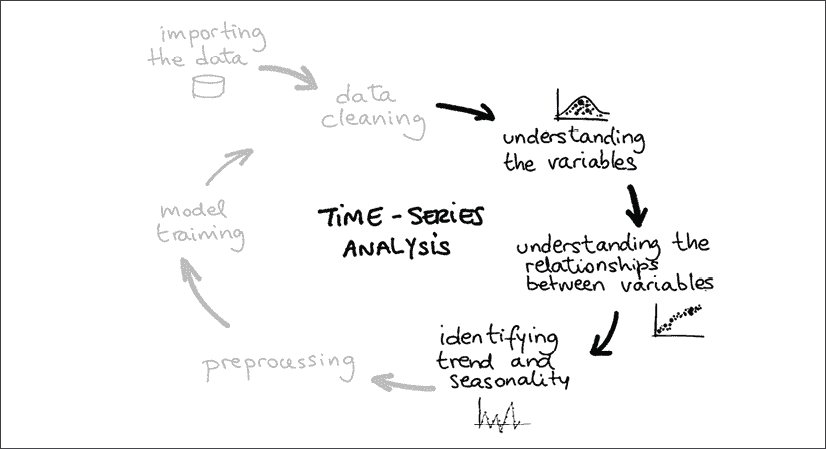

图 2.1：时间序列机器学习飞轮

这个飞轮强调了工作的迭代性质。例如，数据清理通常在加载数据后进行，但在我们对变量有了新的发现后，数据清理会再次出现。我已将 TSA 高亮显示为深色，而不是严格属于 TSA 的步骤则用灰色显示。

让我们从一些实际操作开始吧！我们将从加载数据集开始。在导入数据后，我们会提出一些问题，比如数据集的大小是多少（观察值的数量）？我们有多少个特征或列？这些列的类型是什么？

我们通常会查看直方图或分布图。为了评估特征与目标变量之间的关系，我们会计算相关性，并将其可视化为相关性热图，其中变量之间的相关强度会映射为不同的颜色。

我们会查找缺失值——在电子表格中，这些通常是空单元格——然后清理并尽可能修正这些不规则之处。

我们将分析变量之间的关系，在时间序列分析（TSA）中，它的一个特殊之处是我们需要研究时间与每个变量之间的关系。

通常，区分不同技术的一种有用方式是区分单变量分析和多变量分析，以及图形化技术和非图形化技术。**单变量分析**意味着我们只关注单一变量。这意味着我们可以检查值以获取均值和方差，或者——在图形化方面——绘制分布图。我们将在 *理解变量* 部分总结这些技术。

另一方面，**多变量分析**意味着我们在计算变量之间的相关性，或者——在图形化方面——例如绘制散点图。我们将在 *揭示变量之间的关系* 部分深入探讨这些技术。

在继续之前，我们先了解一些 Python 时间序列的基础知识。这将涵盖时间序列数据的基本操作作为介绍。之后，我们将使用实际数据集通过 Python 命令进行操作。

# 在 Python 中处理时间序列

Python 有很多用于时间序列的库和包，比如 `datetime`、`time`、`calendar`、`dateutil` 和 `pytz`，这可能会让初学者感到非常困惑。同时，还有许多不同的数据类型，如 `date`、`time`、`datetime`、`tzinfo`、`timedelta`、`relativedelta` 等。

在使用它们时，关键在于细节。举个例子：许多这些类型对时区不敏感。然而，你可以放心，入门时，熟悉这些库和数据类型的一个小子集就足够了。

## 要求

在这一章中，我们将使用几个库，可以通过终端（或类似的 Anaconda Navigator）快速安装：

```py
pip install -U dython scipy numpy pandas seaborn scikit-learn 
```

我们将从 Python（或 IPython）终端执行命令，但同样也可以从 Jupyter notebook（或其他环境）中执行它们。

如果我们至少了解 `datetime` 和 `pandas` 这两个非常重要的库，那是一个不错的开始，接下来我们将在后续两节中介绍它们。我们将创建基本对象并对其进行简单操作。

## Datetime

`date` 和 `datetime` 数据类型在 Python 中不是原始类型，像数字（`float` 和 `int`）、`string`、`list`、`dictionary`、`tuple` 或 `file` 那样。要使用 `date` 和 `datetime` 对象，我们必须导入 `datetime`，这是 Python 标准库的一部分，它是 CPython 和其他主要 Python 发行版默认带有的库。

`datetime` 提供了如 `date`、`datetime`、`time` 和 `timedelta` 等对象。`datetime` 和 `date` 对象的区别在于，`datetime` 对象除了日期外，还包含了时间信息。

要获取一个日期，我们可以这样做：

```py
from datetime import date 
```

要获取今天的日期：

```py
today = date.today() 
```

要获取其他日期：

```py
other_date = date(2021, 3, 24) 
```

如果我们想要一个`datetime`对象（时间戳），我们也可以这样做：

```py
from datetime import datetime
now = datetime.now() 
```

这将获取当前的时间戳。我们也可以为特定的日期和时间创建一个`datetime`：

```py
some_date = datetime(2021, 5, 18, 15, 39, 0)
some_date.isoformat() 
```

我们可以得到一个 isoformat 的字符串输出：

```py
'2021-05-18T15:39:00' 
```

isoformat 是 ISO 8601 格式的缩写，是表示日期和时间的国际标准。

我们还可以使用`timedelta`处理时间差：

```py
from datetime import timedelta 
year = timedelta(days=365) 
```

这些`timedelta`对象可以添加到其他对象进行计算。例如，我们可以使用`timedelta`对象进行计算：

```py
year * 10 
```

这应该给我们以下输出：

```py
datetime.timedelta(days=3650) 
```

datetime 库可以将字符串输入解析为`date`或`datetime`类型，并将这些对象输出为`string`：

```py
from datetime import date
some_date = date.fromisoformat('2021-03-24') 
```

或者：

```py
some_date = datetime.date(2021, 3, 24) 
```

我们可以使用字符串格式选项格式化输出，例如像这样：

```py
some_date.strftime('%A %d. %B %Y') 
```

这将给我们：

```py
'Wednesday 24\. March 2021' 
```

同样地，我们可以从字符串中读取`date`或`datetime`对象，并且可以使用相同的格式选项：

```py
from datetime import datetime
dt = datetime.strptime('24/03/21 15:48', '%d/%m/%y %H:%M') 
```

你可以在这里找到完整的格式选项列表，既可以用于解析字符串，也可以用于打印`datetime`对象：[`strftime.org/`](https://strftime.org/)。

这个表中列出了一些重要的内容：

| 格式字符串 | 含义 |
| --- | --- |
| %Y | 四位数表示的年份 |
| %y | 两位数表示的年份 |
| %m | 月份的数字表示 |
| %d | 天 |
| %H | 两位数表示的小时 |
| %M | 两位数表示的分钟 |

图 2.2：日期格式字符串

记住这些带有格式选项的字符串很有用。例如，用斜杠分隔的美国日期的格式字符串看起来像这样：

```py
'%d/%m/%Y' 
```

## pandas

在上一章中我们介绍了 pandas 库。pandas 是 Python 生态系统中数据科学中最重要的库之一，用于数据处理和分析。最初发布于 2008 年，它已成为 Python 成功的重要驱动因素之一。

pandas 具有重要的时间序列功能，如日期范围生成、频率转换、移动窗口统计、日期偏移和滞后。

让我们通过一些基础知识来创建一个时间序列，如下所示：

```py
import pandas as pd
pd.date_range(start='2021-03-24', end='2021-09-01') 
```

这给我们一个像这样的`DateTimeIndex`：

```py
DatetimeIndex(['2021-03-24', '2021-03-25', '2021-03-26', '2021-03-27',
               '2021-03-28', '2021-03-29', '2021-03-30', '2021-03-31',
               '2021-04-01', '2021-04-02',
               ...
               '2021-08-23', '2021-08-24', '2021-08-25', '2021-08-26',
               '2021-08-27', '2021-08-28', '2021-08-29', '2021-08-30',
               '2021-08-31', '2021-09-01'],
              dtype='datetime64[ns]', length=162, freq='D') 
```

我们还可以按如下方式创建一个时间序列：

```py
pd.Series(pd.date_range("2021", freq="D", periods=3)) 
```

这将给我们一个类似这样的时间序列：

```py
0   2021-01-01
1   2021-01-02
2   2021-01-03
dtype: datetime64[ns] 
```

正如你所见，这种类型称为`DatetimeIndex`。这意味着我们可以使用这种数据类型来索引数据集。

其中最重要的功能之一是从`string`或单独的列解析到`date`或`datetime`对象：

```py
import pandas as pd
df = pd.DataFrame({'year': [2021, 2022],
    'month': [3, 4],
    'day': [24, 25]}
)
ts1 = pd.to_datetime(df)
ts2 = pd.to_datetime('20210324', format='%Y%m%d') 
```

我们创建了两个时间序列。

你可以像这样进行滚动窗口计算：

```py
s = pd.Series([1, 2, 3, 4, 5])
s.rolling(3).sum() 
```

你能猜到这个的结果吗？如果不能，为什么不在你的 Python 解释器中试试？

一个时间序列通常会是一个带有时间对象的索引和一个或多个带有数字或其他类型的列，如下所示：

```py
import numpy as np 
rng = pd.date_range('2021-03-24', '2021-09-01', freq='D')
ts = pd.Series(np.random.randn(len(rng)), index=rng) 
```

我们可以看一下我们的时间序列：

```py
2021-03-24   -2.332713
2021-03-25    0.177074
2021-03-26   -2.136295
2021-03-27    2.992240
2021-03-28   -0.457537
                 ...
2021-08-28   -0.705022
2021-08-29    1.089697
2021-08-30    0.384947
2021-08-31    1.003391
2021-09-01   -1.021058
Freq: D, Length: 162, dtype: float64 
```

我们可以像处理任何其他 pandas Series 或 DataFrame 一样索引这些时间序列数据集。`ts[:2].index`会给我们：

```py
DatetimeIndex(['2021-03-24', '2021-03-25'], dtype='datetime64[ns]', freq='D') 
```

有趣的是，我们可以直接使用字符串或 datetime 对象进行索引。例如，`ts['2021-03-28':'2021-03-30']`会给我们：

```py
2021-03-28   -0.457537
2021-03-29   -1.089423
2021-03-30   -0.708091
Freq: D, dtype: float64 
```

你可以使用`shift`方法将时间序列的值向前或向后移动。这会改变数据的对齐方式：

```py
ts.shift(1)[:5] 
```

我们还可以改变时间序列对象的分辨率，例如这样：

```py
ts.asfreq('M') 
```

请注意`datetime`与`pd.DateTimeIndex`之间的区别。尽管它们编码的是相同类型的信息，但它们是不同的数据类型，并且可能并不总是能很好地互相配合。因此，我建议在进行比较时总是显式地转换数据类型。

在下一节中，让我们通过一个基本的示例来演示如何导入时间序列数据集，获取汇总统计数据，并绘制一些变量。

# 了解变量

我们将加载一个空气污染的时间序列数据集，然后对变量进行一些非常基础的检查。

这一步是对每个变量单独执行的（单变量分析），可以包括每个变量的汇总统计数据、直方图、查找缺失值或异常值，并检验平稳性。

连续变量最重要的描述量是均值和标准差。提醒一下，均值和标准差的公式如下。我们稍后会基于这些公式构建更复杂的公式。**均值**通常指的是算术平均值，它是最常用的平均数，定义如下：

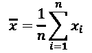

**标准差**是该均值的平均平方差的平方根：

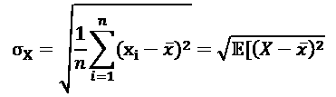

**标准误差**（**SE**）是样本数据标准差的近似值。它衡量的是样本均值围绕总体均值的离散程度，但通过样本量的平方根进行标准化。参与计算的数据点越多，标准误差通常越小。SE 等于标准差除以样本量的平方根：

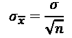

标准误差（SE）的一个重要应用是估计均值的置信区间。**置信区间**为一个参数提供了一个值的范围。例如，95^(th) 百分位上置信限，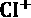，定义为：

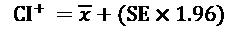

同样，替换加号为减号，下置信区间定义为：

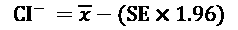

**中位数**是另一种平均数，特别适用于数据不能被均值和标准差准确描述的情况。比如数据有长尾、多个峰值，或者向某一方向偏斜。中位数定义如下：

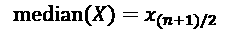

这假设 *X* 按照升序或降序排列。然后，位于中间的值，正好在 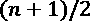 处，是中位数。中位数是第 50^(th) **百分位数**，意味着它高于 *X* 中恰好一半或 50% 的数据点。其他重要的百分位数是第 25^(th) 和第 75^(th)，它们也分别是第一个 **四分位数** 和第三个四分位数。它们之间的差值被称为 **四分位差**。

这些是最常见的描述符，但即使如此，它们也不是唯一的。我们在这里不会深入讨论，但稍后会看到更多的描述符。

让我们用一些代码来动手实践吧！

我们将导入 datetime、pandas、matplotlib 和 seaborn 以便稍后使用。Matplotlib 和 seaborn 是绘图的库。代码如下：

```py
import datetime
import pandas as pd
import matplotlib.pyplot as plt 
```

然后我们将读取一个 CSV 文件。数据来自 **Our World in Data** (**OWID**) 网站，这是一个关于世界状况的统计和文章集合，由牛津大学经济学研究主任 Max Roser 维护。

我们可以加载本地文件或互联网上的文件。在这种情况下，我们将从 GitHub 加载一个数据集。这是一个关于空气污染物随时间变化的数据集。在 pandas 中，你可以直接将 URL 传递给 `read_csv()` 方法：

```py
pollution = pd.read_csv(
    'https://raw.githubusercontent.com/owid/owid-datasets/master/datasets/Air%20pollution%20by%20city%20-%20Fouquet%20and%20DPCC%20(2011)/Air%20pollution%20by%20city%20-%20Fouquet%20and%20DPCC%20(2011).csv'
)
len(pollution) 
```

```py
331 
```

```py
pollution.columns 
```

```py
Index(['Entity', 'Year', 'Smoke (Fouquet and DPCC (2011))',
       'Suspended Particulate Matter (SPM) (Fouquet and DPCC (2011))'],
      dtype='object') 
```

如果你在下载文件时遇到问题，可以通过手动从书籍的 GitHub 仓库 `chapter2` 文件夹下载。

现在我们知道数据集的大小（331 行）和列名。列名有点长，让我们通过重命名来简化它们，然后继续：

```py
pollution = pollution.rename(
    columns={
        'Suspended Particulate Matter (SPM) (Fouquet and DPCC (2011))':            'SPM',
           'Smoke (Fouquet and DPCC (2011))' : 'Smoke',
        'Entity': 'City'
    }
)
pollution.dtypes 
```

这是输出结果：

```py
City                                object
Year                                 int64
Smoke                              float64
SPM                                float64
dtype: object 
```

```py
pollution.City.unique() 
```

```py
array(['Delhi', 'London'], dtype=object) 
```

```py
pollution.Year.min(), pollution.Year.max() 
```

最小年份和最大年份如下：

```py
(1700, 2016) 
```

pandas 提供了很多方法来探索和发现数据集——`min()`、`max()`、`mean()`、`count()` 和 `describe()` 都非常实用。

City、Smoke 和 SPM 是更清晰的变量名称。我们已经知道数据集涵盖了伦敦和德里两座城市，以及 1700 年至 2016 年之间的时间段\。

我们将把 Year 列从 `int64` 转换为 `datetime`。这将有助于绘图：

```py
pollution['Year'] = pollution['Year'].apply(
    lambda x: datetime.datetime.strptime(str(x), '%Y')
)
pollution.dtypes 
```

```py
City             object
Year     datetime64[ns]
Smoke           float64
SPM             float64
dtype: object 
```

Year 现在是 `datetime64[ns]` 类型。它是 64 位的 `datetime` 类型。每个值描述一个纳秒，默认单位。

让我们检查是否有缺失值，并获取列的描述性统计信息：

```py
pollution.isnull().mean() 
```

```py
City                               0.000000
Year                               0.000000
Smoke                              0.090634
SPM                                0.000000
dtype: float64 
```

```py
pollution.describe() 
```

```py
 Smoke    SPM
count    301.000000    331.000000
mean     210.296440    365.970050
std      88.543288     172.512674
min      13.750000     15.000000
25%      168.571429    288.474026
50%      208.214286    375.324675
75%      291.818182    512.609209
max      342.857143    623.376623 
```

Smoke 变量有 9% 的缺失值。目前，我们可以专注于没有缺失值的 SPM 变量。

pandas 的 `describe()` 方法为我们提供了非空值的计数、均值和标准差、第 25、第 50 和第 75 百分位数，以及范围（最小值和最大值）。

**直方图**，最早由卡尔·皮尔逊提出，是在一系列范围（称为区间或桶）内的值的计数。变量首先被分为一系列区间，然后统计每个区间内的所有点数（区间计数）。我们可以通过条形图来直观地呈现这些计数。

让我们绘制 SPM 变量的直方图：

```py
n, bins, patches = plt.hist(
    x=pollution['SPM'], bins='auto',
    alpha=0.7, rwidth=0.85
)
plt.grid(axis='y', alpha=0.75)
plt.xlabel('SPM')
plt.ylabel('Frequency') 
```

这是我们得到的图表：

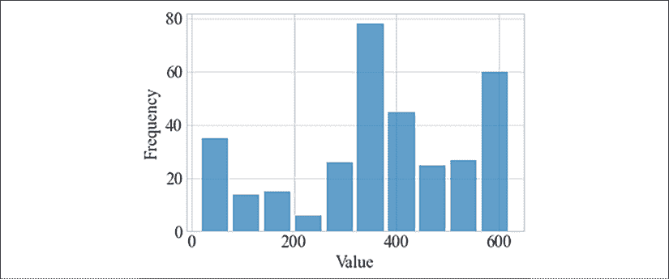

图 2.3：SPM 变量的直方图

如果你有连续的测量数据并且想要了解数值的分布，直方图可以提供帮助。此外，直方图还可以指示是否存在异常值。

这结束了我们 TSA 的第一部分。稍后我们会回到我们的空气污染数据集。

# 揭示变量之间的关系

如果我们不是在处理单变量时间序列（只有一个变量），那么变量之间的关系需要进行调查。这包括任何相关性的方向和大致大小。这一点非常重要，以避免特征泄漏和共线性。

**特征泄漏**是指一个变量无意中泄露了目标。例如，名为`amount_paid`的变量会泄露标签`has_paid`。一个更复杂的例子是，如果我们正在分析一个在线超市的数据，我们的数据集包括了诸如年龄、过去购买次数、访问时长以及他们购物车中的商品内容等客户变量。我们想要预测的目标是他们的购买决策结果，可能是放弃（取消购买）或已支付。我们可能会发现购买与购物车中的袋子有很高的相关性，仅仅是因为袋子是在最后一步添加的。然而，得出结论认为我们应该向客户提供袋子，当他们进入我们的网站时，可能就会错失重点，实际上决定变量可能是他们的停留时间，而通过小工具或客服干预可能更有效。

**共线性**指的是自变量（特征）之间存在相关性。在线性模型中，后一种情况可能会带来问题。因此，如果我们进行线性回归并发现两个变量之间高度相关，我们应该去除其中一个，或使用降维技术，如主成分分析（PCA）。

**皮尔逊相关系数**由卡尔·皮尔逊（Karl Pearson）开发，我们在前一章中已经讨论过他，并以他命名，以便将其与其他相关系数区分开来。两个变量*X*和*Y*之间的皮尔逊相关系数定义如下：

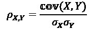

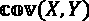 是两个变量之间的协方差，它定义为每个点与变量均值的差异的期望值（均值）：

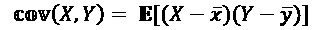

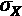 是变量*X*的标准差。

展开后，公式看起来是这样的：

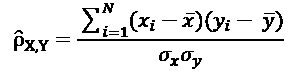

相关性有三种类型：正相关、负相关和无相关性。正相关意味着当一个变量增加时，另一个也会增加。在皮尔逊相关系数的情况下，一个变量对另一个变量的增加应该是线性的。

如果我们查看从 1800 年开始的全球预期寿命图表，我们会看到随着时间轴的推移，预期寿命逐年增加。您可以看到基于 OWID 数据的全球预期寿命图：

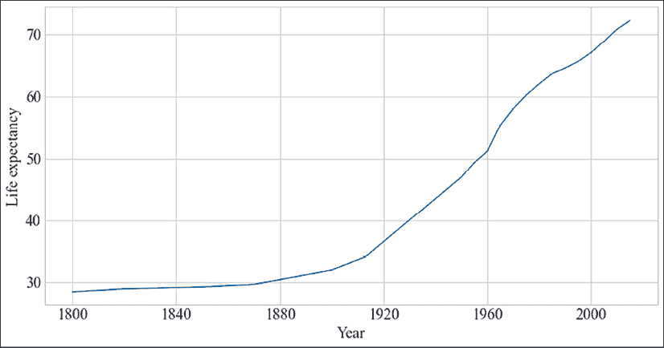

图 2.4：1800 年至今的预期寿命

我们可以看到，自 19 世纪末以来，预期寿命一直在稳步上升，直到今天。

这个图表被称为**运行图**或时间**折线图**。

为了计算皮尔逊相关系数，我们可以使用 SciPy 中的一个函数：

```py
from scipy import stats
def ignore_nans(a, b):
    index = ~a.isnull() & ~b.isnull()
    return a[index], b[index]
stats.pearsonr(*ignore_nans(pollution['Smoke'], pollution['SPM'])) 
```

这是皮尔逊相关系数和表示显著性的 p 值（越低越显著）

```py
(0.9454809183096181, 3.313283689287137e-10 
```

我们看到时间与预期寿命之间有一个非常强的正相关，相关系数为 0.94，显著性非常高（返回值中的第二个数字）。您可以在 OWID 网站上找到有关数据集的更多细节。

相反，我们会看到时间与儿童死亡率之间的负相关关系——年份增加时，儿童死亡率降低。这个图表显示了每千名儿童的儿童死亡率，数据来自 OWID：

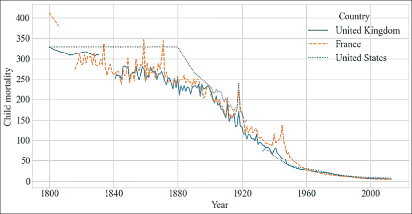

图 2.5：英国、法国和美国从 1800 年至今的儿童死亡率

在这个图表中，我们可以看到，自 19 世纪开始到今天，所有三个国家的儿童死亡率都在不断下降。

对于美国，我们将发现儿童死亡率与时间之间存在-0.95 的负相关。

我们还可以将这些国家相互比较。我们可以计算每个特征之间的相关性。在这种情况下，每个特征包含了三个国家的数值。

这给出了一个**相关矩阵**，是 3x3 的，我们可以将其可视化为热图：

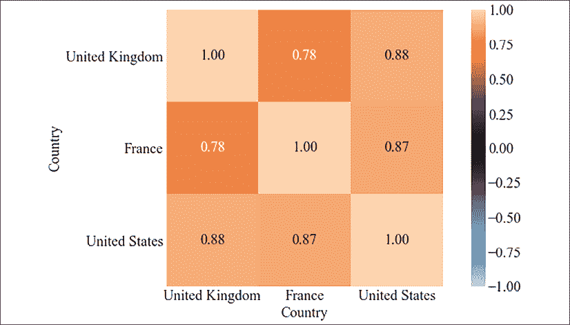

图 2.6：英国、法国和美国之间儿童死亡率的相关热图

在这张相关热图中，我们可以看到各国之间的高度相关性（例如，法国和英国之间的相关性为 0.78）。

相关矩阵的对角线总是 1.0，并且矩阵沿对角线是对称的。因此，有时我们只显示对角线下方的下三角（或者有时显示上三角）。我们可以看到，英国的儿童死亡率与美国更为相似，而不是与法国。

这是否意味着英国经历了与美国相似的发展？这些统计数据和可视化常常会引发问题，或者提出我们可以检验的假设。

如前所述，不同数据集的完整笔记本已在 GitHub 上提供，但这里是热图的代码片段：

```py
import dython
dython.nominal.associations(child_mortality[countries], figsize=(12, 6)); 
```

相关系数在增加非线性或不连续，或（由于平方项）出现异常值的情况下难以发挥作用。例如，如果我们从 18 世纪开始观察空气污染，我们会看到煤炭带来的空气污染急剧增加，而随着蒸汽机的引入，污染物反而有所减少。

**散点图**可以用来显示和比较数值。它将两个变量的值相互对比。通常，变量是数值型的——否则我们称之为表格。如果散点图在某些区域过于拥挤，可能会产生误导，因此如果不能在视觉上识别这一点，图表就会具有误导性。通过添加抖动和透明度可以在一定程度上改善这种情况，然而，我们还可以将散点图与我们正在对比的变量的直方图结合，这样我们就可以看到在每个变量上有多少点被显示出来。散点图通常会有一条最佳拟合线，以便可视化一个变量是如何依赖于另一个变量的。

这是如何绘制带有边际直方图的散点图的一个示例，数据来自污染数据集：

```py
plt.figure(figsize=(12, 6))
sns.jointplot(
    x="Smoke", y="SPM",
    edgecolor="white",
    data=pollution
)
plt.xlabel("Smoke")
plt.ylabel("SPM"); 
```

这是生成的图表：

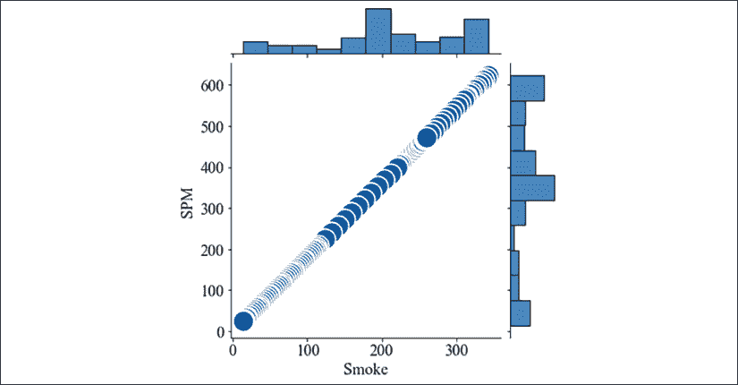

图 2.7：带有边际直方图的散点图，显示烟雾与 SPM 的关系

在散点图中，我们可以看到这两个变量非常相似——所有的数值都位于对角线上。这两个变量之间的相关性完美无缺，达到 1.0，这意味着它们实际上是相同的。

我们之前看过**悬浮颗粒物**（**SPM**）的数据集。现在让我们将 SPM 随时间变化的情况绘制出来：

```py
pollution = pollution.pivot("Year", "City", "SPM")
plt.figure(figsize=(12, 6))
sns.lineplot(data=pollution)
plt.ylabel('SPM'); 
```

这是该图表：

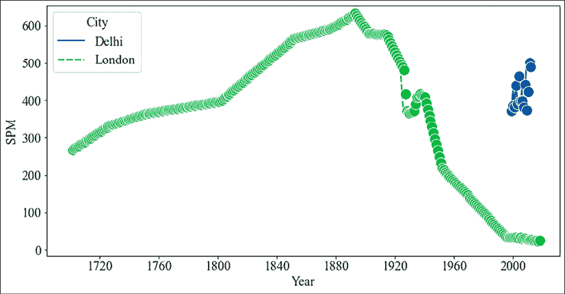

图 2.8：从 1700 年代到今天的悬浮颗粒物

我们可以在图中看到，伦敦的空气质量（以悬浮颗粒物为标准）在 1880 年之前变得越来越差（可能是因为使用了木材和煤等取暖材料），然而，之后开始逐渐改善。

我们发现相关系数为-0.36，并且具有很高的显著性。从 1880 年开始，污染物的急剧下降压倒了之前 180 年缓慢增长的趋势。如果我们分别观察 1700 年至 1880 年和 1880 年至今的时间段，我们会发现相关系数分别为 0.97 和-0.97，这分别是非常强的正相关和非常强的负相关。

**斯皮尔曼等级相关**比皮尔逊相关系数更好地处理离群值和非线性关系——尽管它无法处理像上面那种非连续的情况。斯皮尔曼相关系数就是皮尔逊相关系数，只不过它是应用于变量值的等级顺序，而不是变量值本身。对于空气污染的时间序列，斯皮尔曼相关系数为-0.19，而对于 1880 年之前和之后的两个时间段，我们分别得到 0.99 和-0.99。

在斯皮尔曼相关系数的情况下，数值差异被忽略——关键是点的顺序。在这种情况下，两个时间段内的点的顺序几乎完美地对齐。

在接下来的部分，我们将讨论趋势和季节性。

# 识别趋势和季节性

趋势、季节性和周期性变化是时间序列中最重要的特征。**趋势**是指序列中长期的增加或减少。**季节性**是指在特定的规律间隔内发生的变化，通常间隔小于一年。季节性变化可以在不同的时间跨度上发生，比如每天、每周、每月或每年。最后，**周期性变化**是指频率不固定的上升和下降。

时间序列的一个重要特征是**平稳性**。这指的是时间序列在时间推移中分布不变的性质，换句话说，产生该时间序列的过程随着时间的推移并不发生变化。不随时间变化的时间序列被称为**平稳序列**（或**平稳过程**）。许多模型或度量假设时间序列是平稳的，如果数据不是平稳的，这些模型可能无法正常工作。因此，对于这些算法，时间序列应该首先分解成主要信号，然后再分解出季节性和趋势成分。在这个分解过程中，我们会从原始时间序列中减去趋势和季节性成分。

在这一节中，我们将首先通过一个示例来展示如何使用曲线拟合估算趋势和季节性。然后，我们将介绍其他有助于发现趋势、季节性和周期性变化的工具。这些工具包括统计方法，如自相关性和扩展的 Dickey–Fuller 检验，以及可视化工具，如自相关图（也叫滞后图）和周期图。

让我们从一个清晰的例子开始，展示如何在仅仅几行 Python 代码中估算季节性和趋势。为此，我们将回到 NASA 发布的 GISS 地表温度分析数据集。我们将加载该数据集，并进行曲线拟合，NumPy 中自带有此功能。

我们将从 Datahub 下载数据集（[`datahub.io/core/global-temp`](https://datahub.io/core/global-temp)），或者你也可以在书本的 GitHub 仓库中找到它（在`chapter2`文件夹中）。

然后，我们可以加载并对其进行透视处理：

```py
temperatures = pd.read_csv('/Users/ben/Downloads/monthly_csv.csv')
temperatures['Date'] = pd.to_datetime(temperatures['Date'])
temperatures = temperatures.pivot('Date', 'Source', 'Mean') 
```

现在我们可以使用 NumPy 的 polyfit 功能。它拟合的是如下形式的多项式：

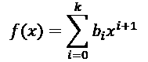

在这个公式中，*k*是多项式的次数，*b*是我们要找的系数。

这只是 NumPy 中的一个函数，用于拟合系数。我们可以使用相同的函数来拟合季节性变化和趋势。由于趋势可能主导季节性变化，因此在估算季节性之前，我们需要去除趋势：

```py
from numpy import polyfit
def fit(X, y, degree=3):
    coef = polyfit(X, y, degree)
    trendpoly = np.poly1d(coef)
    return trendpoly(X)
def get_season(s, yearly_periods=4, degree=3):
    X = [i%(365/4) for i in range(0, len(s))]
    seasonal = fit(X, s.values, degree)
    return pd.Series(data=seasonal, index=s.index)
def get_trend(s, degree=3):
    X = list(range(len(s)))
    trend = fit(X, s.values, degree)
    return pd.Series(data=trend, index=s.index) 
```

让我们在全球气温上升的基础上绘制季节性和趋势图！

```py
import seaborn as sns
plt.figure(figsize=(12, 6))
temperatures['trend'] = get_trend(temperatures['GCAG'])
temperatures['season'] = get_season(temperatures['GCAG'] - temperatures['trend'])
sns.lineplot(data=temperatures[['GCAG', 'season', 'trend']])
plt.ylabel('Temperature change'); 
```

这是我们得到的图表：

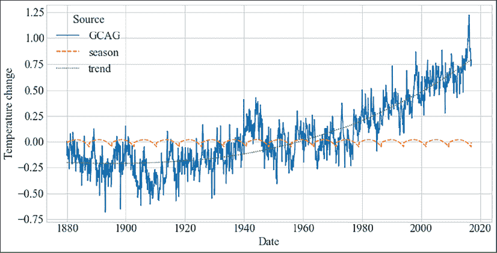

图 2.9：从 19 世纪末到今天的温度变化

这展示了你可以使用 NumPy 中的插件功能进行曲线拟合，以便找到趋势和季节性。如果你想进一步实验，可以调整多项式的阶数或季节性分量，看看能否得到更好的拟合，或者找到另一个季节性成分。我们本来也可以使用其他库的功能，比如`statsmodels`中的`seasonal.seasonal_decompose()`，或者 Facebook 的 Prophet，它通过傅里叶系数来分解季节性成分。

现在我们已经看到了如何估计季节性和趋势，接下来我们将讨论其他统计量和可视化。继续使用污染数据集，并且拿起我们在*第一章*中看到的 EEG 数据集，我们将在 Python 中实际展示如何获取这些统计量和图表，并如何识别趋势和季节性。

**自相关**是信号与其滞后版本之间的相关性。自相关图绘制了自相关与滞后之间的函数关系。自相关图有助于发现重复的模式，通常用于信号处理。自相关有助于识别周期性信号。让我们绘制污染数据的自相关：

```py
pollution = pollution.pivot("Year", "City", "SPM")
pd.plotting.autocorrelation_plot(pollution['London']) 
```

这是我们得到的图：

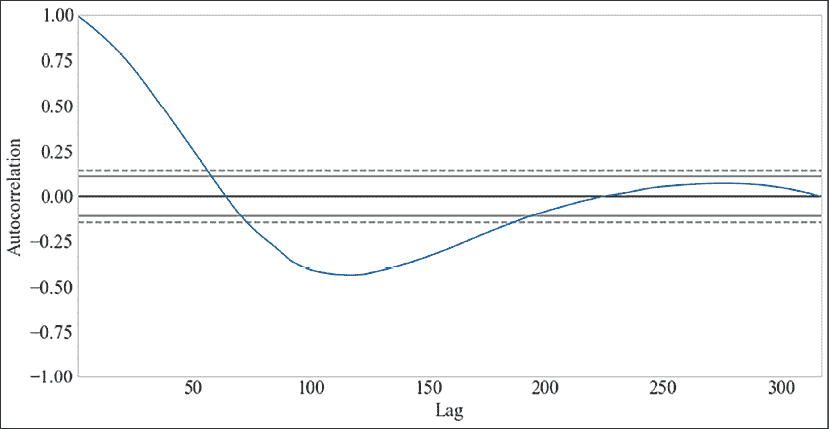

图 2.10：伦敦污染的自相关图

我们可以看到高自相关仅在几年的滞后下出现。在大约 100 年时，有一个负自相关点，之后自相关保持在 0 附近。

SPM 图清楚地表明，空气污染不是一个平稳过程，因为自相关并没有平坦。你还可以比较污染的走势，显示出有**趋势**，因此均值也发生变化——这是序列非平稳的另一个指示。

我们还可以进行统计检验。检验平稳性的方法是扩展的迪基–富勒检验：

```py
from statsmodels.tsa import stattools
stattools.adfuller(pollution['London']) 
```

```py
(-0.33721640804242853,
 0.9200654843183897,
 13,
 303,
 {'1%': -3.4521175397304784,
  '5%': -2.8711265007266666,
  '10%': -2.571877823851692},
 1684.6992663493872) 
```

第二个返回值是 p 值，它表示在给定零假设的情况下，得到至少与观察结果一样极端的测试结果的显著性或概率。当 p 值小于 5%或 0.05 时，我们通常会拒绝零假设，并且可以假设我们的时间序列是平稳的。在我们的案例中，我们不能假设该序列是平稳的。

我们在*第一章*《使用 Python 进行时间序列分析简介》中看到了**脑电图**（**EEG**）信号的图，并提到 EEG 信号显示了多个频率范围的脑电波。

我们可以很漂亮地可视化这个。让我们一步步在 Python 中实现。首先我们需要进行一些导入：

```py
import pandas as pd
import matplotlib.pyplot as plt
from matplotlib.dates import DateFormatter
import seaborn as sns
from sklearn.datasets import fetch_openml 
```

OpenML 是一个提供基准数据集并有一个用于比较机器学习算法的网站的项目。scikit-learn 库提供了一个与 OpenML 的接口，允许我们从 OpenML 中获取数据。整个测量过程持续了 117 秒。所以我们需要在 pandas 中正确设置它作为索引：

```py
eeg = fetch_openml(data_id=1471, as_frame=True)
increment = 117 / len(eeg['data'])
import numpy as np
index = np.linspace(
    start=0,
    stop=increment*len(eeg['data']),
    num=len(eeg['data'])
)
ts_index = pd.to_datetime(index, unit='s')
v1 = pd.Series(name='V1', data=eeg['data']['V1'].values, index=ts_index) 
```

我们可以直接切片我们的数据集。请注意，`DatetimeIndex`的基准时间是 1970 年，但在这里我们可以安全地忽略这一点：

```py
slicing = (v1.index >= '1970-01-01 00:00:08') & (v1.index <='1970-01-01 00:01:10.000000000')
v1[slicing] 
```

这是切片：

```py
1970-01-01 00:00:08.006208692    4289.74
1970-01-01 00:00:08.014019627    4284.10
1970-01-01 00:00:08.021830563    4280.00
1970-01-01 00:00:08.029641498    4289.74
1970-01-01 00:00:08.037452433    4298.46
                                  ...   
1970-01-01 00:01:09.962547567    4289.74
1970-01-01 00:01:09.970358502    4283.08
1970-01-01 00:01:09.978169437    4284.62
1970-01-01 00:01:09.985980373    4289.23
1970-01-01 00:01:09.993791308    4290.77
Name: V1, Length: 7937, dtype: float64 
```

这种切片避免了在大约 1:20 时发生的伪影，即强烈的峰值。

我们在*第一章*中看到的图，可以如下绘制：

```py
date_formatter = DateFormatter("%S")
ax = v1[slicing].plot(figsize=(12, 6))
ax.xaxis.set_major_formatter(date_formatter)
plt.ylabel('voltage') 
```

这是再次展示的图：

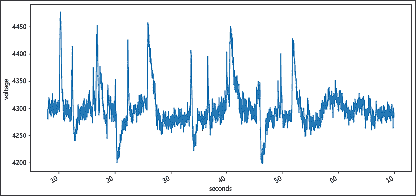

图 2.11：EEG 信号随时间变化的电压

这是 EEG 信号随时间变化的图。

我们也可以重新采样数据，以更粗略的方式查看该系列，分辨率较低，例如如下所示：

```py
plt.subplot(311)
ax1 = v1[slicing].resample('1s').mean().plot(figsize=(12, 6))
ax1.xaxis.set_major_formatter(date_formatter)
plt.subplot(312)
ax1 = v1[slicing].resample('2s').mean().plot(figsize=(12, 6))
ax1.xaxis.set_major_formatter(date_formatter)
plt.subplot(313)
ax2 = v1[slicing].resample('5s').mean().plot(figsize=(12, 6))
ax2.xaxis.set_major_formatter(date_formatter) 
plt.xlabel('seconds'); 
```

这是从重新采样得到的三幅子图，分别对应 1 秒、2 秒和 5 秒的频率：

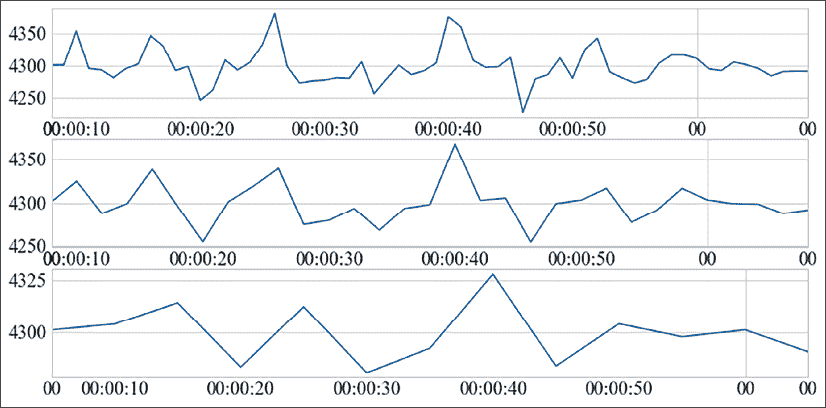

图 2.12：重新采样的 EEG 信号

图中每个重新采样的信号可能根据应用的不同，分析的效果有所不同。对于高频分析，我们不应该进行重新采样，而如果我们试图去除尽可能多的噪声，则应将时间分辨率采样得更粗一些。

我们可以在谱密度图上查看周期性活动。我们可以通过应用傅里叶变换来实现。这里我们使用了 Welch 方法，它先对时间进行平均，然后再应用离散傅里叶变换：

```py
from scipy import signal
fs = len(eeg['data']) // 117
f, Pxx_den = signal.welch(
    v1[slicing].values,
    fs,
    nperseg=2048,
    scaling='spectrum'
)
plt.semilogy(f, Pxx_den)
plt.xlabel('frequency [Hz]')
plt.ylabel('PSD [V**2/Hz]') 
```

谱密度图，即**周期图**，如下所示：

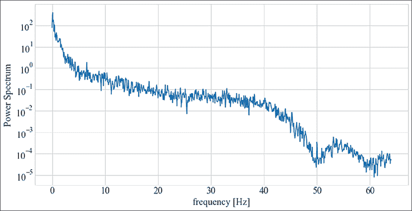

图 2.13：EEG 信号的周期图

这个图的信息类似于我们为污染绘制的自相关图，然而，它给了我们关于某些频率的显著性的更多信息。在这种情况下，我们看到低频特别强劲。换句话说，信号显示出缓慢的振荡。

这也标志着本章的结束。让我们总结一下我们所涵盖的内容。

# 总结

在本章中，我们介绍了 TSA（时间序列分析）作为从时间序列中提取摘要和其他统计信息的过程。我们将这一过程分解为理解变量、揭示变量之间的关系以及识别趋势和季节性。

我们介绍了 datetime 和 pandas，这两个在 TSA 中*不可或缺*的库及其在时间序列中的功能；例如，重新采样。在本章中，我们列举并定义了许多摘要统计量，包括均值、标准差、中位数、标准误、置信区间、皮尔逊相关系数和协方差。

我们还讨论了季节性、周期性变化和平稳性等概念。我们讨论了为什么平稳性很重要，以及如何测试平稳性。

我们还展示了使用 Matplotlib 和 Seaborn 绘图的功能，以及如何生成不同类型的图表，如运行图、时间序列图、相关性热图、直方图、散点图、自相关图和周期图。在实际示例中，我们使用了自相关图，它展示了不同时间步之间的相关性，以及周期图，它可视化了功率谱密度。
