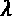
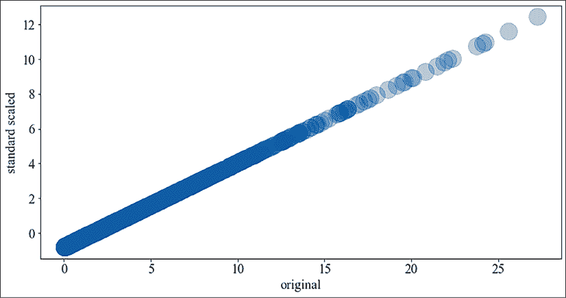

# 第三章：时间序列的预处理

预处理是机器学习中的关键步骤，但却常常被忽视。许多书籍对预处理没有深入讨论，甚至完全跳过了预处理。在向外部人员展示机器学习项目时，大家的好奇心自然会集中在算法上，而不是数据集或预处理上。

预处理相对较少被关注的原因之一可能是它比机器学习本身不那么吸引人。然而，它通常是最耗时的步骤，有时被估计占整个机器学习过程的 98%。而且，预处理往往是那种相对简单的工作对最终机器学习模型性能产生巨大影响的步骤。数据的质量在很大程度上决定了结果——低质量的输入在最糟糕的情况下甚至可能完全使机器学习工作无效（这也就是俗话所说的“垃圾进，垃圾出”）。

预处理包括对数据的整理和筛选，这与上一章中提到的分析过程有所重叠，*第二章*，*使用 Python 进行时间序列分析*。预处理的预期输出是一个更适合进行机器学习的数据集。这意味着它可能比原始数据集更可靠、噪声更少。

你可以在本书的 GitHub 仓库中找到本章的代码，形式为 Jupyter notebook。

我们将涵盖以下主题：

+   什么是预处理？

+   特征变换

+   特征工程

+   Python 实践

我们将从讨论预处理的基础知识开始。

# 什么是预处理？

任何曾在机器学习项目中工作过的人都知道，现实世界中的数据是杂乱无章的。数据通常是从多个来源或多个平台或记录设备中汇总的，而且它是不完整且不一致的。在预处理阶段，我们希望提高数据质量，以便能够成功应用机器学习模型。

数据预处理包括以下一组技术：

+   特征变换

    +   缩放

    +   幂/对数变换

    +   缺失值填补

+   特征工程

这些技术大致分为两类：一种是针对机器学习算法的假设进行调整（特征变换），另一种则是关注从多个基础特征中构造更复杂的特征（特征工程）。我们将仅讨论单变量特征变换，也就是一次只对一个特征进行变换。我们不会讨论多变量特征变换（数据降维），例如变量选择或降维，因为它们不特定于时间序列数据集。

缺失值是机器学习中的常见问题，因此我们将在本章讨论缺失值的填补（插补）。

我们将讨论特征作为预处理的基本单元。我们希望为机器学习过程创建输入特征，这些特征能够使模型更容易训练、更容易评估，或提高模型预测的质量。我们的目标是拥有能够预测目标且不相关（相互之间不冗余）的特征。去相关性是线性模型的要求，但对更现代的算法（例如基于树的算法）来说不那么重要。

虽然我们主要处理特征工程，但我们也会提到目标转换。我们可以更具体地称目标转换为目标工程；然而，由于应用于目标的方法与应用于特征的方法相同，所以我将它们包括在特征工程或特征转换的同一章节下。

请注意，我们将预处理的主要目标定义为提高特征的预测能力，换句话说，我们希望提高机器学习模型预测的质量。我们本可以将数据质量定义为准确性、完整性和一致性，这样定义会包括数据聚合和清洗技术，以及数据质量评估方法，范围更广。

在本章中，我们务实地将讨论范围缩小到在机器学习中的实用性。如果我们的模型不符合预期，我们可能需要重新收集数据、进行更多特征工程，或构建更好的模型。这再次强调了数据分析、预处理和机器学习是一个迭代过程。

**分箱**或**离散化**也可以是预处理的一部分，但也可以用于根据数据点的相似性对其进行分组。我们将在*第六章*中讨论离散化与其他聚类技术，*无监督时间序列方法*。

在继续之前，让我们先了解一些使用 Python 预处理时间序列数据集的基础知识。这将作为时间序列数据操作的理论介绍。

# 特征变换

许多模型或训练过程依赖于数据符合正态分布的假设。即使是最常用的描述符——算术平均值和标准差——如果数据集存在偏态或多个峰值（多模态），也几乎没有用处。不幸的是，观察到的数据通常不符合正态分布，这样传统算法可能会产生无效结果。

当数据不符合正态分布时，会对数据进行变换，使其尽可能接近正态分布，从而提高相关统计分析的有效性。

通常，处理时间序列数据时，避免使用传统的机器学习算法，而转而使用更新的、所谓的非线性方法，这些方法不依赖于数据的分布。

最后需要提到的是，尽管所有以下的变换和缩放方法可以直接应用于特征，但在时间序列数据集中的一个有趣之处是，时间序列随着时间的推移而变化，并且我们可能无法完全了解时间序列。许多变换方法都有在线变种，可以动态估算并调整所有统计数据。你可以查看*第八章*，*时间序列的在线学习*，以获取有关此主题的更多细节。

在下一节中，我们将讨论缩放问题，这在回归分析中是一个普遍问题。

## 缩放

有些特征有自然的界限，比如一个人的年龄或产品的生产年份。如果这些范围在不同特征之间有所不同，一些模型类型（尤其是线性模型）会遇到困难，更倾向于类似的范围和均值。

两种非常常见的缩放方法是最小-最大缩放和 Z-score 标准化。

**最小-最大缩放**涉及将特征的范围限制在两个常数 *a* 和 *b* 之间。其定义如下：


在特殊情况下，当 *a* 为 0 且 *b* 为 1 时，这会将特征的范围限制在 0 和 1 之间。

**Z-score 标准化**是将特征的均值设置为 0，方差设置为 1（单位方差），如下所示：


如果 *x* 来自高斯分布，  则是标准正态分布。

在下一节中，我们将研究对数和幂变换。这些变换非常重要，特别是对于传统的时间序列模型，我们将在*第五章*，*使用移动平均和自回归模型进行时间序列预测*中遇到这些模型。

## 对数和幂变换

对数和幂变换都可以将覆盖大范围的值压缩到一个较窄的输出范围内。**对数变换**是一种特征变换，其中每个值 *x* 被替换为 *log(x)*。

对数函数是指数函数的反函数，重要的是要记住，范围在 0 和 1 之间的值会被映射为负数（），而 *x>=1* 的值会被压缩到正数范围内。对数的选择通常是在自然对数和以 10 为底的对数之间，但也可以选择任何能帮助你的特征更接近对称的钟形分布（即正态分布）的对数。

对数变换可以说是所有变换方法中最受欢迎的之一，特别是在将数据分布逼近高斯分布时。对数变换可以用来减少分布的偏斜度。在最佳情况下，如果特征遵循对数正态分布，那么对数变换后的数据将遵循正态分布。不幸的是，你的特征可能并非按照对数正态分布分布，因此应用这种变换并没有效果。

通常，我建议在进行数据变换时要小心。在变换前后，你应始终检查数据。你希望特征的方差能够反映目标变量的方差，因此需要确保不会丢失分辨率。此外，你可能还需要检查数据是否符合正态分布——这是目标之一。许多统计方法已经开发出来用以检验观测数据的正态性假设，但即使是简单的直方图也能给出分布的大致情况。

幂变换通常用于将数据从原始分布转化为更接近正态分布的形式。如在介绍中所讨论的，这对机器学习算法找到解决方案的能力有巨大影响。

**幂变换**是保持原始顺序（该特性称为单调性）的变换，使用幂函数。**幂函数**是此形式的函数：


其中 。

当 *n* 是一个大于 1 的整数时，根据 *n* 是奇数还是偶数，我们可以做出两种主要的区分。如果是偶数，函数  将随着大 *x*（无论是正数还是负数）的增加而趋向正无穷。

如果是奇数，*f(x)* 随着 *x* 的增加将趋向正无穷，但随着 *x* 的减少将趋向负无穷。

幂变换通常定义如下：


其中 *GM(x)* 是 *x* 的几何平均值：


这将变换简化为参数  的最优选择。实际应用中，最常用的两种幂变换是：

+   Box-Cox 变换

+   Yeo–Johnson

对于 **Box-Cox 变换**，有两种变体：单参数变体和双参数变体。单参数 Box-Cox 变换定义如下：


参数  的值可以通过不同的优化方法来确定，例如最大似然估计，即变换后的特征是高斯分布。

所以，lambda 的值对应于幂运算的指数，例如， 与  或  与 。

趣事：Box-Cox 变换以统计学家 George E.P Box 和 David Cox 的名字命名，他们决定合作，因为 Box-Cox 听起来很不错。

**Yeo–Johnson 变换**是 Box-Cox 变换的扩展，允许 *x* 的值为零或负数。 可以是任何实数，其中  = 1 会产生恒等变换。变换定义为：


最后，**分位数转换**可以根据累计分布函数的估计将特征映射到均匀分布。可选地，这可以在第二步中映射到正态分布。这种转换的优势，类似于我们之前谈到的其他转换，是使特征更方便处理和绘图，并且即使它们是在不同的尺度上测量的，也更容易进行比较。

在下一节中，我们将讨论填充，这字面意思是通过推理分配值，但在机器学习中，通常更狭义地指代替换缺失值。

## 填充

填充是对缺失值的替换。这对任何不能处理缺失值的机器学习算法来说都很重要。通常，我们可以区分以下几种填充技术：

+   单位填充——将缺失值替换为常数，例如均值或 0

+   基于模型的填充——将缺失值替换为机器学习模型的预测值

单位填充是迄今为止最流行的填充技术，部分原因是它非常简单，而且比基于模型的填充对计算资源的需求较低。

我们将在本章的实践部分进行填充。在下一节中，我们将讨论特征工程。

# 特征工程

机器学习算法可以使用不同的输入特征表示。正如我们在介绍中提到的，特征工程的目标是产生可以帮助我们进行机器学习过程的新特征。一些特征的表示或增强可以提升性能。

我们可以区分手工特征提取和自动化特征提取，其中手工特征提取意味着我们查看数据并尝试提出可能有用的表示，或者我们可以使用以前由研究人员和实践者提出的一组已建立的特征。一个已建立特征集的例子是**Catch22**，它包括 22 个特征和从相位依赖的区间提取的简单摘要统计量。Catch22 特征集是**高度比较时间序列分析**（**HCTSA**）工具箱的一个子集，另一个特征集。

另一个区分是可解释特征和不可解释特征。可解释特征可以是摘要特征，例如均值、最大值、最小值等。这些特征可以在时间段内进行汇总，或者在窗口内汇聚，以提供更多特征。

在时间序列特征中，一些预处理方法与其推荐的机器学习模型一起使用。例如，ROCKET 模型是在 ROCKET 特征基础上的线性模型。

极端情况下，这可以是一种**模型堆叠**的形式，其中模型的输出作为其他模型的输入。这可以通过在监督环境中训练较简单（特征较少、参数较少）的模型，并利用它们的输出训练其他模型，从而有效地分解学习问题。

请注意，重要的是任何新特征只能依赖于过去和现在的输入。在信号处理领域，这种操作称为**因果滤波器**。因果一词表示，时间*t*的值的滤波器输出仅使用时间*t*时可用的信息，而不窥视未来。相反，输出也依赖于未来输入的滤波器是非因果的。我们将在第十章《时间序列的深度学习》中讨论时序卷积网络，基本上是因果卷积。

我们应该在训练和测试中非常小心，确保在预处理过程中提取和应用的任何统计数据都经过仔细考虑——如果模型依赖于在预测过程中不应当可用的数据，最好的情况下模型性能会过于乐观。我们将在下一章讨论数据泄漏问题，*第四章*，*时间序列的机器学习*。

如果我们有许多特征，可能想通过修剪可用特征并仅使用子集（特征选择）来简化模型构建过程，或者使用描述特征本质的新特征集合（降维）。

我们可以区分以下几种时间序列特征：

+   日期和时间相关特征

    +   日历特征（日期相关）

    +   时间相关特征

+   基于窗口的特征

日历和时间相关特征非常相似，因此我们将在同一节中讨论它们。

基于窗口的特征是将特征集成到一个（滚动）窗口中的特征，也就是说，集成到一个时间段内。例如，15 分钟窗口内的平均值或 7 天内的销售额。由于我们在*第二章*，*使用 Python 进行时间序列分析*中讨论了滚动窗口，本章将讨论更复杂的特征，如卷积和形状特征。

许多预处理算法都已在`sktime`中实现。另一个方便的库是 tsfresh，它计算时间序列的海量可解释特征。在本章的代码中，我们通过特征工具访问了 tsfresh 特征。

让我们在 Python 中做更多时间序列预处理！接下来我们将讨论日期和时间相关特征。

## 日期和时间相关特征

日期和时间变量包含关于日期、时间或其组合（日期时间）的信息。我们在上一章中看到了几个例子，*第二章*，*使用 Python 进行时间序列分析*——其中之一是与污染相关的年份。其他的例子可能包括一个人的出生年份或贷款申请的日期。

如果我们想将这些字段输入到机器学习模型中，我们需要提取相关信息。例如，我们可以将年份作为整数输入，但还有更多从日期时间变量中提取的特征示例，我们将在本节中讨论。通过使用这些提取的特征来丰富我们的数据集，我们可以显著提升机器学习模型的性能。

Workalendar 是一个 Python 模块，提供能够处理日历的类，包括银行和宗教假期列表，并提供与工作日相关的函数。Python-holidays 是一个类似的库，但这里我们将使用 workalendar。

在下一节中，我们将讨论 ROCKET 特征。

## 火箭

研究论文*ROCKET: 使用随机卷积核进行异常快速和准确的时间序列分类*（作者：Angus Dempster, François Petitjean, Geoffrey I. Webb；2019）提出了一种新的方法，通过随机核对时间序列数据进行卷积，从而可以提高机器学习模型的准确性并加速训练时间。使这篇论文独特的地方在于，它利用了卷积神经网络的最新成功，并将其转移到时间序列数据集的预处理上。

我们将深入探讨这篇论文的细节。**ROCKET**，即**随机卷积核变换**的缩写，基于卷积，因此让我们从卷积开始。

卷积是一种非常重要的变换，尤其在图像处理领域，它是深度神经网络在图像识别中的重要构建模块之一。卷积由前馈连接组成，这些连接被称为**滤波器**或**核**，它们应用于图像的矩形区域（上一层）。每个生成的图像就是核在整个图像上滑动窗口的结果。简单来说，在图像的情况下，核是用来修改图像的矩阵。

锐化核可以是这样的：


如果我们将此核依次乘以所有局部邻域，我们将得到一张更锐利的图像，如下所示（左侧为原图，右侧为锐化后的图像）：


图 3.1：锐化滤波器

这张图片是“一个女人被分成两部分，代表生与死”的灰色版本（该作品归伦敦的 Wellcome Collection 博物馆和展览中心所有，采用 CC BY 4.0 许可）。

锐化核强调相邻像素值之间的差异。你可以看到右侧的图片明显更加颗粒感或生动——这是卷积的结果。

我们不仅可以将核应用于图像，还可以将其应用于向量或矩阵，这将我们带回到 ROCKET。ROCKET 从每个核和特征卷积中计算出两个汇总特征。这两个特征是通过广为人知的全局/平均最大池化方法以及我们稍后会介绍的全新方法创建的。

**全局最大池化（Global max pooling）**输出卷积结果中的最大值，而最大池化（max pooling）则是在池化大小内选择最大值。例如，如果卷积结果为 0,1,2,2,5,1,2，则全局最大池化返回 5，而池化大小为 3 的最大池化会在 3 个窗口内选择最大值，所以结果为 2,2,5,5,5。

**正比例值**（**PPV**）是论文中的方法学，它是卷积结果中正值（或高于偏置阈值）的比例（百分比）。

我们可以通过应用带有卷积核的变换来提高时间序列的机器学习准确度。每个特征都通过随机核进行变换，核的数量是算法的一个参数。默认设置为 10,000。变换后的特征现在可以作为输入，输入到任何机器学习算法中。作者建议使用线性算法，如岭回归分类器或逻辑回归。

ROCKET 的思想与卷积神经网络（CNN）非常相似，我们将在第十章《时间序列深度学习》中讨论这一点。然而，有两个显著的区别：

1.  ROCKET 不使用任何隐藏层或非线性函数。

1.  卷积是针对每个特征独立应用的。

在下一部分，我们将讨论形状特征。

## 形状特征

时间序列的形状特征在研究论文《时间序列形状特征：数据挖掘的新原语》（Lexiang Ye 和 Eamonn Keogh，2009）中提出。形状特征的基本思想是将时间序列分解为具有判别性的子部分（形状特征）。

在第一步中，形状特征被学习。算法计算可能候选项的信息增益，并选择最佳候选项来创建一个包含判别子部分的形状特征字典。这可能是非常耗费计算的。然后，根据特征的形状特征分解，可以应用决策树或其他机器学习算法。

形状特征相比其他方法有几个优势：

+   它们可以提供可解释的结果。

+   形状特征的应用可以非常快速——只需要根据特征与形状特征字典的匹配来进行。

+   基于形状特征的机器学习算法的表现通常非常具有竞争力。

是时候通过实际数据集来进行 Python 练习了。

# Python 实践

NumPy 和 SciPy 提供了我们所需的大部分功能，但我们可能需要一些额外的库。

在这一部分，我们将使用几个库，这些库可以通过终端、**Jupyter Notebook** 或类似的 **Anaconda Navigator** 快速安装：

```py
pip install -U tsfresh workalendar astral "featuretools[tsfresh]" sktime 
```

所有这些库都非常强大，每一个都值得我们在本章中所能给予的更多空间。

让我们从对数和幂变换开始。

## 对数变换和幂变换的实践应用

让我们创建一个不是正态的分布，然后进行对数变换。我们将原始分布和变换后的分布进行对比，并应用正态性检验。

首先让我们创建该分布：

```py
from scipy.optimize import minimize
import numpy as np
np.random.seed(0)
pts = 10000
vals = np.random.lognormal(0, 1.0, pts) 
```

值是从对数正态分布中采样的。我添加了对随机数生成器种子函数的调用，以确保结果对读者是可重复的。

我们可以将我们的数组可视化为一个直方图：


图 3.2：从对数正态分布中采样的数组

我在 y 轴上使用了对数尺度。我们可以看到，值分布在多个数量级上。

我们可以应用标准化 z 分数变换。我们还可以对其中一个变换后的分布进行正态性检验：

```py
from sklearn.preprocessing import StandardScaler
from scipy.stats import normaltest
scaler = StandardScaler()
vals_ss = scaler.fit_transform(vals.reshape(-1, 1))
_, p = normaltest(vals_ss)
print(f"significance: {p:.2f}") 
```

该统计检验的零假设是样本来自正态分布。因此，低于阈值（通常设置为 0.05 或 0.01）的显著性值（p 值）将使我们拒绝零假设。

我们得到的输出是：`significance: 0.00`。

我们可以从测试中得出结论：通过标准缩放变换得到的分布不是零假设分布。

这应该很明显，但还是说清楚：我们对 minmax 变换后的值得到了相同的显著性值：

```py
from sklearn.preprocessing import minmax_scale
vals_mm = minmax_scale(vals)
_, p = normaltest(vals_mm.squeeze())
print(f"significance: {p:.2f}") 
```

因此我们得出相同的结论：minmax 变换没有帮助我们得到接近正态的分布。

我们可以将原始分布和标准缩放后的分布相互对比。毫不意外地，从视觉上看，两个分布除了缩放外看起来相同。



图 3.3：线性变换与原始值的对比

我们可以看到所有数据点都位于对角线上。

我们来进行对数变换：

```py
log_transformed = np.log(vals)
_, p = normaltest(log_transformed)
print(f"significance: {p:.2f}") 
```

我们得到了 `0.31` 的显著性值。这使我们得出结论，我们无法拒绝原假设。我们的分布类似于正态分布。实际上，我们得到的标准差接近 1.0，均值接近 0.0，符合正态分布的预期。

我们可以看到，对数正态分布是一个连续的概率分布，其对数是正态分布的，因此我们得到这个结果也不完全令人惊讶。

我们可以绘制对数变换后分布的直方图：


图 3.4：对数变换后的对数正态数组

如我们所见，对数变换看起来更接近正态分布。

我们还可以应用 Box-Cox 变换：

```py
from scipy.stats import boxcox
vals_bc = boxcox(vals, 0.0) 
```

我们得到了 0.46 的显著性值。再次，我们可以得出结论，我们的 Box-Cox 变换接近正态分布。我们也可以通过绘制 Box-Cox 变换后的分布来看到这一点：


图 3.5：Box-Cox 变换后的对数正态数组

这看起来非常像正态分布。这个图与之前的对数变换图几乎一样，考虑到对数操作对应于 Box-Cox 变换中的 lambda 参数为 0，这一点并不令人惊讶。

这是一些转换的小选择，可以帮助我们将数据与经典预测方法中的常见正态性假设对齐。

让我们看看填补的实际操作。

## 填补

机器学习算法直接处理缺失值并不常见。相反，我们通常需要用常数替代缺失值，或者根据其他特征推断可能的值。

scikit-learn 文档中列出了一个简单的单位填补示例：

```py
import numpy as np
from sklearn.impute import SimpleImputer
imp_mean = SimpleImputer(missing_values=np.nan, strategy='mean')
imp_mean.fit([[7, 2, 3], [4, np.nan, 6], [10, 5, 9]])
SimpleImputer()
df = [[np.nan, 2, 3], [4, np.nan, 6], [10, np.nan, 9]]
print(imp_mean.transform(df)) 
```

我们再次使用（类似之前的标准化器）scikit-learn 的转换器，它们带有`fit()`和`transform()`方法。

我们得到以下填补后的值：

```py
[[ 7\.   2\.   3\. ]
 [ 4\.   3.5  6\. ]
 [10\.   3.5  9\. ]] 
```

缺失值将被列的均值替代。

让我们看看将假期注释为派生日期特征。

## 假期特征

如果我们想获取英国的假期，可以这样做：

```py
from workalendar.europe.united_kingdom import UnitedKingdom
UnitedKingdom().holidays() 
```

我们得到以下假期：

```py
[(datetime.date(2021, 1, 1), 'New year'),
 (datetime.date(2021, 4, 2), 'Good Friday'),
 (datetime.date(2021, 4, 4), 'Easter Sunday'),
 (datetime.date(2021, 4, 5), 'Easter Monday'),
 (datetime.date(2021, 5, 3), 'Early May Bank Holiday'),
 (datetime.date(2021, 5, 31), 'Spring Bank Holiday'),
 (datetime.date(2021, 8, 30), 'Late Summer Bank Holiday'),
 (datetime.date(2021, 12, 25), 'Christmas Day'),
 (datetime.date(2021, 12, 26), 'Boxing Day'),
 (datetime.date(2021, 12, 27), 'Christmas Shift'),
 (datetime.date(2021, 12, 28), 'Boxing Day Shift')] 
```

我们可以按年份生成假期，然后按日期查找假期。

类似地，我们可以获取其他地方的假期，例如美国加利福尼亚州。我们还可以提取假期列表，并添加自定义假期：

```py
from typing import List
from dateutil.relativedelta import relativedelta, TH
import datetime
from workalendar.usa import California
def create_custom_holidays(year: int) -> List:
      custom_holidays = California().holidays()
      custom_holidays.append((
        (datetime.datetime(year, 11, 1) + relativedelta(weekday=TH(+4)) + datetime.timedelta(days=1)).date(),
        "Black Friday"
      ))
      return {k: v for (k, v) in custom_holidays}
custom_holidays = create_custom_holidays(2021) 
```

这为我们提供了 2021 年的自定义假期：

```py
{datetime.date(2021, 1, 1): 'New year',
 datetime.date(2021, 1, 18): 'Birthday of Martin Luther King, Jr.',
 datetime.date(2021, 2, 15): "Washington's Birthday",
 datetime.date(2021, 3, 31): 'Cesar Chavez Day',
 datetime.date(2021, 5, 31): 'Memorial Day',
 datetime.date(2021, 7, 4): 'Independence Day',
 datetime.date(2021, 7, 5): 'Independence Day (Observed)',
 datetime.date(2021, 9, 6): 'Labor Day',
 datetime.date(2021, 11, 11): 'Veterans Day',
 datetime.date(2021, 11, 25): 'Thanksgiving Day',
 datetime.date(2021, 11, 26): 'Thanksgiving Friday',
 datetime.date(2021, 12, 24): 'Christmas Day (Observed)',
 datetime.date(2021, 12, 25): 'Christmas Day',
 datetime.date(2021, 12, 31): 'New Years Day (Observed)',
 datetime.date(2016, 11, 25): 'Black Friday'} 
```

请注意，我们在上面的代码片段中使用了类型提示。我们像这样声明函数的签名：

```py
def create_custom_holidays(year: int) -> List: 
```

这意味着我们期望一个名为`year`的整数，并期望一个`List`作为输出。注释是可选的，且不会被检查（如果你没有调用 mypy），但它们可以使 Python 代码更加清晰。

现在我们可以实现一个简单的查找操作，如下所示：

```py
def is_holiday(current_date: datetime.date):
    """Determine if we have a holiday."""
    return custom_holidays.get(current_date, False)
today = datetime.date(2021, 4, 11)
is_holiday(today) 
```

即使我希望它是一个假期，我得到的也是`False`。

这对机器学习模型来说是一个非常有用的特征。例如，我们可以设想在银行假期或工作日申请贷款的用户群体有所不同。

## 日期注释

calendar 模块提供了许多方法，例如，`monthrange() - calendar.monthrange`返回给定年份和月份的第一天是星期几，以及该月的天数。星期几以整数表示，星期一为 0，星期日为 6。

```py
import calendar
calendar.monthrange(2021, 1) 
```

我们应该得到（`4, 31`）。这意味着 2021 年的第一天是星期五。2021 年 1 月有 31 天。

我们还可以提取与年份相关的日期特征。以下函数提供了从前一年结束到当前年结束的天数：

```py
from datetime import date
def year_anchor(current_date: datetime.date):
      return (
        (current_date - date(current_date.year, 1, 1)).days,
        (date(current_date.year, 12, 31) - current_date).days,
      )
year_anchor(today) 
```

这个特征可以提供我们在一年中的大致位置。这对于估计趋势和捕捉周期性变化都非常有用。

类似地，我们可以提取从每月的第一天到月底的天数：

```py
def month_anchor(current_date: datetime.date):
      last_day = calendar.monthrange(current_date.year, current_date.month)[0]

      return (
        (current_date - datetime.date(current_date.year, current_date.month, 1)).days,
        (current_date - datetime.date(current_date.year, current_date.month, last_day)).days,
      )
month_anchor(today) 
```

这样的特征也可以提供一些有用的信息。我得到的是`(10, 8)`。

在零售行业，预测顾客的消费行为非常重要。因此，在接下来的章节中，我们将为发薪日编写注解。

## 发薪日

我们可以想象一些人会在月中或月底领取工资，然后访问我们的网站购买我们的产品。

大多数人会在月末的最后一个星期五领到工资，因此我们来编写一个函数来处理这个问题：

```py
def get_last_friday(current_date: datetime.date, weekday=calendar.FRIDAY):
      return max(week[weekday]
        for week in calendar.monthcalendar(
            current_date.year, current_date.month
        ))
get_last_friday(today) 
```

我得到的 30 是最后一个星期五。

季节也可以具有预测性。

## 季节

我们可以获取特定日期的季节：

```py
YEAR = 2021
seasons = [
    ('winter', (date(YEAR,  1,  1),  date(YEAR,  3, 20))),
    ('spring', (date(YEAR,  3, 21),  date(YEAR,  6, 20))),
    ('summer', (date(YEAR,  6, 21),  date(YEAR,  9, 22))),
    ('autumn', (date(YEAR,  9, 23),  date(YEAR, 12, 20))),
    ('winter', (date(YEAR, 12, 21),  date(YEAR, 12, 31)))
]
def is_in_interval(current_date: datetime.date, seasons):
      return next(season for season, (start, end) in seasons
                if start <= current_date.replace(year=YEAR) <= end)

is_in_interval(today, seasons) 
```

我们应该在这里获得`spring`，但鼓励读者尝试不同的值。

## 太阳与月亮

Astral 模块提供了关于日出、月相等信息。让我们获取伦敦某一天的日照时间：

```py
from astral.sun import sun
from astral import LocationInfo
CITY = LocationInfo("London", "England", "Europe/London", 51.5, -0.116)
def get_sunrise_dusk(current_date: datetime.date, city_name='London'):
      s = sun(CITY.observer, date=current_date)
      sunrise = s['sunrise']
      dusk = s['dusk']
      return (sunrise - dusk).seconds / 3600
get_sunrise_dusk(today) 
```

我得到的是`9.788055555555555`小时的日照时间。

我们常常可以观察到，日照时间越长，商业活动越多。我们可以推测，这一特征可能有助于预测我们的销售量。

## 工作日

同样地，如果一个月有更多的工作日，我们可能会预计零售店的销售量会更多。另一方面，如果我们正在出售风帆冲浪课程，我们可能想知道某个月的假期数量。以下函数提取了一个月中的工作日和周末/假期数量：

```py
def get_business_days(current_date: datetime.date):
      last_day = calendar.monthrange(current_date.year, current_date.month)[1]
      rng = pd.date_range(current_date.replace(day=1), periods=last_day, freq='D')
      business_days = pd.bdate_range(rng[0], rng[-1])
      return len(business_days), last_day - len(business_days)
get_business_days(date.today()) 
```

我们应该得到`(22, 9)`——22 个工作日和 9 个周末及假期。

## 自动特征提取

我们还可以使用像 featuretools 这样的模块中的自动特征提取工具。Featuretools 可以计算许多与日期时间相关的函数。这里是一个快速示例：

```py
import featuretools as ft
from featuretools.primitives import Minute, Hour, Day, Month, Year, Weekday
data = pd.DataFrame(
    {'Time': ['2014-01-01 01:41:50',
              '2014-01-01 02:06:50',
              '2014-01-01 02:31:50',
              '2014-01-01 02:56:50',
              '2014-01-01 03:21:50'],
     'Target': [0, 0, 0, 0, 1]}
)        
data['index'] = data.index
es = ft.EntitySet('My EntitySet')
es.entity_from_dataframe(
    entity_id='main_data_table',
    index='index',
    dataframe=data,
    time_index='Time'
)
fm, features = ft.dfs(
    entityset=es, 
    target_entity='main_data_table', 
    trans_primitives=[Minute, Hour, Day, Month, Year, Weekday]
) 
```

我们的特征有`Minute`、`Hour`、`Day`、`Month`、`Year`和`Weekday`。这是我们的 DataFrame，`fm`：


图 3.6：Featuretools 输出

我们可以提取更多的特征。请参阅 featuretools 文档以获取更多详细信息。

tsfresh 模块还提供了自动化的特征提取功能：

```py
from tsfresh.feature_extraction import extract_features
from tsfresh.feature_extraction import ComprehensiveFCParameters
settings = ComprehensiveFCParameters()
extract_features(data, column_id='Time', default_fc_parameters=settings) 
```

请注意，tsfresh 通过使用 statsmodels 的自回归优化特征，（截至我上次检查）仍未更新为使用`statsmodels.tsa.AutoReg`，而`statsmodels.tsa.AR`已经被弃用。

我们获得了 1,574 个特征，用于描述我们的`time`对象。这些特征可能在机器学习模型中帮助我们。

让我们演示如何从时间序列中提取 ROCKET 特征。

## ROCKET

我们将使用`sktime`库中的 ROCKET 实现。

`sktime` 库以嵌套 DataFrame 的形式表示数据。每一列代表一个特征，正如预期的那样，但令人惊讶的是，每一行都是一个时间序列的实例。每个单元格包含一个数组，表示某个特征在时间维度上的所有值。换句话说，每个单元格都有一个嵌套的对象结构，其中存储了实例-特征组合。

这种结构是合理的，因为它允许我们在同一个 DataFrame 中存储多个时间序列实例，然而，刚开始时这并不直观。幸运的是，SkTime 提供了实用函数来解嵌套 SkTime 数据集，正如我们接下来会看到的那样。

如果我们想在 SkTime 中加载一个示例时间序列，我们可以这样做：

```py
from sktime.datasets import load_arrow_head
from sktime.utils.data_processing import from_nested_to_2d_array
X_train, y_train = load_arrow_head(split="train", return_X_y=True)
from_nested_to_2d_array(X_train).head() 
```

我们得到一个未嵌套的 DataFrame，如下所示：


图 3.7：ROCKET 特征

同样，每一行是一个时间序列。这里只有一个特征，叫做 `dim_0`。这个时间序列有 251 个测量值。

我们可以导入 ROCKET，然后创建 ROCKET 特征。我们首先需要学习这些特征，然后应用它们。这是机器学习中的一个典型模式。在 scikit-learn 中，我们会使用 `fit()` 和 `predict()` 方法来训练模型，其中 `fit()` 应用在训练数据上，`predict()` 用于在测试集上给出预测。

学习步骤应该只应用于训练集。ROCKET 的一个参数是内核数量。我们在这里将其设置为 1,000，但也可以设置为更高的数字。默认值是 10,000 个内核：

```py
from sktime.transformations.panel.rocket import Rocket
rocket = Rocket(num_kernels=1000)
rocket.fit(X_train)
X_train_transform = rocket.transform(X_train) 
```

返回的数据集没有嵌套，包含 2,000 列。每一列描述整个时间序列，但它是来自不同内核的结果。

在下一节中，我们将进行一个形状体练习。

## 形状体在实践中的应用

让我们为之前在查看 ROCKET 时使用的数据集创建形状体。我们将再次使用 `SkTime`：

```py
from sktime.transformations.panel.shapelets import ContractedShapeletTransform
shapelets_transform = ContractedShapeletTransform(
    time_contract_in_mins=1,
    num_candidates_to_sample_per_case=10,
    verbose=0,
)
shapelets_transform.fit(X_train, y_train) 
```

训练可能需要几分钟。我们将得到一些关于正在检查的候选项的输出。

我们可以再次使用我们的形状体转换器来变换时间序列。其工作原理如下：

```py
X_train_transform = shapelets_transform.transform(X_train) 
```

这为我们提供了一个转化后的数据集，我们可以将其用于机器学习模型。我们鼓励读者在这些特征集上进行实验。

这就是我们的 Python 实践的结束。

# 总结

预处理是机器学习中一个至关重要的步骤，但通常被忽视。许多书籍没有将预处理作为话题，或者完全跳过了预处理。然而，正是在预处理阶段，通常可以获得相对简单的胜利。数据的质量决定了结果。

预处理包括策划和筛选数据。预处理的预期输出是一个更易于进行机器学习的数据集。这意味着该数据集比原始数据集更可靠且噪声更少。

我们已经讨论过时间序列数据的特征变换和特征工程方法，并且还讨论过自动化方法。

在接下来的章节中，我们将探讨如何在机器学习模型中使用这些提取出的特征。在下一章节，*第四章*，*时间序列的机器学习简介*中，我们将讨论特征组合和建模算法。在*第五章*，*使用移动平均和自回归模型进行时间序列预测*中，我们将使用机器学习管道，将特征提取和机器学习模型连接起来。
