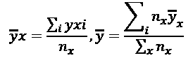

# 第四章：时间序列机器学习简介

在前面的章节中，我们讨论了时间序列、时间序列分析和预处理。在本章中，我们将讨论时间序列的机器学习。**机器学习**是通过经验改进的算法研究。这些算法或模型可以根据数据做出系统的、可重复的、经过验证的决策。本章旨在介绍我们在本书剩余部分将使用的许多内容的背景和技术基础。

我们将介绍机器学习在时间序列中的不同问题和应用，以及与机器学习和时间序列分析相关的各种分析类型。我们将解释与时间序列相关的主要机器学习问题，如预测、分类、回归、分割和异常检测。然后，我们将回顾与时间序列相关的机器学习基础知识。接着，我们将探讨机器学习在时间序列中的历史与当前应用。

我们将涵盖以下主题：

+   时间序列中的机器学习

    +   监督学习、无监督学习和强化学习

    +   机器学习的历史

+   机器学习工作流

    +   交叉验证

    +   时间序列的误差度量

    +   比较时间序列

+   时间序列的机器学习算法

我们将从时间序列的机器学习概述开始。

# 时间序列中的机器学习

在本节中，我将介绍时间序列中机器学习的应用及其主要类别。

时间序列的机器学习方法在经济学、医学、气象学、人口学等领域至关重要。时间序列数据集无处不在，广泛应用于医疗保健、经济学、社会科学、物联网应用、运营管理、数字营销、云基础设施、机器人系统仿真等多个领域。这些数据集具有巨大的实际意义，因为它们可以被用来更有效地预测和检测异常，从而支持决策制定。

时间序列中的机器学习应用技术丰富多样。以下是一些应用实例：

+   曲线拟合

+   回归

+   分类

+   预测

+   分割/聚类

+   异常检测

+   强化学习

我们将在本书中探讨这些技术应用。这些不同的应用背后有不同的统计方法和模型，它们可能会有所重叠。

我们将简要回顾这些应用，以便对接下来的章节有所预期。

**曲线拟合**是将数学函数（曲线）拟合到一系列数据点的任务。数学函数由参数定义，这些参数通过优化调整以适应时间序列。曲线拟合可以作为图表的视觉辅助工具，也可以用于推断（外推）。

**回归**是一个统称，指的是寻找独立变量（特征）与因变量（目标）之间关系的统计方法。例如，我们可能在基于二氧化碳和甲烷的释放来预测准确的温度。如果有多个结果变量，这称为多目标（或多输出）。一个例子可能是同时预测不同地点的温度。

当问题是为时间序列（或其一部分）分配标签时，这称为**分类**。与回归的主要区别在于，预测结果是分类的而不是连续的。用于分类的模型通常称为分类器。分类可以是二分类，即只有两个类别，或者是多分类，即有多个类别。一个例子可能是检测脑电图信号中的眼动或癫痫。

关于未来的预测称为**预测**。预测可以仅基于时间序列本身，也可以基于其他变量。技术可以从曲线拟合到外推，从分析当前趋势和变异性到复杂的机器学习技术。例如，我们可能基于过去 100 年的数据来预测全球温度，或者我们可能在预测一个国家的经济福祉。预测的反义词是**回溯**，即对过去进行预测。我们可能在没有数据可用之前，从过去回溯预测温度。

**分段**，或称**聚类**，是将时间序列的部分数据按照不同的状态、行为或基线分组的过程。例如，大脑波动中的不同活动水平就是一个例子。

在时间序列的背景下，**异常检测**，也称为**离群点检测**，是识别稀有事件或不符合常规的事件的任务。这些事件可能是新颖的、状态变化、噪声或只是例外。例如，一个相对粗略的例子是通过电压的突然下降检测到电网停运。更微妙的例子可能是，在特定时间段内，呼叫中心接到的电话数量增加。在这两种情况下，异常检测可以提供可行的商业见解。异常检测技术可以从简单的阈值设置或统计方法到一组规则，甚至是基于时间序列分布的模式识别方法。

最后，**强化学习**是基于最大化一系列决策的期望奖励来进行学习的实践。强化学习算法被应用于不确定性较高的环境中。这可能意味着条件不稳定（高变异性），或者普遍缺乏信息。应用包括股票交易或一般拍卖中的竞价和定价算法，以及控制任务。

让我们更详细地了解这些术语的含义。

## 监督、无监督和强化学习

机器学习可以大致分为监督学习、无监督学习和强化学习，正如该图所示：

图 4.1：将机器学习划分为不同类别

在**监督**学习中，特征与结果相匹配！在一个叫做**预测**（有时叫做**推理**）的过程中。

在监督的情况下，参数是从带标签的观测值中估算出来的。我们需要为每个观测值提供结果，作为**目标**列（或者多列）。

因此，机器学习算法会找到从 X 到 Y 的映射。

函数！只是输入分布 X 到输出分布 Y 的一种可能映射或模型。

监督机器学习可以分为分类和回归。在回归中，我们的目标是连续的，目标是预测值。

目标 Y 可以是实数值，可以是单一值或更高维度（多输出）。

标签与数据集的长度相匹配，但每个观测值也可以有多个标签（多输出）。

一个例子是商店在特定日期销售的产品数量，或者下个月管道中流过的石油量。特征可以包括当前销售量、需求或星期几。

在**分类**中，目标是预测观测值的类别。在这种情况下，可以从一个类别分布中抽取，例如整数的顺序值，如。

有时，我们希望找到一个函数，能够为给定的观测值提供概率或得分：

在实际应用中，回归和分类是非常相似的问题，通常回归和分类算法可以互换应用。然而，理解两者的区别对以适当的方式处理具体问题至关重要。

在时间序列**预测**中，历史值会被外推到未来。唯一的特征是过去的值。例如，我们可以基于过去两年的电话量，估算下个月呼叫中心的电话量。预测任务可以是单变量的，依赖于并外推单一特征，或者是多变量的，其中多个特征被预测到未来。

在**无监督**学习中，算法的任务是根据特征对观测值进行分类。无监督学习的例子包括聚类或推荐算法。

在本书的大部分内容中，我们将讨论监督算法，尽管我们也会讨论一些无监督任务，如变化检测和聚类。

映射函数 f 预测一个结果  每个函数由一组参数指定，优化结果是一组参数，最小化 Y 与  之间的匹配度。通常，这一过程是通过启发式方法完成的。

Y 与  之间的匹配（不匹配）通过误差函数  来衡量，因此优化的目标是估计参数 ，以最小化误差：

在此公式中，由于误差函数是优化的一部分， 被称为**目标函数**。

在**强化学习**中，代理通过动作与环境互动，并通过奖励的形式获得反馈。你可以在*第十一章*，*时间序列的强化学习*中了解更多关于时间序列的强化学习内容。

与监督学习中的情况相反，强化学习中没有标签数据可用，而是通过探索和利用环境来期望获得累计奖励。

**机器学习**，即通过经验不断改进的算法研究，可以追溯到 1960 年代，当时统计方法（在*第一章*，*使用 Python 进行时间序列分析*中讨论）被发现。让我们从机器学习的简短历史开始，以便提供一些背景。这将提供一些术语以及机器学习中主要方向的基本概念。我们将在相关章节中提供更详细的背景。

## 机器学习的历史

生物神经网络最早由沃伦·麦卡洛克和沃尔特·皮茨于 1943 年提出，作为一种数学模型，奠定了人工神经网络的基础。

弗兰克·罗森布拉特在 1958 年开发了所谓的**感知器**，在今天的术语中，这是一种**全连接的前馈神经网络**。该示意图展示了一个具有两个输入神经元和一个输出神经元的感知器（基于维基共享资源上的图像）：

图 4.3：感知器

输出神经元 *y* 的连接具有权重 *w*[1] 和 *w*[2]。这是一个简单的线性模型。

另一个重要步骤是如何通过网络反向传播误差。**反向传播**的基础由亨利·J·凯利在不久后（1960 年）发表，作为训练这些网络的一种机制。

然而，这项研究在 1969 年遭遇了严重打击，当时马文·明斯基（Marvin Minsky）和西摩·帕珀特（Seymour Papert）出版了《*感知机*》一书，书中简单地证明了线性函数（如二层感知机）无法建模非线性函数。根据作者的观点，这意味着感知机在实践中既无用也不值得研究。书中忽略了感知机可以有超过两层，并且这些层的参数可以通过反向传播学习的事实。人工神经网络的研究直到 1980 年代才重新开始。

**最近邻算法**由伊夫琳·费克斯（Evelyn Fix）和约瑟夫·霍奇斯（Joseph Hodges）于 1951 年描述，随后由托马斯·科弗（Thomas Cover）和彼得·E·哈特（Peter E. Hart）在 1967 年进行了扩展。最近邻算法可以应用于分类和回归。它通过检索一个新数据点与数据集中所有已知实例之间最相似的 k 个实例（k 是一个参数）来工作。在分类的情况下，算法投票选出最频繁的标签；在回归的情况下，它对标签取平均值。

另一个重要的里程碑是决策树算法的发展。ID3 决策树算法（迭代二分法 3）由罗斯·昆兰（Ross Quinlan）在 1979 年的论文中发布，它是今天使用的决策树算法的前身。

**CART**算法（**分类与回归树**）由利奥·布雷曼（Leo Breiman）于 1984 年发布。**C4.5**算法，ID3 的后代，于 1992 年由罗斯·昆兰发布，被认为是机器学习领域的一个里程碑。

决策树的革命性在于它由步骤函数组成，这些函数将数据点的特征空间划分成若干口袋，每个口袋的输出结果相似。尽管许多机器学习算法在考虑多重交互时表现不佳，但决策树在这些情况下表现得很好。以下图示展示了决策树的形态：

图 4.4：决策树

树中的每个节点或分支都是一个基于特征值的单一问题。在树构建的每次迭代中，都会应用一种称为分裂标准的统计函数，用来决定查询最佳特征。分裂标准的典型选择包括基尼不纯度和信息熵，它们都可以最小化分支内目标变量的变异性。

决策树反过来成为集成技术的基础，例如随机森林或梯度提升树。集成技术主要有两种：提升（boosting）和自助法（bagging）。**提升**由罗伯特·沙皮尔（Robert Schapire）于 1990 年发明，它通过级联的方式逐步增加基学习器。**基学习器**（也称为**弱学习器**）是一个非常简单的模型，本身与目标变量的相关性很弱。每次向现有的基学习器中添加新学习器时，都会重新平衡训练集中数据点的重要性（权重）。

这意味着在每次迭代中，算法会处理越来越多它难以应对的样本，随着每次新增一个基学习器，精度也会提高。

这为**AdaBoost**（自适应提升算法）奠定了基础，该算法的发明者 Yoav Freund 和 Robert Schapire 因此获得了 Gödel 奖，这是理论计算机科学领域最具声望的论文奖项。

这张插图（来自 Wikipedia）展示了每个基分类器是如何在数据集的不同子集上依次训练的，并且每次新的训练都改变了权重：

图 4.5：提升法

**袋装法**是随机森林的基础，由 Leo Breiman 于 1994 年发明。袋装法包括两个部分：自助法（bootstrap）和聚合（aggregation）。**自助法**是从训练集中进行有放回的抽样。每个样本可以独立地训练一个模型，这些模型共同形成一个集成。各个模型的预测结果可以被聚合成一个综合决策，例如通过取平均值。

以下图（来源：Wikipedia）展示了一个袋装集成如何被训练并用于预测。这就是**随机森林**（Leo Breiman, 2001）如何使用决策树作为基学习器进行学习的方式。

图 4.6：袋装法

以下表格展示了袋装法和提升法之间的主要区别：

|  | Bagging | Boosting |
| --- | --- | --- |
| 基学习器的训练方式： | 独立训练（可以并行训练） | 顺序训练 |
| 权重： | 保持不变 | 每次迭代后改变 |
| 基学习器的权重： | 相等 | 根据训练表现 |

图 4.7：袋装法与提升法的区别

**梯度提升**（由 Friedman 等人开发）是提升方法的进一步扩展，采用了 Unhyphenate。在梯度提升中，新的弱学习器以与损失函数负梯度最大相关的方式被添加。这些是梯度提升树的一些流行实现：

+   CatBoost（由 Yandex 的 Andrey Gulin 等人开发）

+   Light Gradient Boosting Machine（LightGBM，微软公司）

+   XGBoost

反向传播算法是由 David Rumelhart、Geoffrey Hinton 和 Ronald J. Williams 在 1986 年重新发现的。随后，发展出了更深层的网络，能够应用于更有趣的问题，并引起了关注。

1995 到 1997 年间，Sepp Hochreiter 和 Jürgen Schmidhuber 提出了一种循环神经网络架构——**长短期记忆网络** (**LSTM**)。多年来，LSTM 在语音识别、翻译等许多应用中占据了领先地位。如今，循环神经网络已经在许多任务中被 transformer 或 ConvNets 取代，即使是序列建模任务。鉴于 LSTM 对计算资源的高需求，一些人甚至认为 LSTM 已过时，尤其是在有了替代方案之后。

**支持向量机** (**SVMs**)是在 1990 年代初期，由弗拉基米尔· Vapnik 和同事们在 AT&T 贝尔实验室开发的，基于 Vapnik 和 Chervonenkis 描述的统计学习框架。在分类中，SVM 通过最大化投影空间中两类之间的距离来进行操作。在训练过程中，构建一个超平面（称为支持向量）来分离正负例子。

在下一节中，我们将介绍机器学习建模的基础知识以及模型验证中的科学实践。

# 机器学习工作流

在下一节中，我们将介绍时间序列和机器学习的基础知识。

机器学习主要处理数值数据，这些数据以大小为的矩阵形式呈现。布局通常是每一行表示一个观察，每一列表示一个特征。

在时间序列问题中，与时间相关的列不一定作为特征使用，而是作为索引来切割和排序数据集。然而，时间列可以被转换为特征，正如我们在*第三章*《时间序列预处理》中看到的那样。

每个观察由 M 个特征的向量描述。虽然一些机器学习算法可以内部处理非数值数据，但通常每个特征要么是数值型的，要么在输入机器学习算法之前被转换为数字。例如，Male 可以表示为 0，Female 表示为 1。简单来说，每个特征可以定义如下：

机器学习工作流可以分为三个过程，如下图所示。我已经添加了数据加载和时间序列分析，它们为机器学习提供了信息。

图 4.8：机器学习工作流

我们首先必须对数据进行转换（或预处理），训练或拟合一个模型，然后可以将训练好的模型应用于新数据。这个图示虽然可能过于简化，但将焦点放在了机器学习过程的三个不同阶段。每个阶段都有其挑战和针对时间序列数据的特殊性。

这也有助于思考数据流的过程，从输入到转换，再到训练和预测。我们应该牢记可用的历史数据及其局限性，以及将用于预测的未来数据点。

在接下来的部分，我们将讨论交叉验证的一般原则。

## 交叉验证

这是机器学习中一条广为人知的格言，归功于我们在本书中已经遇到过几次的乔治·博克斯：“所有的模型都是错的，但有些是有用的。”

机器学习算法做出可重复的决策，并且在正确的控制条件下，这些决策可以摆脱许多人类决策中的认知偏差。关键是通过验证性能来确保我们的模型是有用的。在机器学习中，在未见过的数据上测试模型的过程称为交叉验证（有时也叫**样本外测试**）。

为了确保在有限数据集上估计的参数仍然适用于更多的数据，我们必须进行验证，以确保质量保持一致。验证时，我们通常将数据集拆分为至少两个部分，即训练集和测试集。我们在训练集上估计参数，然后在测试集上运行模型，以了解模型在未见过的数据点上的表现。这个过程在下图中有所示意：

图 4.9：交叉验证

通常，在机器学习中，我们会在划分训练集和测试集之前随机打乱数据点。然而，在时间序列中，我们会将较早的数据点用于训练，较新的数据点用于测试。例如，如果我们有一年的数据可用，记录了客户打开电子邮件的倾向，我们会用 9 个月的数据训练模型，利用 2 个月的数据验证模型，并在数据集上测试最终的性能。

验证集和测试集的使用可以被看作是一个嵌套过程，测试集检查涉及验证数据集的主要测试过程。通常，验证集和测试集的划分会被省略，因此数据集仅被拆分为训练集和测试集。

术语说明：虽然**损失函数**是训练模型优化的一部分，但**度量**用于评估模型。评估可以是事后进行的，也可以是在训练过程中作为附加信息进行的。在本节中，我们将讨论度量和损失函数。

最好的做法是，在项目开始时，先评估如何衡量性能。我们需要选择如何衡量性能，将商业问题转化为度量标准或损失。一些算法允许在选择目标函数时具有灵活性，另一些则不允许，但我们可以通过不同的度量来衡量性能。

接下来，我们将讨论回归和分类的误差与损失度量。

## 时间序列的误差度量

时间序列数据被定义为包含有关不同时间点的详细信息的数据点集合。通常，时间序列数据包含在相等时间间隔内采样或观察到的数据点。

对于我们之前讨论的不同应用，我们需要能够量化模型的性能，无论是回归、分类还是其他类型的模型，并选择一个能够捕捉我们希望达到的性能的指标。一旦选择了适合我们模型的指标，我们就可以构建并训练模型以改善它们。通常，我们会从一个较简单的模型开始，然后尝试在这个简单模型的基础上提高性能。最终，我们希望找到一个根据我们指标表现最好的模型。

在这一部分，我们将讨论常用的性能度量及其特性。通常，对于误差度量，值越小，预测（或预测结果）越好。在改变模型参数时，我们希望减少误差。

并没有单一的指标适用于任何任意应用或数据集。根据数据集的不同，你可能需要尝试不同的误差指标，看看哪一个最能捕捉你的目标。在某些情况下，你甚至可能想要定义你自己的指标。

### 回归

时间序列回归是识别与时间序列行为相关的特征中的模式和信号的任务，例如，技能如何随着练习时间的投入而提高。

在训练过程中，当你的回归模型在训练集上给出结果时，我们可以使用一个指标来将模型输出与训练集值进行比较；在验证过程中，我们可以计算相同的度量，以了解我们的回归预测与验证集目标的匹配程度。误差指标总结了机器学习模型预测值与实际值之间的差异。

如果！是模型在时间步*t*的预测值，而实际目标值是*y*[t]，直观地说，对于数据集中的某一点*t*，**预测误差**（也叫**预测误差**或**残差**）是目标实际值与我们模型预测值之间的差异：

该图比较了实际目标 Y 与预测目标！。根据这个公式，当预测值高于实际目标值时，误差为负。**残差的平方和**（SS，也叫**残差平方和**）忽略了误差的方向：

尽管残差和平方残差已经可以用来衡量时间序列预测的性能，但它们并不常用作回归指标或损失函数。

让我们从回归中最常用的度量开始：**决定系数**。这是一个相对简单的公式，基于残差平方和 SS 与总平方和 TSS 的比率，TSS 是一种变异性度量：

在这个分数中，分子是残差的平方和，SS，表示未解释的方差。

分母是 TSS，总平方和。它被定义为 ，其中  是序列的均值，。总平方和表示时间序列的解释方差。

基本上，我们是在衡量残差的平方和与时间序列总方差的关系。这个分数介于 0 和 1 之间，0 表示最好——没有误差，1 表示最差。通过从 1 中减去该值来反转它，因此最终 0 是最差的，1 是最好的。

扩展后，结果如下所示：

 表示可以从自变量预测的因变量方差的比例。如前所述，它的值在 0 和 1 之间，其中 1 表示存在完美的关系，0 表示没有任何关系。

决定系数，，不是一个误差度量，因为误差度量表示残差的分布，高的不好，低的好。然而，我们可以表达一个误差度量，称之为**r-误差（RE）**，它与上述非常相似，定义如下：

这种方法在实际中很少使用。一个与 RE 非常相似的误差度量是**均值相对绝对误差**（**MRAE**），我们将在后面进一步讨论。

天真地说，我们可以取平均误差，即仅对预测误差求均值——即均值误差：

这里，*N* 是点的数量（或离散时间步数）。我们计算每个点的误差，然后对这些误差取平均。

如果 ME 为正，模型会系统性地低估目标值；如果为负，则会高估目标值。虽然这可能有用，但作为误差度量，这仍然是一个严重的问题，因为正误差和负误差的效应会相互抵消。因此，低 ME 并不意味着预测很好，而是表示平均值接近零。

此外，大多数回归模型包括一个常数项，该常数等于目标的均值，因此这个值将正好为 0。总之，我们的天真度量在实际设置中是无用的。

我包括了 ME 来讨论为什么大多数常用的度量会忽略误差的方向，并强调基本误差指标的主要组成部分的重要性：

+   残差操作

+   积分

在均值误差（ME）的情况下，残差操作是恒等函数，这意味着残差不会改变。更常见的是使用平方或绝对值函数。误差的整合通常是（算术）平均值，但有时也可以是中位数；不过，它也可以是更复杂的操作。

实际应用中，最常用的误差度量是均方误差（MSE）、平均绝对误差（MAE）和均方根误差（RMSE）。以下表格定义了这些最重要的误差度量：

| 指标名称 | 定义 |
| --- | --- |
| 均方误差 |  |
| 平均绝对误差 |  |
| 均方根误差 |  |

图 4.10：常见的回归指标

对于**均方误差（MSE）**，我们计算每个点的残差，然后对它们进行平方，这样正误差和负误差就不会互相抵消。然后我们取这些平方误差的平均值。MSE 为 0 表示完美表现。这种情况可能出现在你玩弄的小数据集上；然而，实际上，只有在你在构建数据集或验证过程中出错时，才会出现这种情况，因为现实生活总是比你能通过模型捕捉到的更复杂。

**平均绝对误差（MAE）**与 MSE 非常相似，不同之处在于，我们没有对残差进行平方，而是取它们的绝对值。与 MSE 不同，所有误差都是线性贡献的（而不是被平方）。

选择绝对值与平方之间的一个主要区别在于如何处理异常值或极端值。平方函数对与众不同的值赋予更高的权重。在 MSE 中，误差是按平方而不是线性增长的，这意味着 MSE 对极端值的惩罚远远比 MAE 更强，因此它对数据集中的异常值不如 MAE 稳健。误差分布是选择合适的误差度量时的重要考虑因素。

另一个常见的指标是**均方根误差（RMSE）**，或**均方根偏差（RMSD）**，顾名思义，它是均方误差（MSE）的平方根。从这个意义上说，RMSE 是 MSE 的缩放版本。选择这两个指标中的哪一个，取决于展示的需求——它们都会导致相同的模型。

RMSE 作为选择的有趣之处在于，它与预测变量具有相同的单位和尺度，使得它更加直观。最后，RMSE 等同于标准差或误差。标准差与误差分布之间的联系非常有意义，你可以用其他度量来总结误差分布，比如标准误差或置信区间（我们在*第二章*《使用 Python 进行时间序列分析》中讨论过这两者）。

还有许多其他的指标，它们各自有其作用。下表总结了时间序列建模中一些更常见的误差指标：

| 指标名称 | 定义 |
| --- | --- |
| 中位数绝对误差 |  |
| 均值绝对百分比误差 |  |
| 对称均值绝对百分比误差 |  |
| 归一化均方误差 |  |

图 4.11：更多回归指标

**中位数绝对误差 (MdAE)** 类似于 MAE。但是，与均值操作不同，中位数被用来进行集成。由于中位数不受尾部数据的影响，因此这个度量比 MAE 更加稳健。

**均值百分比误差 (MAPE)** 是通过目标值标准化的平均误差。0 代表完美的模型，值大于 1 意味着模型的预测系统性地高于目标值。MAPE 没有上限。此外，由于它是基于目标的百分比（通过目标进行缩放或除法运算），正残差和负残差会被区别对待。因此，如果预测值大于目标值，MAPE 会比同样方向的误差要高。根据残差的符号，MAPE 会更高或更低！

常见的分母选择是目标值；但是，你也可以通过预测值和目标值的均值进行缩放。这被称为**对称均值绝对百分比误差 (SMAPE)**。SMAPE 不仅有下限，还有上限，这使得百分比更加易于理解。

缩放也可以带来不同的好处。如果你想比较在不同数据集上验证的模型，那么之前提到的度量方法将无法提供帮助。训练集、验证集和测试集的划分是随机的，因此，当你比较模型的表现时，这些度量方法会混淆数据集差异在验证集中的影响以及模型性能本身的影响。

因此，**归一化均方误差 (NMSE)** 作为一种展示选择，比 MSE 更直观，因为它根据偏差对模型的表现进行缩放。NMSE 在将 MSE 除以目标方差后进行归一化。

还有许多其他的误差度量。某些误差度量将预测值与返回平均目标值的简单模型的预测进行比较。

该简单模型的预测性能为：

我们可以通过将预测误差除以该简单模型的预测误差来对预测误差进行归一化。

这样，我们可以定义几个其他的度量：

| **指标名称** | **定义** |
| --- | --- |
| 均值相对绝对误差 |  |
| 中位数相对绝对误差 |  |
| 相对均方根误差 |  |

图 4.12：归一化回归指标

如果你心中有朴素模型的概念，并且想通过相同的误差度量来比较朴素模型的表现，那么这些度量应该是直观的。

**均值相对绝对误差**（**MRAE**）与决定系数非常相似，唯一的区别是 MRAE 使用平均值而不是总和。

另一个误差是**均方根对数误差**（**RMSLE**）。

| **度量名称** | **定义** |
| --- | --- |
| 均方根对数误差 |  |

图 4.13：均方根对数误差

对于 RMSLE，基本操作是对残差取对数。这是为了避免在预测值和真实值都很大的情况下，误差的巨大差异被惩罚得过重。由于对数在 1 处有拐点，RMSLE 具有一个独特的特性，它对低估实际值的惩罚比对高估实际值的惩罚更严重。这在误差分布不遵循正态分布时非常有用，类似于我们在*第三章*，*时间序列预处理*中讨论的缩放操作。

如果我们考虑基于熵的度量，比如泰尔不确定性，我们可以扩展度量的数量。**泰尔不确定性（Theil's U）**是一个标准化的预测误差度量。U 的值介于 0 和 1 之间，其中 0 表示完美拟合。它基于条件熵的概念，还可以作为不确定性度量，甚至可以作为类别-类别情况下的相关性度量。

如这些标题所示，前两项专注于量化模型的表现。最后一部分对于基于距离的模型非常有用，这些模型通常作为性能的坚实基准。

现在我们切换到分类任务的误差度量。

### 分类

许多度量特定于二分类任务（即只有两个类别），尽管其中一些可以扩展到多类别分类任务，其中类别数大于两个。

在二分类中，我们可以通过**混淆矩阵**将预测结果与实际结果进行对比，其中预测结果与实际结果会交叉列出，如下所示：

|  |  | **实际结果** |
| --- | --- | --- |
|  |  | 假阴性（TN） | 真阳性（TP） |
| **预测结果** | 假阴性（TN） | 假阳性（FP） | 真阳性（TP） |
| 真正 | 假阳性（FP） | 真阳性（TP） |

图 4.14：混淆矩阵

这是分类任务中的一个关键可视化图表，许多度量都是基于对这一图表的总结来进行的。

分类任务中最重要的两个度量是精确度和召回率。**召回率**是正确预测的正实例数与所有正实例数之比。我们也可以在混淆矩阵中按如下方式表达：

召回率也叫做**真正正例率**或**灵敏度**。它关注的是正确预测的正例，忽略了负例；然而，我们也可能想知道正例预测的准确性。这就是**精度**，定义如下：

我们可以通过以下方式可视化这两个指标：

图 4.15：假正例（FP）、真正正例（TP）和假负例（FN）

在这张图中，**假正例**（**FP**）、**真正正例**（**TP**）和**假负例**（**FN**）被显示出来。你可以看到实际上为真的实例，模型将其分类为真的实例，以及两者的交集——既为真的实例，且被模型分类为真的实例。

我们可以快速计算精度和召回率。我们有四个真正的正例和六个假正例。因此，此示例的精度为！。

我们有四个假负例。召回率为！。

召回率和精度显然都很重要，那么为什么不将它们结合起来呢？得分是精度和灵敏度的调和平均值：

我们还可以参数化召回率和精度的相对重要性。这是得分的广义版本，即得分：

另一个非常有用的指标来自**接收者操作特征曲线（ROC）**，它绘制了在不同阈值设置下，**真正正例率**（**TPR**）与**假正例率**（**FPR**）之间的关系。**假正例率**，也称为**假警报率**，与真正正例率（召回率）的定义类似，如下所示：

ROC 图展示了灵敏度和特异性之间的关系，其基本思路是，很难做到两者兼得，同时找到所有正实例（灵敏度）并做到正确分类。往往你需要在灵敏度和特异性之间做出折衷。这个图形展示了你的模型如何处理这个问题。**曲线下面积**总结了这个图形，是实践中常用的一个指标。

另一个不太常见的指标是**相关比率**，它由卡尔·皮尔逊（Karl Pearson）提出，作为分类-连续型关联的度量：

其中！是类别*x*中观测值的数量，我们定义为：

相关比率是基于各个类别内的方差与整个数据集的方差之间的比例。！的取值范围为[0,1]，其中 0 表示该类别无关联，1 表示该类别与绝对确定性相关。

在接下来的部分，我们将考察时间序列之间的相似度度量。

## 比较时间序列

相似度度量在时间序列索引、搜索检索、聚类、预测、回归和分类中有广泛应用，但是如果我们想决定两个时间序列是否相似，应该如何衡量相似度呢？

最简单的方式是使用皮尔逊相关系数；然而，其他度量方法可能更具信息性。

我们将通过一系列度量来比较一对时间序列：

+   欧几里得距离

+   动态时间规整

+   格兰杰因果关系

**欧几里得距离**，一种通用距离，适用于任何一对向量，包括时间序列：

欧几里得距离在某些情况下是有用的；然而，在实践中，对于时间序列，你可以做得更好。你可以对经过快速傅里叶变换到频域的时间序列使用欧几里得距离。

直观地，时间序列中事件的精确时间位置及其持续时间可能会有所不同。**动态时间规整**（**DTW**）是衡量两个可能在速度上有所不同的时间序列相似性的算法之一。直观地，时间序列中事件的精确时间位置及其持续时间可能会有所不同。时间序列之间的相似度度量应该能够处理这些时间的位移和延长。

一般来说，DTW 是一种根据启发式方法计算两个给定时间序列之间最佳匹配的算法，具有某些限制和规则。基本上，它尝试将第一个序列的索引与另一个序列的索引匹配。DTW 是一种编辑距离——它表示将序列 t1 转换为 t2 的代价。

由于 DTW 能够处理不同的速度，它已经被应用于自动语音识别。然而，DTW 在量化不匹配序列之间的不相似性方面存在问题。

DTW 应用于每个特征维度，然后可以将距离相加。或者，规整可以通过计算两个点之间的欧几里得距离来同时覆盖所有特征。因此，这种依赖规整（）是一种多变量方法。

**格兰杰因果关系**用于判断一个时间序列是否能够帮助预测另一个时间序列。尽管该度量中的真正因果关系问题存在争议，但该度量考虑了一个序列在时间上先于另一个序列的值，可以认为该度量显示了时间关系或预测意义上的关系。

格兰杰因果关系在其思想和公式中都非常直观。它的两个原则（简化版）是：

1.  原因必须先于结果

1.  原因对结果有独特的影响

因此，如果我们可以拟合一个模型，表明 X 和 Y 之间存在一种关系，其中 Y 系统地跟随 X，这意味着 X 对 Y 具有格兰杰因果关系。

# 用于时间序列的机器学习算法

时间序列机器学习中的一个重要区别是单变量与多变量的区别，单变量算法只能处理单一特征，而多变量算法则可以处理多个特征。

在单变量数据集中，每个案例只有一个序列和一个类别标签。早期的模型（经典建模）侧重于单变量数据集和应用。这也体现在数据集的可用性上。

时间序列数据集最重要的存储库之一是**UCR**（**加利福尼亚大学河滨分校**）档案，首次发布于 2002 年，已为单变量时间序列提供了宝贵的资源。现在它包含大约 120 个数据集，但缺少多变量数据集。此外，M 竞赛（特别是 M3、M4 和 M5）提供了大量的时间序列数据集。

多变量时间序列是具有多个特征维度的数据集。许多现实生活中的数据集本质上是多变量的——在实践中，多变量情况比单变量情况要常见得多。示例包括人类活动识别、基于**心电图**（**ECG**）、**脑电图**（**EEG**）、**脑磁图**（**MEG**）的诊断以及系统监控。

最近（Anthony Bagnall 等人，2018 年）创建了**UAE**（**东英吉利大学**）档案，包含 30 个多变量数据集。另一个多变量数据集档案是 MTS 档案。

在下一节中，我们将简要讨论基于距离的方法。

## 基于距离的方法

在我们之前提到的 k 近邻方法（简称 kNN）中，训练样本被存储，然后在推理时，当需要对一个新的数据点进行预测时，预测是基于最接近的 k 个邻居。这需要一种样本之间的距离度量。

我在本章早些时候介绍了用于时间序列的两种度量方法，**动态时间规整**（**DTW**）和欧几里得距离。许多基于距离的方法采用这些作为距离度量。

另一种尝试过的方法是从时间序列中提取特征，然后将这些提取的特征存储起来，通过 kNN 进行检索。这些特征包括形状特征或**尺度不变特征**（**SIFT**）。SIFT 特征是从时间序列中提取的形状，围绕着极值点（Adeline Bailly 等人，2015 年）。

我们在*第三章*《时间序列预处理》中已经分别讨论了形状特征和 ROCKET，因此我们将简要描述它们，但重点放在它们在机器学习中的应用。

## 形状特征

我们在*第三章*中已讨论过形状元（shapelets），*时间序列预处理*，因此在这里简要介绍。时间序列的形状元在研究论文“*时间序列形状元*：*一种新技术，可以实现准确、可解释且快速的分类*”（Lexiang Ye 和 Eamonn Keogh，2011）中提出。形状元的基本思想是将时间序列分解为具有判别力的子部分（称为**形状元**）。基于形状元特征，已经提出了一些方法。

**形状元变换分类器**（**STC**；Hills 等人，2014）由将形状元作为特征转换，然后将形状元输入到机器学习算法中组成。他们测试了 C4.5 决策树、朴素贝叶斯、1NN、SVM 和旋转森林，但在分类设置中没有发现这些方法之间的显著差异。

**广义随机形状元森林**（**gRFS**；Karlsson 等人，2016）遵循随机森林的思路。每棵树是基于一组随机长度的形状元构建的，这些形状元从每棵树的一个随机维度中提取。然后在这些形状元上训练决策树。这些随机形状元树被整合为集成模型，构成 gRFS。

## ROCKET

我们在*第三章*中已解释过 ROCKET，*时间序列预处理*。每个输入特征通过 10,000 个随机内核单独转换（这个数字可以更改）。在实践中，这是一个非常快速的过程。这些转换后的特征可以输入到机器学习算法中。其发明者 Angus Dempster、François Petitjean 和 Geoff Webb 在原始出版物（2019 年）中推荐了线性模型。

最近，发布了一个新的变体 MINIROCKET，其速度是 ROCKET 的约 75 倍，同时保持大致相同的准确性——*MINIROCKET：一个非常快速（几乎）确定性的时间序列分类变换*（*Angus Dempster, Daniel F. Schmidt, 和 Geoff Webb, 2020*）。

在机器学习研究中，**关键差异（CD）图**是比较多个算法结果的强大可视化工具。平均排名表示算法之间的相对表现（排名越低越好）。算法结果通过统计方法进行比较——一条水平线连接算法，表示它们之间的差异无法在统计学上分开。

这里是一个关键差异图，展示了 MiniRocket 与其他算法的比较性能（来自 Dempster 等人发布的 MiniRocket 代码库）：

图 4.16：MiniRocket 在 109 个 UCR 数据集上的准确率与其他最先进方法的平均排名

这些数字显示了算法在 109 个数据集上的排名。我们可以看到，MiniRocket 优于 Rocket，但不如 TS-CHIEF 和 HIVE-COTE，尽管它们之间的差异在统计学上并不显著。

我们将在*第十章*，*时间序列深度学习*中讨论 InceptionTime。其他提到的方法将在接下来的章节中介绍。

## 时间序列森林和典型区间森林

**时间序列森林**（**TSF**；由 Houtao Deng 等人于 2013 年提出）的主要创新是引入了作为树节点分割标准的入口增益。他们展示了基于简单特征（如均值、偏差和斜率）的集成分类器，优于使用动态时间规整（DTW）的 1NN 分类器，同时在计算上也更为高效（由于并行处理）。

**接近森林（PF）**，由 Geoff Webb 领导的一组研究人员提出，是一个基于每个时间序列与一组参考时间序列相似度（基于距离的特征）的树集成。他们发现 PF 的分类性能与 BOSS 和形状转换（Shapelet Transforms）相当。

**TS-CHIEF**，即**时间序列异质与集成嵌入森林**（Time-Series Combination of Heterogeneous and Integrated Embedding Forest）的缩写，来自同一组研究人员（Ahmed Shifaz、Charlotte Pelletier、François Petitjean 和 Geoff Webb，2020 年），它通过引入基于字典的（BOSS）和基于区间的（RISE）分割器，扩展了 PF，同时保持了 PF 中引入的原始特征。作者声称，根据数据集的大小，它的运行速度比 HIVE-COTE 快 900 倍到 46,000 倍不等。

**典型区间森林**（**CIF**；由 Matthew Middlehurst、James Large 和 Anthony Bagnall 于 2020 年提出）的理念是通过引入 Catch22 特征来扩展 TSF。它是一个基于 22 个 Catch22 特征和从相位依赖区间提取的总结统计量的时间序列树集成。他们还为树使用了入口增益标准。

在下一节中，我们将描述符号方法的演变，从 BOSS 到**时间字典集成**（**TDE**）。

## 符号方法

符号方法是将数值时间序列转换为字母表符号的方法。

**符号聚合近似法**（**SAX**）首次由 Eamonn Keogh 和 Jessica Lin 于 2002 年提出。它扩展了**分段聚合近似法**（**PAA**），后者计算时间序列中各相等片段内的均值。在 SAX 中，这些均值被量化（分箱），因此字母表对应于原始数值区间。两个重要的参数是 PAA 中的片段数和箱的数量。

下图（来自 Thach Le Nguyen 的 MrSEQL GitHub 库）展示了 SAX 的工作原理：

图 4.17：SAX

你可以将这些片段视为沿*X*轴排列的网格，将这些箱视为沿*Y*轴排列的网格。每个片段都会被其均值所替代。时间序列通过在每个片段中用箱 ID（图中的字母）替代，从而被离散化。

**符号傅里叶近似**（**SFA**；Patrick Schäfer 和 Mikael Högqvist，2012）也将时间序列转换为符号表示，但使用频域。首先，通过执行离散傅里叶变换、低通滤波，然后量化，从而减少数据集的维度。

**SFA 符号包（BOSS；**Patrick Schäfer，2015 和 2016）基于 n-gram 的直方图，通过 SFA 表示来形成**模式包**（**BoP**）。BOSS 已经扩展为**向量空间中的 BOSS**（**BOSS VS**）。BOSS VS 分类器比现有的最先进技术快一到四个数量级，并且比 1-NN DTW 更为准确。

合同 BOSS（cBOSS；Matthew Middlehurst，William Vickers，和 Anthony Bagnall，2019）通过引入限制基模型数量的新参数来加速 BOSS。

**SEQL**（Thach Le Nguyen，Severin Gsponer，和 Georgiana Ifrim，2017）是一种符号序列学习算法，利用贪婪的梯度下降方法选择最具辨别性的子序列以供线性模型使用。如下所示（来自 MrSEQL GitHub 仓库）：

图 4.18：SEQL

多重表示序列学习器（**MrSEQL**；Thach Le Nguyen，Severin Gsponer，Iulia Ilie，和 Georgiana Ifrim，2019）通过在多个分辨率和多个领域中选择转换特征，扩展了 SEQL。

**WEASEL+MUSE**（Patrick Schäfer 和 Ulf Leser，2017 和 2018）由两个阶段组成。WEASEL 代表**时间序列分类的词提取**，而 MUSE 代表**多变量无监督符号与导数**。这一点值得强调——虽然 WEASEL 是单变量方法，MUSE 将此方法扩展到了多变量问题。

在第一步中，WEASEL 从多个长度的窗口中提取特征，这些窗口来自截断的傅里叶变换和离散化。这一过程类似于低通滤波器，仅保留前*l*个系数。然后，这些系数被离散化为固定大小的字母表，并在直方图中计数为**模式包**（**BOP**）。这是为每个特征单独完成的。

在第二步（MUSE）中，直方图特征在不同维度上进行连接，并使用统计检验（χ2 检验）进行基于滤波器的特征选择，结果是一个更小但更具辨别力的特征集。

然后，这些 BOP 被输入到逻辑回归算法中进行分类。

## HIVE-COTE

**基于转换集成的分层投票集体**（**HIVE-COTE**）是当前分类准确度方面的最先进技术。

该方法在 2016 年提出，并在 2020 年进行了调整（Anthony Bagnall 等人，2020），它是一种集成方法，结合了不同方法的异质集合：

+   **形状转换分类器**（**STC**）

+   **时间序列森林** (**TSF**)

+   **符号傅里叶近似符号的可收缩袋** (**CBOSS**)

+   **随机区间光谱集成** (**RISE**)

**随机区间光谱集成（RISE**）是一个基于树的时间序列分类算法，最初在 HIVE-COTE（Jason Lines，Sarah Taylor，和 Anthony Bagnall，2016）发布时作为**随机区间特征**（**RIF**）引入。在 RISE 的每次迭代中，提取一组傅里叶、自相关和部分自相关特征，并训练决策树。RISE 的运行时复杂度是与序列长度的平方成正比，这可能是一个问题，且已经发布了新版本**c-RISE**（*c*代表*收缩*），该算法可以提前停止。

HIVE-COTE 的运行时复杂度是与序列长度的平方成正比，这是其应用的最大障碍之一。STC 和另一个模型，**弹性集成**（**EE**）是 2016 年原始算法中两个最慢的基础模型。新版本（1.0）的主要区别之一就是去掉了 EE。他们重新实现了 STC 和 BOSS，使它们更高效，并用 c-RISE 替代了 RISE。

这些基础学习器分别训练。基础学习器基于**交叉验证** **准确度加权概率集成**（**CAWPE**）结构（James Large，Jason Lines，和 Anthony Bagnall，2019）按概率加权。

在 HIVE-COTE 1.0 之后的出版物中，该团队展示了通过将 CIF 替换为 TSF（2020）并将 BOSS 替换为**时间字典集成**（**TDE**，2021），集成效果更强。

在下一节中，我们将讨论不同方法的性能和权衡。

## 讨论

通常，准确性与预测时间之间存在权衡，在这些方法中，时间复杂度和模型准确性差异巨大。此图表展示了这种妥协（来自 Patrick Schäfer 的 GitHub SFA 仓库）：

图 4.19：机器学习算法：查询时间与准确度的关系

特征可能是简单操作的结果，或本身就是机器学习模型的输出。我们可以将二阶特征看作是原始特征的组合，三阶特征则是二阶特征的组合，依此类推，形成一个可能庞大的预处理管道，其中特征被组合和创建。

我们可以在下表中总结不同的算法：

| 类型 | 单变量 | 多变量 |
| --- | --- | --- |
| 基于距离 | DTW，邻近森林（PF） | DTW-D |
| 基于字典/符号 | BOSS，CBOSS，S-BOSS，WEASEL，时间字典集成（TDE），SAX-VSM，BOSS | WEASEL+MUSE |
| 形状特征 | 形状变换分类器（STC），MrSEQL |  |
| 基于区间和光谱 | 时间序列森林（TSF），随机区间光谱集成（RISE） |  |
| 深度学习 | ResNet，FCN，InceptionTime | TapNet |
| 集成 | 基于变换集成的分层投票集合（HIVE-COTE）、时间序列异构与集成嵌入森林（TS-CHIEF） |  |

图 4.20：时间序列机器学习算法的详细分类

这个分类远非完美，但希望对你有所帮助。TDE 既是一个集成模型，也是一个基于字典的模型。HIVE-COTE 基于 BOSS 特征。此外，两个特征化方法——随机卷积核变换（ROCKET）和规范时间序列特征（Catch22），分别对特征进行操作；然而，基于这些特征作为输入进行训练和预测的机器学习算法，能够在多变量环境下工作。实际上，ROCKET 特征与线性分类器结合的表现，确实与多变量方法竞争力强。由于高维度，机器学习模型有可能考虑到原始特征之间的交互作用。

我强烈推荐给读者的一篇综述文章是 "*The great multivariate time-series classification bake-off*"，由 Alejandro Pasos Ruiz、Michael Flynn 和 Anthony Bagnall（2020）撰写。文章对 26 个来自 UAE 档案的多变量数据集上的最先进算法（其中 16 个在分析中被纳入）进行了比较。所涉及的算法包括以下几种：

+   动态时间规整

+   MUSE+WEASEL

+   RISE

+   CBOSS

+   TSF

+   gRSF

+   ROCKET

+   HIVE-COTE 1.0

+   CIF

+   ResNet

+   STC

临界差异图（见于[timeseriesclassification.com](http://timeseriesclassification.com)）显示了 26 个数据集上算法的排名。算法之间的链接表明，它们之间的差异不能通过统计方法分离（基于 Wilcoxon 秩和检验）：

图 4.21 时间序列分类算法的临界差异图

他们发现了一组表现最佳的分类器，ROCKET 位居榜首，在更短的时间内取得了至少数量级的显著提升。紧随其后的是 HIVE-COTE 和 CIF。

在 2019 年的一项研究中，Hassan Fawaz 等人比较了 12 个来自 MTSC 档案的多变量数据集上的深度学习算法。全连接卷积网络（FCN）表现最佳，其次是 ResNet——在来自 UCR 仓库的 85 个单变量数据集中，ResNet 超越了 FCN，取得了第一的位置（在 85 个数据集中的 50 个中获胜）。在一项仅涉及 ResNet 与一些最先进的非深度学习方法的对比中，他们发现 ResNet 的表现不如 HIVE-COTE，尽管在数据集之间并没有显著的差距，同时超越了其他方法，如 BOSS 和使用 DTW 的 1NN（后者在统计上具有显著差异）。我们将在*第十章*，*时间序列的深度学习*中进一步讨论这篇文章。

在另一个关于 20 个数据集的多变量时间序列分类的比较研究中（Bhaskar Dhariyal, Thach Le Nguyen, Severin Gsponer, 和 Georgiana Ifrim，2020），结果表明，ROCKET 在 14 个数据集上获胜，并且比大多数深度学习算法表现得要好，同时也是最快的方法——ROCKET 在 20 个数据集上的运行时间为 34 分钟，而 DTW 则需要几天。

这是通过哈桑·法瓦兹（Hassan Fawaz）的 Python 脚本从他们的结果中创建的关键图表：

图 4.22：多变量时间序列分类的关键差异图

尝试了许多不同的特征集，其中最佳的（`9_stat_MulPAA`）结果并不远离理想值。

## 实现

伟大的算法如果没有提供它们的可靠软件，实际上会变得价值不大。这样的软件能够让它们易于使用，并且在公司生产环境中可靠地使用。另一方面，从零开始实现算法可能需要时间，并且也不是没有复杂性。因此，Python 中有许多可靠且可用的实现是一个巨大的福音。

以下表总结了回归和分类的监督算法实现：

| 算法 | sktime | Pyts |
| --- | --- | --- |
| 自回归积分滑动平均（ARIMA） | X |  |
| DTW | X | X |
| BATS | X |  |
| MUSE+WEASEL | X | X |
| MrSEQL | X |  |
| ROCKET | X | X |
| BOSS | X | X |
| 向量空间中的 SFA 符号袋（BOSSVS） |  | X |
| CBOSS | X |  |
| SAX-VSM |  | X |
| RISE | X |  |
| HIVE-COTE | X |  |
| 时间序列森林 | X |  |

图 4.23：Pyts 与 SkTime 机器学习算法实现对比

sktime 有这么多实现并非偶然。它在东英吉利大学安东尼·巴格纳尔（Anthony Bagnall）团队的研究活动中得到了广泛应用。Pyts 由约翰·法乌兹（Johann Faouzi）和希沙姆·贾纳提（Hicham Janati）维护，他们是巴黎脑科学研究所和**应用数学中心**（**CMAP**）的博士后研究员。约翰·法乌兹还是实现时间序列分析和特征提取算法的 tslearn 库的幕后推手。

我省略了深度学习算法，因为它们通常作为不同库的一部分实现。请注意，sktime 通过相同的接口支持使用 prophet 预测器。例如，sktime-DL 库实现了 ResNet、InceptionTime 和 TapNet 算法，而 dl-4-tsc 实现了十多个深度学习模型。我们将在*第十章*，*时间序列的深度学习*中讨论深度学习模型的实现。

Facebook 的 Prophet 包含一个单一模型，是**广义加性模型**（**GAM**）的特殊情况。Statsmodels 库包含一个 GAM 模型，以及线性回归模型和**广义线性模型**（**GLM**）、**移动平均**（**MA**）、**自回归积分滑动平均模型**（**ARIMA**）和**向量自回归模型**（**VAR**）。

Darts 库提供了一个一致的接口，可以访问多种时间序列处理和预测模型。它包括经典算法和深度学习算法：

+   指数平滑

+   ARIMA

+   时间卷积网络

+   Transformer

+   N-BEATS

这就是我们对 Python 中时间序列机器学习库的概述。

# 摘要

在本章中，我们讨论了时间序列机器学习的背景和技术背景。机器学习算法或模型可以基于数据做出系统的、可重复的、经过验证的决策。我们解释了与时间序列相关的主要机器学习问题，如预测、分类、回归、分割和异常检测。然后，我们回顾了与时间序列相关的机器学习基础知识，并考察了机器学习在时间序列中的历史和当前应用。

我们讨论了基于方法和使用的特征的不同类型方法。此外，我们讨论了许多算法，集中在最先进的机器学习方法上。

我将在专门的章节中讨论包括深度学习或经典模型（如自回归模型和移动平均模型）的不同方法（例如，在*第五章*，*使用移动平均和自回归模型进行时间序列预测*，以及*第十章*，*时间序列的深度学习*中）。
