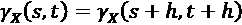
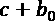
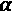
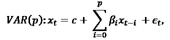
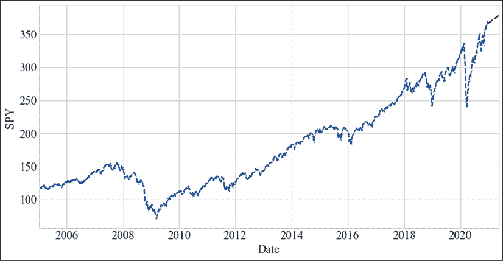

# 第五章：使用移动平均和自回归模型进行预测

本章介绍基于移动平均和自回归的时间序列建模。这个主题包含了一大类模型，在不同学科中都非常流行，包括计量经济学和统计学。我们将讨论自回归和移动平均模型，以及一些将这两者结合起来的模型，如 ARMA、ARIMA、VAR、GARCH 等。

这些模型仍然受到高度评价并且有广泛的应用。然而，自那时以来，许多新模型涌现出来，证明它们与这些简单模型具有竞争力，甚至能够超越它们。然而，在其主要应用领域，即单变量预测中，简单模型往往能够提供准确或足够准确的预测，因此这些模型在时间序列建模中仍然占据主导地位。

我们将涵盖以下主题：

+   经典模型是什么？

    +   移动平均和自回归

    +   模型选择和阶数

    +   指数平滑法

    +   ARCH 和 GARCH

    +   向量自回归

+   Python 库

    +   statsmodels

+   Python 实践

    +   在 Python 中建模

我们将从经典模型的介绍开始。

# 经典模型是什么？

在本章中，我们将讨论那些有着更长传统的模型，这些模型根植于统计学和数学领域。它们在计量经济学和统计学中有着广泛应用。

虽然统计学和机器学习方法之间有相当多的重叠，而且两个领域的学者都在吸收对方的研究成果，但仍然存在一些关键差异。统计学论文仍然主要是正式和推理性的，而机器学习研究者则更加务实，依赖于模型的预测准确性。

我们在 *第一章*《Python 时间序列介绍》中讨论了时间序列模型的早期历史。在本章中，我们将讨论用于预测的移动平均和自回归方法。这些方法在 20 世纪初期被提出，并在 1970 年由 George Box 和 Gwilym Jenkins 在他们的著作《*时间序列分析：预测与控制*》中推广。关键的是，在这本书中，Box 和 Jenkins 使 ARIMA 模型得到了形式化，并描述了如何将其应用于时间序列预测。

许多时间序列展现出趋势和季节性，而本章中的许多模型假设时间序列是平稳的。如果一个时间序列是平稳的，它的均值和标准差会随着时间保持不变。这意味着该时间序列没有趋势，也没有周期性波动。

因此，去除不规则成分、趋势和季节波动是应用这些模型的一个内在方面。模型然后预测去除季节性和趋势后的残余部分：商业周期。

因此，应用经典模型时，时间序列通常需要分解为不同的组成部分。因此，经典模型通常按以下方式应用：

1.  平稳性检验

1.  差分处理【如果检测到平稳性】

1.  拟合方法和预测

1.  加回趋势和季节性

本章中的大多数方法仅适用于单变量时间序列。尽管已经提出了扩展到多变量时间序列的方法，但它们不像单变量版本那样流行。单变量时间序列由单个向量组成，换句话说，就是一个随时间变化的值。尽管如此，我们将在本章末尾看到**向量自回归**（**VAR**），这是一种多变量时间序列的扩展。

另一个重要的考虑因素是，大多数经典模型都是线性的，这意味着它们假设时间点之间以及不同时间步长之间的值之间存在线性依赖关系。实际上，本章中的模型在处理一系列平稳时间序列时效果良好。平稳性意味着分布随时间保持不变。一个例子就是温度随时间的变化。这些模型在数据量较小的情况下尤其有价值，因为在这种情况下，非线性模型中的额外估计误差会超过精度上的潜在增益。

然而，平稳性假设意味着本章中模型的应用仅限于具有这一属性的时间序列。否则，我们就需要对时间序列进行预处理，以强制其平稳性。相比之下，非线性时间序列分析与预测的统计方法发展较少受到关注；然而，仍然存在一些模型，例如阈值自回归模型（我们在这里不讨论）。

最后，需要指出的是，虽然这是一个合理的初步方法，但许多时间序列（如温度）的预测通过基于物理的大气高维模型，比通过统计模型更为准确。这说明了复杂性的问题：本质上，建模是将一组假设凝练并与参数一起形式化的过程。

现实世界的时间序列来自复杂的过程，这些过程可能是非线性和非平稳的，描述它们的方式有很多种，每种方法都有其优缺点。因此，我们可以从很多参数的角度看待建模问题，或者仅将其视为单一或几个参数。在下面的专门部分，我们将讨论如何根据参数数量和精度，从一组备选模型中选择一个模型的问题。

目前，非线性模型来源于不同的研究方向，主要是神经网络或更广泛的机器学习领域。我们将在*第十章*中讨论神经网络，*《时间序列的深度学习》*，并将在*第七章*中讨论并应用最先进的机器学习方法，*《时间序列的机器学习模型》*。

## 移动平均和自回归

经典模型可以分为几类模型——**移动平均**（**MA**）、**自回归**（**AR**）模型、ARMA 和 ARIMA。这些模型经过时间的推敲，由许多数学家和统计学家在书籍和论文中正式化并普及开来，包括彼得·惠特尔（1951 年）和乔治·博克斯与吉威尔姆·詹金斯（1970 年）。不过，让我们从更早的时候开始。

**移动平均**标志着现代时间序列预测的开始。在移动平均中，通常会对过去一段时间内（时间框架）一定数量的时间点的值取平均（通常是算术平均）。

更正式地说，**简单移动平均**是一个无权重的平均值，计算范围为 k 个点，公式为：


其中 *x*[i] 表示观察到的时间序列。

移动平均可以用来平滑时间序列，从而去除短期内发生的噪声和周期波动，实际上起到低通滤波器的作用。因此，正如数学家雷金纳德·胡克在 1902 年的一篇出版物中指出的那样，移动平均可以用来分离趋势和振荡成分。他将趋势概念化为忽略振荡后，序列前进的方向。

移动平均可以平滑时间序列中的趋势和周期；然而，作为一种模型，移动平均也可以用于预测未来。时间序列是当前序列值与观察值（误差项）之间的线性回归。移动平均模型的阶数为 *q*，即 *MA(q)*，可以表示为：


其中  是 *x*[t] 的平均值（期望值）（通常假设为 0）， 是参数， 是随机噪声。

胡克在剑桥大学接受教育，曾在英国农业、渔业和食品部的统计部门工作。他是一个业余统计学家，撰写关于气象学和社会经济话题的文章，如工资、婚姻率、贸易以及作物预测等。

**AR** 技术的发明可以追溯到 1927 年，英国统计学家乌德尼·尤尔（Udny Yule）的论文（《*On a Method of Investigating Periodicities in Disturbed Time-Series with special reference to Wolfer's Sunspot Numbers*》），尤尔是胡克的朋友。**自回归模型**（autoregressive model）将变量与其自身的滞后值回归。换句话说，当前值由紧接其后的值通过线性组合驱动。

太阳黑子的变化具有高度周期性，正如这张显示太阳黑子随时间变化的图表所示（通过 statsmodels 数据工具加载）：


图 5.1：按年划分的太阳黑子观测数据

尤尔提出了一个由噪声驱动的线性模型，用来应用于太阳黑子数目，即太阳外壳上的黑斑数量。这些黑斑源自巨大的爆炸，标志着太阳的磁活动，并且与日冕物质抛射等现象相关。

下面是根据太阳黑子数目展示的低太阳活动和高太阳活动的两幅图像（来自 NASA）：


图 5.2：太阳活动

今天，我们知道太阳周期是太阳磁活动的一个几乎周期性的 11 年变化，表现为高磁活动（太阳极大期）和低磁活动（太阳极小期）之间的变化。在高点时，爆炸（太阳耀斑）会将带电粒子释放到太空中，可能危及地球上的生命。

尤尔（Yule）在**伦敦大学学院**（**UCL**）学习工程学，后来与海因里希·赫兹（Heinrich Hertz）一起在波恩工作，随后回到 UCL 与卡尔·皮尔逊（Karl Pearson）合作，并最终晋升为 UCL 的助理教授。在 UCL 担任统计学职位后，他移居剑桥。他因其关于统计学的著作《*统计学理论导论*》而被人们铭记，这本书首次出版于 1911 年，经过了多个版本的修订。此外，他还因描述了现在被称为优先附着过程的现象而闻名，该过程描述了网络中新节点的分配方式是根据节点已经拥有的数量来决定的；这一过程有时被称为“富者愈富”。

安德烈·柯尔莫哥洛夫（Andrey Kolmogorov）在 1931 年定义了**平稳过程**这一术语，尽管路易·巴谢列（Louis Bachelier）在早些时候（1900 年）就用不同的术语提出了类似的定义。**平稳性**由三个特征定义：

1.  有限变差

1.  恒定均值

1.  恒定变差

恒定变差意味着时间序列在两个点之间的窗口内的变化随着时间的推移保持恒定：，尽管它可能随窗口的大小变化。

这是弱平稳性。在文献中，除非另有说明，通常平稳性指的是弱平稳性。严格平稳性意味着时间序列具有随时间不变的概率密度函数。换句话说，在严格平稳性下，联合分布在  上与在  上是相同的。

1938 年，挪威数学家赫尔曼·奥勒·安德烈亚斯·沃尔德（Herman Ole Andreas Wold）描述了平稳时间序列的分解。他观察到，平稳时间序列可以表示为一个确定性成分（自回归）与一个随机成分（噪声）的和。如今，这一分解方法以他的名字命名，称为**沃尔德分解**。

这导致了自回归模型的形式化，阶数为 ，*AR(p)*，表示为：


其中  是模型参数，*c* 是一个常数，而  则代表噪声。在这个方程中，*p* 是时间序列连续值之间自相关性的度量。

此工作后来在 1951 年被新西兰人彼得·惠特尔的博士论文《*时间序列假设检验*》中推广到多变量时间序列中，彼得·惠特尔的导师是沃尔德。彼得·惠特尔也因将 AR 和 MA 模型整合为一个而受到赞誉，这就是**自回归移动平均**（**ARMA**）的另一个里程碑，将尤尔和胡克的工作结合在一起。

ARMA 模型包括两种类型的滞后值，一种用于自回归分量，另一种用于移动平均分量。因此，我们写成*ARMA(p, q)*，其中第一个参数 p 表示自回归的顺序，第二个*q*表示移动平均的顺序，如下所示：


ARMA 假设该系列是稳定的。在实践中，为了确保稳定性，必须应用预处理。

模型参数是通过最小二乘法估计的，直到乔治·Box 和 Gwilym Jenkins 推广了他们的最大似然估计参数方法。

乔治·Box 是不仅在古典时间序列预测领域中最有影响力的人物之一，也在更广泛的统计领域中卓有成效。在二战期间，他未完成化学学习就被征召入伍，为军队进行毒气实验，在此过程中自学了统计学以进行分析。

战争结束后，他在伦敦大学学院学习数学和统计学，并在埃冈·皮尔逊（Karl Pearson 之子）的指导下完成了他的博士学位。后来，他在普林斯顿大学领导了一个研究团队，然后在威斯康星大学麦迪逊分校创立了统计学系。

Box 和 Jenkin 的 1970 年著作 "*Time-Series Analysis: Forecasting and Control*"，详细介绍了时间序列预测和季节调整的许多应用示例。所谓的 Box-Jenkins 方法是最流行的预测方法之一。他们的书籍还描述了**自回归积分移动平均**模型（**ARIMA**）。

ARIMA(p, d, q)包括一个数据预处理步骤，称为**积分**，使时间序列保持稳定，通过替换值来减去即时过去的值，这个转换称为**差分**。

模型的积分由参数 d 参数化，它是当前值和先前值之间进行差分的次数。正如提到的那样，这三个参数代表模型的三个部分。

有一些特殊情况；ARIMA(p,0,0)代表 AR(p)，ARIMA(0,d,0)代表 I(d)，而 ARIMA(0,0,q)则是 MA(q)。I(0)有时被用作一个约定，指的是不需要任何差分即可保持稳定的时间序列。

虽然 ARIMA 类型模型有效地考虑了平稳过程，但作为 ARMA 模型扩展的 **季节性自回归积分滑动平均** 模型（**SARIMA**）可以描述在季节内外展现非平稳行为的过程。

季节性 ARIMA 模型通常表示为 ARIMA(p,d,q)(P,D,Q)m。各个参数需要进一步解释：

+   m 表示一个季节中的周期数

+   P、D、Q 参数化季节部分的自回归、差分和移动平均组件

+   p、d、q 是我们之前讨论过的 ARIMA 项。

P 是度量时间序列中连续季节组件之间自相关性的指标。

我们可以列出季节部分来使其更清楚。**季节性自回归**，**SAR**，可以表示为：


其中 *s* 是季节性周期的长度。

类似地，**季节性移动平均**，**SMA**，可以写作如下：


请注意，这些组件中的每一个将使用一组不同的参数。

例如，模型 SARIMA(0,1,1)(0,1,1)12 过程将包含一个非季节性 MA(1) 项（对应参数 ），以及一个季节性 MA(1) 项（对应参数 ）。

## 模型选择与顺序

ARMA 中的参数 q 通常为 3 或更少，但这更多地反映了计算资源的限制，而非统计问题。如今，为了设置 p 和 q 参数，我们通常会查看自相关和偏自相关图，其中我们可以看到每个滞后的相关性峰值。

当我们有不同的模型，比如不同的 p 和 q 模型，每个模型都在相同的数据集上进行训练时，我们怎么知道应该使用哪个模型呢？这就是模型选择的作用。

模型选择是决定竞争模型之间选择的方法论。模型选择中的一个主要思想是奥卡姆剃刀原则，得名于英国方济各会修士、经院哲学家威廉·奥卡姆（William of Ockham），他生活在公元 1287 年至 1347 年间。

根据奥卡姆剃刀原则，在选择竞争性解决方案时，应优先选择假设最少的解释。奥卡姆基于这一思想主张，神圣干预的原则是如此简单，奇迹便是一个简洁的解释。这个规则，也叫做拉丁语中的 "*lex parsimoniae*"，表明一个模型应当简洁，即使它简单，却应具有较高的解释力。

在科学中，出于可证伪性原则，通常偏好更简单的解释。科学解释越简单，越容易进行测试，甚至可能被推翻——这为模型提供了科学的严谨性。

ARMA 和其他模型通常通过 **最大似然估计**（**MLE**）进行估计。在 MLE 中，这意味着最大化似然函数，以便在给定模型参数的情况下，观察到的数据是最有可能的。

最大似然法中最常用的模型选择标准之一是 **赤池信息准则** (**AIC**)，得名于 Hirotugu Akaike，他在 1973 年首次用英语发布了这一准则。

AIC 采用最大似然法中的对数似然值 *l* 和模型中的参数个数 *k*。


这表示 AIC 等于参数个数的两倍减去对数似然的两倍。在模型选择中，我们会选择 AIC 最小的模型，这意味着它的参数少，但对数似然高。

对于 ARIMA 模型，我们可以更具体地写出：


我已经省略了参数 d，因为它不会引入额外的估计。

**贝叶斯信息准则** (**BIC**) 是由 Gideon Schwarz 在几年前（1978 年）提出的用于模型选择的方法，和 AIC 非常相似。它额外考虑了 *N*，数据集中的样本数量：


根据 BIC，我们希望选择一个具有较少参数和较高对数似然的模型，但同时样本量也要小。

## 指数平滑

指数平滑，追溯至 Siméon Poisson 的工作，是一种通过指数窗口函数平滑时间序列数据的技术，可以用于预测具有季节性和趋势的时间序列。

最简单的方法，**简单指数平滑**，**SES**，*s*[t] 的时间序列 *x*[t] 可以表示为：


其中  是指数平滑因子（一个介于 0 和 1 之间的值）。

本质上，这是一个加权移动平均，权重为 *α* 和 。你可以把第二项  看作递归的，在展开时，  会被重复相乘——这就是指数项。

参数  控制平滑值在当前值和前值之间的决定权重。与移动平均法相似，这个公式的效果是结果变得更加平滑。

有趣的是，John Muth 在 1960 年展示了 SES 在时间序列中提供了最佳预测，其中在每个时间步，值会随机偏离前一个值，而且步长是独立同分布的，加上噪声。这种时间序列称为随机游走，有时，波动的股票价格假定遵循这种行为。

另一种指数平滑方法是**Theta 方法**，它对从业者尤其具有吸引力，因为它在 2000 年的 M3 竞赛中表现出色。M3 竞赛得名于其组织者斯皮罗斯·马克里达基斯（Spyros Makridakis），他是尼科西亚大学的教授兼未来研究所的主任。该竞赛涉及 3003 个来自微观经济学、工业、金融、人口学等领域的时间序列。其主要结论之一是，非常简单的方法也可以在单变量时间序列预测中表现良好。M3 竞赛被证明是预测领域的一个转折点，提供了基准和**最先进的技术**（**SOTA**），尽管自那时以来，SOTA 已经发生了显著变化，正如我们在*第七章*《时间序列的机器学习模型》中将看到的那样。

Theta 方法由瓦西里斯·阿西马科普洛斯（Vassilis Assimakopoulos）和科斯塔斯·尼科洛普洛斯（Konstantinos Nikolopoulos）于 2000 年提出，并由罗布·海德曼（Rob Hyndman）和巴基·比拉（Baki Billah）在 2001 年重新阐述。Theta 模型可以理解为**简单指数平滑**（**SES**）带有漂移项。

该方法基于将去季节化数据分解为两条线。第一条所谓的“theta”线估计长期成分——趋势，然后将此趋势与 SES 的加权平均值相结合。

让我们更正式地阐述这一点！趋势成分的预测公式如下：


在这个方程中，*c*是截距，是乘以时间步长的系数，是残差。可以通过普通最小二乘法拟合。

Theta 的公式是将这一趋势与 SES 加权求和：


这里，是时间步长*t*时刻的*X*预测值。

最流行的指数平滑方法之一是**霍尔茨-温特斯方法**。芝加哥大学的查尔斯·霍尔茨教授于 1957 年首次发布了一种双重指数平滑方法，该方法允许基于趋势和水平进行预测。他的学生彼得·温特斯在 1960 年扩展了该方法，以捕捉季节性（“*通过指数加权移动平均法预测销售额*”）。即便在后期，霍尔茨-温特斯平滑法也被进一步扩展，以考虑多重季节性（n 阶平滑）。

为了应用霍尔茨-温特斯方法，我们首先去除趋势和季节性。然后我们预测时间序列并将季节性和趋势加回来。

我们可以区分方法的加性和乘法变体。趋势和季节性都可以是加性或乘法的。

加性季节性是独立于系列值添加的季节性。乘法季节性成分是按比例添加的，当季节效应随着时间序列中的值（或趋势）的增加或减少而变化时。通过视觉检查可以帮助决定使用哪种变体。

Holtz-Winters 方法也称为三重指数平滑法，因为它应用了三次指数平滑，正如我们所见。Holtz-Winters 方法捕捉了三个组成部分：

+   对每个时间点的水平估计，*L*[t] —— 这可能是一个平均值

+   趋势分量 *T*

+   季节性 *S*[t]，具有 *m* 个季节（即一年中的季节数）

对于加性趋势和季节性，在数学上，Holtz-Winters 预测值  定义为：


对于 **乘法季节性**，我们将其与季节性相乘：


水平更新如下：


我们基于两个项的加权平均来更新当前水平，其中  为两者之间的权重。这两个项分别是前一水平和去季节化后的系列值。

在这个方程中，我们通过除以季节性来进行去季节化：


之前的趋势分量会像这样被加到前一个水平：


趋势更新如下（对于加性趋势）：


最终，（乘法）季节性更新如下：


我们可以根据需要将这些方程切换为加性变体。本书的范围之外会有更详细的讨论——我们就此止步。

## ARCH 和 GARCH

麻省理工学院经济学教授 Robert F. Engle 提出了一个时间序列预测模型（1982），他将其命名为 **ARCH**（**自回归条件异方差**）。

对于金融机构而言，风险价值（value at risk），即在特定时间段内的金融风险水平，是风险管理中的一个重要概念。因此，考虑资产收益的协方差结构至关重要。这就是 ARCH 所做的，也解释了其重要性。

事实上，鉴于他在时间序列计量经济学领域的贡献，Engle 与之前提到的 Clive Granger 一起，于 2003 年获得了诺贝尔经济学奖（诺贝尔经济科学纪念奖）。表彰中特别提到了他在 ARCH 方面的开创性工作。

在 ARMA 型模型中，收益被建模为独立且在时间上相同分布，而 ARCH 通过对收益在不同频率下的高阶依赖性进行参数化，从而允许时间变化的（异方差）误差项。

在 ARCH 中，残差表示为由一个随机项 *z*[t] 和一个标准差  组成，这两者都是时间相关的： 。

时间 *t* 处残差的标准差模型依赖于前期点的残差：


其中 q 是方差依赖的前期时间点的数量。

模型 ARCH(q) 可以通过最小二乘法来确定。

最小二乘法算法是求解线性方程 y=X.β 以获得 β。它的原理是找到最小化误差平方和的参数，即 。

**GARCH**（**广义自回归条件异方差模型**）是在 Tim Bollerslev（1986）和 Stephen Taylor（1986）分别扩展 Engle 模型使其更具普遍性时诞生的。GARCH 和 ARCH 之间的主要区别在于，残差来自 ARCH 模型，而不是自回归模型 AR。

通常，在应用 GARCH 或 ARCH 模型之前，会进行同方差性的统计检验，换句话说，就是检验方差是否随时间保持恒定。常用的检验方法是 ARCH-LM 检验，零假设为时间序列没有 ARCH 效应。

## 向量自回归

本章介绍的所有预测方法都针对单变量时间序列，即由单一时间依赖变量组成的时间序列，一个单一向量。在实践中，我们通常知道比单一测量序列更多的信息。

例如，如果我们的时间序列是关于冰淇淋销量的，我们可能还知道温度或泳衣的销量。我们可以预期冰淇淋销量与温度高度相关，实际上，当气温较高时，冰淇淋的消费可能会增加。同样，我们也可以推测泳衣的销量与冰淇淋的销量要么同时发生，要么先于冰淇淋销量，或晚于冰淇淋销量。

向量自回归模型可以追踪多个变量随时间变化的关系。它们可以捕捉时间序列与当前时间戳之前的数值向量之间的线性依赖，将 AR 模型推广到多变量时间序列。

VAR 模型的特点是其阶数，即模型中考虑的前几个时间点的数量。最简单的情况是 VAR(1)，其中模型只考虑时间序列的一个滞后项，公式如下：


其中 *c* 是常数，即直线的截距， 是模型的系数，而  是 t 时刻的误差项。*x*[t] 和 *c* 是长度为 *k* 的向量，而  是一个  矩阵。

p 阶模型，VAR(p)，表示为：



VAR 假设误差项的均值为 0，且误差项之间没有序列相关性。

就像向量自回归是自回归的多变量推广，**向量 ARIMA**（**VARIMA**）是对单变量 ARIMA 模型的扩展，用于多变量时间序列。尽管早在 1957 年就已经正式提出，但可用的软件实现直到后来才出现。

在下一节中，我们将介绍一些可以在 Python 中用于经典模型预测的库。

# Python 库

Python 中有一些流行的经典时间序列建模库，但其中最流行的无疑是 statsmodels。以下图表比较了各库在 GitHub 上的星标数，显示它们的受欢迎程度：


图 5.3：Python 经典时间序列预测库的受欢迎程度

Statsmodels 显然是这些库中最受欢迎的。我只选择了那些积极维护并直接实现算法的库，而不是从其他库导入的库。例如，SkTime 或 Darts 库提供传统的预测模型，但这些模型并未在它们那里实现，而是在 statsmodels 中实现的。

pmdarima（最初是 pyramid-arima）包含一个参数搜索功能，帮助拟合最佳 ARIMA 模型到单变量时间序列。Anticipy 包含一些模型，如指数衰减模型和阶梯模型。Arch 实现了金融计量经济学工具和 **自回归条件异方差性**（**ARCH**）的功能。

尽管 statsmodels 的活跃度不如 Scikit-Learn，且仅由少数人维护，但它仍是时间序列传统统计和计量经济学方法的首选库，尤其在参数估计和统计检验上，强调程度远高于机器学习。

## Statsmodels

statsmodels 库可以帮助估计统计模型并进行统计检验。它基于 SciPy 和 NumPy，包含许多统计函数和模型。

以下表格展示了与本章相关的一些建模类：

| 类别 | 描述 |
| --- | --- |
| `ar_model.AutoReg` | 单变量自回归模型 |
| `arima.model.ARIMA` | 自回归积分滑动平均（ARIMA）模型 |
| `ExponentialSmoothing` | Holt Winter’s 指数平滑 |
| `SimpleExpSmoothing` | 简单指数平滑 |

图 5.4：statsmodels 中实现的几个模型

ARIMA 类还通过 *seasonal_order* 参数支持 SARIMA，即带有季节性组件的 ARIMA。根据定义，ARIMA 还支持 MA、AR 和差分（集成）。

还有一些其他模型，如 Markov 自回归模型，但我们不会逐一讲解，我们将选择性地讲解一些。

这里列出了其他一些有用的函数：

| 函数 | 描述 |
| --- | --- |
| `stattools.kpss` | Kwiatkowski-Phillips-Schmidt-Shin 平稳性检验 |
| `stattools.adfuller` | 扩展的 Dickey-Fuller 单位根检验 |
| `stattools.ccf` | 互相关函数 |
| `stattools.pacf` | 偏自相关估计 |
| `stats.diagnostic.het_arch` | Engle 的自回归条件异方差性（ARCH）检验，也称为 ARCH-LM 检验 |
| `stattools.q_stat` | Ljung-Box Q 统计量 |
| `tsa.seasonal.seasonal_decompose` | 使用移动平均法进行季节性分解 |
| `tsa.tsatools.detrend` | 去趋势一个向量 |

图 5.5：statsmodels 中的有用函数

按照惯例，我们像这样导入 statsmodels：

```py
import statsmodels.api as sm 
```

这些 statsmodels 算法也可以通过 SkTime 使用，它通过类似 Sklearn 接口的方式提供访问。

这应该足够提供一个简短的概览。接下来我们进入建模部分！

# Python 实践

正如本章引言所述，我们将使用 statsmodels 库进行建模。

## 需求

在本章中，我们将使用几个库，这些库可以从终端（或类似地从 Anaconda Navigator）快速安装：

```py
pip install statsmodels pandas_datareader 
```

我们将从 Python（或 IPython）终端执行这些命令，当然，我们也可以从 Jupyter notebook（或其他环境）执行。

让我们开始建模吧！

## Python 中的建模

我们将使用 Yahoo 财经的股票代码数据集，通过 yfinance 库下载。我们首先加载数据集，进行一些快速探索，然后构建本章中提到的几个模型。

我们将加载一系列标准普尔存托凭证（SPDR S&P 500 ETF 信托基金）：

```py
from datetime import datetime
import yfinance as yf

start_date = datetime(2005, 1, 1)
end_date = datetime(2021, 1, 1)
df = yf.download(
    'SPY',
    start=start_date,
    end = end_date
) 
```

我们需要指定日期范围和股票代码。每日价格包括开盘价、收盘价等。我们将使用开盘价进行分析。

索引列已经是 pandas 的 DateTimeIndex，因此我们无需进行转换。现在，让我们绘制这个时间序列图！

```py
import matplotlib.pyplot as plt
plt.title('Opening Prices between {} and {}'.format(
    start_date.date().isoformat(),
    end_date.date().isoformat()
))
df['Open'].plot()
plt.ylabel('Price')
plt.xlabel('Date'); 
```

这将生成以下图表：


图 5.6：标准普尔存托凭证价格随时间变化

由于这是每日数据，且每年有 253 或 252 个工作日，我决定将数据重采样为每周数据，使每年数据保持一致。

```py
df1 = df.reset_index().resample('W', on="Date")['Open'].mean()
df1 = df1[df1.index.week < 53] 
```

有些年份有 53 周。我们无法处理这种情况，因此将去掉第 53 周。现在我们有跨越 16 年的 52 周的每周数据。

最后一个修正：statsmodels 可以使用与 DateTimeIndex 相关联的频率信息；然而，这通常没有设置，`df1.index.freq` 为 `None`。所以，我们将自己设置：

```py
df1 = df1.asfreq('W').fillna(method='ffill') 
```

如果我们现在检查，`df1.index.freq` 为 `<Week: weekday=6>`。

设置频率可能会导致缺失值。因此，我们使用 `fillna()` 操作将缺失值替换为最后一个有效值。如果不这样做，某些模型将无法收敛，并且会返回 NaN（非数字）值，而不是预测值。

现在我们需要了解模型阶数的合理范围。我们将查看自相关和部分自相关函数来帮助确定：

```py
import statsmodels.api as sm
fig, axs = plt.subplots(2)
fig.tight_layout()
sm.graphics.tsa.plot_pacf(df1, lags=20, ax=axs[0])
sm.graphics.tsa.plot_acf(df1, lags=20, ax=axs[1]) 
```

这将生成以下图表：


图 5.7：部分自相关与自相关

这些图表显示了时间序列在最多 20 个时间步的滞后期上的自相关性。R 或  值接近 0 表示滞后期的连续观察值之间没有相关性。相反，接近 1 或 -1 的相关性表示这些滞后期的观察值之间存在强烈的正相关或负相关。

自相关和部分自相关都返回置信区间。如果自相关值超出了置信区间（表示为阴影区域），则表明相关性显著。

我们可以看到滞后期为 1 的部分自相关非常高，而较高滞后的自相关则较低。所有滞后的自相关都显著且较高，但随着滞后期的增加，显著性逐渐降低。

让我们继续讨论自回归模型。从这里开始，我们将使用 statsmodels 的建模功能。这个接口非常方便，正如你将看到的那样。

我们不能直接使用自回归模型，因为它需要时间序列是平稳的，这意味着均值和方差在时间上是恒定的——没有季节性，没有趋势。

我们可以使用 statsmodels 工具来查看时间序列的季节性和趋势性：

```py
from statsmodels.tsa.seasonal import seasonal_decompose
result = seasonal_decompose(df, model='additive', period=52)
result.plot() 
```

我们将周期设置为 1，因为每个数据点（行）对应一年。

让我们看看各个组成部分的样子：


图 5.8：时间序列的季节性分解

第一个子图是原始时间序列。这个数据集包含季节性和趋势性，您可以在子图中看到这些成分被分离出来。

如前所述，我们需要一个平稳的序列来进行建模。为了建立平稳性，我们需要去除季节性和趋势性成分。我们也可以去除我们之前估算的季节性或趋势性成分。或者，我们可以使用 statsmodels 中的封装功能，或者在 ARIMA 中设置 d 参数。

我们可以使用扩展的迪基-富勒（Augmented Dickey-Fuller）和 KPSS 检验来检查平稳性：

```py
from arch.unitroot import KPSS, ADF
ADF(df1) 
```

我们本可以使用`statsmodels.tsa.stattools.adfuller`或`statsmodels.tsa.stattools.kpss`，但我们更喜欢 ARCH 库版本的方便性。我们将留给用户检查 KPSS 检验的输出。我们得到了如下输出：


图 5.9：KPSS 检验平稳性的输出

给定 p 值为 0.997，我们可以拒绝单位根的原假设，并得出结论，我们的过程是弱平稳的。

那么我们如何找到合适的差分值呢？我们可以使用 pmdarima 库，它提供了一个专门用于此目的的函数：

```py
from pmdarima.arima.utils import ndiffs
# ADF Test:
ndiffs(df1, test='adf') 
```

我们得到了一个值 1。对于 KPSS 和 PP 检验，我们会得到相同的值。这意味着我们可以从第一次差分开始工作。

让我们从自回归模型开始。

提醒一下，ARIMA 模型由参数 p、d、q 来定义，其中：

+   p 表示自回归模型：AR(p)

+   d 表示积分

+   q 表示移动平均：MA(q)

因此，ARIMA(p, d, 0) 就是带有差分阶数 d 的 AR(p)模型。

知道 statsmodels 会检查并警告平稳性假设是否成立，让人放心。让我们尝试运行以拟合以下 AR 模型：

```py
mod = sm.tsa.arima.ARIMA(endog=df, order=(1, 0, 0))
res = mod.fit()
print(res.summary()) 
```

```py
UserWarning: Non-stationary starting autoregressive parameters found. Using zeros as starting parameters.
  warn('Non-stationary starting autoregressive parameters' 
```

由于我们已经知道需要进行一次差分处理，我们可以将 d 设置为 1。再试一次。这次，我们将使用 `STLForecast` 包装器，它能去除季节性并重新加回季节性。这是必要的，因为 ARIMA 无法直接处理季节性：

```py
from statsmodels.tsa.forecasting.stl import STLForecast
mod = STLForecast(
  df1, sm.tsa.arima.ARIMA,
  model_kwargs=dict(order=(1, 1, 0), trend="t")
)
res = mod.fit().model_result
print(res.summary()) 
```

我们得到以下总结：


图 5.10：我们的 ARIMA 模型概述

这个结果总结提供了所有关键统计数据。我们看到模型是 ARIMA(1, 1, 0)。对数似然值为 -1965。我们还看到了 BIC 和 AIC 值，这些值可以用于模型选择。

请注意，我们在这里需要设置 `trend="t"`，这样模型就会包含常数项。如果不设置，我们将得到一个虚假的回归结果。

我们如何使用这个模型？让我们进行一些预测！

```py
STEPS = 20
forecasts_df = res.get_forecast(steps=STEPS).summary_frame() 
```

这给我们提供了一个未来 20 步的预测。

让我们来可视化一下！

```py
ax = df1.plot(figsize=(12, 6))
plt.ylabel('SPY')
forecasts_df['mean'].plot(style='k--')
ax.fill_between(
    forecasts_df.index,
    forecasts_df['mean_ci_lower'],
    forecasts_df['mean_ci_upper'],
    color='k',
    alpha=0.1
) 
```

这是我们得到的结果：


图 5.11：SPY 股票代码的价格预测

实线表示我们已知的数据，虚线代表我们预测的未来 20 年的结果。我们预测值周围的灰色区域是 95% 的置信区间。

这个看起来还不错。作为读者的练习，可以尝试使用不同的参数。值得更改的有趋势参数和模型的阶数。

对于移动平均，我们创建不同的模型来观察它们的预测差异！

首先，我们将生成预测：

```py
forecasts = []
qs = []
for q in range(0, 30, 10):
    mod = STLForecast(
            df1, sm.tsa.arima.ARIMA, 
            model_kwargs=dict(order=(0, 1, q), trend="t")
        )
    res = mod.fit()
    print(f"aic ({q}): {res.aic}")
    forecasts.append(
            res.get_forecast(steps=STEPS).summary_frame()['mean']
        )
    qs.append(q)
forecasts_df = pd.concat(forecasts, axis=1)
forecasts_df.columns = qs 
```

在循环中，我们正在迭代不同的 q 参数，选择 0、10 和 20。我们使用这些 q 值估计移动平均模型，并预测未来 20 年的价格。同时，我们还打印出每个 q 对应的 AIC 值。这是我们得到的结果：

```py
aic (0): 3989.0104184919096
aic (10): 3934.375909262983
aic (20): 3935.3355340835 
```

现在，让我们像之前一样绘制三个预测图：

```py
ax = df1.plot()
plt.ylabel('SPY')
forecasts_df.plot(ax=ax) 
```

这是新的图表：


图 5.12：使用不同 q 参数的预测

那么，这些模型中哪一个在统计学上更好呢？

让我们回到 AIC。AIC 值越低，模型的效果越好，因为它考虑了对数似然和参数的数量。

在这种情况下，q=10 的阶数给出了最低的 AIC 值，根据这一标准，我们应该选择 q=10。当然，我们只尝试了三个不同的值。接下来我将留给读者作为练习，找出一个更合理的 q 参数值。

请注意，pmdarima 库具有查找最优参数值的功能，而 SkTime 库提供了 ARIMA 模型最优阶数的自动发现实现：AutoARIMA。

接下来，我们使用指数平滑模型进行预测。

在循环中，我们正在迭代不同的 q 参数，选择 0、10 和 20。我们使用这些 q 值估计移动平均模型，并预测未来 20 年的价格。同时，我们还打印出每个 q 对应的 AIC 值。这是我们得到的结果：

```py
mod = sm.tsa.ExponentialSmoothing(
        endog=df1, trend='add'
    )
res = mod.fit() 
```

这将模型拟合到我们的数据上。

让我们为接下来的 20 年获取预测：

```py
forecasts = pd.Series(res.forecast(steps=STEPS)) 
```

现在，让我们绘制预测图：

```py
ax = df.plot(figsize=(12, 6))
plt.ylabel('SPY')
forecasts.plot(style='k--') 
```

这是图表：



图 5.13：指数平滑预测

直到现在，我们只是看了 20 步预测的图表。我们还没有对模型的表现进行深入分析。让我们看看误差！

为此，我们首先需要将数据集划分为训练集和测试集。我们可以进行 n 步预测并检查误差。我们只需将截至某一时间点的时间序列作为训练数据，之后的时间点作为测试数据，然后将预测值与实际数据点进行比较：

```py
from statsmodels.tsa.forecasting.theta import ThetaModel
train_length = int(len(df1) * 0.8)
tm = ThetaModel(df1[:train_length], method="auto",deseasonalize=True)
res = tm.fit()
forecasts = res.forecast(steps=len(df1)-train_length)
ax = df1.plot(figsize=(12, 6))
plt.ylabel('SPY')
forecasts.plot(style='k--') 
```

这是图表：


图 5.14：Theta 模型预测

虚线是预测值。它似乎与时间序列的实际行为不太吻合。让我们使用我们在上一章《时间序列的机器学习入门》中讨论过的误差度量来量化这个问题：

```py
from sklearn import metrics
metrics.mean_squared_error(forecasts, df1[train_length:], squared=False) 
```

我们得到一个值为`37.06611385754943`。这是均方根误差（我们将`squared`参数设置为`False`）。

在预测比赛中，比如 Kaggle 网站上的比赛，最低误差获胜。在现实中，简洁性（简单性）也很重要；然而，我们通常仍然追求尽可能低的误差（无论采用哪种度量标准）。

还有很多其他模型可以探索和尝试，但现在是时候总结本章内容了。

# 总结

在这一章中，我们讨论了基于移动平均和自回归的时间序列预测。这个主题包含了一大套模型，在不同领域（如计量经济学和统计学）中非常流行。这些模型是时间序列建模的支柱，并提供了最先进的预测方法。

我们已经讨论了自回归和移动平均模型，以及结合这两者的其他模型，包括 ARMA、ARIMA、VAR、GARCH 等。在实践环节中，我们已经将一些模型应用于股票价格数据集。
