# 第六章：时间序列的无监督方法

我们在前一章已经讨论了预测方法，接下来我们将在下一章中讨论时间序列的预测。这些预测模型的性能很容易受到数据中重大变化的影响。识别这些变化是无监督学习的领域。

在本章中，我们将描述使用时间序列数据进行无监督学习的具体挑战。无监督学习的核心是从时间序列中提取结构，最重要的是识别子序列之间的相似性。这正是异常检测的本质（同样适用于：离群点检测），我们希望识别出与其他序列明显不同的序列。

时间序列数据通常是非平稳的、非线性的，并且是动态演化的。处理时间序列的一个重要挑战是识别潜在过程中的变化。这被称为变点检测（CPD）或漂移检测。数据随着时间的推移而变化，识别这些变化的程度至关重要。这是值得深入探讨的，因为变点和异常点的存在是现实应用中的常见问题。

在本章中，我们将集中讨论异常检测和变点检测（CPD），而在*第八章*中，*时间序列的在线学习*，我们将更详细地探讨漂移检测。我们将从概述和定义开始，然后研究大科技公司在行业中的实践。

我们将讨论以下主题：

+   时间序列的无监督方法

+   异常检测

+   变更检测

+   聚类

+   Python 实践

我们将从无监督学习与时间序列的总体介绍开始。

# 时间序列的无监督方法

时间序列与其他类型数据的主要区别在于它对时间轴的依赖；在某一点 *t*[1] 上的相关结构可能与在点 *t*[2] 上的相同结构包含完全不同的信息。时间序列通常包含大量噪声且维度较高。

为了减少噪声并降低维度，可以应用降维、波形分析或信号处理技术，例如傅里叶分解。这些通常是异常检测或变点检测（CPD）技术的基础，我们将在本章讨论这些技术。我们将在*第八章*中讨论漂移检测，*在线时间序列方法*。

我们将详细讨论异常值和变化点，查看它们的表现形式可能会有所帮助。在 Ilona Otto 等人的文章《*2050 年通过社会动态稳定地球气候的社会临界动态*》中，他们分析了基于社会动态的温室气体排放变化是否以及如何将各国转变为碳中和社会。他们根据不同的情景预测了全球变暖，以下图显示了 2010 年及 2020 年代初期的临界点（图表改编自他们的文章）：

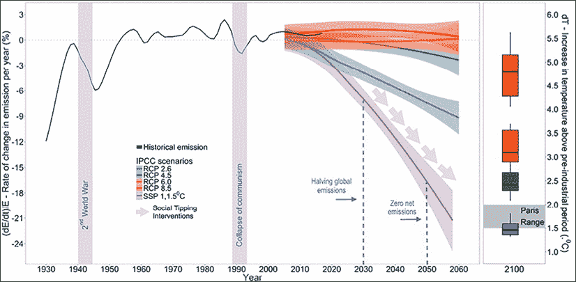

图 6.1：基于温室气体排放的可能变化点

全球气温在冰川期和温暖期之间循环变化，每个周期大约持续数万年。在过去几千年里，气候逐渐变冷，直到 1970 年代，关于可能导致下一次冰河时期的降温趋势有了广泛的猜测。然而，数据表明，自工业化开始以来，主要由燃烧化石燃料推动，全球气温已上升了约 1°C。

因此，工业化时期的开始可以视为全球气温的一个变化点，如下图所示（来源：维基媒体共享资源）：

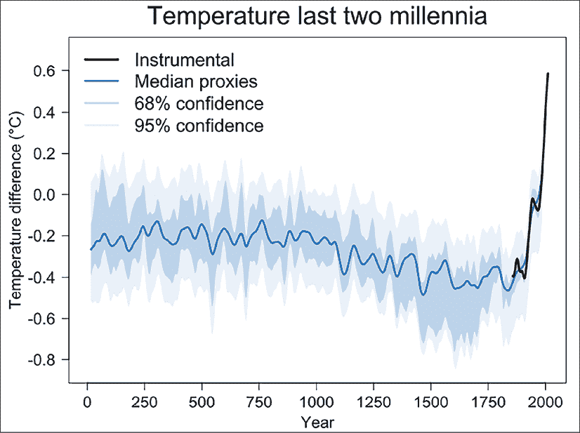

图 6.2：全球气温变化点：工业时代的开始

在上面的图表中，工业革命开始时的变化点出现在现代气温上升的异常值之前。

对于人类来说，指出变化点或异常值相对容易，特别是在事后，历史数据完全可得的情况下。对于自动检测，有很多不同的方法可以找到显著的点。在实际应用中，重要的是要仔细平衡检测率和假阳性。

# 异常检测

在异常检测中，我们希望识别出与其余序列明显不同的序列。异常值或离群点有时可能是测量误差或噪声的结果，但它们也可能表明被观察系统的行为发生了变化或出现了异常行为，这可能需要采取紧急措施。

异常检测的一个重要应用是对潜在复杂、高维数据集的自动实时监控。

是时候尝试给出一个定义了（参考 D.M. Hawkins, 1980，《*异常值识别*》）：

**定义**：异常值是指与其他观测值差异极大的数据点，以至于它可能是由不同的机制产生的。

让我们从一个图表开始，这样我们可以直观地看到异常值在图形上可能的表现。这也为我们的讨论提供了背景。

异常值检测方法可以分为单变量方法和多变量方法。参数化异常值检测方法通过选择其分布参数（例如，算术平均值），对底层分布做出假设——通常是高斯分布。这些方法标记出偏离模型假设的异常值。

在最简单的情况下，我们可以定义一个异常值，如下所示，观察值 *x*[i] 相对于分布参数的 z-得分：

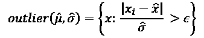

z-得分衡量每个点与移动平均或样本均值之间的距离，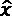，以移动或样本标准差的单位！[](img/B17577_06_003.png)。对于高于均值的值，它为正；对于低于均值的值，它为负。

在此公式中，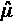 和 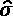 是时间序列的估计均值和标准差，*x* 是我们想要测试的点。最后， 是一个依赖于我们感兴趣的置信区间的阈值——通常，选择 2 或 1.96，对应于 95% 的置信区间。通过这种方式，异常值是指发生概率小于或等于 5% 的点。

z-得分假设数据是正态分布的；然而，以上异常值公式中使用的均值和标准差可以被其他去除此假设的度量替代。像中位数或四分位距（在*第二章*中有讨论，*使用 Python 进行时间序列分析*）等度量对分布更加稳健。

Hampel 滤波器（也叫 Hampel 标识符）是这一特殊情况，其中使用了中位数和**中位绝对偏差**（**MAD**）：

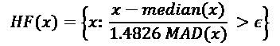

在这个方程中，样本均值被（样本）中位数取代，标准差被 MAD（绝对中位差）取代，MAD 的定义如下：

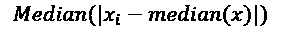

中位数是按顺序排列的数值列表中的中间数。

在 Hampel 滤波器中，每个观察值 x 将与中位数进行比较。在正态分布的情况下，Hampel 滤波器等同于 z-得分，epsilon 可以像 z-得分一样选择。

在多变量情况下，异常值函数可以表示为到模型分布中某一点的距离（或者相反：相似度），例如重心、均值。例如，我们可以计算新观察值与均值之间的协方差。

尽管这些前述方法仅限于低维或单变量时间序列，但基于距离的方法可以处理更大的空间。基于距离的异常值检测方法有效地将点聚类为不同的组，其中小组会被标记为异常值。在这些方法中，距离度量的选择至关重要。

检测时间序列中异常值的挑战之一是：

+   缺乏异常值的定义

+   输入数据中的噪声

+   时间序列的复杂性

+   高度不平衡

我们通常并不知道异常值长什么样。在实际应用中，我们往往没有异常值的标签——这使得基于真实案例的基准测试变得不可能。至于复杂性，时间序列会随着时间变化，它们通常是非平稳的，变量之间的依赖关系可能是非线性的。最后，我们通常有比异常值更多的正常观测值。

部署大规模异常检测模型作为服务的一个要求是，它们应该能够实时检测到异常。

异常检测的应用包括此图中的内容：

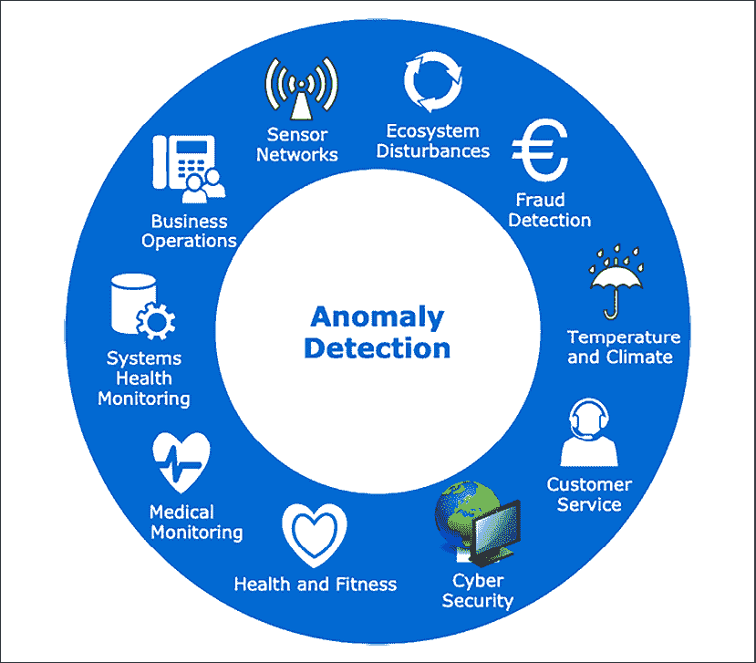

图 6.3：异常检测的应用

一些例子可能包括支付中的欺诈检测、网络安全（网络入侵）、医学监控或传感器网络。在医学监控中，我们希望实时监测生理变量，包括心率、脑电图和心电图，以便在急性紧急情况下发出警报。传感器网络中的异常警报有助于防止工业损害的发生。

该图表说明了根据数据集的可用知识，异常检测方法的主要类型：

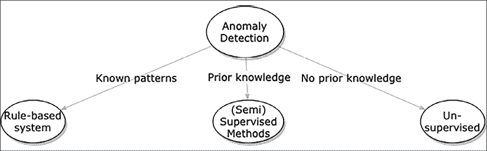

图 6.4：根据可用知识的异常检测方法

最早的异常检测例子是基于规则的系统。当模式可以清晰定义时，这种方法有效。当我们有一个标注好的异常集时，我们可以应用监督或半监督方法，如分类器或回归模型。然而，最常见的使用场景是异常没有标注，我们需要无监督方法来基于密度或分布检测异常点或异常区间。

观察大科技公司（如 Alphabet（谷歌）、Amazon、Facebook、Apple 和 Microsoft（GAFAM））在异常检测方面的做法是很有启发性的。我们逐一看看它们是如何处理异常检测的。

## 微软

在论文《微软的时间序列异常检测服务》（Hansheng Ren 等，2019）中，介绍了一种为微软生产数据的异常检测而部署的时间序列服务。其核心是**谱残差**（**SR**）和卷积神经网络（CNN），应用于单变量时间序列的无监督在线异常检测。

它们借用了来自计算机视觉中显著性图（saliency map）概念的 SR 方法。显著性图突出显示图像中对人类观察者来说突出的点。该算法对数据执行傅里叶变换，然后应用变换信号的对数幅度的 SR，最后通过逆傅里叶变换将频谱数据投影回时域。

作为扩展，他们基于人工数据使用 SR 方法训练了一个卷积神经网络（CNN）。他们展示了在公开可用数据上的基准测试，支持他们的主张：他们的方法是异常检测领域的最新技术。

他们进一步声称，在微软生产数据上，他们的检测准确性（F1 得分）提高了超过 20%。你可以在 alibi-detect 库中找到基本实现（"*谱残差*"方法）。

## Google

在 Google Analytics 的常见问题中（[`support.google.com/analytics/answer/7507748?hl=en`](https://support.google.com/analytics/answer/7507748?hl=en)），谷歌提到了一个贝叶斯状态空间时间序列模型（"*用贝叶斯结构时间序列预测当前状态*"，作者 Steven L. Scott 和 Hal Varian，2013），用于变化点和异常检测。

谷歌发布了一个具有更具体时间序列功能的 R 包——CausalImpact。描述该包背后研究的论文于 2015 年发布（"*通过贝叶斯结构时间序列模型推断因果影响*"，作者 Kay H. Brodersen, Fabian Gallusser, Jim Koehler, Nicolas Remy, Steven L. Scott）。CausalImpact 基于结构化贝叶斯时间序列模型估计干预的因果效应。该方法已被移植到 Python（pycausalimpact 库）。我们将在*第九章*，*时间序列的概率模型*中实验使用贝叶斯结构时间序列（BSTS）进行因果影响分析。

## Amazon

亚马逊通过其**亚马逊云服务**（**AWS**）平台提供大规模的机器学习解决方案，其中包含异常检测功能，作为其资源和应用监控解决方案 CloudWatch 的一部分。尽管其解决方案的具体原理尚不清楚，但经济学家 Corey Quinn 在一条推文中推测，他们的解决方案可能是指数平滑。作为其中的一部分，他们很可能将季节性分解作为算法的第一步。

他们还有第二项异常检测服务：Amazon Lookout for Metrics。关于该服务的具体工作原理也不清楚。该服务旨在监控业务指标，并且——根据文档——在亚马逊内部用于大规模监控。在此服务中，用户可以从不同细分的数据源中选择字段，例如，通过选择数据库列`page_views`和`device_type`，用户可以分别查看每种设备类型下页面浏览量的异常变化。

至于亚马逊在异常检测领域的研究，他们在**声学场景与事件检测与分类**研讨会（**DCASE** 2020）中的 117 个参赛作品中荣获前三名。他们在这次与时间序列异常检测类似的挑战中获得了最佳论文奖，论文题为"*基于组掩蔽自编码器的音频异常检测密度估计器*"（作者 Ritwik Giri 等，2020）。

## Facebook

Facebook 的核心数据科学团队在 GitHub 上开源了他们用于时间序列预测和异常检测的实现。这个库叫做 Prophet。在 2017 年宣布这个库的博客文章中，他们表示，Prophet 是 Facebook 能够大规模创建预测的关键工具，并且在决策过程中被认为是重要的信息来源。

Sean J Taylor 和 Benjamin Letham（2017）在论文《*大规模预测*》中描述了他们在 Facebook 的设置，包括一个分析师参与的环节，并且能够自动标记预测结果进行人工审查和调整。异常检测建立在来自广义加法模型（GAM）预测的不确定性基础上。

Prophet 已在基准测试中与其他概率模型和非概率模型进行了比较，且很少展现出突出的成功。microprediction.com 的 Elo 评分表明，Prophet 在单变量预测方面表现不如指数移动平均和许多其他标准方法。

## Twitter

Twitter 也发布了一个 R 包，名为 AnomalyDetection。该方法基于广义极端学生化偏差（ESD）测试，用于检测单变量近似正态分布的时间序列中的异常。该方法发表于 2017 年（“*通过统计学习在云端进行自动异常检测*”，Jordan Hochenbaum, Owen Vallis, Arun Kejariwal）。

对于他们的 ESD 测试的适配，季节性混合 ESD 方法在应用阈值之前，加入了基于 LOESS 的季节性趋势分解（STL），并对 z-score 应用了阈值（如上所述），或者对于异常值较多的数据集，基于中位数和 MAD 进行阈值化。Twitter 模型已被移植到 Python 中（sesd 库）。

## 实现

我们将以 Python 中现有的异常检测实现概述来结束。市面上有很多实现方法。它们的使用场景非常相似，但实现方式和用户群体各不相同。

以下是按 GitHub 上的星标数量排序的列表（截至 2021 年 5 月）：

| Library | 实现 | 维护者 | 星标 |
| --- | --- | --- | --- |
| Prophet | 关于预测趋势成分的估计的不确定性区间 | Facebook 核心研究 | 12.7k |
| PyOD | 适用于多变量时间序列的 30 种检测算法——从经典的 LOF（SIGMOD 2000）到 COPOD（ICDM 2020） | Yue Zhao 及其他人 | 4.5k |
| alibi-detect | 多种异常检测算法——特定于时间序列的有似然比、Prophet、谱残差、Seq2Seq、模型蒸馏 | Seldon Technologies Ltd | 683 |
| Scikit-Lego | 通过 PCA/UMAP 重构 | Vincent D. Warmerdam 及其他人 | 499 |
| Luminaire | Luminaire 窗口密度模型 | Zillow | 371 |
| Donut | 用于季节性关键绩效指标（KPI）的变分自编码器 | 清华大学网络管理实验室 | 327 |
| rrcf | 用于流数据异常检测的鲁棒随机切割森林算法 | 密歇根大学实时水系统实验室 | 302 |
| banpei | 霍特林理论 | Hirofumi Tsuruta | 245 |
| STUMPY | 针对单变量和多变量时间序列的矩阵概况算法，如 STUMP、FLUSS 和 FLOSS（也可参考 matrixprofile-ts） | TD Ameritrade | 169 |
| PySAD | 超过十种流式异常检测算法 | Selim Yilmaz, Selim 和 Suleyman Kozat | 98 |

图 6.5：Python 中的异常检测方法

这些方法各自有其背景和形式化基础；然而，本章的范围并不涵盖对它们的详细描述。

这张图展示了三大仓库的星标历史（来自 star-history.t9t.io）：

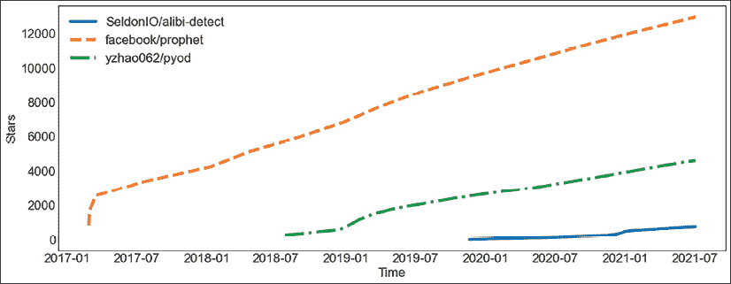

图 6.6：Prophet、PyOD 和 alibi-detect 的星标历史

Prophet 和 PyOD 的受欢迎程度（GitHub 星标数）一直在持续增长。

最近，许多深度学习算法已经被应用于异常检测，既包括单变量时间序列，也包括多变量时间序列。

深度学习模型的特别之处在于，应用范围可以更加广泛：例如闭路电视中的视频监控异常检测。我们将在*第十章*，*时间序列的深度学习*中更详细地探讨深度学习架构。

# 变化点检测

时间序列的一个常见问题是观察系统行为的变化。一般来说，变化点表示在生成该序列的过程中，系统状态之间发生了突变和重大转变。例如，趋势可能会突然发生变化，而变化点可以指示趋势变化的位置。这在交易中的技术图表模式分析中非常常见。

这个列表展示了一些 **变化点检测**（**CPD**）的应用：

+   语音识别：检测单词和句子的边界

+   图像分析：对闭路电视视频监控进行监视

+   健身：根据智能设备（如手表或手机）上的运动传感器数据，分割人的活动时间段

+   金融：识别趋势模式的变化，可能表明从熊市到牛市，或反之的转变。

以股票市场为例，说明 CPD 的重要性。描述市场演变的时间序列数据，如股票价格，遵循趋势——它要么上涨，要么下跌，或者没有显著变化（停滞）。

当股票上涨时，投资者想要买入该股票。否则，当股票下跌时，投资者不希望持有该股票，而是希望将其卖出。不改变仓位会导致账面价值的损失——在最好的情况下，这会导致流动性问题。

对于投资者而言，了解市场从上涨到下跌，或从下跌到上涨的变化时机至关重要。识别这些变化可能决定是否盈利。

在预测中，诸如黑色星期五、圣诞节、选举、新闻发布或法规变动等特殊事件可能会对趋势或序列的水平造成短期（可能当时被视为异常）或长期的变化。这将不可避免地导致传统模型产生异常的预测。

CPD 算法面临的一个特别有趣的挑战是实时检测这些拐点。这意味着在拐点到来时立即检测到变化点（或者至少在下一个变化点发生之前）。

我们可以区分 CPD 的在线和离线方法，其中在线指的是实时处理，处理每一个新到的数据点。而离线算法则可以一次性处理整个时间序列。我们将在*第八章*，*时间序列的在线学习*中更多地讨论在线处理。

CPD 与分段、边缘检测、事件检测和异常检测相关，类似的技术可以应用于所有这些应用。CPD 可以看作与异常检测非常相似，因为识别变化点的一种方法是通过异常检测算法的异常分数。

从这个角度来看，变化点与高度异常点是相同的，任何超过某个阈值的点都对应一个变化。与异常检测相似，CPD 可以定义为在两个备择假设之间进行假设检验的问题，零假设为"*没有变化发生*"，而备择假设为"*发生了变化*。"  

CPD 算法由三个组成部分构成：代价函数、搜索方法和约束条件。我们将逐一讲解这些内容。代价函数是可以应用于时间序列的一个子段（多变量或单变量）的距离函数。

代价函数的一个例子是 **最小绝对偏差**（**LAD**），它是一个估算分布中心点（均值、中位数和众数）变化的估计量，定义如下：

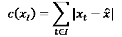

在这个定义中，*l* 是时间序列 *x* 中一个子段的索引，而 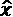 是 *x* 的中心点。

搜索函数然后会遍历时间序列来检测变化点。这可以是近似的，例如基于窗口的检测、从下到上的方法或二分分割，或者是穷举的，如动态规划或 **修剪精确线性时间**（**Pelt**）方法。

Pelt（Gachomo Dorcas Wambui 等，2015）依赖于修剪启发式方法，计算成本与时间序列的点数成线性关系，。动态规划方法的计算成本要高得多，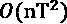，其中 n 是预期变化点的最大数量。

最后，约束条件可以作为搜索算法中的惩罚项参与其中。这个惩罚项可以编码为一个成本预算，或者是我们预期找到的变化点数量的知识。

评估 CPD 算法的性能一直是个难题，因为缺乏基准数据集。直到最近（2020 年），来自阿兰·图灵研究所和爱丁堡大学的 Gerrit van den Burg 和 Christopher Williams 发布了一个基准数据集，包含来自世界银行、欧盟统计局、美国人口普查局、GapMinder 和维基百科等来源的 37 个时间序列。他们的基准数据集已发布在 GitHub 上，并且提到该数据集的变点注释集中在 2007-08 年的金融危机、英国的安全带法规、蒙特利尔议定书（用于调控氯氟烃排放）以及美国的自动电话呼叫监管等领域。

在同一篇论文（"*An Evaluation of Change Point Detection Algorithm*"）中，作者评估了各种 CPD 方法。他们指出，假设没有任何变点的“零”基准方法在 F1 度量和基于 Jaccard 指数的聚类重叠度量上优于许多其他方法。这是因为数据集中变点的比例很小，且这些方法返回了大量的假阳性结果。他们得出结论，二分法和贝叶斯在线 CPD 是时间序列中最有效的几种方法。

二分法（"*On Tests for Detecting Change in Mean*"，作者：Ashish Sen 和 Muni S. Srivastava，1975）属于基于窗口的 CPD 方法。二分法是一种贪心算法，它通过如下定义最小化代价之和：

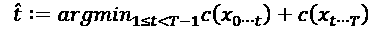

是发现的变点，而*c()*是类似于 LAD 的代价函数，我们之前在本节中看到了。其基本思想是，当两个子序列高度不相似时，表示存在变点。

二分法是顺序执行的，这意味着首先在整个时间序列中检测变点，然后在变点前后两个子序列中再次检测。这也解释了其低复杂度！[](img/B17577_06_015.png)，其中 T 为时间序列的长度。这个计算成本使得它可以扩展到更大的数据集。

该表格概述了 CPD 方法的不同种类：

| 库 | 实现方式 | 维护者 |
| --- | --- | --- |
| Greykite | 通过自适应 lasso 进行 CPD | LinkedIn |
| ruptures | 离线 CPD：二分法、动态规划、Pelt、基于窗口的 | Charles Truong |
| 贝叶斯变点检测 | 贝叶斯 CPD | Johannes Kulick |
| banpei | 奇异谱变换 | Hirofumi Tsuruta |
| changepy | Pelt 算法 | Rui Gil |
| onlineRPCA | 在线移动窗口稳健主成分分析 | Wei Xiao |

图 6.7：Python 中的 CPD 方法

我们省略了 Facebook 的 Prophet 库，因为它不是专门的 CPD 包。

下图展示了 CPD 方法随时间变化的受欢迎程度。

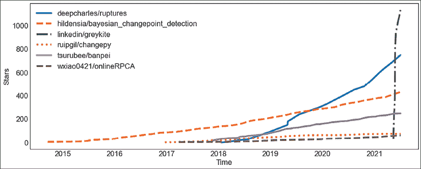

图 6.8：CPD 方法的历史演变

LinkedIn 的 Greykite 自发布以来在 GitHub 星标上迅速增长。同时，ruptures 也在流行度上大幅上升。

# 聚类

聚类分析或聚类是根据数据点或对象的相似性，在数据集中寻找有意义的组（簇）的过程。作为这种无监督数据挖掘技术的结果，我们希望每个簇中的点彼此相似，同时与其他簇中的点有所不同。

时间序列的聚类具有挑战性，因为每个数据点都是一个时间段（有序序列）。它已在多个领域得到应用，帮助发现模式，推动时间序列分析，从复杂数据集中提取洞察。

我们不打算深入讨论时间序列聚类，但下表提供了 Python 库在时间序列聚类中的概述：

| 库 | 实现 | 维护者 | 星标 |
| --- | --- | --- | --- |
| tslearn | 时间序列 K 均值、K-Shape 聚类、KernelKMeans | Romain Tavenard | 1.7k |
| river | DBStream、时间序列 K 均值、CluStream、DenStream、STREAMKMeans | Albert Bifet 及其他人 | 1.7k |

图 6.9：Python 中时间序列的聚类方法

你可以查看历史上顶级实现的 GitHub 星标数据：

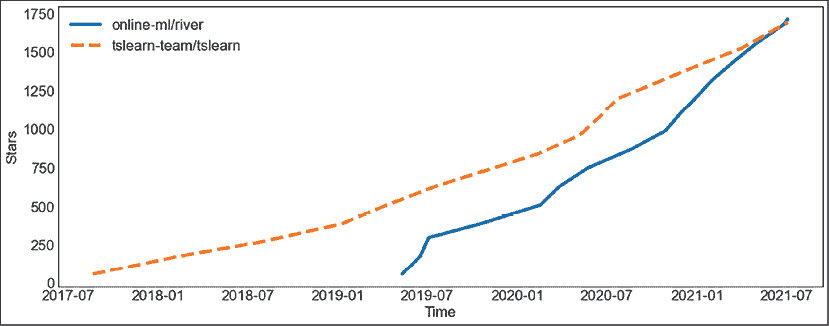

图 6.10：tslearn 和 river 的星标历史

两个库都在蓬勃发展。我们将在*第八章*，*时间序列的在线学习*中重新讨论 river。

# Python 实践

首先让我们做一个异常检测的例子，然后再做一个 CPD 的例子。我们先看看下一节所需的库。

## 要求

在本章中，我们将使用多个库，这些库可以通过终端快速安装（或通过 anaconda navigator 进行安装）：

```py
pip install ruptures alibi_detect 
```

我们将从 Python（或 IPython）终端执行命令，但同样可以从 Jupyter 笔记本（或其他环境）中执行它们。

我们现在应该准备好深入实施 Python 中的无监督时间序列算法了。

## 异常检测

alibi-detect 提供了多个用于时间序列异常检测的基准数据集：

+   fetch_ecg—来自 BIDMC 充血性心力衰竭数据库的 ECG 数据集

+   fetch_nab—Numenta 异常基准

+   fetch_kdd—KDD Cup '99 计算机网络入侵数据集

这些中的最后一个是通过 scikit-learn 加载的。

让我们加载计算机网络入侵的时间序列（KDD99）：

```py
from alibi_detect.datasets import fetch_kdd
intrusions = fetch_kdd() 
```

`intrusions`是一个字典，其中`data`键返回一个 494021x18 的矩阵。时间序列的 18 个维度是数据集的连续特征，主要是误差率和计数：

```py
intrusions['feature_names']
['srv_count',
 'serror_rate',
 'srv_serror_rate',
 'rerror_rate',
 'srv_rerror_rate',
 'same_srv_rate',
 'diff_srv_rate',
 'srv_diff_host_rate',
 'dst_host_count',
 'dst_host_srv_count',
 'dst_host_same_srv_rate',
 'dst_host_diff_srv_rate',
 'dst_host_same_src_port_rate',
 'dst_host_srv_diff_host_rate',
 'dst_host_serror_rate',
 'dst_host_srv_serror_rate',
 'dst_host_rerror_rate',
 'dst_host_srv_rerror_rate'] 
```

另一个键`target`包含异常的注释。

既然我们已经准备好了注释，我们本可以训练一个分类器，然而，我们将坚持使用无监督方法。此外，由于我们将使用的谱方法适用于单变量数据，我们只会从多变量数据集中提取一个维度，因此我们将完全忽略注释。

这是我们时间序列的快速图（我们将随意选择数据集的第一个维度）：

```py
import pandas as pd
pd.Series(intrusions['data'][:, 0]).plot() 
```

这是图表：

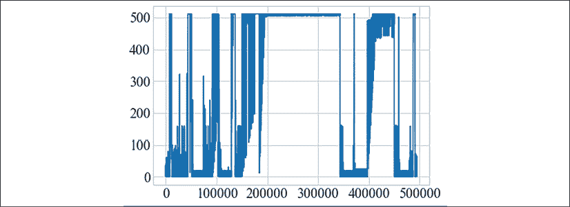

图 6.11：时间序列图

我们将加载并运行实现微软提出方法的 SpectralResidual 模型：

```py
from alibi_detect.od import SpectralResidual
od = SpectralResidual(
    threshold=1.,
    window_amp=20,
    window_local=20,
    n_est_points=10,
    n_grad_points=5
) 
```

然后，我们可以获取时间序列中每个点的异常得分：

```py
scores = od.score(intrusions['data'][:, 0]) 
```

让我们将得分绘制在时间序列之上！

```py
import matplotlib
ax = pd.Series(intrusions['data'][:, 0], name='data').plot(legend=False, figsize=(12, 6))
ax2 = ax.twinx()
ax = pd.Series(scores, name='scores').plot(ax=ax2, legend=False, color="r", marker=matplotlib.markers.CARETDOWNBASE)
ax.figure.legend(bbox_to_anchor=(1, 1), loc='upper left'); 
```

我们在同一个图表中使用双 y 轴来绘制得分和数据。如下所示：

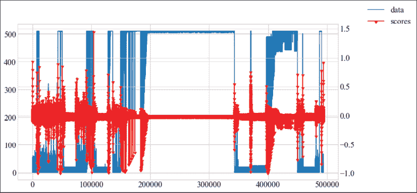

图 6.12：带有异常值的时间序列

由于傅里叶滤波器移除了信号的周期性，一些点未被识别为离群点。

## 变化点检测

我们将首先使用 ruptures 库创建一个合成的多元时间序列。我们将维度数设置为 3，时间序列的长度设置为 500，并且我们的时间序列将有 3 个变化点，标准差为 5.0 的高斯噪声将被叠加：

```py
import numpy as np
import matplotlib.pylab as plt
import ruptures as rpt
signal, bkps = rpt.pw_constant(
  n_samples=500, n_features=3, n_bkps=3,
  noise_std=5.0, delta=(1, 20)
) 
```

信号是一个 500x3 的 NumPy 数组。`bkps`是变化点的数组（123、251 和 378）。

我们可以使用一个实用函数绘制该时间序列，函数会突出显示由变化点分隔的子部分：

```py
 rpt.display(signal, bkps) 
```

这是我们带有三个变化点的时间序列图：

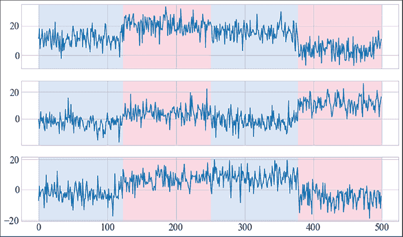

图 6.13：带有变化点的时间序列

我们可以将二分段方法应用于此时间序列。ruptures 遵循 scikit-learn 的约定，因此，如果你之前使用过 scikit-learn，使用起来应该非常直观：

```py
 algo = rpt.Binseg(model="l1").fit(signal)
my_bkps = algo.predict(n_bkps=3) 
```

我们有几个二分段约束选项——可以选择`l1`、`l2`、`rbf`、`linear`、`normal`和`ar`。

我们可以用另一个实用函数绘制二分段的预测结果：

```py
 rpt.show.display(signal, bkps, my_bkps, figsize=(10, 6)) 
```

这是我们从二分段模型中获得的变化点预测图：

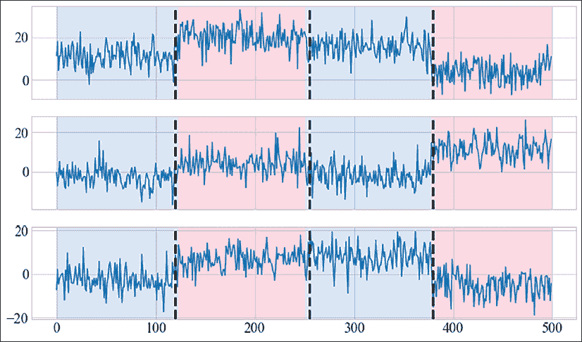

图 6.14：带有检测到的变化点的时间序列（Binary Segmentation）

让我们总结一下本章中的一些信息！

# 总结

在本章中，我们集中讨论了时间序列无监督方法的两个方面：

+   异常检测

+   变化点检测

异常检测（也叫：离群点检测）的本质是识别出明显与其他序列不同的部分。我们已经研究了不同的异常检测方法，以及一些大公司如何在大规模中处理它。

在处理时间序列时，重要的是要注意数据随时间变化，这可能导致模型失效（模型陈旧）。这就是所谓的变化点检测和漂移检测。

本章我们探讨了变化点检测。在*第八章*，*时间序列的在线学习*中，我们将更详细地探讨漂移检测。
