# 第七章：时间序列的机器学习模型

近年来，机器学习取得了长足的进展，这一点在时间序列预测方法中得到了体现。我们在*第四章*，*时间序列机器学习导论*中介绍了一些最先进的时间序列机器学习方法。在本章中，我们将介绍更多的机器学习方法。

我们将介绍一些常用的基准方法，或者在性能、易用性或适用性方面表现突出的算法。我将介绍基于动态时间规整和梯度提升的 k 近邻算法作为基准，我们还将讨论其他方法，如 Silverkite 和梯度提升。最后，我们将进行一个应用练习，使用这些方法中的一些。

我们将涵盖以下主题：

+   更多的时间序列机器学习方法

+   带有动态时间规整的 k 近邻算法

+   Silverkite

+   梯度提升

+   Python 练习

如果你想了解最先进的机器学习算法，请参阅*第四章*，*时间序列机器学习导论*。本章的算法讨论将假设你已经掌握了该章节的一些内容。我们将在接下来的部分中介绍的算法在预测和预报任务中都非常具有竞争力。

我们将在这里更详细地讨论这些算法。

# 更多的时间序列机器学习方法

我们将在本节中介绍的算法在预测和预报任务中都具有高度竞争性。如果你想了解最先进的机器学习算法，请参阅*第四章*，*时间序列机器学习导论*。

在上述章节中，我们简要讨论了其中的一些算法，但我们将在这里更详细地讲解它们，还会介绍一些我们之前未曾讨论过的算法，如 Silverkite、梯度提升和 k 近邻。

我们将专门设置一个实践部分，介绍一个 2021 年发布的库——Facebook 的 Kats。Kats 提供了许多高级功能，包括超参数调优和集成学习。在这些功能的基础上，它们实现了基于 TSFresh 库的特征提取，并包含多个模型，包括 Prophet、SARIMA 等。它们声称，与其他超参数调优算法相比，Kats 在时间序列上的超参数调优在基准测试中快了 6 到 20 倍。

该图展示了所选时间序列机器学习库的流行度概览：

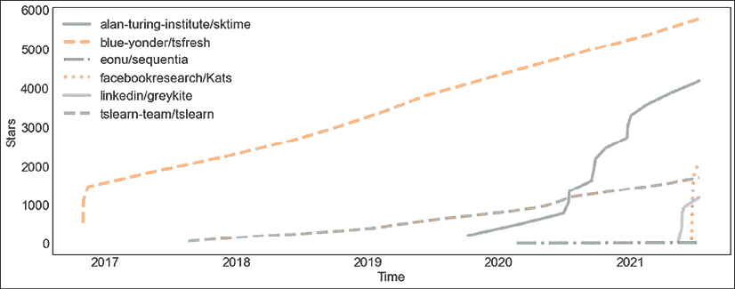

图 7.1：时间序列机器学习库的流行度

截至 2021 年中期，Kats 和 GreyKite 库最近才发布，尽管它们在 GitHub 上获得了越来越多的星标，但它们的受欢迎程度还未能与 TSFresh 相抗衡。我尽管 TSFresh 是一个特征生成库，而非预测库，但还是将其包含在内，因为我觉得它在本章所使用的其他库中非常重要。TSFresh 之后，SKTime 排名第二，并且在相对较短的时间内吸引了大量星标。

在本章的实际示例中，我们将使用一些这些库。

另一个重要的问题是验证，值得单独讨论这个问题。

## 验证

我们在*第四章*，*时间序列的机器学习入门*中已经讨论过验证。通常在机器学习任务中，我们使用 k 折交叉验证，其中数据的拆分是伪随机进行的，因此训练集和测试/验证集可以来自数据的任何部分，只要这些部分没有被用于训练（**样本外数据**）。

对于时间序列数据，这种验证方法可能会导致对模型性能的过度自信，因为现实中，时间序列往往随着趋势、季节性和时间序列特征的变化而变化。

因此，在时间序列中，验证通常采用所谓的**前向验证（walk-forward validation）**。这意味着我们在过去的数据上训练模型，然后在最新的数据片段上进行测试。这将消除过于乐观的偏差，并在模型部署后为我们提供更为现实的性能评估。

在训练、验证和测试数据集方面，这意味着我们将完全依赖训练和验证数据集来调整模型参数，并且我们将基于一个时间上更先进的数据集来评估测试，具体如下面的图示所示（来源：Greykite 库的 GitHub 仓库）：

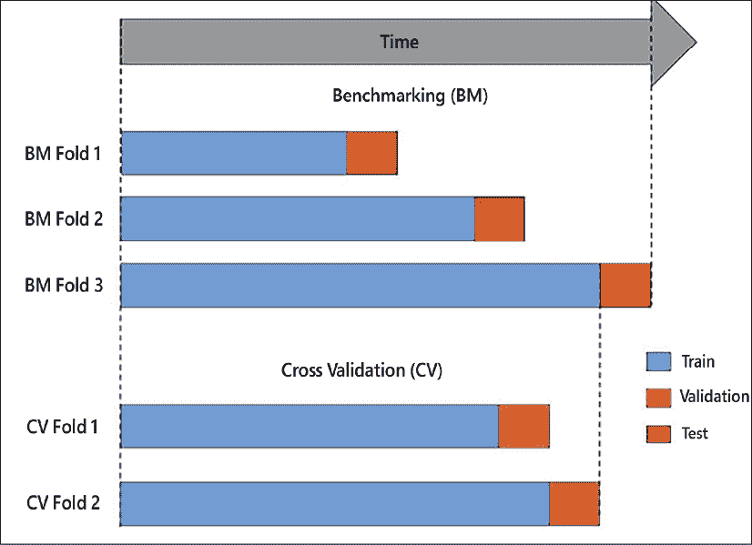

图 7.2：前向验证

在前向验证中，我们先在数据的初始片段上训练，然后在训练集之后的某个时间段进行测试。接着，我们向前推进并重复这一过程。这样，我们有多个样本外的时间段，可以将这些时间段的结果进行整合。通过前向验证，我们不太可能遭遇过拟合的问题。

# 动态时间规整的 K 近邻算法

K 近邻是一个著名的机器学习方法（有时也被称为基于案例的推理）。在 kNN 中，我们可以使用距离度量来找到相似的数据点。然后，我们可以将这些最近邻的已知标签作为输出，并通过某种函数将它们整合在一起。

*图 7.3* 展示了 kNN 分类的基本思路（来源 – WikiMedia Commons: [`commons.wikimedia.org/wiki/File:KnnClassification.svg`](https://commons.wikimedia.org/wiki/File:KnnClassification.svg)）：


图 7.3：用于分类的 K 最近邻

我们已经知道一些数据点。在前面的示意图中，这些数据点分别用方形和三角形表示，代表了两个不同类别的数据点。给定一个新的数据点，用圆圈表示，我们找到与之最接近的已知数据点。在这个例子中，我们发现新点与三角形相似，因此我们可以假设新点也属于三角形类。

尽管这种方法在概念上非常简单，但它通常作为一种强基线方法，或者有时甚至能与更复杂的机器学习算法竞争，即使我们只比较最接近的邻居（*（**𝑘**=1）*）。

该算法中的重要超参数有：

+   你希望根据其来生成输出的邻居数（k）

+   集成函数（例如，平均值或最常见值）

+   用于找到最近数据点的距离函数

我们在*第四章*《*时间序列机器学习导论*》中讨论过动态时间扭曲（Dynamic Time Warping），它是一种用于比较两条时间序列相似性（或等价地，距离）的方法。这些序列甚至可以有不同的长度。动态时间扭曲已经证明自己是一个异常强大的时间序列距离度量。

我们可以将 kNN 和动态时间扭曲结合起来，作为一种距离度量来寻找相似的时间序列，这种方法已经证明其在某些情况下很难被超越，尽管当前的技术已经超过了它。

# Silverkite

Silverkite 算法与 LinkedIn 发布的 Greykite 库一起发布。它的设计目标是快速、准确且直观。该算法在 2021 年的文章中有描述（《*生产系统的灵活预测模型*》，Reza Hosseini 等人）。

根据 LinkedIn，它能够处理各种趋势和季节性因素，例如每小时、每日、每周、重复事件、假期以及短期效应。在 LinkedIn 内部，它既用于短期预测，例如 1 天的预测，也用于长期预测，例如 1 年后的预测。

在 LinkedIn 中的应用场景包括优化预算决策、设定业务指标目标，以及提供足够的基础设施来应对峰值流量。此外，一个应用场景是建模 COVID-19 大流行后的恢复情况。

时间序列被建模为趋势、变化点和季节性的加性组合，其中季节性包括假期/事件效应。趋势随后被建模如下：

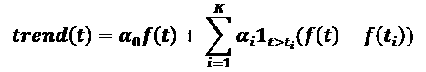

其中 K 是变化点的数量，*t*[i] 是第 i 个变化点的时间索引。因此，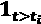 是第 i 个变化点的指示函数。函数 f(t) 可以是线性、平方根、二次、任意组合或完全自定义。

Silverkite 还构建了假期的指示变量。假期可以通过名称或国家指定，甚至可以完全自定义。

变化点可以手动指定，或者可以通过回归模型自动检测候选变化点，随后使用自适应 Lasso 算法（Hui Zhou，2006）进行选择。

除了趋势、季节性和假期，Silverkite 还包括一个自回归项，该项是基于窗口平均值计算的，而不是独立地取滞后项（《*为降水过程选择二元马尔科夫模型*》，Reza Hosseini 等，2011）。

该自回归项使用 Pasty 库指定，使用类似以下字符串的公式迷你语言形式：

```py
y ~ a + a:b + np.log(x) 
```

在这个公式中，左侧的 y 定义为三个项的总和，`a`、`a:b` 和 `np.log(x)`。项 `a:b` 是两个因子 a 和 b 之间的交互作用。Pasty 中的模型模板本身具有高度的可定制性，因此该接口提供了很高的灵活性。

最后，Silverkite 提供了几种模型类型，如岭回归、弹性网和提升树，并支持损失函数，如均方误差（MSE）和分位数损失，用于稳健回归。

根据 LinkedIn 对多个数据集的基准测试，Silverkite 在预测误差方面优于 auto-Arima（pmdarima 库）和 Prophet。然而，Silverkite 的速度约为 Prophet 的四倍，我们将在 *第九章*，*概率模型* 中介绍 Prophet。

# 梯度提升

**XGBoost**（即**极限梯度提升**的缩写）是梯度提升的高效实现（Jerome Friedman，《*贪婪函数逼近：一种梯度提升机器*》，2001），用于分类和回归问题。梯度提升也被称为**梯度提升机**（**GBM**）或**梯度提升回归树**（**GBRT**）。一个特例是用于排序应用的 LambdaMART。除了 XGBoost，其他实现包括微软的轻量级梯度提升机（LightGBM）和 Yandex 的 Catboost。

梯度提升树是树的集成。这与类似于随机森林的袋装算法类似；然而，由于这是一个提升算法，每棵树都会被计算出来，逐步减少误差。每次新的迭代都会贪心地选择一棵树，并将其预测值基于权重项加到先前的预测值中。还有一个正则化项，用于惩罚复杂性并减少过拟合，类似于正则化贪婪森林（RGF）。

**XGBoost**算法由陈天奇和卡洛斯·格斯特林于 2016 年发布（"*XGBoost：一种可扩展的树提升系统*"），并推动了许多分类和回归基准的突破。它被用于许多 Kaggle 问题的获胜解决方案。事实上，在 2015 年，29 个挑战获胜解决方案中，有 17 个解决方案使用了 XGBoost。

它的设计非常具有可扩展性，并且扩展了梯度提升算法，用于加权分位数，并通过更智能的缓存模式、分片以及对稀疏性处理的改进，提升了可扩展性和并行化性能。

作为回归的一个特例，XGBoost 可以用于预测。在这种情况下，模型基于过去的值进行训练，以预测未来的值，这可以应用于单变量和多变量时间序列。

# Python 练习

让我们将本章迄今为止学到的内容付诸实践。

至于依赖项，在本章中，我们将分别为每个部分安装依赖。可以通过终端、笔记本或 Anaconda Navigator 进行安装。

在接下来的几个部分中，我们将演示如何在预测中进行分类，因此这些方法中的一些可能无法进行比较。我们邀请读者使用每种方法进行预测和分类，并进行结果比较。

需要注意的是，Kats 和 Greykite（在写作时）都是非常新的库，因此它们的依赖项可能还会频繁变化。它们可能会锁定您的 NumPy 版本或其他常用库。因此，我建议您为每个部分分别在虚拟环境中安装这些库。

我们将在下一节中详细介绍这个设置过程。

## 虚拟环境

在 Python 虚拟环境中，安装到其中的所有库、二进制文件和脚本都是与其他虚拟环境中安装的内容以及系统中安装的内容隔离的。这意味着我们可以安装不同的库，如 Kats 和 Greykite，而无需担心它们之间的兼容性问题，或与我们计算机上安装的其他库之间的兼容性问题。

让我们通过一个简短的教程，介绍如何在使用 Anaconda 的 Jupyter 笔记本中使用虚拟环境（类似地，您也可以使用如 virtualenv 或 pipenv 等工具）。

在*第一章*，*使用 Python 进行时间序列分析简介*中，我们介绍了 Anaconda 的安装，因此我们会跳过这部分安装。请参考那一章，或者访问 conda.io 获取安装说明。

要创建一个虚拟环境，必须指定一个名称：

```py
conda create --name myenv 
```

这将创建一个同名的目录（`myenv`），其中所有库和脚本将被安装。

如果我们想使用这个环境，我们必须首先激活它，这意味着我们需要将`PATH`变量设置为包括我们新创建的目录：

```py
conda activate myenv 
```

现在我们可以使用像 pip 这样的工具，默认情况下它会使用与 conda 捆绑在一起的版本，或者直接使用 conda 命令来安装库。

我们可以在环境中安装 Jupyter 或 Jupyter Lab 然后启动它。这意味着我们的 Jupyter 环境将包含所有依赖项，因为我们已将它们单独安装。

让我们从一个带有动态时间规整（DTW）的 kNN 算法开始。正如我提到的，这个算法通常作为一个不错的基准进行比较。

## 使用动态时间规整（DTW）的 k-近邻算法（kNN）在 Python 中实现

在这一节中，我们将基于机器人在一段时间内的力和扭矩测量来分类故障。

我们将使用一个非常简单的分类器，kNN，并且或许我们应该提醒一下，这种方法涉及到逐点计算距离，这通常会成为计算瓶颈。

在这一节中，我们将把 TSFresh 的特征提取与 kNN 算法结合在一个管道中。时间序列管道确实能帮助我们简化过程，正如你在阅读代码片段时会发现的那样。

让我们安装 tsfresh 和 tslearn：

```py
pip install tsfresh tslearn 
```

我们将在 tslearn 中使用 kNN 分类器。我们甚至可以使用 scikit-learn 中的 kNN 分类器，它允许指定自定义的度量标准。

在这个示例中，我们将从 UCI 机器学习库下载一个机器人执行故障的数据集并将其存储到本地。该数据集包含故障检测后的机器人力和扭矩测量数据。对于每个样本，任务是分类机器人是否会报告故障：

```py
from tsfresh.examples import load_robot_execution_failures
from tsfresh.examples.robot_execution_failures import download_robot_execution_failures
download_robot_execution_failures()
df_ts, y = load_robot_execution_failures() 
```

列包括时间和六个来自传感器的时间序列信号，分别是 `F_x`、`F_y`、`F_z`、`T_x`、`T_y` 和 `T_z`。目标变量 `y`，其值可以是 True 或 False，表示是否发生了故障。

始终检查两个类别的频率非常重要：

```py
print(f"{y.mean():.2f}") 
```

y 的均值是 0.24。

然后，我们可以使用 TSFresh 提取时间序列特征，正如在*第三章，时间序列预处理*中讨论的那样。我们可以填补缺失值，并根据与目标变量的相关性选择特征。在 TSFresh 中，统计测试的 p 值被用来计算特征的重要性：

```py
from tsfresh import extract_features
from tsfresh import select_features
from tsfresh.utilities.dataframe_functions import impute
extracted_features = impute(extract_features(df_ts, column_id="id", column_sort="time"))
features_filtered = select_features(extracted_features, y) 
```

我们可以继续使用 `features_filtered` DataFrame，它包含我们的特征——来自传感器的信号和 TSFresh 特征。

让我们通过进行网格搜索来找到一个合适的邻居数值：

```py
from sklearn.model_selection import TimeSeriesSplit, GridSearchCV
from tslearn.neighbors import KNeighborsTimeSeriesClassifier
knn = KNeighborsTimeSeriesClassifier()
param_search = {
    'metric' : ['dtw'],
    'n_neighbors': [1, 2, 3]
}
tscv = TimeSeriesSplit(n_splits=2)
gsearch = GridSearchCV(
    estimator=knn,
    cv=tscv,
    param_grid=param_search
)
gsearch.fit(
    features_filtered,
    y
) 
```

我们正在使用 scikit-learn 的 `TimeSeriesSplit` 来划分时间序列。这是为了网格搜索（GridSearch）。

或者，我们也可以仅仅基于索引进行拆分。

我们可以尝试许多参数，特别是在 kNN 分类器中的距离度量。如果你想尝试一下，请参阅 `TSLEARN_VALID_METRICS` 获取 tslearn 支持的度量标准的完整列表。

让我们预测一些 COVID 案例。在下一节中，我们将从 Silverkite 算法开始。Silverkite 是 LinkedIn 在 2021 年发布的 Greykite 库的一部分。

## Silverkite

在写作时，Greykite 的版本为 0.1.1——它尚未完全稳定。它的依赖项可能与一些常用库的较新版本发生冲突，包括 Jupyter Notebooks。不过，如果你在虚拟环境或 Google Colab 中安装该库，不必担心。

只需安装该库及其所有依赖项：

```py
pip install greykite 
```

现在 Greykite 已经安装好了，我们可以使用它了。

我们将加载来自*Our World in Data*数据集的 COVID 病例数据，它可能是可用 COVID 数据中最好的来源之一：

```py
import pandas as pd
owid_covid = pd.read_csv("**https://covid.ourworldindata.org/data/owid-covid-data.csv**")
owid_covid["**date**"] = pd.to_datetime(owid_covid["**date**"])
df = owid_covid[owid_covid.location == "**France**"].set_index("**date**", drop=True).resample('**D**').interpolate(method='**linear**') 
```

我们专注于法国的病例。

我们首先设置 Greykite 的元数据参数。然后，我们将此对象传递给预测器配置：

```py
from greykite.framework.templates.autogen.forecast_config import (
    ForecastConfig, MetadataParam
)
metadata = MetadataParam(
    time_col="date",
    value_col="new_cases",
    freq="D"
) 
```

我们的时间列是`date`，值列是`new_cases`。

现在我们将创建`forecaster`对象，它用于生成预测并存储结果：

```py
import warnings
from greykite.framework.templates.forecaster import Forecaster
from greykite.framework.templates.model_templates import ModelTemplateEnum
forecaster = Forecaster()
    warnings.filterwarnings("ignore", category=UserWarning)
    result = forecaster.run_forecast_config(
        df=yahoo_df,
        config=ForecastConfig(
            model_template=ModelTemplateEnum.SILVERKITE_DAILY_90.name,
            forecast_horizon=90,
            coverage=0.95,
            metadata_param=metadata
        )
    ) 
```

预测的时间跨度为 90 天；我们将预测未来 90 天。我们的预测区间为 95%。Silverkite 和 Prophet 都支持通过预测区间来量化不确定性。95%的覆盖率意味着 95%的实际值应该落在预测区间内。在 Greykite 中，_`components.uncertainty`模型提供了关于不确定性的额外配置选项。

我已经添加了一行代码，在训练过程中忽略`UserWarning`类型的警告，否则会有大约 500 行关于目标列中 0 值的警告。

让我们从结果对象中绘制原始时间序列图，我们可以将预测结果叠加在其上：

```py
forecast = result.forecast
forecast.plot().show(renderer="**colab**") 
```

如果你不是在 Google Colab 中，请不要使用`renderer`参数！

我们得到了以下图表：

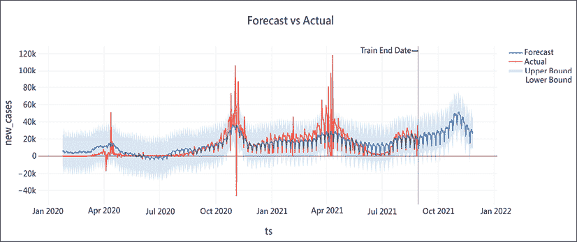

图 7.4：预测与实际时间序列（Silverkite）

预测结果存储在`forecast`对象的`df`属性中：

```py
forecast.df.head().round(2) 
```

这些是预测结果的上限和下限置信区间：

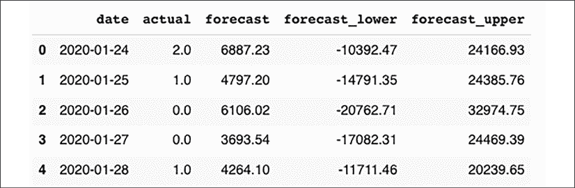

图 7.5：预测与实际时间序列的表格（Silverkite）

我们可能需要获取一些关于模型的性能指标。我们可以像这样获取历史预测在保留测试集上的性能：

```py
from collections import defaultdict
backtest = result.backtest
backtest_eval = defaultdict(list)
for metric, value in backtest.train_evaluation.items():
    backtest_eval[metric].append(value)
    backtest_eval[metric].append(backtest.test_evaluation[metric])
metrics = pd.DataFrame(backtest_eval, index=["train", "test"]).T
metrics.head() 
```

我们的性能指标如下所示：

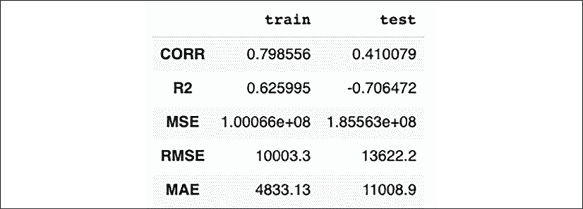

图 7.6：在保留数据上的性能指标（Silverkite）

我已将指标缩减为前五个。

我们可以方便地将模型应用到新的数据上，方法如下：

```py
model = result.model
future_df = result.timeseries.make_future_dataframe(
    periods=4,
    include_history=False
)
model.predict(future_df) 
```

预测结果如下所示：

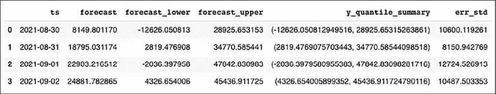

图 7.7：预测数据框（Silverkite）

请注意，您的结果可能会有所不同。

通过更改预测器运行配置中的`model_template`参数，我们可以使用其他预测模型。例如，我们可以将其设置为`ModelTemplateEnum.PROPHET.name`，以使用 Facebook 的 Prophet 模型。

这就结束了我们对 Silverkite 的介绍。接下来，我们将通过应用 XGBoost 的监督回归方法进行预测。让我们进行一些梯度提升吧！

## 梯度提升

我们也可以使用监督式机器学习进行时间序列预测。为此，我们可以使用日期和前期值来预测未来。

首先，我们需要安装 XGBoost：

```py
pip install xgboost 
```

在这个示例中，我们将使用 Yahoo 的每日收盘数据，和本章其他实践部分一样。

让我们一步一步地通过准备和建模过程。

我们首先需要对数据进行特征化。这里，我们通过提取日期特征来做到这一点，但请参见 kNN 部分，在那里我们使用了 TSFresh 的特征提取。你也许想通过结合这两种特征提取策略，或完全依赖 TSFresh，来改变这个示例。

我们将像之前一样重新加载来自*Our World in Data*数据集的 COVID 新病例数据：

```py
import pandas as pd
owid_covid = pd.read_csv("**https://covid.ourworldindata.org/data/owid-covid-data.csv**")
owid_covid["**date**"] = pd.to_datetime(owid_covid["**date**"])
df = owid_covid[owid_covid.location == "**France**"].set_index("**date**", drop=True).resample('**D**').interpolate(method='**linear**').reset_index() 
```

对于特征提取，转换器非常方便。转换器基本上是一个类，包含`fit()`和`transform()`方法，可以使转换器适应数据集并相应地转换数据。以下是用于根据日期注释数据集的`DateFeatures`转换器的代码：

```py
from sklearn.base import TransformerMixin, BaseEstimator
class DateFeatures(TransformerMixin, BaseEstimator):
    features = [
        "hour",
        "year",
        "day",
        "weekday",
        "month",
        "quarter",
    ]

    def __init__(self):
        super().__init__()
    def transform(self, df: pd.DataFrame):
        Xt = []
        for col in df.columns:
            for feature in self.features:
                date_feature = getattr(
                    getattr(
                        df[col], "dt"
                    ), feature
                )
                date_feature.name = f"{col}_{feature}"
                Xt.append(date_feature)

        df2 = pd.concat(Xt, axis=1)
        return df2
    def fit(self, df: pd.DataFrame, y=None, **fit_params):
        return self 
```

这个转换器相对简单，它为日期列提取一系列特征，例如小时、年份、日期、星期几、月份、年度周数和季度。这些特征在机器学习上下文中，可能对描述或注释时间序列数据非常有用。

你可以在 GitHub 上找到这个示例的完整代码。我提供了一个额外的转换器，用于处理章节中未涉及的周期性特征。

我们按如下方式应用转换器到 DataFrame 的`date`列：

```py
from sklearn.compose import ColumnTransformer
from sklearn.pipeline import Pipeline, make_pipeline
preprocessor = ColumnTransformer(
    transformers=[(
        "**date**",
        make_pipeline(
            DateFeatures(),
            ColumnTransformer(transformers=[
                ("**cyclical**", CyclicalFeatures(),
                  ["**date_day**", "**date_weekday**", "**date_month**"]
                )
            ], remainder="passthrough")
        ), ["**date**"],
  ),], remainder="passthrough"
) 
```

如果我们希望为预测提供额外的外生特征，可以设置`remainder="passthrough"`参数。

我们可以定义一个包含这些预处理步骤和模型的管道，这样就可以进行拟合并应用于预测：

```py
from xgboost import XGBRegressor
pipeline = Pipeline(
    [
        ("**preprocessing**", preprocessor),
         ("xgb", XGBRegressor(objective="**reg:squarederror**", n_estimators=**1000**))
    ]
) 
```

预测器是一个 XGBoost 回归器。我在调整方面并没有做太多工作。唯一会改变的参数是估计器的数量。我们将使用 1,000 个树的集成大小（即树的数量）。

现在是时候将数据集拆分为训练集和测试集了。这包括两个问题：

+   我们需要提前对特征和数值进行对齐

+   我们需要根据截止时间将数据集拆分为两部分

首先设定基本参数。首先，我们希望基于时间范围预测未来。其次，我们需要决定用于训练和测试的数据点数量：

```py
TRAIN_SIZE = int(len(df) * **0.9**)
HORIZON = **1**
TARGET_COL = "**new_cases**" 
```

我们使用 90%的数据进行训练，并预测未来 90 天的情况：

```py
X_train, X_test = df.iloc[HORIZON:TRAIN_SIZE], df.iloc[TRAIN_SIZE+HORIZON:]
y_train = df.shift(periods=HORIZON).iloc[HORIZON:TRAIN_SIZE][TARGET_COL]
y_test = df.shift(periods=HORIZON).iloc[TRAIN_SIZE+HORIZON:][TARGET_COL] 
```

这既进行了对齐，也设定了预测范围。因此，我们有了用于测试和训练的数据集，两个数据集都包含了我们希望用 XGBoost 预测的特征和标签。

现在我们可以训练我们的 XGBoost 回归模型，根据我们通过转换器生成的特征和当前值，预测未来 HORIZON 内的值。

我们可以按如下方式拟合我们的管道：

```py
FEATURE_COLS = ["date"]
pipeline.fit(X_train[FEATURE_COLS], y_train) 
```

我们可以看到以下管道参数：

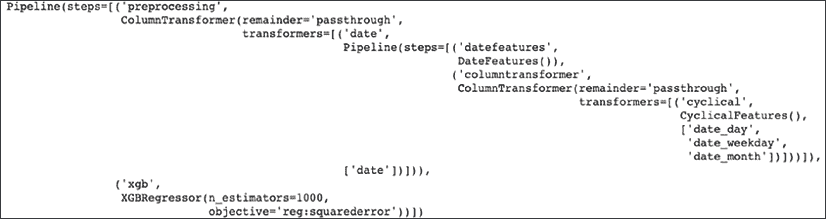

图 7.8：管道参数

如果我们从开始到结束创建一个日期系列，我们可以获得整个时间段内模型的预测：

```py
MAX_HORIZON = **90**
X_test_horizon = pd.Series(pd.date_range(
    start=df.date.**min()**, 
    periods=**len**(df) + MAX_HORIZON,
    name="**date**"
)).reset_index() 
```

应用于`X_test`的管道的`predict()`方法为我们提供了预测结果：

```py
forecasted = pd.concat(
    [pd.Series(pipeline.predict(X_test_horizon[FEATURE_COLS])), pd.Series(X_test_horizon.date)],
    axis=1
)
forecasted.columns = [TARGET_COL, "**date**"] 
```

我们也可以对实际病例做同样的操作：

```py
actual = pd.concat(
    [pd.Series(df[TARGET_COL]), pd.Series(df.date)],
    axis=1
)
actual.columns = [TARGET_COL, "**date**"] 
```

现在，我们可以通过图表将预测结果与实际值`y_test`进行对比：

```py
fig, ax = plt.subplots(figsize=(12, 6))
forecasted.set_index("date").plot(linestyle='--', ax=ax)
actual.set_index("date").plot(linestyle='-.', ax=ax)
plt.legend(["forecast", "actual"]) 
```

这是我们得到的图表：

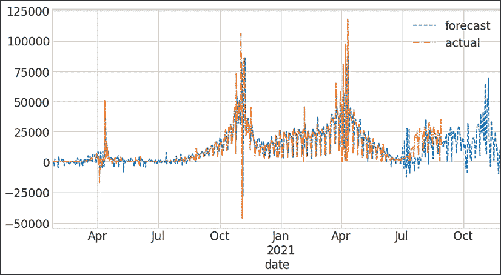

图 7.9：预测与实际值对比（XGBoost）

我们可以通过以下方式提取测试期间的性能指标：

```py
from sklearn.metrics import mean_squared_error
test_data = actual.merge(forecasted, on="**date**", suffixes=("**_actual**", "**_predicted**"))
mse = mean_squared_error(test_data.new_cases_actual, test_data.new_cases_predicted, squared=False)  # RMSE
**print("The root mean squared error (RMSE) on test set: {:.2f}".format(mse))** 
```

我们应该看到类似这样的结果：

```py
The root mean squared error (RMSE) on test set: 12753.41 
```

接下来，我们将在 Kats 中创建一个用于时间序列预测的集成模型。

## Kats 的集成方法

Kats 的安装应该很简单，只需两个步骤。首先，我们安装 Facebook 的 Prophet 库的旧版本 fbprophet：

```py
conda install -c conda-forge fbprophet 
```

现在我们使用 pip 安装 Kats：

```py
pip install kats 
```

或者，在 Colab 上，我们可以这样安装 Kats：

```py
!MINIMAL=1 pip install kats
!pip install "numpy==1.20" 
```

我们将像之前一样加载 COVID 病例数据集。这里只展示最后一行：

```py
df = owid_covid[owid_covid.location == "**France**"].set_index("**date**", drop=True).resample('**D**').interpolate(method='**linear**').reset_index() 
```

我们将配置集成模型，拟合它，然后进行预测。

首先是我们的集成模型的配置：

```py
from kats.models.ensemble.ensemble import EnsembleParams, BaseModelParams
from kats.models.ensemble.kats_ensemble import KatsEnsemble
from kats.models import linear_model, quadratic_model
model_params = EnsembleParams(
            [
                BaseModelParams("linear", linear_model.LinearModelParams()),
                BaseModelParams("quadratic", quadratic_model.QuadraticModelParams()),
            ]
        ) 
```

这里，我们只包括了两种不同的模型，但我们本可以加入更多模型，也可以定义更好的参数。这只是一个示例；对于更现实的练习（我留给读者自己做），我建议加入 ARIMA 和 Theta 模型。我们需要为每个预测模型定义超参数。

我们还需要创建集成参数，定义如何计算集成聚合以及如何进行分解：

```py
KatsEnsembleParam = {
    "**models**": model_params,
    "**aggregation**": "**weightedavg**",
    "**seasonality_length**": 30,
    "**decomposition_method**": "**additive**",
} 
```

要在 Kats 中使用时间序列，我们必须将数据从 DataFrame 或系列转换为 Kats 时间序列对象。我们可以如下转换我们的 COVID 病例数据：

```py
from kats.consts import TimeSeriesData
TARGET_COL = "new_cases"
df_ts = TimeSeriesData(
    value=df[TARGET_COL], time=df["date"]
) 
```

转换的关键是 Kats 能够推断索引的频率。这可以通过`pd.infer_freq()`进行测试。在我们的案例中，`pd.infer_freq(df["date"])`应返回`D`，表示日频率。

现在我们可以创建我们的`KatsEnsemble`并进行拟合：

```py
m = KatsEnsemble(
    data=df_ts, 
    params=KatsEnsembleParam
).fit() 
```

我们可以使用`predict()`方法为每个模型获取单独的预测。如果我们想要获取集成输出，必须在`predict()`之后调用`aggregate()`：

```py
m.predict(steps=90)
m.aggregate()
m.plot()
plt.ylabel(TARGET_COL) 
```

我们预测了 90 天的未来。这些预测结果作为模型的一部分被存储，因此我们不需要捕捉返回的预测结果。然后，我们可以将每个模型的预测结果进行聚合。再次说明，我们不需要获取返回的 DataFrame，因为它已经存储在模型对象内部（`m.fcst_df`）。

最终，我们使用 Kats 的便捷函数绘制了聚合后的 DataFrame：

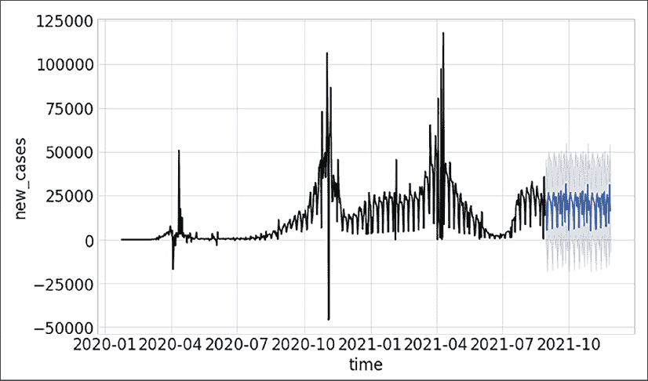

图 7.10：Kats 集成模型预测

由于我们可以通过更改基础模型参数和添加新模型来调整这个集成模型，因此它为我们提供了大量的改进空间。

是时候总结一下本章我们所学到的内容了。

# 总结

本章我们讨论了 Python 中流行的时间序列机器学习库。接着，我们讨论并尝试了带有动态时间规整的 k 最近邻算法，用于机器故障分类。我们还谈到了时间序列预测中的验证，并尝试了三种不同的方法来预测 COVID-19 疫情：Silverkite、XGBoost 梯度提升以及 Kats 中的集成模型。
