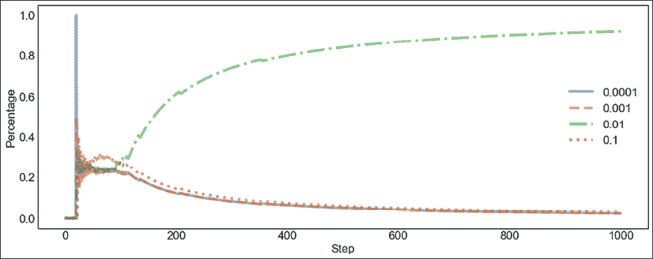

# 第八章：时间序列的在线学习

在本章中，我们将深入探讨时间序列的在线学习和流数据。在线学习意味着随着新数据的到来，我们不断更新模型。在线学习算法的优势在于，它们能够处理高速度和可能的大规模流数据，并能够适应数据的新分布。

我们将讨论漂移，漂移非常重要，因为机器学习模型的性能可能会因为数据集的变化而受到强烈影响，直到模型变得过时（陈旧）。

我们将讨论什么是在线学习，数据如何变化（漂移），以及自适应学习算法如何结合漂移检测方法来适应这种变化，从而避免性能下降或代价高昂的再训练。

我们将涵盖以下主题：

+   时间序列的在线学习

    +   在线算法

+   漂移

    +   漂移检测方法

+   自适应学习方法

+   Python 实践

我们将从在线学习的讨论开始。

# 时间序列的在线学习

学习有两种主要场景——在线学习和离线学习。**在线学习**意味着您在数据流入时逐步拟合模型（流数据）。另一方面，**离线学习**，即更常见的方式，意味着您有一个从一开始就已知的静态数据集，机器学习算法的参数一次性调整整个数据集（通常将整个数据集加载到内存中或分批处理）。

在线学习有三种主要的应用场景：

+   大数据

+   时间限制（例如，实时）

+   动态环境

通常，在在线学习环境中，您有更多的数据，且非常适合大数据。在线学习可以应用于大数据集，因为在这些数据集上训练整个数据集在计算上不可行。

在线学习的另一个应用场景是在时间限制下进行推断和拟合（例如，实时应用），与离线算法相比，许多在线算法在资源消耗上非常高效。

在线学习的一个常见应用是在时间序列数据上，特别的挑战是时间序列观察的基础生成过程可能随时间变化。这被称为概念漂移。在离线设置中，参数是固定的，而在在线学习中，参数会根据新数据持续调整。因此，在线学习算法可以处理数据的变化，其中一些算法能够处理概念漂移。

下表总结了在线学习和离线学习的一些区别：

|  | 离线 | 在线 |
| --- | --- | --- |
| 需要监控 | 是的，模型可能变得陈旧（模型将失去性能） | 适应变化的数据 |
| 再训练成本 | 昂贵（从头开始） | 便宜（增量式） |
| 内存需求 | 可能需要较高的内存 | 低 |
| 应用领域 | 图像分类、语音识别等，假设数据是静态的 | 金融、电商、经济学和医疗保健等，数据是动态变化的 |
| 工具 | tslearn, sktime, prophet | Scikit-Multiflow, River |

图 8.1：在线学习与离线学习方法的对比（时间序列）

还有许多不专门针对在线学习的工具，但支持在线学习，例如最受欢迎的深度学习库——PyTorch 和 TensorFlow，这些库的模型本身支持在线学习，数据加载器支持流式场景——通过迭代器，可以按需加载数据。

监督式机器学习问题的流式处理公式可以如下表示：

1.  数据点  在时间*t*到达

1.  在线算法预测标签

1.  在下一个数据点到达之前，真实标签会被揭示

在批处理设置中，一组*n*个数据点  会在时间*t*同时到达，所有*n*个数据点将在真实标签被揭示之前，由在线模型进行预测，然后才会到达下一批数据点。

我们可以通过 Python 代码片段演示差异，展示在线与离线设置下机器学习的典型模式。你应该对离线学习熟悉，它的表现形式如下：特征`X`，目标向量`y`，和模型参数`params`：

```py
from sklearn import linear_model
offline_model = linear_model.LogisticRegression(params)
offline_model.fit(X, Y) 
```

这应该是从之前的章节中熟悉的内容，比如*第七章*，*时间序列的机器学习模型*。为了简化，我们省略了数据加载、预处理、交叉验证和参数调优等问题。

在线学习遵循以下模式：

```py
from river import linear_model
online_model = linear_model.LogisticRegression(params)
for xi, yi in zip(X, y):
    online_model.learn_one(xi, yi) 
```

这里，我们是逐个数据点喂给模型。再次强调，这只是简化版——我省略了设置参数、加载数据集等内容。

这些代码片段应该清楚地说明主要的区别：一次性在整个数据集上学习（离线）与逐个数据点学习（在线）。

我应该提到在线方法的评估方法：

+   保留集

+   预先评估

在**保留集**方法中，我们可以将当前模型应用于独立的测试集。这种方法在批处理和在线（流式）学习中都很流行，并能提供无偏的性能估计。

在**预先评估**中，我们在通过数据序列的过程中进行测试。每个新的数据点会先进行测试，然后再进行训练。

在线学习的一个有趣方面是模型选择，也就是如何在一组候选模型中选择最佳模型。我们在*第四章*，*时间序列的机器学习模型*中讨论了时间序列模型的模型选择。在在线环境中，模型选择有不同的选项。

在**多臂强盗**（也称为**K 臂强盗**）问题中，有限的资源必须在多个竞争选项之间分配，以最大化预期收益。每个选择（“臂”）都有其回报，可以随着时间的推移进行学习。随着时间的推移，我们可以调整对这些臂的偏好，并根据预期回报进行最优选择。同样，通过学习不同分类或回归模型的预期回报，基于多臂强盗的方法可以应用于模型选择。在实践部分，我们将讨论用于模型选择的多臂强盗算法。

在接下来的章节中，我们将更详细地探讨增量方法和漂移。

## 在线算法

当数据逐渐变得可用，或其大小超出系统内存限制时，增量式机器学习算法（无论是监督学习还是无监督学习）可以在数据的部分上更新参数，而不是从头开始学习。**增量学习**是指通过不断调整模型来适应新的输入数据。

一些机器学习方法天生支持增量学习。神经网络（如深度学习）、最近邻算法和进化方法（例如遗传算法）都是增量式的，因此可以应用于在线学习环境，其中它们会不断更新。

增量算法可能会随机访问以前的样本或原型（选定的样本）。这些算法，如基于最近邻算法的增量算法，称为具有部分记忆的增量算法。它们的变体适用于周期性漂移场景。

许多著名的机器学习算法都有增量式的变体，如自适应随机森林、自适应 XGBoost 分类器或增量支持向量机。

强化学习和主动学习可以看作是在线学习的类型，因为它们以在线或主动的方式进行工作。我们将在*第十一章*中讨论强化学习，*时间序列的强化学习*。

在在线学习中，更新是持续进行的。其核心是运行统计，因此展示如何在在线环境中增量计算均值和方差会很有帮助。

让我们来看一下在线算术平均值和在线方差的公式。至于**在线均值**，在时间点*t*更新均值  可以按以下方式进行：


其中  是之前更新的次数——有时也写作 。

**在线方差**  可以基于在线均值和运行中的平方和  进行计算：


离线算法的一个缺点是，它们有时更难实现，并且在掌握库、算法和方法时会有一定的学习曲线。

scikit-learn 是 Python 中机器学习的标准库，但它只有有限的增量算法，主要集中在批量学习模型上。相比之下，有许多专门用于在线学习的库，这些库具有自适应和增量算法，能够覆盖许多使用场景，如不平衡数据集。

来自新西兰怀卡托大学、巴黎电信学院（Télécom ParisTech）和巴黎综合理工学院（École Polytechnique）的研究工程师、学生和机器学习研究者们一直在开发**River 库**。River 是由两个库合并而成：Creme（作为增量的双关语）和 Scikit-Multiflow。River 包含了许多元方法和集成方法。作为点睛之笔，这些元方法或集成方法中的许多可以使用 scikit-learn 模型作为基础模型。

截至目前，River 库拥有 1700 个星标，并实现了许多无监督和有监督算法。虽然截至目前，River 的文档仍在完善中，但许多功能已经可用，我们将在本章结尾的实践部分中看到。

该图展示了 River 和 Scikit-Multiflow 随着时间的推移的受欢迎程度（以 GitHub 上的星标数为依据）：


图 8.2：River 和 Scikit-Multiflow 库的星标历史

我们可以看到，尽管 Scikit-Multiflow 稳步上升，但这一增长大多保持平稳。River 在 2019 年超过了 Scikit-Multiflow，并继续获得 GitHub 用户的大量星标。这些星标类似于社交媒体平台上的“点赞”。

本表展示了一些在线算法，其中部分适用于漂移场景：

| 算法 | 描述 |
| --- | --- |
| **非常快速决策树**（**VFDT**） | 基于少量示例进行分裂的决策树，也叫做 Hoeffding 树。对漂移较为敏感。 |
| **极快速决策树**（**EFDT**） | 当有足够信心时增量构建树，并在有更好分裂时替换当前分裂。假设数据分布是平稳的。 |
| Learn++.NSE | 用于非平稳环境的增量学习分类器集成。 |

图 8.3：在线机器学习算法——其中一些适用于漂移场景

最具代表性的在线算法是**Hoeffding 树**（Geoff Hulten、Laurie Spencer 和 Pedro Domingos，2001），也叫做**非常快速决策树**（**VFDT**）。它是最广泛使用的在线决策树归纳算法之一。

尽管一些在线学习算法相对高效，但其性能可能对数据点的顺序极为敏感，且它们可能永远无法摆脱由早期样本驱动的局部最小值。令人吸引的是，VFDT（非常快的决策树）提供了高分类精度，并且具有理论保证，随着时间的推移，它们将趋向于决策树的表现。事实上，VFDT 和传统训练树在树分裂上的差异的概率会随着样本数量的增加而指数下降。

**Hoeffding 界限**，由 Wassily Hoeffding 于 1963 年提出，表示以概率，随机变量*Z*的计算均值在*n*个样本中计算后，与真实均值的偏差小于：


在这个方程中，*R*是随机变量*Z*的范围。这个界限与生成观测值的概率分布无关。

随着数据的输入，Hoeffding 树会不断添加新的分支，并且淘汰过时的分支。然而，问题在于，在概念漂移的情况下，某些节点可能不再满足 Hoeffding 边界。

在接下来的章节中，我们将讨论漂移，为什么你需要关注它，以及如何处理漂移。

# 漂移

数据质量的一个主要决定因素是漂移。**漂移**（也称为：**数据集漂移**）意味着数据中的模式随着时间的推移发生变化。漂移很重要，因为机器学习模型的表现可能会因为数据集的变化而受到不利影响。

漂移过渡可以突如其来，也可以逐渐发生、增量式发生，或者是周期性发生。下面是一个示例：


图 8.4：四种类型的概念漂移过渡

当过渡突然而至时，它会从一个时间步骤跳跃到另一个时间步骤，没有明显的准备或警告。与此相对，它也可能是逐步的，首先是小幅变化，然后是更大的变化，再然后是更大的变化。

当过渡逐渐发生时，它可能表现为不同力量之间的来回波动，直到建立一个新的基线。另一种过渡类型是周期性的，当存在不同基线之间的规律性或重复性的变化时。

漂移有不同种类：

+   协变量漂移

+   先验概率漂移

+   概念漂移

**协变量漂移**描述了自变量（特征）的变化。一个例子可能是法规干预，其中新的法律会震动市场格局，消费者行为也会与之前不同。例如，如果我们想预测吸烟行为下的慢性疾病风险，并且吸烟变得不再普遍，因为有了新的法律，这意味着我们的预测可能会变得不那么可靠。

**概率漂移**是目标变量的变化。例如，在欺诈检测中，欺诈发生的比例发生变化；在零售中，商品的平均价值增加。漂移的一个原因可能是季节性因素——例如，在冬季卖出更多的外套。

在**概念漂移**中，自变量与目标变量之间的关系发生了变化。这个术语所指的概念是自变量与因变量之间的关系。例如，如果我们想预测吸烟的数量，我们可以假设，在新法律出台后，我们的模型将变得无效。请注意，通常“概念漂移”一词在更广泛的意义上应用，指的是任何非平稳的变化。

**协变量漂移**：特征*P(x)*的变化。

**标签漂移（**或**先验概率漂移）**：目标变量*P(y)*的变化。

**概念漂移**：（在有监督的机器学习中）目标条件分布的变化——换句话说，自变量与因变量之间的关系发生了变化*P(y|X)*。

通常，在构建机器学习模型时，我们假设数据集不同部分中的数据点属于相同的分布。

尽管偶尔出现的异常现象，如异常事件，通常会被视为噪声并被忽略，但当分布发生变化时，模型通常需要基于新的样本从头开始重建，以捕捉最新的特征。这就是我们在*第七章*《*时间序列的机器学习模型*》中讨论的使用前向验证测试时间序列模型的原因。然而，从头开始训练可能非常耗时并且需要大量的计算资源。

漂移给机器学习模型带来了问题，因为模型可能会变得陈旧——它们随着时间推移变得不可靠，因为它们捕捉到的关系不再有效。这导致了这些模型的性能下降。因此，预测、分类、回归或异常检测的方法应能够及时检测并应对概念漂移，以便尽快更新模型。机器学习模型通常会定期重新训练，以避免性能下降。或者，也可以根据模型的性能监控或基于变化检测方法在需要时触发重新训练。

对于时间序列的应用，在许多领域，如金融、电商、经济学和医疗健康，时间序列的统计特性可能会发生变化，从而使得预测模型变得无用。令人困惑的是，尽管漂移问题的概念在文献中已有充分研究，但在使用时间序列方法应对这一问题方面，投入的努力却很少。

Gustavo Oliveira 等人于 2017 年提出（"《在概念漂移下的时间序列预测：一种基于 PSO 的方法》"）训练多个时间序列预测模型。在每个时间点，这些模型的参数会根据最新的性能加权变化（粒子群优化）。当最佳模型（最佳粒子）超出某个置信区间时，便触发了模型的重新训练。

下图展示了错误触发的重新训练和在线学习相结合的一种时间序列预测方法：


图 8.5：时间序列预测的在线学习与重新训练（IDPSO-ELM-S）

你可以看到随着概念漂移的发生，误差率周期性地增加，并且根据漂移检测的概念，触发了重新训练。

许多在线模型已经专门适应了对概念漂移的鲁棒性或处理能力。在本节中，我们将讨论一些最流行或表现最佳的模型。我们还将讨论漂移检测方法。

## 漂移检测方法

有许多不同的方法可以显式地检测数据流中的漂移和分布变化。Page-Hinkley（Page，1954）和几何移动平均（Roberts，2000）是其中的先驱者。

漂移检测器通常通过性能指标来监控模型性能，但它们也可以基于输入特征，尽管这更多的是一种例外。基本思想是，当样本的类别分布发生变化时，模型不再与当前分布相对应，性能下降（误差率增加）。因此，模型性能的质量控制可以作为漂移检测的依据。

漂移检测方法可以至少分为三类（根据 João Gama 等人，2014 年）：

+   统计过程控制

+   顺序分析

+   基于窗口的比较

统计过程控制方法考虑了模型预测的汇总统计量，如均值和标准差。例如，**漂移检测方法**（**DDM**；João Gama 等人，2004）会在误差率超过之前记录的最小误差率三倍标准差时发出警报。根据统计学习理论，在持续训练的模型中，随着样本数量的增加，错误应该减少，因此只有在发生漂移的情况下，这个阈值才会被超过。

顺序方法基于模型预测的阈值。例如，在**线性四率**（Wang，2015）方法中，列联表中的比率会递增更新。显著性是根据一个在开始时通过蒙特卡洛抽样估算的阈值来计算的。该方法比 DDM 更能处理类别不平衡。

**列联表**：比较变量频率分布的表格。具体来说，在机器学习分类中，表格显示了预测标签在测试集上的数量与实际标签的对比。在二分类的情况下，单元格显示真正例、假正例、假反例和真反例。

基于窗口的方法监控错误的分布。例如，**ADWIN** (**自适应滑动窗口**) 是由 Albert Bifet 和 Ricard Gavaldà于 2007 年提出的。时间窗口*W*内的预测错误被划分成更小的窗口，并将这些窗口内的平均误差率差异与 Hoeffding 界限进行比较。原始版本提出了一种变体，其时间复杂度为*O(log W)*，其中*W*是窗口的长度。

这里列出了一些漂移检测方法：

| 算法 | 描述 | 类型 |
| --- | --- | --- |
| **自适应窗口法** (**ADWIN**) | 基于阈值的自适应滑动窗口算法。 | 基于窗口 |
| **漂移检测方法** (**DDM**) | 基于模型错误率应随时间减少的前提。 | 统计方法 |
| **早期漂移检测法** (**EDDM**) | 基于两个错误之间的平均距离统计。与 DDM 类似，但更适用于渐进式漂移。 | 统计方法 |
| **霍夫丁漂移检测** (**HDDM**) | 基于 Hoeffding 界限的非参数方法——移动平均检验或加权移动平均检验。 | 基于窗口 |
| **Kolmogorov-Smirnov 窗口法** (**KSWIN**) | 在时间序列的窗口中进行 Kolmogorov-Smirnov 检验。 | 基于窗口 |
| Page-Hinkley | 用于高斯信号均值变化的统计检验。 | 序列化方法 |

图 8.6：漂移检测算法

Kolmogorov-Smirnov 是一个非参数检验，用于检验连续一维概率分布的相等性。

这些方法可以用于回归和分类（以及预测）场景中。它们可以用来触发模型的重新训练。例如，Hassan Mehmood 等人（2021）在检测到漂移时，会重新训练时间序列预测模型（其中包括 Facebook 的 Prophet 模型）。

漂移检测器都有其关于输入数据的假设。了解这些假设非常重要，我尝试在表格中概述了这些假设，以便你能选择适合你的数据集的检测器。

上述列出的漂移检测方法都有标签成本。由于它们都监控基本分类器或集成分类器的预测结果，因此要求在预测后立即获得类标签。在某些实际问题中，这一限制是不切实际的。这里没有列出其他一些方法，这些方法可以基于异常检测（或新颖性检测）、特征分布监控或模型依赖监控。我们在*第六章*，*时间序列的无监督方法*中看到了一些这些方法。

在下一节中，我们将介绍一些旨在抵抗漂移的方法。

# 自适应学习方法

**自适应学习**是指具有漂移调整的增量方法。这个概念指的是通过在线更新预测模型，以应对概念漂移。目标是通过考虑漂移，使得模型能够确保与当前数据分布的一致性。

集成方法可以与漂移检测器结合使用，以触发基础模型的重新训练。它们可以监控基础模型的表现（通常使用 ADWIN）——表现不佳的模型会被重新训练过的更精确模型替换。

作为一个例子，**自适应 XGBoost** 算法 (**AXGB**；Jacob Montiel 等人，2020 年) 是 XGBoost 在处理不断变化的数据流时的适应性改编，其中新的子树是从数据的小批量中创建的，随着新数据的到来。这种算法的最大集成大小是固定的，一旦达到该大小，集成就会在新数据上进行更新。

在 Scikit-Multiflow 和 River 库中，有几种方法将机器学习方法与漂移检测方法结合，这些方法调节适应性。这些方法中的许多都是由这两个库的维护者发布的。以下是其中一些方法的列表：

| 算法 | 描述 |
| --- | --- |
| **K-近邻** (**KNN**) 分类器与 ADWIN 漂移检测器 | 使用 ADWIN 漂移检测器的 KNN，决定保留或遗忘哪些样本。 |
| 自适应随机森林 | 每棵树都包含漂移检测器。它在检测到警告后开始在后台训练，如果发生漂移，则替换旧的树。 |
| 加法专家集成分类器 | 实现了修剪策略 —— 最旧或最弱的基础模型将被移除。 |
| **Hoeffding 自适应树** (**HAT**) | 将 ADWIN 与 Hoeffding 树模型结合，检测漂移并进行学习。 |
| 非常快速的决策规则 | 类似于 VFDT，但使用规则集成而不是树。在 Scikit-Multiflow 中支持通过 ADWIN、DDM 和 EDDM 进行漂移检测。 |
| Oza Bagging ADWIN | 不同于有放回采样，每个样本都赋予一个权重。在 River 中，可以将其与 ADWIN 漂移检测器结合使用。 |
| 在线 CSB2 | 一种在线提升算法，折衷了 AdaBoost 和 AdaC2，并可选择使用漂移检测器。 |
| 在线提升 | 带有 ADWIN 漂移检测的 AdaBoost。 |

图 8.7：自适应学习算法

这些方法通过调节适应性或学习，以漂移检测的概念来应对漂移。

让我们试试这些方法中的一些！

# Python 实践

本章的安装非常简单，因为在本章中，我们只会使用 River。我们可以从终端快速安装它（或通过 Anaconda Navigator 安装）：

```py
pip install river 
```

我们将在 Python（或 IPython）终端执行这些命令，但同样，我们也可以在 Jupyter Notebook（或其他环境）中执行它们。

## 漂移检测

让我们从尝试使用人工时间序列进行漂移检测开始。这个例子来自 River 库的测试。

我们将首先创建一个可以测试的人工时间序列：

```py
import numpy as np
np.random.seed(12345)
data_stream = np.concatenate(
    (np.random.randint(2, size=1000), np.random.randint(8, size=1000))
) 
```

这个时间序列由两组具有不同特征的序列组成。让我们看看漂移检测算法多快能够检测到这一点。

在这个数据集上运行漂移检测器意味着我们需要遍历数据集，并将值输入到漂移检测器中。我们将为此创建一个函数：

```py
def perform_test(drift_detector, data_stream):
    detected_indices = []
    for i, val in enumerate(data_stream):
        in_drift, in_warning = drift_detector.update(val)
        if in_drift:
            detected_indices.append(i)
    return detected_indices 
```

现在我们可以在这个时间序列上尝试 ADWIN 漂移检测方法。让我们创建另一个方法，绘制漂移点与时间序列的叠加图：

```py
import matplotlib.pyplot as plt
def show_drift(data_stream, indices):
    fig, ax = plt.subplots(figsize=(16, 6))
    ax.plot(data_stream)
    ax.plot(
        indices,
        data_stream[indices],
        "ro",
        alpha=0.6,
        marker=r'$\circ$',
        markersize=22,
        linewidth=4
    )
plt.tight_layout() 
```

这是 ADWIN 漂移点的图示：


图 8.9：我们人工数据集上的 ADWIN 漂移点

我鼓励你尝试一下，并尝试其他漂移检测方法。

接下来，我们将进行回归任务。

## 回归

我们将估计中等强度太阳耀斑的发生。

为此，我们将使用来自 UCI 机器学习库的太阳耀斑数据集。River 库附带了该数据集的压缩列分隔数据集，我们将加载它，指定列类型，并选择我们感兴趣的输出。

现在让我们绘制 ADWIN 结果：

```py
from river import stream
from river.datasets import base
class SolarFlare(base.FileDataset):
    def __init__(self):
        super().__init__(
            n_samples=1066,
            n_features=10,
            n_outputs=1,
            task=base.MO_REG,
            filename="solar-flare.csv.zip",
        )
    def __iter__(self):
        return stream.iter_csv(
            self.path,
            target="m-class-flares",
            converters={
                "zurich-class": str,
                "largest-spot-size": str,
                "spot-distribution": str,
                "activity": int,
                "evolution": int,
                "previous-24h-flare-activity": int,
                "hist-complex": int,
                "hist-complex-this-pass": int,
                "area": int,
                "largest-spot-area": int,
                "c-class-flares": int,
                "m-class-flares": int,
                "x-class-flares": int,
            },
        ) 
```

请注意，我们如何选择目标数量和转换器，这些转换器包含所有特征列的类型。

让我们看看这会是什么样子：

```py
from pprint import pprint
from river import datasets
for x, y in SolarFlare():
    pprint(x)
    pprint(y)
    break 
```

我们看到数据集的第一个点（数据集的第一行）：


图 8.10：中等强度太阳耀斑数据集的第一个点

我们看到十个特征列作为字典，输出为浮动值。

让我们在 River 中构建我们的模型管道：

```py
import numbers
from river import compose
from river import preprocessing
from river import tree
num = compose.SelectType(numbers.Number) | preprocessing.MinMaxScaler()
cat = compose.SelectType(str) | preprocessing.OneHotEncoder(sparse=False)
model = tree.HoeffdingTreeRegressor()
pipeline = (num + cat) | model 
```

这样的管道非常易于阅读：数值特征进行最小-最大缩放，而字符串特征则进行独热编码。预处理后的特征输入到 Hoeffding 树模型中进行回归。

现在我们可以按预序列化的方式训练我们的模型，预测值并进行训练，就像之前讨论过的那样：

```py
from river import evaluate
from river import metrics
metric = metrics.MAE()
evaluate.progressive_val_score(SolarFlare(), pipeline, metric) 
```

我们使用**平均绝对误差**（**MAE**）作为我们的评估指标。

我们得到的 MAE 为 0.096979。

这个预序列化评估`evaluate.progressive_val_score()`等同于以下内容：

```py
errors = []
for x, y in SolarFlare():
    y_pred = pipeline.predict_one(x)
    metric = metric.update(y, y_pred)
    errors.append(metric.get())
    pipeline = pipeline.learn_one(x, y) 
```

我已添加了两行代码来收集算法学习过程中的误差。

让我们绘制一下这个图：

```py
fig, ax = plt.subplots(figsize=(16, 6))
ax.plot(
    errors,
    "ro",
    alpha=0.6,
    markersize=2,
    linewidth=4
)
ax.set_xlabel("number of points")
ax.set_ylabel("MAE") 
```

这张图显示了这个误差如何随着算法遇到的点数而变化：


图 8.11：根据点数计算的 MAE

我们可以看到，在 20 到 30 个点之后，度量稳定后，Hoeffding 树开始学习，误差不断下降，直到大约 800 个点，之后误差再次增加。这可能是行排序效应。

概念漂移的数据集是适应性模型的典型应用场景。让我们在一个有概念漂移的数据集上比较适应性和非适应性模型：

```py
from river import (
    synth, ensemble, tree,
    evaluate, metrics
)
models = [
    tree.HoeffdingTreeRegressor(),
    tree.HoeffdingAdaptiveTreeRegressor(),
    ensemble.AdaptiveRandomForestRegressor(seed=42)
] 
```

我们将比较 Hoeffding 树回归器、适应性 Hoeffding 树回归器和适应性随机森林回归器。我们将采用每个模型的默认设置。

我们可以使用一个合成数据集来进行此测试。我们可以在数据流上训练前述的每个模型，并查看**均方误差**（**MSE**）指标：

```py
for model in models:
    metric = metrics.MSE()
    dataset = synth.ConceptDriftStream(
        seed=42, position=500, width=40
    ).take(1000)
    evaluate.progressive_val_score(dataset, model, metric)
    print(f"{str(model.__class__).split('.')[-1][:-2]}: {metric.get():e}") 
```

`evaluate.progressive_val_score`方法遍历数据集的每个点并更新度量。我们得到如下结果：

```py
HoeffdingTreeRegressor: 8.427388e+42
HoeffdingAdaptiveTreeRegressor: 8.203782e+42 AdaptiveRandomForestRegressor: 1.659533037987239+42 
```

由于这些算法的性质，你的结果可能会有所不同。我们可以设置随机数生成器的种子来避免这种情况，然而，我认为强调这一点是值得的。

我们看到模型误差（MSE）以科学计数法表示，这有助于理解这些数字，因为它们相当大。你会看到误差分为两部分，首先是因子，然后是以 10 为指数的数量级。三个模型的数量级相同，然而，适应性随机森林回归器的误差大约只有其他两个模型的五分之一。

我们还可以通过可视化误差随时间的变化，观察模型的学习和适应过程：


图 8.12：概念漂移数据流的模型表现（MSE）

River 中没有非适应性版本的随机森林算法，所以我们无法进行比较。我们无法得出适应性算法是否真正更有效的明确结论。

如果你想尝试不同的模型、元模型和预处理器，还有很多其他选项可以尝试。

## 模型选择

我们在本章早些时候提到过使用多臂赌博机进行模型选择，这里我们将通过一个实际示例来演示。这基于 River 文档中的内容。

让我们使用`UCBRegressor`来选择线性回归模型的最佳学习率。相同的模式可以更广泛地应用于选择任何一组（在线）回归模型。

首先，我们定义模型：

```py
from river import compose
from river import linear_model
from river import preprocessing
from river import optim
models = [
    compose.Pipeline(
        preprocessing.StandardScaler(),
        linear_model.LinearRegression(optimizer=optim.SGD(lr=lr))
    )
    for lr in [1e-4, 1e-3, 1e-2, 1e-1]
] 
```

我们在 TrumpApproval 数据集上构建并评估我们的模型：

```py
from river import datasets
dataset = datasets.TrumpApproval() 
```

我们将应用 UCB 赌博机算法，该算法计算回归模型的奖励：

```py
from river.expert import UCBRegressor
bandit = UCBRegressor(models=models, seed=1) 
```

该赌博机提供了以在线方式训练模型的方法：

```py
for x, y in dataset:
    bandit = bandit.learn_one(x=x, y=y) 
```

我们可以检查每个“臂”被拉动的次数（百分比）。

```py
for model, pct in zip(bandit.models, bandit.percentage_pulled):
    lr = model["LinearRegression"].optimizer.learning_rate
    print(f"{lr:.1e} — {pct:.2%}") 
```

四个模型的百分比如下：

```py
1.0e-04 — 2.45%
1.0e-03 — 2.45%
1.0e-02 — 92.25%
1.0e-01 — 2.85% 
```

我们还可以查看每个模型的平均奖励：

```py
for model, avg in zip(bandit.models, bandit.average_reward):
    lr = model["LinearRegression"].optimizer.learning_rate
    print(f"{lr:.1e} — {avg:.2f}") 
```

奖励如下：

```py
1.0e-04 — 0.00
1.0e-03 — 0.00
1.0e-02 — 0.74
1.0e-01 — 0.05 
```

我们还可以绘制奖励随时间的变化，并根据模型表现进行更新：


图 8.13：奖励随时间的变化

你可以看到，随着我们逐步处理数据并更新模型，奖励逐渐变得明显。模型奖励在大约 100 个时间步长时明显分开，而在大约 1000 个时间步长时，似乎已经收敛。

我们还可以绘制不同模型在每个步骤中被选择的百分比（这是基于奖励的）：



图 8.14：随着时间推移选择的模型比例

这个分布大致跟随随时间变化的奖励分布。这是可以预期的，因为模型选择依赖于奖励（以及一个调节探索的随机数）。

我们还可以选择最佳模型（即具有最高平均奖励的模型）。

```py
best_model = bandit.best_model 
```

赌博机选择的学习率是：

```py
best_model["LinearRegression"].intercept_lr.learning_rate 
```

学习率为 0.01。

# 总结

在本章中，我们讨论了在线学习。我们谈到了在线学习方法的一些优点：

+   它们高效，能够处理高速吞吐量。

+   它们可以处理非常大的数据集。

+   它们能够适应数据分布的变化。

概念漂移是数据与目标之间关系的变化。我们已经讨论了漂移的重要性，机器学习模型的性能可能会受到数据集变化的强烈影响，甚至导致模型过时（陈旧）。

漂移检测器不直接监控数据本身，而是用于监控模型性能。漂移检测器可以使流学习方法对概念漂移具有鲁棒性，在 River 中，许多自适应模型使用漂移检测器进行部分重置或调整学习参数。自适应模型是将漂移检测方法结合使用的算法，旨在避免性能退化或避免高成本的重新训练。我们概述了几种自适应学习算法。

在 Python 实践中，我们尝试了 River 库中的一些算法，包括漂移检测、回归和使用多臂赌博机方法的模型选择。
