# 第九章：时间序列的概率模型

概率是衡量某事发生可能性的指标。在销售预测中，不确定性的估计至关重要，因为这些预测提供了有关现金流、利润率和收入的洞察，进而驱动了商业决策，这些决策关系到财务稳定性和员工生计。这时，时间序列的概率模型派上了用场。它们帮助我们在需要确定性估计时做出决策。

在本章中，我将介绍 Prophet、马尔可夫模型和模糊时间序列模型。最后，我们将通过这些方法进行一个实际的练习。

概率建模的另一个应用是估计反事实，其中我们可以估计实验中的治疗效果。我们将讨论贝叶斯结构时间序列模型的概念，并在实践部分通过一个时间序列的实际例子进行演示。

我们将涵盖以下主题：

+   时间序列的概率模型

+   Prophet

+   马尔可夫模型

+   模糊建模

+   贝叶斯结构时间序列模型

+   Python 练习：

    +   先知

    +   马尔可夫转换模型

    +   模糊时间序列

    +   贝叶斯结构时间序列模型

我们将从时间序列概率预测的介绍开始。

# 时间序列的概率模型

如前言中所述，概率模型可以帮助我们在不确定性下做出决策，尤其是在估计必须带有量化置信度的情况下，如在财务预测中，这可能至关重要。对于销售或现金流的预测，将概率附加到模型预测中，可以使财务控制人员和经理更容易根据新信息采取行动。

一些著名的算法包括专门用于监控操作指标和**关键** **绩效指标** (**KPIs**)的 Prophet 和马尔可夫模型。其他则是随机深度学习模型，如**DeepAR**和**DeepState**。由于我们将在*第十章*《深度学习模型》中讨论深度学习模型，因此本章不会详细讨论它们。

Prophet 模型源自 Facebook（Taylor 和 Letham，2017），并基于一个可分解的模型，具有可解释的参数。一个设计原则是参数可以由分析师直观地进行调整。

Prophet 和我们在*第七章*《时间序列的机器学习模型》中介绍的 Silverkite 算法，旨在对具有变化趋势、季节性和重复事件（如假期）以及短期效应的时间序列进行准确预测，因此非常适合数据科学中的许多应用，尤其是在资源规划、优化财务决策和追踪运营分析进展等任务中，这些都是运筹学中的典型任务。

在时间序列应用中，其他类型的模型也特别重要，包括马尔可夫模型，我们将在专门的章节中进行讨论。

**贝叶斯结构时间序列**（**BSTS**）模型，我们在*第六章*，*无监督模型用于时间序列*中提到过，允许量化各个组件的后验不确定性，控制组件的方差，并对模型施加先验信念。BSTS 模型是一种可以用于特征选择、时间序列预测和推断因果关系的技术。最后一点，因果推断，是概率模型在时间序列中的另一种应用。例如，在 A/B 测试中，了解干预的影响非常重要。

以下图表展示了适用于时间序列预测的几种选定概率库的受欢迎程度：

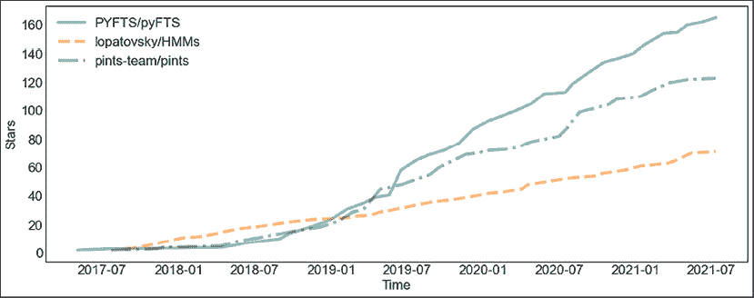

图 9.1：用于概率建模时间序列的库

你可以看到，在这三种库中，`pyFTS` 排名高于另外两个。我没有包含 `statsmodels` 库，它包括了一些概率模型。我也没有包括 Prophet。`statsmodels` 和 Prophet 都远远超过了 HMMs，一个用于隐马尔可夫模型的库，以及 Pints，一个用于噪声时间序列的库。

我也没有包含神经网络或深度学习库，如 TensorFlow Probability 或 Gluon-TS。深度学习将在*第十章*，*时间序列的深度学习*中讨论。

让我们从 Prophet 中的一个预测模型开始！

# Prophet

Facebook 的 Prophet 既是一个 Python/R 库，也是附带的算法。该算法于 2017 年发布（《Forecasting at Scale》由 Sean Taylor 和 Benjamin Letham 编写）。作者指出，实践中的预测和异常检测问题涉及处理各种特殊的预测问题，这些问题在 Facebook 中具有分段趋势、多重季节性和浮动假期，并且在整个组织中建立对这些预测的信任。

考虑到这些目标，Prophet 被设计成可以扩展到多个时间序列，足够灵活以适应各种可能具有特殊性、与业务相关的时间序列，并且足够直观，便于领域专家配置，即使他们对时间序列方法了解甚少。

Prophet 算法类似于**广义加法模型**（**GAM**），并正式化了三种模型组件的预测关系：趋势（增长）、季节性和假期，如下所示：

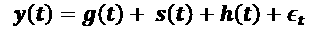

误差项 epsilon 代表残差——模型未能适应的特殊变化。所有函数都以时间作为回归变量。这三种效应是加法的；然而，Sean Taylor 和 Benjamin Letham 建议，可以通过对数变换实现乘法季节性，其中季节效应是一个乘以 g(t) 的因子。

趋势或增长函数可以是线性或对数型，适用于饱和增长。两者都可以通过变化点来融入分段效应。季节性模型基于傅里叶级数模拟周期性效应。

Prophet 中的变化点选择是自动化的。参数通过 Broyden–Fletcher–Goldfarb–Shanno（BFGS）算法进行优化，该算法在统计建模平台 Stan 中得到了实现。

概率模型的优点在于能够为预测提供一个确定性度量；然而，它们的预测不一定优于非概率模型。Prophet 与其他模型的基准测试结果呈现出混合效果。

在他们 2020 年的论文《*销售预测的概率时间序列模型分析*》中，Seungjae Jung 及其团队在大规模数据集上验证了概率时间序列模型。该单变量时间序列包含了一个电子商务网站的每日销售数据。

他们将两个深度学习概率模型 DeepAR 和 DeepState 与 Prophet 进行了比较，并与基准模型（包括**移动平均**（**MA**）、**线性回归**（**LR**）、**多层感知器**（**MLP**）和**季节性 ARIMA**（**SARIMA**））进行了对比。你应该记得在*第五章*，*移动平均和自回归模型*中，MA 是前几天的简单无权均值。他们对 Prophet 和所有基准模型尝试了 72 种不同的超参数。

他们发现，测试中的概率模型甚至未能在**均方根误差**（**RMSE**）和**平均绝对百分比误差**（**MAPE**）方面超越最简单的基准模型，如 MLP 和 LR。总体而言，Prophet 表现最差。正如往常一样，模型的表现依赖于数据集和任务本身——没有万能的解决方案。

让我们看看马尔可夫模型是如何工作的！

# 马尔可夫模型

马尔可夫链是一种概率模型，描述满足马尔可夫性质的可能事件序列。

**马尔可夫性质**：在具有马尔可夫性质的序列或随机过程中，每个事件的概率仅取决于紧接其前的状态（而不是早期的状态）。这些序列或过程也可以称为**马尔可夫过程**，或者**马尔可夫过程**。

以俄罗斯数学家安德烈·马尔可夫（Andrey Markov）命名，马尔可夫性质非常理想，因为它显著降低了问题的复杂性。在预测中，代替考虑所有之前的状态（t-1，t-2，…，0），只考虑 t-1。

同样，**马尔可夫假设**，对于一个数学或机器学习模型来说，是指序列满足马尔可夫性质。在如马尔可夫链和隐马尔可夫模型等模型中，过程或序列假设为马尔可夫过程。

在**离散时间马尔科夫链**（**DTMC**）中，序列（或链）在离散的时间步长之间转换状态。马尔科夫链也可以在连续时间步长下运行。这种不太常见的模型称为**连续时间马尔科夫链**（**CTMC**）。

在**隐马尔科夫模型**（**HMM**）中，假设过程 X 遵循不可观察的状态 Y，Y 是另一个过程，其行为依赖于 X。HMM 基于 X 建模这个潜在或隐藏的过程 Y。

另一种马尔科夫类型模型是非线性状态转移模型（也称为：马尔科夫切换模型）。该模型由詹姆斯·汉密尔顿于 1989 年发明，专门用于处理突变情况，在这些情况下，传统的线性模型往往难以捕捉到明显的行为变化。状态转移模型是一种自回归模型，其中过程的均值在不同状态之间切换。

对于实际例子，我们将遵循`statsmodels`库的实现，并构建一个模型来复制汉密尔顿 1989 年的模型。汉密尔顿在 1951 年到 1984 年间建模了实际国民生产总值（RGNP）的时间序列，RGNP 是一个调整了价格变化的宏观经济指标，衡量经济产出的价值。

我们将使用一个四阶马尔科夫切换模型，可以写成如下形式：

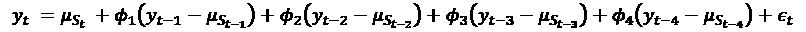

对于每个状态（或时期），状态转换按照以下转移概率矩阵进行：

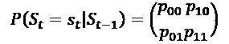

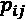 是从状态 i 转移到状态 j 的概率。

在这种情况下，我们正在建模两个状态。

在下一节中，我们将讨论一种基于模糊方法的时间序列建模方法。

# 模糊建模

模糊逻辑和模糊集理论是由洛特菲·扎德（Lotfi Zadeh）在 1960 年代和 70 年代发展起来的，当时他是加利福尼亚大学伯克利分校的教授。扎德出生于阿塞拜疆巴库，父母分别是波斯人和犹太俄罗斯人，他在伊朗德黑兰完成了学业，后来移居美国，在麻省理工学院和哥伦比亚大学学习。因此，他对不同文化中如何理解概念以及不同语言中如何表达这些概念非常熟悉。这激发了他对近似推理和语言变量的研究方法，并将其形式化为模糊理论。

**模糊集理论**是一种能够处理与模糊、主观和不精确判断相关问题的方法。模糊性是日常语言中的固有特征，而模糊性理论正是为了解释这一点并以直观的方式进行操作。模糊逻辑表达了主观信念和模糊性。可以说，概率论是模糊逻辑的一个子集。

**模糊集**是具有成员度的集合。在模糊逻辑中，规则推理的基础不再使用二值（布尔）真值“真”和“假”，而是使用单位区间[0, 1]。更正式地，成员函数表示元素属于集合的确定程度，由成员映射函数来表征：

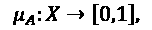

例如，基于 k-means 的著名算法**模糊 C 均值**（James Bezdek，1981），返回点属于各个簇的成员度。这意味着每个点可以属于每个簇，但程度不同。与此相对的是，其他聚类算法通常返回的所谓清晰划分，其中一个点要么属于某个簇，要么不属于。

对于模糊逻辑，所有集合运算，如等价、子集与超集、并集和交集，都必须重新定义。两个模糊集（或关系）之间的并集被定义为每个点上的最大操作，而交集则定义为最小操作。更正式地，两个集合 A 和 B 之间的并集，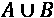，被定义为：

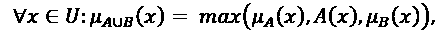

其中 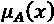 是点 x 的成员函数。

Song 和 Chissom（1993）提出了一种一阶、时不变的模糊时间序列模型，用于预测阿拉巴马大学的入学人数。其形式化如下：

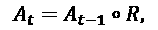

其中 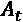 是第 t 年的入学人数，*R*是模糊关系的并集，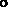 是模糊 Max-Min 组合运算符。

**Max-Min 组合运算**，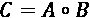，是通过对 A 的第 i 行和 B 的第 j 列逐项取最小值，然后取这些 n 个最小值的最大值来获得的。

这在下面的图示中得到了说明（来自维基百科的矩阵乘法页面）：

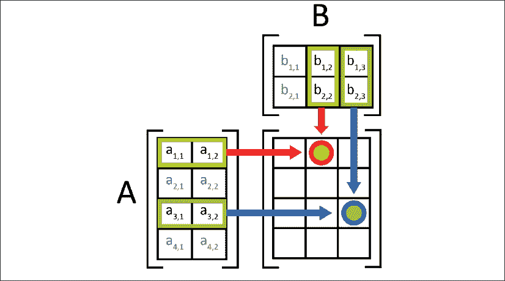

图 9.2：Max-Min 组合运算符

用圆圈标记的各位置的值按以下方式计算：

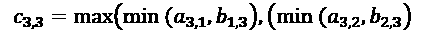

在 Song 和 Chissom 的方法中，提取当前时刻 t 与其之前时刻的值之间的关系，并将其用于预测。算法中的一个必要预处理步骤是将时间序列 X 转换为模糊时间序列 Y。这个过程称为模糊化，指的是将来自实数集的输入约束为离散集的模糊成员。这个量化过程可以通过向量量化方法来执行，比如 Kohonen 自组织映射（SOM），这是一种无监督机器学习方法，能够产生低维表示。

尽管模糊时间序列模型尚未广泛应用，但在一些应用中，它们已被证明与传统方法（如 SARIMA）具有竞争力（例如，Maria Elena 等，2012）。它们适用于离散和连续时间序列，并为预测提供可解释的模型。

在接下来的部分，我们将做一些概率时间序列预测的练习示例。

# 贝叶斯结构时间序列模型

在因果推断中，我们想分析某个治疗的效果。治疗可以是任何与我们关心的系统或环境互动的行为，从改变网站按钮的颜色到发布一个产品。我们可以选择采取行动（例如发布产品），从而观察治疗下的结果，或者不采取行动，这时我们观察到未治疗下的结果。这个过程在下图中有所示例：

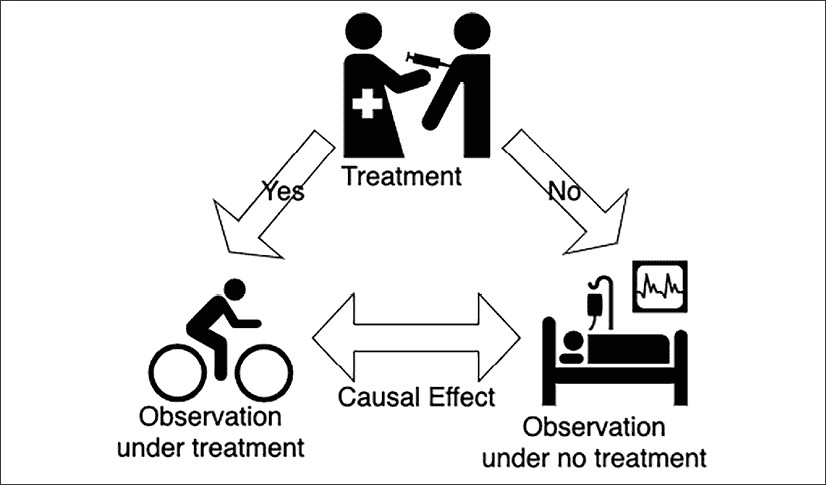

图 9.3：治疗的因果效应

在图示中，是否采取某个行动（给患者服药），根据是否采取行动，患者可能会康复（循环恢复）或进入重症监护室。

因果效应是治疗下发生的事情与未治疗下发生的事情之间的差异。问题在于，我们无法同时观察到两个潜在的结果。

然而，我们可以通过实验来观察治疗下的潜在结果和未治疗下的潜在结果，例如在 A/B 测试中，治疗只施加在总人口的一个子集上，条件 B 与控制条件 A 进行比较。

我们可以像这样列出潜在结果：

| 单位 | 治疗状态，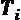 | 治疗下的结果，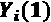 | 未治疗下的结果，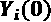 | 协变量，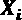 |
| --- | --- | --- | --- | --- |
| 1 | 1 |  | 估计 |  |
| 2 | 1 |  | 估计 |  |
| 3 | 0 | 估计 |  |  |
| 4 | 0 | 估计 |  |  |

图 9.4：实验中的潜在结果

在第一列中，*单位*，我们看到了样本索引。每一行都指的是人口中的一个单独单位或样本。第二列（*治疗状态*）编码了是否施行了治疗（1）或未施行治疗（0）。在第三和第四列中，*治疗下的结果*和*非治疗下的结果*分别记录。

这些标记显示了显而易见的事实：当有治疗时，我们可以观察治疗下的结果，但无法观察非治疗下的结果。反之亦然，当没有治疗时，我们可以观察非治疗下的结果，但无法观察治疗下的结果。

最后，在最后一列中，还有一些无论治疗与否都可以帮助我们的模型的额外变量。

使用**贝叶斯结构时间序列**（**BSTS**），重点是在没有实验的情况下估计治疗效应。我们可以估计或插补反事实，即实验中未知的潜在结果。这允许我们比较治疗下的结果与非治疗下的结果，从而量化因果治疗效应。

该模型由三个主要组件组成：

1.  卡尔曼滤波器

1.  变量选择

1.  贝叶斯模型平均

卡尔曼滤波器用于时间序列分解。这允许对趋势、季节性和假期进行建模。在贝叶斯变量选择步骤（尖峰与平板技术）中，选择最重要的回归预测变量。最后，在模型平均中，将预测结果结合起来。

在 2013 年的论文"*用贝叶斯结构时间序列预测现在*"中描述了 BSTS 模型在变点和异常检测中的应用，作者是 Steven L. Scott 和 Hal Varian。

2015 年 Google Research 发表了一篇论文，概述了 BSTS 在估计干预因果效应中的应用（"*使用贝叶斯结构时间序列模型推断因果影响*"，作者是 Kay H. Brodersen、Fabian Gallusser、Jim Koehler、Nicolas Remy 和 Steven L. Scott）。

这一数学细节超出了本章的范围。幸运的是，我们可以使用 Python 库应用 BSTS 模型。我们将在本章的实践部分中运行一个示例。

我们现在可以在本章学到的一些理论上进行实践。

# Python 练习

让我们把到目前为止在本章学到的东西付诸实践。我们将在 Prophet 中做一个模型，一个 Markov 切换模型，一个模糊时间序列模型和一个 BSTS 模型。

让我们开始使用 Prophet 吧！

## Prophet

首先，让我们确保我们已经安装了我们需要的一切。我们可以通过终端（或类似地通过 Anaconda 导航器）快速安装所需的库。

```py
pip install -U pandas-datareader plotly 
```

您将需要一个最新版本的 pandas-datareader，否则可能会出现`RemoteDataError`。

我们将通过 Facebook 的 Prophet 库使用 Prophet 模型。让我们安装它：

```py
pip install prophet 
```

一旦完成这些，我们就可以开始了。

在这个例子中，我们将使用第七章*时间序列的机器学习模型*中使用过的 Yahoo 每日收盘股票数据。

简而言之，我们可以通过以下方式下载 2001 到 2021 年的 Yahoo 每日股票历史数据，使用 pandas-datareader：

```py
import pandas as pd
import numpy as np
from pandas_datareader.data import DataReader
from datetime import datetime
yahoo_data = DataReader('JPM',  'yahoo', datetime(2001,6,1), datetime(2021,6,1))
yahoo_df = yahoo_data['Adj Close'].to_frame().reset_index('Date') 
```

这为我们提供了一个 pandas DataFrame，包含两个列：调整后的每日收盘值和日期。让我们快速检查这两列的数据类型：

```py
yahoo_df.dtypes 
```

这些是数据类型：

```py
Date         datetime64[ns]
Adj Close           float64
dtype: object 
```

`Date`列是以纳秒为单位的日期时间。`Adj Close`是浮动类型。

我们将把数据输入到`fit()`方法中进行训练：

```py
from prophet import Prophet
forecaster = Prophet()
forecaster.fit(
  yahoo_df.rename(columns={"**Date**": "**ds**", "**Adj Close**": "**y**"})
) 
```

我们需要将列重命名为`ds`和`y`，以符合 Prophet 的约定。现在我们已经有了一个训练好的 Prophet 模型。

然后我们将创建一个新的 DataFrame，其中包含未来的日期。我们可以将这个 DataFrame 传递给 Prophet 模型的`predict()`方法：

```py
future = forecaster.make_future_dataframe(periods=90) 
```

预测是通过这个新的 DataFrame 调用`predict()`方法：

```py
forecast = forecaster.predict(future) 
```

`forecast` DataFrame 包含了预测值以及上下置信区间。`ds`列是与预测值对应的日期。

让我们将预测与实际数据进行对比绘图：

```py
forecaster.plot(forecast, figsize=(12, 6)); 
```

这是图表：

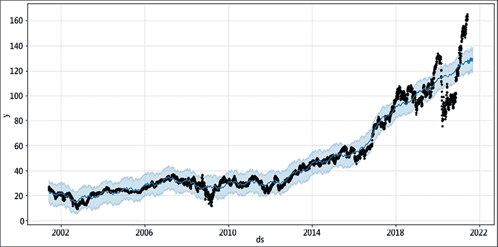

图 9.5：预测与实际时间序列（Prophet）

你可能想把这个图与*第七章*，*时间序列的机器学习模型*中的图进行比较。实际数据是粗体且较粗，而预测则较细。上下置信区间围绕着预测值。

我们可以通过查看 DataFrame 来检查预测结果：

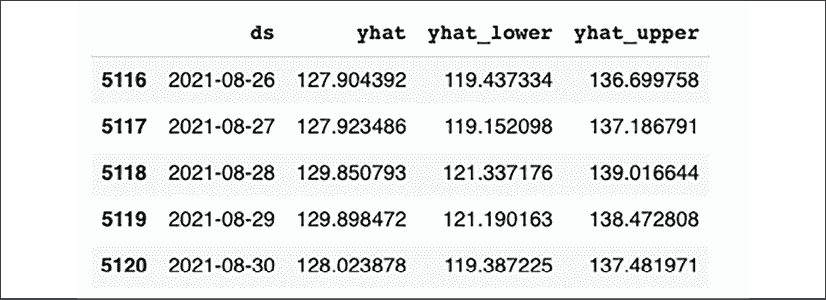

图 9.6：预测表（Prophet）

获取第一个模型非常简单，并且有很多方法可以进行调整。

## 马尔科夫切换模型

对于马尔科夫切换模型，我们将使用`statsmodels`库。如果你还没有安装它，可以通过以下方式安装：

```py
pip install statsmodels 
```

在这个例子中，我们将使用`statsmodels`的数据集。这个数据集基于`statsmodels`关于马尔科夫切换自回归模型的教程。我们可以从 Stata Press 出版社的网站上获取数据集：

```py
from statsmodels.tsa.regime_switching.tests.test_markov_autoregression import statsmodels.api as sm
import seaborn as sn
import pandas as pd
dta = pd.read_stata('https://www.stata-press.com/data/r14/rgnp.dta').iloc[1:]
dta.index = pd.DatetimeIndex(dta.date, freq='QS')
dta_hamilton = dta.rgnp 
```

这为我们提供了一个 RGNP 的 pandas 序列，索引标注了日期。让我们快速绘制这个图：

```py
dta_hamilton.plot(title='Growth rate of RGNP') 
```

我们得到以下图表：

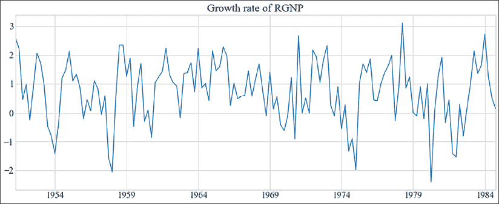

图 9.7：RGNP 增长率

我们将建模国内衰退和扩张。该模型将包括这两个状态之间的转移概率，并预测每个时间点扩张或衰退的概率。

我们将拟合四阶马尔科夫切换模型。我们将指定两个状态：

```py
import statsmodels.api as sm
mod_hamilton = sm.tsa.MarkovAutoregression(dta_hamilton, k_regimes=2, order=4, switching_ar=False)
res_hamilton = mod_hamilton.fit() 
```

现在我们已经通过最大似然估计拟合了 RGNP 数据。我们设置了`switching_ar=False`，因为`statsmodels`的实现默认使用切换自回归系数。

让我们来看看`statsmodels`模型的摘要：

```py
print(res_hamilton.summary()) 
```

我们得到以下输出（截断）：

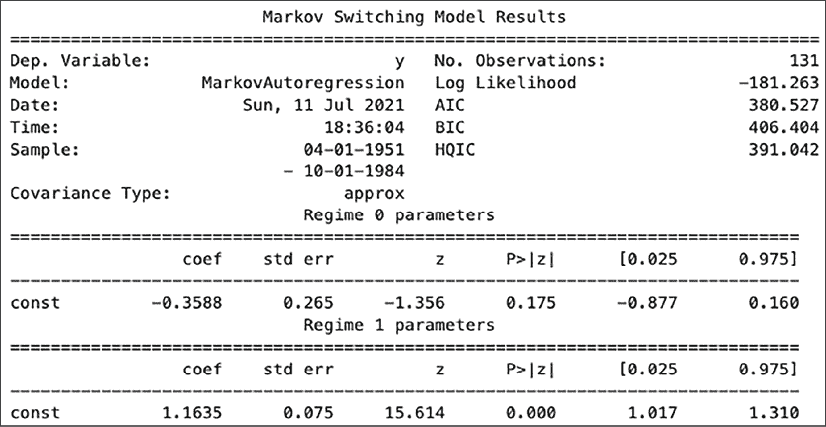

图 9.8：马尔可夫切换模型结果

我们可以看到我们有两组参数，每组对应一个制度。我们还得到了统计模型质量的度量（如 AIC 和 BIC）。

在相同输出的底部，我们可以看到制度转换参数：

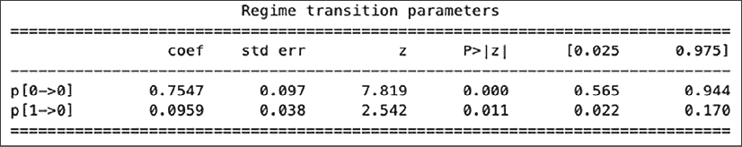

图 9.9：制度转换参数

这些是我们在马尔可夫切换模型理论部分中提到的制度转换。

让我们来看一下衰退和扩张的长度：

```py
res_hamilton.expected_durations 
```

输出 `array([ 4.07604793, 10.4258926 ])` 以财务季度为单位。因此，预计衰退将持续约四个季度（一年），扩张将持续十个季度（两年半）。

接下来，我们将绘制每个时间点的衰退概率。然而，如果我们叠加由美国国家经济研究局（NBER）提供的衰退指标，这将更具信息性，我们可以使用 pandas-dataloader 来加载这些数据：

```py
from pandas_datareader.data import DataReader
from datetime import datetime
usrec = DataReader('USREC', 'fred', start=datetime(1947, 1, 1), end=datetime(2013, 4, 1)) 
```

这为我们提供了一个数据框，指示了衰退情况。以下是前五行数据：


图 9.10：由 NBER 提供的衰退指标

在前五行数据中，根据 NBER 指标没有发生衰退。

我们现在将绘制 NBER 衰退指标与模型制度预测的对比：

```py
import matplotlib.pyplot as plt
_, ax = plt.subplots(1) ax.plot(res_hamilton.filtered_marginal_probabilities[0]) ax.fill_between(
  usrec.index, 0, 1, where=usrec['USREC'].values,
  color='gray', alpha=0.3
)
ax.set(
  xlim=(dta_hamilton.index[4], dta_hamilton.index[-1]),
  ylim=(0, 1),
  title='Filtered probability of recession'
) 
```

这为我们提供了实际的衰退数据与模型预测的对比：

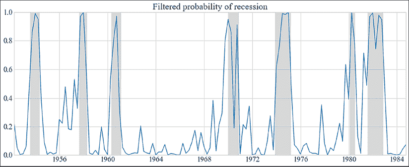

图 9.11：过滤后的衰退概率

我们可以看到，模型预测和实际衰退指标之间似乎有很好的匹配。

不幸的是，`statsmodels` 实现并未提供预测或样本外预测的功能，因此我们将在此结束简短的演示。

`Statsmodels` 包含其他用于制度切换模型的数据集供我们探索。

在接下来的实践部分，我们将使用 `pyFTS` 库（由巴西米纳斯吉拉斯联邦大学（UFMG）的 MINDS 实验室开发）将宋氏和奇索姆的模型应用于时间序列预测问题。

## 模糊时间序列

在本节中，我们将加载两个时间序列，分别是纳斯达克指数和标准普尔 500 指数，并使用宋氏和奇索姆 1993 年的算法进行预测。这与该库中的示例教程非常接近。

首先，我们将从终端（或类似的 Anaconda 导航器）安装该库：

```py
pip install pyFTS SimpSOM 
```

然后，我们将定义我们的数据集：

```py
from pyFTS.data import NASDAQ, SP500
datasets = {
  "SP500": SP500.get_data()[11500:16000],
  "NASDAQ": NASDAQ.get_data()
} 
```

两个数据集，即我们 `datasets` 字典中的条目，是大约 4000 个标量值的向量。我们将使用其中约 50% 的点进行训练，并将其设置为常量：

```py
train_split = 2000 
```

该模型假设是平稳过程，因此我们需要按照*第二章*《探索性时间序列分析》中讨论的那样，通过时间差分预处理我们的时间序列。

我们将定义一个一阶差分操作进行预处理：

```py
from pyFTS.common import Transformations
tdiff = Transformations.Differential(1) 
```

让我们绘制我们的时间序列和其变换：

```py
import matplotlib.pyplot as plt
fig, ax = plt.subplots(nrows=2, ncols=2)
for count, (dataset_name, dataset) in enumerate(datasets.items()):
  dataset_diff = tdiff.apply(dataset)
  ax[0][count].plot(dataset)
  ax[1][count].plot(dataset_diff)
  ax[0][count].set_title(dataset_name) 
```

原始时间序列和转化后的时间序列的图表如下所示：

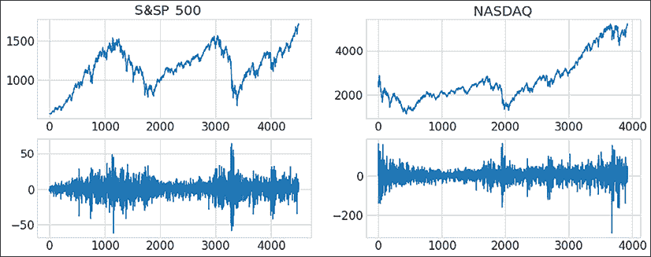

图 9.12: 纳斯达克和标准普尔 500 指数——原始和转化后的时间序列

在这个 GitHub 仓库中，您可以看到应用于变换后时间序列的增广迪基-富勒单位根检验。该平稳性检验为我们提供了绿灯，我们继续进行模型构建。

下一步是训练我们针对两个转化后的（差分）时间序列的模型：

```py
from pyFTS.models import song
from pyFTS.partitioners import Grid
models = {}
for count, (dataset_name, dataset) in enumerate(datasets.items()):
  partitioner_diff = Grid.GridPartitioner(data=dataset, npart=15, transformation=tdiff)
  model = song.ConventionalFTS(partitioner=partitioner_diff)
  model.name = dataset_name
  model.append_transformation(tdiff)
  model.fit(
    dataset[:train_split], 
    order=1
  )
  models[dataset_name] = model 
```

我们遍历数据集，并为每个数据集训练一个独立的模型，将其保存在字典 `models` 中。训练过程包括从训练集中提取关系。

作为模型训练的一部分，预处理的时间序列会按照本章中模糊时间序列模型的理论部分进行量化。

我们可以绘制两个模型的预测结果：

```py
_, ax = plt.subplots(nrows=2, ncols=1, figsize=[12, 6])
for count, (dataset_name, dataset) in enumerate(datasets.items()):
    ax[count].plot(dataset[train_split:train_split+200])
    model = models[dataset_name]
    forecasts = model.predict(dataset[train_split:train_split+200], steps_ahead=1)
    ax[count].plot(forecasts)
    ax[count].set_title(dataset_name)

plt.tight_layout() 
```

再次，我们遍历这两个数据集。这次，我们将测试集中的原始值（200 个点）与预测的一步前值进行对比。请注意，在预测过程中模型并不会根据新数据进行更新。

这是我们将预测结果与测试集中的实际值进行比较的图表：

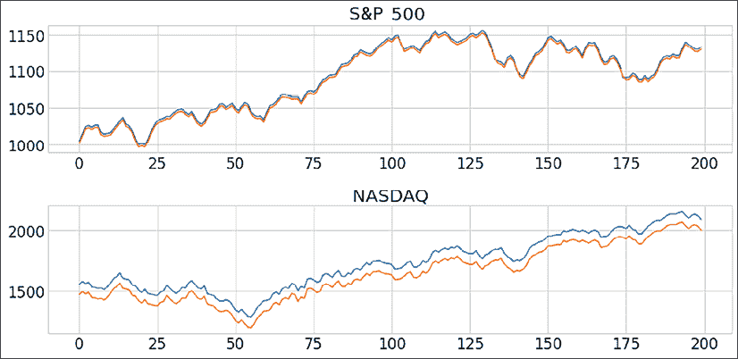

图 9.13: 模糊时间序列预测与实际值对比（标准普尔 500，纳斯达克）。

看这些图表，预测看起来相当有希望，但让我们看看一些实际数字！

`PyFTS` 提供了一个方便的函数来提取 RMSE、MAPE，以及最后的 Theil's U，这是一个相关性度量。我们在*第二章*中介绍了这些度量，*探索性时间序列分析与时间序列*。

```py
from pyFTS.benchmarks import Measures
rows = []
for count, (dataset_name, dataset) in enumerate(datasets.items()):
    row = [dataset_name]
    test = dataset[train_split:train_split+200]
    model = models[dataset_name]
    row.extend(Measures.get_point_statistics(test, model))
    rows.append(row)

pd.DataFrame(
  rows,columns=["Dataset", "RMSE", "MAPE", "Theil's U"]
).set_index("Dataset") 
```

我们得到这些统计数据：


图 9.14: 纳斯达克和标准普尔 500 的模糊时间序列建模统计数据

我将把比较这两个模型与其他模型的练习留给读者，通过这些误差指标进行对比。

## 贝叶斯结构时间序列建模

在这个例子中，我们将应用 BSTS 建模来理解时间序列中治疗的因果效应。

首先，我们将安装这个库：

```py
pip install tfcausalimpact 
```

现在，我们将加载一个数据集，并估计治疗的结果。

在这里，我们将估计 2015 年 9 月大众汽车排放丑闻的影响。我们将使用三家大公司的股票价值数据，分别是大众汽车、宝马和安联。数据集与 Python Causal Impact（tfcausalimpact）库一起提供：

```py
import pandas as pd
from causalimpact import CausalImpact
data = pd.read_csv(**"https://raw.githubusercontent.com/WillianFuks/tfcausalimpact/master/tests/fixtures/volks_data.csv"**, header=0, sep=**'** **'**, index_col=**'Date'**, parse_dates=True) 
```

现在我们已经有了股票价值。让我们绘制它们：

```py
data.plot() 
```

以下是股票的时间变化：

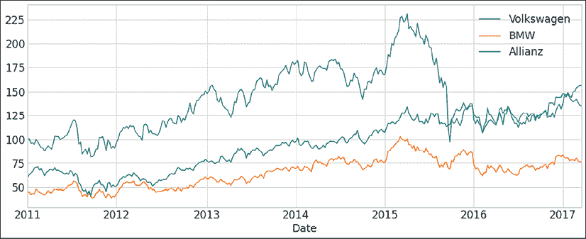

图 9.15: 三家大公司的股票价值（大众汽车，宝马，安联）

我们可以看到，2015 年底大众汽车股票的价值急剧下跌。让我们尝试找出排放丑闻的实际影响。我们可以这样构建我们的模型：

```py
pre_period = [str(np.min(data.index.values)), "2015-09-13"]
post_period = ["2015-09-20", str(np.max(data.index.values))]
ci = CausalImpact(data.iloc[:, 0], pre_period, post_period, model_args={'nseasons': 52, 'fit_method': 'vi'}) 
```

模型统计数据为我们提供了因果影响估计：

```py
print(ci.summary()) 
```

我们在这里看到了这些统计数据：

```py
Posterior Inference {Causal Impact}
                          Average              Cumulative
Actual                    126.91               10026.07
Prediction (s.d.)         171.28 (17.33)       13531.49 (1369.17)
95% CI                    [136.07, 204.01]     [10749.78, 16116.83]
Absolute effect (s.d.)    -44.37 (17.33)       -3505.42 (1369.17)
95% CI                    [-77.1, -9.16]       [-6090.76, -723.71]
Relative effect (s.d.)    -25.91% (10.12%)     -25.91% (10.12%)
95% CI                    [-45.01%, -5.35%]    [-45.01%, -5.35%]
Posterior tail-area probability p: 0.01
Posterior probability of a causal effect: 99.2% 
```

图 9.16：因果影响估计与模型统计

如前所述，Google 开发的因果影响模型通过将 BSTS 模型拟合到观察数据来工作，随后用于预测如果在给定时间段内没有发生干预，结果会是怎样。

总体估计效应约为 44 个点——如果没有排放丑闻，股票价格将高出 44 个点。影响总结报告为我们提供了以下分析（摘录）：

```py
During the post-intervention period, the response variable had
an average value of approx. 126.91\. By contrast, in the absence of an intervention, we would have expected an average response of 171.28\. The 95% interval of this counterfactual prediction is [136.07, 204.01].
Subtracting this prediction from the observed response yields
an estimate of the causal effect the intervention had on the
response variable. This effect is -44.37 with a 95% interval of [-77.1, -9.16]. For a discussion of the significance of this effect, see below. 
```

图 9.17：因果影响分析报告

这为我们提供了关于模型估计的非常好的概念。

我们也可以绘制效应图：

```py
ci.plot(panels=["original"] 
```

绘图如下：

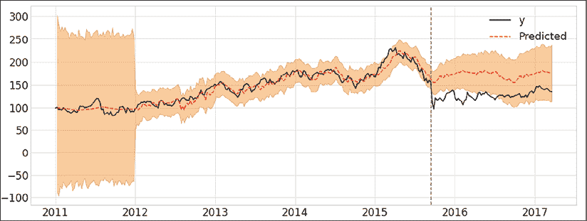

图 9.18：因果影响图

再次，我们看到原始时间序列与预测的反事实值。

排放丑闻使大众汽车损失了大量的价值。这 44 个点可以为我们提供作弊排放测试对大众汽车造成的金钱损失。

# 总结

在本章中，我们讨论了如何使用时间序列的概率模型帮助我们在金融预测的背景下做出带有不确定性估计的决策。这些预测驱动着财务规划的商业决策。

我已经介绍了 Prophet、马尔可夫模型和模糊时间序列模型。我们讨论了 Facebook 的 Prophet 模型的组成部分。对于马尔可夫模型，我们讨论了主要的概念，如马尔可夫性质，并详细讨论了转换模型。接着，我解释了模糊集合理论的一些基础知识以及它如何应用于时间序列。

最后，我们深入探讨了 BSTS 模型的直觉以及在实验中估计处理效应的一些理论。

最后，我们通过每种方法进行了一次应用练习。在 BSTS 实践中，我们研究了大众排放丑闻的影响。
