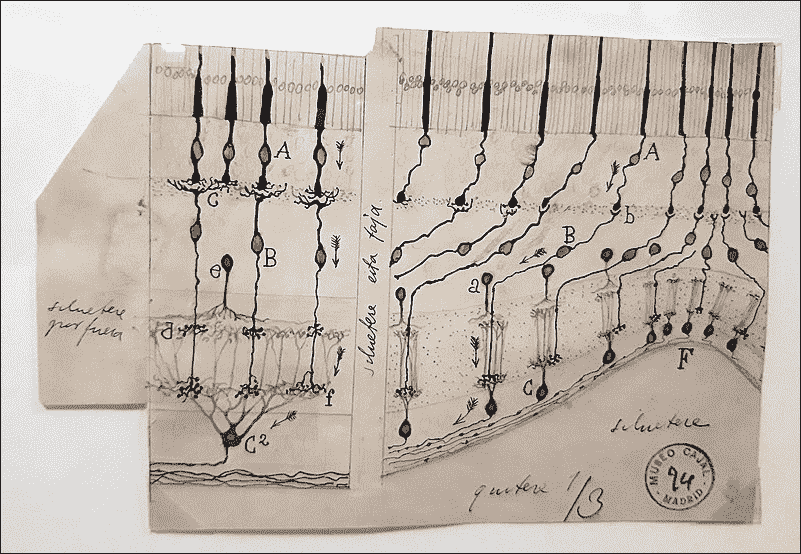
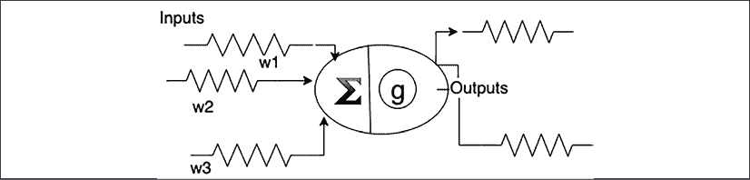
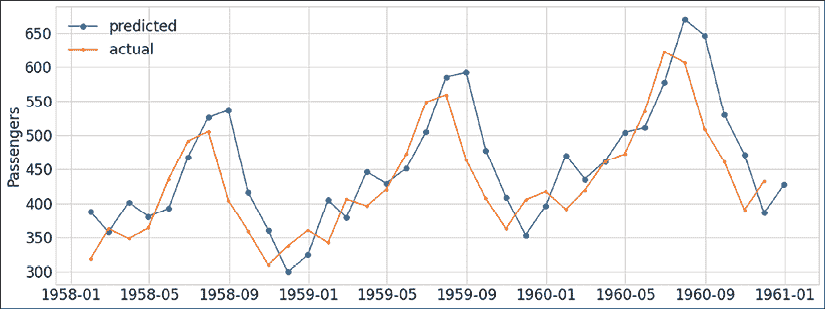

# 第十章：时间序列的深度学习

深度学习是机器学习的一个子领域，关注与神经网络相关的算法。神经网络，或者更准确地说，**人工神经网络**（**ANNs**），得名于它们与人类大脑中生物神经网络的松散关联。

近年来，深度学习在多个应用领域推动了技术的进步。对于非结构化数据集，如文本、图像、视频和音频，这一点尤为明显；然而，表格数据集和时间序列迄今为止对深度学习的适应性较差。

深度学习提供了非常高的灵活性，并且能够结合*第八章*中讨论的在线学习（*时间序列的在线学习*）和*第九章*中讨论的概率方法（*时间序列的概率模型*）的优势。然而，由于其高度参数化的模型，找到合适的模型可能会是一个挑战。

深度学习为时间序列带来的贡献包括数据增强、迁移学习、长时间序列的预测、以及使用**生成对抗网络**（**GANs**）的数据生成。然而，直到最近，深度学习方法在预测、分类和回归任务中才变得具有竞争力。

在这一章中，我们将讨论应用于时间序列的深度学习，特别是针对时间序列设计的算法和方法。我们将探讨当前的挑战、前景广阔的研究方向以及将深度学习引入时间序列的竞争性方法。我们将详细介绍深度学习在时间序列领域的最新创新。

我们将涵盖以下主题：

+   深度学习简介

+   时间序列的深度学习

    +   自编码器

    +   InceptionTime

    +   DeepAR

    +   N-BEATS

    +   循环神经网络

    +   卷积神经网络（ConvNets）

    +   Transformer 架构

    +   Informer

+   Python 实践

    +   完全连接网络

    +   循环神经网络

    +   膨胀因果卷积神经网络

让我们从深度学习及其核心概念的介绍开始。

## 深度学习简介

深度学习基于一些早在 20 世纪初就出现的基础概念——神经元之间的连接。神经元通过所谓的神经突起在化学和电气方面进行交流。

这种神经网络的连接图首次由西班牙神经科学家圣地亚哥·拉蒙·卡哈尔（Santiago Ramón y Cajal）描述和绘制。他绘制了大脑的解剖图以及大脑神经网络的结构。他因在生理学或医学领域的贡献，于 1906 年获得诺贝尔奖，与卡米洛·戈尔吉（Camillo Golgi）共享该奖项，戈尔吉发明了用于神经元染色的钾二铬酸盐和硝酸银染色法，而拉蒙·卡哈尔在显微镜研究中应用了这些染色方法。

下面的图表仅仅是他精心绘制的神经元之间神经连接的树突状分支（称为神经突起——树突和轴突）图（来源：Wikimedia Commons）：



图 10.1：Ramon y Cajal 绘制的大脑中神经元网络图

在示意图中，您可以看到神经元作为大脑各层中的灰色点。在神经元之间是树突和轴突，大脑的“线路”。每个神经元通过门控站接收环境信息，然后将其传递到称为突触的神经突起。

Ramón y Cajal 及其学生们提出了*电缆理论*，其中神经突起上通过电流传递的电流被数学模型建模。通过树突接收到来自不同部位和时间的突触输入的电压被认定为感觉和其他信息在细胞之间传递。这为今天在研究中使用的详细神经元模型奠定了基础，用于模拟突触和神经反应。

神经元的基本功能由 Frank Rosenblatt 于 1958 年正式化为感知机——一个包含现代大多数深度学习概念精髓的模型。



图 10.2：感知机模型

在感知机模型中，一个神经元——图中间的椭圆——接收来自其他神经元的输入。在模型中，这些输入可以代表文本、图像、声音或任何其他类型的信息。这些输入通过求和的方式进行整合。在这个和中，每个来自神经元*i*的输入都有一个权重*w*[i]，表示它的重要性。这个整合后的输入可以通过神经元的激活函数*g*来引发神经激活。

在最简单的情况下，激活函数可以只是一个阈值函数，当输入的加权和超过某个值时，神经元会被激活。在现代神经网络中，激活函数是非线性函数，例如 sigmoid 函数或修正线性函数，其中输出在阈值以上是线性的，而阈值以下被裁剪。

当网络受到数据刺激时，输入神经元被激活，并将信号传递给二级神经元，随后再传递给其他神经元，直到激活输出层。这被称为*前向传播*。

感知机由一层集成神经元组成，这些神经元通过它们的输入连接对输入进行求和。Marvin Minsky 和 Seymour Pappert 在他们的著作《感知机》（1969）中证明，这些神经元类似于简单的线性模型，无法逼近现实世界中复杂的函数。

然而，多层神经网络可以克服这一限制，这也正是我们逐步进入深度学习领域的地方。这些网络可以通过一种称为*反向传播*的算法进行训练——通常归功于 Paul Werbos（1975）。在反向传播中，可以将输出与目标进行比较，并将误差导数反馈到网络中，以计算连接中权重的调整。

神经网络中的另一个创新再次来源于神经科学。在 1950 年代和 1960 年代，David Hubel 和 Torsten Wiesel 发现，猫视觉皮层（V1）中的神经元对视觉场的局部区域做出反应。他们称这一区域为感受野（1959 年，“猫条纹皮层中单个神经元的感受野”）。他们区分了两种基本细胞类型：

+   简单细胞——这些细胞的特征主要是对输入的求和

+   复杂细胞——对不同位置的多种刺激做出反应的细胞

复杂细胞启发了神经网络中采用卷积的计算层，最早由 Kunihiko Fukushima 于 1980 年提出。我们在*第三章*《时间序列预处理》中讨论了卷积。

具有卷积层的神经网络是图像处理、分类和分割等应用中主要的模型类型。Yann LeCun 及其同事在 1989 年提出了 LeNet 架构，其中通过反向传播学习卷积核，用于手写数字图像的分类。

深度学习网络通常不仅仅由层构成，输入从一层传播到下一层（前馈）。这些连接也可以是递归的，连接到同一层的神经元，甚至回到同一神经元。

一种递归神经网络框架，**长短期记忆**（**LSTM**）由 Jürgen Schmidhuber 和 Sepp Hochreiter 于 1997 年提出。与之前的模型相比，LSTM 能够在更长时间内检索和学习信息。该模型架构曾一度驱动着行业模型，如 Android 智能手机的语音识别软件，但后来大多被卷积模型取代。

2012 年，AlexNet 由 Alex Krizhevsky 与 Ilya Sutskever 和 Geoffrey Hinton 合作创建，在 ImageNet 大规模视觉识别挑战赛（简称 ImageNet）中取得突破，在该比赛中，数百万张图像需要被归类到 20,000 个类别中。AlexNet 将 Top-5 错误率从大约 25%降至约 15%。该模型利用由**图形处理单元**（**GPU**）驱动的大规模并行硬件，将全连接层与卷积层和池化层结合起来。

这只是对不同任务（包括图像）的性能极大提升的开始。AlexNet 的性能在第二年被 ResNet 超越。

由于 ResNet 论文具有重要影响力，值得稍作绕道来解释它是如何工作的。ResNet 由 Kaiming He 和微软研究院的其他人于 2015 年提出（“*深度残差学习用于图像识别*”）。深度神经网络的一个常见问题是，随着更多层的添加，其性能可能会饱和并退化，部分原因是梯度消失问题，在该问题中，优化中计算的误差梯度变得太小，无法发挥作用。

受到大脑金字塔细胞的启发，残差神经网络采用了所谓的*跳跃连接*，基本上是跳过中间层的捷径。ResNet 是包含跳跃连接（残差块）的网络，如下图所示：


图 10.3：带跳跃连接的残差块

在所示的残差块中，第二层的输出如下：


其中  和  分别是第二层的激活函数和跳跃连接。 通常是恒等函数，其中第一层的激活值保持不变。如果第一层和第二层的输出维度不匹配，则会使用填充或卷积。

通过这些跳跃连接，何凯明等人成功训练了包含多达 1000 层的网络。2015 年发布的原始 ResNet 在图像处理方面非常成功。它赢得了多个图像分类和目标检测的顶级竞赛奖项：ILSVRC 2015，ILSVRC 2015，COCO 2015 竞赛中的 ImageNet 检测，ImageNet 定位，Coco 检测和 Coco 分割等。

我在这里总结了人工神经网络和深度学习的早期历史：


图 10.4：人工神经网络与深度学习的时间轴

请注意，这只是一个高度简化的版本，省略了许多重要的里程碑。我将时间轴结束于 2015 年，当时 ResNet 首次发布。

深度学习中有许多架构和方法，本图展示了这些方法的类型学：


图 10.5：深度学习方法的类型学

我们在本节中提到了一些方法，接下来的章节将更详细地解释其中的一些方法，因为它们与时间序列相关。

基于深度神经网络的技术的计算复杂性，首先由输入数据的维度驱动，并且取决于通过反向传播训练的隐藏层数量。高维数据往往需要更多的隐藏层，以确保更高层次的特征学习，每一层基于上一层提取更高层次的特征。随着神经元数量的增加，训练时间和复杂性也会增加—有时超参数的数量可达到数百万或数十亿。

深度学习的表示能力通过构建一系列派生特征作为学习的一部分，使模型能够摆脱手工制作的特征。使用深度学习模型的进一步优势包括其在选择架构、超参数（如激活函数、正则化、层大小和损失目标）方面的灵活性，但这与其参数数量的复杂性以及难以探查其内部工作原理之间的权衡。

与其他机器学习方法相比，深度学习方法在多个时间序列数据集上提供了更好的表示和预测；然而，到目前为止，它们尚未在其他领域取得的影响。

# 时间序列的深度学习

近年来，深度神经网络得到了广泛应用，在各个应用领域取得了前所未有的改进，特别是在图像、自然语言处理和声音领域。深度学习模型的潜在优势在于，它们比其他类型的模型更准确，从而推动了视觉、声音和**自然语言处理**（**NLP**）等领域的进展。

在预测中，特别是需求预测，数据通常是高度不稳定、不连续或突发的，这违反了经典技术的核心假设，如高斯误差、平稳性或同方差性，正如*第五章*中所讨论的《时间序列预测》。应用于预测、分类或回归任务的深度学习技术可以克服经典方法面临的许多挑战，最重要的是，它们可以提供一种建模非线性动态的方法，而这些动态通常被传统方法（如 Box-Jenkins、指数平滑（ES）或状态空间模型）忽视。

最近，许多深度学习算法被应用于时间序列，包括单变量和多变量时间序列。模型架构包括递归神经网络（RNN），最显著的是长短期记忆（LSTM）模型，以及变换器和卷积模型，或不同类型的自编码器。

然而，关于它们在时间序列中的应用，它们还未能挑战该领域的顶级模型。例如，正如 Spyros Makridakis 等人（2020）所指出的，在 M4 竞赛中，作为单变量时间序列预测的最重要基准，排名最高的方法是广泛使用的经典统计技术的集成，而不是纯粹的机器学习方法。

这至少部分可能与竞争的性质有关。正如 Slawek Smyl 所指出的，季节性系列的去季节化在 M4 竞赛中非常重要，因为这些系列以标量向量的形式提供，没有时间戳，因此无法加入日历特征，如星期几或月份。

在 M4 竞赛中，在 60 个参赛作品中，排名第 23 的机器学习方法为首。然而，值得注意的是，M4 竞赛的获胜者是一个基于扩展 LSTM 和注意力机制与 Holt-Winters 统计模型的混合模型。另一个竞争者，由 Rob Hyndman 团队开发，使用了基于梯度提升树的集成方法，将传统模型的输出作为输入（*FFORMA：基于特征的预测模型平均*，2020）。

这些排名让 Spyros Makridakis 等人得出结论，混合或结合传统与机器学习方法是未来的方向。目前正在寻找一种深度学习架构，能够为研究和应用带来类似 AlexNet 或 Inception 在图像领域的转折点。

在*第四章*，*时间序列机器学习导论*中，我们首先讨论了击败基准方法（如最近邻算法结合**动态时间规整**（**DTW**））的难度，然后是最先进的方法。从性能角度来看，最具竞争力的模型是**HIVE-COTE**（**基于变换集成的层次投票集合**），它由多个机器学习模型的集成组成——由于计算量大且运行时间长，资源消耗非常高。

挖苦的读者可能会评论说，这听起来已经像深度学习了，并质疑深度学习是否已经取代了作为最先进方法的地位。一般来说，深度学习模型的复杂度远高于传统模型或其他机器学习技术。这可以说是深度学习模型最大的特点之一。

是否存在比 HIVE 更简单或相似复杂度的深度学习模型架构，能够达到竞争力的结果？

我已将一些实现时间序列深度学习算法的库汇总在此表中：

| 库 | 维护者 | 算法 | 框架 |
| --- | --- | --- | --- |
| dl-4-tsc | Hassan Ismail Fawaz | **多层感知机**（**MLP**），**全连接网络**（**FCN**），ResNet，编码器（基于 CNN），**多尺度卷积神经网络**（**MCNN**），**时间 Le-Net**（**t-LeNet**），**多通道深度卷积神经网络**（**MCDCNN**），时间 CNN，**时间规整不变回声状态网络**（**TWIESN**），InceptionTime | TensorFlow/Keras |
| Sktime-DL | 英国东安格利亚大学的 Tony Bagnell 团队 | ResNet，CNN，InceptionTime（通过与其他库的接口） | TensorFlow/Keras |
| Gluon-TS | 亚马逊网络服务实验室 | Gluon-TS 专注于概率神经网络模型，如：**卷积神经网络**（**CNN**），DeepAR，**循环神经网络**（**RNN**），**多层感知机**（**MLP**） | MXNET |
| Pytorch Forecasting | Daniel Hoyos 等人 | 循环网络（GRU，LSTM）、时序融合变换器、N-Beats、多层感知器、DeepAR | PyTorch Lightning |

图 10.6：几个深度学习库在时间序列中的概览

Sktime-DL 是 sktime 的扩展，由同一研究小组维护。到 2021 年 8 月，该库正在重写中。

Gluon-TS 基于 MXNET 深度学习建模框架，除了表格中列出的网络架构外，还包含许多其他功能，如**支持向量机**（**SVMs**）和**高斯过程**（**GP**）的内核，以及用于概率网络模型的分布。

*dl-4-tsc* 是 Hassan Ismail Fawaz 等人（2019）为多种时间序列深度学习算法的综述论文准备的 GitHub 伴随库。它包括了他们实现的 TensorFlow/Keras 实现。它不是一个库*本身*，因为它不像一个库那样安装，模型在数据集上运行；然而，由于这些算法已在 TensorFlow 和 Keras 中实现，任何熟悉这些框架的人都会觉得很亲切。

Pytorch-forecasting、sktime-DL 和 Gluon-TS 都有自己的数据集抽象，帮助自动化常见任务。虽然 Sktime-DL 构建于 sktime 抽象之上，Pytorch-Forecasting 和 Gluon-TS 则内置了用于深度学习的工具，处理常见任务，如变量的缩放和编码、目标变量的归一化和下采样。然而，这些抽象带来了学习曲线，我要提醒那些急于求成的读者，这可能需要一些时间才能掌握，这也是我在实践部分中省略它们的原因。

我已从此表中省略了仅实现单一算法的库。在接下来的可视化中，我包含了一些这样的库，如 Informer 模型或神经先知的库。在下图中，您可以看到几个时间序列深度学习库的受欢迎程度：


图 10.7：时间序列深度学习库的受欢迎程度

一如既往，我尽量选择最受欢迎的库——以及最近有更新的库。可以看出，Gluon-TS 是最受欢迎的库。在实现多个算法的库中，Pytorch Forecasting 紧随其后，最近在受欢迎程度上有所突破。

在接下来的部分，我们将重点介绍时间序列深度学习中的一些最新和具有竞争力的方法。我们将详细介绍一些最突出的算法：自动编码器、InceptionTime、DeepAR、N-BEATS、RNN（尤其是 LSTM）、卷积神经网络（ConvNets）和变换器（包括 Informer）。

## 自动编码器

**自编码器**（**AEs**）是人工神经网络，能够学习高效地压缩和编码数据，并通过重建误差进行训练。一个基本的线性自编码器本质上在功能上等同于**主成分分析**（**PCA**），尽管在实际应用中，自编码器通常会进行正则化处理。

自编码器由两部分组成，编码器和解码器，如下所示（来源：维基百科）：


图 10.8：自编码器架构

编码器和解码器通常具有相同的架构，这取决于具体领域。例如，在图像处理中，它们通常包含像`LeNet`这样的卷积层。在建模时间依赖性时，它们可以包括因果卷积或递归层，用来建模时间依赖性。

自编码器是减少噪声的自然方式。它们常用于时间序列中的异常检测。

## InceptionTime

在一次大规模的测试中，哈桑·伊斯梅尔·法瓦兹（Hassan Ismail Fawaz）和其他人在 60 个 GPU 的集群上运行了深度学习算法，测试了单变量 UCR/UEA 时间序列分类档案（85 个时间序列）和 13 个**多变量时间序列**（**MTS**）分类档案中的数据集。他们在 2019 年的论文“*时间序列分类中的深度学习：综述*”中展示了这项工作。

他们对 11 个模型进行了系统评估，包括 LeNet、**全连接网络**（**FCNs**）、Time-CNN 和 ResNet。仅有 9 个算法完成了所有测试。与单变量数据集（UCR/UEA）上的深度学习算法相比，ResNet 在 85 个问题中赢得了 50 个，并且在统计上优于下一个最佳算法**全卷积神经网络**（**FCNN**）。同时，它在统计上与 HIVE-COTE（时间序列分类中的顶级模型）并无显著差异。在多变量基准测试中，FCNN 获胜，尽管他们没有发现网络之间有任何统计显著差异。

在另一篇论文中，哈桑·伊斯梅尔·法瓦兹（Hassan Ismail Fawaz）和一个扩展的研究小组，包括来自莫纳什大学的 Geoff Webb 等人（我们在*第三章*，“*时间序列预处理*”中曾遇到过他们），提出了一个新模型，称为 InceptionTime。

*InceptionTime*这个名字参考了 Inception 模型（“*Going Deeper with Convolutions*”，2014），这是由谷歌的研究人员和北卡罗来纳大学及密歇根大学的研究人员提出的一个网络。Inception 架构由前馈层和卷积层组成，类似于我们在本章早些时候提到的 LeNet。一个 22 层的变种因此也被称为 GoogleLetNet（或者：Inception 模型版本 1）。粗略来说，Inception 模型由多个模块（“Inception 模块”）组成，这些模块将不同大小的卷积连接在一起。

InceptionTime 采用不同超参数（不同长度的滤波器）的 Inception 类型模型的集成。它们对集成中的网络数量和滤波器大小进行了实验，最终证明它们的模型在 UCR 档案的 85 个数据集上显著超越了 ResNet，并且在统计上与 HIVE-COTE 相当，同时训练时间相比 HIVE-COTE 大幅减少。

## DeepAR

DeepAR 是亚马逊德国研究院提出的一种概率预测方法。它基于训练一个自回归循环网络模型。在他们的文章"*DeepAR: Probabilistic forecasting with autoregressive recurrent networks*"（2019 年）中，David Salinas、Valentin Flunkert 和 Jan Gasthaus 通过在多个真实世界预测数据集（如零部件、电力、交通、ec-sub 和 ec）上的广泛实证评估，展示了相比于最先进方法，准确性提高了约 15%。

DeepAR 是为需求预测而设计的，采用 RNN 架构，并结合了负二项分布似然，用于无界计数数据，这些数据可以跨越几个数量级。蒙特卡洛采样被用于计算预测区间内所有子区间的分位数估计。当时间序列的幅度变化较大时，它们还通过依赖于时间序列均值和网络输出的因子，对负二项似然的均值和方差参数进行了缩放。

## N-BEATS

这是一个用于单变量时间序列点预测的模型架构，基于前向和后向残差连接，以及一个非常深的全连接 ReLU 神经元的多层网络。N-BEATS 使用深度学习原语，如残差块，而不是任何时间序列特定的组件，是第一个展示不使用任何时间序列特定组件的深度学习架构，能够超越成熟统计方法的架构。

该网络由 Yoshua Bengio 团队于 2019 年发布（"*N-BEATS: Neural basis expansion analysis for interpretable time-series forecasting*"），在两种配置下达到了最先进的性能，并在 M3、M4 和旅游竞赛数据集的基准测试中超越了所有其他方法，包括传统统计方法的集成方法。

深度学习的一个常见批评是其学习过程的黑箱性，或者反过来说，就是网络的行为缺乏透明度。N-BEATS 可以通过少量改动实现可解释性，而不会显著降低准确性。

## 循环神经网络

RNN，特别是 LSTM，已广泛应用于多变量电力消费预测。电力预测是一个长序列时间序列，需要精确捕捉序列中各项之间随时间变化的长程相关性。

早期的研究探讨了 LSTM 与膨胀、残差连接和注意力机制的结合。这些为 M4 竞赛的获胜者（Slawek Smyl，2020）提供了基础。

Smyl 提出了一种将标准**指数平滑**（**ES**）模型与 LSTM 网络相结合的方法。ES 方程使得该方法能够有效捕捉个别系列的主要组成部分，如季节性和基线水平，而 LSTM 网络则能够建模非线性趋势。

RNN，包括 LSTM，的一个问题是它们无法轻松地进行并行化，这会导致训练时间和计算资源的浪费。也有人认为，LSTM 无法捕捉长距离依赖关系，因为它们在处理超过大约 100 时间步的序列时表现不佳。RNN 通过编码过去的隐藏状态来捕捉与之前项目的依赖关系，而由于长依赖关系，它们的性能会下降。

在下一部分中，我们将介绍 transformer 架构，它在性能和最近的流行度方面，正在取代 LSTM 模型。

已经证明，卷积架构在音频处理和机器翻译等任务中可以优于递归网络，并且它们也已应用于时间序列任务。

## 卷积神经网络（ConvNets）

卡内基梅隆大学和英特尔实验室的研究人员（"*An Empirical Evaluation of Generic Convolutional and Recurrent Networks for Sequence Modeling*" 2018）比较了用于序列建模的通用卷积网络和递归网络（如 LSTM/GRU），并在广泛的任务中进行了测试。这些任务使用了大型文本数据集，并涉及序列问题，如加法问题、记忆任务的复制或多音音乐。像这些问题和数据集通常用于对递归网络进行基准测试。

他们发现，一种简单的卷积架构——**时间卷积网络**（**TCN**），在许多任务中比经典的递归网络（如 LSTM）表现更好，并且展示了更长的有效记忆。

TCN 中卷积的重要特征是它们是因果的。如果卷积的输出仅由当前和过去的输入决定，那么它就是因果的。以下是一个示例（来源：keras-tcn，GitHub）：


图 10.9：时间因果卷积

在时间 t 的输出仅与时间 t 及之前的元素进行卷积。这意味着未来的信息不能泄露到过去。这种基本设计的一个缺点是，为了实现长的有效历史大小，我们需要一个极其深的网络或非常大的滤波器。

卷积相较于 RNN 的优势包括并行性、灵活的感受野大小（指定模型可以看到的范围）和稳定的梯度——反向传播过程中，RNN 会面临梯度消失问题。

Transformer 还解决了 RNNs 被认为存在的不足之处。

## Transformer 架构

Transformer 是由 Google Brain 和多伦多大学的研究人员在 2017 年发布的文章《*Attention is all you need*》中提出的，旨在避免递归，以便支持并行计算。

Transformer 引入了两个核心构件——多头注意力和位置嵌入。与按顺序处理不同，序列被作为整体处理，而不是逐项处理。它们采用自注意力机制，存储句子中各个元素之间的相似度分数。

Transformer 最初是为机器翻译而提出的，研究表明它们在翻译性能上超越了 Google 的神经机器翻译模型。因此，Transformer 的核心是两个序列的对齐。与递归不同，Transformer 引入了位置嵌入，权重编码了与序列中某个特定位置相关的信息。

Transformer 由堆叠的模块组成，首先是编码器模块，然后是解码器模块。每个编码器模块由一个自注意力层和一个前馈层组成，而解码器模块则包括自注意力层、编码器-解码器注意力层和前馈层。这些模块可以堆叠起来，从而创建非常大的模型，能够学习海量数据集。

Transformer 在自然语言处理（NLP）领域推动了新一轮的创新，尤其是在翻译和语言理解方面。此外，OpenAI 强大的 GPT-3 语言生成模型也是基于 Transformer 架构，DeepMind 的 AlphaFold 2 模型也采用了 Transformer 架构，该模型通过基因序列预测蛋白质结构。

Transformer 能够在更长的序列中保持性能。然而，它们只能捕捉到训练时使用的固定输入大小内的依赖关系。为了处理超过固定输入宽度的更长句子，像 Transformer-XL 这样的架构重新引入了递归机制，通过存储已编码句子的隐藏状态，在后续编码下一个句子时加以利用。

在文章《*Temporal Fusion Transformers for Interpretable Multi-horizon Time-Series Forecasting*》中，来自牛津大学和 Google Cloud AI 的研究人员提出了一种基于注意力的架构，他们称之为**时间融合 Transformer**（**TFT**）。为了在不同尺度上学习时间关系，TFT 使用了递归层进行局部处理，并采用可解释的自注意力层来捕捉长期依赖关系。此外，一系列门控层可以抑制不必要的成分。

在各种真实世界的数据集上，它们展示了其架构在广泛基准测试中的显著性能提升。除此之外，它们还在多个方面超过了亚马逊的 DeepAR，性能提升幅度在 36%到 69%之间。

## Informer

Transformer 的问题在于二次时间复杂度和内存使用，以及编码器-解码器架构的局限性。这使得对长时间段（例如，510 个小时的电力消耗数据）进行预测变得复杂。为了解决这些问题，来自北航大学、加州大学伯克利分校、罗格斯大学和 SEDD 公司的研究人员设计了一种高效的基于 Transformer 的长序列时间序列预测模型，命名为 Informer —— “*Informer: Beyond Efficient Transformer for Long Sequence Time-Series Forecasting*”。该论文在 2021 年的 AAAI 会议上获得了杰出论文奖。

生成式解码器通过在一次前向操作中预测长时间序列序列，而不是逐步预测，从而减轻了编码器-解码器的时间复杂度。他们用一种新的自注意力机制——ProbSparse 自注意力——替代了位置嵌入，它实现了 ，其中 *L* 是序列的长度，而不是二次时间复杂度和内存使用，，同时在序列对齐上的表现保持相当。

最后，自注意力蒸馏将级联层的输入减半，并有效处理极长的输入序列。这将复杂度从  降低到 ，其中 J 是 Transformer 层的数量。

Informer 架构在这个框架图中进行了说明（来自官方 Informer 仓库）：


图 10.10：Informer 架构

该图表显示，Informer 在长期时间序列预测数据集上明显优于现有方法，例如电力变压器温度（ETT）、电力消耗负载（ECL）和天气数据。

在单变量数据集上，除了两个案例外，它们相比所有竞争者表现更好，其中 DeepAR 略微优于其他方法，如下所示（来源：Informer GitHub 仓库）：


图 10.11：单变量长序列时间序列预测性能

最重要的是，它们击败了包括 ARIMA、prophet、LSTM 和其他基于 Transformer 的架构在内的竞争者。

在多变量基准测试中，它们也超过了包括其他基于 Transformer 的模型和 LSTM 在内的竞争者。

我们现在将把其中的一些内容付诸实践。

# Python 实践

让我们建模飞机乘客数据。我们将预测每月的乘客数量。

这个数据集被认为是经典的时间序列之一，由 George E.P. Box 和 Gwilym Jenkins 与《时间序列分析：预测与控制》一书（1976 年）一起发布。我已将该数据集的副本提供在书籍 GitHub 仓库的`chapter10`文件夹中。你可以从那里下载，或者直接在`pd.read_csv()`中使用 URL。

我们将首先从一个简单的 FCN 开始，然后应用递归网络，最后应用一种非常新的架构：膨胀因果卷积神经网络。

FCN 是首选。

## 全连接网络

在这个第一次练习中，我们将使用 TensorFlow 库，可以通过终端快速安装（或者通过 Anaconda Navigator 以类似的方式）：

```py
pip install -U tensorflow 
```

我们将在 Python（或 IPython）终端中执行这些命令，但同样，我们也可以在 Jupyter Notebook（或其他环境）中执行它们。

安装可能需要一段时间——TensorFlow 库的大小约为 200MB，并且附带一些依赖项。

让我们加载数据集。这里假设你已经将它下载到你的计算机上：

```py
import pandas as pd
passengers = pd.read_csv(
  "passengers.csv", parse_dates=["date"]
).set_index("date") 
```

让我们简单地尝试使用 FCN，也叫做 MLP。

让我们设置一些导入并设置几个全局常量：

```py
import tensorflow as tf
import tensorflow.keras as keras
from tensorflow.keras.layers import Dense, Input, Dropout
DROPOUT_RATIO = 0.2
HIDDEN_NEURONS = 10
callback = tf.keras.callbacks.EarlyStopping(
  monitor='loss', patience=3
) 
```

我们将使用这些常量来构建我们的模型架构。

Dropout（或称：稀疏化）是一种正则化技术，有助于减少过拟合。Dropout 意味着在训练过程中，一部分连接（在我们这个案例中是 20%）会被随机移除。

提前停止是另一种正则化形式，其中训练会在某些条件下停止。在我们的案例中，我们已设定若损失连续三次没有改进，训练就应该停止。如果模型停止改进，就没有继续训练的意义，尽管我们可能被困在一个局部最小值中，但我们仍然可能逃脱。提前停止的一个大优点是它可以帮助我们快速看到模型是否有效。

我们可以在这个函数中定义我们的模型：

```py
def create_model(passengers):
  input_layer = Input(len(passengers.columns))
  hiden_layer = Dropout(DROPOUT_RATIO)(input_layer)
  hiden_layer = Dense(HIDDEN_NEURONS, activation='relu')(hiden_layer)
  output_layer = Dropout(DROPOUT_RATIO)(hiden_layer)
  output_layer = Dense(1)(output_layer)
  model = keras.models.Model(
    inputs=input_layer, outputs=output_layer
  )
  model.compile(
    loss='mse',
  optimizer=keras.optimizers.Adagrad(),
    metrics=[keras.metrics.RootMeanSquaredError(), keras.metrics.MeanAbsoluteError()])
  return model 
```

使用 Keras 功能 API，我们定义了一个两层神经网络，其中隐藏层有`HIDDEN_NEURONS`个神经元，并且使用整流线性单元（ReLU）激活函数。

让我们将数据集划分为训练集和测试集。我们将根据上一个时间段（上个月）的乘客数来预测乘客数：

```py
from sklearn.model_selection import train_test_split
X_train, X_test, y_train, y_test = train_test_split(
  passengers, passengers.passengers.shift(-1), shuffle=False
) 
```

我们将基于数据集的前 75%进行学习——这是`train_test_split`函数中`test_size`参数的默认值。

现在我们可以训练我们的简单 FCN：

```py
model = create_model(X_train)
model.fit(X_train, y_train, epochs=1000, callbacks=[callback]) 
```

我们应该在每个 epoch 结束时获得损失和度量的输出：


图 10.12：模型训练

理想情况下，我们会看到误差（损失）在下降，并且在最后看到较低的误差。我没有包含任何修复随机数生成器的代码（`tf.random.set_seed`），因此你的输出可能会有所不同。

然后，我们可以像这样获取测试集的预测：

```py
predicted = model.predict(X_test) 
```

现在，将乘客预测与实际乘客值进行可视化会很好。

我们可以使用这个函数：

```py
import matplotlib.pyplot as plt
def show_result(y_test, predicted):
  plt.figure(figsize=(16, 6))
  plt.plot(y_test.index, predicted, 'o-', label="predicted")
  plt.plot(y_test.index, y_test, '.-', label="actual")
  plt.ylabel("Passengers")
  plt.legend() 
```

然后让我们可视化我们的预测！

```py
show_result(y_test, predicted) 
```

这是图表：


图 10.13：预测与实际飞机乘客对比：天真的全连接网络

我们可以看到模型已经学会了部分月度变化。然而，它在系统性低估 - 它已经从训练集 1949-1958 年的基线学到了一些东西，当时乘客数量较少。

让我们把这个变得更加复杂和更好一些。

这第一个模型仅在上一个旅客数上进行了训练。

作为第一步，我们将包括年份和月份作为预测变量。年份可以用来模拟趋势，而月份则与月度变化密切相关 - 这似乎是一个自然的步骤。

这将基于 DateTimeIndex 将月份和年份列添加到 DataFrame 中：

```py
passengers["month"] = passengers.index.month.values
passengers["year"] = passengers.index.year.values 
```

现在我们可以重新定义我们的模型 - 我们需要增加更多的输入列：

```py
model = create_model(passengers) 
```

现在我们已经准备好进行另一轮训练：

```py
X_train, X_test, y_train, y_test = train_test_split(
  passengers, passengers.passengers.shift(-1), shuffle=False
)
model.fit(X_train, y_train, epochs=100, callbacks=[callback])
predicted = model.predict(X_test)
show_result(y_test, predicted) 
```

让我们看看模型预测与测试数据的匹配情况：


图 10.14：预测与实际飞机乘客对比；带年份和月份的全连接网络

请注意，由于参数数量多，并且学习过程中涉及随机性，结果可能在不同运行中有显著差异。这确实是深度学习所涉及的问题之一。

这看起来已经好多了。年份特征帮助我们的模型学习了基线。模型已经学会了一些关于月度变化的东西，但还不足以真正逼近它。

让我们创建一个不那么天真的版本。我们将在这个模型中做一些改动：

+   我们将添加一个月份特征的嵌入

+   我们将年份视为线性预测器

+   我们将前一个月的乘客添加到我们的预测中

+   最后，我们将根据训练数据集中的标准差来缩放我们的预测。

这是相当复杂的。让我们更慢地过一遍这些。

我们将月份作为从 1 到 12 的值输入到我们的先前模型中。然而，我们可以直觉地猜测 1 月（1）和 12 月（12）可能比 11 月（11）和 12 月更相似。我们知道 12 月和 1 月都有很多旅行者，但 11 月的体积可能较低。我们可以根据数据捕捉这些关系。

这可以在嵌入层中完成。嵌入层是将不同类别映射到实数的映射。此映射将作为网络优化的一部分进行更新。

年份与整体趋势密切相关。每年航空旅客人数都在增加。我们可以用非线性或线性模型来建模这种关系。在这里，我决定只建立年份特征和结果之间的线性关系。

假设上个月的乘客人数与本月乘客人数之间的关系仍然是线性的。

最后，我们可以对预测结果进行缩放，类似于标准变换的逆变换。你应该记得来自*第三章*《时间序列预处理》中的标准归一化方法，如下所示：


其中  是总体均值， 是总体标准差。

其逆操作如下：


我们的公式如下：


其中  是时间点 t 的航空公司乘客人数， 是基于嵌入的月份和年份的预测结果。

我们假设网络会学习到基准线，但可能无法完美学习到比例——因此我们将提供帮助。

一张插图可能会有所帮助（来自 TensorBoard，TensorFlow 的可视化工具包）：


图 10.15：模型架构：带嵌入、缩放和基准线的全连接网络

我们可以看到三个输入，其中一个（月份）经过嵌入层处理，另一个经过（线性）投影处理。它们都聚合（连接）起来并经过一个全连接层，在此层上执行其他数学运算。

我们首先需要导入一些内容：

```py
from tensorflow.keras.layers.experimental preprocessing
from tensorflow.keras.layers import Embedding, Flatten, Concatenate
from tensorflow.keras.metrics import (
  RootMeanSquaredError, MeanAbsoluteError
) 
```

现在，我们重新定义我们的网络如下：

```py
def create_model(train):
  scale = tf.constant(train.passengers.std())
  cont_layer = Input(shape=1)
  cat_layer = Input(shape=1)
  embedded = Embedding(12, 5)(cat_layer)
  emb_flat = Flatten()(embedded)
  year_input = Input(shape=1)
  year_layer = Dense(1)(year_input)
  hidden_output = Concatenate(-1)([emb_flat, year_layer, cont_layer])
  output_layer = keras.layers.Dense(1)(hidden_output)
  output = output_layer * scale + cont_layer
  model = keras.models.Model(inputs=[
    cont_layer, cat_layer, year_input
  ], outputs=output)
  model.compile(loss='mse', optimizer=keras.optimizers.Adam(),
    metrics=[RootMeanSquaredError(), MeanAbsoluteError()])
  return model 
```

我们重新初始化我们的模型：

```py
model = create_model(X_train) 
```

在训练和预测过程中，我们需要像这样分别输入三种类型的数据：

```py
model.fit(
  (X_train["passengers"], X_train["year"], X_train["month"]),
  y_train, epochs=1000,
  callbacks=[callback]
)
predicted = model.predict((X_test["passengers"], X_test["year"], X_test["month"])) 
```

你可能会注意到，在这种配置下，训练时间明显更长。

这张图展示了我们通过新网络所取得的拟合效果：



图 10.16：预测与实际航空乘客人数对比：带嵌入、缩放和基准线的全连接网络

这比之前的网络好得多。我们把进一步改进这个网络的任务留给读者来做。

接下来我们将设置一个 RNN。

## 循环神经网络

我们在理论部分讨论过，循环神经网络非常擅长建模时间序列中点之间的长期关系。让我们设置一个 RNN。

我们将使用与之前相同的数据集——航空公司乘客的单变量值。在这种情况下，我们的网络需要为每个训练样本提供一系列数据点。在每个训练步骤中，RNN 将在接下来的乘客数量之前，训练基于一系列（乘客）点。

请注意，我们可以使用 TensorFlow（甚至是 statsmodels 的 `lagmat()`）工具函数来完成这个任务（我们将在*第十二章*《案例研究》中使用它们），但在这个例子中，我们将快速自己编写这个代码。

我们需要按如下方式重新采样乘客数据：

```py
def wrap_data(df, lookback: int):
  dataset = []
  for index in range(lookback, len(df)+1):
    features = {
        f"col_{i}": float(val) for i, val in enumerate(
          df.iloc[index-lookback:index].values
        )
    }
    row = pd.DataFrame.from_dict([features])
    row.index = [df.index[index-1]]
    dataset.append(row)
  return pd.concat(dataset, axis=0) 
```

这个函数完成了任务。它遍历数据集中的所有点，并提取到该点的序列。新序列中的点数由参数`lookback`定义。

让我们开始使用它：

```py
LOOKBACK = 10
dataset = wrap_data(passengers, lookback=LOOKBACK)
dataset = dataset.join(passengers.shift(-1)) 
```

我们使用了一个回溯窗口为 10。我故意选择了一个并非最优的值。我把选择一个更好的值并尝试的任务留给读者。

上面代码中的最后一行将目标（前瞻 1）与序列连接在一起。

我们准备好定义我们的网络了，但先处理一下导入模块：

```py
import tensorflow.keras as keras
from tensorflow.keras.layers import Input, Bidirectional, LSTM, Dense
import tensorflow as tf 
```

网络由这个函数定义：

```py
def create_model(passengers):
  input_layer = Input(shape=(LOOKBACK, 1))
  recurrent = Bidirectional(LSTM(20, activation="tanh"))(input_layer)
  output_layer = Dense(1)(recurrent)
  model = keras.models.Model(inputs=input_layer, outputs=output_layer)
  model.compile(loss='mse', optimizer=keras.optimizers.Adagrad(),
    metrics=[keras.metrics.RootMeanSquaredError(), keras.metrics.MeanAbsoluteError()])
  return model 
```

这是一个双向 LSTM 网络。最后一层的输出经过线性投影，作为我们的输出。我将 LSTM 的激活函数设置为`tanh`，以便你在 GPU 环境中运行时，可以利用 NVIDIA 的 GPU 加速库 cuDNN。我们提取了与之前练习中相同的指标。

以下是一些你应该在上一节中已经熟悉的预备知识：

```py
from sklearn.model_selection import train_test_split
callback = tf.keras.callbacks.EarlyStopping(monitor='loss', patience=3)
model = create_model(passengers)
X_train, X_test, y_train, y_test = train_test_split(
    dataset.drop(columns="passengers"),
    dataset["passengers"],
    shuffle=False
) 
```

让我们开始训练：

```py
model.fit(X_train, y_train, epochs=1000, callbacks=[callback]) 
```

结果看起来已经相当不错——尽管我们做了一些次优的选择：


图 10.17：乘客预测的递归神经网络

鉴于这个设置非常简单，这看起来已经非常有前景。

现在让我们试试因果卷积神经网络！

## 膨胀因果卷积神经网络

这个例子基于 Krist Papadopoulos 的 SeriesNet 实现，参考了 Anastasia Borovykh 等人的论文《*使用卷积神经网络进行条件时间序列预测*》。

我们将一起实现这个模型，并将其应用于两个数据集，看看它的表现如何。我在这个例子中不会讨论如何调整数据和架构。

首先是导入模块：

```py
import numpy as np
import pandas as pd
from keras.layers import Conv1D, Input, Add, Activation, Dropout
from keras.models import Sequential, Model
from keras.layers.advanced_activations import LeakyReLU, ELU
from keras import optimizers
import tensorflow as tf 
```

也许令人惊讶的是，在 TensorFlow 中实现因果卷积是如此简单。Conv1D 带有一个参数`padding`，可以设置为`'causal'`。这会根据因果特性将层的输入用零填充，其中时间 t 的输出仅依赖于之前的时间步，<t。请参考本章 ConvNets 部分的讨论。

这意味着我们可以预测帧中早期时间步的值。

这个网络的主要思想是一个带有因果卷积的残差块。这个代码段构建了相应的网络架构：

```py
def DC_CNN_Block(nb_filter, filter_length, dilation):
    def f(input_):
        residual =    input_
        layer_out =   Conv1D(
            filters=nb_filter, kernel_size=filter_length, 
            dilation_rate=dilation, 
            activation='linear', padding='causal', use_bias=False
        )(input_)                    
        layer_out =   Activation('selu')(layer_out)        
        skip_out =    Conv1D(1, 1, activation='linear', use_bias=False)(layer_out)        
        network_in =  Conv1D(1, 1, activation='linear', use_bias=False)(layer_out)                      
        network_out = Add()([residual, network_in])        
        return network_out, skip_out    
    return f 
```

我简化了这个部分，使它更容易阅读。

网络本身仅仅堆叠这些层，作为一个 SkipNet，后续使用卷积：

```py
def DC_CNN_Model(length):
    input = Input(shape=(length,1))
    l1a, l1b = DC_CNN_Block(32, 2, 1)(input)    
    l2a, l2b = DC_CNN_Block(32, 2, 2)(l1a) 
    l3a, l3b = DC_CNN_Block(32, 2, 4)(l2a)
    l4a, l4b = DC_CNN_Block(32, 2, 8)(l3a)
    l5a, l5b = DC_CNN_Block(32, 2, 16)(l4a)
    l6a, l6b = DC_CNN_Block(32, 2, 32)(l5a)
    l6b = Dropout(0.8)(l6b)
    l7a, l7b = DC_CNN_Block(32, 2, 64)(l6a)
    l7b = Dropout(0.8)(l7b)
    l8 =   Add()([l1b, l2b, l3b, l4b, l5b, l6b, l7b])
    l9 =   Activation('relu')(l8)   
    l21 =  Conv1D(1, 1, activation='linear', use_bias=False)(l9)
    model = Model(inputs=input, outputs=l21)
    model.compile(loss='mae', optimizer=optimizers.Adam(), metrics=['mse'])
    return model 
```

这是针对单变量时间序列的。对于多变量时间序列，需要进行一些修改，这部分我们在这里不讨论。

让我们再次预测乘客数量。我们将像之前的练习部分那样加载 DataFrame：

```py
passengers = pd.read_csv(
  "passengers.csv", parse_dates=["date "]
).set_index("date") 
```

我们将再次将数据拆分为测试集和训练集：

```py
from sklearn.model_selection import train_test_split
X_train, X_test, y_train, y_test = train_test_split(
    passengers.passengers, passengers.passengers.shift(-1), shuffle=False
) 
```

我们将使用这个函数来训练模型：

```py
def fit_model(timeseries):
    length = len(timeseries)-1
    model = DC_CNN_Model(length)
    model.summary()
    X = timeseries[:-1].reshape(1,length, 1)
    y = timeseries[1:].reshape(1,length, 1)
    model.fit(X, y, epochs=3000, callbacks=[callback])
    return model 
```

这个函数将为我们做预测：

```py
def forecast(model, timeseries, horizon: int):
    length = len(timeseries)-1
    pred_array = np.zeros(horizon).reshape(1, horizon, 1)
    X_test_initial = timeseries[1:].reshape(1,length,1)
    pred_array[: ,0, :] = model.predict(X_test_initial)[:, -1:, :]
    for i in range(horizon-1):
        pred_array[:, i+1:, :] = model.predict(
            np.append(
                X_test_initial[:, i+1:, :], 
                pred_array[:, :i+1, :]
            ).reshape(1, length, 1))[:, -1:, :]
    return pred_array.flatten() 
```

这个预测是通过基于前面的预测来预测紧接着的下一个未来值而产生的。参数 `horizon` 是预测的时间跨度。

为了方便起见，我们将把这一切整理成一个单一函数：

```py
def evaluate_timeseries(series, horizon: int):
    model = fit_model(series)
    pred_array = forecast(model, series, horizon)
    return pred_array, model 
```

现在我们已经准备好进行训练了。我们将按照如下方式运行一切：

```py
HORIZON = len(y_test)
predictions, model = evaluate_timeseries(
    X_train.values.reshape(-1, 1), horizon= HORIZON
) 
```

这个模型非常深，但由于卷积的原因，在参数数量上并不算很大。我们会看到它有 865 个可训练的参数。

然而，模型的拟合效果并不好，无论是 MSE 还是图表看起来都不太令人印象深刻：


图 10.18：ConvNet 预测乘客数量

这个图表可以通过运行`show_result(y_test[:HORIZON], predictions[:HORIZON], "Passengers")`生成。

这突出了每个模型都有其优缺点的事实，并且如果不根据我们的数据集调整模型以及进行仔细的预处理，我们将无法获得良好的性能。让读者尝试调整这个模型作为练习。

# 总结

在这一章中，我介绍了许多与时间序列相关的深度学习概念，我们讨论了许多架构和算法，如自编码器、InceptionTime、DeepAR、N-BEATS、ConvNets 和一些 transformer 架构。深度学习算法确实接近时间序列领域的最新技术，它是一个令人兴奋的研究和应用领域。

在实践部分，我实现了一个全连接前馈网络，然后是一个 RNN，最后使用一个因果 ConvNet 进行了实验。

在*第十二章*，*多元预测*中，我们将进行更多深度学习的探讨，包括一个 Transformer 模型和一个 LSTM。
