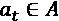
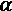
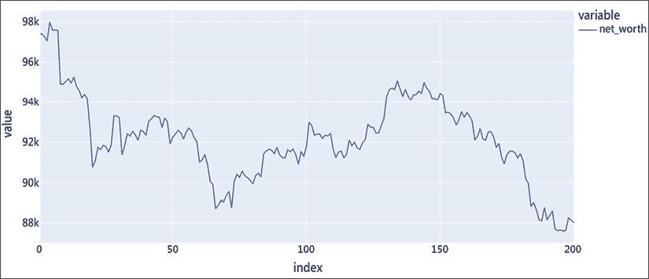

# 第十一章：强化学习在时间序列中的应用

强化学习是一种广泛成功的控制问题和函数优化范式，不需要标注数据。它是一个强大的框架，支持经验驱动的自主学习，其中智能体通过采取行动与环境直接互动，并通过试错来提高效率。自从总部位于伦敦、由谷歌拥有的 DeepMind 在复杂游戏中取得突破以来，强化学习尤其受到关注。

在这一章节中，我们将讨论强化学习（**RL**）在时间序列中的一种分类，特别是经济学中的应用，并将探讨基于 RL 的时间序列模型的准确性和适用性。

我们将从与时间序列相关的强化学习核心概念和算法开始，随后讨论当前深度强化学习模型中的开放问题和挑战。

我将涵盖以下主题：

+   强化学习简介

+   强化学习在时间序列中的应用

+   盗贼算法

+   深度 Q 学习

+   Python 实践

让我们从强化学习的简介和主要概念开始。

# 强化学习简介

强化学习是机器学习的主要范式之一，与监督学习和无监督学习方法并列。一个主要的区别在于，监督学习或无监督学习是被动的，应对变化，而强化学习是主动的，通过改变环境来寻找新数据。实际上，从机器学习的角度来看，强化学习算法可以被视为在寻找好数据和在这些数据上进行监督学习之间交替进行。

基于强化学习的计算机程序一直在突破各类障碍。在人工智能的一个重要时刻，2016 年 3 月，DeepMind 的 AlphaGo 击败了职业围棋选手李世石。此前，围棋被认为是人类创造力和智能的象征，复杂到机器无法学习。

有人认为，它正将我们带向**人工通用智能**（**AGI**）的目标。例如，在他们的论文《奖励就足够》（2021 年）中，David Silver、Satinder Singh、Doina Precup 和 Richard S. Sutton 认为，基于奖励的学习足以获得知识、学习、感知、社交、理解和生成语言、概括以及模仿。他们更加强调地指出，强化学习智能体可能是解决 AGI 的关键。

**人工通用智能**（**AGI**）是指智能体能够理解或学习任何需要智能的智力任务的假设能力。那么，**智能**到底是什么呢？通常，它被定义为人类能够做到或认为困难的任何事物。根据图灵奖得主、计算机科学家 John McCarthy（“*什么是人工智能？*”1998 年）的定义，“*智能是实现世界目标能力的计算部分。*”

在强化学习中，代理通过行动与环境进行互动，并通过奖励的形式获得反馈。与监督学习中的情况相反，强化学习中没有标注数据可用，而是基于累积奖励的期望探索和利用环境。这个行动与奖励的反馈循环在下图中有所说明：


图 11.1：强化学习中的反馈循环

强化学习关注的是奖励最大化的目标。通过与环境的互动，代理获得反馈并学习采取更好的行动。通过优化累积奖励，代理发展出目标导向的行为。

**强化学习**（**RL**）是一种方法，代理通过采取行动与环境直接互动。代理通过试错学习来最大化奖励。

如果你读过*第八章*，*时间序列的在线学习*，你可能会对强化学习和在线学习的区别感到困惑，值得将这两种方法进行比较。一些最著名的强化学习算法，如 Q 学习和时序差分（TD）学习，仅举几个例子，实际上是在线算法，它们通过更新价值函数的方式来进行学习。

然而，强化学习不专注于预测，而是专注于与环境的互动。在**在线学习**中，信息是持续处理的，问题明确地定义为什么是正确的，什么是错误的。而在强化学习中，目标是通过与环境互动优化延迟的奖励。这是两种方法之间的主要区别，尽管每种技术的支持者可能会主张自己有很多细节内容。我们将在本章稍后讨论其中的一些内容，例如探索与利用以及经验回放。

一个强化学习问题由三个主要组成部分定义：环境ε、代理*A*和累积目标。代理是一个决策实体，可以观察环境的当前状态并采取行动。通过执行一个行动 ，代理从一个状态转移到另一个状态，。在特定状态下执行一个行动会为代理提供奖励，这是一个数值评分。奖励是衡量朝目标前进的即时指标。

环境处于某种状态，这个状态依赖于当前状态和采取的行动的某种组合，尽管其中一些变化可能是随机的。代理的目标是最大化累积奖励函数。这个累积奖励目标可以是多个步骤中的奖励总和、折扣总和，或者是随时间变化的平均奖励。

更正式地说，在强化学习的背景下，智能体是一个系统（或程序），它在时间 *t* 接收来自环境的观察 *O*[t]，并根据其经验历史输出一个动作 。

与此同时，环境是另一个系统。它在时间 *t* 接收一个动作 *A*[t]，并根据动作历史、过去的状态以及随机过程  来改变其状态。环境状态在某种程度上对智能体是可访问的，为了简化，我们可以表述为： 。

最后，奖励是一个标量观察值，在每个时间步 *t* 由环境发出，提供给智能体有关它执行得如何的即时反馈。

强化学习智能体的核心是一个模型，它估计环境状态的价值或建议在环境中采取的下一步行动。这是强化学习的两大主要类别：在**基于价值**的学习中，模型通过价值函数（模型）来逼近动作的结果或环境状态的价值，动作选择则简化为采取具有最佳期望结果的动作。在**基于策略**的学习中，我们专注于通过从环境状态预测动作这一更直接的目标来选择动作。

强化学习还有另一个难题：**探索与利用的困境**。你可以决定继续做你知道最有效的事情（利用），或者尝试新的途径（探索）。尝试新事物可能会在短期内导致更差的结果，但可能会教会你一些重要的经验，以后可以加以借鉴。

平衡两者的一种简单方法是**ε-贪心算法**。这是一种通过随机选择探索与利用之间的平衡的简单方法：要么我们遵循模型的建议，要么我们不遵循。Epsilon 是我们做出一个不被模型认为是最佳的动作的概率参数；epsilon 值越高，模型的动作越随机。

**深度强化学习**（**DRL**）技术是强化学习方法的一个子集，其中模型是深度神经网络（或在更宽松的意义上是多层感知器）。

在下一节中，我们将探讨如何将强化学习应用于时间序列！

# 时间序列的强化学习

强化学习（RL）可以并且已经应用于时间序列，但问题必须以特定的方式框定。对于强化学习，我们需要在预测和系统的持续行为（动作）之间有显著的反馈。

为了将强化学习应用于时间序列预测或预测，预测必须基于某种动作，因此状态的演化依赖于当前状态和智能体的动作（以及随机性）。假设，奖励可以是关于预测准确性的性能指标。然而，良好或不良预测的后果不会影响原始环境。实质上，这相当于一个监督学习问题。

更有意义的是，如果我们想将我们的情况框架化为一个强化学习（RL）问题，那么系统的状态应该受到智能体决策的影响。例如，在与股市互动的情况下，我们会根据对市场波动的预测来买入或卖出，并将我们影响的因素（如我们的投资组合和资金）纳入状态，或者（只有当我们是市场制造者时）考虑我们对股票波动的影响。

总结来说，强化学习非常适合处理随时间变化的过程，尽管强化学习处理的是那些可以控制或影响的过程。时间序列的一个核心应用是在工业过程和控制中——事实上，这一点已经在 Box 和 Jenkins 的经典著作《*时间序列分析：预测与控制*》中提到过。

我们可以想到很多强化学习的应用。股市交易是商业增长的主要驱动力，而其中的不确定性和风险使其成为强化学习的一个应用场景。在定价领域，例如保险或零售，强化学习可以帮助探索客户价值主张的空间，从而实现高销售额，并优化利润率。最后，拍卖机制，例如在线广告竞价，是另一个领域。在拍卖中，强化学习智能体必须在其他参与者的存在下开发响应策略。

让我们详细探讨一下几个算法——首先是赌博机问题。

# 赌博机算法

**多臂赌博机**（**MAB**）是一个经典的强化学习问题，其中玩家面临一个老虎机（赌博机），它有*k*个拉杆（臂），每个拉杆都有不同的奖励分布。智能体的目标是在每次试验中最大化其累计奖励。由于多臂赌博机是一个简单但强大的框架，用于在不确定性下做出决策的算法，因此大量的研究文章致力于此问题。

赌博机学习指的是旨在优化一个未知的静态目标函数的算法。智能体从一组动作中选择一个动作！[](img/B17577_11_007.png)。环境在时间*t*时揭示所选动作的奖励！[](img/B17577_11_008.png)。随着信息在多轮中积累，智能体可以建立一个良好的价值（或奖励）分布表示！[](img/B17577_11_009.png)。

因此，一个好的策略可能会收敛，使得选择的臂变得最优。根据一种策略，**UCB1**（由 Peter Auer、Nicolò Cesa-Bianchi 和 Paul Fischer 在 2002 年发布的《*有限时间分析多臂强盗问题*》中提出），在给定每个行动的预期值的情况下，选择能够最大化该标准的行动：


第二项指的是基于我们积累的信息，奖励值的上置信界。这里，*t*表示到目前为止的迭代次数，即时间步长，而表示到目前为止执行行动*a*的次数。这意味着方程中的分子随着时间以对数方式增加，而分母在每次我们从行动中获取奖励信息时都会增加。

当可用的奖励是二元的（赢或输，是或否，收费或不收费）时，这可以用贝塔分布来描述。贝塔分布有两个参数，分别是和，用于表示赢和输。均值是。

在**汤普森采样**中，我们从每个行动（臂）的贝塔分布中采样，并选择具有最高预期回报的行动。随着尝试次数的增加，贝塔分布会变窄，因此那些尝试较少的行动具有较宽的分布。因此，贝塔采样模型估计了均值奖励和估计的置信度。在**狄利克雷采样**中，我们不从贝塔分布中采样，而是从狄利克雷分布中采样（也称为多元贝塔分布）。

**上下文强盗**将环境信息融入其中，用于更新奖励预期。如果你考虑广告，这种上下文信息可能是广告是否与旅行相关。上下文强盗的优点在于，代理可以对环境编码更丰富的信息。

在上下文强盗中，代理选择一个臂，奖励被揭示，代理的奖励预期被更新，但带有上下文特征：，其中*x*是编码环境的一组特征。在许多实现中，上下文通常限制为离散值，但至少在理论上，它们可以是分类的或数值的。价值函数可以是任何机器学习算法，如神经网络（NeuralBandit）或随机森林（BanditForest）。

强盗算法在多个领域中都有应用，包括信息检索模型，如推荐系统和排名系统，这些系统被用于搜索引擎或消费者网站中。**概率排名原则**（PRP；来自 S.E. Robertson 的文章“*信息检索中的概率排名原则*”，1977 年）为概率模型提供了理论基础，而这些模型已经主导了信息检索领域。PRP 指出，文章应该按照相关性概率的递减顺序进行排序。这也是我们将在练习部分中讲解的内容。

现在让我们深入探讨 Q 学习和深度 Q 学习。

# 深度 Q 学习

Q 学习，由 Chris Watkins 于 1989 年提出，是一种学习在特定状态下动作价值的算法。Q 学习围绕表示在给定状态下执行某个动作的期望回报展开。

状态-动作组合的期望回报由 Q 函数近似：


*Q*被初始化为一个固定值，通常是随机的。在每个时间步* t *，智能体选择一个动作，并看到环境的新状态，作为结果并获得回报。

价值函数*Q*可以根据贝尔曼方程更新，作为旧价值和新信息的加权平均值：


权重由表示，学习率——学习率越高，Q 函数越适应。折扣因子通过其即时性对回报进行加权——折扣因子越高，智能体越不耐烦（近视）。

表示当前回报。是通过学习率加权后的获得的回报，而是从状态中获得的加权最大回报。

最后一部分可以递归地分解成更简单的子问题，如下所示：


在最简单的情况下，*Q*可以是一个查找表，称为 Q 表。

2014 年，Google DeepMind 申请了一种名为**深度 Q 学习**的算法的专利。该算法首次在《自然》杂志上的文章“*通过深度强化学习实现人类水平控制*”中提出，并应用于 Atari 2600 游戏。

在深度 Q 学习中，神经网络作为非线性函数逼近器被用于 Q 函数。他们使用卷积神经网络从像素值中学习期望回报。他们引入了一种名为**经验回放**的技术，通过随机抽取先前动作的样本来更新 Q。这是为了减少 Q 更新的学习不稳定性。

Q 学习的大致伪代码如下所示：

```py
import numpy as np
memory = []
for episode in range(N):
  for ts in range(T):
    if eps np.random.random() > epsilon:
      a = A[np.argmax([Q(a) for a in A])]
    else:
      a = np.random.choice(A)
    r, s_next = env.execute(a)
    memory.append((s, a, r, s_next))
    learn(np.random.choice(memory, L) 
```

该库实现了一个 epsilon-贪心策略，其中根据概率`epsilon`做出一个随机（探索性）选择。还假设了其他一些变量。环境句柄`env`允许我们执行一个动作。我们有一个学习函数，通过对 Q 函数应用梯度下降法，根据贝尔曼方程学习更好的值。参数`L`是用于学习的先前值的数量。

内存重放部分显然被简化了。实际上，我们会有一个内存的最大大小，一旦内存达到最大容量，我们就会用新的状态、动作和奖励替换旧的关联。

现在我们将实际操作一下。

# Python 实践

让我们开始建模。我们将从给用户提供一些基于 MAB 的推荐开始。

## 推荐

对于这个例子，我们将收集用户的笑话偏好，并使用这些数据模拟网站上推荐笑话的反馈。我们将使用这些反馈来调整我们的推荐。我们的目标是选择 10 个最好的笑话，展示给访问我们网站的人。这些推荐将由 10 个 MAB 生成，每个 MAB 有与笑话数量相同的臂。

这是从 GitHub 上 Kenza-AI 的`mab-ranking`库中的一个示例改编的。

这是一个方便的库，提供了不同强盗算法的实现。我在该库的分支中简化了库的安装，因此我们将在这里使用我的分支：

```py
pip install git+https://github.com/benman1/mab-ranking 
```

完成后，我们可以直接开始！

我们将从 S3 下载`jester`数据集，其中包含笑话偏好。下载地址如下：

```py
URL = 'https://raw.githubusercontent.com/PacktPublishing/Machine-Learning-for-Time-Series-with-Python/main/chapter11/jesterfinal151cols.csv' 
```

我们将使用 pandas 下载这些数据：

```py
import pandas as pd
jester_data = pd.read_csv(URL, header=None) 
```

我们将做一些外观上的调整。行表示用户，列表示笑话。我们可以让这一点更加清晰：

```py
jester_data.index.name = "users" 
```

选择的编码有点奇怪，所以我们也将修复这一点：

```py
for col in jester_data.columns:
    jester_data[col] = jester_data[col].apply(lambda x: 0.0 if x>=99 or x<7.0 else 1.0) 
```

所以，要么人们选择了笑话，要么他们没有选择任何笑话。我们将去除那些没有选择任何笑话的人：

```py
jester_data = jester_data[jester_data.sum(axis=1) > 0] 
```

我们的数据集现在看起来是这样的：


图 11.2：Jester 数据集

我们将按以下方式设置我们的强盗：

```py
from mab_ranking.bandits.rank_bandits import IndependentBandits
from mab_ranking.bandits.bandits import DirichletThompsonSampling
independent_bandits = IndependentBandits(
    num_arms=jester_data.shape[1],
    num_ranks=10,
    bandit_class=DirichletThompsonSampling
) 
```

我们从 Beta 分布中使用汤普森采样选择独立的强盗。我们推荐最好的 10 个笑话。

然后我们可以开始模拟。我们假设的网站有很多访问者，我们将根据独立强盗选择的笑话展示，并获得反馈：

```py
from tqdm import trange
num_steps = 7000
hit_rates = []
for _ in trange(1, num_steps + 1):
    selected_items = set(independent_bandits.choose())
    # Pick a users choices at random
    random_user = jester_data.sample().iloc[0, :]
    ground_truth = set(random_user[random_user == 1].index)
    hit_rate = len(ground_truth.intersection(selected_items)) / len(ground_truth)
    feedback_list = [1.0 if item in ground_truth else 0.0 for item in selected_items]
    independent_bandits.update(selected_items, feedback_list)
    hit_rates.append(hit_rate) 
```

我们正在模拟 7,000 次迭代（访问）。在每次访问中，我们将根据更新后的奖励预期改变我们的选择。

我们可以按以下方式绘制命中率，以及用户选择的笑话：

```py
import matplotlib.pyplot as plt
stats = pd.Series(hit_rates)
plt.figure(figsize=(12, 6))
plt.plot(stats.index, stats.rolling(200).mean(), "--")
plt.xlabel('Iteration')
plt.ylabel('Hit rate') 
```

我引入了一个滚动平均（基于 200 次迭代），以获得更平滑的图表：


图 11.3：随着时间推移的命中率（Dirichlet 采样）

mab-ranking 库支持上下文信息，因此我们可以尝试提供额外信息。想象这些信息为不同的用户组（队列）。我们可以考虑使用不同搜索或过滤功能的用户，例如我们假设的网站上的 "最新笑话" 或 "最流行"。或者它们可能来自不同的地区。或者它可以是对应用户访问我们网站的时间的时间戳类别。

让我们提供分类用户组信息，即上下文。我们将根据其偏好对用户进行聚类，并将使用这些群集作为上下文：

```py
from sklearn.cluster import KMeans
from sklearn.preprocessing import StandardScaler
scaler = StandardScaler().fit(jester_data)
kmeans = KMeans(n_clusters=5, random_state=0).fit(scaler.transform(jester_data))
contexts = pd.Series(kmeans.labels_, index=jester_data.index) 
```

这创造了 5 个用户组。

我们需要重置我们的强盗：

```py
independent_bandits = IndependentBandits(
    num_arms=jester_data.shape[1],
    num_ranks=10,
    bandit_class=DirichletThompsonSampling
) 
```

然后，我们可以重新进行我们的模拟。现在，我们将提供用户上下文：

```py
hit_rates = []
for _ in trange(1, num_steps + 1):
    # Pick a users choices at random
    random_user = jester_data.sample().iloc[0, :]
    context = {"previous_action": contexts.loc[random_user.name]}
    selected_items = set(independent_bandits.choose(
        context=context
    ))
    ground_truth = set(random_user[random_user == 1].index)
    hit_rate = len(ground_truth.intersection(selected_items)) / len(ground_truth)
    feedback_list = [1.0 if item in ground_truth else 0.0 for item in selected_items]
    independent_bandits.update(selected_items, feedback_list, context=context)
    hit_rates.append(hit_rate) 
```

我们可以再次可视化随时间变化的命中率：


图 11.4：随时间变化的命中率（具有上下文的狄利克雷抽样）

我们可以看到命中率比之前略高。

此模型忽略了在我们假设的网站上推荐笑话的顺序。还有其他模型化排名的强盗实现。

我将留给读者更多地进行探索。一个有趣的练习是创建奖励期望的概率模型。

在接下来的部分中，我们将尝试深度 Q 学习交易机器人。这是一个更复杂的模型，需要更多的关注。我们将把它应用到加密货币交易中。

## 使用 DQN 进行交易

这是基于 TensorTrade 库的教程，我们将在此示例中使用它。TensorTrade 是一个通过强化学习构建、训练、评估和部署稳健交易算法的框架。

TensorTrade 依赖于诸如 OpenAI Gym、Keras 和 TensorFlow 等现有工具，以便快速实验算法交易策略。我们将像往常一样通过 pip 安装它。我们会确保从 GitHub 安装最新版本：

```py
pip install git+https://github.com/tensortrade-org/tensortrade.git 
```

我们还可以安装 `ta` 库，它可以提供对交易有用的额外信号，但在这里我们将其省略。

让我们先完成几个导入：

```py
import pandas as pd
import tensortrade.env.default as default
from tensortrade.data.cdd import CryptoDataDownload
from tensortrade.feed.core import Stream, DataFeed
from tensortrade.oms.exchanges import Exchange
from tensortrade.oms.services.execution.simulated import execute_order
from tensortrade.oms.instruments import USD, BTC, ETH
from tensortrade.oms.wallets import Wallet, Portfolio
from tensortrade.agents import DQNAgent
%matplotlib inline 
```

这些导入涉及（模拟）交易、投资组合和环境的实用程序。此外，还有用于数据加载和将其提供给模拟的实用程序，用于货币转换的常量，最后还有一个深度 Q 代理，它包含一个深度 Q 网络（DQN）。

请注意，matplotlib 的魔术命令 `(%matplotlib inline)` 是为了让 Plotly 图表按预期显示而需要的。

作为第一步，让我们加载一个历史加密货币价格数据集：

```py
cdd = CryptoDataDownload()
data = cdd.fetch("Bitstamp", "USD", "BTC", "1h")
data.head() 
```

这个数据集包含以美元计价的比特币每小时价格。它看起来像这样：


图 11.5：加密货币数据集

我们将添加一个相对强弱指标信号，这是一个用于金融市场的技术指标。它通过比较最近交易周期的收盘价来衡量市场的强弱。我们还将添加一个**移动平均收敛/发散**（**MACD**）指标，它旨在揭示趋势的强度、方向、动量和持续时间的变化。

这两个定义如下：

```py
def rsi(price: Stream[float], period: float) -> Stream[float]:
    r = price.diff()
    upside = r.clamp_min(0).abs()
    downside = r.clamp_max(0).abs()
    rs = upside.ewm(alpha=1 / period).mean() / downside.ewm(alpha=1 / period).mean()
    return 100*(1 - (1 + rs) ** -1)
def macd(price: Stream[float], fast: float, slow: float, signal: float) -> Stream[float]:
    fm = price.ewm(span=fast, adjust=False).mean()
    sm = price.ewm(span=slow, adjust=False).mean()
    md = fm - sm
    signal = md - md.ewm(span=signal, adjust=False).mean()
    return signal 
```

或者，我们也可以使用 `ta` 库中的交易信号。

我们现在将设置进入决策过程的数据流：

```py
features = []
for c in data.columns[1:]:
    s = Stream.source(list(data[c]), dtype="float").rename(data[c].name)
    features += [s]
cp = Stream.select(features, lambda s: s.name == "close") 
```

我们选择了收盘价作为特征。

现在，我们将添加我们的指标作为额外的特征：

```py
features = [
    cp.log().diff().rename("lr"),
    rsi(cp, period=20).rename("rsi"),
    macd(cp, fast=10, slow=50, signal=5).rename("macd")
]
feed = DataFeed(features)
feed.compile() 
```

除了 RSI 和 MACD，我们还添加了一个趋势指标（LR）。

我们可以查看数据流中的前五行：

```py
for i in range(5):
    print(feed.next()) 
```

这是我们交易信号特征的展示：


图 11.6：交易数据流

让我们设置经纪人：

```py
bitstamp = Exchange("bitstamp", service=execute_order)(
    Stream.source(list(data["close"]), dtype="float").rename("USD-BTC")
) 
```

交易所是让我们执行订单的接口。交易所需要一个名称、一个执行服务和价格数据流。目前，TensorTrade 支持使用模拟或随机数据的模拟执行服务。

现在我们需要一个投资组合：

```py
portfolio = Portfolio(USD, [
    Wallet(bitstamp, 10000 * USD),
    Wallet(bitstamp, 10 * BTC)
]) 
```

投资组合可以是交易所支持的任何组合的交易所和工具。

TensorTrade 包含许多监控工具，称为渲染器，可以附加到环境中。例如，它们可以绘制图表（`PlotlyTradingChart`）或记录到文件（`FileLogger`）。这是我们的设置：

```py
renderer_feed = DataFeed([
    Stream.source(list(data["date"])).rename("date"),
    Stream.source(list(data["open"]), dtype="float").rename("open"),
    Stream.source(list(data["high"]), dtype="float").rename("high"),
    Stream.source(list(data["low"]), dtype="float").rename("low"),
    Stream.source(list(data["close"]), dtype="float").rename("close"), 
    Stream.source(list(data["volume"]), dtype="float").rename("volume") 
]) 
```

最后，这就是交易环境，它是 OpenAI Gym 的一个实例（OpenAI Gym 提供了各种各样的模拟环境）：

```py
env = default.create(
    portfolio=portfolio,
    action_scheme="managed-risk",
    reward_scheme="risk-adjusted",
    feed=feed,
    renderer_feed=renderer_feed,
    renderer=default.renderers.PlotlyTradingChart(),
    window_size=20
) 
```

如果你之前做过强化学习，你可能会熟悉 Gym 环境。

让我们查看 Gym 数据：

```py
env.observer.feed.next() 
```

这是输出内容：


图 11.7：交易机器人环境数据流

这是交易机器人将依赖于执行交易决策的依据。

现在我们可以设置并训练我们的 DQN 交易代理：

```py
agent = DQNAgent(env)
agent.train(n_steps=200, n_episodes=2, save_path="agents/") 
```

这里也许是个好机会来解释一下 epoch 和 episode 之间的区别。读者可能会熟悉 epoch，它是对所有训练样本的单次遍历，而 episode 是强化学习中的专有概念。episode 是由一系列状态、动作和奖励组成的序列，以终止状态结束。

我们从渲染器中获得了大量的绘图输出。这是我获得的第一个输出（你的可能会有所不同）：


图 11.8：PlotlyPlotRenderer – Episode 2/2 Step 51/200

这个图展示了我们交易机器人市场操作的概览。第一个子图显示了价格的涨跌。接下来的第二个子图展示了投资组合中的股票交易量，而最底部的子图则显示了投资组合的净资产。

如果你想查看随时间变化的净资产（不仅仅是上面提到的第一张快照），你也可以绘制这个图：

```py
performance["net_worth"].plot() 
```

这是随时间变化的投资组合净资产：



图 11.9：投资组合随时间变化的价值

看起来我们的交易机器人可能需要更多的训练才能在真实市场中投入使用。我亏损了，所以很庆幸没有投入真实资金。

就这些了。让我们总结一下。

# 总结

在线学习，我们在*第八章*中讨论过，*时间序列的在线学习*处理的是传统的监督学习，而强化学习则试图应对环境。在本章中，我介绍了与时间序列相关的强化学习概念，并讨论了许多算法，如深度 Q 学习和**MABs**。

强化学习算法在某些场景下非常有用，比如推荐系统、交易，或者更一般地说，控制场景。在实践部分，我们实现了一个使用 MAB 的推荐系统和一个带有 DQN 的交易机器人。

在下一章，我们将查看带有时间序列的案例研究。除此之外，我们还会看一下多元预测的能源需求。
