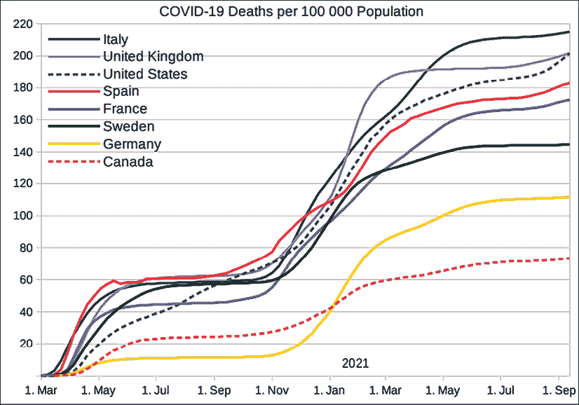
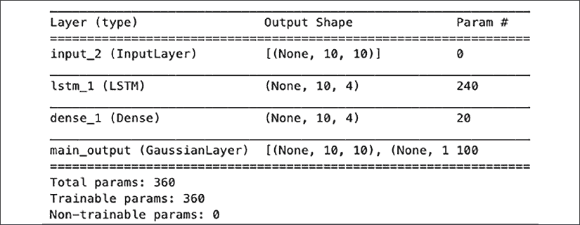
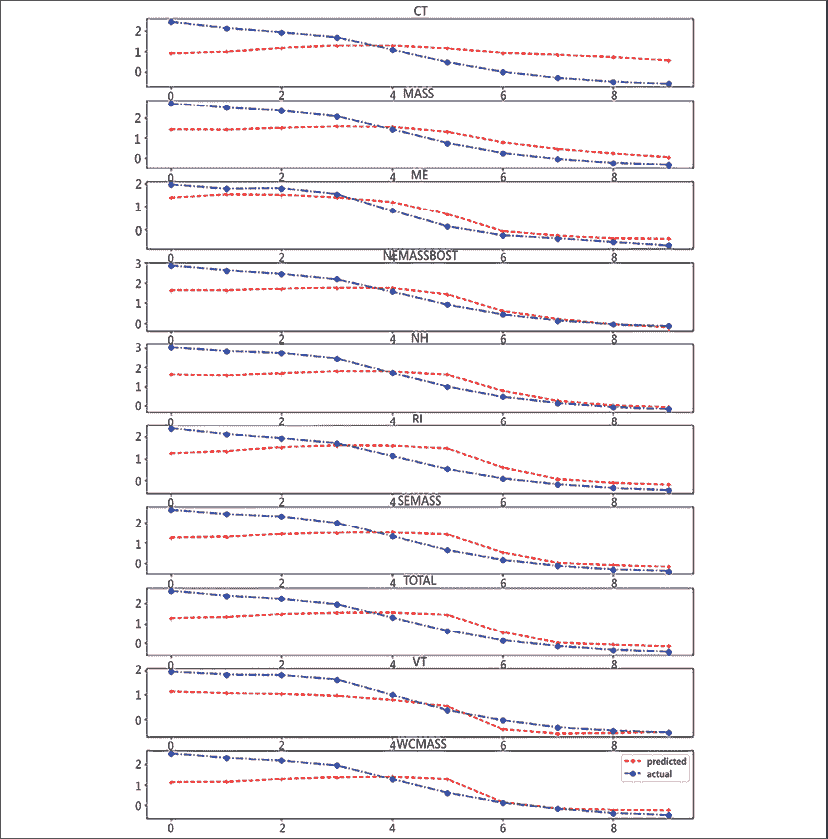
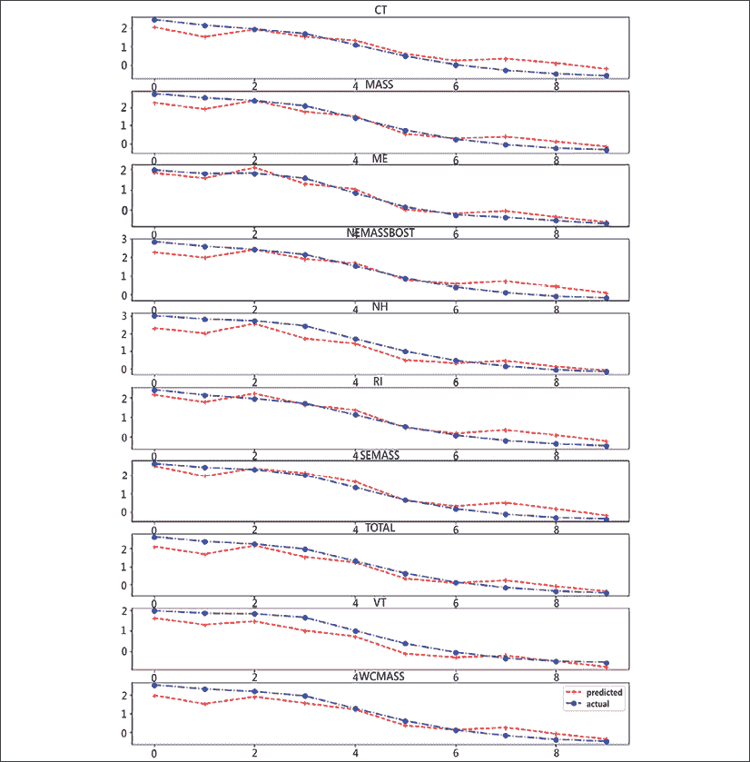
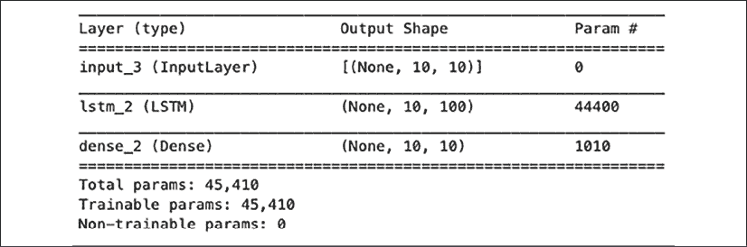
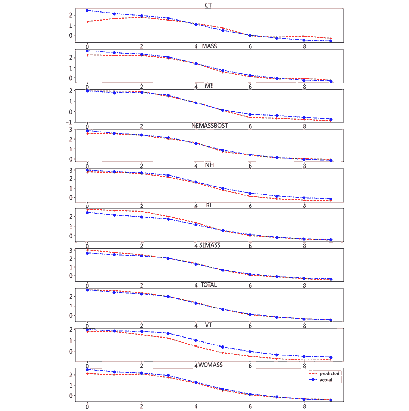
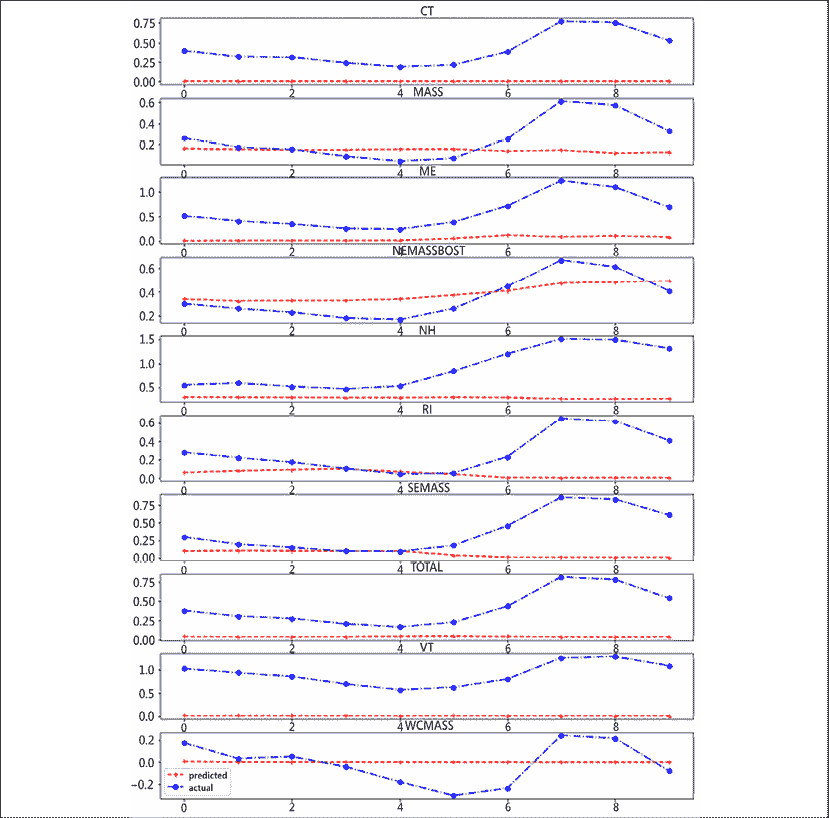
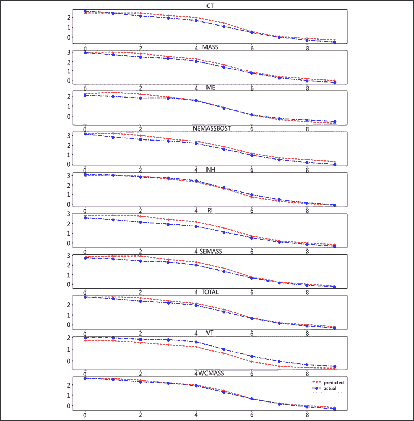

# 第十二章：多变量预测

如果你一直在关注本书，你可能已经注意到，过去十年时间序列领域取得了很多进展。许多扩展和新技术出现，用于将机器学习应用于时间序列。在每一章中，我们涵盖了许多关于预测、异常和漂移检测、回归和分类以及包括传统方法、梯度提升机器学习和其他方法、强化学习、在线学习、深度学习和概率模型的不同问题。

在本章中，我们将更深入地实践一些内容。到目前为止，我们主要涵盖了单变量时间序列，但在本章中，我们将应用预测到能源需求的一个案例。鉴于世界各地持续存在能源或供应危机，这是一个非常及时的主题。我们将使用多变量时间序列，并使用不同的方法进行多步预测。

我们将涵盖以下主题：

+   多变量时间序列预测

+   时间序列的下一步是什么？

第二部分将展望时间序列应用和研究的未来。但首先让我们讨论多变量序列。然后我们将应用几个模型来进行能源需求预测。

# 多变量时间序列预测

时间序列预测是学术界的一个活跃研究课题。预测长期趋势不仅是一项有趣的挑战，而且对于战略规划和运营研究在实际应用中具有重要的影响，例如 IT 运营管理、制造业和网络安全。

多变量时间序列具有多个因变量。这意味着每个因变量不仅依赖于其自身的过去值，还可能依赖于其他变量的过去值。这引入了复杂性，如共线性，其中因变量不是独立的，而是相关的。共线性违反了许多线性模型的假设，因此更有吸引力的是使用能够捕获特征交互作用的模型。

此图显示了一个多变量时间序列的示例，即各国 COVID-19 死亡情况（来自维基百科关于 COVID-19 大流行的英文文章）：



图 12.1：COVID-19 每 10 万人口死亡人数作为多变量时间序列的示例。

各国之间的 COVID 死亡人数存在相关性，尽管它们可能会有所偏移，或者可能属于不同的群体。

我们在*第五章*、*时间序列机器学习简介*中提到过 Makridakis 竞赛。作为主办方的 Spyros Makridakis 是尼科西亚大学的教授，专门研究时间序列预测。这些竞赛作为最佳算法的基准，研究人员和实践者相互竞争，争夺现金奖励。这项竞赛的希望是能够激发并促进机器学习的发展，并为未来的工作开辟方向。

M4 竞赛使用了来自 ForeDeCk 数据库的 100,000 个多变量时间序列，涵盖了不同的应用领域和时间尺度，结果于 2020 年发布。49 个参赛者或团队提交了点预测，测试了主要的机器学习和统计方法的准确性。

M4 的组织者 Spyros Makridakis、Evangelos Spiliotis 和 Vassilios Assimakopoulos 在（"*M4 竞赛：100,000 个时间序列和 61 种预测方法*"，2020 年）中观察到，主要由成熟的统计方法组合（混合或集成）往往比纯统计方法或纯机器学习方法更为准确，后者的表现相对较差，通常位于参赛队伍的后半部分。尽管机器学习方法在解决预测问题中的应用日益增加，但统计方法依然强大，尤其在处理低粒度数据时。不过需要注意的是，数据集未包含外生变量或时间戳。深度学习和其他机器学习方法可能在处理高维数据时表现更好，特别是在共线性存在的情况下，因此这些额外的信息可能会提升这些模型的表现。

然而，来自 Uber Technologies 的 Slawek Smyl 以第一名的成绩获得了 9000 欧元，他的模型结合了递归神经网络和统计时间序列模型（Holt-Winters 指数平滑）。这两个组件是通过梯度下降法同时拟合的。作为一位经验丰富的时间序列专家，Smyl 曾在*2016 年计算智能预测国际时间序列竞赛*中使用递归神经网络获胜。可以说，这个结果表明，机器学习（及深度学习作为一种扩展）与实用主义相结合可以带来成功。

经济学家们长期以来在预测中使用混合模型，例如高斯混合模型或 GARCH 模型的混合。`Skaters`库提供了各种集成功能，也支持 ARMA 及类似模型的集成。你可以在微预测时间序列排行榜上找到不同集成模型的概述：[`microprediction.github.io/timeseries-elo-ratings/html_leaderboards/overall.html`](https://microprediction.github.io/timeseries-elo-ratings/html_leaderboards/overall.html)

在机器学习方面，集成方法，特别是在集成学习中的一种常见方法是训练多个模型，并根据它们的性能对预测结果进行加权。集成学习通过带放回采样来创建训练样本，进而拟合基础模型。袋外（OOB）误差是指在未参与训练集的训练样本上的模型预测误差的均值。

集成模型还可以由不同类型的基础模型组成，这被称为异质集成。Scikit-learn 为回归和分类提供了堆叠方法，最终模型可以根据基础模型的预测，找到加权系数来合并基础模型的预测结果。

在行业中，时间序列分析工作流仍然存在许多痛点。最主要的一个问题是，没有很多软件库支持多变量预测。

截至 2021 年 9 月，尽管它在开发路线图上，Kats 库尚不支持多变量预测（尽管已支持多变量分类）。`statsmodels`库中有`VAR`和`VARMAX`模型；然而，目前没有对多变量时间序列进行季节性去除的支持。

Salesforce 的 Merlion 库声称支持多变量预测，但似乎不在当前功能中。`Darts`库提供了几种适用于多变量预测的模型。

神经网络和集成方法，如随机森林或提升决策树，支持对多变量时间序列进行训练。在*第七章*，*时间序列的机器学习模型*中，我们使用 XGBoost 创建了一个时间序列预测的集成模型。在本书附带的 GitHub 代码库中，我附上了一个笔记本，展示了如何将 scikit-learn 管道和多输出回归器应用于多变量预测。然而，在这一章中，我们将重点介绍深度学习模型。

英国诺里奇东安格利亚大学的 Alejandro Pasos Ruiz 及其同事在他们的论文《*伟大的多变量时间序列分类大比拼：近期算法进展的回顾与实验评估*》（2020 年）中指出，尽管有很多关于单变量数据集的建模，然而多变量应用却被忽视了。这不仅体现在软件解决方案的可用性上，也体现在数据集、以往的竞赛以及研究中。

他们对 UEA 数据集中的 30 个多变量时间序列进行了时间序列分类的基准测试。结果发现，三个分类器比动态时间规整算法（DTW）准确度高得多：HIVE-COTE、CIF 和 ROCKET（有关这些方法的详细信息，请参考*第四章*，*时间序列机器学习简介*）；然而，深度学习方法 ResNet 的表现与这些领先者差距不大。

在 *Hassan Ismail Fawaz* 等人（2019）发表的论文《*用于时间序列分类的深度学习：综述*》中，其中一项基准测试的发现是，一些深度神经网络可以与其他方法竞争。随后他们进一步展示了神经网络集成在相同数据集上的表现与 HIVE-COTE 不相上下（《*深度神经网络集成用于时间序列分类*》，2019）。

*Pedro Lara-Benítez* 等人（2021）在他们的论文《*时间序列预测的深度学习架构实验评审*》中做了另一次比较。他们运行了一个回声状态网络（ESN）、卷积神经网络（CNN）、时间卷积网络（TCN）、一个全连接的前馈网络（MLP），以及几个递归架构，如 Elman 递归网络、门控递归单元（GRU）网络和长短期记忆（LSTM）网络。

从统计学角度来看，基于平均排名，CNN、MLP、LSTM、TCN、GRU 和 ESN 没有显著区别。

总体而言，深度学习模型非常有前景，且由于其灵活性，它们能够填补多变量预测中的空白。我希望在本章中展示它们的实用性。

在本章中，我们将应用以下模型：

+   N-BEATS

+   亚马逊的 DeepAR

+   递归神经网络（LSTM）

+   Transformer

+   时间卷积网络（TCN）

+   高斯过程

我们在 *第十章* 《*时间序列的深度学习*》中已经详细介绍了大部分方法，但我将简要概述每个方法的主要特点。

**可解释时间序列预测的神经基础扩展分析**（**N-BEATS**），该模型在 2020 年 ICLR 大会上展示，相较于 M4 竞赛的冠军模型，提升了 3%的预测精度。作者展示了一种纯深度学习方法，且没有任何时间序列特定组件，能够超越统计方法处理像 M3 和 M4 竞赛数据集及 TOURISM 数据集等具有挑战性的数据集。此方法的另一个优势是其可解释性（尽管我们在本章中不会重点讨论这一点）。

**DeepAR** 是一个来自亚马逊德国研究院的概率自回归递归网络模型。他们比较了三个不同数据集的分位数预测的准确性，并仅与一种因式分解技术（MatFact）在两个数据集（交通和电力）上进行准确性比较。

**长短期记忆网络**（**LSTM**）用于序列建模。像 LSTM 这样的递归神经网络的一个重要优势是它们可以学习长时间序列的数据点。

**Transformer** 是基于注意力机制的神经网络，最初在 2017 年的论文 "*Attention Is All You Need*" 中提出。它们的关键特点是与特征数量呈线性复杂度，并具备长时记忆能力，使我们能够直接访问序列中的任意点。Transformer 相较于循环神经网络的优势在于，它们是并行执行的，而不是按顺序执行，因此在训练和预测中运行速度更快。

Transformer 是为了解决 **自然语言处理**（**NLP**）任务中的序列问题而设计的；然而，它们同样可以应用于时间序列问题，包括预测，尽管这种应用不使用诸如位置编码等更特定于句子的特征。

**时间卷积网络**（**TCN**）由膨胀的、因果的 1D 卷积层组成，具有相同的输入和输出长度。我们使用的是包含残差块的实现，该实现由 Shaojie Bai 等人（2018）提出。

这些方法中的最后一个，**高斯过程**，不能被 convincingly 地归类为深度学习模型；然而，它们等同于一个具有独立同分布先验参数的单层全连接神经网络。它们可以被视为多元正态分布的无限维推广。

一个有趣的附加方面——尽管我们在这里不深入探讨——是许多这些方法允许使用额外的解释性（外生）变量。

我们将使用一个包含不同州的 10 维时间序列能源需求的数据集。该数据集来自 2017 年全球能源预测竞赛（GEFCom2017）。

每个变量记录特定区域的能源使用情况。这突出了长时记忆的问题——为了突出这一点，我们将进行多步预测。

你可以在我为演示目的创建的 GitHub 仓库中找到 `tensorflow/keras` 的模型实现及其数据的工具函数：[`github.com/benman1/time-series`](https://github.com/benman1/time-series)。

让我们直接进入正题。

## Python 实践

我们将加载能源需求数据集，并应用几种预测方法。我们正在使用一个大数据集，并且这些模型有些相当复杂，因此训练可能需要较长时间。我建议你使用 Google Colab 并启用 GPU 支持，或者减少迭代次数或数据集的大小。待会儿在相关时，我会提到性能优化。

首先从上述提到的 GitHub 仓库中安装库：

```py
!pip install git+https://github.com/benman1/time-series 
```

这不应该花费太长时间。由于需求包括 `tensorflow` 和 `numpy`，我建议将它们安装到虚拟环境中。

然后，我们将使用库中的一个工具方法加载数据集，并将其包装在一个 `TrainingDataSet` 类中：

```py
from time_series.dataset.utils import get_energy_demand
from time_series.dataset.time_series import TrainingDataSet
train_df = get_energy_demand()
tds = TrainingDataSet(train_df) 
```

如果你想加速训练，你可以减少训练样本的数量。例如，代替前面的那一行，你可以写：`tds = TrainingDataSet(train_df.head(500))`。

我们稍后会对 `GaussianProcess` 进行操作，它无法处理完整数据集。

对于这些大多数模型，我们将使用 TensorFlow 图模型，这些模型依赖于非 eager 执行。我们必须显式地禁用 eager 执行。此外，对于其中一个模型，我们需要设置中间输出以避免 TensorFlow 问题：`Connecting to invalid output X of source node Y which has Z outputs`：

```py
from tensorflow.python.framework.ops import disable_eager_execution
import tensorflow as tf
disable_eager_execution()  # for graph mode
tf.compat.v1.experimental.output_all_intermediates(True) 
```

我已经设置了我们将用于所有生成的预测的指标和绘图方法。我们可以直接从时间序列库加载它们：

```py
from time_series.utils import evaluate_model 
```

我们还将训练中的 epoch 数设置为 `100` ——每个模型都相同：

```py
N_EPOCHS = 100 
```

如果你发现训练时间过长，你可以将此值设置为更小的值，以便训练更早结束。

我们将依次介绍不同的预测方法，首先是`DeepAR`：

```py
from time_series.models.deepar import DeepAR
ar_model = DeepAR(tds)
ar_model.instantiate_and_fit(verbose=1, epochs=N_EPOCHS) 
```

我们将看到模型的总结，然后是训练误差随时间的变化（此处省略）：



图 12.2：DeepAR 模型参数。

这个模型相对简单，正如我们所见：只有 `360` 个参数。显然，我们可以调整这些参数并添加更多。

然后我们将在测试数据集上生成预测：

```py
y_predicted = ar_model.model.predict(tds.X_test)
evaluate_model(tds=tds, y_predicted=y_predicted,
    columns=train_df.columns, first_n=10) 
```

我们将查看误差——首先是总体误差，然后是每个 `10` 维度的误差：

```py
MSE: 0.4338
----------
CT: 0.39
MASS: 1.02
ME: 1.13
NEMASSBOST: 1.48
NH: 1.65
RI: 1.48
SEMASS: 1.65
TOTAL: 1.45
VT: 1.23
WCMASS: 1.54 
```

我们将看到前`10`个时间步的图表：



图 12.3：DeepAR 对 10 个时间步的预测。

让我们继续下一个方法：N-BEATS：

```py
from time_series.models.nbeats import NBeatsNet
nb = NBeatsNet(tds)
nb.instantiate_and_fit(verbose=1, epochs=N_EPOCHS)
y_predicted = nb.model.predict(tds.X_test)
evaluate_model(tds=tds, y_predicted=y_predicted,
    columns=train_df.columns, first_n=10) 
```

N-BEATS 训练两个网络。前向网络有 `1,217,024` 个参数。

让我们看看预测结果：



图 12.4：N-BEATS 预测。

接下来是 LSTM：

```py
from time_series.models.LSTM import LSTM
lstm = LSTM(tds)
lstm.instantiate_and_fit(verbose=1, epochs=N_EPOCHS)
y_predicted = lstm.model.predict(tds.X_test)
evaluate_model(tds=tds, y_predicted=y_predicted,
    columns=train_df.columns, first_n=10) 
```

这个模型比 DeepAR 需要更多的参数：



图 12.5：LSTM 模型参数。

`45,000` 个参数——这意味着训练时间比 `DeepAR` 更长。

在这里我们再次看到预测：



图 12.6：LSTM 预测。

让我们做一下 Transformer：

```py
trans = Transformer(tds)
trans.instantiate_and_fit(verbose=1, epochs=N_EPOCHS)
y_predicted = trans.model.predict(tds.X_test)
evaluate_model(tds=tds, y_predicted=y_predicted,
    columns=train_df.columns, first_n=10) 
```

这是预测图：



图 12.7：Transformer 预测。

这个模型训练非常长，且性能是所有模型中最差的。

我们的最后一个深度学习模型是 TCN：

```py
from time_series.models.TCN import TCNModel
tcn_model = TCNModel(tds)
tcn_model.instantiate_and_fit(verbose=1, epochs=N_EPOCHS)
print(tcn_model.model.evaluate(tds.X_test, tds.y_test))
y_predicted = tcn_model.model.predict(tds.X_test)
evaluate_model(tds=tds, y_predicted=y_predicted, columns=train_df.columns, first_n=10 
```

预测结果如下：



图 12.8：TCN 预测。

不幸的是，高斯过程无法处理我们的数据集——因此，我们只加载了一小部分。高斯过程还依赖于即时执行，因此我们需要重新启动内核，重新导入库，然后执行这段代码。如果你不确定如何操作，请查看本书 GitHub 代码库中的`gaussian_process`笔记本。

继续往下看：

```py
from time_series.models.gaussian_process import GaussianProcess
tds2d = TrainingDataSet(train_df.head(500), train_split=0.1, two_dim=True)
gp = GaussianProcess(tds2d)
gp.instantiate_and_fit(maxiter=N_EPOCHS)
y_predicted = gp.predict(tds2d.X_test)[0].numpy().reshape(-1, tds.dimensions, tds.n_steps)
evaluate_model(tds=tds, y_predicted=y_predicted,
    columns=train_df.columns, first_n=10) 
```

预测结果如下：


图 12.9：高斯过程预测。

所有算法（除了高斯过程）都是在`99336`个数据点上训练的。如前所述，我们将训练轮次设为`100`，但是有一个早停规则，如果训练损失在`5`次迭代内没有变化，训练就会停止。

这些模型是在测试集上验证的。

让我们来查看统计数据：

|  | 参数 | MSE（测试） | 轮次 |
| --- | --- | --- | --- |
| DeepAR | 360 | 0.4338 | 100 |
| N-BEATS | 1,217,024 | 0.1016 | 100 |
| LSTM | 45,410 | 0.1569 | 100 |
| Transformer | 51,702 | 0.9314 | 55 |
| TCN | 145,060 | 0.0638 | 100 |
| 高斯过程 | 8 | 0.4221 | 100 |
| ES | 1 | 11.28 | - |

鉴于深度学习方法之间存在巨大的误差差异，可能是变换器的实现出了问题——我将在某个时刻尝试修复它。

我已经将一个基准方法——**指数平滑法**（**ES**）加入了模型中。你可以在时间序列代码库中找到这部分代码。

这为本章和整本书画上了句号。如果你想更好地理解背后的原理，可以查看代码库，你也可以调整模型参数。

# 时间序列的未来是什么？

在本书中，我们已探讨了时间序列的许多方面。如果你能读到这里，你应该已经学会了如何分析时间序列，以及如何应用传统的时间序列预测方法。这通常是市场上其他书籍的主要内容；然而，我们超越了这些。

我们探讨了与机器学习相关的时间序列预处理和转换方法。我们还查看了许多应用机器学习的实例，包括无监督和有监督的时间序列预测、异常检测、漂移检测和变更点检测。我们深入研究了在线学习、强化学习、概率模型和深度学习等技术。

在每一章中，我们都在探讨最重要的库，有时甚至是前沿的技术，最后，我们还涉及了广泛的工业应用。我们探讨了最先进的模型，如 HIVE-COTE、预处理方法如 ROCKET、适应漂移的模型（自适应在线模型），并回顾了多种异常检测方法。

我们甚至探讨了使用多臂赌博机在时间序列模型之间切换的场景，或者通过反事实进行因果分析的情景。

由于其普遍性，时间序列建模和预测在多个领域至关重要，并具有很大的经济意义。尽管传统和成熟的方式一直占主导地位，但时间序列的机器学习仍是一个相对较新的研究领域，刚刚走出其初期阶段，深度学习正处于这一革命的最前沿。

对于优秀模型的寻找将持续进行，并扩展到更大的新挑战。正如我在本章前面的部分希望展示的那样，其中一个挑战就是使多变量方法更具实用性。

下一届 Makridakis 竞赛 M5，聚焦沃尔玛提供的层次时间序列（42,000 个时间序列）。最终结果将在 2022 年发布。机器学习模型在时间序列的层次回归上表现出色，超越了一些文献中的成熟模型，正如*Mahdi Abolghasemi*等人（"*机器学习在时间序列层次预测中的应用*," 2019）在一个包含 61 组具有不同波动性的时间序列的基准测试中所展示的那样。混合效应模型（应用于组和层次）在时间序列预测中也是一个活跃的研究领域。

M6 比赛涉及实时财务预测，包括 S&P500 美国股票和国际 ETF。未来的比赛可能会聚焦于非线性问题，如黑天鹅事件、具有厚尾的时间序列，以及对风险管理和决策至关重要的分布。


[packt.com](http://packt.com)

订阅我们的在线数字图书馆，全面访问超过 7000 本书籍和视频，以及帮助你规划个人发展并推进职业生涯的行业领先工具。欲了解更多信息，请访问我们的网站。

# 为什么要订阅？

+   利用来自 4000 多名行业专家的实用电子书和视频，减少学习时间，增加编码时间。

+   通过特别为你制定的技能计划学习得更好

+   每月免费获得一本电子书或视频

+   完全可搜索，便于快速访问关键信息

+   复制和粘贴、打印及收藏内容

你知道 Packt 为每本出版的书提供电子书版本，并且有 PDF 和 ePub 文件可供选择吗？你可以在 [www.Packt.com](http://www.Packt.com) 升级到电子书版本，作为纸质书客户，你有权获得电子书折扣。详情请通过 [customercare@packtpub.com](http://customercare@packtpub.com) 联系我们。

在 [www.Packt.com](http://www.Packt.com)，你还可以阅读一系列免费的技术文章，注册各种免费的电子通讯，并获得 Packt 图书和电子书的独家折扣和优惠。

# 你可能喜欢的其他书籍

如果你喜欢这本书，可能对 Packt 出版的这些其他书籍感兴趣：


**学习 Python 编程（第三版）**

法布里齐奥·罗马诺

Heinrich Kruger

ISBN: 978-1-80181-509-3

+   在 Windows、Mac 和 Linux 上启动和运行 Python

+   在任何情况下编写优雅、可重用且高效的代码

+   避免常见的陷阱，如重复、复杂的设计和过度工程化

+   理解何时使用函数式编程或面向对象编程的方法

+   使用 FastAPI 构建简单的 API，并使用 Tkinter 编写 GUI 应用程序

+   了解更复杂的主题，如数据持久化和加密学的初步概述

+   获取、清洗和操作数据，高效利用 Python 的内建数据结构


**Python 面向对象编程 – 第四版**

Steven F. Lott

Dusty Phillips

ISBN: 978-1-80107-726-2

+   通过创建类并定义方法，在 Python 中实现对象

+   使用继承扩展类的功能

+   使用异常处理不寻常的情况，保持代码的清晰

+   理解何时使用面向对象的特性，更重要的是，何时不使用它们

+   探索几种广泛使用的设计模式及其在 Python 中的实现方式

+   揭开单元测试和集成测试的简单性，并理解它们为何如此重要

+   学会静态检查你的动态代码类型

+   理解使用 asyncio 处理并发性以及它如何加速程序


**专家 Python 编程 – 第四版**

Michał Jaworski

Tarek Ziadé

ISBN: 978-1-80107-110-9

+   探索设置可重复且一致的 Python 开发环境的现代方法

+   高效地打包 Python 代码供社区和生产使用

+   学习 Python 编程的现代语法元素，如 f-strings、枚举和 lambda 函数

+   通过元类揭开 Python 元编程的神秘面纱

+   编写 Python 中的并发代码

+   使用 C 和 C++ 编写的代码扩展和集成 Python

# Packt 正在寻找像你这样的作者

如果你有兴趣成为 Packt 的作者，请访问 [authors.packtpub.com](http://authors.packtpub.com) 并立即申请。我们与成千上万的开发者和技术专业人士合作，帮助他们与全球技术社区分享见解。你可以提交一般申请，申请我们正在招聘作者的特定热门话题，或者提交自己的想法。

# 分享你的想法

现在你已经完成了 *《Python 时间序列机器学习》*，我们很想听听你的想法！如果你从 Amazon 购买了这本书，请 [点击这里直接进入 Amazon 的评论页面](https://packt.link/r/1801819629) 来分享你的反馈或留下评论。

你的评论对我们和技术社区非常重要，将帮助我们确保提供优质的内容。

索引

A

激活函数 264

激活函数 266

AdaBoost 101

自适应学习 222

方法 222

自适应 XGBoost 222

ADWIN（自适应窗口） 220

智能体 98

赤池信息量准则（AIC） 140

赤池信息量准则（AIC） 156

AlexNet 265

亚马逊 169

anaconda 文档

参考链接 22

年金 7

异常检测 95, 164, 165, 166, 167, 168, 178, 179, 180

亚马逊 169

Facebook 170

Google Analytics 169

实现 170, 171, 172

微软 168, 169

Twitter 170

Anticipy 146

应用统计学 17

ARCH（自回归条件异方差） 143

曲线下面积 115

人工通用智能（AGI） 298

天文学 11, 12

自相关 58, 59

自编码器（AEs） 272, 273

自动特征提取 88, 89

自回归（AR） 135, 136

自回归条件异方差（ARCH） 146

自回归积分滑动平均（ARIMA）129

自回归积分滑动平均模型（ARIMA） 138

自回归模型 135

自回归滑动平均（ARMA）137

B

反向预测 95

反向传播 99，103，264

包袋法 100，101

与提升方法相比 102

模式包（BoP）122

模式包（BOP）123

SFA 符号包（BOSS）122

强盗算法 302，303

基础学习器 100

贝叶斯信息准则（BIC）140

贝叶斯结构时间序列（BSTS）模型 236，242，243，244

实现，使用 Python 256，257，259

生物学 10

提升法 100

自举法 101

向量空间中的 BOSS（BOSS VS）122

Box-Cox 变换 72，81，82

工作日

提取，按月 88

C

C4.5 算法 100

电缆理论 263

典型区间森林（CIF）121

CART 算法（分类与回归树）100

因果滤波器 74

细胞 265

中心极限定理 12

应用数学中心（CMAP）129

变点检测（CPD）172，173，174，175，176，180，181，182

经典模型 132，133

ARCH（自回归条件异方差）143

自回归（AR）134，135，136

GARCH（广义 ARCH）144

模型选择 139

移动平均（MA）134

顺序 139, 140

向量自回归模型 144, 145

分类 95, 97, 113

聚类 95, 176, 177

决定系数 107, 108

共线性 50

复杂细胞 265

概念漂移 217

conda 22

置信区间 45

混淆矩阵 114

上下文博弈 303

列联表 220

连续时间马尔可夫链 (CTMC) 239

ConvNets 276

卷积神经网络 (CNN) 322

卷积神经网络 (CNN) 77

相关性热图 53

相关性矩阵 52

相关比率 115, 116

协变量漂移 217

临界差异 (CD) 图 119

交叉验证 105

交叉验证准确度加权概率集成 (CAWPE) 124

曲线拟合 94

循环变化 56

D

DataFrame 30

数据预处理

关于 68, 69

数据预处理，技术

特征工程 68

特征变换 68

数据集漂移 216

与日期和时间相关的特征 75

日期注释 85, 86

日期时间 39, 40, 41

决策树 100

解码器 273

DeepAR 236, 274

DeepAR 模型 325, 326

深度学习 261, 262

深度学习方法

类型学 268

深度学习，应用于时间序列 269, 270, 271

深度 Q 学习 303, 304, 305

深度 Q 网络（DQN）311

深度强化学习（DRL）301

DeepState 236

人口统计学 6, 7, 8, 9

树突 263

描述性分析 36

差分 138

膨胀因果卷积神经网络 292, 293, 294, 295

狄利克雷采样 303

离散时间马尔可夫链（DTMC）239

基于距离的方法 118

dl-4-tsc 271

漂移 216, 217, 218, 219

概念漂移 217

协变量漂移 217

概率漂移 217

漂移检测 224, 225

方法 219, 220, 222

漂移检测方法（DDM）220

漂移转换 216

随机失活 282

动态时间规整

在 K 近邻算法中的使用 189

动态时间规整（DTW）116

动态时间规整（DTW）118, 270

动态时间规整

K 近邻算法，使用 Python 193, 194, 195

E

提前停止 282

回声状态网络（ESN）322

ECL（电力消耗负载）279

经济学 13, 14

弹性集成（EE）124

心电图（ECG）118

脑电图（EEG）118

脑电图（EEG）16, 17, 60

电子数值积分器和计算机（ENIAC）15, 16

编码器 273

epsilon-greedy 301

错误指标

时间序列 106

ETT（电力变压器温度）279

欧几里得距离 116

经验重放技术 304

探索与开发困境 301

探索性分析 36

探索性数据分析（EDA）36

指数平滑 140, 141, 142

指数平滑（ES）269, 275, 335

指数平滑模型 157, 158

用于创建预测 157

极端学生化偏差（ESD）170

F

Facebook 170

虚警率 115

假阴性（FN）115

假阳性率（FPR）115

假阳性（FP）115

特征工程 68

关于 74, 75

日期和时间相关特征 75

ROCKET 特征 76, 77

形状特征 77

特征泄漏 49

特征变换 68

关于 69

填充 73

对数变换 71

幂变换 71

缩放 70

前馈传播 264

滤波器 76

预测

创建，使用指数平滑模型 156

预测误差 107

预测 95

预测 6

全连接前馈神经网络 98

全连接网络 281, 282, 283, 284, 285, 286, 288

全连接网络（FCNs） 273

全卷积神经网络（FCN） 273

模糊建模 240, 241, 242

模糊集理论 240

模糊时间序列

用 Python 实现 252, 253, 254, 255, 256

G

GARCH（广义 ARCH） 144

门控递归单元（GRU） 323

高斯过程 333, 334

高斯过程（GP） 271

广义加法模型（GAM） 129, 170, 238

广义线性模型（GLM） 19

广义线性模型（GLM） 129

广义随机形状森林（gRFS） 119

生成对抗网络（GANs） 261

全局最大池化 77

全球温度时间序列

参考链接 57

Gluon-TS 271

Google Analytics 169

梯度提升回归树（GBRT） 191

梯度提升树

实现 102

梯度提升 102, 191, 192, 199, 200, 201, 202, 203, 204

梯度提升机（GBM） 191

格兰杰因果关系 117

图形处理单元（GPUs） 265

H

异质集成 321

隐马尔可夫模型（HMM） 239

基于变换的集成模型的层次投票集成（HIVE-COTE）123

HIVE-COTE（基于变换的集成模型的层次投票集成）270

Hoeffding 树 215

留出法 212

节假日特征 83，84，85

霍尔茨-温特斯法（Holtz-Winters method） 142

I

识别函数 266

插补 82，83

插补技术 73

InceptionTime 273，274

推理 96

Informer 278，279

集成开发环境（IDE）27

集成 138

四分位间距 45

J

JupyterLab 26，27

Jupyter Notebook 26

K

K 臂赌博机 212

Kats 安装 205，206，207

核函数 76

K 近邻

使用动态时间规整 189

使用动态时间规整的 Python 193，194，195

L

标签漂移 217

最小二乘算法 144

最小二乘法 12

赖斯法则（lex parsimoniae）139

库

安装 22，23，25

寿命表 7

Light Gradient Boosting Machine（LightGBM）191

线性四率 220

线性回归（LR）238

折线图 51

对数变换 71，82

对数变换 78，79，81

长短期记忆（LSTM）103，265

长短期记忆（LSTM）323，329

长短期记忆模型（LSTM）269

损失函数 106

M

机器学习 93, 98

历史 98, 99

时间序列 94

工作流 103, 104, 105

机器学习算法

时间序列 117

查询时间与准确度 124, 125

机器学习方法

时间序列 186, 187

脑磁图（MEG）118

马尔可夫假设 239

马尔可夫性 239

马尔可夫模型 239

隐马尔可夫模型（HMM）239

实现，使用 Python 251, 252

马尔可夫过程 239

马尔可夫属性 239

马尔可夫切换模型

实现，使用 Python 248, 249, 250

最大似然估计（MLE）139

最大池化 77

平均值 44

平均绝对误差（MAE）109, 110, 228

平均绝对百分比误差（MAPE）238

平均百分比误差（MAPE）111

平均相对绝对误差（MRAE）108, 113

均方误差（MSE）109, 110

均方误差（MSE）229

中位数 45

中位数绝对偏差（MAD）165

中位数绝对误差（MdAE）111

医学 16, 17

气象学 14

指标 106

微观预测时间序列排行榜

参考链接 321

微软 168

MINIROCKET 119, 120

最小-最大缩放 70

基于模型的插补 73

建模

在 Python 中 148, 149, 150, 151, 152, 153, 154, 155

模型选择 139, 230, 231, 232

模型堆叠 74

单调性 71

移动平均 134

移动平均 (MA) 129, 238

MrSEQL 123

多臂老虎机 212

多臂老虎机 (MAB) 302

多层感知器 (MLP) 238

乘法季节性 142

多元分析 38

多元时间序列 4

多元时间序列

预测 320, 321, 322, 323, 324

多元时间序列分类

临界差异图 127

多元时间序列 (MTS) 273

多元无监督符号与导数 123

N

自然语言处理 (NLP) 269

N-BEATS 275

最近邻算法 99

可解释时间序列预测的神经基础扩展分析 (N-BEATS) 323, 327

神经突 262

神经元 262, 263, 264

非线性方法 70

标准化均方误差 (NMSE) 112

标准化回归指标 112

NumPy 28, 29

O

目标函数 98

离线学习 210

与在线学习 210, 211 相对

在线算法 213, 214, 215

在线学习 210

使用案例 210

对比离线学习 210, 211

在线均值 213

在线方差 213

我们的数据世界（OWID）46

异常检测 95

袋外（OOB）误差 321

样本外测试 105

P

pandas 30, 31, 41, 42, 43

发薪日

获取 86

Pearson 相关系数 50

百分位数 45

感知机 98, 264

感知机模型 264

周期图 64

分段聚合近似（PAA）121

pip 25

Pmdarima 146

基于策略的学习 300

正比例值（PPV）77

幂函数 71

幂变换 78, 79, 81

Box-Cox 变换 72

Yeo-Johnson 变换 72

幂变换 71

精度 114

预测 96

预测误差 107

前瞻性评估 212

主成分分析（PCA）272

概率库 237

概率模型 236

时间序列 236

概率 235

概率漂移 217

概率排序原则（PRP）303

Prophet 模型 236, 237

预测模型 237, 238

实现，在 Python 中 245, 246, 247

邻近森林 (PF) 121

修剪的精确线性时间 (Pelt) 174

pytest 文档

参考链接 33

Python

最佳实践 31, 32

用于时间序列 18, 19, 21, 22

建模 148, 149, 150, 151, 152, 153, 154, 155

实践 177

Python 练习 245

关于 192

BSTS 模型，实现 256, 257, 258, 259

模糊时间序列模型，实现 252, 253, 254, 255, 256

梯度提升 199, 200, 201, 202, 203, 204

Kats 安装 205, 206, 207

K-近邻，带有动态时间规整 193, 194, 195

马尔可夫切换模型，实现 248, 249, 250, 251, 252

Prophet 模型，实现 245, 246, 247

Silverkite 195, 197, 198, 199

虚拟环境 192, 193

Python 库 145

datetime 39, 40, 41

pandas 41, 42, 43, 44

要求 39

Statsmodels 146, 147

Python 实践

关于 305

异常检测 178, 179, 180

变化点检测 (CPD) 180, 181, 182

推荐系统 305, 306, 307, 308, 309, 310

要求 177

使用 DQN 的交易 310, 311, 312, 313, 314, 315, 316, 317

Python 实践 223

Pytorch-forecasting 271

Q

分位数变换 73

四分位数 45

R

随机森林 102

随机区间特征 (RIF) 124

随机区间谱集成 (RISE) 124

召回 114

接收者操作特征曲线 (ROC) 115

循环神经网络 289, 290, 291

循环神经网络 (RNNs) 275

回归 95, 97, 107, 225, 226, 228, 229

正则化贪心森林 (RGF) 191

强化学习 95, 98

强化学习 96

强化学习 (RL)

关于 298, 299, 301

对时间序列 301

R 错误（RE） 108

残差 107

残差平方和 107

ResNets 266

River 库 214

ROCKET 119

ROCKET 特征 76, 90, 91

均方根误差（RMSE） 109, 110, 238

均方根偏差（RMSD） 110

均方根对数误差（RMSLE） 113

运行图 51

S

尺度不变特征（SIFT） 118

缩放方法 70

散点图 54

scikit-learn 214

scikit-learn 项目

参考链接 33

SciPy 28

季节

获取特定日期的数据 87

季节性 ARIMA（SARIMA） 238

季节性自回归（SAR） 138

季节性自回归整合滑动平均模型（SARIMA） 138

季节性 56

识别 56, 57, 58, 59, 60, 61, 63, 64

季节性滑动平均（SMA） 139

分割 95

自组织映射（SOM）242

敏感度 114

SEQL 123

形状元件 78, 91

优势 78

形状元件 119

形状元件变换分类器（STC） 119

Silverkite 195, 197, 198, 199

Silverkite 算法 190, 191, 236

简单细胞 265

简单指数平滑（SES）140, 141, 142, 143

简单移动平均 134

跳跃连接 266

Sktime-DL 271

斯皮尔曼等级相关系数 56

标准差 44

标准误差（SE）45

平稳性 6, 56, 136, 137

平稳过程 136

平稳过程 56

Statsmodels 146, 147

Statsmodels 库

用于建模时 147

结构化查询语言（SQL）30

PEP 8 风格指南

参考链接 32

日照小时数

获取，针对特定日期 87

监督算法，用于回归和分类

实现 128, 129

监督学习 96, 97

支持向量机（SVMs）103, 271

悬浮颗粒物（SPM）55

符号聚合近似（SAX）121

符号傅里叶近似（SFA）122

对称平均绝对百分比误差（SMAPE）111

突触 263

T

时间卷积网络（TCN）276, 322, 331, 333

时间字典集成（TDE）124

时间差分（TD）学习 299

时间融合变换器（TFT）278

泰尔 U 指数 113

Theta 方法 141

汤普森采样 303

时间序列 3

特征 4, 5

比较 116

机器学习方法，使用 186, 187

使用 Python 时 38

时间序列 335, 336

参考链接 324

强化学习（RL）301

无监督方法 162, 163, 164

时间序列 6

离线学习 210

在线学习 210

时间序列分析 6

时间序列分析（TSA）36, 37, 38

时间序列分类算法

临界差异图 126, 127

异构与集成嵌入森林的时间序列组合（TS-CHIEF）121

时间序列数据

示例 2

时间序列数据 2

时间序列数据集 94

时间序列预测 97

时间序列森林（TSF）120

时间序列机器学习算法

详细分类法 125, 126

时间序列机器学习飞轮 38

时间序列回归 107

transformer 330, 331

transformer 架构 277

趋势 56

识别 56, 57, 58, 59, 60, 61, 62, 63

三重指数平滑 142

真阳性率 114

真阳性率（TPR）115

真阳性（TP）115

Twitter 170

U

东安格利亚大学（UAE）118

UCR（加利福尼亚大学河滨分校）118

单元插补 73, 82

单变量分析 38

单变量系列 4

米纳斯吉拉斯联邦大学（UFMG）252

无监督学习 96, 97

无监督方法

时间序列 162, 163, 164

V

验证 187, 188

基于值的学习 300

变量 44, 45, 46, 47, 48, 49

关系 49, 50, 52

向量自回归模型 144, 145

向量自回归（VAR）129

向量自回归（VAR）133

非常快速决策树（VFDT）215

虚拟环境 193

W

滚动前进验证 188

弱学习器 100

WEASEL+MUSE123

基于窗口的特征 75

Wold 的分解 137

时间序列分类的词提取 123

Y

Yeo-Johnson 变换 72

Z

Z-score 标准化 70

# 索引
