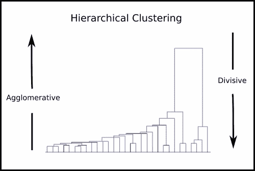
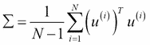

# 第二章。无监督机器学习

如我们在第一章中所见，*使用 Python 的实用机器学习介绍*，无监督学习旨在提供关于未标记数据的洞察性信息。在许多情况下，大数据集（无论是点的数量还是特征的数量）都是非结构化的，并且一开始并不呈现任何信息，因此这些技术被用来突出数据中的隐藏结构（聚类）或在不丢失相关信息的情况下降低其复杂性（降维）。本章将重点关注主要的聚类算法（本章的第一部分）和降维方法（本章的第二部分）。通过提供使用 Python 库的实用示例来突出显示这些方法的差异和优势。所有代码都将可在作者的 GitHub 个人资料中找到，在[`github.com/ai2010/machine_learning_for_the_web/tree/master/chapter_2/`](https://github.com/ai2010/machine_learning_for_the_web/tree/master/chapter_2/)文件夹中。我们现在将开始描述聚类算法。

# 聚类算法

聚类算法被用于以某种有序的方式重新组织数据，以便可以推断出有意义的结构。一个簇可以被定义为具有某些相似特征的数据点集合。量化数据点相似度的方法决定了聚类的不同类别。

聚类算法可以根据数据操作的不同度量或假设被划分为不同的类别。我们将讨论目前最相关的类别，这些类别包括分布方法、质心方法、密度方法和层次方法。对于每个类别，我们将详细介绍一个特定的算法，并且我们将首先讨论分布方法。将讨论一个示例来比较不同的算法，并且 IPython 笔记本和脚本都可在我的 GitHub 书籍文件夹中找到，链接为[`github.com/ai2010/machine_learning_for_the_web/tree/master/chapter_2/`](https://github.com/ai2010/machine_learning_for_the_web/tree/master/chapter_2/)。

## 分布方法

这些方法假设数据来自某种分布，并且使用期望最大化算法来找到分布参数的最优值。接下来将讨论期望最大化和高斯聚类的混合。

### 期望最大化

此算法用于寻找依赖于隐藏（未观测）变量的参数分布模型的最大似然估计。期望最大化包括迭代两个步骤：**E 步骤**，它创建使用当前参数值评估的**对数似然**函数，以及**M 步骤**，在此步骤中计算新的参数值，以最大化 E 步骤的对数似然。

考虑一个包含 *N* 个元素，*{x^((i)) }i = 1,…,N*，和一个数据集上的对数似然如下：


在这里，*θ* 代表参数集，而 *z^((i))* 是所谓的隐藏变量。

我们希望找到最大化对数似然参数值，而不了解 *z^((i))*（未观测变量）的值。考虑一个关于 *z^((i))* 的分布，以及 *Q(z^((i)) )*，例如。因此：


这意味着 *Q(z^((i)) )* 是给定 *x^((i))* 参数化的 *θ* 的隐藏变量 *z^((i))* 的后验分布。期望最大化算法来自 Jensen 不等式的使用，并确保执行以下两个步骤：

1.  

1.  

对数似然收敛到最大值，因此找到了相关的 *θ* 值。

### 高斯混合

此方法使用高斯分布的混合来模拟整个数据集。因此，簇的数量将作为混合中考虑的高斯数量给出。给定一个包含 N 个元素的数集，*{x^((i)) }i = 1,…,N*，其中每个是一个由高斯混合建模的 d 特征向量，如下所示：


其中：

+    是一个隐藏变量，表示每个 *x^((i)) * 生成的来自高斯成分

+    代表高斯成分的均值参数集

+    代表高斯成分的方差参数集

+    是混合权重，表示随机选择的 *x^((i)) * 被高斯成分 *k* 生成的概率，其中，而是权重集

+    是与点 *x^((i))* 相关的参数的关联高斯成分 *k*

因此，我们模型的参数是φ，µ和∑。为了估计它们，我们可以写下数据集的对数似然：


为了找到参数的值，我们应用了前一小节中解释的期望最大化算法，其中包含和。

在选择参数的第一个猜测之后，我们重复以下步骤直到收敛：

1.  **E 步骤**：通过应用贝叶斯定理得到的规则更新权重 ：

1.  **M 步骤**：参数更新为以下形式（这些公式来源于解决最大化问题，即设置对数似然函数的导数为零）：

注意，期望最大化算法是必需的，因为隐藏变量 *z^((i))* 是未知的。否则，它将是一个监督学习问题，其中 *z^((i))* 是训练集中每个点的标签（并且使用的监督算法将是高斯判别分析）。因此，这是一个无监督算法，目标也是找到 *z^((i))* ，即每个点 *x^((i))* 与哪个 *K* 个高斯成分相关联。实际上，通过计算每个 *K* 个类别的后验概率 ，可以将每个 *x(i)* 分配给后验概率最高的类 *k*。在几种情况下，这个算法可以成功地用于聚类（标记）数据。

一个可能的实际例子是一位教授，他有两个不同班级的学生成绩，但没有按班级标记。他希望将成绩分为原始的两个班级，假设每个班级的成绩分布是高斯分布。另一个可以用高斯混合方法解决的问题是根据来自两个不同国家的一组人的身高值来确定每个人的国家，假设每个国家的身高分布遵循高斯分布。

## 聚类方法

此类收集了所有寻找聚类中心的技术，将数据点分配给最近的聚类中心，并最小化中心与分配给点的距离。这是一个优化问题，最终的中心是向量；它们可能不是原始数据集中的点。聚类数是一个需要事先指定的参数，生成的聚类倾向于具有相似的大小，因此边界线不一定定义良好。此优化问题可能导致局部最优解，这意味着不同的初始化值可能导致略微不同的聚类。最常见的方法是称为 **k-means**（**Lloyd 算法**），其中最小化的距离是 **欧几里得范数**。其他技术将中心寻找为聚类的中位数（**k-medians 聚类**）或强制中心值是实际数据点。此外，这些方法的变体在定义初始中心的选择上有所不同（**k-means++** 或 **模糊 c-均值**）。

### k-means

此算法试图将每个聚类的中心作为所有成员的均值，以最小化中心与分配给点的距离。它可以与分类问题中的 k-最近邻算法相关联，并且生成的聚类集可以表示为 **Voronoi 图**（一种基于从一组点（在这种情况下，为聚类中心）的距离来划分空间区域的方法）。考虑常用的数据集，。算法规定选择一个中心数 *K*，将初始均值聚类中心分配给随机值，然后迭代以下步骤直到收敛：

1.  对于每个数据点 *i*，计算每个点 *i* 与每个中心 *j* 之间的欧几里得平方距离，并找到对应于这些距离最小值的中心索引 *d[i]*：。

1.  对于每个中心 *j*，重新计算其均值，作为具有 *d_ij* 等于 *j* 的点的均值（即属于均值的聚类中的点）：。

    可以证明，此算法相对于以下函数收敛：

    

随着迭代次数的增加，它单调递减。由于 *F* 是一个非凸函数，不能保证最终的最小值是全球最小值。为了避免与局部最小值相关的聚类结果问题，k-means 算法通常多次运行，每次使用不同的随机初始中心均值。然后选择与较低 *F* 值相关的结果作为最优聚类解决方案。

## 密度方法

这些方法基于这样的想法，稀疏区域必须被认为是边界（或噪声），而高密度区域应该与聚类的中心相关联。常见的方法被称为**基于密度的空间聚类应用噪声**（**DBSCAN**），它通过一定的距离阈值定义两点之间的连接（因此，它与层次算法类似；参见第三章，*监督机器学习*）。只有当满足一定的密度标准时，两点才被认为是相连的（属于同一个聚类）——在某个半径内，邻近点的数量必须高于一个阈值。另一种流行的方法是均值漂移，其中每个数据点被分配到其邻域密度最高的聚类。由于通过核密度估计计算密度耗时，均值漂移通常比 DBSCAN 或质心方法慢。这类算法的主要优点是能够定义任意形状的聚类，并且能够确定最佳聚类数量，而不是预先将此数量作为参数设置，这使得这些方法适合于聚类未知数量的数据集。

### 均值漂移

均值漂移是一种非参数算法，它在一个数据集上定义的密度核函数中找到局部最大值的位置。找到的局部最大值可以被认为是数据集  中聚类的中心，最大值的数量是聚类数量。为了作为聚类算法应用，每个点  必须与其邻域的密度相关联：


在这里，*h* 是所谓的带宽；它估计了影响密度值 *f(x^((l)))* 的点的邻域半径（即，其他点对  的影响可以忽略不计）。*K* 是满足这些条件的核函数：

+   

+   

*K(x^((i)))* 的典型例子包括以下函数：

+    : 高斯核

+    : Epanechnikov 核

均值漂移算法强制最大化 *f(x^((l)))*，这转化为数学方程（记住在函数分析中，最大值是通过将导数设为 *0* 来找到的）：


在这里，*K'* 是核密度函数 *K* 的导数。

因此，为了找到与特征向量 *x^((l))* 相关的局部最大值位置，可以计算以下迭代方程：


这里， 被称为均值漂移向量。当迭代 *t=a* 时，算法将收敛，满足条件 。

在方程的支持下，我们可以借助以下图解来解释算法。在第一次迭代 *t=0* 时，原始点 （红色）散布在数据空间中，计算了均值漂移向量 ，并且用交叉（ *x* ）标记相同的点以跟踪它们随算法的演变。在迭代 *1* 时，将使用上述方程获得数据集，并在以下图中用（ *+* ）符号显示结果点 ：


均值漂移迭代过程中的演变草图

在前一个图中，迭代 *0* 时原始点用红色（交叉）表示，迭代 *1* 和 *K* 时样本点（符号 *+* 和 *** 分别）向由蓝色方块指示的局部密度最大值移动。

再次，在迭代 *K* 时，计算了新的数据点 ，并在前一个图中用 *** 符号表示。与之前迭代相比，与  相关的密度函数值  更大，因为算法旨在最大化这些值。现在原始数据集与点  明确关联，并且它们收敛到前一个图中用蓝色方块标记的位置。特征向量  现在正塌缩到两个不同的局部最大值，这代表了两个簇的中心。

为了正确使用该方法，需要考虑一些因素。

唯一需要的参数，带宽 *h*，需要巧妙地调整以达到良好的结果。实际上，*h* 的值太低可能会导致大量簇的出现，而 *h* 的值太大可能会合并多个不同的簇。注意，如果特征向量维度数 *d* 很大，均值漂移方法可能会导致结果不佳。这是因为在一个非常高维的空间中，局部最大值的数量相应很大，迭代方程很容易过早收敛。

## 层次方法

层次聚类方法，也称为基于连接性的聚类，通过基于距离度量的相似性标准收集元素来形成簇：接近的元素聚集在同一个分区中，而远离的元素被分离到不同的簇中。这类算法分为两种类型：**划分聚类**和**聚类聚类**。划分方法首先将整个数据集分配到一个簇，然后将其划分为两个不太相似（距离较远）的簇。每个分区进一步划分，直到每个数据点本身就是一个簇。聚类方法，这是最常用的方法，从数据点开始，每个数据点代表一个簇。然后通过相似性将这些簇合并，直到只剩下一个包含所有数据点的单一簇。这些方法被称为**层次聚类**，因为这两个类别都是通过迭代创建簇的层次结构，如图所示。这种层次表示称为**树状图**。在水平轴上，有数据集的元素，在垂直轴上绘制距离值。每条水平线代表一个簇，垂直轴指示哪个元素/簇形成了相关的簇：



在前面的图中，层次聚类从许多簇（数据点）开始，最终形成一个包含整个数据集的单一簇。相反，划分方法从单一簇开始，直到每个簇都包含一个单独的数据点时结束。

通过应用标准来停止聚类/划分策略，最终形成簇。距离标准设定了两个簇合并的最大距离，超过这个距离的两个簇被认为太远而不能合并；簇数量标准设定了簇的最大数量，以防止层次结构继续合并或分割分区。

以下算法给出了聚类的示例：

1.  将数据集  中的每个元素 *i* 分配到不同的簇。

1.  计算每对簇之间的距离，并将最近的这对簇合并成一个单一簇，从而减少簇的总数 *1* 。

1.  计算新簇与其他簇的距离。

1.  重复步骤 2 和 3，直到只剩下一个包含所有 *N* 个元素的单一簇。

由于两个簇 *C1* 和 *C2* 之间的距离 *d(C1,C2)* 是根据定义在两个点  之间计算的，并且每个簇包含多个点，因此需要一项标准来决定在计算距离时必须考虑哪些元素（链接标准）。两个簇 *C1* 和 *C2* 的常见链接标准如下：

+   **单链接**：任何元素属于*C1*与任何元素属于*C2*之间的距离的最小值如下所示：

+   **完全链接**：任何元素属于*C1*与任何元素属于*C2*之间的距离的最大值如下所示：

+   **无权成对组平均法（UPGMA）或平均链接**：任何元素属于*C1*与任何元素属于*C2*之间的距离的平均值如下所示：，其中分别是*C1*和*C2*的元素数量。

+   **Ward 算法**：这种算法合并不会增加某种异质性度量的分区。它的目标是连接两个聚类*C1*和*C2*，这两个聚类由于组合而具有最小增加的变异度量，称为合并成本。在这种情况下，距离被替换为合并成本，其公式如下所示：

    这里，分别是 C1 和 C2 的元素数量。

有不同的度量*d(c1,c2)*可以选择来实现层次算法。最常见的是欧几里得距离：


注意，这类方法在时间效率上并不特别高，因此不适合聚类大型数据集。它对错误聚类的数据点（异常值）也不够鲁棒，这可能导致聚类合并错误。

### 聚类方法的训练和比较

为了比较刚刚介绍的聚类方法，我们需要生成一个数据集。我们选择了由两个二维多元正态分布给出的两个数据集类别，其均值和协方差分别等于和。

数据点使用 NumPy 库生成，并用 matplotlib 进行绘图：

```py

from matplotlib import pyplot as plt

import numpy as np

np.random.seed(4711)  # for repeatability 

c1 = np.random.multivariate_normal([10, 0], [[3, 1], [1, 4]], size=[100,])

l1 = np.zeros(100)

l2 = np.ones(100)

c2 = np.random.multivariate_normal([0, 10], [[3, 1], [1, 4]], size=[100,])

#add noise:

np.random.seed(1)  # for repeatability 

noise1x = np.random.normal(0,2,100)

noise1y = np.random.normal(0,8,100)

noise2 = np.random.normal(0,8,100)

c1[:,0] += noise1x

c1[:,1] += noise1y

c2[:,1] += noise2

fig = plt.figure(figsize=(20,15))

ax = fig.add_subplot(111)

ax.set_xlabel('x',fontsize=30)

ax.set_ylabel('y',fontsize=30)

fig.suptitle('classes',fontsize=30)

labels = np.concatenate((l1,l2),)

X = np.concatenate((c1, c2),)

pp1= ax.scatter(c1[:,0], c1[:,1],cmap='prism',s=50,color='r')

pp2= ax.scatter(c2[:,0], c2[:,1],cmap='prism',s=50,color='g')

ax.legend((pp1,pp2),('class 1', 'class2'),fontsize=35)

fig.savefig('classes.png')

```

为了使示例更真实，已向两个类别添加了正态分布的噪声。结果如下所示：


带噪声的两个多元正态类别

聚类方法使用`sklearn`和`scipy`库实现，并再次用 matplotlib 进行绘图：

```py

import numpy as np

from sklearn import mixture

from scipy.cluster.hierarchy import linkage

from scipy.cluster.hierarchy import fcluster

from sklearn.cluster import KMeans

from sklearn.cluster import MeanShift

from matplotlib import pyplot as plt

fig.clf()#reset plt

fig, ((axis1, axis2), (axis3, axis4)) = plt.subplots(2, 2, sharex='col', sharey='row')

#k-means

kmeans = KMeans(n_clusters=2)

kmeans.fit(X)

pred_kmeans = kmeans.labels_

plt.scatter(X[:,0], X[:,1], c=kmeans.labels_, cmap='prism')  # plot points with cluster dependent colors

axis1.scatter(X[:,0], X[:,1], c=kmeans.labels_, cmap='prism')

axis1.set_ylabel('y',fontsize=40)

axis1.set_title('k-means',fontsize=20)

#mean-shift

ms = MeanShift(bandwidth=7)

ms.fit(X)

pred_ms = ms.labels_

axis2.scatter(X[:,0], X[:,1], c=pred_ms, cmap='prism')

axis2.set_title('mean-shift',fontsize=20)

#gaussian mixture

g = mixture.GMM(n_components=2)

g.fit(X) 

pred_gmm = g.predict(X)

axis3.scatter(X[:,0], X[:,1], c=pred_gmm, cmap='prism')

axis3.set_xlabel('x',fontsize=40)

axis3.set_ylabel('y',fontsize=40)

axis3.set_title('gaussian mixture',fontsize=20)

#hierarchical

# generate the linkage matrix

Z = linkage(X, 'ward')

max_d = 110

pred_h = fcluster(Z, max_d, criterion='distance')

axis4.scatter(X[:,0], X[:,1], c=pred_h, cmap='prism')

axis4.set_xlabel('x',fontsize=40)

axis4.set_title('hierarchical ward',fontsize=20)

fig.set_size_inches(18.5,10.5)

fig.savefig('comp_clustering.png', dpi=100)

```

k-means 函数和高斯混合模型具有指定的聚类数（`n_clusters =2,n_components=2`），而 mean-shift 算法具有带宽值 `bandwidth=7`。层次算法使用 ward 连接和最大（ward）距离 `max_d` 实现，将 `max_d` 设置为 `110` 以停止层次结构。使用 `fcluster` 函数获取每个数据点的预测类别。k-means 和 mean-shift 方法的预测类别通过 `labels_` 属性访问，而高斯混合模型需要使用 `predict` 函数。k-means、mean-shift 和高斯混合方法使用 `fit` 函数进行训练，而层次方法使用 `linkage` 函数进行训练。前述代码的输出显示在以下图中：


使用 k-means、mean-shift、高斯混合模型和层次 ward 方法对两个多元类别进行聚类

mean-shift 和层次方法显示了两个类别，因此参数（带宽和最大距离）的选择是合适的。注意，层次方法的最大距离值是根据以下代码生成的树状图（以下图）选择的：

```py

from scipy.cluster.hierarchy import dendrogram

fig = plt.figure(figsize=(20,15))

plt.title('Hierarchical Clustering Dendrogram',fontsize=30)

plt.xlabel('data point index (or cluster index)',fontsize=30)

plt.ylabel('distance (ward)',fontsize=30)

dendrogram(

 Z,

 truncate_mode='lastp',  # show only the last p merged clusters

 p=12,

 leaf_rotation=90.,

 leaf_font_size=12.,

 show_contracted=True,

)

fig.savefig('dendrogram.png')

```

`truncate_mode='lastp'` 标志允许我们指定在图中显示的最后合并的数量（在这种情况下，`p=12`）。前述图清楚地显示，当距离在 `100` 和 `135` 之间时，只剩下两个聚类：


IHierarchical clustering dendrogram for the last 12 merges

在前述图的水平轴上，显示在最后 *12* 合并之前属于每个聚类的数据点数量，用括号（）表示。

除了高斯混合模型之外，其他三种算法错误地将一些数据点分类，尤其是 k-means 和层次方法。这一结果证明，正如预期的那样，高斯混合模型是最鲁棒的方法，因为数据集来自相同的分布假设。为了评估聚类的质量，scikit-learn 提供了量化分区正确性的方法：v-measure、完整性和同质性。这些方法需要每个数据点的真实类别值，因此它们被称为外部验证过程。这是因为它们需要应用聚类方法时未使用的额外信息。同质性，*h*，是一个介于*0*和*1*之间的分数，用于衡量每个簇是否只包含单个类别的元素。完整性，*c*，用一个介于*0*和*1*之间的分数量化，是否所有类别的元素都被分配到同一个簇中。考虑一个将每个数据点分配到不同簇的聚类。这样，每个簇将只包含一个类别的元素，同质性为*1*，但除非每个类别只包含一个元素，否则完整性非常低，因为类别元素分布在许多簇中。反之，如果一个聚类导致将多个类别的所有数据点分配到同一个簇，那么完整性一定是*1*，但同质性较差。这两个分数具有类似的公式，如下所示：


这里：

+   是给定簇分配的类别 *C^l * 的条件熵

+   是给定类别成员资格的簇的条件熵 

+   *H(C[l] )* 是类别的熵：

+   *H(C)* 是簇的熵：

+   *N[pc]* 是簇 *c* 中类别 *p* 的元素数量，*N[p]* 是类别 *p* 的元素数量，*N[c]* 是簇 *c* 的元素数量

v-measure 是同质性和完整性的调和平均值：


这些度量需要真实标签来评估聚类的质量，而通常这并不是真实场景。另一种方法仅使用聚类本身的数据，称为 **轮廓**，它计算每个数据点与其所属簇的成员和其他簇的成员的相似性。如果平均每个点与其所属簇的点的相似性高于其他点，则簇被合理地定义，分数接近 *1*（否则接近 *-1*）。对于公式，考虑每个点 *i* 和以下量：

+   *d[s] (i)* 是点 *i* 到同一簇中点的平均距离

+   *d[rest] (i)* 是点 *i* 到所有其他簇中其余点的最小距离

轮廓可以定义为

，而轮廓分数是所有数据点的 *s(i)* 的平均值。

我们所讨论的四种聚类算法与以下四个度量值相关联，这些值是使用 `sklearn`（scikit-learn）计算得出的：

```py

from sklearn.metrics import homogeneity_completeness_v_measure

from sklearn.metrics import silhouette_score

res = homogeneity_completeness_v_measure(labels,pred_kmeans)

print 'kmeans measures, homogeneity:',res[0],' completeness:',res[1],' v-measure:',res[2],' silhouette score:',silhouette_score(X,pred_kmeans)

res = homogeneity_completeness_v_measure(labels,pred_ms)

print 'mean-shift measures, homogeneity:',res[0],' completeness:',res[1],' v-measure:',res[2],' silhouette score:',silhouette_score(X,pred_ms)

res = homogeneity_completeness_v_measure(labels,pred_gmm)

print 'gaussian mixture model measures, homogeneity:',res[0],' completeness:',res[1],' v-measure:',res[2],' silhouette score:',silhouette_score(X,pred_gmm)

res = homogeneity_completeness_v_measure(labels,pred_h)

print 'hierarchical (ward) measures, homogeneity:',res[0],' completeness:',res[1],' v-measure:',res[2],' silhouette score:',silhouette_score(X,pred_h)

The preceding code produces the following output:

kmeans measures, homogeneity: 0.25910415428  completeness: 0.259403626429  v-measure: 0.259253803872  silhouette score: 0.409469791511

mean-shift measures, homogeneity: 0.657373750073  completeness: 0.662158204648  v-measure: 0.65975730345  silhouette score: 0.40117810244

gaussian mixture model measures, homogeneity: 0.959531296098  completeness: 0.959600517797  v-measure: 0.959565905699  silhouette score: 0.380255218681

hierarchical (ward) measures, homogeneity: 0.302367273976  completeness: 0.359334499592  v-measure: 0.32839867574  silhouette score: 0.356446705251

```

如前图分析所示，高斯混合模型在同质性、完整性和 v-measure 测量值方面具有最佳值（接近 *1*）；均值漂移具有合理的值（约为 *0.5*）；而 k-means 和层次方法导致较差的值（约为 *0.3*）。相反，轮廓分数对所有方法来说都相当不错（介于 *0.35* 和 *0.41* 之间），这意味着簇被合理地定义。

# 维度降低

**维度降低**，也称为特征提取，是指将由大量维度给出的大数据空间转换到较少维度的子空间的操作。结果子空间应仅包含初始数据的最相关信息，执行此操作的技术分为线性和非线性。维度降低是一类广泛的技术，它有助于从大量数据集中提取最相关信息，降低其复杂性，同时保留相关信息。

最著名的算法，**主成分分析**（**PCA**），是将原始数据线性映射到无相关维度的子空间，以下将对其进行讨论。本段中显示的代码可在作者的 GitHub 书籍文件夹的 IPython 笔记本和脚本版本中找到：[`github.com/ai2010/machine_learning_for_the_web/tree/master/chapter_2/`](https://github.com/ai2010/machine_learning_for_the_web/tree/master/chapter_2/)。

## 主成分分析 (PCA)

主成分分析算法旨在识别数据集相关信息的子空间。实际上，由于数据点在某些数据维度上可能存在相关性，PCA 将找到数据变化的少数不相关维度。例如，汽车轨迹可以用一系列变量来描述，如速度（km/h 或 m/s）、经纬度位置、从选定点的米数位置以及从选定点的英里位置。显然，维度可以减少，因为速度变量和位置变量提供了相同的信息（相关变量），因此相关子空间可以由两个不相关维度组成（一个速度变量和一个位置变量）。PCA 不仅找到不相关的一组变量，还找到方差最大的维度。也就是说，在 km/h 和英里/小时的速度之间，算法将选择具有最高方差的变量，这可以通过函数 *速度[km/h]=3.6*速度[m/s]* 之间的线简单地表示（通常更接近 km/h 轴，因为 *1 km/h = 3.6 m/s* ，速度投影在 km/h 轴上比在 m/s 轴上更分散）：


m/s 和 km/h 之间的线性函数

前面的图表示了 m/s 和 km/h 之间的线性函数。沿 km/h 轴的点投影具有较大的方差，而沿 m/s 轴的投影具有较低的方差。线性函数 *速度[km/h]=3.6*速度[m/s]* 沿着轴的方差大于两个轴。

现在我们准备详细讨论该方法及其特性。可以证明，找到方差最大的不相关维度等同于计算以下步骤。像往常一样，我们考虑特征向量  :

+   数据集的平均值：

+   均值平移后的数据集：

+   调整比例后的数据集，其中每个特征向量分量  已除以标准差  ，其中 

+   样本协方差矩阵：

+   *k* 个最大的特征值  及其相关的特征向量 

+   投影到 *k* 个特征向量子空间上的特征向量  ，其中  是具有 *N* 行和 *k* 列的特征向量矩阵

最终的特征向量（主成分），位于子空间*R^k*上，仍然保留了原始向量的最大方差（和信息）。

注意，这种技术在处理高维数据集时特别有用，例如在人脸识别中。在这个领域，必须将输入图像与图像数据库中的其他图像进行比较，以找到正确的人。PCA 的应用被称为**主成分面**，它利用了这样一个事实：每张图像中的大量像素（变量）是相关的。例如，背景像素都是相关的（相同的），因此可以应用降维，并在较小的子空间中比较图像是一种更快的方法，可以给出准确的结果。Eigenfaces 的实现示例可以在作者的 GitHub 个人资料[`github.com/ai2010/eigenfaces`](https://github.com/ai2010/eigenfaces)上找到。

### PCA 示例

作为 PCA 的使用示例以及第一章中讨论的 NumPy 库的示例，*使用 Python 的实用机器学习介绍*，我们将确定沿直线*y=2x*分布的二维数据集的主成分，该数据集具有随机（正态分布）噪声。数据集和相应的图（见下图）已使用以下代码生成：

```py

import numpy as np

from matplotlib import pyplot as plt

#line y = 2*x

x = np.arange(1,101,1).astype(float)

y = 2*np.arange(1,101,1).astype(float)

#add noise

noise = np.random.normal(0, 10, 100)

y += noise

fig = plt.figure(figsize=(10,10))

#plot

plt.plot(x,y,'ro')

plt.axis([0,102, -20,220])

plt.quiver(60, 100,10-0, 20-0, scale_units='xy', scale=1)

plt.arrow(60, 100,10-0, 20-0,head_width=2.5, head_length=2.5, fc='k', ec='k')

plt.text(70, 110, r'$v¹$', fontsize=20)

#save

ax = fig.add_subplot(111)

ax.axis([0,102, -20,220])

ax.set_xlabel('x',fontsize=40)

ax.set_ylabel('y',fontsize=40)

fig.suptitle('2 dimensional dataset',fontsize=40)

fig.savefig('pca_data.png')

```

下图显示了结果数据集。很明显，存在一个数据分布的方向，它对应于我们将从数据中提取的主成分。


一个二维数据集。主成分方向 v1 由箭头指示。

算法计算二维数据集和均值偏移数据集的平均值，然后使用相应的标准差进行缩放：

```py

mean_x = np.mean(x)

mean_y = np.mean(y)

u_x = (x- mean_x)/np.std(x)

u_y = (y-mean_y)/np.std(y)

sigma = np.cov([u_x,u_y])

```

为了提取主成分，我们必须计算特征值和特征向量，并选择与最大特征值相关的特征向量：

```py

eig_vals, eig_vecs = np.linalg.eig(sigma)

eig_pairs = [(np.abs(eig_vals[i]), eig_vecs[:,i])

 for i in range(len(eig_vals))]

eig_pairs.sort()

eig_pairs.reverse()

v1 = eig_pairs[0][1]

print v1

array([ 0.70710678,  0.70710678]

```

为了检查主成分是否如预期地沿着直线分布，我们需要重新缩放其坐标：

```py

x_v1 = v1[0]*np.std(x)+mean_x

y_v1 = v1[1]*np.std(y)+mean_y

print 'slope:',(y_v1-1)/(x_v1-1)

slope: 2.03082418796

```

结果的斜率大约为`2`，这与开始时选择的价值一致。`scikit-learn`库提供了一个可能的无需应用任何缩放或均值偏移即可使用的 PCA 算法实现。要使用`sklearn`模块，我们需要将缩放后的数据转换成一个矩阵结构，其中每一行是一个具有*x*，*y*坐标的数据点：

```py

X = np.array([u_x,u_y])

X = X.T

print X.shape

(100,2)

```

现在可以启动 PCA 模块，指定我们想要的 主成分数量（在这种情况下为`1`）：

```py

from sklearn.decomposition import PCA

pca = PCA(n_components=1)

pca.fit(X)

v1_sklearn = pca.components_[0]

print v1_sklearn

[ 0.70710678  0.70710678]

```

主成分与使用逐步方法获得的结果完全相同，`[ 0.70710678 0.70710678]`，因此斜率也将相同。现在可以使用两种方法将数据集转换成新的一个维空间：

```py

#transform in reduced space

X_red_sklearn = pca.fit_transform(X)

W = np.array(v1.reshape(2,1))

X_red = W.T.dot(X.T)

#check the reduced matrices are equal

assert X_red.T.all() == X_red_sklearn.all(), 'problem with the pca algorithm'

```

断言异常没有被抛出，所以结果显示两种方法之间完全一致。

# 奇异值分解

此方法基于一个定理，该定理表明一个 *d x N* 矩阵 *X* 可以分解如下：


这里：

+   *U* 是一个 *d x d* 的单位矩阵

+   ∑ 是一个 *d x N* 的对角矩阵，其中对角线上的元素 s *i* 被称为奇异值

+   *V* 是一个 *N x N* 的单位矩阵

在我们的案例中，*X* 可以由特征向量  组成，其中每个  是一列。我们可以通过近似奇异值分解来减少每个特征向量 *d* 的维度。在实践中，我们只考虑最大的奇异值 ，因此：


*t* 代表新的降维空间，其中特征向量被投影。向量 *x^((i))* 在新空间中使用以下公式进行转换：


这意味着矩阵 （不是 ）代表了 *t* 维空间中的特征向量。

注意，可以证明这种方法与 PCA 非常相似；事实上，`scikit-learn` 库使用 SVD 来实现 PCA。

# 摘要

在本章中，详细讨论了主要的聚类算法。我们实现了它们（使用 scikit-learn）并比较了结果。此外，还介绍了最相关的降维技术——主成分分析，并对其进行了实现。现在，你应该有了使用 Python 及其库在真实场景中应用主要无监督学习技术的知识。

在下一章中，将讨论监督学习算法，包括分类和回归问题。
