# 第五章。推荐系统

推荐系统在用户面临大量产品或服务选择，且无法在合理时间内进行评估时，自然地找到了其应用场景。这些引擎是电子商务业务的重要组成部分，因为它们帮助网络上的客户在众多与最终用户无关的候选物品中决定购买或选择的适当物品。典型的例子包括亚马逊、Netflix、eBay 和 Google Play 商店，它们使用收集的历史数据向每个用户推荐他们可能喜欢的商品。在过去 20 年中，已经开发出了不同的技术，我们将重点关注迄今为止工业界使用的重要（和常用）方法，并具体说明每种方法的优缺点。推荐系统被归类为**基于内容的过滤**（**CBF**）和**协同过滤**（**CF**）技术，以及其他不同的方法（关联规则、对数似然方法和混合方法）将一起讨论，以及评估它们准确性的不同方式。这些方法将在 MovieLens 数据库上进行测试（来自[`grouplens.org/datasets/movielens/`](http://grouplens.org/datasets/movielens/)），该数据库包含来自 943 个用户对 1,682 部电影（1 到 5 的评分）的 10 万条评分。每个用户至少有 20 条评分，每部电影都有一个属于其的类别列表。本章中展示的所有代码，如往常一样，可在[`github.com/ai2010/machine_learning_for_the_web/tree/master/chapter_5`](https://github.com/ai2010/machine_learning_for_the_web/tree/master/chapter_5)的`rec_sys_methods.ipynb`文件中找到。

我们将首先介绍用于安排推荐系统使用的数据集的主要矩阵以及通常在讨论以下章节中的算法之前使用的度量指标。

# 效用矩阵

推荐系统中使用的数据分为两类：用户和物品。每个用户喜欢某些物品，评分值*r[ij]*（从 1 到 5）是与每个用户*i*和物品*j*相关联的数据，表示用户对物品的欣赏程度。这些评分值收集在矩阵中，称为效用矩阵*R*，其中每一行*i*代表用户*i*的评分物品列表，而每一列*j*列出所有对物品*j*进行过评分的用户。在我们的案例中，数据文件夹`ml-100k`包含一个名为`u.data`的文件（以及包含电影标题列表的`u.item`），该文件已被以下脚本转换为 Pandas DataFrame（并保存到`csv, utilitymatrix.csv`）：

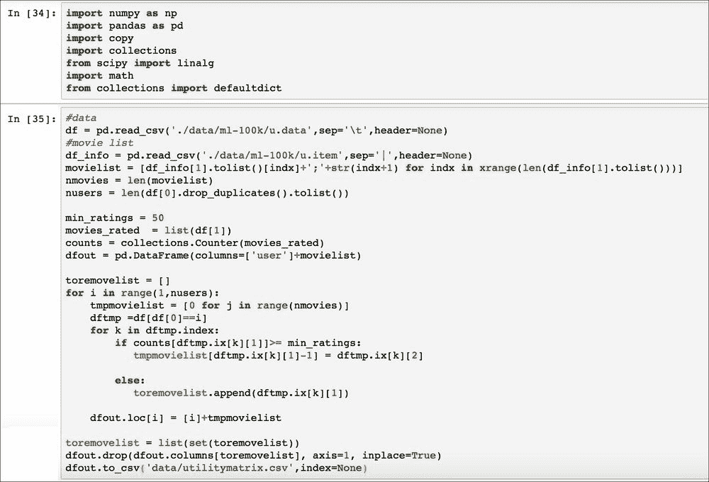

前两行的输出如下：

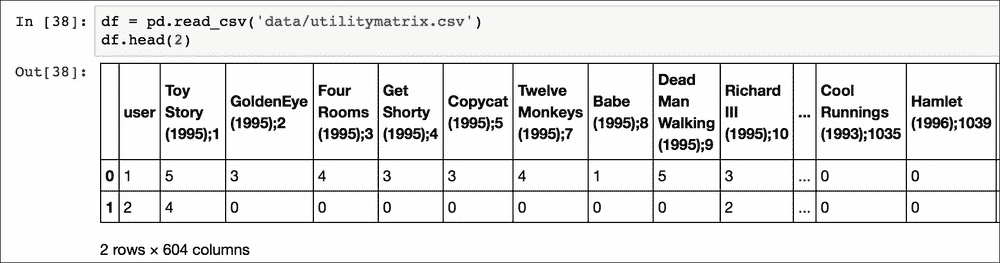

除了第一个（用户 ID）之外，每个列名定义了电影的名称和 MovieLens 数据库中电影的 ID（由分号分隔）。`0` 值表示缺失值，我们预计会有大量缺失值，因为用户评估的电影远少于 1,600 部。请注意，评分少于 50 次的电影已被从效用矩阵中删除，因此列数为 604（603 部电影被评分超过 50 次）。推荐系统的目标是预测这些值，但对于某些技术要正常工作，我们最初需要设置这些值（插补）。通常，使用两种插补方法：按用户平均评分或按项目平均评分，这两种方法都在以下函数中实现：

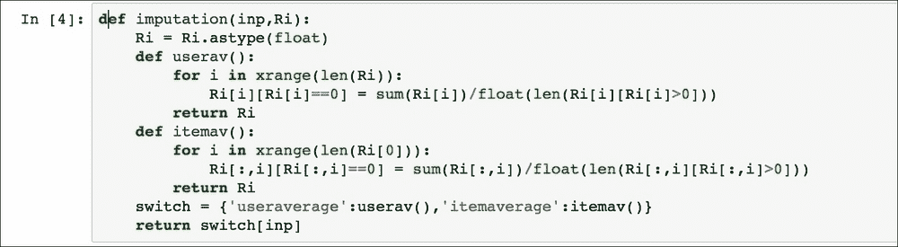

此函数将由本章实现的大多数算法调用，因此我们决定在此处讨论它，作为未来使用的参考。此外，在本章中，效用矩阵 *R* 将具有 *N* × *M* 的维度，其中 *N* 为用户数量，*M* 为项目数量。由于不同算法反复使用相似度度量，以下我们将定义最常用的定义。

# 相似度度量

为了计算两个不同向量 *x* 和 *y* 之间的相似度 *s*，这些向量可以是用户（效用矩阵的行）或项目（效用矩阵的列），通常使用两种度量：

+   余弦相似度：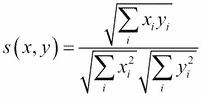

+   皮尔逊相关系数：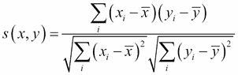，其中 *x* 和 *y* 是两个向量的平均值。

注意，如果平均值为 0，则两个度量是一致的。现在我们可以开始讨论不同的算法，从协同过滤类别开始。以下 `sim()` 函数将用于评估两个向量之间的相似度：

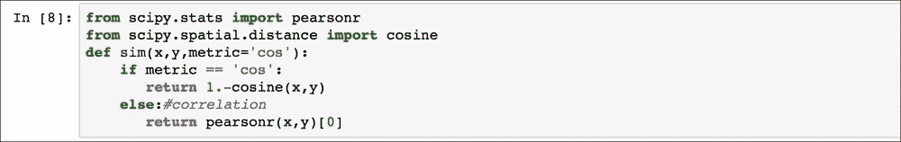

`SciPy` 库已被用于计算相似度（请注意，余弦相似度的 SciPy 定义与之前定义的相反，因此值从 1 中减去）。

# 协同过滤方法

这类方法基于这样的想法：任何用户都会喜欢其他类似用户喜欢的项目。简单来说，基本假设是，与用户 *B* 相似用户 *A* 很可能将项目评分与 *B* 相同，而不是其他方式。在实践中，这个概念通过比较不同用户的品味并使用最相似用户的品味来推断给定用户的未来评分（基于记忆）或通过从用户喜欢的项目中提取一些评分模式并尝试遵循这些模式来预测未来评分来实现。所有这些方法都需要大量的数据才能工作，因为给定的用户的推荐依赖于数据中可以找到多少相似用户。这个问题被称为 **冷启动**，在文献中得到了很好的研究，通常建议使用 CF 和 CBF 之间的某种混合方法来克服这个问题。在我们的 MovieLens 数据库示例中，我们假设我们有足够的数据来避免冷启动问题。CF 算法的常见问题还包括可扩展性，因为计算量随着用户和产品的数量增加（可能需要一些并行化技术），以及由于任何用户通常评分的项目数量较少而导致的效用矩阵稀疏性（插补通常是处理问题的尝试）。

## 基于记忆的协同过滤

这个子类使用效用矩阵来计算用户之间的相似度或项目之间的相似度。这些方法存在可扩展性和冷启动问题，但当它们应用于大型或过小的效用矩阵时，它们目前在许多商业系统中被广泛使用。我们将在此后讨论基于用户的协同过滤和基于项目的协同过滤。

### 基于用户的协同过滤

该方法使用 `k-NN` 方法（见第三章，*监督机器学习*）来找到过去评分与所选用户评分相似的用户的评分，以便可以将它们的评分组合成一个加权平均值来返回当前用户的缺失评分。

算法如下：

对于任何给定的用户 *i* 和尚未评分的项目 *j*：

1.  使用相似度指标 *s* 找到与具有评分 *j* 的用户最相似的 *K* 个用户。

1.  计算用户 *i* 尚未评分的每个项目 *j* 的预测评分，作为用户 *K* 的评分加权平均值：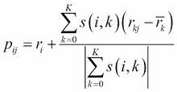

在这里 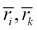 是用户 *i* 和 *k* 的平均评分，以补偿主观判断（一些用户慷慨，一些用户挑剔）和 *s(i* , *k)* 是相似度指标，如前一段所述。注意，我们甚至可以通过每个用户的评分分布进行归一化，以比较更均匀的评分：

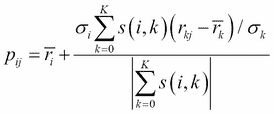

在这里，σ[i] 和 σ[k] 分别是用户 *i* 和 *k* 的评分标准差。

此算法有一个输入参数，即邻居数量 *K*，但在大多数应用中通常 `20` 到 `50` 之间的值就足够了。皮尔逊相关系数被发现比余弦相似度返回更好的结果，这可能是由于用户评分的减去使得相关公式使得用户更具有可比性。以下代码用于预测每个用户的缺失评分。

`u_vec` 代表用户评分值，通过 `FindKNeighbours` 函数找到最相似的其他用户 *K*。`CalcRating` 仅使用前面讨论过的公式（没有传播校正）计算预测评分。请注意，如果效用矩阵非常稀疏以至于没有找到邻居，则预测评分是用户的平均评分。可能发生的情况是预测评分超过 `5` 或低于 `1`，因此在这种情况下，预测评分分别设置为 `5` 或 `1`。

### 基于物品的协同过滤

这种方法在概念上与基于用户的 CF 相同，只是相似度是在物品上而不是在用户上计算的。由于大多数情况下用户的数量可以远远大于物品的数量，因此这种方法提供了一种更可扩展的推荐系统，因为物品的相似度可以预先计算，并且当新用户到来时不会改变太多（如果用户数量 *N* 显著很大）。

对于每个用户 *i* 和物品 *j* 的算法如下：

1.  使用相似度指标 *s* 来找到 *K* 个与 *i* 已经评分的物品最相似的物品。

1.  将预测评分计算为 *K* 个物品评分的加权平均值：

注意，相似度指标可能具有负值，因此我们需要将求和限制在只有正相似度上，以便具有意义（即正的）*P[ij]*（如果我们只对推荐最佳物品感兴趣而不是评分，那么物品的相对顺序将始终是正确的）。即使在这种情况，大多数应用中 `20` 到 `50` 之间的 *K* 值通常就足够了。

该算法使用一个类实现，如下所示：

类 `CF_itembased` 的构造函数计算用于评估用户缺失评分的 `simmatrix` 物品相似度矩阵，任何需要通过 `CalcRatings` 函数评估缺失评分时都可以使用。函数 `GetKSimItemsperUser` 找到与选定用户（由 `u_vec` 给出）最相似的 *K* 个用户，而 `CalcRating` 仅实现前面讨论过的加权平均评分计算。请注意，如果没有找到邻居，则评分设置为平均值或物品的评分。

### 最简单的基于物品的协同过滤 – 斜率一

而不是使用之前讨论的度量来计算相似度，可以使用一个非常简单但有效的方法。我们可以计算一个矩阵 *D*，其中每个条目 *d[ij]* 是项目 *i* 和 *j* 评分的平均差异：

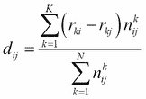

在这里，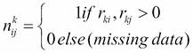 是一个变量，用于计算用户 *k* 是否对 *i* 和 *j* 两个项目都进行了评分，因此 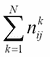 是对 *i* 和 *j* 两个项目都进行了评分的用户数量。

然后算法如 *基于物品的协同过滤* 部分所述。对于每个用户 *i* 和项目 *j*：

1.  找到与项目 *j* 差异最小的 *K* 个项目，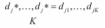（`*` 表示可能的索引值，但为了简单起见，我们将它们重新标记为 `1` 到 *K*）。

1.  计算预测评分作为加权平均值：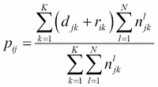

尽管这个算法比其他协同过滤算法要简单得多，但它通常与它们的准确性相匹配，计算成本更低，且易于实现。其实现方式与用于基于物品的协同过滤的类非常相似：

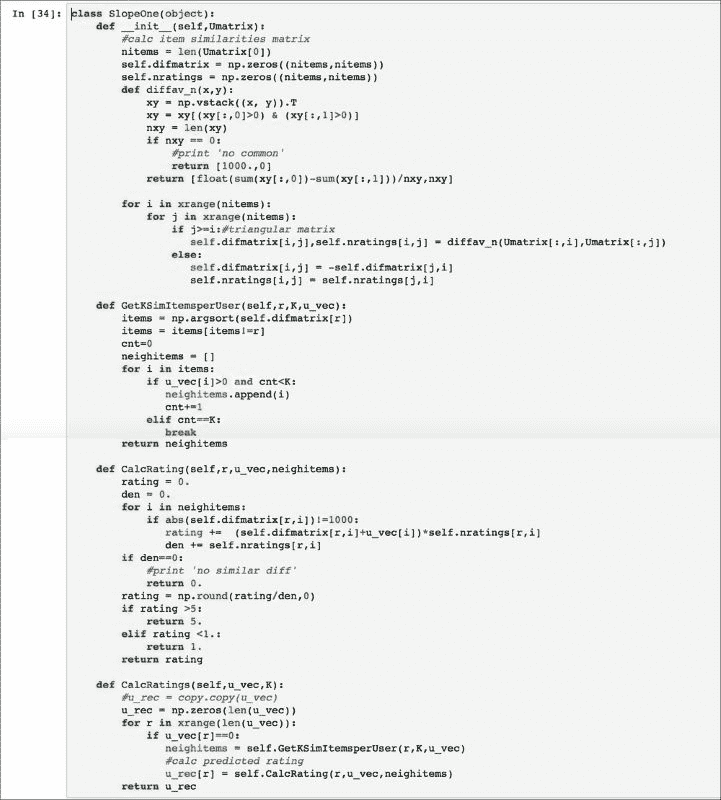

唯一的区别是矩阵：现在使用 `difmatrix` 来计算项目 *i* 和 *j* 之间的差异 *d(i, j)*，如前所述，而函数 `GetKSimItemsperUser` 现在寻找最小的 `difmatrix` 值以确定 *K* 个最近邻。由于两个项目至少没有被一个用户评分的可能性（尽管可能性不大），`difmatrix` 可以有未定义的值，默认设置为 `1000`。请注意，预测评分也可能超过 `5` 或低于 `1`，因此在这种情况下，必须适当地将预测评分设置为 `5` 或 `1`。

## 基于模型的协同过滤

这类方法使用效用矩阵生成一个模型来提取用户如何评分项目的模式。模式模型返回预测评分，填充或近似原始矩阵（矩阵分解）。文献中已经研究了各种模型，我们将讨论特定的 *矩阵分解* 算法——**奇异值分解**（**SVD**，也带有期望最大化），**交替最小二乘法**（**ALS**），**随机梯度下降**（**SGD**），以及一般的**非负矩阵分解**（**NMF**）算法类。

### 替代最小二乘法（ALS）

这是分解矩阵 *R* 的最简单方法。每个用户和每个项目都可以在 *K* 维的特征空间中表示，以便：

在这里，*P N×K* 是特征空间中的新用户矩阵，而 *Q M×K* 是同一空间中物品的投影。因此，问题被简化为最小化正则化成本函数 *J*：

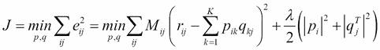

在这里，λ 是正则化参数，它通过惩罚学习到的参数并确保向量 *p[i]* 和 *[q] ^T [j]* 的大小不是太大，从而有助于避免过拟合。矩阵条目 *Mc[ij]* 用于检查用户 *i* 和物品 *j* 是否确实进行了评分，因此当 *r[ij] >0* 时，*Mc[ij]* 为 `1`，否则为 `0`。将每个用户向量 *p[i]* 和物品向量 *q[j]* 的 *J* 的导数设为 `0`，我们得到以下两个方程：

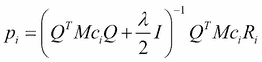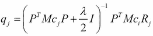

在这里，*R[i]* 和 *Mc[i]* 分别指矩阵 *R* 和 *Mc* 的第 *i* 行，而 *R[j]* 和 *Mc[j]* 分别指矩阵 *Mc* 和 *R* 的第 *j* 列。交替固定矩阵 *P* 和 *Q*，前述方程可以直接使用最小二乘算法解决，以下函数实现了 Python 中的 ALS 算法：

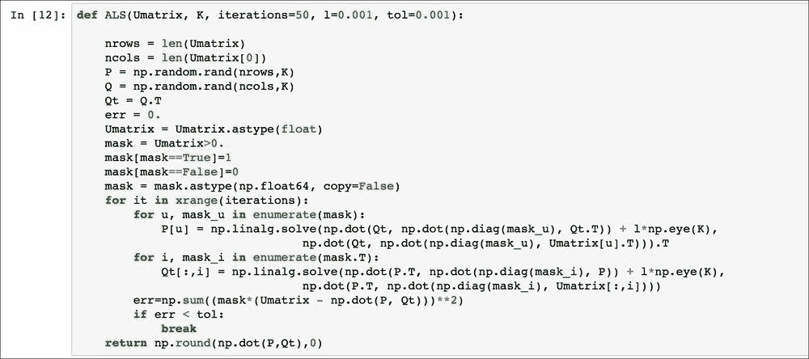

矩阵 *Mc* 被称为 `mask`，变量 `l` 代表正则化参数 λ，默认设置为 `0.001`，最小二乘问题已使用 `Numpy` 库的 `linalg.solve` 函数解决。这种方法通常比 **随机梯度下降** ( **SGD** ) 和 **奇异值分解** ( **SVD** ) (参见以下章节) 都要精确，但它非常容易实现且易于并行化（因此可以快速）。

### 随机梯度下降 (SGD)

此方法也属于矩阵分解子类，因为它依赖于对效用矩阵 *R* 的近似：

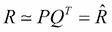

在这里，矩阵 *P(N×K)* 和 *Q(M×K)* 分别代表具有 *K* 维潜在特征空间中的用户和物品。每个近似的评分  可以表示如下：

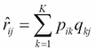

找到了矩阵 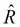，解决正则化平方误差 *e² [ij] * 的最小化问题，就像 ALS 方法一样（成本函数 *J* 如 第三章 ，*监督机器学习* ）：

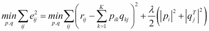

这个最小化问题使用梯度下降法解决（参见 第三章 ，*监督机器学习* ）：

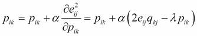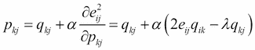

在这里，α 是学习率（见第三章，*监督机器学习*）和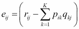。该技术通过在两个先前方程之间交替寻找 *R*（固定 *q[kj]* 并求解 *P[ik]*，反之亦然）直到收敛。SGD 通常比 SVD（见下一节）更容易并行化（因此可能更快），但在找到良好评分方面不太精确。此方法的 Python 实现如下脚本：

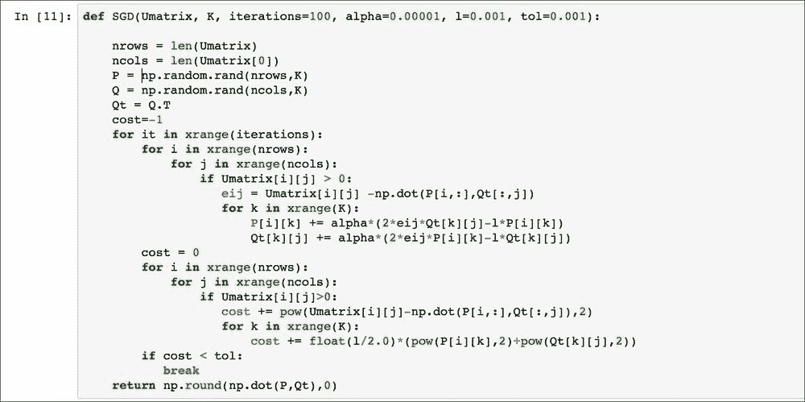

这个 SGD 函数具有默认参数，学习率 *α = 0.0001*，正则化参数 *λ = l = 0.001*，最大迭代次数 `1000`，以及收敛容忍度 `tol = 0.001`。注意，未评分的项目（评分值为 `0`）在计算中不被考虑，因此在使用此方法时不需要进行初始填充（插补）。

### 非负矩阵分解 (NMF)

这是一组方法，它们将矩阵 *R* 的分解再次视为两个矩阵 *P*（ *N* × *K* ）和 *Q*（ *M* × *K* ）（其中 *K* 是特征空间的维度）的乘积，但它们的元素必须是非负的。一般最小化问题如下：

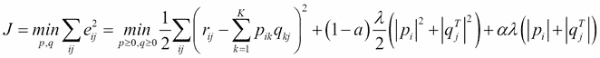

在这里，α 是一个参数，用于定义要使用哪种正则化项（`0` 为平方正则化，`1` 为 lasso 正则化，或它们的混合），λ 是正则化参数。已经开发了几种技术来解决此问题，例如投影梯度、坐标下降和非负约束最小二乘。本书的范围不包括讨论这些技术的细节，但我们将使用以下函数中实现的坐标下降方法：

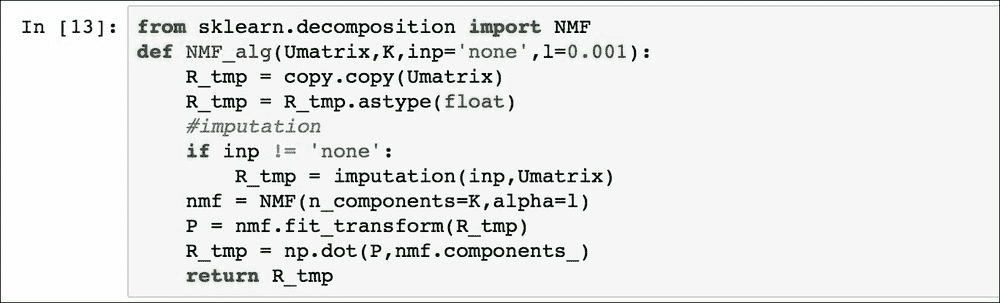

注意，在因子分解实际发生之前可能已经进行了插补，并且函数 `fit_transform` 返回的是 *P* 矩阵，而 *Q^T* 矩阵存储在 `nmf.components_` 对象中。默认情况下，*α* 值被假定为 `0`（平方正则化），*λ = l = 0.01*。由于效用矩阵具有正值（评分），这类方法无疑非常适合预测这些值。

### 奇异值分解 (SVD)

我们已经在第二章中讨论了此算法，作为降维技术，通过分解为矩阵*U*、Σ、*V*来近似矩阵（你应该阅读第二章中的相关部分，以获取更多技术细节）。在这种情况下，SVD 被用作矩阵分解技术，但需要一种插补方法来初始估计每个用户的缺失数据；通常，使用每个效用矩阵行（或列）的平均值或两者的组合（而不是保留零值）。除了直接将 SVD 应用于效用矩阵外，还可以使用以下算法，利用期望最大化（见第二章，*无监督机器学习*），从矩阵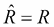开始：

1.  **m 步**：执行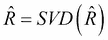

1.  **e 步**：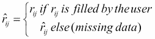

此过程重复进行，直到平方误差之和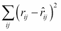小于所选容忍度。实现此算法和简单 SVD 分解的代码如下：

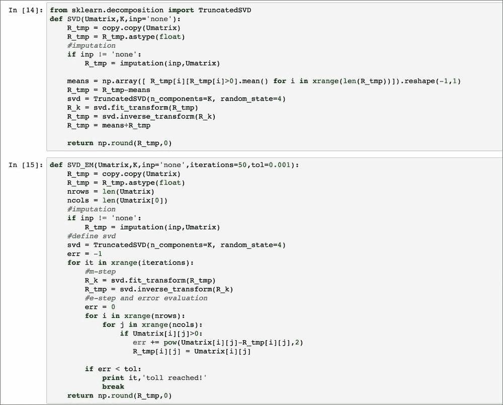

注意，奇异值分解（SVD）由`sklearn`库提供，并且两种插补平均方法（用户评分平均值和项目评分平均值）都已实现，尽管默认函数是*无*，这意味着零值保留为初始值。对于期望最大化 SVD，其他默认参数是收敛容忍度（0.0001）和最大迭代次数（10,000）。这种方法（尤其是与期望最大化结合使用）比 ALS 慢，但准确性通常更高。另外请注意，SVD 方法通过减去用户评分平均值来分解效用矩阵，因为这种方法通常表现更好（然后将在 SVD 矩阵计算后添加用户评分平均值）。

我们完成备注，SVD 分解也可以用于基于记忆的 CF，在降维空间（矩阵*U*或*V^T*）中比较用户或项目，然后从原始效用矩阵中获取评分（使用 k-NN 方法的 SVD）。

# CBF 方法

这类方法依赖于描述项目的数据，然后用于提取用户的特征。在我们的 MovieLens 示例中，每部电影*j*都有一个包含*G*个二进制字段的一组，以指示它是否属于以下类型之一：未知、动作、冒险、动画、儿童、喜剧、犯罪、纪录片、剧情、奇幻、黑色电影、恐怖、音乐剧、悬疑、浪漫、科幻、惊悚、战争或西部。

基于这些特性（类型），每部电影由一个具有*G*维度的二进制向量*m[j]*描述（电影类型的数量），其中包含电影*j*中包含的所有类型的条目等于`1`，否则为`0`。给定存储在*效用矩阵*部分提到的`dfout`效用矩阵的`dataframe`，这些二进制向量*m[j]*通过以下脚本从 MovieLens `数据库`收集到一个 dataframe 中：

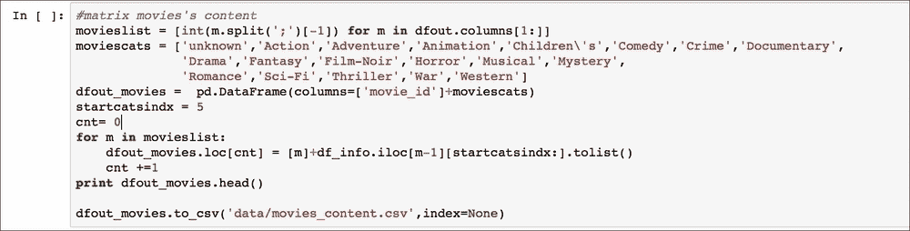

电影内容矩阵已保存在`movies_content.csv`文件中，以便 CBF 方法使用。

内容推荐系统的目标是生成具有相同字段的用户配置文件，以指示用户喜欢每个类型的程度。这种方法的问题在于项目的描述内容并不总是可用，因此在电子商务环境中并不总是可以采用这种技术。优点是针对特定用户的推荐不受其他用户评分的影响，因此不会因为特定项目的用户评分不足而遭受冷启动问题。将讨论两种方法来找到最佳的推荐方法。第一种方法简单地生成与每个用户观看的每部电影的平均评分相关的用户配置文件，并使用余弦相似度找到与用户偏好最相似的电影。第二种方法是一个正则化线性回归模型，用于从评分和电影特征生成用户配置文件特征，以便可以使用这些用户配置文件预测每个用户尚未观看的电影的评分。

## 项目特征平均方法

这种方法真的很简单，我们将使用之前讨论过的 MovieLens 示例中描述电影的特性来解释它。该方法的目标是为每个用户*i*（长度等于*G*）生成电影类型的偏好向量。这是通过计算平均评分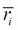和每个类型条目*g*来完成的；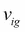由用户*i*（*Mi*）观看的包含类型*g*的电影的评分总和减去平均，然后除以包含类型*g*的电影数量：

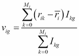

在这里，*I[kg]*如果电影*k*包含类型*g*则为 1；否则为`0`。

然后将向量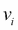与二进制向量 m*j*使用余弦相似度进行比较，并将相似度值最高的电影推荐给用户*i*。该方法的实现由以下 Python 类给出：

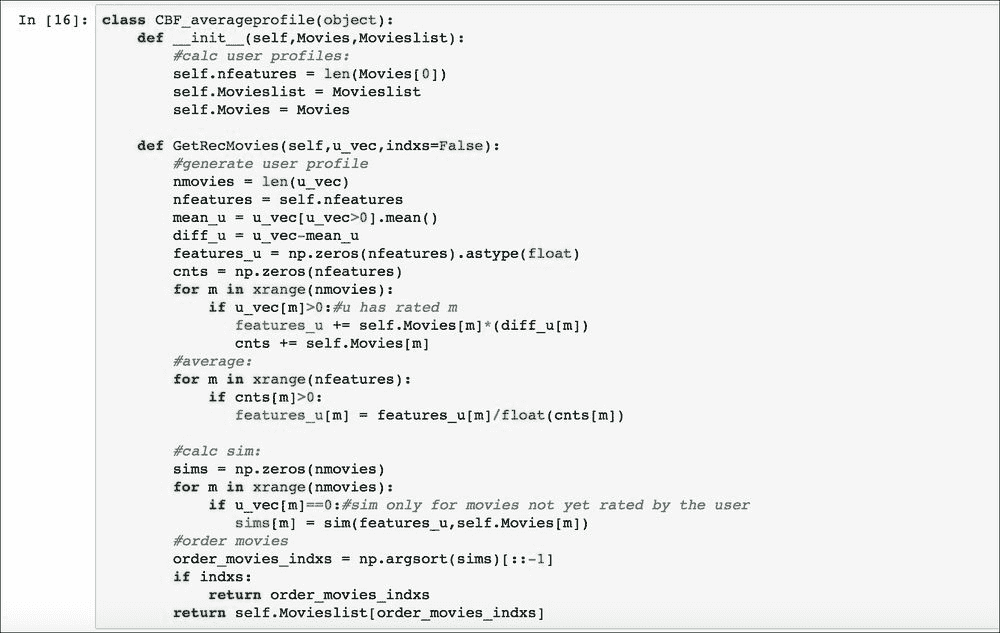

构造函数将电影标题列表存储在 `Movieslist` 中，并将电影特征存储在 `Movies` 向量中，`GetRecMovies` 函数生成用户类型的偏好向量，即（应用前面的公式）称为 `features_u`，并返回与该向量最相似的项目。

## 正则化线性回归方法

该方法通过线性模型的参数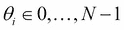学习用户的电影偏好，其中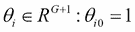，其中 *N* 是用户的数量，*G* 是每个项目的特征（电影类型）的数量。我们在用户参数 *θ[i] (θ[i0] = 1* ) 上添加一个截距值，以及具有相同值 *m[j0] =1* 的电影向量 *m[j] *，因此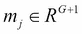。为了学习参数向量 q * [i] *，我们解决以下正则化最小化问题：

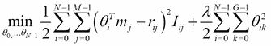

在这里，*I[ij]* 是 `1`；即用户 *i* 观看了该电影，否则 *j* 是 `0`，λ 是正则化参数（参见第三章，*监督机器学习*）。

解决方案是通过应用梯度下降法得到的（参见第三章，*监督机器学习*）。对于每个用户 *i* :

+   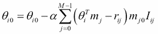 (k=0)

+   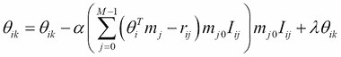 (k>0)

由于我们在电影和用户向量中分别添加了 `1` 个条目，因此区分学习截距参数（ *k=0* ）和其他参数是必要的（截距参数上没有过拟合的可能性，因此不需要对其进行正则化）。在参数 q *[i]* 学习完成后，推荐通过简单地应用公式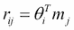中的任何缺失评分 *r[ij]* 来执行。

该方法通过以下代码实现：

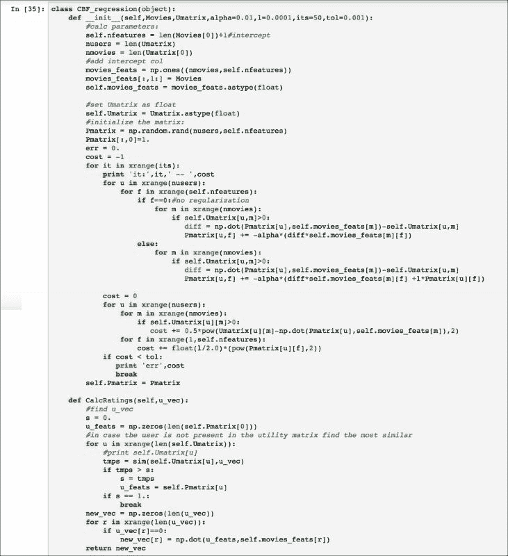

类 `CBF_regression` 的构造函数仅执行梯度下降以找到参数 *θ[i]*（称为 `Pmatrix`），而函数 `CalcRatings` 在存储的效用矩阵 *R* 中找到最相似的评分向量（如果用户不在效用矩阵中），然后使用相应的参数向量来预测缺失的评分。

# 学习推荐系统的关联规则

尽管这种方法在许多商业推荐系统中并不常用，但由于历史数据的原因，关联规则学习确实是一种值得了解的方法，因为它可以应用于解决现实世界中的各种问题。这种方法的主要概念是基于交易数据库 *T* 中项目的发生频率的某些统计度量来寻找项目之间的关系（例如，一个交易可以是用户 *i* 看过的电影或 *i* 购买的商品）。更正式地说，一条规则可以是 *{item1,item2} => {item3}*，即项目集合 *({item1,item2})* 意味着另一个项目集合 *({item3})* 的存在。使用两个定义来表征每个 *X=>Y* 规则：

+   **支持度**：给定一个项目集合 *X*，支持度 *supp(X)* 是包含集合 *X* 的交易在总交易中的比例。

+   **置信度**：它是包含集合 *X* 的交易中同时包含集合 *Y* 的交易的比例：conf(X=>Y)=supp(X U Y)/supp(X)*。请注意，置信度 *conf(X=>Y)* 可以与 *conf(Y=>X)* 有非常不同的值。

支持度表示交易数据库中某个规则的频率，而置信度表示在集合 *X* 存在的情况下，集合 *Y* 发生的概率。换句话说，支持度值被选择用来过滤从数据库中挖掘的规则数量（支持度越高，满足条件的规则越少），而置信度可以被视为集合 *X* 和 *Y* 之间的 *相似度* 指标。在电影推荐系统的案例中，交易数据库可以通过考虑每个用户喜欢的电影来从效用矩阵 *R* 中生成，我们寻找由集合 *X* 和 *Y* 组成的只包含一个项目（电影）的规则。这些规则收集在一个矩阵 `ass_matrix` 中，其中每个条目 `ass_matrix[i][j]` 代表规则 *i => j* 的置信度。给定用户的推荐通过简单地乘以他的评分 `u_vec` 得到：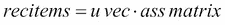，然后按最大值对应的最推荐电影到最少推荐电影的顺序对所有值进行排序：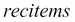。因此，这种方法并不预测评分，而是提供电影推荐列表；然而，它速度快，并且与稀疏效用矩阵配合得很好。请注意，为了尽可能快地找到形成集合 X 和 Y 的所有可能的项目组合，文献中已经开发了两种算法：*apriori* 和 *fp-growth*（这里没有讨论，因为我们只需要每个集合 *X* 和 *Y* 中有一个项目的规则）。

实现该方法的类如下：

类构造函数接受效用矩阵 `Umatrix`、电影标题列表 `Movieslist`、支持度 `min_support`、置信度 `min_confidence` 阈值（默认 `0.1`）以及 `likethreshold` 作为输入参数，这是在事务中考虑电影的最小评分值（默认 `3`）。函数 `combine_lists` 找到所有可能的规则，而 `filterSet` 只将规则减少到满足最小支持度阈值的子集。`calc_confidence_matrix` 用满足最小阈值的置信度值填充 `ass_matrix`（否则默认设置为 `0`），而 `GetRecItems` 返回根据用户评分 `u_vec` 提供的推荐电影列表。

# 对数似然比推荐系统方法

**对数似然比**（**LLR**）是衡量两个事件 *A* 和 *B* 不太可能是独立的，但比偶然发生（比单个事件频率更高）更可能一起发生的一个度量。换句话说，LLR 指示两个事件 *A* 和 *B* 之间可能存在显著的共现，其频率高于正常分布（在两个事件变量上）预测的频率。

泰德·邓宁（[`tdunning.blogspot.it/2008/03/surprise-and-coincidence.html`](http://tdunning.blogspot.it/2008/03/surprise-and-coincidence.html)）已经证明，LLR 可以基于事件 A 和 B 的二项分布，使用具有以下条目的矩阵 *k* 来表示：

|    | A | 非 A |
| --- | --- | --- |
| **B** | *k11* | *k12* |
| **非 B** | *k21* | *k22* |

在这里， 和  是衡量向量 *p* 中包含的信息的**香农熵**。

注意：也称为两个事件变量 *A* 和 *B* 的**互信息**（**MI**），衡量两个事件的发生如何相互依赖。

这个测试也称为 *G2*，并且已被证明在检测罕见事件的共现（特别是在文本分析中）方面非常有效，因此对于稀疏数据库（或在我们的情况下的效用矩阵）非常有用。

在我们的案例中，事件 *A* 和 *B* 是用户对电影 *A* 和 *B* 的喜欢或不喜欢，其中“喜欢电影”的事件定义为评分大于 `3`（反之亦然，对于不喜欢）。因此，算法的实现由以下类给出：

构造函数接受效用矩阵、电影标题列表和 `likethreshold` 作为输入，该阈值用于定义用户是否喜欢一部电影（默认值为 `3`）。函数 `loglikelihood_ratio` 生成包含每个电影对 *i* 和 *j* 的所有 LLR 值的矩阵，计算矩阵 *k* (`calc_k`) 和相应的 LLR (`calc_llr`)。函数 `GetRecItems` 返回具有 `u_vec`（该方法不预测评分值）给出的评分的用户推荐电影列表。

# 混合推荐系统

这是一类方法，它们在单个推荐器中结合了协同过滤（CBF）和内容过滤（CF）以实现更好的结果。已经尝试了多种方法，可以总结为以下几类：

+   **加权**：将协同过滤和内容过滤预测的评分组合成一个加权平均值。

+   **混合**：分别找到协同过滤和内容过滤预测的电影，然后合并成一个单一列表。

+   **切换**：基于某些标准，使用协同过滤预测或内容过滤预测。

+   **特征组合**：将协同过滤和内容过滤的特征一起考虑，以找到最相似的用户或物品。

+   **特征增强**：类似于特征组合，但使用额外的特征来预测某些评分，然后主要推荐器使用这些评分来生成推荐列表。例如，内容增强协同过滤通过基于内容的模型学习未评分电影的评分，然后采用协同方法来定义推荐。

例如，我们实现了两种混合特征组合方法，将物品的协同过滤方法与基于用户的协同过滤方法相结合。第一种方法使用基于用户的协同过滤到扩展效用矩阵中，该矩阵现在还包含每个用户每个类型的平均评分。Python 类如下：

构造函数生成与每个用户关联的电影类型平均评分特征的扩展效用矩阵 `Umatrix_mfeats`。函数 `CalcRatings` 通过比较用户的扩展特征向量使用皮尔逊相关系数找到 K-NN。第二种方法将奇异值分解（SVD）应用于包含每个用户类型偏好的扩展效用矩阵。

与奇异值分解（SVD）方法一样，评分减去用户评分的平均值，类型偏好也减去相同的用户评分的平均值。

# 推荐系统的评估

我们已经讨论了迄今为止在商业环境中使用的所有最相关的方法。推荐系统的评估可以离线执行（仅使用效用矩阵中的数据）或在线执行（使用效用矩阵数据以及每个用户通过网站实时提供的新的数据）。在线评估过程在 第七章，*电影推荐系统网络应用* 中讨论，其中包括一个合适的在线电影推荐系统网站。在本节中，我们将使用两个常用于评估推荐系统的离线测试来评估方法的性能：评分的均方根误差和排名准确性。对于所有适用 k 折交叉验证（见 第三章，*监督机器学习*）的评估，已执行 5 折交叉验证以获得更客观的结果。效用矩阵已使用以下函数分为 5 折：

在这里，`df` 是一个存储效用矩阵的数据框对象，而 *k* 是折数。在验证集中，对于每个用户评分向量 `u_vec`，一半的评分已被隐藏，以便可以预测真实值。

`u_vals` 存储预测的值，而 `u_test` 包含用于测试算法的评分。在我们开始比较不同算法的不同度量之前，我们将效用矩阵和电影内容矩阵加载到数据框中，并将数据分为 5 折以进行交叉验证。

`df_vals` 包含验证集，因此需要应用本节中介绍的 `HideRandomRatings` 函数。

现在在 `movies` 矩阵、`movieslist` 列表和数据框 `df_trains`、`vals_vecs_folds`、`tests_vecs_folds` 中的数据已准备好用于训练和验证前几节中讨论的所有方法。我们可以开始评估 **均方根误差** ( **RMSE** )。

## 均方根误差 (RMSE) 评估

这种验证技术仅适用于 CF 方法和线性回归 CBF，因为这些算法仅生成预测评分。对于验证集中 `u_vals` 中的每个评分 *rij*，使用每种方法计算预测评分 ，并得到均方根误差：

RMSE = 

在这里，*Nval*是`u_vals`向量中的评分数量。此公式中的平方因子极大地惩罚了大的误差，因此具有低 RMSE（最佳值）的方法的特征是所有预测评分上的小误差分布，而不是像平均绝对误差 MAE=所偏好的那样在少数评分上有大的误差。

计算基于记忆的 CF 用户和基于物品的 CF 方法的 RMSE 的代码如下：

对于每种方法，调用 SE 函数来计算每个折叠的错误，然后获得折叠的总 RMSE。

使用 5 个最近邻进行基于物品的 CF（斜率一）和 20 个用户基于 CF，这些方法有以下误差：

| 方法 | RMSE | 预测评分数量 |
| --- | --- | --- |
| **基于 CF 用户** | 1.01 | 39,972 |
| **基于 CF 物品** | 1.03 | 39,972 |
| **斜率一** | 1.08 | 39,972 |
| **CF-CBF 用户** | 1.01 | 39,972 |

所有这些方法都具有相似的 RMSE 值，但最佳方法是基于物品的协同过滤。

对于基于模型的方法，而不是隐藏验证评分，`u_test`被包含在效用矩阵中进行训练，然后使用以下脚本来计算 RMSE：

该代码仅计算 CBF 回归和 SVD 的 RMSE，读者可以轻松复制代码来计算其他算法的错误，因为大部分所需代码只是被注释了（SVD 期望最大化，SGD，ALS 和 NMF）。结果如下表所示（ *K* 维特征空间）：

| 方法 | RMSE | 预测评分数量 |
| --- | --- | --- |
| CBF 线性回归(a= 0.01, l =0.0001, its=50) | 1.09 | 39,972 |
| SGD ( K=20, 50 its, a =0.00001, l=0.001) | 1.35 | 39,972 |
| ALS ( K=20, 50 its, l =0.001) | 2.58 | 39,972 |
| SVD (`imputation` =`useraverage` , *K* =20) | 1.02 | 39,972 |
| SVD EM (`imputation` =`itemaverage` , iterations=30, *K* =20) | 1.03 | 39,972 |
| HYBRID SVD (`imputation` =`useraverage` , *K* =20) | 1.01 | 39,972 |
| NMF ( *K* =20 `imputation` =`useraverage` ) | 0.97 | 39,972 |

如预期，ALS 和 SGD 是最差的方法，但它们被讨论是因为从教学角度来看它们是有指导意义的（它们也较慢，因为实现没有像`sklearn`库中的方法那样优化）。

所有其他方法的结果都相似。然而，请注意，混合方法的结果略优于相应的 SVD 和基于用户的 CF 算法。请注意，要预测的电影是随机选择的，因此结果可能会有所不同。

## 分类度量

评分误差 RMSE 并不能真正反映方法的优劣，而是一个在商业环境中并不真正使用的学术度量。网站的目标是呈现与用户相关的内容，而不管用户给出的确切评分是多少。为了评估推荐项目的相关性，使用了`精确度`、`召回率`和`f1`（见第二章，*无监督机器学习*）度量，其中正确的预测是评分大于 3 的项目。这些度量是在每个算法返回的前 50 个项目（如果算法返回推荐列表或预测评分最高的其他方法的 50 个项目）上计算的。计算这些度量的函数如下：

在这里，布尔值`ratingsval`表示该方法是否返回评分或推荐列表。我们使用`ClassificationMetrics`函数的方式与计算所有方法的 RMSE 相同，因此实际评估度量的代码没有显示（你可以将其作为练习来编写）。以下表格总结了所有方法的总结结果（*邻居数*是最近邻的数量，*K*是特征空间的维度）：

| 方法 | 精确度 | 召回率 | f1 | 预测评分数量 |
| --- | --- | --- | --- | --- |
| CF 基于用户 ( *邻居数* =20) | 0.6 | 0.18 | 0.26 | 39,786 |
| CBFCF 基于用户 ( *邻居数* =20) | 0.6 | 0.18 | 0.26 | 39,786 |
| HYBRID SVD ( *K* =20, `填充` =`用户平均` ) | 0.54 | 0.12 | 0.18 | 39,786 |
| CF 基于项 ( *邻居数* =5) | 0.57 | 0.15 | 0.22 | 39,786 |
| Slope one ( *邻居数* =5) | 0.57 | 0.17 | 0.24 | 39,786 |
| SVD EM ( *K* =20, 迭代次数=30, `填充` =`用户平均` ) | 0.58 | 0.16 | 0.24 | 39,786 |
| SVD ( *K* =20, `填充` =`项目平均` ) | 0.53 | 0.12 | 0.18 | 39,786 |
| CBF 回归 (a = 0.01, l =0.0001, 迭代次数=50) | 0.54 | 0.13 | 0.2 | 39,786 |
| SGD (K=20, a =0.00001, l =0.001) | 0.52 | 0.12 | 0.18 | 39,786 |
| ALS ( *K* =20, λ =0.001, 迭代次数=50) | 0.57 | 0.15 | 0.23 | 39,786 |
| CBF 平均 | 0.56 | 0.12 | 0.19 | 39,786 |
| LLR | 0.63 | 0.3 | 0.39 | 39,786 |
| NMF ( *K* =20, λ =0.001, `填充` =`ssss` ) | 0.53 | 0.13 | 0.19 | 39,786 |
| 关联规则 | 0.68 | 0.31 | 0.4 | 39,786 |

从结果中可以看出，最佳方法是关联规则，LLR、混合 CBFCF 基于用户和基于用户的 CF 方法也有很好的精度。请注意，由于预测的电影是随机选择的，因此结果可能会有所不同。

# 摘要

在本章中，我们讨论了从协同过滤和基于内容的过滤到两种简单混合算法的最常用推荐系统方法。注意，在文献中还有包含不同数据（用户性别、人口统计、观点、位置、设备等）的*模态*推荐系统。这些方法更高级，需要更多数据来使用它们。

在第七章，*电影推荐系统网络应用*，我们将使用本章讨论的方法实现一个网络推荐系统，但在那之前，我们将在第六章，*Django 入门*中介绍 Django 框架来构建网络应用。

# 读累了记得休息一会哦~

**公众号：古德猫宁李**

+   电子书搜索下载

+   书单分享

+   书友学习交流

**网站：**[沉金书屋](https://www.chenjin5.com)

+   电子书搜索下载

+   电子书打包资源分享

+   学习资源分享
