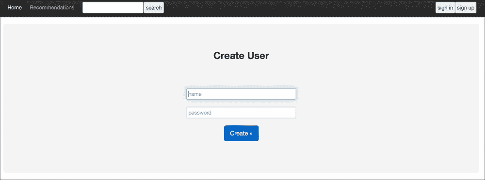
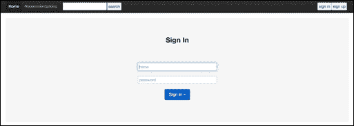
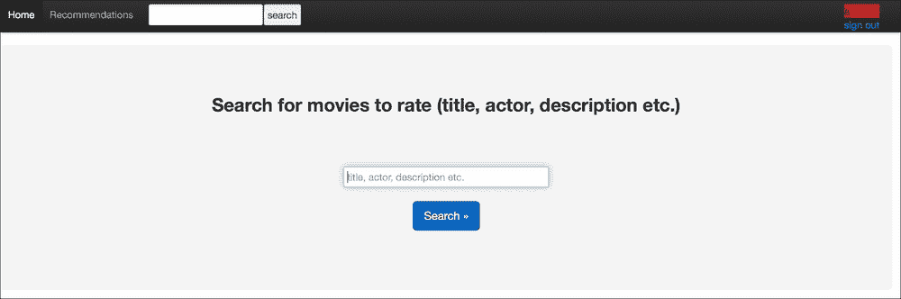
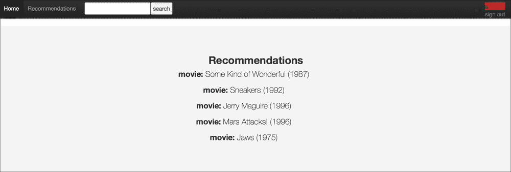
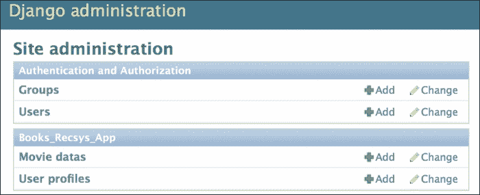

# 第七章。电影推荐系统网络应用程序

本章的目的是解释一个实际案例，展示推荐系统在实际中的应用，使用 Django 框架。我们将实现一个电影推荐系统，其中每个订阅服务的用户将根据我们在 第五章 中讨论的偏好，收到推荐的电影。同样，我们也将使用相同的数据，该数据由 942 个用户对 603 部电影超过 50 次的评分组成。为了接收推荐，每个用户必须对一定数量的电影进行评分，因此实现了一个信息检索系统 (第四章，*网络挖掘技术*) 来搜索评分的电影。我们将讨论 Django 应用程序的不同部分：设置、模型、用户登录/注销、命令、信息检索系统、推荐系统、管理界面和 API（所有代码均可在作者的 GitHub 上的 `chapter_7` 文件夹中找到，网址为 [`github.com/ai2010/machine_learning_for_the_web/tree/master/chapter_7`](https://github.com/ai2010/machine_learning_for_the_web/tree/master/chapter_7)）。自 第六章 介绍了 Django 的主要功能以来，每当使用一个新功能时，也会提供技术解释。现在我们可以开始描述不同的设置和初始设置来运行应用程序。

# 应用程序设置

我们像往常一样创建并启动 Django：

```py

django-admin startproject server_movierecsys

```

从 `server_movierecsys` 文件夹启动应用程序：

```py

python manage.py startapp books_recsys_app

```

现在需要配置 `settings.py`。正如我们在 第六章 中所看到的，我们设置了已安装的应用程序、HTML 模板、布局格式化文件夹和 SQLite 数据库：

```py
INSTALLED_APPS = (
    'django.contrib.admin',
    'django.contrib.auth',
    'django.contrib.contenttypes',
    'django.contrib.sessions',
    'django.contrib.messages',
    'django.contrib.staticfiles',
    'rest_framework',
    'rest_framework_swagger',
    'books_recsys_app',
)

TEMPLATE_DIRS = (
    os.path.join(BASE_DIR, 'templates'),
)
STATIC_URL = '/static/'
STATICFILES_DIRS = ( os.path.join(BASE_DIR, "static"), )
DATABASES = {
    'default': {
        'ENGINE': 'django.db.backends.sqlite3',
        'NAME': os.path.join(BASE_DIR, 'db.sqlite3'),
    }
}
```

除了标准应用程序和其余的框架（swagger）之外，`books_recsys_app` 已被包含在已安装的应用程序列表中。

在这种情况下，我们需要将数据持久地加载到内存中，以通过不在每个用户请求时计算或检索数据来提高用户体验。为了在内存中保存数据或昂贵的计算结果，我们在 `settings.py` 中设置了 Django 的缓存系统：

```py
CACHES = {
    'default': {
        'BACKEND': 'django.core.cache.backends.filebased.FileBasedCache',
        'LOCATION': '/var/tmp/django_cache',
        'TIMEOUT': None,
    }
}
```

我们选择了存储在 `/var/tmp/django_cache` 的 **基于文件的缓存** 缓存类型，以及一个 `None` 超时，这意味着缓存中的数据永远不会过期。

要使用管理界面，我们通过以下命令设置 `superuser` 账户：

```py

python manage.py createsuperuser (admin/admin)

```

应用程序通过输入以下命令在 `http://localhost:8000/` 上运行：

```py

python manage.py runserver

```

# 模型

在这个应用程序中，我们需要存储与每部电影相关的数据以及网站每个用户对电影的评分。我们设置了三个模型：

```py
class UserProfile(models.Model):
    user = models.ForeignKey(User, unique=True)
    array = jsonfield.JSONField()
    arrayratedmoviesindxs = jsonfield.JSONField()
    lastrecs = jsonfield.JSONField()

    def __unicode__(self):
            return self.user.username

    def save(self, *args, **kwargs):
        create = kwargs.pop('create', None)
        recsvec = kwargs.pop('recsvec', None)
        print 'create:',create
        if create==True:
            super(UserProfile, self).save(*args, **kwargs)
        elif recsvec!=None:
             self.lastrecs = json.dumps(recsvec.tolist())
             super(UserProfile, self).save(*args, **kwargs)
        else:
            nmovies = MovieData.objects.count()
            array = np.zeros(nmovies)
            ratedmovies = self.ratedmovies.all()
            self.arrayratedmoviesindxs = json.dumps([m.movieindx for m in ratedmovies])
            for m in ratedmovies:
                array[m.movieindx] = m.value
            self.array = json.dumps(array.tolist())
            super(UserProfile, self).save(*args, **kwargs)

class MovieRated(models.Model):
    user = models.ForeignKey(UserProfile, related_name='ratedmovies')
    movie = models.CharField(max_length=100)
    movieindx = models.IntegerField(default=-1)
    value = models.IntegerField()

class MovieData(models.Model):
    title = models.CharField(max_length=100)
    array = jsonfield.JSONField()
    ndim = models.IntegerField(default=300)
    description = models.TextField()
```

模型`MovieData`存储每部电影的详细信息：标题、描述和向量表示（`ndim`是向量表示的维度）。`MovieRated`记录登录用户评价的每部电影（每个`MovieRated`对象都与一个`UserProfile`相关联，该`UserProfile`利用网站）。`UserProfile`模型存储所有注册到网站的用户，以便他们可以评价电影并接收推荐。每个`UserProfile`通过添加`array`字段扩展默认的 Django 用户模型，该字段存储用户的所有电影评价，以及`recsvec`字段，该字段存储他的最后推荐：`save`函数被覆盖以填充`array`字段，包含与用户关联的所有`MovieRated`对象（如果`else`语句为`true`），以及填充`lastrecs`字段，包含最后的推荐（`else if`语句）。请注意，`MovieRated`模型有一个`UserProfile`外键，其`related_name`等于`ratedmovies`：在`UserProfile`模型的`save`函数中，`self.ratedmovies.all()`指的是所有具有相同`UserProfile`值的`RatedMovie`对象。`UserProfile`模型上的`arrayratedmoviesindxs`字段记录用户评价的所有电影，并被应用程序的 API 使用。

要将这些数据结构写入数据库，我们需要运行：

```py

python manage.py makemigrations

python manage.py migrate

```

# 命令

本应用中使用的命令用于将数据加载到内存（缓存）中，以加快用户体验。尽管电影数据库与第四章中使用的相同，*网络挖掘技术*（即 603 部电影，由 942 个用户评价超过 50 次），但每部电影都需要一个描述来设置一个用于评价电影的信息检索系统。我们开发的第一个命令将第四章中使用的效用矩阵中的所有电影标题取出来，从**Open Movie Database**（**OMDb**）在线服务收集相应的描述：

```py
from django.core.management.base import BaseCommand
import os
import optparse
import numpy as np
import json
import pandas as pd
import requests
class Command(BaseCommand):

    option_list = BaseCommand.option_list + (
            optparse.make_option('-i', '--input', dest='umatrixfile',
                                 type='string', action='store',
                                 help=('Input utility matrix')),   
            optparse.make_option('-o', '--outputplots', dest='plotsfile',
                                 type='string', action='store',
                                 help=('output file')),  
            optparse.make_option('--om', '--outputumatrix', dest='umatrixoutfile',
                                 type='string', action='store',
                                 help=('output file')),            
        )

    def getplotfromomdb(self,col,df_moviesplots,df_movies,df_utilitymatrix):
        string = col.split(';')[0]

        title=string[:-6].strip()
        year = string[-5:-1]      
        plot = ' '.join(title.split(' ')).encode('ascii','ignore')+'. '

        url = "http://www.omdbapi.com/?t="+title+"&y="+year+"&plot=full&r=json"

        headers={"User-Agent": "Mozilla/5.0 (Windows NT 6.3; Win64; x64) AppleWebKit/537.36 (KHTML, like Gecko) Chrome/37.0.2049.0 Safari/537.36"}
        r = requests.get(url,headers=headers)
        jsondata =  json.loads(r.content)
        if 'Plot' in jsondata:
            #store plot + title
            plot += jsondata['Plot'].encode('ascii','ignore')

        if plot!=None and plot!='' and plot!=np.nan and len(plot)>3:#at least 3 letters to consider the movie
            df_moviesplots.loc[len(df_moviesplots)]=[string,plot]
            df_utilitymatrix[col] = df_movies[col]
            print len(df_utilitymatrix.columns)

        return df_moviesplots,df_utilitymatrix

    def handle(self, *args, **options):
        pathutilitymatrix = options['umatrixfile']
        df_movies = pd.read_csv(pathutilitymatrix)
        movieslist = list(df_movies.columns[1:])

        df_moviesplots = pd.DataFrame(columns=['title','plot'])
        df_utilitymatrix = pd.DataFrame()
        df_utilitymatrix['user'] = df_movies['user']

        for m in movieslist[:]:
            df_moviesplots,df_utilitymatrix=self.getplotfromomdb(m,df_moviesplots,df_movies,df_utilitymatrix)

        outputfile = options['plotsfile']
        df_moviesplots.to_csv(outputfile, index=False)
        outumatrixfile = options['umatrixoutfile']
        df_utilitymatrix.to_csv(outumatrixfile, index=False)
```

命令语法是：

```py

python manage.py --input=utilitymatrix.csv --outputplots=plots.csv –outputumatrix='umatrix.csv'

```

包含在`utilitymatrix`文件中的每个电影标题都由`getplotfromomdb`函数使用 Python 模块中的请求从网站[`www.omdbapi.com/`](http://www.omdbapi.com/)检索电影的描述（`plot`）。然后，电影的描述（和`titles`）与相应的效用矩阵（`outputumatrix`）一起保存在 CSV 文件（`outputplots`）中。

另一个命令将电影的描述创建一个信息检索系统（**词频逆文档频率**（**TF-IDF**）模型），使用户能够通过输入一些相关词汇来查找电影。然后，这个 tf-idf 模型与初始推荐系统模型（**基于物品的协同过滤**和**对数似然比**）一起保存在 Django 缓存中。代码如下：

```py
from django.core.management.base import BaseCommand
import os
import optparse
import numpy as np
import pandas as pd
import math
import json
import copy
from BeautifulSoup import BeautifulSoup
import nltk
from nltk.corpus import stopwords
from nltk.tokenize import WordPunctTokenizer
tknzr = WordPunctTokenizer()
#nltk.download('stopwords')
stoplist = stopwords.words('english')
from nltk.stem.porter import PorterStemmer
stemmer = PorterStemmer()
from sklearn.feature_extraction.text import TfidfVectorizer
from books_recsys_app.models import MovieData
from django.core.cache import cache

class Command(BaseCommand):

    option_list = BaseCommand.option_list + (
            optparse.make_option('-i', '--input', dest='input',
                                 type='string', action='store',
                                 help=('Input plots file')),
            optparse.make_option('--nmaxwords', '--nmaxwords', dest='nmaxwords',
                                 type='int', action='store',
                                 help=('nmaxwords')),
            optparse.make_option('--umatrixfile', '--umatrixfile', dest='umatrixfile',
                                 type='string', action='store',
                                 help=('umatrixfile')), 
        )

    def PreprocessTfidf(self,texts,stoplist=[],stem=False):
        newtexts = []
        for i in xrange(len(texts)):
            text = texts[i]
            if stem:
               tmp = [w for w in tknzr.tokenize(text) if w not in stoplist]
            else:
               tmp = [stemmer.stem(w) for w in [w for w in tknzr.tokenize(text) if w not in stoplist]]
            newtexts.append(' '.join(tmp))
        return newtexts

    def handle(self, *args, **options):
        input_file = options['input']

        df = pd.read_csv(input_file)
        tot_textplots = df['plot'].tolist()
        tot_titles = df['title'].tolist()
        nmaxwords=options['nmaxwords']
        vectorizer = TfidfVectorizer(min_df=0,max_features=nmaxwords)
        processed_plots = self.PreprocessTfidf(tot_textplots,stoplist,True)
        mod_tfidf = vectorizer.fit(processed_plots)
        vec_tfidf = mod_tfidf.transform(processed_plots)
        ndims = len(mod_tfidf.get_feature_names())
        nmovies = len(tot_titles[:])

        #delete all data
        MovieData.objects.all().delete()

        matr = np.empty([1,ndims])
        titles = []
        cnt=0
        for m in xrange(nmovies):
            moviedata = MovieData()
            moviedata.title=tot_titles[m]
            moviedata.description=tot_textplots[m]
            moviedata.ndim= ndims
            moviedata.array=json.dumps(vec_tfidf[m].toarray()[0].tolist())
            moviedata.save()
            newrow = moviedata.array
            if cnt==0:
                matr[0]=newrow
            else:
                matr = np.vstack([matr, newrow])
            titles.append(moviedata.title)
            cnt+=1
        #cached
        cache.set('data', matr)
        cache.set('titles', titles)
        cache.set('model',mod_tfidf)

        #load the utility matrix
        umatrixfile = options['umatrixfile']
        df_umatrix = pd.read_csv(umatrixfile)
        Umatrix = df_umatrix.values[:,1:]
        cache.set('umatrix',Umatrix)
        #load rec methods... 
        cf_itembased = CF_itembased(Umatrix)
        cache.set('cf_itembased',cf_itembased)
        llr = LogLikelihood(Umatrix,titles)
        cache.set('loglikelihood',llr)

from scipy.stats import pearsonr
from scipy.spatial.distance import cosine 
def sim(x,y,metric='cos'):
    if metric == 'cos':
       return 1.-cosine(x,y)
    else:#correlation
       return pearsonr(x,y)[0]

class CF_itembased(object):
...        
class LogLikelihood(object):
...
```

运行命令的语法是：

```py

python manage.py load_data --input=plots.csv --nmaxwords=30000  --umatrixfile=umatrix.csv

```

输入参数使用`get_plotsfromtitles`命令获取电影的描述，并使用`nmaxwords`参数指定的最大单词数创建一个`tf-idf`模型（见第四章，*网络挖掘技术*）。每部电影的资料也保存在一个`MovieData`对象中（标题、tf-idf 表示、描述和 tf-idf 词汇表的`ndim`单词数）。请注意，第一次运行该命令时，需要下载`nltk.download('stopwords')`中的`stopwords`（在前面代码中已注释）。

使用以下命令将 tf-idf 模型、标题列表和 tf-idf 电影表示的矩阵保存在 Django 缓存中：

```py
from django.core.cache import cache
...
cache.set('model',mod_tfidf)
cache.set('data', matr)
cache.set('titles', titles)
```

### 注意

注意，需要加载 Django 缓存模块（`django.core.cache`）（在文件开头）才能使用。

同样，实用矩阵（`umatrixfile`参数）用于初始化应用程序使用的两个推荐系统：基于项目的协同过滤和似然比方法。这两种方法在前面代码中没有编写，因为它们基本上与第五章中描述的代码相同（完整的代码可以在作者的 GitHub 仓库的`chapter_7`文件夹中找到）。然后，方法和实用矩阵被加载到 Django 缓存中，以便使用：

```py
cache.set('umatrix',Umatrix)
   cache.set('cf_itembased',cf_itembased)
   cache.set('loglikelihood',llr)
```

现在，只需调用相应的名称，就可以在网页中使用数据（和模型），正如我们将在以下章节中看到的。

# 用户注册登录/注销实现

此应用程序可以向注册在网站上的不同用户推荐电影。为了管理注册过程，我们使用标准的`User` Django 模块，正如我们在*模型*部分中看到的。网站的每一页都引用`base.html`页面，该页面实现了一个顶部栏，允许用户注册或登录（右侧）：


点击两个按钮之一**登录**或**注册**将激活以下代码：

```py
                <form class="navbar-search pull-right" action="" method="GET">
                  
                   <div style="overflow: hidden; padding-right: .5em;">
                     <input type="submit" name="auth_method" value="sign up" size="30" style="float: right" />
                     <input type="submit" name="auth_method" value="sign in" size="30" style="float: right" />
                    </div>
                </form>
```

这两个方法引用`urls.py`：

```py
    url(r'^auth/', 'books_recsys_app.views.auth', name='auth')
```

这将调用`views.py`中的`auth`函数：

```py
def auth(request):
    if request.method == 'GET':
        data = request.GET
        auth_method = data.get('auth_method')
        if auth_method=='sign in':
           return render_to_response(
               'books_recsys_app/signin.html', RequestContext(request, {})) 
        else:    
            return render_to_response(
                'books_recsys_app/createuser.html', RequestContext(request, {}))
    elif request.method == 'POST':
        post_data = request.POST
        name = post_data.get('name', None)
        pwd = post_data.get('pwd', None)
        pwd1 = post_data.get('pwd1', None)
        create = post_data.get('create', None)#hidden input
        if name and pwd and create:
           if User.objects.filter(username=name).exists() or pwd!=pwd1:
               return render_to_response(
                   'books_recsys_app/userexistsorproblem.html', RequestContext(request))
           user = User.objects.create_user(username=name,password=pwd)
           uprofile = UserProfile()
           uprofile.user = user
           uprofile.name = user.username
           uprofile.save(create=True)

           user = authenticate(username=name, password=pwd)
           login(request, user)
           return render_to_response(
               'books_recsys_app/home.html', RequestContext(request))
        elif name and pwd:
            user = authenticate(username=name, password=pwd)
            if user:
                login(request, user)
                return render_to_response(
                    'books_recsys_app/home.html', RequestContext(request))
            else:
                #notfound
                return render_to_response(
                    'books_recsys_app/nopersonfound.html', 
                       RequestContext(request))
```

函数将重定向到以下截图所示的注册页面：



如果您已经注册，它将带您到以下截图所示的登录页面：



该页面允许用户创建用户名和密码并登录网站。然后使用这些数据创建一个新的 User Django 模型对象和相关`UserProfile`对象（注意`create`参数为`True`，以保存对象而不关联评分电影数组）：

```py
user = User.objects.create_user(username=name,password=pwd)
uprofile = UserProfile()
uprofile.user = user
uprofile.save(create=True)
user = authenticate(username=name, password=pwd)
```

然后用户使用标准的 Django 方法登录：

```py
from django.contrib.auth import authenticate, login
...
login(request, user)
```

因此，网站顶部栏看起来像（用户名：**a**）如下截图所示：


注意，在存在同名用户（新注册异常事件）或用户未找到（登录异常事件）的情况下，这两种情况都已实现，读者可以查看代码以了解这些事件是如何处理的。

**登出**按钮指的是`urls.py`：

```py
url(r'^signout/','books_recsys_app.views.signout',name='signout')
```

这将调用`views.py`中的`signout`函数：

```py
from django.contrib.auth import logout
…
def signout(request):
    logout(request)
    return render_to_response(
        'books_recsys_app/home.html', RequestContext(request))  
```

该函数使用标准的 Django 登出方法并重定向到主页（**登录**和**登出**按钮将再次显示在顶部栏）。现在，用户可以使用下一节中描述的信息检索系统（搜索引擎）搜索并评分电影。

# 信息检索系统（电影查询）

为了对电影进行评分，用户需要使用主页进行搜索：



在文本框中输入一些相关词语，页面将通过`urls.py`中的对应*home* URL 调用`views.py`文件中的`home`函数：

```py
def home(request):
    context={}
    if request.method == 'POST':
        post_data = request.POST
        data = {}
        data = post_data.get('data', None)
        if data:
            return redirect('%s?%s' % (reverse('books_recsys_app.views.home'),
                                urllib.urlencode({'q': data})))
    elif request.method == 'GET':
        get_data = request.GET
        data = get_data.get('q',None)
        titles = cache.get('titles')
        if titles==None:
            print 'load data...'
            texts = []
            mobjs = MovieData.objects.all()
            ndim = mobjs[0].ndim
            matr = np.empty([1,ndim])
            titles_list = []
            cnt=0
            for obj in mobjs[:]:
                texts.append(obj.description)
                newrow = np.array(obj.array)
                #print 'enw:',newrow
                if cnt==0:
                    matr[0]=newrow
                else:
                    matr = np.vstack([matr, newrow])
                titles_list.append(obj.title)
                cnt+=1
            vectorizer = TfidfVectorizer(min_df=1,max_features=ndim) 
            processedtexts = PreprocessTfidf(texts,stoplist,True)
            model = vectorizer.fit(processedtexts)
            cache.set('model',model)
            #cache.set('processedtexts',processedtexts)
            cache.set('data', matr)
            cache.set('titles', titles_list)
        else:
            print 'loaded',str(len(titles))

        Umatrix = cache.get('umatrix')
        if Umatrix==None:
            df_umatrix = pd.read_csv(umatrixpath)
            Umatrix = df_umatrix.values[:,1:]
            cache.set('umatrix',Umatrix)
            cf_itembased = CF_itembased(Umatrix)
            cache.set('cf_itembased',cf_itembased)
            cache.set('loglikelihood',LogLikelihood(Umatrix,movieslist))

        if not data:
            return render_to_response(
                'books_recsys_app/home.html', RequestContext(request, context))

        #load all movies vectors/titles
        matr = cache.get('data')
        titles = cache.get('titles')
        model_tfidf = cache.get('model')
        #find movies similar to the query
        queryvec = model_tfidf.transform([data.lower().encode('ascii','ignore')]).toarray()     
        sims= cosine_similarity(queryvec,matr)[0]
        indxs_sims = list(sims.argsort()[::-1])
        titles_query = list(np.array(titles)[indxs_sims][:nmoviesperquery])

        context['movies']= zip(titles_query,indxs_sims[:nmoviesperquery])
        context['rates']=[1,2,3,4,5]
        return render_to_response(
            'books_recsys_app/query_results.html', 
              RequestContext(request, context))
```

函数开头`data`参数将存储输入的查询，该函数将使用它将查询转换为使用`load_data`命令已加载到内存中的模型所表示的 tf-idf 向量：

```py
        matr = cache.get('data')
        titles = cache.get('titles')
        model_tfidf = cache.get('model')
```

此外，矩阵（键：`matr`）和电影标题（键：`titles`）都是从缓存中检索出来的，以返回与查询向量相似的影片列表（参见第四章，*网络挖掘技术*以获取更多详细信息）。此外，请注意，如果缓存为空，模型（以及其他数据）将直接从该函数的第一个调用中在内存中创建和加载。例如，我们可以输入`war`作为查询，网站将返回与该查询最相似的影片（`query_results.html`）：


如我们所见，我们有五部电影（在`views.py`文件的开头我们可以设置每个查询参数的电影数量：`nmoviesperquery`），其中大部分与战争相关。从这一页我们可以像以下章节中讨论的那样对电影进行评分。

# 看累了记得休息一会哦~

**公众号：古德猫宁李**

+   电子书搜索下载

+   书单分享

+   书友学习交流

**网站：**[沉金书屋](https://www.chenjin5.com)

+   电子书搜索下载

+   电子书打包资源分享

+   学习资源分享

# 评分系统

每个用户（登录状态下）可以通过点击电影结果页面电影标题旁边的评分值（1 到 5）来简单地评分。这个动作将触发`views.py`文件中的`rate_movie`函数（通过`urls.py`中的相应 URL）：

```py
def rate_movie(request):
    data = request.GET
    rate = data.get("vote")
    movies,moviesindxs = zip(*literal_eval(data.get("movies")))
    movie = data.get("movie")
    movieindx = int(data.get("movieindx"))
    #save movie rate
    userprofile = None
    if request.user.is_superuser:
        return render_to_response(
            'books_recsys_app/superusersignin.html', RequestContext(request))
    elif request.user.is_authenticated() :
        userprofile = UserProfile.objects.get(user=request.user)
    else:
        return render_to_response(
            'books_recsys_app/pleasesignin.html', RequestContext(request))

    if MovieRated.objects.filter(movie=movie).filter(user=userprofile).exists():
        mr = MovieRated.objects.get(movie=movie,user=userprofile)
        mr.value = int(rate)
        mr.save()
    else:
        mr = MovieRated()
        mr.user = userprofile
        mr.value = int(rate)
        mr.movie = movie
        mr.movieindx = movieindx
        mr.save()

    userprofile.save()
    #get back the remaining movies
    movies = RemoveFromList(movies,movie)
    moviesindxs = RemoveFromList(moviesindxs,movieindx)
    print movies
    context = {}
    context["movies"] = zip(movies,moviesindxs)
    context["rates"] = [1,2,3,4,5]
    return render_to_response(
        'books_recsys_app/query_results.html', 
          RequestContext(request, context))
```

函数将电影的`rate`评分存储在`MovieRated`模型的对象中，并更新用户的相应电影`rate`向量（通过`userprofile.save()`）。然后，未评分的电影将被发送回`query_results.html`页面。请注意，用户需要登录才能评分电影，否则将显示要求用户登录的异常事件（页面：`pleasesignin.html`）。

# 推荐系统

此函数将使用在`views.py`文件开头设置的参数：

```py
nminimumrates=5
numrecs=5
recmethod = 'loglikelihood'
```

这定义了在获得推荐之前需要评分的最少电影数量，向用户显示的推荐数量，以及推荐系统方法。要显示推荐，用户可以点击顶部栏上的**推荐**按钮：


此操作将触发`views.py`文件中的`movies_recs`函数（通过`urls.py`文件中定义的相应 URL）：

```py
def movies_recs(request):

    userprofile = None
    if request.user.is_superuser:
        return render_to_response(
            'books_recsys_app/superusersignin.html', RequestContext(request))
    elif request.user.is_authenticated():
        userprofile = UserProfile.objects.get(user=request.user)
    else:
        return render_to_response(
            'books_recsys_app/pleasesignin.html', RequestContext(request))
    ratedmovies=userprofile.ratedmovies.all()
    context = {}
    if len(ratedmovies)<nminimumrates:
        context['nrates'] = len(ratedmovies)
        context['nminimumrates']=nminimumrates
        return render_to_response(
            'books_recsys_app/underminimum.html', RequestContext(request, context))

    u_vec = np.array(userprofile.array)
    Umatrix = cache.get('umatrix')
    movieslist = cache.get('titles')
    #recommendation...
    u_rec = None
    if recmethod == 'cf_userbased':
        u_rec = CF_userbased(u_vec,numrecs,Umatrix)      
    elif recmethod == 'cf_itembased':
        cf_itembased = cache.get('cf_itembased')
        if cf_itembased == None:
            cf_itembased = CF_itembased(Umatrix)
        u_rec = cf_itembased.CalcRatings(u_vec,numrecs)        
    elif recmethod == 'loglikelihood':
        llr = cache.get('loglikelihood')
        if llr == None:
            llr = LogLikelihood(Umatrix,movieslist)
        u_rec = llr.GetRecItems(u_vec,True)
    #save last recs
    userprofile.save(recsvec=u_rec)
    context['recs'] = list(np.array(movieslist)[list(u_rec)][:numrecs])
    return render_to_response(
        'books_recsys_app/recommendations.html', 
          RequestContext(request, context))
```

函数将从相应的`UserProfile`对象检索评分的电影向量，并从缓存中加载指定的推荐系统方法（由`recmethod`参数指定）。推荐首先存储在`userprofile`对象中，然后返回到`recommendations.html`页面。例如，使用`cf_itembased`方法：



这是在对与单词`war`相关的五部电影进行评分后的一个示例结果页面（参见前面的截图）。读者可以进一步调整参数和不同的算法来评估差异。

# 管理界面和 API

为了管理应用程序的数据，可以设置管理界面和 API 点。从管理面板中，我们可以看到电影数据和注册用户，编写以下`admin.py`文件：

```py
from django.contrib import admin
from books_recsys_app.models import MovieData,UserProfile

class MoviesAdmin(admin.ModelAdmin):
      list_display = ['title', 'description']

admin.site.register(UserProfile)
admin.site.register(MovieData,MoviesAdmin)
```

在`urls.py`文件中设置相应的`admin` URL 后：

```py
url(r'^admin/', include(admin.site.urls))
```

我们应该看到我们的管理面板（在`http://localhost:8000/admin/`），其中模型和数据与`admin.py`文件中指定的字段相似：



要设置 API 端点以检索每个注册用户的资料，首先我们需要编写`serializers.py`，指定我们想要使用的`UserProfile`模型的哪些字段：

```py
from books_recsys_app.models import UserProfile
from rest_framework import serializers

class UsersSerializer(serializers.HyperlinkedModelSerializer):
    class Meta:
        model = UserProfile
        fields = ('name', 'arrayratedmoviesindxs','lastrecs')
```

在这种情况下，我们想要收集用户评分的电影 ID 以及他最后推荐的电影的 ID。然后，在`api.py`文件中设置 API 如下：

```py
from rest_framework import generics
from rest_framework.permissions import AllowAny
from rest_framework.pagination import PageNumberPagination
from books_recsys_app.serializers import UsersSerializer
from books_recsys_app.models import UserProfile

class LargeResultsSetPagination(PageNumberPagination):
    page_size = 1000
    page_size_query_param = 'page_size'
    max_page_size = 10000

class UsersList(generics.ListAPIView):

    serializer_class = UsersSerializer
    permission_classes = (AllowAny,)
    pagination_class = LargeResultsSetPagination

    def get_queryset(self):
        query = self.request.query_params.get
        if query('name'):
           return UserProfile.objects.filter(name=query('name')) 
        else:
           return UserProfile.objects.all()
```

注意，如果只想收集特定用户的资料，允许查询参数`name`。在`urls.py`文件中设置相应的 URL 后：

```py
url(r'^users-list/',UsersList.as_view(),name='users-list')
```

可以通过终端使用`curl`命令调用端点：

```py

curl -X GET localhost:8000/users-list/

```

它也可以通过 swagger 界面进行测试调用（参见第六章，*Django 基础：一个简单的 Web 框架*）。

# 摘要

我们刚刚展示了如何使用 Django 框架构建一个推荐电影的程序。你现在应该对如何使用 Python 和其背后的机器学习算法开发一个专业的网络应用程序有了一定的信心。

在下一章中，我们将通过一个关于电影网络情感接受的额外示例，让你对如何高效地使用 Python 编写自己的机器学习网络应用程序有更深入的理解。
