# 第一章：1\. Scikit-Learn 简介

概述

本章介绍了本书的两个主要主题：机器学习和 scikit-learn。通过阅读本书，你将学习到机器学习的概念和应用。你还将了解数据在机器学习中的重要性，以及数据预处理的关键方面，以解决各种数据问题。本章还将涵盖 scikit-learn 的基本语法。通过本章的学习，你将对 scikit-learn 的语法有一个坚实的理解，从而能够解决简单的数据问题，这将成为开发机器学习解决方案的起点。

# 简介

**机器学习**（**ML**）无疑是当今最重要的技术之一，因为它旨在将信息（数据）转化为可以用于做出明智决策的知识。在本章中，你将学习到机器学习在当今世界中的不同应用，以及数据在其中所扮演的角色。这将成为本书中介绍不同数据问题的起点，你将能够通过使用 scikit-learn 来解决这些问题。

Scikit-learn 是一个文档齐全且易于使用的库，通过使用简单的方法促进了机器学习算法的应用，最终使初学者能够在无需深入了解算法背后的数学知识的情况下进行数据建模。此外，得益于这个库的易用性，它使得用户能够为数据问题实现不同的近似方法（即创建不同的模型）。更重要的是，通过去除编写算法代码的任务，scikit-learn 使得团队能够将注意力集中在分析模型结果上，以得出关键结论。

Spotify，作为全球领先的音乐流媒体公司，使用 scikit-learn，因为它允许他们为数据问题实施多个模型，并且这些模型可以轻松地与现有开发系统进行连接。这个过程改进了获得有用模型的过程，同时使公司能够以极少的努力将这些模型接入现有应用中。

另一方面， [booking.com](http://booking.com) 使用 scikit-learn，是因为该库提供了种类繁多的算法，使他们能够完成公司依赖的各种数据分析任务，例如构建推荐引擎、检测欺诈活动以及管理客户服务团队。

鉴于上述要点，本章还将解释 scikit-learn 及其主要用途和优点，并简要介绍 scikit-learn **应用程序接口**（**API**）的语法和功能。此外，还将展示数据表示、可视化和标准化的过程。上述信息将帮助我们理解开发机器学习模型所需采取的不同步骤。

在本书的接下来的章节中，你将探索可以用于解决现实数据问题的主要机器学习算法。你还将学习不同的技术，用于衡量算法的性能，并了解如何相应地改进它们。最后，你将探索如何通过保存、加载模型并创建 API 来使用训练好的模型。

# 机器学习简介

**机器学习**（**ML**）是**人工智能**（**AI**）的一个子集，包含了多种能够从输入数据中学习的算法，而不需要为特定任务进行编程。这种从数据中学习的能力使得算法能够创建模型，通过在历史数据中寻找模式并随着新数据的输入不断改进模型，从而解决复杂的数据问题。

这些不同的机器学习算法使用不同的近似方法来解决任务（例如概率函数），但关键是它们能够考虑大量变量来解决特定的数据问题，使得最终的模型在解决任务时比人类更有效。通过机器学习算法创建的模型旨在从输入数据中寻找模式，以便在未来做出更有根据的预测。

## 机器学习的应用

一些常见的可以通过机器学习算法解决的任务包括价格/需求预测、产品/服务推荐以及数据过滤等。以下是这些任务的现实生活中的一些例子：

+   **按需价格预测**：服务价格随着需求变化的公司可以使用机器学习算法预测未来的需求，并确定是否有能力满足这一需求。例如，在交通运输行业，如果未来的需求低（淡季），航班价格将下降。相反，如果需求高（旺季），航班价格可能会增加。

+   **娱乐推荐**：利用你当前使用的音乐以及与自己相似的人的音乐，机器学习算法能够构建模型，建议你可能喜欢的新专辑。这同样适用于视频流媒体应用程序和在线书店。

+   **电子邮件过滤**：机器学习已经被应用于过滤来信，将垃圾邮件与你想要的邮件分开。最近，它还能够将不需要的邮件分类为更多的类别，如社交邮件和促销邮件。

## 选择合适的机器学习算法

在开发机器学习解决方案时，需要强调的是，往往没有单一的解决方案可以解决所有的数据问题，就像没有适用于所有数据问题的算法一样。基于这一点，考虑到机器学习领域存在大量算法，选择适合特定数据问题的算法往往是区分优秀模型和普通模型的转折点。

以下步骤可以帮助将算法范围缩小到几个：

1.  **了解你的数据**：鉴于数据是能够开发任何机器学习解决方案的关键，第一步始终应该是理解数据，以便能够筛选掉无法处理这些数据的算法。

    例如，考虑到数据集中特征和观察值的数量，可以确定是否需要一种能够在小型数据集上产生优秀结果的算法。判断数据集是否较小，取决于数据问题、输出的数量等因素。此外，通过理解数据集中字段的类型，你还可以判断是否需要能够处理分类数据的算法。

1.  `A`) 算法。另一方面，没有目标特征的数据集被称为无标签数据，并通过无监督学习算法（`B`）解决。

    此外，输出数据（你期望从模型中获得的输出形式）也在决定使用哪些算法时发挥着关键作用。如果模型的输出需要是一个连续的数值，则任务是回归问题（`C`）。另一方面，如果输出是一个离散值（例如一组类别），则任务是分类问题（`D`）。最后，如果输出是一组观察值的子集，那么需要执行的是聚类任务（`E`）：

    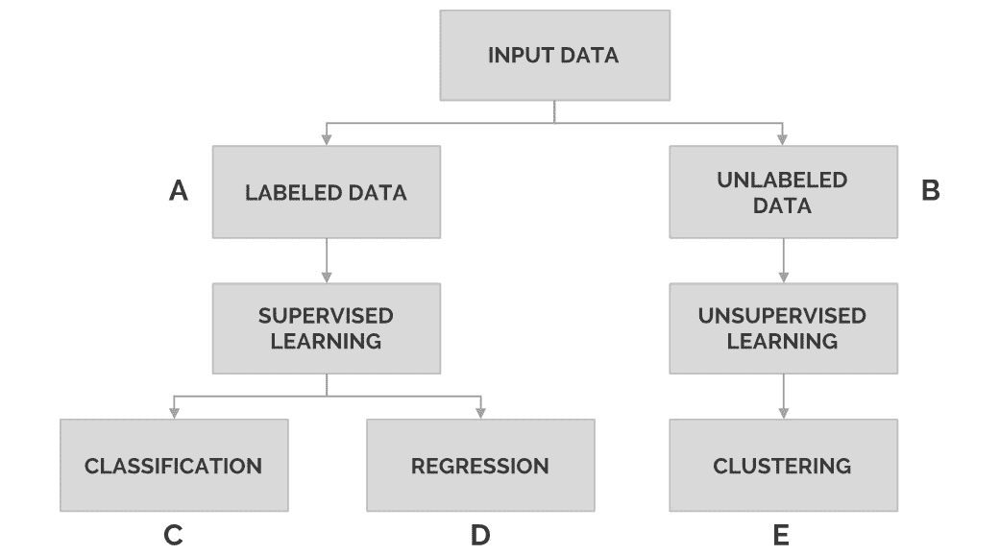

    图 1.1：展示任务划分

    本章的*监督学习与无监督学习*部分将对任务的划分进行更详细的探讨。

1.  **选择一组算法**：一旦完成前述步骤，就可以筛选出那些在输入数据上表现良好并能够达到预期结果的算法。根据你的资源和时间限制，你应该从这些合适的算法中选择一些进行测试，考虑到尝试多种算法始终是一个好习惯。

这些步骤将在下一章中通过一个实际数据问题作为例子进行更详细的解释。

# Scikit-Learn

scikit-learn 由 David Cournapeau 于 2007 年作为 Google Summer of Code 项目的一部分创建，是一个开源的 Python 库，旨在简化基于内置机器学习和统计算法构建模型的过程，无需手动编写代码。它广受欢迎的主要原因是其完整的文档、易于使用的 API 以及众多致力于每天改进该库的合作者。

注意

你可以在[`scikit-learn.org`](http://scikit-learn.org)找到 scikit-learn 的文档。

Scikit-learn 主要用于对数据建模，而不是用于处理或总结数据。它为用户提供了一个易于使用、统一的 API，可以用很少的学习成本应用不同的模型，而无需深入了解背后的数学原理。

注意

要理解这些模型，你需要了解一些数学知识，包括线性代数、概率论和多元微积分。有关这些模型的更多信息，请访问[`towardsdatascience.com/the-mathematics-of-machine-learning-894f046c568`](https://towardsdatascience.com/the-mathematics-of-machine-learning-894f046c568)。

在 scikit-learn 库中可用的模型分为两类，即监督学习和无监督学习，本文稍后将对这两类进行深入解释。这种分类方式有助于确定在特定数据集上使用哪种模型，以获取最大的信息量。

除了在监督学习问题中用于预测未来行为以及在无监督学习问题中进行数据聚类，scikit-learn 还用于以下几个方面：

+   进行交叉验证和性能指标分析，以了解从模型中获得的结果，并从而提升其性能。

+   获取样本数据集以在其上测试算法

+   进行特征提取，从图像或文本数据中提取特征

尽管 scikit-learn 被认为是机器学习领域初学者首选的 Python 库，但全球有许多大公司也在使用它，因为它能通过将模型应用于现有开发来改进产品或服务。同时，它也允许公司快速对新想法进行测试。

一些主要使用 scikit-learn 的公司如下：

+   Spotify：作为最受欢迎的音乐流媒体应用之一，Spotify 主要使用 scikit-learn，原因是该框架提供了丰富的算法选择，同时也很容易将新模型集成到现有开发中。scikit-learn 已被应用于其音乐推荐模型。

+   Booking.com：从开发推荐系统到防止欺诈活动，及许多其他解决方案，这个旅行元搜索引擎能够利用 scikit-learn 探索大量算法，从而创建最先进的模型。

+   Evernote：这款笔记记录和管理应用程序使用 scikit-learn 来处理训练分类模型所需的多个步骤，从数据探索到模型评估。

+   Change.org：由于该框架易于使用且算法种类繁多，这家非营利组织能够创建电子邮件营销活动，触及全球数百万读者。

    注意

    你可以访问 [`scikit-learn.org/stable/testimonials/testimonials.html`](http://scikit-learn.org/stable/testimonials/testimonials.html) 以了解其他使用 scikit-learn 的公司，并查看它们如何使用该库。

总之，scikit-learn 是一个开源的 Python 库，它通过 API 将大多数机器学习任务（包括有监督和无监督）应用于数据问题。它的主要用途是对数据建模，从而可以对未见过的观察数据做出预测；然而，它的功能不限于此，因为该库还允许用户根据正在训练的模型预测结果，并分析模型的性能等。

## Scikit-learn 的优势

以下是使用 scikit-learn 进行机器学习的主要优势：

+   **易用性**：与其他库（如 TensorFlow 或 Keras）相比，scikit-learn 以简洁的 API 和较小的学习曲线为特点。该 API 以其统一性和直接性而受到欢迎。使用 scikit-learn 的用户不一定需要理解模型背后的数学原理。

+   **统一性**：它统一的 API 使得从一个模型切换到另一个模型非常容易，因为不同模型所需的基本语法是相同的。

+   **文档/教程**：该库完全由文档支持，文档易于访问且易于理解。此外，它还提供了逐步教程，涵盖了开发任何机器学习项目所需的所有主题。

+   **可靠性和协作**：作为一个开源库，scikit-learn 受益于多个合作者的贡献，他们每天都在为其性能改进而努力。来自不同背景的专家的参与，不仅帮助开发了一个更完整的库，也使得库更加可靠。

+   **覆盖范围**：当你浏览该库所包含的组件时，你会发现它涵盖了大多数机器学习任务，从有监督的回归任务到无监督的聚类任务。更重要的是，由于拥有众多合作者，新模型通常会在相对较短的时间内加入。

## Scikit-learn 的缺点

以下是使用 scikit-learn 进行机器学习的主要缺点：

+   **不灵活性**：由于易于使用，这个库往往缺乏灵活性。这意味着用户在参数调优或模型架构方面的自由度较低，例如在梯度提升算法和神经网络中。这对于初学者在处理更复杂项目时会成为一个问题。

+   **不适合深度学习**：当处理复杂的机器学习项目时，该库的表现不足。尤其是在深度学习方面，因为 scikit-learn 不支持具有必要架构或计算能力的深度神经网络。

    注意

    深度学习是机器学习的一部分，基于人工神经网络的概念。它通过一系列层次从输入数据中提取有价值的信息（特征）。在本书的后续章节中，您将学习到神经网络，这是能够开发深度学习解决方案的起点。

总的来说，scikit-learn 是一个优秀的入门级库，因为它学习使用起来几乎不需要任何努力，并且有许多辅助材料来帮助其应用。由于多位贡献者的努力，该库保持更新并适用于大多数当前的数据问题。

另一方面，它是一个简单的库，不适合处理更复杂的数据问题，例如深度学习。同样，它也不推荐给那些希望通过调整每个模型中可用的不同参数来提升能力的用户。

## 其他框架

其他流行的机器学习框架如下：

+   TensorFlow：谷歌的开源机器学习框架，至今仍是数据科学家中最受欢迎的框架。它通常与 Python 集成，并且非常适合开发深度学习解决方案。由于其广泛的流行性，网络上关于该框架的信息使得开发不同的解决方案变得非常容易，更不用说它有 Google 的支持。

+   PyTorch：该框架由 Facebook 的 AI 研究实验室主要开发，是一个开源深度学习框架。尽管它是一个相对较新的框架（发布于 2017 年），但由于其易用性和 Python 特性，它的流行度逐渐上升。得益于动态图计算，它使得代码调试变得非常简单。

+   Keras：这是一个开源深度学习框架，通常适合刚入门的人。由于其简洁性，灵活性较差，但非常适合原型设计简单的概念。与 scikit-learn 类似，它也有自己易于使用的 API。

# 数据表示

机器学习的主要目标是通过解释数据来构建模型。为了做到这一点，必须以计算机能够读取的方式输入数据。为了将数据输入到 scikit-learn 模型中，数据必须以表格或矩阵的形式表示，并且具有所需的维度，这将在接下来的章节中讨论。

## 数据表

输入到机器学习问题中的大多数表格是二维的，这意味着它们包含行和列。通常，每一行代表一个观测值（一个实例），而每一列代表每个观测值的一个特征。

以下表格是一个 scikit-learn 示例数据集的片段。该数据集的目的是根据植物的特征区分三种不同类型的鸢尾花。因此，在下表中，每一行代表一棵植物，每一列表示该植物在每个特征上的值：

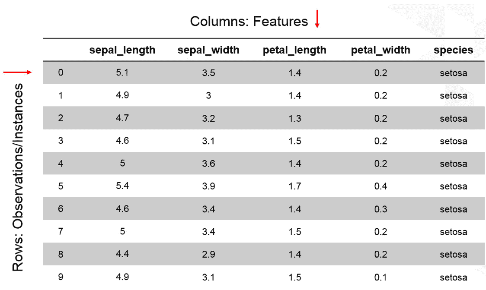

图 1.2：展示鸢尾花数据集前 10 个实例的表格

从前面的说明来看，通过查看前表的第一行，可以确定该观测值对应的是一棵花萼长度为`5.1`、花萼宽度为`3.5`、花瓣长度为`1.4`、花瓣宽度为`0.2`的植物。这棵植物属于`setosa`种类。

注意

当将图像输入到模型时，表格变为三维，其中行和列表示图像的像素维度，而深度则表示其颜色模式。如果你感兴趣，可以了解更多关于*卷积神经网络*的内容。

表格中的数据也称为结构化数据。另一方面，非结构化数据指的是无法存储在类似表格的数据库中的所有其他数据（即，不是以行和列的形式）。这包括图像、音频、视频和文本（如电子邮件或评论）。为了能够将非结构化数据输入到机器学习算法中，第一步应该是将其转化为算法可以理解的格式（即表格数据）。例如，图像被转换为像素矩阵，文本被编码为数值。

## 特征和目标矩阵

对于许多数据问题，数据集中的一个特征将作为`setosa`种类来使用。因此，学习如何将目标矩阵与特征矩阵分开非常重要。

`[n_i, n_f]`，其中`n_i`表示实例的数量（例如数据集中的人群），`n_f`表示特征的数量（例如每个人的基本信息）。通常，特征矩阵存储在一个名为`X`的变量中。

注意

Pandas 是一个为 Python 构建的开源库。它的创建目的是解决与数据操作和分析相关的各种任务。同样，NumPy 是一个开源的 Python 库，用于操作大型多维数组。它还为这些数组提供了大量的数学函数。

`n_i`（实例的数量）。然而，在某些情况下，需要多个目标，因此矩阵的维度变为`[n_i, n_t]`，其中`n_t`是需要考虑的目标数量。

与特征矩阵类似，目标矩阵通常创建为 NumPy 数组或 Pandas 系列。目标数组的值可以是离散的或连续的。通常，目标矩阵存储在名为`Y`的变量中。

## 练习 1.01：加载示例数据集并创建特征和目标矩阵

注意

本书中的所有练习和活动将主要在 Jupyter Notebooks 中进行。建议为不同的作业保持单独的 Notebook，除非另有说明。另外，要加载一个示例数据集，将使用`seaborn`库，它会将数据以表格形式显示。其他加载数据的方法将在后续章节中讲解。

在本练习中，我们将从`seaborn`库加载`tips`数据集，并使用它创建特征和目标矩阵。按照以下步骤完成此练习：

注意

本章的练习和活动要求系统中安装 Python 3.7、Seaborn 0.9、Jupyter 6.0、Matplotlib 3.1、NumPy 1.18 和 Pandas 0.25。

1.  打开一个 Jupyter Notebook 来完成这个练习。在命令提示符或终端中，导航到所需路径并使用以下命令：

    ```py
    jupyter notebook
    ```

1.  使用`seaborn`库加载`tips`数据集。为此，你需要导入`seaborn`库，然后使用`load_dataset()`函数，如下代码所示：

    ```py
    import seaborn as sns
    tips = sns.load_dataset('tips')
    ```

    如我们从前面的代码中看到的，导入库后，会给它起一个别名，以方便在脚本中使用。

    `load_dataset()`函数从在线库加载数据集。数据集中的数据存储在名为`tips`的变量中。

1.  创建一个变量`X`，用于存储特征。使用`drop()`函数包含除目标以外的所有特征，在本例中目标列为`tip`。然后，打印出该变量的前 10 个实例：

    ```py
    X = tips.drop('tip', axis=1)
    X.head(10)
    axis = 0) or columns (axis = 1).
    ```

    输出结果应该如下所示：

    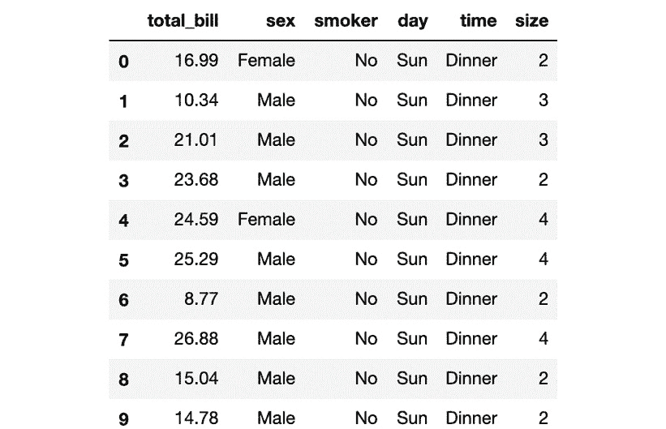

    图 1.3：显示特征矩阵前 10 个实例的表格

1.  使用`X.shape`命令打印出新变量的形状：

    ```py
    X.shape
    ```

    输出结果如下所示：

    ```py
    (244, 6)
    ```

    第一个值表示数据集中的实例数（`244`），第二个值表示特征数（`6`）。

1.  创建一个变量`Y`，用于存储目标值。无需使用函数来完成此操作。通过索引来提取所需的列。索引允许你访问更大元素的某一部分。在这个例子中，我们想要提取名为`tip`的列。然后，我们需要打印出该变量的前 10 个值：

    ```py
    Y = tips['tip']
    Y.head(10)
    ```

    输出结果应该如下所示：

    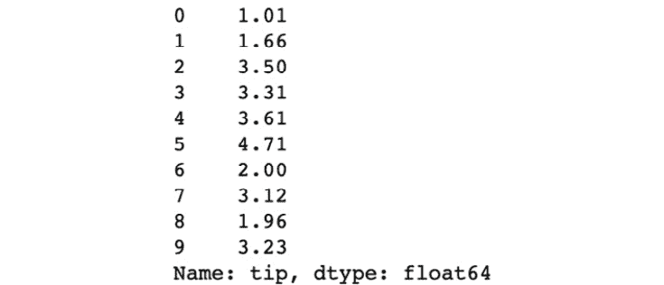

    图 1.4：显示目标矩阵前 10 个实例的截图

1.  使用`Y.shape`命令打印出新变量的形状：

    ```py
    Y.shape
    ```

    输出结果如下所示：

    ```py
    (244,) 
    ```

    形状应该是一维的，长度等于实例的数量（`244`）。

    注意

    若要访问此特定部分的源代码，请参考[`packt.live/2Y5dgZH`](https://packt.live/2Y5dgZH)。

    你也可以在线运行这个示例，网址是[`packt.live/3d0Hsco`](https://packt.live/3d0Hsco)。你必须执行整个 Notebook 才能得到期望的结果。

到此，你已经成功创建了数据集的特征矩阵和目标矩阵。

通常，表示数据的首选方式是使用二维表格，其中行代表观察的数量，也称为实例，列代表这些实例的特征，通常称为特征。

对于需要目标标签的数据问题，数据表需要分为特征矩阵和目标矩阵。特征矩阵将包含每个实例的所有特征值，但不包括目标值，因此它是一个二维矩阵。另一方面，目标矩阵将仅包含所有条目的目标特征值，因此它是一个一维矩阵。

## 活动 1.01：选择目标特征并创建目标矩阵

你想分析泰坦尼克号数据集，查看不同甲板上乘客的生存率，并验证是否可以证明下层甲板的乘客更难幸存。此活动中，我们将尝试加载数据集并通过选择合适的目标特征来创建特征矩阵和目标矩阵，以实现我们的目标。

注意

选择目标特征时，请记住目标应该是我们想要解释数据的结果。例如，如果我们想知道哪些特征在确定植物种类中起作用，那么物种应该是目标值。

按照以下步骤完成此活动：

1.  使用`seaborn`库加载`titanic`数据集。前几行应该是这样的：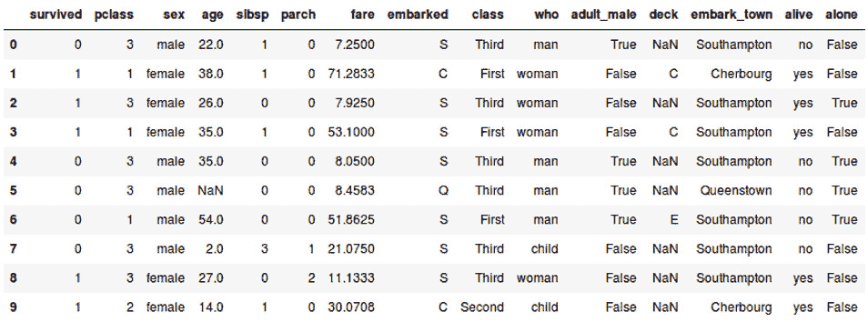

    图 1.5：展示泰坦尼克号数据集前 10 个实例的表格

1.  选择你偏好的目标特征以完成本活动的目标。

1.  创建特征矩阵和目标矩阵。确保将特征矩阵的数据存储在变量`X`中，将目标矩阵的数据存储在另一个变量`Y`中。

1.  打印出每个矩阵的形状，应该与以下值匹配：

    ```py
    Features matrix: (891, 14)
    Target matrix: (891,)
    ```

    注意

    本活动的解决方案可以在第 210 页找到。

# 数据预处理

数据预处理是开发机器学习解决方案中的关键步骤，因为它有助于确保模型不会在偏差数据上训练。它能够提高模型的性能，而且通常是同一算法在同一数据问题上能为进行良好数据预处理的程序员带来更好效果的原因。

为了让计算机能够有效理解数据，不仅需要以标准化的方式输入数据，还需要确保数据中不包含异常值或噪声数据，甚至没有缺失条目。这一点很重要，因为如果做不到这一点，算法可能会做出与数据不符的假设。这将导致模型训练速度变慢，并且由于对数据的误导性解释，准确性较低。

此外，数据预处理不仅仅止于此。模型的工作方式各不相同，每个模型有不同的假设。这意味着我们需要根据将要使用的模型来预处理数据。例如，有些模型仅接受数值型数据，而其他模型则可以处理名义数据和数值数据。

为了在数据预处理中获得更好的结果，一种良好的做法是以不同的方式转换（预处理）数据，然后在不同的模型中测试这些不同的转换。这样，你就能选择适合特定模型的正确转换方式。值得一提的是，数据预处理有可能帮助解决任何数据问题和任何机器学习算法，考虑到仅仅通过标准化数据集，就能提高训练速度。

## 杂乱数据

缺少信息或包含异常值或噪音的数据被视为**杂乱数据**。如果未进行任何预处理来转换数据，可能会导致数据模型构建不佳，因为引入了偏差和信息丢失。这里将解释一些应避免的数据问题。

### 缺失值

数据集的特征和实例可能都有缺失值。对于某些特征，只有少数实例有值，而对于某些实例，所有特征的值都缺失，这些都被视为**缺失数据**：

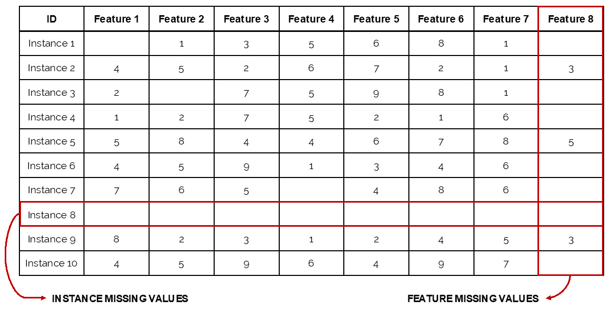

图 1.6：缺失值示例

上图展示了一个实例（实例 8），该实例在所有特征上都没有值，因此它没有任何用处；另外还有一个特征（特征 8），它在 10 个实例中有 7 个缺失值，这意味着该特征无法用于发现实例之间的模式，因为大多数实例没有该特征的值。

通常情况下，缺失超过 5% 到 10% 的值的特征被认为是缺失数据（也称为高缺失率特征），因此需要处理。另一方面，所有特征的值都缺失的实例应被删除，因为它们没有为模型提供任何信息，反而可能引入偏差。

处理具有高缺失率的特征时，建议要么删除该特征，要么用值填充它。替换缺失值的最常见方法如下：

+   **均值填充**：用特征的可用值的均值或中位数来替代缺失值

+   **回归插补**：用从回归函数中获得的预测值替代缺失值。

    注意

    回归函数是指用于估计因变量与一个或多个自变量之间关系的统计模型。回归函数可以是线性、逻辑回归、 polynomial 等。

尽管均值插补是一种更简单的实现方法，但它可能会引入偏差，因为它会使所有实例趋于一致。另一方面，虽然回归方法将数据与其预测值匹配，但它可能会导致模型过拟合（即创建一个过于适应训练数据、无法处理新数据的模型），因为所有引入的值都遵循一个函数。

最后，当缺失值出现在如性别等文本特征中时，最好的做法是要么删除它们，要么用标记为 *未分类* 或类似的类别来替代它们。这主要是因为无法对文本应用均值插补或回归插补。

将缺失值标记为新类别（*未分类*）通常是在删除缺失值会去除数据集中重要部分时采取的做法，因此不适合删除它们。在这种情况下，尽管新标签可能会对模型产生影响，但根据标记缺失值时使用的理由，留空可能是一个更差的选择，因为它会导致模型自行做出假设。

注意

要了解更多关于如何检测和处理缺失值的信息，请访问以下页面：[`towardsdatascience.com/how-to-handle-missing-data-8646b18db0d4`](https://towardsdatascience.com/how-to-handle-missing-data-8646b18db0d4)。

### 异常值

**异常值**是指远离均值的值。这意味着如果一个特征的值符合高斯分布，则异常值位于分布的尾部。

注意

高斯分布（也称为正态分布）具有钟形曲线，因为该分布中大于和小于均值的数值数量相等。

异常值可以是全球性（global）或局部性（local）。前者代表那些与特征值集相距较远的值。例如，当分析某个邻里所有成员的数据时，一个全球异常值可能是一个 180 岁的人（如下面的图示 (`A`) 所示）。而局部异常值则代表那些与某个特征的子集相距较远的值。以我们之前看到的例子为例，一个局部异常值可能是一个 70 岁的大学生（`B`），这通常会与该邻里中的其他大学生不同：

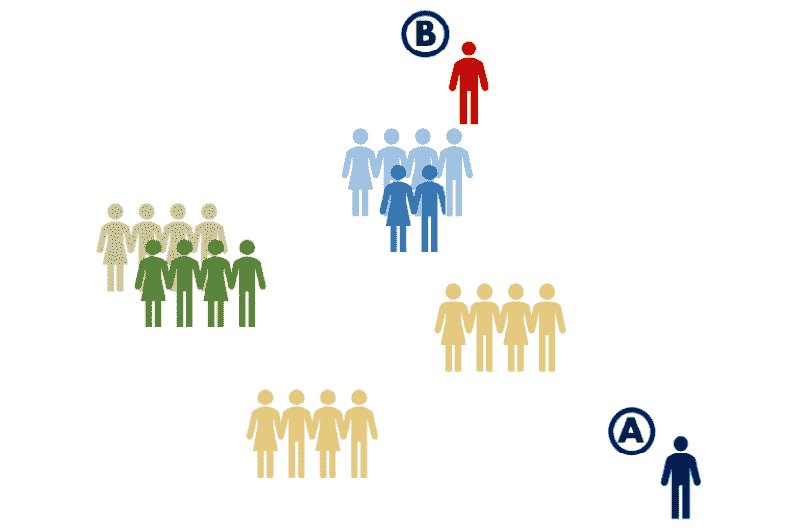

图 1.7：展示数据集中全球性和局部异常值的图像

考虑到上述两个例子，异常值并不会评估值是否可能。虽然一个 180 岁的人不现实，但一个 70 岁的大学生是有可能的，然而这两者都被归类为异常值，因为它们都可能影响模型的表现。

检测异常值的一个直接方法是通过可视化数据来判断它是否符合高斯分布，如果符合，则将落在距离均值三到六个标准差以外的值归类为异常值。然而，并没有一个确定的规则来判断一个异常值，选择标准差数量的决定是主观的，并且会根据不同问题有所变化。

例如，如果通过设置三个标准差为参数来排除值，数据集减少了 40%，那么将标准差的数量调整为四个可能更为合适。

另一方面，在处理文本特征时，检测异常值变得更加棘手，因为没有标准差可以使用。在这种情况下，计算每个类别值的出现次数将有助于判断某个类别是否不可或缺。例如，在服装尺码中，如果 XXS 尺码的比例小于整个数据集的 5%，可能就不需要它。

一旦异常值被检测出来，处理它们的三种常见方法如下：

+   **删除异常值**：对于真实的异常值，最好将它们完全删除，以避免扭曲分析。对于那些错误的异常值，如果它们的数量太大，以至于无法进行进一步分析来赋予新值，删除它们也是一个好主意。

+   **定义一个上限**：为真实值定义一个上限也可能是有用的。例如，如果你意识到所有超过某个阈值的值都表现得相同，你可以考虑将该值设置为一个上限。

+   **赋予一个新值**：如果异常值显然是错误的，你可以使用我们讨论过的处理缺失值的方法之一（均值或回归插补）为其赋予一个新值。

使用上述每种方法的决策取决于异常值的类型和数量。大多数时候，如果异常值的数量占数据集总量的比例较小，那么除了删除它们之外，别无他法。

注意

噪声数据指的是那些不正确或不可能的值。这包括数值型（错误的异常值）和名义型值（例如，一个人的性别被拼写成 "fimale"）。像异常值一样，噪声数据可以通过完全删除这些值或赋予它们一个新值来处理。

## 练习 1.02：处理杂乱数据

在这个练习中，我们将使用 seaborn 的 `tips` 数据集作为示例，演示如何处理杂乱的数据。按照以下步骤完成这个练习：

1.  打开一个 Jupyter Notebook 来实现这个练习。

1.  导入所有必需的元素。接下来，加载 `tips` 数据集并将其存储在名为 `tips` 的变量中。使用以下代码：

    ```py
    import seaborn as sns
    import numpy as np
    import matplotlib.pyplot as plt
    tips = sns.load_dataset('tips')
    ```

1.  接下来，创建一个名为 `size` 的变量来存储数据集中该特征的值。由于此数据集不包含任何缺失数据，我们将 `size` 变量的前 16 个值转换为缺失值。打印 `age` 变量的前 20 个值：

    ```py
    size = tips["size"]
    size.loc[:15] = np.nan
    size.head(20)
    NaN), which is the representation of a missing value. Finally, it prints the top 20 values of the variable.
    ```

    输出将如下所示：

    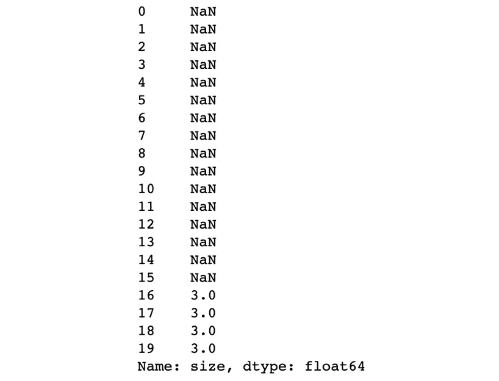

    图 1.8：展示了年龄变量前 20 个实例的截图

    如您所见，该特征包含我们引入的 `NaN` 值。

1.  检查 `size` 变量的形状：

    ```py
    size.shape
    ```

    输出如下所示：

    ```py
    (244,)
    ```

1.  现在，计算 `NaN` 值的数量以确定如何处理它们。使用 `isnull()` 函数找到 `NaN` 值，并使用 `sum()` 函数将它们全部加起来：

    ```py
    size.isnull().sum()
    ```

    输出如下：

    ```py
    16
    ```

    `NaN` 值在变量总大小中的参与率为 6.55%，可以通过将缺失值数量除以特征长度（16/244）来计算。虽然这个比例不高到足以考虑移除整个特征，但确实需要处理缺失值。

1.  让我们选择均值插补方法来替换缺失值。为此，计算可用值的均值，如下所示：

    ```py
    mean = size.mean()
    mean = round(mean)
    print(mean)
    ```

    均值为 `3`。

    注意

    由于 `size` 特征是一个衡量参加餐厅的人数的指标，因此将均值值 `2.55` 四舍五入到最接近的整数。

1.  用均值替换所有缺失值。使用 `fillna()` 函数，该函数接受每个缺失值并用括号内定义的值替换它。再次打印前 10 个值来检查是否已替换：

    ```py
    size.fillna(mean, inplace=True)
    size.head(20)
    ```

    注意

    当 `inplace` 设置为 `True` 时，原始 DataFrame 将被修改。如果未将参数设置为 `True`，则将保留原始数据集的未修改状态。根据此设置 `inplace` 为 `True`，可以替换 `NaN` 值为均值。

    打印输出如下所示：

    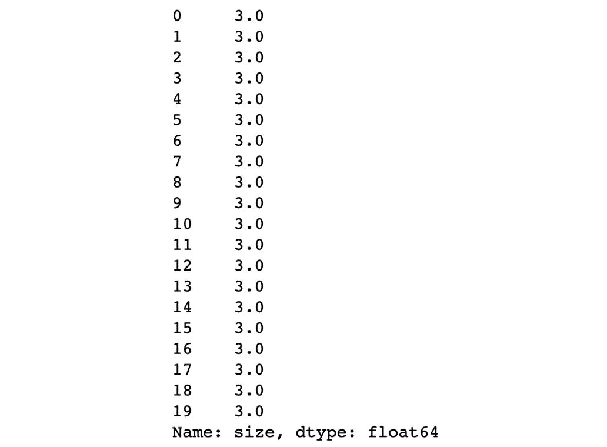

    图 1.9：展示了年龄变量前 20 个实例的截图

    如前面的截图所示，顶部实例的值已从 `NaN` 更改为先前计算的均值 `3`。

1.  使用 Matplotlib 绘制 `age` 变量的直方图。使用 Matplotlib 的 `hist()` 函数，如下所示的代码：

    ```py
    plt.hist(size)
    plt.show()
    ```

    直方图应如下所示。正如我们所见，其分布类似于高斯分布：

    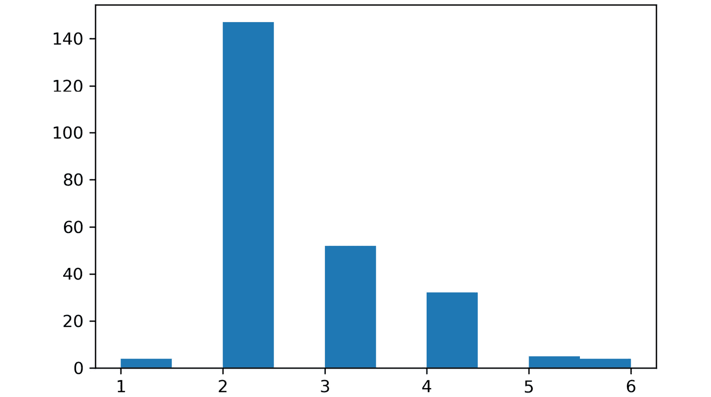

    图 1.10：展示了大小变量的直方图的截图

1.  发现数据中的异常值。让我们使用三个标准偏差作为度量标准来计算最小和最大值。

    如前所述，最小值是通过计算所有值的均值并从中减去三倍标准差来确定的。使用以下代码设置最小值，并将其存储在名为`min_val`的变量中：

    ```py
    min_val = size.mean() - (3 * size.std())
    print(min_val)
    ```

    最小值约为`-0.1974`。根据最小值，左尾的高斯分布没有异常值。这是有道理的，因为分布略微偏向左侧。

    与最小值相反，对于最大值，标准差被加到均值上，以计算更高的阈值。计算最大值，如下所示的代码，并将其存储在名为`max_val`的变量中：

    ```py
    max_val = size.mean() + (3 * size.std())
    print(max_val)
    ```

    最大值约为`5.3695`，它确定了大小大于 5.36 的实例为异常值。正如你在前面的图中所看到的，这也很有意义，因为这些实例远离高斯分布的钟形曲线。

1.  统计大于最大值的实例数量，以决定如何处理它们，按照这里给出的指示进行。

    使用索引获取`size`中高于最大阈值的值，并将其存储在名为`outliers`的变量中。然后，使用`count()`计算异常值的数量：

    ```py
    outliers = size[size > max_val]
    outliers.count()
    ```

    输出显示有`4`个异常值。

1.  打印出异常值并检查是否正确存储了相应的值，如下所示：

    ```py
    print(outliers)
    ```

    输出结果如下：

    

    图 1.11：打印异常值

    由于异常值的数量较少，并且它们确实是异常值，因此可以将其删除。

    注意

    对于这个练习，我们将删除`size`变量中的实例，以了解处理异常值的完整过程。然而，稍后在考虑所有特征时，将处理异常值的删除，以便删除整个实例，而不仅仅是删除大小值。

1.  通过使用索引重新定义`size`中存储的值，只包含低于最大阈值的值。然后，打印`size`的形状：

    ```py
    age = size[size <= max_val]
    age.shape
    ```

    输出结果如下：

    ```py
    (240,)
    ```

    如你所见，`size`的形状（在*步骤 4*中计算）已经减少了四个，这正是异常值的数量。

    注意

    要访问此特定部分的源代码，请参考[`packt.live/30Egk0o`](https://packt.live/30Egk0o)。

    你也可以在[`packt.live/3d321ow`](https://packt.live/3d321ow)在线运行这个示例。你必须执行整个 Notebook 才能获得期望的结果。

你已经成功清理了一个 Pandas 系列。这一过程为稍后的数据集清理提供了指南。

总结一下，我们讨论了数据预处理的重要性，因为如果没有预处理，可能会在模型中引入偏差，进而影响模型的训练时间和性能。数据杂乱的主要表现形式包括缺失值、异常值和噪声。

缺失值，顾名思义，是指那些空缺或为 null 的值。在处理大量缺失值时，重要的是通过删除或分配新值来处理它们。两种分配新值的方法也已讨论过：均值插补和回归插补。

离群值是指与某一特征所有值的均值相差很远的值。检测离群值的一种方法是选择所有超出均值加/减三倍/六倍标准差的值。离群值可能是错误值（不可能的值）或真实值，它们应当采取不同的处理方式。真实的离群值可能会被删除或修正，而错误值则应尽可能用其他值替换。

最后，噪声数据是指那些无论与均值的接近程度如何，都是数据中的错误或拼写错误的值。它们可以是数值型、序数型或名义型的。

注意

请记住，数值数据总是由可以测量的数字表示，名义数据是指不遵循顺序的文本数据，而有序数据是指遵循某种顺序或等级的文本数据。

## 处理类别特征

**类别特征**是包含离散值的特征，这些值通常属于有限的类别集合。类别数据可以是名义的或有序的。名义数据指的是不遵循特定顺序的类别，例如音乐类型或城市名称，而有序数据指的是具有顺序感的类别，例如服装尺码或教育水平。

## 特征工程

尽管许多机器学习算法的改进使得算法能够理解类别数据类型（如文本），但将它们转换为数值值的过程有助于模型的训练，从而提高运行速度和性能。这主要是因为消除了每个类别中可用的语义信息，以及将数据转换为数值值后，可以平等地缩放数据集中的所有特征，正如本章后续部分所解释的那样。

它是如何工作的？特征工程生成一个标签编码，将一个数字值分配给每个类别；然后该值将替换数据集中的类别。例如，一个名为`genre`的变量，具有`pop`、`rock`和`country`类别，可以按如下方式转换：

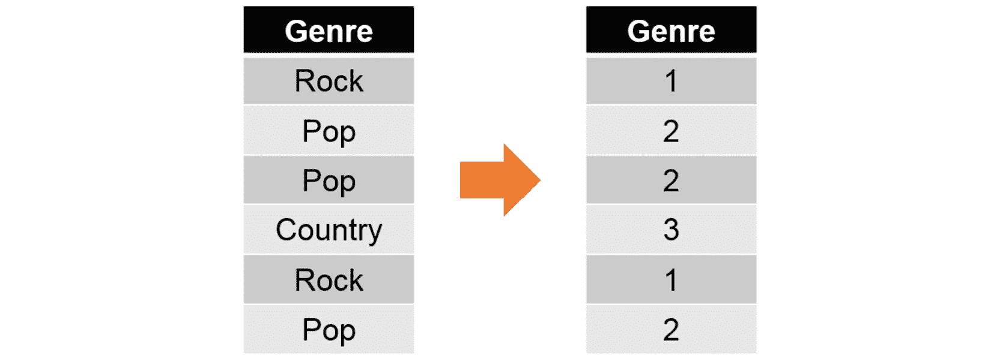

图 1.12：一张展示特征工程如何工作的图片

## 练习 1.03：将特征工程应用于文本数据

在本练习中，我们将把`tips`数据集的文本特征转换为数值数据。

注意

使用你为之前的练习创建的相同 Jupyter Notebook。

按照以下步骤完成本练习：

1.  导入 scikit-learn 的`LabelEncoder()`类，以及`pandas`库，如下所示：

    ```py
    from sklearn.preprocessing import LabelEncoder
    import pandas as pd
    ```

1.  使用之前导入的类（`LabelEncoder`）将每个文本特征转换为数值：

    ```py
    enc = LabelEncoder()
    tips["sex"] = enc.fit_transform(tips['sex'].astype('str'))
    tips["smoker"] = enc.fit_transform(tips['smoker'].astype('str'))
    tips["day"] = enc.fit_transform(tips['day'].astype('str'))
    tips["time"] = enc.fit_transform(tips['time'].astype('str'))
    ```

    根据前面的代码片段，第一步是通过键入第一行代码实例化`LabelEncoder`类。第二步，对于每个类别特征，我们使用该类的内置`fit_transform()`方法，该方法将为每个类别分配一个数值并输出结果。

1.  输出`tips`数据集的前几个值：

    ```py
    tips.head()
    ```

    输出如下：

    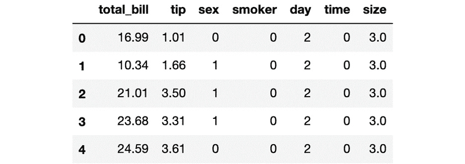

图 1.13：显示 tips 数据集前五个实例的截图

如你所见，类别特征的文本类别已被转换为数值。

注意

若要访问此部分的源代码，请参见[`packt.live/30GWJgb`](https://packt.live/30GWJgb)。

你也可以在[`packt.live/3e2oaVu`](https://packt.live/3e2oaVu)上在线运行此示例。你必须执行整个 Notebook，才能得到所需的结果。

你已经成功地将文本数据转换为数值。

尽管机器学习的进展使得一些算法处理文本特征变得更加容易，但最好将其转换为数值。这一点尤其重要，因为它消除了处理语义时的复杂性，更不用说它为我们提供了从一个模型切换到另一个模型的灵活性，且没有任何限制。

文本数据的转换是通过特征工程完成的，其中每个文本类别都被分配了一个替代它的数值。此外，尽管可以手动完成此过程，但也有一些强大的内置类和方法可以简化这个过程。一个例子就是使用 scikit-learn 的`LabelEncoder`类。

## 数据重缩放

数据重缩放很重要，因为即使数据可以用不同的尺度传递给模型，每个特征的尺度不一致也可能导致算法失去从数据中发现模式的能力，因为它需要做出假设来理解数据，从而使得训练过程变慢并且对模型的性能产生负面影响。

数据重缩放帮助模型更快地运行，且无需为学习数据集中的不变性承担任何负担或责任。此外，在均匀缩放数据上训练的模型会对所有参数分配相同的权重（重要性等级），这使得算法能够泛化到所有特征，而不仅仅是那些值较高的特征，无论它们的含义如何。

一个具有不同尺度的数据集示例是包含不同特征的集合，其中一个特征以千克为单位，另一个测量温度，另一个则统计孩子数量。尽管每个属性的数值都是正确的，但它们的尺度差异很大。例如，千克的数值可以超过 100，而孩子的数量通常不会超过 10。

两种最常用的重缩放数据方法是 **数据归一化** 和 **数据标准化**。没有固定的规则来选择数据转换的重缩放方法，因为所有数据集的表现不同。最佳实践是使用两种或三种重缩放方法转换数据，并在每种方法上测试算法，从而选择最适合数据的算法，依据其性能表现。

重缩放方法应该单独使用。在测试不同的重缩放方法时，数据的转换应独立进行。每个转换可以在模型上进行测试，然后选择最适合的一个用于后续步骤。

**归一化**：机器学习中的数据归一化是指将所有特征的值重缩放，使其落在 0 到 1 之间，并且最大长度为 1。这样做的目的是将不同尺度的属性统一化。

以下公式允许你对特征值进行归一化：


图 1.14：归一化公式

其中，*z*i 代表第 *i* 个归一化值，*x* 代表所有值。

**标准化**：这是一种重缩放技术，它将数据转换为均值为 0，标准差为 1 的高斯分布。

标准化特征的一种简单方法如下公式所示：


图 1.15：标准化公式

其中，*z*i 代表第 *i* 个标准化值，*x* 代表所有值。

## 练习 1.04：数据归一化与标准化

本练习涉及数据的归一化和标准化，以 `tips` 数据集为例。

注意

使用你为前一个练习创建的相同 Jupyter Notebook。

按照以下步骤完成此练习：

1.  使用包含整个数据集的 `tips` 变量，采用归一化公式对数据进行归一化，并将结果存储在一个名为 `tips_normalized` 的新变量中。打印前 10 个值：

    ```py
    tips_normalized = (tips - tips.min())/(tips.max()-tips.min())
    tips_normalized.head(10)
    ```

    输出如下：

    

    图 1.16：显示 `tips_normalized` 变量前 10 个实例的截图

    如前面的截图所示，所有的数值都已转换为介于 0 和 1 之间的等效值。通过对所有特征进行归一化，模型将在相同尺度的特征上进行训练。

1.  再次使用 `tips` 变量，使用标准化公式对数据进行标准化，并将其存储在名为 `tips_standardized` 的变量中。打印出前 10 个值：

    ```py
    tips_standardized = (tips - tips.mean())/tips.std()
    tips_standardized.head(10)
    ```

    输出结果如下：

    

图 1.17：显示 `tips_standardized` 变量前 10 个实例的截图

与归一化相比，标准化中，数值会围绕零正态分布。

注意

要访问此部分的源代码，请参考 [`packt.live/30FKsbD`](https://packt.live/30FKsbD)。

你也可以在网上运行这个示例，网址是 [`packt.live/3e3cW2O`](https://packt.live/3e3cW2O)。你必须执行整个 Notebook 才能获得预期结果。

你已成功地将重缩放方法应用于数据。

总结来说，我们已经涵盖了数据预处理中的最后一步，即数据的重缩放。这个过程是在具有不同尺度特征的数据集上进行的，目的是统一数据的表示方式，以便模型能够更好地理解数据。

如果不对数据进行重缩放，模型将以更慢的速度进行训练，并可能会负面影响模型的性能。

本主题中解释了两种数据重缩放方法：归一化和标准化。一方面，归一化将数据转换为一个长度为 1 的范围（从 0 到 1）。另一方面，标准化将数据转换为具有均值 0 和标准差 1 的高斯分布。

由于没有选择适当重缩放方法的固定规则，推荐的做法是独立地使用两到三种重缩放方法对数据进行转换，然后用每种转换训练模型，评估哪种方法表现最佳。

## 活动 1.02：对整个数据集进行预处理

你继续为一家邮轮公司的安全部门工作。由于你在选择理想的目标特征以开展研究方面表现出色，部门决定委托你负责数据集的预处理工作。为此，你需要使用之前学习的所有技术来预处理数据集，并将其准备好用于模型训练。以下步骤将指导你朝着这个方向前进：

1.  导入 `seaborn` 和来自 scikit-learn 的 `LabelEncoder` 类。接下来，加载 Titanic 数据集，并创建包含以下特征的特征矩阵：`sex`、`age`、`fare`、`class`、`embark_town` 和 `alone`。

    注意

    对于这个活动，特征矩阵仅使用了六个特征，因为其他一些特征对于本研究是冗余的。例如，不需要同时保留 `sex` 和 `gender`。

1.  检查特征矩阵（`X`）中所有特征的缺失值和异常值。选择一种方法来处理它们。

1.  将所有文本特征转换为它们的数值表示。

1.  对数据进行重新缩放，方法是通过归一化或标准化。

    注意

    该活动的解决方案可以在第 211 页找到。

预期输出：结果可能会有所不同，取决于你的选择。然而，你必须确保最终得到一个没有缺失值、异常值或文本特征的数据集，并且数据已重新缩放。

# Scikit-Learn API

scikit-learn API 的目标是提供高效且统一的语法，使机器学习变得更加易于非机器学习专家使用，同时促进和普及其在多个行业中的应用。

## 它是如何工作的？

尽管有许多合作者，scikit-learn API 是在考虑一组原则的基础上构建并持续更新的，这些原则防止了框架代码的过度繁殖，即不同的代码执行相似的功能。相反，它提倡简单的约定和一致性。因此，scikit-learn API 在所有模型中保持一致，一旦掌握了主要功能，就可以广泛应用。

scikit-learn API 被分为三个互补的接口，它们共享相同的语法和逻辑：估算器、预测器和转换器。估算器接口用于创建模型并将数据拟合到模型中；预测器，顾名思义，用于基于已训练的模型进行预测；最后，转换器用于转换数据。

### 估算器

这被认为是整个 API 的核心，因为它负责将模型拟合到输入数据中。它通过实例化要使用的模型，然后应用 `fit()` 方法来触发学习过程，从而根据数据构建模型。

`fit()` 方法接收两个单独的变量作为训练数据的参数：特征矩阵和目标矩阵（通常分别称为 `X_train` 和 `Y_train`）。对于无监督模型，该方法仅接收第一个参数（`X_train`）。

此方法创建经过训练的模型，用于后续的预测。

一些模型除了训练数据外，还需要其他参数，这些参数也被称为 **超参数**。这些超参数最初设置为默认值，但可以调整以提高模型的性能，具体内容将在后续章节中讨论。

以下是一个模型训练的示例：

```py
from sklearn.naive_bayes import GaussianNB
model = GaussianNB()
model.fit(X_train, Y_train)
```

首先，需要从 scikit-learn 导入要使用的算法类型；例如，用于分类的高斯朴素贝叶斯算法（将在*第四章*，*监督学习算法：预测年收入*中进一步探讨）。通常最好只导入需要使用的算法，而不是整个库，因为这样可以确保代码运行得更快。

注意

要查找导入不同模型的语法，请参阅 scikit-learn 的文档。访问以下链接，点击你想实现的算法，你将在那里找到相关说明：[`scikit-learn.org/stable/user_guide.html`](http://scikit-learn.org/stable/user_guide.html)。

第二行代码负责实例化模型并将其存储在一个变量中。最后，将模型拟合到输入数据上。

除此之外，估算器还提供其他辅助任务，如下所示：

+   特征提取，涉及将输入数据转换为可用于机器学习目的的数值特征。

+   特征选择，用于选择对模型预测结果有贡献的数据特征。

+   降维技术，将高维数据转换为低维数据。

### 预测器

如前所述，预测器使用估算器创建的模型，并利用该模型对未见过的数据进行预测。一般而言，对于监督模型，它将新的数据集（通常称为 `X_test`）输入模型，以便根据训练模型时学到的参数得到相应的目标或标签。

此外，一些无监督模型也可以从预测器中受益。虽然该方法不会输出特定的目标值，但它可以用于将一个新实例分配到一个聚类中。

根据前面的示例，预测器的实现如下所示：

```py
Y_pred = model.predict(X_test)
```

我们将 `predict()` 方法应用于之前训练好的模型，并将新的数据作为参数输入该方法。

除了预测外，预测器还可以实现一些方法，这些方法负责量化预测的置信度（即，代表模型性能水平的数值）。这些性能度量因模型而异，但其主要目的是确定预测与现实之间的差距。通过使用带有相应 `Y_test` 的 `X_test` 数据，并将其与使用相同 `X_test` 进行的预测进行比较，来实现这一目标。

### 转换器

正如我们之前看到的，数据通常在输入模型之前进行转换。考虑到这一点，API 包含一个 `transform()` 方法，允许你执行一些预处理技术。

它可以作为转换模型输入数据（`X_train`）的起点，也可以进一步用于修改将提供给模型进行预测的数据。后者的应用至关重要，因为它确保新数据遵循与训练模型时相同的分布，从而获得准确的结果。

以下是一个转换器的示例，用于对训练数据的值进行归一化处理：

```py
from sklearn.preprocessing import StandardScaler
scaler = StandardScaler()
scaler.fit(X_train)
X_train = scaler.transform(X_train)
```

`StandardScaler` 类对其接收到的数据进行标准化。如您所见，在导入并实例化转换器（即 `StandardScaler`）后，需要对数据进行拟合，以便有效地进行转换：

```py
X_test = scaler.transform(X_test)
```

转换器的优点在于，一旦它被应用到训练数据集上，它会存储用于转换训练数据的值；这些值可以用于将测试数据集转换为相同的分布，正如前面的代码片段所示。

总之，我们讨论了使用 scikit-learn 的主要优势之一——其 API。这个 API 遵循一致的结构，使得非专家也能轻松应用机器学习算法。

在 scikit-learn 上建模的第一步是实例化模型的类，并通过估算器将其拟合到输入数据，通常是通过调用类的 `fit()` 方法来完成的。最后，一旦模型训练完成，就可以通过调用类的 `predict()` 方法，使用预测器来预测新值。

此外，scikit-learn 还提供了一个转换器接口，允许根据需要转换数据。这对于在训练数据上执行预处理方法非常有用，预处理后，测试数据也可以按相同的分布进行转换。

# 监督学习与无监督学习

机器学习分为两大类：监督学习和无监督学习。

## 监督学习

监督学习的核心是理解给定特征集与目标值之间的关系，这个目标值也称为**标签**或**类别**。例如，它可以用于建模一个人的人口统计信息与其偿还贷款能力之间的关系，如下表所示：

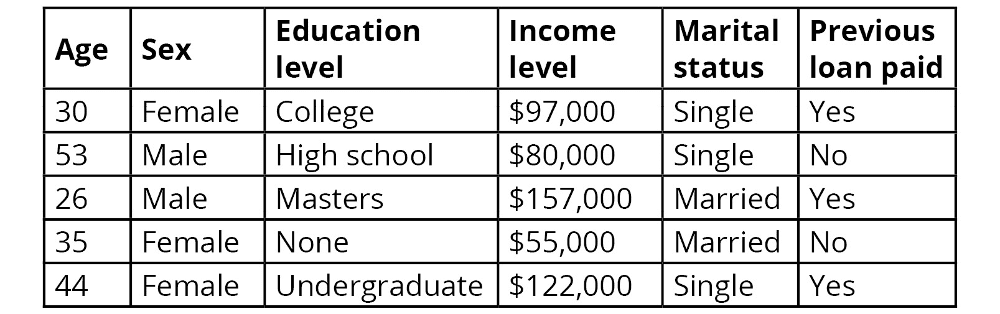

图 1.18：一个人的人口统计信息与偿还贷款能力之间的关系

通过训练来预测这些关系的模型可以应用于预测新数据的标签。正如我们从前面的例子中看到的，建立了这样一个模型的银行可以将贷款申请者的数据输入到模型中，从而确定他们是否可能按时偿还贷款。

这些模型可以进一步分为分类任务和回归任务，具体解释如下。

**分类任务**用于从具有离散类别标签的数据中构建模型；例如，分类任务可以用于预测一个人是否会偿还贷款。你可以有多个离散类别，比如预测赛马的排名，但这些类别必须是有限的。

大多数分类任务将预测输出为实例属于每个输出标签的概率。分配的标签是具有最高概率的标签，如下图所示：

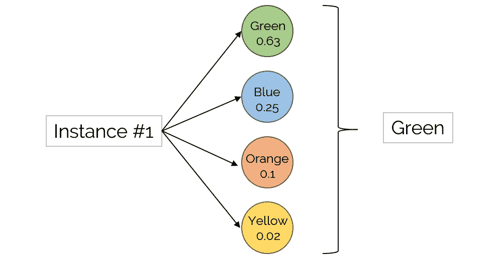

图 1.19：分类算法的示意图

一些最常见的分类算法如下：

+   **决策树**：该算法遵循树状架构，模拟通过一系列决策来做出决策的过程，每次考虑一个变量。

+   **朴素贝叶斯分类器**：该算法依赖于一组基于贝叶斯定理的概率方程，假设特征之间是独立的。它能够考虑多个属性。

+   **人工神经网络（ANN）**：这些模拟生物神经网络的结构和性能，以执行模式识别任务。人工神经网络由相互连接的神经元组成，按照一定的架构布局。它们相互传递信息，直到得到结果。

**回归任务**则用于具有连续数量标签的数据；例如，回归任务可以用于预测房价。这意味着输出值由一个数量表示，而不是一组可能的输出。输出标签可以是整数或浮动类型：

+   最常用的回归任务算法是**线性回归**。它仅包含一个独立特征（x），其与依赖特征（y）之间的关系是线性的。由于其简单性，通常被忽视，尽管它在处理简单数据问题时表现得非常好。

+   其他更复杂的回归算法包括**回归树**、**支持向量回归**，以及再次使用的**人工神经网络（ANN）**。

## 无监督学习

无监督学习是指将模型拟合到数据中，而不与输出标签存在任何关系，这也被称为无标签数据。这意味着该类别的算法试图理解数据并发现其中的模式。例如，无监督学习可以用来了解属于某个社区的人的特征，如下图所示：

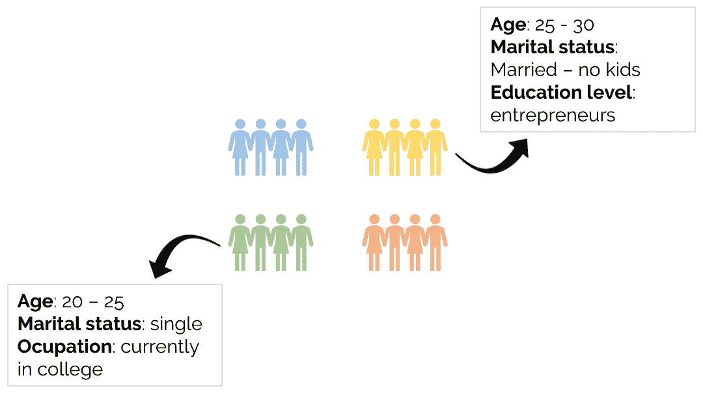

图 1.20：无监督算法如何用于了解人群特征的示意图

在应用预测器到这些算法时，输出中没有给出目标标签。预测只对某些模型可用，它将新实例放入已创建的数据子组中。无监督学习进一步划分为不同的任务，但最受欢迎的任务是聚类，接下来将讨论这一点。

**聚类任务**涉及创建数据组（簇），同时遵守这样一个条件：一个组中的实例与其他组中的实例在视觉上有明显区别。任何聚类算法的输出是一个标签，将实例分配到该标签的簇中：


图 1.21：一个表示多种大小簇的图示

上面的图示展示了一组簇，每个簇的大小不同，基于属于每个簇的实例数量。考虑到这一点，尽管簇不需要具有相同数量的实例，但可以设置每个簇的最小实例数量，以避免将数据过拟合到非常具体的小簇中。

一些最受欢迎的聚类算法如下：

+   **k 均值**：该算法通过最小化两个点之间的平方距离之和，将实例分成 n 个方差相等的簇。

+   **均值漂移聚类**：通过使用质心来创建簇。每个实例都成为质心的候选者，质心是该簇中所有点的均值。

+   **基于密度的空间聚类（DBSCAN）**：它通过密度较高的点区域来确定簇，簇之间由密度较低的区域分隔。

# 总结

机器学习（ML）包括构建能够将数据转化为可以用来做决策的知识的模型，其中一些模型基于复杂的数学概念来理解数据。Scikit-learn 是一个开源的 Python 库，旨在简化将这些模型应用于数据问题的过程，无需过多的复杂数学知识。

本章解释了预处理输入数据的关键步骤，从将特征与目标分开，到处理杂乱数据以及重新缩放数据值。在开始训练模型之前，应该执行所有这些步骤，因为它们有助于提高训练速度以及模型的表现。

接下来，解释了 scikit-learn API 的不同组件：估计器、预测器和转换器。最后，本章讲解了监督学习和无监督学习之间的区别，并介绍了每种学习类型中最受欢迎的算法。

考虑到这一点，在下一章中，我们将重点详细说明如何为实际数据集实现一个无监督算法。
