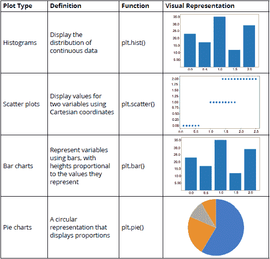

# 第二章：2\. 无监督学习 – 现实生活中的应用

概述

本章介绍机器学习中的聚类概念。它解释了三种最常见的聚类算法，并通过实际数据问题的近似解决方案进行了实际操作。通过本章的学习，您应该能够深入了解如何使用 k-means、均值漂移和 DBSCAN 算法从数据集中创建簇，以及如何衡量这些簇的准确性。

# 简介

在上一章中，我们学习了如何以表格格式表示数据，创建特征和目标矩阵，预处理数据，并学习了如何选择最适合问题的算法。我们还学习了 scikit-learn API 的工作原理以及为什么易于使用，以及监督学习和无监督学习之间的区别。

本章侧重于无监督学习领域中最重要的任务：聚类。考虑一种情况，您是一家店铺的所有者，希望通过定向社交媒体活动来促销特定产品给某些客户。使用聚类算法，您将能够创建客户的子群体，从而可以根据客户的特点来定位和目标客户。本章的主要目标是解决一个案例研究，您将在其中实施三种不同的无监督学习解决方案。这些不同的应用程序旨在演示 scikit-learn API 的一致性，以及解决机器学习问题所需的步骤。通过本章，您将能够了解使用无监督学习来理解数据以便做出明智决策。

# 聚类

**聚类**是一种无监督学习技术，其目标是基于未标记的输入数据中发现的模式得出结论。这种技术主要用于将大数据分成子群体，以便做出明智的决策。

例如，从一个城市的大型餐厅列表中，根据食物类型、客户数量和体验风格，将数据分成子群体（簇）将非常有用，以便为每个簇提供针对其特定需求配置的服务。

聚类算法将数据点划分为*n*个簇，使得同一簇内的数据点具有相似的特征，而与其他簇的数据点显著不同。

## 聚类类型

聚类算法可以使用**硬**或**软**的方法对数据点进行分类。前者将数据点完全指定给某一个簇，而后者则计算每个数据点属于每个簇的概率。例如，对于一个包含顾客过去订单的数据集，这些订单被分成八个子组（簇），硬聚类发生在每个顾客被放入八个簇中的其中一个。而软聚类则为每个顾客分配一个属于八个簇中每个簇的概率。

考虑到簇是基于数据点之间的相似性创建的，聚类算法可以根据用于衡量相似性的规则集进一步划分为几类。以下是四种最常见的规则集的解释：

+   **基于连通性的模型**：该模型的相似性方法基于数据空间中的接近度。簇的创建可以通过将所有数据点分配到一个簇中，然后随着数据点之间的距离增加，将数据划分为更小的簇来实现。同样，算法也可以从为每个数据点分配一个独立的簇开始，然后将接近的数据点合并在一起。基于连通性的模型的一个例子是层次聚类。

+   **基于密度的模型**：顾名思义，这些模型通过数据空间中的密度来定义簇。这意味着数据点密度较高的区域将形成簇，簇通常会被低密度区域分开。一个例子是 DBSCAN 算法，本章稍后将详细介绍。

+   **基于分布的模型**：属于此类别的模型基于所有来自同一簇的数据点遵循相同分布的概率，例如高斯分布。此类模型的一个例子是高斯混合算法，它假设所有数据点来自有限数量的高斯分布的混合体。

+   **基于质心的模型**：这些模型基于定义每个簇的质心的算法，该质心通过迭代过程不断更新。数据点会被分配到与其质心的距离最小的簇。此类模型的一个例子是 k 均值算法，本章稍后会讨论。

总之，数据点根据它们之间的相似性以及与其他簇中数据点的差异来分配到不同的簇中。这样的簇划分可以是绝对的，也可以通过确定每个数据点属于每个簇的概率来进行变动。

此外，并没有一套固定的规则来确定数据点之间的相似性，这也是不同聚类算法使用不同规则的原因。一些最常见的规则集包括基于连接性、基于密度、基于分布和基于质心的规则。

## 聚类的应用

与所有机器学习算法一样，聚类在不同领域有着广泛的应用，以下是其中的一些应用：

+   **搜索引擎结果**：聚类可以用于生成包含与用户搜索关键词相近的关键词的搜索引擎结果，并按与搜索结果的相似度进行排序。以谷歌为例，它不仅使用聚类来检索结果，还用聚类来建议新的可能搜索内容。

+   **推荐程序**：聚类也可以用于推荐程序，例如将具有相似特征的用户聚集在一起，然后根据每个成员的购买历史进行推荐。以亚马逊为例，它根据你的购买历史以及相似用户的购买记录推荐更多商品。

+   **图像识别**：聚类可用于将相似的图像分组。例如，Facebook 使用聚类来帮助识别图片中的人物。

+   **市场细分**：聚类还可以用于市场细分，将潜在客户或客户列表分成子群体，以提供定制化的体验或产品。例如，Adobe 利用聚类分析对客户进行细分，从而根据客户的消费意愿进行不同的定位。

上述示例表明，聚类算法可以用来解决不同行业中的不同数据问题，其主要目的是理解大量的历史数据，这些数据在某些情况下可以用来分类新的实例。

# 探索数据集 – 批发客户数据集

作为学习聚类算法的行为和应用的一部分，本章的以下部分将重点解决一个实际的数据问题，使用的是在 UC Irvine 机器学习仓库中提供的批发客户数据集。

注意

仓库中的数据集可能包含原始数据、部分预处理数据或已处理数据。在使用这些数据集时，请确保阅读可用数据的规格说明，以了解有效建模数据的过程，或者判断该数据集是否适合你的目的。

例如，当前数据集是一个来自更大数据集的提取，引用如下：

该数据集来源于一个更大的数据库，相关文献为：Abreu, N. (2011). 《客户 Recheio 的分析与促销系统的开发》。市场营销硕士，ISCTE-IUL，里斯本。

在接下来的部分，我们将分析数据集的内容，然后将其用于*活动 2.01*，*使用数据可视化辅助预处理过程*。要从 UC Irvine 机器学习库下载数据集，请执行以下步骤：

1.  访问以下链接：[`archive.ics.uci.edu/ml/datasets/Wholesale+customers`](http://archive.ics.uci.edu/ml/datasets/Wholesale+customers)。

1.  在数据集标题下方，找到下载部分并点击`Data Folder`。

1.  点击`Wholesale Customers data.csv`文件以触发下载并将文件保存在当前 Jupyter Notebook 的相同路径下。

    注意

    你也可以通过访问这本书的 GitHub 存储库来访问它：[`packt.live/3c3hfKp`](https://packt.live/3c3hfKp )

## 理解数据集

每一步都将以通用方式进行解释，然后会对其在当前案例研究（批发客户数据集）中的应用进行解释：

1.  首先，理解负责收集和维护数据的人员呈现数据的方式至关重要。

    考虑到案例研究的数据集是从在线资源库获取的，必须理解其呈现的格式。批发客户数据集包含批发分销商客户的历史数据片段。它包含总共 440 个实例（每一行）和八个特征（每一列）。

1.  接下来，确定研究的目的非常重要，这取决于可用的数据。尽管这可能看起来像是一个冗余的陈述，但许多数据问题变得棘手，因为研究人员对研究目的没有清晰的了解，从而选择了错误的预处理方法、模型和性能指标。

    在批发客户数据集上使用聚类算法的目的是理解每个客户的行为。这将使您能够将具有相似行为的客户分组到一个簇中。客户的行为将由他们在每个产品类别上的支出量、以及购买产品的渠道和地区来定义。

1.  随后探索所有可用的特征。这主要是出于两个原因：首先，根据研究目的排除被认为具有低相关性的特征或被认为是多余的特征，其次，理解呈现值的方式以确定可能需要的一些预处理技术。

    当前案例研究具有八个特征，每个特征都被认为与研究目的相关。下表对每个特征进行了解释：

    

图 2.1：案例研究中特征解释的表格

在前面的表格中，没有特征需要被忽略，且名义（分类）特征已经由数据集的作者处理。

总结一下，选择数据集或收到数据集时，首先需要了解初步可见的特征，这包括识别可用信息，然后确定项目的目的，最后修改特征，选择那些将用于研究的特征。之后，数据可以进行可视化，以便在预处理之前理解数据。

# 数据可视化

一旦数据被修改以确保能够用于预期目的，就可以加载数据集并使用数据可视化进一步理解数据。数据可视化并不是开发机器学习项目的必需步骤，尤其是在处理具有数百或数千个特征的数据集时。然而，它已成为机器学习的重要组成部分，主要用于可视化以下内容：

+   特定的导致问题的特征（例如，包含大量缺失值或异常值的特征）以及如何处理这些问题。

+   来自模型的结果，例如已创建的聚类或每个标签类别的预测实例数量。

+   模型的性能，以便查看不同迭代中的行为。

数据可视化在上述任务中的流行，可以通过人脑在图表或图形的呈现下容易处理信息来解释，这使得我们能够对数据有一个总体的理解。它还帮助我们识别需要注意的领域，比如异常值。

## 使用 pandas 加载数据集

一种便于管理数据集的存储方式是使用 pandas DataFrame。这些工作方式类似于具有标签轴的二维大小可变矩阵。它们便于使用不同的 pandas 函数来修改数据集以进行预处理。

大多数在线存储库中找到的数据集，或公司为数据分析收集的数据集，都存储在**逗号分隔值**（**CSV**）文件中。CSV 文件是以表格形式显示数据的文本文件。列由逗号（,）分隔，行位于不同的行上：

![图 2.2：CSV 文件的屏幕截图]

](img/B15781_02_02.jpg)

图 2.2：CSV 文件的屏幕截图

使用 pandas 的`read_csv()`函数加载存储在 CSV 文件中的数据集并将其放入 DataFrame 中是非常简单的。它接收文件路径作为参数。

注意

当数据集存储在不同格式的文件中时，如 Excel 或 SQL 数据库，分别使用 pandas 的`read_xlsx()`或`read_sql()`函数。

以下代码展示了如何使用`pandas`加载数据集：

```py
import pandas as pd
file_path = "datasets/test.csv"
data = pd.read_csv(file_path)
print(type(data))
```

首先，导入 pandas 库。接下来，定义文件的路径，以便将其输入到`read_csv()`函数中。最后，打印`data`变量的类型，以验证已创建一个 Pandas DataFrame。

输出结果如下：

```py
<class 'pandas.core.frame.DataFrame'>
```

如前面的代码片段所示，名为 `data` 的变量是 pandas DataFrame 类型。

## 可视化工具

目前有不同的开源可视化库，其中 seaborn 和 matplotlib 很突出。在上一章中，使用 seaborn 加载并显示数据；然而，从本节开始，我们将选择 matplotlib 作为我们的可视化库。这主要是因为 seaborn 是基于 matplotlib 构建的，目的是引入几种绘图类型并改善显示格式。因此，一旦你学习了 matplotlib，你也可以导入 seaborn 来提高绘图的视觉质量。

注意

有关 seaborn 库的更多信息，请访问以下链接：[`seaborn.pydata.org/`](https://seaborn.pydata.org/)。

一般来说，matplotlib 是一个易于使用的 Python 库，用于绘制 2D 高质量图形。对于简单的绘图，库的 `pyplot` 模块就足够了。

以下表格解释了一些最常用的绘图类型：



图 2.3：列出常用绘图类型的表格（*）

第三列中的函数在导入 matplotlib 及其 `pyplot` 模块后可以使用。

注意

访问 matplotlib 的文档，了解您希望使用的绘图类型：[`matplotlib.org/`](https://matplotlib.org/)，以便您可以尝试不同的参数和函数来编辑绘图结果。

## 练习 2.01：绘制 Circles 数据集中的一个特征的直方图

在本练习中，我们将绘制 circles 数据集中的一个特征的直方图。执行以下步骤以完成此练习：

注意

对本章中的所有练习使用相同的 Jupyter Notebook。`circles.csv` 文件可以在 [`packt.live/2xRg3ea`](https://packt.live/2xRg3ea) 下载。

本章中的所有练习和活动，您需要在系统中安装 Python 3.7、matplotlib、NumPy、Jupyter 和 pandas。

1.  打开一个 Jupyter Notebook 来实现此练习。

1.  首先，通过输入以下代码来导入你将要使用的所有库：

    ```py
    import pandas as pd
    import numpy as np
    import matplotlib.pyplot as plt
    ```

    `pandas` 库用于将数据集保存为 DataFrame，`matplotlib` 用于可视化，NumPy 在本章后面的练习中会使用，但由于使用的是相同的 Notebook，这里已经导入了。

1.  使用 Pandas 的 `read_csv` 函数加载 circles 数据集。输入以下代码：

    ```py
    data = pd.read_csv("circles.csv")
    plt.scatter(data.iloc[:,0], data.iloc[:,1])
    plt.show()
    ```

    创建一个名为 `data` 的变量来存储 circles 数据集。最后，绘制一个散点图来显示数据空间中的数据点，其中第一个元素是数据集的第一列，第二个元素是数据集的第二列，从而创建一个二维图：

    注意

    Matplotlib 的`show()`函数用于触发图表的显示，考虑到前面的代码行只是创建了图表。在 Jupyter Notebooks 中，使用`show()`函数并非必需，但它是一个好习惯，因为在其他编程环境中，必须使用此函数才能显示图表。这也能提高代码的灵活性。另外，在 Jupyter Notebooks 中，使用此函数会使输出更干净。

    

    图 2.4: 圆形数据集的散点图

    最终输出是一个包含两个特征和 1,500 个实例的数据集。在这里，点代表一个数据点（一个观察值），其位置由数据集中每个特征的值标记。

1.  从两个特征中的一个创建直方图。使用切片选择你想要绘制的特征：

    ```py
    plt.hist(data.iloc[:,0])
    plt.show()
    ```

    该图将类似于以下图表所示：

    

图 2.5: 显示使用第一个特征数据获得的直方图的截图

注意

要访问此特定部分的源代码，请参考[`packt.live/2xRg3ea`](https://packt.live/2xRg3ea)。

你也可以在网上运行这个示例，链接：[`packt.live/2N0L0Rj`](https://packt.live/2N0L0Rj)。你必须执行整个 Notebook，才能获得期望的结果。

你已经成功地使用 matplotlib 创建了散点图和直方图。同样，使用 matplotlib 也可以创建不同类型的图表。

总结来说，数据可视化工具帮助你更好地理解数据集中可用的数据、模型的结果以及模型的性能。这是因为人类大脑更容易接受视觉形式，而不是大量的数据文件。

Matplotlib 已成为最常用的数据可视化库之一。在该库支持的不同类型的图表中，包括直方图、条形图和散点图。

## 活动 2.01: 使用数据可视化来辅助预处理过程

你公司市场团队希望了解客户的不同档案，以便能够将营销精力集中在每个档案的个人需求上。为此，团队提供了 440 条先前的销售数据给你们的团队。你的第一个任务是对数据进行预处理。你将使用数据可视化技术展示你的发现，以帮助同事理解你在此过程中做出的决策。你应该使用 pandas 加载 CSV 数据集，并使用数据可视化工具帮助预处理过程。以下步骤将指导你如何完成这一过程：

1.  导入所有必要的元素以加载数据集并进行预处理。

1.  使用 Pandas 的`read_csv()`函数加载先前下载的数据集，假设数据集存储在 CSV 文件中。将数据集存储在一个名为`data`的 pandas DataFrame 中。

1.  检查你的 DataFrame 中是否存在缺失值。如果存在，处理缺失值，并通过数据可视化支持你的决策。

    注意

    使用`data.isnull().sum()`来一次性检查整个数据集中的缺失值，就像我们在上一章中学到的那样。

1.  检查你的 DataFrame 中是否存在离群值。如果存在，处理离群值，并通过数据可视化支持你的决策。

    注意

    将所有偏离均值三个标准差的值标记为离群值。

1.  使用归一化或标准化公式重新缩放数据。

    注意

    标准化通常在聚类目的上效果更好。注意，你可以在第 216 页找到这个活动的解决方案。

    预期输出：检查 DataFrame 时，你应该发现数据集中没有缺失值，并且有六个特征包含离群值。

## k-means 算法

k-means 算法用于建模没有标签类别的数据。它涉及将数据分成*K*个子组。数据点分类到每个组是基于相似性，如前所述（参见*聚类类型*部分），对于该算法，相似性通过数据点到簇的中心（质心）的距离来衡量。算法的最终输出是每个数据点与其所属簇的质心相关联，这可以用于为同一簇中的新数据进行标记。

每个簇的质心代表一组特征，可以用来定义属于该簇的数据点的性质。

## 理解算法

k-means 算法通过一个迭代过程工作，涉及以下步骤：

1.  根据用户定义的簇数量，质心可以通过设置初始估计值或从数据点中随机选择来生成。这个步骤称为*初始化*。

1.  所有数据点通过测量它们到质心的距离分配给数据空间中最近的簇，这被称为分配步骤。目标是最小化平方欧氏距离，公式如下：

    ```py
    min dist(c,x)2
    ```

    这里，`c`表示质心，`x`表示数据点，`dist()`是欧氏距离。

1.  质心通过计算属于同一簇的所有数据点的均值重新计算。这个步骤称为*更新步骤*。

*步骤 2*和*步骤 3*在迭代过程中重复执行，直到满足某个标准。这个标准可以是：

+   定义的迭代次数。

+   数据点不会在簇之间变化。

+   最小化欧氏距离。

算法设置为始终得出一个结果，尽管这个结果可能会收敛到局部或全局最优解。

k-means 算法接收多个参数作为输入以运行模型。最重要的参数是初始化方法（`init`）和聚类数目（`K`）。

注意

若要查看 scikit-learn 库中 k-means 算法的其他参数，请访问以下链接：[`scikit-learn.org/stable/modules/generated/sklearn.cluster.KMeans.html`](http://scikit-learn.org/stable/modules/generated/sklearn.cluster.KMeans.html)。

### 初始化方法

算法的一个重要输入是用于生成初始质心的初始化方法。scikit-learn 库允许的初始化方法如下所述：

+   `k-means++`：这是默认选项。质心是从数据点集中随机选择的，考虑到质心必须彼此远离。为此，该方法为那些距离其他质心较远的数据点分配更高的作为质心的概率。

+   `random`：此方法从数据点中随机选择 K 个观察值作为初始质心。

### 选择聚类数目

正如我们之前讨论的，数据被划分成的聚类数目是由用户设置的，因此选择合适的聚类数目非常重要。

用于衡量 k-means 算法性能的一个指标是数据点与其所属聚类质心之间的平均距离。然而，这个指标可能会适得其反，因为聚类数目越多，数据点与其质心之间的距离越小，这可能导致聚类数（*K*）与数据点的数量相同，从而破坏聚类算法的目的。

为避免这种情况，可以绘制数据点与聚类质心之间的平均距离与聚类数的关系图。适当的聚类数对应于图中的断点，即减少速率发生剧烈变化的地方。在下图中，虚线圆圈表示理想的聚类数：


图 2.6：展示如何估计断点的图表

## 练习 2.02：导入并在数据集上训练 k-means 算法

接下来的练习将使用与上一练习相同的数据集。考虑到这一点，请使用你在上一练习中使用的同一个 Jupyter Notebook。执行以下步骤以完成此练习：

1.  打开你用于上一练习的 Jupyter Notebook。在这里，你应该已经导入了所有必需的库，并将数据集存储在名为 `data` 的变量中。

1.  如下所示，从 scikit-learn 导入 k-means 算法：

    ```py
    from sklearn.cluster import KMeans
    ```

1.  要选择*K*的值（即理想的簇数），请计算数据点到其簇质心的平均距离，并与簇的数量进行对比。此练习中使用 20 作为最大簇数。以下是此代码片段：

    ```py
    ideal_k = []
    for i in range(1,21):
        est_kmeans = KMeans(n_clusters=i, random_state=0)
        est_kmeans.fit(data)
        ideal_k.append([i,est_kmeans.inertia_])
    ```

    注意

    `random_state`参数用于确保结果的可重复性，确保算法的随机初始化保持一致。

    首先，创建一个变量用来存储值，并命名为`ideal_k`。接下来，执行一个`for`循环，从 1 个簇开始，直到达到所需的数量（考虑到簇的最大数量不得超过实例的总数）。

    在前面的示例中，有一个限制，最多只能创建 20 个簇。由于这个限制，`for`循环从 1 到 20 个簇。

    注意

    记住，`range()`是一个上界不包含的函数，这意味着范围会到达上界以下的一个值。当上界为 21 时，范围会到达 20。

    在`for`循环中，实例化算法并设定要创建的簇的数量，然后将数据拟合到模型中。接下来，将数据对（簇的数量，平均距离到质心）追加到名为`ideal_k`的列表中。

    到质心的平均距离无需计算，因为模型会在`inertia_`属性下输出它，可以通过`[model_name].inertia_`调用。

1.  将`ideal_k`列表转换为 NumPy 数组，以便绘制图形。使用以下代码片段：

    ```py
    ideal_k = np.array(ideal_k)
    ```

1.  绘制你在前面步骤中计算的关系，找到理想的*K*值，以便输入到最终模型中：

    ```py
    plt.plot(ideal_k[:,0],ideal_k[:,1])
    plt.show()
    ```

    输出如下：

    

    图 2.7：显示绘图函数输出的截图

    在前面的图表中，*x 轴*表示簇的数量，而*y 轴*表示每个簇中数据点到其质心的平均距离。

    绘图的拐点大约在`5`。

1.  使用`K=5`训练模型。使用以下代码：

    ```py
    est_kmeans = KMeans(n_clusters=5, random_state=0)
    est_kmeans.fit(data)
    pred_kmeans = est_kmeans.predict(data)
    ```

    第一行使用`5`作为簇的数量实例化模型。然后，数据被拟合到模型中。最后，模型用来为每个数据点分配一个簇。

1.  绘制数据点聚类结果的图表：

    ```py
    plt.scatter(data.iloc[:,0], data.iloc[:,1], c=pred_kmeans)
    plt.show()
    ```

    输出如下：

    

图 2.8：显示绘图函数输出的截图

由于数据集仅包含两个特征，因此每个特征作为输入传递给散点图函数，这意味着每个特征由一个坐标轴表示。此外，从聚类过程中获得的标签用作显示数据点的颜色。因此，每个数据点根据两个特征的值定位于数据空间中，颜色代表形成的聚类。

注意

对于具有两个以上特征的数据集，聚类的可视化表示不像前述截图中那样直观。这主要是因为每个数据点（观察值）在数据空间中的位置是基于所有特征的集合，而在视觉上只能显示最多三个特征。

您已经成功导入并训练了 k-means 算法。

注意

要访问本练习的源代码，请参考[`packt.live/30GXWE1`](https://packt.live/30GXWE1)。

您也可以在[`packt.live/2B6N1c3`](https://packt.live/2B6N1c3)上在线运行此示例。您必须执行整个 Notebook 才能获得所需的结果。

总之，k-means 算法旨在将数据分为*K*个聚类，*K*是由用户设置的参数。数据点根据其与聚类中心的接近程度被分组，聚类中心通过迭代过程计算得出。

初始中心点根据已定义的初始化方法设置。然后，所有数据点都会被分配到离它们在数据空间中的位置更近的聚类中心，使用欧氏距离作为度量。一旦数据点被分配到聚类中，每个聚类的中心点会重新计算为所有数据点的均值。这个过程会重复多次，直到满足停止标准。

## 活动 2.02：将 k-means 算法应用于数据集

在进行此活动之前，请确保您已完成*活动 2.01*，*使用数据可视化辅助预处理过程*。

在继续分析您公司过往订单的过程中，您现在负责将 k-means 算法应用于数据集。使用之前加载的批发客户数据集，对数据应用 k-means 算法并将数据分类为聚类。执行以下步骤完成此活动：

1.  打开您在上一个活动中使用的 Jupyter Notebook。在那里，您应该已导入所有必需的库并执行了必要的步骤以预处理数据集。

1.  计算数据点到其聚类中心的平均距离，并根据聚类数量来选择合适的聚类数以训练模型。

1.  训练模型并为数据集中的每个数据点分配一个聚类。绘制结果。

    注意

    你可以使用 Matplotlib 的`subplots()`函数同时绘制两个散点图。要了解更多关于此函数的信息，请访问 Matplotlib 的文档，网址如下：[`matplotlib.org/api/_as_gen/matplotlib.pyplot.subplots.html`](https://matplotlib.org/api/_as_gen/matplotlib.pyplot.subplots.html)。

    你可以在第 220 页找到此活动的解决方案。

    聚类的可视化将根据聚类的数量（k）和需要绘制的特征而有所不同。

# 均值漂移算法

**均值漂移算法**通过根据数据空间中数据点的密度为每个数据点分配一个簇，密度也称为分布函数中的模式。与 k-means 算法不同，均值漂移算法不需要你指定簇的数量作为参数。

该算法通过将数据点建模为分布函数来工作，其中高密度区域（数据点密集的区域）代表高峰值。然后，基本思路是将每个数据点移动到最近的峰值，从而形成一个簇。

## 理解算法

均值漂移算法的第一步是将数据点表示为一个密度分布。为此，算法基于**核密度估计**（**KDE**）的方法进行构建，KDE 是一种用于估算数据集分布的方法：


图 2.9：描述核密度估计（KDE）背后思想的图像

在前面的图中，形状底部的点代表用户输入的数据点，而锥形线条代表数据点的估算分布。峰值（高密度区域）将成为簇。为每个簇分配数据点的过程如下：

1.  在每个数据点周围绘制一个指定大小（带宽）的窗口。

1.  计算窗口内数据点的均值。

1.  窗口的中心移动到均值位置。

*步骤 2* 和 *步骤 3* 会重复进行，直到数据点达到一个峰值，确定它所属的簇。

带宽值应与数据集中的数据点分布保持一致。例如，对于一个规范化在 0 到 1 之间的数据集，带宽值应该在该范围内，而对于一个所有值都在 1000 到 2000 之间的数据集，带宽值最好设置在 100 到 500 之间。

在下图中，估算的分布通过线条表示，而数据点则是点。在每个框中，数据点都会移动到最近的峰值。所有属于某个峰值的数据点都属于同一个簇：


图 2.10：展示均值漂移算法工作原理的一系列图像

数据点到达峰值所需的移动次数取决于其带宽（窗口大小）以及与峰值的距离。

注意

要探索 scikit-learn 中均值漂移算法的所有参数，请访问 [`scikit-learn.org/stable/modules/generated/sklearn.cluster.MeanShift.html`](http://scikit-learn.org/stable/modules/generated/sklearn.cluster.MeanShift.html)。

## 练习 2.03：在数据集上导入并训练均值漂移算法

以下练习将使用我们在*练习 2.01，绘制 Circles 数据集一个特征的直方图*中加载的相同数据集。鉴于此，请使用你用来开发前面练习的相同 Jupyter Notebook。执行以下步骤来完成此练习：

1.  打开你在上一个练习中使用的 Jupyter Notebook。

1.  按如下方式从 scikit-learn 导入 k-means 算法类：

    ```py
    from sklearn.cluster import MeanShift
    ```

1.  使用带宽为 `0.5` 训练模型：

    ```py
    est_meanshift = MeanShift(0.5)
    est_meanshift.fit(data)
    pred_meanshift = est_meanshift.predict(data)
    ```

    首先，模型使用 `0.5` 的带宽进行实例化。接下来，将模型拟合到数据。最后，使用该模型为每个数据点分配一个聚类。

    考虑到数据集包含的值范围从 −1 到 1，带宽值不应超过 1。`0.5` 这个值是在尝试其他值（如 0.1 和 0.9）后选择的。

    注意

    请考虑带宽是算法的一个参数，并且作为参数，它可以进行微调，以实现最佳性能。这个微调过程将在*第三章，有监督学习——关键步骤*中讲解。

1.  绘制将数据点聚类的结果：

    ```py
    plt.scatter(data.iloc[:,0], data.iloc[:,1], c=pred_meanshift)
    plt.show()
    ```

    输出如下：

    

图 2.11：使用前面代码获得的图

再次提醒，由于数据集仅包含两个特征，这两个特征都作为输入传递给散点图函数，并成为坐标轴的值。此外，从聚类过程中获得的标签被用作显示数据点的颜色。

创建的聚类总数是四个。

注意

要访问此练习的源代码，请参考 [`packt.live/37vBOOk`](https://packt.live/37vBOOk)。

你也可以在 [`packt.live/3e6uqM2`](https://packt.live/3e6uqM2) 在线运行这个例子。你必须执行整个 Notebook 才能得到期望的结果。

你已经成功地导入并训练了均值漂移算法。

总结来说，均值漂移算法首先绘制出表示数据点集的分布函数。这个过程包括在高密度区域创建峰值，而在低密度区域保持平坦。

接下来，算法继续通过缓慢且迭代地移动每个数据点，直到它达到一个峰值，进而将其归为一个聚类。

## 活动 2.03：将均值漂移算法应用于数据集

在此活动中，你将应用均值迁移算法来处理数据集，以查看哪种算法更适合数据。因此，使用之前加载的批发消费者数据集，将均值迁移算法应用于数据并将数据分类为聚类。按照以下步骤完成此活动：

1.  打开你在之前活动中使用的 Jupyter Notebook。

    注意

    考虑到你使用的是相同的 Jupyter Notebook，请小心不要覆盖任何先前的变量。

1.  训练模型，并为数据集中的每个数据点分配一个聚类。绘制结果。

    聚类的可视化将根据带宽和选择绘制的特征而有所不同。

    注意

    本活动的解决方案可以在第 223 页找到。

# DBSCAN 算法

**基于密度的空间聚类与噪声**（**DBSCAN**）算法将彼此接近的点（具有许多邻居的点）分为一组，并将那些距离较远且没有接近邻居的点标记为离群点。

根据这一点，正如其名称所示，算法根据数据空间中所有数据点的密度来对数据点进行分类。

## 理解算法

DBSCAN 算法需要两个主要参数：epsilon 和最小观察数。

`eps` 是定义算法在其内搜索邻居的半径的最大距离。`min_samples` 参数是可选的，因为在 scikit-learn 中它的默认值为 `5`：


图 2.12：DBSCAN 算法如何将数据分类为聚类的示意图

在上图中，左侧的点被分配到聚类 `A`，而右上方的点被分配到聚类 `B`。此外，右下方的点（`C`）被认为是离群点，以及数据空间中任何其他不符合属于高密度区域所需参数的点（即未满足最小样本数要求，在这个例子中设定为 `5`）。

注意

类似于带宽参数，epsilon 值应与数据集中数据点的分布一致，因为它表示每个数据点周围的半径。

根据这一点，每个数据点可以按以下方式分类：

+   `eps` 半径。

+   **边界点**：一个位于核心点的 *eps* 半径范围内，但在其自身的半径内没有满足要求数量的数据点。

+   **噪声点**：所有不符合前述描述的点。

    注意

    要探索 scikit-learn 中 DBSCAN 算法的所有参数，请访问 [`scikit-learn.org/stable/modules/generated/sklearn.cluster.DBSCAN.html`](http://scikit-learn.org/stable/modules/generated/sklearn.cluster.DBSCAN.html)。

## 练习 2.04：在数据集上导入并训练 DBSCAN 算法

本练习讲解如何在数据集上导入并训练 DBSCAN 算法。我们将使用前面练习中的圆形数据集。请执行以下步骤以完成此练习：

1.  打开你用于前一个练习的 Jupyter Notebook。

1.  如下所示，从 scikit-learn 导入 DBSCAN 算法类：

    ```py
    from sklearn.cluster import DBSCAN
    ```

1.  使用`0.1`的 epsilon 训练模型：

    ```py
    est_dbscan = DBSCAN(eps=0.1)
    pred_dbscan = est_dbscan.fit_predict(data)
    ```

    首先，模型通过`eps`设置为`0.1`进行实例化。然后，我们使用`fit_predict()`函数将模型拟合到数据并为每个数据点分配一个聚类。这个包含`fit`和`predict`方法的封装函数被使用，因为 scikit-learn 中的 DBSCAN 算法并没有单独的`predict()`方法。

    同样，`0.1`这个值是在尝试了所有其他可能的值后选择的。

1.  绘制聚类过程的结果：

    ```py
    plt.scatter(data.iloc[:,0], data.iloc[:,1], c=pred_dbscan)
    plt.show()
    ```

    输出结果如下：

    

图 2.13：通过前面的代码获得的图表

与之前一样，两个特征被作为输入传递给 scatter 函数。此外，聚类过程中获得的标签被用作显示数据点颜色的依据。

创建的聚类总数为两个。

如你所见，每个算法创建的聚类总数不同。这是因为，如前所述，每个算法对相似性的定义不同，因此每个算法对数据的解释也不同。

因此，测试不同的算法来比较结果，并定义哪个算法对数据的泛化能力更强是至关重要的。接下来的内容将探讨一些我们可以用来评估性能的方法，以帮助选择算法。

注意

要访问这个练习的源代码，请参考[`packt.live/2Bcanxa`](https://packt.live/2Bcanxa)。

你也可以在[`packt.live/2UKHFdp`](https://packt.live/2UKHFdp)上在线运行这个示例。你必须执行整个 Notebook 才能得到预期的结果。

你已经成功导入并训练了 DBSCAN 算法。

总结来说，DBSCAN 算法通过数据空间中数据点的密度来进行聚类分类。这意味着聚类是由邻居较多的数据点组成的。通过以下方式实现：核心点是指在设定半径范围内包含最小数量邻居的数据点，边界点是指位于核心点半径范围内，但在自己的半径范围内没有最小数量邻居的数据点，噪声点则是指不符合任何规格的数据点。

## 活动 2.04：将 DBSCAN 算法应用于数据集

你还将对数据集应用 DBSCAN 算法。这基本上是因为在解决数据问题时，测试不同算法是一种良好的实践，以便选择最适合数据的算法，因为没有一种模型能在所有数据问题上表现良好。使用之前加载的批发消费者数据集，对数据应用 DBSCAN 算法并将数据分类到不同的聚类中。执行以下步骤：

1.  打开你用于之前活动的 Jupyter Notebook。

1.  训练模型并为数据集中的每个数据点分配一个聚类。绘制结果。

    注意

    本活动的解答可以在第 225 页找到。

    聚类的可视化将根据选择的 epsilon 值和绘制的特征而有所不同。

# 评估聚类的表现

在应用聚类算法之后，必须评估算法的表现如何。特别是在难以直观评估聚类时，这一点尤为重要；例如，当数据有多个特征时。

通常，对于有监督的算法，通过将每个实例的预测值与其真实值（类别）进行比较，就很容易评估其性能。另一方面，处理无监督模型（如聚类算法）时，需要采用其他策略。

在聚类算法的具体情况下，可以通过衡量属于同一聚类的数据点的相似度来评估性能。

## Scikit-Learn 中的可用度量

Scikit-learn 允许用户使用三种不同的得分来评估无监督聚类算法的表现。这些得分背后的主要思想是衡量聚类边界的清晰度，而不是衡量聚类内的分散度。因此，值得提到的是，这些得分并不考虑每个聚类的大小。

以下是用于衡量无监督聚类任务的两种最常用评分方法的解释：

+   **轮廓系数（Silhouette Coefficient Score）**计算每个点与同一聚类中所有其他点的平均距离（*a*），以及每个点与其最近聚类中所有其他点的平均距离（*b*）。它根据以下公式将二者联系起来：

    ```py
    s = (b - a) / max(a,b)
    ```

    得分结果的值介于-1 和 1 之间。值越低，算法的表现越差。接近 0 的值意味着聚类之间可能存在重叠。还需要澄清的是，这个得分在使用基于密度的算法（如 DBSCAN）时效果不太好。

+   **Calinski-Harabasz 指数**是为了衡量每个聚类的方差与所有聚类的方差之间的关系而创建的。更具体地说，每个聚类的方差是每个点相对于该聚类中心的均方误差。另一方面，所有聚类的方差是指聚类之间的总体方差。

    Calinski–Harabasz 指数值越高，聚类的定义和分离度越好。没有可接受的截止值，因此，使用此指标的算法性能通过比较来评估，具有最高值的算法表现最好。与轮廓系数一样，该得分在基于密度的算法（如 DBSCAN）上表现不佳。

不幸的是，scikit-learn 库没有其他有效测量基于密度的聚类算法性能的方法，尽管这里提到的方法在某些情况下可以用来衡量这些算法的性能，但当它们不起作用时，除了通过人工评估外，没有其他办法来衡量此类算法的性能。

然而，值得一提的是，scikit-learn 中还有其他性能度量方法，适用于已知真实标签的情况，称为监督聚类；例如，当对已经选择专业或领域的新闻学学生进行聚类时，如果我们使用他们的个人信息以及一些学生记录来将他们分类为表示专业选择的聚类，就可以将预测分类与实际分类进行比较。

其中一些度量标准如下：

+   `metrics` 模块，它接收真实聚类列表和预测聚类列表作为输入，格式如下：

    ```py
    from sklearn.metrics import homogeneity_score
    score = homogeneity_score(true_labels, predicted_labels)
    ```

+   **完整性得分**：与同质性得分相对，聚类任务满足完整性条件时，如果所有属于给定类别标签的数据点都属于同一聚类，则认为满足完整性要求。同样，输出的度量值在 0 到 1 之间，1 表示完美的完整性。该得分也是 scikit-learn 库中的度量标准之一，它接收真实标签和预测标签作为输入，格式如下：

    ```py
    from sklearn.metrics import completeness_score
    score = completeness_score(true_labels, predicted_labels)
    ```

    注意

    要探索评估监督聚类任务性能的其他度量标准，请访问以下网址，在聚类部分查找：https://scikit-learn.org/stable/modules/classes.html#module-sklearn.metrics。

## 练习 2.05：评估轮廓系数得分和 Calinski–Harabasz 指数

在本次练习中，我们将学习如何计算前一节中讨论的、在 scikit-learn 中可用的两个得分。请按照以下步骤完成此练习：

1.  从 scikit-learn 库中导入轮廓系数得分和 Calinski-Harabasz 指数：

    ```py
    from sklearn.metrics import silhouette_score
    from sklearn.metrics import calinski_harabasz_score
    ```

1.  计算我们在所有之前练习中建模的每个算法的轮廓系数得分。使用欧几里得距离作为度量标准，来衡量点与点之间的距离。

    `silhouette_score()` 函数的输入参数包括数据、模型的预测值（分配给每个数据点的聚类）以及距离度量方法：

    ```py
    kmeans_score = silhouette_score(data, pred_kmeans, \
                                    metric='euclidean')
    meanshift_score = silhouette_score(data, pred_meanshift, \
                                       metric='euclidean')
    dbscan_score = silhouette_score(data, pred_dbscan, \
                                    metric='euclidean')
    print(kmeans_score, meanshift_score, dbscan_score)
    ```

    前三行代码通过输入数据、预测结果和距离度量，调用`silhouette_score()`函数计算每个模型（k-means、mean-shift 和 DBSCAN 算法）的评分。最后一行代码打印出每个模型的评分。

    k-means、mean-shift 和 DBSCAN 算法的评分分别为`0.359`、`0.3705`和`0.1139`。

    你可以观察到，k-means 和 mean-shift 算法的评分相似，而 DBSCAN 的评分则接近零。这表明前两种算法的性能要好得多，因此，DBSCAN 算法不应被考虑用来解决数据问题。

    然而，重要的是要记住，这种评分在评估 DBSCAN 算法时表现不佳。这主要是因为当一个簇围绕另一个簇时，评分可能会将其解释为重叠，而实际上这些簇是非常清晰定义的，就像当前数据集的情况一样。

1.  计算我们在本章前面练习中所建模的每种算法的 Calinski-Harabasz 指数。`calinski_harabasz_score()`函数的输入参数是数据和模型的预测值（分配给每个数据点的簇）：

    ```py
    kmeans_score = calinski_harabasz_score(data, pred_kmeans)
    meanshift_score = calinski_harabasz_score(data, pred_meanshift)
    dbscan_score = calinski_harabasz_score(data, pred_dbscan)
    print(kmeans_score, meanshift_score, dbscan_score)
    ```

    同样，前三行代码使用`calinski_harabasz_score()`函数对三个模型进行计算，输入数据和预测结果，最后一行打印出结果。

    k-means、mean-shift 和 DBSCAN 算法的值分别约为`1379.7`、`1305.14`和`0.0017`。再次强调，这些结果与我们使用轮廓系数评分时得到的结果相似，其中 k-means 和 mean-shift 算法表现良好，而 DBSCAN 算法则不行。

    此外，值得一提的是，每种方法的尺度（轮廓系数评分和 Calinski-Harabasz 指数）差异显著，因此它们不容易进行比较。

    注意

    要访问此特定部分的源代码，请参考[`packt.live/3e3YIif`](https://packt.live/3e3YIif)。

    你也可以在网上运行这个示例，链接是[`packt.live/2MXOQdZ`](https://packt.live/2MXOQdZ)。你必须执行整个 Notebook 才能得到期望的结果。

你已经成功地测量了三种不同聚类算法的性能。

总结来说，本主题中呈现的评分是一种评估聚类算法性能的方式。然而，重要的是要考虑，这些评分的结果并非决定性的，因为它们的性能因算法而异。

## 活动 2.05：测量和比较算法的性能

你可能会遇到一种情况，即无法图形化评估算法的性能，因此你无法确定算法的表现。在这种情况下，你需要使用数值指标来衡量算法的性能，并进行比较。对于之前训练的模型，计算轮廓系数分数和卡林斯基-哈拉巴兹指数来衡量算法的表现。以下步骤提供了有关如何进行此操作的提示：

1.  打开你用于上一活动的 Jupyter Notebook。

1.  计算你之前训练的所有模型的轮廓系数分数和卡林斯基-哈拉巴兹指数。

    结果可能会因你在之前活动开发过程中做出的选择以及如何初始化每个算法中的某些参数而有所不同。然而，以下结果可以预期：将数据集分为六个簇的 k-means 算法，带有带宽为 0.4 的均值漂移算法，以及 epsilon 值为 0.8 的 DBSCAN 算法：

    ```py
    Silhouette Coefficient
    K-means = 0.3515
    mean-shift = 0.0933
    DBSCAN = 0.1685
    Calinski-Harabasz Index
    K-means = 145.73
    mean-shift = 112.90
    DBSCAN = 42.45
    ```

    注意

    这个活动的解答可以在第 226 页找到。

# 摘要

输入数据与标签输出无关的数据问题通过使用无监督学习模型来处理。此类数据问题的主要目标是通过寻找模式来理解数据，这些模式在某些情况下可以推广到新的实例。

在此背景下，本章介绍了聚类算法，这些算法通过将相似的数据点聚集成簇，同时将差异显著的数据点分开。

对数据集应用了三种不同的聚类算法，并比较了它们的表现，以便我们可以选择最适合数据的算法。我们还讨论了两种性能评估指标——轮廓系数（Silhouette Coefficient）和卡林斯基-哈拉巴兹指数（Calinski-Harabasz index），考虑到无法在图表中表示所有特征，因此无法通过图形化方式评估算法的表现。然而，重要的是要理解，指标评估的结果并非绝对的，因为某些指标（默认情况下）对某些算法比对其他算法表现得更好。

在下一章中，我们将了解使用监督学习算法解决数据问题的步骤，并学习如何进行误差分析。
