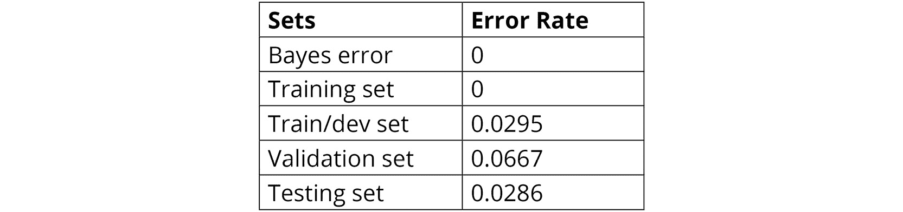

# 第三章：3\. 监督学习 – 关键步骤

概述

本章将介绍解决监督学习数据问题的关键概念。从数据集拆分开始，如何有效地创建不偏倚的模型，使其在未见数据上表现良好，你将学会如何衡量模型的性能，以便进行分析并采取必要的措施来改善模型。到本章结束时，你将牢固掌握如何拆分数据集、衡量模型性能和执行错误分析。

# 介绍

在前一章中，我们学习了如何使用无监督学习算法解决数据问题，并将所学的概念应用于真实数据集。我们还学习了如何比较不同算法的性能，并研究了两种性能评估指标。

本章将探讨解决监督学习问题的主要步骤。首先，本章将解释如何将数据拆分为训练集、验证集和测试集，以便对模型进行训练、验证和测试。接着，将解释最常见的评估指标。需要特别强调的是，在所有可用的评估指标中，应该仅选择一个作为研究的评估指标，并且其选择应基于研究的目的。最后，我们将学习如何进行错误分析，旨在了解采取何种措施来提高模型的结果。

前述概念适用于分类任务和回归任务，前者指的是输出对应有限数量标签的问题，而后者处理连续输出的数值。例如，一个用来判断某人是否会参加会议的模型属于分类任务组。另一方面，一个预测产品价格的模型则是在解决回归任务。

# 监督学习任务

与无监督学习算法不同，监督学习算法的特点是能够找到一组特征与目标值之间的关系（无论目标值是离散的还是连续的）。监督学习可以解决两种类型的任务：

+   **分类**：这些任务的目标是逼近一个函数，将一组特征映射到一个离散的结果集。这些结果通常称为类标签或类别。数据集中的每个观察值都应与一个类标签相关联，才能训练出能够为未来数据预测此类结果的模型。

    一个分类任务的例子是使用人口统计数据来判断某人的婚姻状况。

+   **回归**：虽然在回归任务中也会创建一个函数来映射某些输入和某些目标之间的关系，但在回归任务中，结果是连续的。这意味着结果是一个实数值，可以是整数或浮动值。

    回归任务的一个例子是使用产品的不同特征来预测其价格。

尽管许多算法可以被调整以解决这两项任务，但重要的是要强调，还是有些算法不能解决这两项任务，这就是为什么了解我们想要执行的任务是非常重要的，以便根据任务选择相应的算法。

接下来，我们将探讨一些对于执行任何监督学习任务至关重要的主题。

# 模型验证与测试

随着现在网上有了大量信息，几乎任何人都可以轻松开始一个机器学习项目。然而，当有许多选项可供选择时，为你的数据选择合适的算法是一项挑战。正因如此，选择一个算法而非另一个算法的决策是通过反复试验实现的，其中会测试不同的替代方案。

此外，做出一个优秀模型的决策过程不仅包括选择算法，还包括调整其超参数。为此，传统的方法是将数据划分为三部分（训练集、验证集和测试集），接下来会进一步解释。

## 数据划分

**数据划分**是一个过程，涉及将数据集划分为三个子集，以便每个子集可用于不同的目的。通过这种方式，模型的开发不受引入偏差的影响。以下是每个子集的解释：

+   **训练集**：顾名思义，这是用于训练模型的数据集部分。它由输入数据（观察值）与结果（标签类别）配对组成。这个集合可以用来训练任意数量的模型，使用不同的算法。然而，性能评估不会在此数据集上进行，因为由于该数据集用于训练模型，因此评估会有偏差。

+   **验证集**：也称为开发集，这个集合用于在微调超参数时对每个模型进行公正的评估。性能评估通常在这个数据集上进行，以测试不同的超参数配置。

    尽管模型不会从这些数据中学习（它从训练集数据中学习），但由于它参与了决定超参数变化的过程，因此间接地受到了这个数据集的影响。

    在基于模型在验证集上的表现运行不同的超参数配置后，将为每个算法选择一个最优模型。

+   **测试集**：用于在模型训练和验证后对未见数据进行最终评估。这有助于衡量模型在现实数据中的表现，为未来的预测提供参考。

    测试集也用于比较不同的模型。考虑到训练集用于训练不同的模型，而验证集用于微调每个模型的超参数并选择最佳配置，测试集的目的是对最终模型进行无偏比较。

下图展示了选择理想模型并使用前述数据集的过程：


图 3.1：数据集划分目的

前面图示中显示的`A`–`D`部分描述如下：

+   Section `A`指的是使用训练集中包含的数据训练所需算法的过程。

+   Section `B`表示每个模型超参数的微调过程。最佳超参数配置的选择基于模型在验证集上的表现。

+   Section `C`展示了通过比较每个算法在测试集上的表现，选择最终模型的过程。

+   最后，Section `D`表示选定的模型，它将应用于实际数据进行预测。

最初，机器学习问题通过将数据划分为两部分来解决：训练集和测试集。这种方法与三部分数据集的方法相似，但测试集既用于微调超参数，也用于确定算法的最终性能。

尽管这种方法也能奏效，但使用这种方法创建的模型并不总是在未见过的实际数据上表现同样优秀。这主要是因为，如前所述，使用这些数据集来微调超参数间接地将偏差引入了模型中。

考虑到这一点，有一种方法可以在将数据集划分为两部分时实现更少偏差的模型，这就是所谓的**交叉验证划分**。我们将在本章的*交叉验证*部分深入探讨这一点。

## 划分比例

既然各种数据集的目的已经明确，接下来需要澄清数据划分的比例。虽然没有一种精确的科学方法来计算划分比例，但在进行划分时需要考虑以下几个因素：

+   **数据集的大小**：以前，由于数据不容易获取，数据集通常包含 100 到 100,000 个实例，公认的划分比例通常是 60/20/20%，分别用于训练集、验证集和测试集。

    随着软件和硬件的不断改进，研究人员能够构建包含超过百万个实例的数据集。能够收集如此庞大的数据量使得分割比例可以达到 98/1/1%。这主要是因为数据集越大，能够用于训练模型的数据就越多，而不会影响留给验证集和测试集的数据量。

+   **算法**：需要考虑的是，一些算法可能需要更多的数据来训练模型，例如神经网络。在这种情况下，像前述方法一样，应该始终选择更大的训练集。

    另一方面，一些算法不要求验证集和测试集必须平分。例如，一个具有较少超参数的模型可以容易地进行调整，这使得验证集可以小于测试集。然而，如果一个模型有许多超参数，则需要更大的验证集。

然而，尽管前述措施可以作为划分数据集的指南，始终需要考虑数据集的分布以及研究的目的。例如，若一个模型将用于预测与训练模型时使用的数据分布不同的结果，尽管实际数据有限，至少也必须确保实际数据的一部分包含在测试集中，以确保该模型能达到预期目的。

下图展示了数据集按比例划分为三子集。需要特别指出的是，训练集必须大于其他两个子集，因为它是用于训练模型的。此外，可以观察到，训练集和验证集都会对模型产生影响，而测试集主要用于验证模型在未知数据上的实际表现。考虑到这一点，训练集和验证集必须来自相同的分布：


图 3.2：分割比例可视化

## 练习 3.01：对样本数据集进行数据划分

在本次练习中，我们将使用分割比例法对`wine`数据集进行数据划分。此次练习的划分将采用三分法。按照以下步骤完成本次练习：

注

对于本章的练习和活动，您需要在系统上安装 Python 3.7、NumPy、Jupyter、Pandas 和 scikit-learn。

1.  打开一个 Jupyter Notebook 以实现本次练习。导入所需的元素，以及 scikit-learn 的`datasets`包中的`load_wine`函数：

    ```py
    from sklearn.datasets import load_wine
    import pandas as pd
    from sklearn.model_selection import train_test_split
    ```

    第一行导入了将用于从 scikit-learn 加载数据集的函数。接下来，导入了 `pandas` 库。最后，导入了 `train_test_split` 函数，它负责划分数据集。该函数将数据划分为两个子集（训练集和测试集）。由于本练习的目标是将数据划分为三个子集，因此该函数将被使用两次，以实现所需的结果。

1.  加载 `wine` 玩具数据集并将其存储在一个名为 `data` 的变量中。使用以下代码片段进行此操作：

    ```py
    data = load_wine()
    ```

    `load_wine` 函数加载的是 scikit-learn 提供的玩具数据集。

    注意

    要查看数据集的特征，请访问以下链接：[`scikit-learn.org/stable/modules/generated/sklearn.datasets.load_wine.html`](https://scikit-learn.org/stable/modules/generated/sklearn.datasets.load_wine.html)。

    前面函数的输出是一个类似字典的对象，将特征（可以作为数据调用）与目标（可以作为目标调用）分为两个属性。

1.  将每个属性（数据和目标）转换为 Pandas DataFrame，以便进行数据操作。打印两个 DataFrame 的形状：

    ```py
    X = pd.DataFrame(data.data)
    Y = pd.DataFrame(data.target)
    print(X.shape,Y.shape)
    ```

    `print` 函数的输出应如下所示：

    ```py
    (178, 13) (178, 1)
    ```

    在这里，第一个括号中的值表示数据框 `X`（即特征矩阵）的形状，而第二个括号中的值表示数据框 `Y`（即目标矩阵）的形状。

1.  使用 `train_test_split` 函数进行数据的首次拆分。使用以下代码片段进行此操作：

    ```py
    X, X_test, Y, Y_test = train_test_split(X, Y, test_size = 0.2)
    ```

    `train_test_split` 函数的输入是两个矩阵 `(X,Y)` 和测试集的大小，作为一个 0 到 1 之间的值，表示比例。

    ```py
    print(X.shape, X_test.shape, Y.shape, Y_test.shape)
    ```

    通过打印所有四个矩阵的形状，按照前面的代码片段，可以确认测试子集的大小（`X` 和 `Y`）是原始数据集总大小的 20%（150 * 0.2 = 35.6），四舍五入为整数，而训练集的大小是剩余的 80%：

    ```py
    (142, 13) (36, 13) (142, 1) (36, 1)
    ```

1.  为了创建验证集（dev 集），我们将使用 `train_test_split` 函数来拆分我们在前一步中获得的训练集。然而，为了得到与测试集相同形状的验证集，在创建验证集之前，需要计算测试集大小与训练集大小的比例。此比例将作为下一步的 `test_size`：

    ```py
    dev_size = 36/142
    print(dev_size)
    ```

    在这里，`36` 是我们在前一步中创建的测试集的大小，而 `142` 是将进一步拆分的训练集的大小。此操作的结果大约是 `0.25`，可以使用 `print` 函数进行验证。

1.  使用 `train_test_split` 函数将训练集分成两个子集（训练集和验证集）。使用前一步操作的结果作为 `test_size`：

    ```py
    X_train, X_dev, Y_train, Y_dev = train_test_split(X, Y, \
                                     test_size = dev_size)
    print(X_train.shape, Y_train.shape, X_dev.shape, \
          Y_dev.shape, X_test.shape, Y_test.shape)
    ```

    `print` 函数的输出如下：

    ```py
    (106, 13) (106, 1) (36, 13) (36, 1) (36, 13) (36, 1)
    ```

    注意

    要访问该部分的源代码，请参阅[`packt.live/2AtXAWS`](https://packt.live/2AtXAWS)。

    你还可以在线运行这个示例，网址是[`packt.live/2YECtsG`](https://packt.live/2YECtsG)。你必须执行整个 Notebook 才能获得所需的结果。

你已经成功地将数据集分成三个子集，以开发高效的机器学习项目。你可以自由地测试不同的划分比例。

总之，数据划分的比例并不是固定的，应该根据可用数据的数量、要使用的算法类型以及数据的分布来决定。

## 交叉验证

**交叉验证**也是一种通过重新抽样数据来划分数据的过程，这些数据用于训练和验证模型。它包含一个参数*K*，表示数据集将被划分为的组数。

由于此原因，该过程也称为 K 折交叉验证，其中*K*通常由你选择的数字代替。例如，使用 10 折交叉验证过程创建的模型意味着数据被分成 10 个子组。交叉验证过程在以下图表中进行了说明：


图 3.3：交叉验证过程

前面的图表展示了交叉验证过程中遵循的一般步骤：

1.  数据会随机洗牌，考虑到交叉验证过程会被重复。

1.  数据被划分为*K*个子组。

1.  验证集/测试集被选为其中一个子组，其余子组构成训练集。

1.  模型按常规在训练集上训练。模型使用验证集/测试集进行评估。

1.  来自该迭代的结果已被保存。根据结果调整参数，并通过重新洗牌数据开始新的过程。这个过程重复进行 K 次。

根据前述步骤，数据集被分成*K*个子集，并且模型被训练*K*次。每次，选取一个子集作为验证集，剩余的子集用于训练过程。

交叉验证可以通过三分法或二分法来完成。对于前者，数据集首先被分成训练集和测试集，然后使用交叉验证将训练集进一步划分，创建不同的训练集和验证集配置。后者则是在整个数据集上使用交叉验证。

交叉验证之所以受欢迎，是因为它能够构建“无偏”的模型，因为它可以让我们衡量算法在数据集不同部分上的表现，这也让我们能了解算法在未见数据上的表现。它之所以流行，还因为它允许你在小数据集上构建高效的模型。

选择 *K* 值并没有准确的科学依据，但需要考虑的是，较小的 *K* 值倾向于降低方差并增加偏差，而较大的 *K* 值则会产生相反的效果。此外，*K* 值越小，过程的计算开销越小，从而运行时间更短。

注意

方差和偏差的概念将在*偏差、方差与数据不匹配*部分进行解释。

## 练习 3.02：使用交叉验证将训练集划分为训练集和验证集

在本练习中，我们将使用交叉验证方法对 `wine` 数据集进行数据划分。按照以下步骤完成此练习：

1.  打开一个 Jupyter Notebook 来实现这个练习并导入所有需要的元素：

    ```py
    from sklearn.datasets import load_wine
    import pandas as pd
    from sklearn.model_selection import train_test_split
    from sklearn.model_selection import KFold
    ```

    前述代码的最后一行导入了 `KFold` 类，它来自 scikit-learn，将用于划分数据集。

1.  按照之前的练习加载 `wine` 数据集，并创建包含特征和目标矩阵的 Pandas DataFrame：

    ```py
    data = load_wine()
    X = pd.DataFrame(data.data)
    Y = pd.DataFrame(data.target)
    ```

1.  使用 `train_test_split` 函数将数据分为训练集和测试集，该函数在之前的练习中已经学习过，`test_size` 设置为 0.10：

    ```py
    X, X_test, Y, Y_test = train_test_split(X, Y, \
                                            test_size = 0.10)
    ```

1.  使用 10 折交叉验证配置实例化 `KFold` 类：

    ```py
    kf = KFold(n_splits = 10)
    ```

    注意

    随意尝试不同的 `K` 值，观察该练习输出的形状如何变化。

1.  对 `X` 中的数据应用 `split` 方法。此方法将输出用于训练和验证集的实例索引。该方法会创建 10 种不同的划分配置。将输出保存为名为 `splits` 的变量：

    ```py
    splits = kf.split(X)
    ```

    请注意，不需要对 `Y` 中的数据运行 `split` 方法，因为该方法只保存索引号，这在 `X` 和 `Y` 中是相同的。实际的划分将在后续处理。

1.  执行一个 `for` 循环，遍历不同的划分配置。在循环体内，创建用于存储训练集和验证集数据的变量。使用以下代码片段实现：

    ```py
    for train_index, test_index in splits:
        X_train, X_dev = X.iloc[train_index,:], \
                         X.iloc[test_index,:]
        Y_train, Y_dev = Y.iloc[train_index,:], \
                         Y.iloc[test_index,:]
    ```

    `for` 循环会遍历 `K` 次配置。在循环体内，数据将根据索引号进行划分：

    ```py
    print(X_train.shape, Y_train.shape, X_dev.shape, \
          Y_dev.shape, X_test.shape, Y_test.shape)
    ```

    通过打印所有子集的形状，按照前述代码段，输出如下：

    ```py
    (144, 13) (144, 1) (16, 13) (16, 1) (18, 13) (18, 1)
    ```

    注意

    训练和评估模型的代码应该写在循环体内，因为交叉验证过程的目标是使用不同的划分配置来训练和验证模型。

你已经成功对一个样本数据集进行了交叉验证划分。

注意

若要访问此特定部分的源代码，请参考 [`packt.live/2N0lPi0`](https://packt.live/2N0lPi0)。

你也可以在 [`packt.live/2Y290tK`](https://packt.live/2Y290tK) 在线运行此示例。必须执行整个 Notebook 才能获得预期结果。

总结来说，交叉验证是一种用于对数据进行洗牌并将其拆分为训练集和验证集的过程，每次训练和验证过程都会在不同的数据集上进行，从而获得一个具有低偏差的模型。

## 活动 3.01：手写数字数据集的数据分区

你的公司专注于识别手写字符。它希望提高数字的识别能力，因此他们收集了 1797 个从 0 到 9 的手写数字数据集。这些图像已经被转换为其数字表示，因此他们提供了该数据集供你将其拆分为训练/验证/测试集。你可以选择执行传统拆分或交叉验证。按照以下步骤完成此活动：

1.  导入拆分数据集所需的所有元素，以及从 scikit-learn 中导入`load_digits`函数以加载`digits`数据集。

1.  加载`digits`数据集并创建包含特征和目标矩阵的 Pandas 数据框。

1.  采用传统的拆分方法，使用 60/20/20%的拆分比例。

1.  使用相同的数据框，执行 10 折交叉验证拆分。

    注意

    本活动的解决方案可以在第 228 页找到。可以随意尝试不同的参数以得到不同的结果。

# 评估指标

模型评估对于创建有效模型是不可或缺的，这些模型不仅在用于训练模型的数据上表现良好，而且在未见过的数据上也能表现出色。评估模型的任务在处理监督学习问题时尤其容易，因为有一个可以与模型预测进行比较的真实值。

确定模型的准确度百分比对于其应用于没有标签类的数据至关重要。例如，具有 98%准确率的模型可能使用户认为预测准确的概率较高，因此应该信任该模型。

如前所述，性能评估应该在验证集（开发集）上进行，以微调模型，并在测试集上进行，以确定所选模型在未见过的数据上的预期表现。

## 分类任务的评估指标

分类任务指的是类别标签为离散值的模型，正如之前提到的那样。考虑到这一点，评估此类任务性能的最常见衡量标准是计算模型的准确度，即比较实际预测值与真实值。尽管在许多情况下，这可能是一个合适的度量标准，但在选择一个之前，还需要考虑其他几种标准。

现在，我们将查看不同的性能评估指标。

### 混淆矩阵

**混淆矩阵**是一个包含模型性能的表格，描述如下：

+   列表示属于预测类别的实例。

+   行表示实际属于该类别的实例（真实情况）。

混淆矩阵呈现的配置使得用户能够快速发现模型难度较大的领域。请看以下表格：


图 3.4：一个分类器的混淆矩阵，预测女性是否怀孕

从上述表格中可以观察到：

+   通过对第一行的值求和，可以知道有 600 个孕妇观察值。然而，在这 600 个观察值中，模型预测 556 个为孕妇，44 个为非孕妇。因此，模型预测女性怀孕的正确率为 92.6%。

+   关于第二行，也有 600 个非孕妇观察值。在这 600 个观察值中，模型预测 123 个为孕妇，477 个为非孕妇。模型成功预测非孕妇的准确率为 79.5%。

根据这些陈述，可以得出结论，模型在分类非孕妇观察值时表现最差。

考虑到混淆矩阵中的行表示事件的发生或未发生，列表示模型的预测，混淆矩阵中的值可以解释如下：

+   **真正例**（**TP**）：指模型正确将事件分类为正例的实例——例如，正确分类为孕妇的实例。

+   **假正例**（**FP**）：指模型错误地将事件分类为正例的实例——例如，错误分类为孕妇的非孕妇实例。

+   **真反例**（**TN**）：指模型正确将事件分类为负例的实例——例如，正确分类为非孕妇的实例。

+   **假反例**（**FN**）：指模型错误地将事件分类为负例的实例——例如，错误预测为非孕妇的孕妇实例。

混淆矩阵中的值可以如下表示：


图 3.5：显示混淆矩阵值的表格

### 准确率

如前所述，**准确率**衡量模型正确分类所有实例的能力。尽管这被认为是衡量性能的最简单方法之一，但在研究的目标是最小化/最大化某一类事件的发生，而与其他类的性能无关时，它可能并不是一个有用的指标。

*图 3.4* 中混淆矩阵的准确率计算如下：


图 3.6：显示准确率计算公式的方程式

这里，*m*是实例的总数。

`86%`的准确率指的是模型在分类两个类标签时的整体表现。

### 精确度

该指标衡量模型正确分类正类标签（代表事件发生的标签）的能力，通过与预测为正类的实例总数进行比较。它由*真正例*和*真正例*与*假正例*的和的比例表示，如下公式所示：


图 3.7：展示精确度计算的公式

精确度指标仅适用于二分类任务，其中只有两个类标签（例如，真或假）。它也可以应用于多类任务，前提是这些类被转换为两类（例如，预测手写数字是否为 6 或其他数字），其中一个类指的是具有某种条件的实例，另一个类则指不具有该条件的实例。

对于*图 3.4*中的示例，模型的精确度为 81.8%。

### 召回率

召回率（recall）衡量的是正确预测为正类标签的数量与所有正类标签的比例。它由*真正例*和*假负例*的和的比例表示：


图 3.8：展示召回率计算的公式

同样，这一度量应应用于两个类标签。对于*图 3.4*中的示例，召回率为 92.6%，与其他两个指标相比，表示该模型的最高表现。选择某个指标将取决于研究的目的，稍后会更详细地解释。

## 练习 3.03：在分类任务中计算不同的评估指标

在本次练习中，我们将使用乳腺癌玩具数据集，并使用 scikit-learn 库来计算评估指标。请按照以下步骤完成本次练习：

1.  打开 Jupyter Notebook 以实现本练习，并导入所有所需的元素：

    ```py
    from sklearn.datasets import load_breast_cancer
    import pandas as pd
    from sklearn.model_selection import train_test_split
    from sklearn import tree
    from sklearn.metrics import confusion_matrix
    from sklearn.metrics import accuracy_score
    from sklearn.metrics import precision_score
    from sklearn.metrics import recall_score
    ```

    第四行导入了`tree`模块，这是 scikit-learn 库中的一部分，将用于在本次练习的训练数据上训练决策树模型。下面的代码行将导入在本练习过程中计算的不同评估指标。

1.  乳腺癌玩具数据集包含了对 569 名女性乳腺肿块分析的最终诊断（恶性或良性）。加载数据集并创建特征和目标 Pandas DataFrame，如下所示：

    ```py
    data = load_breast_cancer()
    X = pd.DataFrame(data.data)
    Y = pd.DataFrame(data.target)
    ```

1.  使用传统的拆分方法来划分数据集：

    ```py
    X_train, X_test, \
    Y_train, Y_test = train_test_split(X,Y, test_size = 0.1, \
                                       random_state = 0)
    ```

    请注意，数据集被分成了两个子集（训练集和测试集），因为本次练习的目的是学习如何使用 scikit-learn 包计算评估指标。

    注意

    `random_state`参数用于设置种子，确保每次运行代码时结果相同。这保证了你将获得与本练习中所示结果相同的结果。可以使用不同的数字作为种子；然而，为了获得与本章练习和活动中所示相同的结果，请使用建议的相同数字。

1.  首先，从 scikit-learn 的`tree`模块实例化`DecisionTreeClassifier`类。接着，在训练集上训练决策树。最后，使用该模型在测试集上预测类别标签。使用以下代码实现：

    ```py
    model = tree.DecisionTreeClassifier(random_state = 0)
    model = model.fit(X_train, Y_train)
    Y_pred = model.predict(X_test)
    ```

    首先，使用`random_state`实例化模型以设置种子。然后，使用`fit`方法通过训练集的数据（包括`X`和`Y`）训练模型。最后，使用`predict`方法对测试集中的数据（仅`X`）进行预测。`Y_test`中的数据将用于将预测结果与真实值进行比较。

    注意

    训练监督学习模型的步骤将在*第四章*，*监督学习算法：预测年收入*，和*第五章*，*人工神经网络：预测年收入*中进一步讲解。

1.  使用 scikit-learn 构建混淆矩阵，如下所示：

    ```py
    confusion_matrix(Y_test, Y_pred)
    ```

    结果如下，其中将真实值与预测值进行比较：

    ```py
    array([[21, 1],
           [6, 29]])
    ```

1.  通过比较`Y_test`和`Y_pred`，计算模型的准确率、精确度和召回率：

    ```py
    accuracy = accuracy_score(Y_test, Y_pred)
    print("accuracy:", accuracy)
    precision = precision_score(Y_test, Y_pred)
    print("precision:", precision)
    recall = recall_score(Y_test, Y_pred)
    print("recall:", recall)
    ```

    结果如下所示：

    ```py
    accuracy: 0.8771
    precision: 0.9666
    recall: 0.8285
    ```

    由于正标签表示肿瘤为恶性，可以得出结论：模型预测为恶性的实例有 96.6%的高概率为恶性，但对于预测为良性的实例，模型有 17.15%（100%-82.85%）的错误概率。

    注意

    要访问此特定部分的源代码，请参考[`packt.live/2Yw0hiu`](https://packt.live/2Yw0hiu)。

    你也可以在[`packt.live/3e4rRtE`](https://packt.live/3e4rRtE)在线运行此示例。你必须执行整个 Notebook，才能获得期望的结果。

你已经成功计算了分类任务的评估指标。

## 选择评估指标

有多种指标可用于衡量模型在分类任务中的表现，选择正确的指标是构建能够在研究目的上表现出色的模型的关键。

之前提到过，理解研究目的对于确定需要对数据集执行的预处理技术至关重要。此外，研究目的对于确定评估模型表现的理想指标也非常有帮助。

为什么研究的目的对选择评估度量标准很重要？因为通过了解研究的主要目标，可以决定是应该将注意力集中在模型的整体性能上，还是仅仅关注某一类标签的表现。

例如，一个用于识别图像中是否有鸟类的模型，如果它能够正确地识别出图像中是否有鸟类，而不是错误地将其他动物识别为鸟类，那么这个模型就是一个好模型。因此，模型只需要关注于提高正确分类鸟类的性能。

另一方面，对于一个用于识别手写字符的模型，任何一个字符都不比其他字符更重要，理想的度量标准应该是衡量模型整体准确率的度量。

如果选择了多个度量标准会怎样？就会很难得出模型的最佳性能，因为同时衡量两个度量可能需要采用不同的方法来改进结果。

## 回归任务的评估度量

考虑到回归任务的最终输出是连续的，没有固定数量的输出标签，因此真实值与预测值之间的比较是基于数值的接近程度，而不是它们是否完全相同。例如，在预测房价时，一个模型预测某房屋的价格为 299,846 美元，而真实价格为 300,000 美元，这个模型可以被认为是一个好的模型。

用于评估连续变量准确性的两种最常用度量标准是**平均绝对误差（MAE）**和**均方根误差（RMSE）**，它们在这里得到了说明：

+   **平均绝对误差（MAE）**：该度量衡量的是预测值与真实值之间的平均绝对差异，不考虑误差的方向。计算 MAE 的公式如下：


](img/B15781_03_09.jpg)

图 3.9：展示 MAE 计算的方程式

这里，*m*表示实例的总数，*y*是实际值，*ŷ*是预测值。

+   **均方根误差（RMSE）**：这是一种二次度量，衡量的是真实值与预测值之间误差的平均大小。顾名思义，RMSE 是平方差的平均值的平方根，如下方公式所示：

    ](img/B15781_03_10.jpg)

图 3.10：展示 RMSE 计算的方程式

这两种度量标准都表达了从 0 到无穷大的平均误差，其中数值越低，模型性能越好。它们之间的主要区别在于，MAE 对所有误差赋予相同的权重，而 RMSE 则对误差进行平方处理，从而赋予较大误差更高的权重。

考虑到这一点，RMSE 指标在较大误差应受到惩罚的情况下特别有用，这意味着在性能度量中会考虑异常值。例如，当偏差为 4 的值比偏差为 2 的值差了两倍时，可以使用 RMSE 指标。而 MAE 则在偏差为 4 的值仅是偏差为 2 的值两倍的情况下使用。

## 练习 3.04：计算回归任务中的评估指标

在本次练习中，我们将计算一个使用线性回归训练的模型的评估指标。我们将使用 `boston` 玩具数据集来完成此任务。按照以下步骤完成此练习：

1.  打开一个 Jupyter Notebook 来实现此练习，并导入所有所需的元素，具体如下：

    ```py
    from sklearn.datasets import load_boston
    import pandas as pd
    from sklearn.model_selection import train_test_split
    from sklearn import linear_model
    from sklearn.metrics import mean_absolute_error
    from sklearn.metrics import mean_squared_error
    import numpy as np
    ```

    第四行导入了 scikit-learn 中的 `linear_model` 模块，该模块将用于在训练数据集上训练一个线性回归模型。接下来的几行代码导入了将在本次练习中评估的两个性能指标。

1.  本次练习将使用 `boston` 玩具数据集。该数据集包含波士顿 506 个房价的数据。使用以下代码加载并拆分数据集，与我们之前的练习相同：

    ```py
    data = load_boston()
    X = pd.DataFrame(data.data)
    Y = pd.DataFrame(data.target)
    X_train, X_test, Y_train, Y_test = train_test_split(X,Y, \
                                       test_size = 0.1, random_state = 0)
    ```

1.  在训练集上训练一个线性回归模型。然后，使用该模型在测试集上预测类标签，具体如下：

    ```py
    model = linear_model.LinearRegression()
    model = model.fit(X_train, Y_train)
    Y_pred = model.predict(X_test)
    ```

    一般来说，首先会实例化 scikit-learn `linear_model` 模块中的`LinearRegression` 类。然后，使用 `fit` 方法通过训练集的数据（包括 `X` 和 `Y`）来训练模型。最后，使用 `predict` 方法对测试集中的数据（仅 `X`）进行预测。`Y_test` 中的数据将用于将预测结果与真实值进行比较。

1.  计算 MAE 和 RMSE 两个指标：

    ```py
    MAE = mean_absolute_error(Y_test, Y_pred)
    print("MAE:", MAE)
    RMSE = np.sqrt(mean_squared_error(Y_test, Y_pred))
    print("RMSE:", RMSE)
    ```

    结果如下所示：

    ```py
    MAE: 3.9357
    RMSE: 6.4594
    ```

    注意

    scikit-learn 库允许你直接计算 MSE。为了计算 RMSE，需要计算从 `mean_squared_error()` 函数得到值的平方根。通过使用平方根，我们确保 MAE 和 RMSE 的值是可以比较的。

    从结果可以得出结论，模型在测试集上的表现良好，考虑到两个值都接近零。然而，这也意味着性能仍然可以进一步提升。

    注意

    若要访问此特定部分的源代码，请参考 [`packt.live/2YxVXiU`](https://packt.live/2YxVXiU)。

    你也可以在线运行此示例，网址是 [`packt.live/2N0Elqy`](https://packt.live/2N0Elqy)。你必须执行整个 Notebook 才能获得期望的结果。

你现在已经成功计算了回归任务中的评估指标，该任务旨在根据房屋的特征计算价格。在接下来的活动中，我们将计算一个分类模型的性能，该模型用于识别手写字符。

## 活动 3.02：评估在手写数据集上训练的模型的表现

你继续致力于创建一个识别手写数字的模型。团队已经构建了一个模型，他们希望你评估该模型的表现。在此活动中，你将计算训练模型的不同表现评估指标。按照以下步骤完成该活动：

1.  导入所有必需的元素以加载并拆分数据集，用于训练模型并评估分类任务的表现。

1.  从 scikit-learn 中加载 `digits` 玩具数据集，并创建包含特征和目标矩阵的 Pandas 数据框。

1.  将数据拆分为训练集和测试集。使用 20% 作为测试集的大小。

1.  在训练集上训练一个决策树。然后，使用该模型预测测试集上的类别标签。

    注意

    要训练决策树，请回顾 *练习 3.04*，*计算分类任务的不同评估指标*。

1.  使用 scikit-learn 构建混淆矩阵。

1.  计算模型的准确率。

1.  计算精确度和召回率。考虑到精确度和召回率只能在二分类问题上计算，我们假设只关注将实例分类为数字 `6` 或 `其他任何数字`。

    为了能够计算精确度和召回率，使用以下代码将 `Y_test` 和 `Y_pred` 转换为一热向量。一个一热向量由仅包含零和一的向量组成。对于本活动，0 代表 *数字 6*，而 1 代表 `任何其他数字`。这将类别标签（`Y_test` 和 `Y_pred`）转换为二进制数据，即只有两个可能的结果，而不是 10 个不同的结果。

    然后，使用新变量计算精确度和召回率：

    ```py
    Y_test_2 = Y_test[:]
    Y_test_2[Y_test_2 != 6] = 1
    Y_test_2[Y_test_2 == 6] = 0
    Y_pred_2 = Y_pred
    Y_pred_2[Y_pred_2 != 6] = 1
    Y_pred_2[Y_pred_2 == 6] = 0
    ```

    你应该得到以下值作为输出：

    ```py
    Accuracy = 84.72%
    Precision = 98.41%
    Recall = 98.10%
    ```

    注意

    本活动的解决方案可以在第 230 页找到。

# 错误分析

如前所述，通过使用 scikit-learn 库，构建一个平均模型是出乎意料的简单。构建一个优秀模型的关键方面来自研究人员的分析和决策。

如我们迄今所见，一些最重要的任务是选择和预处理数据集、确定研究目的以及选择合适的评估指标。在处理完这些内容并考虑到模型需要进行微调以达到最高标准后，大多数数据科学家建议训练一个简单的模型，无论超参数如何，以便开始研究。

**错误分析** 随后被引入，作为一种非常有用的方法论，将一个平均模型转化为一个卓越的模型。顾名思义，它包括分析数据集中不同子集的错误，以便定位影响模型的主要条件。

## 偏差、方差和数据不匹配

要了解可能影响机器学习模型的不同条件，重要的是要理解**贝叶斯误差**是什么。贝叶斯误差，也称为**不可降低误差**，是可以达到的最低可能错误率。

在技术和人工智能改进之前，贝叶斯误差被认为是人类可以达到的最低可能误差（**人为误差**）。例如，对于大多数人类以 0.1 的错误率完成的过程，但顶级专家以 0.05 的错误率完成的过程，贝叶斯误差将为 0.05。

然而，现在贝叶斯误差被重新定义为机器可以达到的最低可能误差，这是未知的，考虑到我们作为人类只能理解到人类误差的程度。因此，当使用贝叶斯误差来分析错误时，一旦模型低于人类误差，就不可能知道最低限度。

以下图表有助于分析不同数据集之间的错误率，并确定对模型影响最大的条件。该图的目的是找出彼此之间错误差异最大的错误，以便相应地诊断和改进模型。重要的是强调，每个集合的错误值是通过从该集合的评估指标（例如准确率）减去 100%来计算的：


图 3.11：错误分析方法论

考虑前述图表，执行错误分析的过程如下：

1.  计算所有数据集的性能评估。此措施用于计算每个集合的错误。

1.  从底部到顶部开始计算差异如下：

    将开发集误差（12%）减去测试集误差（12%）。得到的数值（0%）保存。

    将训练/开发集误差（9%）减去开发集误差（12%）。得到的数值（3%）保存。

    将训练集误差（8%）减去训练/开发集误差（9%）。得到的数值（1%）保存。

    将贝叶斯误差（2%）减去训练集误差（8%）。得到的数值（6%）保存。

1.  更大的差异确定最严重影响模型的条件。在本例中，更大的差异出现在贝叶斯误差和训练集误差之间，如前述图表所示，这表明模型正遭受*高偏差*的影响。

    注

    训练/开发集是训练集和验证集（开发集）中数据的组合。它通常与开发集具有相同的形状，并包含来自两个集合的相同数量的数据。

下面解释每个条件及一些避免/修复它们的技术：

+   **高偏差**：也称为欠拟合，这种情况发生在模型没有从训练集中学习时，导致模型在所有三种数据集（训练集、验证集和测试集）上表现较差，且对未见过的数据也表现不佳。

    欠拟合是最容易检测到的情况，通常需要更换不同的算法，以更好地适应可用数据。对于神经网络而言，通常可以通过构建更大的网络或训练更长时间来解决。

+   **高方差**：也称为过拟合，这种情况指的是模型在处理与训练集不同的数据时表现不佳。这基本上意味着模型通过学习数据的细节和离群点来过拟合训练数据，而没有进行任何概括。一个遭受过拟合的模型在开发集、测试集或未见过的数据上表现不佳。

    过拟合可以通过调整算法的不同超参数来解决，通常目标是简化算法对数据的近似。例如，对于决策树，可以通过修剪树来删除一些从训练数据中学习到的细节来解决。另一方面，对于神经网络，可以通过添加正则化技术来减少神经元对整体结果的影响。

    此外，向训练集添加更多数据也有助于模型避免高方差，即增加用于训练模型的数据集。

+   **数据不匹配**：当训练集和验证集不遵循相同的分布时，就会发生数据不匹配。这会影响模型的表现，因为虽然它基于训练数据进行概括，但这种概括并不描述验证集中出现的数据。例如，若一个模型是用来描述风景照片的，但它是用高清图像训练的，而实际使用的图像是非专业的，这时就会出现数据不匹配问题。

    从逻辑上讲，避免数据不匹配的最佳方法是确保各数据集遵循相同的分布。例如，你可以通过将来自两个来源（专业和非专业图像）的图像一起打乱，然后将它们划分到不同的集合中来实现这一点。

    然而，在数据不足以遵循与未来未见数据（将来用于训练的数据）相同分布的情况下，强烈建议完全从这些数据中创建开发集和测试集，并将剩余的数据添加到大型训练集中。从前面的示例中，应该使用非专业图像来创建开发集和测试集，将剩余的图像与专业图像一起添加到训练集中。这有助于使用包含足够图像以进行泛化的训练集来训练模型，但它使用与未见数据分布相同的数据来微调模型。

    最后，如果所有集合的数据来自相同的分布，那么这个条件实际上指的是一个高方差问题，应按照这种方式进行处理。

+   **对开发集的过拟合**：最后，类似于方差问题，当模型没有进行泛化，而是过度拟合开发集时，会发生这种情况。

    应使用与前面解释的高方差问题相同的方法来处理该问题。

在下一个练习中，我们将计算模型在不同数据集上的错误率，这可用于进行错误分析。

## 练习 3.05：计算不同数据集上的错误率

在本次练习中，我们将计算使用决策树训练的模型的错误率。我们将使用乳腺癌数据集来完成此任务。按照以下步骤完成本次练习：

1.  打开 Jupyter Notebook 来实现本次练习，并导入所有需要的元素以加载和拆分数据集。这些将用于训练模型并评估其召回率：

    ```py
    from sklearn.datasets import load_breast_cancer
    import pandas as pd
    from sklearn.model_selection import train_test_split
    import numpy as np
    from sklearn import tree
    from sklearn.metrics import recall_score
    ```

1.  在本次练习中，将使用 `乳腺癌` 数据集。使用以下代码加载数据集，并创建包含特征和目标矩阵的 Pandas DataFrame：

    ```py
    breast_cancer = load_breast_cancer()
    X = pd.DataFrame(breast_cancer.data)
    Y = pd.DataFrame(breast_cancer.target)
    ```

1.  将数据集拆分为训练集、验证集和测试集：

    ```py
    X_new, X_test, Y_new, Y_test = train_test_split(X, Y, \
                                   test_size = 0.1, random_state = 101)
    test_size = X_test.shape[0] / X_new.shape[0]
    X_train, X_dev, Y_train, Y_dev = train_test_split(X_new, Y_new, \
                                     test_size = test_size, \
                                     random_state = 101)
    print(X_train.shape, Y_train.shape, X_dev.shape, \
          Y_dev.shape, X_test.shape, Y_test.shape)
    ```

    结果的形状如下：

    ```py
    (455, 30) (455, 1) (57, 30) (57, 1) (57, 30) (57, 1)
    ```

1.  创建一个结合了训练集和验证集数据的训练/开发集：

    ```py
    np.random.seed(101)
    indices_train = np.random.randint(0, len(X_train), 25)
    indices_dev = np.random.randint(0, len(X_dev), 25)
    X_train_dev = pd.concat([X_train.iloc[indices_train,:], \
                             X_dev.iloc[indices_dev,:]])
    Y_train_dev = pd.concat([Y_train.iloc[indices_train,:], \
                             Y_dev.iloc[indices_dev,:]])
    print(X_train_dev.shape, Y_train_dev.shape)
    ```

    首先，设置一个随机种子，以确保结果的可重复性。接下来，使用 NumPy `random.randint()` 函数从 `X_train` 集合中选择随机索引。为此，在 0 到 `X_train` 总长度之间生成 28 个随机整数。相同的过程用于生成开发集的随机索引。最后，创建一个新变量来存储从 `X_train` 和 `X_dev` 中选择的值，并创建一个变量来存储来自 `Y_train` 和 `Y_dev` 的相应值。

    已创建的变量包含来自训练集的 25 个实例/标签和来自开发集的 25 个实例/标签。

    结果集的形状如下：

    ```py
    (50, 30) (50, 1)
    ```

1.  在训练集上训练决策树，如下所示：

    ```py
    model = tree.DecisionTreeClassifier(random_state = 101)
    model = model.fit(X_train, Y_train)
    ```

1.  使用 `predict` 方法生成所有数据集（训练集、训练/开发集、开发集和测试集）的预测。接下来，考虑到本研究的目标是最大化模型预测所有恶性案例的能力，计算所有预测的召回率分数。将所有分数存储在名为 `scores` 的变量中：

    ```py
    sets = ["Training", "Train/dev", "Validation", "Testing"]
    X_sets = [X_train, X_train_dev, X_dev, X_test]
    Y_sets = [Y_train, Y_train_dev, Y_dev, Y_test]
    scores = {}
    for i in range(0, len(X_sets)):
        pred = model.predict(X_sets[i])
        score = recall_score(Y_sets[i], pred)
        scores[sets[i]] = score
    print(scores)
    ```

    所有数据集的误差率如下：

    ```py
    {'Training': 1.0, 'Train/dev': 0.9705882352941176, 'Validation': 0.9333333333333333, 'Testing': 0.9714285714285714}
    ```

    从上述值中，可以创建以下包含误差率的表格：

    

图 3.12：所有数据集的误差率

在这里，假设贝叶斯误差为 `0`，因为恶性肿瘤和良性肿瘤的分类是通过活检进行的。

从上表可以得出结论，考虑到所有的误差率接近 0，即最低可能的误差，该模型在研究目的上表现得非常出色。

最高的误差率差异出现在训练集/开发集和开发集之间，这意味着数据不匹配。然而，考虑到所有数据集来自相同的分布，这种情况被认为是一个高方差问题，增加更多的数据到训练集中应该有助于减少误差率。

注

要访问该部分的源代码，请参考 [`packt.live/3e4Toer`](https://packt.live/3e4Toer)。

你也可以在线运行这个示例，网址是 [`packt.live/2UJzDkW`](https://packt.live/2UJzDkW)。你必须执行整个 Notebook 才能得到预期的结果。

你已经成功计算出了所有数据子集的误差率。在接下来的活动中，我们将进行误差分析，以定义改进已创建的手写数字识别模型性能的步骤。

## 活动 3.03：对训练手写数字识别模型进行误差分析

根据你提供给团队的不同指标，他们已选择准确率作为理想的度量标准。考虑到这一点，你的团队要求你进行误差分析，以确定如何改进模型。在此活动中，你将通过比较不同数据集的误差率来进行误差分析，以评估模型的准确度。请按照以下步骤进行：

1.  导入加载和拆分数据集所需的元素。我们将这样做来训练模型并衡量其准确性。

1.  从 scikit-learn 中加载 `digits` 玩具数据集，并创建包含特征和目标矩阵的 Pandas DataFrame。

1.  将数据拆分为训练集、验证集和测试集。使用 0.1 作为测试集的大小，并构建一个大小相同的验证集。

1.  为特征和目标值创建一个包含 90 个训练集实例/标签和 90 个开发集实例/标签的训练/开发集。

1.  在训练集数据上训练一个决策树模型。

1.  计算所有数据集的错误率，评估模型的准确性，并确定哪些条件影响模型的表现。

完成此活动后，您应获得以下错误率：


图 3.13：预期的错误率

注意

本活动的解决方案可以在第 233 页找到。

# 摘要

本章解释了可以通过监督学习算法解决的不同任务：分类和回归。虽然这两种任务的目标都是近似一个将一组特征映射到输出的函数，但分类任务有离散的输出数量，而回归任务的输出可以是无限连续的值。

在开发机器学习模型以解决监督学习问题时，主要目标之一是让模型具有良好的泛化能力，从而能够应用于未来未见的数据，而不仅仅是学习一组实例并在新数据上表现不佳。因此，本章解释了一种验证和测试的方法论，涉及将数据划分为三组：训练集、开发集和测试集。这种方法消除了偏差的风险。

之后，我们介绍了如何评估分类和回归问题中模型的表现。最后，我们讨论了如何分析模型的表现并对每个数据集进行错误分析，以检测影响模型表现的条件。

在下一章，我们将重点应用不同的算法到实际的数据集，旨在将我们在本章学到的步骤应用于选择最适合此案例研究的算法。
