# 第四章：4\. 监督学习算法：预测年收入

概述

在本章中，我们将研究三种不同的用于分类的监督学习算法。我们还将使用这些算法解决一个监督学习分类问题，并通过比较三种不同算法的结果进行误差分析。

到本章末尾，您将能够确定具有最佳性能的算法。

# 引言

在上一章中，我们讨论了处理监督学习数据问题涉及的关键步骤。这些步骤旨在创建高性能算法，正如前一章所解释的那样。

本章重点介绍将不同算法应用于真实数据集的过程，其底层目标是应用我们之前学到的步骤，选择适用于案例研究的表现最佳算法。因此，您将预处理和分析数据集，然后使用不同的算法创建三个模型。将比较这些模型以衡量它们的性能。

我们将使用的 Census Income 数据集包含个人的人口统计和财务信息，可以用于预测个人收入水平。通过创建能够预测这一结果的模型，可以确定一个人是否可以预先批准接收贷款。

# 探索数据集

真实应用对于巩固知识至关重要。因此，本章包括一个涉及分类任务的真实案例研究，其中将应用您在前一章学到的关键步骤，以选择表现最佳的模型。

要完成这个任务，将使用 Census Income 数据集，该数据集可以在 UC Irvine 机器学习库中找到。

注意

将在以下部分以及本章的活动中使用的数据集，可以在本书的 GitHub 存储库中找到[`packt.live/2xUGShx`](https://packt.live/2xUGShx)。

引用：Dua, D. 和 Graff, C. (2019). UCI Machine Learning Repository [[`archive.ics.uci.edu/ml`](http://archive.ics.uci.edu/ml)]。Irvine, CA：加利福尼亚大学，信息与计算机科学学院。

您可以从本书的 GitHub 存储库下载数据集。或者，要从原始来源下载数据集，请按照以下步骤操作：

1.  访问以下链接：[`archive.ics.uci.edu/ml/datasets/Census+Income`](http://archive.ics.uci.edu/ml/datasets/Census+Income)。

1.  首先，点击`Data Folder`链接。

1.  在本章中，将使用`adult.data`可用的数据。点击此链接后，将触发下载。将其保存为`.csv`文件。

    注意

    打开文件并在每一列上添加列名，以便于预处理。例如，第一列应该有`Age`的列名，按照数据集中提供的特征。这些可以在前面的链接中看到，在`属性信息`下。

## 理解数据集

为了构建一个准确拟合数据的模型，理解数据集的不同细节是非常重要的，如前几章所述。

首先，评审可用数据以了解数据集的大小和要开发的监督学习任务类型：分类或回归。接下来，应明确界定研究的目的，即使它显而易见。对于监督学习，目的与类标签密切相关。最后，分析每个特征，以便我们了解其类型，便于预处理。

Census Income 数据集是一个关于成人的群体统计数据集，来自美国 1994 年人口普查数据库的提取数据。本章仅使用在`adult.data`链接下可用的数据。该数据集包含 32,561 个实例，14 个特征和 1 个二进制类标签。考虑到类标签是离散的，我们的任务是实现不同观察值的分类。

注意

以下对数据集的探索不需要任何编码，只需要通过在 Excel 或类似程序中打开数据集进行简单评估。

通过对数据的快速评估，可以观察到某些特征存在缺失值，表现为问号。这在处理在线可用数据集时很常见，应该通过将符号替换为空值（而不是空格）来处理。其他常见的缺失值形式包括`NULL`值和短横线。

要在 Excel 中编辑缺失值符号，请使用**替换**功能，如下所示：

+   `?`）。

+   **替换为**：保持空白（不要输入空格）。

这样，一旦我们将数据集导入代码中，NumPy 将能够找到缺失值并处理它们。

该数据集的预测任务是确定一个人年收入是否超过 50K 美元。根据这一点，两个可能的结果标签是`>50K`（大于 50K）或`<=50K`（小于或等于 50K）。

数据集中每个特征的简要解释如下表所示：

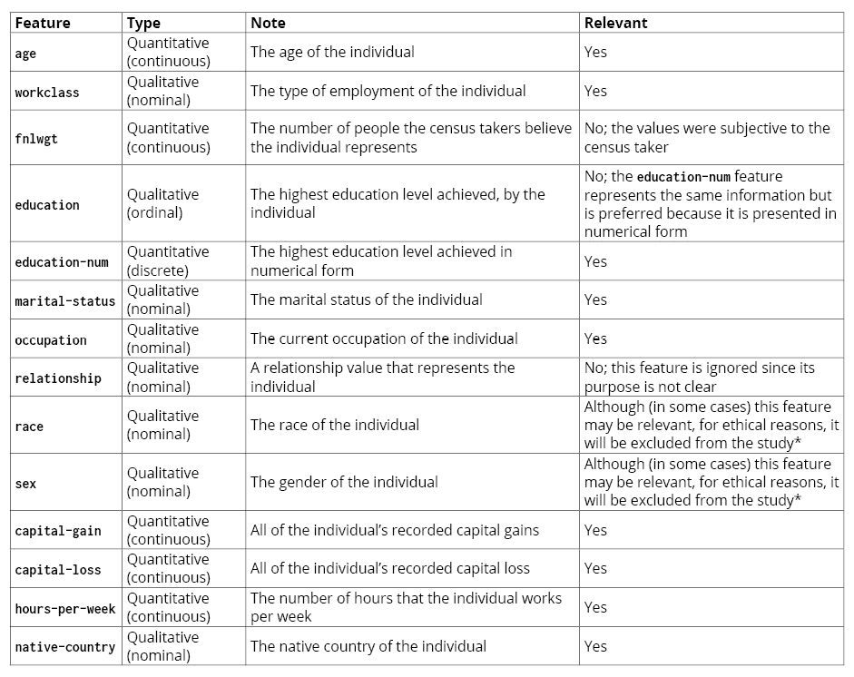

图 4.1：数据集特征分析

注意

*出版商说明：性别和种族在本研究进行时会影响个人的收入潜力。然而，为了本章的目的，我们决定在练习和活动中排除这些类别。

我们认识到，由于偏见和歧视性做法，无法将性别、种族、教育和职业机会等问题完全分开。在这些练习的预处理阶段从数据集中删除某些特征，并非忽视这些问题，也不是忽视民权领域中组织和个人所做的有价值的工作。

我们强烈建议你考虑数据及其使用方式的社会政治影响，并思考如何通过使用历史数据将过去的偏见传递到新的算法中。

从上表中，可以得出以下结论：

+   有五个特征与研究无关：`fnlwgt`、`education`、`relationship`、`race` 和 `sex`。在进行预处理和模型训练之前，必须从数据集中删除这些特征。

+   剩余的特征中，有四个是定性值。考虑到许多算法不考虑定性特征，这些值应当以数字形式表示。

利用我们在前几章学到的概念，可以处理上述语句以及异常值和缺失值的预处理过程。以下步骤解释了这个过程的逻辑：

1.  你需要导入数据集，并删除与研究无关的特征。

1.  你应该检查是否存在缺失值。考虑到缺失值最多的特征（`occupation`，有 1,843 个缺失值），由于这些缺失值仅占整个数据集的 5%或更少，因此不需要删除或替换它们。

1.  你必须将定性值转换为其数值表示。

1.  你应该检查是否存在异常值。在使用三倍标准差法检测异常值时，具有最多异常值的特征是`capital-loss`，包含 1,470 个异常值。由于这些异常值占整个数据集的比例不到 5%，因此它们可以不做处理，不会影响模型的结果。

上述过程将原始数据集转换为一个新数据集，包含 32,561 个实例（因为没有删除任何实例），但只有 9 个特征和一个类别标签。所有的值应该是数字形式。按照以下代码片段，使用 pandas 的`to_csv`函数将预处理后的数据集保存为文件：

```py
preprocessed_data.to_csv("census_income_dataset_preprocessed.csv")
```

上述代码片段将处理过的数据存储在 Pandas DataFrame 中，并将其保存为 CSV 文件。

注意

确保你执行了前述的预处理步骤，因为这是本章中将用于训练模型的数据集。

要回顾这些步骤，请访问本书的 GitHub 仓库，在名为`Chapter04`的文件夹下，查看名为`Census income dataset preprocessing`的文件。

# 朴素贝叶斯算法

**朴素贝叶斯**是一种基于**贝叶斯定理**的分类算法，它*天真地*假设特征之间是独立的，并且对所有特征赋予相同的权重（重要性程度）。这意味着该算法假设没有任何特征彼此相关或影响对方。例如，尽管在预测一个人的年龄时，体重和身高在某种程度上是相关的，但该算法仍假设每个特征是独立的。此外，算法将所有特征视为同等重要。例如，尽管教育程度可能比一个人孩子的数量更能影响其收入，算法仍然认为这两个特征同样重要。

注意

贝叶斯定理是一种计算条件概率的数学公式。欲了解更多关于该定理的信息，请访问以下网址：[`plato.stanford.edu/entries/bayes-theorem/`](https://plato.stanford.edu/entries/bayes-theorem/)。

尽管现实生活中的数据集包含了不等重要且相互之间不独立的特征，朴素贝叶斯算法在科学家中依然广受欢迎，因为它在大型数据集上表现得出奇的好。而且，由于算法的简易性，它运行速度快，因此可以应用于需要实时预测的问题。此外，它在文本分类中也得到了广泛使用，因为它常常超越了更复杂的算法。

## 朴素贝叶斯算法是如何工作的？

算法将输入数据转化为每个类标签与每个特征的发生情况总结，然后利用这些信息计算在给定一组特征组合的情况下，某一事件（类标签）发生的可能性。最后，该可能性会与其他类标签的可能性进行归一化处理。结果是一个实例属于每个类标签的概率。所有概率的总和必须为 1，具有较高概率的类标签是算法作为预测结果选择的标签。

让我们举个例子，来看一下下面表格中的数据：

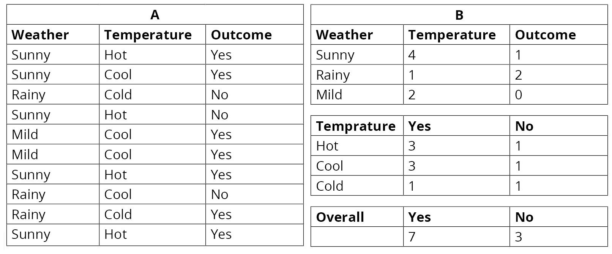

图 4.2：表 A - 输入数据，表 B - 发生次数

表 A 表示输入到算法中的数据，用于构建模型。表 B 则指的是算法隐式使用的事件发生次数，用于计算概率。

为了计算在给定一组特征的情况下，事件发生的可能性，算法会将每个特征下事件发生的概率与该事件的总发生概率相乘，计算公式如下：

```py
Likelihood [A1|E] = P[A1|E1] * P[A1|E2] * … * P[A1|En] * P[A1]
```

这里，*A*1 代表一个事件（类标签之一），*E*表示特征集，其中 *E*1 是第一个特征，*E*n 是数据集中的最后一个特征。

注意

这些概率的相乘只能通过假设特征之间是独立的来进行。

前面的公式是针对所有可能的结果（所有类别标签）进行计算的，然后标准化每个结果的概率，计算公式如下：

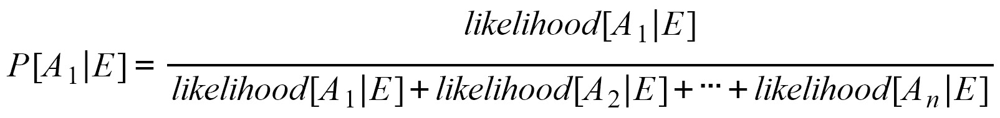

图 4.3：计算标准化概率的公式

对于*图 4.2*中的例子，给定一个新的实例，其中天气为*晴朗*，温度为*凉爽*，概率的计算如下：

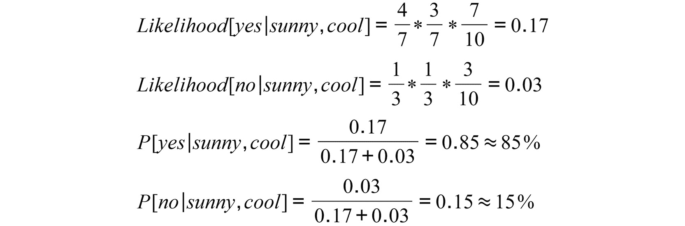

图 4.4：示例数据集的似然性和概率计算

通过查看前面的公式，可以得出结论，预测结果应该是*yes*。

需要提到的是，对于连续特征，发生情况的汇总是通过创建范围来进行的。例如，对于一个价格特征，算法可能会统计价格低于 100K 的实例数量，以及价格高于 100K 的实例数量。

此外，如果某个特征的某个值从未与某个结果相关联，算法可能会遇到一些问题。这是一个主要问题，因为给定该特征时，结果的概率将为零，这会影响整个计算。在前面的例子中，对于预测一个实例，其中天气为*温和*，温度为*凉爽*，给定特征集的*no*概率将等于零，因为给定*温和*天气时，*no*的概率为零，因为没有*温和*天气对应*no*结果。

为了避免这种情况，应使用**拉普拉斯估计器**技术。在这里，表示给定特征下事件发生概率的分数，*P[A|E*1*]*，通过在分子上加 1，同时在分母上加上该特征的可能值的数量来进行修改。

对于这个例子，使用拉普拉斯估计器来预测天气为*温和*、温度为*凉爽*的新实例的预测结果，可以按如下方式进行：

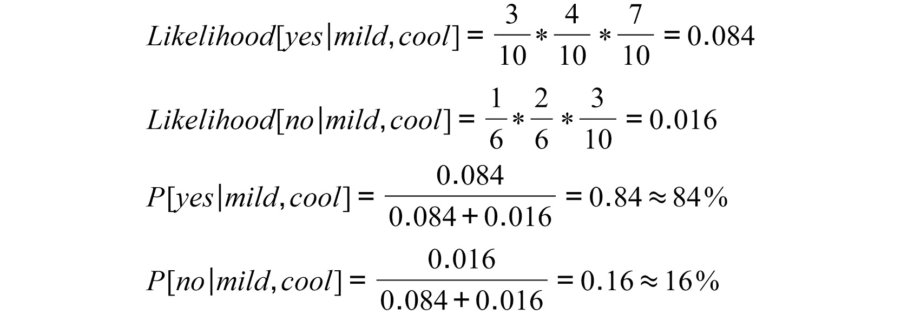

图 4.5：使用拉普拉斯估计器计算示例数据集的似然性和概率

在这里，计算在*温和*天气下出现*yes*的分数，从 2/7 变为 3/10，这是由于在分子上加了 1，在分母上加了 3（对应*晴朗*、*温和*和*雨天*）。其他计算事件发生概率的分数也有相同的变化，前提是给定某一特征。请注意，计算事件独立于任何特征发生的概率的分数没有改变。

然而，正如你到目前为止所学到的，scikit-learn 库允许你训练模型，然后使用它们进行预测，而无需手动编写数学公式。

## 练习 4.01：应用朴素贝叶斯算法

现在，让我们将朴素贝叶斯算法应用于 Fertility 数据集，该数据集旨在判断个体的生育能力是否受到其人口统计特征、环境条件和过去的医疗状况的影响。按照以下步骤完成此练习：

注意

对于本章中的练习和活动，你需要在系统中安装 Python 3.7、NumPy、Jupyter、Pandas 和 scikit-learn。

1.  从[Fertility 数据集](http://archive.ics.uci.edu/ml/datasets/Fertility)下载数据。进入链接并点击`Data Folder`。点击`fertility_Diagnosis.txt`，这将触发下载。将其保存为`.csv`文件。

    注意

    该数据集也可以在本书的 GitHub 仓库中找到：[`packt.live/39SsSSN`](https://packt.live/39SsSSN)。

    数据集来自 UC Irvine 机器学习库：David Gil, Jose Luis Girela, Joaquin De Juan, M. Jose Gomez-Torres 和 Magnus Johnsson。*使用人工智能方法预测精液质量*。《专家系统应用》期刊。

1.  打开一个 Jupyter Notebook 来实现这个练习。导入 pandas，并从 scikit-learn 的`naive_bayes`模块导入`GaussianNB`类：

    ```py
    import pandas as pd
    from sklearn.naive_bayes import GaussianNB
    ```

1.  阅读你在第一步下载的`.csv`文件。确保在`read_csv`函数中添加`header`参数，并将其设置为`None`，因为该数据集不包含标题行：

    ```py
    data = pd.read_csv("fertility_Diagnosis.csv", header=None)
    ```

1.  将数据拆分为`X`和`Y`，因为类标签位于索引为 9 的列下。使用以下代码来完成此操作：

    ```py
    X = data.iloc[:,:9]
    Y = data.iloc[:,9]
    ```

1.  实例化我们之前导入的`GaussianNB`类。接下来，使用`fit`方法，使用`X`和`Y`训练模型：

    ```py
    model = GaussianNB()
    model.fit(X, Y)
    ```

    运行此脚本的输出如下：

    ```py
    GaussianNB(priors=None, var_smoothing=1e-09)
    ```

    这表示类的实例化成功。括号内的信息代表用于参数的值，这些值是类接受的超参数。

    例如，对于`GaussianNB`类，可以设置每个类别标签的先验概率，并设置一个平滑参数来稳定方差。然而，该模型在初始化时没有设置任何参数，这意味着它将使用每个参数的默认值，对于`priors`是`None`，对于平滑超参数是`1e-09`。

1.  最后，使用你之前训练的模型对一个新的实例进行预测，给定每个特征的以下值：`−0.33`，`0.69`，`0`，`1`，`1`，`0`，`0.8`，`0`，`0.88`。使用以下代码来进行预测：

    ```py
    pred = model.predict([[-0.33,0.69,0,1,1,0,0.8,0,0.88]])
    print(pred)
    ```

    请注意，我们将值放入双重方括号中，因为`predict`函数将预测值作为数组的数组输入，其中第一组数组对应于要预测的新实例列表，第二个数组表示每个实例的特征列表。

    上述代码片段的输出如下：

    ```py
    ['N']
    ```

    对该对象的预测类别为 `N`，这意味着该对象的生育能力没有受到影响。

    注意

    若要访问此特定部分的源代码，请参阅 [`packt.live/2Y2wW0c`](https://packt.live/2Y2wW0c)。

    你也可以在 [`packt.live/3e40LTt`](https://packt.live/3e40LTt) 上在线运行这个示例。你必须执行整个 Notebook 才能获得期望的结果。

你已经成功训练了一个 Naïve Bayes 模型，并对新观测值进行了预测。

## 活动 4.01：为我们的 Census Income 数据集训练 Naïve Bayes 模型

为了在真实数据集上测试不同的分类算法，考虑以下场景：你为一家银行工作，他们决定实现一个能够预测个人年收入的模型，并根据此信息决定是否批准贷款。你得到一个包含 32,561 个合适观测值的数据集，数据集已经过预处理。你的任务是训练三个不同的模型，并确定哪个最适合此案例研究。第一个模型是构建一个高斯 Naïve Bayes 模型。使用以下步骤完成这个活动：

1.  在 Jupyter Notebook 中，导入所有需要的元素来加载和拆分数据集，以及训练 Naïve Bayes 算法。

1.  加载预处理后的 Census Income 数据集。接下来，通过创建两个变量 `X` 和 `Y`，将特征与目标变量分开。

    注意

    预处理后的 Census Income 数据集可以在本书的 GitHub 仓库中找到，地址是 [`packt.live/2JMhsFB`](https://packt.live/2JMhsFB)。它包含了本章开始时预处理过的 Census Income 数据集。

1.  将数据集划分为训练集、验证集和测试集，使用 10% 的拆分比例。

    注意

    当所有三个数据集都是从同一个数据集中创建时，就不需要额外创建训练/验证集来测量数据不匹配的情况。此外，值得注意的是，可以尝试不同的拆分比例，因为前一章解释的百分比并不是固定不变的。尽管这些比例通常有效，但在构建机器学习模型时，重要的是要接受在不同层次上进行实验。

1.  使用 `fit` 方法在训练集（`X_train` 和 `Y_train`）上训练 Naïve Bayes 模型。

1.  最后，使用你之前训练的模型对具有以下每个特征值的新实例进行预测：`39`，`6`，`13`，`4`，`0`，`2174`，`0`，`40`，`38`。

    对于该个体的预测结果应该为零，意味着该个体的收入可能小于或等于 50K。

    注意

    在本章的所有活动中使用相同的 Jupyter Notebook，这样你就可以在相同的数据集上比较不同模型的表现。

    这个活动的解决方案可以在第 236 页找到。

# 决策树算法

**决策树算法**通过一个类似树形结构的序列进行分类。它通过将数据集划分为小的子集来工作，这些子集作为指导来开发决策树节点。这些节点可以是决策节点或叶节点，其中前者代表一个问题或决策，后者代表做出的决策或最终结果。

## 决策树算法如何工作？

考虑到我们刚才提到的内容，决策树不断根据决策节点中定义的参数来划分数据集。决策节点有分支从其发出，每个决策节点可以有两个或更多的分支。这些分支代表不同的可能答案，定义了数据如何被划分。

例如，考虑以下表格，它展示了一个人是否有未结学生贷款，基于他们的年龄、最高教育水平和当前收入：

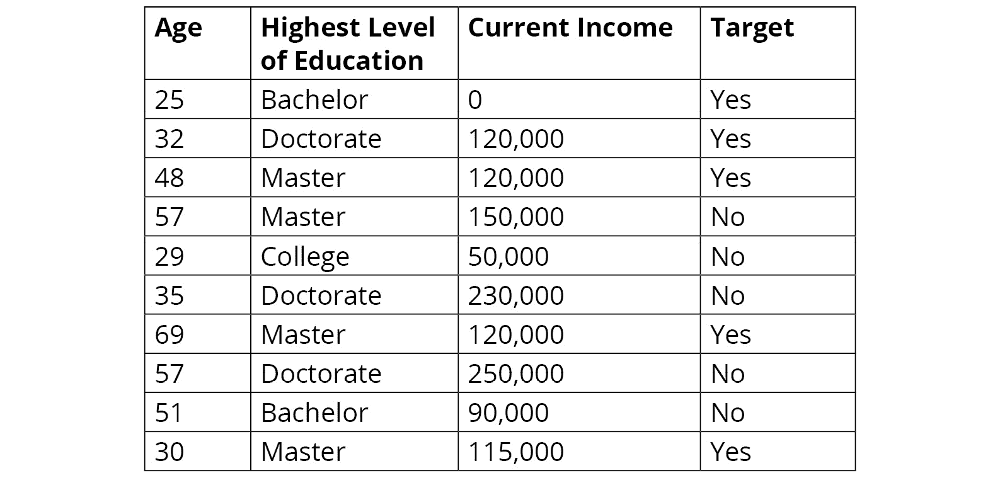

图 4.6：学生贷款数据集

基于前述数据构建的决策树的一种可能配置如下图所示，其中浅色框表示决策节点，箭头是代表每个决策节点答案的分支，深色框表示按照序列进行的实例的结果：

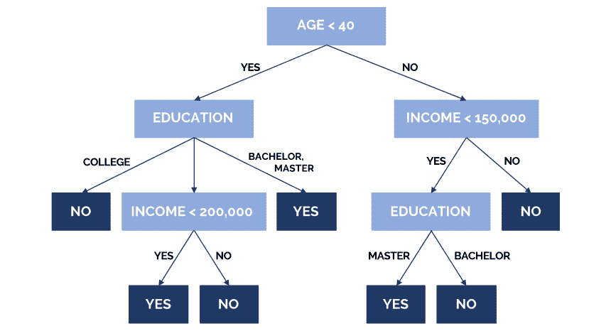

图 4.7：决策树中表示的数据

为了进行预测，在构建决策树之后，模型会逐个实例地跟随与该实例特征匹配的序列，直到到达一个叶节点，即结果。根据这一点，分类过程从根节点（最上面那个）开始，沿着描述该实例的分支进行。该过程一直持续，直到到达叶节点，表示该实例的预测结果。

例如，一个*40 岁以上*、收入*低于$150,000*、教育水平为*学士*的人可能没有学生贷款；因此，分配给该类的标签为*否*。

决策树可以处理定量和定性特征，考虑到连续特征会以区间的形式处理。此外，叶节点可以处理分类的或连续的类标签；对于分类类标签，进行分类；而对于连续类标签，要处理的任务是回归。

## 练习 4.02：应用决策树算法

在本练习中，我们将应用决策树算法到生育数据集，目的是确定个体的生育水平是否受到其人口统计信息、环境条件和以往健康状况的影响。按照以下步骤完成此练习：

1.  打开一个 Jupyter Notebook 来实现这个练习，并导入`pandas`，以及从 scikit-learn 的`tree`模块中导入`DecisionTreeClassifier`类：

    ```py
    import pandas as pd
    from sklearn.tree import DecisionTreeClassifier
    ```

1.  加载你在*练习 4.01*中下载的`fertility_Diagnosis`数据集，*应用朴素贝叶斯算法*。确保在`read_csv`函数中添加`header`参数并设置为`None`，因为数据集没有包含标题行：

    ```py
    data = pd.read_csv("fertility_Diagnosis.csv", header=None)
    ```

1.  将数据拆分为`X`和`Y`，因为类别标签位于索引为`9`的列下。使用以下代码：

    ```py
    X = data.iloc[:,:9]
    Y = data.iloc[:,9]
    ```

1.  实例化`DecisionTreeClassifier`类。接下来，使用`fit`函数训练模型，使用`X`和`Y`：

    ```py
    model = DecisionTreeClassifier()
    model.fit(X, Y)
    ```

    再次运行前面的代码片段，输出结果将会显示。这个输出总结了定义模型的条件，通过打印出模型使用的每个超参数的值，如下所示：

    ```py
    DecisionTreeClassifier(ccp_alpha=0.0, class_weight=None,
                           criterion='gini', max_depth=None,
                           max_features=None, max_leaf_nodes=None,
                           min_impurity_decrease=0.0,
                           min_impurity_split=None,
                           min_samples_leaf=1, min_samples_split=2,
                           min_weight_fraction_leaf=0.0,
                           presort='deprecated',
                           random_state=None, splitter='best')
    ```

    由于模型在没有设置任何超参数的情况下被实例化，因此总结将显示每个超参数使用的默认值。

1.  最后，使用你之前训练的模型对相同的实例进行预测，这些实例在*练习 4.01*中也使用过，*应用朴素贝叶斯算法*：`−0.33`，`0.69`，`0`，`1`，`1`，`0`，`0.8`，`0`，`0.88`。

    使用以下代码来实现：

    ```py
    pred = model.predict([[-0.33,0.69,0,1,1,0,0.8,0,0.88]])
    print(pred)
    ```

    预测的输出结果如下：

    ```py
    ['N']
    ```

    再次，模型预测显示受试者的生育能力没有受到影响。

    注意

    要访问此特定部分的源代码，请参考[`packt.live/3hDlvns`](https://packt.live/3hDlvns)。

    你还可以在线运行这个示例，网址为[`packt.live/3fsVw07`](https://packt.live/3fsVw07)。你必须执行整个 Notebook 才能获得预期的结果。

你已经成功训练了一个决策树模型，并对新数据进行了预测。

## 活动 4.02：为我们的普查收入数据集训练决策树模型

你继续构建一个能够预测个人年收入的模型。使用预处理过的普查收入数据集，你选择了构建一个决策树模型：

1.  打开你在之前活动中使用的 Jupyter Notebook，并从 scikit-learn 中导入决策树算法。

1.  使用来自 scikit-learn 的`DecisionTreeClassifier`类的`fit`方法训练模型。使用来自前一个活动的训练集数据（`X_train`和`Y_train`）来训练模型。

1.  最后，使用你训练的模型对一个新的实例进行预测，该实例的每个特征值如下：`39`，`6`，`13`，`4`，`0`，`2174`，`0`，`40`，`38`。

    对于该个体的预测应该为零，意味着该个体的收入可能小于或等于 50K。

    注意

    这个活动的解决方案可以在第 237 页找到。

# 支持向量机算法

**支持向量机**（**SVM**）算法是一种分类器，它找到一个有效地将观察值分隔到各自类别标签的超平面。算法首先将每个实例放入具有*n*维度的数据空间，其中*n*表示特征的数量。接着，它会画出一条虚拟的直线，这条线清楚地将属于同一类别标签的实例与属于其他类别标签的实例分开。

支持向量指的是给定实例的坐标。根据这一点，支持向量机是有效地在数据空间中将不同支持向量分开的边界。

对于二维数据空间，超平面是将数据空间分为两个部分的直线，每部分代表一个类别标签。

## SVM 算法是如何工作的？

以下图示展示了一个简单的 SVM 模型示例。三角形和圆形的数据点代表输入数据集中的实例，其中形状定义了每个实例所属的类别标签。虚线表示超平面，清晰地分隔了数据点，这个超平面是基于数据点在数据空间中的位置来定义的。此线用于分类未见过的数据，正如图中的方块所示。通过这种方式，位于该线左侧的新实例将被分类为三角形，而位于右侧的实例将被分类为圆形。

特征数量越多，数据空间的维度就越多，这将使得模型的可视化变得不可能：

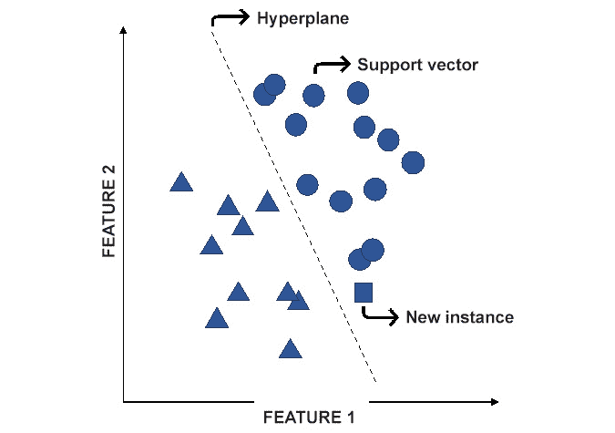

图 4.8: SVM 模型的图示例

尽管该算法看似非常简单，但其复杂性体现在算法绘制适当超平面的方式上。这是因为该模型可以概括成数百个具有多个特征的观察数据。

为了选择正确的超平面，算法遵循以下规则，其中*规则 1*比*规则 2*更为重要：

+   **规则 1**：超平面必须最大化实例的正确分类。这基本上意味着，最佳的直线是那条能够有效地将不同类别标签的数据点分开，同时将属于同一类别的数据点保持在一起的直线。

    例如，在下图中，尽管两条直线都能够将大多数实例分入正确的类别标签，但线 A 会被模型选为比线 B 更好地分隔类别的超平面，后者未能正确分类两个数据点：

    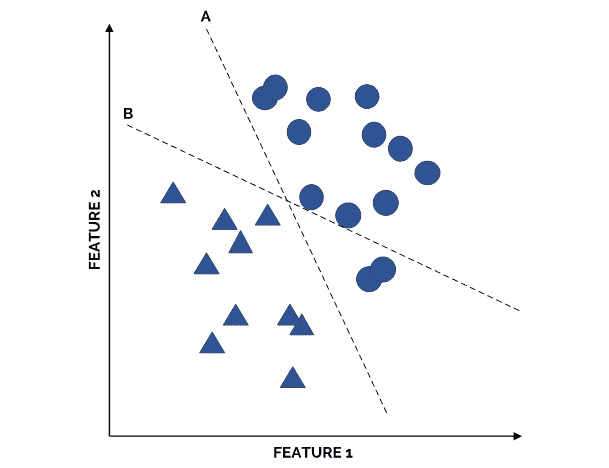

图 4.9: 解释规则 1 的超平面示例

+   **规则 2**：超平面必须最大化其到任一类别标签最近数据点的距离，这也被称为**间隔**。该规则有助于使模型更加健壮，这意味着模型能够对输入数据进行泛化，从而能够高效处理未见过的数据。此规则在防止新实例被错误标记时尤为重要。

    例如，通过查看下图，可以得出结论，两个超平面都符合*规则 1*。然而，选择了 A 线，因为它最大化了与两个类别最近数据点的距离，相比之下，B 线与其最近数据点的距离较小：

    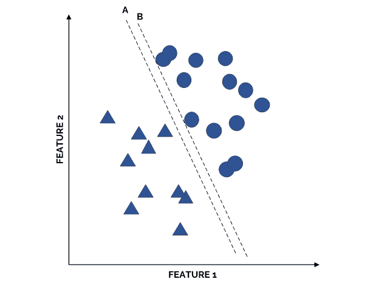

图 4.10：解释规则 2 的超平面示例

默认情况下，SVM 算法使用线性函数来分隔输入数据的点。然而，可以通过更改算法的核类型来修改此配置。例如，考虑以下图示：

注意

对于 scikit-learn 的 SVM 算法，核指的是用于分隔数据点的数学函数，可以是线性的、多项式的或 sigmoid 函数等。要了解更多关于该算法的参数，可以访问以下网址：[`scikit-learn.org/stable/modules/generated/sklearn.svm.SVC.html#sklearn.svm.SVC`](https://scikit-learn.org/stable/modules/generated/sklearn.svm.SVC.html#sklearn.svm.SVC)。

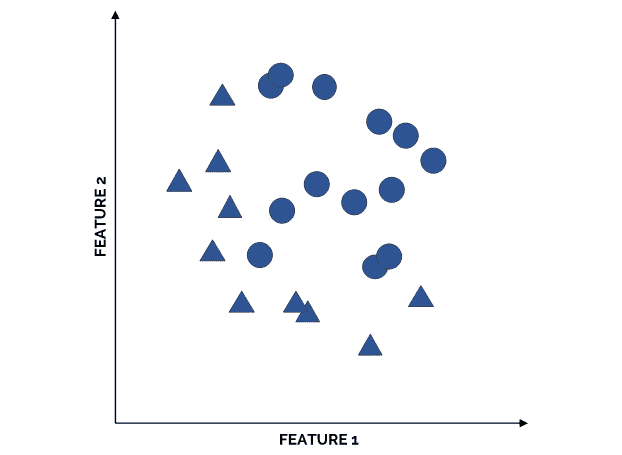

图 4.11：示例观测值

为了将这些观测值分隔开，模型必须绘制一个圆或其他类似的形状。该算法通过使用核函数（数学函数）来处理这一问题，核函数可以向数据集引入额外的特征，从而修改数据点的分布，使其能够通过一条直线将其分隔开来。为此有几种不同的核可供选择，选择合适的核函数需要通过试验和错误来进行，以便找到最适合分类现有数据的核函数。

然而，scikit-learn 中 SVM 算法的默认核函数是**径向基函数**（**RBF**）核。主要原因是，根据多项研究表明，这种核函数在大多数数据问题中表现良好。

## 练习 4.03：应用 SVM 算法

在本练习中，我们将应用 SVM 算法处理“生育数据集”。这个想法与之前的练习相同，即确定个体的生育水平是否受其人口统计学、环境条件和既往病史的影响。按照以下步骤完成本次练习：

1.  打开一个 Jupyter Notebook 来实现本次练习。导入 pandas 以及 scikit-learn 的 `svm` 模块中的 `SVC` 类：

    ```py
    import pandas as pd
    from sklearn.svm import SVC
    ```

1.  加载你在*练习 4.01*中下载的`fertility_Diagnosis`数据集，*应用朴素贝叶斯算法*。确保在`read_csv`函数中添加`header = None`参数，因为该数据集不包含标题行：

    ```py
    data = pd.read_csv("fertility_Diagnosis.csv", header=None)
    ```

1.  将数据分成`X`和`Y`，考虑到类别标签位于索引为`9`的列下。使用以下代码进行操作：

    ```py
    X = data.iloc[:,:9]
    Y = data.iloc[:,9]
    ```

1.  实例化 scikit-learn 的`SVC`类，并使用`fit`函数，利用`X`和`Y`数据来训练模型：

    ```py
    model = SVC()
    model.fit(X, Y)
    ```

    再次运行这段代码时，输出结果为模型的总结，以及其默认超参数，如下所示：

    ```py
    SVC(C=1.0, break_ties=False, cache_size=200,
        class_weight=None, coef0=0.0,
        decision_function_shape='ovr', degree=3,
        gamma='scale', kernel='rbf', max_iter=-1,
        probability=False, random_state=None, shrinking=True,
        tol=0.001, verbose=False)
    ```

1.  最后，使用之前训练的模型进行预测，预测与我们在*练习 4.01*中使用的相同实例：−`0.33`、`0.69`、`0`、`1`、`1`、`0`、`0.8`、`0`、`0.88`。

    使用以下代码进行操作：

    ```py
    pred = model.predict([[-0.33,0.69,0,1,1,0,0.8,0,0.88]])
    print(pred)
    ```

    输出结果如下：

    ```py
    ['N']
    ```

    再次，模型预测该实例的类别标签为`N`，意味着该对象的生育能力未受到影响。

    注意

    要访问这一特定部分的源代码，请参考[`packt.live/2YyEMNX`](https://packt.live/2YyEMNX)。

    你也可以在线运行这个示例，网址为[`packt.live/2Y3nIR2`](https://packt.live/2Y3nIR2)。你必须执行整个 Notebook 才能得到预期结果。

你已经成功地训练了一个 SVM 模型并进行了预测。

## 活动 4.03：为我们的普查收入数据集训练 SVM 模型

继续你的任务，构建一个能够预测个人年收入的模型，最后你要训练的算法是支持向量机。按照以下步骤来实现此活动：

1.  打开你在前一活动中使用的 Jupyter Notebook，并从 scikit-learn 中导入 SVM 算法。

1.  使用 scikit-learn 中的`SVC`类的`fit`方法来训练模型。要训练模型，使用前一活动中的训练集数据（`X_train`和`Y_train`）。

    注意

    使用`fit`方法训练 SVC 类可能需要一些时间。

1.  最后，使用之前训练的模型进行预测，预测一个新实例，假设该实例的每个特征值如下：`39`、`6`、`13`、`4`、`0`、`2174`、`0`、`40`、`38`。

    对个体的预测应为零，即该个体的收入最有可能小于或等于 50K。

    注意

    这个活动的解决方案可以在第 238 页找到。

# 误差分析

在上一章中，我们解释了误差分析的重要性。在本节中，我们将计算前面活动中创建的三个模型的不同评估指标，以便进行比较。

为了学习的目的，我们将使用准确率、精确度和召回率指标来比较模型。这样，就能看到即使某个模型在某个指标上表现较好，在另一个指标上却可能表现较差，这有助于强调选择适当指标的重要性，以便根据你希望实现的目标来衡量模型。

## 准确率、精确度和召回率

简要提醒一下，为了衡量性能并进行误差分析，你需要使用 `predict` 方法来处理不同的数据集（训练集、验证集和测试集）。以下代码片段展示了一种简洁的方式，可以同时在我们的三个数据集上衡量所有三个指标：

注意

完成本章活动后，需执行以下步骤。这主要是因为这一部分的步骤是本章活动的延续。

1.  首先，导入将要使用的三个评估指标：

    ```py
    from sklearn.metrics import accuracy_score, \
    precision_score, recall_score
    ```

1.  接下来，我们创建两个列表，包含将用于 `for` 循环中的不同数据集，用于对所有模型的所有数据集进行性能计算：

    ```py
    X_sets = [X_train, X_dev, X_test]
    Y_sets = [Y_train, Y_dev, Y_test]
    ```

1.  一个字典将被创建，用来存储每个模型对每组数据的每个评估指标的值：

    ```py
    metrics = {"NB":{"Acc":[],"Pre":[],"Rec":[]},
               "DT":{"Acc":[],"Pre":[],"Rec":[]},
               "SVM":{"Acc":[],"Pre":[],"Rec":[]}}
    ```

1.  使用 `for` 循环来遍历不同的数据集：

    ```py
    for i in range(0,len(X_sets)):
        pred_NB = model_NB.predict(X_sets[i])
        metrics["NB"]["Acc"].append(accuracy_score(Y_sets[i], \
                                    pred_NB))
        metrics["NB"]["Pre"].append(precision_score(Y_sets[i], \
                                    pred_NB))
        metrics["NB"]["Rec"].append(recall_score(Y_sets[i], \
                                    pred_NB))
        pred_tree = model_tree.predict(X_sets[i])
        metrics["DT"]["Acc"].append(accuracy_score(Y_sets[i], \
                                    pred_tree))
        metrics["DT"]["Pre"].append(precision_score(Y_sets[i], \
                                    pred_tree))
        metrics["DT"]["Rec"].append(recall_score(Y_sets[i], \
                                    pred_tree))
        pred_svm = model_svm.predict(X_sets[i])
        metrics["SVM"]["Acc"].append(accuracy_score(Y_sets[i], \
                                     pred_svm))
        metrics["SVM"]["Pre"].append(precision_score(Y_sets[i], \
                                     pred_svm))
        metrics["SVM"]["Rec"].append(recall_score(Y_sets[i], \
                                     pred_svm))
    ```

1.  打印评估指标，结果如下：

    ```py
    print(metrics)
    ```

    输出结果如下：

    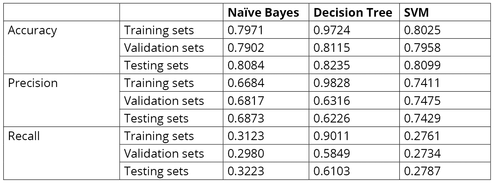

    ](img/B15781_04_12.jpg)

图 4.12：打印评估指标

在 `for` 循环内，有三个代码块，每个代码块对应我们在之前活动中创建的一个模型。每个代码块执行以下操作：

首先，进行预测。预测是通过调用模型的 `predict` 方法，并输入一组数据来实现的。由于该操作发生在 `for` 循环中，预测将对所有数据集进行。

接下来，通过将实际数据与我们之前计算的预测结果进行比较，来计算所有三个指标。计算结果会附加到之前创建的字典中。

从前面的代码片段中，得到以下结果：

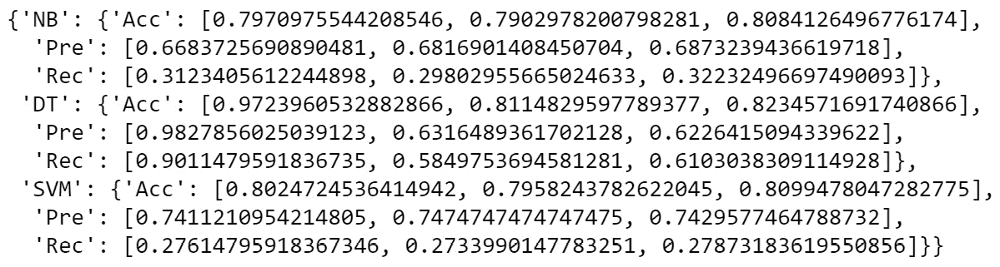

](img/B15781_04_13.jpg)

图 4.13：所有三个模型的性能结果

注意

请检查代码，以获得这些结果，相关代码可以在本书的 GitHub 仓库中找到，路径为 `Chapter04` 文件夹，文件名为 `Error analysis`。

初步推断，关于选择最适合的模型，并考虑每个模型面临的条件时，将仅考虑准确率指标的值，假设贝叶斯误差接近 0（这意味着该模型可能达到接近 1 的最大成功率）：

+   在比较了朴素贝叶斯和支持向量机（SVM）模型的三项准确率得分后，可以得出结论：这两种模型在三组数据上的表现几乎相同。这基本上意味着这些模型能够很好地泛化训练集数据，因此在未见过的数据上也能表现良好。然而，这些模型的整体表现约为 0.8，远低于最大成功率。这意味着这些模型可能存在较高的偏差。

+   此外，决策树模型在训练集准确度方面的表现更接近最大成功率。然而，考虑到模型在验证集上的准确度远低于训练集表现，模型正面临过拟合问题。为了解决过拟合问题，可以通过增加训练集数据或微调模型的超参数来帮助提高验证集和测试集的准确度。对树进行剪枝也有助于缓解过拟合问题。

鉴于此，研究人员现在已经拥有了选择模型并致力于提高结果以实现模型最大可能性能所需的信息。

接下来，为了学习的目的，让我们比较决策树模型的所有衡量标准的结果。尽管三项衡量标准的值都证明了过拟合的存在，但可以观察到精度和召回率标准下的过拟合程度明显更大。此外，可以得出结论，模型在训练集上以召回率衡量时的表现较差，这意味着模型在分类正标签时的能力较弱。这意味着，如果案例研究的目标是最大化正标签的分类数，而不考虑负标签的分类，那么模型还需要提高其在训练集上的表现。

注意

前面的对比是为了说明，同一模型的表现可能因采用不同的衡量标准而有所不同。因此，选择与案例研究相关的衡量标准至关重要。

利用从前几章获得的知识，随时可以继续探索前面表格中显示的结果。

# 摘要

运用前几章的知识，我们通过对人口普查收入数据集进行分析来开始本章，目的是了解可用数据并对预处理过程做出决策。解释了三种监督学习分类算法——朴素贝叶斯算法、决策树算法和支持向量机（SVM）算法，并将它们应用于之前预处理的数据集，以创建能够泛化到训练数据的模型。最后，我们通过计算不同数据集（训练、验证和测试）上的准确率、精确率和召回率来比较三种模型在人口普查收入数据集上的表现。

在下一章中，我们将研究**人工神经网络**（**ANNs**）、它们的不同类型以及它们的优缺点。我们还将使用 ANN 解决本章讨论的相同数据问题，并将其性能与其他监督学习算法进行比较。
