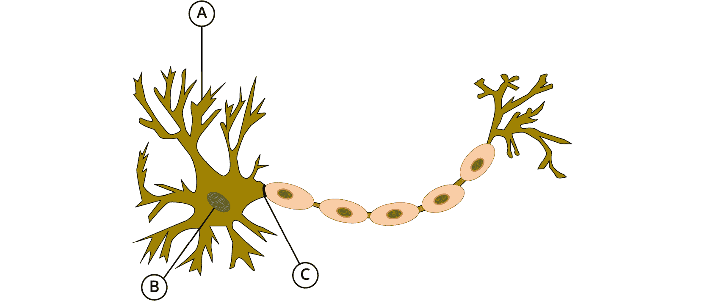
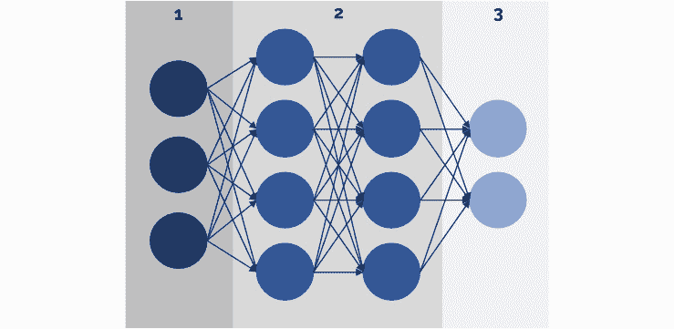
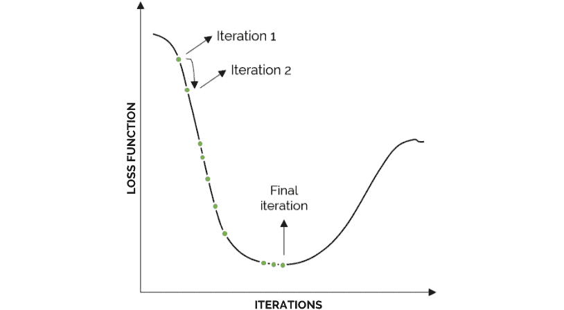
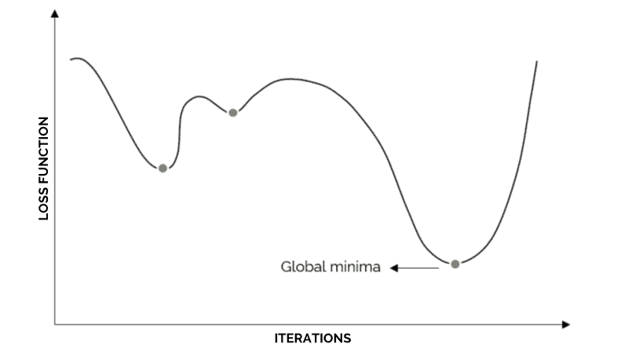
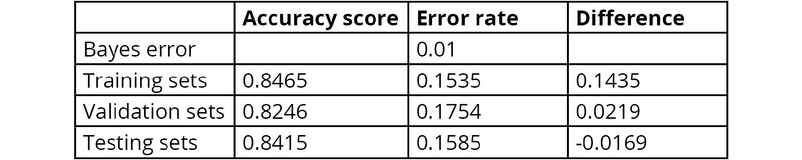
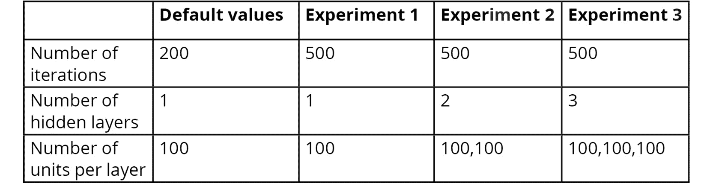
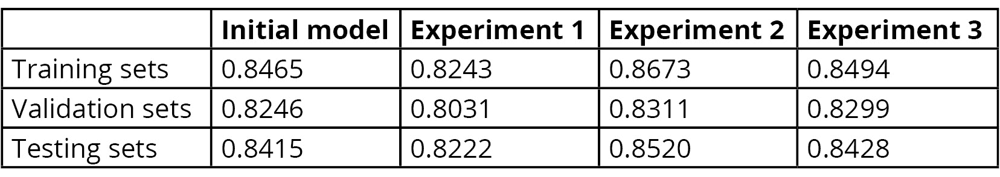
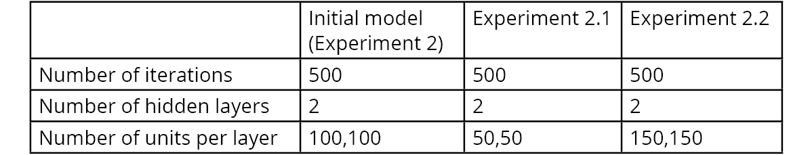
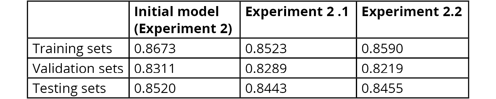
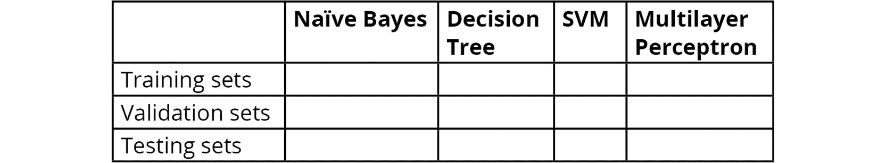

# 第五章：5\. 监督学习 – 关键步骤

概述

在本章中，我们将深入探讨神经网络的概念，并描述前向传播和反向传播的过程。我们将使用神经网络解决一个监督学习分类问题，并通过执行误差分析来分析神经网络的结果。

到本章结束时，你将能够训练一个网络来解决分类问题，并微调网络的一些超参数以提高其性能。

# 引言

在前一章节中，我们探讨了三种机器学习算法，用于解决监督学习任务，无论是分类还是回归问题。在本章中，我们将探讨当前最流行的机器学习算法之一——人工神经网络，它属于一种叫做深度学习的机器学习子集。

**人工神经网络**（**ANNs**），也被称为 **多层感知机**（**MLPs**），由于它们呈现出一种复杂的算法，可以处理几乎任何具有挑战性的数据问题，因此越来越受欢迎。尽管这一理论在 20 世纪 40 年代就已被提出，但随着技术的进步，尤其是数据收集的能力和计算基础设施的发展，现在这些网络变得更加流行，它们能够在大量数据的基础上训练复杂的算法。

因此，接下来的章节将重点介绍人工神经网络（ANNs）、它们的不同类型以及它们所呈现的优缺点。此外，按照前一章节的内容，将使用一个人工神经网络根据个人的 demographic 和 financial 信息预测其收入，以展示人工神经网络与其他监督学习算法在性能上的差异。

# 人工神经网络

尽管有多种机器学习算法可用于解决数据问题，但正如我们已经提到的，人工神经网络（ANNs）因其能够在大型复杂数据集中发现模式，而逐渐受到数据科学家的青睐，这些模式是人类无法解释的。

**神经**这个词部分指的是模型结构与人脑解剖结构的相似性。这一部分旨在复制人类通过将数据从一个神经元传递到另一个神经元，直到得出结果的方式来学习历史数据的能力。

在以下图示中，展示了一个人类神经元，其中 A 表示接收来自其他神经元输入信息的 **树突**，B 代表处理信息的 **细胞核**，C 表示负责将处理后的信息传递给下一个神经元的 **轴突**：



图 5.1：人类神经元的可视化表示

此外，**人工**部分指的是模型的实际学习过程，其主要目标是最小化模型的误差。这是一个人工学习过程，因为没有确凿的证据表明人类神经元如何处理它们接收到的信息，因此模型依赖于将输入映射到期望输出的数学函数。

## 神经网络是如何工作的？

在深入了解神经网络的过程之前，让我们先看一下其主要组成部分：

+   `X`，它包含了数据集中所有的数据（每个实例及其特征）。

+   **隐藏层**：这一层负责处理输入数据，以便发现有助于做出预测的模式。神经网络可以有任意数量的隐藏层，每层有所需的神经元（单位）数。前几层负责处理简单的模式，而后面几层则负责寻找更复杂的模式。

    隐藏层使用一组表示权重和偏差的变量来帮助训练网络。权重和偏差的值作为在每次迭代中变化的变量，用来将预测结果逼近实际值。稍后将详细解释这一过程。

+   `Y_hat`，这一层是模型基于从隐藏层接收到的数据所做的预测。该预测以概率的形式呈现，其中具有较高概率的类别标签被选为预测结果。

以下图示展示了前三层的架构，其中 1 下方的圆圈表示输入层的神经元，2 下方的圆圈表示两个隐藏层的神经元（每层由一列圆圈表示），最后，3 下方的圆圈表示输出层的神经元：



图 5.2：神经网络的基本结构

作为类比，考虑一个制造汽车零部件的过程。在这里，输入层由原材料组成，这些原材料可能是铝。过程的初步步骤包括抛光和清洁材料，可以视为前几层隐藏层。接下来，材料被弯曲以实现汽车部件的形状，这由更深的隐藏层处理。最后，部件交付给客户，这可以视为输出层。

考虑到这些步骤，制造过程的主要目标是实现一个最终部件，该部件高度类似于该过程旨在构建的部件，这意味着输出 `Y_hat` 应最大化与 `Y`（实际值）的相似性，才能认为模型与数据相拟合。

训练 ANN 的实际方法是一个迭代过程，包括以下步骤：正向传播、计算成本函数、反向传播、以及权重和偏置的更新。一旦权重和偏置更新完成，过程将重新开始，直到满足迭代次数要求。

让我们详细探讨迭代过程中的每个步骤。

### 正向传播

输入层将初始信息传递给 ANN。数据的处理是通过在网络的深度（隐藏层的数量）和宽度（每层单元的数量）中传播数据比特完成的。每一层中的每个神经元都使用线性函数处理信息，并结合激活函数来打破线性关系，过程如下：


图 5.3：ANN 使用的线性和激活函数

这里，*W*1 和 *b*1 分别是包含权重和偏置的矩阵和向量，作为可以通过迭代更新的变量来训练模型。*Z*1 是给定神经元的线性函数，*A*1 是在应用激活函数（用 sigma 符号表示）后得到的单位输出。

前述的两个公式会针对每个层中的每个神经元进行计算，其中隐藏层（除了输入层）的 *X* 值将被替换为上一层的输出（*A*n），如下所示：


图 5.4：ANN 第二层计算的值

最后，来自最后一个隐藏层的输出被传送到输出层，在那里再次计算线性函数，并结合激活函数进行处理。经过必要的处理后，该层的输出将与真实值进行比较，以评估算法的性能，然后才会进入下一次迭代。

第一次迭代的权重值会在 0 和 1 之间随机初始化，而偏置值可以初始设置为 0。一旦第一次迭代运行，权重和偏置值将被更新，从而使过程重新开始。

激活函数可以有不同的类型。一些常见的激活函数包括**修正线性单元**（**ReLU**）、**双曲正切**（**tanh**）、以及**Sigmoid**和**Softmax**函数，后续部分将对这些函数进行解释。

### 成本函数

考虑到训练过程的最终目标是基于给定的数据集构建一个模型，以映射预期输出，特别重要的是通过比较预测值（`Y_hat`）和真实值（`Y`）之间的差异，来衡量模型估计 `X` 和 `Y` 之间关系的能力。这是通过计算损失函数（也称为**损失函数**）来完成的，目的是确定模型预测的准确性。每次迭代都会计算损失函数，以衡量模型在迭代过程中的进展，目标是找到能够最小化损失函数的权重和偏置值。

对于分类任务，最常用的损失函数是**交叉熵损失函数**，其中损失函数的值越大，预测值与实际值之间的差异越大。

对于二分类任务，也就是只有两个类别输出标签的任务，交叉熵损失函数的计算公式如下：

```py
cost = -(y * log(yhat) + (1-y) *(1-yhat))
```

这里，*y* 要么是 1，要么是 0（两个类别标签中的一个），*y*hat 是模型计算的概率，*log* 是自然对数。

对于多类别分类任务，公式如下：


图 5.5：多类别分类任务的损失函数

这里，*c* 表示类别标签，*M* 是类别标签的总数。

一旦损失函数计算完成，训练过程将进入反向传播步骤，接下来将解释这一过程。

此外，对于回归任务，损失函数将是均方根误差（RMSE），这一点在*第三章*，*监督学习——关键步骤*中已解释。

### 反向传播

反向传播过程作为人工神经网络（ANNs）训练过程的一部分，引入了以加快学习速度。它基本上涉及计算损失函数关于权重和偏置的偏导数，并沿网络传播。其目标是通过调整权重和偏置来最小化损失函数。

考虑到权重和偏置并不直接包含在损失函数中，使用链式法则将误差从损失函数反向传播，直到到达网络的第一层。接下来，计算偏导数的加权平均值，并将其作为更新权重和偏置的值，然后进行新一轮的迭代。

有多种算法可以用于执行反向传播，但最常见的算法是**梯度下降**。梯度下降是一种优化算法，它试图找到函数的局部或全局最小值，在这里，它的目标是损失函数。它通过确定模型应移动的方向来减少误差，从而实现这一目标。

例如，以下图示展示了 ANN 训练过程中的一个示例，通过不同的迭代，其中反向传播的任务是确定权重和偏差应该更新的方向，从而使误差继续最小化，直到达到最小点：



图 5.6：ANN 训练的迭代过程示例

需要强调的是，反向传播并不总是能找到全局最小值，因为一旦它到达坡道的最低点，它就会停止更新，而不管其他区域如何。例如，考虑以下图示：



图 5.7：最小点的示例

尽管与左侧和右侧的点相比，所有三个点都可以视为最小点，但其中只有一个是全局最小值。

### 更新权重和偏差

通过计算反向传播过程中得到的导数平均值，迭代的最后一步是更新权重和偏差的值。这个过程使用以下公式来更新权重和偏差：

```py
New weight = old weight – derivative rate * learning rate
New bias = old bias – derivative rate * learning rate
```

在这里，旧值是用于执行前向传播步骤的值，导数率是从反向传播步骤中得到的值，对于权重和偏差有所不同，学习率是用于中和导数率影响的常数，使得权重和偏差的变化保持小而平滑。这已被证明有助于更快地达到最低点。

一旦权重和偏差被更新，整个过程将重新开始。

## 理解超参数

如你所见，超参数是可以通过微调来提高模型准确性的参数。对于神经网络，超参数可以分为两大类：

+   这些改变网络结构的参数

+   这些修改训练过程的参数

构建 ANN 的一个重要部分是通过执行误差分析并调整有助于解决影响网络的条件的超参数来进行微调。一般提醒一下，出现高偏差的网络通常可以通过创建更大的网络或训练更长时间（即更多的迭代次数）来改进，而出现高方差的网络则可以通过增加更多的训练数据或引入正则化技术来改善，后者将在后续章节中解释。

鉴于可以更改用于训练 ANN 的大量超参数，接下来将解释最常用的那些超参数。

### 隐藏层和单元的数量

如前所述，隐藏层的数量以及每层的单元数量可以由研究人员设定。同样地，选择这些数量并没有确切的科学方法，相反，这一选择是微调过程中测试不同近似值的一部分。

然而，在选择隐藏层的数量时，一些数据科学家倾向于采用一种方法，即训练多个网络，每个网络多一个隐藏层。误差最小的模型即为具有正确隐藏层数量的模型。不幸的是，这种方法并不总是奏效，因为对于更复杂的数据问题，单纯通过改变隐藏层数量并不会显著改善性能，无论其他超参数如何。

另一方面，有多种技术可以用于选择隐藏层中的单元数量。数据科学家常常根据网上的类似研究论文来选择这两个超参数的初始值。这意味着一个好的起点是复制在类似领域的项目中成功使用的网络架构，然后通过误差分析，微调超参数以提高性能。

然而，值得注意的是，根据研究活动，深度网络（具有多个隐藏层的网络）往往优于宽度网络（每层具有多个单元的网络）。

### 激活函数

如前所述，激活函数用于为模型引入非线性。最常用的激活函数包括以下几种：

+   **ReLU**：该函数的输出为 0 或来自线性函数的数值，以较大的值为准。也就是说，当输入值大于 0 时，输出就是该输入值本身；否则，输出为 0。

+   **Tanh**：该函数由输入的双曲正弦与双曲余弦的商组成。输出为介于 -1 和 1 之间的数值。

+   **Sigmoid**：该函数呈 S 形。它将输入值转化为概率。该函数的输出值介于 0 和 1 之间。

+   **Softmax**：与 sigmoid 函数类似，Softmax 计算输入的概率，不同之处在于 Softmax 函数可以用于多类别分类任务，因为它能够计算一个类别标签相对于其他类别的概率。

激活函数的选择应考虑到，通常情况下，ReLU 和双曲正切（tanh）激活函数被用于所有隐藏层，其中 ReLU 由于其在大多数数据问题中的性能，成为科学家们最常用的选择。

此外，Sigmoid 和 Softmax 激活函数应该用于输出层，因为它们的输出形式是概率。Sigmoid 激活函数用于二分类问题，因为它只输出两个类别标签的概率，而 Softmax 激活函数则可以用于二分类或多分类问题。

### 正则化

正则化是机器学习中用于改善过拟合模型的一种技术，过拟合意味着当模型过度拟合训练数据时，这个超参数通常在严格要求时才使用，其主要目的是增加模型的泛化能力。

有多种正则化技术，但最常见的有 L1、L2 和 Dropout 技术。尽管 scikit-learn 仅支持 L2 正则化用于其 MLP 分类器，但以下是三种正则化形式的简要说明：

+   L1 和 L2 技术通过在成本函数中添加正则化项来惩罚可能影响模型性能的高权重。这两种方法的主要区别在于，L1 的正则化项是权重的绝对值，而 L2 的正则化项是权重的平方大小。对于常规数据问题，L2 已被证明效果更好，而 L1 主要在特征提取任务中流行，因为它能够创建稀疏模型。

+   Dropout 则指模型通过丢弃一些单元，在迭代步骤中忽略它们的输出，从而简化神经网络。Dropout 值在 0 到 1 之间设置，表示将被忽略的单元的比例。每次迭代步骤中被忽略的单元都是不同的。

### 批量大小

构建人工神经网络（ANN）时需要调整的另一个超参数是批量大小。它指的是在每次迭代中传入神经网络的实例数量，这些实例将用于执行前向传播和反向传播。对于下一次迭代，将使用一组新的实例。

这种技术还帮助提高模型对训练数据的泛化能力，因为在每次迭代中，模型都会接收到新的实例组合，这在处理过拟合模型时非常有用。

注意

根据多年的研究结果，一个好的实践是将批量大小设置为 2 的倍数。一些常见的值包括 32、64、128 和 256。

### 学习率

如前所述，学习率用于帮助确定模型在每次迭代中向局部或全局最小值前进的步长。学习率越低，网络的学习过程越慢，但这会导致更好的模型。另一方面，学习率越大，模型的学习过程越快，但这可能导致模型无法收敛。

注意

默认的学习率值通常设置为 0.001。

### 迭代次数

神经网络是通过迭代过程进行训练的，如前所述。因此，需要设定模型将执行的迭代次数。设置理想迭代次数的最佳方式是从较低的值开始，介于 200 到 500 之间，并在每次迭代的成本函数图显示递减趋势时增加它。不言而喻，迭代次数越大，训练模型的时间也越长。

此外，增加迭代次数是解决欠拟合网络的一种技术。这是因为它给网络更多时间来找到适用于训练数据的正确权重和偏置。

## 神经网络的应用

除了前述的架构外，随着神经网络的流行，出现了许多新的架构。其中最流行的一些是**卷积神经网络**，它可以通过使用滤波器作为层来处理图像，以及**递归神经网络**，它用于处理像文本翻译这样的数据序列。

因此，神经网络的应用几乎涵盖了所有数据问题，从简单到复杂。虽然神经网络能够在非常大的数据集中找到模式（无论是分类任务还是回归任务），但它们也以有效处理一些具有挑战性的问题而闻名，例如自动驾驶汽车的自主能力、聊天机器人构建以及面部识别。

## 神经网络的局限性

训练神经网络的一些局限性如下：

+   训练过程需要时间。无论使用什么超参数，通常都需要时间才能收敛。

+   它们需要非常大的数据集才能更好地工作。神经网络适用于较大的数据集，因为它们的主要优势在于能够在数百万个值中找到模式。

+   它们被视为黑箱，因为我们无法实际了解网络是如何得出结果的。尽管训练过程背后的数学原理是清晰的，但无法知道模型在训练过程中做出了哪些假设。

+   硬件要求较高。同样，问题的复杂性越大，硬件要求也越大。

尽管人工神经网络几乎可以应用于任何数据问题，但由于其局限性，在处理简单数据问题时，测试其他算法始终是一个好习惯。这一点非常重要，因为将神经网络应用于那些可以通过更简单模型解决的数据问题，会导致成本大于收益。

# 应用人工神经网络

现在你已经了解了人工神经网络（ANN）的组成部分，以及它训练模型和做出预测的不同步骤，接下来让我们使用 scikit-learn 库训练一个简单的网络。

在本主题中，将使用 scikit-learn 的神经网络模块，通过上一章的练习和活动中使用的数据集（即生育数据集和处理后的普查收入数据集）来训练一个网络。需要提到的是，scikit-learn 并不是最适合做神经网络的库，因为它目前不支持许多类型的神经网络，并且在处理更深层次的网络时，性能不如其他专注于神经网络的库，比如 TensorFlow 和 PyTorch。

scikit-learn 中的神经网络模块目前支持用于分类的 MLP、用于回归的 MLP 以及受限玻尔兹曼机（Restricted Boltzmann Machine）架构。考虑到本案例研究是一个分类任务，因此将使用用于分类的 MLP。

## Scikit-Learn 的多层感知器（MLP）

MLP 是一种监督学习算法，顾名思义，它使用多个层（隐藏层）来学习一个非线性函数，将输入值转换为输出，无论是用于分类还是回归。如前所述，每个层的单元的工作是通过计算一个线性函数并应用激活函数来打破线性关系，从而转化从前一层接收到的数据。

需要提到的是，MLP 具有一个非凸的损失函数，正如前面提到的，这意味着可能存在多个局部最小值。这意味着不同的权重和偏差初始化将导致不同的训练模型，这也意味着不同的准确性水平。

scikit-learn 中的 MLP 分类器有大约 20 个与架构或学习过程相关的超参数，可以调整这些超参数来修改网络的训练过程。幸运的是，所有这些超参数都有预设的默认值，这使得我们可以轻松地运行一个初始模型。然后可以根据需要调整这些超参数，以优化模型。

要训练一个 MLP 分类器，需要输入两个数组：首先是`X`输入，其维度为（`n_samples`，`n_features`），包含训练数据；然后是`Y`输入，其维度为（`n_samples`），包含每个样本的标签值。

与我们在前一章中查看的算法类似，模型是通过`fit`方法进行训练的，然后可以通过在训练好的模型上使用`predict`方法来获取预测结果。

## 练习 5.01：应用 MLP 分类器类

在本次练习中，您将使用 scikit-learn 的 MLP 来训练一个模型，解决一个分类任务，该任务包括确定受试者的生育能力是否受其人口统计特征、环境条件和既往病史的影响。

注意

对于本章中的练习和活动，您需要在系统中安装 Python 3.7、NumPy、Jupyter、pandas 和 scikit-learn。

1.  打开 Jupyter Notebook 实现这个练习。导入所有必要的元素以读取数据集并计算模型的准确性，以及 scikit-learn 的 `MLPClassifier` 类：

    ```py
    import pandas as pd
    from sklearn.neural_network import MLPClassifier
    from sklearn.metrics import accuracy_score
    ```

1.  使用上一章的生育率数据集，读取 `.csv` 文件。确保将 `header` 参数设置为 `None`，传递给 `read_csv` 函数，因为该数据集没有包含头行：

    ```py
    data = pd.read_csv("fertility_Diagnosis.csv", header=None)
    ```

1.  将数据集分成 `X` 和 `Y` 两个集合，以便将特征数据与标签值分开：

    ```py
    X = data.iloc[:,:9]
    Y = data.iloc[:,9]
    ```

1.  从 scikit-learn 的 `neural_network` 模块实例化 `MLPClassifier` 类，并使用 `fit` 方法训练模型。在实例化模型时，保持所有超参数为默认值，但添加 `random_state` 参数，设置为 `101`，以确保你得到与本练习中显示的相同结果：

    ```py
    model = MLPClassifier(random_state=101)
    model = model.fit(X, Y)
    ```

    处理运行 `fit` 方法后出现的警告：

    

    图 5.8：运行 `fit` 方法后显示的警告信息

    如你所见，警告指出在运行默认迭代次数`200`次后，模型尚未收敛。

1.  为了解决这个问题，尝试使用更高的迭代次数，直到警告不再出现。要更改迭代次数，请在实例化模型时，在括号内添加 `max_iter` 参数：

    ```py
    model = MLPClassifier(random_state=101, max_iter =1200)
    model = model.fit(X, Y)
    ```

    此外，警告下方的输出解释了 MLP 所有超参数使用的值。

1.  最后，使用你之前训练的模型对一个新的实例进行预测，该实例的每个特征值如下：`−0.33`，`0.69`，`0`，`1`，`1`，`0`，`0.8`，`0`，`0.88`。

    使用以下代码：

    ```py
    pred = model.predict([[-0.33,0.69,0,1,1,0,0.8,0,0.88]])
    print(pred)
    ```

    模型的预测结果为 `N`，即模型预测该具有指定特征的人为正常诊断。

1.  根据模型在 `X` 变量上的预测，计算你的模型准确性，如下所示：

    ```py
    pred = model.predict(X)
    score = accuracy_score(Y, pred)
    print(score)
    ```

    你的模型准确率为 `98%`。

    注意

    要访问此特定部分的源代码，请参见 [`packt.live/2BaKHRe`](https://packt.live/2BaKHRe)。

    你也可以在线运行这个示例，网址是 [`packt.live/37tTxpv`](https://packt.live/37tTxpv)。你必须执行整个 Notebook 才能得到预期结果。

你已经成功地训练并评估了 MLP 模型的性能。

## 活动 5.01：为我们的普查收入数据集训练一个 MLP

目的是将上一章节训练的算法性能与神经网络的性能进行比较，针对本活动，我们将继续使用预处理的收入数据集。假设以下情境：你的公司一直在为员工提供提升技能的课程，而你最近学习了神经网络及其强大功能。你决定构建一个网络来建模之前给定的数据集，测试神经网络在根据人口统计数据预测个人收入方面是否优于其他模型。

注意

使用上一章节的预处理数据集开始本活动：`census_income_dataset_preprocessed.csv`。你也可以在本书的 GitHub 仓库找到该预处理数据集：[`packt.live/2UQIthA`](https://packt.live/2UQIthA)。

执行以下步骤来完成此活动：

1.  导入所有加载和划分数据集、训练 MLP 以及测量准确度所需的元素。

1.  使用预处理的收入数据集，将特征与目标变量分开，创建`X`和`Y`变量。

1.  将数据集划分为训练集、验证集和测试集，使用 10%的划分比例。

    注意

    记得在进行数据集划分时继续使用`random_state`参数等于`101`，以便设置种子并获得与本书中相同的结果。

1.  从 scikit-learn 中实例化`MLPClassifier`类，并使用训练数据训练模型。

    将所有超参数保持为默认值。再次使用`random_state`等于 101。

    尽管会出现警告，提示在给定的迭代次数下未达到收敛，但无需处理该警告，因为超参数微调将在本章的后续部分进行探讨。

1.  计算模型在所有三组（训练集、验证集和测试集）上的准确度。

    注意

    本活动的解决方案可以在第 240 页找到。

    三组的准确度应如下所示：

    训练集 = 0.8465

    开发集 = 0.8246

    测试集 = 0.8415

# 性能分析

在下一部分，我们将首先进行错误分析，使用准确度指标作为工具，确定影响算法性能的主要因素。一旦诊断出模型问题，就可以调整超参数以提升算法的整体性能。最终模型将与上一章节中创建的模型进行比较，以确定神经网络是否优于其他模型。

## 错误分析

使用在*活动 5.01*中计算的准确率，即*为我们的普查收入数据集训练 MLP*，我们可以计算每个数据集的误差率并进行比较，从而诊断影响模型的条件。为此，将假定贝叶斯误差为 1%，因为前一章中的其他模型已能实现超过 97% 的准确率：



图 5.9：网络的准确率和误差率

注意

考虑到*图 5.9*，记住为了检测影响网络的条件，需要取一个误差率，并从中减去上面的误差率。最大的正差异就是我们用来诊断模型的差异。

根据差异列，显而易见训练集中的误差率与贝叶斯误差之间存在最大差异。基于这一点，可以得出结论，模型正遭遇*高偏差*，正如前几章所解释的那样，可以通过训练更大的网络和/或进行更长时间的训练（增加迭代次数）来解决这一问题。

## 超参数微调

通过误差分析，我们确定了网络存在高偏差。这非常重要，因为它表明了需要采取的行动，以便更大幅度地提高模型的性能。

考虑到迭代次数和网络大小（层数和单元数）应使用试错法进行调整，以下实验将会进行：



图 5.10：调整超参数的建议实验

注意

一些实验可能需要更长时间来运行，因为它们较为复杂。例如，实验 3 比实验 2 花费的时间更长。

这些实验的目的是测试不同超参数的不同值，以便找出是否能取得改进。如果这些实验所获得的改进显著，应考虑进行进一步的实验。

与在 MLP 初始化中添加 `random_state` 参数类似，迭代次数和网络大小的变化可以通过以下代码实现，该代码显示了实验 3 的值：

```py
from sklearn.neural_network import MLPClassifier
model = MLPClassifier(random_state=101, max_iter = 500, \
                      hidden_layer_sizes=(100,100,100))
model = model.fit(X_train, Y_train)
```

注意

若要找出调整每个超参数的术语，请访问 scikit-learn 的 `MLPClassifier` 页面：[`scikit-learn.org/stable/modules/generated/sklearn.neural_network.MLPClassifier.html`](http://scikit-learn.org/stable/modules/generated/sklearn.neural_network.MLPClassifier.html)。

正如您在上面的片段中所看到的，`max_iter`参数用于设置网络训练期间运行的迭代次数。`hidden_layer_sizes`参数用于设置隐藏层的数量和每个隐藏层的单元数。例如，在上面的示例中，通过将参数设置为`(100,100,100)`，网络的架构为 3 个隐藏层，每个隐藏层有 100 个单元。当然，这种架构还包括所需的输入和输出层。

注意

使用实验 3 的配置来训练网络的示例，鼓励您尝试执行实验 1 和 2 的配置的训练过程。

从运行上述实验中得到的准确度分数如下表所示：



图 5.11：所有实验的准确度分数

注意

请记住，调整超参数的主要目的是减少训练集的误差率与贝叶斯误差之间的差异，这就是为什么大部分分析只考虑这个值。

通过分析实验的准确度分数，可以得出结论，最佳的超参数配置是实验 2 中使用的配置。此外，可以得出结论，增加迭代次数对算法性能没有积极影响，因此很可能没有必要尝试其他迭代次数的值。

尽管为了测试隐藏层的宽度，将考虑以下实验，使用实验 2 中选择的迭代次数和隐藏层数量的值，但会改变每层的单元数：



图 5.12：建议的实验以改变网络宽度

展示了两个实验的准确度分数，随后解释了它们背后的逻辑：



图 5.13：第二轮实验的准确度分数

可以看到，与初始模型相比，所有数据集的两个实验的准确度都有所下降。通过观察这些数值，可以得出结论，实验 2 在测试集方面的性能最佳，这使我们得到一个迭代 500 步的网络，具有一个输入和输出层以及两个每个有 100 个单元的隐藏层。

注意

没有理想的方法来测试超参数的不同配置。唯一需要考虑的重要事项是，重点放在那些解决影响网络的条件的超参数上。如果愿意，可以尝试更多实验。

考虑实验 2 的三个数据集的准确率得分来计算误差率，最大的差异仍然是在训练集误差和贝叶斯误差之间。这意味着考虑到训练集误差无法接近最小可能误差边际，该模型可能并不最适合该数据集。

注意

要访问此特定部分的源代码，请参考[`packt.live/3e2O8bS`](https://packt.live/3e2O8bS)。

本节目前没有在线互动示例，需要在本地运行。

## 模型比较

当训练了多个模型时，创建模型过程的最后一步是对模型进行比较，以选择最能以一种泛化方式代表训练数据的模型，从而能在未见数据上表现良好。

如前所述，比较必须仅使用选择的度量标准来衡量模型在数据问题上的表现。这一点非常重要，因为一个模型在每个度量标准上的表现可能会大相径庭，因此应选择在理想度量标准下最大化表现的模型。

尽管该度量标准是在所有三个数据集（训练集、验证集和测试集）上计算的，以便能够进行误差分析，但在大多数情况下，比较和选择应优先考虑使用测试集获得的结果。这主要是因为各数据集的目的不同，训练集用于创建模型，验证集用于微调超参数，最终，测试集用于衡量模型在未见数据上的整体表现。

考虑到这一点，在对所有模型进行充分优化后，测试集上表现最优的模型将在未见数据上表现最佳。

## 活动 5.02：比较不同模型以选择最适合人口收入数据问题的模型

考虑以下场景：在使用可用数据训练四个不同的模型后，你被要求进行分析以选择最适合案例研究的模型。

注意

以下活动主要是分析性的。请使用上一章活动中获得的结果，以及本章中的活动。

执行以下步骤来比较不同的模型：

1.  打开你用于训练模型的 Jupyter Notebook。

1.  仅根据准确率得分比较四个模型。请在下表中填写详细信息：

    图 5.14：所有四个模型在人口收入数据集上的准确率得分

1.  根据准确率得分，识别表现最好的模型。

    注意

    本活动的解决方案可以在第 242 页找到。

# 总结

本章主要聚焦于人工神经网络（特别是多层感知器，MLP），它们在机器学习领域变得越来越重要，因为它们能够处理高度复杂的数据问题，这些问题通常需要使用极其庞大的数据集，并且这些数据集的模式是肉眼无法识别的。

主要目标是通过使用数学函数来模拟人脑的结构，以处理数据。训练人工神经网络的过程包括前向传播步骤、成本函数的计算、反向传播步骤以及更新不同的权重和偏置，这些权重和偏置帮助将输入值映射到输出。

除了权重和偏置的变量外，人工神经网络还有多个可以调整的超参数，以改善网络的性能。这可以通过修改算法的架构或训练过程来实现。一些最常见的超参数包括网络的大小（隐藏层和单元的数量）、迭代次数、正则化项、批量大小和学习率。

一旦这些概念被讲解完毕，我们就创建了一个简单的网络来解决上一章介绍的“人口普查收入数据集”问题。接下来，通过执行误差分析，我们微调了网络的一些超参数，以提高其性能。

在下一章中，我们将学习如何开发一个端到端的机器学习解决方案，从理解数据和训练模型开始（如前所述），最终到保存训练好的模型，以便将来可以再次使用它。
