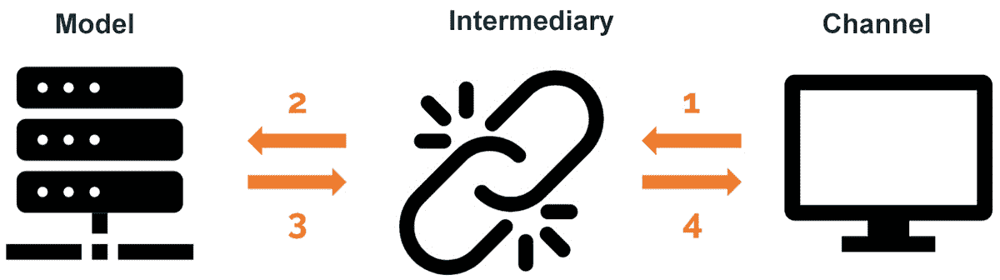

# 第六章：6\. 构建你自己的程序

概述

在本章中，我们将介绍使用机器学习解决问题所需的所有步骤。我们将查看构建全面程序的关键阶段。我们将保存一个模型，以便每次运行时获得相同的结果，并调用已保存的模型，用于对未见数据进行预测。在本章结束时，你将能够创建一个互动版本的程序，让任何人都能有效地使用它。

# 介绍

在前几章中，我们介绍了机器学习的主要概念，从两种主要学习方法（监督学习和无监督学习）的区分开始，然后深入探讨了数据科学领域中一些最流行的算法。

本章将讨论构建完整机器学习程序的重要性，而不仅仅是训练模型。这将包括将模型提升到一个新的层次，使其可以轻松访问和使用。

我们将通过学习如何保存训练好的模型来实现这一目标。这样，我们就能加载表现最好的模型，以便对未见数据进行预测。我们还将学习将已保存的模型通过平台公开，使用户能够轻松与之互动的重要性。

当团队合作时，尤其是在公司或研究项目中，这一点尤为重要，因为它使团队的所有成员都能够使用模型，而无需完全理解模型的内部机制。

# 程序定义

以下部分将涵盖构建一个全面的机器学习程序所需的关键阶段，使得我们能够轻松访问训练好的模型，从而对所有未来数据进行预测。这些阶段将应用于构建一个程序，帮助银行在其营销活动中确定金融产品的推广策略。

## 构建程序 – 关键阶段

在这一阶段，你应该能够对数据集进行预处理，使用训练数据构建不同的模型，并比较这些模型，从而选择最适合当前数据的模型。这些过程是在构建程序的前两个阶段中处理的，最终使模型得以创建。然而，一个程序还应该考虑保存最终模型的过程，并具备在无需编写代码的情况下快速进行预测的能力。

我们刚刚讨论的过程分为三个主要阶段，并将在以下章节中进行解释。这些阶段代表了任何机器学习项目的最基本要求。

### 准备工作

准备工作包括我们迄今为止开发的所有程序，目的是根据可用信息和预期结果来概述项目。以下是该阶段三个过程的简要描述（这些内容在前几章中已经详细讨论）：

1.  **数据探索**：一旦确定了研究目标，就会进行数据探索，以了解可用数据并获取有价值的见解。这些见解稍后将用于决策，例如数据的预处理、数据拆分和模型选择等。数据探索中最常见的信息包括数据集的大小（实例数和特征数）、无关特征，以及是否存在缺失值或明显的异常值。

1.  **数据预处理**：正如我们之前讨论的，数据预处理主要是指处理缺失值、异常值和噪声数据；将定性特征转换为数值形式；以及对这些数值进行归一化或标准化。此过程可以通过任何数据编辑器（如 Excel）手动完成，或者使用库编写代码实现。

1.  **数据拆分**：最后的过程——数据拆分，涉及将整个数据集拆分为两个或三个子集（根据不同的方法），这些子集将用于训练、验证和测试模型的整体性能。特征和类别标签的分离也在此阶段进行处理。

### 创建

这一阶段涉及所有创建与可用数据匹配的模型所需的步骤。通过选择不同的算法，进行训练和调优，比较每个算法的表现，最后选择能够最佳泛化到数据的算法（即能够实现更好的整体表现）。这一阶段的过程将简要讨论，具体如下：

1.  **算法选择**：无论你决定选择一个还是多个算法，基于可用数据选择算法并考虑每个算法的优缺点是至关重要的。这一点很重要，因为许多数据科学家在面对数据问题时会错误地选择神经网络，而实际上，简单的问题可以通过更简单的模型解决，这些模型运行更快，并且在较小的数据集上表现更好。

1.  `X`) 和标签类别（`Y`）以确定关系模式，从而帮助模型泛化到未见数据并在标签不可用时进行预测。

1.  **模型评估**：此过程通过衡量算法在所选度量标准下的表现来完成。正如我们之前提到的，选择最佳代表研究目的的度量标准非常重要，因为同一个模型在某一度量标准下可能表现很好，而在另一个度量标准下则表现差。

    在对验证集进行模型评估时，超参数将被微调以实现最佳性能。一旦超参数调优完成，便会在测试集上进行评估，以衡量模型在未见数据上的整体表现。

1.  **模型比较与选择**：当基于不同算法创建多个模型时，会进行模型比较，以选择表现最优的模型。此比较应使用相同的度量标准对所有模型进行评估。

### 交互

构建一个全面的机器学习程序的最后阶段包括使最终用户能够轻松与模型进行交互。这包括将模型保存到文件中、调用保存模型的文件，并开发一个用户可以通过该渠道与模型进行交互的方式：

1.  **存储最终模型**：在机器学习程序的开发过程中引入此过程，因为它对于确保模型在未来预测中保持不变并能够被使用至关重要。保存模型的过程非常重要，因为大多数算法在每次运行时都是随机初始化的，这使得每次运行的结果都会有所不同。保存模型的过程将在本章稍后进一步讲解。

1.  `predict` 方法在未见数据上的应用。此过程将在本章稍后解释。

1.  **交互渠道**：最后，开发一个交互性强且易于使用的方式，通过已保存的模型进行预测是至关重要的，特别是因为在许多情况下，模型是由技术团队为其他团队创建的。这意味着理想的程序应该允许非专业人员通过简单地输入数据来使用模型进行预测。本章稍后将进一步展开这一理念。

以下图示展示了前面的各个阶段：


图 6.1：构建机器学习程序的各个阶段

本章余下部分将重点讨论构建模型的最后阶段（交互），因为所有前面的步骤已在之前的章节中讨论。

## 理解数据集

为了学习如何实现*交互*部分中的过程，我们将构建一个能够预测一个人是否有兴趣投资定期存款的程序，这将帮助银行更好地定位其促销活动。定期存款是存入银行机构的一种款项，在特定时间内无法提取。

用于构建此程序的数据集可以在 UC Irvine 机器学习库中找到，名称为**银行营销数据集**。

注意

要下载此数据集，请访问以下链接：[`archive.ics.uci.edu/ml/datasets/Bank+Marketing`](http://archive.ics.uci.edu/ml/datasets/Bank+Marketing)。

数据集也可以在本书的 GitHub 仓库中找到：[`packt.live/2wnJyny`](https://packt.live/2wnJyny)。

引用：[Moro et al., 2014] S. Moro, P. Cortez 和 P. Rita*. 基于数据的方法预测银行电话营销的成功。* 决策支持系统，Elsevier，62：22-31，2014 年 6 月。

一旦你访问了 UC Irvine 机器学习库的链接，按照以下步骤下载数据集：

1.  首先，点击`Data Folder`链接。

1.  点击`bank`超链接以触发下载

1.  打开`.zip`文件夹并提取`bank-full.csv`文件。

    在本节中，我们将在 Jupyter Notebook 中快速浏览数据集。然而，在*活动 6.01*中，*执行银行营销数据集的准备与创建阶段*，你将被鼓励进行深入的数据探索和预处理，以获得更好的模型。

1.  导入所需的库：

    ```py
    import pandas as pd
    import numpy as np
    ```

1.  正如我们迄今所学，数据集可以通过 Pandas 加载到 Jupyter Notebook 中：

    ```py
    data = pd.read_csv("bank-full.csv")
    data.head()
    ```

    前面的代码将每个实例的所有特征读取到一个单列中，因为`read_csv`函数默认使用逗号作为列的分隔符，而数据集使用分号作为分隔符，可以通过显示结果 DataFrame 的前几行来验证这一点。

    ```py
    data = pd.read_csv("bank-full.csv", delimiter = ";")
    data.head()
    ```

    在这一步之后，数据应如下所示：

    

    图 6.3：将数据拆分为列后，.csv 文件的数据截图

    如前图所示，文件包含未知值，这些值应当作为缺失值处理。

1.  为了帮助处理缺失值，所有未知值将通过 Pandas 的`replace`函数以及 NumPy 替换为`NaN`，如下所示：

    ```py
    data = data.replace("unknown", np.NaN)
    data.head()
    ```

    通过打印`data`变量的前几行，前面代码段的输出如下：

    

    图 6.4：替换未知值后，.csv 文件的数据截图

    这将使我们在数据集预处理过程中更容易处理缺失值。

1.  最后，编辑后的数据集将保存在一个新的`.csv`文件中，以便在本章的活动中使用。你可以通过使用`to_csv`函数来实现，如下所示：

    ```py
    data.to_csv("bank-full-dataset.csv")
    ```

    注意

    要访问本节的源代码，请参阅[`packt.live/2AAX2ym`](https://packt.live/2AAX2ym)。

    你还可以在线运行此示例，访问[`packt.live/3ftYXnf`](https://packt.live/3ftYXnf)。你必须执行整个 Notebook 才能获得预期的结果。

文件应包含共计 45,211 个实例，每个实例有 16 个特征和一个类别标签，可以通过打印存储数据集的变量的形状来验证。类别标签是二元的，`yes`或`no`类型，表示客户是否订阅了银行的定期存款。

每个实例代表银行的一个客户，而特征捕捉了人口统计信息以及当前（和前期）促销活动中与客户接触的相关数据。

下表简要描述了所有 16 个特征。这将帮助你确定每个特征与研究的相关性，并提供一些预处理数据所需步骤的提示：


图 6.5：描述数据集特征的表格

注意

你可以在本书的 GitHub 仓库中找到前述描述以及更多内容，路径为`Chapter06`文件夹。前述示例的文件名为`bank-names.txt`，并可以在名为`bank.zip`的`.zip`文件夹中找到。

利用我们在探索数据集时获得的信息，可以继续进行数据预处理和模型训练，这将是下一活动的目标。

## 活动 6.01：执行银行营销数据集的准备和创建阶段

本活动的目标是执行*准备*和*创建*阶段的过程，构建一个全面的机器学习问题。

注意

对于本章中的练习和活动，你需要在系统中安装 Python 3.7、NumPy、Jupyter、Pandas 和 scikit-learn。

假设以下场景：你在你所在城市的主要银行工作，营销团队决定提前了解客户是否可能订阅定期存款，以便他们可以集中精力针对这些客户。

为此，提供了一个数据集，包含了团队当前和之前开展的营销活动的详细信息（即你已下载并探索过的银行营销数据集）。你需要对数据集进行预处理并比较两个模型，以便选择最优模型。

按照以下步骤进行操作：

注意

若要提醒自己如何预处理数据集，可以回顾*第一章*，*Scikit-Learn 简介*。另一方面，要回顾如何训练监督学习模型、评估性能和进行错误分析，请回顾*第三章*，*监督学习——关键步骤*，以及*第四章*，*监督学习算法：预测年收入*。

1.  打开一个 Jupyter Notebook 来实现此活动，并导入所有所需的元素。

1.  将数据集加载到笔记本中。确保加载的是之前编辑过的文件，名为`bank-full-dataset.csv`，它也可以在[`packt.live/2wnJyny`](https://packt.live/2wnJyny)找到。

1.  选择最适合衡量模型性能的指标，考虑到本研究的目的是检测可能订阅定期存款的客户。

1.  预处理数据集。

    请注意，其中一个定性特征是有序的，因此必须将其转换为遵循相应顺序的数字形式。使用以下代码片段来完成此操作：

    ```py
    data["education"] = data["education"].fillna["unknown"]
    encoder = ["unknown", "primary", "secondary", "tertiary"]
    for i, word in enumerate(encoder):
        data["education"] = data["education"].\
                            str.replace(word,str(i))
        data["education"] = data["education"].astype("int64")
    ```

1.  将特征与类别标签分开，并将数据集分为三个集合（训练集、验证集和测试集）。

1.  使用决策树算法对数据集进行训练。

1.  使用多层感知器算法对数据集进行训练。

    注意

    您还可以尝试使用本书中讨论的其他分类算法。尽管如此，这两个算法被选择出来，是为了让您能够比较训练时间的差异。

1.  使用您之前选择的评估指标来评估这两个模型。

1.  微调一些超参数，以解决在评估模型时通过错误分析发现的问题。

1.  比较您模型的最终版本，并选择您认为最适合数据的那个。

预期输出：


图 6.6：预期输出

注意

您可以在第 244 页找到此活动的解决方案。

# 保存和加载训练好的模型

尽管操作数据集并训练正确的模型对于开发机器学习项目至关重要，但工作并不止于此。了解如何保存训练好的模型是关键，因为这将允许您保存超参数，以及最终模型的权重和偏置值，以便模型在重新运行时保持不变。

此外，在模型保存到文件后，了解如何加载保存的模型以便对新数据进行预测也非常重要。通过保存和加载模型，我们可以在任何时候以多种方式重复使用该模型。

## 保存模型

保存模型的过程也称为**序列化**，随着神经网络的流行，序列化变得越来越重要。神经网络使用许多参数（权重和偏置），这些参数在每次训练时都会被随机初始化。此外，随着更大、更复杂数据集的引入，训练过程可能会持续几天、几周甚至几个月。

考虑到这一点，保存模型的过程有助于通过将结果标准化为保存版本的模型来优化机器学习解决方案的使用。它还节省了时间，因为它允许您将已保存的模型直接应用于新数据，而无需重新训练。

保存训练好的模型有两种主要方式，其中一种将在本节中解释。`pickle`模块是 Python 中序列化对象的标准方式，它通过实现一个强大的算法将模型序列化，然后将其保存为`.pkl`文件。

注意

另一个用于保存训练好模型的模块是`joblib`，它是 SciPy 生态系统的一部分。

然而，请注意，只有在模型计划在未来的项目中使用或进行未来预测时，才需要保存模型。当机器学习项目是为了理解当前数据时，不需要保存模型，因为分析将在模型训练后进行。

## 练习 6.01：保存已训练的模型

对于以下练习，我们将使用在*第五章*，*人工神经网络：预测年收入*中下载的生育率数据集。将在训练数据上训练一个神经网络，然后将其保存。按照以下步骤完成本练习：

注意

数据集也可以在本书的 GitHub 仓库中找到：[`packt.live/2zBW84e`](https://packt.live/2zBW84e)。

1.  打开一个 Jupyter Notebook 以实现这个练习，并导入所有必需的元素以加载数据集、训练多层感知器并保存已训练的模型：

    ```py
    import pandas as pd
    from sklearn.neural_network import MLPClassifier
    import pickle
    import os
    ```

    如前所述，`pickle`模块将用于保存已训练的模型。`os`模块用于定位 Jupyter Notebook 的当前工作目录，以便将模型保存在相同的路径下。

1.  加载生育率数据集，并将数据拆分为特征矩阵`X`和目标矩阵`Y`。使用`header = None`参数，因为数据集没有标题行：

    ```py
    data = pd.read_csv("fertility_Diagnosis.csv", header=None)
    X = data.iloc[:,:9]
    Y = data.iloc[:,9]
    ```

1.  在数据上训练一个多层感知器分类器。将迭代次数设置为`1200`，以避免出现警告消息，表示默认的迭代次数不足以实现收敛：

    ```py
    model = MLPClassifier(max_iter = 1200)
    model.fit(X,Y)
    ```

    注意

    提醒一下，调用`fit`方法后的输出由当前训练的模型组成，并包括它所需要的所有参数。

1.  序列化模型并将其保存在名为`model_exercise.pkl`的文件中。使用以下代码来实现：

    ```py
    path = os.getcwd() + "/model_exercise.pkl"
    file = open(path, "wb")
    pickle.dump(model, file)
    ```

    在前面的代码片段中，`path`变量包含将保存序列化模型的文件路径，其中第一个元素定位当前工作目录，第二个元素定义要保存的文件名。`file`变量用于创建一个将被保存到所需路径的文件，并且文件模式设置为`wb`，即表示`dump`方法在`pickle`模块上应用。它接受之前创建的模型，将其序列化，然后保存。

    注意

    要访问此特定部分的源代码，请参考[`packt.live/3e18vWw`](https://packt.live/3e18vWw)。

    你也可以在[`packt.live/2B7NJpC`](https://packt.live/2B7NJpC)上在线运行这个示例。你必须执行整个 Notebook 才能得到预期的结果。

你已成功保存了一个已训练的模型。在下一部分，我们将介绍如何加载已保存的模型。

## 加载模型

加载模型的过程也被称为`pickle`模块的使用，它也用于加载模型。

值得一提的是，模型不需要在与训练和保存模型相同的代码文件中加载；相反，它应该在任何其他文件中加载。这主要是因为 `pickle` 库的 `load` 方法将返回一个模型变量，该变量将用于应用 `predict` 方法。

在加载模型时，除了像之前一样导入 `pickle` 和 `os` 模块外，还需要导入用于训练模型的算法类。例如，要加载一个神经网络模型，必须从 scikit-learn 的 `neural_network` 模块中导入 `MLPClassifier` 类。

## 练习 6.02：加载已保存的模型

在这个练习中，使用不同的 Jupyter Notebook，我们将加载之前训练好的模型（*练习 6.01*，*保存已训练的模型*）并进行预测。按照以下步骤完成此练习：

1.  打开一个 Jupyter Notebook 来实现这个练习。

1.  导入 `pickle` 和 `os` 模块。同时，导入 `MLPClassifier` 类：

    ```py
    import pickle
    import os
    from sklearn.neural_network import MLPClassifier
    ```

    如前所述，`pickle` 模块将用于加载训练好的模型。`os` 模块用于定位当前 Jupyter Notebook 的工作目录，以便找到包含已保存模型的文件。

1.  使用`pickle`加载保存的模型，如下所示：

    ```py
    path = os.getcwd() + "/model_exercise.pkl"
    file = open(path, "rb")
    model = pickle.load(file)
    ```

    在这里，`path` 变量用于存储包含已保存模型的文件路径。接下来，`file` 变量用于以 `rb` 文件模式打开文件，`load` 方法应用于 `pickle` 模块，用于反序列化并将模型加载到 `model` 变量中。

1.  使用加载的模型对一个个体进行预测，特征值如下：`-0.33, 0.67, 1, 1, 0, 0, 0.8, -1, 0.5`。

    将应用 `predict` 方法后的输出存储在一个名为 `pred` 的变量中：

    ```py
    pred = model.predict([[-0.33,0.67,1,1,0,0,0.8,-1,0.5]])
    print(pred)
    ```

    通过打印 `pred` 变量，我们得到的预测值为 `O`，这意味着该个体的诊断发生了改变，如下所示：

    ```py
    ['O']
    ```

你已成功加载了一个已保存的模型。

注意

要访问该部分的源代码，请参考 [`packt.live/2MXyGS7`](https://packt.live/2MXyGS7)。

你也可以在线运行这个示例，网址为[`packt.live/3dYgVxL`](https://packt.live/3dYgVxL)。你必须执行整个 Notebook 才能得到预期的结果。

## 活动 6.02：保存和加载银行营销数据集的最终模型

假设以下场景：你需要保存使用银行营销数据集创建的模型，以便将来可以使用它，而无需重新训练模型，并且避免每次得到不同的结果。为此，你需要保存和加载你在*活动 6.01*，*执行银行营销数据集的准备和创建阶段*中创建的模型。

注意

以下活动将分为两个部分。

第一部分执行保存模型的过程，将使用与 *活动 6.01* 中的 Jupyter Notebook 相同的 Notebook 来完成，*执行银行营销数据集的准备和创建阶段*。第二部分包括加载保存的模型，将使用不同的 Jupyter Notebook 来完成。

按照以下步骤完成此活动：

1.  打开 *活动 6.01* 中的 Jupyter Notebook，*执行银行营销数据集的准备和创建阶段*。

1.  为了学习目的，取你选择的最佳模型，去掉 `random_state` 参数，然后运行几次。

    确保在每次运行模型时都计算精度指标，以便看到每次运行所达到的性能差异。随时可以停止，当你认为从之前的运行结果中已经得到了一个性能良好的模型时。

    注意

    本书中获得的结果使用了 `random_state` 值为 `2`。

1.  将你选择的最佳模型保存为名为 `final_model.pkl` 的文件。

    注意

    确保使用 `os` 模块将模型保存在与当前 Jupyter Notebook 相同的路径下。

1.  打开一个新的 Jupyter Notebook，导入所需的模块和类。

1.  加载模型。

1.  使用以下值为个体进行预测：`42`、`2`、`0`、`0`、`1`、`2`、`1`、`0`、`5`、`8`、`380`、`1`、`-1`、`0`。

    预期输出：

    ```py
    [0] 
    ```

    注意

    此活动的解决方案可以在第 253 页找到。

# 与训练好的模型进行交互

一旦模型创建并保存完成，就到了构建全面的机器学习程序的最后一步：允许与模型的轻松交互。这个步骤不仅让模型可以重复使用，还通过仅使用输入数据进行分类来提高机器学习解决方案的实现效率。

有多种方式与模型进行交互，选择哪种方式取决于用户的性质（即那些会定期使用模型的人）。机器学习项目可以通过不同的方式访问，其中一些方式需要使用 API、在线或离线程序（应用程序）或网站。

此外，一旦基于用户的偏好或专业知识定义了通道，就需要对最终用户与模型之间的连接进行编码，这可以是一个函数或一个类，用于反序列化模型并加载它，接着执行分类，最终返回一个结果，该结果会再次显示给用户。

下图展示了通道与模型之间的关系，其中左侧的图标代表模型，中间的是执行连接的函数或类（中介），右侧的图标是通道。正如我们之前所解释的，通道将输入数据传递给中介，然后中介将信息传入模型以执行分类。分类的输出被返回给中介，中介再通过通道将其传递以便展示：



图 6.7：用户与模型之间交互的示意图

## 练习 6.03：创建一个类和一个通道与训练好的模型交互

在本练习中，我们将在文本编辑器中创建一个类，该类接受输入数据并将其传递给在*练习 6.01*中训练好的模型，使用的是 `Fertility Diagnosis` 数据集。此外，我们还将在 Jupyter Notebook 中创建一个表单，用户可以在其中输入数据并获得预测。

在文本编辑器中创建类时，请按照以下步骤操作：

1.  打开你偏好的文本编辑器，例如 PyCharm。

1.  导入 `pickle` 和 `os`：

    ```py
    import pickle
    import os
    ```

1.  创建一个类对象并命名为 `NN_Model`：

    ```py
    Class NN_Model(object):
    ```

1.  在类内部，创建一个初始化方法，将保存的模型文件（`model_exercise.pkl`）加载到代码中：

    ```py
    def __init__(self):
        path = os.getcwd() + "/model_exercise.pkl"
        file = open(path, "rb")
        self.model = pickle.load(file)
    ```

    注意

    记得在类对象内部缩进方法。

    一般来说，类对象中的所有方法必须具有 `self` 参数。另一方面，在使用 `self` 语句定义模型变量时，可以在同一个类的任何其他方法中使用该变量。

1.  在名为 `NN_Model` 的类中，创建一个 `predict` 方法。该方法应接收特征值并将其作为参数传递给模型的 `predict` 方法，以便将其输入到模型中进行预测：

    ```py
    def predict(self, season, age, childish, trauma, \
                surgical, fevers, alcohol, smoking, sitting):
        X = [[season, age, childish, trauma, surgical, \
              fevers, alcohol, smoking, sitting]]
        return self.model.predict(X)
    ```

    注意

    记得在类对象内部缩进方法。

1.  将代码保存为 Python 文件（`.py`），并命名为 `exerciseClass.py`。这个文件的名称将在接下来的步骤中用于加载类到 Jupyter Notebook 中。

    现在，让我们编写程序的前端解决方案，包括创建一个表单，用户可以在其中输入数据并获得预测。

    注意

    为了学习目的，表单将在 Jupyter Notebook 中创建。然而，通常情况下，前端是以网站、应用程序或类似的形式存在。

1.  打开一个 Jupyter Notebook。

1.  为了导入在*步骤 6*中保存为 Python 文件的模型类，可以使用以下代码片段：

    ```py
    from exerciseClass import NN_Model
    ```

1.  初始化 `NN_Model` 类并将其存储在名为 `model` 的变量中：

    ```py
    model = NN_Model()
    ```

    通过调用保存在 Python 文件中的类，初始化方法会自动触发，从而将保存的模型加载到变量中。

1.  创建一组变量，供用户为每个特征输入值，然后将这些值传递给模型。使用以下值：

    ```py
    a = 1      # season in which the analysis was performed
    b = 0.56   # age at the time of the analysis
    c = 1      # childish disease
    d = 1      # accident or serious trauma
    e = 1      # surgical intervention
    f = 0      # high fevers in the last year
    g = 1      # frequency of alcohol consumption
    h = -1     # smoking habit
    i = 0.63   # number of hours spent sitting per day
    ```

1.  通过在 `model` 变量上使用 `predict` 方法进行预测。将特征值作为参数输入，注意你必须按照在文本编辑器中创建 `predict` 函数时使用的名称来命名它们：

    ```py
    pred = model.predict(season=a, age=b, childish=c, \
                         trauma=d, surgical=e, fevers=f, \
                         alcohol=g, smoking=h, sitting=i)
    print(pred)
    ```

1.  通过打印预测结果，我们得到以下输出：

    ```py
    ['N']
    ```

    这意味着该个体的诊断结果正常。

    注意

    要访问该特定部分的源代码，请参见[`packt.live/2MZPjg0`](https://packt.live/2MZPjg0)。

    你还可以在[`packt.live/3e4tQOC`](https://packt.live/3e4tQOC)上在线运行此示例。你必须执行整个 Notebook 才能获得期望的结果。

你已经成功创建了一个函数和一个与模型交互的渠道。

## 活动 6.03：允许与银行营销数据集模型交互

考虑以下场景：在看到你在上一个活动中展示的结果后，你的老板要求你建立一种非常简单的方式，以便他可以在接下来的一个月内用他收到的数据测试模型。如果所有测试都能顺利通过，他将要求你以更高效的方式启动程序。因此，你决定与老板分享一个 Jupyter Notebook，在其中他只需输入信息就能得到预测结果。

注意

接下来的活动将分为两部分进行开发。第一部分将涉及构建连接渠道和模型的类，这部分将使用文本编辑器进行开发。第二部分将是创建渠道，这将在 Jupyter Notebook 中完成。

按照以下步骤完成此活动：

1.  在文本编辑器中，创建一个包含两个主要方法的类对象。其中一个应该是初始化器，用于加载已保存的模型，另一个应该是 `predict` 方法，在此方法中，数据被输入到模型中以获取输出。

1.  在 Jupyter Notebook 中，导入并初始化你在上一步创建的类。接下来，创建一个变量，用于保存新观察的所有特征值。使用以下值：`42`、`2`、`0`、`0`、`1`、`2`、`1`、`0`、`5`、`8`、`380`、`1`、`-1`、`0`。

1.  通过应用 `predict` 方法进行预测。

预期输出：当你完成此活动时，你将获得 `0` 作为输出。

注意

此活动的解决方案可以在第 254 页找到。

# 总结

本章总结了成功训练基于训练数据的机器学习模型所需的所有概念和技术。在本章中，我们引入了构建一个全面机器学习程序的思想，该程序不仅考虑了数据集准备和理想模型创建的各个阶段，还包括了使模型在未来可用的阶段，这一过程通过三个主要步骤来完成：保存模型、加载模型，以及创建一个渠道，让用户能够轻松地与模型互动并获取结果。

为了保存和加载模型，引入了`pickle`模块。该模块能够将模型序列化以保存到文件中，同时也能反序列化模型，以便将来使用该模型。

此外，为了让用户能够访问模型，需要根据与模型交互的用户类型选择理想的渠道（例如，API、应用程序、网站或表单）。然后，需要编写一个中介程序，将该渠道与模型连接起来。这个中介通常以函数或类的形式存在。

本书的主要目标是介绍 scikit-learn 库，作为一种简单的方式来开发机器学习解决方案。在讨论了数据探索和预处理的必要性及涉及的不同技术后，本书将知识划分为机器学习的两个主要领域，即监督学习和无监督学习。我们讨论了最常见的算法。

最后，我们解释了通过进行错误分析来衡量模型性能的重要性，以便提高模型在未见数据上的整体表现，并最终选择最能代表数据的模型。这个最终的模型应当被保存，以便将来用于可视化或进行预测。
