# 附录

# 1\. Scikit-Learn 简介

## 活动 1.01：选择目标特征并创建目标矩阵

解决方案：

1.  使用 `seaborn` 库加载 `titanic` 数据集：

    ```py
    import seaborn as sns
    titanic = sns.load_dataset('titanic')
    titanic.head(10)
    ```

    前几行应该如下所示：

    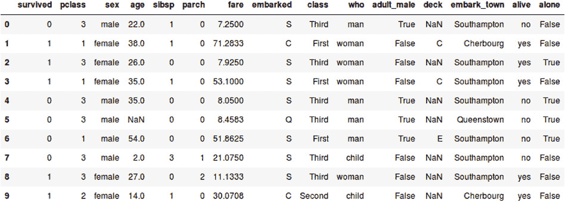

    图 1.22：显示泰坦尼克数据集前 10 个实例的图像

1.  选择你偏好的目标特征，作为本活动的目标。

    偏好的目标特征可以是 `survived` 或 `alive`。这主要是因为这两个特征都标记了一个人是否在事故中生还。在接下来的步骤中，选择的变量是 `survived`。然而，选择 `alive` 不会影响最终变量的形状。

1.  创建特征矩阵和目标矩阵。确保将特征矩阵的数据存储在变量 X 中，将目标矩阵的数据存储在另一个变量 Y 中：

    ```py
    X = titanic.drop('survived',axis = 1)
    Y = titanic['survived']
    ```

1.  打印出 `X` 的形状，如下所示：

    ```py
    X.shape
    ```

    输出如下：

    ```py
    (891, 14)
    ```

    对 `Y` 执行相同操作：

    ```py
    Y.shape
    ```

    输出如下：

    ```py
    (891,)
    ```

    注意

    若要访问此特定部分的源代码，请参考 [`packt.live/37BwgSv`](https://packt.live/37BwgSv)。

    你还可以在 [`packt.live/2MXFtuP`](https://packt.live/2MXFtuP) 上在线运行此示例。你必须执行整个 Notebook，才能获得期望的结果。

你已成功将数据集拆分为两个子集，稍后将使用这些子集来训练模型。

## 活动 1.02：预处理整个数据集

解决方案：

1.  导入 `seaborn` 和 scikit-learn 中的 `LabelEncoder` 类。接着，加载 `titanic` 数据集，并创建包含以下特征的特征矩阵：`sex`、`age`、`fare`、`class`、`embark_town` 和 `alone`：

    ```py
    import seaborn as sns
    from sklearn.preprocessing import LabelEncoder
    titanic = sns.load_dataset('titanic')
    X = titanic[['sex','age','fare','class',\
                 'embark_town','alone']].copy()
    X.shape
    ```

    特征矩阵是数据集的副本，以避免每次通过预处理过程更新矩阵时出现警告信息。

    输出如下：

    ```py
    (891, 6)
    ```

1.  检查所有特征中的缺失值。像之前一样，使用 `isnull()` 来判断值是否缺失，并使用 `sum()` 来计算每个特征中缺失值的总数：

    ```py
    print("Sex: " + str(X['sex'].isnull().sum()))
    print("Age: " + str(X['age'].isnull().sum()))
    print("Fare: " + str(X['fare'].isnull().sum()))
    print("Class: " + str(X['class'].isnull().sum()))
    print("Embark town: " + str(X['embark_town'].isnull().sum()))
    print("Alone: " + str(X['alone'].isnull().sum()))
    ```

    输出将如下所示：

    ```py
    Sex: 0
    Age: 177
    Fare: 0
    Class: 0
    Embark town: 2
    Alone: 0
    ```

    从前面的输出可以看出，只有一个特征包含大量缺失值：`age`。由于缺失值占总数的近 20%，应当替换这些缺失值。将应用均值插补方法，如下所示：

    ```py
    mean = X['age'].mean()
    mean =round(mean)
    X['age'].fillna(mean,inplace = True)
    ```

    接下来，发现数值特征中的异常值。我们使用三倍标准差作为计算数值特征最小值和最大值阈值的标准：

    ```py
    features = ["age", "fare"]
    for feature in features:
        min_ = X[feature].mean() - (3 * X[feature].std())
        max_ = X[feature].mean() + (3 * X[feature].std())
        X = X[X[feature] <= max_]
        X = X[X[feature] >= min_]
        print(feature,    ":", X.shape)
    ```

    输出如下：

    ```py
    age: (884, 6)
    fare: (864, 6)
    ```

    年龄和票价特征的异常值总数分别为 7 和 20，导致初始矩阵的形状减少了 27 个实例。

    接下来，使用 `for` 循环，查找文本特征中的异常值。`value_counts()` 函数用于计算每个特征中类别的出现次数：

    ```py
    features = ["sex", "class", "embark_town", "alone"]
    for feature in features:
        count_ = X[feature].value_counts()
        print(feature)
        print(count_, "\n")
    ```

    输出如下：

    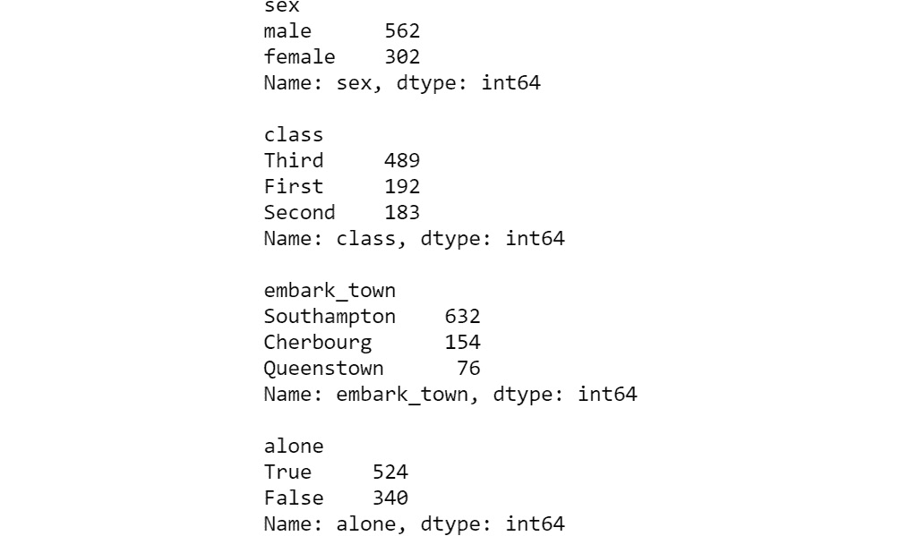

    ](img/B15781_01_23.jpg)

    图 1.23：每个特征中类别的出现次数

    任何特征的类别都不被认为是异常值，因为它们都代表了整个数据集的 5% 以上。

1.  将所有文本特征转换为其数值表示。使用 scikit-learn 的 `LabelEncoder` 类，如下代码所示：

    ```py
    enc = LabelEncoder()
    X["sex"] = enc.fit_transform(X['sex'].astype('str'))
    X["class"] = enc.fit_transform(X['class'].astype('str'))
    X["embark_town"] = enc.fit_transform(X['embark_town'].\
                                         astype('str'))
    X["alone"] = enc.fit_transform(X['alone'].astype('str'))
    ```

    打印出特征矩阵的前五个实例，查看转换结果：

    ```py
    X.head()
    ```

    输出如下：

    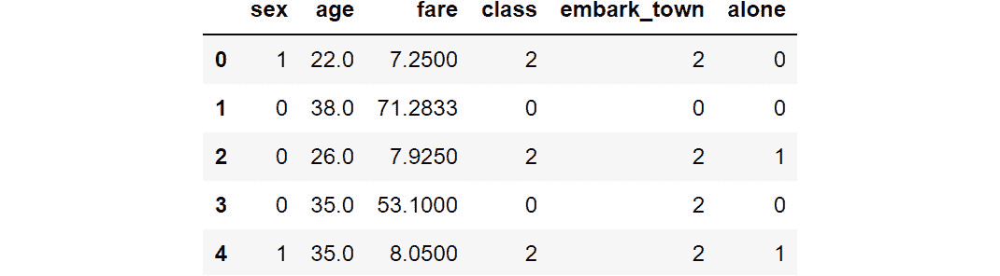

    ](img/B15781_01_24.jpg)

    图 1.24：显示特征矩阵前五个实例的截图

1.  重新调整您的数据，可以通过标准化或规范化它。

    如以下代码所示，所有特征都经过标准化处理，但只有那些不符合标准化变量标准的特征才会被更改：

    ```py
    X = (X - X.min()) / (X.max() - X.min())
    X.head(10)
    ```

    最终输出的前 10 行如以下截图所示：

    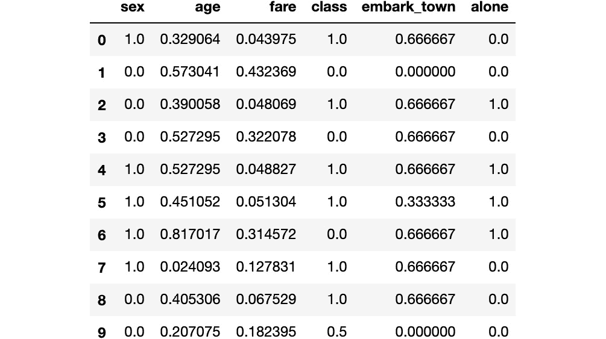

    ](img/B15781_01_25.jpg)

图 1.25：显示标准化数据集的前 10 个实例

注意

要访问此特定部分的源代码，请参阅 [`packt.live/2MY1wld`](https://packt.live/2MY1wld)。

您也可以在 [`packt.live/3e2lyqt`](https://packt.live/3e2lyqt) 在线运行此示例。必须执行整个 Notebook 才能得到预期的结果。

您已成功完成数据预处理，现在可以使用该数据集来训练机器学习算法。

# 2. 无监督学习——实际应用

## 活动 2.01：使用数据可视化辅助预处理过程

解决方案：

1.  导入加载数据集和预处理所需的所有元素：

    ```py
    import pandas as pd
    import matplotlib.pyplot as plt
    import numpy as np
    ```

1.  使用 pandas 的 `read_csv()` 函数加载之前下载的数据集。将数据集存储在名为 `data` 的 pandas DataFrame 中：

    ```py
    data = pd.read_csv("wholesale_customers_data.csv")
    ```

1.  检查 DataFrame 中的缺失值。使用 `isnull()` 函数加上 `sum()` 函数，一次性计算整个数据集的缺失值：

    ```py
    data.isnull().sum()
    ```

    输出如下：

    ```py
    Channel             0
    Region              0
    Fresh               0
    Milk                0
    Grocery             0
    Frozen              0
    Detergents_Paper    0
    Delicassen          0
    dtype: int64
    ```

    如您从前面的截图中看到的那样，数据集中没有缺失值。

1.  检查 DataFrame 中的异常值。标记为异常值的所有值是距离均值三个标准差以外的值。

    以下代码片段允许您一次性查找所有特征集中的异常值。然而，另一种有效的方法是一次只检查一个特征中的异常值：

    ```py
    outliers = {}
    for i in range(data.shape[1]):
        min_t = data[data.columns[i]].mean() \
                - (3 * data[data.columns[i]].std())
        max_t = data[data.columns[i]].mean() \
                + (3 * data[data.columns[i]].std())
        count = 0
        for j in data[data.columns[i]]:
            if j < min_t or j > max_t:
                count += 1
        outliers[data.columns[i]] = [count,data.shape[0]-count]
    print(outliers)
    ```

    每个特征的异常值计数如下：

    ```py
    {'Channel': [0, 440], 'Region': [0, 440], 'Fresh': [7, 433], 'Milk': [9, 431], 'Grocery': [7, 433], 'Frozen': [6, 434], 'Detergents_Paper': [10, 430], 'Delicassen': [4, 436]}
    ```

    如您从前面的截图中看到的那样，某些特征确实存在异常值。考虑到每个特征只有少量异常值，有两种可能的处理方法。

    首先，你可以决定删除离群点。这个决定可以通过为带有离群点的特征显示直方图来支持：

    ```py
    plt.hist(data["Fresh"])
    plt.show()
    ```

    输出如下：

    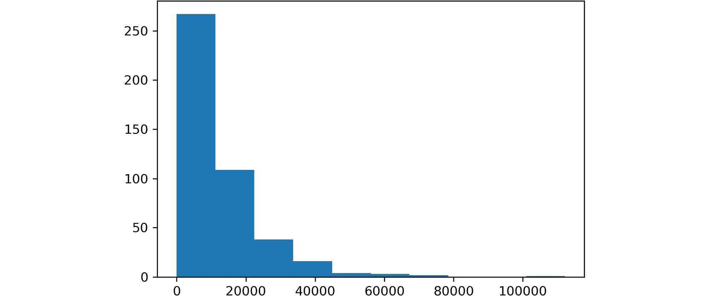

    ```py
    plt.figure(figsize=(8,8))
    plt.pie(outliers["Detergents_Paper"],autopct="%.2f")
    plt.show()
    ```

    输出如下：

    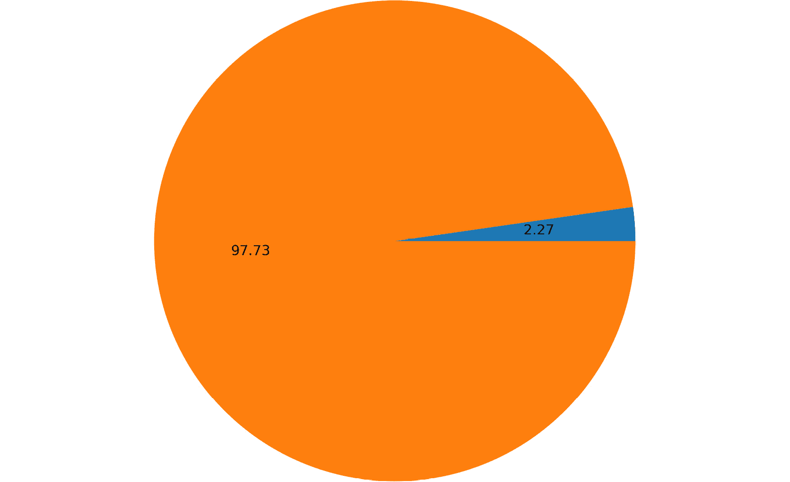

    图 2.15：饼图显示数据集中“Detergents_papers”特征中离群点的参与情况

    上图显示了来自 `Detergents_papers` 特征的离群点参与情况，这是数据集中离群点最多的特征。只有 2.27% 的值是离群点，这个比例如此之低，几乎不会影响模型的性能。

    对于本书中的解决方案，决定保留离群点，因为它们不太可能影响模型的性能。

1.  重缩放数据。

    对于此解决方案，使用了标准化公式。请注意，这个公式可以应用于整个数据集，而不是单独应用于每个特征：

    ```py
    data_standardized = (data - data.mean())/data.std()
    data_standardized.head()
    ```

    输出如下：

    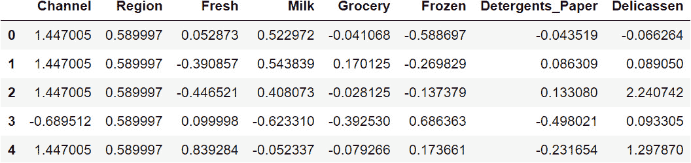

图 2.16：重缩放后的数据

注意

要访问此特定部分的源代码，请参阅 [`packt.live/2Y3ooGh`](https://packt.live/2Y3ooGh)。

你还可以通过在线运行此示例，访问[`packt.live/2B8vKPI`](https://packt.live/2B8vKPI)。你必须执行整个 Notebook 才能获得期望的结果。

你已经成功地预处理了批发客户数据集，这个数据集将在后续的活动中用于构建一个模型，将这些观测值分类到不同的聚类中。

## 活动 2.02：将 k-means 算法应用于数据集

解决方案：

1.  打开你在前一个活动中使用的 Jupyter Notebook。在那里，你应该已经导入了所有所需的库，并执行了预处理数据集的必要步骤。

    标准化后的数据应如下所示：

    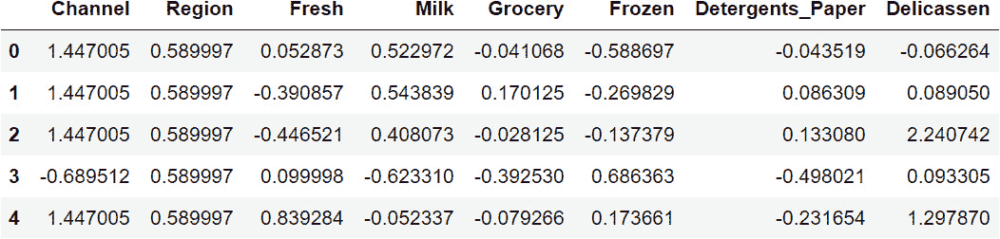

    图 2.17：显示标准化数据集前五个实例的截图

1.  计算数据点与其质心之间的平均距离，并根据聚类数量来选择合适的聚类数目来训练模型。

    首先，导入算法类：

    ```py
    from sklearn.cluster import KMeans
    ```

    接下来，使用以下代码片段，计算数据点与其质心之间的平均距离，基于创建的聚类数量：

    ```py
    ideal_k = []
    for i in range(1,21):
        est_kmeans = KMeans(n_clusters=i, random_state=0)
        est_kmeans.fit(data_standardized)
        ideal_k.append([i,est_kmeans.inertia_])
    ideal_k = np.array(ideal_k)
    ```

    最后，绘制关系图以找到线的断点并选择聚类数：

    ```py
    plt.plot(ideal_k[:,0],ideal_k[:,1])
    plt.show()
    ```

    输出如下：

    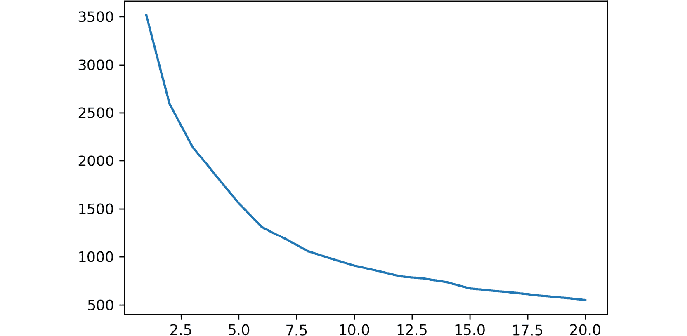

    图 2.18：绘图函数的输出结果

    再次，*x 轴*表示簇的数量，而*y 轴*则表示数据点与其质心之间的计算平均距离。

1.  训练模型并为数据集中的每个数据点分配一个簇。绘制结果。

    要训练模型，请使用以下代码：

    ```py
    est_kmeans = KMeans(n_clusters=6, random_state = 0)
    est_kmeans.fit(data_standardized)
    pred_kmeans = est_kmeans.predict(data_standardized)
    ```

    选择的簇的数量为`6`；然而，由于没有精确的分割点，值在 5 到 10 之间也是可以接受的。

    最后，绘制聚类过程的结果。由于数据集包含八个不同的特征，选择两个特征同时绘制，如以下代码所示：

    ```py
    plt.subplots(1, 2, sharex='col', \
                 sharey='row', figsize=(16,8))
    plt.scatter(data.iloc[:,5], data.iloc[:,3], \
                c=pred_kmeans, s=20)
    plt.xlim([0, 20000])
    plt.ylim([0, 20000])
    plt.xlabel('Frozen')
    plt.subplot(1, 2, 1)
    plt.scatter(data.iloc[:,4], data.iloc[:,3], \
                c=pred_kmeans, s=20)
    plt.xlim([0, 20000])
    plt.ylim([0,20000])
    plt.xlabel('Grocery')
    plt.ylabel('Milk')
    plt.show()
    ```

    输出结果如下：

    ![图 2.19：聚类过程后获得的两个示例图]

    ](img/B15781_02_19.jpg)

图 2.19：聚类过程后获得的两个示例图

注意

要访问本次活动的源代码，请参考[`packt.live/3fhgO0y`](https://packt.live/3fhgO0y)。

您也可以在[`packt.live/3eeEOB6`](https://packt.live/3eeEOB6)在线运行此示例。您必须执行整个 Notebook 才能获得期望的结果。

`matplotlib`中的`subplots()`函数已用于同时绘制两个散点图。每个图的轴代表一个选定特征与另一个特征值之间的关系。从图中可以看出，由于我们仅能使用数据集中八个特征中的两个，因此没有明显的视觉关系。然而，模型的最终输出创建了六个不同的簇，代表了六种不同的客户画像。

## 活动 2.03：将均值偏移算法应用于数据集

解决方案：

1.  打开您在之前活动中使用的 Jupyter Notebook。

1.  训练模型并为数据集中的每个数据点分配一个簇。绘制结果。

    首先，导入算法类：

    ```py
    from sklearn.cluster import MeanShift
    ```

    要训练模型，请使用以下代码：

    ```py
    est_meanshift = MeanShift(0.4)
    est_meanshift.fit(data_standardized)
    pred_meanshift = est_meanshift.predict(data_standardized)
    ```

    该模型是使用带宽`0.4`训练的。不过，您可以尝试其他值，看看结果如何变化。

    最后，绘制聚类过程的结果。由于数据集包含八个不同的特征，选择两个特征同时绘制，如以下代码片段所示。与之前的活动类似，由于只能绘制八个特征中的两个，聚类之间的分隔在视觉上并不可见：

    ```py
    plt.subplots(1, 2, sharex='col', \
                 sharey='row', figsize=(16,8))
    plt.scatter(data.iloc[:,5], data.iloc[:,3], \
                c=pred_meanshift, s=20)
    plt.xlim([0, 20000])
    plt.ylim([0,20000])
    plt.xlabel('Frozen')
    plt.subplot(1, 2, 1)
    plt.scatter(data.iloc[:,4], data.iloc[:,3], \
                c=pred_meanshift, s=20)
    plt.xlim([0, 20000])
    plt.ylim([0,20000])
    plt.xlabel('Grocery')
    plt.ylabel('Milk')
    plt.show()
    ```

    输出结果如下：

    ![图 2.20：处理结束时获得的示例图]

    ](img/B15781_02_20.jpg)

图 2.20：处理结束时获得的示例图

对于每个图，轴代表选定特征的值，相对于另一个特征的值。

注意

要访问本次活动的源代码，请参考[`packt.live/3fviVy1`](https://packt.live/3fviVy1)。

您也可以在[`packt.live/2Y1aqEF`](https://packt.live/2Y1aqEF)在线运行此示例。您必须执行整个 Notebook 才能获得期望的结果。

你已经成功地在 Wholesale Customers 数据集上应用了 mean-shift 算法。稍后，你将能够比较不同算法在相同数据集上的结果，以选择表现最好的算法。

## 活动 2.04：将 DBSCAN 算法应用于数据集

解决方案：

1.  打开你在之前活动中使用的 Jupyter Notebook。

1.  训练模型，并为数据集中的每个数据点分配一个聚类。绘制结果。

    首先，导入算法类：

    ```py
    from sklearn.cluster import DBSCAN
    ```

    要训练模型，使用以下代码：

    ```py
    est_dbscan = DBSCAN(eps=0.8)
    pred_dbscan = est_dbscan.fit_predict(data_standardized)
    ```

    该模型使用`0.8`的 epsilon 值进行训练。然而，可以自由测试其他值，看看结果如何变化。

    最后，绘制聚类过程的结果。由于数据集包含八个不同的特征，因此选择两个特征同时绘制，如下面的代码所示：

    ```py
    plt.subplots(1, 2, sharex='col', \
                 sharey='row', figsize=(16,8))
    plt.scatter(data.iloc[:,5], data.iloc[:,3], \
                c=pred_dbscan, s=20)
    plt.xlim([0, 20000])
    plt.ylim([0,20000])
    plt.xlabel('Frozen')
    plt.subplot(1, 2, 1)
    plt.scatter(data.iloc[:,4], data.iloc[:,3], \
                c=pred_dbscan, s=20)
    plt.xlim([0, 20000])
    plt.ylim([0,20000])
    plt.xlabel('Grocery')
    plt.ylabel('Milk')
    plt.show()
    ```

    输出结果如下：

    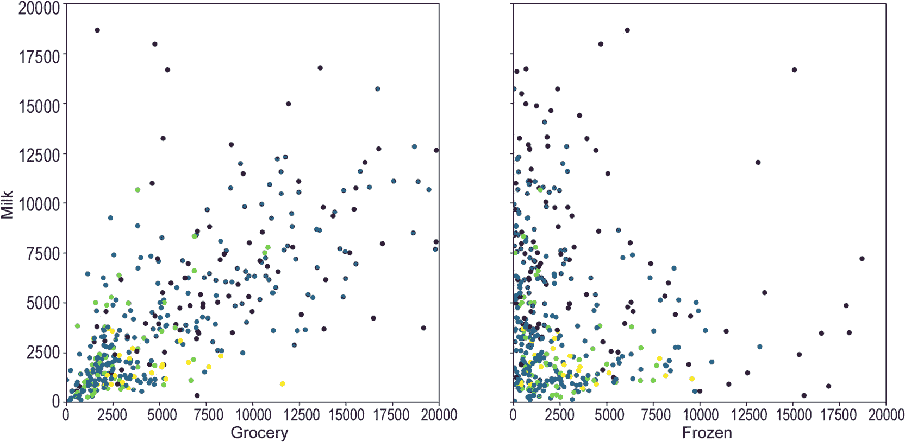

图 2.21：聚类过程结束时获得的示例图

注意

要访问本活动的源代码，请参考[`packt.live/2YCFvh8`](https://packt.live/2YCFvh8)。

你也可以在[`packt.live/2MZgnvC`](https://packt.live/2MZgnvC)上在线运行这个示例。你必须执行整个 Notebook 才能得到预期的结果。

与之前的活动类似，由于只能同时绘制八个特征中的两个，因此无法直观地看到聚类之间的分离。

## 活动 2.05：衡量和比较算法的性能

解决方案：

1.  打开你在之前活动中使用的 Jupyter Notebook。

1.  计算所有你之前训练的模型的轮廓系数分数和 Calinski–Harabasz 指数。

    首先，导入度量：

    ```py
    from sklearn.metrics import silhouette_score
    from sklearn.metrics import calinski_harabasz_score
    ```

    计算所有算法的轮廓系数分数，如下面的代码所示：

    ```py
    kmeans_score = silhouette_score(data_standardized, \
                                    pred_kmeans, \
                                    metric='euclidean')
    meanshift_score = silhouette_score(data_standardized, \
                                       pred_meanshift, \
                                       metric='euclidean')
    dbscan_score = silhouette_score(data_standardized, \
                                    pred_dbscan, \
                                    metric='euclidean')
    print(kmeans_score, meanshift_score, dbscan_score)
    ```

    对于 k-means、mean-shift 和 DBSCAN 算法，分数分别约为`0.3515`、`0.0933`和`0.1685`。

    最后，计算所有算法的 Calinski–Harabasz 指数。以下是这部分代码的片段：

    ```py
    kmeans_score = calinski_harabasz_score(data_standardized, \
                                           pred_kmeans)
    meanshift_score = calinski_harabasz_score(data_standardized, \
                                              pred_meanshift)
    dbscan_score = calinski_harabasz_score(data_standardized, \
                                           pred_dbscan)
    print(kmeans_score, meanshift_score, dbscan_score)
    ```

    对于前面代码片段中的三个算法，它们的分数分别大约是`145.73`、`112.90`和`42.45`。

    注意

    要访问本活动的源代码，请参考[`packt.live/2Y2xHWR`](https://packt.live/2Y2xHWR)。

    你也可以在[`packt.live/3hszegy`](https://packt.live/3hszegy)上在线运行这个示例。你必须执行整个 Notebook 才能得到预期的结果。

通过快速查看我们获得的两个度量的结果，可以得出结论：k-means 算法优于其他模型，因此应选择它来解决数据问题。

# 3. 监督学习——关键步骤

## 活动 3.01：手写数字数据集上的数据分割

解决方案：

1.  导入所有所需的元素以拆分数据集，以及从 scikit-learn 导入`load_digits`函数来加载`digits`数据集。使用以下代码进行操作：

    ```py
    from sklearn.datasets import load_digits
    import pandas as pd
    from sklearn.model_selection import train_test_split
    from sklearn.model_selection import KFold
    ```

1.  加载`digits`数据集并创建包含特征和目标矩阵的 Pandas 数据框：

    ```py
    digits = load_digits()
    X = pd.DataFrame(digits.data)
    Y = pd.DataFrame(digits.target)
    print(X.shape, Y.shape)
    ```

    特征矩阵和目标矩阵的形状应分别如下所示：

    ```py
    (1797, 64) (1797, 1)
    ```

1.  执行常规的拆分方法，使用 60/20/20%的拆分比例。

    使用`train_test_split`函数将数据拆分为初步训练集和测试集：

    ```py
    X_new, X_test, \
    Y_new, Y_test = train_test_split(X, Y, test_size=0.2)
    print(X_new.shape, Y_new.shape, X_test.shape, Y_test.shape)
    ```

    你创建的集合的形状应如下所示：

    ```py
    (1437, 64) (1437, 1) (360, 64) (360, 1)
    ```

    接下来，计算`test_size`的值，将开发集的大小设置为之前创建的测试集的大小：

    ```py
    dev_size = X_test.shape[0]/X_new.shape[0]
    print(dev_size)
    ```

    前面的操作结果是`0.2505`。

    最后，将`X_new`和`Y_new`拆分为最终的训练集和开发集。使用以下代码进行操作：

    ```py
    X_train, X_dev, \
    Y_train, Y_dev = train_test_split(X_new, Y_new, \
                                      test_size = dev_size)
    print(X_train.shape, Y_train.shape, X_dev.shape, \
          Y_dev.shape, X_test.shape, Y_test.shape)
    ```

    前面代码段的输出如下所示：

    ```py
    (1077, 64) (1077, 1) (360, 64) (360, 1) (360, 64) (360, 1)
    ```

1.  使用相同的数据框，执行 10 折交叉验证拆分。

    首先，将数据集划分为初步的训练集和测试集：

    ```py
    X_new_2, X_test_2, \
    Y_new_2, Y_test_2 = train_test_split(X, Y, test_size=0.1)
    ```

    使用`KFold`类执行 10 折拆分：

    ```py
    kf = KFold(n_splits = 10)
    splits = kf.split(X_new_2)
    ```

    记住，交叉验证会执行不同的拆分配置，每次都会洗牌数据。考虑到这一点，执行一个`for`循环，遍历所有的拆分配置：

    ```py
    for train_index, dev_index in splits:
        X_train_2, X_dev_2 = X_new_2.iloc[train_index,:], \
                             X_new_2.iloc[dev_index,:]
        Y_train_2, Y_dev_2 = Y_new_2.iloc[train_index,:], \
                             Y_new_2.iloc[dev_index,:]
    ```

    负责训练和评估模型的代码应放在`for`循环体内，以便使用每种拆分配置来训练和评估模型：

    ```py
    print(X_train_2.shape, Y_train_2.shape, X_dev_2.shape, \
          Y_dev_2.shape, X_test_2.shape, Y_test_2.shape)
    ```

    按照前面的代码段打印所有子集的形状，输出如下：

    ```py
    (1456, 64) (1456, 1) (161, 64) (161, 1) (180, 64) (180, 1)
    ```

    注意

    要访问此特定部分的源代码，请参阅[`packt.live/37xatv3`](https://packt.live/37xatv3)。

    你还可以在[`packt.live/2Y2nolS`](https://packt.live/2Y2nolS)在线运行此示例。必须执行整个 Notebook 以获得所需结果。

你已经成功地使用常规拆分方法和交叉验证方法拆分了数据集。这些数据集现在可以用来训练表现优异的模型，这些模型能够在未见过的数据上取得良好的表现。

## 活动 3.02：评估在手写数据集上训练的模型的性能

解决方案：

1.  导入所有所需的元素，以加载并拆分数据集，以便训练模型并评估分类任务的性能：

    ```py
    from sklearn.datasets import load_digits
    import pandas as pd
    from sklearn.model_selection import train_test_split
    from sklearn import tree
    from sklearn.metrics import confusion_matrix
    from sklearn.metrics import accuracy_score
    from sklearn.metrics import precision_score
    from sklearn.metrics import recall_score
    ```

1.  从 scikit-learn 加载`digits`玩具数据集，并创建包含特征和目标矩阵的 Pandas 数据框：

    ```py
    digits = load_digits()
    X = pd.DataFrame(digits.data)
    Y = pd.DataFrame(digits.target)
    ```

1.  将数据拆分为训练集和测试集。使用 20%的数据作为测试集：

    ```py
    X_train, X_test, \
    Y_train, Y_test = train_test_split(X,Y, test_size = 0.2,\
                                       random_state = 0)
    ```

1.  在训练集上训练决策树。然后，使用该模型预测测试集上的类别标签（提示：要训练决策树，请回顾*练习 3.04*，*计算分类任务的不同评估指标*）：

    ```py
    model = tree.DecisionTreeClassifier(random_state = 0)
    model = model.fit(X_train, Y_train)
    Y_pred = model.predict(X_test)
    ```

1.  使用 scikit-learn 构建混淆矩阵：

    ```py
    confusion_matrix(Y_test, Y_pred)
    ```

    混淆矩阵的输出如下所示：

    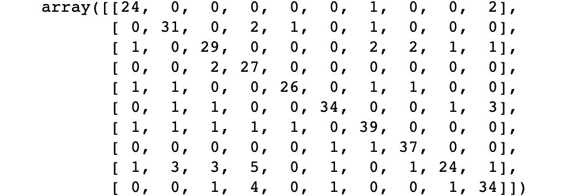

    图 3.14：混淆矩阵的输出

1.  计算模型的准确率：

    ```py
    accuracy = accuracy_score(Y_test, Y_pred)
    print("accuracy:", accuracy)
    ```

    准确率为 `84.72`%。

1.  计算精确度和召回率。考虑到精确度和召回率只能在二元数据上计算，我们假设我们只对将实例分类为数字 6 或其他任何数字感兴趣：

    ```py
    Y_test_2 = Y_test[:]
    Y_test_2[Y_test_2 != 6] = 1
    Y_test_2[Y_test_2 == 6] = 0
    Y_pred_2 = Y_pred
    Y_pred_2[Y_pred_2 != 6] = 1
    Y_pred_2[Y_pred_2 == 6] = 0
    precision = precision_score(Y_test_2, Y_pred_2)
    print("precision:", precision)
    recall = recall_score(Y_test_2, Y_pred_2)
    print("recall:", recall)
    ```

    上述代码片段的输出如下：

    ```py
    precision: 0.9841269841269841
    recall: 0.9810126582278481
    ```

    根据此，精确度和召回率分数应分别等于`98.41`%和`98.10`%。

    注意

    要访问此特定部分的源代码，请参考[`packt.live/2UJMFPC`](https://packt.live/2UJMFPC)。

    您还可以在线运行此示例，网址为[`packt.live/2zwqkgX`](https://packt.live/2zwqkgX)。必须执行整个笔记本才能获得预期结果。

您已成功衡量了分类任务的性能。

## 活动 3.03：对训练识别手写数字的模型进行错误分析

解决方案：

1.  导入所需的元素以加载和拆分数据集。我们将这样做以训练模型并衡量其准确性：

    ```py
    from sklearn.datasets import load_digits
    import pandas as pd
    from sklearn.model_selection import train_test_split
    import numpy as np
    from sklearn import tree
    from sklearn.metrics import accuracy_score
    ```

1.  从 scikit-learn 加载 `digits` 玩具数据集，并创建包含特征和目标矩阵的 Pandas DataFrame：

    ```py
    digits = load_digits()
    X = pd.DataFrame(digits.data)
    Y = pd.DataFrame(digits.target)
    ```

1.  将数据拆分为训练集、验证集和测试集。使用 `0.1` 作为测试集的大小，并使用等量数据构建具有相同形状的验证集：

    ```py
    X_new, X_test, \
    Y_new, Y_test = train_test_split(X, Y, test_size = 0.1,\
                                     random_state = 101)
    test_size = X_test.shape[0] / X_new.shape[0]
    X_train, X_dev, \
    Y_train, Y_dev = train_test_split(X_new, Y_new, \
                                      test_size= test_size, \
                                      random_state = 101)
    print(X_train.shape, Y_train.shape, X_dev.shape, \
          Y_dev.shape, X_test.shape, Y_test.shape)
    ```

    结果形状如下：

    ```py
    (1437, 64) (1437, 1) (180, 64) (180, 1) (180, 64) (180, 1)
    ```

1.  为特征和目标值创建训练/开发集，其中包含`90`个训练集实例/标签和`90`个开发集实例/标签：

    ```py
    np.random.seed(101)
    indices_train = np.random.randint(0, len(X_train), 90)
    indices_dev = np.random.randint(0, len(X_dev), 90)
    X_train_dev = pd.concat([X_train.iloc[indices_train,:], \
                             X_dev.iloc[indices_dev,:]])
    Y_train_dev = pd.concat([Y_train.iloc[indices_train,:], \
                             Y_dev.iloc[indices_dev,:]])
    print(X_train_dev.shape, Y_train_dev.shape)
    ```

    结果形状如下：

    ```py
    (180, 64) (180, 1)
    ```

1.  在训练集数据上训练决策树：

    ```py
    model = tree.DecisionTreeClassifier(random_state = 101)
    model = model.fit(X_train, Y_train)
    ```

1.  计算所有数据集的错误率，并确定哪种情况影响模型的表现：

    ```py
    sets = ["Training", "Train/dev", "Validation", "Testing"]
    X_sets = [X_train, X_train_dev, X_dev, X_test]
    Y_sets = [Y_train, Y_train_dev, Y_dev, Y_test]
    scores = {}
    for i in range(0, len(X_sets)):
        pred = model.predict(X_sets[i])
        score = accuracy_score(Y_sets[i], pred)
        scores[sets[i]] = score
    print(scores)
    ```

    输出如下：

    ```py
    {'Training': 1.0, 'Train/dev': 0.9444444444444444, 'Validation': 0.8833333333333333, 'Testing': 0.8833333333333333}
    ```

    错误率可以在下表中看到：

    

图 3.15：手写数字模型的错误率

从之前的结果可以得出结论，模型同样受到方差和数据不匹配的影响。

注意

要访问此特定部分的源代码，请参考[`packt.live/3d0c4uM`](https://packt.live/3d0c4uM)。

您还可以在线运行此示例，网址为[`packt.live/3eeFlTC`](https://packt.live/3eeFlTC)。必须执行整个笔记本才能获得预期结果。

您现在已经成功地执行了错误分析，以确定改进模型性能的行动方案。

# 4. 有监督学习算法：预测年收入

## 活动 4.01：为我们的普查收入数据集训练朴素贝叶斯模型

解决方案：

1.  在 Jupyter Notebook 中，导入所有所需的元素以加载和拆分数据集，并训练朴素贝叶斯算法：

    ```py
    import pandas as pd
    from sklearn.model_selection import train_test_split
    from sklearn.naive_bayes import GaussianNB
    ```

1.  加载预处理后的普查收入数据集。接下来，通过创建两个变量 `X` 和 `Y`，将特征与目标分开：

    ```py
    data = pd.read_csv("census_income_dataset_preprocessed.csv")
    X = data.drop("target", axis=1)
    Y = data["target"]
    ```

    请注意，分离`X`和`Y`的方法有多种。使用你最熟悉的方法。不过，请考虑到，`X`应该包含所有实例的特征，而`Y`应该包含所有实例的类标签。

1.  将数据集分为训练集、验证集和测试集，使用 10%的分割比例：

    ```py
    X_new, X_test, \
    Y_new, Y_test = train_test_split(X, Y, test_size=0.1, \
                                     random_state=101)
    test_size = X_test.shape[0] / X_new.shape[0]
    X_train, X_dev, \
    Y_train, Y_dev = train_test_split(X_new, Y_new, \
                                      test_size=test_size, \
                                      random_state=101)
    print(X_train.shape, Y_train.shape, X_dev.shape, \
          Y_dev.shape, X_test.shape, Y_test.shape)
    ```

    最终的形状如下：

    ```py
    (26047, 9) (26047,) (3257, 9) (3257,) (3257, 9) (3257,)
    ```

1.  使用`fit`方法在训练集（`X_train`和`Y_train`）上训练一个朴素贝叶斯模型：

    ```py
    model_NB = GaussianNB()
    model_NB.fit(X_train,Y_train)
    ```

1.  最后，使用之前训练的模型对一个新实例进行预测，该实例的每个特征值如下：`39`、`6`、`13`、`4`、`0`、`2174`、`0`、`40`、`38`：

    ```py
    pred_1 = model_NB.predict([[39,6,13,4,0,2174,0,40,38]])
    print(pred_1)
    ```

    预测的输出结果如下：

    ```py
    [0]
    ```

    注意

    要访问该特定部分的源代码，请参考[`packt.live/3ht1TCs`](https://packt.live/3ht1TCs)。

    你也可以在网上运行这个示例，网址是[`packt.live/2zwqxkf`](https://packt.live/2zwqxkf)。你必须执行整个 Notebook 才能得到预期的结果。

这意味着该个人的收入低于或等于 50K，因为 0 是收入低于或等于 50K 的标签。

## 活动 4.02：为我们的普查收入数据集训练一个决策树模型

解决方案：

1.  打开你在前一个活动中使用的 Jupyter Notebook，并从 scikit-learn 导入决策树算法：

    ```py
    from sklearn.tree import DecisionTreeClassifier
    ```

1.  使用 scikit-learn 的`DecisionTreeClassifier`类，通过`fit`方法训练模型。使用前一个活动中的训练集数据（`X_train`和`Y_train`）进行训练：

    ```py
    model_tree = DecisionTreeClassifier(random_state=101)
    model_tree.fit(X_train,Y_train)
    ```

1.  最后，使用之前训练的模型对一个新实例进行预测，该实例的每个特征值如下：`39`、`6`、`13`、`4`、`0`、`2174`、`0`、`40`、`38`：

    ```py
    pred_2 = model_tree.predict([[39,6,13,4,0,2174,0,40,38]])
    print(pred_2)
    ```

    前面代码片段的输出如下：

    ```py
    [0]
    ```

    注意

    要访问该特定部分的源代码，请参考[`packt.live/2zxQIqV`](https://packt.live/2zxQIqV)。

    你也可以在网上运行这个示例，网址是[`packt.live/2AC7iWX`](https://packt.live/2AC7iWX)。你必须执行整个 Notebook 才能得到预期的结果。

这意味着该对象的收入低于或等于 50K。

## 活动 4.03：为我们的普查收入数据集训练一个 SVM 模型

解决方案：

1.  打开你在前一个活动中使用的 Jupyter Notebook，并从 scikit-learn 导入 SVM 算法：

    ```py
    from sklearn.svm import SVC
    ```

1.  使用 scikit-learn 的`SVC`类，通过`fit`方法训练模型。使用前一个活动中的训练集数据（`X_train`和`Y_train`）进行训练：

    ```py
    model_svm = SVC()
    model_svm.fit(X_train, Y_train)
    ```

1.  最后，使用之前训练的模型对一个新实例进行预测，该实例的每个特征值如下：`39`、`6`、`13`、`4`、`0`、`2174`、`0`、`40`、`38`：

    ```py
    pred_3 = model_svm.predict([[39,6,13,4,0,2174,0,40,38]])
    print(pred_3)
    ```

    输出结果如下：

    ```py
    [0]
    ```

    该个人的预测值为零，这意味着该个人的收入低于或等于`50K`。

    注意

    要查看本特定部分的源代码，请参阅 [`packt.live/2Nb6J9z`](https://packt.live/2Nb6J9z)。

    您还可以在 [`packt.live/3hbpCGm`](https://packt.live/3hbpCGm) 上在线运行此示例。必须执行整个 Notebook 才能获得所需的结果。

# 5\. 人工神经网络：预测年收入

## 活动 5.01：为我们的人口普查收入数据集训练 MLP

解决方案：

1.  导入加载和分割数据集所需的所有元素，以训练 MLP 并测量准确率：

    ```py
    import pandas as pd
    from sklearn.model_selection import train_test_split
    from sklearn.neural_network import MLPClassifier
    from sklearn.metrics import accuracy_score
    ```

1.  使用预处理后的人口普查收入数据集，将特征与目标分开，创建变量 `X` 和 `Y`：

    ```py
    data = pd.read_csv("census_income_dataset_preprocessed.csv")
    X = data.drop("target", axis=1)
    Y = data["target"]
    ```

    如前所述，有几种方法可以实现 `X` 和 `Y` 的分离，主要考虑的是 `X` 应包含所有实例的特征，而 `Y` 应包含所有实例的类标签。

1.  使用分割比例为 10%将数据集划分为训练、验证和测试集：

    ```py
    X_new, X_test, \
    Y_new, Y_test = train_test_split(X, Y, test_size=0.1, \
                                     random_state=101)
    test_size = X_test.shape[0] / X_new.shape[0]
    X_train, X_dev, \
    Y_train, Y_dev = train_test_split(X_new, Y_new, \
                                      test_size=test_size, \
                                      random_state=101)
    print(X_train.shape, X_dev.shape, X_test.shape, \
          Y_train.shape, Y_dev.shape, Y_test.shape)
    ```

    创建的集合形状应如下：

    ```py
    (26047, 9) (3257, 9) (3257, 9) (26047,) (3257,) (3257,)
    ```

1.  从 scikit-learn 实例化 `MLPClassifier` 类，并使用训练数据训练模型。将超参数保留为默认值。同样，使用 `random_state` 等于 `101`：

    ```py
    model = MLPClassifier(random_state=101)
    model = model.fit(X_train, Y_train)
    ```

1.  计算所有三个集合（训练、验证和测试）的模型准确率：

    ```py
    sets = ["Training", "Validation", "Testing"]
    X_sets = [X_train, X_dev, X_test]
    Y_sets = [Y_train, Y_dev, Y_test]
    accuracy = {}
    for i in range(0,len(X_sets)):
        pred = model.predict(X_sets[i])
        score = accuracy_score(Y_sets[i], pred)
        accuracy[sets[i]] = score
    print(accuracy)
    ```

    三个集合的准确率分数应如下：

    ```py
    {'Training': 0.8465909090909091, 'Validation': 0.8246314496314496, 'Testing': 0.8415719987718759}
    ```

    注意

    要查看本特定部分的源代码，请参阅 [`packt.live/3hneWFr`](https://packt.live/3hneWFr)。

    此部分目前没有在线互动示例，需要在本地运行。

您已成功训练了一个 MLP 模型来解决现实生活中的数据问题。

## 活动 5.02：比较不同模型以选择最适合人口普查收入数据问题的模型

解决方案：

1.  打开您用来训练模型的 Jupyter Notebook。

1.  仅基于它们的准确率分数比较四个模型。

    通过使用上一章节模型的准确率分数以及本章节训练的模型的准确率，可以进行最终比较，以选择最佳解决数据问题的模型。为此，以下表格显示了所有四个模型的准确率分数：

    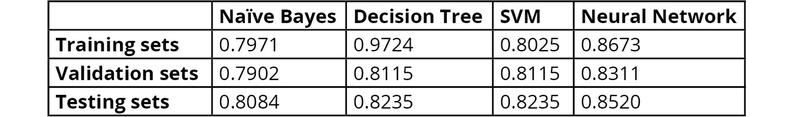

    图 5.15：人口普查收入数据集所有四个模型的准确率分数

1.  根据准确率分数确定最佳解决数据问题的模型。

    要确定最佳解决数据问题的模型，首先比较训练集上的准确率。从中可以得出结论，决策树模型比数据问题更适合。尽管如此，在验证和测试集上的性能低于使用 MLP 实现的性能，这表明决策树模型存在高方差的迹象。

    因此，一个好的方法是通过简化决策树模型来解决其高方差问题。这可以通过添加一个剪枝参数来实现，该参数会“修剪”树的叶子，简化模型并忽略树的一些细节，从而使模型能够更好地泛化到数据。理想情况下，模型应该能够在所有三个数据集上达到相似的准确率，这将使它成为数据问题的最佳模型。

    然而，如果模型无法克服高方差，并且假设所有模型都已经经过精调以实现最大性能，那么应选择 MLP 模型，因为它在测试集上的表现最好。主要原因是模型在测试集上的表现定义了其在未见数据上的总体表现，这意味着测试集表现更好的模型在长期使用中将更加有用。

# 6\. 构建你自己的程序

## 活动 6.01：为银行营销数据集执行准备和创建阶段

解决方案：

注意

为确保[`packt.live/2RpIhn9`](https://packt.live/2RpIhn9)中结果的可重复性，请确保在划分数据集时使用`random_state`为`0`，在训练模型时使用`random_state`为`2`。

1.  打开 Jupyter Notebook 并导入所有必需的元素：

    ```py
    import pandas as pd
    from sklearn.preprocessing import LabelEncoder
    from sklearn.model_selection import train_test_split
    from sklearn.tree import DecisionTreeClassifier
    from sklearn.neural_network import MLPClassifier
    from sklearn.metrics import precision_score
    ```

1.  将数据集加载到笔记本中。确保加载先前编辑过的数据集，文件名为`bank-full-dataset.csv`，该数据集也可以在[`packt.live/2wnJyny`](https://packt.live/2wnJyny)找到：

    ```py
    data = pd.read_csv("bank-full-dataset.csv")
    data.head(10)
    ```

    输出结果如下：

    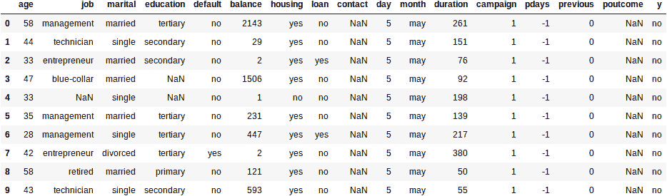

    图 6.8：显示数据集前 10 个实例的截图

    缺失值显示为`NaN`，如前所述。

1.  选择最适合衡量模型性能的指标，考虑到本研究的目的是检测哪些客户会订阅定期存款。

    评估模型性能的指标是**精确度**指标，因为它比较正确分类的正标签与被预测为正的所有实例的总数。

1.  预处理数据集。

    处理缺失值的过程按照我们在*第一章*，《Scikit-Learn 介绍》中学到的概念进行，并已在本书中应用。使用以下代码检查缺失值：

    ```py
    data.isnull().sum()
    ```

    根据结果，你会观察到只有四个特征包含缺失值：`job`（288），`education`（1,857），`contact`（13,020），和`poutcome`（36,959）。

    前两个特征可以不处理，因为缺失值占整个数据的比例低于 5%。另一方面，`contact`特征的缺失值占 28.8%，并且考虑到该特征表示的是联系方式，这与判断一个人是否会订阅新产品无关，因此可以安全地将该特征从研究中移除。最后，`poutcome`特征缺失了 81.7%的值，这也是该特征被从研究中移除的原因。

    使用以下代码，将前述两个特征删除：

    ```py
    data = data.drop(["contact", "poutcome"], axis=1)
    ```

    正如我们在*第一章*中解释的那样，*Scikit-Learn 简介*，并在全书中应用，将分类特征转换为数值形式的过程如下所示。

    对于所有的名义特征，使用以下代码：

    ```py
    enc = LabelEncoder()
    features_to_convert=["job","marital","default",\
                         "housing","loan","month","y"]
    for i in features_to_convert:
        data[i] = enc.fit_transform(data[i].astype('str'))
    ```

    如前所述，前面的代码将所有定性特征转换为它们的数值形式。

    接下来，为了处理有序特征，我们必须使用以下代码，如*步骤 4*中所述：

    ```py
    data['education'] = data['education'].fillna('unknown')
    encoder = ['unknown','primary','secondary','tertiary']
    for i, word in enumerate(encoder):
        data['education'] = data['education'].astype('str').\
                            str.replace(word, str(i))
    data['education'] = data['education'].astype('int64')
    data.head()
    ```

    这里，第一行将`NaN`值转换为`unknown`，而第二行设置了特征中值的顺序。接下来，使用`for`循环将每个单词替换为一个按顺序排列的数字。在上述示例中，`0`将替换`unknown`，然后`1`将替换`primary`，以此类推。最后，整个列被转换为整数类型，因为`replace`函数将数字写入为字符串。

    如果我们显示结果数据框的头部，输出如下所示：

    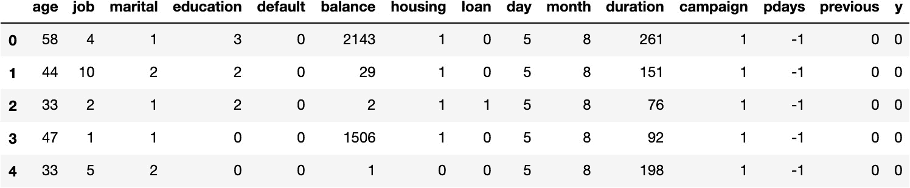

    ```py
    outliers = {}
    for i in range(data.shape[1]):
        min_t = data[data.columns[i]].mean() \
                - (3 * data[data.columns[i]].std())
        max_t = data[data.columns[i]].mean() \
                + (3 * data[data.columns[i]].std())
        count = 0
        for j in data[data.columns[i]]:
            if j < min_t or j > max_t:
                count += 1
        outliers[data.columns[i]] = [count, data.shape[0]]
    print(outliers)
    ```

    如果我们打印出结果字典，输出如下所示：

    ```py
    {'age': [381, 45211], 'job': [0, 45211], 'marital': [0, 45211], 'education': [0, 45211], 'default': [815, 45211], 'balance': [745, 45211], 'housing': [0, 45211], 'loan': [0, 45211], 'day': [0, 45211], 'month': [0, 45211], 'duration': [963, 45211], 'campaign': [840, 45211], 'pdays': [1723, 45211], 'previous': [582, 45211], 'y': [0, 45211]}
    ```

    正如我们所见，离群值在每个特征中的占比都不超过 5%，因此可以不处理这些离群值。

    通过取特征中最具离群值的特征（`pdays`），并将离群值的数量除以实例的总数（1,723 除以 45,211），可以验证这一点。这个操作的结果是 0.038，相当于 3.8%。这意味着该特征的离群值只占 3.8%。

1.  将特征与类别标签分开，并将数据集分成三部分（训练集、验证集和测试集）。

    要将特征与目标值分开，使用以下代码：

    ```py
    X = data.drop("y", axis = 1)
    Y = data["y"]
    ```

    接下来，为了进行 60/20/20 的拆分，使用以下代码：

    ```py
    X_new, X_test, \
    Y_new, Y_test = train_test_split(X, Y, test_size=0.2,\
                                     random_state = 0)
    test_size = X_test.shape[0] / X_new.shape[0]
    X_train, X_dev, \
    Y_train, Y_dev = train_test_split(X_new, Y_new, \
                                      test_size=test_size,\
                                      random_state = 0)
    print(X_train.shape, Y_train.shape, X_dev.shape, \
        Y_dev.shape, X_test.shape, Y_test.shape)
    ```

    如果我们打印出所有子集的形状，输出如下所示：

    ```py
    (27125, 14) (27125,) (9043, 14) (9043,) (9043, 14) (9043,)
    ```

1.  对数据集使用决策树算法并训练模型：

    ```py
    model_tree = DecisionTreeClassifier(random_state = 2)
    model_tree.fit(X_train, Y_train)
    ```

    注释

    提醒一下，调用`fit`方法时的输出是正在训练的模型及其所包含的所有参数。

1.  对数据集使用多层感知器算法并训练模型。要回顾这一点，请参阅*第五章*，*人工神经网络：预测年收入*：

    ```py
    model_NN = MLPClassifier(random_state = 2)
    model_NN.fit(X_train, Y_train)
    ```

1.  使用之前选择的指标评估两个模型。

    使用以下代码，可以测量决策树模型的精度分数：

    ```py
    X_sets = [X_train, X_dev, X_test]
    Y_sets = [Y_train, Y_dev, Y_test]
    precision = []
    for i in range(0, len(X_sets)):
        pred = model_tree.predict(X_sets[i])
        score = precision_score(Y_sets[i], pred)
        precision.append(score)
    print(precision)
    ```

    如果我们打印包含决策树模型每个数据集精度分数的列表，输出如下：

    ```py
    [1.0, 0.43909348441926344, 0.4208059981255858]
    ```

    相同的代码可以修改，用于计算多层感知器的分数：

    ```py
    X_sets = [X_train, X_dev, X_test]
    Y_sets = [Y_train, Y_dev, Y_test]
    precision = []
    for i in range(0, len(X_sets)):
        pred = model_NN.predict(X_sets[i])
        score = precision_score(Y_sets[i], pred)
        precision.append(score)
    print(precision)
    ```

    如果我们打印包含多层感知器模型每个数据集精度分数的列表，输出如下：

    ```py
    [0.35577647236029525, 0.35199283475145543, 0.3470483005366726]
    ```

    以下表格显示了两个模型在所有数据子集上的精度分数：

    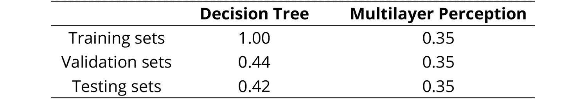

    图 6.10: 两个模型的精度分数

1.  通过执行错误分析，微调一些超参数，修正评估模型时检测到的问题。

    尽管决策树在训练集上的精度完美，但与其他两个数据集的结果进行比较后，可以得出模型存在高方差的结论。

    另一方面，多层感知器在所有三个数据集上的表现相似，但整体表现较低，这意味着该模型更可能存在高偏差。

    考虑到这一点，对于决策树模型，为了简化模型，修改了叶节点所需的最小样本数和树的最大深度。另一方面，对于多层感知器，修改了迭代次数、隐藏层数、每层的单元数以及优化的容忍度。

    以下代码显示了决策树算法超参数的最终值，考虑到为了得到这些值需要尝试不同的参数：

    ```py
    model_tree = DecisionTreeClassifier(random_state = 2, \
                                        min_samples_leaf=100, \
                                        max_depth=100)
    model_tree.fit(X_train, Y_train)
    ```

    以下代码片段显示了多层感知器算法的超参数最终值：

    ```py
    model_NN = \
        MLPClassifier(random_state = 2, max_iter=1000,\
                      hidden_layer_sizes = [100,100,50,25,25], \
                      tol=1e-4)
    model_NN.fit(X_train, Y_train)
    ```

    注意

    提醒一下，调用`fit`方法的输出包括正在训练的模型，以及它所接受的所有参数。

1.  比较你模型的最终版本，并选择你认为最适合数据的那个。

    使用与前几步相同的代码，可以计算决策树模型在不同数据集上的精度：

    ```py
    X_sets = [X_train, X_dev, X_test]
    Y_sets = [Y_train, Y_dev, Y_test]
    precision = []
    for i in range(0, len(X_sets)):
        pred = model_tree.predict(X_sets[i])
        score = precision_score(Y_sets[i], pred)
        precision.append(score)
    print(precision)
    ```

    输出列表应如下所示：

    ```py
    [0.6073670992046881, 0.5691158156911582, 0.5448113207547169]
    ```

    要计算多层感知器的精度，可以使用以下代码片段：

    ```py
    X_sets = [X_train, X_dev, X_test]
    Y_sets = [Y_train, Y_dev, Y_test]
    precision = []
    for i in range(0, len(X_sets)):
        pred = model_NN.predict(X_sets[i])
        score = precision_score(Y_sets[i], pred)
        precision.append(score)
    print(precision)
    ```

    结果列表应如下所示：

    ```py
    [0.759941089837997, 0.5920398009950248, 0.5509259259259259]
    ```

    通过计算新训练模型在三个数据集上的精度分数，我们获得以下值：

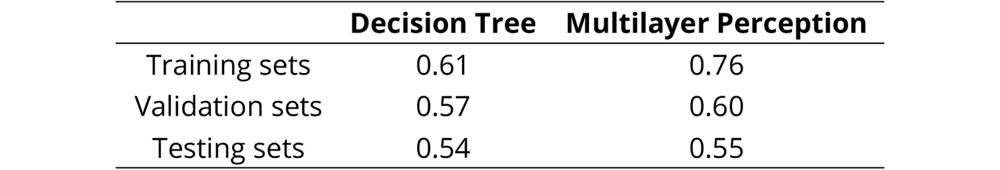

图 6.11: 新训练模型的精度分数

注意

要访问此特定部分的源代码，请参考[`packt.live/2RpIhn9`](https://packt.live/2RpIhn9)。

本节当前没有在线交互示例，需要在本地运行。

对两个模型的性能进行了提升，并通过比较其值，可以得出结论：多层感知机优于决策树模型。基于此，多层感知机被选择为解决数据问题的更好模型。

注意

我们鼓励你继续微调参数，以达到更高的精度评分。

## 活动 6.02：保存和加载银行营销数据集的最终模型

解决方案：

1.  打开*活动 6.01*中的 Jupyter Notebook，*执行银行营销数据集的准备和创建阶段*。

1.  为了学习目的，使用你选择的最佳模型，去除`random_state`参数，并运行几次。

1.  将你选择的最佳表现模型保存到一个名为`final_model.pkl`的文件中。

    ```py
    path = os.getcwd() + "/final_model.pkl"
    file = open(path, "wb")
    pickle.dump(model_NN, file)
    ```

1.  打开一个新的 Jupyter Notebook，并导入所需的模块和类：

    ```py
    from sklearn.neural_network import MLPClassifier
    import pickle
    import os
    ```

1.  加载保存的模型：

    ```py
    path = os.getcwd() + "/final_model.pkl"
    file = open(path, "rb")
    model = pickle.load(file)
    ```

1.  使用以下值为个体进行预测：`42`、`2`、`0`、`0`、`1`、`2`、`1`、`0`、`5`、`8`、`380`、`1`、`-1`、`0`：

    ```py
    pred = model.predict([[42,2,0,0,1,2,1,0,5,8,380,1,-1,0]])
    print(pred)
    ```

    注意

    要访问此特定部分的源代码，请参考[`packt.live/2UIWFss`](https://packt.live/2UIWFss)。

    本节当前没有在线交互示例，需要在本地运行。

如果我们打印`pred`变量，输出为`0`，这是`No`的数值形式。这意味着该个体更有可能不会订阅新产品。

## 活动 6.03：允许与银行营销数据集模型进行交互

解决方案：

1.  在文本编辑器中，创建一个包含两个主要函数的类对象。一个应是加载保存模型的初始化器，另一个应是`predict`方法，用于将数据传递给模型以获取输出：

    ```py
    import pickle
    import os
    ```

    根据前面的代码片段，第一步是导入所有所需的元素以定位并反序列化保存的模型：

    ```py
    Class NN_Model(object):
        def __init__(self):
            path = os.getcwd() + "/model_exercise.pkl"
            file = open(path, "rb")
            self.model = pickle.load(file)
        def predict(self, age, job, marital, education, \
                    default, balance, housing, loan, day, \
                    month, duration, campaign, pdays, previous):
            X = [[age, job, marital, education, default, \
                  balance, housing, loan, day, month, \
                  duration, campaign, pdays, previous]]
            return self.model.predict(X)
    ```

    接下来，根据前面的代码片段，编写将保存的模型与交互通道连接的类。该类应具有一个初始化方法，用于反序列化并加载保存的模型，以及一个`predict`方法，用于将输入数据传递给模型进行预测。

1.  在 Jupyter Notebook 中，导入并初始化在前一步创建的类。接下来，创建变量来存储新观测值的特征值，并使用以下值：`42`、`2`、`0`、`0`、`1`、`2`、`1`、`0`、`5`、`8`、`380`、`1`、`-1`、`0`：

    ```py
    from trainedModel import NN_Model
    model = NN_Model()
    age = 42
    job = 2
    marital = 0
    education = 0
    default = 1
    balance = 2
    housing = 1
    loan = 0
    day = 5
    month = 8
    duration = 380
    campaign = 1
    pdays = -1
    previous = 0
    ```

    通过应用`predict`方法进行预测：

    ```py
    pred = model.predict(age=age, job=job, marital=marital, \
                         education=education, default=default, \
                         balance=balance, housing=housing, \
                         loan=loan, day=day, month=month, \
                         duration=duration, campaign=campaign, \
                         pdays=pdays, previous=previous)
    print(pred)
    ```

    通过打印变量，预测值为`0`；也就是说，具有给定特征的个体不太可能订阅该产品，正如这里所看到的：

    ```py
    [0]
    ```

    注意

    要访问此特定部分的源代码，请参考[`packt.live/2Y2yBCJ`](https://packt.live/2Y2yBCJ)。

    你也可以在[`packt.live/3d6ku3E`](https://packt.live/3d6ku3E)在线运行这个示例。你必须执行整个 Notebook 才能得到预期的结果。

在本章的所有活动中，你已经成功地学会了如何开发一个完整的机器学习解决方案，从数据预处理和训练模型，到使用误差分析选择最佳性能的模型，并保存模型以便有效利用。
