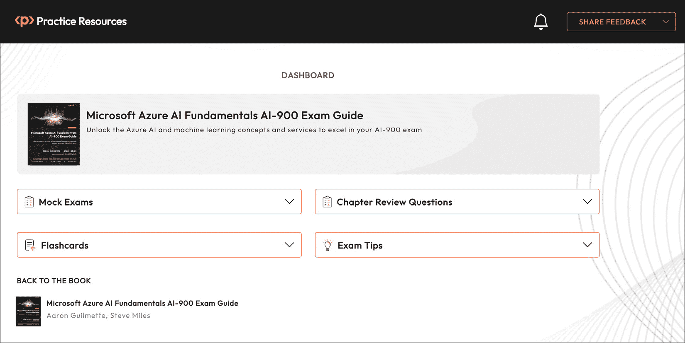
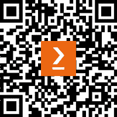

# 前言

AI-900 认证考试，也称为微软 Azure 人工智能基础知识考试，旨在验证人工智能概念的基础知识以及它们如何在微软 Azure 中实现。

AI-900 考试已经更新了几次，以包括新技术的出现和进入 Azure 空间——这次考试也不例外。AI-900 现在包括了对作为 Azure 订阅一部分的新 OpenAI 服务的关注。

# 本书面向的对象

本书旨在为对在 Azure 中的人工智能及其应用有基本了解但可能在该领域没有丰富技术经验的人士提供帮助。这包括对人工智能技术新接触的商业利益相关者、决策者和技术专业人士。

本书的内容假设您对任何机器学习或人工智能概念都没有了解（尽管这当然有助于理解一些更复杂的话题）。

# 本书涵盖的内容

*第一章*, *识别常见人工智能工作负载的特征*，介绍了 Azure 平台空间中人工智能的一些基本概念。

*第二章*, *识别负责任人工智能的指导原则*，解释了微软关于负责任人工智能的原则，如透明度和包容性。

*第三章*, *识别常见的机器学习技术*，探讨了机器学习技术，如聚类和回归。

*第四章*, *描述核心机器学习概念*，通过解释特征、标签、训练和验证等，扩展了机器学习技术的概念。

*第五章*, *描述 Azure 机器学习功能*，重点关注**自动化机器学习**（**AutoML**）的力量以及使 Azure 中的机器学习成为可能的必要功能资源。

*第六章*, *识别常见的计算机视觉解决方案类型*，介绍了计算机视觉背后的概念，如光学字符识别和目标检测。

*第七章*, *识别用于计算机视觉任务的 Azure 工具和服务*，通过 Azure AI 视觉和 Azure AI 面部等服务，扩展了计算机视觉的基础知识。

*第八章*, *识别常见自然语言处理工作负载场景的特征*，介绍了自然语言处理的核心基础工作负载用途，如情感分析、翻译和关键词提取。

*第九章*, *识别用于自然语言处理工作负载的 Azure 工具和服务*，提供了有关 Azure 自然语言处理解决方案的信息，例如 Azure AI 翻译器和 Azure AI 语言服务。

*第十章**，*识别生成式 AI 解决方案的特点*，解释了生成式 AI 模型的广泛特性和用例。

*第十一章**，*识别 Azure OpenAI 服务的功能*，突出了 Azure OpenAI 服务的强大功能，包括文本内容和图像生成。

*第十二章**，访问在线* *实践资源*。

# 要充分利用本书

为了使您的学习体验达到最佳，我们推荐以下组件：

+   免费试用订阅的 Azure 租户（[`azure.microsoft.com/en-us/free/ai-services/`](https://azure.microsoft.com/en-us/free/ai-services/)）

+   注册 OpenAI 访问权限（[`aka.ms/oai/access`](https://aka.ms/oai/access)）

**如果您正在使用本书的数字版，我们建议您亲自输入代码或从本书的 GitHub 仓库（下一节中提供链接）获取代码。这样做将帮助您避免与代码的复制和粘贴相关的任何潜在错误。**

# 在线实践资源

通过本书，您将解锁无限访问我们的在线考试准备平台（图 0.1）。这是您练习书中所学一切的地方。

如何访问资源

要了解如何访问这些资源，请前往本书末尾的*第十二章**，访问在线资源*。



图 0.1：在线实践资源的仪表板界面

# 下载示例代码文件

您可以从 GitHub（[`github.com/PacktPublishing/Microsoft-Azure-AI-Fundamentals-AI-900-Exam-Guide`](https://github.com/PacktPublishing/Microsoft-Azure-AI-Fundamentals-AI-900-Exam-Guide)）下载本书的示例代码文件。如果代码有更新，它将在 GitHub 仓库中更新。

我们还提供了来自我们丰富的图书和视频目录中的其他代码包，可在[`github.com/PacktPublishing/`](https://github.com/PacktPublishing/)找到。查看它们吧！

# 使用的约定

本书使用了多种文本约定。

`文本中的代码`：表示文本中的代码单词、数据库表名、文件夹名、文件名、文件扩展名、路径名、虚拟 URL、用户输入和 Twitter 昵称。以下是一个示例：“将下载的`WebStorm-10*.dmg`磁盘映像文件作为系统中的另一个磁盘挂载。”

代码块设置如下：

```py

    {
        "recognitionModel": "recognition_01",
        "faceRectangle": {
        "width": 144,
        "height": 209,
        "left": 305,
        "top": 473
},
```

**粗体**：表示新术语、重要单词或屏幕上看到的单词。例如，菜单或对话框中的单词以**粗体**显示。以下是一个示例：“从**管理**面板中选择**系统信息**。”

小贴士或重要提示

看起来像这样。

# 联系我们

欢迎读者反馈。

**一般反馈**：如果您对本书的任何方面有疑问，请通过[customercare@packtpub.com 给我们发邮件，并在邮件主题中提及书名。

**勘误**：尽管我们已经尽一切努力确保内容的准确性，但错误仍然可能发生。如果您在这本书中发现了错误，我们将不胜感激，如果您能向我们报告，请访问[www.packtpub.com/support/errata](http://www.packtpub.com/support/errata)并填写表格。

**盗版**：如果您在互联网上以任何形式遇到我们作品的非法副本，如果您能提供位置地址或网站名称，我们将不胜感激。请通过版权@packt.com 与我们联系，并提供材料的链接。

**如果您有兴趣成为作者**：如果您在某个领域有专业知识，并且您有兴趣撰写或为书籍做出贡献，请访问[authors.packtpub.com](http://authors.packtpub.com)。

# 分享您的想法

一旦您阅读了 *Microsoft Azure AI 基础知识 AI-900 考试指南*，我们很乐意听听您的想法！请[点击此处直接进入此书的亚马逊评论页面](https://packt.link/r/1835885675)并分享您的反馈。

您的评论对我们和科技社区非常重要，并将帮助我们确保我们提供高质量的内容。

# 下载此书的免费 PDF 副本

感谢您购买此书！

您喜欢随时随地阅读，但无法携带您的印刷书籍到处走？

您的电子书购买是否与您选择的设备不兼容？

别担心，现在，每购买一本 Packt 书籍，您都可以免费获得该书的 DRM 免费 PDF 版本。

在任何地方、任何地点、任何设备上阅读。直接从您最喜欢的技术书籍中搜索、复制和粘贴代码到您的应用程序中。

好处不止于此，您还可以获得独家折扣、时事通讯和每日收件箱中的精彩免费内容。

按照以下简单步骤获取好处：

1.  扫描下面的二维码或访问以下链接



[`packt.link/free-ebook/9781835885666`](https://packt.link/free-ebook/9781835885666)

1.  提交您的购买证明

1.  就这些！我们将直接将您的免费 PDF 和其他好处发送到您的电子邮件。

# 第一部分：识别常见 AI 工作负载的特点

在本书的第一部分，您将了解人工智能（AI）工作负载的基础概念以及微软的负责任 AI 开发原则。

本部分包括以下章节：

+   *第一章*，*识别常见 AI 工作负载的特点*

+   *第二章*，*识别负责任 AI 的指导原则*
