# 第三章：识别常见的机器学习技术

到目前为止，我们已经向您介绍了人工智能技术（如计算机视觉或生成式 AI）以及微软的负责任 AI 原则。现在，是时候开始讨论 AI 的实质了。

你可能对 AI 的一个最重要的问题是 AI 如何知道它所做的事情。正如人类学习一样，AI 系统被设计成具有学习能力。而且，就像人类通过各种机制（如记忆和实践或重复）学习一样，AI 系统也通过不同的技术和场景学习。

老实说，尽管“机器学习”这个术语有点名不副实。因为到目前为止，计算机并不完全具有意识，所以有人可能会认为它们实际上不具备真正的学习能力。然而，它们能够做到的却非常有用：检查大量数据集以建立模式和预测结果。人类有时在识别小数据集的模式方面可能相当出色。一旦数据集包含成千上万或数百万个数据点，人类就很难跟上——这正是机器学习擅长的领域。

机器学习的核心思想是查看这些大量数据集，并预测类似行动或场景的结果或值。以下是一些机器学习示例：

+   一家电力公司结合历史天气模式和历史能源使用情况来估计电网的负载

+   一家保险公司使用行驶里程、驾驶时间是否为白天或夜间以及驾驶员年龄来预测事故发生的可能性

+   一位生物学家研究人员使用动物的视频数据来自动识别相机上观察到的已知物种，并突出可能未知物种

在这些案例中，AI 系统在已知数据集上进行训练，然后要么被提问，要么接触到新数据，并被指示将过去的观察应用于新数据或查询，以产生新的输出或结果。

在本章中，我们将介绍一些与机器学习相关的高级概念。本章我们将涵盖以下目标和技能：

+   识别回归机器学习场景

+   识别分类机器学习场景

+   识别聚类机器学习场景

+   识别深度学习技术的特征

到本章结束时，你应该能够识别并描述一些常见的机器学习场景。

首先，让我们对机器学习做一些背景介绍。

# 理解机器学习术语

如您所知，机器学习是另一种基于观察数据集预测结果的方法。

机器学习模型本质上是一种软件应用，它使用数学函数根据输入值计算输出值。这个过程涉及两个主要阶段：**训练**和**推理**。

## 训练

在训练过程中，模型通过分析过去的观察结果来学习预测输出值。这些过去的观察结果包括 **特征**（输入值）和 **标签**（输出值）。

在典型场景中，特征由表示为 *x* 的变量表示，而标签由表示为 *y* 的变量表示。特征可以由多个值组成，形成一个由 *[x1, x2, x3, ...],y* 表示的 **向量**。例如，在根据天气预测瓶装水销售时，天气测量值是特征 (*x*)，而销售的瓶装水数量是标签 (*y*)。

然后将算法应用于数据，以建立特征和标签之间的关系，创建一个基于特征预测标签的计算。算法的选择取决于要解决的问题类型。结果是表示为函数 *f* 的 **模型**，其中 *y =* *f(x)*。

向量和算法究竟是什么？

向量，代数的基础单元，实际上是 **元组**（或值的集合）。这些值组可以被视为类似于数组，尽管元组可以包含混合数据类型，如字符串、浮点数和整数。

从高层次来看，算法是一组函数、规则、公式或过程，AI 系统使用它们来分析数据、发现洞察力和预测结果。算法代表了使机器学习成为可能的数学。

机器学习的“学习”部分可以分为两种类型：**监督**和**无监督**。每种类型都与各种算法和过程相关联。

### 监督机器学习技术

监督机器学习包括从包含输入特征和相应目标标签的数据中学习的算法。目标是揭示将输入特征与其结果相联系的模式，使模型能够预测新、未见过的数据的结果。让我们看看监督学习技术的类型：

#### 回归

**回归**-基于的学习旨在识别和理解自变量与因变量之间的关系，并常用于进行商业预测。回归是一种监督学习，其输出是一个连续的数字。以下是一些例子：

+   根据温度等天气条件预测瓶装水销售

+   根据可用库存量和历史销售价格估算经销商的汽车销售价格

#### 分类

**分类**使用算法将训练数据分配到类别中。分类识别或识别训练数据中的实体，并试图得出关于实体如何定义或标记的结论。分类涉及将数据点分类到不同的类别中：

+   **二元分类**：这预测两种可能结果中的一种。例如，根据健康指标诊断糖尿病，根据财务历史评估贷款违约风险，或根据消费者档案预测营销响应。

+   **多类分类**：这预测一个观察值属于几个类别中的哪一个。例如，根据物理特征对动物物种进行分类，或根据制作细节对电影类型进行分类。与二元分类不同，多类分类中的单个观察值被分配到一个唯一的类别。

#### 算法

正如你已经学到的，算法是用于处理数据的数学公式。从监督学习的角度来看，这些算法通常被使用：

+   **AdaBoost**和**梯度提升**：这些方法通过将简单模型聚合为更稳健的模型来提高其准确性。通过使用额外的弱模型按顺序纠正基本模型的错误，它们共同提高了预测准确性。提升模型可以应用于分类和回归问题。

+   **人工神经网络**（**ANNs**）：ANNs 受到人脑神经网络灵感的启发，是深度学习的基础。它们通过称为神经元的相互连接的单元处理数据，随着时间的推移学习识别模式和做出决策。ANNs 在各种环境中得到应用，例如自然语言处理、语音和图像识别以及游戏（如象棋和国际象棋）。

+   **决策树**：这些算法通过将决策分解成类似树状结构的选项来预测结果或对数据进行分类。决策树是透明的，与更不透明的模型（如神经网络）相比，它们更容易理解和验证。你可以将决策树想象成一种流程图，如图*图 3.1*1*所示：

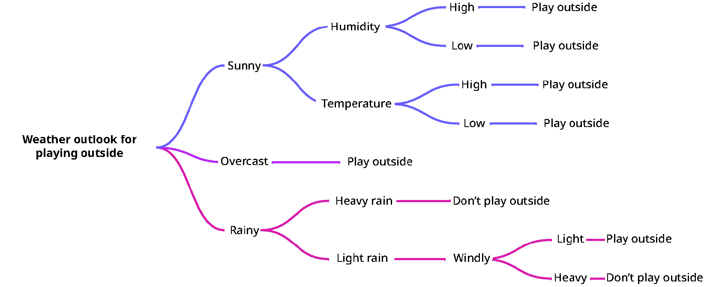

图 3.1 – 简单决策树的示例

+   **降维**：这种技术通过减少输入特征的数量来降低数据的复杂性，专注于仅保留最相关的信息。主成分分析是用于此目的的常用方法。

+   **K-最近邻**（**KNN**）：KNN 根据数据集中最近的邻近点对数据点进行分类。它计算点之间的距离（通常是欧几里得距离），并根据其最近邻中最常见的类别分配一个类别。KNN 根据最近数据点的多数或平均值做出预测。

+   **线性回归**：这种方法通过建立一个或多个自变量与因变量之间的关系来预测连续结果。简单线性回归只涉及一个自变量和一个因变量。线性回归的一个例子可能是根据房屋的面积预测房价。

+   **逻辑回归**：用于二元结果（例如，是/否、真/假），逻辑回归模型基于一个或多个独立变量对分类因变量的概率进行建模，非常适合二元分类任务。逻辑回归可以通过构建基于消息特征的模型（如表示垃圾邮件内容的关键词、源 IP 地址、电子邮件长度、错别字数量或其他特征）用于垃圾邮件检测。

+   **朴素贝叶斯**：基于贝叶斯定理，该技术假设预测因子之间相互独立，对于文本分类、垃圾邮件检测和推荐系统非常有效。变体包括多项式、伯努利和高斯朴素贝叶斯。贝叶斯算法常用于文本分类任务，如垃圾邮件检测和情感分析。

+   **随机森林**：这种集成方法通过平均多个决策树的结果，从而做出更可靠和准确的预测，有效地减少了过拟合和预测中的方差。随机森林算法的一个常见用例可能是根据多个特征（如支持部门电话次数、通话时长、订阅服务时长、服务使用频率的遥测数据）检测客户是否可能离开订阅服务（或流失）。每个这些特征都可以在决策树中进行评估，然后一起用来预测客户的流失潜力。

+   **支持向量机**（**SVM**）：SVM 通过找到最大化不同类别数据点之间间隔（超平面）的最优边界来用于分类和回归，增强了模型的判别能力。想象一下，你有一组在图上的点，需要将它们分成两组。SVM 将确定如何绘制一条最佳分离线。最优的线路径将是最大化线与点之间间隔的线。请参见*图 3.2*中的一个非常简单的例子：

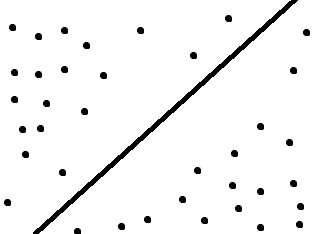

图 3.2 – 支持向量机模型简单表示

进一步阅读

虽然在 AI-900 考试中你不会看到所有这些个别算法，但了解它们是很有趣的。你可以在诸如[`machinelearningmastery.com/a-tour-of-machine-learning-algorithms/`](https://machinelearningmastery.com/a-tour-of-machine-learning-algorithms/)和[`www.kdnuggets.com/a-beginner-guide-to-the-top-10-machine-learning-algorithms`](https://www.kdnuggets.com/a-beginner-guide-to-the-top-10-machine-learning-algorithms)等网站探索这些算法背后的基本数学概念。

### 无监督机器学习技术

无监督学习模型在无标签的数据上进行训练，旨在根据数据中的相似性找到潜在的模式或分组。

**聚类**是无监督学习中的一个主要技术，它根据特征相似性将数据点分组。例如，将不同类型的花朵分类或根据购买习惯对客户进行细分。与分类不同，聚类不需要预定义的类别；算法自主识别这些组。聚类也可以是定义后续分类模型类别的初步步骤，例如将客户细分到针对营销策略的类别中。

### 半监督机器学习技术

半监督学习位于监督学习和无监督学习之间。这种技术结合了监督学习的两个方面（提供标记的输入数据）以及无监督学习（使用未标记的数据进行训练）。

## 推理

一旦训练阶段完成，模型就可以用于**推理**或做出预测。该模型作为一个封装了学习到的函数的软件程序，允许用户输入特征值并接收对应标签的预测。预测标签用*ŷ*（发音为“y-hat”）表示，以区别于观察值。

理解机器学习需要掌握训练和推理的基本概念，以及认识到算法在建立特征与标签之间预测关系中的作用。通过将数学函数应用于数据，机器学习模型可以做出预测，并促进从天气预报到医疗诊断等各个领域的决策制定。

# 识别回归机器学习场景

回归模型旨在使用包含输入特征及其对应目标值的训练数据来预测数值结果。与任何监督学习方法一样，回归模型的发展通过几个周期展开。在每个周期中，你选择一个合适的算法——通常可以配置各种参数——来构建模型。然后，你评估模型预测结果的好坏，并通过尝试不同的算法和调整参数来调整它。这个过程会持续进行，直到模型达到令人满意的预测准确度水平。

回归训练的整体过程如下：

1.  随机划分训练数据以形成用于模型开发的训练集，并保留一部分用于模型验证。例如，可以考虑预留 30-50%的训练数据以供后续测试。

1.  使用合适的算法，例如线性回归，根据训练集构建模型。

1.  然后，使用预留的验证数据从*步骤 1*开始评估模型的有效性，通过做出预测并将这些预测值与验证集中的实际标签进行比较。

1.  总结预测值与实际值之间的差异，以得出反映模型预测准确度的性能指标。

1.  迭代这个训练-验证-评估周期，尝试不同的算法和设置，直到模型的表现符合你的期望。

通过这些步骤，你可以构建回归模型来预测许多现实世界的场景。

## 示例

之前，我们讨论了基于天气温暖程度预测瓶装水销售的例子。为了了解回归训练是如何工作的，让我们深入瓶装水销售的例子。

假设你想根据室外温度预测你预计会售出多少瓶水。这对作为供应商的你来说很重要，因为它有助于你了解你需要储备多少才能满足需求。

首先，你需要收集用于训练模型（以及后来验证模型）的历史数据。请参考*表 3.1*中的以下样本数据集——它捕捉了两个关键数据点：在给定温度下售出的瓶装水数量（*y*）：

| **样本** | **温度 (x)** | **瓶装水销售 (y)** |
| --- | --- | --- |
| 1 | 50 | 0 |
| 2 | 53 | 1 |
| 3 | 62 | 5 |
| 4 | 63 | 7 |
| 5 | 65 | 9 |
| 6 | 68 | 12 |
| 7 | 70 | 18 |
| 8 | 74 | 22 |
| 9 | 77 | 28 |
| 10 | 84 | 36 |
| 11 | 64 | 7 |
| 12 | 78 | 33 |
| 13 | 81 | 34 |
| 14 | 79 | 31 |
| 15 | 54 | 2 |

表 3.1 – 瓶装水销售

下一步是选择我们将用于训练的数据量以及我们将留出的用于验证和测试的数据量。让我们先取前 10 行来训练我们的虚构模型，留下最后 5 行用于验证。

在这个例子中，理解温度和售出瓶装水之间关系的一个简单方法是将它们绘制在简单的图表上，如图*图 3**.3*所示。

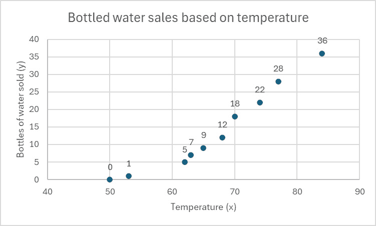

图 3.3 – 温度和售出瓶装水在图上绘制

在训练过程中，算法将公式或函数应用于计算*y*的值，其中*y*是从*x*的值中得出的。在这种情况下，所使用的算法将是线性回归中的一种——它通过点计算一条直线。见图*图 3**.4*：

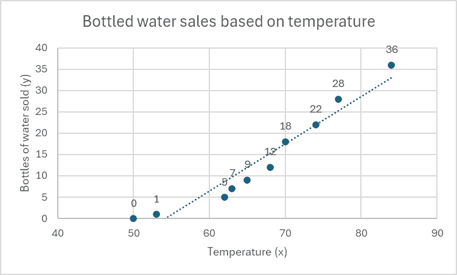

图 3.4 – 线性回归

从图中可以看出，对于每度的变化，历史数据趋势上升。斜率可以用方程*y* = 1.11*x* – 60.02 表示，其中*x*是温度，*y*是售出的水瓶数量。换句话说，从 60 度开始，每增加 1 度温度，售出的水瓶数量增加 1.11。

在开发出这个公式后，下一步是根据训练集中的剩余数据测试该公式。在这个例子中，训练集中剩余的数据已经绘制在同一图表上，并对它们进行了线性回归分析：

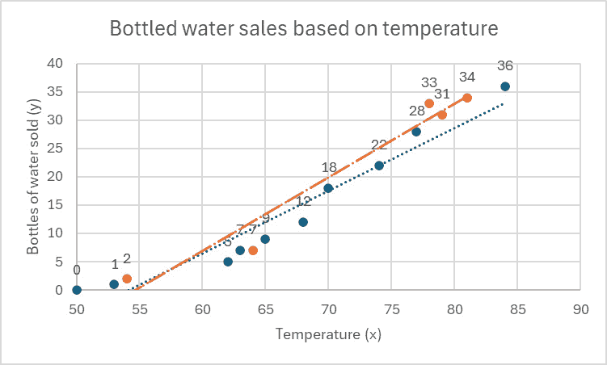

图 3.5 – 验证数据集复合到原始图上

为了测试公式，你可以从保留的训练数据中取一个值（例如 81 度）并通过计算 *y* = 1.11(81) – 60.02 来预测卖出的水瓶数量，结果为 30 个水瓶（或四舍五入到下一个整数的 29.91 个）。

你可以对数据集中保留的每个温度值重复这个过程，使用该函数计算卖出的水瓶数量的预测。见*表 3.2*中的示例：

| **样本** | **温度** | **卖出的水瓶** | **预测** |
| --- | --- | --- | --- |
| 11 | 64 | 7 | 12 |
| 12 | 78 | 33 | 27 |
| 13 | 81 | 34 | 29 |
| 14 | 79 | 31 | 28 |
| 15 | 54 | 2 | 0 |

表 3.2 – 使用训练数据预测卖出的水瓶数量

你如何表达模型的准确性？如果你不确定你的模型有多准确，请继续阅读！有一些指标可以帮助你理解模型及其预测的准确性（或不准确性）。

## 评估指标

评估指标是用于评估预测对数据集有效性的统计公式。

### 均绝对误差 (MAE)

这个**均绝对误差**（**MAE**）表示平均上有多少单位的方差（无论是正数还是负数）。例如，在表 3.2 中的样本 11，预测卖出 12 瓶水。实际卖出的数量（基于训练数据）是 7，这意味着预测比实际高出 5 个单位。这种方差被称为**绝对误差**。在样本 12 中，预测卖出 27 瓶水，但实际卖出的数量是 33（高出 6 个单位，或绝对误差为 6）。

要计算 MAE，将所有绝对误差值相加，然后除以验证集中的样本数量。在这种情况下：

| **样本** | **卖出的水瓶** | **预测** **(ŷ)** | **绝对误差** |
| --- | --- | --- | --- |
| 11 | 7 | 12 | 5 |
| 12 | 33 | 27 | 6 |
| 13 | 34 | 29 | 5 |
| 14 | 31 | 28 | 4 |
| 15 | 2 | 0 | 2 |

表 3.3 – 绝对误差表

所有绝对误差的总和为 22，验证集的项目数量为 5，因此验证集的 MAE 为 4.4（22 除以 5）。

### 均方误差

均绝对误差的一个缺点是它平等地对待所有差异。虽然整体平均误差率可能是可接受的，但在某些行业或场景中，更希望有更多（但更小）的误差，而不是更少（但更大）的误差。例如，对于新鲜农产品，过度库存是非常不希望的，因为你更有可能需要丢弃大量过期的食物。

**均方误差**（**MSE**）作为衡量模型本身质量的一个指标。这个指标给个别误差更多的权重——训练数据中的较大误差预测会导致均方误差显著增加。

为了计算这个值，每个绝对误差值被平方，然后这些值的总和被平均。使用 *表 3.3* 中的训练数据输出，均方误差值为 21.2，突显出模型可能需要调整或更多训练数据。

### 均方根误差 (RMSE)

下一个指标是**均方根误差**，它是均方误差的平方根。虽然均方误差提供了预测函数质量的度量，但 RMSE 被转换回原始单位，这使得它更容易解释和传达模型的表现。RMSE 对异常值敏感，并给予较大的误差相对较高的权重。像 MSE 一样，较小的 RMSE 指示更好的拟合。

使用我们的验证数据集，RMSE 为 4.6。

### 决定系数

**决定系数**，也称为 *R*2，衡量统计模型预测实际结果的好坏。它是一个介于 0 和 1 之间的分数，告诉我们模型可以解释的目标变量（我们试图预测的变量）的变化百分比。得分为 1 表示模型完美预测，预测值和实际值之间没有差异，而得分为 0 表示模型无法解释任何变化。

*R*2 值越接近 1，表明模型很好地拟合了我们的数据，暗示我们的输入变量与结果之间存在强烈的关系。然而，仅凭高 *R*2 并不能保证模型是准确的或对预测有用，尤其是在具有许多变量的复杂模型中。确保模型不是仅仅拟合了数据中的噪声（过拟合），这可能导致误导性结果，这一点至关重要。因此，虽然 *R*2 是模型拟合的有用指标，但它只是评估模型性能的谜题中的一块。

我们样本验证数据集的决定系数为 0.898——基本上是 89.8% 准确。

基于此，我们的模型可能相当不错（对于瓶装水来说）。由于瓶装水不像草莓那样容易腐烂，所以多储备一些水不太可能导致产品损失。

如果我们讨论的是更易变的产品，你可能需要通过改变输入数据集、回归算法和算法**超参数**（控制算法工作方式的参数，而不是算法提供的数据）来进行一些**迭代训练**（即重复的训练会话），以得出一个更准确地预测销售结果的函数。

## 应用

那么回归机器学习在哪里有用呢？正如从瓶装水示例中可以看到，它在进行多种预测时很有用，尤其是在预测销售、配额、房价、股价和其他预测活动中。它也适用于分析广告或媒体服务的用户趋势。

# 识别分类机器学习场景

分类是一种监督机器学习技术，其基本原理是根据标准将值放入组（类别）中。主要有两种分类技术：二元和多类。让我们看看这两种。

## 二元分类

你可能之前听说过**二进制**这个术语，并且知道它是计算机用来处理信息的由一和零组成的语言。二进制简单来说就是数据项可以设置为两个值之一。例如，0 或 1 以及真或假都是二进制选择。

在机器学习环境中，二元分类与回归机器学习中的工作方式类似——使用特征值（*x*，就像在回归机器学习中一样），模型预测标签（*y*）是 0 还是 1。二元分类根据特征数据将数据分类到互斥的组中。

### 示例

让我们看看一个可能用于训练二元分类模型的数据集，该模型基于患者的 LDL 胆固醇水平预测患者是否有患心脏病的风险。就像我们之前看到的回归数据集一样，我们将有一个包含数据测量的特征（*x*）列和相应的标签（*y*）：

| **患者 ID** | **LDL 胆固醇水平（x）（以 mg/DL 为单位测量**） | **心脏病（y）** | **0 = 无，1 = 是** |
| --- | --- | --- |
| 1 | 100 | 0 |
| 2 | 87 | 0 |
| 3 | 132 | 0 |
| 4 | 159 | 1 |
| 5 | 152 | 1 |
| 6 | 171 | 1 |
| 7 | 188 | 1 |
| 8 | 161 | 0 |
| 9 | 118 | 0 |
| 10 | 141 | 0 |
| 11 | 102 | 1 |
| 12 | 144 | 0 |
| 13 | 155 | 1 |
| 14 | 167 | 1 |
| 15 | 142 | 1 |

表 3.4 – 心脏病患者二元分类数据

就像回归模型技术一样，有许多算法可以用于二元分类。一个流行的算法是**逻辑回归**（尽管其名称如此，但它并不是基于回归模型的算法），它通常通过其表示 0 到 1 之间值的 S 形（S 型）函数图来识别。见图 3.6：

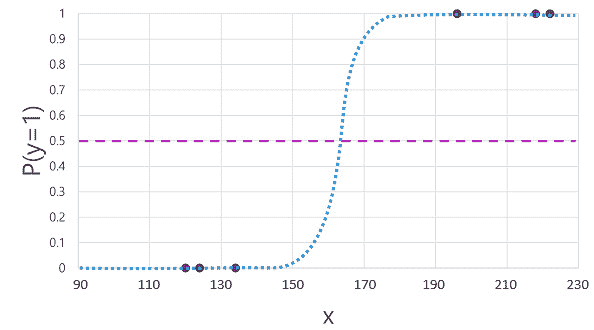

图 3.6 – Sigmoid 函数图的示例

与回归算法一样，结果函数可以用数学表达式表示。在图中，*y*轴表示标签为真的概率（从 0 到 1 排序），使用以下表达式：

*f(x) = P(y=1 | x)*

表 3.4 中的训练数据集显示了七个肯定没有心脏病的人和八个有心脏病的人。图 3.6 中描绘的图表也显示了一条可选的水平线，它可以指示预测从假变为真的**阈值**。

与回归模型训练一样，你应该将数据集分为两个选择：一部分用于训练，另一部分用于验证。

将数据输入到简单的二元分类函数中，你可能绘制出类似于图 3.7 中的图表。

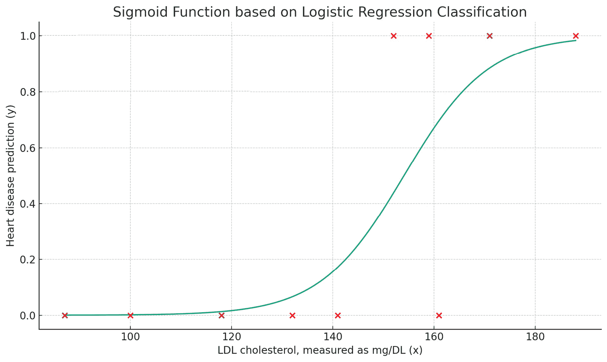

图 3.7 – 一个样本的二分类图

在*图 3.7*中，绘制的点表示患者的 LDL 胆固醇读数（沿*x*轴绘制），它们在*y*轴上的位置表示患者是否有心脏病，其中 0 代表“无”，1 代表“是”。

使用与回归训练中验证算法相同的方法，使用保留的训练数据，可以对二分类做同样的事情。创建模型后，根据特征（LDL 胆固醇水平）预测心脏病应该很容易：

| **患者 ID** | **LDL 胆固醇水平（x）（测量** **在 mg/DL 中**） | **预测（ŷ）** | **心脏病（y）** **0 = 无，1 = 是** |
| --- | --- | --- | --- |
| 11 | 102 | 0 | 1 |
| 12 | 144 | 0 | 0 |
| 13 | 155 | 1 | 1 |
| 14 | 167 | 1 | 1 |
| 15 | 142 | 0 | 1 |

表 3.5 – 基于胆固醇的心脏病预测

接下来，让我们看看如何评估数据。

### 评估指标

当评估一个模型时，不仅要能够确定预测正确和错误的地方，还要理解它们正确或错误的原因。这些结果可以用一个称为**混淆矩阵**或**混淆图**的图表来表示，如图*图 3.8*所示：

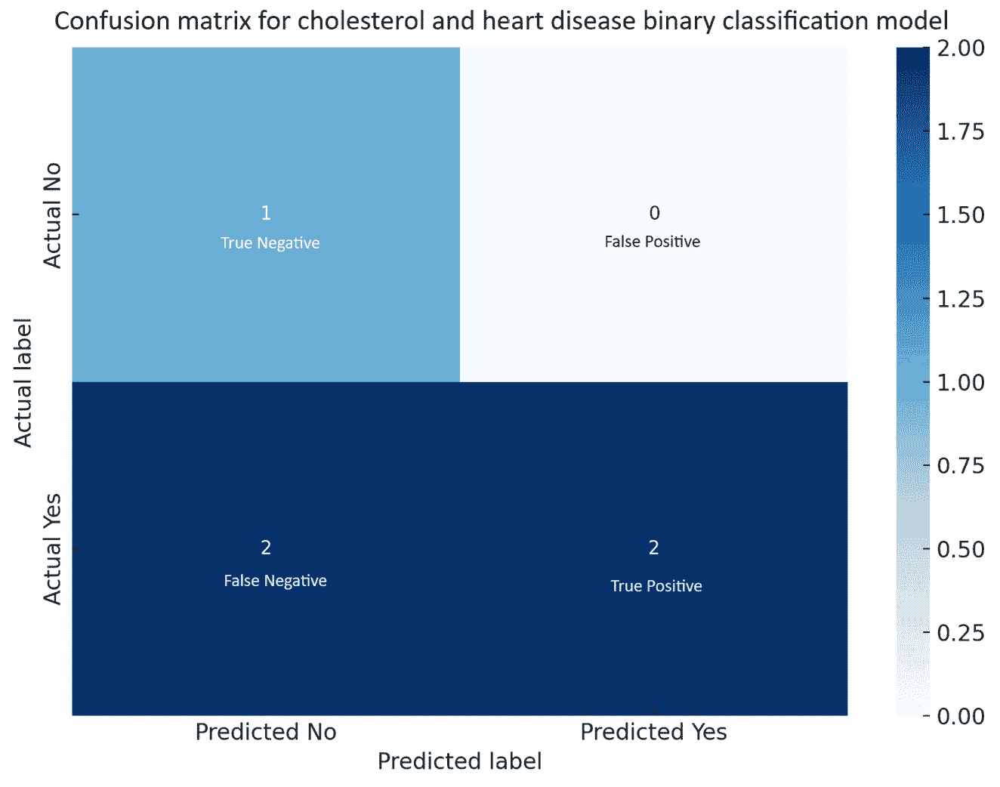

图 3.8 – 混淆矩阵

数据被分为四个类别：

+   **实际为是**：训练数据表明患者有心脏病

+   **实际为否**：训练数据表明患者没有心脏病

+   **预测为是**：模型根据胆固醇水平预测患者会有心脏病

+   **预测为否**：模型根据胆固醇水平预测患者不会患有心脏病

然后将它们布局在四个象限中，并相应地标记交叉点：

|  | **预测为否** | **预测为是** |
| --- | --- | --- |
| **实际为否** | 真阴性 | 假阳性 |
| **实际为是** | 假阴性 | 真阳性 |

表 3.6 – 混淆矩阵表

下面是如何解释这些值的说明：

+   **真阴性**（**TN**）：这是模型正确预测了条件不存在（类别 0）的实例数量。在我们的案例中，这代表被正确地识别为没有心脏病风险的患者数量。

+   **假阳性**（**FP**）：这是模型错误地预测了条件存在（类别 1）的实例数量。在我们的案例中，这代表被错误地识别为有心脏病风险但实际上没有的患者数量。

+   **假阴性**（**FN**）：这是模型错误地预测了条件不存在（类别 0）的实例数量。在我们的案例中，这代表实际上有心脏病风险但被错误地识别为没有风险的患者数量。

+   **真阳性**（**TP**）：这是模型正确预测条件存在（类别 1）的实例数量。在我们的案例中，这代表正确识别为患有心脏病风险的患者数量。

这些数据点（真正的负数、真正的正数、错误的正数和错误的负数）可以进一步用于评估模型准确性的几个指标。

#### **准确率**

**准确率**用于描述模型总体上正确性的频率。计算准确率的公式是 *(TP + TN) / (total)*。在此情况下，模型的准确率为 60%。

#### 回忆

**召回率**（有时称为**灵敏度**）表明模型识别正类（1，或在此情况下，患有心脏病风险的患者）的能力。公式是 *TP / (TP + FN)*。类别 1（患有心脏病）的召回率为 50%。

#### **精确率**

**精确率**是模型对每个类别预测正确频率的指标。对于正类，此公式是 TP / (TP + FP)。对于类别 1（心脏病），模型正确预测的频率为 100%。

#### 特异性

**特异性**衡量模型对负类（0，或在此情况下，无心脏病患者）预测正确性的频率。公式是 *TN / (TN + FP)*。此模型对负类的特异性为 33%，表明在预测患者不会患有心脏病时，只有 33%的时间是正确的。

如果预测与实际数据之间存在差异，这可能表明模型可能需要改进的领域，例如收集更多样化的数据、使用不同的模型或调整现有模型。了解模型失败的地方可以帮助减少假阳性（错误地预测没有风险的风险）和假阴性（错过识别实际风险），这在医学诊断中尤其重要。

### 应用

当影响真实或虚假结果的因素有限时，二元分类最有用。在医学、生物学、技术和化学等领域，当你试图根据一小组变量确定是/否或真/假结果时，这是常见的。

二元分类的常见现实世界例子包括以下：

+   **电子邮件垃圾邮件检测**：将电子邮件分类为垃圾邮件或非垃圾邮件。这是二元分类最常见的一种应用，由电子邮件服务用于过滤掉不受欢迎的消息。

+   **医学诊断**：将患者疾病或状况诊断为阳性（患有疾病）或阴性（未患病）。例如，二元分类模型可以根据医学影像检测肿瘤是否为恶性或良性。

+   **信用批准**：决定是否批准或拒绝信用申请。金融机构使用二元分类算法来预测申请者是否可能违约。

+   **客户流失预测**：预测客户是否会流失（离开）或继续与公司或服务保持关系。公司使用二元分类来识别风险客户并制定保留策略。

+   **欺诈检测**：识别交易为欺诈或合法。银行和金融机构使用二元分类模型来检测可疑活动并预防欺诈。

+   **情感分析**：确定一段文本（如产品评论或社交媒体帖子）是否表达积极或消极的情感。这在市场营销和客户服务中广泛用于衡量公众舆论和客户满意度。

+   **恶意软件检测**：将文件或程序分类为恶意或安全，由网络安全系统用于保护计算机和网络免受病毒和其他恶意软件的侵害。

## 多类分类

稍微转换一下话题，让我们看看多类分类。像二元分类一样，它是一种基于特征的概率方法，根据特征分配分类。然而，它不仅可以使用多个特征和多个分类，而不是使用单个特征或二元标签（真/假，0/1）。基本思想是相同的，但让我们快速看一下它的工作原理的一个例子。

### 示例

在这个例子中，我们将评估辣椒及其辣度（或斯科维尔辣度单位评分）。每种辣椒都有一个辣度评分，按斯科维尔单位排名，描述了它的辣度。

*表 3.7* 中的数据展示了各种辣椒及其平均斯科维尔辣度单位：

| **斯科维尔辣度单位** | **辣椒** |
| --- | --- |
| 1,500,000 – 2,200,000 | 特立尼达毒蝎 |
| 1,000,000 – 1,500,000 | 特立尼达毒蝎 |
| 855,000 – 1,000,000 | 幽灵辣椒 |
| 350,000 – 577,000 | 红色萨维纳哈瓦那辣椒 |
| 100,000 – 350,000 | 哈瓦那辣椒 |
| 70,000 – 100,000 | 查尔斯顿热辣椒 |
| 30,000 – 50,000 | 卡宴辣椒 |
| 10,000 – 23,000 | 塞拉诺辣椒 |
| 8,000 – 10,000 | 匈牙利辣椒 |
| 2,000 – 7,000 | 奇瓦潘辣椒 |
| 0-100 | 青椒 |

表 3.7 – 选择辣椒及其斯科维尔辣度单位评分

现在，就像二元分类训练一样，让我们生成一个特征（斯科维尔辣度单位评分）和标签（辣椒）的样本表： 

| **ID** | **斯科维尔辣度单位 (x)** | **辣椒 (y)** |
| --- | --- | --- |
| 1 | 1,900,000 | 卡罗来纳死神辣椒 |
| 2 | 10 | 青椒 |
| 3 | 2,850 | 奇瓦潘辣椒 |
| 4 | 447,700 | 红色萨维纳辣椒 |
| 5 | 8,700 | 匈牙利辣椒 |
| 6 | 127,000 | 哈瓦那辣椒 |
| 7 | 88,000 | 查尔斯顿热辣椒 |
| 8 | 289,000 | 哈瓦那辣椒 |
| 9 | 0 | 青椒 |
| 10 | 900,000 | 幽灵辣椒 |
| 11 | 1,250,000 | 毒蝎 |
| 12 | 11,000 | 塞拉诺辣椒 |
| 13 | 42,000 | 卡宴辣椒 |
| 14 | 7,000 | 奇瓦潘辣椒 |
| 15 | 2,200,000 | 卡罗来纳死神辣椒 |

表 3.8 – 斯科维尔评分样本数据

一旦收集了训练数据，就到了使用算法将训练数据拟合到计算我们类别概率的函数的时候了。根据我们的训练数据，我们的数据集有 11 个可能的答案（类别）。它们是零索引的，这意味着它们从 0 到 10 编号。

多元分类模型中最常见的算法是**一对余**（**OvR**）和**多项式**算法。

+   **一对余**（**OvR**）或**一对所有**（**OvA**）：使用此算法，你为每个类别单独训练一个二分类函数。每个函数针对集合中的特定类别与其他任何类别进行比较。在这种情况下，由于有 11 种辣椒类型，算法将创建 11 个二分类函数。像之前的二分类一样，该算法产生一个 Sigmoid 函数。该模型的输出预测了产生最高概率输出的函数的类别。OvR 或 OvA 策略可以应用于例如卡罗来纳雷 aper 对所有分类器的场景——本质上确定一个元素是否是卡罗来纳雷 aper。

+   **多项式**：此算法以不同的方式处理问题，创建一个具有多值（或向量）输出的单个函数。这个向量可以包含所有潜在类别的概率分布，尽管它实际上是为互斥数据集设计的（例如，如果一个辣椒的 Scoville 评分不能扩展到另一个辣椒的范围内）。具有多个元素的向量中，每个类别的元素都会在 0 到 1 之间单独评分，总和为 1。

这类模型可能需要更多信息才能可靠地预测。例如，查看 *表 3.7* 中的 Scoville 辣椒评分样本数据。正如你所看到的，有几个实例中，一个辣椒可能与其他辣椒有相似的热度评分（要么较温和，要么较辣）。更大的训练数据集将有助于模型理解频率的概念，从而帮助更准确地预测和选择适当的分类策略（取决于你想要识别的因素），这将有助于你在这种分类方法中取得最大的成功。

### 评估指标

由于多元分类实际上可以看作是二分类的扩展（在许多情况下），因此相同的技术和术语适用。

例如，使用训练数据，你可以开发一个混淆矩阵。布局与二分类的混淆矩阵非常相似——只是需要处理更多的标签，如图 *图 3.9* 所示：

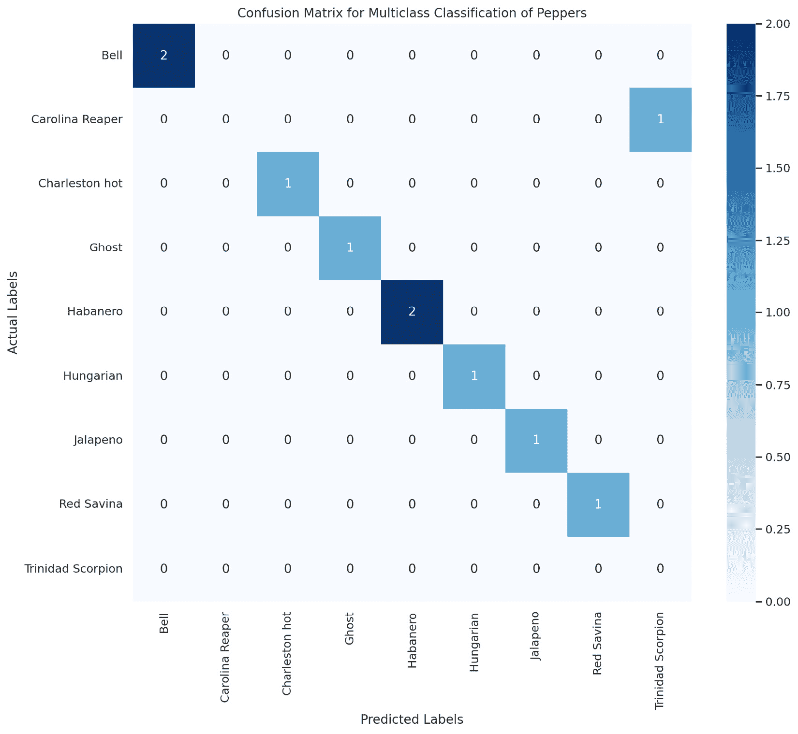

图 3.9 – 基于 Scoville 辣椒数据的多元混淆矩阵

### 应用

多类分类指的是需要将项目分类到两个以上类别的场景。与区分两个类别（如是/否或真/假）的二分类不同，多类分类处理的是有三个或更多类别的情形。

潜在的应用场景包括以下内容：

+   **预测动物类型**：假设你有一个包含动物图像的数据集，你想要将每个图像分类为狗、猫、鸟或鱼。这是一个有四个类别的多类分类问题。

+   **天气预报**：如果你在预测天气将是晴朗、多云、下雨还是下雪，你就是在处理多类分类。

+   **手写数字识别**：一个经典的例子是 MNIST 数据集，其中的任务是把手写数字图像分类到 10 个类别（0 到 9）。

+   **医疗诊断**：假设某个特定的诊断测试可以指示几种不同的疾病。如果你正在开发一个模型，根据患者的症状和测试结果预测患者可能患有的特定疾病（从可能的集合中），你就是在进行多类分类。

在多类分类中，技术和指标与二分类略有不同，因为你必须考虑模型在所有不同类别（而不仅仅是两个）上的表现，但总体过程非常相似。对于每个类别都会计算精确度和召回率等指标，然后以某种方式（如微平均、宏平均或加权平均）进行平均，以了解整体性能。

一个分类的 F1 分数是用来总结该类整体准确性的一个度量。之前，你学习了**精确度**（正确预测的正观察值与总正值的比率，公式为 *P = TP / (TP+FP)*) 和召回率（正确预测的正观察值与类别中所有观察值的比率，使用公式 *R = TP / (TP + FN)* 计算）。

F1 分数是使用以下公式计算的：*F1 = 2 * (P * R) / (P + R)*。

到目前为止，你一直在学习关于**监督学习**场景，如二分类和多类分类。接下来，我们将转向无监督场景。

# 识别聚类机器学习场景

聚类是一种无监督机器学习场景，其中算法被用来尝试识别数据中的模式。与有监督学习不同，有监督学习中的训练数据有标签和特征，而无监督学习没有。聚类的主要目标是让机器学习算法能够根据数据点本身的相似性在数据中找到自然分组。

正如监督学习有自己的算法一样，有几种流行的算法可用于聚类场景：

+   **K-means 聚类**：该算法根据每个簇质心的平均距离将数据划分为*K*个互不重叠的子集（或簇）。*K*的值需要事先指定。

+   **层次聚类**：通过自底向上（聚合）或自顶向下（划分）的方法构建簇的层次结构。它不需要预先指定簇的数量。

+   **基于密度的空间聚类应用噪声**（**DBSCAN**）：基于数据点的密度形成簇，能够发现任意形状的簇并有效地处理噪声和异常值。

## **示例**

假设我们有一些来自杂货购物者的样本数据；15 位购物者将*表 3.9*中描述的项目（或特征）放入了他们的篮子里：

| **篮子 ID** | **面包（x1）** | **牛奶（x2）** | **鸡蛋（x3）** | **香蕉（x4）** | **鸡肉（x5）** | **苹果（x6）** | **奶酪（x7）** | **番茄（x8）** | **土豆（x9）** | **洋葱（x10）** | **咖啡（x11）** | **生菜（x12）** |
| --- | --- | --- | --- | --- | --- | --- | --- | --- | --- | --- | --- | --- |
| 1 | 1 | 1 | 1 | 1 | 1 | 0 | 0 | 0 | 1 | 1 | 1 | 0 |
| 2 | 1 | 1 | 0 | 1 | 0 | 1 | 0 | 1 | 0 | 1 | 1 | 0 |
| 3 | 1 | 1 | 1 | 0 | 1 | 1 | 1 | 0 | 1 | 1 | 1 | 1 |
| 4 | 1 | 1 | 1 | 1 | 1 | 1 | 1 | 1 | 1 | 1 | 1 | 1 |
| 5 | 1 | 0 | 1 | 0 | 0 | 0 | 0 | 0 | 0 | 0 | 0 | 0 |
| 6 | 0 | 1 | 1 | 0 | 1 | 0 | 1 | 1 | 0 | 1 | 1 | 1 |
| 7 | 1 | 1 | 0 | 1 | 1 | 0 | 1 | 1 | 0 | 1 | 1 | 0 |
| 8 | 1 | 0 | 1 | 0 | 1 | 0 | 1 | 0 | 1 | 1 | 1 | 1 |
| 9 | 0 | 0 | 1 | 1 | 1 | 0 | 0 | 1 | 1 | 1 | 0 | 0 |
| 10 | 1 | 1 | 1 | 0 | 1 | 1 | 0 | 1 | 1 | 1 | 1 | 1 |
| 11 | 1 | 0 | 1 | 0 | 1 | 0 | 0 | 1 | 0 | 1 | 0 | 1 |
| 12 | 1 | 1 | 0 | 1 | 1 | 0 | 1 | 1 | 0 | 0 | 1 | 1 |
| 13 | 1 | 1 | 1 | 0 | 0 | 0 | 1 | 1 | 1 | 0 | 0 | 1 |
| 14 | 0 | 0 | 1 | 0 | 0 | 1 | 0 | 0 | 1 | 1 | 0 | 1 |
| 15 | 0 | 1 | 1 | 1 | 0 | 1 | 0 | 0 | 0 | 0 | 1 | 0 |

表 3.9 – 食物示例购物篮

在这个例子中，我们可以指导 K-means 算法将数据划分为三个购物篮组。根据输出结果，我们最终得到以下三个簇：

+   簇 0：篮子 2、5、12、15

+   簇 1：篮子 5、9、11、14

+   簇 2：篮子 1、3、4、6、8、10、13

下面是如何将 K-means 算法应用于购物者购买的杂货数据集的示例：

1.  首先，将杂货商品（如面包、牛奶、鸡蛋等）以适合机器学习算法的格式表示。这是通过二进制表示实现的，其中每个项目被编码为 0（未购买）或 1（购买），如*表 3.9*所示。这个二进制矩阵形成了数据集，其中每一行代表一个购物篮，每一列代表不同的杂货商品。

1.  接下来，我们选择了一些集群（或组）用于对项目进行分组。在这种情况下，我们将 *K* 设置为三个，这意味着我们决定根据包含的项目将购物篮分为三个不同的集群。*K* 的选择可能受到领域知识、实验或其他技术和算法的影响。

1.  一旦设置了过程的先决条件，我们然后在图上选择一些随机点。这些点称为 **质心**，是正在形成的集群的中心点。在我们的例子中，随机选择了三个购物篮作为初始质心。

1.  然后，每个购物篮（或我们的数据集的一行）被分配到最近的质心。通常，“最近”是通过计算篮子与每个质心之间的距离来确定的。每个篮子被分配到离它最近的质心的集群，从而根据当前的质心形成三个初始集群。

去更远的地方

在聚类中确定距离有许多不同的方法。最常用的三种距离计算类型是 **欧几里得**、**汉明**、**曼哈顿**、**闵可夫斯基** 和 **杰卡德**。每种类型的距离用于不同类型的数据（例如，二进制数据与线性或连续数值数据）。好消息是，这些内容都不出现在考试中，所以你不需要学习它们。然而，如果你想探索确定聚类距离的不同数学基础，请参阅 [`www.displayr.com/understanding-cluster-analysis-a-comprehensive-guide/`](https://www.displayr.com/understanding-cluster-analysis-a-comprehensive-guide/)。

1.  一旦所有篮子都被分配到集群中，这些集群的质心将被重新计算。这是通过取每个集群中所有篮子的平均值（或平均数）来完成的。由于我们的数据是二进制的，这个平均值可能不是正好是 0 或 1；它代表集群中包含每个项目的篮子比例。

1.  将篮子分配到最近的质心并根据当前的集群成员资格更新质心的步骤被重复执行。随着质心的变化，每个迭代中篮子可能会从一个集群转移到另一个集群。

1.  这个过程一直重复，直到质心在迭代之间不再显著变化，这意味着集群已经稳定，算法已经收敛。这是 K-means 的停止标准。

1.  一旦算法收敛，每个购物篮根据其包含的项目被分配到三个集群中的一个。最终的集群代表基于某些项目的存在或不存在而彼此相似的购物篮组。

在我们的购物项目数据集的背景下，应用 K-means 使我们能够将购物篮分组到簇中，这些簇可能反映了客户不同的购物模式或偏好。例如，一个簇可能代表每周的必需品购物（包括面包、牛奶和鸡蛋等物品），另一个簇可能代表新鲜农产品购物（包括水果和蔬菜等物品），另一个簇可能代表特殊商品购物（如咖啡或奶酪）。

这种类型的信息通常被商家用来帮助理解购买习惯和推荐或升级销售的机会。如果你曾经好奇亚马逊是如何确定哪些商品会作为推荐给你购买，或者为什么你会收到某些优惠券，那么在某个阶段很可能涉及聚类机器学习模型。

## 评估指标

由于没有标签进行比较，评估聚类的性能不如监督学习直接。然而，可以使用诸如**轮廓得分**（或**轮廓系数**）、**戴维斯-博尔丁指数**和**卡尔斯基-哈拉巴斯指数**等指标，通过测量簇之间的距离和簇本身的密度来评估聚类的质量。

### 轮廓得分

轮廓得分或轮廓系数衡量每个数据点如何适合其最终分配的簇。分数范围从-1 到 1，其中接近 1 的值表示定义更清晰、重叠更少的簇。

+   分数接近 1 表示簇彼此之间距离较远且定义清晰

+   分数为 0 表示簇之间存在重叠

+   分数接近-1 表示簇的分配不适当

在这种情况下，该模型的轮廓得分是 0.128，这表明簇之间存在重叠或可能没有明显分离。这种情况对于这种类型的数据（如购物清单）是可以预料的，因为购物者使用物品的频率不同，彼此有不同的需求，导致他们做出复杂的购买决策，可能结果是购买相同的东西但出于不同的原因。

### 戴维斯-博尔丁指数

**戴维斯-博尔丁指数**用于衡量聚类的质量，其中较低的分数表示聚类质量更好。

我们购物篮 K-means 聚类模型的戴维斯-博尔丁指数得分约为 1.65。这个分数本质上评估了每个簇与其最相似簇之间的平均相似度，其中相似度是一个结合簇的紧凑性（簇内点彼此之间的接近程度）和分离度（不同簇彼此之间的距离）的度量。

较低的戴维斯-博尔丁指数表示簇是紧凑的（即，每个簇内的点彼此靠近）且分离良好（即，簇彼此之间距离较远）。相反，较高的分数表明簇的区分度较低。

通常，分数接近 0 的更受欢迎。

### Calinski-Barabasz 指数

**Calinski-Harabasz 指数**，也称为方差比率准则，没有像某些其他指标（如轮廓分数，其范围从-1 到 1）那样的固定范围。相反，其值取决于数据集的特征，包括样本数量、维度和固有的簇结构。此模型的 Calinski-Harabasz 指数得分为 3.10。

更高的 Calinski-Harabasz 指数得分表明簇是密集的（意味着簇内的点彼此靠近）并且分离良好（意味着簇彼此之间距离较远）。这被解释为具有更好定义的簇结构的模型。与准确度等指标的范围从 0 到 1，或轮廓分数的理论范围从-1 到 1 不同，Calinski-Harabasz 指数没有最大值，并且不在固定范围内有界。没有上下文的情况下，其绝对值信息较少。

当用于比较同一数据集上不同的聚类模型或配置时，该指数最有用。例如，通过选择具有最高 Calinski-Harabasz 得分的簇数（*K*）来选择最佳*K*，可以帮助通过聚类相同数据并使用不同数量的簇来获得分数。在这个例子中，我们告诉模型将购物篮分为三个簇。为了有效地使用 Calinski-Harabasz 分数，重新运行模型将篮子分为两个、四个或五个簇将是有用的。

例如，在重新运行 K-means 算法并使用两个、四个和五个簇的参数后，取得了以下分数：

+   两个簇：2.997

+   四个簇：2.73

+   五个簇：2.504

在实践中，因为没有固定的“良好”阈值，最佳方法是使用 Calinski-Harabasz 指数来比较同一数据集上不同聚类解决方案的有效性，并选择得分最高的一个。然而，这个分数应该与其他指标（如轮廓分数和 Davies-Bouldin 指数）一起使用，以进行更全面的评估。

## 应用

聚类有许多实际应用，从社会科学到市场营销和威胁建模。以下是一些示例应用：

+   **市场细分**：根据购买行为、兴趣或人口统计特征对客户进行分组。

+   **异常检测**：通过找出哪些数据点不适合任何簇来识别异常数据点。

+   **数据组织**：将大量数据组织成可管理和有意义的组。

+   **模式发现**：在数据中寻找隐藏的模式或内在结构，例如在生物信息学中根据相似的表达模式对基因进行分组。

+   **客户行为分析**：了解不同的客户群体及其购买模式可以帮助优化产品定位、商店布局和库存管理。

+   **推荐系统**：聚类可以帮助识别相似物品或用户群体，然后可以根据该群体中其他人的偏好向用户推荐物品。

+   **社交网络分析**：聚类可以帮助根据个人的互动或共同兴趣，在大型个人网络中识别社区或群体。

这些应用展示了聚类如何在不同领域从大量数据中提取有意义的模式，其灵活性和强大功能。

# 识别深度学习技术的特征

深度学习是机器学习的一个高级子集，它通过人工神经网络结构模拟人类大脑的学习方式。这些网络由多个层次神经元组成，以分层方式处理数据，这就是为什么这些模型被称为**深度神经网络**（**DNNs**）。深度学习自动从大量非结构化数据中提取特征，如图像和文本，显著提高了机器学习任务的准确性和效率。

与传统的机器学习不同，后者依赖于手动特征提取，深度学习模型学会自动识别和区分数据特征。这个过程需要大量的计算能力和数据，利用反向传播和优化算法，如随机梯度下降，来调整神经元连接并最小化预测误差。

深度学习应用包括回归、分类、自然语言处理和计算机视觉，这些应用正在改变自动驾驶、虚拟助手、面部识别和推荐系统等领域。训练过程涉及拟合数据以预测基于特征的输出，迭代调整模型以提高准确性。这项技术代表了机器通过学习数据执行复杂任务能力的一个重大进步。

就像本章讨论的其他机器学习技术一样，深度学习涉及将训练数据拟合到一个函数中，该函数可以根据一个或多个特征（*x*）的值预测标签（*y*）。函数（*f*(*x*））是嵌套函数的外层，其中每个神经网络层封装了操作于*x*及其相关联的权重（*w*）值的函数。训练模型所使用的算法涉及迭代地将训练数据中的特征值（*x*）向前传递通过层来计算输出值*ŷ*，验证模型以评估计算出的*ŷ*值与已知的*y*值（这量化了模型中的错误或损失水平）有多远，然后修改权重（*w*）以减少损失。训练好的模型包括导致最准确预测的最终权重值。

那么，深度学习是如何工作的呢？深度学习的基础是一个称为**神经网络**的结构。

神经网络是指设计用来模拟人脑和神经系统结构和功能的计算系统。类似于大脑的神经元，人工神经网络由称为神经元或节点的单元组成，它们相互连接。这些连接由权重和偏差特征化，一旦输入值超过预定义的阈值，就会激活后续节点。将神经网络想象为一组按层组织的节点，其中每个节点连接到相邻层中的几个节点，每个节点的输出影响下一层节点的输入，有点像 3D 流程图，其中每个条件和动作都可以连接到其他条件和动作。*图 3.10*展示了简单神经网络设计的一个示例：

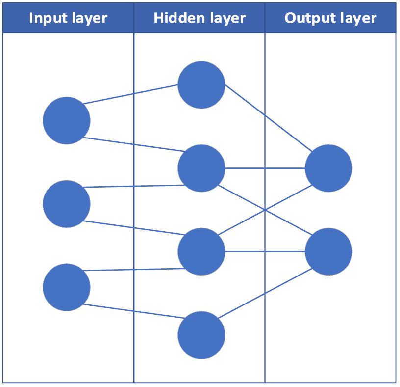

图 3.10 – 简单神经网络的示例

每个输入层节点都与隐藏层中的两个节点相连，并且结果数据连接到输出层。神经网络的输入层处理原始数据并将其传递到隐藏层的节点，这些节点根据目标标准对数据点进行分类。随着数据通过连续的隐藏层，目标值的焦点变得更加精细，从而得出更精确的假设。

**损失函数**用于比较预测的*ŷ*值与已知值。该函数汇总这些差异，得出多个案例的总方差。这个总方差被总结为**损失**。可能使用一个优化函数来评估各种损失的权重，并确定如何调整以最小化损失。这些变化会**反向传播**到整个神经网络中，以替换原始值，并且模型会根据更新的值重新学习。这个过程每次迭代被称为**一个 epoch**；epochs 会重复进行，直到损失和预测值在可接受的阈值范围内。

最后，输出层利用隐藏层的信息来确定最可能的标签。

当你听到人们谈论**深度学习**时，实际上是在扩展神经网络的观念，增加更多的隐藏层（代表更多数据分类维度），从而实现更精确的预测。

## 示例

深度学习的一个实际应用示例是图像识别场景，其目标是预测图像中的动物类型。在这种情况下，一个深度学习模型，通常是一个**卷积神经网络**（**CNN**），会在大量动物图像数据集上进行训练。数据集中的每张图像都会标注包含的动物类型（例如，狗、猫、老虎等）。

在训练过程中，卷积神经网络（CNN）学习识别图像中的模式和特征，如形状、纹理和颜色，这些特征可以区分不同的动物。该网络由各种层组成，包括输入层、隐藏层和输出层。输入层接收原始图像数据，而隐藏层通过一系列过滤器处理数据，在每个层中识别越来越复杂的特征。输出层随后使用隐藏层提取的信息，根据最可能代表的动物类型对图像进行分类。

一旦模型训练完成，它可以通过处理新图像并通过相同的网络产生预测，来预测新图像中动物的类型。该模型通过学习识别的特征，基于其识别到的特征来生成预测。

## 应用

这种自动且准确地对图像进行分类的能力，使深度学习成为野生动物监测、宠物识别甚至医学图像分析等任务的有力工具。

深度学习与聚类有许多相同的应用（因为其目标非常相似——识别和分类或分组先前未标记的数据）。因此，实际应用包括聚类可以做到的一切，以及许多其他应用：

+   **图像识别和计算机视觉**：由于深度学习模型的结构方式模仿人类视觉感知，因此它们在图像识别任务中得到了广泛应用，特别是卷积神经网络（CNN）。它们可以在图像和视频中识别面部、物体、场景和动作。这项技术支撑着各种应用，包括安全监控、医学影像诊断和自动驾驶汽车。

+   **自然语言处理（NLP）**：深度学习显著提高了 NLP 的能力，使得语言翻译、情感分析和聊天机器人等应用成为可能。Transformer 和**循环神经网络（RNNs**）等模型在这些进步中发挥了关键作用。

+   **语音识别和生成**：深度学习模型是语音激活系统（如虚拟助手（例如，Siri、Alexa）、语音转文本转录服务和语音驱动的客户服务系统）的核心。

+   **推荐系统**：深度学习被用于为 Netflix、YouTube 和 Amazon 等平台上的推荐引擎提供动力，通过根据个人偏好和以往行为个性化内容、产品和服务来提升用户体验。

+   **自动驾驶汽车**：深度学习模型处理和解释自动驾驶所需的复杂视觉环境，包括识别交通标志、信号、行人和其他车辆。

+   **欺诈检测**：金融机构利用深度学习检测异常模式，实时预防欺诈活动，显著降低了金融机构和消费者遭受财务损失的风险。

+   **药物发现和基因组学**：在生物技术领域，深度学习有助于新药的开发和对基因序列的理解，为个性化医疗和复杂疾病的治疗做出贡献。

+   **内容生成**：深度学习技术用于创建逼真的图像、视频、文本和声音，使虚拟现实、游戏开发以及艺术和音乐的创作等应用成为可能。

+   **情感分析**：公司使用深度学习来分析客户反馈、社交媒体评论和评论，以衡量公众情绪，改进产品并定制服务。

这些应用展示了深度学习在不同领域的多功能性和变革潜力，推动了创新，提高了效率、准确性和用户体验。

# 摘要

在本章中，你了解了多种不同的机器学习场景，如回归、分类和深度学习。你学习了监督学习和无监督学习，以及它们各自适用的场合。

机器学习在众多现实场景中都有帮助，从天气预报到医学影像分析。你了解了每种机器学习技术的应用，甚至学习了如何计算几个指标来确定训练模型的准确性。

在下一章中，我们将开始讨论核心机器学习概念。

# 考试准备练习 – 第三章复习问题

除了对关键概念有扎实的理解外，能够在时间压力下快速思考是一项帮助你通过认证考试的关键技能。这就是为什么在学习的早期阶段就培养这些技能至关重要。

复习问题旨在通过学习并复习每一章的内容来逐步提高你的应试技巧，同时检查你对章节中关键概念的理解。你可以在每一章的末尾找到这些复习问题。

在继续之前

如果你没有 Packt 图书馆订阅或没有从 Packt 商店购买这本书，你需要解锁在线资源以访问考试准备练习。解锁是免费的，只需进行一次。要了解如何操作，请参阅标题为 *第十二章* 的章节，*访问在线资源*。

要打开本章的复习问题，请执行以下步骤：

1.  点击链接 – [`packt.link/AI-900_CH03`](https://packt.link/AI-900_CH03)。

    或者，你可以扫描以下二维码 (*图 3.11*)：

图 3.11– 为登录用户打开第三章复习问题的二维码

1.  一旦你登录，你将看到一个类似于 *图 3.12* 所示的页面：

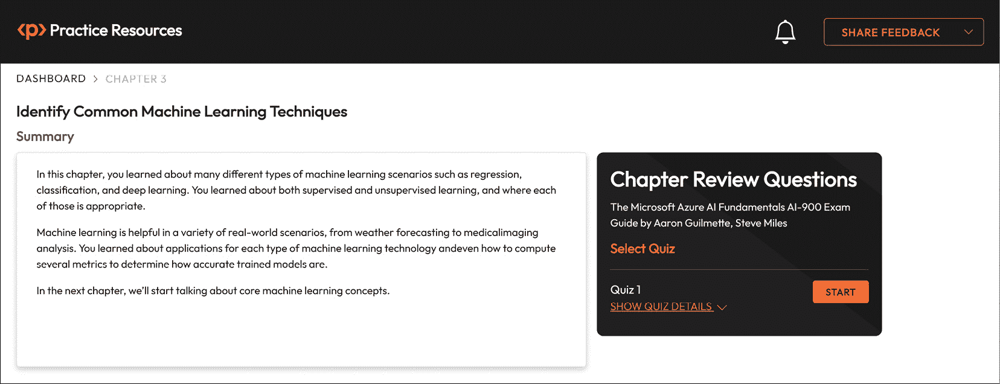

图 3.12 – 第三章的复习问题

1.  准备就绪后，开始以下练习，多次重新尝试测验。

## 考试准备练习

对于前三次尝试，不必担心时间限制。

### 尝试 1

第一次，目标至少是**40%**。查看你答错的答案，并再次阅读章节中的相关部分，以填补学习上的差距。

### 尝试 2

第二次，目标至少是**60%**。查看你答错的答案，并再次阅读章节中的相关部分，以修复任何剩余的学习差距。

### 尝试 3

第三次，目标至少是**75%**。一旦得分达到 75%或更高，你就可以开始练习计时了。

小贴士

你可能需要超过**三次**尝试才能达到 75%。这没关系。只需复习章节中的相关部分，直到你达到目标。

## 工作在计时上

你的目标是保持分数不变，同时尽可能快地回答这些问题。以下是你下一次尝试应该看起来像的例子：

| **尝试** | **分数** | **用时** |
| --- | --- | --- |
| 尝试 5 | 77% | 21 分钟 30 秒 |
| 尝试 6 | 78% | 18 分钟 34 秒 |
| 尝试 7 | 76% | 14 分钟 44 秒 |

表 3.10 – 在线平台上的样本计时练习

注意

上表中显示的时间限制只是示例。根据网站上的测验时间限制，为每次尝试设定自己的时间限制。

每次新的尝试，你的分数应保持在**75%**以上，而完成所需的时间“应减少”。直到你觉得自己能够应对时间压力，可以尝试尽可能多次。
