# 第五章：描述 Azure 机器学习功能

到目前为止，我们已经讨论了很多机器学习的基础概念，包括场景、模型、算法和训练数据。您已经看到了一些简单的机器学习示例。您甚至可能翻阅了大学统计学课程的知识来亲自解决这些示例。

**Azure 机器学习**（有时写作**Azure ML**或**AzureML**）是微软 Azure 服务中的一组，它将所有这些概念付诸实践。Azure ML 由一套工具组成，用于管理整个机器学习生命周期。Azure ML 被各种工程师、数据科学家和其他专业人士用于训练、构建和部署模型以及机器学习集成工作流程。

本章我们将涵盖以下目标和技能：

+   什么是 Azure ML？

+   描述自动化机器学习（**AutoML**）的功能

+   描述数据科学和机器学习的数据和计算服务

+   描述 Azure ML 中的模型管理和部署功能

+   在 Azure ML 中构建机器学习模型

到本章结束时，您应该能够描述 Azure ML 的特性、功能和支持服务。

让我们开始吧！

# 什么是 Azure ML？

在我们深入探讨 Azure 平台上的机器学习具体细节之前，让我们退一步，谈谈 Azure ML 的一些特性、功能和目标。

Azure ML 通过一系列全面的工具和功能增强了机器学习工作负载的能力和效率：

+   **集中式数据管理**：Azure ML 提供了一个统一的存储库来存储和管理数据集，便于在各个机器学习项目中轻松访问和重复使用。这种集中式存储支持模型训练和评估的高效数据处理，简化了数据准备过程。

+   **可扩展的计算资源**：Azure ML 提供针对机器学习任务定制的按需计算资源。用户可以利用这些资源运行广泛的机器学习作业，包括模型训练和批量推理，而无需进行前期硬件投资。这种灵活性允许根据任务的复杂性和规模进行成本效益的扩展。

+   **自动化机器学习**（**AutoML**）：AutoML 通过自动测试多种训练作业，使用不同的算法和超参数，简化了应用机器学习的流程。此功能帮助用户快速识别最适合其特定数据集的最有效模型，显著减少了模型选择和调优所需的时间和专业知识。

+   **编排管道和可视化工具**：Azure ML 包括直观的可视化工具，允许用户创建和管理编排工作流，即所谓的**管道**。这些管道自动化并简化了端到端的机器学习过程，从数据预处理和模型训练到部署和推理，确保可重复性和效率。

+   **框架集成**：该平台与流行的机器学习框架和工具无缝集成，例如**MLflow**、**TensorFlow**、**PyTorch**和**scikit-learn**。这种兼容性使得数据科学家和开发者能够在熟悉的环境中，使用熟悉的工具来管理机器学习模型的整个生命周期，从训练和评估到部署和监控，同时利用现有的代码和库。

+   **负责任的 AI 实践**：Azure ML 致力于负责任的 AI，通过提供内置的工具和功能来监控和评估 AI 伦理考量。这包括通过可解释性功能可视化模型性能，通过模型预测的可解释性来理解模型，以及评估模型的公平性，以确保 AI 系统是透明、公平和可问责的。

+   **工具和能力**：Azure ML 为所有经验水平的人提供了多种工具，使得机器学习变得触手可及。数据科学家和工程师可以通过 Python 的代码优先方法来利用这些工具，而对于编码和开发经验较少的人来说，可以使用基于网络的**Azure Machine Learning Studio**来管理机器学习资产。

这些功能共同使 Azure ML 成为一个全面且用户友好的平台，满足新手和经验丰富的机器学习实践者的需求，促进大规模机器学习模型的开发、部署和维护效率。

在下一节中，我们将开始关注 Azure 中 AutoML 的具体功能。

# 描述 AutoML 的能力

AutoML 是一种服务，它自动化了将机器学习应用于解决问题的过程。通过自动化机器学习过程中的各个步骤，包括数据**预处理**、特征选择、算法选择和超参数调整，它显著降低了生成模型所需复杂性和时间。

使用 AutoML，用户可以快速创建高质量的机器学习模型，同时保持完全的控制和透明度。该服务旨在满足机器学习新手和专家的需求。对于初学者，它通过抽象掉构建和调整机器学习模型中涉及到的许多复杂性来简化流程。对于专家，它提供了一个快速实验不同模型和参数的方法，节省了可以用于关注项目其他方面的时间。

什么是预处理？

预处理是在实际使用机器学习模型之前准备数据的概念。这可能涉及几个归一化过程和内容准备，例如将文本转换为用于自然语言处理的标记（块），或者使用你在上一章中学习到的关于特征选择和降维的一些技术。

使用 AutoML 的过程包括提供数据集并指定你感兴趣的指标或结果。然后，该服务自动预处理数据，选择合适的机器学习算法，并调整它们的超参数，以根据提供的数据和设置找到最佳可能的模型。在整个过程中，AutoML 会跟踪所有**实验**，提供详细的报告和指标，使用户能够了解不同模型的性能以及为什么选择某些模型。

什么是实验？

Azure ML 和 AutoML 中的实验是指运行一个或多个试验以训练和验证机器学习模型的过程。一个实验是一种容器对象，将所有与特定模型相关的资产分组在一起。它们用于系统地测试、跟踪和比较不同运行的输出，以确定最有效的配置。一个实验通常包含以下组件：

+   数据

+   算法和模型

+   参数和设置

+   运行

+   指标和输出

+   跟踪和比较

此外，AutoML 与其他 Azure 服务集成，使模型能够无缝部署到生产环境中，监控模型性能，并能够使用新数据保留模型。这种集成支持全面的机器学习生命周期，从数据准备到模型部署和管理。*图 5.1* 描述了 AutoML 流程的高层次概述：

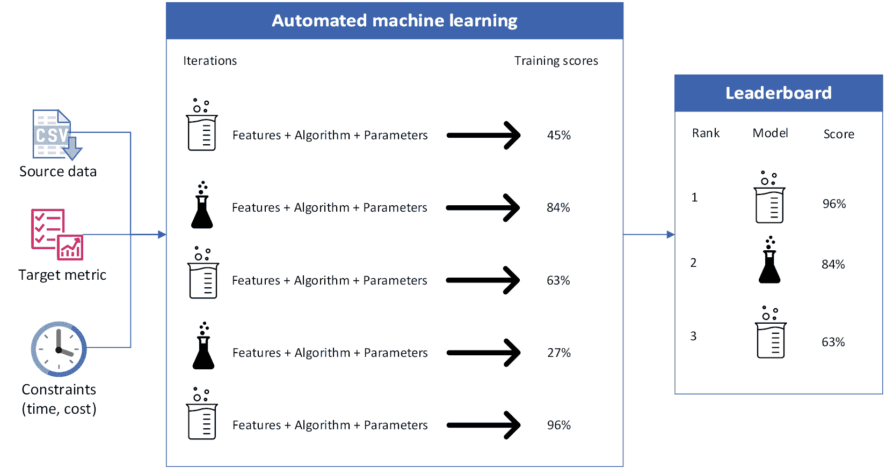

图 5.1 – AutoML 流程概述

AutoML 还允许你创建一个负责任的 AI 仪表板，以便你可以跟踪你遵守微软负责任的 AI 原则的情况（你可以在*第二章*，*确定负责任的 AI 的指导原则*）中了解到这些原则）。

## AutoML 用例

AutoML 在各种场景中都很有用，可以帮助数据科学领域的初学者创建和管理模型和数据管道。AutoML 的目标是简化整个机器学习体验，帮助数据科学家和工程师更多地关注结果而不是工具。本节从高层次上描述了 AutoML 可适用的模型类型和用例。

### 分类

分类是一种在机器学习中使用的监督学习方法，其中模型在标记数据上训练，然后将学到的模式应用于新的、未见过的数据。Azure ML 支持分类任务，并提供如深度神经网络文本**特征化器**等专用功能来增强模型性能。分类模型的目标是根据从训练数据集中获得的知识，准确预测新数据实例的类别或类别。分类模型的典型应用包括欺诈检测、手写识别和目标检测。

什么是特征化器？

特征化器是一个组件或技术，用于将原始数据转换为机器学习模型可以处理的形式。特征化器从内容中提取特征（因此得名），并以与训练过程兼容的方式表示它。特征化器还可以执行降维，以帮助简化或减少模型的复杂性，从而提高模型的表现力和效率。特征化器还可以帮助规范化数据或对缺失的数据元素进行异常处理。

### 回归

回归，就像分类一样，是一种受 Azure ML 支持的监督学习任务，专门用于预测数值结果。与预测分类结果的分类不同，回归模型基于独立变量预测连续数值。

回归旨在确定这些变量之间的关系，例如根据油耗和安全性评级等特征预测汽车的价格。Azure ML 为回归问题提供专门的特性化支持，并通过 AutoML 支持一系列算法来完成这些任务。

### 时间序列预测

Azure ML 中的 AutoML 可以用于生成高质量的时间序列预测，以满足各种商业需求，例如预测收入、库存水平、销售额或客户需求。这个过程将时间序列预测视为一个多元回归问题，其中使用过去值以及其他预测因子来提高预测的准确性。

与传统方法不同，这种方法可以结合多个上下文变量来理解它们之间的相互关系。AutoML 学习一个全面的模型，可以应用于数据集中的所有项目和预测范围，使得可以将预测推广到新的、未见过的序列，同时利用更大的数据池进行模型训练。

### 计算机视觉

Azure ML 提供了对计算机视觉任务的支持，使创建图像分类和目标检测模型成为可能。这允许与 Azure 的数据标注功能无缝集成，使用标注数据生成模型，并通过算法选择和超参数调整优化模型性能。用户可以下载或部署这些模型作为 Web 服务，并利用 Azure ML 的**机器学习操作**(**MLOps**)和 ML 管道功能有效地扩展操作。

### 自然语言处理（NLP）

Azure ML 中对 NLP 的支持提供了一个全面且用户友好的框架，用于开发、训练和部署针对文本数据定制的模型。这包括文本分类和命名实体识别等任务。

Azure ML 支持 NLP 模型训练的整个生命周期，从数据准备到模型部署。它利用最先进的深度神经网络方法，包括最新的预训练模型，如**双向编码器表示（来自 Transformer**）(**BERT**)，这些模型因其理解人类语言细微差别的高效性而闻名。

## 训练、验证和测试场景

Azure ML 中的 AutoML 允许您为机器学习模型训练提供训练数据，并让您指定要使用的模型验证类型。它将模型验证作为训练过程的一部分进行，使用验证数据调整模型的超参数以最佳地拟合训练数据。

然而，每次迭代使用相同的验证数据会引入模型评估偏差的风险，因为模型可能会对验证数据**过度拟合**。为了减轻这种风险，AutoML 允许在实验结束时使用单独的测试数据来评估它推荐的最终模型。在您的 AutoML 实验配置中提供测试数据确保推荐的模型被客观地测试，有助于确认最终模型中不存在偏差，并且其能够很好地泛化到之前未见过的数据。

## 特征工程

特征工程涉及根据领域知识从现有数据中创建新的特征（或变量），以提高机器学习算法的性能。在 Azure ML 中，这包括应用缩放和归一化技术，统称为**特征化**。

在 AutoML 实验中，特征化过程，如特征归一化、处理缺失数据和将文本转换为数值，是自动化的，但可以根据特定的数据需求进行调整。这不仅有助于增强模型学习，还有助于解决过度拟合和数据不平衡等问题。在模型训练期间包含的特征化步骤将在预测过程中自动应用于新的输入数据，确保结果的一致性和准确性。

## 集成模型

那么，在哪些场景下，使用多个模型可能会帮助更准确地预测呢？

AutoML 默认采用**集成**模型来增强预测性能和机器学习结果。集成学习通过结合多个模型形成一个单一预测，与依赖于单个模型的方案形成对比。在 AutoML 中，一个工作的最后阶段通常包括集成迭代。

该过程利用两种主要方法进行集成学习：

+   **投票**：这种方法使用来自不同模型的预测概率（在分类任务中）或目标值（在回归任务中）的加权平均值来做出预测。

+   **堆叠**：这种方法涉及结合各种模型，并使用一个元模型根据初始模型的输出进行预测。对于分类，LogisticRegression 作为默认的元模型，而 ElasticNet 用于回归和预测。

混合搭配，但不是那种方式

在 AutoML 中，集成模型专门用于分类或回归任务，但不会在同一个集成中混合。这意味着用于分类任务的集成将结合多个分类模型，而用于回归任务的集成将结合多个回归模型。

所使用的集成方法，如用于分类的投票和用于分类和回归的堆叠，都是针对相同类型的模型（所有分类器或所有回归器）定制的。这种方法的逻辑是，结合相同类型的模型确保在平均（在投票的情况下）或作为元模型的输入（在堆叠的情况下）的预测是兼容且有意义的。

另一个原因是一个集成模型不会在不同类型的模型之间混合搭配，是因为输出类型的不同（分类与连续），它们服务于不同的目的。分类器和回归器模型的指标和输出不同，导致兼容的数据集能够进行对比。换句话说，它们就像是苹果和橙子。

AutoML 采用**卡鲁阿纳集成选择算法**，以最高性能的前五个模型开始集成，前提是它们都在领先模型性能的 5%性能阈值内，以确保质量。每次迭代，都会在现有的集成中测试一个新的模型，如果它提高了整体性能，它就会被包括在集成中，从而增强整体的预测能力。

卡鲁阿纳集成选择算法是什么？

Caruana 集成选择算法是指由 Rich Caruana 及其同事开发的一种创建集成机器学习模型的方法。这种方法特别因其应用于集成学习而闻名，通过结合各种单个模型的优势来提高模型的预测性能。有关 Caruana 集成选择算法的更多信息，请参阅[`www.niculescu-mizil.org/papers/shotgun.icml04.revised.rev2.pdf`](http://www.niculescu-mizil.org/papers/shotgun.icml04.revised.rev2.pdf)。

让我们转换一下思路，看看支持 Azure 中机器学习的服务。

# 描述数据科学和机器学习的数据和计算服务

在 Azure 中处理机器学习时，了解您可以与之一起工作的资源类型、连接和元素非常重要。让我们来看看与机器学习工作负载相关的主要服务类型和资源。

## 计算

在 Azure ML 中，**计算**指的是为运行机器学习作业（如训练模型或运行实验）或托管服务端点而分配的计算资源或能力。这可以从**无服务器计算**（例如需要最小计算资源来执行命令的函数）到完全部署的服务器集群不等。

Azure ML 支持各种类型的计算资源，以满足不同的需求和场景。让我们来看看。

### 计算集群

这是一个可扩展的、托管的计算基础设施，使用户能够轻松设置一个配备 CPU 或 GPU 处理能力的虚拟机集群。计算集群非常适合在云中运行大规模机器学习实验和训练作业。它们提供了选择节点大小和数量的灵活性，使用户能够根据工作负载的要求进行资源扩展。

### 无服务器计算

对于可能不需要管理计算集群或管理成本过高的场景，Azure ML 提供了无服务器计算选项。这些选项允许用户执行机器学习任务，而无需担心底层基础设施，因为 Azure ML 自动管理计算生命周期、扩展和配置。

### 计算实例

这是一个完全配备流行数据科学和机器学习工具和框架的托管云开发环境。计算实例作为个人可定制的虚拟机，可用于开发、训练和测试机器学习模型。它们类似于传统虚拟机，但针对机器学习和数据科学工作流程进行了优化。

### Kubernetes 集群

对于在生产环境中部署和管理机器学习模型，Azure ML 支持与**Azure Kubernetes 服务**（**AKS**）的集成。用户可以直接从 Azure ML 工作区将训练好的模型部署到 AKS 集群。这种设置非常适合大规模、生产级的机器学习模型部署，提供了高级管理功能和可扩展性。

### 附加计算

Azure ML 还提供了将外部计算资源附加到 Azure ML 工作区的灵活性。这意味着用户可以利用他们现有的基础设施——如本地数据中心或其他云环境——用于训练和**推理**目的。附加的计算资源可以在 Azure ML 工作流中无缝使用，为 Azure ML 服务和外部环境之间提供桥梁。

通过提供一系列计算选项，Azure ML 确保用户可以为他们的特定机器学习任务选择最合适的计算资源，无论是模型开发、训练还是部署，从而优化性能和成本效益。

## 数据

数据是开发机器学习模型的最关键因素之一。

在 Azure ML 中，有效地管理和利用数据是配置和管理机器学习工作负载的关键方面。Azure ML 适应了广泛的数据类型和来源，使其适用于各种数据科学和机器学习项目。您可以在 Azure ML 中使用以下数据类型和来源：

+   `uri_folder`和`uri_file`类型通过允许 Azure ML 工作负载直接在执行作业的计算节点上挂载或下载内容，简化了对数据的访问。

+   `mltable`格式支持丰富的操作，包括过滤、转换和聚合，使其成为机器学习管道中预处理和特征工程的有力工具。*   **原语**：这些是构成更复杂数据结构的基本数据类型。Azure ML 支持多种原语类型，包括以下几种：

    +   **字符串**：文本数据，对于标签、类别以及任何形式的文本分析或操作都很有用。

    +   **布尔型**：表示真或假的值，常用于二元分类任务或标记记录，通常用 0（假）和 1（真）表示

    +   **数字**：数值数据，可以是整数或浮点数，对于机器学习中的大多数分析和统计操作至关重要

对于 Azure ML 中的大多数数据处理场景，通常使用 URI（`uri_folder`和`uri_file`）来精确指定存储解决方案中数据的位置。这种方法简化了将数据集成到机器学习工作流程的过程，因为您可以将数据位置轻松映射到计算资源的文件系统。无论数据需要作为驱动器挂载还是直接下载到计算节点，Azure ML 都提供灵活的选项，确保您的数据可以轻松访问，用于处理、训练和推理任务。

通过支持各种数据类型和来源，Azure ML 确保用户可以高效地管理和利用他们的数据，无论其格式或存储位置如何，从而促进其无缝集成到机器学习工作流程中。

## 数据存储

虽然术语“数据”指的是内容（包括其值和格式），但“数据存储”指的是该数据的位置。

在 Azure ML 中，数据存储在高效管理和访问数据方面发挥着至关重要的作用。Azure ML 中的数据存储本质上是一种安全的机制，用于存储连接到 Azure 上托管的数据存储服务的连接信息。这种设置确保敏感数据，如连接字符串或访问密钥，不会硬编码到您的脚本中，从而增强安全性并简化数据访问管理。

当使用 Azure ML 时，您可以**注册**（或连接）新的数据存储或管理现有的数据存储，以简化连接到各种 Azure 存储服务的过程。此注册过程封装了身份验证细节，允许您的机器学习脚本和工作流程无缝访问数据，而无需反复提供安全凭证。

注意

凭据也可以存储在 Azure Key Vault 中。

Azure ML 的**命令行界面**（**CLI**）v2 和**软件开发工具包**（**SDK**）v2 扩展了对各种基于云的存储服务的支持，使不同数据存储需求具有广泛的兼容性。以下服务受到支持：

+   **Azure Blob Storage 容器**：非常适合存储大量非结构化数据，如图像、文本文件或二进制数据，这些数据可用于机器学习实验和模型训练。

+   **Azure Files Share**：提供使用标准**服务器消息块**（**SMB**）协议的共享存储，适用于需要跨多个虚拟机或服务访问和共享文件的场景。

+   **Azure Data Lake Storage**（**ADLS**）：专为大数据分析设计，为大型数据集提供可扩展且安全的存储解决方案。ADLS 在分析场景中进行了性能优化，并支持细粒度的安全控制。

+   **Azure Data Lake Storage Gen2**：这项服务结合了 Azure Blob Storage 和 ADLS 的功能，提供了一种高度可扩展且成本效益高的存储解决方案，支持分析和高层次文件系统功能。

通过利用这些数据存储库，Azure ML 用户可以有效地管理其数据生命周期，从摄取和存储到训练和模型部署，确保在机器学习工作流程中正确的时间可以访问正确的数据。这种集成简化了连接到不同的 Azure 存储服务的流程，使数据科学家和 ML 从业者可以更多地专注于开发和改进他们的模型，而不是管理数据连接。

## 环境

在 Azure ML 中，环境是一个基本概念，因为它们充当软件依赖项、库和运行时上下文的容器，这些依赖项、库和上下文是运行机器学习模型和脚本所需的。这些环境确保您的机器学习工作流程可重复、可扩展，并且可以在不同的计算目标之间移植，从本地开发机器到基于云的计算资源。

有两种核心类型的环境：**精选**和**自定义**。精选环境由 Microsoft 定义、管理和更新，包括流行的机器学习框架和工具。另一方面，自定义环境是由用户构建的。要创建环境，您通常会使用以下功能：

+   Docker 镜像

+   带有 conda YAML 包管理的 Docker 镜像用于定制

+   Docker 构建上下文

用户可能会选择自定义环境，如果他们有特定的包依赖项或特定版本的库，或者如果他们需要遵守某些监管要求。

Azure ML 环境可以版本化和集中管理，允许数据科学家和开发人员一致地共享、复制和部署机器学习模型。一旦定义，环境可以在多个实验、管道和部署中重用，通过确保无论代码在哪里执行，运行时上下文都是相同的，从而最小化“在我的机器上工作”的问题。

可以通过 Azure Machine Learning Studio UI、CLI 或 SDK 创建和管理环境，这为您定义和操作机器学习上下文提供了灵活性。此外，Azure ML 提供了一个预构建环境的存储库，用于常见的机器学习任务和框架，让您可以快速开始项目，无需手动配置环境的每个方面。

## 模型

在 Azure ML 操作中，模型是机器学习训练过程的输出。模型是表示机器学习模型及其相关元数据的二进制文件。

## 工作区

在 Azure ML 中，工作区作为主要组织资源或容器，充当所有机器学习活动和成果的集中枢纽。它旨在通过提供一个统一的环境来简化开发、训练和部署机器学习模型的过程，数据科学家和开发人员可以在其中管理他们的项目、实验和资源。

工作空间包含了一系列对机器学习工作流程至关重要的元素：

+   **作业历史记录**：此元素维护了工作空间内执行的所有机器学习作业的详细记录，包括执行日志、性能指标、输出，甚至使用脚本快照。这些历史数据有助于分析和比较不同运行随时间的变化。

+   **资源管理**：工作空间组织并提供对各种 Azure 资源的便捷访问，这些资源在机器学习项目中得到利用，例如用于数据存储的数据存储库和用于处理及模型训练的计算资源。这种集中式管理简化了根据项目需求配置和扩展资源的任务。

+   **资产存储**：除了管理资源之外，工作空间还存储了在模型开发生命周期中创建的所有机器学习资产。这包括准备部署的训练模型、指定运行时上下文和依赖项的自定义环境、用于构建管道的可重用组件，以及数据资产，如数据集和数据转换。

+   **协作和版本控制**：作为共享环境，工作空间使得团队协作成为可能，允许多个用户共同工作于项目，共享资产，并贡献实验。它支持模型和环境等资产的版本控制，确保团队可以管理变更并在项目的不同阶段保持一致性。

+   **与 Azure 服务的集成**：工作空间与其他 Azure 服务深度融合，使得模型作为网络服务无缝部署、使用 Azure Pipelines 实施机器学习操作（MLOps）实践，以及使用 Azure Application Insights 监控已部署的模型成为可能。

Azure ML 工作空间可通过 Azure 门户、SDK 和 CLI 访问，为用户与其机器学习资源和资产交互提供了灵活性。通过将机器学习项目的所有方面封装在单个工作空间中，Azure ML 显著降低了管理机器学习生命周期的复杂性，并使数据科学家能够更多地专注于模型开发，而不是基础设施管理。

## 订阅

订阅是一个财务组件，它建立了 Azure 客户（您）与微软之间的关系。

## 存储账户

存储账户是一种资源，它为您提供了访问各种存储对象的能力，例如 blob、文件、队列和表。存储账户具有一个唯一的命名空间，可以通过 HTTP 或 HTTPS 访问。

## 密钥保管库

**Azure 密钥保管库**是一个安全的认证数据存储库（例如用户名和密码，通常称为**密钥**）。训练作业可能需要密钥来访问数据、计算或其他服务。

## 应用洞察

Application Insights 可以用于为您的模型提供日志记录和监控。这种集成允许您执行以下操作：

+   **监控您的机器学习模型**：一旦您的机器学习模型作为 Web 服务部署，Application Insights 可以用来监控其性能、可用性和使用情况。这包括跟踪模型被调用的频率、响应时间、成功率以及发生的任何失败或异常。

+   **记录自定义事件和指标**：您可以从您的机器学习模型中记录自定义事件、跟踪和指标到 Application Insights。这可以包括有关正在处理的数据、做出的预测以及与您的模型性能和用途相关的任何其他指标的详细信息。

+   **分析和可视化遥测数据**：Application Insights 提供了分析并可视化从您的机器学习服务中收集的遥测数据的工具。这可以帮助您了解您的模型是如何被使用的，识别其性能中的趋势或异常，并解决问题。

+   **设置警报**：您可以根据与您的机器学习服务相关的指标或事件在 Application Insights 中配置警报。这可以帮助您快速响应潜在问题，例如预测准确性的下降或响应时间的增加。

+   **使用实时指标流诊断问题**：Application Insights 的实时指标流提供了对您的机器学习服务性能和健康状况的实时可见性，使您能够在问题发生时进行诊断。

## 容器注册库

**Azure 容器注册库**是一个基于开源 Docker Registry 2.0 的托管、私有 Docker 注册库服务。它用于存储和管理在 Azure ML 中用于各种目的的容器镜像，例如训练和部署模型。

有了这些，让我们开始检查 Azure ML 中的一些整体模型管理和部署功能。

# 描述 Azure ML 中的模型管理和部署功能

如您在本章中已经看到的，Azure ML 具有很多功能——从开发到部署简单和复杂的机器学习模型。

在本节中，我们将探讨 Azure ML 中模型管理的三个不同（但相关）的领域：

+   模型管理

+   模型部署功能

+   机器学习操作

让我们逐一查看它们。

## 模型管理和部署功能

Azure ML 提供了强大的模型部署功能，允许数据科学家和开发者高效且大规模地使他们的机器学习模型投入运营。这些功能涵盖了各种部署目标，包括云、本地和边缘环境，并提供灵活性以满足广泛的运营需求。

在接下来的几页中，我们将查看 Azure ML 的关键部署功能。

### **部署目标**

根据您模型的大小以及您对不同类型基础设施的舒适度，您可以将 Azure ML 模型部署到各种目标，包括以下内容：

+   **Azure Kubernetes 服务**（**AKS**）：非常适合大规模生产部署，AKS 提供了一个支持高级场景（如自动缩放、A/B 测试和高可用性）的托管 Kubernetes 环境。如果您的部署涉及复杂的流程或需要与其他微服务或后端系统集成，AKS 提供了管理此类部署所需的基础设施和工具。当您需要部署需要自动缩放和高可用性的大规模、生产级机器学习模型时，请选择 AKS。

+   **Azure 容器实例**（**ACI**）：最适合低规模基于 CPU 的工作负载和开发/测试场景，ACI 提供了一种无需 Kubernetes 专业知识即可高效且简单的部署选项。选择 ACI 进行快速原型设计、测试和机器学习模型的开发，无需管理 Kubernetes 集群的开销。

+   **Azure 机器学习计算实例**：这对于批量评分场景或需要按计划或按需运行预测而不需要 Web 服务时非常有用。选择 Azure 机器学习计算实例，使用 Jupyter Notebooks 进行开发、实验和交互式探索数据集和模型。

+   **边缘设备**：对于需要低延迟预测或数据隐私是关注点的场景，可以使用 Azure IoT Edge 将模型部署到边缘设备。这允许进行本地模型推理，减少将数据发送回云端进行处理的必要性。在需要实时推理或网络连接有限或不稳定的情况下，选择边缘设备部署。

### 模型打包

Azure ML 将模型打包为 **Docker 容器**，可以在支持 Docker 容器的任何地方部署。容器包含支持模型所需的所有代码和支持工具。这种方法确保了在不同环境之间的一致性，并简化了部署过程，例如从开发到生产的迁移。

### 模型管理和版本控制

Azure ML 提供了一个中央存储库来存储和管理训练好的模型。您可以版本控制模型，跟踪其元数据，并从训练到退役管理其生命周期。

### 监控和诊断

一旦部署，Azure ML 提供了监控生产中模型健康和性能的工具。这包括数据漂移监控、应用洞察集成以进行遥测，以及日志功能以帮助诊断问题。

### 安全性和合规性

Azure ML 部署可以使用标准的 Azure 安全控制进行保护，包括使用虚拟网络的网络隔离、传输和静态加密，以及身份验证和授权控制。通过**Azure** **策略**（**AzPolicy**）也支持符合行业标准和管理法规。

进一步阅读

有关使用 AzPolicy 与 Azure ML 的更多信息，请访问[`learn.microsoft.com/en-us/azure/machine-learning/security-controls-policy`](https://learn.microsoft.com/en-us/azure/machine-learning/security-controls-policy)。

### 可扩展性和性能

根据部署目标，Azure ML 支持自动扩展，根据负载自动调整资源，确保您的部署能够高效地处理不同级别的需求。

### 与 MLOps 实践集成

部署功能旨在与**机器学习操作**（**MLOps**）实践无缝集成，支持机器学习模型的**持续集成和持续交付**（**CI/CD**）管道。这允许在强大的 DevOps 框架内自动进行模型训练、验证、部署和监控。

通过利用这些部署功能，组织可以简化将机器学习模型引入生产的过程，确保它们具有可扩展性、安全性并随着时间的推移而可维护。

## MLOps

**MLOps**是一套基于 DevOps 的操作原则，包括 CI/CD 的概念，旨在实现机器学习任务生命周期的运营化。

Azure MLOps 代表了一种将机器学习模型无缝且高效地集成到生产环境中的全面方法。随着机器学习技术的进步，创建能够提供精确预测的模型变得更加容易。然而，将这些模型从开发过渡到生产面临着独特的挑战，需要采用结构化的方法，结合人员、流程和技术，以有效地在企业中实施机器学习。

考虑这样一种情况：您已经开发了一个机器学习模型，在准确性方面超出了所有预期，并赢得了您组织利益相关者的赞誉。下一步是将此模型部署到实时环境中，这可能会带来不可预见的复杂性。在部署之前，组织必须建立一个框架，包括必要的治理、人员、工作流程和工具，以便在生产环境中有效地利用机器学习模型。

随着环境的发展，可能会有这样的情况：更新的模型在生产中优于现有的模型。将新模型引入实时环境时，需要考虑以下关键因素：

+   确保新模型的过渡不会干扰依赖于当前系统的持续业务运营。

+   鉴于监管要求，可能需要证明新模型做出的预测是合理的，或者如果由于新数据产生意外或偏颇的结果，需要完全重现模型。

+   由于数据的动态性，定期重新训练模型以保持其准确性至关重要。这需要指定个人或团队负责数据管理、监控模型性能、重新训练工作，并解决任何模型故障。

虽然 MLOps 的一些方面与传统 DevOps 实践相一致——例如实施单元和集成测试以及利用版本控制——但其他方面则是专门针对机器学习量身定制的：

+   促进持续实验和与现有模型的基准测试

+   监测输入数据的变化以识别数据漂移

+   自动化模型重新训练流程并建立快速恢复的回滚机制

+   开发和维护可扩展的数据管道，用于训练模型和执行预测

MLOps 的精髓在于弥合开发阶段和运营部署之间的差距，从而加速向最终用户交付价值。这一转变要求重新评估传统的开发和部署策略，以更好地适应机器学习应用的敏捷性。

作为 MLOps 的一部分监控模型有助于检测**漂移**（随着时间的推移数据的变化导致模型偏差）。通过**适应**过程克服漂移——基于更新的数据定期重新训练模型。

重要的是要认识到，MLOps 的需求在不同组织之间可能存在显著差异。为大型、全球性公司设计的 MLOps 架构可能与小型、新兴公司的设置大相径庭。组织通常从适度倡议开始，随着经验、模型组合和运营成熟度的提高，逐步扩展其 MLOps 能力。

在下一节中，你将通过创建自己的机器学习模型来将所学的一些内容付诸实践。

# 在 Azure ML 中构建机器学习模型

在*第三章*《识别常见的机器学习技术》中，你学习了机器学习工作原理背后的核心思想（包括模型名称、示例算法和验证的基本知识）。

在本节中，我们将从理论转向实践，在 Azure ML 中创建一个机器学习模型！

前提条件

要完成这个练习，你需要一个 Azure 订阅（无论是试用还是付费），这样你就可以配置和访问 Azure 资源。你可以在[`azure.microsoft.com/en-us/pricing/offers/ms-azr-0044p/`](https://azure.microsoft.com/en-us/pricing/offers/ms-azr-0044p/)注册 Azure 信用额度。

## 创建机器学习工作区

一旦你在环境中启用了 Azure 服务，请按照以下步骤配置服务和设置模型：

1.  导航到 Azure 门户([`portal.azure.com`](https://portal.azure.com))并登录。

1.  在**Azure 服务**下，点击**创建****资源**。

1.  使用文本`机器学习`进行筛选，在**Azure 机器学习**下选择**创建**，然后选择**Azure 机器学习**，如图*图 5**.2*所示：

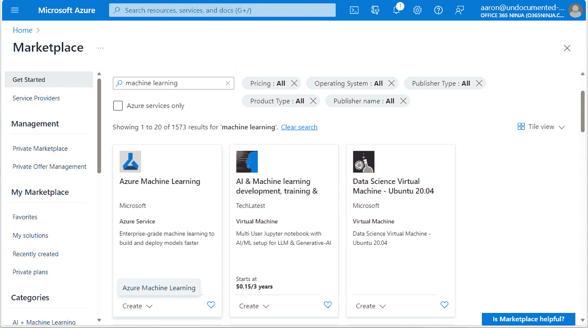

图 5.2 – 创建 Azure ML 资源

1.  在**创建机器学习工作区**页面，选择一个**订阅**选项。同时，选择一个现有的**资源组**（或者**创建**一个新的）。

1.  在**工作区详情**下，为工作区输入一个**名称**值并选择一个**区域**选项。你可以保留其余设置不变。见图*图 5**.3*：

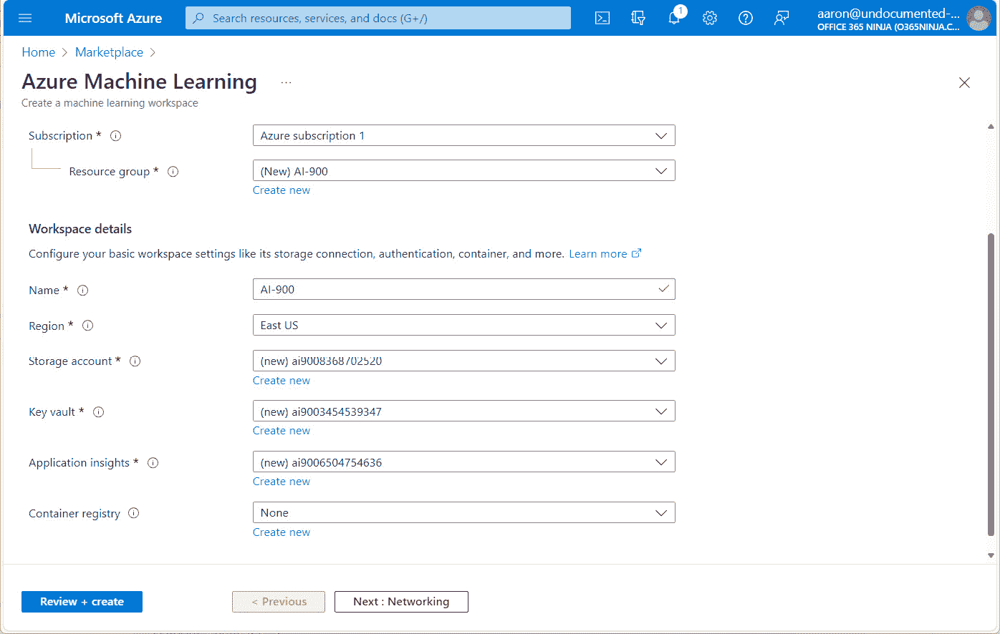

图 5.3 – 创建机器学习工作区

1.  点击**审查+创建**，然后点击**创建**。

1.  点击**转到资源**（或者打开一个新的浏览器标签页并导航到[`ml.azure.com`](https://ml.azure.com)以启动 Azure 机器学习工作室），然后选择你部署的新工作区名称）。

现在你已经创建了一个工作区，是时候开始使用 AutoML 工作了！

## 使用 AutoML 训练模型

在本节中，你将开始在 Azure 机器学习工作室内部进行模型训练。

样本数据集

你可以在互联网上找到适合 Azure ML 的样本数据集。Kaggle([`www.kaggle.com`](https://www.kaggle.com))包含近 300,000 个数据集，并且不断更新。其他数据来源还包括 OpenML([`openml.orgv`](https://openml.orgv))、卡内基梅隆大学([`guides.library.cmu.edu/machine-learning/datasets`](https://guides.library.cmu.edu/machine-learning/datasets))和 UCI 机器学习存储库([`archive.ics.uci.edu/`](https://archive.ics.uci.edu/))。许多数据集都包含有关它们适合哪些类型的模型或场景的信息（例如二元分类或回归），因此在选择数据集时，你需要相应地配置 AutoML 作业的参数。

在这个例子中，我们将使用一个基于从传感器读数捕获的几个指标预测发动机健康的数据集，尽管你可以使用任何数据集。你可以从这个章节的 GitHub 存储库中下载该数据集：[`github.com/PacktPublishing/Microsoft-Azure-AI-Fundamentals-AI-900-Exam-Guide`](https://github.com/PacktPublishing/Microsoft-Azure-AI-Fundamentals-AI-900-Exam-Guide)。

让我们开始吧：

注意

微软还提供了一个样本数据集，可在[`aka.ms/bike-rentals`](https://aka.ms/bike-rentals)找到，可用于此回归任务。

1.  从 Azure 机器学习工作室，在**创作**下选择**自动化机器学习**：

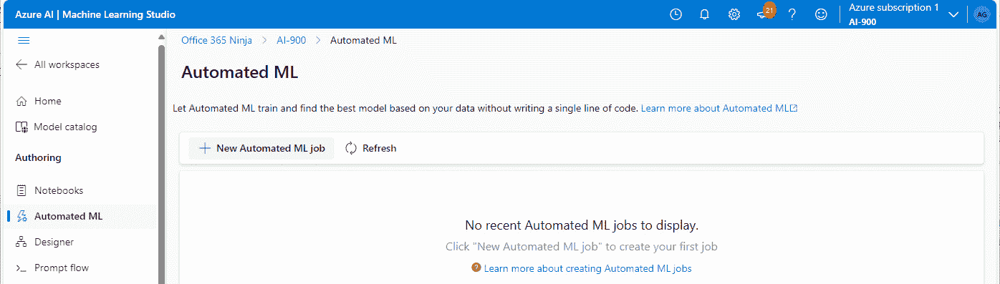

图 5.4 – 选择自动化机器学习

1.  点击**新建自动化****机器学习作业**。

1.  在**基本设置**页面上，输入**作业名称**和**新实验名称**值（或接受默认值）。点击**下一步**：

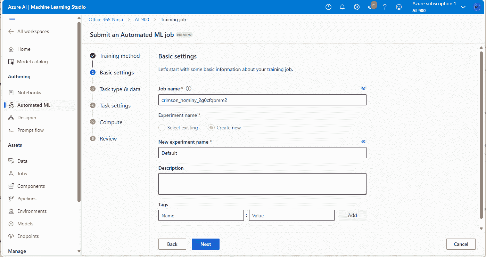

图 5.5 – 配置基本设置页面

1.  如果你使用的是引擎健康数据集，将**选择任务类型**设置为**分类**。如果你使用的是微软提供的自行车租赁数据集，选择**回归**作为任务类型。

1.  在**选择数据**下，点击**创建**：

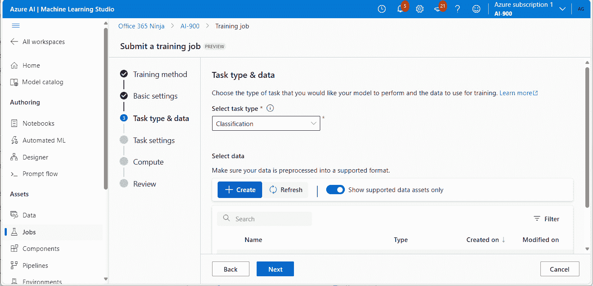

图 5.6 – 配置任务的类型和数据

1.  在**数据类型**页面上，输入**名称**和**类型**值。在这种情况下，源数据将是一个 CSV 文件，因此你可以选择**表格**作为**类型**并点击**下一步**：

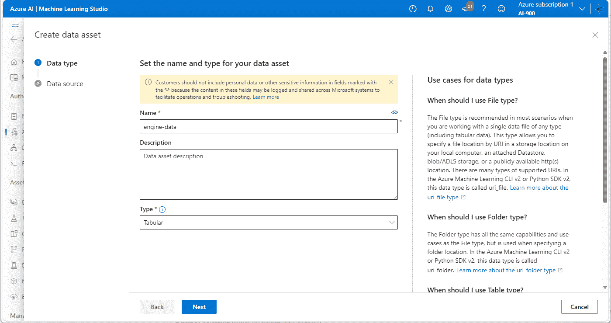

图 5.7 – 配置数据资产

1.  在**数据源**页面上，选择一个源位置。如果你已经将数据集下载到本地计算机，你可以选择**从本地文件**。如果你有一个启用 HTTP 的端点，其中存储着你的表格数据，选择**从网络文件**。选择你的数据集的源后，点击**下一步**：

    1.  如果你选择了**从网络文件**作为数据源位置，输入数据存储的 URL。

    1.  如果你选择了**从本地文件**，选择**Azure Blob 存储**作为**数据存储类型**并点击**下一步**。见*图 5**.8*：

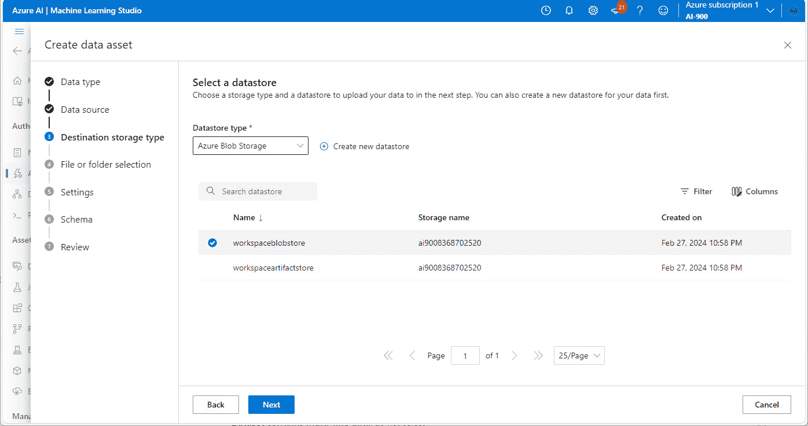

图 5.8 – 选择数据存储位置

1.  如果你选择了**从本地文件**作为数据源，点击**上传文件或文件夹**并浏览到你的源数据所在的位置。完成操作后，点击**下一步**。

1.  一旦数据被导入，你将有机会对其进行审查。Azure ML 将自动检测数据的格式，因此你需要确保它是正确的。点击**下一步**继续：

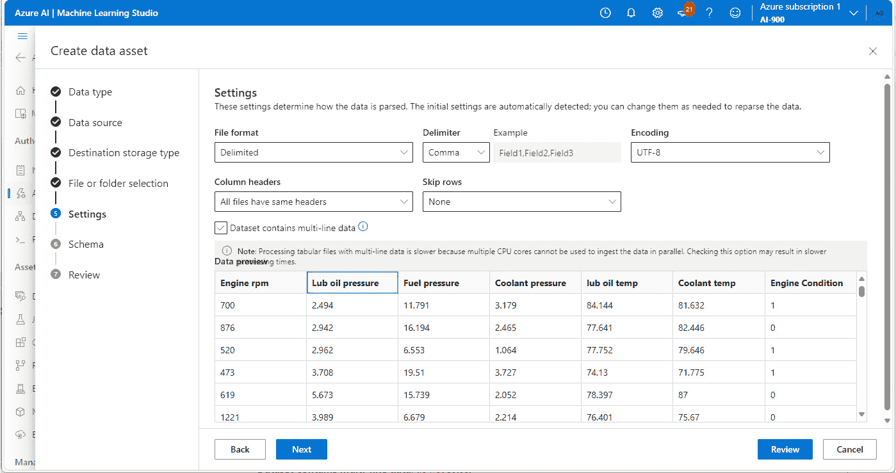

图 5.9 – 查看导入的数据

1.  在**模式**页面上，点击**下一步**。

1.  在**审查**页面上，点击**创建**。

1.  一旦创建数据集，选择数据集并点击**下一步**以提交 AutoML 作业。见*图 5**.10*：

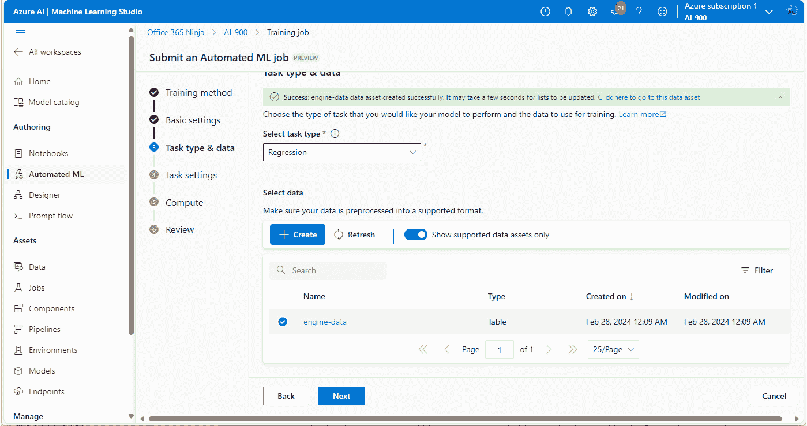

图 5.10 – 选择数据集

1.  在**任务设置**页面上，选择一个**目标列**值。这是你要预测的标签。对于这个例子，选择**引擎状况**。如果你使用的是微软提供的自行车租赁数据集，选择**租赁**，因为这是你试图预测的值：

图 5.11 – 配置目标列

1.  选择**查看更多配置设置**。在**附加配置**弹出窗口中，配置以下设置：

    1.  如果您正在使用引擎健康数据集，在**主指标**下选择**AUCWeighted**。

    1.  如果您正在使用自行车租赁数据集，在**主指标**下选择**NormalizedRootMeanSquaredError**。

1.  取消选择**使用所有支持的模型**复选框，并选择可能最适合您的数据类型的模型（您可以选择默认选项，但这将需要更长时间来遍历每个模型）。如果您的数据源有推荐的模型类型，请选择那些：

    1.  对于引擎健康模型，选择**LogisticRegresion**、**DecisionTree**、**RandomForest**、**KNN**和**LightGBM**。

    1.  对于微软提供的自行车租赁模型，选择**RandomForest**和**LightGBM**：

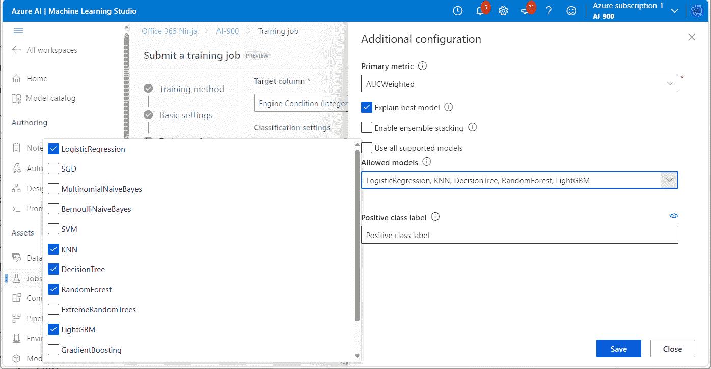

图 5.12 – 配置附加作业参数

进一步阅读

有关哪些主指标选择可能最适合您的模型的信息，请参阅[`learn.microsoft.com/en-us/azure/machine-learning/how-to-configure-auto-train?view=azureml-api-2&tabs=python#supported-algorithms`](https://learn.microsoft.com/en-us/azure/machine-learning/how-to-configure-auto-train?view=azureml-api-2&tabs=python#supported-algorithms)。

1.  点击**保存**。

1.  在**限制**下，配置以下值：

    **最大尝试次数**：3

    **最大并发尝试次数**：3

    **最大节点数**：3

    **指标分数阈值**：0.085

    **实验超时**：45 分钟

    **迭代超时**：30 分钟

    **启用早期终止**：已选择

1.  在**验证和测试**下，配置以下值：

    **验证类型**：训练-验证拆分

    **数据验证百分比**：10

    **测试数据**：无

1.  点击**下一步**。

1.  在**计算**页面，配置以下值：

    **选择计算类型**：无服务器

    **虚拟机类型**：CPU

    **虚拟机层级**：专用

    **虚拟机大小**：推荐使用 Standard_DS3_v2，尽管您可以使用任何

    **实例数量**：1

1.  点击**下一步**：

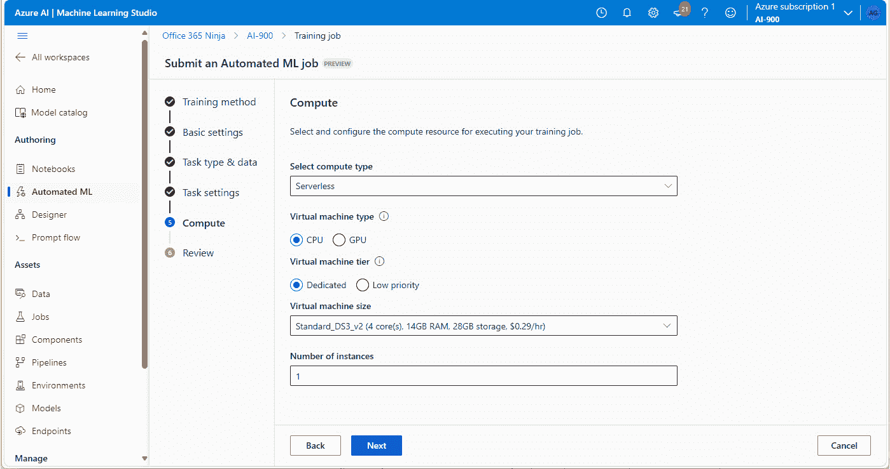

图 5.13 – 配置计算设置

1.  在**审查**页面，点击**提交训练作业**。

作业将自动提交并启动。作业提交后，您可以刷新**作业**页面以查看其当前状态，如图*图 5.14*所示：

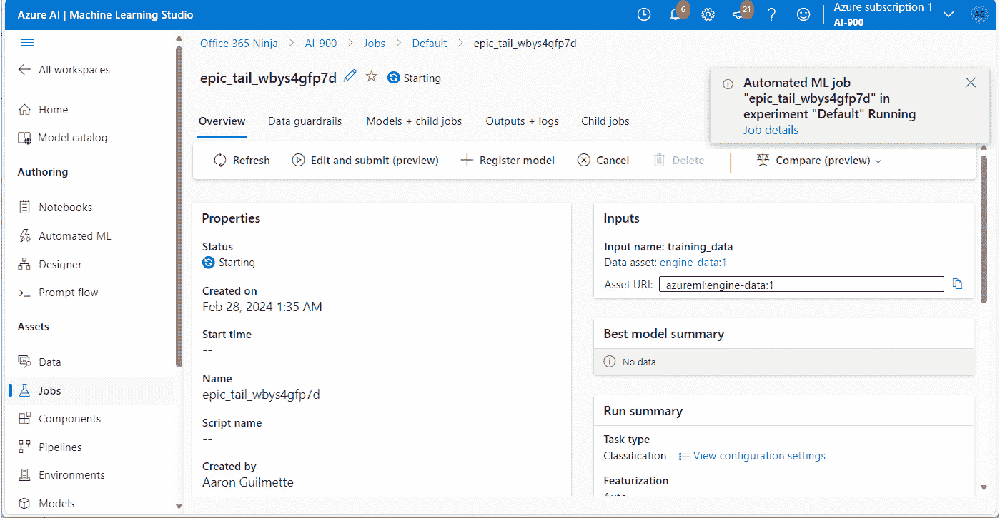

图 5.14 – AutoML 作业状态

## 审查和选择最佳模型

模型训练完成后，在**概述**选项卡中向下滚动以查看**最佳模型摘要**区域。见图*图 5.15*：

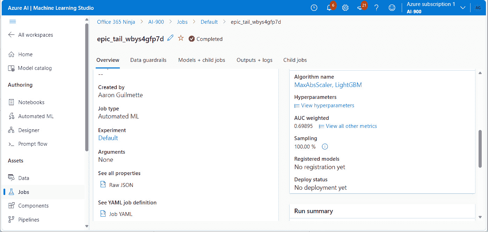

图 5.15 – 审查训练信息

选择**算法名称**的值，然后选择**指标**选项卡以查看模型的性能细节：

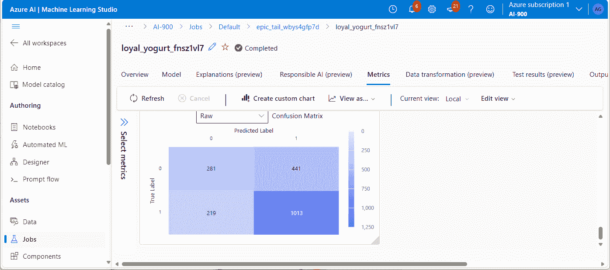

图 5.16 – 查看模型指标

## 部署和测试模型

模型训练完成并选择了最佳算法后，你可以部署它。为此，请按照以下步骤操作：

1.  在 Azure Machine Learning Studio 中，导航到最佳训练模型的**模型**标签页。

1.  点击**部署**并选择**Web 服务**：

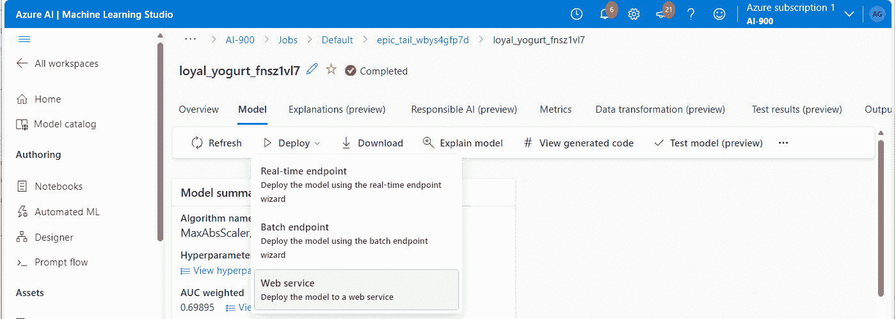

图 5.17 – 部署模型

1.  在**部署模型**弹出窗口中，输入**名称**和**描述**值。

1.  在**计算类型**下，选择**Azure** **容器实例**。

1.  滚动到弹出窗口的底部并点击**部署**。

模型将以 Web 服务的形式部署。根据数据集的大小和模型类型，可能需要 5-10 分钟。

## 测试已部署的模型服务

一旦模型部署完成，你可以手动提交测试数据以查看其预测可能是什么。要提交测试，请按照以下步骤操作：

1.  在你配置的工作区内部，选择**端点**。

1.  在**实时端点**下，选择你作为 Web 服务配置的端点。

1.  选择**测试**标签页。

1.  选择**表单编辑器**单选按钮以在网页表单中输入数据值，或选择**JSON 编辑器**单选按钮以更新预配置 JSON 数组中的测试值。根据你的数据集和模型类型，你可能只能看到 JSON 编辑器。

1.  为显示的每个特征填写测试输入。

    1.  **引擎健康模型**：为**Engine RPM**、**Lub oil pressure**、**Fuel pressure**、**Coolant pressure**、**Lub oil temp**和**Coolant temp**指定值。点击**测试**并查看**测试结果**下的值。显示**int 1**的**结果**表示发动机可能健康，而显示**int 0**的**结果**表示发动机可能不健康：

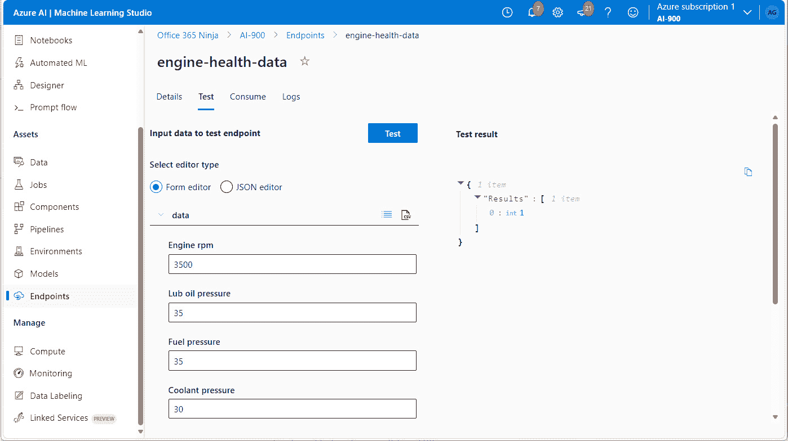

图 5.18 – 测试分类模型

1.  **自行车租赁模型**：为**day**、**mnth**、**year**、**season**、**holiday**、**weekday**、**working day**、**weathersit**、**temp**、**atemp**、**hum**和**windspeed**指定数值。点击**测试**并查看**测试结果**下的值。**结果**应显示一个整数，预测预测的自行车租赁数量。

恭喜！你已经训练了机器学习模型，帮助根据训练数据预测结果！你可以继续探索其他模型和数据集，看看你能发现哪些见解。

## 拆卸

当你完成对 Azure ML 和 AutoML 的探索后，你可以删除 Azure 中配置的资源，以避免产生不想要的 Azure 服务费用。为此，请按照以下步骤操作：

1.  在 Azure Machine Learning Studio 中，在**端点**标签页上，选择你已发布的任何端点。

1.  点击**删除**，然后确认删除。

1.  点击**主页**，然后点击**工作区**。

1.  导航到 Azure 门户 ([`portal.azure.com`](https://portal.azure.com)) 并搜索 `资源组`。

1.  选择您在创建 Azure ML 工作区时指定的资源组。

1.  点击 **删除资源组**，输入资源组的名称以确认您想要删除它，然后点击 **删除**。

因此，您的资源将被取消分配。

# 概述

在本章中，您学习了 Azure ML 和 AutoML 的功能和能力。您学习了用于支持 Azure ML 的数据和计算服务以及组件，例如计算集群、模型、工作区和存储账户。

您还学习了 Azure ML 的模型管理和部署功能，以及围绕 MLOps 的概念。

最后，您学习了如何部署 Azure ML 模型，用示例数据训练它们，然后对它们进行测试。

在下一章中，您将开始探索计算机视觉解决方案。

# 考试准备练习 – 章节复习题

除了对关键概念有扎实的理解外，在时间压力下快速思考的能力是帮助您通过认证考试的关键技能。这就是为什么在您的学习旅程早期就培养这些技能至关重要。

章节复习题旨在通过您学习的每个章节逐步提高您的应试技巧，同时复习章节中的关键概念。您将在每个章节的末尾找到这些复习题。

在继续之前

如果您没有 Packt 图书馆订阅或未从 Packt 商店购买此书，您将需要解锁在线资源以访问考试准备练习。解锁是免费的，并且只需进行一次。要了解如何操作，请参阅名为 *第十二章* 的章节，*访问在线资源*。

要打开本章的章节复习题，请执行以下步骤：

1.  点击链接 – [`packt.link/AI-900_CH05`](https://packt.link/AI-900_CH05)。

    或者，您可以扫描以下二维码 (*图 5.19*)：

图 5.19 – 为已登录用户打开章节复习题的二维码

1.  登录后，您将看到类似于 *图 5.20* 所示的页面：

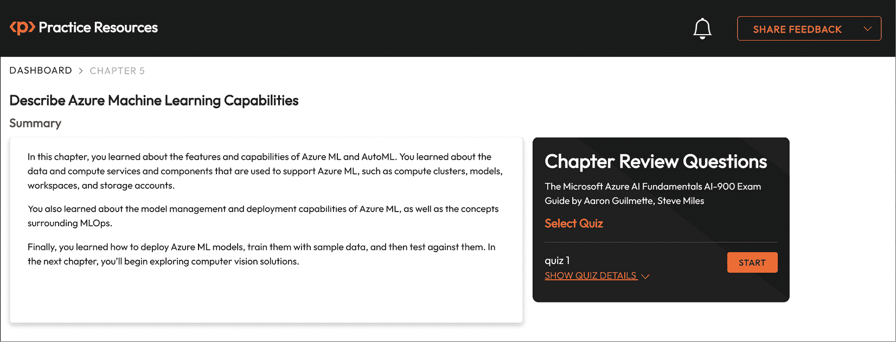

图 5.20 – 第五章的章节复习题

1.  准备就绪后，开始以下练习，多次尝试测验。

## 考试准备练习

对于前三次尝试，不必担心时间限制。

### 尝试 1

第一次尝试至少达到 **40%**。查看您答错的答案，并再次阅读章节中相关的部分以修复您的学习差距。

### 尝试 2

第二次尝试，目标至少达到**60%**。查看你答错的答案，并再次阅读章节中的相关部分，以修复任何剩余的学习差距。

### 尝试 3

第三次尝试，目标至少达到**75%**。一旦得分达到 75% 或更高，你就可以开始练习计时。

小贴士

你可能需要超过**三次**尝试才能达到 75%。这没关系。只需复习章节中的相关部分，直到你达到目标。

## 练习计时

你的目标是保持得分不变，同时尽可能快地回答这些问题。以下是你下一次尝试的示例：

| **尝试** | **得分** | **用时** |
| --- | --- | --- |
| 尝试 5 | 77% | 21 分 30 秒 |
| 尝试 6 | 78% | 18 分 34 秒 |
| 尝试 7 | 76% | 14 分 44 秒 |

表 5.1 – 在线平台上的样本计时练习

注意

上表中显示的时间限制只是示例。根据网站上的测验时间限制，为每次尝试设定自己的时间限制。

每次新的尝试，你的得分应保持在**75%**以上，而完成所需的时间应“减少”。重复尝试，直到你对自己应对时间压力的信心增强。

# 第三部分：描述 Azure 上计算机视觉工作负载的特点

在这部分，你将开始探索**计算机视觉**——允许计算机查看图像并识别对象和文本的概念和技术。

这部分包括以下章节：

+   *第六章*，*识别常见的计算机视觉解决方案类型*

+   *第七章*，*识别用于计算机视觉任务的 Azure 工具和服务*
