# 第六章：识别计算机视觉解决方案的常见类型

在*第五章* *描述 Azure 机器学习功能*中，你学习了如何描述自动化机器学习（AutoML）、数据科学和机器学习（ML）的数据和计算服务，以及 Azure 机器学习中的模型管理和部署功能。

在本章中，你将了解可用于解决计算机视觉（CV）领域的人工智能（AI）问题的 Azure 解决方案，该领域包括从图像和视频等数字源（如图像和视频）的像素值中操纵、分析、解释和提取信息和理解。

这部分内容需要一些对机器学习原理的理解；如果你直接跳到本章，并且对机器学习（ML）是新手或者只是想复习一些现有知识，那么在继续本章之前，你可以参考*第二部分 – 在 Azure 上描述机器学习的基本原理*作为 ML 入门。

计算机视觉（CV）解决方案可以提供*预构建*和*可定制*的机器学习（ML）模型，开发者可以使用这些模型来增强他们的应用程序、软件和服务。

本章我们将涵盖的目标和技能包括以下内容：

+   计算机视觉解决方案简介

+   识别图像分类解决方案的特征

+   识别对象检测解决方案的特征

+   识别光学字符识别（OCR）解决方案的特征

+   识别面部检测和面部分析解决方案的特征

到本章结束时，你应该了解检测和分析图像、对象、光学字符和面部解决方案的特征。

# 计算机视觉解决方案简介

计算机视觉（CV）解决方案的目标是从图像中获得洞察力、意义和理解；也就是说，图像在告诉我什么信息？

## 图像处理

计算机视觉（CV）的能力建立在通过其**像素值**对图像进行**解释**、**理解**和**操纵**的概念之上；当计算机查看图像时，它们看到的是一系列**数值像素值**。

这种图像的计算机处理在*图 6.1*中得到了说明，它展示了胡椒 oni 披萨切片（我的个人最爱；不允许有菠萝）在计算机眼中的样子：

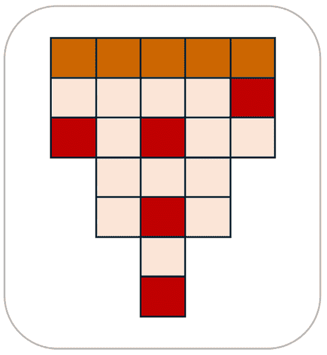

图 6.1 – 计算机如何显示图像

图像被视为**像素数组**，*图 6.1*中的数组由**7 行**和**5 列**组成；因此，*图像分辨率*表示为**7 x 5**。彩色图像数组中的每个像素都有一个**数值像素值**，它代表**RGB 通道**（*层*）；对于灰度图像，像素值将用不同深度的灰色表示，每个灰度值介于*255*（白色像素）和*0*（黑色像素）之间。

通过使用**过滤器**来改变像素值，以执行图像处理操作以创建视觉效果。

有许多过滤器，以下是一些：

+   模糊

+   色彩反转

+   边缘检测

+   锐化

这种图像过滤器操作是通过**卷积**（移动或传递）过滤器到图像上进行的，这为图像提供了新的值数组，这将操纵（改变/修改）RGB 层像素值。这提供了一个与原始图像不同的转换图像；这是在智能手机或图像编辑软件上的数字照片编辑中常见的用例。

你可以在*图 6**.2*中看到这一点：

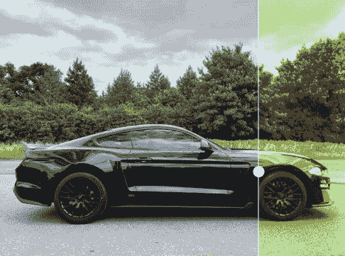

图 6.2 – 图像过滤器操作示例

在这张图像中，一个简单的过滤器被应用于图像的一部分，这改变了过滤器经过的受影响像素。

## CV ML

在大量图像上训练的 ML 模型使我们能够提取可操作的信息或提供意义。这可以从*图 6**.3*中更好地理解，它展示了通过从图像返回相关**标签**来提供*描述性信息*的简单示例：

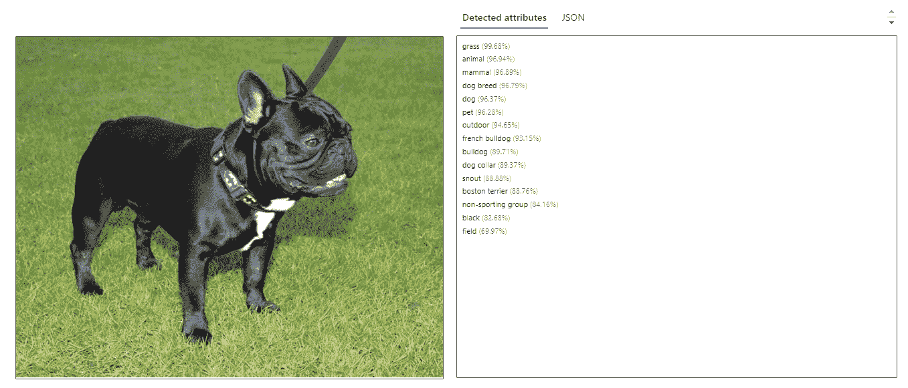

图 6.3 – 使用 CV 提供的图像分析信息

在*图 6**.3*中，可以看到检测到的属性在 JSON 输出中，例如将图像识别为`dog`和品种为`french bulldog`，以及置信度评分。

以下是对应的 API 的 JSON 响应，用于*图 6**.3*中的目标检测：

```py
{ "aim-request-id": "3800844f-2eb1-4abf-9cb3-d8f055e247f0",
  "content-length": "867",
  "content-type": "application/json; charset=utf-8",
  "modelVersion": "2023-10-01",
  "metadata": {
    "width": 720,
    "height": 576
  },
  "tagsResult": {
    "values": [
      {
        "name": "grass",
        "confidence": 0.996832013130188
      },
      {
        "name": "animal",
        "confidence": 0.9693894386291504
      },
      {
        "name": "mammal",
        "confidence": 0.9689017534255981
      },
      {
        "name": "dog breed",
        "confidence": 0.9679374694824219
      },
      {
        "name": "dog",
        "confidence": 0.9637042880058289
      },
      {
        "name": "pet",
        "confidence": 0.9628428220748901
      },
      {
        "name": "outdoor",
        "confidence": 0.9465276002883911
      },
      {
        "name": "bulldog",
        "confidence": 0.8970986008644104
      },
      {
        "name": "dog collar",
        "confidence": 0.8937236070632935
      },
      {
        "name": "snout",
        "confidence": 0.888845682144165
      },
      {
        "name": "black",
        "confidence": 0.8267985582351685
      },
    ]
  }
}
```

可以使用**预训练**和**自定义模型**进行图像分析；自定义视觉模型会在你希望使用自己的图像库而不是与预训练模型一起使用的图像数据集来训练模型时使用。

用于 CV 任务的基础模型是**Microsoft Florence 模型**。它在大量带有标题的互联网图像上进行了预训练，以构建可用于图像分析任务（如下所述）的模型：

+   **图像分类**：这是识别图像类别的功能；可以在照片中检测对象和人，以及有多少出现

+   **目标检测**：这是在图像、照片或视频中识别对象位置的能力；可以检测位置

+   **标题生成**：这是为图像中出现的所有内容生成人类可读描述的能力，例如照片

+   **标记**：这是生成可以与图像的检测属性相关联的标签列表的能力

+   **光学字符识别**：这是从**文档**中提取印刷或手写文本的能力，例如表格、发票、费用收据和**图像**，这可能包括车牌、街道标志、产品品牌标签、电影海报上的名字等等

**图 6.4**表示之前列出的 CV 任务如何使用从**微软佛罗伦萨****基础模型**构建的**自适应模型**：

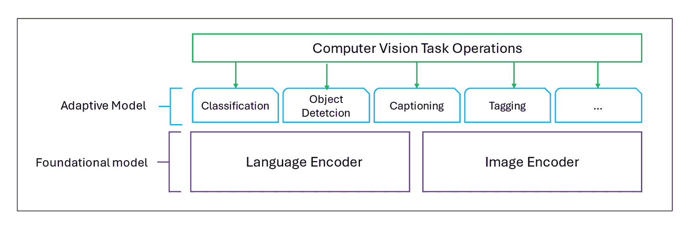

图 6.4 – 微软佛罗伦萨多模态图像数据模型

这`像素值`提取图像的特征。

你可以通过以下网址了解更多关于**佛罗伦萨项目**的信息：https://www.microsoft.com/en-us/research/project/projectflorence/

在本章的第一节中，你被介绍了计算机视觉（CV）的概念。然后你学习了微软佛罗伦萨模型及其作为 CV 任务基础模型的使用方法。在接下来的几节中，你将学习如何识别 CV 解决方案的特征。

# 识别图像分类解决方案的特征

Azure Machine Learning 的计算机视觉能力可以用作图像分类的解决方案。

**CV**包括可以解释信息和从静态和流媒体图像中提供理解的 API，并允许进行进一步的处理和分析。

**图像分类**指的是根据预定义的**类别**或**分类**将图像或子区域分组为组的过程；它解决了“这张图片里有什么？”的问题。

**图 6.4.5**展示了图像分类的一个示例：

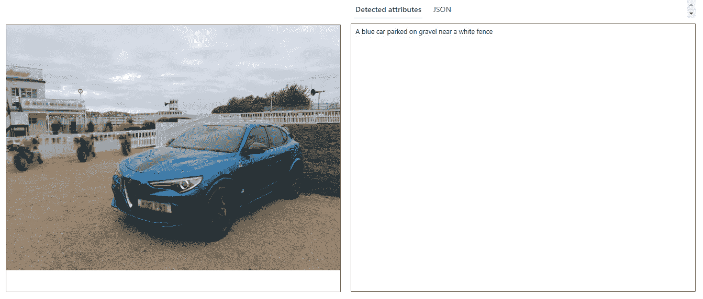

图 6.5 – 被分类为汽车的图像

以下是从**图 6.4.5**中提取的相应 API 的 JSON 响应的图像分类部分：

```py
{
  "aim-request-id": "0df7e99e-29e4-48ea-a11e-c66bec449dd9",
  "content-length": "174",
  "content-type": "application/json; charset=utf-8",
  "modelVersion": "2023-10-01",
  "captionResult": {
    "text": "a blue car parked on gravel near a white fence",
    "confidence": 0.737828254699707
  },
  "metadata": {
    "width": 1420,
    "height": 1047
  }
}
```

从这个 JSON 输出中，你可以看到为这张图像返回的“标题”结果以及置信度评分。请注意，没有“位置”坐标；这将在**识别目标检测解决方案的特征**部分中介绍。

你可以训练一个机器学习模型来识别显示的哪种**类型**的**交通**类别，例如**汽车**、**公交车**和**自行车**。另一个例子可以是识别**类型**的**动物**，例如**鸟**、**猫**、**狗**或**马**，或者识别动物的物种。

应该注意的是，可以使用**监督机器学习（SML**）模型来预测**类别**。

基于分组特征的**无监督机器学习（UML**）**聚类**模型不适用于此用例；同样，**回归**模型也不适用，因为该模型将用于任何类型的**数值**估计。

**用例**：在需要知道图像中是否包含动物、建筑物、人物等情况的场景中，这可能很有用；识别植物或鸟类的种类也可以是图像分析的一个用例。

本节探讨了使用计算机视觉（CV）识别图像分类解决方案的特征。在下一节中，你将学习如何识别目标检测解决方案的特征。

# 识别目标检测解决方案的特征

Azure Machine Learning 的计算机视觉能力可以用作目标检测的解决方案。

在上一节中，你学习了带有置信度评分的`标签`信息。

虽然图像的**分类**和**检测**具有共同的目标，即分析和解释图像内容，但区别在于返回的细节量；除了分类提供的描述图像的分类和标题标签外，标签信息还有一个表示检测到的对象置信度的百分比值。

注意

我们将在*第七章*“识别用于计算机视觉任务的 Azure 工具和服务”中，更详细地查看使用**Azure AI 视觉服务**和**Azure 视觉工作室**返回的对象检测 API 操作信息的示例。

你可以在*图 6.6*中看到一个简单的对象检测场景：

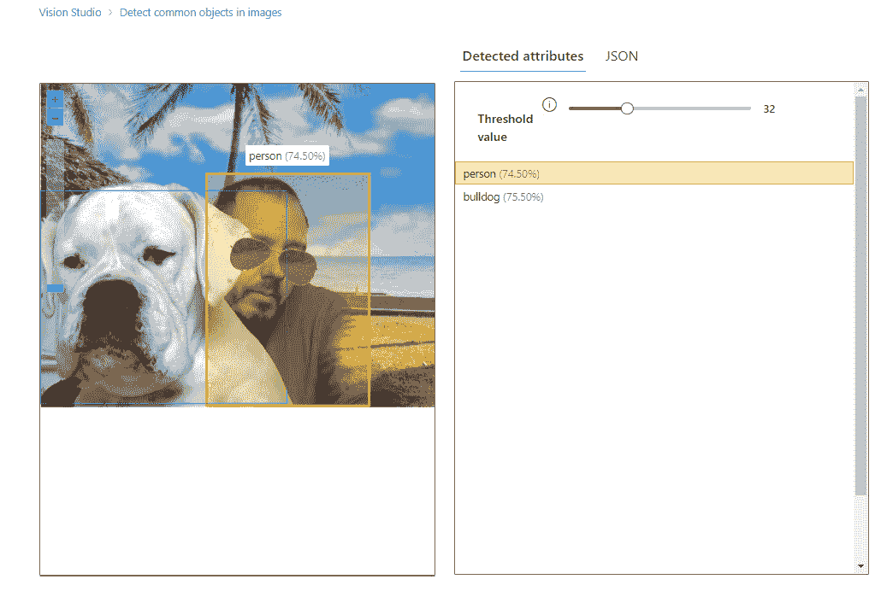

图 6.6 – 图像内的对象

从*图 6.6*中，你可以看到检测到了两个对象，并且每个对象都有一个`人`对象，背景中的位置部分被前景中标记为**斗牛犬**的第二个检测到的对象所覆盖。

一些读者可能已经注意到了检测到的**斗牛犬**对象中的一个缺陷，这突出了在处理 AI 模型时所需的谨慎，以及为什么“可靠性”和“安全性”的负责任 AI 原则如此关键。这里需要指出的问题是，API 返回模型预测检测到的对象是斗牛犬，但只有**75.50%**的置信度认为这是该品种，而实际上品种是拳击手。这需要模型使用更多图像进行进一步训练，以获得更准确的分数并返回正确的品种属性。

以下是对应的 API 的 JSON 响应，来自*图 6.6*：

```py
{"apim-request-id": "de342447-63a1-4a7b-a922-34a758d66f53",
  "content-length": "289",
  "content-type": "application/json; charset=utf-8",
  "modelVersion": "2023-10-01",
  "metadata": {
    "width": 1347,
    "height": 1106
  },
  "objectsResult": {
    "values": [
      {
        "boundingBox": {
          "x": 567,
          "y": 306,
          "w": 555,
          "h": 795
        },
        "tags": [
          {
            "name": "person",
            "confidence": 0.745
          }
        ]
      },
      {
        "boundingBox": {
          "x": 0,
          "y": 365,
          "w": 840,
          "h": 729
        },
        "tags": [
          {
            "name": "bulldog",
            "confidence": 0.755
          }
        ]
      }
    ]
  }
}
```

在这个 JSON 输出中，你可以看到比使用**图像分类**时返回的更多信息；你可以看到每个检测到的对象的“位置坐标”（以像素为单位），每个对象的标签，以及该标签应用于对象的置信度评分。正如提到的，模型应该进一步训练以提高置信度分数，以便正确地将标签应用于对象；在这种情况下，标签应该是*拳击手*而不是*斗牛犬*。

应该注意的是，对象检测不使用**回归**或**聚类**模型，而是一个**图像****分析**模型。

除了一个用于对象检测的**预训练**CV 模型外，还可以使用我们自己的图像**自定义**训练一个模型；它可以训练以识别产品或产品的多个实例，或产品的某些方面，如方向、缺陷、损坏等。

**用例**：在需要确定图像中分类对象的位置、放置、定位、方向或空间关系的情况下，这可能很有用。

本节探讨了使用 CV 识别对象检测解决方案的特征。在下一节中，你将学习如何识别 OCR 解决方案的特征。

# 识别 OCR 解决方案的特征

Azure 机器学习的计算机视觉（CV）功能可以用作 OCR 的解决方案。

**OCR**解决方案可用于从图像中提取“文本”。字母和数字从形状中识别出来，然后转换为*机器编码文本*，然后可以被应用程序或用户进一步用于处理。

图*6.7*展示了 OCR 图像的一个示例：


图 6.7 – 使用 OCR 功能从图像中提取文本

OCR 模型经过训练，可以识别文本元素，包括标点符号，以及从单个形状中识别出的数字，然后将其输出为文本。一个 OCR 模型产生的文本输出示例显示在*图 6.8*：

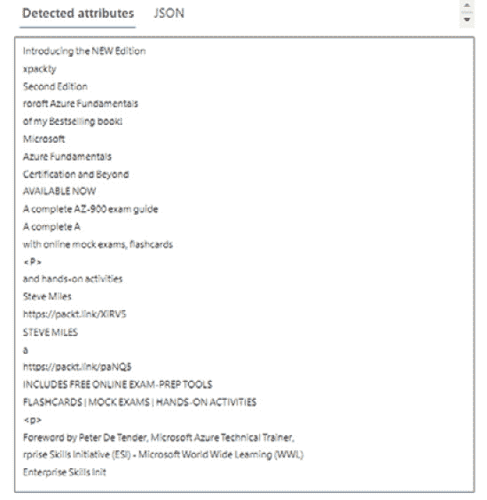

图 6.8 – OCR 模型文本提取输出

以下是从*图 6.8*中对象检测的相应 API JSON 响应的摘录：

```py
       {
        "words": [
          {
            "text": "roroft",
            "boundingPolygon": [
              {
                "x": 5349,
                "y": 214
              },
              {
                "x": 5347,
                "y": 351
              },
              {
                "x": 5295,
                "y": 354
              },
              {
                "x": 5299,
                "y": 217
              }
            ],
            "confidence": 0.68
          },
          {
            "text": "Azure",
            "boundingPolygon": [
              {
                "x": 5347,
                "y": 361
              },
              {
                "x": 5346,
                "y": 490
              },
              {
                "x": 5294,
                "y": 494
              },
              {
                "x": 5295,
                "y": 364
              }
            ],
            "confidence": 0.981
          },
```

从这个 JSON 输出中，正如你在对象检测解决方案中看到的，文本输出中仍然存在一些可以改进的不准确性，例如`"`*roroft*`"`而不是`"`*Microsoft*`"`，这显示了在将形状识别为已知单词时的置信度为*0.68*。这可以通过进一步训练模型来实现，这再次强调了在使用 AI 模型时所需的谨慎，以及为什么“可靠性”和“安全性”的负责任 AI 原则如此关键。

我们使用通用词汇“图像”，但此功能可用于从照片、文档、笔记纸、TIFF 文件和扫描的 PDF 文件中提取*印刷*和*手写*文本。

**用例**：此“文本提取”功能在需要为图书收藏提供清单、阅读报销收据、提取发票信息、为存档目的数字化历史文件、数字化手写报告笔记、从路标或电影海报中提取名称、从体育赛事参赛者中提取数字、从 CCTV 中提取车辆牌照号码等场景中可能很有用。

本节探讨了使用 CV 识别 OCR 的特征。下一节将探讨面部检测和分析。

# 识别面部检测和分析解决方案的特征

使用 Azure 机器学习算法的 CV 方面可以作为创建图像和视频面部检测、分析和识别能力的解决方案。

机器学习中的面部检测和分析能力可用于身份验证和安全领域。这些能力可以通过识别和验证人员的面部来确定访问级别，从而提供安全访问控制。你可以将其视为**基于角色的访问控制**（**RBAC**），但与基于用户角色的访问控制不同，访问级别是由他们的面部决定的。

**用例**：这可能适用于你希望在社交媒体照片中标记已识别朋友的情况；用于识别和针对广告中的目标人口统计群体；识别名人；使用监控录像查找失踪或通缉人员；进行面部姿态的智能监控；检测如佩戴口罩等属性。

## 面部检测

**计算机视觉**（**CV**）中**面部检测**的能力可以从图像中识别出人脸。检测到的人脸周围有一个方形框，人脸的位置可以通过返回的“边界框”坐标提供，这有助于了解图像之间的关系。

需要知道的是，这种**检测**操作是执行所有其他面部服务功能（如**分析**和**识别**）的第一阶段能力；也就是说，我们必须首先检测到面部或多个面部，才能获取任何进一步的信息或理解。

**图 6.9**展示了 CV 进行面部检测的示例，用于从图像中提取定位的人脸：

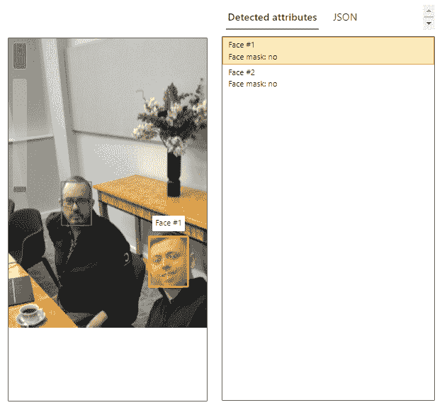

图 6.9 – CV 的面部检测功能

**图 6.9**展示了返回的面部对象以及`Face` `mask`属性的`no`值。

以下是从**图 6.9**中提取的相应 API 的 JSON 响应的摘录（并非完整响应）：

```py
[
  {
    "recognitionModel": "recognition_01",
    "faceRectangle": {
      "width": 58,
      "height": 75,
      "left": 280,
      "top": 297
    },
    "faceLandmarks": {
      "pupilLeft": {
        "x": 291.3,
        "y": 332.8
      },
      "pupilRight": {
        "x": 315.2,
        "y": 327.2
      },
      "noseTip": {
        "x": 301.8,
        "y": 340.1
      },
      "mouthLeft": {
        "x": 297.1,
        "y": 355.8
      },
    },
    "faceAttributes": {
      "mask": {
        "type": "noMask",
        "noseAndMouthCovered": false
      }
    }
  }
]
```

从这个 JSON 输出中，你可以看到面部对象的外接“边界框”坐标（以像素为单位）以及返回的“面部属性”值；返回的“面部标记点”值是面部分析的一部分，你将在下一节中探讨。

本节探讨了使用 CV 来识别面部检测解决方案的特征。接下来，你将学习关于面部分析的内容。

## 面部分析

使用机器学习模型，**面部分析**功能可以接收一张图片并提供关于面部特征的信息，也称为**标记点**，包括**嘴巴**、**嘴唇**、**鼻子**、**眼睛**和**眉毛**等类别：

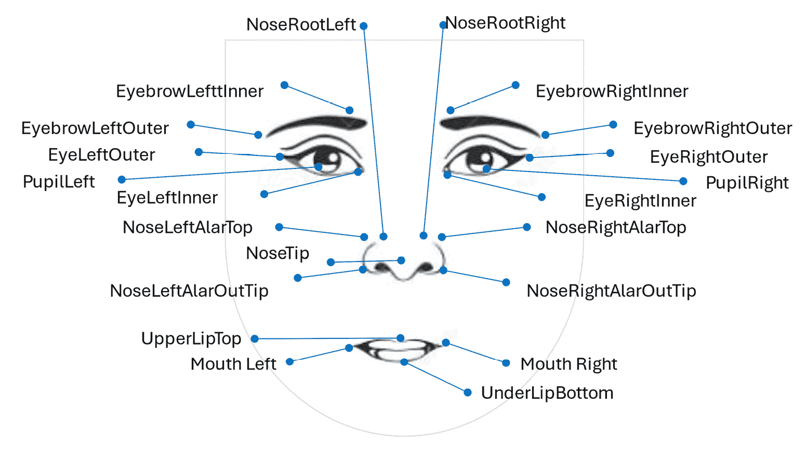

图 6.10 – 使用 CV 检测面部标记点功能

**图 6.10**展示了可用于使用 CV 进行面部分析机器学习模型训练的面部特征。

本节探讨了使用计算机视觉（CV）来识别面部分析解决方案的特征。接下来，你将学习关于面部识别的内容。

## 面部识别

**面部识别**涉及从图像中识别已知个体的面部特征。这是通过使用该个体的图像训练机器学习模型来实现的；然后，对于模型尚未训练的所有新图像，它们可以通过训练模型在这些图像中识别。这一功能在*图 6**.11*中得到了说明：

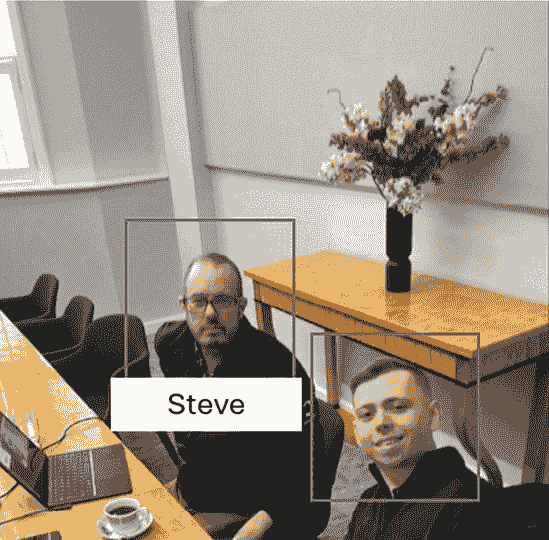

图 6.11 – 使用计算机视觉识别个体

*图 6**.11* 展示了一个使用训练好的机器学习模型通过计算机视觉识别图像中已知个体的面部识别示例；这可以定制以识别学生（们）从教练（们）。

# 摘要

本章全面介绍了常见计算机视觉解决方案的识别。

在本章中，您被介绍了计算机视觉解决方案，包括图像分类、目标检测和 OCR。然后，我们通过提供有关面部检测和面部分析解决方案的信息来结束本章的学习。

在下一章中，您将学习描述以下 Azure AI 服务的功能：Azure AI 视觉、Azure AI 面部和 Azure AI 视频索引器。

# 考试准备练习 – 章节复习题

除了对关键概念有扎实的理解外，能够在时间压力下快速思考是一项有助于您通过认证考试的技能。这就是为什么在您的学习旅程早期就培养这些技能是关键。

章节复习题旨在通过您学习的每个章节逐步提高您的应试技巧，同时复习章节中的关键概念。您将在每个章节的末尾找到这些内容。

在继续之前

如果您没有 Packt 图书馆订阅或未从 Packt 商店购买此书，您将需要解锁在线资源以访问考试准备练习。解锁是免费的，并且只需进行一次。要了解如何操作，请转到名为*第十二章**的章节，访问*在线资源*。

打开本章复习题的步骤如下：

1.  点击链接 – [`packt.link/AI-900_CH06`](https://packt.link/AI-900_CH06)。

    或者，您可以扫描以下二维码（*图 6**.12*）：

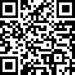

图 6.12– 为登录用户打开章节复习题的二维码

1.  登录后，您将看到一个类似于*图 6**.13*所示的页面：

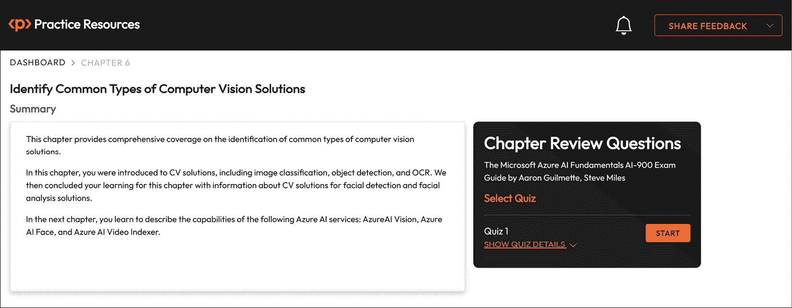

图 6.13 – 第六章的章节复习题

1.  准备就绪后，开始以下练习练习，多次尝试测验。

## 考试准备练习

在前三次尝试中，不必担心时间限制。

### 尝试 1

第一次尝试，目标至少达到**40%**。查看你答错的答案，并再次阅读章节中的相关部分，以修复你的学习差距。

### 尝试 2

第二次尝试，目标至少达到**60%**。查看你答错的答案，并再次阅读章节中的相关部分，以修复任何剩余的学习差距。

### 尝试 3

第三次尝试，目标至少达到**75%**。一旦得分达到 75% 或更高，你就可以开始练习时间控制。

小贴士

你可能需要超过**三次**尝试才能达到 75%。这没关系。只需复习章节中的相关部分，直到你达到目标。

## 掌握时间

你的目标是保持得分不变，同时尽可能快地回答这些问题。以下是你下一次尝试应该看起来像的例子：

| **尝试** | **得分** | **用时** |
| --- | --- | --- |
| 尝试 5 | 77% | 21 分 30 秒 |
| 尝试 6 | 78% | 18 分 34 秒 |
| 尝试 7 | 76% | 14 分 44 秒 |

表 6.1 – 在线平台上的样本时间练习

注意

上表中显示的时间限制只是示例。根据网站上的测验时间限制，为每次尝试设定自己的时间限制。

每次新的尝试，你的得分应保持在**75%**以上，而完成所需的时间应“减少”。重复尝试，直到你觉得自己能够自信地应对时间压力。
