# 第七章：识别 Azure 工具和服务用于计算机视觉任务

在 *第六章* *识别常见的计算机视觉解决方案类型* 中，你学习了如何识别围绕图像分类、目标检测、**光学字符识别**（**OCR**）、面部检测和面部分析等常见计算机视觉解决方案的功能。

在本章中，你将探索使用 **Azure AI 视觉工作室工具** 和 **Azure AI 视觉** 服务，这些服务允许你分析图像、读取文本并提供空间分析。然后，你将探索 **Azure AI 人脸** 服务，该服务允许你在图像中检测和识别面部和属性。最后，你将发现 **Azure AI 视频索引器** 服务，这是一个视频和音频分析服务，允许使用机器学习模型提取洞察。

此内容需要了解一些机器学习原理；如果你直接跳到本章，并且是机器学习的新手或只是想复习一些现有知识，那么请在继续本章之前，请参阅 *第二部分 – Azure 机器学习基本原理*，作为机器学习入门。

**视觉**、**人脸** 和 **视频索引器** 的 Azure AI 服务提供 *预构建* 和 *可定制* 的机器学习模型，开发者可以使用这些模型来增强他们的应用程序。这允许你以更少的技能、成本和复杂性添加 AI 服务，并提供更快的价值实现和更快的上市时间，提供竞争优势。

本章我们将涵盖以下目标和技能：

+   描述 Azure AI 视觉服务的功能

+   描述 Azure AI 人脸服务的功能

+   描述 Azure AI 视频索引器服务的功能

到本章结束时，你应该了解上述 Azure AI 服务的功能。

# 技术要求

要开始使用本章中提到的 **Azure AI 服务**，你需要一个具有足够权限创建和删除资源的 **Azure 订阅**。你可以通过访问 [`azure.microsoft.com/free/`](https://azure.microsoft.com/free/) 创建一个免费的 Azure 账户进行评估。

此免费 Azure 账户提供以下服务：

+   200 信用额度用于探索 Azure 30 天

+   12 个月的免费热门服务

+   55+ 其他始终免费的服务

一旦你有了 Azure 订阅，你需要在 *资源组* 或 *资源* 级别拥有 **所有者** 或 **贡献者** 角色。

为了评估计算机视觉，你可以创建一个“单一服务资源”或一个“多服务资源”；每个都可以如下解释：

+   **Azure AI Vision**：这是一个具体的**单一服务资源**示例。此资源可以与您希望评估的 Azure AI 服务的“免费层”一起使用；它使用一个**端点**和一个**密钥**，这些端点和密钥对于**每个单一**Azure AI 服务都是唯一的。因此，如果您使用多个 Azure AI 服务，那么您将拥有多个端点和密钥（每个服务一个端点和密钥）。

+   **Azure AI Services**：这是一个**多服务资源**。此资源通过使用一个**单一密钥**和**端点**对所有使用的服务资源进行计费合并。因此，如果您使用多个 Azure AI 服务，那么您将只有一个端点和密钥，可以访问所有服务。

理解工作区或计算资源不是必需的；只需在您的 Azure 订阅中创建一个 Azure AI 资源即可。

您可以在[`learn.microsoft.com/en-us/azure/ai-services/multi-service-resource`](https://learn.microsoft.com/en-us/azure/ai-services/multi-service-resource)了解更多关于服务资源的信息。

现在我们已经了解了本章将涵盖的 Azure AI 服务的技术要求，让我们来发现 Azure AI 服务的第一个服务：Azure AI Vision。

# 描述 Azure AI Vision 服务的功能

**Azure AI Vision**服务是一个基于**云的 Microsoft 托管 AI**服务，它提供了机器学习算法，允许您分析图像的视觉特征和特性，调节图像内容，并从图像中提取文本。

Azure AI Vision 服务提供以下功能：

+   **图像分析**：此功能可以用于返回有关图像特性和视觉特征的信息。它包括以下模型功能：

    +   为图像添加字幕和密集字幕

    +   使用标签为图像分配标签

    +   在图像中检测对象，例如人物

    +   检测产品的多个实例

    +   检测品牌

    +   检测色彩方案

    +   在图像中检测敏感信息，例如成人内容（包括“露骨”或“血腥”内容）

    +   创建可以在您的图像集合上训练的自定义图像分类和对象检测模型

    +   使用自定义模型检测损坏/不符合规格的产品

    您可以在[`learn.microsoft.com/en-us/azure/ai-services/computer-vision/overview-image-analysis`](https://learn.microsoft.com/en-us/azure/ai-services/computer-vision/overview-image-analysis)了解更多信息。

+   **OCR**：这种功能有时也被称为文本识别或文本提取，基于机器学习，允许从诸如**文档**等打印或手写文本中提取，例如表格、发票、费用收据和**图像**，这些图像可能包括车牌、街牌、产品品牌标签、电影海报上的名字等等。

    您可以在 [`learn.microsoft.com/en-us/azure/ai-services/computer-vision/overview-ocr`](https://learn.microsoft.com/en-us/azure/ai-services/computer-vision/overview-ocr) 了解更多。

+   **人脸**：此功能提供机器学习以检测图像中的人脸；它可以提供识别和分析以提取属性，如年龄、眼镜、面部毛发和姿势。

    您可以在 [`learn.microsoft.com/en-us/azure/ai-services/computer-vision/overview-identity`](https://learn.microsoft.com/en-us/azure/ai-services/computer-vision/overview-identity) 了解更多。

用于计算机视觉任务的**Microsoft Florence 模型**是基础模型。它在大量带有标题的互联网图像上进行了“预训练”，以构建可用于图像分析任务的模型，例如以下内容：

+   **图像分类**：识别图像类别并为图像添加标签

+   **对象检测**：识别图像、照片或视频中的对象位置

+   **标题**：为图像中出现的所有内容生成人类可读的描述，例如照片

+   **标记**：生成与图像检测到的属性关联的标签列表

## 图像分类

Azure AI Vision 服务模型的特性可以分析图像，此时可以根据其对内容的理解再应用一个**标签**。

**标签**被识别为属于图像；图像可以与一个或多个标签关联。您可以将此视为向图像添加**属性**。该服务的特性意味着它也可以与文档以及照片一起使用。

如 *图 7.1* 所示的 **Azure AI Vision Studio** 是一个公共的基于网络的门户，可用于执行图像分析任务：

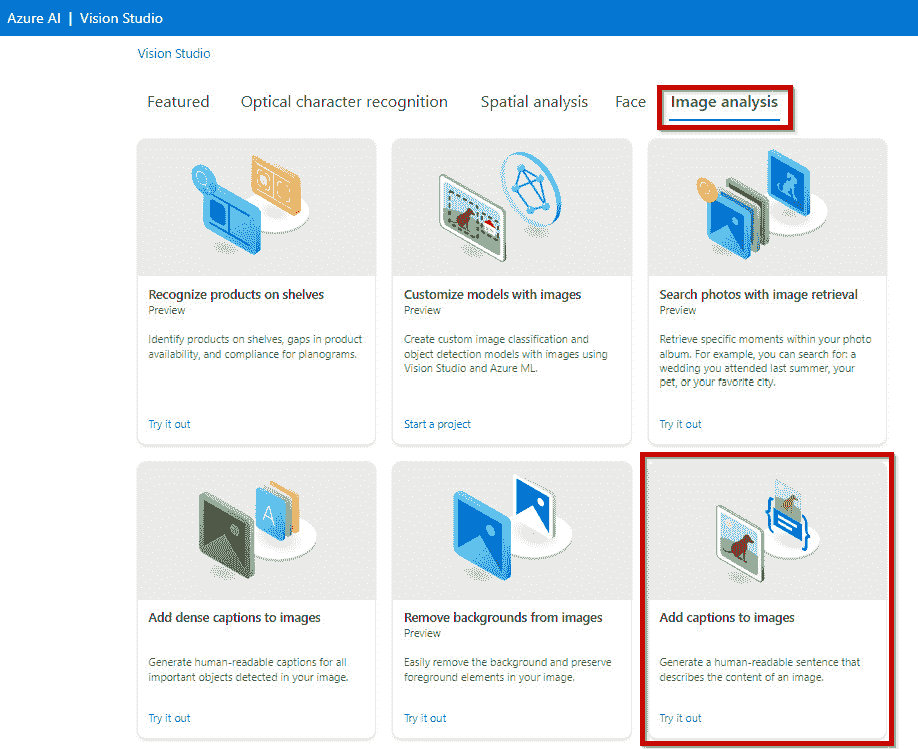

图 7.1 – Azure AI Vision Studio 门户

您可以从 [`portal.vision.cognitive.azure.com/`](https://portal.vision.cognitive.azure.com/) 开始使用 Azure AI Vision Studio。

*图 7.2* 展示了使用 Azure AI Vision 服务进行图像分析的一个示例。它可以生成一个人类可读的句子作为图像的描述：

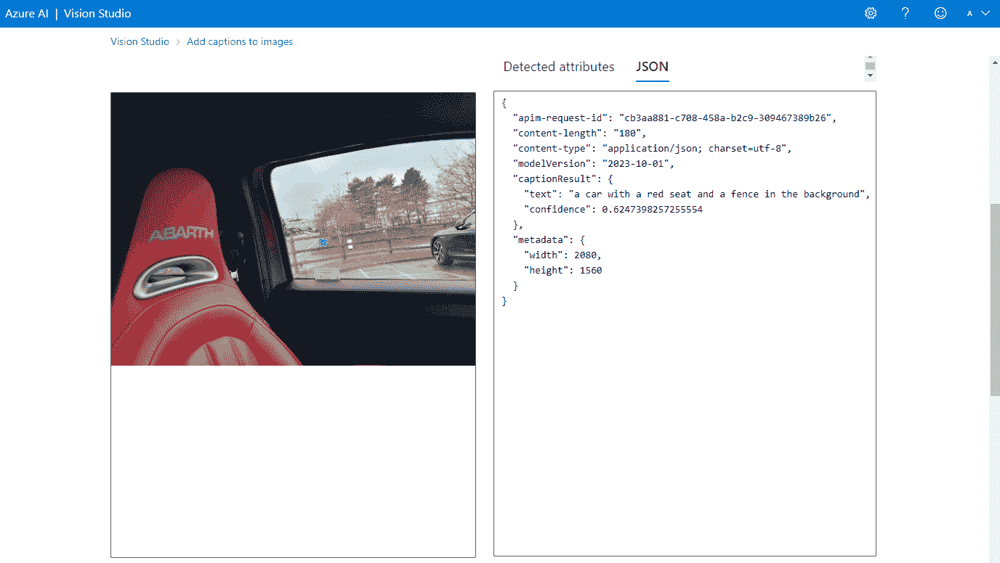

图 7.2 – 通过 Azure AI Vision Studio 提供的图像标题信息

*图 7.2* 展示了使用 Azure AI Vision 服务进行图像分析的一个示例。它可以**标注**图像并生成一个人类可读的**句子**作为图像的**描述**；标注读作“一辆红色的座椅和背景中的栅栏的汽车。”

Azure AI Vision 服务模型的特性可以分析图像；可以根据其对内容的理解应用一个**标签**。

**分类**是一个“父子层次结构”；有*86 个类别*，所有名称均为英文。*图 7.3*展示了此类别的分类和结构示例：

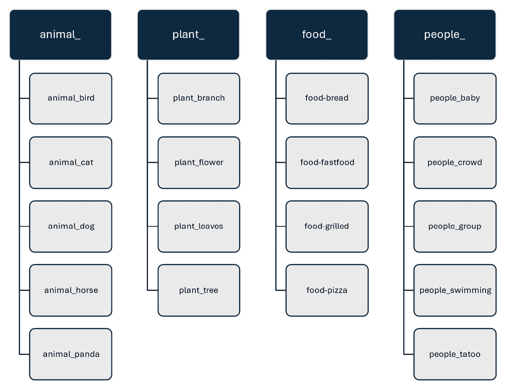

图 7.3 – 类别拓扑示例

*图 7.3*中显示的完整“文本格式”拓扑可以在[`learn.microsoft.com/en-us/azure/ai-services/computer-vision/category-taxonomy`](https://learn.microsoft.com/en-us/azure/ai-services/computer-vision/category-taxonomy)找到。

你可以在[`learn.microsoft.com/en-us/azure/ai-services/computer-vision/concept-categorizing-images`](https://learn.microsoft.com/en-us/azure/ai-services/computer-vision/concept-categorizing-images)了解更多关于图像分类的信息。

在本小节中，你发现了使用 Azure AI Vision 服务时的图像分类。在下一个小节中，你将学习对象检测。

## 对象检测

**图像分类**为我们提供分类，并可以告诉我们单个信息——也就是说，图像中有一个“人”、“汽车”、“猫”等等——**对象检测**除了分类和“标题标签”外，还为图像中的对象提供单个**位置信息**。

**多个对象**也可以在图像中被识别。对于图像中找到的每个对象，API 将返回检测到的属性。通过提供由**Image Analysis API**返回的**边界框**（*以像素为单位*）的坐标，可以找到对象在图像中的**单独位置**。这些信息可以用来提供图像中对象之间的关系。

如*图 7.4*所示，**Azure AI Vision Studio**是一个公共基于 Web 的门户，可用于执行对象检测任务：

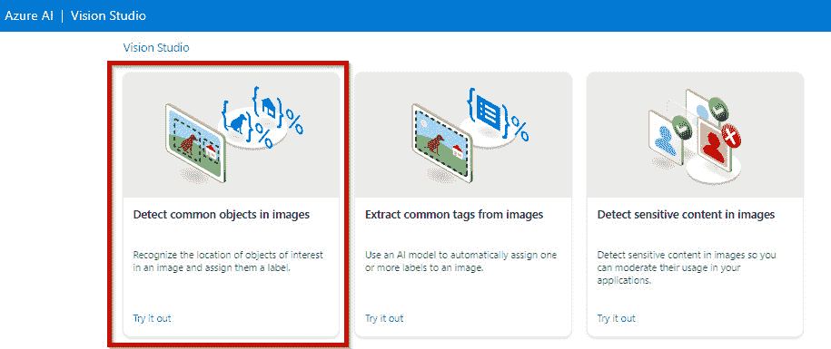

图 7.4 – Azure AI Vision Studio 门户

你可以在[`portal.vision.cognitive.azure.com/`](https://portal.vision.cognitive.azure.com/)开始使用**Azure AI Vision Studio**。

*图 7.5*展示了通过**Azure AI Vision Studio**进行图像中对象检测的示例。

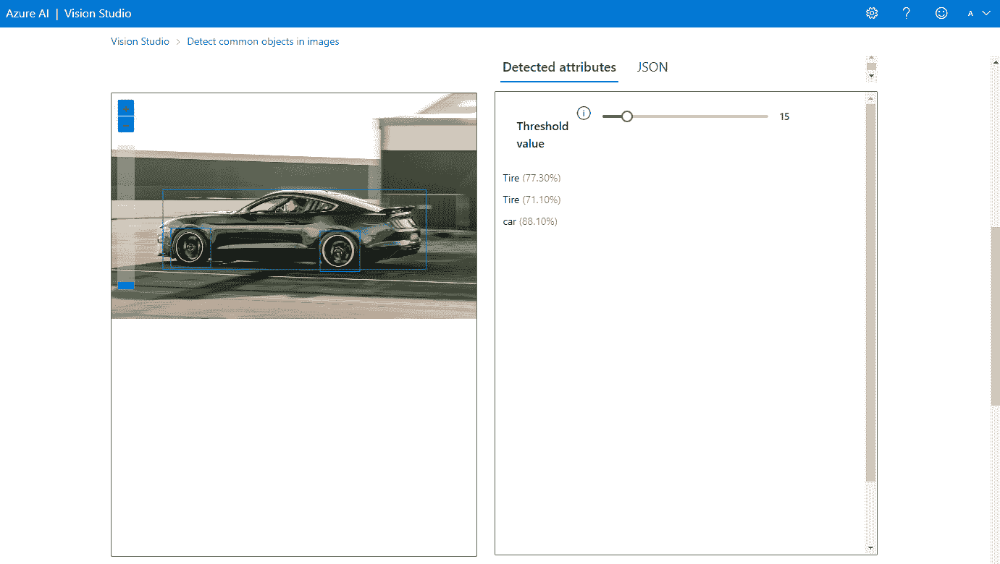

图 7.5 – 通过 Azure AI Vision Studio 提供的对象检测信息

*图 7.5*展示了使用**Azure AI Vision**服务生成关于**汽车**和**轮胎**检测的**图像分析**示例。

对象的位置以图像内的**边界框**中的**像素值**提供；**标签**信息也将从图像中检索。API 返回的**JavaScript 对象表示法**（**JSON**）信息如下，如图*图 7.5*所示：

```py
{
  "modelVersion": "2023-10-01",
  "metadata": {
    "width": 1921,
    "height": 1172
  },
  "objectsResult": {
    "values": [
      {
        "boundingBox": {
          "x": 323,
          "y": 699,
          "w": 206,
          "h": 205
        },
        "tags": [
          {
            "name": "Tire",
            "confidence": 0.773
          }
        ]
      },
      {
        "boundingBox": {
          "x": 1095,
          "y": 715,
          "w": 207,
          "h": 209
        },
        "tags": [
          {
            "name": "Tire",
            "confidence": 0.711
          }
        ]
      },
      {
        "boundingBox": {
          "x": 282,
          "y": 501,
          "w": 1363,
          "h": 414
        },
        "tags": [
          {
            "name": "car",
            "confidence": 0.881
          }
        ]
      }
    ]
  }
}
```

应该注意的是，此服务不使用**回归**或**聚类**模型，而是一个**图像****分析**模型。

您可以在以下 URL 了解更多信息：

+   [`learn.microsoft.com/en-us/azure/ai-services/computer-vision/concept-object-detection-40`](https://learn.microsoft.com/en-us/azure/ai-services/computer-vision/concept-object-detection-40)

+   [`learn.microsoft.com/en-us/azure/ai-services/computer-vision/concept-describe-images-40`](https://learn.microsoft.com/en-us/azure/ai-services/computer-vision/concept-describe-images-40)

本节确定了使用 Azure AI 视觉服务识别对象检测解决方案的能力。在下一节中，您将学习如何使用 Azure AI 视觉识别 OCR 解决方案的能力。

## OCR 解决方案

**Azure AI 视觉服务**可以用作**OCR**的解决方案。

通过 OCR 的能力，此服务使您能够从照片、扫描的文档或任何其他视觉内容中“提取”文本信息。**Read API**可以识别跨语言的打印和手写文本。

**Azure AI 视觉工作室**，如图*图 7*.6 所示，是一个公共的基于 Web 的门户，可用于执行 OCR 任务：

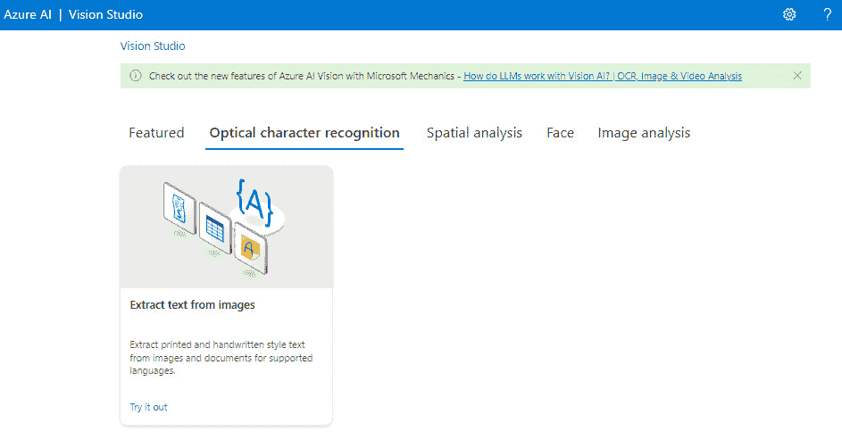

图 7.6 – Azure AI 视觉工作室门户

您可以从[`portal.vision.cognitive.azure.com/`](https://portal.vision.cognitive.azure.com/)开始使用**Azure AI 视觉工作室**。

*图 7*.7 显示了通过 Azure AI 视觉工作室使用**OCR**功能从图像中提取“打印文本”的示例：

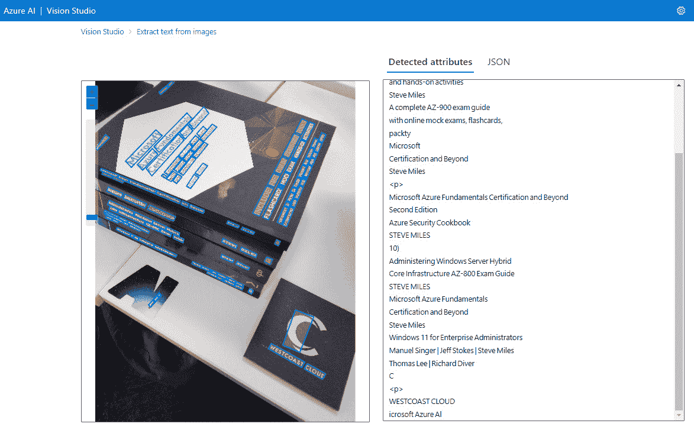

图 7.7 – 通过 Azure AI 视觉工作室使用 OCR 功能从图像中提取文本

您可以在[`learn.microsoft.com/en-us/azure/ai-services/computer-vision/overview-ocr`](https://learn.microsoft.com/en-us/azure/ai-services/computer-vision/overview-ocr)了解更多信息。

本节探讨了使用 Azure AI 视觉服务识别 OCR 解决方案的能力。在下一节中，您将学习如何通过 Azure AI Face 服务识别人脸检测的能力。

# 描述 Azure AI Face 服务的能力

**Azure AI Face**服务是**Microsoft Azure**的**AI**服务的一部分。

**人脸**服务提供在图像中检测和识别人脸以及提取各种面部特征的能力。Microsoft Azure AI Face 服务的一些关键功能和特性如下：

+   **人脸检测**：在图像中识别和定位人脸

+   **人脸识别**：将检测到的面孔与数据集中已知面孔关联

+   **人脸验证**：确认图像中的两个人脸是否为同一个人

+   **面部特征点检测**：识别关键面部特征，如眼睛、鼻子和嘴巴

+   **人脸相似度匹配**：确定人脸之间的相似度，可用于基于人脸的认证等应用

开发者可以使用 **REST API** 将 **Azure AI Face** 服务集成到他们的应用程序中。

在本节中，您已了解了 Azure AI Face 服务。在下一节中，您将了解开始使用它所需的条件。

## 开始使用

要开始使用人脸服务，您需要在 Azure 订阅内创建资源，如“技术要求”部分所述。以下之一是必需的：

+   **人脸 Azure 资源**：此资源将用于创建一个**专用**端点和密钥，用于此**特定**的 Azure AI 服务。您将独立于任何其他 Azure AI 服务对使用此 AI 服务的消费进行计费。如果您不使用任何其他 Azure AI 服务，这将是最佳选择。

+   **Azure AI 服务 Azure 资源**：此资源将用于创建一个**共享**端点和密钥，该端点和密钥将用于您希望使用的所有 Azure AI 服务。您将对使用的所有 AI 服务的消费进行汇总计费。

**Azure AI 视觉工作室**，如 *图 7.8* 所示，是一个公共的基于网络的门户，可用于执行以下任务：

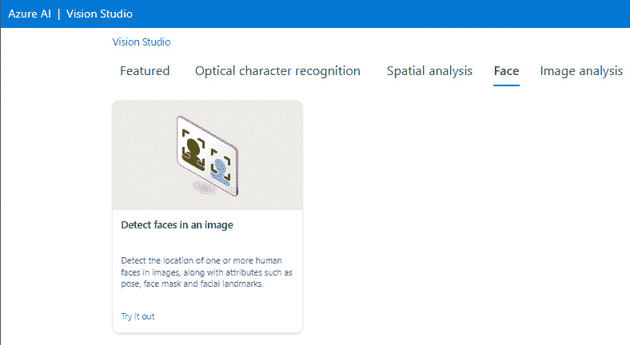

图 7.8 – Azure AI 视觉工作室门户

您可以通过 [`portal.vision.cognitive.azure.com/`](https://portal.vision.cognitive.azure.com/) 开始使用 **Azure AI 视觉工作室**。

在本节中，您学习了开始使用 Azure AI Face 服务所需的条件。在接下来的子节中，我们将探讨 Azure AI Face 服务的功能。

## 人脸检测

这种功能可以接收一张图片并在其中识别出人脸。

**Azure AI Face** 服务提供了一种在图像中进行人脸检测和识别的 API。它可以检测属性并返回像素坐标以定位图像中的人脸。*图 7.9* 展示了这一功能：

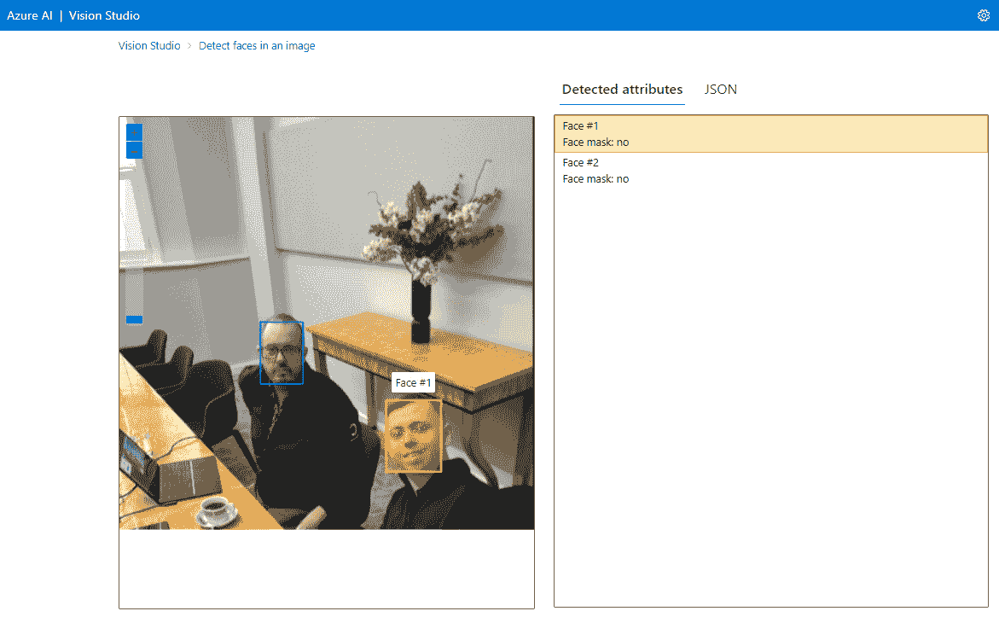

图 7.9 – 使用 Azure AI 视觉工作室检测人脸

*图 7.9* 展示了使用 **Azure AI Face** 服务进行**人脸检测**的示例，以提取图像中定位的人脸。

这里是一个 `mask` 在 `faceAttributes` 下的示例：

```py
[
  {
    "recognitionModel": "recognition_01",
    "faceRectangle": {
      "width": 144,
      "height": 209,
      "left": 305,
      "top": 473
    },
    "faceLandmarks": {
      "pupilLeft": {
        "x": 327.9,
        "y": 548.7
      },
      "pupilRight": {
        "x": 379.3,
        "y": 559.1
      },
      "noseTip": {
        "x": 325.9,
        "y": 588
      },
  ----<<<< Full code removed for brevity >>>>----
    "faceAttributes": {
      "mask": {
        "type": "noMask",
        "noseAndMouthCovered": false
      }
    }
  }
]
```

请注意，返回的完整 JSON 响应未包含在内；此片段仅包含用于说明目的。

使用 **Azure AI Face** 服务**预构建**的机器学习算法可以识别以下与人脸相关的属性：

+   **配件**：这指的是人脸是否佩戴配件，如头饰、眼镜或口罩；还会返回一个置信度分数。

+   **模糊**：这指的是图像是否缺乏焦点。

+   **曝光**：这指的是图像中的面孔是否过曝或欠曝。

+   **遮挡**：这指的是人脸是否可能被物体遮挡。

+   **噪声**：这指的是视觉噪声，图像由于细小点状物而变得不清晰，以及颗粒状外观，例如在较暗的设置中使用高 ISO 的相片

+   **姿态**：这指的是面部的方向

重要提示

参考第*负责任 AI*部分，了解如何退休属性检测，如情绪、年龄和面部毛发。

为了获得更好的图像检测结果，应考虑以下因素：

+   **格式**：BMP、GIF（*第一帧*）、JPEG、PNG

+   **文件大小**：最大 6 MB

+   **面部大小**：最小为 36 x 36，最大为 4,096 x 4,096，以便能够检测到

+   **旋转**：图像必须正确旋转；对于某些图像，例如 JPEG 格式的图像，这可能通过它们的**可交换图像文件格式**（**EXIF**）元数据自动完成

+   **此外**：当图像具有极端的面部角度、照明和物体遮挡（遮挡）时，准确性将降低

除了*视频输入*外，还应考虑以下设置以获得更清晰的视频帧结果：

+   **快门角度**：应使用较小的快门角度

+   **快门速度**：减少帧之间的运动量

+   **平滑**：应关闭

通过面部服务在图像中检测到的每个面部，您都可以通过**面部检测 API**请求一个**面部 ID**。这是一个*唯一*的*标识符*字符串。

可以使用面部服务执行以下 API 操作：

+   **识别**：这是一个一对一多操作，用于从已知人员数据库/安全存储库（**人员组**）中找到与查询人员最接近的匹配项。它从**检测到的面部**对象中获取**面部 ID**，并返回一个包含**置信度预测值**的人员对象列表，该预测值表示检测到的面部可能属于——也就是说，这是否是声称的人？

    每个**人员组**（人员对象的存储库/数据库）可以拥有最多 100 万个人员对象；人员组中每个人员对象最多可以注册 248 个面部。

+   **验证**：这是一个一对一的操作，用于验证图像中检测到的面部 ID 是否与安全存储库/数据库中的人员对象匹配——也就是说，这两个面部是否是同一个人？

+   **查找相似**：这是一个面部搜索操作，可以接受一个面部 ID，并在面部列表中找到其他候选人的面部图像，这些图像与相似；它可以回答所有面部是否属于同一组，或者这个人是否像其他人。工作模式如下：

    +   **matchPerson**：这使用**验证 API**返回过滤后的相似面部。这意味着返回的结果只能是目标面部图像。

    +   **matchFace**：这返回与面部 ID 相似的候选人面部列表，但它们可能不是该人的面部；忽略**同一人**的过滤器。这意味着返回的结果不一定包含目标面部。

+   **组**：这是一个基于相似性的操作；相似候选人的未知面孔被分成更小的组。这意味着所有返回的面孔很可能是同一个人的，但那个人可能有不同的组，其中可以使用面部表情等因素来区分。

**Azure AI Face 服务**可以分析两张面孔并确定它们是否属于同一个人；如果识别的面孔与身份数据存储进行验证，则可以根据此验证采取一些行动。

这些操作构成了通过**身份验证**（**AuthN**）和**授权**（**AuthZ**）的安全协议的基础——即验证“你是谁”以及“你能访问什么”，

您可以在[`learn.microsoft.com/en-us/azure/ai-services/computer-vision/overview-identity`](https://learn.microsoft.com/en-us/azure/ai-services/computer-vision/overview-identity)了解更多信息。

您可以在[`portal.vision.cognitive.azure.com/gallery/face`](https://portal.vision.cognitive.azure.com/gallery/face)尝试面部检测。

## 负责任的 AI

虽然之前的这些功能对所有用户都可用，但为了支持微软的**负责任的 AI 标准**，通过有限的访问策略，为“管理微软”客户提供额外的**面部服务**功能，包括面部匹配和识别命名个人。

您可以在[`aka.ms/facerecognition`](https://aka.ms/facerecognition)了解更多信息。

您应该意识到，面部识别的能力，如情绪、微笑、性别、年龄、化妆、胡须和头发等，这些可以推断情绪状态和身份属性，已经被微软弃用，以防止它们被滥用，因为这可能导致拒绝服务攻击、歧视和刻板印象。

您可以在[`azure.microsoft.com/en-us/blog/responsible-ai-investments-and-safeguards-for-facial-recognition/`](https://azure.microsoft.com/en-us/blog/responsible-ai-investments-and-safeguards-for-facial-recognition/)了解更多信息。

以下是负责任的 AI 的指导原则：

+   责任

+   包容性

+   可靠性和安全性

+   公平性

+   透明度

+   隐私和安全

在本节中，您了解了微软对负责任的 AI 的定位。接下来，我们将探讨 Azure AI 视频索引器服务。

# 描述 Azure AI 视频索引器服务的功能

Azure ML 的计算机视觉能力可以用作从视频和音频媒体文件中分析和提取见解以及元数据的解决方案，以及检测和识别视频中的面孔。

**Azure AI 视频索引器**服务的用例如下：

+   可访问性

+   内容创建

+   内容审查

+   深度搜索

+   营收

+   推荐

**Azure AI 视频索引器**服务使用机器学习算法，可用于执行这些任务。它建立在 **Azure AI 服务**的 **Azure AI 视觉**、**Face**、**Speech** 和 **Translator** 之上。有 30 多个模型可用于检索视频和音频内容洞察。

**Azure AI 视频索引器服务**可以使用以下模型从视频文件中检索洞察：

+   基于账户的人脸识别

+   黑帧检测

+   明星识别

+   编辑镜头类型检测

+   人脸检测

+   关键帧提取

+   标签识别

+   匹配的人

+   OCR

+   观察者跟踪

+   滚动字幕

+   场景分割

+   场景检测

+   草稿检测

+   文本标志检测

+   人脸缩略图提取

+   视觉内容审核

**Azure AI 视频索引器**服务可以使用以下模型从音频文件中检索洞察：

+   音频效果检测

+   自动语言检测

+   音频转录

+   关闭字幕

+   多语言语音识别和转录

+   噪声降低

+   发言者枚举

+   发言者统计

+   基于文本的情感检测

+   基于文本的内容审核

+   翻译

+   双通道处理

以下多通道（*音频和视频*）模型可用：

+   杂质

+   关键词提取

+   命名实体提取

+   情感分析

+   主题推断

Azure AI 视频索引器服务可以在 https://www.videoindexer.ai/ 尝试。

您可以在 https://learn.microsoft.com/en-us/azure/azure-video-indexer/ 了解更多信息。

# 摘要

本章全面介绍了 *Azure 上计算机视觉工作负载的特征* AI-900 Azure 基础技能领域。

在本章中，您被介绍了 Azure AI 视觉工作室工具，并发现了 Azure AI 视觉服务在图像分类、目标检测和 OCR 方面的能力。然后您了解了 Azure Face 服务，它可以用于人脸检测、人脸分析和识别。最后，我们介绍了 Azure AI 视频索引器服务，它可以从视频和音频文件中提取洞察，以及微软对负责任 AI 的定位。

在下一章中，您将学习如何描述 Azure 上自然语言处理（**NLP**）工作负载的各种功能。NLP 支持今天许多流行的商业 AI 服务。

# 考试准备练习 - 章节复习问题

除了对关键概念有扎实的理解外，能够在时间压力下快速思考是一项有助于您通过认证考试的能力。这就是为什么在您的学习旅程早期就培养这些技能至关重要。

章节复习问题旨在通过您学习的每个章节逐步提高您的应试技巧，同时同时复习章节中的关键概念。您将在每个章节的末尾找到这些内容。

在您继续之前

如果你没有 Packt 图书馆订阅，或者你没有从 Packt 商店购买这本书，你需要解锁在线资源以访问考试准备练习。解锁是免费的，只需进行一次。要了解如何操作，请参阅名为*第十二章**的章节，*访问在线资源*。

要打开本章的章节复习问题，请执行以下步骤：

1.  点击链接 – [`packt.link/AI-900_CH07`](https://packt.link/AI-900_CH07)。

    或者，你可以扫描以下二维码（*图 7**.10*）：

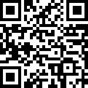

图 7.10 – 为已登录用户打开章节复习问题的二维码

1.  登录后，你会看到一个类似于*图 7**.11*所示的页面：

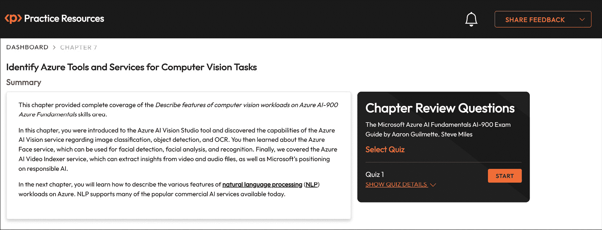

图 7.11 – 第七章的章节复习问题

1.  准备就绪后，开始以下练习，多次重新尝试测验。

## 考试准备练习

对于前三次尝试，不要担心时间限制。

### 第一次尝试

第一次，目标至少达到**40%**。查看你答错的答案，并再次阅读章节中相关的部分，以修复你的学习差距。

### 第二次尝试

第二次，目标至少达到**60%**。查看你答错的答案，并再次阅读章节中相关的部分，以修复任何剩余的学习差距。

### 第三次尝试

第三次，目标至少达到**75%**。一旦得分达到 75%或更高，你就可以开始练习时间管理。

小贴士

你可能需要超过**三次**尝试才能达到 75%。这没关系。只需复习章节中的相关部分，直到你达到目标。

## 练习时间管理

你的目标是保持分数不变，同时尽可能快地回答这些问题。以下是你下一次尝试应该看起来像的例子：

| **尝试** | **分数** | **用时** |
| --- | --- | --- |
| 第五次尝试 | 77% | 21 分 30 秒 |
| 第六次尝试 | 78% | 18 分 34 秒 |
| 第七次尝试 | 76% | 14 分 44 秒 |

表 7.1 – 在线平台上的样本时间练习练习

注意

上表中显示的时间限制只是示例。根据网站上的测验时间限制，为每次尝试设定自己的时间限制。

每次新的尝试，你的分数应保持在**75%**以上，而完成所需的时间“应减少”。重复尽可能多的尝试，直到你对自己应对时间压力有信心。

# 第四部分：描述 Azure 上自然语言处理（NLP）工作负载的特点

**自然语言处理**（**NLP**）是允许计算机识别和理解人类语言相关部分的技术，包括文本识别、文本分析、文本转语音和语音合成。在本部分，你将了解 Azure 中的 NLP 功能。

本部分包括以下章节：

+   *第八章*, *识别常见 NLP 工作负载场景的特点*

+   *第九章*, *识别用于 NLP 工作负载的 Azure 工具和服务*
