# 第三章：*第三章*：准备 Azure Machine Learning 工作区

在上一章中，我们学习了如何导航不同的 Azure 服务以在云中实现 ML 解决方案。我们意识到，对于程序化训练自定义 ML 模型并自动化基础设施和部署来说，最佳服务是 Azure Machine Learning 服务。在本章中，我们将设置并探索 Azure Machine Learning 工作区，创建云训练集群，并在本地和云计算上执行数据实验，同时收集 Azure Machine Learning 中 ML 运行的全部工件。

在第一部分，我们将学习如何使用不同的工具管理 Azure 资源，例如 Azure **命令行界面 (CLI**)、Azure SDKs 和**Azure 资源管理器 (ARM**)模板。我们将设置并探索 Azure CLI 以及 Azure Machine Learning 扩展，然后部署 Azure Machine Learning 工作区。

然后，我们将通过探索作为 Azure Machine Learning 一部分部署的资源来深入了解 Azure Machine Learning，例如存储账户、Azure Key Vault、Azure Application Insights 和 Azure Container Registry。随后，我们将深入研究 Azure Machine Learning 并探索工作区，以更好地理解各个组件。

最后，在最后一部分，我们将把所有这些知识付诸实践，并使用 Azure Machine Learning 运行我们的第一个实验。在设置好我们的环境后，我们将增强一个简单的 ML Keras 训练脚本，将其指标、日志、模型和代码快照记录到 Azure Machine Learning。然后，我们将继续在本地机器以及 Azure 的训练集群上安排训练运行。

到本章结束时，您将在 Azure Machine Learning 工作区中看到所有成功的训练运行、指标和跟踪的模型，并且您将对 Azure Machine Learning 有一个良好的理解，从而开始您的 ML 之旅。

本章将涵盖以下主题：

+   部署 Azure Machine Learning 工作区

+   探索 Azure Machine Learning 服务

+   使用 Azure Machine Learning 运行 ML 实验

# 技术要求

在本章中，我们将使用以下 Python 库和版本在 Azure Machine Learning 上执行和管理实验运行：

+   `azureml-core 1.34.0`

+   `azureml-sdk 1.34.0`

+   `azureml-widgets 1.34.0`

+   `tensorflow 2.6.0`

您可以使用本地 Python 解释器或 Azure Machine Learning 中托管的笔记本环境运行此代码。然而，某些脚本需要计划在 Azure 中执行。

本章中所有的代码示例都可以在本书的 GitHub 仓库中找到：[`github.com/PacktPublishing/Mastering-Azure-Machine-Learning-Second-Edition/tree/main/chapter03`](https://github.com/PacktPublishing/Mastering-Azure-Machine-Learning-Second-Edition/tree/main/chapter03)。

# 部署 Azure Machine Learning 工作区

在我们能够深入探讨 Azure 上的机器学习之前，我们需要了解如何部署 Azure 机器学习工作区或 Azure 服务，支持哪些工具，以及我们将在整本书中使用哪一个来工作。

作为第一步，我们需要一个 Azure 订阅。

如果您在组织中工作并想使用您的工账户，您可以访问 portal.azure.com 并使用您的工账户登录。如果登录成功，您将进入门户本身，您的工账户将显示在右上角。这意味着您的公司已经设置了**Azure Active Directory**（**AAD**）实例。在这种情况下，如果您还没有，请与您的 Azure 全球管理员联系，讨论您应该使用哪个 Azure 订阅来满足您的需求。

如果您是 Azure 的新用户并想使用您的私人账户，请访问 azure.com 并点击**免费账户**创建一个带有免费试用订阅的 AAD。这个试用订阅在 30 天内为您提供了在 Azure 服务上花费的一定金额。

在任何情况下，最终，您应该能够使用您的身份登录到 Azure 门户，并且您应该知道您想要将机器学习服务部署到哪个 Azure 订阅（名称和/或订阅 ID）。

完成所有这些后，我们现在将看看如何部署和管理我们的 Azure 环境，以及有哪些选项和工具可供选择。

## 理解 Azure 部署的可用工具

在 Azure 中，任何部署或更改 Azure 服务的操作都通过所谓的 ARM（Azure 资源管理器）进行。如图*图 3.1*所示，ARM 接受来自**Azure 门户**、**Azure PowerShell**（PowerShell 扩展）、**Azure CLI**或**Azure REST API**的请求：


图 3.1 – Azure 资源管理器

在 Azure 门户中，您可以选择“机器学习”，结果集将显示一个来自微软的名为**机器学习**的服务。点击这张卡片然后**创建**将打开此服务的部署向导。这将让您了解部署此服务所需的内容。

但我们不会在门户本身上进一步讨论，因为我们想在这本书中促进一种更程序化的方法。使用这种方法将极大地提高在 Azure 中执行的所有任务的重复性和自动化。因此，我们将专注于后者的解决方案——让我们来看看它们：

+   **Azure CLI**：这是一个完整的命令行环境，您可以在每个主要操作系统上安装。最新版本可以从[`docs.microsoft.com/en-us/cli/azure/install-azure-cli`](https://docs.microsoft.com/en-us/cli/azure/install-azure-cli)下载。

+   **Azure Power Shell**：正如其名所示，这是一个 PowerShell 模块库，可以添加到 PowerShell 环境中。以前，PowerShell 只在 Windows 上可用，但新的 PowerShell Core 7.x 现在正式支持主要的 Linux 版本和 macOS。以下描述展示了如何在您的系统上安装它：https://docs.microsoft.com/en-us/powershell/azure/install-az-ps。

+   `curl` 或流行的 Python `requests` 库。以下文章描述了给定的语法：https://docs.microsoft.com/en-us/rest/api/resources/。

所有这些选项都允许使用所谓的 **ARM 模板**（https://docs.microsoft.com/en-us/azure/azure-resource-manager/templates/overview），这是 Azure 的 **基础设施即代码**（**IaC**）版本。它使您能够将基础设施定义保存到文件中并进行版本控制。在处理复杂的架构部署时，这种方式非常推荐，但我们不会深入探讨这个话题。这里要补充的唯一一点是，市场上还有其他用于 IaC 管理的工具。最突出的工具称为 **Terraform**（https://www.terraform.io/），它允许管理任何云供应商或本地环境的架构，包括 Azure。为了实现这一点，Terraform 在底层使用 Azure CLI。

总结来说，您可以选择上述任何一种选项来完成手头的任务，尤其是如果您对其中之一有强烈的偏好。

由于我们不会管理复杂的架构并希望避免任何不必要的额外复杂性层级，我们将在本书的其余部分使用 Azure CLI。此外，新的 ML CLI 扩展为 Azure 机器学习提供了一些实用的功能，我们将在本章中逐一发现：

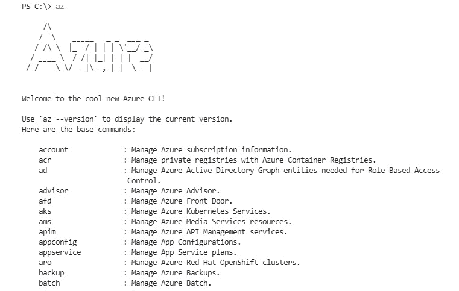

图 3.2 – Azure CLI

如果您还没有做，请随意下载并安装或更新 CLI 到最新版本。准备好后，打开您喜欢的命令行或终端，并在控制台中输入 `az`。您应该会看到如图 3.2 所示的屏幕。

## 部署工作区

在对 ARM 进行了简短的介绍之后，让我们部署我们的第一个 ML 工作区。我们将使用 Azure CLI 来部署工作区。如果您想通过 Azure 门户部署它，可以遵循这个教程：https://docs.microsoft.com/en-us/azure/machine-learning/quickstart-create-resources。

如果您简要地浏览了 CLI 命令列表，可能会注意到似乎没有命令引用 ML。让我们纠正这一点，并按照以下步骤通过 CLI 设置我们的第一个 Azure 机器学习工作区：

1.  通过 CLI 登录到您的 Azure 环境：

    ```py
    $ az login
    ```

此命令将打开一个带有 AAD 登录界面的网站。完成此操作后，请返回控制台。现在屏幕将显示有关您的 AAD 租户（`homeTenantId`）、您的订阅（`id`、`name`）以及您的用户的一些信息。

1.  如果显示给您多个订阅，并且您需要检查哪个订阅是活动的，请使用以下命令：

    ```py
    $ az account show --output table
    ```

在输出中，检查`IsDefault`列是否显示为`True`以表示您首选的订阅。如果不是，请使用以下命令将其设置为所选订阅，输入其名称 – `<yoursub>` – 然后再次检查：

```py
$ az account set --subscription "<yoursub>"
```

1.  现在我们正在将部署到正确的租户中的正确订阅，让我们检查已安装扩展的情况。在您的终端中输入以下命令：

    ```py
    $ az extension list
    ```

如果列表中既没有显示`azure-cli-ml`也没有显示`ml`，则您缺少用于通过 CLI 使用 Azure 机器学习的扩展。第一个表示`Azure ML CLI 1.0`，第二个表示`Azure ML CLI 2.0`。ML CLI 的 2.0 版本在 2021 年 Microsoft Build 上宣布（[`techcommunity.microsoft.com/t5/azure-ai/announcing-the-new-cli-and-arm-rest-apis-for-azure-machine/ba-p/2393447`](https://techcommunity.microsoft.com/t5/azure-ai/announcing-the-new-cli-and-arm-rest-apis-for-azure-machine/ba-p/2393447)），提供了对 ML 工作区的精细控制。因此，我们将使用新的 CLI 扩展版本。

重要提示

Azure ML CLI 2.0 提供了从命令行直接控制 ML 工作区的作业、集群和管道的新功能。它还提供了对 YAML 配置文件的支持，这对于 MLOps 至关重要。

1.  如果您正在运行旧版本，应删除该版本，但请注意，由于一些命令略有不同，您可能会破坏您正在使用的脚本。要清理命名空间并删除旧版本，可以使用以下命令：

    ```py
    $ az extension remove -n azure-cli-ml
    $ az extension remove -n ml
    ```

1.  让我们使用以下命令安装 ML 扩展：

    ```py
    $ az extension add -n ml
    ```

之后，您可以随意再次检查已安装的扩展。

1.  现在，我们将能够使用它。首先，我们将查看扩展的帮助页面：

    ```py
    $ az ml -h
    ```

这将显示以下子组：

```py
code: Manage Azure ML code assets.
compute: Manage Azure ML compute resources.
data: Manage Azure ML data assets.
datastore: Manage Azure ML datastores.
endpoint: Manage Azure ML endpoints.
environment: Manage Azure ML environments.
job: Manage Azure ML jobs.
model: Manage Azure ML models.
workspace: Manage Azure ML workspaces.
```

如您所见，我们有大量的选项可以从 CLI 控制我们的工作区。我们将在本书的后面回到许多这些选项。现在，我们感兴趣的是管理我们的工作区。

1.  如果您输入以下命令，我们将查看是否仍缺少创建 ML 工作区所需的要求：

    ```py
    $ az ml workspace create -h
    ```

在查看参数时，您会看到需要一个**资源组**。Azure 中的资源组是一个逻辑结构，资源需要部署到其中。它是**Azure 管理层次结构**的一个重要部分。有关进一步阅读，请参阅 Azure 中的访问管理：https://docs.microsoft.com/en-us/azure/cloud-adoption-framework/ready/azure-setup-guide/organize-resources。

此外，如果您在控制台输出中向下滚动到示例，您还会看到新的 CLI 版本有一个整洁的特性，允许我们从 **另一种标记语言** (**YAML**) 文件中部署工作区。我们现在不会这样做，但这是需要记住的事情。

重要提示

Azure 机器学习服务可以完全使用 Azure ML CLI 2.0 扩展、YAML 配置文件和训练或推理脚本来操作。

1.  Azure 中的资源组也需要一个位置。因此，让我们运行以下命令来查看 Azure 云可用的数据中心位置：

    ```py
    $ az account list-locations -o table
    ```

查看您首选区域的名称，并在以下命令中使用它来创建资源组。我们在此的示例将在西 US 2 创建一个名为 `mldemo` 的资源组：

```py
$ az group create -n mldemo -l westus2
```

重要提示

尽管我们定义资源组位于西 US 2，但资源组内的资源可以位于不同的区域。这只是将组定义在特定区域并让该组内的资源位于同一区域的最佳实践。

1.  现在，我们可以使用以下命令创建工作区本身：

    ```py
    $ az ml workspace create -w mldemows -g mldemo -l westus2
    ```

这将在 `mldemo` 资源组中创建一个名为 `mldemows` 的工作区。如果我们删除位置设置，它将采用资源组的位置。

此命令可能需要一些时间。完成后，您将看到如下输出：

```py
AppInsights  Done (7s)
StorageAccount ...  Done (31s)
KeyVault  Done (23s)
Workspace ................  Done (1m 49s)
Total time : 2m 26s
{
"application_insights": "/subscriptions/... ",
"description": "mldemows",
"discovery_url":"https://westus2.api.azureml.ms/discovery",
"friendly_name": "mldemows",
"hbi_workspace": false,
"key_vault": "/subscriptions/... ",
"location": "westus2",
"mlflow_tracking_uri": "azureml://westus2.api.azureml.ms/mlflow/v1.0/subscriptions/... ",
"name": "mldemows",
"storage_account": "/subscriptions/... ",
"tags": {}
}
```

如您所见，前面的命令创建了多个资源，包括 Azure 机器学习工作区，这些资源对于运行 ML 实验是必需的。我们将在下一节中回到这些原因。

1.  最后，要查看任何时间点的部署，您可以运行以下命令：

    ```py
    $ az ml workspace show -g mldemo -w mldemows
    ```

我们已创建了第一个 Azure 机器学习工作区。做得好！在下一节中，我们将探讨这包含哪些内容。

# 探索 Azure 机器学习服务

在我们继续设置自己的开发环境并进行一些 ML 之前，我们将查看除了主要工作区之外已部署的内容，了解服务中所有可用的功能的基础知识，这些功能我们将贯穿整本书，并首次简要了解 **Azure 机器学习** **工作室**。

## 分析已部署的服务

我们将首先再次导航到 Azure 门户。在那里，在顶部搜索栏中键入工作区的名称为 `mldemows`。您应该会看到类似于 *图 3.3* 中所示的结果：

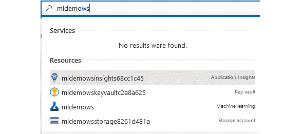

图 3.3 – Azure 门户中搜索 ML 工作区

如您所见，除了主要的 `mldemows` 工作区外，还部署了三个其他服务，即**存储账户**、**密钥保管库**和**应用程序洞察**。由于它们大多数需要唯一的名称，您将在每个名称的末尾看到一个随机的字母数字代码。对于这些附加服务中的每一个，我们可以在部署工作区时提供我们自己的已存在服务。

此外，在稍后的阶段将需要**Azure 容器注册库**，但在工作区初始部署期间不需要它。

现在我们知道了部署了哪些附加服务，让我们来讨论它们为什么存在。

### 机器学习工作区的存储账户

存储账户，通常被称为**默认存储账户**，是工作区的主要数据存储。这种存储对于服务的运行至关重要。它存储了实验运行、模型、快照，甚至源文件，如 Jupyter 笔记本。我们将在*第四章*中更深入地探讨默认工作区存储、Azure 中的许多其他数据存储以及它们如何集成，*数据摄取和管理数据集*。

重要提示

请注意，如果你想在部署工作区时使用自己的存储账户作为默认存储，它不能有分层命名空间（Azure 数据湖）并且不能是高级存储（高性能 SSD）。

### 机器学习工作区的 Azure 密钥保管库

密钥保管库是一种云托管服务，可以存储诸如密码、API 密钥、证书和加密密钥等密钥。服务中的密钥要么存储在软件保管库中，要么存储在托管的**硬件安全模块**（HSM）中。对于机器学习工作区以及任何其他服务，将访问密钥存储在安全环境中至关重要。

到目前为止，我们只处理了相对不重要的信息，例如订阅 ID，但如果我们想从外部存储中拉取数据，我们可能需要一个访问它的密钥或调用另一个服务中的函数，该服务安全地存储了这些信息。你可以判断哪种选择更好。

机器学习工作区的开发者选择了后者。因此，需要一个 Azure 密钥保管库来存储工作区的内部密钥，并为你提供存储任何必要密钥的可能性，以便读取数据集、在计算目标上进行机器学习训练以及将最终模型部署到内部或外部目标。

现在，可能会出现如何安全访问密钥保管库本身的问题。这是通过所谓的**管理身份**来完成的，它为工作区（应用程序）本身提供了一个身份来分配权限。

Azure 上的管理身份

管理身份是赋予应用程序的身份，其行为方式与用户身份相同。

与其他服务一样，在部署过程中，你可以没有任何限制地将已经存在的密钥保管库链接到应用洞察。

### 机器学习工作区的应用洞察

**应用程序洞察**是**Azure Monitor**的一个模块，而**Azure Monitor**是 Azure 中用于监控基础设施和应用程序的套件，它存储和显示基础设施指标，如 CPU 使用率和应用程序的日志文件。

Azure 机器学习工作区使用 Application Insights 存储计算基础设施日志、ML 脚本日志以及 ML 模型运行的定义度量标准，因此对于工作区的操作是必需的。

### Azure 容器注册表用于 ML 工作区

**Azure 容器注册表**（**ACR**）是基于 **Docker 注册表**的服务。它用于存储和管理 Docker 容器镜像和工件。对于工作区，当我们在本地机器之外的计算机上开始运行训练或部署模型时，需要该注册表。在这个过程中，容器被打包并注册到 ACR，然后可以在 ML 脚本或部署管道中跟踪和使用。

重要提示

请注意，默认情况下，ML 服务在基本服务层中部署 ACR。为了减少构建和部署镜像到计算目标的时间，您可能希望将容器注册表服务级别更改为标准或高级。

## 理解工作区内部结构

现在我们已经了解了额外部署的服务，我们将查看工作区本身的内部结构。*图 3.4* 展示了 Azure 机器学习工作区的几乎所有重要方面：

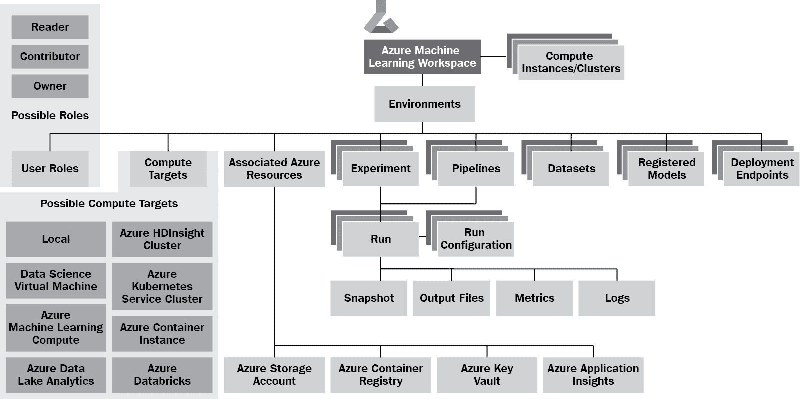

图 3.4 – Azure 机器学习工作区的结构视图

让我们了解这些方面的每一个，除了 **关联的 Azure 资源**，因为我们已经在 *分析已部署的服务* 部分讨论过这一点。

### 用户角色

与 Azure 中的任何其他服务一样，用户身份验证和授权是通过 AAD 以及所谓的 **Azure 基于角色的访问控制**（**Azure RBAC**）来执行的。

Azure 上的基于角色的访问控制

Azure RBAC 用于将 AAD 中的身份（用户、服务主体或托管身份）分配到资源上的特定角色，该角色定义了对资源的访问级别和可以执行的具体细粒度操作。

在 ML 工作区的情况下，我们可以分配 Azure 预定义的基本角色（**所有者**、**贡献者**或**读者**）以及两个自定义角色，名为 **AzureML 数据科学家** 和 **AzureML Metrics Writer**。以下是它们的详细信息：

+   **读者**：此角色允许查看所有内容，但不能更改任何数据或执行任何会改变资源状态的操作（例如，部署计算或更改网络配置）。

+   **贡献者**：此角色允许查看和更改所有内容，但不允许更改资源上的用户角色和权限。

+   **所有者**：此角色允许在特定资源上执行任何操作。

+   **AzureML 数据科学家**：此角色在工作区中不允许执行任何操作，除了创建或删除计算资源或修改工作区设置。

+   **AzureML Metrics Writer**：此角色仅允许将度量标准写入工作区。

除了这些，机器学习工作区不提供额外的自定义角色。

为了在此方面给您提供更精细的控制，基于角色的访问控制（RBAC）允许您构建自己的自定义角色，因为许多用户在机器学习工作区中可以执行的操作在 RBAC 中定义为所谓的**操作**。Azure 机器学习服务所有可用的操作都可以在这个资源提供者列表中找到，[`docs.microsoft.com/en-us/azure/role-based-access-control/resource-provider-operations`](https://docs.microsoft.com/en-us/azure/role-based-access-control/resource-provider-operations)，在名为**Microsoft.MachineLearningServices**的操作组下。

为了获得不同角色的灵感，请查看 Microsoft 建议的常见场景和自定义角色：[`docs.microsoft.com/en-us/azure/machine-learning/how-to-assign-roles#common-scenarios`](https://docs.microsoft.com/en-us/azure/machine-learning/how-to-assign-roles#common-scenarios)。我们将在下一节中查看，您可以在那里定义和分配它们。

### 实验

机器学习的目标——简而言之——是找到一个数学函数，这个函数在算法上很难找到，当给定特定的输入时，尽可能多地产生预期的输出。这个函数通常被称为**机器学习模型**。我们训练的模型可能是一个将声音文件中的声音分配给特定说话者的函数，或者基于类似购买者的购买行为向网络商店中的客户推荐产品的函数（参见*第十三章*，“在 Azure 中构建推荐引擎”）。

要实现这一点，我们需要利用现有的机器学习算法来训练机器学习模型，目标是降低该模型所谓的**损失函数**的输出。这需要调整我们模型的设置，从数学上讲，在最佳情况下，找到所有可能函数的**n**维空间中损失函数的全局最小值。根据我们模型的复杂性，这可能需要大量的迭代。

因此，为了跟踪我们模型训练的迭代过程，我们将它们定义为**运行**，并将它们与一个称为**实验**的结构对齐，该结构收集了我们想要训练的特定模型的全部信息。为此，我们将我们执行的任何训练脚本运行与一个特定的实验关联起来。

### 数据集和数据存储

任何机器学习模型都需要数据来操作，无论是用于训练还是测试。我们可以在脚本中直接链接数据源和不同的数据文件，而不是引用**数据集**，我们可以在工作区内部定义这些数据集。反过来，数据集会从**数据存储**中整理数据，我们可以定义并在工作区中附加这些数据存储。我们将在*第四章*“导入数据和管理数据集”中更详细地介绍如何处理数据、数据集和数据存储。

### 计算目标

为了运行实验，并在以后托管用于推理的模型，我们需要一个**计算目标**。ML 服务在此领域提供了两个选项，如下所示：

+   **计算实例**：一个单独的虚拟机，通常用于开发、作为笔记本服务器或作为训练和推理的目标

+   **计算集群**：一个多节点集群，通常用于复杂训练和推理生产环境

您可以在此处找到支持的计算目标（虚拟机）列表：[`docs.microsoft.com/en-us/azure/machine-learning/concept-compute-target#supported-vm-series-and-sizes`](https://docs.microsoft.com/en-us/azure/machine-learning/concept-compute-target#supported-vm-series-and-sizes)。有关它们定价的更多详细信息，请参阅以下概述：[`azure.microsoft.com/en-us/pricing/details/virtual-machines/linux/`](https://azure.microsoft.com/en-us/pricing/details/virtual-machines/linux/)。

除了这两个选项之外，工作区还提供了一系列其他可能的训练和推理目标。流行的计算选项包括您自己的本地计算机、任何类型的 Spark 引擎（**Apache Spark**、**Azure Databricks**或**Synapse**）用于训练，以及**Azure Kubernetes Service**（**AKS**）用于推理。有关选项的完整更新列表，请参阅[`docs.microsoft.com/en-us/azure/machine-learning/concept-compute-target`](https://docs.microsoft.com/en-us/azure/machine-learning/concept-compute-target)。

### 环境

当你编写一个简单的 Python 脚本并在 Python 解释器中运行它时，你就是在所谓的`numpy`环境中运行它，当然还有你正在运行的操作系统。对于任何我们运行的 ML 脚本也是如此。

对于我们的目的，我们在一个需要特定 Python 版本和某些库的环境中操作，例如 Azure Machine Learning Python SDK 以及包含 ML 算法和工具的库，如**TensorFlow**。对于我们的本地机器，尤其是如果我们想在工作区中的更快计算集群上运行我们的脚本，我们需要一种良好的方法来定义计算目标的 环境。

为了便于操作，工作区为我们提供了定义和注册 ML 环境的能力。这些通常是包含操作系统和每个运行时、库以及依赖项的**Docker 容器**。对于在容器内定义 Python 的库和依赖项，大多数情况下在幕后使用包管理器**Conda**（[`conda.io/`](https://conda.io/））。说到这一点，让我们来分类我们可以工作或创建的环境类型：

+   **精选环境**使用包含典型运行时和 ML 框架的预定义环境。

+   **系统管理的环境**（使用默认行为）从基础镜像开始构建环境，通过 Conda 进行依赖管理。

+   **用户管理的环境**通过从基础镜像开始但允许您通过 Docker 步骤自行处理所有库和依赖项，或者通过创建一个完整的自定义 Docker 镜像来构建环境。

当我们在本章末尾开始我们的第一次实验时，我们将看到如何在我们的机器学习运行中使用环境。

Azure Machine Learning 环境

Azure Machine Learning 环境中的环境是一个包含操作系统以及任何运行时、库和额外依赖项的 Docker 容器。

我们可以得出结论，我们需要在工作区中的计算集群上运行实验时定义一个环境。另一方面，对于我们的本地计算机，我们可以在机器上精心制作的*环境*上运行，并忽略机器学习工作区环境。但是，如果我们要在我们的机器学习脚本中使用 Azure Machine Learning Python SDK 的环境方法，运行将需要某种类型定义的环境。这可以是机器存在的给定环境、本地 Docker 运行时或由 Conda 环境定义支持的运行时。

### 运行

**运行**是在计算目标上实际执行模型训练的过程。在执行运行之前，它需要（在大多数情况下）所谓的**运行配置**。此配置由以下内容组成：

+   **训练脚本**：执行实际机器学习训练的脚本（基本上是将包含所有源文件的源文件夹压缩，并将其发送到计算目标）

+   **环境**：之前描述的机器学习环境

+   **计算目标**：运行将在其中执行的目标计算实例或集群

在本章稍后当我们进行第一次实验时，我们将看到 Azure Machine Learning Python 库中有一个名为`RunConfiguration`的类，需要使用它来执行运行。

Azure Machine Learning 实验运行

运行是在指定计算目标上给定环境中执行训练脚本的过程。

此外，在运行执行期间和之后，它跟踪和收集以下信息：

+   **日志文件**：包括执行过程中生成的日志文件以及我们添加到日志中的任何语句

+   **指标**：包括标准运行指标以及我们希望在运行期间特别跟踪的任何类型的对象（值、图像和表格）

+   **快照**：包括包含我们的训练脚本的源目录的副本（使用我们已为运行配置所需的 ZIP 文件）

+   **输出文件**：包括算法（模型）生成的文件以及我们希望附加到运行中的任何其他文件

我们将在稍后看到，我们可以利用 Azure Machine Learning Python 库中的`Run`类来影响跟踪的内容。

### 已注册的模型

如前所述，我们实验输出的结果是机器学习模型。这个模型基本上是一个数学函数，或者更准确地说，是一个实现函数的代码片段。根据我们使用的机器学习框架，函数以二进制格式存储在一个或多个同名的输出文件中。流行的序列化机器学习模型格式有**pickle**（Python）、**H5**（Keras）、**Protobuf**（TensorFlow 和 Caffe）以及其他自定义格式。

由于所有不同运行的结果都会**仅仅**存储在运行本身的输出文件中，工作区提供了将模型注册到**模型注册表**的能力。在注册表中，模型以名称和版本存储。每次添加具有相同名称的模型时，注册表都会添加一个新版本的新模型，并带有新的版本号。此外，您还可以使用元信息标记每个模型，例如所使用的框架。

Azure Machine Learning 模型注册表

Azure Machine Learning 中的模型注册表存储已注册模型的名称和版本，以进行跟踪和部署。

最后，模型注册表帮助您跟踪通过训练获得的不同结果，并允许您将不同版本的模型部署到生产、开发和测试环境。

### 部署和部署端点

一旦模型经过训练并注册，就可以将其打包为一个服务——通过定义入口脚本和环境——并部署到计算目标。入口脚本的任务是在初始化期间加载模型，以及解析用户输入、评估模型并返回用户请求的结果。这个过程在 Azure Machine Learning 中被称为**部署**。部署的计算目标可以是管理服务，如**Azure 容器实例（ACI）**或**Azure Kubernetes 服务（AKS）**，或者一个完全由用户管理的 AKS 集群。每个部署通常只服务于单个模型。

如果您想将多个模型部署抽象为一个共同的端点，您可以定义一个**端点服务**。这是推出多个模型版本、执行**蓝绿部署**或**A/B 测试**的常见需求。端点是 Azure Machine Learning 中的一个独立服务，为多个模型部署提供了一个共同的域名，执行**安全套接字层（SSL）**/**传输层安全性（TLS）**终止，并允许在部署之间分配流量。端点也可以部署到多个计算目标，包括 ACI 和 AKS。

Azure Machine Learning 端点

Azure Machine Learning 中的部署端点是一个提供访问和测试多个模型版本共同域名的服务。

对于部署和端点，我们区分了**在线评分**和**批量评分**：

+   **在线评分**：对单个输入记录（或小批量的输入记录）进行同步评估，其中输入数据和评分结果直接在请求和响应中传递。

+   **批量评分**：用户通常将输入数据的位置传递给请求，而不是在请求中发送输入数据。在这种情况下，模型异步评估并提供输出位置的结果。

我们将在*第十四章*“模型部署、端点和操作”中更详细地讨论模型的部署和端点。

### 管道

最后要提到的是**ML 管道**。到目前为止，我们所讨论的内容可能已经足够我们自己进行一些数据准备、模型训练、模型部署和推理。但即使这样，我们也可以通过一些脚本使用 Azure CLI 自动化大多数步骤，并对我们的设置感到非常满意。

现在，假设我们想要与团队合作，并在有新的训练数据时自动重新训练和部署我们的模型。我们可能需要再次运行类似的步骤，例如预处理、训练和优化——只是这次使用新的训练数据。这个过程通常在训练数据和推理数据之间存在重大数据漂移时重复。这就是我们需要考虑引入来自 DevOps 的想法和解决方案的时候，因为最终，我们也将编写代码并将基础设施部署到生产环境。

因此，我们使用管道来简化工作流程，并将自动化引入 ML 链的每个步骤；我们将在*第八章*“Azure 机器学习管道”中更详细地探讨它们。管道也是 MLOps 的组成部分之一，我们将在*第十六章*“使用 MLOps 将模型投入生产”中看到它们的应用。

## 检查 Azure 机器学习工作室

既然我们已经很好地了解了工作空间的功能，那么让我们继续之前中断的地方，看看 Azure 门户和**Azure 机器学习工作室**，这是操作 ML 流程每个方面的网络服务。这次，再次搜索我们的工作空间名称，并点击**mldemows**，ML 工作空间。您将看到左侧典型的 Azure 资源菜单结构和右侧服务的**概述**页面，如图 3.5 所示：

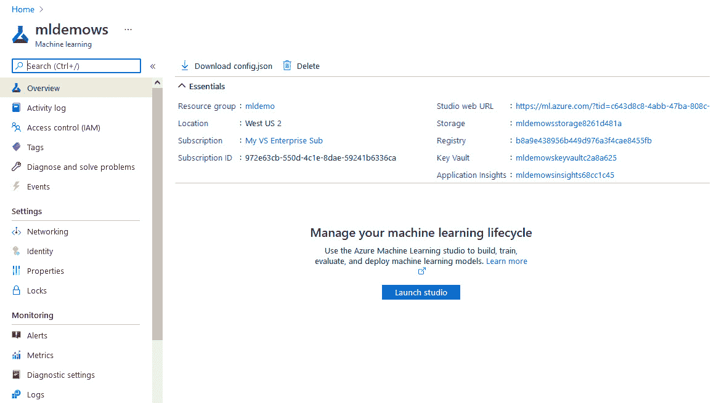

图 3.5 – Azure 资源视图

从基础设施的角度来看，这是管理视图。您需要记住的主要关注点是以下内容：

+   **概述**：显示工作空间名称和附加服务的面板以及启动 ML 工作室的按钮。

+   **访问控制（IAM**）：设置用户对工作区每个方面的访问权限的面板，如上一节所述。

+   **网络**：通过激活工作区的**私有端点**，将服务集成到私有虚拟网络中的面板。

+   **身份**：显示工作区已创建的管理身份的面板，可用于通过 RBAC 授予工作区访问外部 Azure 服务（如存储帐户）的权限。

+   **使用量 + 配额**：访问订阅中可用配额的面板，该配额定义了用户在订阅内可以部署多少个类型的虚拟机核心。

通过在概述页上点击**启动工作室**按钮，实际的 Azure 机器学习工作室将在新标签页中打开，并以*图 3.6*中显示的视图欢迎您。

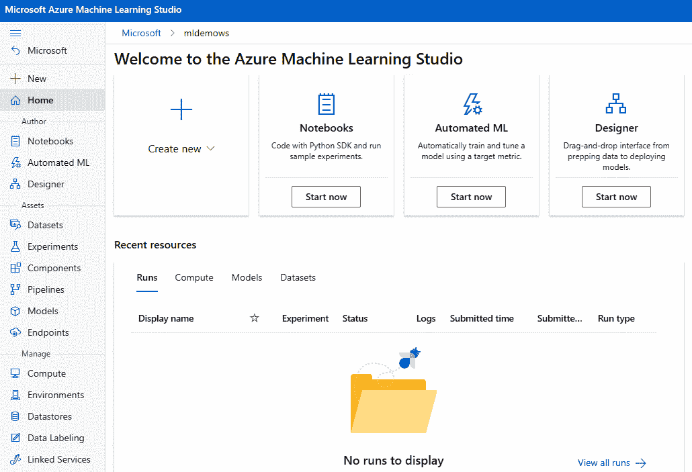

图 3.6 – Azure 机器学习工作室主页

您可以通过这个网络应用完成本书中将要做的所有事情，但在某些领域，这可能会很麻烦。我们将在下一节中详细讨论我们如何设置和操作我们的开发环境，但了解这个网络服务是一个好主意，因为我们将贯穿全书回到它。

看看左侧的菜单，有三个主要类别，即**作者**、**资产**和**管理**。让我们将我们对工作区的了解与我们在网络服务中看到的内容进行匹配。

### 作者

菜单的第一部分显示了您编写机器学习实验的选项。具体如下：

+   **笔记本**：通过云中的笔记本**虚拟机（VM**）（计算实例）创建和编写 Jupyter 笔记本。

+   **自动化机器学习**：通过向导创建机器学习模型，根据您提供的数据集和要解决的问题提供见解和建议。

+   **设计器**：通过 GUI 界面使用逻辑构建块构建机器学习模型。

我们已经在*第二章*中讨论了为什么我们更喜欢在 Azure 中选择合适的机器学习服务，即*选择 Azure 中的正确机器学习服务*。我们将在本书的*第十一章*中回到自动化机器学习，即*超参数调整和自动化机器学习*。

目前，我们可以通过两种方式来创建我们的笔记本：要么在云服务环境中工作并利用云中的计算实例上的 Jupyter 服务器，要么使用本地计算机上的本地 Jupyter 服务器进行工作。

重要提示

我们将在本书的大部分内容中保持在我们自己的本地环境中，但请注意，在一个更大的团队中，可能有必要在云中有一个笔记本服务器。

### 资产

菜单的第二部分显示了您在脚本中可以使用的资产。具体如下：

+   **数据集**：在工作区中查看和创建数据集，并配置数据集监控以了解训练数据和部署模型的推理数据之间的数据漂移（想象一下在生产中放置位置不同的传感器，或者在收集测试数据时突然损坏）。

+   **实验**：查看所有实验和所有已跟踪的运行，包括它们的详细运行统计信息（指标、快照、日志和输出）以及计算目标的监控日志。

+   **管道**：创建管道、查看管道运行并定义管道端点。

+   **模型**：注册模型并查看它们的属性，包括它们的版本、它们使用的数据集、它们由哪些工件组成以及它们正在积极部署到的端点。

+   **端点**：查看和创建 Web 服务端点。

通过这些页面，我们可以看到我们已经讨论过的许多工作区项目，从数据集到模型训练，通过实验及其运行，注册模型，以及为我们的部署公开服务端点，直到通过 ML 管道管理所有这些。

您可能已经看到了一些其他附加功能，例如 **数据集监控**，我们将在 *第四章* *数据摄取和管理数据集* 中再次讨论。

当我们在 Azure Machine Learning Studio 中展示了实验和运行时，我们将在本章末尾更详细地查看实验和运行统计信息。

### 管理

菜单的最后部分显示了我们可以管理的工作区中的机器和服务。它们如下：

+   **计算**：创建、查看和管理计算实例、计算集群、推理集群以及其他附加的计算（例如，外部虚拟机或 Databricks 集群），包括已执行的运行、节点上的运行分布（如果存在）以及基础设施本身的监控（例如，CPU 使用率）。

+   **环境**：查看可用的精选环境，并从 Python 虚拟环境、Conda YAML 配置、存储在容器注册表的 Docker 镜像或您的 Docker 文件中创建自己的自定义环境。

+   `workspacefilestore` 和 `workspaceblobstore`）、全局 Azure Machine Learning 数据集存储库 (`azureml_globaldatasets`)、以及任何已附加的外部存储或附加新的存储，包括 Azure Data Lake、Azure Blob 存储空间、Azure 文件共享和 Azure SQL、MySQL 以及 PostgreSQL 数据库。

+   **数据标注**：为图像分类和目标检测创建标注项目。

+   **链接服务**：将 Azure Synapse Spark 池链接到工作区。

在这些视图中，我们发现了一些缺失的最终组件，包括工作区中的计算目标、环境以及我们可用的数据存储，我们从这些数据存储中获取数据集用于建模。此外，我们还发现了一个服务，可以帮助我们对源文件（通常是图像）进行数据标注，以及将 Azure Synapse 链接到我们的工作区的可能性。

我们将在下一章中详细介绍数据存储，并在第六章“特征工程和标注”中详细介绍数据标注。我们不会在本书中详细讨论 Azure Synapse 集成。

现在我们已经对 Azure 机器学习服务的功能和工具有了良好的概述，我们可以回到我们的本地机器，并开始使用 Azure 机器学习进行我们的第一次实验。

# 使用 Azure 机器学习运行 ML 实验

到目前为止，我们已经在本地上安装了 Azure CLI，将我们的 ML 工作区部署到我们的 Azure 订阅中，并查看了 Azure 机器学习工作区的功能和功能。

在本章的最后部分，我们将设置我们的本地环境，包括 Python、Azure 机器学习 Python SDK，以及可选的 Visual Studio Code，并在本地以及云中的计算目标上进行我们的第一次实验。

## 设置本地环境

在一开始，我们简要讨论了通过 Azure 资源管理器部署 Azure 资源的工具。同样，让我们看看从我们的本地环境编写和编排工作区的选项。选项如下：

+   使用 Python 3、Azure 机器学习 Python SDK、Jupyter Python 扩展和 Azure ML CLI（1.0/2.0）扩展（以及选择的编辑器）

+   使用 Python3、Azure 机器学习 Python SDK、Azure ML CLI（1.0/2.0）扩展、**Visual Studio Code (VS Code**)以及 VS Code 扩展（Azure、Azure 机器学习、Jupyter 等）

+   使用 Python3、Azure ML CLI 2.0 扩展、YAML 和 VS Code（或选择的编辑器）

+   使用 R、Azure ML CLI 2.0 扩展、YAML 和 VS Code（或选择的编辑器）

在撰写本文时，前两种选项是事实上的标准，我们将主要关注本书中的这两种选项。我们将使用 Azure 机器学习 Python SDK 和 Python 3，如果您更喜欢主要从控制台使用源文件和可选的编辑器，或者如果您想使用**集成开发环境（IDE）**，如 VS Code，它自带功能丰富的编辑器和针对 Azure、Azure 机器学习和 Jupyter 的有用扩展，那么请由您决定。

在这两种情况下，我们将编写一个 Jupyter 笔记本来编排我们在工作区上的 ML 实验，以及一个或多个 Python 源文件来实现训练过程。

后两个选项是在更广泛的 **Azure ML CLI 2.0** 中引入的。我们不再将工作区的编排（运行配置、环境、部署和端点）与训练和推理源代码分离，而是通过 YAML 配置文件来实现。一个 ML 实验运行的示例如下：

```py
$schema: https://.../commandJob.schema.json
code:
  local_path: <path-to-python-scripts>
command: python <script-name> --data {inputs.trainingData1}
environment:
  docker:
    image: docker.io/python
compute:
  target: azureml:goazurego
inputs:
  trainingData1:
    mode: mount
    data:
      local_path: <path-to-training-data>
```

如您所见，这种 YAML 结构引用了要执行的实际代码（`code`）、要使用的运行时（`command`），并以描述性的方式定义了训练运行所需的每个部分（`environment`、`compute` 和 `data`）。

YAML 配置

YAML 配置文件是一种描述性的方法来运行实验、创建计算服务和端点，并在 Azure Machine Learning 中部署模型。

这是一种更结构化的思考任务的方式，当我们在 *第十六章* “使用 MLOps 将模型投入生产”中讨论生产系统和 MLOps 时会很有用。最后，这是唯一允许以 **R** 语言（数据科学的领域特定语言）编写源文件的选项，并且通过 Azure Machine Learning VS Code 扩展在 VS Code 中得到了高度支持。

### 设置 Python 环境

现在我们对可以与之一起工作的可能本地开发环境有了很好的了解，让我们设置我们的 Python 环境：

重要提示

如果您在自己的本地机器上运行实验，而不是在 Azure Machine Learning Studio 编写环境中使用笔记本计算实例或 Azure 中的 **数据科学虚拟机**（**DSVM**），则必须执行以下操作。

1.  首先，通过运行以下命令检查您的系统上是否已安装 Python 版本：

    ```py
    $ python --version
    ```

1.  接下来，请检查 https://pypi.org/project/azureml-sdk/ 上的 Azure Machine Learning Python 扩展的元数据。有时，扩展可能落后于最新的 Python 版本。如果您已经在系统上安装了不受支持的 Python 版本，请卸载该版本或查阅如何在同一台机器上操作多个 Python 环境的说明。

1.  在您验证了支持的 Python 版本后，您可以选择访问 [`www.python.org/`](https://www.python.org/) 并查找 Windows 和 macOS 的支持版本，或者使用 Linux 发行版的终端和 `apt-get` 命令。以 Python 3.8 为例，它看起来可能如下所示：

    ```py
    $ sudo apt-get install python3.8
    ```

1.  如果您是第一次安装 Python 或重新安装了它，请检查 Python 是否已正确集成到路径环境变量中，方法是检查 Python 版本（见 *步骤 1*）。如果一切正常，我们可以继续运行以下命令来安装 SDK：

    ```py
    $ python -m pip install azureml-sdk
    ```

如果此命令正在尝试解析大量依赖项，您可能仍在使用不受支持的 Python 版本或包安装程序 **PIP**。

1.  如果您想使用 VS Code，现在可以跳到下一段。如果您主要使用命令行，请安装本地 JupyterLab 或本地 Jupyter 笔记本服务器 ([`jupyter.org/index.html`](https://jupyter.org/index.html))，可以使用以下命令之一：

    ```py
    $ python -m pip install jupyterlab 
    $ python -m pip install notebook
    ```

之后，您可以从命令行启动任一环境，如下所示：

```py
$ jupyter-lab
$ jupyter notebook
```

使用此版本的设置，您现在可以继续到 *使用 Azure 机器学习运行简单实验* 部分。

### 设置 Visual Studio Code

VS Code 是一个轻量级但功能强大的集成开发环境。它与 Azure、Azure 机器学习和 Git 高度集成，拥有一个非常好的编辑器、一个集成终端以及一个长长的可选扩展列表。

让我们来看看它：

1.  您可以从 [`code.visualstudio.com/`](https://code.visualstudio.com/) 或通过 Azure 市场下载此工具并安装。

1.  打开它后，您将看到如图 3.7 所示的视图（可能主题较暗）：


图 3.7 – VS Code 界面

1.  如果您点击顶部的 `>主题` 并查找 `>首选项：颜色主题`。

点击它将为您提供快速设置 UI 主题的方法。

1.  现在，要打开终端，您可以再次点击顶部的 `az` 菜单，以查看如图 3.7 所示的内容。

1.  查看左侧菜单，您将找到一个 **资源管理器** 选项卡，您可以在此添加源文件夹和文件，一个 **源代码管理** 选项卡以连接到 Git，一个 **运行和调试** 选项卡，它允许您处理代码的调试，以及一个 **扩展** 选项卡，您可以在此搜索 VS Code 扩展。

切换到 **扩展** 选项卡，搜索并安装以下扩展（如果尚未安装）：**Azure Tools**、**Azure Machine Learning**、**Python**、**Pylance**、**YAML** 和 **Jupyter**。

1.  安装完成后，您将在左侧菜单中找到一个名为 `sign in azure` 的新选项卡，您将找到登录的方法。

在您完成 Azure 登录后，**Azure** 选项卡将填充您的订阅名称、资源组以及您可能拥有的任何资源。如果您查看 **机器学习** 标题下，您也会找到之前部署的工作区，如图 3.8 所示：

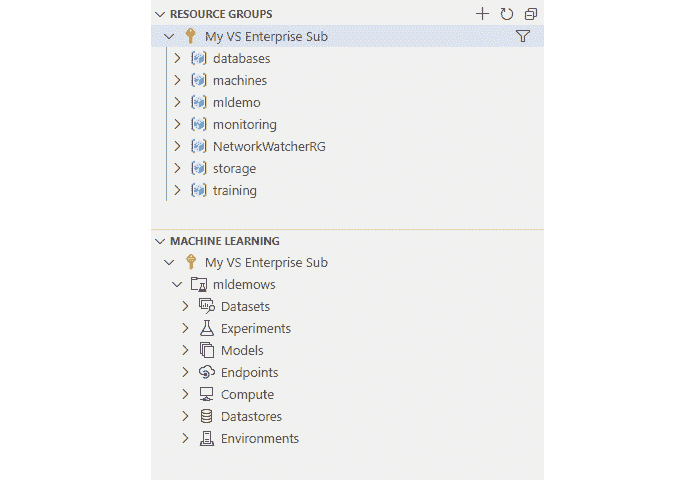

图 3.8 – VS Code Azure 机器学习扩展

1.  在下一节中，下载本章所需的文件以进行操作。只需通过 **文件** | **打开文件夹…** 打开文件夹，它们将被添加到 **资源管理器** 选项卡中，从这里您可以开始旅程。

VS Code 有更多功能，但我们将主要集中理解机器学习（ML）和 Azure 机器学习工作区，而不是操作此编辑器的各个方面。如果您需要更多关于使用 VS Code 的帮助，请随时访问 [`code.visualstudio.com/docs/introvideos/basics`](https://code.visualstudio.com/docs/introvideos/basics) 或任何其他可以帮助您的资源。

## 增强简单实验

Azure 机器学习的伟大用例之一是将高级日志记录、跟踪和监控功能添加到您现有的机器学习脚本和管道中。想象一下，您有一个中央位置来跟踪所有数据科学家的所有机器学习实验，监控训练和验证指标，上传您的训练模型和其他输出文件，并在每次执行新的训练运行时保存当前环境的快照。您可以通过在训练脚本中添加几行代码来实现这一点。

我们将首先向一个 **Keras** ([`keras.io`](https://keras.io)) 机器学习训练脚本添加 Azure 机器学习工作区功能。Keras 是我们可以选择的许多机器学习库之一，具体取决于我们需要的机器学习算法。

### 工作目录和准备

在我们开始之前，请从存储库下载本章的代码文件，并将它们提取到您首选的工作目录中。之后，您可以在控制台中切换到该目录，或者在 VS Code 中将其打开为文件夹。

在任何情况下，您都会在目录中找到以下文件：

+   `.azureml/config.json`: Azure 机器学习工作区配置文件

+   `.azureml/requirements.txt`: Python PIP 环境需求

+   `00_setup_env.sh`: 一个 shell 脚本，用于从头开始设置 Azure CLI 和 Python 环境（就像我们之前做的那样）

+   `01_setup_azure_ml_ws.sh`: 一个 shell 脚本，用于设置 Azure 机器学习工作区（就像我们之前做的那样）

+   `0x_run_experiment_*.ipynb`: 为即将进行的实验提供的多个 Jupyter 笔记本

+   `04_setup_azure_ml_compute.sh`: 一个 shell 脚本，用于从 YAML 配置创建工作区计算实例

+   `compute.yml`: 工作区计算实例的 YAML 配置文件

+   `code/*.py`: 包含我们将使用的 Python 模型训练脚本的文件夹

+   `.amlignore`: 一个文件，表示运行快照应该忽略的所有内容

让我们从我们的第一个实验开始：

1.  首先，我们需要安装我们将需要的缺失 Python 包，以便进行以下实验。运行以下命令，该命令将安装 PIP 需求文件中定义的包：

    ```py
    $ python -m pip install -r .azureml/requirements.txt
    ```

PIP 将指出 Azure 机器学习 SDK 已经安装。

1.  接下来，打开 `config.json` 文件，在 `subscription_id` 键之后输入您的订阅 ID。这是必要的，因为我们将在所有笔记本中使用以下代码加载此配置：

    ```py
    from azureml.core import Workspace
    ws = Workspace.from_config()
    ```

`from_config()`方法会在当前工作目录或名为`.azureml`的目录中寻找一个名为`config.json`的文件。我们将选择将其添加到文件夹中，因为它包含在`.amlignore`文件中。

1.  打开`02_run_experiment_keras_base.ipynb`笔记本。

在以下内容中，我们将查看笔记本，以了解实际的模型训练脚本，如何将快照、输出和日志添加到 Azure 机器学习实验中，以及如何将最佳模型编目到模型注册表中。

### Keras 的训练脚本

导航到笔记本中的第二个块。想象这部分是你的原始机器学习训练文件（加上你将在最后一段找到的`model.fit()`函数）。

让我们了解实际的训练代码。

首先，我们从`tensorflow`库（Keras 是 TensorFlow 的一部分）导入所需的类：

```py
import tensorflow
from tensorflow.keras.datasets import cifar10
…
```

然后，我们继续从 CIFAR-10 数据集中获取我们的训练和测试数据，并将其转换为有用的格式。`cifar10.load_data()`函数将训练集填充 50,000 个数据点，测试集填充 10,000 个数据点：

```py
(x_train, y_train), (x_test, y_test) = cifar10.load_data()
…
y_train = tensorflow.keras.utils.to_categorical
                         (y_train, num_classes)
…
```

测试和训练数据集

训练数据集由我们训练模型的数据点组成；测试数据集由我们在模型训练后用于评估模型的数据点组成。这些数据点应该完全不同。

之后，我们开始定义我们的模型——在这种情况下，一个`Sequential`模型（[`keras.io/guides/sequential_model/`](https://keras.io/guides/sequential_model/））——并设置模型的名称和输出位置。我们将使用之前提到的**HDF5**文件格式（或简称 H5）：

```py
model = Sequential()
…
model_name       = 'keras_cifar10_trained_model.h5'
model_output_dir = os.path.join(os.getcwd(), 'outputs')
```

之后，我们定义了一个优化器（在这种情况下是`RMSProp`），一个检查点`loss`函数，`optimizer`，以及训练运行期间要跟踪的额外`metrics`：

```py
opt = RMSprop(learning_rate=0.0001, decay=1e-6)
…
checkpoint_cb = ModelCheckpoint(model_path, 
                                monitor='val_loss',
                                save_best_only=True)
…
model.compile(loss='categorical_crossentropy', 
              optimizer=opt, 
              metrics=['accuracy'])
```

原脚本中本应完成的部分位于笔记本的最后一段，我们稍后会讨论：

```py
model.fit(x_train, y_train,
          batch_size=batch_size,
          epochs=epochs,
          validation_data=(x_test, y_test),
          shuffle=True,
          callbacks=[azureml_cb, checkpoint_cb])
```

如您所见，这是笔记本中的大部分代码。其余的代码是你需要添加到脚本中以启用实验运行跟踪的部分，我们将在下面分析。

### 跟踪快照、输出和日志

现在，我们将查看我们之前忽略的代码。首先，回到我们之前跳过的笔记本的第一个块：

```py
from azureml.core import Workspace, Experiment
ws  = Workspace.from_config()
exp = Experiment(workspace=ws, name="cifar10_cnn_local")
```

在此片段中，我们使用配置文件定义了一个名为`ws`的工作区对象，作为第二步，我们定义了一个名为`exp`的实验对象，以便在指定的名称下跟踪定义的工作区。如您所见，我们将其命名为`cifar10_cnn_local`，因为我们将利用 CIFAR-10 数据集([`www.kaggle.com/c/cifar-10`](https://www.kaggle.com/c/cifar-10))，我们将运行一个**卷积神经网络**（**CNN**），并且我们将在本地机器上运行。如果已存在具有相同名称的实验，则此调用将返回现有实验的句柄；否则，将创建一个新的实验。通过给定的名称，现在所有此实验中的运行都分组在一起，可以在单个仪表板上显示和分析。

重要提示

运行此代码块可能会打开一个网站以登录您的 Azure 账户。这被称为交互式身份验证。请执行此操作以授予您的当前执行环境访问 Azure 机器学习工作区的权限。如果您运行的是非交互式 Python 脚本而不是笔记本环境，您可以通过此处描述的其他方式提供 Azure CLI 凭据：https://docs.microsoft.com/en-us/azure/machine-learning/how-to-setup-authentication#use-interactive-authentication。

一旦您已成功将工作区链接到`ws`对象，您就可以继续为您的 ML 实验添加跟踪功能。我们将使用此对象创建实验、运行、记录指标，并在我们的 Azure 机器学习工作区中注册模型。

现在，让我们跳到最后一个代码块，我们将在此处运行实验。如前所述，运行是您实验（您的训练脚本）的单次执行，具有不同的设置、模型、代码和数据，但具有相同的可比较指标。您使用运行来测试给定实验的多个假设，并在同一实验中跟踪所有结果。

通常，我们可以创建一个`run`对象，并通过调用以下函数来开始在此处记录这个运行：

```py
# Create and start an interactive run
run = exp.start_logging(snapshot_directory='.')
```

上述代码不仅创建并初始化了一个新的运行，还通过`snapshot_directory`参数定义的当前环境快照，并将其上传到 Azure 机器学习工作区。要禁用此功能，您需要明确将`snapshot_directory=None`传递给`start_logging()`函数。

在这种情况下，快照将获取当前目录中存在的所有文件和文件夹。为了限制这一点，我们可以使用`.amlignore`文件指定要忽略的文件和文件夹。

在最后一个笔记本代码块中查看代码本身，您可以看到这并不是之前显示的相同行代码。

这是因为将训练代码包裹在`try`和`except`块中是一种良好的实践，以便在 Azure 中传播运行状态。如果训练运行失败，那么该运行将在 Azure 中报告为失败的运行。您可以通过以下代码片段实现这一点：

```py
run = exp.start_logging(snapshot_directory='.')
try:
  # train your model here
  run.complete()
except:
  run.cancel()
  raise
```

我们添加了 `raise` 语句，以便在脚本发生错误时失败。这通常不会发生，因为所有异常都被捕获。你可以通过在 Python 中使用 `with` 语句来简化前面的代码。这将产生相同的结果，并且更容易阅读：

```py
with exp.start_logging(snapshot_directory='.') as run:
  # train your model here
  pass
```

通过仅使用这一行代码，你可以自动跟踪每次实验运行执行的快照，因此永远不会丢失代码或配置，并且始终可以回到用于你的 ML 运行之一的特定代码、参数或模型。这目前可能并不那么令人印象深刻，但我们只是刚开始使用 Azure Machine Learning 的功能。

现在，执行这个笔记本中的每个代码块，并等待完成。

执行后，回到 Azure Machine Learning Studio，导航到 `cifar10_cnn_local`。当你点击它时，你会在图表中看到一些指标以及与实验关联的运行列表。点击最近的运行，然后点击 `.azureml`）。

*图 3.9* 显示了实验中运行的已上传快照文件：

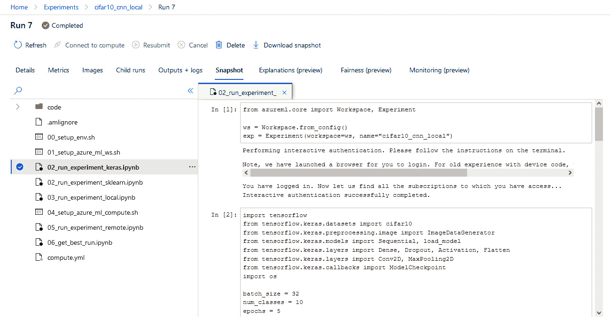

图 3.9 – 实验运行快照视图

除了在运行开始之前上传的 `snapshot` 目录之外，我们还会在运行结束后由 ML 脚本创建两个额外的目录，即 `outputs` 和 `logs`。

一旦使用 `run.complete()` 完成一次运行，`outputs` 目录中的所有内容将自动上传到 Azure Machine Learning 工作区。在我们的简单示例中，使用 Keras，我们可以使用检查点回调来仅将所有 epoch 中的 *最佳模型* 存储到 `outputs` 目录，然后与我们的运行一起跟踪。看看这个示例代码：

```py
import os
from keras.calbacks import ModelCheckpoint
model_output_dir = os.path.join(os.getcwd(), 'outputs')
model_name       = 'keras_cifar10_trained_model.h5'
model_path       = os.path.join(model_output_dir, model_name)
# define a checkpoint callback
checkpoint_cb = ModelCheckpoint(model_path,
                                monitor='val_loss',
                                save_best_only=True)
# train the model
model.fit(x_train, y_train,
          batch_size=batch_size,
          epochs=epochs,
          validation_split=0.2,
          shuffle=True,
          callbacks=[checkpoint_cb])
```

在前面的代码中，我们训练了一个 Keras 模型五个 epoch。这个过程将 20% (`validation_split`) 的训练数据作为所谓的验证集分开。

验证数据集

验证集是第三组数据点，模型在模型训练期间将针对这些数据点进行评估。它既不应是训练数据的子集，也不应是测试数据。

之后，该函数会遍历每个 epoch，使用打乱顺序的 (`shuffle=True`) 训练数据集。在每个 epoch 中，如果该 epoch 的模型在验证集上表现更好，它将覆盖定义的 `output` 文件夹中的模型文件，我们通过具有更低的验证损失 (`monitor='val_loss'`) 来定义验证集。因此，我们最终只会在 `output` 文件夹中存储最佳模型。因此，每次我们使用之前的实验跟踪运行训练时，一旦运行完成，模型就会自动上传。

如果你回到笔记本中的第二个代码块，你会看到我们已经在代码中添加了检查点回调。那么让我们看看我们得到了什么。

在 Azure Machine Learning Studio 中，导航到 `keras_cifar10_trained_model.h5`，已上传到 Azure Machine Learning 工作区。

这也非常方便，因为你不会再失去对训练好的模型的跟踪。除此之外，你在这里看到的所有工件都存储在工作区的 Blob 存储中，它具有高度可扩展性和低成本。

*图 3.10* 展示了实验运行中产生的额外输出和日志信息：


图 3.10 – 实验运行输出和日志

`logs` 目录包含来自 Keras 的日志输出，你也在执行最后一个块时的 Jupyter 笔记本中看到了。在当前运行中，这是在运行完成后上传的，包括 `output` 文件夹和模型。

Azure Machine Learning 日志流式传输

Azure Machine Learning 日志流式传输允许你在运行执行时在 Azure Machine Learning Studio 中查看日志。

我们稍后会看到，如果通过 `ScriptRunConfig` 而不是直接执行来调用训练脚本，日志将会 **流式传输** 到工作区（也请参阅 **启用日志流式传输** 按钮）。这将允许你在运行进行时在这里查看日志。

### 将模型编目到模型注册库

作为最后一步，我们希望将存储在 `output` 文件夹中的最佳模型注册到 Azure Machine Learning 工作空间中的模型注册库。

如果我们再次导航到笔记本的最后一个块，我们可以看到最后几行是这样的：

```py
# Upload the best model
run.upload_file(model_name, model_path)
# Register the best model
run.register_model(model_name, model_path=model_name, 
    model_framework='TfKeras')
```

在这里，我们首先强制上传模型。这是必要的，因为所有输出资源只有在运行完成后才会上传，而不是立即上传。因此，在模型上传后，我们可以通过调用 `run.register_model()` 方法简单地将其注册到模型注册库中。

如果你从 `cifar10_cnn_local` 实验导航到 Azure Machine Learning Studio 中的 `keras_cifar10_trained_model.h5`。如果你点击它，你将在 **详细信息** 下找到关于模型的详细信息，包括版本号，你将在 **工件** 下找到我们创建的实际模型文件。

*图 3.11* 展示了注册模型的详细信息：

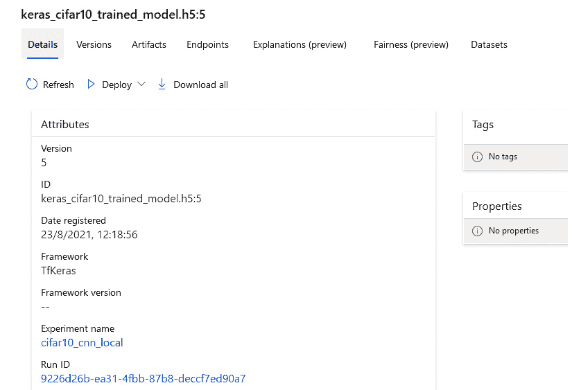

图 3.11 – Azure Machine Learning 模型注册库中的注册模型

该模型可以从 Azure Machine Learning 服务进行自动部署。我们将在 *第十四章*，*模型部署、端点和操作* 和 *第十一章*，*超参数调整和自动化机器学习* 中更详细地探讨这一点。

现在我们已经知道了如何运行一个简单的实验，接下来让我们学习如何在下一节中记录指标和跟踪结果。

## 记录指标和跟踪结果

我们已经在我们的 Azure Machine Learning 工作区中看到了三个用于跟踪快照代码、上传输出工件和注册训练模型文件的有用功能。正如我们所见，这些功能可以通过几行代码添加到任何现有的实验和训练 Python 脚本或笔记本中。以类似的方式，我们也可以扩展实验脚本以跟踪所有类型的变量，例如每个 epoch 的训练准确率和验证损失，以及最佳模型的测试集准确率。

使用`run.log()`方法，你可以在训练和实验过程中跟踪任何参数。你只需提供一个名称和值，Azure 就会为你完成剩余的工作。后端会自动检测你是否发送了一个值列表——因此当你多次记录相同值时，会有多个具有相同键的值——或者每个运行一个单独的值，例如测试性能。在 Azure Machine Learning Studio 中，这些值将自动用于可视化你的整体训练性能。

到目前为止，我们的 Keras 模型默认通过模型编译跟踪*损失*作为指标，并通过我们的模型编译跟踪模型的*准确率*。我们只是没有将它们记录到工作区中。

我们之前讨论了脚本中使用的不同数据集，即训练数据集、验证数据集和测试数据集。请记住，验证数据集在每个 epoch 结束时进行评估，这也意味着我们可以在每个 epoch 结束时获得**验证损失**和**验证准确率**。进一步地，在我们找到所有 epoch 的最佳模型之后，我们希望评估这个模型与测试数据，而这我们还没有做。这导致了模型的*测试损失*和*测试准确率*。

在以下内容中，我们将首先将测试指标添加到我们的运行中，然后是验证指标，然后在 Azure Machine Learning Studio 中查看它们。最后，我们将增强代码，以便只有当模型比之前运行中的所有模型都好时才注册模型。请随意打开`02_run_experiment_keras_enhanced.ipynb`笔记本以跟随操作。

### 最佳模型的评估

目标是评估所有 epoch 的最佳训练模型与测试数据集以获得整体测试指标。为了做到这一点，我们需要将其重新加载到我们的模型对象中。幸运的是，我们已经在之前定义的 checkpoint 回调中，只将整个运行的最好模型存储到了我们的`output`文件夹中。让我们看看代码：

```py
# load the overall best model into the model object
model = load_model(model_path)
# evaluate the best model against the test dataset
scores = model.evaluate(x_test, y_test, verbose=1)
print('Test loss of best model:', scores[0])
run.log('Test loss', scores[0])
print('Test accuracy of best model:', scores[1])
run.log('Test accuracy', scores[1])
```

如你所见，我们得到了最佳模型，然后对其进行评估，提取损失（`scores[0]`）和准确率（`scores[1]`）。完成这部分后，让我们看看验证指标。

### Keras 的验证指标回调

目标是在每个 epoch 中评估创建的模型与验证数据集，以获取每个 epoch 的验证指标。我们已使用现有的回调在每个 epoch 中检查最佳模型，所以自己编写一个来跟踪每个 epoch 的指标可能是个好主意。

在`code`目录下打开`keras_azure_ml_cb.py`文件。你会看到以下内容：

```py
from keras.callbacks import Callback
import numpy as np
class AzureMlKerasCallback(Callback):
    def __init__(self, run):
        super(AzureMlKerasCallback, self).__init__()
        self.run = run
    def on_epoch_end(self, epoch, logs=None):
        # logs is filled by Keras at the end of an epoch
        logs = logs or {}
        for metric_name, metric_val in logs.items():
          if isinstance(metric_val, (np.ndarray, np.generic)):
           self.run.log_list(metric_name, metric_val.tolist())
          else:
           self.run.log(metric_name, metric_val)
```

之前的代码实现了一个简单的 Keras 回调函数。当回调执行时，Keras 会将当前 epoch 以及所有训练和验证指标作为字典（`logs`）传递。

然后，对于所有字典条目，我们提取名称和值，使用`run.log(metric_name,metric_val)`函数将它们记录到实验运行中。我们只需检查值是单个值还是数组类型，因为 Azure Machine Learning SDK 有一个名为`run.log_list()`的不同函数，用于多值条目。

我们现在可以使用这个回调在我们的模型训练中，就像我们之前使用回调一样，通过将其添加到`model.fit()`函数中：

```py
# create an Azure Machine Learning monitor callback
azureml_cb = AzureMlKerasCallback(run)
model.fit(x_train, y_train,
  batch_size=batch_size,
  epochs=epochs,
  validation_data=(x_test, y_test),
  callbacks=[azureml_cb, checkpoint_cb])
```

这通过使用回调函数在 Azure Machine Learning 服务中跟踪训练和验证损失以及准确度，自然地扩展了 Keras。现在，模型本身上定义的任何指标都将自动在实验运行中跟踪。

### 在 Azure Machine Learning Studio 中运行指标可视化

在我们向实验运行添加了一堆指标之后，让我们按原样运行笔记本，并在 Azure Machine Learning Studio 中查看运行统计信息。

当你打开运行时，**指标**列表的类型，就像验证指标一样，都会自动转换为折线图并绘制出来，如图*图 3.12*所示：

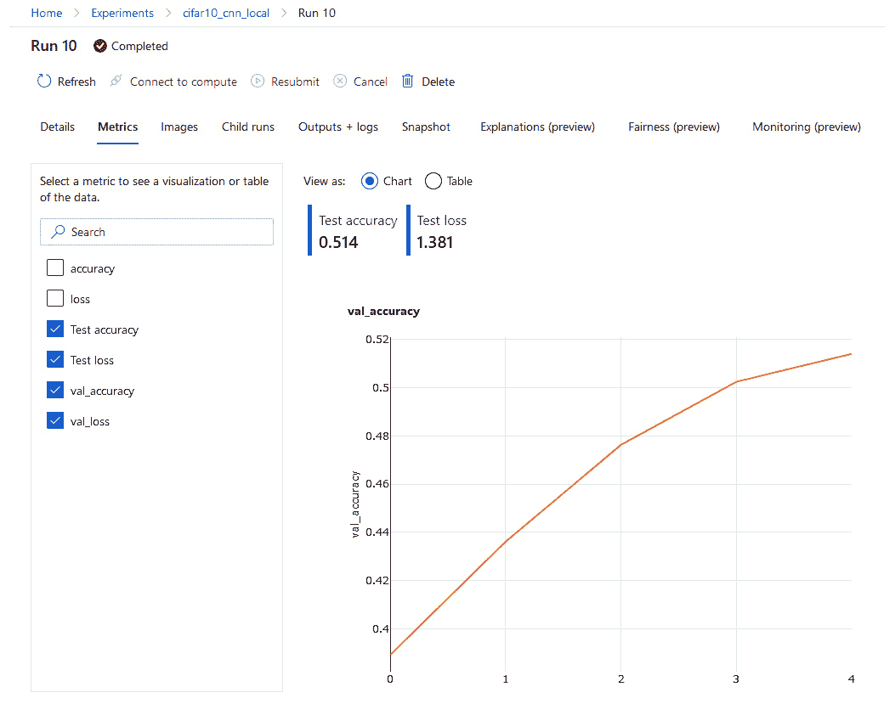

图 3.12 – 实验运行的指标视图

我们可以看到测试指标和验证指标都已考虑在内。此外，我们还可以看到**测试损失**和**测试准确率**作为指标，这些指标也是 Keras 为每个 epoch 提供的，作为模型对训练数据集的评估。

另一个很酷的功能是，ML 工作区实验为你提供了所有运行的概览。它自动使用每个运行的标量值和训练以及验证指标，并在仪表板上显示它们。你可以修改显示的值和用于聚合这些值的聚合方法。

*图 3.13*显示了所有实验运行的准确率和验证准确率：

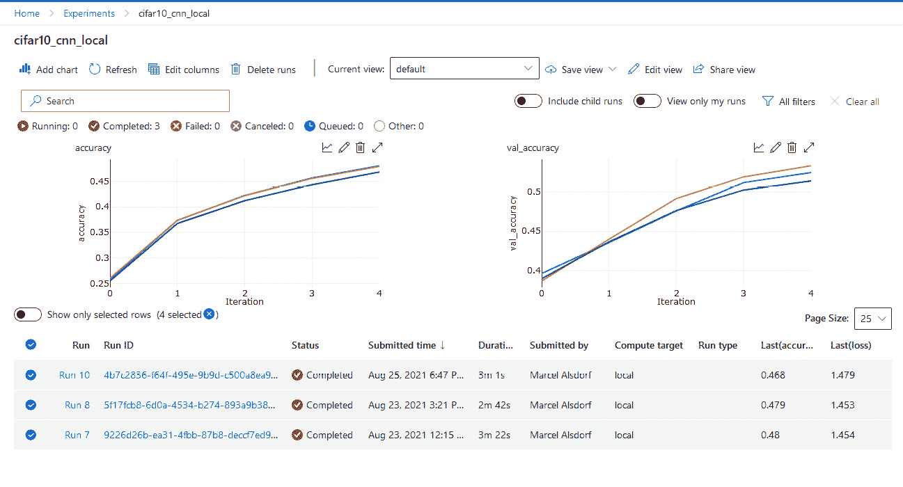

图 3.13 – 所有实验运行的可视化指标

这是跟踪运行值并显示相应实验的最简单方法。在现有的机器学习训练脚本中添加几行代码——无论你使用哪个框架——可以自动跟踪你的模型分数并在仪表板上显示所有实验。

### 增强模型的注册

现在我们有了可以读取和处理的指标，作为最后一步，我们可以增强将最佳模型保存到模型注册的方式。

到目前为止，我们总是在新模型可用时立即用新版本更新模型。然而，这并不意味着新模型的实际性能比我们在工作区中注册的最后一个模型更好。因为我们希望新**版本**的模型实际上比上一个版本更好，所以我们需要检查这一点。

因此，一个常见的做法是，只有当指定的指标比实验中之前存储的最高指标更好时，才注册新的模型。让我们实现这个功能。

我们可以定义一个函数，它从一个实验中返回指标的生成器，如下所示：

```py
from azureml.core import Run
def get_metrics_from_exp(exp, metric, status='Completed'):
  for run in Run.list(exp, status=status):
    yield run.get_metrics().get(metric)
```

前面的生成器函数为每个完成的运行产生指定的跟踪指标。我们可以使用这个函数来返回所有先前实验运行中的最佳指标，以比较当前模型的评估分数并决定是否应该注册新版本的模型。我们只有在当前模型的表现优于之前记录的模型时才应该这样做。为此，我们需要比较一个指标。使用**测试准确率**是一个好主意，因为它是对未知数据进行测试的模型：

```py
# get the highest test accuracy
best_test_acc = max(get_metrics_from_exp(
                    exp,'Test accuracy')
                    default = 0)
# upload the model
run.upload_file(model_name, model_path)
if scores[1] > best_test_acc:
  # register the best model as a new version
  run.register_model(model_name, model_path=model_name)
```

如您所见，我们得到了在此实验中跟踪的所有先前运行的测试准确率指标的结果，并选择了最大的一个。然后，只有当新模型的测试准确率高于之前存储的最佳分数时，我们才注册该模型。尽管如此，我们仍然将模型二进制文件与实验运行一起上传和跟踪。

现在，我们有了笔记本的增强版本，包括指标跟踪和更好的模型注册版本。

## 调度脚本执行

在上一节中，我们看到了如何通过几行代码来注释现有的机器学习实验和训练代码，以便跟踪相关指标并在工作区中运行工件。在本节中，我们将从直接调用训练脚本转变为在本地机器上调度训练脚本。你可能会问为什么这一额外步骤是有用的，因为直接调用训练脚本和调度本地运行训练脚本之间并没有太多区别。

这个练习的主要动机是，在后续步骤中，我们可以将执行目标更改为远程计算目标，并在云中的计算集群上运行训练代码，而不是在本地机器上。这将是一个巨大的好处，因为我们现在可以轻松地在本地测试代码，然后将其部署到云中高度可扩展的计算环境中。

另一点需要注意的是，当安排训练脚本而不是调用它时，标准输出和错误流以及**日志**目录中的所有文件都将直接流式传输到 Azure Machine Learning 工作区运行。这有一个好处，即您可以在您的 ML 工作区实时跟踪脚本输出，即使您的代码正在远程计算集群上运行。

让我们在所谓的**编写脚本**中实现这一点。当我们说脚本或环境的任务是安排另一个训练或实验脚本时，我们称之为编写脚本（或编写环境）。此外，我们现在将运行和执行训练的脚本称为**执行脚本**（或执行环境）。

在编写脚本中，我们需要定义两件事——我们将运行的环境和运行配置，我们将执行脚本、环境和可能的计算目标传递给它。

打开 `03_run_experiment_local.ipynb` 笔记本文件。与我们的前一个笔记本相比，你可以看到这是一个非常短的文件，因为实际的 Keras 训练现在正在执行脚本中进行，你可以找到 `code` 文件夹中的 `cifar10_cnn_remote.py` 文件。

首先，我们需要定义一个环境。由于我们仍在本地运行，我们使用 `user-managed-env` 创建一个环境，这将直接从我们的本地机器获取我们的环境：

```py
from azureml.core.environment import Environment
myenv = Environment(name = "user-managed-env")
myenv.python.user_managed_dependencies = True
```

在下一个块中，我们定义了我们想要在本地运行的执行脚本的地址和名称：

```py
import os
script = 'cifar10_cnn_remote.py'
script_folder = os.path.join(os.getcwd(), 'code')
```

最后，我们使用`ScriptRunConfig`对象定义一个运行配置，并将其源目录、脚本名称以及我们之前定义的本地环境附加到它：

```py
from azureml.core import ScriptRunConfig
runconfig = ScriptRunConfig(source_directory=script_folder,
                            script=script,
                            environment = myenv)
run = exp.submit(runconfig)
run.wait_for_completion(show_output=True)
```

现在，执行整个笔记本，同时导航到 Azure Machine Learning Studio，查找名为 `cifar10_cnn_remote` 的当前实验运行。当它可见时，转到 `azureml-logs` 和 `logs/azureml` 文件夹，现在将填充运行期间的日志输出。

*图 3.14* 展示了摄入的流式日志的一个示例：

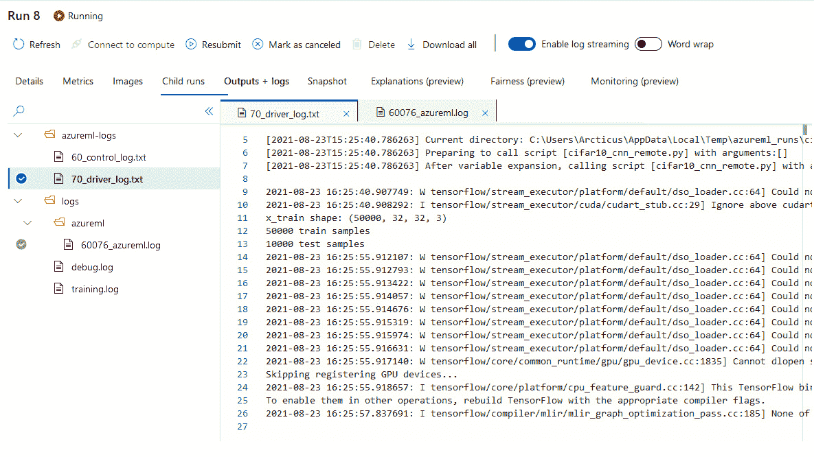

图 3.14 – Azure Machine Learning 实验运行的流式日志

这非常方便，因为现在我们实际上并不需要知道代码最终在哪里执行。我们唯一关心的是看到输出，运行进度，同时跟踪所有指标，生成的模型以及所有其他工件。可以通过调用 `print(run.get_portal_url())` 方法检索当前运行的链接。

然而，我们不必每次运行训练脚本时都导航到 Azure 门户，我们可以在笔记本环境中嵌入一个小部件，以提供相同（甚至更多）的功能，直接在 Jupyter、JupyterLab 或 VS Code 中。为此，我们需要将`run.wait_for_completion()`行替换为以下代码片段：

```py
from azureml.widgets import RunDetails
RunDetails(run).show()
```

请注意，您需要将**Azure Widgets Python 扩展**添加到您的环境中。请参阅此安装指南了解扩展：[`docs.microsoft.com/en-us/python/api/azureml-widgets/azureml.widgets.rundetails?view=azure-ml-py`](https://docs.microsoft.com/en-us/python/api/azureml-widgets/azureml.widgets.rundetails?view=azure-ml-py)。

最后，让我们看看我们正在使用的执行脚本。在`code`目录中打开名为`cifar10_cnn_remote.py`的文件。扫描这个文件，你应该会找到我们添加到原始模型训练代码中的两个附加部分。

第一个部分是我们将调试日志写入`logs`文件夹的部分：

```py
# log output of the script 
logging.basicConfig(filename='logs/debug.log', 
                    filemode='w',
                    level=logging.DEBUG)
logger_cb = CSVLogger('logs/training.log')
```

第二部分看起来是这样的：

```py
from azureml.core import Run
# load the current run
run = Run.get_context()
```

进行此调用的原因是，当我们想要迁移到远程执行环境时，我们需要推断运行上下文。因此，我们需要从当前执行上下文中加载`run`对象，而不是像之前章节中所示的那样创建一个新的运行，当时我们使用了`exp.start_logging()`调用。

当通过作者脚本进行调度时，`run` 对象将自动与实验关联。这对于远程执行来说很方便，因为我们不再需要在执行脚本中显式指定`run`对象。使用这个推断的`run`对象，我们可以记录值、上传文件和文件夹，以及注册模型，就像在之前的章节中做的那样。

## 在云计算上运行实验

在我们已经在本地机器上运行了实验之后，现在让我们在本章的最后一个步骤中，在 ML 工作空间中的计算目标上运行相同的 ML 模型。

在 Azure 中训练 ML 模型推荐的计算目标是受管理的 Azure Machine Learning 计算集群，这是一个直接在您的 Azure 订阅内管理的自动扩展计算集群。如果您已经使用 Azure 进行批量工作负载，您会发现它与 Azure Batch 和 Azure Batch AI 类似，配置更少，并且紧密集成在 Azure Machine Learning 服务中。

有三种方式可以部署集群，要么通过 Azure CLI 和 YAML，要么通过 Python SDK，要么通过 Azure Machine Learning Studio。在以下步骤中，我们将使用第一种方式，因为它们越来越普遍，尤其是在 MLOps 中。之后，我们将看到如何使用 Python 代码实现第二种方式。

在工作目录中打开`compute.yml`文件。您将看到以下内容：

compute.yml

```py
$schema: https://azuremlschemas.azureedge.net/latest/compute.schema.json
name: mldemocompute
type: amlcompute
size: STANDARD_D2_V2
location: westus2
min_instances: 0
max_instances: 2
idle_time_before_scale_down: 900
```

这描述了一个名为 `mldemocompute` 的计算集群，我们希望部署。此配置在 ML 工作区中定义了一个计算类型（`amlcompute`），具有 0-2 个节点，VM 大小为 **Standard D2v2**（2 个 CPU，7 GB 的 RAM 和 100 GB 的 HDD），位于美国西部 2 的 Azure 区域。此外，我们定义了集群缩放（关闭）前的空闲时间为 15 分钟（等于 900 秒）。

计算集群有许多其他设置，包括各种网络和负载均衡设置。你也可以通过简单地更改配置来定义带有 GPU 的 VM 类型作为你的工作节点 – 例如，**Standard_NC6**（6 个 CPU，56 GB 的 RAM，340 GB 的 SSD，1 个 GPU 和 12 GB 的 GPU 内存）。

与其他托管集群（如 Azure Databricks）相比，你不需要为头节点或主节点付费，只需为工作节点付费。我们将在 *第十章* *在 Azure 上训练深度神经网络* 和 *第十二章* *在 Azure 上进行分布式机器学习* 中详细介绍深度学习的 VM 类型，并运行 GPU 集群的分布式训练。

如果你正在使用 VS Code，可以在左侧的 Azure 选项卡中找到 **Azure ML** 扩展（可显示 YAML 模板）。只需转到你的 ML 工作区，然后在 **mldemows** | **Compute** | **Compute clusters** 下，点击右侧的 **+** 号。它将生成一个模板文件，看起来像是前面版本的裸版本。此外，如果你已安装 YAML 扩展，它将理解文件中的模式链接并自动完成你的输入：

1.  打开控制台并运行以下 CLI 命令，从 YAML 文件创建计算实例：

    ```py
    $ az ml compute create -f compute.yml -g mldemo -w mldemows
    ```

你还可以调用工作目录中名为 `04_setup_azure_ml_compute.sh` 的 shell 脚本。

稍等片刻，它将显示创建的计算集群的属性。

1.  打开名为 `05_run_experiment_remote.ipynb` 的笔记本。

那个笔记本中的第二个块展示了以下代码：

```py
from azureml.core.compute import ComputeTarget, AmlCompute
from azureml.core.compute_target import ComputeTargetException
cluster_name = "mldemocompute"
min_nodes = 0
max_nodes = 2
vm_size = "STANDARD_D2_V2"
try:   
  aml_cluster = ComputeTarget
                (workspace=ws, name=cluster_name)
except ComputeTargetException:
  print('Cluster not '%s' not found, creating one now.' 
         % cluster_name)
  config = AmlCompute.provisioning_configuration
           (vm_size=vm_size, 
            min_nodes=min_nodes, 
            max_nodes=max_nodes)
  aml_cluster = ComputeTarget.create
                (workspace=ws, 
                 name=cluster_name,
                 provisioning_configuration=config)
aml_cluster.wait_for_completion(show_output=True)
```

`try` 构造的 `except` 子句展示了你可以通过 Python SDK 创建计算集群的方式。由于集群的名称与我们之前通过 CLI 部署的名称相同，当执行此块时，它将通过 `try` 子句将我们的计算链接到 `aml_cluster` 对象。

无论哪种方式，这个 `try..except` 子句都非常方便，因为它要么返回已经存在的集群，要么为我们创建一个新的集群。如果计算目标尚未存在，则代码的最后一行是必要的，因为我们需要等待计算目标在下一步准备好接收运行配置。

如果我们现在查看环境定义和运行配置，我们将看到从 `03_run_experiment_local.ipynb` 笔记本中代码的一些细微变化。我们现在的环境定义如下所示：

```py
myenv = Environment.from_pip_requirements
        (name = "remote_env", file_path = pipreq_path)
```

如您所见，我们附上了我们在本地工作的 PIP 配置文件。在后台，SDK 将将其转换为**Conda 属性文件**，并从 Docker 基础镜像创建一个容器。如果您运行到这一步，您将看到 Azure 机器学习基于此输入构建的基础镜像和配置。这里展示的是其中一小部分：

```py
"docker": {
"baseImage": "mcr.microsoft.com/azureml/openmpi3.1.2-ubuntu18.04:20210714.v1",
"platform": {
    "architecture": "amd64",
    "os": "Linux"
  }
}
```

在笔记本的最后一个块中查看，我们可以看到唯一的区别是，我们现在在运行配置中将计算目标定义为我们的`aml_cluster`，并传递新的环境。

最后，我们现在运行整个笔记本。

训练脚本现在在 Azure 的远程计算目标上执行。在 Azure 机器学习工作室中的实验运行中，快照、输出和日志看起来与本地运行非常相似。然而，我们现在还可以看到计算目标的 Docker 环境构建过程的日志，如图 3.15 所示：

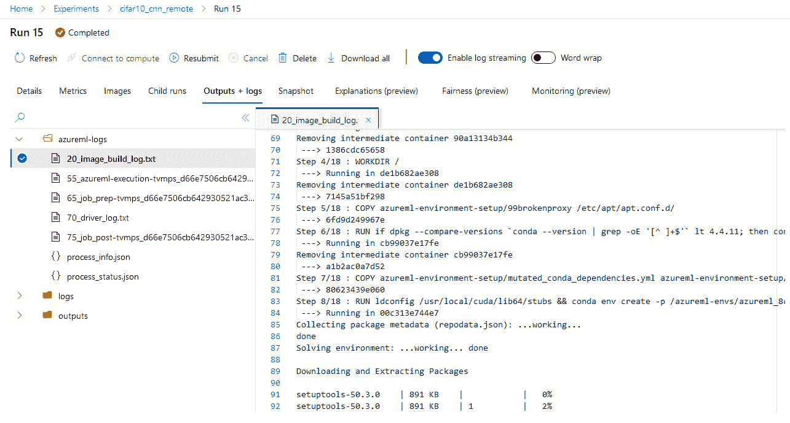

图 3.15 – 远程实验运行的 Docker 构建阶段

作为最后的练习，让我们了解当我们提交这次运行到 Azure 机器学习工作区时执行的步骤：

1.  如果不存在，Azure 机器学习服务将根据定义的环境构建 Docker 容器。

1.  Azure 机器学习服务在私有容器注册表中注册您的环境，以便它可以用于其他脚本和部署。

1.  Azure 机器学习服务排队执行您的脚本。

1.  Azure 机器学习计算服务使用定义的容器初始化和扩展计算节点。

1.  Azure 机器学习计算服务执行脚本。

1.  Azure 机器学习计算服务捕获日志、工件和指标，并将它们流式传输到 Azure 机器学习服务，并通过小部件在 Jupyter 笔记本中内联日志。

1.  Azure 机器学习服务将所有工件存储在工作区存储中，并将您的指标存储在 Application Insights 中。

1.  Azure 机器学习服务通过 Azure 机器学习工作室或 Python SDK 为您提供有关运行的全部信息。

1.  Azure 机器学习计算服务在 15 分钟（在我们的情况下）的无操作后自动缩小自身。

恭喜您跟随着这个练习。鉴于我们可能花费了 5 分钟来设置 Azure 机器学习工作区，我们得到了一个完整的批量计算调度和执行环境，用于我们所有的机器学习工作负载。这个环境中的许多部分都可以根据我们的喜好进行调整和配置，最好的是，一切都可以通过 Azure CLI 或 Azure Python SDK 自动化。在整个书中，我们将使用这些工具来配置、启动、扩展和删除用于训练和评分的集群。

# 摘要

这本书的第一部分到此结束。到目前为止，你应该对机器学习（ML）的一般概念有了很好的了解，Azure 中可用的服务和选项，以及如何利用 Azure 机器学习服务进行 ML 实验并增强你现有的 ML 建模脚本。

在本书的下一部分，我们将专注于机器学习经常被忽视的一个方面，即数据本身。正确处理这一点至关重要。你可能之前听说过“垃圾输入，垃圾输出”这个短语，这是真的。因此，我们将通过运行自动数据摄取、数据清理和准备、特征提取以及执行标注来尽可能多地消除陷阱。最后，我们将把我们的知识汇总起来，讨论如何设置数据摄取和训练 ML 管道。

作为这个过程的第一步，我们需要了解不同的数据源和格式，并将我们的数据带到 Azure 机器学习工作区，我们将在下一章中讨论这一点。
