# 第十章：*第十章*：在 Azure 上训练深度神经网络

在上一章中，我们学习了如何使用非参数的基于树的集成方法来训练和评分经典机器学习模型。虽然这些方法在包含分类变量的许多小型和中型数据集上表现良好，但它们在大数据集上的泛化能力不佳。

在本章中，我们将使用深度学习（**DL**）来训练复杂的参数模型，以实现与非常大的数据集的更好泛化。这将帮助您了解**深度神经网络**（**DNNs**），如何训练和使用它们，以及它们何时比传统模型表现更好。

首先，我们将简要概述为什么以及何时深度学习（DL）效果良好，并着重于理解一般原则和理由，而不是理论方法。这将帮助您评估哪些用例和数据集需要深度学习，以及它的一般工作原理。

然后，我们将探讨深度学习的一个流行应用领域——计算机视觉。我们将使用 Azure 机器学习服务和额外的 Azure 基础设施来训练一个简单的**卷积神经网络**（**CNN**）模型进行图像分类。我们将将其性能与在预训练的**残差神经网络**（**ResNet**）模型上微调过的模型进行比较。这将为您从头开始训练模型、针对您的应用领域微调现有模型以及克服训练数据不足的情况做好准备。

在本章中，我们将涵盖以下主题：

+   深度学习简介

+   训练 CNN 进行图像分类

# 技术要求

在本章中，我们将使用以下 Python 库和版本来创建基于决策树的集成分类器：

+   `azureml-core 1.34.0`

+   `azureml-sdk 1.34.0`

+   `numpy 1.19.5`

+   `pandas 1.3.2`

+   `scikit-learn 0.24.2`

与前几章类似，您可以使用本地 Python 解释器或 Azure 机器学习托管的工作簿环境执行此代码。

本章中所有的代码示例都可以在这个书的 GitHub 仓库中找到：[`github.com/PacktPublishing/Mastering-Azure-Machine-Learning-Second-Edition/tree/main/chapter10`](https://github.com/PacktPublishing/Mastering-Azure-Machine-Learning-Second-Edition/tree/main/chapter10)。

# 深度学习简介

深度学习最近彻底改变了机器学习领域，并在各种任务中（如图像分类、目标检测、分割、语音转录、文本翻译、文本理解、销售预测等）不断优于经典统计方法，甚至优于人类。与经典模型相比，深度学习模型使用数百万个参数、参数共享、优化技术和隐式特征提取，当训练足够的数据时，可以优于所有之前手工制作的特征检测器和机器学习模型。

在本节中，我们将帮助你了解神经网络的基本知识以及使用更多参数、更好泛化和更好性能来训练更深模型的路径。这将帮助你理解基于深度学习的各种方法是如何工作的，以及为什么和何时它们对某些领域和数据集是有意义的。如果你已经是深度学习的专家，请随意跳过本节，直接进入*训练用于图像分类的 CNN*部分的实际示例。

## 为什么是深度学习？

许多传统的优化、分类和预测过程在过去几十年中已经使用经典的机器学习方法（如 k 最近邻、线性回归和逻辑回归、朴素贝叶斯、**支持向量机（SVMs**）、基于树的集成模型等）工作得很好。它们在小到中等规模的数据集上对各种类型的数据（交易、时间序列、运营等）和数据类型（二进制、数值和分类）都表现良好。

然而，在某些领域，数据生成已经爆炸式增长，即使训练数据量不断增加，经典机器学习模型也无法实现更好的性能。这尤其影响了 2010 年底左右的计算机视觉和自然语言处理（NLP）领域。那时，研究人员在神经网络——也称为**多层感知器（MLPs**）——这一技术上取得了突破，这是一种在 20 世纪 80 年代使用的技术，通过使用多层嵌套层来捕捉大型图像数据集中的大量特征。

以下图表很好地捕捉了这个想法。虽然传统的机器学习（ML）方法在小型和中等规模的数据集上工作得非常好，但它们的性能通常不会随着更多训练数据的增加而提高。然而，深度学习（DL）模型是大规模参数模型，可以从训练数据中捕捉大量细节。因此，我们可以看到，随着数据量的增加，它们的预测性能也在提高：

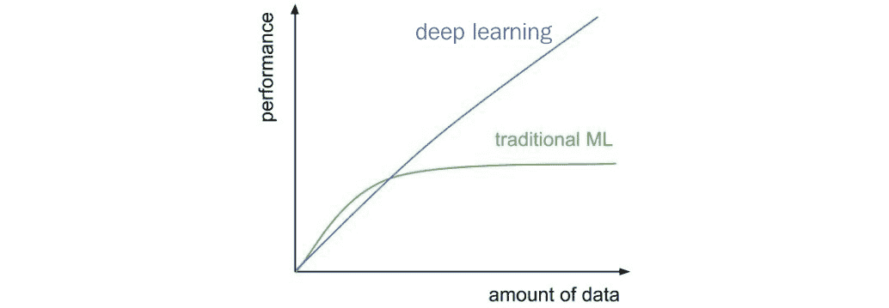

图 10.1 – 深度学习与传统机器学习的有效性

传统模型通常使用预构建的特征，并针对各种数据类型和范围的数据集进行优化。在上一章中，我们看到了梯度提升树在分类数据上的表现极为出色。然而，在包含高度结构化数据或可变长度数据的领域中，许多传统模型已经达到了它们的极限。这尤其适用于二维和三维图像以及视频中的像素信息，以及音频数据中的波形以及自由文本数据中的字符和字符序列。以前，机器学习模型使用复杂的、手动调整的特征提取器来处理此类数据，例如**方向梯度直方图（HoG**）过滤器、**尺度不变特征变换（SIFT**）特征或**局部二值模式（LBPs**）——仅举计算机视觉领域中的几个过滤器为例。

使这些数据如此复杂的原因是，输入数据（例如，单个像素）和输出之间不存在明显的线性关系——在大多数情况下，看到一个图像中的单个像素并不能帮助确定该图像中的汽车品牌。因此，训练更大、更强大的参数模型的需求不断增加，这些模型使用原始、未处理的数据作为输入，以从输入像素捕获这些关系并做出最终预测。

重要的是要理解，对具有更多参数的深度模型的必要性源于特定领域（如视觉、音频和语言）中高度结构化训练数据的巨大增加。这些新模型通常具有数百万个参数来捕捉大量的原始和增强训练数据，以及开发训练数据的内部泛化概念表示。在选择适用于您的用例的机器学习方法时，请记住这一点。

快速查看您的训练数据通常有助于确定基于深度学习的模型是否适合该任务——鉴于深度学习模型有数百万个参数需要训练。如果您的数据存储在 SQL 数据库、CSV 或 Excel 文件中，那么您可能需要考虑经典机器学习（ML）方法，例如参数统计（线性回归、支持向量机等）或非参数方法（基于决策树的集成）。如果您的数据量如此之大以至于无法放入内存，或者存储在**Hadoop 分布式文件系统（HDFS**）、blob 存储或文件存储服务器中，那么您可以使用基于深度学习的方法。

## 从神经网络到深度学习

神经网络的基础以及今天基于深度学习（DL）的方法——**感知器**——是一个超过半个世纪的概念，它是在 20 世纪 50 年代发展起来的。在本节中，我们将探讨基础知识，并逐步回顾到 20 世纪 80 年代的**多层感知器（MLPs**）——也称为**人工神经网络（ANNs**）——以及**卷积神经网络（CNNs**），然后是最近十年的**深度神经网络（DNNs**）和深度学习（DL）。这将帮助您理解神经网络和深度学习的基础概念，以及模型架构和训练技术在过去一个世纪中是如何演变成我们今天使用的最先进技术的。

### 感知器——20 世纪 50 年代的分类器

感知器是今天神经网络的基石，它们模仿人类大脑中的细胞（所谓的**神经元**）。它们由两个简单非线性函数组成：所有输入的加权和以及一个激活函数，如果输出大于指定的阈值，则激活。虽然这种神经元的类比是模拟大脑工作方式的一个很好的方法，但它并不是理解输入信号如何转换为输出的一个很好的模型。

我们更倾向于使用一种简单得多、非生物的方法来解释感知器、MLPs 和 CNNs，即简单的几何方法。当简化后，这种方法只需要你理解二维直线方程。一旦你理解了两维的基本概念，这个概念可以扩展到多维度，其中直线在更高维的特征空间中变成一个平面或超平面。

如果我们看一个单独的感知器，它描述了其输入的**加权求和**加上一个常量偏置和一个**激活函数**。让我们分解感知器的两个组成部分。你知道什么也被描述为输入的加权求和加上偏置吗？对，就是直线方程：

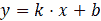

在前面的方程中，*x* 是输入，*k* 是权重，*b* 是偏置项。你可能在你的一些数学课程中看到过这个方程。这个方程的一个特性是，当你将一个点的 *x* 和 *y* 坐标插入到直线方程中时，对于所有位于直线上的点，它会产生 0 = 0。我们可以利用这个信息推导出直线方程的向量形式，如下所示：

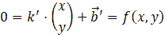

因此，当点位于直线上时，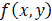 为 *0*。如果我们插入一个不在直线上的点的坐标会发生什么？一个很好的猜测是结果将是正的或负的，但肯定不是 0\. 向量直线方程的一个特性是，这个结果的正负号描述了点位于直线的哪一侧。因此，当 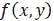 为正或负但不是零时，点位于直线的左侧或右侧。

要确定直线的哪一侧，我们可以将符号函数应用于 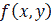。符号函数通常也被称为阶跃函数，因为它的输出是 *1* 或 *-1*，因此是正的或负的。这里的符号或阶跃函数是我们的激活函数，因此是感知器的第二个组成部分。感知器的输出 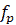 可以写成以下形式：

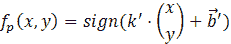

在以下图表中，我们可以看到两个点、一条直线以及它们到直线的最短距离。两个点都不在直线上，因此直线将它们彼此分开。如果我们把两个点的坐标插入到向量直线方程中，那么一个点会产生一个正值 ，而另一个点会产生一个负值 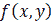：

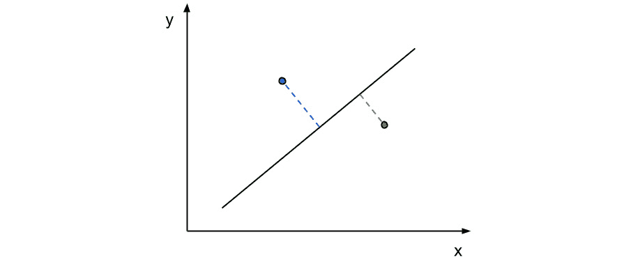

图 10.2 – 一个简单的二元分类器

结果会告诉我们点位于线的哪一侧。这条线是感知器的几何描述，它是一个非常简单的分类器。训练好的感知器通过线方程（或多个维度中的超平面）定义，将空间分为左右两部分。这条线是分类的决策边界，而一个点是一个观察。通过将一个点插入线方程并应用步函数，我们返回观察结果的类别，即左或右，-1 或+1，或类别 A 或 B。这描述了一个二元分类器。

我们如何找到决策边界？为了找到最优的决策边界，我们可以在使用标记的训练样本的同时遵循一个迭代训练过程。首先，我们必须初始化一个随机的决策边界，然后计算每个样本到决策边界的距离，并将决策边界移动到最小化总距离和的方向。移动决策边界的最优向量是如果我们沿着负梯度移动它，使得点与线之间的距离达到最小。通过使用学习率因子，我们迭代这个过程几次，最终得到一个完美对齐的决策边界，如果训练样本是线性可分的。这个过程被称为**梯度下降**，其中我们迭代地修改分类器的权重（在这个例子中是决策边界）以找到具有最小误差的最优边界。

### 多层感知器

感知器描述了一个简单的分类器，其决策边界是通过加权输入定义的线（或超平面）。然而，我们不是使用单个分类器，而是简单地增加神经元的数量，这将导致多个决策边界，如下面的图表所示：

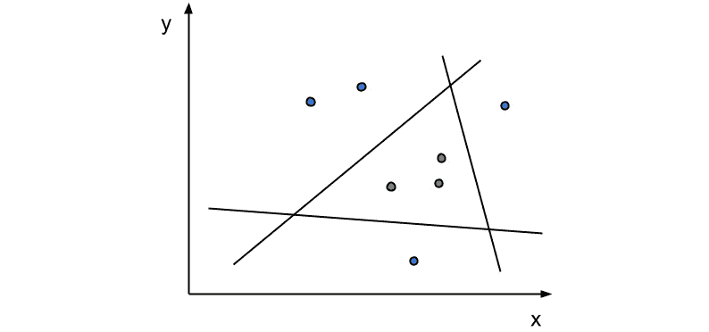

图 10.3 – 多个感知器的组合

每个神经元描述一个决策边界，因此将具有独立的权重和输出 – 决策边界的左侧或右侧。通过在层中堆叠多个神经元，我们可以创建输入是前一个输出的分类器。这允许我们将多个决策边界的输出组合成一个单一的输出 – 例如，找到所有被三个神经元的决策边界包围的样本，如前述图表所示。

当单层感知器描述输入和输出的线性组合时，研究人员开始将这些感知器堆叠成多个连续层，每一层后面都跟着一个激活函数。这被称为 MLP，或人工神经网络。使用几何模型作为类比，你可以在复杂的几何对象上简单地堆叠多个决策边界，以创建更复杂的决策边界。

重要提示

另一个类比是，分类器的决策边界始终是一个直线超平面，但输入样本通过决策边界被转换成线性分离。

同样的几何类比帮助我们理解深度学习模型中的层。虽然网络的第一层描述了非常低级的几何特征，例如直线和线条，但更高层描述了这些低级特征的复杂嵌套组合；例如，四条线构成一个正方形，五个正方形构成一个更复杂的形状，而这些形状的组合看起来像人脸。我们就是用三层神经网络构建了一个人脸检测器。

Google DeepDream 实验是这个类比的一个绝佳例子。在下面的图中，我们可以可视化一个预训练的深度神经网络（DNN）中不同深度的三层如何表示多云天空图像中的特征。这些层是从 DNN 的开始、中间和末端提取出来的，并将输入图像转换为最小化每层的损失。在这里，我们可以看到早期层主要关注线条和边缘（左），中间层看到抽象形状（中间），而最后一层在图像的非常具体的高级特征上激活（右）：

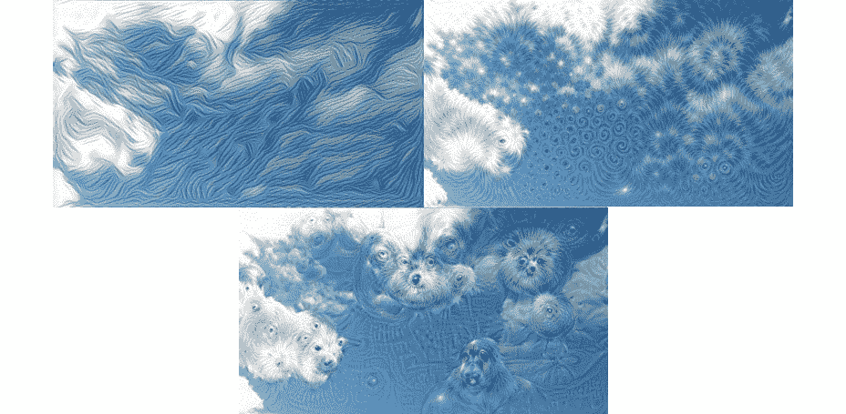

图 10.4 – DeepDream – 最小化 DNN 层的损失

接下来，让我们看看 CNNs。

### CNNs

使用多个高维超平面方程，其中每个输出馈送到下一层的每个输入，需要非常多的参数。虽然需要大量的参数来模拟大量的复杂训练数据，但所谓的全连接神经网络并不是描述这些连接的最佳方式。那么，问题是什么？

在全连接网络中，每个输出都被作为输入馈送到下一层的每个神经元。在每个神经元中，我们都需要为每个输入设置一个权重，因此我们需要与输入维度一样多的权重。当我们开始堆叠多个感知器层时，这个数字会迅速增加。另一个问题是，网络无法泛化，因为它为每个维度分别学习所有单个权重。

在 20 世纪 80 年代，卷积神经网络（CNNs）被发明来解决这些问题。它们的目的是将单层上的连接和参数数量减少到一个固定的参数集，这个参数集与输入维度的数量无关。现在，一个层的参数在所有输入之间是共享的。这种方法的灵感来源于信号处理，其中滤波器通过卷积操作应用于信号。卷积意味着将单一权重集，如窗口函数，应用于输入的多个区域，然后对每个位置的滤波器信号响应进行求和。

这也是卷积神经网络中卷积层相同的概念。通过使用与输入卷积的固定大小滤波器，我们可以大大减少每一层的参数数量，并在网络中添加更多嵌套层。通过使用所谓的池化层，我们还可以减少图像大小，并将滤波器应用于输入的降尺度版本。让我们看看用于构建卷积神经网络的流行层：

+   **全连接（FC）**：FC 层是一个全连接神经元层，如前一小节关于感知器的描述中所述——它将前一层的每个输出与一个神经元连接起来。在深度神经网络中，FC 层通常用于网络的末端，以结合前一卷积层的所有空间分布的激活。FC 层在模型中也有最多的参数（通常约为 90%）。

+   **卷积**：卷积层由沿空间维度（通常是二维）卷积的空间（滤波器）组成，并在输入的深度维度上求和。由于权重共享，它们比全连接层更高效，并且参数更少。

+   **池化**：卷积层通常后面跟着一个池化层来减少下一滤波器的体积的空间维度——这相当于一个子采样操作。池化操作本身没有可学习的参数。大多数情况下，由于它们简单的梯度计算，在深度学习模型中会使用**最大池化**层。另一个流行的选择是**平均池化**，它通常用作网络末端的分类器。

+   **归一化**：在现代深度神经网络中，归一化层通常用于在整个网络中稳定梯度。由于某些激活函数的无界行为，滤波器响应必须归一化。常用的归一化技术是**批归一化**。

现在我们已经了解了卷积神经网络的主要组成部分，我们可以看看这些模型是如何堆叠得更深，以提高泛化能力，从而提高预测性能。

### 从卷积神经网络到深度学习

20 世纪 50 年代的感知器，以及 80 年代的 ANN 和 CNN，为今天使用的所有深度学习模型奠定了基础。通过在训练过程中稳定梯度，研究人员克服了梯度爆炸和消失的问题，构建了更深的模型。这是通过使用额外的归一化层、修正线性激活、辅助损失和残差连接来实现的。

深度模型有更多的可学习参数——通常超过一亿个参数——因此它们可以找到更高层次的模式，学习更复杂的变换。然而，为了训练更深的模型，你还必须使用更多的训练数据。因此，公司和研究人员建立了大量的标记数据集（如 ImageNet），为这些模型提供训练数据。

这种发展过程得益于廉价并行计算资源（如 GPU 和云计算）的可用性。训练这些深度模型的速度在短短几年内从数月缩短到数天再到数小时。如今，我们可以在高度并行的计算基础设施下，在一小时内训练一个典型的深度神经网络（DNN）。

许多研究也投入到了新的层堆叠技术中，从具有跳转连接的非常深的网络（如 ResNet152）到具有并行层组的网络（如 GoogLeNet）。这两种层类型的组合导致了极其高效的网络架构，如 SqueezeNet 和 Inception。新的层类型如 LSTM、GRU 和注意力机制显著提高了预测性能，而 GAN 和变换模型创造了全新的训练和优化模型的方法。

所有这些进步都帮助深度学习成为今天无处不在的机器学习技术——在提供足够训练数据的情况下，它可以在大多数预测任务中超越传统的机器学习模型，甚至优于人类。如今，深度学习被应用于几乎任何有足够数据可用的领域。

## 深度学习与传统机器学习

让我们来看看经典机器学习方法和基于深度学习方法的区别，并了解深度学习模型如何利用更多的参数以及它们从中获得的好处。

如果我们回顾 2012 年之前的图像或音频处理领域，我们会发现机器学习模型通常不是在原始数据本身上训练的。相反，原始数据经过人工设计的特征提取器转换成低维特征空间。当处理 256 x 256 x 3 维度的图像（RGB，对应 196,608 维特征空间）并将其转换为例如 2,048 维特征嵌入作为机器学习模型的输入时，我们大大降低了这些模型的计算需求。图像和音频特征的特征提取器通常使用卷积算子和特定的滤波器（如边缘检测器、块检测器、尖峰/谷检测器等）。然而，滤波器通常是手动构建的。

在过去 50 多年中开发的经典机器学习模型仍然是今天我们成功使用的模型。其中包括基于树的集成技术、线性回归和逻辑回归、支持向量机（SVMs）和多层感知器（MLPs）。MLP 模型也被称为具有隐藏层的全连接神经网络，并且在一些早期的深度学习架构中仍作为分类或回归头使用。

下图展示了计算机视觉领域中经典机器学习方法的典型流程：

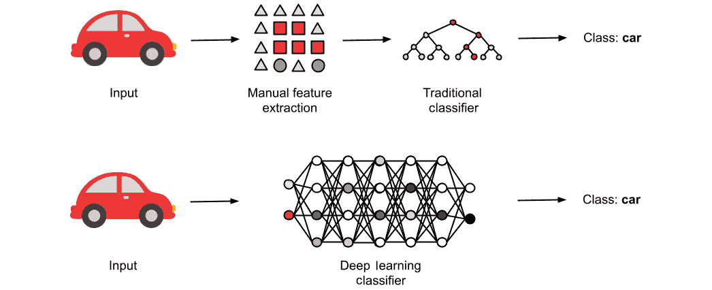

图 10.5 – 传统机器学习分类器

首先，使用手工制作的图像滤波器（SIFT、SURF、HoG、LBPs、Haar 滤波器等）将原始数据转换为低维特征嵌入。然后，使用特征嵌入来训练机器学习模型；例如，一个多层全连接神经网络或决策树分类器，如前图所示。

当人类难以用简单规则表达输入图像和输出标签之间的关系时，那么对于经典计算机视觉和机器学习方法来说，找到这样的规则也可能很困难。基于深度学习的方法在这些情况下表现更好。原因在于深度学习模型是在原始输入数据上而不是在手动提取的特征上训练的。由于卷积层与随机和训练的图像滤波器相同，这些用于特征提取的滤波器被网络隐式地学习。

下图显示了图像分类的深度学习方法，这与经典机器学习方法的前图类似：

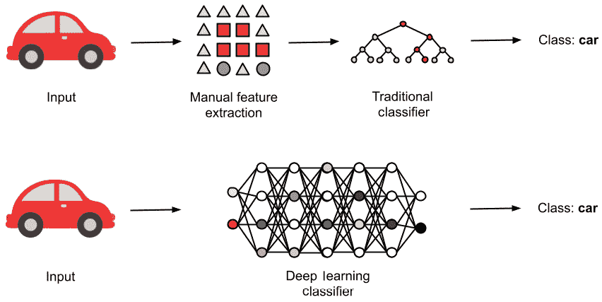

图 10.6 – 基于深度学习的分类器

如我们所见，原始输入图像数据直接输入到网络中，输出最终的图像标签。这就是我们通常将深度学习模型称为端到端模型的原因——因为它在输入数据（字面上，原始像素值）和模型输出之间创建了一个端到端转换。

如前图所示，基于深度学习的模型是一个端到端模型，它在一个模型中学习特征提取器和分类器。然而，我们通常指的是最后一个全连接层。

重要提示

在选择机器学习模型之前，看看你的数据类型。如果你处理的是图像、视频、音频、时间序列、语言或文本，你可能希望使用深度学习模型或特征提取器进行嵌入、聚类、分类或回归。如果你处理的是运营或业务数据，那么经典机器学习方法可能更适合。

## 使用基于深度学习的特征提取器进行传统机器学习

在许多情况下，尤其是当你拥有小数据集、计算资源不足或缺乏训练端到端深度学习模型的知识时，你也可以重用预训练的深度学习模型作为特征提取器。这可以通过加载预训练模型并执行正向传播直到分类/回归头部来实现。它返回一个多维嵌入（所谓的潜在空间表示），你可以直接将其插入到经典机器学习模型中。

这里是一个这种混合方法的例子。我们使用在`imagenet`数据上预训练的`IncpetionV3`模型作为特征提取器。深度学习模型仅用于将原始输入图像数据转换为低维特征表示。然后，在图像特征之上训练一个 SVM 模型。让我们看看这个例子的源代码：

```py
import numpy as np 
from tensorflow.keras.applications import InceptionV3
def extract_features(img_data, IMG_SIZE):    
    IMG_SHAPE = (IMG_SIZE, IMG_SIZE, 3)    
    model = InceptionV3(input_shape=IMG_SHAPE,
                        include_top=False,
                        weights='imagenet',
                        pooling='avg')
    predictions = model.predict(img_data)
    return np.squeeze(predictions)
labels = [] # loaded previously
features = extract_features(image_data)
X_train, X_test, y_train, y_test = train_test_split(
    features, labels)
from sklearn.svm import SVC
clf = SVC(kernel='linear', C=1)
clf.fit(X_train, y_train)
```

在前面的代码中，我们使用 TensorFlow 加载了基于 ImageNet 权重的`InceptionV3`模型，但没有任何分类或回归头。这是通过将`include_top`属性设置为`False`来实现的。然后，我们将预测的输出——图像的潜在表示——压缩成一个单一的向量。最后，我们使用 scikit-learn 和默认的 train/test 拆分在图像特征上训练了一个支持向量机（SVM）。

我们从经典方法开始，其中特征提取和 ML 被分为两个步骤。然而，在经典方法中，过滤器是手工制作的，并直接应用于原始输入数据。在深度学习方法中，我们隐式地学习特征提取。

# 训练用于图像分类的卷积神经网络（CNN）

既然我们已经很好地理解了为什么以及何时使用深度学习模型，我们就可以开始实施一个模型并使用 Azure Machine Learning 来运行它。我们将从一个深度学习在过去几年中表现非常出色的任务开始——计算机视觉，或者更准确地说，是图像分类。如果你觉得这对你来说太简单了，你可以用任何其他计算机视觉技术替换实际的训练脚本，并按照本节中的步骤进行操作：

1.  首先，我们将启动一个 Azure Machine Learning 计算实例，它将作为我们的 Jupyter Notebook 创作环境。首先，我们将编写一个训练脚本并在创作环境中执行它，以验证其是否正常工作，检查点保存模型，并记录训练和验证指标。我们将训练模型几个周期以验证设置、代码和生成的模型。

1.  接下来，我们将尝试通过在训练脚本中添加数据增强来改进算法。虽然这似乎是一个简单的任务，但我想要重申，这对于任何基于深度学习的 ML 方法来说都是必要的，并且强烈推荐。图像数据可以很容易地增强以提高泛化能力，从而提高模型评分性能。然而，通过这种技术，模型的训练将比之前更长，因为每个周期使用了更多的训练数据。

1.  现在，我们必须将训练脚本从创作环境迁移到 GPU 集群——一个远程计算环境。我们将在这个环境中完成所有这些工作——上传数据、生成训练脚本、创建集群、在集群上执行训练脚本，以及检索训练好的模型。如果你已经在自己的服务器上自行训练 ML 模型，那么本节将展示如何将你的训练脚本迁移到远程执行环境，以及如何从动态可扩展的计算（垂直和水平扩展，因此是更大和更多的机器）、自动扩展、低成本数据存储等众多好处中受益。

1.  一旦你成功从头开始训练了一个 CNN，你将想要在模型性能和复杂性方面进入下一个层次。一个良好且推荐的方法是微调预训练的深度学习（DL）模型，而不是从头开始训练。采用这种方法，我们通常还可以使用来自特定任务的预训练模型，从模型中移除分类头（通常是最后的一个或两个层），并通过在它之上训练我们的分类头来重用特征提取器进行另一个任务。这被称为迁移学习，并且被广泛用于训练各种领域的最先进模型。

现在，让我们打开一个 Jupyter 笔记本，开始训练一个 CNN 图像分类器。

## 在笔记本中从头开始训练 CNN

让我们在 Azure Machine Learning 服务上的 Jupyter 中训练一个 CNN。首先，我们只想在当前创作环境中简单地训练一个模型，这意味着我们必须使用计算实例（CPU 和内存）。这是一个标准的 Python/Jupyter 环境，所以它与在本地机器上训练 ML 模型没有区别。因此，让我们在我们的 Azure Machine Learning 服务工作区中创建一个新的计算实例，然后打开 Jupyter 环境：

1.  在我们开始创建我们的卷积神经网络（CNN）模型之前，我们需要一些训练数据。由于我们在创作计算机上训练机器学习（ML）模型，数据需要位于同一台机器上。在这个例子中，我们将使用 MNIST 图像数据集：

    ```py
    import os
    import urllib
    os.makedirs('./data/mnist', exist_ok=True)
    BASE_URL = 'http://yann.lecun.com/exdb/mnist/'
    urllib.request.urlretrieve(
        BASE_URL + 'train-images-idx3-ubyte.gz',
        filename='./data/mnist/train-images.gz')
    urllib.request.urlretrieve(
        BASE_URL + 'train-labels-idx1-ubyte.gz',
        filename='./data/mnist/train-labels.gz')
    urllib.request.urlretrieve(
        BASE_URL + 't10k-images-idx3-ubyte.gz',
        filename='./data/mnist/test-images.gz')
    urllib.request.urlretrieve(
        BASE_URL + t10k-labels-idx1-ubyte.gz',
        filename='./data/mnist/test-labels.gz')
    ```

在前面的代码中，我们加载了训练和测试数据，并将其放在当前环境中代码执行的`data`目录中。在下一节中，我们将学习如何使数据在 ML 工作区中的任何计算实例上可用。

1.  接下来，我们必须加载数据，解析它，并将其存储在多维 NumPy 数组中。我们将使用一个辅助函数`load`，该函数定义在本章的配套源代码中。之后，我们必须通过将像素值归一化到`0`到`1`之间来预处理训练数据：

    ```py
    DIR = './data/mnist/'
    X_train = load(DIR + 'train-images.gz', False) / 255.0
    X_test = load(DIR + 'test-images.gz', False) / 255.0
    y_train = load(DIR + 'train-labels.gz', True) \
                  .reshape(-1)
    y_test = load(DIR + 'test-labels.gz', True) \
                 .reshape(-1)
    ```

使用`reshape`方法，我们检查了训练和测试标签是一维向量，每个训练和测试样本都有一个标签。

一旦我们有了训练数据，就是时候决定使用哪个 Python 框架来训练神经网络模型了。虽然你在 Azure Machine Learning 中不受任何特定框架的限制，但我们建议你使用 TensorFlow（带 Keras）或 PyTorch 来训练神经网络和深度学习模型。当你训练和部署标准生产模型时，TensorFlow 和 Keras 是不错的选择。

重要提示

PyTorch 是探索异构模型和自定义层以及调试定制模型的一个很好的选择。在我看来，PyTorch 更容易上手，而 TensorFlow 则更复杂、更成熟，并且拥有更大的生态系统。在本章中，我们将使用 TensorFlow，因为它拥有庞大的生态系统、Keras 集成、优秀的文档以及在 Azure 机器学习服务中的良好支持。

1.  选择了一个机器学习框架后，我们可以开始构建一个简单的 CNN。让我们使用`keras`构建一个序列模型：

    ```py
    from tensorflow.keras.models import Sequential
    from tensorflow.keras.layers import Conv2D, \
        MaxPooling2D, Flatten, Dense
    model = Sequential()
    model.add(Conv2D(filters=16,
                     kernel_size=3,
                     padding='same',
                     activation='relu',
                     input_shape=(28,28,1)))
    model.add(MaxPooling2D(pool_size=2))
    model.add(Conv2D(filters=32,
                     kernel_size=3,
                     padding='same',
                     activation='relu'))
    model.add(MaxPooling2D(pool_size=2))
    model.add(Flatten())
    model.add(Dense(256, activation='relu'))
    model.add(Dense(10, activation='softmax'))
    ```

在前面的代码中，我们利用了`keras.Sequential`模型 API 构建了一个简单的 CNN 模型。我们采用了默认的权重初始化，并在这里仅指定了模型结构。您还可以看到典型的特征提取器组合，直到`Flatten`层，以及使用`softmax`激活函数在末尾输出 10 个概率的 MLP 分类头。

让我们快速看一下模型，该模型总共有`409034`个参数，如下面的图所示。请注意，我们特别构建了一个简单的 CNN，其输入图像尺寸为`28x28`的灰度图像。下面的图显示了模型定义的紧凑结构。在这里，我们可以观察到最大的参数数量是在特征提取器之后的全连接层，它包含了总模型参数的 98%：

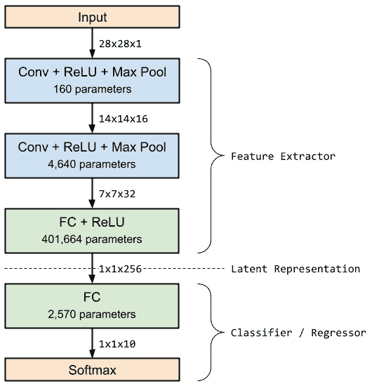

图 10.7 – 深度学习模型架构

1.  在定义了模型结构之后，我们需要定义我们试图优化的`loss`指标，并指定一个优化器。优化器负责在每次训练迭代中计算所有权重的变化，给定总损失和反向传播的损失。使用 Keras 和 TensorFlow，我们可以轻松选择一个最先进的优化器，并为分类使用默认的指标：

    ```py
    model.compile(loss='categorical_crossentropy',
                  optimizer='adam',
                  metrics=['accuracy'])
    ```

在前面的代码中，我们定义了一个`categorical_crossentropy`损失和`adam`优化器来训练 CNN。我们还跟踪了除了损失之外的另一个指标——`accuracy`。这使得在训练过程中更容易估计和衡量 CNN 的性能。

1.  在开始训练之前，我们必须定义一个模型检查点。这很重要，因为它允许我们在每个 epoch 之后在任何给定时间暂停和恢复训练。使用 Keras，实现这一点相当简单，如下所示：

    ```py
    from tensorflow.keras.callbacks import ModelCheckpoint
    checkpoint_path = "./mnist_cnn.bin"
    checkpoint_cb = ModelCheckpoint(checkpoint_path)
    ```

1.  最后，我们可以通过在 Keras 模型上调用`fit`方法来在本地开始训练。我们必须提供训练数据以及训练的批大小和 epoch（迭代）数。我们还必须传递之前创建的`callback`模型检查点，这样我们就可以在每个 epoch 后保存模型：

    ```py
    model.fit(X_train,
              y_train,
              batch_size=16,
              epochs=10,
              callbacks=[checkpoint_cb])
    ```

1.  最后，我们可以使用最后一个 epoch 训练好的模型在测试集上计算最终得分：

    ```py
    from tensorflow.keras.models import load_model
    model = load_model(checkpoint_path)
    scores = model.evaluate(X_test, y_test, verbose=1)
    print('Test loss:', scores[0])
    print('Test accuracy:', scores[1])
    ```

在前面的代码中，我们可以看到在 Azure Machine Learning 的计算实例上训练 CNN 是直接且与在本地机器上训练模型类似的。唯一的区别是我们必须确保所有必需的库（及其所需版本）都已安装，并且数据是可用的。

## 使用增强生成更多输入数据

DL 模型通常有数百万个参数来表示训练集分布的模型。因此，在处理 DL 时，无论是使用认知服务进行自定义视觉、Azure Machine Learning Studio 或 ML 服务工作区中的自定义模型，都应该始终实现数据增强。

数据增强是一种通过稍微修改现有数据并提供修改后的数据给 ML 算法来创建更多训练数据的方法。根据用例的不同，这可能包括镜像、平移、缩放或倾斜图像，以及改变图像的亮度、亮度和颜色信息。这些修改可以极大地提高模型的泛化能力，例如，使模型能够更好地实现尺度、平移、旋转和变换的不变性。

使用 TensorFlow 和 Keras 的好处是数据增强是一个内置功能。首先，我们可以创建一个 `ImageDataGenerator` 对象，该对象存储了所有我们的修改，并且可以通过增强数据集生成迭代器。此生成器的数据增强技术可以在初始化生成器时进行配置。然而，我们希望使用生成器简单地遍历训练图像而不进行增强，并在连接好所有组件后再添加增强。让我们看一下：

1.  让我们在 Keras 中使用 `ImageDataGenerator` 对象实现一个图像数据生成器：

    ```py
    from tensorflow.keras.preprocessing.image import \
        ImageDataGenerator
    datagen = ImageDataGenerator()
    ```

1.  现在，我们可以通过将原始训练图像数据和标签传递给生成器来从图像数据生成器返回一个数据迭代器。在我们从生成器中采样图像之前，我们需要计算训练集统计信息，这些统计信息将用于进一步的增强。类似于 scikit-learn 的 `BaseTransformer` 接口，我们需要在生成器上调用 `fit` 方法：

    ```py
    datagen.fit(x_train)
    ```

1.  接下来，我们必须使用 `flow` 方法创建一个迭代器：

    ```py
    it = datagen.flow(X_train, y_train, batch_size=16)
    ```

1.  如果我们不想事先将图像加载到 NumPy 数组中，而是想从文件夹中读取单个图像，我们可以使用不同的生成器函数来完成，如下面的代码片段所示：

    ```py
    it = datagen.flow_from_directory(
             directory='./data/mnist',
             target_size=(28, 28),
             batch_size=16,
             class_mode='categorical')
    ```

然而，在我们的例子中，训练图像已经被合并到一个单独的文件中，因此我们不需要自己加载图像数据。

1.  现在，我们可以使用迭代器来遍历数据生成器，并在每次迭代中产生新的训练样本。为此，我们需要用 `fit_generator` 函数替换 `fit` 函数，该函数期望一个迭代器而不是训练数据集：

    ```py
    model.fit_generator(it,
                        steps_per_epoch=256,
                        epochs=10,
                        callbacks=[checkpoint_cb])
    ```

如我们所见，我们可以将相同的`epoch`和`callback`参数传递给`fit_generator`函数，就像我们传递给`fit`函数一样。唯一的区别是现在，我们需要在每个 epoch 中固定几个步骤，以便迭代器产生新的图像。一旦我们将增强方法添加到生成器中，理论上我们可以在每个 epoch 中为每个训练图像生成无限多的修改。因此，使用此参数，我们可以定义我们希望每个 epoch 训练多少批数据，这应该大致对应于训练样本数除以批大小。

最后，我们可以配置数据增强技术。默认的图像数据生成器通过不同的参数支持各种增强：

+   翻译或平移

+   水平或垂直翻转

+   旋转

+   亮度

+   缩放

让我们回到图像数据生成器并激活数据增强技术。以下是一个常用于图像处理数据增强的示例生成器：

```py
datagen = ImageDataGenerator(
              featurewise_center=True,
              featurewise_std_normalization=True,
              rotation_range=20,
              width_shift_range=0.2,
              height_shift_range=0.2,
              horizontal_flip=True)
```

通过使用此数据生成器，我们可以使用增强图像数据来训练模型，并进一步提高 CNN 的性能。正如我们之前所看到的，这是任何深度学习（DL）训练流程中的关键步骤，并且强烈推荐。

让我们将迄今为止开发的全部代码移动到一个名为`scripts/train.py`的文件中。我们将在下一节中使用此文件在 GPU 集群上安排和运行它。

## 使用 Azure 机器学习在 GPU 集群上进行训练

现在我们已经准备好训练脚本，验证了脚本的工作，并添加了数据增强，我们可以将此训练脚本移动到更高效的执行环境中。在深度学习中，许多操作，如卷积、池化和通用张量运算符，可以从并行执行中受益。因此，我们将训练脚本在 GPU 集群上执行，并在创作环境中跟踪其状态。

使用 Azure 机器学习的优点之一是我们可以从创作环境中设置和运行所有内容——即运行在 Azure 机器学习计算实例上的 Jupyter 笔记本：

1.  首先，我们必须配置我们的 Azure 机器学习工作区，这是一个在计算实例上不带参数的单个语句：

    ```py
    from azureml.core.workspace import Workspace
    ws = Workspace.from_config()
    ```

1.  接下来，我们必须为训练过程加载或创建一个具有自动扩展功能的 GPU 集群：

    ```py
    from azureml.core.compute import ComputeTarget, \
        AmlCompute
    from azureml.core.compute_target import \
        ComputeTargetException
    cluster_name = "gpu-cluster"
    vm_size = "STANDARD_NC6"
    max_nodes = 3
    try:
        compute_target = ComputeTarget(ws, 
            name=cluster_name)
        print('Found existing compute target.')
    except ComputeTargetException:
        print('Creating a new compute target...')
        compute_config = \
            AmlCompute.provisioning_configuration(
                vm_size=vm_size, max_nodes=max_nodes)
        # create the cluster and wait for completion
        compute_target = ComputeTarget.create(ws, 
            cluster_name, compute_config)
    compute_target.wait_for_completion(show_output=True)
    ```

如前述代码片段所示，使用 Azure 机器学习创建具有自动扩展功能的 GPU 集群只需要在 Jupyter 中编写几行代码。但我们是如何选择虚拟机大小和 GPU 集群节点数量的呢？

通常，您可以从 Azure 的 N 系列虚拟机中的 NC、ND 和 NV 类型中进行选择。较晚的版本号（例如，v2 或 v3）通常意味着更新的硬件，因此有更新的 CPU 和 GPU，以及更好的内存。您可以将不同的 N 系列版本视为应用类型（*NC*，其中 *C* 代表计算；*ND*，其中 *D* 代表深度学习；*NV*，其中 *V* 代表视频）。以下表格将帮助您比较不同的 N 系列虚拟机类型及其 GPU 配置。大多数机器可以扩展到每个虚拟机四个 GPU。

下表显示了 Azure VM N 系列的比较：

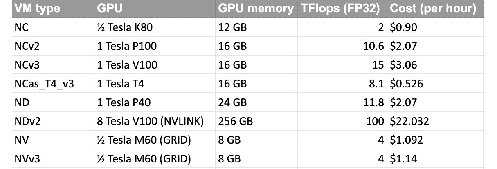

图 10.8 – Azure VM N 系列成本

上表中的价格代表 2021 年 12 月美国西部 2 区域 Linux VM 的按量付费价格。请注意，这些价格在你阅读此内容时可能已经发生变化，但它应该能给你一个不同选项和配置的选择指示。

为了更好地了解成本和性能，我们可以查看在 ImageNet 数据集上训练 ResNet50 模型的典型工作负载。以下由 Nvidia 提供的表格显示，选择最新的 GPU 模型是有意义的，因为它们的性能提升更好，成本也更有效率，比旧款 GPU 模型更优。

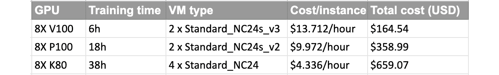

图 10.9 – GPU 成本

如前表所示，对于相同任务的较短的训练时间所显示的性能提升是有回报的，并且导致整体任务的成本大大降低。

因此，从定价角度来看，`STANDARD_NC6` 模型是开始在 Azure 上进行 GPU、CNN 和 DNN 实验的一个很好的起点。我们唯一需要确保的是我们的模型可以适应 VM 可用的 GPU 内存。计算这个的一个常见方法是计算模型的参数数量，乘以 2 以存储梯度（仅进行推理时乘以 1），乘以批处理大小，再乘以 4 以字节为单位表示的单精度大小（或乘以 2 以表示半精度）。

在我们的例子中，CNN 架构需要 1.6 MB 来存储可训练参数（权重和偏差）。为了存储批处理大小为 16 的反向传播损失，我们需要大约 51.2 MB（1.6 MB x 16 x 2）的 GPU 内存来在单个 GPU 上执行整个端到端训练。这也很容易适应我们最小的 NC 实例中的 12 GB GPU 内存。

重要提示

虽然这些数字对于我们的测试案例来说似乎很小，但你经常会处理更大的模型（参数数量高达 1 亿）和更大的图像尺寸。为了更直观地说明这一点，ResNet152 在 224 x 224 x 3 的图像尺寸上训练时，大约有 6000 万个参数和 240 MB 的大小。根据我们的公式，在 `STANDARD_NC6` 实例上，我们最多可以在批处理大小为 24 的情况下进行训练。

通过向集群添加更多的 GPU 或节点，我们必须引入一个不同的框架来利用分布式设置。我们将在*第十二章*，“Azure 上的分布式机器学习”中更详细地讨论这个问题。然而，我们可以通过自动扩展添加更多的节点到集群，这样多个人可以同时提交多个作业。最大节点数可以计算为*每个节点的并发模型数*乘以同时要训练的峰值模型数。在我们的测试场景中，我们将选择`3`个节点的集群大小，这样我们就可以同时安排几个模型。

1.  既然我们已经决定了虚拟机的大小和 GPU 配置，我们就可以继续进行训练过程。接下来，我们需要确保集群可以访问训练数据。为此，我们将使用 Azure 机器学习工作区上的默认数据存储库：

    ```py
    ds = ws.get_default_datastore()
    ds.upload(src_dir='./data/mnist',
              target_path='mnist',
              show_progress=True)
    ```

在前面的代码中，我们将训练数据从本地机器复制到了默认的数据存储库——blob 存储账户。正如我们在*第四章*，“数据摄取与管理数据集”中讨论的那样，还有其他方法可以将您的数据上传到 blob 存储或其他存储系统。

将 blob 存储挂载到机器上，甚至是一个集群，通常不是一个简单的过程。是的，您可以在集群的每个节点上挂载一个 NAS 作为网络驱动器，但这设置和扩展起来都很繁琐。使用 Azure 机器学习数据存储 API，我们可以简单地请求一个数据存储库的引用，这个引用可以用来在每个需要访问数据的机器上挂载正确的文件夹：

```py
ds_data = ds.as_mount()
```

前面的命令返回一个`Datastore Mount`对象，看起来并不特别强大。然而，如果我们把这个引用作为参数传递给训练脚本，它可以在 Azure 机器学习中的每个训练计算上自动挂载数据存储库并读取内容。如果您曾经玩过挂载点或`fstab`，您会理解这一行代码可以加快您的日常工作流程。

1.  现在，我们可以创建一个 Azure 机器学习配置。让我们创建`ScriptRunConfiguration`，这样我们就可以在集群上安排训练脚本：

    ```py
    from azureml.core import ScriptRunConfig
    script_params={
        '--data-dir': ds_data
    }
    src = src = ScriptRunConfig(
        source_directory='./scripts',
        script='train.py',
        compute_target=compute_target,
        environment=tf_env)
    ```

1.  要从指定的默认数据存储库读取数据，我们需要解析`train.py`脚本中的参数。让我们回到脚本，用以下代码块替换文件加载代码：

    ```py
    import argparse
    parser = argparse.ArgumentParser()
    parser.add_argument('--data-dir', type=str)
    args = parser.parse_args()
    DIR = args.data_dir
    X_train = load(DIR + 'train-images.gz', False) / 255.0
    X_test = load(DIR + 'test-images.gz', False) / 255.0
    y_train = load(DIR + 'train-labels.gz', True) \
                  .reshape(-1)
    y_test = load(DIR + 'test-labels.gz', True) \
                  .reshape(-1)
    ```

1.  这就剩下在 GPU 集群上安排和运行脚本了。然而，在这样做之前，我们想要确保所有运行都在 Azure 机器学习服务中被跟踪。因此，我们还需要在`train.py`文件中添加`Run`，并重用来自*第三章*，“准备 Azure 机器学习工作区”的 Keras 回调。以下是训练脚本的样子：

    ```py
    from azureml.core import Run
    # Get the run configuration
    run = Run.get_context()
    # Create an Azure Machine Learning monitor callback
    azureml_cb = AzureMlKerasCallback(run)
    callbacks = [azureml_cb, checkpoint_cb]
    model.fit_generator(it,
                        steps_per_epoch=256,
                        epochs=10,
                        callbacks=callbacks)
    # Load the best model
    model = load_model(checkpoint_path)
    # Score trained model
    scores = model.evaluate(X_test, y_test, verbose=1)
    print('Test loss:', scores[0])
    run.log('Test loss', scores[0])
    print('Test accuracy:', scores[1])
    run.log('Test accuracy', scores[1])
    ```

正如我们所见，我们添加了`Run`配置和 Keras 回调来跟踪整个训练过程中的所有指标。我们还收集了最终的测试集指标，并将其报告给 Azure 机器学习服务。您可以在本书提供的代码中找到完整的可运行示例。

## 通过转移学习提高您的性能

在许多情况下，您可能没有包含数亿个标记训练样本的数据集，这是完全可以理解的。那么，您如何还能从所有之前的工作和基准测试中受益呢？难道在识别动物的特征提取器训练后，在识别面部时表现不佳吗？分类器当然会不同，但从图像中提取的视觉特征应该是相似的。

这就是`faces`数据集、`CoCo`数据集等背后的想法，并在模型的末端附加一个自定义分类器。转移学习意味着我们可以将一个模型从一项任务的特征转移到另一项任务：例如，从分类到目标检测。一开始可能会有些困惑，是否希望为不同的任务重用特征。然而，如果一个模型已经被训练来识别图像中的地理形状模式，这个相同的特征提取器当然可以用于同一领域中的任何与图像相关的任务。

转移学习的一个有用特性是，初始学习任务不一定需要是一个监督式机器学习任务，因此不需要有标注的训练数据来训练特征提取器。一种流行的无监督机器学习技术称为自编码器，其中机器学习模型试图使用特征提取器和上采样网络，根据输入生成类似的外观输出。通过最小化生成的输出与输入之间的误差，特征提取器学会在潜在空间中高效地表示输入数据。自编码器在预训练网络架构之前，使用实际机器学习任务的预训练权重之前很受欢迎。

我们需要确保预训练模型是在同一领域的数据集上训练的。生物细胞图像与面部看起来非常不同，云与建筑物看起来也非常不同。一般来说，ImageNet 数据集涵盖了广泛的照片风格图像，用于许多标准视觉特征，如建筑物、汽车、动物等。因此，对于许多计算机视觉任务，使用预训练模型是一个很好的选择。

转移学习不仅与计算机视觉中的图像数据和建模数据相关。转移学习在数据集足够相似的所有领域都已被证明是有价值的，例如人类声音或书面文本。因此，无论何时您在实现深度学习模型时，都要研究可用于转移学习的数据集，以及最终提高模型性能。

让我们将理论应用于实践，并深入研究一些示例。我们在本章前面看到了一个类似的例子，其中我们将特征提取器的输出管道化到一个 SVM。在本节中，我们想要实现类似的效果，但结果将是一个单一端到端模型。因此，在这个例子中，我们将构建一个由预训练的特征提取器和新的分类器头部组成的新模型网络架构：

1.  首先，我们必须定义输出类的数量、输入形状，并从 Keras 加载基本模型：

    ```py
    from tensorflow.keras.applications.resnet50 \
        import ResNet50
    num_classes = 10
    input_shape = (224, 224, 3)
    # create the base pre-trained model
    base_model = ResNet50(input_shape=input_shape, 
                          weights='imagenet',
                          include_top=False,
                          pooling='avg')
    ```

在前面的代码中，预训练的大部分魔法都归功于 Keras。首先，我们使用`weights`参数指定了将用于训练此模型的图像数据集，这将自动使用预训练的`imagenet`权重初始化模型权重。通过第三个参数`include_top=False`，我们告诉 Keras 只加载模型的特征提取部分。使用`pooling`参数，我们还指定了最后一个池化操作应该如何执行。在这种情况下，我们选择了平均池化。

1.  接下来，我们必须通过将它们的`trainable`属性设置为`False`来冻结模型的层。为此，我们可以简单地遍历模型中的所有层：

    ```py
    for layer in base_model.layers:
        layer.trainable = False
    ```

1.  最后，我们可以将任何网络架构附加到我们想要的模型上。在这种情况下，我们将附加与上一节中 CNN 网络中使用的相同分类器头部。最后，我们必须使用新的架构和输出作为分类器输出层来构建最终的模型类：

    ```py
    from tensorflow.keras.models import Model
    from tensorflow.keras.layers import Flatten, Dense
    clf = base_model.output
    clf = Dense(256, activation='relu')(clf)
    clf = Dense(10, activation='softmax')(clf)
    model = Model(base_model.input, clf)
    ```

就这样！你已经成功构建了一个新的端到端模型，该模型结合了在 ImageNet 上预训练的 ResNet50 特征提取器以及你的自定义分类器。现在你可以使用这个 Keras 模型，将其插入你偏好的优化器中，并发送到 GPU 集群。训练过程的输出将是一个可以像任何其他自定义模型一样管理和部署的单个模型。

重要提示

你不必总是冻结原始网络的所有层。一个常见的方法是同时解冻网络中的后续层，将学习率至少降低 10 倍，并继续训练。通过重复此过程，我们甚至可以以逐步降低学习率的方式重新训练（或微调）网络的所有层。

不论你的选择和使用案例如何，你应该将迁移学习添加到你的标准训练深度学习模型的方法库中。将其视为其他流行的预处理和训练技术，例如数据增强，这些技术应该在训练深度学习模型时始终使用。

# 摘要

在本章中，我们学习了何时以及如何使用深度学习（DL）在 Azure 上训练机器学习（ML）模型。我们使用了 Azure 机器学习服务中的计算实例和 GPU 集群来使用 Keras 和 TensorFlow 训练模型。

首先，我们发现深度学习在具有非明显关系的结构化数据上工作得非常好，这些关系是从原始输入数据到最终预测结果。好的例子包括图像分类、语音转文本和翻译。我们还看到，深度学习模型是具有大量参数的参数模型，因此我们通常需要大量的标记或增强的输入数据。与传统机器学习方法相比，额外的参数用于训练一个完全端到端的模型，这还包括从原始输入数据中提取特征。

使用 Azure 机器学习服务训练 CNN 并不困难。我们看到了许多方法，从在 Jupyter 中进行原型设计到增强训练数据，再到在具有自动扩展功能的 GPU 集群上运行训练。在深度学习中，困难的部分在于准备和提供足够的高质量训练数据，找到一个描述性的错误度量标准，以及在成本和性能之间进行优化。我们概述了如何为您的任务选择最佳的虚拟机和 GPU 大小及配置，我建议您在开始您的第一个 GPU 集群之前先做这件事。

在下一章中，我们将进一步探讨超参数调整和自动机器学习，这是 Azure 机器学习服务中的一个功能，允许您自动训练和优化堆叠模型。
