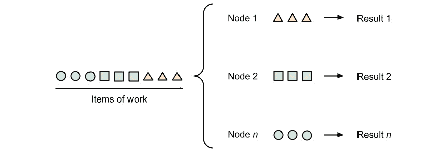
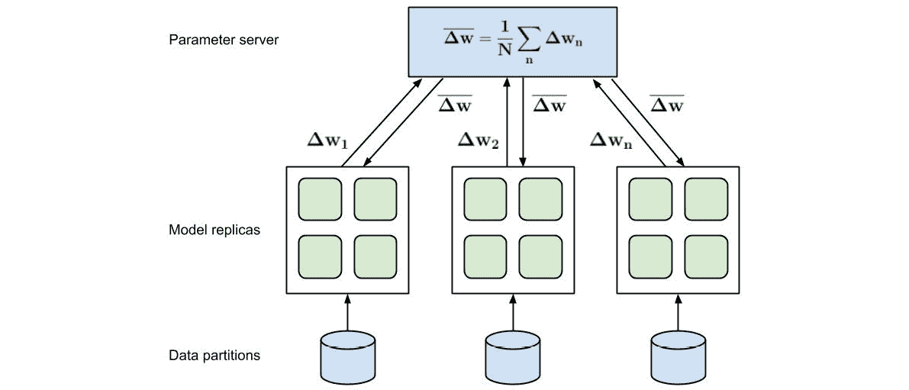

# 第十二章：*第十二章*：Azure 上的分布式机器学习

在上一章中，我们学习了通过搜索和优化进行超参数调整，使用 HyperDrive 以及自动机器学习作为超参数优化的特例，涉及特征工程、模型选择和模型堆叠。自动机器学习是**机器学习即服务**（**MLaaS**），其中唯一的输入是您的数据、一个机器学习任务和一个错误度量。很难想象在单个机器或单个 CPU/GPU 上运行所有自动机器学习的实验和参数组合，我们正在寻找通过并行化和分布式计算加速训练过程的方法。

在本章中，我们将探讨用于在并行中高效训练机器学习模型的分布式和并行计算算法和框架。本章的目标是在 Azure 中构建一个环境，通过向您的训练环境添加更多机器，从而扩展集群，加速经典机器学习和深度学习模型的训练过程。

首先，我们将探讨**分布式机器学习**的不同方法和基本构建块。您将了解在 HyperDrive 和自动机器学习中并行训练独立模型的方法，以及通过划分训练数据并行训练单个模型集成在大型数据集上的方法。然后，我们将探讨针对单个模型的分布式机器学习，并发现数据分布式和模型分布式训练方法。这两种方法通常在现实场景中用于加速或实现大型深度神经网络的训练。

之后，我们将了解分布式机器学习中最流行的框架以及如何在 Azure 中使用它们，以及如何与 Azure 机器学习计算结合使用。分布式机器学习库之间的执行引擎、通信库和功能之间的过渡是平滑的，但往往难以理解。然而，在阅读本章后，您将了解在 Databricks 中使用 MLlib 运行 Apache Spark 和使用 Horovod、Gloo、PyTorch 和 TensorFlow 参数服务器之间的区别。

在最后一节中，我们将探讨如何在 Azure 中实现我们将要介绍的功能，并将其与 Azure 机器学习计算集成。

本章涵盖了以下主题：

+   探索分布式机器学习的方法

+   在 Azure 中使用分布式机器学习

# 技术要求

在本章中，我们将使用以下 Python 库和版本来创建基于决策树的集成分类器：

+   `azureml-core 1.34.0`

+   `azureml-sdk 1.34.0`

+   `horovod 0.23.0`

+   `tensorflow 2.6.0`

+   `pyspark 3.2.0`

+   `numpy 1.19.5`

+   `pandas 1.3.2`

+   `scikit-learn 0.24.2`

与前几章类似，您可以使用本地 Python 解释器或托管在 Azure 机器学习中的笔记本环境执行此代码。

本章中所有代码示例都可以在本书的 GitHub 仓库中找到，该仓库位于[`github.com/PacktPublishing/Mastering-Azure-Machine-Learning-Second-Edition/tree/main/chapter12`](https://github.com/PacktPublishing/Mastering-Azure-Machine-Learning-Second-Edition/tree/main/chapter12)。

# 探索分布式机器学习的方法

对于许多用户来说，实现机器学习流水线的旅程非常相似，通常与前面章节中描述的步骤相似。当用户开始从实验转向现实世界数据或从小示例转向更大模型时，他们经常会遇到类似的问题：在大量数据上训练大型参数模型——特别是深度学习（DL）模型——需要非常长的时间。有时，一个 epoch 需要数小时，训练需要数天才能收敛。

等待数小时甚至数天以等待模型收敛，对于许多工程师来说意味着宝贵时间的浪费，因为它使得交互式调整训练过程变得更加困难。因此，许多机器学习工程师需要通过利用各种分布式计算技术来加速他们的训练过程。分布式机器学习的理念就像通过添加更多计算资源来加速训练过程一样简单。在最佳情况下，通过向训练集群添加更多机器（扩展），训练性能可以线性提高。在本节中，我们将探讨分布式机器学习最常见的模式，并尝试理解和推理它们。在本章的下一节中，我们还将将这些模式应用于一些实际案例。

大多数现代机器学习（ML）流水线在数据或模型变得更大时，会使用本章讨论的一些技术来加速训练过程。这类似于大数据平台（如 Spark、Hive 等）在数据变得庞大时进行数据预处理的需求。因此，尽管本章看起来过于复杂，但我们建议在等待模型收敛或希望更快地产生更好结果时重新审视它。

如此，利用分布式计算进行机器学习通常有三种模式，如下所示：

+   并行地在小数据上训练独立的模型

+   并行地在数据的不同子集上训练模型的副本

+   并行训练同一模型的各个部分

让我们逐一查看这些方法。

## 并行地在小数据上训练独立的模型

我们首先来看一个最简单的例子：在（小）数据集上训练（小）独立模型。这种并行训练的典型用例是进行超参数搜索或经典机器学习模型或小型神经网络的优化。这与我们在*第十一章*中讨论的内容非常相似，即*超参数调整和自动机器学习*。即使是自动机器学习——其中多个独立的模型被训练和比较——在底层也使用这种方法。在并行训练中，我们的目标是通过并行训练这些模型来加速具有不同参数的多个独立模型的训练。

下面的图示显示了这种情况，其中我们不是在单台机器上按顺序训练单个模型，而是在并行训练它们：



图 12.1 – 并行处理

您可以看到，在单个模型的训练过程中不需要通信或同步。这意味着我们可以在同一台机器上的多个 CPU/GPU 上训练，或者在不同的机器上训练。

当使用 Azure Machine Learning 进行超参数调整时，通过配置具有多个节点的 Azure Machine Learning 计算目标并选择 HyperDrive 配置的`max_concurrent_runs`参数中的并发运行数量，可以轻松实现这种并行化。在 Azure Machine Learning HyperDrive 中，只需指定一个估计器和`param_sampling`，然后将 HyperDrive 配置作为实验提交，就可以并行运行单个任务，如下所示：

```py
from azureml.train.hyperdrive import HyperDriveConfig
hyperdrive_run_config = HyperDriveConfig(
    estimator=estimator,
    hyperparameter_sampling=param_sampling, 
    primary_metric_name="accuracy", 
    primary_metric_goal=PrimaryMetricGoal.MAXIMIZE,
    max_total_runs=100,
    max_concurrent_runs=4)
from azureml.core.experiment import Experiment
experiment = Experiment(workspace, experiment_name)
hyperdrive_run = experiment.submit(hyperdrive_run_config)
```

这里有一些公式来计算 HyperDrive 或其他任何分布式计算设置中`max_concurrent_runs`的值：

+   对于基于 CPU 的训练，最大并发训练运行次数受可用 CPU 和计算节点数量的限制。可用的物理内存也是一个限制因素，但通过交换到虚拟内存，我们可以消耗比物理可用更多的内存。

+   对于基于 GPU 的训练，最大并发训练运行次数受可用 GPU 和计算节点数量以及可用 GPU 内存量的限制。通常，一个训练运行被固定到一个物理 GPU 上，但通过 GPU 虚拟化，如果足够的 GPU 内存可用，我们也可以在单个物理 GPU 上训练多个模型。

这里是如何估计单个模型将消耗多少内存的指南：

**单个参数的大小**：

+   半精度浮点数：16 位（2 字节）。

+   单精度浮点数：32 位（4 字节）——这通常是默认值。

+   双精度浮点数：64 位（8 字节）。

**模型所需的参数数量**：

+   参数模型：所有参数的总和

+   非参数模型：表示数量（例如，决策树）* 表示的参数数量

然后，您需要乘以额外的因素，如下所示：

+   使用反向传播的模型：总体内存 * 2

+   使用批次的模型：总体内存 * 批次大小

+   使用（递归）状态的模型：每个状态的记忆 * 递归步骤数

虽然这个用例看起来非常相似，但让我们继续到下一个用例，其中我们得到一个无法复制到每台机器上的大型数据集。

## 并行在大数据集上训练模型集成

我们接下来要讨论的是机器学习中的一个非常常见的优化，尤其是在在大数据集上训练模型时。为了训练模型，我们通常需要一个大量数据，这些数据很少全部适合单台机器的内存。因此，通常需要将数据分割成块，并在不同的块上训练多个单个模型。

以下截图显示了两种将数据分割成更小块的方法——通过水平分割行（左）或通过垂直分割列（右）：


图 12.2 – 数据分割：水平（行方向）与垂直（列方向）

你也可以混合这两种技术从你的训练数据中提取子集。无论何时你使用大数据领域中的工具——如 MapReduce、Hive 或 Spark——分割你的数据将有助于你加快训练过程或最初就允许在大量数据上训练。

执行数据分布式训练的一个好例子是训练一个由完全独立的决策树模型组成的巨大树集成，也称为随机森林。通过将数据分割成成千上万的随机块，你可以为每个数据块训练一个决策树，并将所有训练好的树组合成一个单一集成模型。Apache Hivemall 是一个基于 Hive 和 Spark 的库，在两个执行引擎中的任何一个上都可以做到这一点。以下是一个使用**Hive 查询语言**（**HiveQL**）和 Apache Hivemall 在 Hive 上训练多个 XGBoost 多类集成模型的示例：

```py
-- explicitly use 3 reducers
-- set mapred.reduce.tasks=3;
create table xgb_softmax_model as
select 
  train_xgboost(features, label, 
    '-objective multi:softmax -num_class 10 -num_round 10') 
    as (model_id, model)
from (
  select features, (label - 1) as label
  from data_train
  cluster by rand(43) -- shuffle data to reducers
) data;
```

在前面的函数中，我们使用`cluster`关键字随机移动数据行到 reducer。这将水平分割数据并在每个 reducer 上为每个分区训练一个 XGBoost 模型。通过定义 reducer 的数量，我们也定义了并行训练的模型数量。生成的模型存储在一个表中，其中每一行定义了一个模型的参数。在预测中，我们只需简单地将所有单个模型组合起来，并执行平均投票标准以检索最终结果。

这种方法的另一个例子是一个标准的 Spark 管道，它在垂直和水平数据分区上训练多个独立模型。当我们完成单个模型的训练后，我们可以在推理期间使用平均投票标准来找到预测任务的优化结果。以下是一个使用 Python、PySpark 和 scikit-learn 并行在水平分割数据上训练多个模型的示例脚本：

```py
from pyspark.sql import SparkSession
spark = SparkSession.builder \
    .appName("Distributed Training") \
    .master("local") \
    .getOrCreate()
# read the input data
df = spark.read.parquet("data/")
# define your training function
from sklearn.ensemble import RandomForestClassifier
def train_model(data):
    clf = RandomForestClassifier(n_estimators=10)
    return clf.fit(data['train_x'], data['train_y'])
# split your data into partitions and train models
num_models = 100
models = df.rdd.repartition(num_models) \
  .mapPartitions(train_model) \
  .collect()
```

在前面的函数中，我们现在可以加载几乎任何数量的数据，并重新分区，使得每个分区都能适应单个节点的本地内存。如果我们有 1 个`collect()`方法来将所有训练好的模型返回给头节点。

我们也可以选择将每个单独工作节点的模型存储在磁盘上或在分布式文件系统中，但将结果合并到单个节点上可能更好。在这个例子中，我们看到我们有选择这两种方法之一的自由，因为所有模型都是相互独立的。但这并不适用于模型突然相互依赖的情况——例如，当最小化全局梯度或在一个模型上分割多个机器时，这两种情况都是训练 DNN 时的常见用例。在这种情况下，我们需要一些新的操作符来引导数据和梯度的控制流。让我们在下一节中探讨这些操作符。

## 分布式机器学习的基本构建块

如前一个示例所示，我们在分布式系统中管理数据流需要一些基本的构建块或操作符。我们把这些操作符称为**集体算法**。这些算法实现了分布式计算中的常见同步和通信模式，并且在训练机器学习模型时是必需的。在我们深入探讨深度神经网络（DNN）的分布式训练方法之前，我们将快速浏览这些模式以了解其基础。

分布式系统中最常见的通信模式如下：

+   一对一

+   一对多（也称为*broadcast*或*scatter*模式）

+   多对一（也称为*gather*或*reduce*模式）

+   多对多（也称为*all-gather*或*all-reduce*模式）

下面的截图提供了这些模式的一个很好的概述，并展示了数据如何在系统的各个个体之间流动：


图 12.3 – 分布式系统中的通信模式

我们可以立即回想起贝叶斯优化技术中的超参数优化技巧。首先，我们需要将训练数据从主节点**广播**到所有工作节点。然后，我们可以在主节点的参数空间中选择参数组合，并将这些广播到工作节点。最后，我们在工作节点上执行训练，然后在主节点上**收集**所有模型验证分数。通过比较分数并应用贝叶斯定理，我们可以预测下一个可能的参数组合，并将它们重复广播到工作节点。

你注意到了前面算法中的某个地方吗？我们如何知道所有工作节点已经完成了训练过程，并从所有工作节点收集所有分数？为了做到这一点，我们将使用另一个构建块，称为同步，或**屏障同步**。使用屏障同步，我们可以安排任务的执行，使其需要等待所有其他分布式任务完成。以下截图展示了多处理器中同步模式的良好概述：


图 12.4 – 同步机制

如你所见，我们已经在上一章中隐式地使用了这些算法，当时它们被隐藏在*优化*这个术语背后。现在，我们将通过更改优化器来显式地使用它们，以便在多台机器上训练单个模型。

如你所想，这些模式并不新鲜，并且你的操作系统每秒会多次使用它们。然而，在这种情况下，我们可以利用这些模式并将它们应用于分布式训练过程的执行图，并通过专用硬件（例如，通过使用**InfiniBand**（**IB**）连接两个 GPU）。

为了使用这个集体算法与不同级别的硬件支持（GPU 支持和向量化），你需要选择一个通信后端。这些后端是通常作为单独进程运行的库，并实现通信和同步模式。用于集体算法的流行库包括 **Gloo**、**消息传递接口**（**MPI**）和 **NVIDIA 集体通信库**（**NCCL**）。

大多数深度学习框架，如 PyTorch 或 TensorFlow，在这些通信后端之一上提供了自己的高级抽象——例如，PyTorch **远程过程调用**（**RPC**）和 TensorFlow **参数服务器（PS**）。你不必使用不同的执行和通信框架，也可以选择一个通用的分布式计算框架，如 Spark。

重要提示

PyTorch 文档提供了一个关于何时使用哪个集体通信库的最新指南：https://pytorch.org/docs/stable/distributed.html#which-backend-to-use.

如你所见，可能的选择列表是无限的，并且有多种组合可能。我们甚至还没有谈到 Horovod，这是一个框架，用于通过分布式优化器将分布式训练添加到其他深度学习框架中。好事是，大多数这些框架和库都包含在所有 Azure Machine Learning 运行时中，并且通过 Azure ML SDK 得到支持。这意味着你通常只需要指定所需的后端，将你的模型提供给任何特定框架，然后让 Azure Machine Learning 处理这些工具的设置、初始化和管理。我们将在本章的后半部分看到这一点。

## 使用数据并行训练加速深度学习

在深度学习（DL）中，分布式数据并行训练的另一种变体非常常见。为了加快大型模型的训练速度，我们可以在同一模型的分布式副本上运行多个不同数据块的训练迭代。这在每次训练迭代需要显著时间（例如，数秒）的情况下尤为重要，这对于我们想要利用多 GPU 环境的训练大型深度神经网络（DNNs）是一个典型场景。

深度学习中的数据分布式训练基于使用**分布式梯度下降**（**DGD**）算法的思想，如下所示：

1.  将模型的一个副本分发到每个节点。

1.  将数据块分发给每个节点。

1.  在每个节点上运行整个网络，并计算梯度。

1.  在单个节点上收集所有梯度并计算平均梯度。

1.  将平均梯度发送到所有节点。

1.  使用平均梯度更新所有模型。

以下图表显示了多个模型在行动中的情况，它们分别运行正向/反向传递，并将梯度发送回参数服务器：



图 12.5 – 数据并行训练

如此看来，服务器计算平均梯度，并将其发送回所有其他节点。我们可以立即看到，突然之间，工作节点和主节点（让我们称其为*参数服务器*）之间需要通信，并且在等待所有模型完成梯度计算时也需要同步。

这种用例的一个很好的例子是通过并行化反向传播步骤并将每个节点的梯度组合到整体梯度中来加速深度学习模型的训练过程。TensorFlow 目前使用所谓的参数服务器支持这种分布模式。Uber 开发的*Horovod*框架为分布式优化器提供了一个方便的抽象，并可以插入许多可用的机器学习框架或分布式执行引擎，如 TensorFlow、PyTorch 和 Apache Spark。我们将在*Horovod – 分布式深度学习训练框架*部分中查看使用 Horovod 和 Azure 机器学习的实际示例。

## 使用模型并行训练训练大型模型

最后，深度学习中的一个常见用例是训练比单个 GPU 提供的 GPU 内存更大的模型。这种方法有点复杂，因为它需要将模型执行图分割到不同的 GPU 或甚至不同的机器上。虽然这在基于 CPU 的执行中不是大问题，并且通常在 Spark、Hive 或 TensorFlow 中完成，但我们还需要在多个 GPU 内存之间传输中间结果。为了有效地做到这一点，需要额外的硬件和驱动程序，例如**Infiniband**（GPU 到 GPU 通信）和**GPUDirect**（高效的 GPU 内存访问）。

下图显示了并行计算多个梯度（在左侧）和计算分布式模型的单个前向传播（在右侧）之间的差异：


图 12.6 – 模型并行训练

后者要复杂得多，因为数据需要在多个 GPU 和/或多个节点之间的正向和反向传播过程中进行交换。

通常，我们在两种场景之间进行选择：单机多 GPU 训练和多机多 GPU 训练。正如你所预期的那样，后者要复杂得多，因为它需要在网络中多个机器之间进行通信和同步。

在以下脚本中，我们使用 PyTorch 创建了一个在两个 GPU 上运行的简单模型。在整个模型中使用`.to('cuda:*')`方法，我们定义了操作应该在哪个 GPU 上执行。此外，我们还需要将这些相同的注释添加到这些计算的数据输入中：

```py
import torch
import torch.nn as nn
import torch.optim as optim
class ParallelModel(nn.Module):
    def __init__(self):
        super(ParallelModel, self).__init__()
        self.net1 = torch.nn.Linear(10, 10).to('cuda:0')
        self.relu = torch.nn.ReLU()
        self.net2 = torch.nn.Linear(10, 5).to('cuda:1')
    def forward(self, x):
        x = self.relu(self.net1(x.to('cuda:0')))
        return self.net2(x.to('cuda:1'))
```

如前述代码所示，我们配置网络在 GPU `0` 上计算第一个全连接层，而第二个全连接层则在 GPU `1` 上计算。在配置前向步骤时，我们还需要相应地配置两个层的输入。

使用内置优化器和损失函数训练模型与非分布式模型并没有太大区别。唯一的区别是我们还必须定义训练标签的目标 GPU，以便计算损失，如下所示：

```py
model = ParallelModel()
loss_fn = nn.MSELoss()
optimizer = optim.SGD(model.parameters(), lr=0.001)
optimizer.zero_grad()
outputs = model(torch.randn(20, 10))
labels = torch.randn(20, 5).to('cuda:1')
loss_fn(outputs, labels).backward()
optimizer.step()
```

如你所见，我们将单个层分割以在多个 GPU 上运行，而这些层之间的数据需要在正向和反向传播过程中进行传输。我们必须对模型本身进行代码更改，以指定模型的哪些部分应该在哪个 GPU 上运行。

重要提示

请注意，我们也可以使这种分割动态化，将模型分割成*x*个连续的子图，这些子图在*x*个 GPU 上执行。

值得注意的是，本章讨论的许多技术可以结合起来使用。例如，我们可以在每台机器上训练一个多 GPU 模型，同时将数据分成块，并在多台机器上计算多个梯度的多个部分——因此采用数据分布式模型并行方法。

在下一节中，我们将学习如何将这些概念付诸实践。

# 在 Azure 中使用分布式机器学习

“探索分布式机器学习的方法”部分包含了大量的不同并行化场景、用于集体算法的各种通信后端以及使用不同机器学习框架甚至执行引擎的代码示例。在机器学习框架的选择上，可供选择的空间相当大，做出明智的决定并不容易。当一些框架在 Azure 机器学习上直接支持时，而其他框架则需要用户安装、配置和管理，这种选择变得更加复杂。

在本节中，我们将探讨最常见的场景，学习如何选择正确的框架组合，并在 Azure 中实现分布式 ML 管道。

通常，在 Azure 中运行分布式机器学习有三种选择，如下所示：

+   第一个明显的选择是使用 Azure 机器学习，笔记本环境，Azure 机器学习 SDK 和 Azure 机器学习计算集群。这将是对许多复杂用例来说最简单的解决方案。大量数据可以存储在 Azure Blob 存储中，模型可以训练为数据并行和/或模型并行模型，使用不同的通信后端。所有这些都将通过将您的训练脚本包装在估计器抽象中来由您管理。

+   第二种选择是使用不同的代码编写和执行引擎，而不是 Azure 机器学习笔记本和 Azure 机器学习计算集群。一个流行的选项是集成了交互式笔记本和 Apache Spark 作为分布式执行引擎的 Azure Databricks。使用 Databricks，您可以使用预构建的 ML 镜像和自动扩展集群，这为运行分布式 ML 训练提供了一个极佳的环境。

+   第三种选择是构建并推出您自己的定制解决方案。为此，您需要构建一个包含虚拟机或 Kubernetes 的独立集群，并编排基础设施和代码的设置、安装和管理。虽然这是最灵活的解决方案，但它也是迄今为止设置最复杂、耗时最长的。

对于本书，我们将在深入研究 Azure 机器学习之前，首先了解 Horovod 优化器、Azure Databricks 和 Apache Spark。

## Horovod – 一个分布式深度学习训练框架

**Horovod**是一个用于启用**分布式深度学习**的框架，最初由 Uber 开发和开源。它为以下支持的框架提供了统一的方式来支持现有深度学习训练代码的分布式训练——TensorFlow、Keras、PyTorch 和 Apache MXNet。设计目标是使任何现有项目从单节点训练到数据并行训练的过渡变得极其简单，从而使得这些模型能够在分布式环境中更快地使用多个 GPU 进行训练。

Horovod 是作为任何支持框架中优化器的即插即用替代品的绝佳选择，用于数据并行训练。它通过初始化和更新步骤或更新钩子与支持的框架很好地集成，通过简单地从深度学习代码中抽象 GPU。从用户的角度来看，只需对代码进行最小更改即可支持模型的数据并行训练。让我们通过使用 Keras 的示例来查看以下步骤：

1.  初始化 Horovod。

1.  配置 Keras 从 Horovod 读取 GPU 信息。

1.  加载一个模型并分割训练数据。

1.  将 Keras 优化器包装为 Horovod 分布式优化器。

1.  实现模型训练。

1.  使用`horovodrun`执行脚本。

详细步骤如下：

1.  对于任何使用 Horovod 的脚本，第一步都是相同的——我们首先需要从正确的包中加载`horovod`并初始化它，如下所示：

    ```py
    import horovod.keras as hvd
    hvd.init()
    ```

1.  接下来，我们需要执行一个自定义设置步骤，这个步骤取决于所使用的框架。这一步将为框架设置 GPU 配置，并确保它可以通过 Horovod 调用抽象版本。以下代码片段展示了这一点：

    ```py
    from tensorflow.keras import backend as K
    import tensorflow as tf
    # pin GPU to be used to process local rank.
    # one GPU per process
    config = tf.ConfigProto()
    config.gpu_options.allow_growth = True
    config.gpu_options.visible_device_list = str(hvd.local_rank())
    K.set_session(tf.Session(config=config))
    ```

1.  现在，我们可以简单地使用我们的单节点、单 GPU Keras 模型，并定义所有参数以及训练和验证数据。在这个步骤中不需要任何特殊要求，正如我们在这里可以看到的：

    ```py
    # standard model and data
    batch_size = 10
    epochs = 100
    model = load_model(...)
    x_train, y_train = load_train_data(...)
    x_test, y_test = load_test_data(...)
    ```

1.  最后，我们来到了神奇的部分，我们将框架优化器（在这种情况下，是 Keras 的 Adadelta）包装成 Horovod 分布式优化器。对于所有后续代码，我们将简单地使用分布式优化器而不是默认的优化器。我们还需要调整学习率到使用的 GPU 数量，因为最终的梯度将是来自各个单独变化的平均值。这可以通过以下代码完成：

    ```py
    from tensorflow.keras.optimizers import Adadelta
    # adjust learning rate based on number of GPUs
    opt = Adadelta(1.0 * hvd.size())
    # add Horovod Distributed Optimizer
    opt = hvd.DistributedOptimizer(opt)
    ```

1.  剩余的部分看起来相当简单。它包括编译模型、拟合模型和评估模型，就像单节点版本一样。值得注意的是，我们需要在训练过程中添加一个回调来初始化所有梯度。以下代码片段展示了这一点：

    ```py
    model.compile(loss=keras.losses.categorical_crossentropy,
                  optimizer=opt, 
                  metrics=['accuracy'])
    callbacks = [
      hvd.callbacks.BroadcastGlobalVariablesCallback(0)
    ]
    model.fit(x_train,
              y_train,
              batch_size=batch_size,
              callbacks=callbacks,
              epochs=epochs,
              verbose=1 if hvd.rank() == 0 else 0,
              validation_data=(x_test, y_test))
    score = model.evaluate(x_test, y_test)
    print('Test loss:', score[0])
    print('Test accuracy:', score[1])
    ```

当查看前面的代码时，可以说 Horovod 并没有过分承诺使代码扩展到使用数据并行方法和分布式梯度计算进行分布式执行变得容易。如果你已经调查了原生的 TensorFlow 或 PyTorch 版本，你会看到这需要更少的代码更改，并且比参数服务器或 RPC 框架更易于阅读和移植。

1.  Horovod 框架在底层使用基于 MPI 的通信来处理集体算法，通常每个节点每个 GPU 需要一个运行进程。然而，它也可以通过配置选项在 Gloo 后端或自定义 MPI 后端上运行。以下是如何使用`horovodrun`命令在两台机器`server1`和`server2`上启动训练过程的示例片段，每台机器使用四个独立的 GPU：

    ```py
    horovodrun -np 8 -H server1:4,server2:4 python train.py
    ```

当你只想通过扩展你的集群来加速训练进度时，在自己的集群上运行和调试 Horovod 仍然可能很痛苦。因此，Azure Machine Learning 计算提供了一个包装器，为你完成所有繁重的工作，只需要一个带有 Horovod 注释的训练脚本。我们将在“在 Azure Machine Learning 上使用 Horovod 训练模型”部分看到这一点。

模型并行训练可以通过使用底层框架的模型并行功能，并且每个机器只使用一个 Horovod 进程而不是每个 GPU 来实现与 Horovod 的结合。然而，这是一个自定义配置，目前在 Azure Machine Learning 中尚不支持。

## 为 Spark 作业实现 HorovodRunner API

在许多公司中，机器学习是现有数据管道之上的一个附加数据处理步骤。因此，如果您有大量数据，并且您已经在管理 Spark 集群或使用 Azure Databricks 处理这些数据，那么添加分布式训练功能也很容易。

正如我们在本章的“探索分布式机器学习的方法”部分所看到的，我们可以简单地通过并行化或分割训练数据来训练多个模型。然而，我们也可以训练深度学习模型，并从分布式机器学习技术中受益，以加快训练过程。

当使用 Databricks ML 运行时，您可以使用 Horovod 为 Spark 分发您的训练过程。此功能通过`HorovodRunner` API 提供，并由 Spark 的 barrier-mode 执行引擎提供稳定的通信后端，为长时间运行的工作提供支持。在头节点上使用`HorovodRunner`，它将训练函数发送到工作节点，并使用 MPI 后端启动该函数。所有这些都在 Spark 进程的幕后发生。

再次强调，这正是 Horovod 易于使用的原因之一，因为它实际上只是您当前优化器的直接替换。想象一下，您通常在 Azure Databricks 上使用 PySpark 引擎运行您的 Keras 模型；然而，您希望添加 Horovod 以利用集群中的其他机器并分割梯度下降到多台机器上，以加快训练过程。为此，您只需在上一节示例中添加两行代码即可，如下所示：

```py
hr = HorovodRunner(np=2)
def train():
    # Perform your training here..
    import horovod.keras as hvd
    hvd.init()
    ...
hr.run(train)
```

在前面的代码片段中，我们可以观察到，我们只需要用工作节点数初始化`HorovodRunner()`。调用`run()`方法并传入训练函数将自动启动新的工作节点和 MPI 通信后端，并将训练代码发送到工作节点，并行执行训练。因此，您现在可以将数据并行训练添加到您的长时间运行的 Spark ML 作业中。

## 在 Azure Machine Learning 上使用 Horovod 训练模型

转向云服务的一个好处是，您可以以服务的形式消费功能，而不是自己管理基础设施。好的例子包括托管数据库、lambda 函数、托管 Kubernetes 或容器实例，选择托管服务意味着您可以专注于您的应用程序代码，而基础设施则由云为您管理。

Azure Machine Learning 服务位于一个类似的位置，你可以通过 SDK（例如模型管理、优化、训练和部署）使用许多不同的功能，这样你就不必维护 ML 集群基础设施。当涉及到通过分布式 ML 加速 DNN 时，这带来了巨大的好处。如果你一直坚持使用 Azure Machine Learning 计算服务，那么迁移到数据并行训练就像在你的训练配置中添加单个参数一样简单——对于本章讨论的任何各种选择。

让我们思考一下在分布式环境中使用 Horovod 优化器以数据并行模式运行 Keras 训练脚本。你需要确保所有正确的工具版本都已设置好（从 **Compute Unified Device Architecture** （**CUDA**）到 **CUDA Deep Neural Network** （**cuDNN**），GPUDirect，MPI，Horovod，TensorFlow 和 Keras），并且与你的当前操作系统和硬件良好地协同工作。然后，你需要将训练代码分发到所有机器上，启动 MPI 进程，然后使用 Horovod 和集群中每台机器的相关命令行参数调用脚本。而且我们还没有讨论认证、数据访问或自动扩展。

使用 Azure Machine Learning，你将获得一个即用型 ML 环境，它将为你保持最新。让我们看看之前的 Horovod 和 Keras 训练脚本，我们将其存储在 `train.py` 文件中。现在，类似于之前的章节，我们创建一个估计器来封装 Azure Machine Learning SDK 的训练调用。要使用 Horovod 和 MPI 后端启用多 GPU 数据并行训练，我们只需添加相关参数。生成的脚本看起来像这样：

```py
from azureml.core import ScriptRunConfig
from azureml.core.runconfig import MpiConfiguration
run_config = get_run_config(aml_cluster, [
    'numpy', 'pandas', 'scikit-learn', 'joblib',
    'tensorflow', 'horovod'])
distr_config = MpiConfiguration(process_count_per_node=1,
                                node_count=2)
src = ScriptRunConfig(source_directory=script_folder,
                      script='train.py',
                      run_config=run_config,
                      arguments=script_params
                      distributed_job_config=distr_config)
```

使用 `use_gpu` 标志，我们可以启用具有预编译二进制的 GPU 特定机器及其对应图像，用于我们的 Azure Machine Learning 计算集群。使用 `node_count` 和 `process_count_per_node`，我们指定数据并行训练的并发级别，其中 `process_count_per_node` 应与每个节点可用的 GPU 数量相对应。最后，我们将 `distributed_backend` 参数设置为 `mpi` 以启用此估计器的 MPI 通信后端。另一个可能的选项是使用 `ps` 来启用 TensorFlow 的 `ParameterServer` 后端。

最后，为了启动作业，我们只需提交实验，它将自动在每个节点上设置 MPI 会话，并使用相关参数调用训练脚本。我不知道你对此有何感想，但对我来说，这真的是从之前的手动示例中迈出的巨大一步。以下代码行显示了如何提交实验：

```py
run = experiment.submit(src)
```

将您的训练作为 Azure Machine Learning 估计器的一部分，您可以享受到为多个环境微调您的训练脚本配置的好处，无论是用于分布式梯度下降训练的多 GPU 数据并行模型，还是用于快速推理的单节点实例。通过结合分布式深度学习与 Azure Machine Learning 计算自动缩放集群，您可以通过使用预构建的托管服务而不是手动调整基础设施和配置，从云中获得最大收益。

# 摘要

分布式机器学习是一种很好的方法，可以扩展您的训练基础设施，以在训练过程中获得速度。它在许多实际场景中得到应用，并且与 Horovod 和 Azure Machine Learning 非常容易使用。

并行执行类似于超参数搜索，而分布式执行类似于我们在上一章中详细讨论的贝叶斯优化。分布式执行需要方法来高效地执行通信（如一对一、一对多、多对一和多对多）和同步（如屏障同步）。这些所谓的集体算法由通信后端（MPI、Gloo 和 NCCL）提供，并允许高效的 GPU 到 GPU 通信。

深度学习框架在通信后端之上构建了高级抽象，以执行模型并行和数据并行训练。在数据并行训练中，我们将输入数据分区，在不同的机器上计算模型的多个独立部分，并在后续步骤中汇总结果。深度学习中的一个常见技术是分布式梯度下降，其中每个节点在输入批次的分区上执行梯度下降，而主节点收集所有单独的梯度来计算组合模型的总体平均梯度。在模型并行训练中，您将单个模型分布到多个机器上。当模型不适合单个 GPU 的 GPU 内存时，这种情况通常发生。

Horovod 是在 TensorFlow、Keras、PyTorch 和 Apache MXNet 等其他机器学习框架的现有优化器之上的一种抽象。它提供了一个易于使用的接口，可以在不进行许多代码更改的情况下向现有模型添加数据分布式训练。虽然您可以在独立集群上运行 Horovod，但 Azure Machine Learning 服务通过将其功能封装为估计器对象提供了良好的集成。您学习了如何在 Azure Machine Learning 计算集群上运行 Horovod，通过几行 Horovod 初始化和当前优化器的包装来加速您的训练过程。

在下一章中，我们将使用前几章的所有知识，在 Azure 上训练推荐引擎。推荐引擎通常建立在其他 NLP 特征提取或分类模型之上，因此结合了我们迄今为止学到的许多技术。
