# 第一章。欢迎使用.NET 框架的机器学习

这是一本关于创建和使用**机器学习**（**ML**）程序的书，这些程序使用.NET 框架。机器学习，现在是热门话题，是软件行业分析趋势的一部分，该趋势试图使机器更聪明。虽然分析并不是一个新趋势，但它的可见性可能比过去更高。本章将重点介绍一些关于使用.NET 框架进行机器学习可能存在的较大问题，即：什么是机器学习？为什么我们应该在.NET 框架中考虑它？我如何开始编码？

# 什么是机器学习？

如果你查看维基百科，你会找到一个相当抽象的机器学习定义：

> “机器学习探索了算法的研究和构建，这些算法可以从数据中学习并做出预测。这些算法通过从示例输入中构建模型来操作，以便进行数据驱动的预测或决策，而不是严格遵循静态程序指令。”

我喜欢将机器学习想象成计算机程序，它们在接触到更多信息时会产生不同的结果，而无需更改它们的源代码（因此需要重新部署）。例如，考虑我玩的一个与计算机的游戏。

我向计算机展示这张图片  并告诉它“蓝色圆圈”。然后我向它展示这张图片  并告诉它“红色圆圈”。接下来，我向它展示这张图片  并说“绿色三角形。”

最后，我向它展示这张图片  并问它“这是什么？”理想情况下，计算机会回答，“绿色圆圈。”

这就是机器学习的一个例子。尽管我没有更改我的代码或重新编译和重新部署，但计算机程序可以准确地响应它以前从未见过的数据。此外，计算机代码不必明确编写每个可能的数据排列。相反，我们创建计算机应用于新数据的模型。有时计算机是对的，有时它是错的。然后我们将新数据喂给计算机以重新训练模型，这样计算机随着时间的推移变得越来越准确——至少，这是目标。

一旦你决定将一些机器学习集成到你的代码库中，在过程中还需要做出另一个决定。你希望计算机多久学习一次？例如，如果你手动创建一个模型，你多久更新一次？每次有新的数据行？每月？每年？根据你试图实现的目标，你可能会创建实时 ML 模型、近实时模型或周期性模型。我们将在本书的几个章节中讨论这些模型的含义和实现，因为不同的模型适合不同的重新训练策略。

# 为什么是.NET？

如果你是一名 Windows 开发者，使用 .NET 是你无需思考就能做的事情。事实上，在过去 15 年中编写的绝大多数 Windows 商业应用程序都使用托管代码——其中大部分是用 C# 编写的。尽管很难对数百万软件开发者进行分类，但可以说，.NET 开发者通常来自非传统背景。也许一个开发者是从 BCSC 学位转向 .NET 的，但同样有可能他/她是从 Excel 中的 VBA 脚本开始，然后发展到 Access 应用程序，最后进入 VB.NET/C# 应用程序。因此，大多数 .NET 开发者可能熟悉 C#/VB.NET，并以命令式和可能面向对象的方式编写代码。

这种相当狭窄的接触问题在于，大多数机器学习课程、书籍和代码示例都是用 R 或 Python 编写的，并且非常使用函数式编程风格来编写代码。因此，在获取机器学习技能之前，.NET 开发者需要学习新的开发环境、新的语言和新的编码风格，这使得他们在学习编写第一行机器学习代码时处于不利地位。

然而，如果同样的开发者能够使用他们熟悉的 IDE（Visual Studio）和相同的基库（.NET 框架），他们可以更早地专注于学习机器学习。此外，在 .NET 中创建机器学习模型时，他们可以立即产生影响，因为你可以直接将代码滑入现有的 C#/VB.NET 解决方案中。

另一方面，.NET 在数据科学社区中的代表性不足。关于这一点，有几个不同的原因在流传。第一个原因是，从历史上看，微软是一个专有封闭系统，而学术界则拥抱开源系统，如 Linux 和 Java。第二个原因是，许多学术研究使用特定领域的语言，如 R，而微软则将 .NET 专注于通用编程语言。转移到工业界的研究将他们的语言也带走了。然而，随着研究人员的角色从数据科学转向构建客户可以实时接触的程序，研究人员越来越多地接触到 Windows 和 Windows 开发。无论你是否喜欢，所有创建面向客户软件的公司都必须有 Windows 策略、iOS 策略和 Android 策略。

在 .NET 中编写和部署机器学习代码的一个真正优势是，你可以一站式购物获得所有东西。我知道有几家大型公司用 R 编写他们的模型，然后让另一个团队用 Python 或 C++ 重新编写它们以进行部署。他们还可能在 Python 中编写模型，然后将其重写为 C# 以在 Windows 设备上部署。显然，如果你能够在单一语言堆栈中编写和部署，那么在效率和上市速度方面将有很大的机会。

# 我们使用的是哪个版本的 .NET 框架？

.NET 框架自 2002 年以来就已经上市。框架的基础是公共语言运行时（CLR）。CLR 是一个虚拟机，它抽象了大部分操作系统特定的功能，如内存管理和异常处理。CLR 在很大程度上基于 **Java 虚拟机** (**JVM**)。位于 CLR 之上的是 **框架类库** (**FCL**)，它允许不同的语言与 CLR 和彼此进行交互：FCL 是允许 VB.Net、C#、F# 和 Iron Python 代码能够相互并排工作的原因。

自从首次发布以来，.NET 框架已经包含了越来越多的功能。首个版本支持了主要的平台库，如 WinForms、ASP.NET 和 ADO.NET。随后的版本引入了诸如 **Windows Communication Foundation** (**WCF**)、**Language Integrated Query** (**LINQ**) 和 **Task Parallel Library** (**TPL**) 等功能。在撰写本文时，.NET 框架的最新版本是 4.6.2。

除了完整的 .NET 框架之外，多年来微软还发布了针对硬件和操作系统支持有限的机器的精简版 .NET 框架。其中最著名的是 **可移植类库** (**PCL**)，它针对的是运行 Windows 8 的 Windows RT 应用程序。这一最新版本是 **通用 Windows 应用程序** (**UWA**)，针对 Windows 10。

在 2015 年 11 月的 `Connect()` 大会上，微软宣布了 .NET 框架最新版本的 GA。这个版本引入了 .Net Core 5。到了 1 月，他们决定将其重命名为 .Net Core 1.0。.NET Core 1.0 的目的是成为一个精简版的完整 .NET 框架，可以在多个操作系统上运行（特别是针对 OS X 和 Linux）。ASP.NET 的下一个版本（ASP.NET Core 1.0）位于 .NET Core 1.0 之上。在 Windows 上运行的 ASP.NET Core 1.0 应用程序仍然可以运行完整的 .NET 框架。

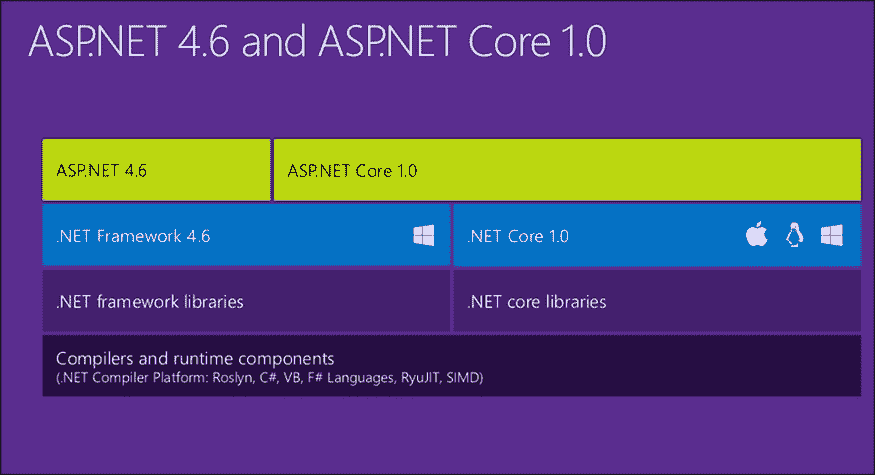

([`blogs.msdn.microsoft.com/webdev/2016/01/19/asp-net-5-is-dead-introducing-asp-net-core-1-0-and-net-core-1-0/`](https://blogs.msdn.microsoft.com/webdev/2016/01/19/asp-net-5-is-dead-introducing-asp-net-core-1-0-and-net-core-1-0/))

在本书中，我们将使用 ASP.NET 4.0、ASP.NET 5.0 和通用 Windows 应用程序的混合。正如你所猜测的，机器学习模型（以及模型背后的理论）的变化频率远低于框架的发布，因此你在 .NET 4.6 上编写的绝大部分代码都可以与 PCL 和 .NET Core 1.0 一样良好地工作。尽管如此，我们将使用的某些外部库可能需要一些时间才能跟上——因此它们可能适用于 PCL，但可能还不适用于 .NET Core 1.0。为了使事情更现实，演示项目将使用 .NET 4.6 和 ASP.NET 4.x 来构建现有的（Brownfield）应用程序。新的（Greenfield）应用程序将是一个使用 PCL 的 UWA 和 ASP.NET 5.0 应用程序的混合体。

# 为什么要自己编写？

看起来所有主要的软件公司都在推广机器学习服务，例如 Google Analytics、Amazon Machine Learning Services、IBM Watson、Microsoft Cortana Analytics 等。此外，主要的软件公司经常尝试销售具有机器学习组件的产品，例如 Microsoft SQL Server Analysis Service、Oracle Database Add-In、IBM SPSS 或 SAS JMP。我没有包括一些常见的分析软件包，如 PowerBI 或 Tableau，因为它们是更数据聚合和报告编写应用程序。尽管它们可以进行分析，但它们没有机器学习组件（至少目前还没有）。

在所有这些选项中，你为什么还想学习如何在你的应用程序中实现机器学习，或者说，编写一些你可以在其他地方购买的代码呢？这是经典的“建造还是购买”决策，每个部门或公司都必须做出。你可能想自己建造，因为：

+   你真正理解你在做什么，你可以成为任何给定机器学习包的更了解的消费者和评论家。实际上，你正在构建你公司最可能珍视的内部技能集。从另一个角度来看，公司并不是通过购买一个工具就能获得竞争优势，因为如果是这样，他们的竞争对手也可以购买相同的工具并取消任何优势。然而，公司可以通过招聘或更有可能通过组建一个团队来真正有能力在市场上区分自己。

+   你可以通过本地执行来获得更好的性能，这对于实时机器学习尤为重要，并且可以在断开连接或网络连接缓慢的情况下实现。当我们开始在具有比网络带宽大得多的 RAM 的物联网（**IoT**）设备场景中实施机器学习时，这一点尤为重要。考虑一下在管道上运行 Windows 10 的树莓派。网络通信可能不稳定，但机器有足够的处理能力来实施机器学习模型。

+   你不会依赖于任何一家供应商或公司，例如，每次你使用特定供应商实施应用程序而没有考虑如何摆脱该供应商时，你都会使自己更加依赖供应商及其不可避免的重复许可费用。下次你与拥有大量 Oracle 的商店的 CTO 交谈时，问问他们是否后悔将任何业务逻辑实施在 Oracle 数据库中。答案不会让你感到惊讶。本书的大多数代码是用 F#编写的——这是一种在 Windows、Linux 和 OS X 上运行得很好的开源语言。

+   你可以更加敏捷，并在实现方面拥有更大的灵活性。例如，我们通常会即时重新训练我们的模型，当你自己编写代码时，这样做相对容易。如果你使用第三方服务，他们可能甚至没有 API 钩子来进行模型训练和评估，因此即时模型更改是不可能的。

一旦你决定本地化，你可以选择自己编写代码或者使用一些现成的开源组件。这本书将向你介绍这两种技术，突出每种技术的优缺点，并让你决定如何实施。例如，你可以轻松地编写自己的基本分类器，这在生产中非常有效，但某些模型，如神经网络，可能需要相当多的时间和精力，而且可能无法提供开源库所能提供的结果。最后，由于我们将要查看的库是开源的，你可以自由地定制其中的某些部分——所有者甚至可能接受你的更改。然而，我们不会在这本书中定制这些库。

# 为什么选择开放数据？

许多关于机器学习的书籍使用随语言安装提供的数据集（如 R 或 Hadoop）或指向数据科学社区中具有相当可见性的公共存储库。最常见的是 Kaggle（特别是泰坦尼克号竞赛）和加州大学欧文分校的数据集。虽然这些数据集很棒，并且提供了一个共同的基数，但本书将向你展示来自政府实体的数据集。从政府获取数据并为了社会公益而黑客攻击通常被称为**开放数据**。我相信开放数据将改变政府与公民互动的方式，并使政府实体更加高效和透明。因此，我们将在这本书中使用开放数据集，并希望你能考虑帮助开放数据运动。

# 为什么选择 F#？

由于我们将使用.NET Framework，我们可以使用 C#、VB.NET 或 F#。这三种语言都在微软内部得到强有力的支持，并且都将在很多年内存在。F#是这本书的最佳选择，因为它在.NET Framework 中独特地适用于科学方法和机器学习模型创建。数据科学家会感到语法和 IDE（如 R 也是函数式第一语言）非常亲切。它是.NET 商业开发者的最佳选择，因为它直接集成到 Visual Studio 中，并且与现有的 C#/VB.NET 代码兼容得很好。明显的替代方案是 C#。我能否全部用 C#完成？是的，某种程度上可以。实际上，我们将使用的许多.NET 库都是用 C#编写的。

然而，在我们的代码库中使用 C#会使它变得更大，并且有更高的可能性引入代码中的错误。在某些时候，我会用 C#展示一些示例，但本书的大部分内容都是用 F#编写的。

另一种替代方案是完全放弃 .NET，并在 R 和 Python 中开发机器学习模型。你可以启动一个网络服务（如 AzureML），在某些场景下可能很好，但在断开连接或网络环境缓慢的情况下，你会陷入困境。此外，假设机器性能相当，本地执行将比通过网络执行表现更好。当我们实现模型进行实时分析时，任何可以减少性能影响的做法都是需要考虑的。

.NET 开发者将考虑的第三种替代方案是在 T-SQL 中编写模型。事实上，我们许多初始模型都是用 T-SQL 实现的，并且是 SQL Server Analysis Server 的一部分。在数据服务器上执行的优势是计算尽可能接近数据，因此你不会因为通过网络移动大量数据而遭受延迟。使用 T-SQL 的缺点是难以轻松实现单元测试，你的领域逻辑正从应用程序转移到数据服务器（这在大多数现代应用程序架构中被认为是不良的做法），你现在依赖于数据库的特定实现。F# 是开源的，可以在各种操作系统上运行，因此你可以更轻松地移植你的代码。

# 准备进行机器学习

在本节中，我们将安装 Visual Studio，快速浏览 F#，并安装我们将要使用的重大开源库。

## 设置 Visual Studio

要开始，你需要在 Microsoft Windows 机器上下载 Visual Studio。截至本文撰写时，最新的（免费）版本是 Visual Studio 2015 Community。如果你已经在你的机器上安装了更高版本，你可以跳过此步骤。如果你需要一份副本，请访问 Visual Studio 主页 [`www.visualstudio.com`](https://www.visualstudio.com)。下载 Visual Studio Community 2015 安装程序并执行它。

现在，你将看到以下屏幕：

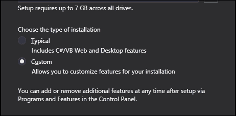

选择 **自定义** 安装，你将被带到以下屏幕：

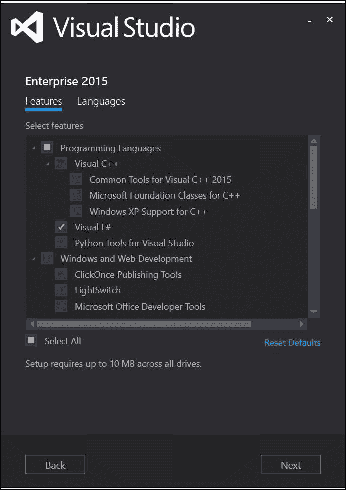

确保 Visual F#旁边有一个勾选标记。一旦安装，你应该能在你的 Windows 开始菜单中看到 Visual Studio。

## 学习 F#

F# 的一个伟大特性是你可以用很少的代码完成很多事情。与 C# 和 VB.NET 相比，它是一个非常简洁的语言，因此学习语法要容易一些。尽管这不是一个全面的介绍，但它将介绍我们将在这本书中使用的语言的主要特性。我鼓励你查看 [`www.tryfsharp.org/`](http://www.tryfsharp.org/) 或 [`fsharpforfunandprofit.com/`](http://fsharpforfunandprofit.com/) 上的教程，如果你想要更深入地了解这门语言。考虑到这一点，让我们创建我们的第一个 F# 项目：

1.  启动 Visual Studio。

1.  按照以下截图导航到**文件** | **新建** | **项目**：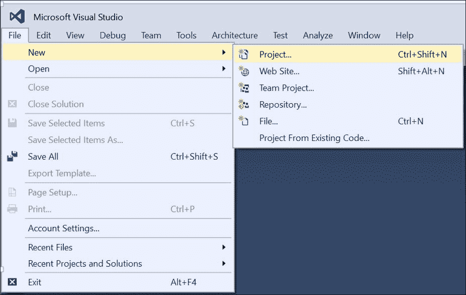

1.  当出现**新建项目**对话框时，在树视图中导航到**Visual F#** | **Windows** | **控制台应用程序**。查看以下截图：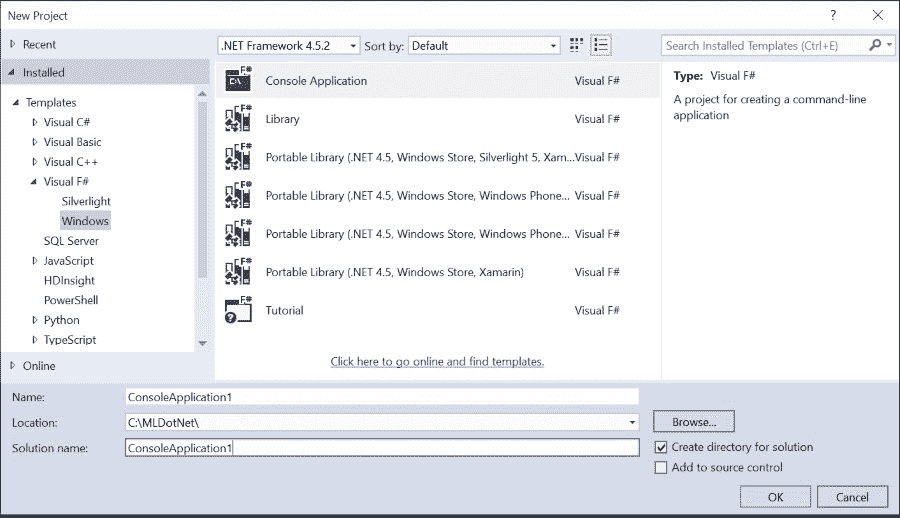

1.  给你的项目命名，点击**确定**，Visual Studio 模板生成器将创建以下样板代码：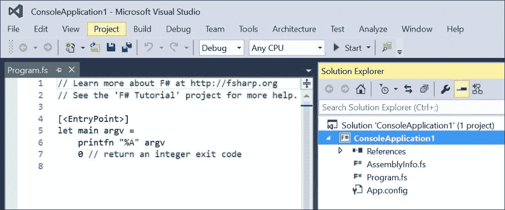

    虽然 Visual Studio 为我们创建了一个`Program.fs`文件，该文件创建了一个基本的控制台`.exe`应用程序，但我们将以不同的方式学习 F#，所以现在我们将忽略它。

1.  在**解决方案资源管理器**中右键单击，导航到**添加** | **新项**。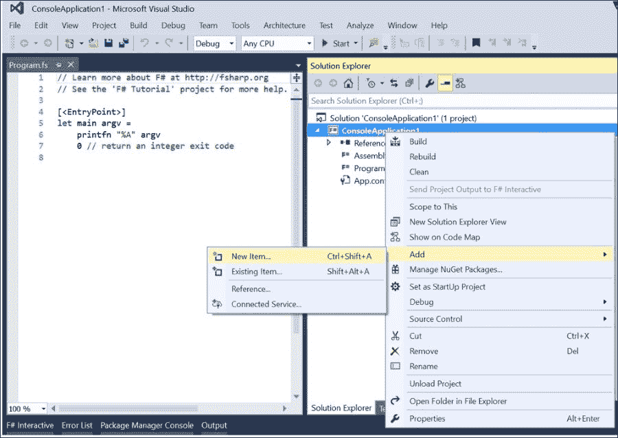

1.  当出现**添加新项**对话框时，选择**脚本文件**。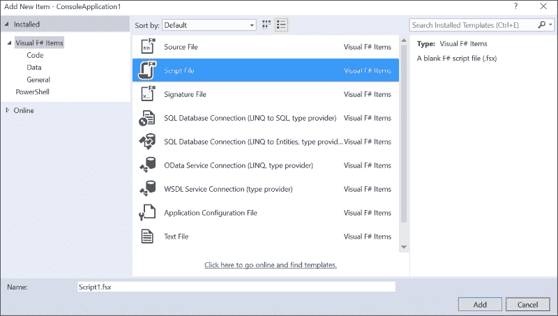

    然后，将`Script1.fsx`文件添加到项目中。

    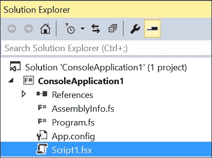

1.  一旦创建`Script1.fsx`，打开它，并将以下内容输入到文件中：

    ```py
    let x = "Hello World"
    ```

1.  高亮显示整行代码，右键单击并选择**在交互式环境中执行**（或按*Alt* + *Enter*）：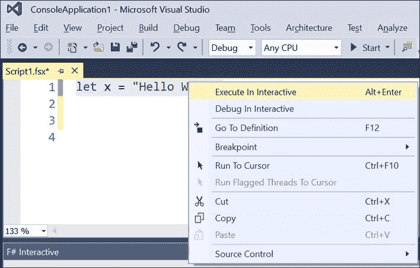

    然后，**F#交互式**控制台将弹出，你会看到以下内容：

    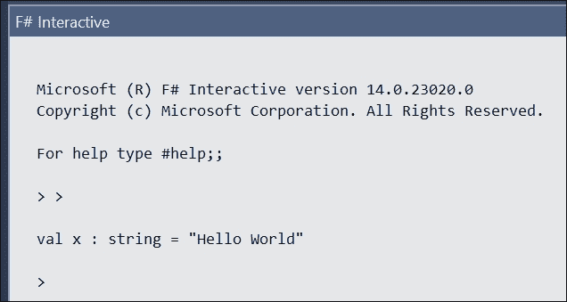

F#交互式是一种 REPL，代表读取-评估-打印-循环。如果你是任何在 SQL Server Management Studio 中花费过时间的.NET 开发者，F#交互式将非常熟悉查询分析器，你在顶部输入代码，在底部看到它的执行情况。此外，如果你是使用 R Studio 的数据科学家，你对 REPL 的概念非常熟悉。我在这本书中交替使用了 REPL 和 FSI 这两个词。

有几点需要注意你写的第一行 F#代码。首先，它看起来非常类似于 C#。事实上，考虑将代码更改为以下内容：

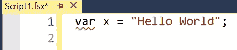

这将是一个完全有效的 C#代码。请注意，红色的波浪线显示 F#编译器肯定认为这不是有效的。

回到正确的代码，注意`x`的类型没有明确定义。F#使用推断类型的概念，这样你就不必编写你创建的值的类型。我故意使用术语*值*，因为与 C#和 VB.NET 中的变量不同，变量可以被分配，而值是不可变的；一旦绑定，它们就永远不会改变。在这里，我们永久地将名称`x`绑定到其值`Hello World`。这种不可变性的概念一开始可能看起来有些限制，但它具有深刻和积极的影响，尤其是在编写机器学习模型时。

在我们的基本程序想法得到验证后，让我们将其移动到一个可编译的汇编中；在这种情况下，是一个针对控制台的目标`.exe`。高亮显示你刚刚写的行，按*Ctrl* + *C*，然后打开`Program.fs`。进入生成的代码，粘贴进去：

```py
[<EntryPoint>]
let main argv = 
    printfn "%A" argv
    let x = "Hello World"
    0 // return an integer exit code
```

### 小贴士

**下载示例代码**

你可以从你在[`www.packtpub.com`](http://www.packtpub.com)的账户下载这本书的示例代码文件。如果你在其他地方购买了这本书，你可以访问[`www.packtpub.com/support`](http://www.packtpub.com/support)并注册，以便直接将文件通过电子邮件发送给你。

你可以通过以下步骤下载代码文件：

+   使用你的电子邮件地址和密码登录或注册我们的网站。

+   将鼠标指针悬停在顶部的**支持**标签上。

+   点击**代码下载 & 错误报告**。

+   在**搜索**框中输入书籍的名称。

+   选择你想要下载代码文件的书籍。

+   从下拉菜单中选择你购买这本书的地方。

+   点击**代码下载**。

下载文件后，请确保使用最新版本解压缩或提取文件夹：

+   Windows 系统上的 WinRAR / 7-Zip

+   Mac 系统上的 Zipeg / iZip / UnRarX

+   Linux 系统上的 7-Zip / PeaZip

然后，在你刚刚添加的内容周围添加以下代码行：

```py
// Learn more about F# at http://fsharp.org
// See the 'F# Tutorial' project for more help.
open System

[<EntryPoint>]
let main argv = 
    printfn "%A" argv
    let x = "Hello World"
    Console.WriteLine(x)
    let y = Console.ReadKey()
    0 // return an integer exit code
```

按下“开始”按钮（或按*F5*），你应该会看到你的程序运行：

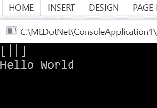

你会注意到我不得不将`Console.ReadKey()`的返回值绑定到`y`上。在 C#或 VB.NET 中，你可以不显式处理返回值。在 F#中，不允许忽略返回值。尽管有些人可能认为这是一个限制，但实际上这是语言的一个优点。在 F#中犯错误要难得多，因为语言强制你显式处理执行路径，而不是无意中将它们扫到地毯下（或进入空值，但我们会稍后讨论）。

无论如何，让我们回到我们的脚本文件并输入另一行代码：

```py
let ints = [|1;2;3;4;5;6|]
```

如果你将这一行代码发送到 REPL，你应该会看到以下内容：

```py
val ints : int [] = [|1; 2; 3; 4; 5; 6|]

```

这是一个数组，就像你在 C#中这样做一样：

```py
var ints = new[] {1,2,3,4,5,6};
```

注意，F#中的分隔符是分号，而不是逗号。这与许多其他语言不同，包括 C#。F#中的逗号是为元组保留的，而不是用于分隔数组中的项。我们稍后会讨论元组。

现在，让我们总结一下数组中的值：

```py
let summedValue = ints |> Array.sum
```

在将这一行代码发送到 REPL 的过程中，你应该会看到以下内容：

```py
val summedValue : int = 21

```

有两件事情在进行。我们有`|>`运算符，这是一个管道前进运算符。如果你有 Linux 或 PowerShell 的经验，这应该很熟悉。然而，如果你有 C#的背景，它可能看起来不熟悉。管道前进运算符将运算符左侧（在这种情况下，`ints`）的值的结果推入运算符右侧的函数（在这种情况下，`sum`）。

另一个新的语言结构是`Array.sum`。数组是 F#核心库中的一个模块，它包含一系列你可以应用于你的数据的函数。函数`sum`，正如你可能通过检查结果所猜测的那样，是对数组中的值求和。

所以，现在，让我们添加`Array`类型中的另一个不同函数：

```py
let multiplied = ints |> Array.map (fun i -> i * 2)
```

如果你将其发送到 REPL，你应该会看到以下内容：

```py
val multiplied : int [] = [|2; 4; 6; 8; 10; 12|]

```

`Array.map`是`Array`类型中一个高阶函数的例子。它的参数是另一个函数。实际上，我们正在将一个函数传递给另一个函数。在这种情况下，我们创建了一个匿名函数，它接受一个参数`i`并返回`i * 2`。你知道它是一个匿名函数，因为它以关键字`fun`开头，IDE 通过将其设置为蓝色使我们更容易理解。这个匿名函数也被称为 lambda 表达式，它自.Net 3.5 以来就存在于 C#和 VB.NET 中，所以你可能之前遇到过。如果你有使用 R 的数据科学背景，你对 lambda 表达式已经很熟悉了。

回到高阶函数`Array.map`，你可以看到它将 lambda 函数应用于数组的每个元素，并返回一个包含新值的新数组。

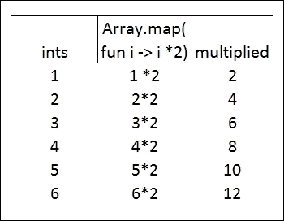

当我们开始实现机器学习模型时，我们会大量使用`Array.map`（及其更通用的兄弟`Seq.map`），因为这是转换数据数组最佳的方式。此外，如果你注意到了描述大数据应用（如 Hadoop）时 map/reduce 的热门词汇，那么在这个上下文中，map 一词意味着完全相同的意思。最后一点是，由于 F#中的不可变性，原始数组不会被修改，相反，乘法操作绑定到一个新数组上。

让我们继续在脚本中添加几行代码：

```py
let multiplyByTwo x =
    x * 2
```

如果你将其发送到 REPL，你应该看到这个：

```py
val multiplyByTwo : x:int -> int

```

这两行创建了一个名为`multiplyByTwo`的命名函数。该函数接受一个参数`x`，然后返回参数乘以`2`的值。这与我们之前在`map`函数中创建的匿名函数完全相同。由于`->`操作符，语法可能看起来有点奇怪。你可以把它读作，“函数`multiplyByTwo`接受一个名为`x`的参数，其类型为`int`，并返回一个`int`。”

这里要注意三点。参数`x`被推断为`int`类型，因为它在函数体中被乘以另一个`int`。如果函数读取`x * 2.0`，则`x`将被推断为浮点数。这与 C#和 VB.NET 有显著的不同，但对于使用 R 的人来说很熟悉。另外，该函数没有返回语句，相反，任何函数的最终表达式总是作为结果返回。最后要注意的是，空白很重要，因此需要缩进。如果代码写成这样：

```py
let multiplyByTwo(x) =
x * 2
```

编译器会报错：

```py
Script1.fsx(8,1): warning FS0058: Possible incorrect indentation: this token is offside of context started at position (7:1).

```

由于 F#不使用花括号和分号（或结束关键字），例如 C#或 VB.NET，它需要使用某种东西来分隔代码。这种分隔是空白。由于合理使用空白是良好的编码实践，因此对于有 C#或 VB.NET 背景的人来说，这不应该非常令人惊讶。如果你有 R 或 Python 的背景，这对你来说应该很自然。

由于`multiplyByTwo`是`Array.map (fun i -> i * 2)`中创建的 lambda 的函数等价物，如果我们想这样做的话，我们可以这样做：

```py
let multiplied' = ints |> Array.map (fun i -> multiplyByTwo i)
```

如果你将它发送到 REPL 中，你应该会看到这个：

```py
val multiplied' : int [] = [|2; 4; 6; 8; 10; 12|]

```

通常，当我们需要在代码的多个地方使用该函数时，我们会使用命名函数；而当我们只需要在特定代码行中使用该函数时，我们会使用 lambda 表达式。

有另一件需要注意的小事。当我想要创建一个代表相同概念的新值时，我使用了 tick 符号来表示乘法值。这种符号在科学界经常被使用，但如果尝试用它来表示第三或第四（乘法'''）表示，可能会变得难以控制。

接下来，让我们在 REPL 中添加另一个命名函数：

```py
let isEven x =
    match x % 2 = 0 with
    | true -> "even"
    | false -> "odd"
isEven 2
isEven 3
```

如果你将它发送到 REPL 中，你应该会看到这个：

```py
val isEven : x:int -> string

```

这是一个名为`isEven`的函数，它接受一个参数`x`。函数体使用模式匹配语句来确定参数是奇数还是偶数。如果是奇数，则返回字符串`odd`；如果是偶数，则返回字符串`even`。

这里有一个非常有趣的现象。match 语句是模式匹配的基本示例，也是 F#中最酷的特性之一。目前，你可以将 match 语句视为你可能熟悉的 R、Python、C#或 VB.NET 中的 switch 语句，但我们在后面的章节中会看到它如何变得更加强大。我可能会像这样编写条件逻辑：

```py
let isEven' x =
    if x % 2 = 0 then "even" else "odd"
```

但我更喜欢使用模式匹配来进行这种条件逻辑。实际上，我将尝试在整个书中不使用`if…then`语句。

`isEven`函数编写完成后，我现在可以像这样将我的函数链接起来：

```py
let multipliedAndIsEven = 
    ints
    |> Array.map (fun i -> multiplyByTwo i)
    |> Array.map (fun i -> isEven i)
```

如果你将它发送到 REPL 中，你应该会看到这个：

```py
val multipliedAndIsEven : string [] =
 [|"even"; "even"; "even"; "even"; "even"; "even"|]

```

在这种情况下，第一个管道`Array.map (fun i -> multiplyByTwo i)`的结果被发送到下一个函数`Array.map (fun i -> isEven i)`。这意味着我们可能在内存中漂浮着三个数组：传入第一个管道的 ints，第一个管道的结果传递到第二个管道，以及第二个管道的结果。从你的心理模型角度来看，你可以将每个数组视为从一个函数传递到下一个函数。在这本书中，我会频繁地使用管道链，因为它是一个非常强大的结构，并且它与我们在创建和使用机器学习模型时的思维过程完美匹配。

你现在已经掌握了足够的 F#知识，可以开始运行本书中的第一个机器学习模型。随着本书的进行，我会介绍其他 F#语言特性，但这是一个良好的开端。正如你将看到的，F#确实是一种强大的语言，简单的语法可以导致非常复杂的工作。

# 第三方库

以下是我们将在本书后面部分介绍的一些第三方库。

## Math.NET

Math.NET 是一个开源项目，它被创建用来增强（有时替换）`System.Math` 中可用的函数。它的主页是 [`www.mathdotnet.com/`](http://www.mathdotnet.com/)。我们将使用 Math.Net 的 `Numerics` 和 `Symbolics` 命名空间来编写一些机器学习算法。Math.Net 的一个优点是它对 F# 有很强的支持。

## Accord.NET

Accord.NET 是一个开源项目，它被创建用来实现许多常见的机器学习模型。它的主页是 [`accord-framework.net/`](http://accord-framework.net/)。尽管 Accord.NET 的重点是计算机视觉和信号处理，但我们将在这本书中广泛使用 Accord.Net，因为它使得在我们的问题域中实现算法变得非常简单。

## Numl

Numl 是一个开源项目，它实现了几个常见的机器学习模型作为实验。它的主页是 [`numl.net/`](http://numl.net/)。Numl 比我们将在书中使用的其他任何第三方库都要新，所以它可能不像其他那些那么全面，但在某些情况下它可以非常强大和有帮助。我们将在本书的几个章节中使用 Numl。

# 摘要

在本章中，我们覆盖了大量的内容。我们讨论了什么是机器学习，为什么你想要在 .NET 堆栈中学习它，如何使用 F# 来入门，并对我们将在这本书中使用的几个主要开源库进行了简要介绍。在完成所有这些准备工作后，我们准备开始探索机器学习。

在下一章中，我们将应用我们新发现的 F# 技能来创建一个简单的线性回归，看看我们是否可以帮助 AdventureWorks 提高他们的销售额。
