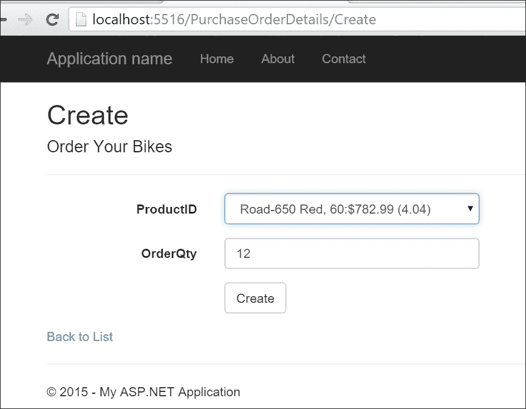
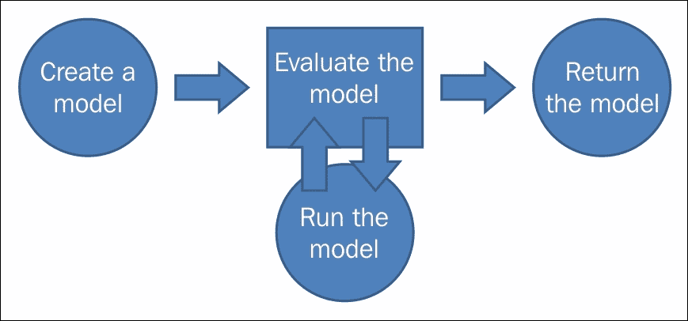
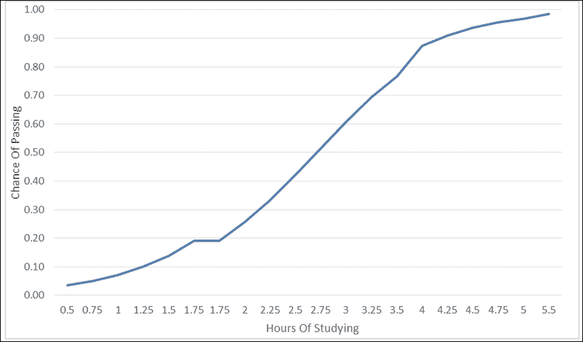
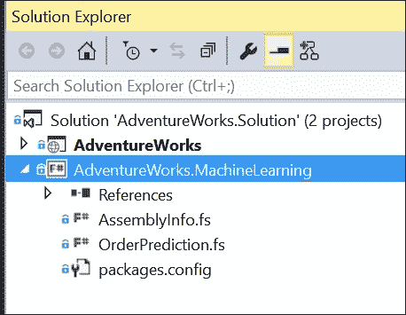
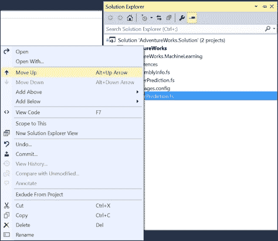
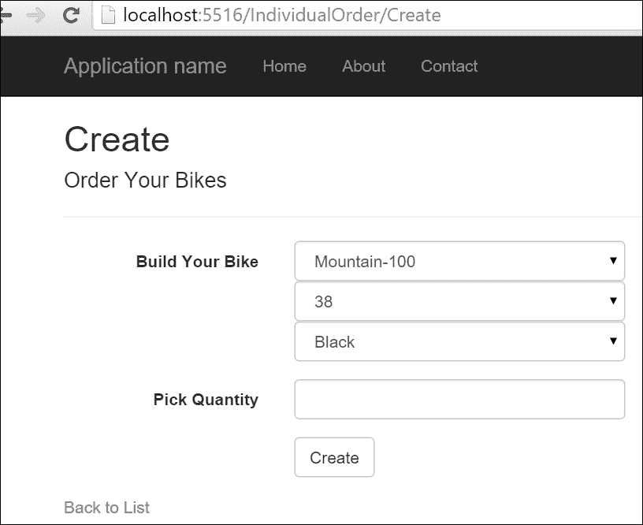

# 第三章。更多 AdventureWorks 回归

在上一章中，你戴着软件开发者的帽子，你试探性地进入了机器学习的水域。你创建了一个简单的线性回归并将其应用于你的网站。这个回归试图解释顾客评论如何影响零售店的自行车销量。在这一章中，我们将继续上一章的内容，使用多元线性回归来更精确地解释自行车销量。然后我们将切换到逻辑回归，看看我们是否可以根据相同因素预测单个顾客是否会购买自行车。然后我们将考虑如何在一个有助于模型准确性和可重复性的实验中实现回归。最后，我们将总结一些回归的优缺点。

# 多元线性回归简介

多元线性回归与简单线性回归具有相同的概念，即我们试图找到最佳拟合。主要区别在于我们有多于一个的自变量试图解释因变量。如果你还记得上一章，我们做了如下回归：*Y = x0 + E*，其中*Y*是自行车销量，*x0*是平均评分。

如果我们想看看平均评分和自行车销售价格之间是否存在关系，我们可以使用公式*Y = x0 + x1 + E*，其中*Y*是自行车销量，*x0*是平均评分，*x1*是自行车的价格。

## 介绍示例

在深入研究实际数据之前，让我们剖析一下多元线性回归。打开 Visual Studio 并创建一个新的 F#库项目。添加一个名为`AccordDotNet.fsx`的脚本文件。接下来，添加对`Accord.Statistics`的 NuGet 引用。如果你不熟悉如何执行这些任务中的任何一项，请回顾第一章，*使用.NET 框架进行机器学习欢迎*，以及第二章，*AdventureWorks 回归*，其中每个步骤都使用截图进行了详细说明。

在脚本顶部添加以下引用：

```py
#r "../packages/Accord.3.0.2/lib/net40/Accord.dll"
#r "../packages/Accord.Statistics.3.0.2/lib/net40/Accord.Statistics.dll"
#r "../packages/Accord.Math.3.0.2/lib/net40/Accord.Math.dll"

open Accord
open Accord.Statistics.Models.Regression.Linear
```

接下来，让我们创建一个虚拟数据集。在这种情况下，让我们看看学生的年龄、智商和 GPA 之间是否存在关系。由于有两个自变量（`x0`和`x1`），我们将创建一个名为`xs`的输入值，并用五个观察值来查看它。由于每个观察值有两个值，`xs`是一个锯齿数组。

```py
let xs = [| [|15.0;130.0|];[|18.0;127.0|];[|15.0;128.0|];[|17.0;120.0|];[|16.0;115.0|] |]
```

将其发送到 REPL，我们得到：

```py
val xs : float [] [] =
 [|[|15.0; 130.0|]; [|18.0; 127.0|]; [|15.0; 128.0|]; [|17.0; 120.0|]; [|16.0; 115.0|]|]

```

在这个数据集中，第一个观察对象是一个 15 岁的 130 智商的个体，第二个是一个 18 岁的 127 智商的个体，以此类推。在处理完输入后，让我们创建`y`，即学生的 GPA：

```py
let y = [|3.6;3.5;3.8;3.4;2.6|]
```

将其发送到 REPL，我们得到：

```py
val y : float [] = [|3.6; 3.5; 3.8; 3.4; 2.6|]

```

第一个学生的 GPA 是 3.6，第二个是 3.5，以此类推。请注意，由于我们的输出是一个单一的数字，我们只需要一个简单的数组来保存这些值。处理完输入后，让我们使用我们的`xs`和`y`创建一个多重线性回归：

```py
let regression = MultipleLinearRegression(2, true)
let error = regression.Regress(xs, y)

let a = regression.Coefficients.[0]
let b = regression.Coefficients.[1]
let c = regression.Coefficients.[2]
```

将此发送到 REPL，我们得到：

```py
val regression : MultipleLinearRegression =

 y(x0, x1) = 0.0221298495645295*x0 + 0.0663103721298495*x1 + -5.20098970704672
val error : float = 0.1734125099
val a : float = 0.02212984956
val b : float = 0.06631037213
val c : float = -5.200989707

```

有几点需要注意。首先，Accord 为我们打印了多重线性回归的公式`y(x0, x1) = 0.0221298495645295*x0 + 0.0663103721298495*x1 + -5.20098970704672`。需要注意的关键点是，你不能像简单回归那样解释多重回归的结果，例如，将`x1`和`x2`相加来作为线的斜率是不正确的。相反，每个`x`是如果其他`x`保持不变时的线的斜率。所以，在这种情况下，如果`x1`保持不变，`x0`每增加一个单位，`y`就会增加`.022`。回到我们的例子，我们可以这样说，如果我们增加一个人的年龄一年，一个人的 GPA 会增加`.022`，同时保持智商不变。同样，我们可以这样说，对于一个人的智商每下降一个点，这个人的 GPA 会下降 0.066，同时保持年龄不变。我们不能像简单回归那样使用散点图来展示多重回归的所有结果，因为你需要为每个`x`值设置一个轴，这很快就会变得难以控制，甚至不可能。

接下来，让我们看看我们的回归效果如何，使用我们熟悉的老朋友`r2`和`rmse`：

```py
let sse = regression.Regress(xs, y)
let mse = sse/float xs.Length 
let rmse = sqrt(mse)
let r2 = regression.CoefficientOfDetermination(xs,y)
```

将此发送到 REPL，我们得到：

```py
val sse : float = 0.1734125099
val mse : float = 0.03468250198
val rmse : float = 0.186232387
val r2 : float = 0.7955041157

```

注意，`sse`与上面的误差相同。Accord.NET 将`sse`作为误差返回，所以我会以后只使用它。此外，查看我们的结果，我们可以看到我们的`r2`是`.79`，这相当不错，而且我们的`rmse`是`.18`，这也足够低，使得回归是可行的。

## 继续添加 x 变量？

如果两个`x`变量是好的，那么三个会更好吗？让我们看看。让我们添加另一个变量，在这种情况下，学生的前一年 GPA 作为第三个`x`值。回到 REPL 并添加以下内容：

```py
let xs' = [| [|15.0;130.0;3.6|];[|18.0;127.0;3.5|];
            [|15.0;128.0;3.7|];[|17.0;120.0;3.5|];
            [|17.0;120.0;2.5|] |]

let regression' = MultipleLinearRegression(3,true)
let error' = regression'.Regress(xs',y)

let a' = regression'.Coefficients.[0]
let b' = regression'.Coefficients.[1]
let c' = regression'.Coefficients.[2]
let d' = regression'.Coefficients.[3]

let mse' = error'/float xs'.Length 
let rmse' = sqrt(mse')
let r2' = regression'.CoefficientOfDetermination(xs',y)
```

将此发送到 REPL，我们得到：

```py
val xs' : float [] [] =
 [|[|15.0; 130.0; 3.6|]; [|18.0; 127.0; 3.5|]; [|15.0; 128.0; 3.7|];
 [|17.0; 120.0; 3.5|]; [|17.0; 120.0; 2.5|]|]
val regression' : MultipleLinearRegression =
 y(x0, x1, x2) = -0.0202088664499619*x0 + 0.0116951379763468*x1 + 0.834082578324918*x2 + -0.552984300435694
val error' : float = 0.01071166747
val a' : float = -0.02020886645
val b' : float = 0.01169513798
val c' : float = 0.8340825783
val d' : float = -0.5529843004
val mse' : float = 0.002142333495
val rmse' : float = 0.0462853486
val r2' : float = 0.9873683167

```

因此，`r2`现在达到了 99%，这意味着我们可以用一个人的年龄、智商和前一年 GPA 来解释 99%的 GPA 变化。此外，请注意，`rmse`是`.04`，这很好，也很低。我们有一个相当好的模型。

## AdventureWorks 数据

在完成演示后，让我们回到自行车公司实现多重线性回归。由于我们使用的是更真实的数据，我认为我们不会得到 99%的`r2`，但我们可以期待。在你的**解决方案资源管理器**中，添加另一个名为`AccordDotNet2.fsx`的 F#脚本。然后，添加对`System.Transactions`的引用，以便我们可以使用 ADO.NET 访问我们的数据。回到`AccordDotNet2.fsx`并添加以下代码：

```py
#r "System.Transactions.dll"
#r "../packages/Accord.3.0.2/lib/net40/Accord.dll"
#r "../packages/Accord.Statistics.3.0.2/lib/net40/Accord.Statistics.dll"
#r "../packages/Accord.Math.3.0.2/lib/net40/Accord.Math.dll"

open Accord
open Accord.Statistics
open Accord.Statistics.Models.Regression.Linear

open System
open System.Data.SqlClient

type ProductInfo = {ProductID:int; AvgOrders:float; AvgReviews: float; ListPrice: float}

let productInfos =  ResizeArray<ProductInfo>()

[<Literal>]
let connectionString = "data source=nc54a9m5kk.database.windows.net;initial catalog=AdventureWorks2014;user id=chickenskills@nc54a9m5kk;password=sk1lzm@tter;"

[<Literal>]
let query = "Select 
            A.ProductID, AvgOrders, AvgReviews, ListPrice
            From
            (Select 
            ProductID,
            (Sum(OrderQty) + 0.0)/(Count(Distinct SOH.CustomerID) + 0.0) as AvgOrders
            from [Sales].[SalesOrderDetail] as SOD
            inner join [Sales].[SalesOrderHeader] as SOH
            on SOD.SalesOrderID = SOH.SalesOrderID
            inner join [Sales].[Customer] as C
            on SOH.CustomerID = C.CustomerID
            Where C.StoreID is not null
            Group By ProductID) as A
            Inner Join 
            (Select
            ProductID,
            (Sum(Rating) + 0.0) / (Count(ProductID) + 0.0) as AvgReviews
            from [Production].[ProductReview] as PR
            Group By ProductID) as B
            on A.ProductID = B.ProductID
            Inner Join
            (Select
            ProductID,
            ListPrice
            from [Production].[Product]
            ) as C
            On A.ProductID = C.ProductID"

let connection = new SqlConnection(connectionString)
let command = new SqlCommand(query,connection)
connection.Open()
let reader = command.ExecuteReader()
while reader.Read() do
    productInfos.Add({ProductID=reader.GetInt32(0);
                        AvgOrders=(float)(reader.GetDecimal(1));
                        AvgReviews=(float)(reader.GetDecimal(2));
                        ListPrice=(float)(reader.GetDecimal(3));})
```

注意，这与你在上一章中编写的代码非常相似。事实上，你可能想要复制并粘贴那段代码，并做出以下更改：

1.  在`ProductInfo`记录类型中添加一个`ListPrice`字段。

1.  更新查询以添加一个子句来获取自行车的零售价。

1.  更新 `productInfos`。添加一个方法来包含我们正在带来的第三个值。

代码本身在 SQL 中创建了一个包含多个订单、平均评论和按 `productId` 计算的平均价格的 DataFrame，并将其本地化。将此代码发送到 REPL，我们得到以下结果：

```py
type ProductInfo =
 {ProductID: int;
 AvgOrders: float;
 AvgReviews: float;
 ListPrice: float;}
val productInfos : Collections.Generic.List<ProductInfo>
val connectionString : string =
 "data source=nc54a9m5kk.database.windows.net;initial catalog=A"+[72 chars]
val query : string =
 "Select 
 A.ProductID, AvgOrders, AvgReviews, ListP"+[937 chars]
val connection : SqlConnection = System.Data.SqlClient.SqlConnection
val command : SqlCommand = System.Data.SqlClient.SqlCommand
val reader : SqlDataReader
val it : unit = ()

```

数据准备好后，让我们创建一个多元线性回归。将以下代码添加到脚本文件中：

```py
let xs = 
    productInfos 
    |> Seq.map (fun pi -> [|pi.AvgReviews; pi.ListPrice|]) 
    |> Seq.toArray
let y = 
    productInfos 
    |> Seq.map (fun pi -> pi.AvgOrders) 
    |> Seq.toArray
let regression = MultipleLinearRegression(2, true)
let error = regression.Regress(xs, y)

let a = regression.Coefficients.[0]
let b = regression.Coefficients.[1]
let c = regression.Coefficients.[2]

let mse = error/float xs.Length 
let rmse = sqrt mse
let r2 = regression.CoefficientOfDetermination(xs, y)
```

将此代码发送到 REPL，我们得到以下结果：

```py
val regression : MultipleLinearRegression =
 y(x0, x1) = 9.68314848116308*x0 + -0.000913619922709572*x1 + -26.1836956342657
val error : float = 682.6439378
val a : float = 9.683148481
val b : float = -0.0009136199227
val c : float = -26.18369563
val mse : float = 7.037566369
val rmse : float = 2.652841188
val r2 : float = 0.3532529168

```

通过添加自行车的价格，我们的 `r2` 从 `.29` 提高到 `.35`。我们的 `rmse` 也从 `2.77` 降低到 `2.65`。这种变化意味着我们有一个更精确的模型，误差更小。因为这是更好的，所以让我们将其添加到我们的生产应用程序中。

## 将多元回归添加到我们的生产应用程序中

打开你在上一章开始工作的 `AdventureWorks` 解决方案。在 **解决方案资源管理器** 中，导航到 `AdventureWorks.MachineLearning` 项目并打开 `OrderPrediction.fs`。

定位到 `ProductReview` 类型并将其替换为以下内容：

```py
type ProductInfo = {ProductID:int; AvgOrders:float; AvgReviews: float; ListPrice: float}
```

接下来，进入 `OrderPrediction` 类型并找到分配评论值的行，将其替换为以下内容：

```py
let productInfos = ResizeArray<ProductInfo>()
```

接下来，定位查询值并将其内容替换为以下内容：

```py
[<Literal>]
let query = "Select 
            A.ProductID, AvgOrders, AvgReviews, ListPrice
            From
            (Select 
            ProductID,
            (Sum(OrderQty) + 0.0)/(Count(Distinct SOH.CustomerID) + 0.0) as AvgOrders,
            Sum(OrderQty) as TotalOrders
            from [Sales].[SalesOrderDetail] as SOD
            inner join [Sales].[SalesOrderHeader] as SOH
            on SOD.SalesOrderID = SOH.SalesOrderID
            inner join [Sales].[Customer] as C
            on SOH.CustomerID = C.CustomerID
            Where C.StoreID is not null
            Group By ProductID) as A
            Inner Join 
            (Select
            ProductID,
            (Sum(Rating) + 0.0) / (Count(ProductID) + 0.0) as AvgReviews
            from [Production].[ProductReview] as PR
            Group By ProductID) as B
            on A.ProductID = B.ProductID
            Inner Join
            (Select
            ProductID,
            ListPrice
            from [Production].[Product]
            ) as C
            On A.ProductID = C.ProductID"
```

接下来，向下滚动到 `PredictQuantity` 函数并找到 `reader.Read()` 代码行。将其替换为以下内容：

```py
        while reader.Read() do
            productInfos.Add({ProductID=reader.GetInt32(0);
                                AvgOrders=(float)(reader.GetDecimal(1));
                                AvgReviews=(float)(reader.GetDecimal(2));
                                ListPrice=(float)(reader.GetDecimal(3));})
```

最后，从以下内容开始删除 `PredictQuantity` 函数中剩余的所有代码：

```py
let x = reviews |> Seq.map(fun pr -> pr.AvgReviews) |> Seq.toArray
```

替换为以下内容：

```py
        let xs = 
            productInfos 
            |> Seq.map (fun pi -> [|pi.AvgReviews; pi.ListPrice|]) 
            |> Seq.toArray
        let y = 
            productInfos 
            |> Seq.map (fun pi -> pi.AvgOrders) 
            |> Seq.toArray
        let regression = MultipleLinearRegression(2, true)
        let error = regression.Regress(xs, y)

        let a = regression.Coefficients.[0]
        let b = regression.Coefficients.[1]
        let c = regression.Coefficients.[2]

        let mse = error/float xs.Length 
        let rmse = sqrt mse
        let r2 = regression.CoefficientOfDetermination(xs, y)

        let productInfo = 
            productInfos 
            |> Seq.find (fun r -> r.ProductID = productId)
        let xs' = [|[|productInfo.AvgReviews; productInfo.ListPrice|]|]
        regression.Compute(xs') |> Seq.head
```

注意，即使我们只为最终的 `regression.Compute()` 输入一个 `productInfo`，我们仍然需要创建一个交错数组。此外，注意 `Compute` 函数返回一个数组，但由于我们只输入一个值，因此结果数组始终只有一个长度。我们使用了 `Seq.head` 来获取数组的第一个值。在某些时候，这个头函数非常有用，我们将在本书中再次看到它。

构建项目并打开 UI；你可以看到我们的预测已经被调整：



## 使用多个 x 变量时的注意事项

在这一点上，你可能正在想，“这太棒了！我可以不断地添加更多的变量到我的多元线性回归中，并且我会得到更好的 `r2` 和更低的 `rmse`。”正如李·科索可能会说的，“别那么快！”在不深入细节的情况下，每次你添加一个新的线性多元回归特征，你总是会得到更好的结果，或者至少不会更差的结果。这意味着，如果你在 1999 年 6 月 29 日添加了不同城市的平均温度，模型可能会改进。此外，随着特征数量的增加，将不希望的影响引入模型的风险也会增加；我们将在稍后讨论这一点。实际上，我见过一些模型，其特征数量超过了观察数量。一般来说，这不是一个好主意。

为了对抗特征增长，你可以采取两种方法。首先，你可以将常识与奥卡姆剃刀原理结合起来。奥卡姆剃刀原理是指，在给定可能的解决方案选择时，应该总是选择最简单的一个。这种常识与简洁的结合比大多数人意识到的更为常见和强大。我们大脑中的灰色物质本身就是一台相当强大的计算机，能够很好地识别模式和建立关联。

事实上，在特定领域投入过时间的商业分析师可能知道一些对外部数据科学家来说并不明显的关联关系。这些数据科学家面对的是一系列特征列表或被应用于数据的简单机器学习模型。诚然，人类确实存在偏见，有时会错过关联关系，但总体来说，他们仍然擅长匹配模式。将奥卡姆剃刀原理应用于特征选择意味着你正在尝试找到对模型可预测性影响最大的最少特征数量。

让我们转向我们的朋友，位于 AdventureWorks 的商业分析师，询问他认为什么因素影响了我们的经销商购买自行车的数量。他说：“嗯，我认为价格和客户评价当然非常重要，但我认为自行车的重量也会影响我们的经销商。自行车越重，他们订购的可能性就越小。”

## 向我们的模型添加第三个 x 变量

带着商业分析师的想法，让我们在我们的模型中添加第三个独立变量，即自行车重量。回到**解决方案资源管理器**，添加另一个脚本文件。将以下代码添加到脚本中：

```py
#r "System.Transactions.dll"
#r "../packages/Accord.3.0.2/lib/net40/Accord.dll"
#r "../packages/Accord.Statistics.3.0.2/lib/net40/Accord.Statistics.dll"
#r "../packages/Accord.Math.3.0.2/lib/net40/Accord.Math.dll"

open Accord
open Accord.Statistics
open Accord.Statistics.Models.Regression.Linear

open System
open System.Data.SqlClient

type ProductInfo = {ProductID:int; AvgOrders:float; AvgReviews: float; ListPrice: float; Weight: float}

let productInfos = ResizeArray<ProductInfo>()

[<Literal>]
let connectionString = "data source=nc54a9m5kk.database.windows.net;initial catalog=AdventureWorks2014;user id=chickenskills@nc54a9m5kk;password=sk1lzm@tter;"

[<Literal>]
let query = "Select 
            A.ProductID, AvgOrders, AvgReviews, ListPrice, Weight
            From
            (Select 
            ProductID,
            (Sum(OrderQty) + 0.0)/(Count(Distinct SOH.CustomerID) + 0.0) as AvgOrders
            from [Sales].[SalesOrderDetail] as SOD
            inner join [Sales].[SalesOrderHeader] as SOH
            on SOD.SalesOrderID = SOH.SalesOrderID
            inner join [Sales].[Customer] as C
            on SOH.CustomerID = C.CustomerID
            Where C.StoreID is not null
            Group By ProductID) as A
            Inner Join 
            (Select
            ProductID,
            (Sum(Rating) + 0.0) / (Count(ProductID) + 0.0) as AvgReviews
            from [Production].[ProductReview] as PR
            Group By ProductID) as B
            on A.ProductID = B.ProductID
            Inner Join
            (Select
            ProductID,
            ListPrice,
            Weight
            from [Production].[Product]
            ) as C
            On A.ProductID = C.ProductID"

let connection = new SqlConnection(connectionString)
let command = new SqlCommand(query, connection)
connection.Open()
let reader = command.ExecuteReader()
while reader.Read() do
    productInfos.Add({ProductID=reader.GetInt32(0);
                        AvgOrders=(float)(reader.GetDecimal(1));
                        AvgReviews=(float)(reader.GetDecimal(2));
                        ListPrice=(float)(reader.GetDecimal(3));
                        Weight=(float)(reader.GetDecimal(4));})

let xs = 
    productInfos 
    |> Seq.map (fun pi -> [|pi.AvgReviews; pi.ListPrice; pi.Weight|]) 
    |> Seq.toArray
let y = 
    productInfos 
    |> Seq.map (fun pi -> pi.AvgOrders) 
    |> Seq.toArray
let regression = MultipleLinearRegression(3, true)
let error = regression.Regress(xs, y)

let a = regression.Coefficients.[0]
let b = regression.Coefficients.[1]
let c = regression.Coefficients.[2]
let d = regression.Coefficients.[3]

let mse = error/float xs.Length 
let rmse = sqrt mse
let r2 = regression.CoefficientOfDetermination(xs, y)
```

将此发送到交互式编程环境（REPL），你会发现我们的`r2`值上升到`.36`，而`rmse`值下降到`2.63`：

```py
val regression : MultipleLinearRegression =
 y(x0, x1, x2) = 8.94836007927991*x0 + -0.00103754084861455*x1 + -0.0848953592695415*x2 + -21.2973971475571
val error : float = 671.2299241
val a : float = 8.948360079
val b : float = -0.001037540849
val c : float = -0.08489535927
val d : float = -21.29739715
val mse : float = 6.919896125
val rmse : float = 2.630569544
val r2 : float = 0.3640667242

```

我们分析师对价格和客户评价的直觉非常准确，而重量……则不然。使用奥卡姆剃刀原理，我们可以使用价格和客户评价来构建我们的模型，并忽略重量变量。

# 逻辑回归

现在我们对回归越来越熟悉了，让我们介绍另一种回归类型——逻辑回归。到目前为止，回归都有数值输出值——比如预测一个人的 GPA 或预测自行车销量。逻辑回归使用与拟合一组独立特征到直线相同的技巧，但它们并不试图预测一个数值。相反，逻辑回归试图预测一个二元值（是/否、真/假、味道好/不好），然后为该值分配一个概率。

## 逻辑回归简介

由于你已经对回归有了初步的了解，我们可以直接进入代码，看看一个实际的例子。打开回归项目，添加一个名为`AccordDotNet7.fsx`的脚本。复制以下代码行：

```py
#r "../packages/Accord.3.0.2/lib/net40/Accord.dll"
#r "../packages/Accord.Statistics.3.0.2/lib/net40/Accord.Statistics.dll"
#r "../packages/Accord.Math.3.0.2/lib/net40/Accord.Math.dll"

open Accord
open Accord.Statistics.Analysis
open Accord.Statistics.Models.Regression
open Accord.Statistics.Models.Regression.Fitting

let xs = [| [|0.5|];[|0.75|];
            [|1.0|];[|1.25|];[|1.5|];[|1.75|];[|1.75|];
            [|2.0|];[|2.25|];[|2.5|];[|2.75|];
            [|3.0|];[|3.25|];[|3.5|];
            [|4.0|];[|4.25|];[|4.5|];[|4.75|];
            [|5.0|];[|5.5|];|]

let y = [|0.0;0.0;0.0;0.0;0.0;0.0;1.0;0.0;1.0;0.0;
          1.0;0.0;1.0;0.0;1.0;1.0;1.0;1.0;1.0;1.0|]
```

将此发送到交互式编程环境（REPL）后，我们得到：

```py
val xs : float [] [] =
 [|[|0.5|]; [|0.75|]; [|1.0|]; [|1.25|]; [|1.5|]; [|1.75|]; [|1.75|]; [|2.0|];
 [|2.25|]; [|2.5|]; [|2.75|]; [|3.0|]; [|3.25|]; [|3.5|]; [|4.0|]; [|4.25|];
 [|4.5|]; [|4.75|]; [|5.0|]; [|5.5|]|]
val y : float [] =
 [|0.0; 0.0; 0.0; 0.0; 0.0; 0.0; 1.0; 0.0; 1.0; 0.0; 1.0; 0.0; 1.0; 0.0; 1.0;
 1.0; 1.0; 1.0; 1.0; 1.0|]

```

我从维基百科中提取了这个数据集，它代表了 20 名学生，他们在考试前一天学习的小时数，以及他们是否通过考试，用`0.0`表示失败，用`1.0`表示通过。查看`xs`，学生 0 学习了 0.5 小时，查看`y`，我们可以看到他没有通过考试。

接下来，让我们创建我们的回归分析并查看一些结果：

```py
let analysis = new LogisticRegressionAnalysis(xs, y)
analysis.Compute() |> ignore
let pValue = analysis.ChiSquare.PValue
let coefficientOdds = analysis.Regression.GetOddsRatio(0)
let hoursOfStudyingOdds = analysis.Regression.GetOddsRatio(1)
let coefficients = analysis.CoefficientValues
```

将其发送到 REPL 得到以下结果：

```py
val analysis : LogisticRegressionAnalysis
val pValue : float = 0.0006364826185
val coefficientOdds : float = 0.01694617045
val hoursOfStudyingOdds : float = 4.502556825
val coefficients : float [] = [|-4.077713403; 1.504645419|]

```

这里有很多新的事情在进行中，所以让我们依次查看它们。在我们创建分析后，我们计算回归。下一个项目是`pValue`。`pValue`是逻辑回归中衡量准确度的常用指标。正如我们之前看到的，线性回归通常使用`rmse`和`r2`作为衡量模型准确度的方法。逻辑回归可以使用这些指标，但通常不使用。与使用称为*最小二乘法*的精确数字输出的线性回归不同，逻辑回归使用称为*最大似然法*的方法，其中回归会迭代并尝试不同的输入值组合以最大化结果的可能性。因此，逻辑回归需要在数据集上多次运行，我们可以配置我们希望模型有多精确。从图形上看，它看起来像这样：



回到`pValue`，它是衡量我们的模型与`null`假设相比有多好的指标，或者说，我们的模型与一个完全随机的模型相比有多好。如果`pValue`小于 0.05，我们的模型是有效的。如果数字高于 0.05，模型与随机模型没有区别。你可能想知道，“0.05 有什么特别之处？”确切的答案在于一些超出本书范围的底层数学函数。粗略的答案是，这是大家都在使用的，所以 Accord 内置了这个值。如果你觉得这个解释不满意，可以查看维基百科上的这篇帖子（[`en.wikipedia.org/wiki/P-value`](https://en.wikipedia.org/wiki/P-value)）。无论如何，0.0006 是一个非常好的结果。

接下来查看下一个值，我们看到`GetOddsRatio`的结果：

```py
val coefficientOdds : float = 0.01694617045
val hoursOfStudyingOdds : float = 4.502556825

```

这意味着如果我们完全不学习，我们通过考试的概率将是 1.6%。如果我们想通过考试，我们需要学习 4.5 小时。接下来，看一下系数：

```py
val coefficients : float [] = [|-4.077713403; 1.504645419|]

```

Accord.NET 返回一个包含系数的数组，第一个值是截距。有了这些，你可以创建一个公式来预测给定任何学习小时数的学生是否能通过考试。例如，以下是我们的基础数据集的预测结果：



如果我们想开始尝试啤酒和学习小时数的组合（例如，“如果我学习 4.5 小时，我会通过吗？”），我们可以使用`Compute`函数做到这一点。在脚本文件的底部输入：

```py
let result = analysis.Regression.Compute([|3.75|])
```

将其发送到 REPL 进行以下操作：

```py
val result : float = 0.8270277278

```

如果你学习 3.75 小时，你有 82%的通过率。

## 添加另一个 x 变量

接下来，让我们向我们的模型添加另一个变量——考试前一晚你喝了多少杯啤酒。回到你的脚本文件，并将其添加到底部：

```py
let xs' = [| [|0.5;2.5|];
   [|0.75;1.5|];
            [|1.0;4.0|];
  [|1.25;1.0|];
  [|1.5;0.0|];
  [|1.75;3.0|];
  [|1.75;0.0|];
            [|2.0;3.0|];
            [|2.25;1.0|];
            [|2.5;4.5|];
            [|2.75;1.5|];
            [|3.0;1.0|];
            [|3.25;2.5|];
            [|3.5;0.0|];
            [|4.0;2.0|];
            [|4.25;1.5|];
            [|4.5;4.5|];
            [|4.75;0.0|];
            [|5.0;1.0|];
            [|5.5;0.0|];|]

let analysis' = new LogisticRegressionAnalysis(xs', y)
analysis'.Compute() |> ignore
let pValue' = analysis'.ChiSquare.PValue
let coefficientOdds' = analysis'.Regression.GetOddsRatio(0)
let hoursOfStudyingOdds' = analysis'.Regression.GetOddsRatio(1)
let numberOfBeersDrankOdds' = analysis'.Regression.GetOddsRatio(2)
let coefficients' = analysis'.CoefficientValues
```

将此发送到 REPL，我们看到：

```py
val analysis' : LogisticRegressionAnalysis
val pValue' : float = 0.002336631577
val coefficientOdds' : float = 0.02748131566
val hoursOfStudyingOdds' : float = 4.595591714
val numberOfBeersDrankOdds' : float = 0.7409200941
val coefficients' : float [] = [|-3.594248936; 1.525097521; -0.2998624947|]

```

评估结果，我们仍然需要学习 4.59 小时才能通过，保持啤酒数量不变。此外，我们还需要喝不到 0.74 杯啤酒才能通过。请注意，即使喝更多的啤酒实际上降低了我们通过的机会，但几率比是正的。我们知道啤酒数量和通过几率之间存在反向关系，因为啤酒的系数（-0.029986）是负的。

现在，我们可以开始权衡学习时间和喝酒的机会，以增加我们通过考试的可能性。转到脚本文件，并添加学习 4.5 小时和喝一杯啤酒的内容：

```py
let result' = analysis'.Regression.Compute([|4.50; 1.00|])
```

将其发送到 REPL：

```py
val result' : float = 0.9511458187

```

所以如果你喝一杯啤酒并学习 4.5 小时，你有 95%的通过率。为了进一步巩固你的机会，尝试在第四题中填写“B”，以帮助你冲过顶端——这在中学时对我总是有效。

## 将逻辑回归应用于 AdventureWorks 数据

所以回到一个更现实的数据库集，让我们看看 AdventureWorks。请向项目中添加一个新的脚本文件。命名为`AccordDotNet8.fsx`。将以下代码复制并粘贴到脚本文件中：

```py
#r "System.Transactions.dll"
#r "../packages/Accord.3.0.2/lib/net40/Accord.dll"
#r "../packages/Accord.Statistics.3.0.2/lib/net40/Accord.Statistics.dll"
#r "../packages/Accord.Math.3.0.2/lib/net40/Accord.Math.dll"

open Accord
open Accord.Statistics.Filters
open Accord.Statistics.Analysis
open Accord.Statistics.Models.Regression
open Accord.Statistics.Models.Regression.Fitting

open System
open System.Data.SqlClient

type ProductInfo = {ProductID:int; Color:string; AvgReviews: float; Markup: float}
let productInfos = ResizeArray<ProductInfo>()

[<Literal>]
let connectionString = "data source=nc54a9m5kk.database.windows.net;initial catalog=AdventureWorks2014;user id=chickenskills@nc54a9m5kk;password=sk1lzm@tter;"

[<Literal>]
let query = "Select
    A.ProductID,
    A.Color,
    B.AvgReviews,
    A.MarkUp
    From
    (Select P.ProductID,
      Color,
      ListPrice - StandardCost as Markup
      from [Sales].[SalesOrderDetail] as SOD
        inner join [Sales].[SalesOrderHeader] as SOH
        on SOD.SalesOrderID = SOH.SalesOrderID
        inner join [Sales].[Customer] as C
        on SOH.CustomerID = C.CustomerID
      inner join [Production].[Product] as P
      on SOD.ProductID = P.ProductID
      inner join [Production].[ProductSubcategory] as PS
      on P.ProductSubcategoryID = PS.ProductSubcategoryID
      Where C.StoreID is null
      and PS.ProductCategoryID = 1) as A
    Inner Join
    (Select PR.ProductID,
      (Sum(Rating) + 0.0) / (Count(ProductID) + 0.0) as AvgReviews
        from [Production].[ProductReview] as PR
        Group By ProductID) as B
    on A.ProductID = B.ProductID"

let connection = new SqlConnection(connectionString)
let command = new SqlCommand(query, connection)
connection.Open()
let reader = command.ExecuteReader()
while reader.Read() do
    productInfos.Add({ProductID=reader.GetInt32(0);
                        Color=(string)(reader.GetString(1));
                        AvgReviews=(float)(reader.GetDecimal(2));
                        Markup=(float)(reader.GetDecimal(3));})
```

将此发送到 REPL，你应该看到：

```py
type ProductInfo =
 {ProductID: int;
 Color: string;
 AvgReviews: float;
 Markup: float;}
val productInfos : List<ProductInfo>
val connectionString : string =
 "data source=nc54a9m5kk.database.windows.net;initial catalog=A"+[72 chars]
val query : string =
 "Select
 A.ProductID,
 A.Color,
 B.AvgReviews,
 A."+[803 chars]
val connection : SqlConnection = System.Data.SqlClient.SqlConnection
val command : SqlCommand = System.Data.SqlClient.SqlCommand
val reader : SqlDataReader
val it : unit = ()

```

这里没有新的代码，所以我们可以安全地继续。然而，我想指出，这个查询可能比我们迄今为止对数据库进行的任何其他查询都要长一些。这会影响我们将代码集成到应用程序时的架构设计。我们将在第五章中详细讨论这个问题，*时间到——获取数据*，但现在我们只想提一下。

回到脚本文件，请将以下代码添加到底部：

```py
type ProductInfo' = {ProductID:int; BlackInd:float; BlueInd:float; RedInd:float; SilverInd:float; OtherInd: float; AvgReviews: float; HighMargin:float}

let getProductInfo'(productInfo:ProductInfo) =
        {ProductInfo'.ProductID=productInfo.ProductID;
        BlackInd = (match productInfo.Color with | "Black" -> 1.0 | _ -> 0.0);
        BlueInd = (match productInfo.Color with | "Blue" -> 1.0 | _ -> 0.0);
        RedInd = (match productInfo.Color with | "Red" -> 1.0 | _ -> 0.0);
        SilverInd = (match productInfo.Color with | "Silver" -> 1.0 | _ -> 0.0);
        OtherInd = (match productInfo.Color with | "Silver" | "Blue" | "Red"  -> 0.0 | _ -> 1.0);
        AvgReviews = productInfo.AvgReviews;
        HighMargin = (match productInfo.Markup > 800.0 with | true -> 1.0 | false -> 0.0);}

let productInfos' = 
    productInfos 
    |> Seq.map (fun pi -> getProductInfo'(pi))
let xs = 
    productInfos' 
    |> Seq.map (fun pi -> [|pi.BlackInd; pi.BlueInd; pi.RedInd; pi.SilverInd; pi.OtherInd; pi.AvgReviews|]) 
    |> Seq.toArray
let y = 
    productInfos' 
    |> Seq.map (fun pi -> pi.HighMargin) 
    |> Seq.toArray

let analysis = new LogisticRegressionAnalysis(xs, y)
analysis.Compute() |> ignore
let pValue = analysis.ChiSquare.PValue
let coefficientOdds = analysis.Regression.GetOddsRatio(0)
let blackIndOdds = analysis.Regression.GetOddsRatio(1)
let blueIndOdds = analysis.Regression.GetOddsRatio(2)
let redIndOdds = analysis.Regression.GetOddsRatio(3)
let silverIndOdds = analysis.Regression.GetOddsRatio(4)
let otherIndOdds = analysis.Regression.GetOddsRatio(5)
let ratingsOdds = analysis.Regression.GetOddsRatio(6)
let coefficients = analysis.CoefficientValues
```

将此发送到 REPL，你应该得到：

```py
val analysis : LogisticRegressionAnalysis
val pValue : float = 0.0
val coefficientOdds : float = 4.316250806e-07
val blackIndOdds : float = 6.708924364
val blueIndOdds : float = 0.03366007966
val redIndOdds : float = 0.0897074697
val silverIndOdds : float = 0.04618907808
val otherIndOdds : float = 0.003094736179
val ratingsOdds : float = 127.5863311
val coefficients : float [] =
 [|-14.65570849; 1.903438635; -3.391442724; -2.411201239; -3.075011914;
 -5.778052618; 4.848793242|]

```

有一些新的代码片段需要查看，以及两个新的概念。首先，注意为`ProductInfo`创建了一个新的记录类型，颜色从单个列（`ProductType.Color`）拆分出来，变成一系列 0.0/1.0 列（`ProductType'.BlackInd`、`ProductType'BlueInd`等等）。我没有将这些列设置为 bool 类型的原因是 Accord.NET 期望输入为浮点数，而 0.0/1.0 同样可以满足这个目的。这些列被称为“虚拟变量”，它们被逻辑回归用来适应分类数据。此时，你可能正在问，“分类数据是什么东西？”这是一个合理的问题。

## 分类数据

你可能没有注意到，但我们直到最后一个查询所使用的所有`x`变量都是数值型的——卖出的自行车数量、平均评论、喝下的啤酒数量等等。这些值被认为是连续的，因为它们可以是无限大的值。我可以喝一杯、两杯或三杯啤酒。同样，自行车的平均评论可以是 3.45、3.46 等等。因为这些值被视为数字，所以它们可以被相加、平均，并以你从一年级开始学习以来所有的方式操作。请注意，连续值可以有范围限制：平均评论只能介于 0.0 到 5.0 之间，因为这是我们限制用户输入的范围。

分类别值是不同的。通常，它们是代表非数字概念的整数。例如，0 可能代表男性，1 可能代表女性。同样，销售订单的状态可能是 1 表示开放，2 表示待定，3 表示关闭，4 表示退货。尽管这些值在数据库中以整数形式存储，但它们不能被相加、平均或以其他方式操作。类别值也可以存储为字符串，就像我们看到的自行车颜色：“黑色”、“蓝色”等等。在这种情况下，字符串的范围被限制在可以从其中选择数字的集合中。

回到我们的分析，我们有自行车颜色，这是一个类别值，正以字符串的形式存储。我们不能将这个字符串作为一个单独的`x`变量发送给 Accord.NET，因为`LogisticRegressionAnalysis`只接受数组中的浮点数。请注意，在其他统计软件包如 R 或 SAS 中，你可以传递字符串，因为背后有代码将这些字符串值转换为数字。所以，回到颜色。我们想使用它，但必须将其转换为浮点数。我们可以创建一个新的字段`ColorId`，并连接一个转换函数，将每种颜色转换为如下的数字表示：

```py
let getColorId (color:string) =
    match color.ToLower() with
    | "black" -> 1.0
    | "blue" -> 2.0
    | "red" -> 3.0
    | "silver" -> 4.0
    | _ -> 5.0
```

我们将在本书的其他地方这样做。然而，使用这些数值在我们的逻辑回归中是没有意义的，因为没有实际的意义来比较值：2.3 的`oddsRatio`意味着什么？事实上，没有任何类型的回归能够理解以这种方式编码的类别数据。而不是构建无意义的值，我们创建虚拟变量，这些变量可以在回归中具有意义。对于我们的类别变量的每个可能值，我们创建一个 bool 列，表示该特定记录是否有该值。技术上，我们可以创建少于总可能值的列，但我发现为每个值创建一个列更容易推理和显示。然后我们可以将这些虚拟变量传递给回归，并得到有意义的响应。

还要注意，我像这样在一行中做了颜色分配的模式匹配：

```py
BlackInd = (match productInfo.Color with | "Black" -> 1.0 | _ -> 0.0);
```

在 F#社区中，关于这一点是否被视为不良做法存在一些激烈的争议：有些人希望看到模式匹配语句的每个可能结果都在一行上，而有些人则不这样认为。我发现在这种情况下，将所有内容保持在同一行上更容易阅读，但我承认这对从类似 C#这样的花括号语言新接触 F#的人来说可能有点困难。然而，如果你使用三元运算符，你应该对语法感到舒适。

此外，请注意，我们使用这一行代码将连续变量`Markup`更改为`High Margin`：

```py
HighMargin = (match productInfo.Markup > 800.0 with | true -> 1.0 | false -> 0.0);}
```

## 附件点

由于逻辑回归需要将`y`变量设置为 0.0 或 1.0，我们需要一种方法将数据分割成既有商业意义又能被评估为 0.0 或 1.0 的东西。我是怎么选择 800 这个数字的呢？我在数据库中做了这个操作后，凭直觉估计的：

```py
Select 
ProductID,
P.Name,
ProductNumber,
Color,
StandardCost,
ListPrice,
ListPrice - StandardCost as Markup
from [Production].[Product] as P
Inner Join [Production].[ProductSubcategory] as PS
on P.ProductSubcategoryID = PS.ProductSubcategoryID
Where PS.ProductCategoryID = 1
Order by ListPrice - StandardCost
```

这个 800 的数字通常被称为“附件点”，并且通常是任何逻辑回归模型中最常讨论的部分。在现实世界中，这个数字通常是由小公司的总裁在餐巾纸上随意设定的，或者在大公司，一个跨学科团队可能需要六周时间。要记住的关键点是，你希望这个数字出现在你的`config`文件中（如果你是在实时运行回归）或者脚本顶部的单独变量中（如果你是临时做这件事）。请注意，为了让我们的脚本更加智能，我们可以在其中注入另一个模型来动态确定附件点，这样就不需要人工更新它，但这将是另一天的练习。

## 分析逻辑回归的结果

注意，颜色是以随机顺序排列的，并且在客户选择型号之后才出现。如果我们把颜色选项移到第一个选择，让用户进入“黑色思维模式”然后再提供型号，会怎样呢？也许我们还应该把颜色选择调整一下，让黑色位于顶部？

虽然这已经相当不错了，但这本书是关于机器学习的，到目前为止这里几乎没有机器学习的内容（除非你把逻辑回归在确定答案时的方法算作机器学习，我不这么认为）。我们如何随着客户偏好的变化自动更新我们的网站？如果所有时髦的年轻人开始骑银色自行车，我们如何快速利用这一点？机器学习如何比定期运行模型的研究分析师学习得更快？

我们可以像上一章所做的那样，在每一页创建时运行模型，创建模型的评估器，然后填充选择列表。然而，如果你还记得运行所需的时间，这并不是一个最优解，因为当模型运行时，我们的大部分客户可能会放弃网站（尽管如果他们使用的是移动设备，我们总是可以责怪网络连接；开发者以前从未这样做过）。作为替代方案，如果我们创建一个在网站启动时不断运行模型并缓存结果的进程会怎样？这样，每次创建页面时，选择列表背后的数据都将是最新鲜的。让我们进入 Visual Studio 并让它实现。

## 向应用程序添加逻辑回归

打开 `AdventureWorks` 解决方案，并转到 `AdventureWorks.MachineLearning` 项目：



添加一个新的 F# 源文件，并将其命名为 `ColorPrediction.fs`。你会注意到它被放置在项目的底部。在 F# 项目中，文件的顺序很重要，因为这是由于类型推断系统。你可以做的操作是右键单击文件，并将其移动到 `.config` 文件之上：



移动到上方选项

进入 `ColorPrediction.fs` 文件，并将所有现有代码替换为以下代码：

```py
namespace AdventureWorks.MachineLearning

open Accord
open Accord.Statistics.Filters
open Accord.Statistics.Analysis
open Accord.Statistics.Models.Regression
open Accord.Statistics.Models.Regression.Fitting

open System
open System.Data.SqlClient
```

接下来，让我们添加在回归项目中创建的类型以及我们需要为此编译的汇编类型。在此过程中，添加 `ProductInfos` 列表以及回归项目中的连接字符串和查询值：

```py
type ProductInfo = {ProductID:int; Color:string; AvgReviews: float; Markup: float}
type ProductInfo' = {ProductID:int; BlackInd:float; BlueInd:float; RedInd:float; SilverInd:float; OtherInd: float; AvgReviews: float; HighMargin:float}

type public ColorPrediction () = 
    let productInfos = ResizeArray<ProductInfo>()

    [<Literal>]
    let connectionString = "data source=nc54a9m5kk.database.windows.net;initial catalog=AdventureWorks2014;user id=chickenskills@nc54a9m5kk;password=sk1lzm@tter;"

    [<Literal>]
    let query = "Select
        A.ProductID,
        A.Color,
        B.AvgReviews,
        A.MarkUp
        From
        (Select P.ProductID,
          Color,
          ListPrice - StandardCost as Markup
          from [Sales].[SalesOrderDetail] as SOD
            inner join [Sales].[SalesOrderHeader] as SOH
            on SOD.SalesOrderID = SOH.SalesOrderID
            inner join [Sales].[Customer] as C
            on SOH.CustomerID = C.CustomerID
            inner join [Production].[Product] as P
            on SOD.ProductID = P.ProductID
            inner join [Production].[ProductSubcategory] as PS
            on P.ProductSubcategoryID = PS.ProductSubcategoryID
            Where C.StoreID is null
            and PS.ProductCategoryID = 1) as A
        Inner Join
        (Select PR.ProductID,
            (Sum(Rating) + 0.0) / (Count(ProductID) + 0.0) as AvgReviews
            from [Production].[ProductReview] as PR
            Group By ProductID) as B
        on A.ProductID = B.ProductID"
```

接下来，让我们添加一个将返回按重要性排序的颜色列表的方法，最重要的颜色在顶部：

```py
    member this.GetColors(attachmentPoint) = 
        let connection = new SqlConnection(connectionString)
        let command = new SqlCommand(query, connection)
        connection.Open()
        let reader = command.ExecuteReader()
        while reader.Read() do
            productInfos.Add({ProductID=reader.GetInt32(0);
              Color=(string)(reader.GetString(1));
              AvgReviews=(float)(reader.GetDecimal(2));
              Markup=(float)(reader.GetDecimal(3));})

        let getProductInfo'(productInfo:ProductInfo) =
                {ProductInfo'.ProductID=productInfo.ProductID;
                BlackInd = (match productInfo.Color with | "Black" -> 1.0 | _ -> 0.0);
                BlueInd = (match productInfo.Color with | "Blue" -> 1.0 | _ -> 0.0);
                RedInd = (match productInfo.Color with | "Red" -> 1.0 | _ -> 0.0);
                SilverInd = (match productInfo.Color with | "Silver" -> 1.0 | _ -> 0.0);
                OtherInd = (match productInfo.Color with | "Silver" | "Blue" | "Red" | "Silver" -> 0.0 | _ -> 1.0);
                AvgReviews = productInfo.AvgReviews;
                HighMargin = (match productInfo.Markup > attachmentPoint with | true -> 1.0 | false -> 0.0);}

        let productInfos' = 
            productInfos 
            |> Seq.map (fun pi -> getProductInfo'(pi))
        let xs = 
            productInfos' 
            |> Seq.map (fun pi -> [|pi.BlackInd; pi.BlueInd; pi.RedInd; pi.SilverInd; pi.OtherInd; pi.AvgReviews|])
            |> Seq.toArray
        let 
            y = productInfos' 
            |> Seq.map (fun pi -> pi.HighMargin) 
            |> Seq.toArray

        let colors = [|"Black";"Blue";"Red";"Silver";"Other"|]

        let analysis = new LogisticRegressionAnalysis(xs, y)
        match analysis.Compute() with 
            | true ->
                let coefficientValues = analysis.CoefficientValues |> Seq.skip 1
                let colors' = Seq.zip colors coefficientValues
                colors' |> Seq.mapi (fun i (c,cv) -> c, (abs(cv)/cv), analysis.Regression.GetOddsRatio(i))
                        |> Seq.map (fun (c, s, odr) -> c, s * odr)
                        |> Seq.sortBy (fun (c, odr) -> odr)
                        |> Seq.map (fun (c, odr) -> c)
                        |> Seq.toArray
            | false -> colors
```

大部分代码与我们在回归项目中做的工作相同，但有一些新的代码需要解释。现在有一个名为 `colors` 的字符串数组，列出了我们发送给回归的所有颜色。在调用 `analysis.Compute()` 之后，我们通过以下行从 `analysis.CoefficientValues` 中移除第一个值：

```py
analysis.CoefficientValues |> Seq.skip 1
```

Skip 是一个方便的函数，允许我们跳过 `Seq` 的前几行。我们在这里调用它是因为 `analysis.CoefficientValues` 返回数组的第一值作为系数。

接下来，我们调用以下内容：

```py
let colors' = Seq.zip colors coefficientValues
```

我们之前见过 `Seq.zip`。我们正在将颜色数组和系数值数组粘合在一起，这样每一行就是一个颜色名称及其系数的元组。有了这个数组，我们接下来实现最终的转换管道：

```py
                colors' |> Seq.mapi (fun i (c,cv) -> c, (abs(cv)/cv), analysis.Regression.GetOddsRatio(i+1))
                        |> Seq.map (fun (c, s, odr) -> c, s * odr)
                 |> Seq.sortByDescending (fun (c,odr)-> odr)
                        |> Seq.map (fun (c, odr) -> c)
                        |> Seq.toArray
```

第一步如下：

```py
|> Seq.mapi(fun i (c,cv) -> c, (abs(cv)/cv), analysis.Regression.GetOddsRatio(i+1))
```

这对`colors`应用了一个`mapi`函数。`Seq.mapi`是一个高阶函数，它就像带有额外参数的`Seq.map`函数，该参数是每一行的索引。所以索引`i`被传递进去，然后是元组`(c,cv)`，即颜色和`coefficientValue`。我们返回一个包含颜色、一个根据`coefficientValue`符号的-1 或+1，以及 odds ratio ->的元组，我们根据索引查找它。

下一步如下：

```py
|> Seq.map(fun (c, s, odr) -> c, s * odr)
```

这应用了另一个返回颜色和有符号 odds ratio 的函数。如果您还记得之前的内容，`Regression.GetOddsRatio`总是正的。我们应用符号以便我们可以按最可能到最不可能的顺序对比率进行排序。

下一步如下：

```py
|> Seq.sortByDescending(fun (c,odr)-> odr)
```

这应用了一个根据 odds ratio 对数组进行排序的函数，使得具有最高`oddsRatio`的元组位于顶部。

接下来的两个步骤将元组转换为简单的字符串。颜色名称然后将我们的`Seq`转换为数组：

```py
|> Seq.map(fun (c, odr) -> c)
|> Seq.toArray
```

代码就位后，让我们跳转到我们的 MVC 项目并实现它。找到`Global.asax`文件并打开它。用以下代码替换代码：

```py
using System;
using System.Collections.Generic;
using System.Configuration;
using System.Linq;
using System.Threading;
using System.Web;
using System.Web.Mvc;
using System.Web.Optimization;
using System.Web.Routing;
using AdventureWorks.MachineLearning;

namespace AdventureWorks
{
    public class MvcApplication : System.Web.HttpApplication
    {
        static Object _lock = new Object();
        Timer _timer = null;
        static String[] _bikeColors = null;

        protected void Application_Start()
        {
            AreaRegistration.RegisterAllAreas();
            FilterConfig.RegisterGlobalFilters(GlobalFilters.Filters);
            RouteConfig.RegisterRoutes(RouteTable.Routes);
            BundleConfig.RegisterBundles(BundleTable.Bundles);
            _bikeColors = new string[5] { "Red", "White", "Blue", "Black", "Silver" };
            _timer = new Timer(UpdateBikeColors,null,0,TimeSpan.FromMinutes(1).Milliseconds);
        }

        private void UpdateBikeColors(object state)
        {
            var attachmentPoint = Double.Parse(ConfigurationManager.AppSettings["attachmentPoint"]);
            var colorPrediction = new ColorPrediction();
            BikeColors = colorPrediction.GetColors(attachmentPoint);
        }

        public static String[] BikeColors
        {
            get
            {
                lock(_lock)
                {
                    return _bikeColors;
                }
            }
            set
            {
                lock(_lock)
                {
                    _bikeColors = value;
                }
            }
        }
    }
}
```

这部分代码可能有些新，让我们仔细看看。首先，我们创建了两个类级别变量：`_lock`和`_timer`。我们使用`_lock`来防止在回归更新颜色数组时读取颜色数组。您可以在公开属性中看到`_lock`的作用，该属性公开了颜色数组：

```py
        public static String[] BikeColors
        {
            get
            {
                lock(_lock)
                {
                    return _bikeColors;
                }
            }
            set
            {
                lock(_lock)
                {
                    _bikeColors = value;
                }
            }
        }
```

接下来，我们创建一个当定时器触发时将被调用的方法：

```py
        private void UpdateBikeColors(object state)
        {
            var attachmentPoint = Double.Parse(ConfigurationManager.AppSettings["attachmentPoint"]);
            var colorPrediction = new ColorPrediction();
            BikeColors = colorPrediction.GetColors(attachmentPoint);
        }
```

注意我们正在创建我们的`ColorPrediction`类的实例，然后调用`GetColors`方法。我们将`BikeColors`属性分配给最近计算出的解决方案的返回值。

最后，在`Application.Start`方法中实例化`_timer`变量，传入当定时器倒计时时的调用方法：

```py
_timer = new Timer(UpdateBikeColors,null,0,TimeSpan.FromMinutes(1).Milliseconds);
```

这意味着，每分钟我们都会调用颜色预测来运行基于最新数据的逻辑回归。同时，客户会持续调用我们的网站，并根据最新的计算结果获得一系列颜色。

接下来，转到`.config`文件，并将附件点添加到`appSettings`部分：

```py
    <add key="attachmentPoint" value="800" />
```

最后，打开`individualOrder`控制器，并在`Create`方法中将颜色的硬编码值替换为我们生成的值：

```py
var colors = MvcApplication.BikeColors;
```

运行网站，您会看到我们的颜色列表已更改：



现在，我们有一个相当不错的模型，似乎在生产环境中运行良好，没有造成重大的性能损失。然而，我们迄今为止的解决方案有一个致命的缺陷。我们犯了过度拟合的错误。正如第二章中提到的，*AdventureWorks 回归*，过度拟合是指我们创建的模型只适用于我们手头的数据，当我们将它引入新数据时，表现糟糕。每种机器学习技术都存在过度拟合的问题，有一些常见的方法可以减轻其影响。我们将在接下来的章节中探讨这一点。

# 摘要

在本章中，我们覆盖了大量的内容。我们探讨了多元线性回归、逻辑回归，然后考虑了几种对数据集进行归一化的技术。在这个过程中，我们学习了一些新的 F#代码，并了解了一种在不影响最终用户体验的情况下更新机器学习模型的方法。

在下一章中，我们将从 AdventureWorks 和业务线开发中暂时休息一下，开始作为数据科学家使用决策树处理一些公开数据。正如迪克·克拉克曾经说过，“好歌源源不断。”
