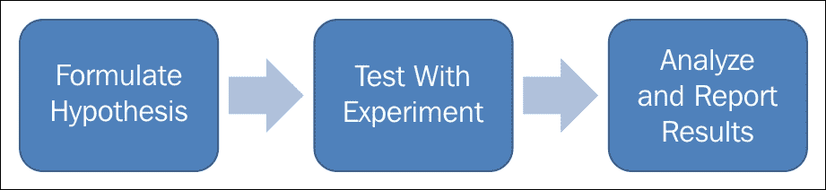
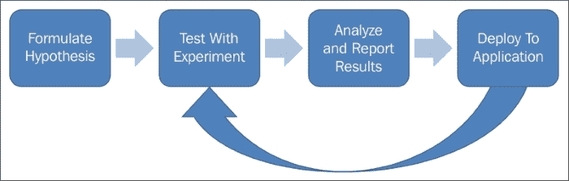
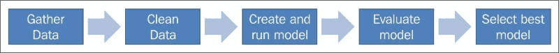
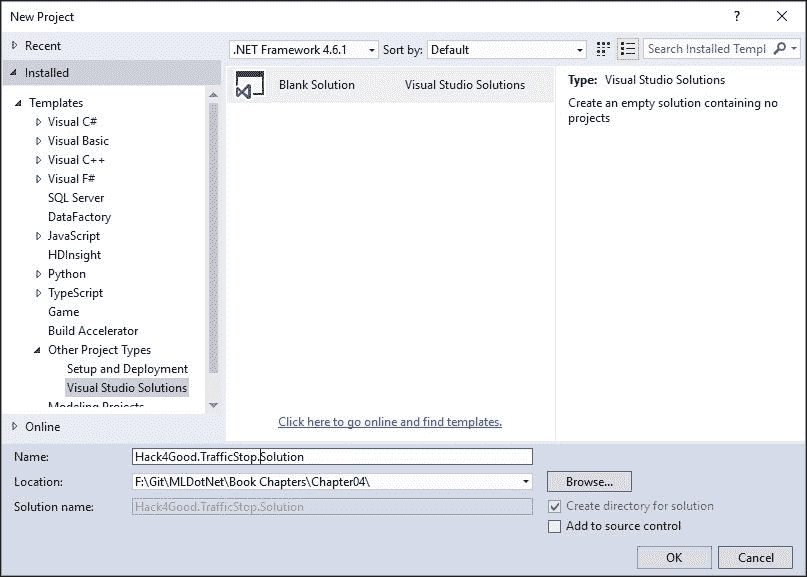
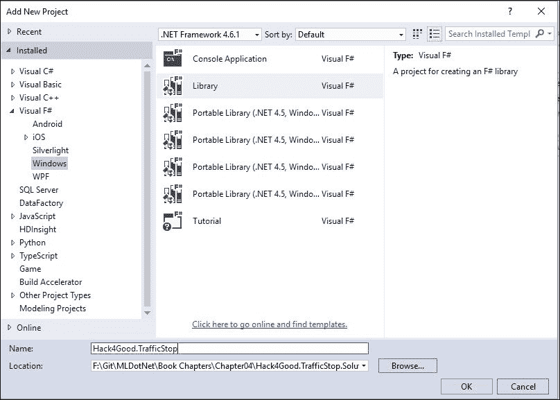
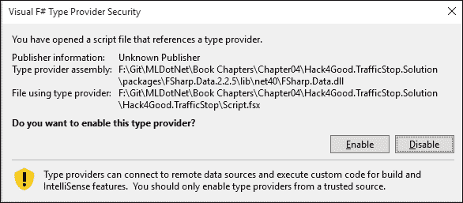
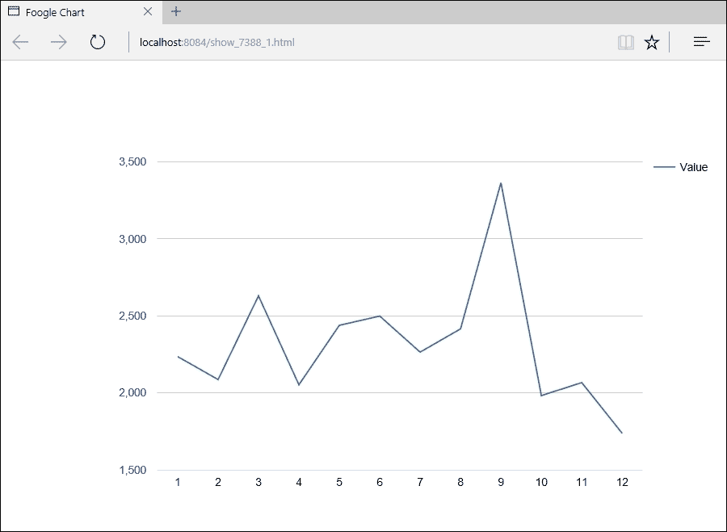
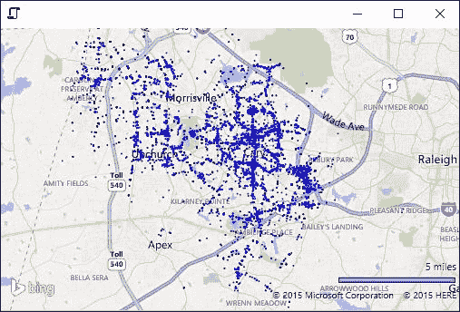
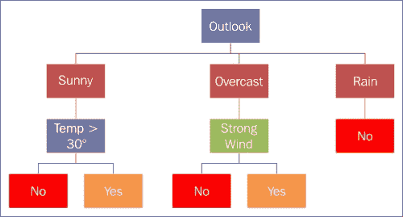

# 第四章：交通拦截——是否走错了路？

在前两章中，你是一位将机器学习注入现有业务应用线的软件开发者。在这一章中，我们将戴上研究分析师的帽子，看看我们能否从现有数据集中发现一些隐藏的见解。

# 科学过程

研究分析师历史上遵循以下发现和分析模式：



随着数据科学家的兴起，该工作流程已转变为类似以下的形式：



注意到在报告模型结果之后，工作并没有结束。相反，数据科学家通常负责将工作模型从他们的桌面移动到生产应用中。随着这项新责任的出现，正如蜘蛛侠所说，数据科学家的技能集变得更加广泛，因为他们必须理解软件工程技术，以配合他们的传统技能集。

数据科学家牢记的一件事是以下这个工作流程。在“测试与实验”块内部，有如下内容：



在时间花费方面，与其它块相比，“数据清洗”块非常大。这是因为大部分工作努力都花在了数据获取和准备上。历史上，大部分数据整理工作都是处理缺失、格式不正确和不合逻辑的数据。传统上，为了尽量减少这一步骤的工作量，人们会创建数据仓库，并在数据从源系统传输到仓库（有时称为提取、转换、加载或 ETL 过程）时对其进行清洗。虽然这有一些有限的成效，但这是一个相当昂贵的举措，固定的架构意味着变化变得特别困难。最近在这个领域的一些努力围绕着以原生格式收集数据，将其倒入“数据湖”中，然后在湖上构建针对数据原生格式和结构的特定作业。有时，这被称为“将数据放入矩形中”，因为您可能正在处理非结构化数据，对其进行清洗和汇总，然后以二维数据框的形式输出。这个数据框的力量在于您可以将它与其他数据框结合起来进行更有趣的分析。

# 开放数据

与大数据和机器学习相一致的最激动人心的公民运动之一是 **开放数据**。尽管围绕它的炒作并不多，但它是在数据科学领域非常激动人心且重要的变革。开放数据的前提是，如果地方政府、州政府和联邦政府将他们目前以 RESTful 格式维护的公共数据公开，他们将变得更加负责任和高效。目前，大多数政府机构可能只有纸质记录，或者为了输出一个临时的查询而收取一笔相当大的费用，或者偶尔有一个 FTP 站点，上面有一些 `.xls` 或 `.pdf` 文件，这些文件会不时更新。开放数据运动将相同的数据（如果不是更多）放在一个可以被应用程序和/或研究分析师消费的 web 服务上。关键在于数据的安全性和隐私。历史上，一些政府机构通过保密来实施安全（我们有在线记录，但唯一获取它的方式是通过我们的定制前端），而开放数据使得这种防御变得过时。说实话，保密式的安全从未真正起作用（编写一个屏幕抓取器有多难？）而且它真正做的只是让有良好意图的人更难实现他们的目标。

开放数据的兴起也与一群为了公民利益而黑客攻击的人的形成相吻合。有时这些是围绕单一技术栈的临时聚会小组，而其他小组则更加正式。例如，Code for America 在世界各地的许多城市都有 *支队*。如果你对帮助当地分会感兴趣，你可以在他们的网站上找到信息 [`www.codeforamerica.org/`](http://www.codeforamerica.org/)。

# Hack-4-Good

让我们假设我们是虚构组织“Hack-4-Good”的一个地方分会的成员。在最近的会议上，领导人宣布：“通过公开记录请求，我们已经获得了我们镇上所有的交通拦截信息。有人知道如何处理这个数据集吗？”你立刻举手说：“当然，宝贝！”好吧，你可能不会用那些确切的话说，但你的热情是显而易见的。

由于你受过研究分析师的培训，你首先想要做的是将数据加载到你的集成开发环境（IDE）中，并开始探索数据。

打开 Visual Studio 并创建一个名为 `Hack4Good.TrafficStop.Solution` 的新解决方案：



在解决方案中添加一个新的 F# 库项目：



## FsLab 和类型提供者

现在项目框架已经设置好了，打开 `Script.fsx` 文件并删除其所有内容。接下来，让我们看看一个非常棒的库 FsLab ([`fslab.org/`](http://fslab.org/)))。转到 NuGet 包管理器控制台并输入以下内容：

```py
PM> Install-Package fslab

```

接下来，我们将安装 SqlClient，以便我们可以访问我们的数据。转到 NuGet 包管理器并输入：

```py
PM> Install-Package FSharp.Data.SqlClient

```

在完成仪式之后，让我们开始编码。首先，让我们将交通罚单数据集引入到我们的脚本中。进入`Script.fsx`并在顶部输入以下内容：

```py
#load "../packages/FsLab.0.3.11/FsLab.fsx"
```

你应该会从 Visual Studio 得到一系列看起来像这样的对话框：



点击**启用**。作为一个一般性的观点，每次当你从 Visual Studio 得到这样的对话框时，点击**启用**。例如，根据我们机器的配置，当你运行以下`open`语句时，你可能会得到这些对话框。

在我们的脚本中，输入以下内容：

```py
#r "System.Data.Entity.dll"
#r "FSharp.Data.TypeProviders.dll"
#r "System.Data.Linq.dll"

open System
open Foogle
open Deedle
open FSharp.Data
open FSharp.Charting
open System.Data.Linq
open System.Data.Entity
open Microsoft.FSharp.Data.TypeProviders
```

接下来，将以下内容输入到脚本中：

```py
[<Literal>]
let connectionString = "data source=nc54a9m5kk.database.windows.net;initial catalog=Traffic;user id=chickenskills@nc54a9m5kk;password=sk1lzm@tter;"

type EntityConnection = SqlEntityConnection<connectionString,Pluralize = true>
let context = EntityConnection.GetDataContext()
context.dbo_TrafficStops |> Seq.iter(fun ts -> printfn "%s" ts.StreetAddress)
```

第一行应该看起来很熟悉；它是一个连接字符串，就像我们在上一章中使用的那样。唯一的区别是数据库。但下一行代码是什么意思呢？

```py
type EntityConnection = SqlEntityConnection<connectionString,Pluralize = true>
```

这是一个类型提供者的例子。类型提供者是 F#的最好特性之一，并且是语言独有的。我喜欢把类型提供者想象成加强版的**对象关系映射**（**ORM**）。这个类型提供者正在检查数据库，并为我生成 F#类型，以便在 REPL 中使用——我们将在下一秒看到它的实际应用。事实上，类型提供者位于**Entity Framework**（**EF**）之上，而 EF 又位于 ADO.NET 之上。如果你对从手动编写 ADO.NET 代码到 EF 的转变感到兴奋，那么你应该同样对使用类型提供者能提高多少生产力感到兴奋；这真的是下一代数据访问。另一个酷的地方是，类型提供者不仅适用于关系数据库管理系统——还有 JSON 类型提供者、`.csv`类型提供者以及其他。你可以在[`msdn.microsoft.com/en-us/library/hh156509.aspx`](https://msdn.microsoft.com/en-us/library/hh156509.aspx)了解更多关于类型提供者的信息，一旦你看到它们在实际中的应用，你将发现它们在你的编码任务中是不可或缺的。

回到代码。下一行是：

```py
let context = EntityConnection.GetDataContext()
```

它创建了将要使用的类型的实际实例。下一行是实际操作的地方：

```py
context.dbo_TrafficStops |> Seq.iter(fun ts -> printfn "%s" ts.StreetAddress)
```

在这一行中，我们正在遍历`TrafficStop`表并打印出街道地址。如果你将脚本中的所有代码高亮显示并发送到 REPL，你将看到 30,000 个地址的最后部分：

```py
128 SW MAYNARD RD/KILMAYNE DR
1 WALNUT ST TO US 1 RAMP NB/US 1 EXIT 101 RAMP NB
2333 WALNUT ST
1199 NW MAYNARD RD/HIGH HOUSE RD
3430 TEN TEN RD

val connectionString : string =
 "data source=nc54a9m5kk.database.windows.net;initial catalog=T"+[61 chars]
type EntityConnection =
 class
 static member GetDataContext : unit -> EntityConnection.ServiceTypes.SimpleDataContextTypes.EntityContainer
 + 1 overload
 nested type ServiceTypes
 end
val context :
 EntityConnection.ServiceTypes.SimpleDataContextTypes.EntityContainer
val it : unit = ()

```

在我们继续前进之前，我想提一下类型提供者有多么酷。只需三行代码，我就定义了一个数据库模式，连接到它，然后拉取了记录。不仅如此，数据库的结果集是`IEnumerable`。所以，我在前几章中用`Seq`所做的所有转换和数据处理，我都可以在这里完成。

## 数据探索

利用这种新发现的力量，让我们开始探索。将以下内容输入到脚本中：

```py
context.dbo_TrafficStops |> Seq.head
```

将其发送到 REPL，我们将看到以下内容：

```py
val it : EntityConnection.ServiceTypes.dbo_TrafficStops =
 SqlEntityConnection1.dbo_TrafficStops
 {CadCallId = 120630019.0;
 DispositionDesc = "VERBAL WARNING";
 DispositionId = 7;
 EntityKey = System.Data.EntityKey;
 EntityState = Unchanged;
 Id = 13890;
 Latitude = 35.7891;
 Longitude = -78.8289;
 StopDateTime = 6/30/2012 12:36:38 AM;
 StreetAddress = "4348 NW CARY PKWY/HIGH HOUSE RD";}
>

```

我们可以看到我们的数据框中有些有趣的分析元素：交通停车的日期和时间、交通停车的地理坐标以及停车的最终处理结果。我们还有一些似乎对分析没有用的数据：`CadCallId`可能是源系统的主键。这可能对以后的审计有用。我们还有`StreetAddress`，它与地理坐标相同，但形式不太适合分析。最后，我们还有一些由 Entity Framework（`EntityKey`、`EntityState`和`Id`）添加的字段。

让我们只包含我们关心的字段创建一个数据框。将以下内容输入到脚本中：

```py
let trafficStops = 
    context.dbo_TrafficStops 
    |> Seq.map(fun ts -> ts.StopDateTime, ts.Latitude, ts.Longitude, ts.DispositionId)
```

将它发送到 REPL，我们得到这个：

```py
val trafficStops :
 seq<System.Nullable<System.DateTime> * System.Nullable<float> *
 System.Nullable<float> * System.Nullable<int>>

>

```

很有趣，尽管 F#非常、非常试图阻止你使用 null，但它确实支持它。实际上，我们所有的四个字段都是可空的。我会在本章稍后向你展示如何处理 null，因为它们在编码时经常是一个大麻烦。

在深入分析之前，我们还需要创建一个额外的数据框。一般来说，我们使用的机器学习模型更喜欢原始类型，如整数、浮点数和布尔值。它们在处理字符串时遇到困难，尤其是表示分类数据的字符串。你可能已经注意到，我把`DispositionId`放到了`trafficStops`数据框中，而没有放`DispositionDesc`。然而，我们仍然不想丢失这个描述，因为我们可能稍后需要引用它。让我们为这个查找数据创建一个单独的数据框。在脚本中输入以下内容：

```py
let dispoistions =
    context.dbo_TrafficStops 
    |> Seq.distinctBy(fun ts -> ts.DispositionId, ts.DispositionDesc)   
    |> Seq.map (fun d -> d.DispositionId, d.DispositionDesc)
    |> Seq.toArray
```

然后将它发送到 REPL 以获取这个：

```py
val dispoistions : (System.Nullable<int> * string) [] =
 [|(7, "VERBAL WARNING"); (15, "CITATION"); (12, "COMPLETED AS REQUESTED");
 (4, "WRITTEN WARNING"); (13, "INCIDENT REPORT"); (9, "ARREST");
 (14, "UNFOUNDED"); (19, "None Provided");
 (10, "NO FURTHER ACTION NECESSARY"); (5, "OTHER    SEE NOTES");
 (2, "UNABLE TO LOCATE"); (16, "FIELD CONTACT");
 (6, "REFERRED TO PROPER AGENCY"); (17, "BACK UP UNIT");
 (11, "CIVIL PROBLEM"); (1, "FURTHER ACTION NECESSARY"); (3, "FALSE ALARM");
 (18, "CITY ORDINANCE VIOLATION")|]

>

```

看看代码，我们有一些新东西。首先，我们使用了高阶函数`Seq.distinctBy`，你可能猜得到它返回具有在参数中指定的不同值的记录。有趣的是，整个交通停车记录被返回，而不仅仅是 lambda 中的值。如果你想知道 F#如何选择代表不同处理结果的记录，你必须归功于魔法。好吧，也许不是。当它遍历数据框时，F#选择了第一个具有新唯一`DispositionID`和`DispositionDesc`值的记录。无论如何，因为我们只关心`DispositionId`和`DispositionDesc`，所以我们在这个代码行中将交通停车记录映射到一个元组上：`Seq.map (fun d -> d.DispositionId, d.DispositionDesc`。到现在你应该已经很熟悉了。

在我们的数据框设置好之后，让我们开始深入挖掘数据。拥有`DateTime`值的一个好处是它代表了可能值得探索的许多不同因素。例如，按月有多少交通停车？关于一周中的哪一天呢？在停车中是否存在时间因素？是晚上发生的事情更多还是白天？让我们开始编写一些代码。转到脚本并输入以下代码块：

```py
let months = 
    context.dbo_TrafficStops
    |> Seq.groupBy (fun ts -> ts.StopDateTime.Value.Month)
    |> Seq.map (fun (m, ts) -> m, Seq.length ts)
    |> Seq.sortBy (fun (m, ts) -> m)
    |> Seq.toArray
```

将它发送到 REPL，你应该看到这个：

```py
val months : (int * int) [] =
 [|(1, 2236); (2, 2087); (3, 2630); (4, 2053); (5, 2439); (6, 2499);
 (7, 2265); (8, 2416); (9, 3365); (10, 1983); (11, 2067); (12, 1738)|]

>

```

只看一眼就能发现，在九月有大量的交通拦截行动，而十二月看起来是一个淡季。深入代码，我使用了一个新的高阶函数：

```py
|> Seq.groupBy (fun ts -> ts.StopDateTime.Value.Month)
```

`groupBy`是一个非常强大的函数，但第一次使用时可能会有些困惑（至少对我来说是这样的）。我通过反向工作并查看简单数组的输出，更好地理解了`groupBy`。进入脚本文件并输入以下内容：

```py
let testArray = [|1;1;2;3;4;5;3;4;5;5;2;1;5|]
testArray |> Array.groupBy (id)
```

将这些信息发送到 REPL 会得到以下结果：

```py
val testArray : int [] = [|1; 1; 2; 3; 4; 5; 3; 4; 5; 5; 2; 1; 5|]
val it : (int * int []) [] =
 [|(1, [|1; 1; 1|]); (2, [|2; 2|]); (3, [|3; 3|]); (4, [|4; 4|]);
 (5, [|5; 5; 5; 5|])|]

```

你会注意到输出是一个元组。元组的第一个元素是`groupBy`对数据进行分组的值。下一个元素是一个子数组，只包含与元组第一个元素匹配的原始数组中的值。深入查看`(1, [|1; 1; 1|])`，我们可以看到数字 1 是`groupBy`的值，原始数组中有三个 1。`groupBy`也可以应用于记录类型。考虑以下数据框。从左到右，列是`USState`、`Gender`、`YearOfBirth`、`NameGiven`和`NumberOfInstances`：

| USState | Gender | YearOfBirth | NameGiven | NumberOfInstances |
| --- | --- | --- | --- | --- |
| AK | F | 1910 | Annie | 12 |
| AK | F | 1910 | Anna | 10 |
| AK | F | 1910 | Margaret | 8 |
| AL | F | 1910 | Annie | 90 |
| AL | F | 1910 | Anna | 88 |
| AL | F | 1910 | Margaret | 86 |
| AZ | F | 1910 | Annie | 46 |
| AZ | F | 1910 | Anna | 34 |
| AZ | F | 1910 | Margaret | 12 |

对`NameGiven`应用`groupBy`到这个数据框会得到以下输出：

| fst | snd |
| --- | --- |
| Annie | AK | F | 1910 | Annie | 12 |
|   | AL | F | 1910 | Annie | 90 |
|   | AZ | F | 1910 | Annie | 46 |
| Anna | AK | F | 1910 | Anna | 10 |
|   | AL | F | 1910 | Anna | 88 |
|   | AZ | F | 1910 | Anna | 34 |
| Margaret | AK | F | 1910 | Margaret | 8 |
|   | AL | F | 1910 | Margaret | 86 |
|   | AZ | F | 1910 | Margaret | 12 |

使用元组的`fst`，即`NameGiven`，以及`snd`是一个只包含与`fst`匹配的记录的数据框。

让我们继续下一行代码`|> Seq.map (fun (m, ts) -> m, ts |> Seq.length)`。

我们可以看到，我们正在将原始的月份和`trafficStops`元组映射到一个新的元组，该元组由月份和原始元组的`snd`的数组长度组成。这实际上将我们的数据减少到一个长度为 12 的序列（每个月一个）。`fst`是月份，`snd`是发生的拦截次数。接下来我们按月份排序，然后将其推送到一个数组中。

设置了这个模式后，让我们再进行几个`groupBy`操作。让我们做`Day`和`DayOfWeek`。进入脚本并输入以下内容：

```py
let dayOfMonth = 
    context.dbo_TrafficStops
    |> Seq.groupBy (fun ts -> ts.StopDateTime.Value.Day)
    |> Seq.map (fun (d, ts) -> d, Seq.length ts)
    |> Seq.sortBy (fun (d, ts) -> d)
    |> Seq.toArray

let weekDay = 
    context.dbo_TrafficStops
    |> Seq.groupBy (fun ts -> ts.StopDateTime.Value.DayOfWeek)
    |> Seq.map (fun (dow, ts) -> dow, Seq.length ts)
    |> Seq.sortBy (fun (dow, ts) -> dow)
    |> Seq.toArray
```

你会注意到与我们刚刚进行的月度分析相比有一个细微的变化——`|> Seq.map (fun (dow, ts) -> dow, Seq.length ts)`在获取`snd`的长度时语法有所不同。我写的是`Seq.length ts`而不是`ts |> Seq.length`。这两种风格在 F#中都是完全有效的，但后者被认为更符合习惯用法。我将在本书中更频繁地使用这种风格。

所以一旦我们将其发送到 REPL，我们可以看到：

```py
val dayOfMonth : (int * int) [] =
 [|(1, 918); (2, 911); (3, 910); (4, 941); (5, 927); (6, 840); (7, 940);
 (8, 785); (9, 757); (10, 805); (11, 766); (12, 851); (13, 825); (14, 911);
 (15, 977); (16, 824); (17, 941); (18, 956); (19, 916); (20, 977);
 (21, 988); (22, 906); (23, 1003); (24, 829); (25, 1036); (26, 1031);
 (27, 890); (28, 983); (29, 897); (30, 878); (31, 659)|]

val weekDay : (System.DayOfWeek * int) [] =
 [|(Sunday, 3162); (Monday, 3277); (Tuesday, 3678); (Wednesday, 4901);
 (Thursday, 5097); (Friday, 4185); (Saturday, 3478)|]

```

看着结果，我们应该很清楚我们在做什么。每个月的 25 号看起来是大多数流量停止发生的日子，而星期四确实有很多停止。我想知道如果某个月的 25 号恰好是星期四会发生什么？

在我们深入数据之前，我想指出，最后三个代码块非常相似。它们都遵循这个模式：

```py
let weekDay = 
   context.dbo_TrafficStops
    |> Seq.groupBy (fun ts -> ts.StopDateTime.Value.XXXXX)
    |> Seq.map (fun (fst, snd) -> fst, Seq.length snd)
    |> Seq.sortBy (fun (fst, snd) -> fst)
    |> Seq.toArray
```

而不是有三个几乎完全相同的代码块，我们能否将它们合并成一个函数？是的，我们可以。如果我们写一个这样的函数：

```py
let transform grouper mapper =
    context.dbo_TrafficStops 
    |> Seq.groupBy grouper
             |> Seq.map mapper
                             |> Seq.sortBy fst 
                             |> Seq.toArray
```

然后我们这样调用它：

```py
transform (fun ts -> ts.StopDateTime.Value.Month) (fun (m, ts) -> m, Seq.length ts)
transform (fun ts -> ts.StopDateTime.Value.Day) (fun (d, ts) -> d, Seq.length ts)
transform (fun ts -> ts.StopDateTime.Value.DayOfWeek) (fun (dow, ts) -> dow, Seq.length ts)
```

这会起作用吗？当然。将其发送到 REPL，我们可以看到我们得到了相同的结果：

```py
val transform :
 grouper:(EntityConnection.ServiceTypes.dbo_TrafficStops -> 'a) ->
 mapper:('a * seq<EntityConnection.ServiceTypes.dbo_TrafficStops> ->
 'b * 'c) -> ('b * 'c) [] when 'a : equality and 'b : comparison
val it : (System.DayOfWeek * int) [] =
 [|(Sunday, 3162); (Monday, 3277); (Tuesday, 3678); (Wednesday, 4901);
 (Thursday, 5097); (Friday, 4185); (Saturday, 3478)|]

```

来自 C#和 VB.NET 的你们中的一些人可能会对转换的接口感到非常不舒服。你可能更习惯于这种语法：

```py
let transform (grouper, mapper) =
```

`()`和逗号让它看起来更像是 C#和 VB.NET。尽管两者在 F#中都是完全有效的，但这又是另一个被认为更符合习惯用法的地方，即移除括号和逗号。我将在本书中更频繁地使用这种风格。

此外，请注意，我将两个函数传递给了转换函数。这与我们通常将数据传递给方法的命令式 C#/VB.NET 非常不同。我注意到函数式编程更多的是将操作带到数据上，而不是将数据带到操作上，一旦我们开始将机器学习应用于大数据，这具有深远的影响。

回到我们的转换函数，我们可以看到在三次调用中`mapper`函数几乎是一样的：`(fun (dow, ts) -> dow, Seq.length ts)`。唯一的区别是我们给元组的第一个部分取的名字。这似乎是我们可以进一步合并代码的另一个绝佳地方。让我们这样重写转换函数：

```py
let transform grouper  =
    context.dbo_TrafficStops 
    |> Seq.groupBy grouper
    |> Seq.map (fun (fst, snd) -> fst, Seq.length snd)	
    |> Seq.sortBy fst 
    |> Seq.toArray

transform (fun ts -> ts.StopDateTime.Value.Month) 
transform (fun ts -> ts.StopDateTime.Value.Day) 
transform (fun ts -> ts.StopDateTime.Value.DayOfWeek)
```

然后将它发送到 REPL，我们得到这个：

```py
val transform :
 grouper:(EntityConnection.ServiceTypes.dbo_TrafficStops -> 'a) ->
 ('a * int) [] when 'a : comparison

> 

val it : (System.DayOfWeek * int) [] =
 [|(Sunday, 3162); (Monday, 3277); (Tuesday, 3678); (Wednesday, 4901);
 (Thursday, 5097); (Friday, 4185); (Saturday, 3478)|]

```

真的很酷，不是吗？我们将在本书中越来越多地做这种编程。一旦你掌握了它，你将开始在代码中看到以前从未见过的模式，你又有了一个强大的工具箱中的新工具（就像我混合了隐喻）。

既然你现在对`groupBy`已经熟悉了，我想重写我们的转换函数，弃用它。与其使用`groupBy`和`map`函数，不如用`countBy`高阶函数来重写它。在此过程中，让我们将我们的函数重命名为一个更具意图性的名称。将以下内容输入到脚本中：

```py
let getCounts counter =
    context.dbo_TrafficStops 
    |> Seq.countBy counter
    |> Seq.sortBy fst 
    |> Seq.toArray

getCounts (fun ts -> ts.StopDateTime.Value.DayOfWeek)
```

将此发送到 REPL，我们得到相同的值：

```py
val getCounts :
 counter:(EntityConnection.ServiceTypes.dbo_TrafficStops -> 'a) ->
 ('a * int) [] when 'a : comparison
val it : (System.DayOfWeek * int) [] =
 [|(Sunday, 3162); (Monday, 3277); (Tuesday, 3678); (Wednesday, 4901);
 (Thursday, 5097); (Friday, 4185); (Saturday, 3478)|]

```

## 可视化

在 REPL 中查看数据是一个好的开始，但图片是更强大和有效的信息传达方式。例如，交通检查站是否有某种月度季节性？让我们将数据放入图表中，以找出答案。在您的脚本中输入以下内容：

```py
let months' = Seq.map (fun (m,c) -> string m,c) months
Chart.LineChart months'
```

您的 REPL 应该看起来像这样：

```py
val months' : seq<string * int>
val it : FoogleChart = (Foogle Chart)

>

```

您的默认浏览器应该正在尝试打开并显示以下内容：



因此，我们看到 9 月份的峰值和 12 月份的下降，这已经引起了我们的注意。如果日期/时间有一些奇怪的规律，那么地理位置呢？将以下内容输入到脚本文件中：

```py
let locations = 
    context.dbo_TrafficStops 
    |> Seq.filter (fun ts -> ts.Latitude.HasValue && ts.Longitude.HasValue )
    |> Seq.map (fun ts -> ts.StreetAddress, ts.Latitude.Value, ts.Longitude.Value)
    |> Seq.map (fun (sa,lat,lon) -> sa, lat.ToString(), lon.ToString())
    |> Seq.map (fun (sa,lat,lon) -> sa, lat + "," + lon)
    |> Seq.take 2
    |> Seq.toArray

Chart.GeoChart(locations,DisplayMode=GeoChart.DisplayMode.Markers,Region="US")
```


并没有太多帮助。问题是 FsLab geomap 覆盖了 Google 的`geoMap` API，而这个 API 只到国家层面。因此，我们不是使用 FsLab，而是可以自己实现。这是一个相当复杂的过程，使用了 Bing 地图、WPF 依赖属性等，所以我在这本书中不会解释它。代码可以在我们网站的下载部分供您查阅。所以，闭上眼睛，假装我花在上的最后 3 个小时在 2 秒钟内就过去了，我们有了这张地图：



那么，我们一开始能告诉什么？到处都有交通检查站，尽管它们似乎集中在主要街道上。根据初步分析，"速度陷阱"这个词可能更多关于月份、日期和时间，而不是位置。此外，我们不能从这个地图中得出太多结论，因为我们不知道交通模式——更多的检查站可能位于更繁忙的街道上，或者可能是交通检查站的关键区域的指标。为了帮助我们更深入地挖掘数据，让我们从简单的描述性统计转向应用一种常见的机器学习技术，称为决策树。

## 决策树

决策树的原则是这样的：你可以使用树状结构进行预测。以下是一个关于我们今天是否打网球的地方性例子：



每个决策被称为一个节点，最终结果（在我们的例子中，是**是**/**否**框）被称为叶子。与树的类比是相当恰当的。事实上，我会称它为一个决策分支，每个决策称为一个拐角，最终结果被称为叶子。然而，J.R. Quinlan 在 1986 年发明这种方法时并没有问我。无论如何，树的高度是指树的水平层数。在我们之前的例子中，树的最大高度为两层。对于给定点的可能节点被称为特征。在我们之前的例子中，Outlook 有三个特征（晴朗、多云和雨）和 Strong Wind 有两个特征（是和否）。

决策树的一个真正的好处是它传达信息的简单性。当节点数量较少且移动到下一个节点的计算简单时，人类经常进行心理决策树。（我应该点脱咖啡还是普通咖啡？我今晚需要学习吗？）当有大量节点且计算复杂时，计算机就派上用场了。例如，我们可以给计算机提供大量历史数据，这些数据来自决定打网球的人，它可以确定，对于晴天，实际的决策点不是 30°，而是 31.2°。不过，需要注意的是，随着特征数量的增加和深度的增大，决策树往往变得不那么有意义。我们稍后会看看如何处理这个问题。

## Accord

让我们用我们的交通停车数据创建一个决策树。回到 Visual Studio，打开 **解决方案资源管理器**，添加一个名为 `Accord.fsx` 的新脚本。将以下内容输入到脚本中：

```py
#r "System.Data.Entity.dll"
#r "FSharp.Data.TypeProviders.dll"
#r "System.Data.Linq.dll"

open System
open System.Data.Linq
open System.Data.Entity
open Microsoft.FSharp.Data.TypeProviders

[<Literal>]
let connectionString = "data source=nc54a9m5kk.database.windows.net;initial catalog=Traffic;user id=chickenskills@nc54a9m5kk;password=sk1lzm@tter;"

type EntityConnection = SqlEntityConnection<connectionString,Pluralize = true>
let context = EntityConnection.GetDataContext()
```

这段代码与你在 `Script.fsx` 中使用的代码相同。发送到 REPL 以确保你正确地复制粘贴了：

```py
val connectionString : string =
 "data source=nc54a9m5kk.database.windows.net;initial catalog=T"+[61 chars]
type EntityConnection =
 class
 static member GetDataContext : unit -> EntityConnection.ServiceTypes.SimpleDataContextTypes.EntityContainer
 + 1 overload
 nested type ServiceTypes
 end
val context :
 EntityConnection.ServiceTypes.SimpleDataContextTypes.EntityContainer

>

```

接下来，打开 NuGet 包管理器并输入以下命令：

```py
PM> Install-Package Accord.MachineLearning

```

回到脚本中，输入以下内容：

```py
#r "../packages/Accord.3.0.2/lib/net40/Accord.dll"
#r "../packages/Accord.MachineLearning.3.0.2/lib/net40/Accord.MachineLearning.dll"
#r "../packages/Accord.Statistics.3.0.2/lib/net40/Accord.Statistics.dll"
open Accord
open Accord.MachineLearning
open Accord.MachineLearning.DecisionTrees
open Accord.MachineLearning.DecisionTrees.Learning
```

解决了这个问题之后，让我们创建一个可以传递给 Accord 的数据结构。正如我之前提到的，决策树通常会有大量特征的问题。一种常见的缓解方法是数据分组。当你分组数据时，你将原始数据放入大组中。例如，我们可以将所有交通停车的所有时间分组到上午或下午，具体取决于它们是在中午之前还是之后发生的。分组是数据科学中常用的技术——有时是合理地使用，有时只是为了使模型符合期望的输出。

回到我们的脚本中，为我们的决策树创建以下记录类型：

```py
type TrafficStop = {Month:int; DayOfWeek:DayOfWeek; AMPM: string; ReceviedTicket: bool option }
```

你会看到我创建了两个数据集。第一个被称为 `AMPM`，它是用于停车时间的。第二个被称为 `ReceviedTicket`，作为一个布尔值。如果你记得，处置有 18 种不同的值。我们只关心这个人是否收到了罚单（称为传票），所以我们把传票分类为真，非传票分类为假。还有一件事你可能注意到了——`ReceivedTicket` 并不是一个简单的布尔值，它是一个布尔选项。你可能还记得，F# 实际上并不喜欢空值。尽管它可以支持空值，但 F# 更鼓励你使用一种称为选项类型的东西来代替。

选项类型可以有两个值：`Some<T>` 或 `None`。如果你不熟悉 `Some<T>` 的语法，这意味着 `Some` 只限于一种类型。因此，你可以写 `Some<bool>`、`Some<int>` 或 `Some<string>`。使用选项类型，你可以验证一个字段是否有你关心的值：`Some` 或 `None`。不仅如此，编译器强制你明确选择。这种编译器检查迫使你明确值，这是一个极其强大的结构。确实，这也是 F# 代码通常比其他语言更少出现错误的原因之一，因为它迫使开发者尽早面对问题，并防止他们将问题掩盖起来，放入一个可能被意外忽略的 `null` 中。

回到我们的代码，让我们编写两个函数，将我们的原始数据进行分类：

```py
let getAMPM (stopDateTime:System.DateTime) =
    match stopDateTime.Hour < 12 with
    | true -> "AM"
    | false -> "PM"

let receviedTicket (disposition:string) =
    match disposition.ToUpper() with
    | "CITATION" -> Some true
    | "VERBAL WARNING" | "WRITTEN WARNING" -> Some false
    | _ -> None
```

将其发送到 REPL，我们看到：

```py
val getAMPM : stopDateTime:DateTime -> string
val receviedTicket : disposition:string -> bool option

```

注意，`ReceivedTicket` 返回三种可能性，使用选项类型：`Some true`、`Some false` 和 `None`。我没有将其他处理值包含在 `Some false` 与 `None` 之间，是因为我们只关注交通违规，而不是警察可能停车的原因。这种过滤在数据科学中经常被用来帮助使数据集与我们要证明的内容相一致。我们在这里不深入讨论过滤，因为关于如何处理异常值和非规范数据，已经有整本书的讨论。

回到我们的代码。让我们从数据库中取出数据，并将其放入我们的 `TrafficStop` 记录类型中。进入脚本并输入以下内容：

```py
let dataFrame = context.dbo_TrafficStops
                |> Seq.map (fun ts -> {Month=ts.StopDateTime.Value.Month;DayOfWeek=ts.StopDateTime.Value.DayOfWeek;
                                      AMPM=getAMPM(ts.StopDateTime.Value); ReceviedTicket= receviedTicket(ts.DispositionDesc) })
                |> Seq.filter (fun ts -> ts.ReceviedTicket.IsSome)
                |> Seq.toArray
```

将此发送到 REPL，我们看到数据框中所有记录的最后部分：

```py
 {Month = 7;
 DayOfWeek = Sunday;
 AMPM = "PM";
 ReceviedTicket = Some false;}; {Month = 7;
 DayOfWeek = Sunday;
 AMPM = "PM";
 ReceviedTicket = Some false;}; ...|]

>

```

数据形状大致确定后，让我们为 Accord 准备它。如我之前提到的， Accord 需要决策树输入数据为 `int[][]`，输出为 `int[]`。然而，它还需要对输入进行标记以使模型工作。我们通过传递属性数组来实现这一点。回到脚本文件，添加以下代码块：

```py
let month = DecisionVariable("Month",13)
let dayOfWeek = DecisionVariable("DayOfWeek",7)
let ampm = DecisionVariable("AMPM",2)

let attributes =[|month;dayOfWeek;ampm|]
let classCount = 2 
```

将此发送到 REPL，我们看到：

```py
val month : Accord.MachineLearning.DecisionTrees.DecisionVariable
val dayOfWeek : Accord.MachineLearning.DecisionTrees.DecisionVariable
val ampm : Accord.MachineLearning.DecisionTrees.DecisionVariable
val attributes : Accord.MachineLearning.DecisionTrees.DecisionVariable [] =
 [|Accord.MachineLearning.DecisionTrees.DecisionVariable;
 Accord.MachineLearning.DecisionTrees.DecisionVariable;
 Accord.MachineLearning.DecisionTrees.DecisionVariable|]
val classCount : int = 2

```

一些细心的读者可能会注意到，月份决策变量有 13 个范围而不是 12 个。这是因为月份的值是 1-12，Accord 需要 13 来考虑任何特征值可能高达 13 的可能性（如 12.99——我们知道这不会存在，但 Accord 不这么认为）。星期几是 0 到 6，所以它得到一个 `7`。

因此，回到我们的脚本，添加以下代码块：

```py
let getAMPM' (ampm: string) =
    match ampm with
    | "AM" -> 0
    | _ -> 1

let receivedTicket' value =
    match value with
    | true -> 1
    | false -> 0

let inputs = 
    dataFrame 
    |> Seq.map (fun ts -> [|(ts.Month); int ts.DayOfWeek; getAMPM'(ts.AMPM)|])
    |> Seq.toArray

let outputs = 
    dataFrame 
    |> Seq.map (fun ts -> receivedTicket'(ts.ReceviedTicket.Value))
    |> Seq.toArray
```

将此发送到 REPL，我们得到数据框的末尾被转换为 `int` 数组：

```py
 [|7; 0; 0|]; [|7; 0; 0|]; [|7; 0; 0|]; [|7; 0; 0|]; [|7; 0; 0|];
 [|7; 0; 0|]; [|7; 0; 0|]; [|7; 0; 0|]; [|7; 0; 0|]; [|7; 0; 0|];
 [|7; 0; 1|]; [|7; 0; 1|]; [|7; 0; 1|]; [|7; 0; 1|]; [|7; 0; 1|];
 [|7; 0; 1|]; [|7; 0; 1|]; [|7; 0; 1|]; [|7; 0; 1|]; [|7; 0; 1|];
 [|7; 0; 1|]; [|7; 0; 1|]; [|7; 0; 1|]; [|7; 0; 1|]; [|7; 0; 1|];
 [|7; 0; 1|]; [|7; 0; 1|]; [|7; 0; 1|]; [|7; 0; 1|]; [|7; 0; 1|]; ...|]
val outputs : int [] =
 [|0; 1; 0; 1; 0; 0; 1; 0; 0; 0; 0; 0; 0; 1; 0; 0; 0; 0; 0; 0; 1; 1; 1; 0; 1;
 0; 0; 0; 0; 0; 1; 0; 0; 0; 0; 0; 1; 1; 1; 0; 1; 1; 0; 1; 0; 0; 1; 0; 0; 0;
 0; 0; 0; 1; 0; 1; 0; 0; 0; 0; 1; 0; 0; 0; 0; 0; 0; 0; 0; 0; 1; 1; 0; 0; 0;
 1; 0; 0; 0; 0; 0; 0; 0; 0; 0; 0; 0; 0; 1; 0; 0; 0; 0; 0; 0; 0; 0; 0; 0; 0;
 ...|]

>

```

一切准备就绪后，让我们继续运行我们的树。将以下内容输入到脚本中：

```py
let tree = DecisionTree(attributes, classCount)
let id3learning = ID3Learning(tree)
let error = id3learning.Run(inputs, outputs)
```

将此发送到 REPL 给我们：

```py
val error : float = 0.2843236362

```

就像我们迄今为止看到的所有其他模型一样，我们需要模型的输出以及一些关于我们的模型基于提供的数据预测效果如何的信息。在这种情况下，模型的误差为 28%，对于一个决策树来说相当高。模型创建完成后，我们现在可以要求树预测在十月的周六晚上我们会收到罚单还是警告。

输入以下脚本：

```py
let query = ([|10;6;1|])
let output = tree.Compute(query) 
```

将其发送到 REPL，我们看到：

```py
val query : int [] = [|10; 6; 1|]
val output : int = 0

```

看起来我们会收到警告而不是罚单。

正如我提到的，28%对于一个决策树来说相当高。有没有办法降低这个数字？也许分类会有所帮助。回到 REPL 并输入以下内容：

```py
dataFrame 
    |> Seq.countBy (fun ts -> ts.Month) 
    |> Seq.sort
    |> Seq.iter (fun t ->  printfn "%A" t)

dataFrame 
    |> Seq.countBy (fun ts -> ts.DayOfWeek) 
    |> Seq.sort
    |> Seq.iter (fun t ->  printfn "%A" t)

dataFrame 
    |> Seq.countBy (fun ts -> ts.AMPM) 
    |> Seq.sort
    |> Seq.iter (fun t ->  printfn "%A" t)

dataFrame 
    |> Seq.countBy (fun ts -> ts.ReceviedTicket) 
    |> Seq.sort
    |> Seq.iter (fun t ->  printfn "%A" t)
```

将其发送到 REPL，我们看到：

```py
(1, 2125)
(2, 1992)
(3, 2529)
(4, 1972)
(5, 2342)
(6, 2407)
(7, 2198)
(8, 2336)
(9, 3245)
(10, 1910)
(11, 1989)
(12, 1664)
(Sunday, 3019)
(Monday, 3169)
(Tuesday, 3549)
(Wednesday, 4732)
(Thursday, 4911)
(Friday, 4012)
(Saturday, 3317)
("AM", 9282)
("PM", 17427)
(Some false, 19081)
(Some true, 7628)

val it : unit = ()

```

也许我们可以将一年的月份分成季度？让我们创建一个执行此操作的函数。进入脚本文件并输入以下内容：

```py
let getQuarter(month:int) =
    match month with
    | 1 | 2 | 3 -> 1
    | 4 | 5 | 6 -> 2
    | 7 | 8 | 9 -> 3
    | _ -> 4

let inputs' = 
    dataFrame 
    |> Seq.map (fun ts -> [|getQuarter((ts.Month)); int ts.DayOfWeek; getAMPM'(ts.AMPM)|])
    |> Seq.toArray

let outputs' = 
    dataFrame 
    |> Seq.map (fun ts -> receivedTicket'(ts.ReceviedTicket.Value))
    |> Seq.toArray

let error' = id3learning.Run(inputs', outputs')
```

将其发送到 REPL，我们看到：

```py
val error' : float = 0.2851473286

```

这并没有提高我们的模型。也许我们可以继续处理数据，或者也许我们拥有的数据中不存在罚单/警告之间的相关性。离开一个模型往往是你在数据科学中必须做的最困难的事情之一，尤其是如果你在上面投入了相当多的时间，但通常这是正确的事情。

## numl

在我们离开决策树之前，我想看看另一种计算它们的方法。与其使用 Accord.Net，我想介绍另一个名为**numl**的.Net 机器学习库。numl 是新生事物，可以提供更低的机器学习入门门槛。尽管不如 Accord 广泛，但它确实提供了许多常见的模型，包括决策树。

前往**解决方案资源管理器**并添加另一个名为`numl.fsx`的脚本。然后进入 NuGet 包管理器并下拉 numl：

```py
PM> Install-Package numl

```

回到 numl 脚本并输入以下代码：

```py
#r "System.Data.Entity.dll"
#r "FSharp.Data.TypeProviders.dll"
#r "System.Data.Linq.dll"

open System
open System.Data.Linq
open System.Data.Entity
open Microsoft.FSharp.Data.TypeProviders

[<Literal>]
let connectionString = "data source=nc54a9m5kk.database.windows.net;initial catalog=Traffic;user id=chickenskills@nc54a9m5kk;password=sk1lzm@tter;"

type EntityConnection = SqlEntityConnection<connectionString,Pluralize = true>
let context = EntityConnection.GetDataContext()

type TrafficStop = {Month:int; DayOfWeek:DayOfWeek; AMPM: string; ReceivedTicket: option<bool>}

let getAMPM (stopDateTime:System.DateTime) =
    match stopDateTime.Hour < 12 with
    | true -> "AM"
    | false -> "PM"

let receviedTicket (disposition:string) =
    match disposition.ToUpper() with
    | "CITATION" -> Some true
    | "VERBAL WARNING" | "WRITTEN WARNING" -> Some false
    | _ -> None

let dataFrame = 
    context.dbo_TrafficStops
    |> Seq.map (fun ts -> {Month=ts.StopDateTime.Value.Month;DayOfWeek=ts.StopDateTime.Value.DayOfWeek;
       AMPM=getAMPM(ts.StopDateTime.Value); ReceivedTicket= receviedTicket(ts.DispositionDesc) })
    |> Seq.filter (fun ts -> ts.ReceivedTicket.IsSome)
    |> Seq.toArray
```

这与`Accord.fsx`脚本中的代码相同，所以你可以从那里复制粘贴。将其发送到 REPL 以确保你正确地复制粘贴了。接下来，添加以下代码块以引用 numl。

```py
#r "../packages/numl.0.8.26.0/lib/net40/numl.dll"
open numl
open numl.Model
open numl.Supervised.DecisionTree
```

接下来，输入以下代码块：

```py
type TrafficStop' = {[<Feature>] Month:int; [<Feature>] DayOfWeek:int; 
    [<Feature>] AMPM: string; [<Label>] ReceivedTicket: bool}

let dataFrame' = 
    dataFrame 
    |> Seq.map (fun ts -> {TrafficStop'.Month = ts.Month; DayOfWeek = int ts.DayOfWeek; AMPM=ts.AMPM; ReceivedTicket=ts.ReceivedTicket.Value})
    |> Seq.map box

let descriptor = Descriptor.Create<TrafficStop'>()
```

将其发送到 REPL，返回如下：

```py
type TrafficStop' =
 {Month: int;
 DayOfWeek: int;
 AMPM: string;
 ReceivedTicket: bool;}
val dataFrame' : seq<obj>
val descriptor : Descriptor =
 Descriptor (TrafficStop') {
 [Month, -1, 1]
 [DayOfWeek, -1, 1]
 [AMPM, -1, 0]
 *[ReceivedTicket, -1, 1]
}

```

这里有两点需要注意。首先，就像 Accord 一样，numl 希望其建模引擎的输入以某种格式。在这种情况下，它不是整数的数组。而是希望是对象类型（截至写作时）。为了知道如何处理每个对象，它需要与每个元素关联的属性，因此有`TrafficStop'`类型，它添加了`[Feature]`或`[Label]`。正如你所猜到的，特征用于输入，标签用于输出。第二点要注意的是，我们调用`|> Seq.map box`。这将我们的类型如 int、string 和 bool 转换为对象，这是 numl 想要的。

在处理完这些之后，我们可以看看 numl 会得出什么结论。将以下内容输入到脚本窗口：

```py
let generator = DecisionTreeGenerator(descriptor)
generator.SetHint(false)
let model = Learner.Learn(dataFrame', 0.80, 25, generator)
```

将其发送到 REPL，我们得到：

```py
val generator : DecisionTreeGenerator
val model : LearningModel =
 Learning Model:
 Generator numl.Supervised.DecisionTree.DecisionTreeGenerator
 Model:
 [AM, 0.0021]
 |- 0
 |  [Month, 0.0021]
 |   |- 1 ≤ x < 6.5
 |   |  [DayOfWeek, 0.0001]
 |   |   |- 0 ≤ x < 3
 |   |   |   +(False, -1)
 |   |   |- 3 ≤ x < 6.01
 |   |   |   +(False, -1)
 |   |- 6.5 ≤ x < 12.01
 |   |   +(False, -1)
 |- 1
 |   +(False, -1)

 Accuracy: 71.98 %

>

```

numl 的一个优点是，`ToString()`重载会打印出我们树的图形表示。这是一种快速视觉检查我们有什么的好方法。你还可以看到，模型的准确度几乎与 Accord 相同。如果你运行这个脚本几次，你会因为 numl 分割数据的方式而得到略微不同的答案。再次审视这个树，让我们看看我们能否更详细地解释它。

模型引擎发现，最佳的分割特征是上午/下午。如果交通拦截发生在下午，你会收到警告而不是罚单。如果是上午，我们会移动到树上的下一个决策点。我们可以看到的是，如果交通拦截发生在 7 月至 12 月之间的上午，我们不会收到罚单。如果上午的交通拦截发生在 1 月至 6 月之间，我们就必须进入下一个级别，即星期几。在这种情况下，模型在星期日-星期二和星期三-星期六之间进行分割。你会注意到，两个终端节点也都是错误的。那么真相在哪里？模型能否预测我会收到罚单？不，这个模型不能合理地预测你何时会收到罚单。就像之前一样，我们不得不放弃这个模型。然而，这次练习并不是徒劳的，因为我们将使用这些数据以及更多数据和一个不同的模型来创建一些具有实际价值的东西。

在我们离开这一章之前，还有一个问题，“这里正在进行什么样的机器学习？”我们可以这样说，numl 正在使用机器学习，因为它对数据进行了多次迭代。但这意味着什么呢？如果你查看我们编写的最后一行代码，`let model = Learner.Learn(dataFrame', 0.80, 25, generator)`，你可以看到第三个参数是 25。这是模型运行的次数，然后 numl 选择最佳的模型。实际上，这意味着机器“学习”了，但评估了几个可能的模型，并为我们选择了一个。我不认为这算是机器学习，因为我们没有引入新的数据来使学习变得更智能。

在下一章中，我们将探讨使用测试集和训练集来完成这些任务，但我们仍然面临这个问题：这是一个特定时间点的分析。你将如何使这个模型能够自我学习？事实上，我不会在这个模型当前状态下浪费时间，因为模型已经被证明是无用的。然而，如果模型是有用的，我可以想象一个场景，即我们不断更新数据集，并基于我们的开放数据朋友能够获取的更多数据集运行模型。有了这个，我们可以运行一个应用程序，可能会在司机早上离家前提醒他们，根据日期/时间/天气/其他因素，他们应该比平时更加小心。也许是一个简单的文本或推文给司机？无论如何，一旦我们有一个真正的模型，我们就可以看到这个应用程序的实际应用。

# 摘要

在本章中，我们戴上数据科学家的帽子，研究了如何使用 F# 进行数据探索和分析。我们接触到了开放数据和类型提供者的奇妙之处。然后我们实现了一个决策树，尽管最终我们得出结论，数据并没有显示出显著的关系。

在下一章中，我们将解决迄今为止我们一直略过的一些问题，并深入探讨获取、清洗和组织我们的数据的方法。
