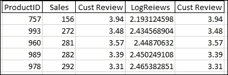
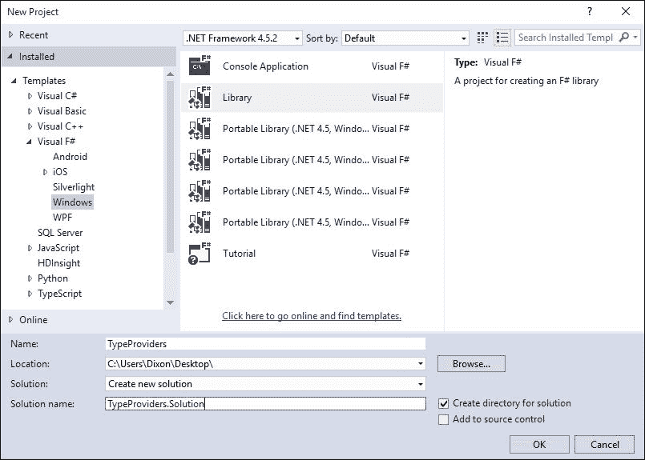
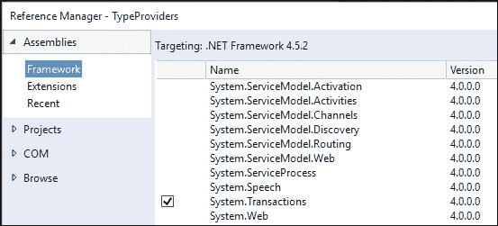
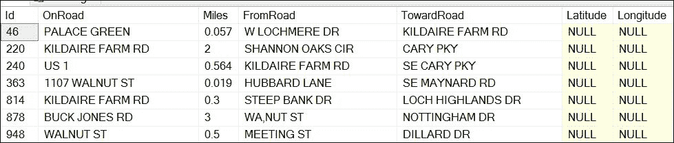

# 第五章. 休息时间 – 获取数据

在本章中，我们将从查看各种机器学习模型转向。相反，我们将回顾我在第二章、*AdventureWorks 回归*、第三章、*更多 AdventureWorks 回归*和第四章、*交通拦截 – 是否走错了路？*中略过的一些问题。我们将探讨使用 Visual Studio 和类型提供者获取数据的不同方法。然后，我们将探讨类型提供者如何帮助我们解决缺失数据的问题，我们将如何使用并行性来加速我们的数据提取，以及我们如何在受保护的 Web 服务上使用类型提供者。

# 概述

数据科学家必须具备的一项被低估的技能是收集和整合异构数据的能力。异构数据来自不同的来源、结构和格式。异构与同质数据相对立，同质数据假设所有导入的数据都与可能已经存在的其他数据相同。当数据科学家获得异构数据时，他们首先会做的事情之一是将数据转换到可以与其他数据结合的程度。这种转换的最常见形式是 **数据帧**——有时被称为 *矩形*，因为列是属性，行是数据。例如，这里是一个我们之前见过的数据帧：



理想情况下，每个数据帧都有一个独特的键，允许它与其他数据帧结合。在这种情况下，**ProductID** 是主键。如果你认为这很像 RDBMS 理论——你是对的。

研究分析师和业务开发者之间的一大区别在于他们如何在其项目中使用数据。对于软件工程师来说，数据元素必须被细致地定义、创建和跟踪。而对于研究分析师来说，所有这些精神努力都是与解决问题无关的噪音。

这就是类型提供者力量的体现。我们不是花费精力去提取数据，而是花费时间对其进行转换、塑造和分析。

# SQL Server 提供者

尽管围绕像 MongoDb 这样的`no-sql`数据库和无结构数据存储如*数据湖*（或根据你的观点，*数据沼泽*）有很多炒作，但我们行业处理的大量数据仍然存储在关系数据库中。正如我们在前面的章节中看到的，数据科学家必须能够使用 SQL 有效地与关系数据库进行通信。然而，我们也看到了 F#提供使用称为类型提供者来访问 SQL Server 的能力。

## 非类型提供者

让我们回到第三章中使用的 SQL，以降低单个客户的平均订单、平均评论和列表价格，并看看如何以不同的方式完成。进入 Visual Studio 并创建一个名为`TypeProviders`的 F# Windows 库。

注意，我正在使用.NET Framework 4.5.2。框架的次要版本并不重要，只要它是 4.x 即可。重要的是要注意，你不能在**可移植类库**（**PCLs**）中使用类型提供者。



一旦 Visual Studio 为你生成文件，请删除`Library1.fs`并移除`Script1.fsx`中的所有内容。将`Scipt1.fsx`重命名为`SqlServerProviders.fsx`。接下来，添加对`System.Transactions`的引用：



进入`SqlServerProviders.fsx`并添加以下代码（你可以从第三章复制，*更多 AdventureWorks 回归*，它们是相同的）：

```py
#r "System.Transactions.dll"

open System
open System.Text
open System.Data.SqlClient

type ProductInfo = {ProductID:int; AvgOrders:float; AvgReviews: float; ListPrice: float}

let productInfos = ResizeArray<ProductInfo>()

[<Literal>]
let connectionString = "data source=nc54a9m5kk.database.windows.net;initial catalog=AdventureWorks2014;user id= PacktReader;password= P@cktM@chine1e@rning;"

[<Literal>]
let query =
    "Select 
    A.ProductID, AvgOrders, AvgReviews, ListPrice
    From
    (Select 
    ProductID,
    (Sum(OrderQty) + 0.0)/(Count(Distinct SOH.CustomerID) + 0.0) as AvgOrders
    from [Sales].[SalesOrderDetail] as SOD
    inner join [Sales].[SalesOrderHeader] as SOH
    on SOD.SalesOrderID = SOH.SalesOrderID
    inner join [Sales].[Customer] as C
    on SOH.CustomerID = C.CustomerID
    Where C.StoreID is not null
    Group By ProductID) as A
    Inner Join 
    (Select
    ProductID,
    (Sum(Rating) + 0.0) / (Count(ProductID) + 0.0) as AvgReviews
    from [Production].[ProductReview] as PR
    Group By ProductID) as B
    on A.ProductID = B.ProductID
    Inner Join
    (Select
    ProductID,
    ListPrice
    from [Production].[Product]
    ) as C
    On A.ProductID = C.ProductID"

let connection = new SqlConnection(connectionString)
let command = new SqlCommand(query,connection)
connection.Open()
let reader = command.ExecuteReader()
while reader.Read() do
    productInfos.Add({ProductID=reader.GetInt32(0);
                        AvgOrders=(float)(reader.GetDecimal(1));
                        AvgReviews=(float)(reader.GetDecimal(2));
                        ListPrice=(float)(reader.GetDecimal(3));})

productInfos
```

这里总共有 52 行代码，其中 26 行是字符串`query`中的 SQL。这似乎是做一件看似基本的事情所做的大量工作。此外，如果我们想更改我们的输出矩形，我们就必须重写这个 SQL 并希望我们做得正确。此外，尽管我们根本不在乎数据是否存储在 SQL Server 数据库中，我们现在需要了解一些相当高级的 SQL。类型提供者如何帮助我们在这里？

## SqlProvider

返回 Visual Studio，打开 NuGet 包管理器，并输入以下内容：

```py
PM> Install-Package SQLProvider -prerelease

```

接下来，进入脚本文件并添加以下内容：

```py
#r "../packages/SQLProvider.0.0.11-alpha/lib/ FSharp.Data.SQLProvider.dll"
```

### **提示**

**警告**

类型提供者不断更改它们的版本号。因此，`SQLProvider.0.0.11`将失败，除非你编辑它。为了确定正确的版本，进入你的解决方案中的包文件夹并查看路径。

一旦你输入了正确的提供者版本，你可能会得到一个类似这样的对话框（这是上一章的内容）：


点击**启用**。返回脚本，输入以下代码：

```py
open System
open System.Linq
open FSharp.Data.Sql

[<Literal>]
let connectionString = "data source=nc54a9m5kk.database.windows.net;initial catalog=AdventureWorks2014;user id= PacktReader;password= P@cktM@chine1e@rning;"

type AdventureWorks = SqlDataProvider<Common.DatabaseProviderTypes.MSSQLSERVER,connectionString>
let context = AdventureWorks.GetDataContext()

Sending that to the FSI gives us this:
val connectionString : string =
  "data source=nc54a9m5kk.database.windows.net;initial catalog=A"+[72 chars]
type AdventureWorks = SqlDataProvider<...>
val context : SqlDataProvider<...>.dataContext
```

在脚本文件中输入以下代码：

```py
let customers =  
    query {for c in context.Sales.Customer do
           where (c.StoreId > 0)
           select c.CustomerId}
           |> Seq.toArray 
```

将其发送到 FSI 后，我们得到以下结果：

```py
val customers : int [] =
 [|1; 2; 3; 4; 5; 6; 7; 8; 9; 10; 11; 12; 13; 14; 15; 16; 17; 18; 19; 20; 21;
 22; 23; 24; 25; 26; 27; 28; 29; 30; 31; 32; 33; 34; 35; 36; 37; 38; 39; 40;
 41; 42; 43; 44; 45; 46; 47; 48; 49; 50; 51; 52; 53; 54; 55; 56; 57; 58; 59;
 60; 61; 62; 63; 64; 65; 66; 67; 68; 69; 70; 71; 72; 73; 74; 75; 76; 77; 78;
 79; 80; 81; 82; 83; 84; 85; 86; 87; 88; 89; 90; 91; 92; 93; 94; 95; 96; 97;
 98; 99; 100; ...|]

```

这里有几个需要注意的地方。首先，我们向类型提供者发送一个查询（有时被称为*计算表达式*）。在这种情况下，我们选择所有`storeId`大于`0`的客户——个人客户。表达式是`{}`符号之间的所有内容。注意，它是 LINQ 语法，因为它是 LINQ。如果你不熟悉，LINQ 代表**语言集成查询**，它是一种语言内的语言——它允许将查询功能放置在你的.NET 语言选择中。另一件需要注意的事情是，表达式的结果被管道化到我们熟悉的 F# `Seq`类型。这意味着我们可以从表达式中获取任何结果，并使用`Seq`进一步塑造或精炼数据。要看到这一点，请将以下内容输入到脚本文件中：

```py
let products = 
    query {for soh in context.Sales.SalesOrderHeader do
           join sod in context.Sales.SalesOrderDetail on (soh.SalesOrderId = sod.SalesOrderId)
           join c in context.Sales.Customer on (soh.CustomerId = c.CustomerId)
           join p in context.Production.Product on (sod.ProductId = p.ProductId)
           where (c.CustomerId |=| customers)
           select (p.ProductId)}
           |> Seq.distinct
           |> Seq.toArray 
```

当你将其发送到 FSI 时，你应该会看到一个产品 ID 数组：

```py
val products : int [] =
 [|776; 777; 778; 771; 772; 773; 774; 714; 716; 709; 712; 711; 762; 758; 745;
 743; 747; 715; 742; 775; 741; 708; 764; 770; 730; 754; 725; 765; 768; 753;
 756; 763; 732; 729; 722; 749; 760; 726; 733; 738; 766; 755; 707; 710; 761;
 748; 739; 744; 736; 767; 717; 769; 727; 718; 759; 751; 752; 750; 757; 723;
 786; 787; 788; 782; 783; 779; 780; 781; 815; 816; 808; 809; 810; 823; 824;

```

回到代码，我们通过外键将来自**AdventureWorks**数据库的三个表连接在一起：

```py
join sod in context.Sales.SalesOrderDetail on (soh.SalesOrderId = sod.SalesOrderId)
join c in context.Sales.Customer on (soh.CustomerId = c.CustomerId)
join p in context.Production.Product on (sod.ProductId = p.ProductId)
```

在下一行，我们只选择那些在我们之前创建的客户表中存在的客户。注意，我们正在使用 F#的`in`运算符`|=|`：

```py
where (c.CustomerId |=| customers)
```

最后，我们只选择产品 ID，然后拉取所有值，然后选择唯一值：

```py
select (p.ProductId)}
|> Seq.distinct
|> Seq.toArray
```

让我们继续看看我们还能做什么。将以下内容输入到脚本中：

```py
let averageReviews = 
    query {for pr in context.Production.ProductReview do
            where (pr.ProductId |=| products)
            select pr}
            |> Seq.groupBy(fun pr -> pr.ProductId)
            |> Seq.map(fun (id,a) -> id, a |> Seq.sumBy(fun pr -> pr.Rating), a |> Seq.length)
            |> Seq.map( fun (id,r,c) -> id, float(r)/float(c))
            |> Seq.sortBy(fun (id, apr) -> id)
            |> Seq.toArray
```

将其发送到 REPL，我们看到：

```py
val averageReviews : (int * float) [] =
 |(749, 3.9); (750, 3.977272727); (751, 3.93877551); (752, 4.02173913);
 (753, 3.939393939); (754, 3.965517241); (755, 3.628571429);
 (756, 3.742857143); (757, 3.9375); (758, 3.845070423); (759, 3.483870968);
 (760, 4.035874439);

```

在这段代码中，我们拉取所有评论。然后我们按`productId`对评论进行分组。从那里，我们可以汇总评分和评论数量的总和（使用`Seq.length`）。然后我们可以将总评分量除以评论数量，得到每个`productId`的平均评论。最后，我们加入一个`Seq.sortBy`并将其管道化到一个数组中。所有这些 F#代码都应该很熟悉，因为它与我们如何在[第二章、*AdventureWorks 回归*、第三章、*更多 AdventureWorks 回归*和第四章、*交通拦截——走错了路？*中处理数据非常相似。

接下来，让我们为每个产品创建一个价格数据框（如果你有几何倾向，有时也称为*数据矩形*）：

```py
let listPrices = 
    query {for p in context.Production.Product do
            where (p.ProductId |=| products)
            select p}
            |> Seq.map(fun p -> p.ProductId, p.ListPrice)   
            |> Seq.sortBy(fun (id, lp) -> id)
            |> Seq.toArray
```

将其发送到 REPL，你应该会看到以下内容：

```py
val listPrices : (int * decimal) [] =
 [|(707, 34.9900M); (708, 34.9900M); (709, 9.5000M); (710, 9.5000M);
 (711, 34.9900M); (712, 8.9900M); (714, 49.9900M); (715, 49.9900M);
 (716, 49.9900M); (717, 1431.5000M); (718, 1431.5000M); (719, 1431.5000M);
 (722, 337.2200M); (723, 337.2200M); (725, 337.2200M); (726, 337.2200M);
 (727, 337.2200M)

```

这段代码没有引入任何新内容。我们拉取数组中所有的产品，获取`productId`和`list price`，对其进行排序，然后发送到一个数组中。最后，将以下内容输入到脚本文件中：

```py
let averageOrders = 
    query {for soh in context.Sales.SalesOrderHeader do
            join sod in context.Sales.SalesOrderDetail on (soh.SalesOrderId = sod.SalesOrderId)
            join c in context.Sales.Customer on (soh.CustomerId = c.CustomerId)
            where (c.CustomerId |=| customers)
            select (soh,sod)}
            |> Seq.map (fun (soh,sod) -> sod.ProductId, sod.OrderQty, soh.CustomerId)
            |> Seq.groupBy (fun (pid,q,cid) -> pid )
            |> Seq.map (fun (pid,a) -> pid, a |> Seq.sumBy (fun (pid,q,cid) -> q), a |> Seq.distinctBy (fun (pid,q,cid) -> cid))
            |> Seq.map (fun (pid,q,a) -> pid,q, a |> Seq.length)
            |> Seq.map (fun (pid,q,c) -> pid, float(q)/float(c))
            |> Seq.sortBy (fun (id, ao) -> id)
            |> Seq.toArray
```

将其发送到 REPL，我们得到以下结果：

```py
val averageOrders : (int * float) [] =
 [|(707, 17.24786325); (708, 17.71713147); (709, 16.04347826);
 (710, 3.214285714); (711, 17.83011583); (712, 22.33941606);
 (714, 15.35576923); (715, 22.82527881); (716, 13.43979058);
 (717, 4.708737864); (718, 5.115789474); (719, 3.303030303);

```

这是一个相当大的代码块，看起来可能会让人感到畏惧。我们所做的是首先将所有的 `SalesOrderHeaders` 和 `SalesOrderDetails` 作为元组选择（`soh,sod`）拉下来。然后我们将这个集合通过 `Seq.map` 转换成一个元组序列，该序列包含三个元素：`ProductId`、`OrderQty` 和 `CustomerId`（`Seq.map(fun (soh,sod) -> sod.ProductId, sod.OrderQty, soh.CustomerId)`）。从那里，我们将这些元组通过 `groupBy` 分组到 `ProductId`（`Seq.groupBy(fun (pid,q,cid) -> pid)`）。从那里，我们开始变得有些疯狂。看看下一行：

```py
|> Seq.map(fun (pid,a) -> pid, a |> Seq.sumBy(fun (pid,q,cid) -> q), a |> Seq.distinctBy(fun (pid,q,cid) -> cid))
```

希望你记得关于 `GroupBy` 的讨论，这样你就会意识到输入是一个包含 `ProductId` 和三个项元组数组（`ProductId`、`OrderQty` 和 `CustomerId`）的元组。我们创建一个新的三项元组，包含 `ProductId`、`OrderQty` 的总和，以及另一个包含 `CustomerId` 和不同 `customerId` 项序列的元组。

当我们将这个通过到下一行时，我们取最后一个元组（`CustomerId,` `CustomerIds` 数组）的长度，因为这是订购该产品的唯一客户数量。这个三项元组是 `ProductId`、`SumOfQuantityOrdered` 和 `CountOfUniqueCustomersThatOrdered`。由于这有点冗长，我使用了标准的元组表示法 `(pid, q, c)`，其中 `q` 是 `SumOfQuantityOrdered`，`c` 是 `CountOfUniqueCustomersThatOrdered`。这个元组随后通过到以下：

```py
|> Seq.map(fun (pid,q,c) -> pid, float(q)/float(c))
```

现在我们可以得到每个产品的平均订单数量。然后我们完成排序并发送到一个数组。现在我们有三个元组数组：

```py
averageOrders: ProductId, AverageNumberOfOrders
averageReviews: ProductId, AverageReviews
listPrices: ProductId, PriceOfProduct
```

理想情况下，我们可以将这些合并成一个包含 `ProductId`、`AverageNumberOfOrders`、`AverageReviews` 和 `PriceOfProduct` 的数组。为了做到这一点，你可能认为我们可以直接将这些三个数组连接起来。进入脚本并输入以下内容：

```py
Seq.zip3 averageOrders  averageReviews  listPrices 
```

当你将其发送到 FSI 时，你会看到一些令人失望的内容：

```py
val it : seq<(int * float) * (int * float) * (int * decimal)> =
  seq
    [((707, 17.24786325), (749, 3.9), (707, 34.9900M));
     ((708, 17.71713147),
```

数组没有匹配。显然，有些产品没有任何评分。我们需要一种方法将这些三个数组连接成一个数组，并且连接发生在 `ProductId` 上。虽然我们可以回到 LINQ 表达式中的 `where` 子句并尝试调整，但有一个替代方法。

## Deedle

进入脚本文件并输入以下代码：

```py
#load "../packages/FsLab.0.3.17/FsLab.fsx"
open Foogle
open Deedle
open FSharp.Data
```

正如我们之前所做的那样，你必须确保版本号匹配。当你将其发送到 REPL 时，你会看到以下内容：

```py
[Loading F:\Git\MLDotNet\Book Chapters\Chapter05\TypeProviders.Solution\packages\FsLab.0.3.10\FsLab.fsx]

namespace FSI_0009.FsLab
 val server : Foogle.SimpleHttp.HttpServer option ref
 val tempDir : string
 val pid : int
 val counter : int ref
 val displayHtml : html:string -> unit
namespace FSI_0009.FSharp.Charting
 type Chart with
 static member

Line : data:Deedle.Series<'K,#FSharp.Charting.value> * ?Name:string *
 ?Title:string * ?Labels:#seq<string> * ?Color:Drawing.Color *

```

我们所做的是加载了 **Deedle**。Deedle 是一个为时间序列分析创建的 neat 库。让我们看看 Deedle 是否能帮助我们解决不平衡数组问题。我们首先想要做的是将我们的元组数组转换为数据框。将以下内容输入到脚本中：

```py
let averageOrders' = Frame.ofRecords averageOrders
let listPrices' = Frame.ofRecords listPrices
let averageReviews' = Frame.ofRecords averageReviews
```

将这个发送到 FSI，你会看到如下内容：

```py
      Item1 Item2            
0  -> 749   3.9              
1  -> 750   3.97727272727273 
2  -> 751   3.93877551020408 
3  -> 752   4.02173913043478 
4  -> 753   3.9393939393939
```

让我们将 `Item1` 和 `Item2` 重命名为更有意义的东西，并将 fame 的第一个向量作为帧的主键。将以下内容输入到脚本文件中：

```py
let orderNames = ["ProductId"; "AvgOrder"]
let priceNames = ["ProductId"; "Price"]
let reviewNames = ["ProductId"; "AvgReview"]

let adjustFrame frame headers =
    frame |> Frame.indexColsWith headers
          |> Frame.indexRowsInt "ProductId"
          |> Frame.sortRowsByKey

let averageOrders'' = adjustFrame averageOrders' orderNames
let listPrices'' = adjustFrame listPrices' priceNames
let averageReviews'' = adjustFrame averageReviews' reviewNames
Sending that to the REPL, should see something like:
val averageReviews'' : Frame<int,string> =

       AvgReview        
749 -> 3.9              
750 -> 3.97727272727273 
751 -> 3.93877551020408
```

这段代码应该是相当直观的。我们正在创建一个名为 `adjustFrame` 的函数，它接受两个参数：一个数据框和一个字符串数组，这些字符串将成为标题值。我们通过第一个管道应用标题，通过第二个管道将第一列（`ProductId`）设置为 `primaryKey`，然后通过第三个管道对数据框进行排序。然后我们将此函数应用于我们的三个数据框：订单、价格和评论。请注意，我们正在使用计时符号。

从那里，我们现在可以根据它们的键来组合数据框。转到脚本文件并添加以下内容：

```py
averageOrders'' |> Frame.join JoinKind.Inner listPrices''
                |> Frame.join JoinKind.Inner averageReviews''
```

将此发送到 FSI，你应该看到以下内容：

```py
 AvgReview        Price     AvgOrder 
749 -> 3.9              3578.2700 4.47457627118644 
750 -> 3.97727272727273 3578.2700 4.72727272727273 
751 -> 3.93877551020408 3578.2700 4.875 
752 -> 4.02173913043478

```

酷吧？Deedle 是一个非常强大的库，您可以在各种场景中使用它。

回到我们的原始任务，我们现在有两种不同的方式从数据库中提取数据并进行转换。当你对 ADO.NET SQL 方法和类型提供程序方法进行横向比较时，有一些相当有力的论据可以支持使用类型提供程序方法。首先，`SqlDataProvider` 是为大多数流行的关系数据库设计的。如果你将你的 **AdventureWorks** 数据库从 MS SQL Server 移动到 MySql，你只需要更改连接字符串，所有代码都会保持不变。其次，考虑到类型提供程序实现中没有 SQL。相反，我们正在使用 F# 计算表达式来选择我们想要的表和记录。这意味着我们不需要知道任何 SQL，我们甚至有更多的可移植性。如果我们将 AdventureWorks 数据库移动到类似 Mongo 或 DocumentDb 的 NoSQL 数据库，我们只需要更换类型提供程序并更改连接字符串。最后，考虑我们使用类型提供程序的方法。我们不需要提前构建任何类来将数据放入，因为类型会自动为我们生成。

此外，由于我们将小块数据传送到客户端，然后对其进行转换，因此我们可以独立运行我们的思维过程的每一步。我无法强调这一点的重要性；我们正在通过与我们思维过程一致的小步骤提取和转换数据。我们可以将我们的精神能量和时间集中在手头的问题上，而不是在可能或不熟悉的语言的语法中挣扎。类型提供程序方法的缺点是它可能比 ADO.NET 方法慢，因为调整查询优化的机会较少。在这种情况下，我们正在对小型数据集进行即席数据探索和分析，因此性能差异很小。然而，即使是一个大型数据集，我仍然会遵循软件工程的格言：“先做对，再做快。”

## MicrosoftSqlProvider

在我们结束对类型提供者的讨论之前，我想展示另一个基于 Entity Framework 7 构建的类型提供者，它有很多潜力，尤其是在你想开始使用类型提供者作为当前 ORM 的替代品时。它被称为 `EntityFramework.MicrosoftSqlServer` 类型提供者。

返回 Visual Studio，打开包管理控制台，并输入以下内容：

```py
PM> Install-Package FSharp.EntityFramework.MicrosoftSqlServer –Pre
```

接下来，转到你的脚本文件并输入以下内容：

```py
#I @"..\packages" 
#r @"EntityFramework.Core.7.0.0-rc1-final\lib\net451\EntityFramework.Core.dll"
#r @"EntityFramework.MicrosoftSqlServer.7.0.0-rc1-final\lib\net451\EntityFramework.MicrosoftSqlServer.dll"
#r @"EntityFramework.Relational.7.0.0-rc1-final\lib\net451\EntityFramework.Relational.dll"
#r @"Inflector.1.0.0.0\lib\net45\Inflector.dll"
#r @"Microsoft.Extensions.Caching.Abstractions.1.0.0-rc1-final\lib\net451\Microsoft.Extensions.Caching.Abstractions.dll"
#r @"Microsoft.Extensions.Caching.Memory.1.0.0-rc1-final\lib\net451\Microsoft.Extensions.Caching.Memory.dll"
#r @"Microsoft.Extensions.Configuration.1.0.0-rc1-final\lib\net451\Microsoft.Extensions.Configuration.dll"
#r @"Microsoft.Extensions.Configuration.Abstractions.1.0.0-rc1-final\lib\net451\Microsoft.Extensions.Configuration.Abstractions.dll"
#r @"Microsoft.Extensions.Configuration.Binder.1.0.0-rc1-final\lib\net451\Microsoft.Extensions.Configuration.Binder.dll"
#r @"Microsoft.Extensions.DependencyInjection.1.0.0-rc1-final\lib\net451\Microsoft.Extensions.DependencyInjection.dll"
#r @"Microsoft.Extensions.Logging.1.0.0-rc1-final\lib\net451\Microsoft.Extensions.Logging.dll"
#r @"Microsoft.Extensions.Logging.Abstractions.1.0.0-rc1-final\lib\net451\Microsoft.Extensions.Logging.Abstractions.dll"
#r @"Microsoft.Extensions.OptionsModel.1.0.0-rc1-final\lib\net451\Microsoft.Extensions.OptionsModel.dll"
#r @"Microsoft.Extensions.Primitives.1.0.0-rc1-final\lib\net451\Microsoft.Extensions.Primitives.dll"
#r @"Remotion.Linq.2.0.1\lib\net45\Remotion.Linq.dll"
#r @"System.Collections.Immutable.1.1.36\lib\portable-net45+win8+wp8+wpa81\System.Collections.Immutable.dll"
#r @"System.Diagnostics.DiagnosticSource.4.0.0-beta-23516\lib\dotnet5.2\System.Diagnostics.DiagnosticSource.dll"
#r @"Ix-Async.1.2.5\lib\net45\System.Interactive.Async.dll"

#r "../packages/Microsoft.Extensions.DependencyInjection.Abstractions.1.0.0-rc1-final/lib/net451/Microsoft.Extensions.DependencyInjection.Abstractions.dll"
#r @"FSharp.EntityFramework.MicrosoftSqlServer.0.0.2.0-alpha\lib\net451\FSharp.EntityFramework.MicrosoftSqlServer.dll"
```

是的，我知道这有很多，但你只需要输入一次，而且你不需要将它带到你的 `.fs` 文件中。如果你不想将这段代码复制粘贴到你的脚本中，你只需安装所有 Entity Framework，这些包就会可用。无论如何，将以下内容输入到脚本文件中：

```py
open System
open System.Data.SqlClient
open Microsoft.Data.Entity
open FSharp.Data.Entity

[<Literal>]
let connectionString = "data source=nc54a9m5kk.database.windows.net;initial catalog=AdventureWorks2014; user id= PacktReader;password= P@cktM@chine1e@rning;"

type AdventureWorks = SqlServer<connectionString, Pluralize = true>
let context = new AdventureWorks()
Sending this to the REPL will give you this:
    nested type Sales.SpecialOffer
    nested type Sales.SpecialOfferProduct
    nested type Sales.Store
    nested type dbo.AWBuildVersion
    nested type dbo.DatabaseLog
    nested type dbo.ErrorLog
  end
val context : AdventureWorks
```

返回脚本文件并输入以下内容：

```py
let salesOrderQuery = 
    query { for soh in context.``Sales.SalesOrderHeaders`` do
            join sod in context.``Sales.SalesOrderDetails`` on (soh.SalesOrderID = sod.SalesOrderID)
            where (soh.OrderDate > DateTime(2013,5,1))
            select(soh)} |> Seq.head
```

当你将这个发送到 FSI 时，你会看到所有荣耀的 `SalesOrderheader` Entity Framework 类型：

```py
 FK_SalesOrderHeader_Address_BillToAddressID = null;
 FK_SalesOrderHeader_CreditCard_CreditCardID = null;
 FK_SalesOrderHeader_CurrencyRate_CurrencyRateID = null;
 FK_SalesOrderHeader_Customer_CustomerID = null;
 FK_SalesOrderHeader_SalesPerson_SalesPersonID = null;
 FK_SalesOrderHeader_SalesTerritory_TerritoryID = null;
 FK_SalesOrderHeader_ShipMethod_ShipMethodID = null;
 Freight = 51.7855M;
 ModifiedDate = 5/9/2013 12:00:00 AM;
 OnlineOrderFlag = true;
 OrderDate = 5/2/2013 12:00:00 AM;
 PurchaseOrderNumber = null;
 RevisionNumber = 8uy;
 SalesOrderDetail = null;
 SalesOrderHeaderSalesReason = null;
 SalesOrderID = 50788;
 SalesOrderNumber = "SO50788";
 SalesPersonID = null;
 ShipDate = 5/9/2013 12:00:00 AM;
 ShipMethodID = 1;
 ShipToAddressID = 20927;
 Status = 5uy;
 SubTotal = 2071.4196M;
 TaxAmt = 165.7136M;
 TerritoryID = 4;
 TotalDue = 2288.9187M;
 rowguid = 74fca7f8-654b-432f-95fb-0dd42b0e3cf1;}
>

```

这意味着，你可以用类型提供者做任何用 Entity Framework 做的事情——无需前置代码。没有模板，没有设计器，什么都没有。

让我们继续看看类型提供者如何处理空值。进入脚本并输入以下内容：

```py
let salesOrderQuery' = 
    query { for soh in context.``Sales.SalesOrderHeaders`` do
            join sod in context.``Sales.SalesOrderDetails`` on (soh.SalesOrderID = sod.SalesOrderID)
            join p in context.``Production.Products`` on (sod.ProductID = p.ProductID)
            where (soh.OrderDate > DateTime(2013,5,1) && p.ProductSubcategoryID =  new System.Nullable<int>(1))
            select(soh)} |> Seq.head
salesOrderQuery'
```

当你将这段代码发送到 FSI 时，你会看到以下类似的内容：

```py
     SalesPersonID = null;
     ShipDate = 5/9/2013 12:00:00 AM;
     ShipMethodID = 1;
     ShipToAddressID = 20927;
     Status = 5uy;
     SubTotal = 2071.4196M;
     TaxAmt = 165.7136M;
     TerritoryID = 4;
     TotalDue = 2288.9187M;
     rowguid = 74fca7f8-654b-432f-95fb-0dd42b0e3cf1;}
>
```

注意，我们必须在 `where` 条件中使用 `System.Nullable<int>` 来考虑 `ProductSubcategoyID` 在数据库中是可空的。这导致使用类型提供者时有一个小 *陷阱*。你不能使用现成的 `|=|` 操作符来搜索值数组。例如，如果你将以下内容发送到 REPL：

```py
let salesOrderQuery''' =
 query { for soh in context.``Sales.SalesOrderHeaders`` do
            join sod in context.``Sales.SalesOrderDetails`` on (soh.SalesOrderID = sod.SalesOrderID)
            join p in context.``Production.Products`` on (sod.ProductID = p.ProductID)
            where (soh.OrderDate > DateTime(2013,5,1) && p.ProductSubcategoryID |=| [|1;2;3|])
            select(soh)} |> Seq.head
```

你会得到以下结果：

```py
SqlServerProviders.fsx(199,105): error FS0001: This expression was expected to have type
 Nullable<int> 
> but here has type
 int 

```

我们现在需要创建一个可空整数的数组。这会起作用吗？

```py
let produceSubcategories = [|new System.Nullable<int>(1); new System.Nullable<int>(2); new System.Nullable<int>(3)|]

let salesOrderQuery''' = 
query { for soh in context.``Sales.SalesOrderHeaders`` do
        join sod in context.``Sales.SalesOrderDetails`` on (soh.SalesOrderID = sod.SalesOrderID)
        join p in context.``Production.Products`` on (sod.ProductID = p.ProductID)
        where (soh.OrderDate > DateTime(2013,5,1) && p.ProductSubcategoryID |=| produceSubcategories)
        select(soh)} |> Seq.head
```

唉，没有：

```py
System.ArgumentException: The input sequence was empty.
Parameter name: source
 at Microsoft.FSharp.Collections.SeqModule.HeadT
 at <StartupCode$FSI_0024>.$FSI_0024.main@() in F:\Git\MLDotNet\Book Chapters\Chapter05\TypeProviders.Solution\TypeProviders\SqlServerProviders.fsx:line 206
Stopped due to error

```

所以，有几种方法可以解决这个问题。选项 1 是，你可以创建一个函数。将以下内容输入到你的脚本文件中：

```py
let isBikeSubcategory id =
    let produceSubcategories = [|new System.Nullable<int>(1);
    new System.Nullable<int>(2); new System.Nullable<int>(3)|]
    Array.contains id produceSubcategories

isBikeSubcategory(new System.Nullable<int>(1))
isBikeSubcategory(new System.Nullable<int>(6))

let salesOrderQuery''' = 
    query { for soh in context.``Sales.SalesOrderHeaders`` do
            join sod in context.``Sales.SalesOrderDetails`` on (soh.SalesOrderID = sod.SalesOrderID)
            join p in context.``Production.Products`` on (sod.ProductID = p.ProductID)
            where (soh.OrderDate > DateTime(2013,5,1) && isBikeSubcategory(p.ProductSubcategoryID))
            select(soh)} |> Seq.head
salesOrderQuery'''
```

将这个发送到 FSI 会给你以下结果：

```py
 Status = 5uy;
 SubTotal = 2071.4196M;
 TaxAmt = 165.7136M;
 TerritoryID = 4;
 TotalDue = 2288.9187M;
 rowguid = 74fca7f8-654b-432f-95fb-0dd42b0e3cf1;}
>

```

这里没有新的代码。我们创建了一个函数。

但等等！还有更多！返回脚本文件并输入以下内容：

```py
let produceSubcategories = [|new System.Nullable<int>(1);
new System.Nullable<int>(2); new System.Nullable<int>(3)|]
let (|=|) id a = Array.contains id a

let salesOrderQuery4 = 
    query { for soh in context.``Sales.SalesOrderHeaders`` do
            join sod in context.``Sales.SalesOrderDetails`` on (soh.SalesOrderID = sod.SalesOrderID)
            join p in context.``Production.Products`` on (sod.ProductID = p.ProductID)
            where (soh.OrderDate > DateTime(2013,5,1) && p.ProductSubcategoryID |=| produceSubcategories )
            select(soh)} |> Seq.head
salesOrderQuery4
```

这一行代码是什么意思？

```py
let (|=|) id a = Array.contains id a
```

这是一个名为 `|=|` 的函数，它接受两个参数：要搜索的 `id` 和要搜索的数组。这个函数被称为 *中缀* 操作符，因为我们正在将符号分配给更描述性的名称。考虑一下 `+` 操作符代表 *加法*。有了这个中缀操作符，我们可以回到这里并使我们的语法更直观：

```py
where (soh.OrderDate > DateTime(2013,5,1) && p.ProductSubcategoryID |=| produceSubcategories )
```

还有一个选项可以考虑：就是放弃额外的函数，并将 `Array.contains` 内联。返回脚本并输入以下内容：

```py
let produceSubcategories = [|new System.Nullable<int>(1);
new System.Nullable<int>(2); new System.Nullable<int>(3)|]

let salesOrderQuery5 = 
    query { for soh in context.``Sales.SalesOrderHeaders`` do
            join sod in context.``Sales.SalesOrderDetails`` on (soh.SalesOrderID = sod.SalesOrderID)
            join p in context.``Production.Products`` on (sod.ProductID = p.ProductID)
            where (soh.OrderDate > DateTime(2013,5,1) &&  Array.contains p.ProductSubcategoryID produceSubcategories)
            select(soh)} |> Seq.head
salesOrderQuery5
```

将这个发送到 REPL 给我们预期的返回结果：

```py
     ShipDate = 5/9/2013 12:00:00 AM;
     ShipMethodID = 1;
     ShipToAddressID = 20927;
     Status = 5uy;
     SubTotal = 2071.4196M;
     TaxAmt = 165.7136M;
     TerritoryID = 4;
     TotalDue = 2288.9187M;
     rowguid = 74fca7f8-654b-432f-95fb-0dd42b0e3cf1;}
>
```

因此，我们有三种不同的方式来处理这个问题。我们是选择命名函数、中缀运算符，还是内联函数？在这种情况下，我会选择中缀运算符，因为我们正在替换一个应该工作并使行最易读的现有运算符。其他人可能不同意，你必须准备好作为一个数据科学家能够阅读其他人的代码，所以熟悉所有三种方式是很好的。

## SQL Server 类型提供者总结

我已经在本章中突出显示了两个 SQL 类型提供者。实际上，我知道有五种不同的类型提供者，你可以在访问 SQL 数据库时使用，而且肯定还有更多。当你刚开始使用 F#时，你可能会对使用哪一个感到困惑。为了你的参考，以下是我的基本概述：

+   `FSharp.Data.TypeProviders.SqlServerProvider`: 这是 Visual Studio 安装的一部分，由 Microsoft 支持，目前没有新的开发工作在进行。由于这是生命周期的结束，你不会想使用这个。

+   `FSharp.Data.TypeProviders.EntityFrameworkProvider`: 这是 Visual Studio 安装的一部分，由 Microsoft 支持，目前没有新的开发工作在进行。它非常适合纯数据库。

+   `FSharp.Data.SqlClient`: 这是由社区创建的。这是一种非常稳定的方式来将 SQL 命令传递到服务器。它不支持 LINQ 风格的计算表达式。它非常适合基于 CRUD 的 F#操作。

+   `FSharp.Data.SqlProvider`: 这是在预发布阶段由社区创建的，所以有一些不稳定性。它非常适合进行 LINQ 风格的计算表达式。它支持不同的 RDMS，如 Oracle、MySQL 和 SQL Server。

+   `FSharp.EntityFramework.MicrosoftSqlServer`: 这是由社区创建的。它处于非常初级的阶段，但有很大的潜力成为传统 ORM 编码的绝佳替代品。它非常适合进行 LINQ 风格的计算表达式。

## 非 SQL 类型提供者

类型提供者不仅用于关系数据库管理系统。实际上，还有 JSON 类型提供者、XML 类型提供者、CSV 类型提供者，等等。让我们看看几个，看看我们如何使用它们来创建一些基于异构数据的有意思的数据框。

进入 Visual Studio，添加一个名为`NonSqlTypeProviders.fsx`的新脚本文件。在顶部，引入我们将使用的所有引用并打开所需的库：

```py
#load "../packages/FsLab.0.3.17/FsLab.fsx"

#I @"..\packages" 
#r @"EntityFramework.Core.7.0.0-rc1-final\lib\net451\EntityFramework.Core.dll"
#r @"EntityFramework.MicrosoftSqlServer.7.0.0-rc1-final\lib\net451\EntityFramework.MicrosoftSqlServer.dll"
#r @"EntityFramework.Relational.7.0.0-rc1-final\lib\net451\EntityFramework.Relational.dll"
#r @"Inflector.1.0.0.0\lib\net45\Inflector.dll"
#r @"Microsoft.Extensions.Caching.Abstractions.1.0.0-rc1-final\lib\net451\Microsoft.Extensions.Caching.Abstractions.dll"
#r @"Microsoft.Extensions.Caching.Memory.1.0.0-rc1-final\lib\net451\Microsoft.Extensions.Caching.Memory.dll"
#r @"Microsoft.Extensions.Configuration.1.0.0-rc1-final\lib\net451\Microsoft.Extensions.Configuration.dll"
#r @"Microsoft.Extensions.Configuration.Abstractions.1.0.0-rc1-final\lib\net451\Microsoft.Extensions.Configuration.Abstractions.dll"
#r @"Microsoft.Extensions.Configuration.Binder.1.0.0-rc1-final\lib\net451\Microsoft.Extensions.Configuration.Binder.dll"
#r @"Microsoft.Extensions.DependencyInjection.1.0.0-rc1-final\lib\net451\Microsoft.Extensions.DependencyInjection.dll"
#r @"Microsoft.Extensions.Logging.1.0.0-rc1-final\lib\net451\Microsoft.Extensions.Logging.dll"
#r @"Microsoft.Extensions.Logging.Abstractions.1.0.0-rc1-final\lib\net451\Microsoft.Extensions.Logging.Abstractions.dll"
#r @"Microsoft.Extensions.OptionsModel.1.0.0-rc1-final\lib\net451\Microsoft.Extensions.OptionsModel.dll"
#r @"Microsoft.Extensions.Primitives.1.0.0-rc1-final\lib\net451\Microsoft.Extensions.Primitives.dll"
#r @"Remotion.Linq.2.0.1\lib\net45\Remotion.Linq.dll"
#r @"System.Collections.Immutable.1.1.36\lib\portable-net45+win8+wp8+wpa81\System.Collections.Immutable.dll"
#r @"System.Diagnostics.DiagnosticSource.4.0.0-beta-23516\lib\dotnet5.2\System.Diagnostics.DiagnosticSource.dll"
#r @"Ix-Async.1.2.5\lib\net45\System.Interactive.Async.dll"
#r "../packages/Microsoft.Extensions.DependencyInjection.Abstractions.1.0.0-rc1-final/lib/net451/Microsoft.Extensions.DependencyInjection.Abstractions.dll"
#r @"FSharp.EntityFramework.MicrosoftSqlServer.0.0.2.0-alpha\lib\net451\FSharp.EntityFramework.MicrosoftSqlServer.dll"

open System
open Foogle
open Deedle
open FSharp.Data
open System.Data.SqlClient
open Microsoft.Data.Entity
```

发送到 REPL 以确保你有所有需要的库。在脚本中添加以下代码以从我们的 AdventureWorks SQL Server 数据库中获取数据。你会注意到我直接将数据管道到 Deedle 的数据框中：

```py
[<Literal>]
let connectionString = "data source=nc54a9m5kk.database.windows.net;initial catalog=AdventureWorks2014;user id=chickenskills@nc54a9m5kk;password=sk1lzm@tter;"

type AdventureWorks = SqlServer<connectionString, Pluralize = true>
let context = new AdventureWorks()

let salesNames = ["Date"; "Sales"]
let salesByDay = 
    query { for soh in context.``Sales.SalesOrderHeaders`` do
            join sod in context.``Sales.SalesOrderDetails`` on (soh.SalesOrderID = sod.SalesOrderID)
            where (soh.OrderDate > DateTime(2013,5,1))
            select(soh)}
            |> Seq.countBy(fun soh -> soh.OrderDate)
            |> Frame.ofRecords
            |> Frame.indexColsWith salesNames
            |> Frame.indexRowsDate "Date"
            |> Frame.sortRowsByKeySend it to the REPL to get this:
                         Sales 
5/2/2013 12:00:00 AM  -> 9     
5/3/2013 12:00:00 AM  -> 9     
:                        ...   
6/30/2014 12:00:00 AM -> 96    
```

回到脚本中，添加一些存储在 Yahoo Finance CSV 文件中的数据。在这种情况下，这是道琼斯工业平均指数的每日股价变化：

```py
let stockNames = ["Date"; "PriceChange"]
type Stocks = CsvProvider<"http://ichart.finance.yahoo.com/table.csv?s=^DJI">
let dow = Stocks.Load("http://ichart.finance.yahoo.com/table.csv?s=^DJI")
let stockChangeByDay = 
    dow.Rows |> Seq.map(fun r -> r.Date, (r.``Adj Close`` - r.Open)/r.Open)
             |> Frame.ofRecords
             |> Frame.indexColsWith stockNames
             |> Frame.indexRowsDate "Date"
             |> Frame.sortRowsByKey
```

发送到 REPL 以获取以下内容：

```py
type Stocks = CsvProvider<...>
val dow : CsvProvider<...>
val stockChangeByDay : Frame<int,string> =

 PriceChange 
1/29/1985 12:00:00 AM  -> 0.0116614159112959501515062411 
1/30/1985 12:00:00 AM  -> -0.0073147907201291486627914499 
:                         ... 
11/25/2015 12:00:00 AM -> -0.000416362767587419771025076 
11/27/2015 12:00:00 AM -> 0.0004128690819110368634773694 

```

回到脚本，并添加一些由 Quandl API 以 JSON 格式提供的数据。在这种情况下，是比利时皇家天文台记录的太阳黑子数量。

```py
let sunspotNames = ["Date"; "Sunspots"]

type Sunspots = JsonProvider<"https://www.quandl.com/api/v3/datasets/SIDC/SUNSPOTS_D.json?start_date=2015-10-01&end_date=2015-10-01">
let sunspots = Sunspots.Load("https://www.quandl.com/api/v3/datasets/SIDC/SUNSPOTS_D.json?start_date=2013-05-01")
let sunspotsByDay = 
    sunspots.Dataset.Data |> Seq.map(fun r -> r.DateTime, Seq.head r.Numbers ) 
                          |> Frame.ofRecords
                          |> Frame.indexColsWith sunspotNames
                          |> Frame.indexRowsDate "Date"
                          |> Frame.sortRowsByKey
```

当你将其发送到 FSI 时，你应该会得到以下类似的结果：

```py
val sunspotsByDay : Frame<DateTime,string> =

 Sunspots 
5/1/2013 12:00:00 AM   -> 142.0 
5/2/2013 12:00:00 AM   -> 104.0 
:                         ... 
10/30/2015 12:00:00 AM -> 88.0 
10/31/2015 12:00:00 AM -> 83.0

```

最后，回到脚本并将所有三个数据帧合并：

```py
let dataFrame = salesByDay |> Frame.join JoinKind.Inner stockChangeByDay
                           |> Frame.join JoinKind.Inner sunspotsByDay
```

将其发送到 REPL 会得到：

```py
val dataFrame : Frame<DateTime,string> =

 PriceChange                     Sales Sunspots 
5/2/2013 12:00:00 AM  -> 0.0088858122275952653140731221  9     104.0 
5/3/2013 12:00:00 AM  -> 0.0095997784626598973212920005  9     98.0 
:                        ...                             ...   ... 
6/27/2014 12:00:00 AM -> 0.0002931965456766616196704027  82    67.0 
6/30/2014 12:00:00 AM -> -0.0015363085597738848688182542 96    132.0 

```

我们将创建模型的过程留给读者，看看道琼斯价格变动和每日销售数量之间是否存在关系。在你过于沉迷之前，你可能想要考虑这个关于没有关系但相关联的数据元素网站([`tylervigen.com/spurious-correlations`](http://tylervigen.com/spurious-correlations))。我认为这是我最喜欢的一个：


# 合并数据

有时从源系统获得的数据可能是不完整的。考虑这个从州交通部办公室获得的交通事故位置数据集：



注意到纬度和经度缺失，并且位置不使用正常的地址/城市/州模式。相反，它是**OnRoad**、**Miles**、**FromRoad**和**TowardRoad**。不幸的是，当从公共实体获取数据时，这种情况相当普遍——系统可能是在纬/经成为主流之前建立的，系统的地址设计可能只适用于系统内部。这意味着我们需要一种方法来确定这种非典型地址的纬度和经度。

如果你从网站上拉取源代码，你会看到几个脚本文件。第一个叫做`BingGeocode`。这是一个脚本，它会调用必应地图 API 并为给定的地址返回地理位置。关键在于，尽管必应不识别**OnRoad**/**FromRoad**/**TowardRoad**，但它确实识别交叉街道。因此，我们可以从事故数据集中抽取样本，这些事故发生在或接近交叉口——只要**Miles**值相对较低，我们就可以从**OnRoad**/**FromRoad**中确定这一点。事实上，90%的记录都在交叉口四分之一英里范围内。

如果你检查代码，你会看到这里没有什么特别新的东西。我们使用 JSON 类型提供者调用必应，并解析结果，使用`Option`类型返回无或某些地理位置。如果你想在自己的机器上运行这个，我们需要在这里注册必应地图 API 开发者计划([`www.bingmapsportal.com/`](https://www.bingmapsportal.com/))并将你的值放入`apiKey`：

```py
#r "../packages/FSharp.Data.2.2.5/lib/net40/FSharp.Data.dll"

open System.IO
open System.Text
open FSharp.Data

[<Literal>]
let sample = "..\Data\BingHttpGet.json"
type Context = JsonProvider<sample>

let getGeocode address =
    let apiKey = "yourApiKeyHere"
    let baseUri = "http://dev.virtualearth.net/REST/v1/Locations?q=" + address + "&o=json&key=" + apiKey
    let searchResult = Context.Load(baseUri)
    let resourceSets = searchResult.ResourceSets
    match resourceSets.Length with
    | 0 -> None
    | _ -> let resources = resourceSets.[0].Resources
           match resources.Length with
           | 0 -> None
           | _ -> let resource = resources.[0]
                  Some resource.GeocodePoints

let address = "1%20Microsoft%20Way%20Redmond%20WA%2098052"
let address' = "Webser st and Holtz ln Cary,NC"

getGeocode address'
```

在解决方案中，还有一个脚本文件负责从数据库中提取原始事故数据，更新其经纬度，并将其放回数据库。这个脚本文件名为`UpdateCrashLatLon.fsx`。如果你查看代码，第一部分会下载发生在与交通停止地点相同的城镇内，且距离交叉口四分之一英里以内的事故。然后它创建一个地址字符串，传递给 Bing 地理编码文件，并创建一个包含 ID 和经纬度的框架。然后我们只过滤出返回值为 some 的值。

```py
#r "../packages/FSharp.Data.2.2.5/lib/net40/FSharp.Data.dll"
#r "System.Data.Entity.dll"
#r "FSharp.Data.TypeProviders.dll"
#r "System.Data.Linq.dll"
#load "BingGeocode.fsx"

open System
open System.Data.Linq
open System.Data.Entity
open Microsoft.FSharp.Data.TypeProviders

[<Literal>]
let connectionString = "data source=nc54a9m5kk.database.windows.net;initial catalog=Traffic;user id=chickenskills@nc54a9m5kk;password=sk1lzm@tter;"

type EntityConnection = SqlEntityConnection<connectionString,Pluralize = true>
let context = EntityConnection.GetDataContext()

type Crash = {Id: int; OnRoad:string; FromRoad:string }

let trafficCrashes = 
    context.dbo_TrafficCrashes 
    |> Seq.filter(fun tc -> tc.MunicipalityId = Nullable<int>(13))
    |> Seq.filter(fun tc -> (float)tc.Miles <= 0.25)
    |> Seq.map(fun tc -> {Id=tc.Id; OnRoad=tc.OnRoad; FromRoad=tc.FromRoad})
    |> Seq.toArray

let trafficCrashes' = 
    trafficCrashes 
    |> Array.map(fun c -> c.Id, c.OnRoad + " and " + c.FromRoad + " Cary,NC")
    |> Array.map(fun (i,l) -> i, BingGeocode.getGeocode(l))

let trafficCrashes'' = 
    trafficCrashes' 
    |> Array.filter(fun (i,p) -> p.IsSome)
    |> Array.map(fun (i,p) -> i, p.Value.[0].Coordinates.[0], p.Value.[0].Coordinates.[1])
```

在这个脚本中增加了一行新代码：`#load "BingGeocode.fsx"`。这为脚本文件添加了一个引用，因此我们可以继续调用`getGeocode()`函数。

在我们用数据更新数据库之前，我编写了一个脚本将数据写入本地磁盘：

```py
//Write so we can continue to work without going to Bing again
//They throttle so you really only want to go there once
open System.IO
let baseDirectory = System.IO.DirectoryInfo(__SOURCE_DIRECTORY__)
let dataDirectory = baseDirectory.Parent.Parent.FullName + @"\Data"

use outFile = new StreamWriter(dataDirectory + @"\crashGeocode.csv")
trafficCrashes'' |> Array.map (fun (i,lt,lg) -> i.ToString() ,lt.ToString(), lg.ToString())
                 |> Array.iter (fun (i,lt,lg) -> outFile.WriteLine(sprintf "%s,%s,%s" i lt lg))
outFile.Flush
outFile.Close()
```

如注释所述，Bing 限制了每小时可以发送的请求数量。你最不希望的事情就是在实验数据时需要重新查询 Bing，因为你达到了限制，然后收到 401 错误。相反，最好是将数据一次性本地化，然后基于本地副本进行工作。

数据本地化后，我们就可以从数据库中拉取我们想要更新的每条记录，更新经纬度，并将其写回数据库：

```py
type Crash' = {Id: int; Latitude: float; Longitude: float}

let updateDatabase (crash:Crash') =
    let trafficCrash = 
        context.dbo_TrafficCrashes 
        |> Seq.find(fun tc -> tc.Id = crash.Id)
    trafficCrash.Latitude <- Nullable<float>(crash.Latitude)
    trafficCrash.Longitude <- Nullable<float>(crash.Longitude)
    context.DataContext.SaveChanges() |> ignore

open FSharp.Data
type CrashProvider = CsvProvider<"../Data/crashGeocode.csv">
let crashes = 
    CrashProvider.Load("../Data/crashGeocode.csv").Rows
    |> Seq.map(fun r -> {Id=r.id; Latitude=float r.latitude; Longitude= float r.longitude})
    |> Seq.toArray
    |> Array.iter(fun c -> updateDatabase(c))
```

## 并行处理

我想向你展示一个能大大加快数据提取速度的技巧——并行处理。我的机器有四个核心，但在先前的例子中，当调用 Bing 的 API 时，只有一个核心被使用。如果我能使用所有核心并行发送请求，将会快得多。F#让这变得非常简单。作为一个演示，我重新查询了前 200 条事故记录，并将时间输出到 FSI：

```py
let trafficCrashes = 
    context.dbo_TrafficCrashes
    |> Seq.filter (fun tc -> tc.MunicipalityId = Nullable<int>(13))
    |> Seq.filter (fun tc -> (float)tc.Miles <= 0.25)
    |> Seq.map (fun tc -> {Id=tc.Id; OnRoad=tc.OnRoad; FromRoad=tc.FromRoad})
    |> Seq.take 200
    |> Seq.toArray

open System.Diagnostics
let stopwatch = Stopwatch()
stopwatch.Start()
let trafficCrashes' = 
    trafficCrashes 
    |> Array.map (fun c -> c.Id, c.OnRoad + " and " + c.FromRoad + " Cary,NC")
    |> Array.map (fun (i,l) -> i, BingGeocode.getGeocode(l))

stopwatch.Stop()
printfn "serial - %A" stopwatch.Elapsed.Seconds 
```

当我运行它时，耗时 33 秒：

```py
serial - 33
```

接下来，我添加了以下代码：

```py
stopwatch.Reset()

open Microsoft.FSharp.Collections.Array.Parallel

stopwatch.Start()
let pTrafficCrashes' = 
    trafficCrashes 
    |> Array.map (fun c -> c.Id, c.OnRoad + " and " + c.FromRoad + " Cary,NC")
    |> Array.Parallel.map (fun (i,l) -> i, BingGeocode.getGeocode(l))

stopwatch.Stop()
printfn "parallel - %A" stopwatch.Elapsed.Seconds
```

注意，唯一的改变是添加了对`Collections.Array.Parallel`的引用，然后考虑以下这一行：

```py
|> Array.map (fun (i,l) -> i, BingGeocode.getGeocode(l))
```

将这一行改为以下内容：

```py
|> Array.Parallel.map (fun (i,l) -> i, BingGeocode.getGeocode(l))
```

当我运行它时，我在 FSI 中看到了以下内容：

```py
parallel - 12

```

所以，通过改变一行代码，我实现了 3 倍的速度提升。因为 F#是从底层构建时就考虑了并行性和异步操作，所以利用这些概念非常容易。其他语言则是将这些特性附加上去，使用起来可能会非常繁琐，而且经常会导致竞态条件或更糟糕的情况。

当从网络服务中提取大量数据时，还有一点需要注意。除非你明确编码，否则你实际上没有真正的方法来监控进度。我经常打开 Fiddler（[`www.telerik.com/fiddler`](http://www.telerik.com/fiddler)）来监控 HTTP 流量，以查看进度情况。


## JSON 类型提供者 – 认证

JSON 类型提供者是一个非常实用的工具，但它的默认实现存在一个限制——它假设网络服务没有认证或者认证令牌是查询字符串的一部分。有些数据集并不是这样——事实上，大多数网络服务使用头部进行认证。幸运的是，有一种方法可以绕过这个限制。

考虑这个公开数据集——NOAA 档案([`www.ncdc.noaa.gov/cdo-web/webservices/v2`](http://www.ncdc.noaa.gov/cdo-web/webservices/v2))。如果你查看章节中附带解决方案，有一个名为`GetWeatherData.fsx`的脚本文件。在这个脚本中，我选择了一个小镇的交通停止和事故发生的单个邮政编码，并下载了每日降水量：

```py
#r "System.Net.Http.dll"
#r "../packages/FSharp.Data.2.2.5/lib/net40/FSharp.Data.dll"

open System
open System.Net
open FSharp.Data
open System.Net.Http
open System.Net.Http.Headers
open System.Collections.Generic

[<Literal>]
let uri = "http://www.ncdc.noaa.gov/cdo-web/api/v2/data?datasetid=GHCND&locationid=ZIP:27519&startdate=2012-01-01&enddate=2012-12-31&limit=1000"
let apiToken = "yourApiTokenHere"
use client = new WebClient()
client.Headers.Add("token", apiToken)
let resultJson = client.DownloadString(uri)

[<Literal>]
let weatherSample = "..\Data\NOAAHttpGet.json"
type weatherServiceContext = JsonProvider<weatherSample>
let searchResult = weatherServiceContext.Parse(resultJson)
let results = searchResult.Results

let dailyPrecipitation = 
    results 
    |> Seq.where (fun r -> r.Value > 0)
    |> Seq.groupBy (fun r -> r.Date)
    |> Seq.map (fun (d,a) -> d, a |> Seq.sumBy (fun r -> r.Value))
    |> Seq.sortBy (fun (d,c) -> d) 
```

这里有一件新事物。我正在使用 JSON 类型提供者，但授权令牌需要放在请求的头部。由于 JSON 类型提供者不允许你设置头部，你需要通过`System.Net.WebClient`类（你可以在其中设置`auth`令牌在头部）下载数据，然后使用 JSON 类型提供者来解析结果。你可以看到，在下面的行中，我使用的是`Parse()`而不是`Load()`来完成这个任务：

```py
let searchResult = weatherServiceContext.Parse(resultJson)
```

就像地理位置数据一样，我将数据帧推送到磁盘，因为请求数量有限：

```py
open System.IO
let baseDirectory = System.IO.DirectoryInfo(__SOURCE_DIRECTORY__)
let dataDirectory = baseDirectory.Parent.Parent.FullName + @"\Data"

use outFile = new StreamWriter(dataDirectory + @"\dailyPrecipitation.csv")
dailyPrecipitation 
    |> Seq.map(fun (d,p) -> d.ToString(), p.ToString())
    |> Seq.iter(fun (d,p) -> outFile.WriteLine(sprintf "%s,%s" d p))

outFile.Flush
outFile.Close()
```

此外，就像数据地理位置数据一样，你可以在你的机器上做这件事，但你将需要一个`apiToken`。你可以访问 NOAA 开发者网站申请一个。我还将数据添加到了 SQL Server 上的一个表格中，这样你就不需要从源代码中拉取数据来编写章节中剩余的代码。进入活动的`kmeans.fsx`脚本文件，输入以下内容以从数据库中获取数据：

```py
type DailyPercipitation = {WeatherDate: DateTime; Amount: int; }
let dailyWeather = 
    context.dbo_DailyPercipitation 
    |> Seq.map(fun dw -> {WeatherDate=dw.RecordDate; Amount=dw.Amount;})
    |> Seq.toArray
```

当你将其发送到 FSI 时，你会得到以下内容：

```py
type DailyPercipitation =
 {WeatherDate: DateTime;
 Amount: int;}
val dailyWeather : DailyPercipitation [] =
 [|{WeatherDate = 1/9/2012 12:00:00 AM;
 Amount = 41;};
 {WeatherDate = 1/10/2012 12:00:00 AM;
 Amount = 30;}; {WeatherDate = 1/11/2012 12:00:00 AM;
 Amount = 5;};
 {WeatherDate = 1/12/2012 12:00:00 AM;
 Amount = 124;}; 
 {WeatherDate = 1/13/2012 12:00:00 AM;
 Amount = 5;}; 
 {WeatherDate = 1/21/2012 12:00:00 AM;
...

```

# 摘要

如果你问数据科学家他们最不喜欢他们的一天中的什么，他们会告诉你会议、制作幻灯片和按无特定顺序整理数据。尽管 F#类型提供者不能帮助你处理会议和制作幻灯片，但它可以减少获取和清理数据所需的时间。尽管不是完全无摩擦，类型提供者可以帮助你处理关系型和非关系型数据存储，并使你能够有更多时间投入到数据科学的“有趣”部分。说到这里，让我们回到 KNN 和朴素贝叶斯建模的乐趣中吧。
