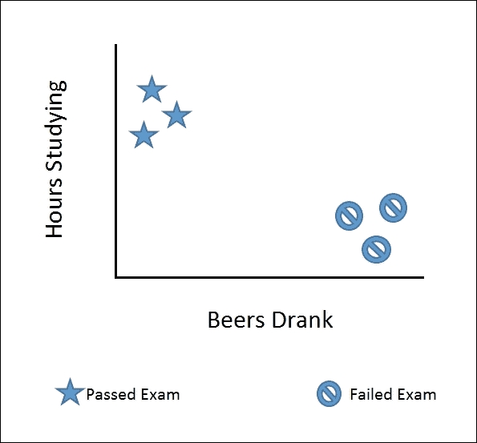
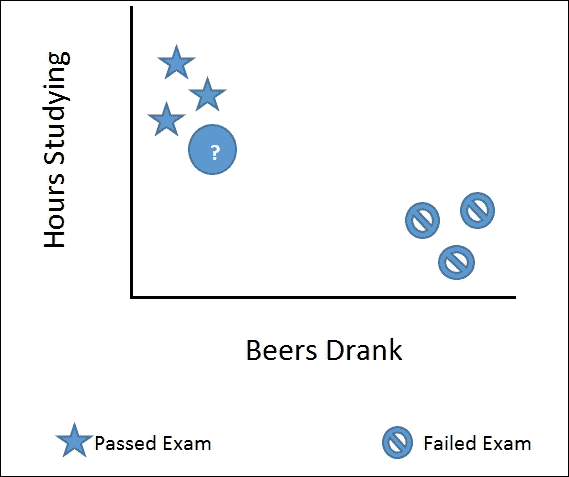
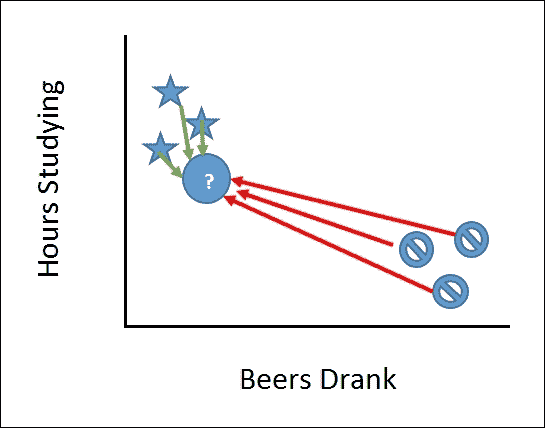
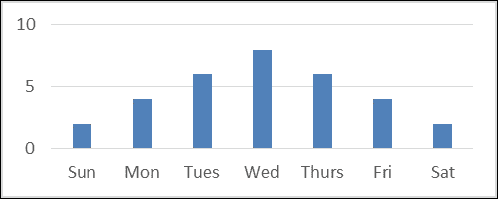
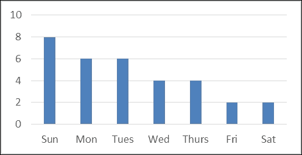

# 第六章。AdventureWorks Redux – k-NN and Naïve Bayes Classifiers

让我们回到 AdventureWorks，重新戴上我们的软件工程师帽子。在你成功实施了一个模型来提高向个人客户销售高利润自行车后的几周，CEO 来到你的办公桌前说：“你能帮助我们解决一个问题吗？如果你不知道，我们最初是一家只卖自行车的公司。然后在 2013 年 5 月，我们增加了我们的产品线。尽管一开始进展顺利，但我们似乎已经达到了顶峰。我们想在这个领域再努力一些。通过一些基本的 PowerBI 报告，我们看到购买自行车的客户中有 86%到 88%在购买时也购买了额外的商品。”

| 年月 | 交叉 | 独立 | 总计 | %交叉 |
| --- | --- | --- | --- | --- |
| **201305** | 25 | 295 | 320 | 7.8% |
| **201306** | 429 | 69 | 498 | 86.1% |
| **201307** | 441 | 56 | 497 | 88.7% |
| **201308** | 525 | 83 | 608 | 86.3% |
| **201309** | 536 | 68 | 604 | 88.7% |
| **201310** | 649 | 100 | 749 | 86.6% |
| **201311** | 868 | 136 | 1,004 | 86.5% |
| **201312** | 698 | 99 | 797 | 87.6% |
| **201401** | 800 | 97 | 897 | 89.2% |
| **201402** | 702 | 96 | 798 | 88.0% |
| **201403** | 891 | 135 | 1,026 | 86.8% |
| **201404** | 965 | 121 | 1,086 | 88.9% |
| **201405** | 1,034 | 152 | 1,186 | 87.2% |
| **总计** | 8,563 | 1,507 | 10,070 | 85.0% |


CEO 继续说：“我们非常希望能够将这个比例提高到 90%以上。我们发起了一项昂贵的营销活动，但它并没有真正推动指针的移动。你能否帮助我们更加专注，并识别那些处于交叉销售机会边缘的客户？”

你回答：“当然可以，”然后立即开始思考如何实施她的指示。也许如果你能识别出那些购买额外商品的客户与那些没有购买额外商品的客户的一些独特特征，就可以实施一个更有针对性的方法来吸引更多人购买额外商品。你立刻想到了分类模型，如**K-Nearest Neighbor**（k-NN）和**朴素贝叶斯**。由于你不确定哪一个可能有效，你决定尝试它们两个。

# k-Nearest Neighbors (k-NN)

k-NN 代表 k-Nearest Neighbors，是可用的最基本分类模型之一。因为“一图胜千言”，让我们从图形的角度来看一下 k-NN。考虑一组在考试前一晚花了一些时间学习和喝酒的学生。在图表上，它看起来像这样：



如果我在图表中添加一个像这样的第七个学生，你会认为这个学生通过了还是失败了考试？



你可能会说他们是一个明星——他们通过了考试。如果我问你为什么，你可能会说他们更像是其他明星。这种心理处理方式非常类似于我们的思维方式——如果你们邻居都买日本车并认为它们质量高，那么如果你在寻找一辆高质量的车，你更有可能也会买一辆。事实上，市场营销中的很大一部分是基于 k-NN 理论的。

与大脑能够轻松建立关联不同，k-NN 实际上使用了一些数学来分类。回到我们的第七个学生，k-NN 会把他们放入通过考试的学生组，因为与其他通过考试的学生相比，他们之间的距离较短，而与未通过考试的学生相比距离较远：



实际上，k-NN 最简单的实现之一就是取该类别所有项目的平均值（平均五小时学习和喝一杯啤酒），然后测量这个距离到新项目。希望现在 k-NN 的名字对你来说有了一定的意义——对于一个给定的新项目 K，它的最近邻是什么？

## k-NN 示例

让我们看看如何使用 **Accord.NET** 来实际操作 k-NN。打开 Visual Studio 并创建一个名为 `Classification` 的新 Visual F# Windows Library 项目：


进入 `Script.fsx` 文件并删除其所有内容。将 `Scipt.fsx` 重命名为 `k-NNAccord.fsx`。打开 **NuGet 包管理器** 控制台并输入以下内容：

```py
PM> install-package Accord.MachineLearning

```

回到你的脚本，输入以下代码：

```py
#r "../packages/Accord.3.0.2/lib/net40/Accord.dll"
#r "../packages/Accord.Math.3.0.2/lib/net40/Accord.Math.dll"
#r "../packages/Accord.MachineLearning.3.0.2/lib/net40/Accord.MachineLearning.dll"

open Accord
open Accord.Math
open Accord.MachineLearning

let inputs = [|[|5.0;1.0|];[|4.5;1.5|];[|5.1;0.75|];[|1.0;3.5|];[|0.5;4.0|];[|1.25;4.0|]|]
let outputs = [|1;1;1;0;0;0|]

let classes = 2
let k = 3
let knn = new KNearestNeighbors(k, classes, inputs, outputs)
```

将这些发送到 REPL，你会看到以下结果：

```py
val inputs : float [] [] =
 [|[|5.0; 1.0|]; [|4.5; 1.5|]; [|5.1; 0.75|]; [|1.0; 3.5|]; [|0.5; 4.0|];
 [|1.25; 4.0|]|]
val outputs : int [] = [|1; 1; 1; 0; 0; 0|]
val classes : int = 2
val k : int = 3
val knn : KNearestNeighbors

```

到现在为止，这段代码应该对你来说已经很熟悉了。输入代表六个学生的两个特征：他们在考试前一晚学习了多少小时以及他们喝了多少啤酒。输出代表他们是否通过了考试：`1`代表通过，`0`代表未通过。班级的值告诉 Accord 有两种类型的值需要考虑。在这种情况下，这些值是学习时间和啤酒消费量。`k` 值告诉 Accord 对于每个类别我们希望使用多少个数据点进行计算。如果我们将其改为 `4`，那么我们就会包括一个未通过考试的学生和三个通过考试的学生（反之亦然），这会稀释我们的结果。

回到脚本中，输入代表第七个学生的以下行：

```py
let input = [|5.0;0.5|]
let output = knn.Compute input
```

当你将其发送到 FSI 时，你会看到学生编号 `7` 很可能通过考试：

```py
val input : float [] = [|5.0; 0.5|]
val output : int = 1

```

如我之前提到的，k-NN 是你可以使用的最基础的机器学习模型之一，但在某些情况下它可以非常强大。对 k-NN 更常见的一种调整是权衡邻居的距离。一个点离邻居越近，这个距离的权重就越大。k-NN 最主要的批评之一是，如果有很多观察值围绕一个点，它可能会过度权衡，因此如果可能的话，拥有一个平衡的数据集是很重要的。

# Naïve Bayes

简单贝叶斯是一种分类模型，试图预测一个实体是否属于一系列预定义的集合。当你将这些集合汇总在一起时，你会有一个相当好的最终结果估计。为了说明，让我们回到我们讨论决策树时使用的网球示例。

对于两周的观察，我们有以下发现：

| 天 | 天气展望 | 温度 | 湿度 | 风 | 打网球？ |
| --- | --- | --- | --- | --- | --- |
| 0 | 晴朗 | 炎热 | 高 | 弱 | 无 |
| 1 | 晴朗 | 炎热 | 高 | 强 | 否 |
| 2 | 阴天 | 炎热 | 高 | 弱 | 是 |
| 3 | 雨 | 温和 | 高 | 弱 | 是 |
| 4 | 雨 | 凉爽 | 正常 | 弱 | 是 |
| 5 | 雨 | 凉爽 | 正常 | 强 | 否 |
| 6 | 阴天 | 凉爽 | 正常 | 强 | 是 |
| 7 | 晴朗 | 温和 | 高 | 弱 | 否 |
| 8 | 晴朗 | 凉爽 | 正常 | 弱 | 是 |
| 9 | 雨 | 温和 | 正常 | 弱 | 是 |
| 10 | 晴朗 | 温和 | 正常 | 强 | 是 |
| 11 | 阴天 | 温和 | 高 | 强 | 是 |
| 12 | 阴天 | 炎热 | 正常 | 弱 | 是 |
| 13 | 雨 | 温和 | 高 | 强 | 否 |

对于每一类，让我们分析他们那天是否打网球，然后为每种可能性计算一个百分比：

| ID | 天气展望 | 是 | 否 | % 是 | % 否 |
| --- | --- | --- | --- | --- | --- |
| 0 | 晴朗 | 2 | 3 | 0.22 | 0.60 |
| 1 | 阴天 | 4 | 0 | 0.44 | 0.00 |
| 2 | 雨 | 3 | 2 | 0.33 | 0.40 |
|   | **总计** | 9 | 5 | 1.00 | 1.00 |
|   |   |   |   |   |   |
| **ID** | **温度** | **是** | **否** | **% 是** | **% 否** |
| 0 | 热 | 2 | 2 | 0.22 | 0.40 |
| 1 | 温和 | 4 | 2 | 0.44 | 0.40 |
| 2 | 凉爽 | 3 | 1 | 0.33 | 0.20 |
|   | **总计** | 9 | 5 | 1.00 | 1.00 |
|   |   |   |   |   |   |
| **ID** | **湿度** | **是** | **否** | **% 是** | **% 否** |
| 0 | 高 | 3 | 4 | 0.33 | 0.80 |
| 1 | 正常 | 6 | 1 | 0.67 | 0.20 |
|   | **总计** | 9 | 5 | 1.00 | 1.00 |
|   |   |   |   |   |   |
| **ID** | **风** | **是** | **否** | **% 是** | **% 否** |
| 0 | 弱 | 6 | 2 | 0.67 | 0.40 |
| 1 | 强 | 3 | 3 | 0.33 | 0.60 |
|   | **总计** | 9 | 5 | 1.00 | 1.00 |
|   |   |   |   |   |   |
| **ID** | **最终** | **是** | **否** | **% 是** | **% 否** |
| 0 | 打 | 9 | 5 | 0.64 | 0.36 |

有这些网格可用时，我们就可以预测一个人在一系列条件下是否会打网球。例如，一个人会在晴朗、凉爽、高湿度和大风的日子里打网球吗？我们可以从每个网格中提取百分比：

|   |   | 是 | 否 |
| --- | --- | --- | --- | --- | --- |
| **天气展望** | 晴朗 | 0.222 | 0.600 |
| **温度** | 凉爽 | 0.333 | 0.200 |
| **湿度** | 高 | 0.333 | 0.800 |
| **风** | 强 | 0.333 | 0.600 |
|   | **最终** | 0.643 | 0.357 |

然后，可以将每个可能性的值相乘：

+   是的概率 = 0.222 * 0.333 * 0.333 * 0.333 * 0.643 = 0.005

+   否的概率 = 0.600 * 0.200 * 0.800 * 0.600 * 0.357 = 0.021

你可以看到不打球的比例高于打球的比例。我们还可以将这两个百分比进行比较，如下所示：

*0.005 + 0.021 = 0.026*

*0.005/0.026 = 0.205 和 0.021/0.026 = 0.795*

打网球的可能性大约有 20%，而不打的可能性有 80%。

## 朴素贝叶斯在行动

让我们看看 Accord.NET 是如何计算朴素贝叶斯模型的。转到 Visual Studio 并添加一个名为`NaiveBayesAccord.fsx`的新脚本文件：

在那个脚本中，添加以下代码：

```py
#r "../packages/Accord.3.0.2/lib/net40/Accord.dll"
#r "../packages/Accord.Math.3.0.2/lib/net40/Accord.Math.dll"
#r "../packages/Accord.Statistics.3.0.2/lib/net40/Accord.Statistics.dll"
#r "../packages/Accord.MachineLearning.3.0.2/lib/net40/Accord.MachineLearning.dll"

open Accord
open Accord.Math
open Accord.Statistics
open Accord.MachineLearning.Bayes

let inputs = [|[|0;0;0;0|];[|0;0;0;1|];[|1;0;0;0|];
               [|2;1;0;0|];[|2;2;1;0|];[|2;2;1;1|];
               [|1;2;1;1|];[|0;1;0;0|];[|0;2;1;0|];
               [|2;1;1;0|];[|0;2;1;1|];[|1;1;0;1|];
               [|1;0;1;0|];[|2;1;0;1|]|]

let outputs = [|0;0;1;1;1;0;1;0;1;1;1;1;1;0|]

let symbols = [|3;3;2;2|]
```

当你将它们发送到 FSI 时，你会看到以下内容：

```py
val inputs : int [] [] =
 [|[|0; 0; 0; 0|]; [|0; 0; 0; 1|]; [|1; 0; 0; 0|]; [|2; 1; 0; 0|];
 [|2; 2; 1; 0|]; [|2; 2; 1; 1|]; [|1; 2; 1; 1|]; [|0; 1; 0; 0|];
 [|0; 2; 1; 0|]; [|2; 1; 1; 0|]; [|0; 2; 1; 1|]; [|1; 1; 0; 1|];
 [|1; 0; 1; 0|]; [|2; 1; 0; 1|]|]

>

val outputs : int [] = [|0; 0; 1; 1; 1; 0; 1; 0; 1; 1; 1; 1; 1; 0|]

>

val symbols : int [] = [|3; 3; 2; 2|]

```

输入是将值转换为整数。考虑以下示例：

| 展望 | ID |
| --- | --- |
| 晴朗 | 0 |
| 多云 | 1 |
| 雨 | 2 |
|   |   |
| **温度** | **ID** |
| 炎热 | 0 |
| 温和 | 1 |
| 酷 | 2 |
|   |   |
| **湿度** | **ID** |
| 高 | 0 |
| 正常 | 1 |
|   |   |
| **风** | **ID** |
| 弱 | 0 |
| 强 | 1 |

每个数组中的位置是 *[展望;温度;湿度;风]*。

输出结果是结果值转换为整数：

| 打球 | ID |
| --- | --- |
| 否 | 0 |
| 是 | 1 |

符号值是一个数组，它告诉 Accord 每个特征的可能的值的总数。例如，第一个位置是展望，有三个可能的值：(0, 1, 2)。

返回脚本并添加朴素贝叶斯计算： 

```py
let bayes = new Accord.MachineLearning.Bayes.NaiveBayes(4,symbols)
let error = bayes.Estimate(inputs, outputs)
```

将数据发送到 REPL 会得到以下结果：

```py
val bayes : Bayes.NaiveBayes
val error : float = 0.1428571429

```

错误是通过 Accord 重新运行其估计多次并比较实际值与预期值来计算的。解释错误的一个好方法是，数字越低越好，领域决定了实际数字是否“足够好”。例如，14%的错误率对于人类能够进行随机和不可预测行为的社交实验来说是非常好的。相反，对于预测飞机引擎故障，14%的错误率是不可接受的。

最后，让我们看看对晴朗天气、温和温度、正常湿度和弱风的预测。转到脚本并添加以下内容：

```py
let input = [|0;1;1;0|]
let output = bayes.Compute(input)
```

将数据发送到 REPL 会得到以下结果：

```py
val input : int [] = [|0; 1; 1; 0|]
val output : int = 1

```

因此，我们将在那天打网球。

## 使用朴素贝叶斯时需要注意的一件事

20 世纪 50 年代创建的朴素贝叶斯是一种非常有效的分类模型，它经受了时间的考验。事实上，今天许多垃圾邮件过滤器部分仍在使用朴素贝叶斯。使用朴素贝叶斯的最大优点是其简单性和正确性的能力。最大的缺点是关键假设是每个 *x* 变量都是完全且完全独立的。如果 *x* 变量有任何可能存在共线性，朴素贝叶斯就会失效。此外，从历史上看，朴素贝叶斯被应用于高斯分布的数据集——即它遵循钟形曲线。如果你不熟悉钟形曲线，它是一种数据分布，其中大多数观测值发生在中间值，中间两侧的异常值具有大致相同数量的观测值。以下是一个例子：



相反，偏斜分布的观测值最多在一端或另一端：



当您使用朴素贝叶斯时，您必须确保选择的分布与您的数据匹配。现在让我们看看 k-NN 和/或朴素贝叶斯是否可以帮助我们处理 AdventureWorks。

# AdventureWorks

在本节中，我们将利用我们在第五章，“时间暂停 – 获取数据”中获得的知识，提取和转换数据，并应用 k-NN 和朴素贝叶斯机器学习模型。让我们看看这三种方法中是否有任何一种可以帮助我们提高交叉销售。

## 准备数据

进入 Visual Studio 并添加另一个名为`AdventureWorks.fsx`的脚本。打开脚本，删除所有内容，并打开**NuGet 包管理器**控制台。在包管理器中，运行以下行：

```py
PM> Install-Package FSharp.EntityFramework.MicrosoftSqlServer –Pre
PM> Install-Package fslab
PM> Install-Package FSharp.Data.SqlClient
PM> Install-Package Microsoft.SqlServer.Types

```

返回脚本文件并添加以下引用：

```py
#I "../packages"

#r "EntityFramework.Core.7.0.0-rc1-final/lib/net451/EntityFramework.Core.dll"
#r "EntityFramework.MicrosoftSqlServer.7.0.0-rc1-final/lib/net451/EntityFramework.MicrosoftSqlServer.dll"
#r "EntityFramework.Relational.7.0.0-rc1-final/lib/net451/EntityFramework.Relational.dll"
#r "Inflector.1.0.0.0/lib/net45/Inflector.dll"
#r "Microsoft.Extensions.Caching.Abstractions.1.0.0-rc1-final/lib/net451/Microsoft.Extensions.Caching.Abstractions.dll"
#r "Microsoft.Extensions.Caching.Memory.1.0.0-rc1-final/lib/net451/Microsoft.Extensions.Caching.Memory.dll"
#r "Microsoft.Extensions.Configuration.1.0.0-rc1-final/lib/net451/Microsoft.Extensions.Configuration.dll"
#r "Microsoft.Extensions.Configuration.Abstractions.1.0.0-rc1-final/lib/net451/Microsoft.Extensions.Configuration.Abstractions.dll"
#r "Microsoft.Extensions.Configuration.Binder.1.0.0-rc1-final/lib/net451/Microsoft.Extensions.Configuration.Binder.dll"
#r "Microsoft.Extensions.DependencyInjection.1.0.0-rc1-final/lib/net451/Microsoft.Extensions.DependencyInjection.dll"
#r "Microsoft.Extensions.Logging.1.0.0-rc1-final/lib/net451/Microsoft.Extensions.Logging.dll"
#r "Microsoft.Extensions.Logging.Abstractions.1.0.0-rc1-final/lib/net451/Microsoft.Extensions.Logging.Abstractions.dll"
#r "Microsoft.Extensions.OptionsModel.1.0.0-rc1-final/lib/net451/Microsoft.Extensions.OptionsModel.dll"
#r "Microsoft.Extensions.Primitives.1.0.0-rc1-final/lib/net451/Microsoft.Extensions.Primitives.dll"
#r "Remotion.Linq.2.0.1/lib/net45/Remotion.Linq.dll"
#r "System.Collections.Immutable.1.1.36/lib/portable-net45+win8+wp8+wpa81/System.Collections.Immutable.dll"
#r "System.Diagnostics.DiagnosticSource.4.0.0-beta-23516/lib/dotnet5.2/System.Diagnostics.DiagnosticSource.dll"
#r "System.Xml.Linq.dll"
#r "Ix-Async.1.2.5/lib/net45/System.Interactive.Async.dll"
#r "FSharp.EntityFramework.MicrosoftSqlServer.0.0.2.0-alpha/lib/net451/FSharp.EntityFramework.MicrosoftSqlServer.dll"

#r "../packages/Microsoft.Extensions.DependencyInjection.Abstractions.1.0.0-rc1-final/lib/net451/Microsoft.Extensions.DependencyInjection.Abstractions.dll"
#r "../packages/FSharp.Data.SqlClient.1.7.7/lib/net40/FSharp.Data.SqlClient.dll"
#r "../packages/Microsoft.SqlServer.Types.11.0.2/lib/net20/Microsoft.SqlServer.Types.dll"
#r "../packages/FSharp.Data.2.2.5/lib/net40/FSharp.Data.dll"

#r "../packages/Accord.3.0.2/lib/net40/Accord.dll"
#r "../packages/Accord.Math.3.0.2/lib/net40/Accord.Math.dll"
#r "../packages/Accord.MachineLearning.3.0.2/lib/net40/Accord.MachineLearning.dll"
#r "../packages/Accord.Statistics.3.0.2/lib/net40/Accord.Statistics.dll"

open System
open FSharp.Data
open FSharp.Data.Entity
open Microsoft.Data.Entity

open Accord
open Accord.Math
open Accord.Statistics
open Accord.MachineLearning
open Accord.Statistics.Filters
open Accord.Statistics.Analysis
open Accord.MachineLearning.Bayes
open Accord.Statistics.Models.Regression
open Accord.Statistics.Models.Regression.Fitting
```

接着添加以下代码行：

```py
[<Literal>]
let connectionString = "data source=nc54a9m5kk.database.windows.net;initial catalog=AdventureWorks2014;user id=PacktReader;password=P@cktM@chine1e@rning;"
type AdventureWorks = SqlServer<connectionString, Pluralize = true>
let context = new AdventureWorks()
```

如果您还记得第五章，“时间暂停 – 获取数据”，这是创建我们的类型提供者以从数据库中提取数据。将到目前为止的所有内容发送到 REPL 以查看以下结果：

```py
 nested type Sales.SalesTerritoryHistory
 nested type Sales.ShoppingCartItem
 nested type Sales.SpecialOffer
 nested type Sales.SpecialOfferProduct
 nested type Sales.Store
 nested type dbo.AWBuildVersion
 nested type dbo.DatabaseLog
 nested type dbo.ErrorLog
 end
val context : AdventureWorks

```

返回脚本并添加以下内容：

```py
let (|=|) id a = Array.contains id a
let productSubcategories = [|new System.Nullable<int>(1); new System.Nullable<int>(2); new System.Nullable<int>(3)|]
```

将此发送到 FSI 得到以下结果：

```py
val ( |=| ) : id:'a -> a:'a [] -> bool when 'a : equality
val productSubcategories : Nullable<int> [] = [|1; 2; 3|]

```

这也是从第五章，“时间暂停 – 获取数据”中来的；我们正在重写`in`运算符以处理数据库中的空值。

返回脚本并添加以下代码：

```py
let orderCustomers = 
    query { for soh in context.``Sales.SalesOrderHeaders`` do
            join sod in context.``Sales.SalesOrderDetails`` on (soh.SalesOrderID = sod.SalesOrderID)
            join p in context.``Production.Products`` on (sod.ProductID = p.ProductID)
            join c in context.``Sales.Customers`` on (soh.CustomerID = c.CustomerID)
            where (soh.OrderDate > DateTime(2013,5,1) && p.ProductSubcategoryID |=| productSubcategories && c.StoreID  = System.Nullable<int>())
            select(soh.SalesOrderID,c.CustomerID)} |> Seq.toArray
```

将此发送到 REPL，我们得到：

```py
val orderCustomers : (int * int) [] =
 [|(50788, 27575); (50789, 13553); (50790, 21509); (50791, 15969);
 (50792, 15972); (50793, 14457); (50794, 27488); (50795, 27489);
 (50796, 27490); (50797, 17964); (50798, 17900); (50799, 21016);
 (50800, 11590); (50801, 15989); (50802, 14494); (50803, 15789);
 (50804, 24466); (50805, 14471); (50806, 17980); (50807, 11433);
 (50808, 115

```

尽管我们之前没有见过这段代码，但我们见过与之非常相似的代码。在这个块中，我们正在创建一个计算表达式。我们将`SalesOrderHeader`、`SalesOrderDetail`、`Products`和`Customer`表连接起来，以便我们只选择对这次分析感兴趣的记录。这将是：2013 年 5 月 1 日之后所有针对个人客户的自行车销售。请注意，我们正在以元组的形式返回两个整数：`SalesOrderId`和`CustomerId`。

返回脚本并添加以下代码块：

```py
let salesOrderIds = orderCustomers |> Array.distinctBy(fun (soid,coid) -> soid)
                                   |> Array.map(fun (soid,cid) -> soid)
```

将此发送到 FSI，我们得到以下结果：

```py
val salesOrderIds : int [] =
 [|50788; 50789; 50790; 50791; 50792; 50793; 50794; 50795; 50796; 50797;
 50798; 50799; 50800; 50801; 50802; 50803; 50804; 50805; 50806; 50807;
 50808; 50809

```

如您可能已经注意到的，这创建了一个唯一的`CustomerIds`数组。由于一个客户可能购买了两辆自行车，他们可能有两个`SalesOrderIds`，因此我们需要调用`distinctBy`高阶函数。

返回脚本并输入以下内容：

```py
let orderDetailCounts = 
    query { for soh in context.``Sales.SalesOrderHeaders`` do
            join sod in context.``Sales.SalesOrderDetails`` on (soh.SalesOrderID = sod.SalesOrderID)
            join p in context.``Production.Products`` on (sod.ProductID = p.ProductID)
            join c in context.``Sales.Customers`` on (soh.CustomerID = c.CustomerID)
            where (sod.SalesOrderID |=| salesOrderIds)
            select(sod.SalesOrderID, sod.SalesOrderDetailID)} 
            |> Seq.countBy(fun (soid, sodid) -> soid)
            |> Seq.toArray
```

将此发送到 FSI 以获取以下结果（这可能需要几秒钟）：

```py
val orderDetailCounts : (int * int) [] =
 [|(50788, 1); (50789, 1); (50790, 1); (50791, 1); (50792, 1); (50793, 1);
 (50794, 1); (50795, 1); (50796, 1); (50797, 1); (50798, 1); (50799, 1);
 (50800, 1); (50801, 1); (50802, 1); (50803, 1); (50804, 1); (50805, 1);
 (50806, 1); (50807

```

这是一个与第一个类似的查询。这里我们将相同的四个表连接起来，然后选择我们已识别的客户的`SalesOrderId`和`SalesOrderDetailId`。然后我们应用`countBy`高阶函数来计算每个订单的所有细节。如果只有一个`OrderDetailId`，那么只购买了自行车。如果有多个，那么客户还购买了其他物品。

我们现在必须获取特定客户的详细信息。由于数据库处于第三范式，这些细节散布在许多表中。我们不如使用数据库中已经创建的内置视图：`vIndividualCustomer`。

但问题是，EF 类型提供程序在撰写本文时无法处理视图。这个问题的答案是另一个类型提供程序。

返回到脚本并输入以下内容：

```py
[<Literal>]
let commandText = "Select * from [Sales].[vIndividualCustomer]"
let command = new SqlCommandProvider<commandText,connectionString>()
let output = command.Execute() 
let customers = output |> Seq.toArray
```

将此发送到 REPL，你可以看到以下结果：

```py
val commandText : string = "Select * from [Sales].[vIndividualCustomer]"
val command : SqlCommandProvider<...>
val output : Collections.Generic.IEnumerable<SqlCommandProvider<...>.Record>
val customers : SqlCommandProvider<...>.Record [] =
 [|{ BusinessEntityID = 9196; Title = None; FirstName = "Calvin"; MiddleName = Some "A"; LastName = "Raji"; Suffix = None; PhoneNumber = Some "230-555-0191"; PhoneNumberType = Some "Cell"; EmailAddress = Some "calvin20@adventure-works.com"; EmailPromotion = 2; AddressType = "Shipping"; AddressLine1 = "5415 San Gabriel Dr."; AddressLine2 = None; City = "Bothell"; StateProvinceName = "Washington"; PostalCode = "98011"; CountryRegionName = "United States"; Demographics = Some
 "<IndividualSurvey ><TotalPurchaseYTD>-13.5</TotalPurchaseYTD><DateFirstPurchase>2003-02-06Z</DateFirstPurchase><BirthDate>1963-06-14Z</BirthDate><MaritalStatus>M</MaritalStatus><YearlyIncome>50001-75000</YearlyIncome><Gender>M</Gender><TotalChildren>4</TotalChildren><NumberChildrenAtHome>2</NumberChildrenAtHome><Education>Bachelors </Education><Occupation>Professional</Occupation><HomeOwnerFlag>1</HomeOwnerFlag><NumberCarsOwned>2</NumberCarsOwned><CommuteDistance>2-5 Miles</CommuteDistance></IndividualSurvey>" };
 { BusinessEntityID

```

每条记录都是一个怪物！看起来数据库有一个名为`IndividualSurvey`的字段，其中包含一些客户在调查中收集的数据。有趣的是，他们决定将其存储为 XML。我认为这证明了这样一个公理：如果给定了数据类型，开发者会使用它，无论它是否有意义。无论如何，我们如何解析这个 XML？我会给你一个提示：它与*hype divider*押韵。没错，就是 XML 类型提供程序。返回到脚本并添加以下代码：

```py
[<Literal>]
let sampleXml = """<IndividualSurvey ><TotalPurchaseYTD>-13.5</TotalPurchaseYTD><DateFirstPurchase>2003-02-06Z</DateFirstPurchase><BirthDate>1963-06-14Z</BirthDate><MaritalStatus>M</MaritalStatus><YearlyIncome>50001-75000</YearlyIncome><Gender>M</Gender><TotalChildren>4</TotalChildren><NumberChildrenAtHome>2</NumberChildrenAtHome><Education>Bachelors </Education><Occupation>Professional</Occupation><HomeOwnerFlag>1</HomeOwnerFlag><NumberCarsOwned>2</NumberCarsOwned><CommuteDistance>2-5 Miles</CommuteDistance></IndividualSurvey>"""
#r "System.Xml.Linq.dll"
type IndividualSurvey = XmlProvider<sampleXml>

let getIndividualSurvey (demographic:Option<string>) =
    match demographic.IsSome with
    | true -> Some (IndividualSurvey.Parse(demographic.Value))
    | false -> None
```

将此发送到 REPL，我们得到以下结果：

```py
type IndividualSurvey = XmlProvider<...>
val getIndividualSurvey :
 demographic:Option<string> -> XmlProvider<...>.IndividualSurvey option

```

XML 类型提供程序使用一个代表性样本来生成类型。在这种情况下，`sampleXML`被用来生成类型。有了这个类型提供程序为我们处理解析 XML 的重活，我们现在可以为每个`CustomerId`及其人口统计信息创建一个易于使用的格式的数据结构。

返回到脚本并输入以下内容：

```py
let customerDemos = customers |> Array.map(fun c -> c.BusinessEntityID,getIndividualSurvey(c.Demographics))
                              |> Array.filter(fun (id,s) -> s.IsSome)
                              |> Array.map(fun (id,s) -> id, s.Value)
                              |> Array.distinctBy(fun (id,s) -> id)
```

将此发送到 FSI，我们得到以下结果：

```py
</IndividualSurvey>);
 (2455,
 <IndividualSurvey >
 <TotalPurchaseYTD>26.24</TotalPurchaseYTD>
 <DateFirstPurchase>2004-01-24Z</DateFirstPurchase>
 <BirthDate>1953-04-10Z</BirthDate>
 <MaritalStatus>M</MaritalStatus>
 <YearlyIncome>25001-50000</YearlyIncome>
 <Gender>F</Gender>
 <TotalChildren>2</TotalChildren>
 <NumberChildrenAtHome>0</NumberChildrenAtHome>
 <Education>Bachelors </Education>
 <Occupation>Management</Occupation>
 <HomeOwnerFlag>1</HomeOwnerFlag>
 <NumberCarsOwned>1</NumberCarsOwned>
 <CommuteDistance>5-10 Miles</CommuteDistance>
</IndividualSurvey>);
 ...|]

```

这里没有太多新的代码。由于我们必须考虑那些没有记录人口统计信息的客户，我们正在使用`Option`类型。如果有人口统计信息，则返回一个包含值的`Some`。如果没有，则返回`None`。然后我们过滤这些信息，只给我们带有人口记录的客户，并调用`distinct`以确保每个客户只有一个记录。

在客户人口统计信息准备就绪后，我们现在可以构建一个包含我们所需所有信息的最终数据框。返回到脚本文件并输入以下内容：

```py
let getDemoForCustomer customerId =
    let exists = Array.exists(fun (id,d) -> id = customerId) customerDemos
    match exists with
    | true -> Some (customerDemos 
                    |> Array.find(fun (id,d) -> id = customerId)
                    |> snd)
    | false -> None 

let orderCustomerDemo = 
    orderCustomers 
    |> Array.map(fun oc -> oc, getDemoForCustomer(snd oc))
                               |> Array.map(fun (oc,d) -> fst oc, snd oc, d)
                               |> Array.filter(fun (oid,cid,d) -> d.IsSome)
                               |> Array.map(fun (oid,cid,d) -> oid,cid,d.Value) 
```

将此发送到 FSI，你可以看到以下结果：

```py
</IndividualSurvey>);
 (50949, 19070,
 <IndividualSurvey >
 <TotalPurchaseYTD>27.7</TotalPurchaseYTD>
 <DateFirstPurchase>2003-08-20Z</DateFirstPurchase>
 <BirthDate>1966-07-08Z</BirthDate>
 <MaritalStatus>S</MaritalStatus>
 <YearlyIncome>greater than 100000</YearlyIncome>
 <Gender>F</Gender>
 <TotalChildren>2</TotalChildren>
 <NumberChildrenAtHome>2</NumberChildrenAtHome>
 <Education>Bachelors </Education>
 <Occupation>Management</Occupation>
 <HomeOwnerFlag>0</HomeOwnerFlag>
 <NumberCarsOwned>4</NumberCarsOwned>
 <CommuteDistance>0-1 Miles</CommuteDistance>
</IndividualSurvey>);
 ...|]

```

我们现在有一个包含三个元素的元组：`OrderId`、`CustomerId`以及人口统计信息。请注意，输出仍然显示人口统计信息为 XML，尽管我们将在下一秒看到，这些元素实际上是人口类型的一部分。

进入脚本文件并输入以下内容：

```py
let getMultiOrderIndForOrderId orderId =
    orderDetailCounts 
    |> Array.find(fun (oid,c) -> oid = orderId)
    |> snd > 1

let orders = 
    orderCustomerDemo 
    |> Array.map(fun (oid,cid,d) -> oid, getMultiOrderIndForOrderId(oid), d)
```

将此发送到 REPL，我们得到以下结果：

```py
 (50949, false,
 <IndividualSurvey >
 <TotalPurchaseYTD>27.7</TotalPurchaseYTD>
 <DateFirstPurchase>2003-08-20Z</DateFirstPurchase>
 <BirthDate>1966-07-08Z</BirthDate>
 <MaritalStatus>S</MaritalStatus>
 <YearlyIncome>greater than 100000</YearlyIncome>
 <Gender>F</Gender>
 <TotalChildren>2</TotalChildren>
 <NumberChildrenAtHome>2</NumberChildrenAtHome>
 <Education>Bachelors </Education>
 <Occupation>Management</Occupation>
 <HomeOwnerFlag>0</HomeOwnerFlag>
 <NumberCarsOwned>4</NumberCarsOwned>
 <CommuteDistance>0-1 Miles</CommuteDistance>
</IndividualSurvey>);
 ...|]

```

`getMultiOrderIndForOrderId` 是一个函数，它接受 `orderId` 并在 `orderDetailsCounts` 数据帧中查找记录。如果有多个，则返回 `true`。如果只有一个订单（只有自行车），则返回 `false`。

使用这个函数，我们可以创建一个包含 `orderId`、`multiOrderind` 和人口统计信息的元组。我认为我们准备好开始建模了！在我们开始之前，我们需要问自己一个问题：我们想使用哪些值？`y` 变量很明确——`multiOrderInd`。但我们在模型中作为 `x` 变量插入哪个人口统计值呢？由于我们想要根据模型结果调整我们的网站，我们可能需要可以在网站上使用的变量。如果用户通过 Facebook 或 Google 账户登录我们的网站，那么这些账户将准确填写相关信息，并且用户同意我们的网站访问这些信息，那么这些特征（如 `BirthDate`）是可用的。这些都是很大的 `ifs`。或者，我们可能能够使用广告商放置在用户设备上的 cookie 进行推断分析，但这也是一个依赖于所使用特征的粗略度量。最好假设将输入到模型中的任何信息都将被准确自我报告，并让用户有动力准确自我报告。这意味着教育、年收入和其他敏感措施都不适用。让我们看看性别和婚姻状况，如果我们正确询问，我们应该能够从用户那里得到这些信息。因此，我们的模型将是 `MultiOrder = Gender + MartialStatus + E`。

返回到脚本并输入以下内容：

```py
let getValuesForMartialStatus martialStatus =
    match martialStatus with
    | "S" -> 0.0
    | _ -> 1.0

let getValuesForGender gender =
    match gender with
    | "M" -> 0.0
    | _ -> 1.0

let getValuesForMultiPurchaseInd multiPurchaseInd =
    match multiPurchaseInd with
    | true -> 1
    | false -> 0
```

将此发送到 REPL，我们看到以下结果：

```py
val getValuesForMartialStatus : martialStatus:string -> float
val getValuesForGender : gender:string -> float
val getValuesForMultiPurchaseInd : multiPurchaseInd:bool -> int

```

由于 Accord 处理输入 `float` 值和输出 `int` 值，我们需要一个函数将我们的属性特征（目前是字符串）转换为这些类型。如果你想确保我们涵盖了所有情况，你也可以将此发送到 FSI：

```py
orders |> Array.distinctBy(fun (oid,ind,d) -> d.Gender)
       |> Array.map(fun (oid,ind,d) -> d.Gender)
//val it : string [] = [|"M"; "F"|]

orders |> Array.distinctBy(fun (oid,ind,d) -> d.MaritalStatus)
       |> Array.map(fun (oid,ind,d) -> d.MaritalStatus)
//val it : string [] = [|"M"; "S"|]
```

`getValues` 函数的编写方式有一个风险。如果你还记得上一章，处理缺失值在进行任何类型的建模时都是一个持续关注的问题。这些函数通过避开这个问题来处理 null 问题。考虑 `getValuesForGender` 函数：

```py
let getValuesForGender gender =
    match gender with
    | "M" -> 0.0
    | _ -> 1.0
```

如果性别代码为 `UNK`、`YOMAMA`、null 或任何其他字符串，它将被分配为女性代码。这意味着我们可能会高报模型中女性的数量。由于这个数据集中每个记录都有 `M` 或 `F` 的值，我们可以这样处理，但如果它们没有，我们就需要一种处理错误值的方法。在这种情况下，我会创建一些像这样的代码：

```py
let mutable lastGender = "M"
let getValuesForGender gender =
    match gender, lastGender with
    | "M",_ -> 0.0
    | "F",_ -> 1.0
    | _,"M" -> lastGender = "F"
               1.0
    | _,_ -> lastGender = "M"
             0.0
```

这将在男性和女性之间平衡推断值。无论如何，让我们开始建模。

## k-NN 和 AdventureWorks 数据

返回到脚本并输入以下内容：

```py
let inputs = orders |> Array.map(fun (oid,ind,d) -> [|getValuesForMartialStatus(d.MaritalStatus);getValuesForGender(d.Gender)|])
let outputs = orders |> Array.map(fun (oid,ind,d) -> getValuesForMultiPurchaseInd(ind))

let classes = 2
let k = 3
let knn = new KNearestNeighbors(k, classes, inputs, outputs)
```

将此发送到 REPL，我们得到以下结果：

```py
 ...|]
val classes : int = 2
val k : int = 3
val knn : KNearestNeighbors

```

现在我们已经设置了模型，让我们传递四个可能的场景。转到脚本并输入以下内容：

```py
knn.Compute([|0.0;0.0|])
knn.Compute([|1.0;0.0|])
knn.Compute([|0.0;1.0|])
knn.Compute([|1.0;1.0|])
```

将此发送到 FSI，我们得到以下内容：

```py
> 
val it : int = 1
> 
val it : int = 1
> 
val it : int = 0
> 
val it : int = 1

```

所以看起来单身女性并没有购买多个商品。

## 朴素贝叶斯和 AdventureWorks 数据

返回脚本并输入以下内容：

```py
let inputs' = orders |> Array.map(fun (oid,ind,d) -> [|int(getValuesForMartialStatus(d.MaritalStatus)); 
                                                       int(getValuesForGender(d.Gender));|])
let outputs' = orders |> Array.map(fun (oid,ind,d) -> getValuesForMultiPurchaseInd(ind))

let symbols = [|2;2|]

let bayes = new Accord.MachineLearning.Bayes.NaiveBayes(2,symbols)
let error = bayes.Estimate(inputs', outputs')
```

将其发送到 FSI，我们得到以下内容：

```py
 ...|]
val symbols : int [] = [|2; 2|]
val bayes : NaiveBayes
val error : float = 0.148738812

```

因此，我们有一个 15%错误的朴素贝叶斯模型。不太好，但让我们继续前进。在脚本文件中输入相同的四个选项用于`gender`/`martialStatus`：

```py
bayes.Compute([|0;0|])
bayes.Compute([|1;0|])
bayes.Compute([|0;1|])
bayes.Compute([|1;1|])
```

当你将其发送到 REPL 时，你会得到以下内容：

```py
val it : int = 1
> 
val it : int = 1
> 
val it : int = 1
> 
val it : int = 1
>

```

Rut Row Raggy。看起来我们遇到了问题。事实上，我们确实遇到了。如果你还记得之前关于使用朴素贝叶斯模型的描述，它需要值沿着钟形曲线分布才能有效。90%的自行车购买有交叉销售——这意味着我们严重倾斜。无论你对模型进行何种调整，都无法改变你将`multiPurchase`的值乘以 0.9 的事实。

# 利用我们的发现

我们应该怎么做？我们有 k-NN 告诉我们单身女性不会购买额外商品，而朴素贝叶斯则完全无助于我们。我们可以尝试更多的分类模型，但让我们假设我们对分析感到足够满意，并希望使用这个模型投入生产。我们应该怎么做？一个需要考虑的关键问题是，模型基于我们数据库表中的一些静态数据，这些数据不是通过公司的正常交易进行更新的。这意味着我们实际上不需要频繁地重新训练模型。我们遇到的另一个问题是，我们需要确定订购我们自行车的客户的性别和婚姻状况。也许我们提出的问题是错误的。不是询问如何获取用户的性别和婚姻状况，如果我们已经知道了会怎样？你可能认为我们不知道，因为我们还没有询问。但我们可以——基于用户选择的自行车！

## 准备数据

返回脚本并输入以下代码块：

```py
let customerProduct = 
    query { for soh in context.``Sales.SalesOrderHeaders`` do
            join sod in context.``Sales.SalesOrderDetails`` on (soh.SalesOrderID = sod.SalesOrderID)
            join p in context.``Production.Products`` on (sod.ProductID = p.ProductID)
            join c in context.``Sales.Customers`` on (soh.CustomerID = c.CustomerID)
            where (sod.SalesOrderID |=| salesOrderIds)
            select(c.CustomerID, sod.ProductID)} 
    |> Seq.toArray
```

将此发送到 REPL，我们看到以下内容：

```py
val customerProduct : (int * int) [] =
 [|(27575, 780); (13553, 779); (21509, 759); (15969, 769); (15972, 760);
 (14457, 798); (27488, 763); (27489, 761); (27490, 770); (17964, 793);
 (17900,

```

希望现在这段代码对你来说已经显得相当无聊了。它正在从所有自行车销售中创建一个由`customerId`和`ProductId`组成的元组。

返回脚本并输入以下内容：

```py
let getProductId customerId =
    customerProduct |> Array.find(fun (cid,pid) -> cid = customerId)
                    |> snd

let getSingleFemaleInd (martialStatus:string, gender:string) =
    match martialStatus, gender with
    | "S", "F" -> 1
    | _, _ -> 0

let customerDemo = orderCustomerDemo |> Array.map(fun (oid,cid,d) -> cid, getSingleFemaleInd(d.MaritalStatus, d.Gender))
                                     |> Array.map(fun (cid,sfInd) -> cid, getProductId(cid),sfInd)
```

将此发送到 REPL，我们可以看到以下内容：

```py
val getProductId : customerId:int -> int
val getSingleFemaleInd : martialStatus:string * gender:string -> int
val customerDemo : (int * int * int) [] =
 |(13553, 779, 0); (15969, 769, 0); (15972, 760, 0); (14457, 798, 0);
 (17964, 793, 0);

```

此代码块正在为 Accord 调整我们的数据，创建一个由`customerId`、`productId`和`singleFemaleInd`组成的元组框架。我们几乎准备好将此数据投向模型，但我们仍然需要确定我们想要使用哪个模型。我们试图确定客户购买自行车的概率，以确定客户是否为单身女性。这似乎是一个非常适合逻辑回归的问题（[第三章，*更多 AdventureWorks 回归*）。问题是，每辆自行车都需要成为这个回归中的一个特征：

*singleFemale = BikeId0 + BikeId1 + BikeId2 + BikeIdN + E*

如果你将此代码放入脚本中并发送到 FSI，你会看到我们有 80 个不同的自行车 ID：

```py
let numberOfBikeIds = customerDemo |> Array.map (fun (cid,pid,sfInd) -> pid)
 |> Array.distinct
 |> Array.length
val numberOfBikeIds : int = 80

```

那么，我们如何从原始数据框中创建 80 个特征作为输入呢？当然不是手动创建。让我们看看 Accord 是否能帮我们。

## 扩展特征

打开上一节中使用的脚本，并输入以下内容：

```py
let inputs'' = customerDemo |> Array.map(fun (cid,pid,sfInd) -> pid)
let outputs'' = customerDemo |> Array.map(fun (cid,pid,sfInd) -> (float)sfInd)

let expandedInputs = Tools.Expand(inputs'')
```

将此发送到 REPL，我们看到以下内容：

```py
val expandedInputs : float [] [] =
 |[|0.0; 0.0; 0.0; 0.0; 0.0; 0.0; 0.0; 0.0; 0.0; 0.0; 0.0; 0.0; 0.0; 0.0;
 0.0; 0.0; 0.0; 0.0; 0.0; 0.0; 0.0; 0.0; 0.0; 0.0; 0.0; 0.0; 0.0; 0.0;
 0.0; 0.0

```

我们所做的是从 `customerDemo` 数据框中选择 `productId`。然后我们将该数组发送到 Accord 的 `Tools.Expand` 方法，该方法将数组展开，使每个值都成为其自身的特征。从图形上看，它看起来像这样：

![扩展特征

如您在阅读第五章后所猜想的，“休息时间 – 获取数据”，这被认为是一个稀疏数据框。输入和输出准备就绪后，回到脚本文件并输入以下内容：

```py
let analysis = new LogisticRegressionAnalysis(expandedInputs, outputs'')
analysis.Compute() |> ignore
let pValue = analysis.ChiSquare.PValue
let coefficients = analysis.CoefficientValues
let coefficients' = coefficients |> Array.mapi(fun i c -> i,c)
                                 |> Array.filter(fun (i,c) -> c > 5.0)
```

在你将此发送到 REPL 之前，让我提醒你。我们之所以识别出稀疏数据框，是因为在 80 个特征上进行回归计算需要一段时间。所以按 *ALT* + *ENTER* 并去喝杯咖啡。从星巴克。在镇上。最终，你会得到这个：

```py
val analysis : Analysis.LogisticRegressionAnalysis
> 
val it : unit = ()
> 
val pValue : float = 1.0
val coefficients : float [] =
 [|-3.625805913; 1.845275228e-10; 7.336791927e-11; 1.184805489e-10;
 -8.762459325e-11; -2.16833771e-10; -7.952785344e-12; 1.992174635e-10;
 2.562929393e-11; -2.957572867e-11; 2.060678611e-10; -2.103176298e-11;
 -2.3

```

当我们在系数表中过滤时，我们可以看到有一个自行车模型受到单身女性的青睐。将此添加到您的脚本文件中，并发送到 FSI：

```py
let coefficients' = coefficients |> Array.mapi(fun i c -> i,c)
 |> Array.filter(fun (i,c) -> c > 5.0)

val coefficients' : (int * float) [] = [|(765, 15.85774698)|]

>

```

因此，也许当一个人购买编号为 `765` 的商品时，我们试图通过优惠券或一个非常酷的网站体验来激励他们购买其他产品。这正是优秀用户体验人员和知识渊博的市场人员可以发挥作用的领域。由于我既不是用户体验人员也不是市场人员，我将把这个练习留给读者。

# 摘要

在本章中，我们探讨了两种常见的机器学习分类器：k-最近邻和朴素贝叶斯。我们使用 AdventureWorks 数据集对它们进行了实际操作，以查看我们是否可以增加交叉销售。我们发现 k-NN 有一些有限的成功，而朴素贝叶斯则没有用。然后我们使用我们老朋友逻辑回归来帮助我们缩小可以用于促进交叉销售的特定自行车模型。最后，我们考虑到数据是临时的，我们无法在我们的网站上实施任何实时训练。我们希望定期运行此分析，以查看我们的原始发现是否仍然成立。

在下一章中，我们将摘下软件工程师的帽子，戴上数据科学家的帽子，看看我们是否可以对那些交通拦截数据做些什么。我们将考虑使用另一个数据集来增强原始数据集，然后使用几个聚类模型：k-均值和 PCA。下一页见！
