# 第七章。交通拦截和事故地点 – 当两个数据集比一个更好

如果你还记得第四章，*交通拦截 – 是否走错了路？*，我们使用决策树来帮助我们根据诸如一天中的时间、一周中的哪一天等季节性因素来确定一个人是否收到了罚单或警告。最终，我们没有找到任何关系。你的第一个想法可能是丢弃数据集，我认为这是一个错误，因为其中可能隐藏着数据宝藏，但我们只是使用了错误的模型。此外，如果一个数据集本身不盈利，我通常开始用其他数据集来增强它，看看特征组合是否能提供更令人满意的答案。在本章中，让我们回到我们的 Code-4-Good 小组，看看我们是否可以增强交通拦截数据集，并应用一些不同的模型，这些模型将帮助我们提出有趣的问题和答案。也许即使我们没有提出正确的问题，计算机也能帮助我们提出正确的问题。

# 无监督学习

到目前为止，本书我们已经使用了几种不同的模型来回答我们的问题：线性回归、逻辑回归和 kNN 等。尽管它们的方法不同，但它们有一个共同点；我们告诉计算机答案（称为因变量或*y*变量），然后提供一系列可以与该答案关联的特征（称为自变量或*x*变量）。以下图为例：

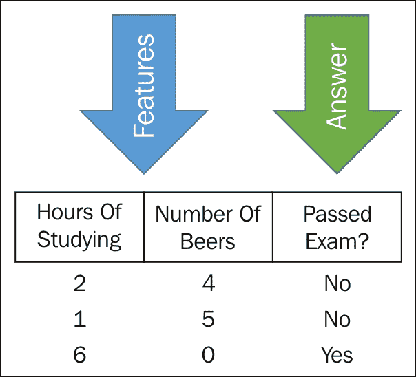

我们随后向计算机展示了一些它之前未曾见过的独立变量的组合，并要求它猜测答案：

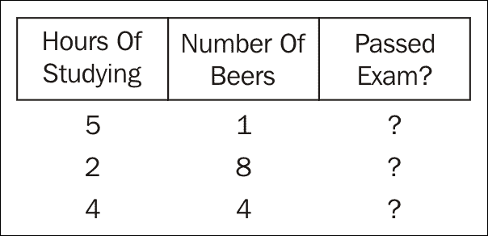

我们随后通过测试将结果与已知答案进行比较，如果模型在猜测方面做得很好，我们就会在生产中使用该模型：

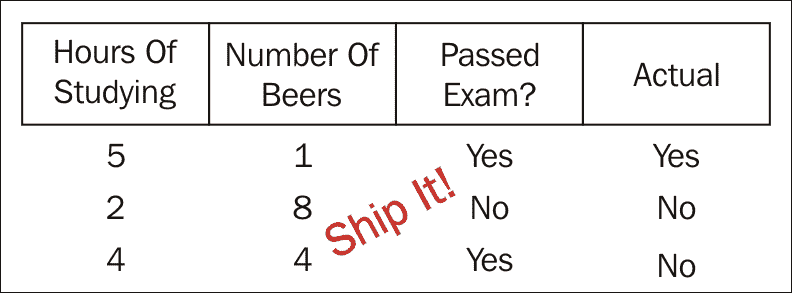

这种在事先告诉计算机答案的方法被称为*监督学习*。术语*监督*之所以被使用，是因为我们明确地提供给计算机一个答案，然后告诉它使用哪个模型。

另有一类模型不会向计算机提供答案。这类模型被称为*无监督学习*。如果你的*无监督学习*的心理模型是替代教师在暑假前一天出现在六年级班级时的混乱，你并不远。好吧，可能没有*那么*糟糕。在无监督学习中，我们向计算机提供一个只包含属性的数据框，并要求它告诉我们关于数据的信息。有了这些信息，我们就可以缩小可能帮助我们做出有洞察力的商业决策的数据。例如，假设你将这个数据框发送给计算机：

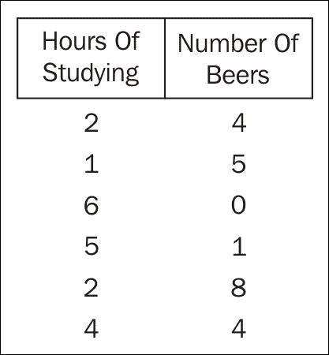

它可能会告诉你数据似乎在两个区域聚集：

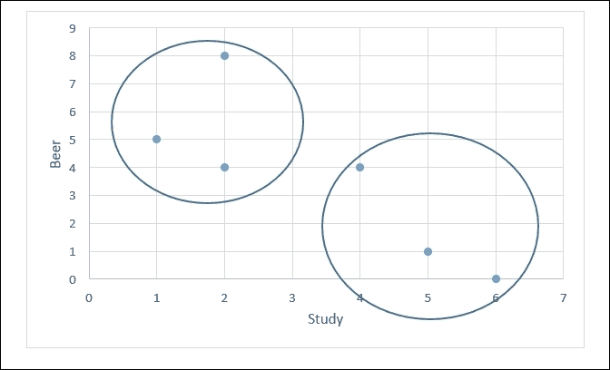

尽管你可能在简单的 2D 数据框上通过观察发现了这种关系，但在添加更多行和特征时，这项任务会变得非常困难，甚至不可能。在本章中，我们将使用 k-means 模型进行这种聚类。

此外，我们可以使用计算机告诉我们数据框中有用的特征以及哪些特征只是噪声。例如，考虑以下数据集：

| 学习时间 | 啤酒数量 | 学习地点 |
| --- | --- | --- |
| 2 | 4 | Dorm |
| 1 | 5 | Dorm |
| 6 | 0 | Dorm |
| 5 | 1 | Dorm |
| 2 | 8 | Dorm |
| 4 | 4 | Dorm |

将**学习地点**包含在我们的数据框中会导致任何洞察吗？答案是不会有，因为所有值都相同。在本章中，我们将使用**主成分分析**（PCA）进行此类特征过滤；它将告诉我们哪些特征是重要的，哪些可以安全地删除。

## k-means

如前所述，k-means 是一种无监督技术：观察值是根据每个簇的平均值进行分组的。让我们看看 k-means 的实际应用。打开 Visual Studio，创建一个新的 Visual F# Windows Library Project。将`Script.fsx`文件重命名为`kmeans.fsx`。打开**NuGet 包管理器**控制台，并输入以下内容：

```py
PM> install-package Accord.MachineLearning

```

接下来，转到脚本并替换所有内容为以下内容：

```py
#r "../packages/Accord.3.0.2/lib/net40/Accord.dll"
#r "../packages/Accord.Math.3.0.2/lib/net40/Accord.Math.dll"
#r "../packages/Accord.Statistics.3.0.2/lib/net40/Accord.Statistics.dll"
#r "../packages/Accord.MachineLearning.3.0.2/lib/net40/Accord.MachineLearning.dll"

open Accord.MachineLearning
```

接下来，让我们创建一个数组，包含我们当地餐厅提供的各种饮料：

```py
let drinks = ["Boones Farm", 0;
                "Mad Dog", 1;
                "Night Train", 2;
                "Buckfast", 3;
                "Smirnoff", 4;
                "Bacardi", 5;
                "Johhnie Walker", 6;
                "Snow", 7;
                "Tsingtao", 8;
                "Budweiser", 9;
                "Skol", 10;
                "Yanjing", 11;
                "Heineken", 12;
                "Harbin", 13]
```

将此发送到 FSI，你会看到以下结果：

```py
val drinks : (string * int) list =
 [("Boones Farm", 0); ("Mad Dog", 1); ("Night Train", 2); ("Buckfast", 3);
 ("Smirnoff", 4); ("Bacardi", 5); ("Johhnie Walker", 6); ("Snow", 7);
 ("Tsingtao", 8); ("Budweiser", 9); ("Skol", 10); ("Yanjing", 11);
 ("Heineken", 12); ("Harbin", 13)]

>

```

返回到脚本，并输入一些餐厅顾客的记录。我们使用浮点值，因为 Accord 期望作为输入。

```py
let observations = [|[|1.0;2.0;3.0|];[|1.0;1.0;0.0|];
                                             [|5.0;4.0;4.0|];[|4.0;4.0;5.0|];[|4.0;5.0;5.0|];[|6.0;4.0;5.0|];
                                             [|11.0;8.0;7.0|];[|12.0;8.0;9.0|];[|10.0;8.0;9.0|]|]
```

将其发送到 REPL，我们得到以下结果：

```py
val observations : float [] [] =
 [|[|1.0; 2.0; 3.0|]; [|1.0; 1.0; 0.0|]; [|5.0; 4.0; 4.0|]; [|4.0; 4.0; 5.0|];
 [|4.0; 5.0; 5.0|]; [|6.0; 4.0; 5.0|]; [|11.0; 8.0; 7.0|];
 [|12.0; 8.0; 9.0|]; [|10.0; 8.0; 9.0|]|]

```

你会注意到有九位不同的顾客，每位顾客都喝了三种饮料。顾客编号 1 喝了布恩农场酒、疯狗酒和夜车酒。有了这些数据，让我们对它运行 k-means 算法。将以下内容输入到脚本文件中：

```py
let numberOfClusters = 3
let kmeans = new KMeans(numberOfClusters);
let labels = kmeans.Compute(observations)
```

当你将此发送到 FSI 时，你会看到以下结果：

```py
val numberOfClusters : int = 3
val kmeans : KMeans
val labels : int [] = [|0; 0; 1; 1; 1; 1; 2; 2; 2|]

```

此输出将每位顾客分配到三个簇中的一个。例如，顾客编号 1 和 2 在簇编号 0 中。如果我们想每个簇有更多的观察值，我们可以像这样更改`numberOfClusters`：

```py
let numberOfClusters = 2
let kmeans = new KMeans(numberOfClusters);
let labels = kmeans.Compute(observations)
```

将其发送到 FSI，会得到以下结果：

```py
val numberOfClusters : int = 2
val kmeans : KMeans
val labels : int [] = [|1; 1; 1; 1; 1; 1; 0; 0; 0|]

```

注意，计算机不会尝试为每个簇标记或分配任何值。如果可能，数据科学家需要分配一个有意义的值。返回到脚本，将`numberOfClusters`改回三个，并重新发送到 FSI。查看输入数组，我们可以认为分配簇`0`的是加强葡萄酒饮用者，簇`1`是烈酒饮用者，簇`2`是啤酒饮用者。然而，有时你可能无法仅通过观察输入数组来判断每个簇的含义。在这种情况下，你可以请求 Accord 提供一些（有限的）帮助。将以下内容输入到脚本文件中：

```py
kmeans.Clusters.[0]
```

将此发送到 FSI 将得到以下结果：

```py
val it : KMeansCluster =
 Accord.MachineLearning.KMeansCluster
 {Covariance = [[4.3; 2.6; 3.2]
 [2.6; 2.266666667; 2.733333333]
 [3.2; 2.733333333; 3.866666667]];
 Index = 0;
 Mean = [|3.5; 3.333333333; 3.666666667|];
 Proportion = 0.6666666667;}

```

注意均值是中间的三位数，这是一个相对较小的数字，因为我们是从 0 到 13 进行计数的。我们可以说，类别 0 的标签应该是类似**巴克夫斯特**的饮酒者，这通常是正确的。

## 主成分分析（PCA）

我们可以用无监督学习来完成另一个常见任务，即帮助我们剔除不相关的特征。如果你还记得上一章，我们在构建模型时使用逐步回归来确定最佳特征，然后使用奥卡姆剃刀法则剔除不显著的特征。PCA 的一个更常见用途是将这个无监督模型作为挑选最佳特征——即框架的**主成分**的一种方式。

将另一个脚本文件添加到你的项目中，并将其命名为`pca.fsx`。添加以下代码：

```py
#r "../packages/Accord.3.0.2/lib/net40/Accord.dll"
#r "../packages/Accord.Math.3.0.2/lib/net40/Accord.Math.dll"
#r "../packages/Accord.Statistics.3.0.2/lib/net40/Accord.Statistics.dll"

open Accord.Statistics.Analysis

let sourceMatrix = [|[|2.5; 2.4|];[|0.5; 0.7|];[|2.2; 2.9|];
                    [|1.9; 2.2|];[|3.1; 3.0|];[|2.3; 2.7|];[|2.0; 1.6|];
                    [|1.0; 1.1|];[|1.5; 1.6|]; [|1.1; 0.9|]|] 
```

将此发送到 FSI 将得到以下结果：

```py
val sourceMatrix : float [] [] =
 [|[|2.5; 2.4|]; [|0.5; 0.7|]; [|2.2; 2.9|]; [|1.9; 2.2|]; [|3.1; 3.0|];
 [|2.3; 2.7|]; [|2.0; 1.6|]; [|1.0; 1.1|]; [|1.5; 1.6|]; [|1.1; 0.9|]|]

```

在这种情况下，`sourceMatrix`是一个学生列表，这些学生在考试前学习了一定小时数，并在考试前喝了多少啤酒。例如，第一个学生学习了 2.5 小时，喝了 2.4 杯啤酒。与你在书中看到的类似例子不同，你会注意到这个框架中没有因变量（Y）。我们不知道这些学生是否通过了考试。但仅凭这些特征，我们可以确定哪些特征对分析最有用。你可能会对自己说：“这怎么可能？”不深入数学的话，PCA 将查看一系列场景下每个变量的方差。如果一个变量可以解释差异，它将得到更高的分数。如果它不能，它将得到较低的分数。

让我们看看 PCA 关于这个数据集告诉我们什么。将以下代码输入到脚本中：

```py
let pca = new PrincipalComponentAnalysis(sourceMatrix, AnalysisMethod.Center)
pca.Compute()
pca.Transform(sourceMatrix)
pca.ComponentMatrix
```

将此发送到 REPL，我们将得到以下结果：

```py
val pca : PrincipalComponentAnalysis
val it : float [,] = [[0.6778733985; -0.7351786555]
 [0.7351786555; 0.6778733985]]

```

你会注意到`ComponentMatrix`属性的输出是一个 2 x 2 的数组，互补值以交叉形式表示。在正式术语中，这个锯齿形数组被称为特征向量，数组的内容被称为特征值。如果你开始深入研究 PCA，你需要了解这些词汇的含义以及这些值的含义。对于我们这里的用途，我们可以安全地忽略这些值（除非你想要在下次家庭聚会中提及“特征值”这个词）。

在 PCA 中，我们需要特别注意的一个重要属性是成分比例。回到脚本文件，输入以下内容：

```py
pca.ComponentProportions
```

将此发送到 REPL 将得到以下结果：

```py
val it : float [] = [|0.9631813143; 0.03681868565|]

```

这些值对我们的分析很重要。注意，将这两个值相加等于 100 百分比？这些百分比告诉你数据框中的方差量（因此是数据的有用性量）。在这种情况下，学习时间是 96 百分比的方差，而啤酒量只有 4 百分比，所以如果我们想用这种数据进行分析，我们肯定会选择学习时间，并安全地丢弃饮酒。注意，如果我们增加了饮酒的啤酒范围，百分比会发生变化，我们可能希望使用这两个变量。这是一个有两个特征的简单示例。PCA 在你有大量特征并且需要确定它们的有用性时表现得尤为出色。

# 交通拦截和事故探索

在掌握 k-means 和 PCA 理论之后，让我们看看我们可以用开放数据做什么。如果你记得，我们有一个关于交通拦截的数据集。让我们再引入两个数据集：同一时间段内的汽车事故数量，以及事故/罚单当天降水量。

## 准备脚本和数据

在 Visual Studio 中，创建一个名为 `Hack4Good.Traffic` 的新 Visual F# 库项目：

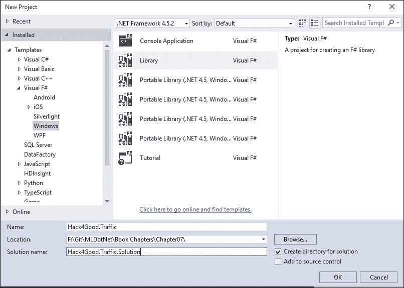

项目创建完成后，将 `Script.fsx` 文件重命名为 `Clustering.fsx`：

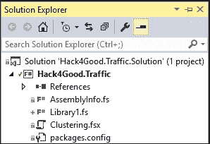

接下来，打开 NuGet 包管理器控制台，并输入以下内容：

```py
PM> install-package Accord.MachineLearning

```

在 `Clustering.fsx` 中，将以下代码输入到脚本中：

```py
#r "System.Data.Entity.dll"
#r "FSharp.Data.TypeProviders.dll"
#r "System.Data.Linq.dll"
#r "../packages/Accord.3.0.2/lib/net40/Accord.dll"
#r "../packages/Accord.Math.3.0.2/lib/net40/Accord.Math.dll"
#r "../packages/Accord.Statistics.3.0.2/lib/net40/Accord.Statistics.dll"
#r "../packages/Accord.MachineLearning.3.0.2/lib/net40/Accord.MachineLearning.dll"

open System
open System.Linq
open System.Data.Linq
open System.Data.Entity
open Accord.MachineLearning
open System.Collections.Generic
open Accord.Statistics.Analysis
open Microsoft.FSharp.Data.TypeProviders

[<Literal>]
let connectionString = "data source=nc54a9m5kk.database.windows.net;initial catalog=Traffic;user id=chickenskills@nc54a9m5kk;password=sk1lzm@tter;"
type Geolocation = {Latitude: float; Longitude: float} 

type EntityConnection = SqlEntityConnection<connectionString,Pluralize = true>
let context = EntityConnection.GetDataContext()
```

当你将此发送到 FSI 时，你会看到以下内容：

```py
val connectionString : string =
 "data source=nc54a9m5kk.database.windows.net;initial catalog=T"+[61 chars]
type Geolocation =
 {Latitude: float;
 Longitude: float;}
type EntityConnection =
 class
 static member GetDataContext : unit -> EntityConnection.ServiceTypes.SimpleDataContextTypes.EntityContainer
 + 1 overload
 nested type ServiceTypes
 end
val context :
 EntityConnection.ServiceTypes.SimpleDataContextTypes.EntityContainer

```

在完成这些准备工作后，让我们从数据库中获取停止数据。将以下代码放入脚本文件中：

```py
//Stop Data
type TrafficStop = {StopDateTime: DateTime; Geolocation: Geolocation; DispositionId: int}
let trafficStops = 
    context.dbo_TrafficStops 
    |> Seq.map(fun ts -> {StopDateTime = ts.StopDateTime.Value; 
                          Geolocation = {Latitude = Math.Round(ts.Latitude.Value,3); 
                          Longitude = Math.Round(ts.Longitude.Value,3)}; 
                          DispositionId = ts.DispositionId.Value})
    |> Seq.toArray
```

当你将其发送到 REPL 时，你会看到以下内容：

```py
type TrafficStop =
 {StopDateTime: DateTime;
 Geolocation: Geolocation;
 DispositionId: int;}
val trafficStops : TrafficStop [] =
 |{StopDateTime = 6/30/2012 12:36:38 AM;
 Geolocation = {Latitude = 35.789;
 Longitude = -78.829;};
 DispositionId = 7;}; {StopDateTime = 6/30/2012 12:48:38 AM;
 Geolocation = {Latitude = 35.821;
 Longitude = -78.901;};
 DispositionId = 15;};
 {StopDateTime = 6/30/2012 1:14:29 AM;
 Geolocation = {Latitude = 35.766;

```

所有这些数据都应该对你熟悉，来自[第四章，*交通拦截 – 是否走错了路？*。唯一的真正区别是现在有一个包含纬度和经度的地理位置类型。注意，我们在这一行中首先分配数据库中的任何值：

```py
    |> Seq.map(fun ts -> {StopDateTime = ts.StopDateTime.Value; 
                          Geolocation = {Latitude = Math.Round(ts.Latitude.Value,3); 
                          Longitude = Math.Round(ts.Longitude.Value,3)}; 
                          DispositionId = ts.DispositionId.Value})
```

此外，你还会注意到我们正在使用 `Math.Round` 将值保留到小数点后三位精度。有了这些本地数据，让我们引入事故数据。将以下代码输入到脚本中：

```py
//Crash Data
type TrafficCrash = {CrashDateTime: DateTime;  Geolocation: Geolocation; CrashSeverityId: int; CrashTypeId: int; }
let trafficCrashes= 
    context.dbo_TrafficCrashes 
    |> Seq.filter(fun tc -> tc.MunicipalityId = Nullable<int>(13))
    |> Seq.filter(fun tc -> not (tc.Latitude = Nullable<float>()))
    |> Seq.map(fun tc -> {CrashDateTime=tc.CrashDateTime.Value; 
                          Geolocation = {Latitude =Math.Round(tc.Latitude.Value,3); 
                        Longitude=Math.Round(tc.Longitude.Value,3)};
                        CrashSeverityId=tc.CrashSeverityId.Value; 
                        CrashTypeId =tc.CrashTypeId.Value})
    |> Seq.toArray
```

将此发送到 FSI 给出以下结果：

```py
type TrafficCrash =
 {CrashDateTime: DateTime;
 Geolocation: Geolocation;
 CrashSeverityId: int;
 CrashTypeId: int;}
val trafficCrashes : TrafficCrash [] =
 [|{CrashDateTime = 12/30/2011 1:00:00 AM;
 Geolocation = {Latitude = 35.79;
 Longitude = -78.781;};
 CrashSeverityId = 4;
 CrashTypeId = 3;}; {CrashDateTime = 12/30/2011 3:12:00 AM;
 Geolocation = {Latitude = 35.783;
 Longitude = -78.781;};
 CrashSeverityId = 3;
 CrashTypeId = 24;};

```

我们还有一个数据集想要使用：每天的交通状况。将以下内容输入到脚本中：

```py
//Weather Data
type DailyPercipitation = {WeatherDate: DateTime; Amount: int; }
let dailyWeather = 
    context.dbo_DailyPercipitation 
    |> Seq.map(fun dw -> {WeatherDate=dw.RecordDate; Amount=dw.Amount;})
    |> Seq.toArray
```

将此发送到 FSI 给出以下结果：

```py
type DailyPercipitation =
 {WeatherDate: DateTime;
 Amount: int;}
val dailyWeather : DailyPercipitation [] =
 [|{WeatherDate = 1/9/2012 12:00:00 AM;
 Amount = 41;}; {WeatherDate = 1/10/2012 12:00:00 AM;
 Amount = 30;}; {WeatherDate = 1/11/2012 12:00:00 AM;
 Amount = 5;};
 {WeatherDate = 1/12/2012 12:00:00 AM;

```

有这三个数据集可用，让我们将交通拦截和交通事故数据集合并成一个数据框，看看是否有关于地理位置的任何情况。

## 地理位置分析

前往脚本文件，并添加以下内容：

```py
let stopData = 
    trafficStops
    |> Array.countBy(fun ts -> ts.Geolocation)
```

将此发送到 REPL 给出以下结果：

```py
val stopData : (Geolocation * int) [] =
 [|({Latitude = 35.789;
 Longitude = -78.829;}, 178); ({Latitude = 35.821;
 Longitude = -78.901;}, 8);
 ({Latitude = 35.766;
 Longitu…

```

到现在为止，这段代码应该对你来说已经很熟悉了；我们正在按地理位置统计交通停驶的数量。对于第一条记录，地理点 35.789/-78.829 有 178 次交通停驶。

接下来，返回脚本并输入以下内容：

```py
let crashData =
    trafficCrashes
    |> Array.countBy(fun tc -> tc.Geolocation)
```

将此发送到 REPL，我们得到以下结果：

```py
val crashData : (Geolocation * int) [] =
 [|({Latitude = 35.79;
 Longitude = -78.781;}, 51); ({Latitude = 35.783;

```

这段代码与停驶数据相同；我们正在按地理位置统计交通事故的数量。对于第一条记录，地理点 35.790/-78.781 有 51 次交通事故。

我们接下来的步骤是将这两个数据集合并成一个单一的数据框，我们可以将其发送到 Accord。至于 F#中的大多数事情，让我们使用类型和函数来实现这一点。返回脚本文件并输入以下内容：

```py
type GeoTraffic = {Geolocation:Geolocation; CrashCount: int; StopCount: int}

let trafficGeo = 
    Enumerable.Join(crashData, stopData, 
                (fun crashData -> fst crashData), 
                (fun stopData -> fst stopData), 
                (fun crashData stopData -> { Geolocation = fst crashData; StopCount = snd crashData ; CrashCount = snd stopData }))
                |> Seq.toArray
```

当你将此发送到 FSI 时，你会看到如下类似的内容：

```py
type GeoTraffic =
 {Geolocation: Geolocation;
 CrashCount: int;
 StopCount: int;}
val trafficGeo : GeoTraffic [] =
 [|{Geolocation = {Latitude = 35.79;
 Longitude = -78.781;};
 CrashCount = 9;
 StopCount = 51;}; {Geolocation = {Latitude = 35.783;
 Longitude = -78.781;};
 CrashCount = 16;
 StopCount = 5;};
 {Geolocation = {Latitude = 35.803;
 Longitude = -78.775;};
 CrashCount = 76;
 StopCount = 2;};

```

这里有一些新的代码，一开始可能会让人感到有些难以理解（至少对我来说是这样的）。我们正在使用 LINQ 类`Enumerable`的`Join`方法将`crashData`和`stopData`连接起来。`Join`方法接受几个参数：

+   第一个数据集（在这种情况下为`crashData`）。

+   第二个数据集（在这种情况下为`stopData`）。

+   一个 lambda 表达式，用于从第一个数据集中提取值，我们将使用它来进行连接。在这种情况下，元组的第一个元素，即地理位置值。

+   一个 lambda 表达式，用于从第二个数据集中提取值，我们将使用它来进行连接。在这种情况下，元组的第一个元素，即地理位置值。

+   一个 lambda 表达式，指定连接操作输出的样子。在这种情况下，它是我们在这段代码块的第一个语句中定义的名为`GeoTraffic`的记录类型。

关于使用 Join 方法的关键一点是要意识到它只保留两个数据集中都存在的记录（对于 SQL 爱好者来说，这是一个内连接）。这意味着如果一个地理位置有一个交通罚单但没有交通停驶，它将从我们的分析中删除。如果你想要进行外连接，有`GroupJoin`方法可以实现这一点。由于我们真正感兴趣的是高活动区域，因此内连接似乎更合适。

在创建数据框后，我们现在准备将数据发送到 Accord 的 k-means。如果你还记得，Accord 的 k-means 需要输入是一个浮点数的不规则数组。因此，我们有一个最后的转换。转到脚本文件并输入以下内容：

```py
let kmeansInput = 
    trafficGeo 
    |> Array.map(fun cs -> [|float cs.CrashCount; float cs.StopCount |])
```

将其发送到 FSI，我们得到以下结果：

```py
val kmeansInput : float [] [] =
 [|[|9.0; 51.0|]; [|16.0; 5.0|]; [|76.0; 2.0|]; [|10.0; 1.0|]; [|80.0; 7.0|];
 [|92.0; 27.0|]; [|8.0; 2.0|]; [|104.0; 11.0|]; [|47.0; 4.0|];
 [|36.0; 16.0

```

返回脚本文件，并输入以下内容：

```py
let numberOfClusters = 3
let kmeans = new KMeans(numberOfClusters)
let labels = kmeans.Compute(kmeansInput.ToArray())
kmeans.Clusters.[0]
kmeans.Clusters.[1]
kmeans.Clusters.[2]
```

将其发送到 REPL，我们将得到以下结果：

```py
val numberOfClusters : int = 3
val kmeans : KMeans
val labels : int [] =
 [|1; 1; 0; 1; 0; 0; 1; 0; 0; 1; 0; 0; 0; 1; 1; 0; 1; 1; 0; 0; 0; 2; 1; 0; 1;
 2; 0; 2;

```

哇！我们正在对交通数据进行 k-means 聚类。如果你检查每个簇，你会看到以下内容：

```py
val it : KMeansCluster =
  Accord.MachineLearning.KMeansCluster
    {Covariance = [[533.856744; 25.86726804]
                   [25.86726804; 42.23152921]];
     Index = 0;
     Mean = [|67.50515464; 6.484536082|];
     Proportion = 0.1916996047;}
> 
val it : KMeansCluster =
  Accord.MachineLearning.KMeansCluster
    {Covariance = [[108.806009; 8.231942669]
                   [8.231942669; 16.71306776]];
     Index = 1;
     Mean = [|11.69170984; 2.624352332|];
     Proportion = 0.7628458498;}
> 
val it : KMeansCluster =
  Accord.MachineLearning.KMeansCluster
    {Covariance = [[5816.209486; -141.4980237]
                   [-141.4980237; 194.4189723]];
     Index = 2;
     Mean = [|188.8695652; 13.34782609|];
     Proportion = 0.04545454545;}
```

我们有三个簇。我从每个簇中提取了平均值和比例，并将它们放入如下所示的电子表格中：

| 事故 | 停驶 | 记录百分比 |
| --- | --- | --- |
| 67.5 | 6.48 | 20.2% |
| 11.69 | 2.62 | 76.3% |
| 188.87 | 13.35 | 4.5% |

观察所有三个聚类，值得注意的是交通事故比检查次数多得多。同样值得注意的是，第一和第二个聚类的事故与检查的比例大约是 10:1，但真正高事故区域的事故与检查的比例更高——大约 14:1。似乎有理由得出结论，城镇中有几个高事故区域，警察在那里非常活跃，但他们可能更加活跃。我会根据它们的活跃度给每个聚类命名：（低、中、高）。如果地理位置不在我们的数据框中（城镇中的大多数点），我们可以称之为“无活动”。

最后，将以下内容输入到脚本文件中：

```py
let trafficGeo' = Array.zip trafficGeo labels
```

将这些发送到 FSI 后，我们得到以下结果：

```py
val trafficGeo' : (GeoTraffic * int) [] =
 |({Geolocation = {Latitude = 35.79;
 Longitude = -78.781;};
 CrashCount = 9;
 StopCount = 51;}, 1); ({Geolocation = {Latitude = 35.783;
 Longitude = -78.781;};
 CrashCount = 16;
 StopCount = 5;}, 1);

```

我们之前已经见过`.zip`格式。我们现在将包含地理位置、停靠次数和事故次数的数据框与通过 k-means 得到的标签框合并。然后我们可以查找一个特定的地理位置并查看其聚类分配。例如，地理位置 35.790/-78.781 位于聚类 1——中等活跃度。

## PCA

现在我们已经通过 k-means 对数据有了相当好的了解，让我们看看是否可以使用 PCA 来揭示我们交通数据中的更多洞察。而不是看位置，让我们看看日期。正如我们在[第四章中找到的，“交通检查——走错了方向？”，使用我们的决策树，我们无法从不同时间段的日期/时间与交通罚单中得出任何结论。也许通过增加事故和天气数据到检查数据中会有所帮助。

返回到`Clustering.fsx`脚本文件，并输入以下内容：

```py
let crashCounts =
    trafficCrashes
    |> Array.countBy(fun tc -> tc.CrashDateTime.DayOfYear)
```

将这些发送到 FSI 后，我们得到以下结果：

```py
val crashCounts : (int * int) [] =
 [|(364, 10); (365, 3); (1, 2); (2, 3); (3, 12); (4, 5); (5, 3); (6, 1);
 (7, 9); (8, 6); (9, 10); (10, 6); (11, 9);

```

这段代码与我们之前创建 k-means 的`crashData`时编写的代码非常相似。在这种情况下，我们是通过`DayOfYear`来统计交通事故的。`DayOfYear`将每年的每一天分配一个索引值。例如，1 月 1 日得到 1，1 月 2 日得到 2，12 月 31 日得到 365 或 366，这取决于是否是闰年。注意，它是基于 1 的，因为`DateTime.DayOfYear`是基于 1 的。

返回到脚本文件并输入以下内容：

```py
let stopCounts = 
    trafficStops
    |> Array.countBy(fun ts -> ts.StopDateTime.DayOfYear)
```

将这些发送到 FSI 后，我们得到以下结果：

```py
val stopCounts : (int * int) [] =
 [|(182, 58); (183, 96); (184, 89); (185, 65); (38, 65);

```

如你所能猜到的，这是按年度天数汇总的交通检查次数。继续前进，进入脚本文件并输入以下内容：

```py
let weatherData' =
    dailyWeather
    |> Array.map(fun w -> w.WeatherDate.DayOfYear, w.Amount)
```

将这些发送到 REPL 后，我们得到以下结果：

```py
val weatherData' : (int * int) [] =
 [|(9, 41); (10,` 30); (11, 5); (12, 124);

```

就像事故和检查数据一样，这创建了一个按年度天数汇总的降水量数据集。你会注意到数据已经处于日期级别（有时称为原子级别），所以使用了`Array.map`来转换日期；我们不需要使用`countBy`。

在创建了初始数据集之后，我们现在需要一种方法来将这三个数据集合并在一起。我们在 k-means 示例中使用的 `Enumerable.Join` 方法在这里不适用，因此我们必须构建自己的连接函数。进入脚本文件，输入以下内容：

```py
let getItem dataSet item  =
    let found = dataSet |> Array.tryFind(fun sd -> fst(sd) = item)
    match found with
    | Some value -> snd value
    | None -> 0
```

当你将此发送到 FSI 时，你会得到以下结果：

```py
val getItem : dataSet:('a * int) [] -> item:'a -> int when 'a : equality

```

这是一个相当复杂的函数签名。如果我在方法中添加参数提示，可能会有所帮助，如下面的代码所示：

```py
let getItem (dataSet:(int*int)[], item:int)  =
    let found = dataSet |> Array.tryFind(fun sd -> fst(sd) = item)
    match found with
    | Some value -> snd value
    | None -> 0
```

当你将其发送到 FSI 时，你会得到以下结果：

```py
val getItem : dataSet:(int * int) [] * item:int -> int

```

这应该更容易访问但不太通用，这是可以接受的，因为我们的所有数据集（事故、停车和天气）都是 `int*int` 的数组。阅读输出，我们看到 `getItem` 是一个接受一个名为 `dataset` 的参数的函数，该参数是一个 `int` 元组的数组 `(int * int)[]`，另一个参数名为 `item`，也是一个 `int`。函数随后尝试在数组中找到其 `fst` 值与项目相同的元组。如果找到了，它返回元组的第二个值。如果没有在数组中找到项目，它返回 `0`。

这个函数将适用于我们所有的三个数据集（事故、停车和天气），因为这三个数据集只包含有观测记录的日期。对于交通停车来说，这不是问题，因为每年每天都有至少一次交通停车。然而，有 16 天没有记录交通事故，所以 `stopData` 有 350 条记录，而且有超过 250 天没有降水，所以 `weatherData` 只有 114 条记录。

由于第一种创建 `getItem` 的方法更通用且更符合 F# 的习惯用法，我将使用它来完成本章的剩余部分。这两个例子都在你可以下载的示例脚本文件中。

回到脚本中，输入以下内容：

```py
type TrafficDay = {DayNumber:int; CrashCount: int; StopCount: int; RainAmount: int}

let trafficDates = 
    [|1..366|]
    |> Array.map(fun d -> {DayNumber=d;
                          CrashCount=getItem crashCounts d;
                          StopCount=getItem stopCounts d;
                          RainAmount=getItem weatherData' d})
```

当你将此发送到 REPL 时，你会看到以下内容：

```py
type TrafficDay =
 {DayNumber: int;
 CrashCount: int;
 StopCount: int;
 RainAmount: int;}
val trafficDates : TrafficDay [] =
 [|{DayNumber = 1;
 CrashCount = 2;
 StopCount = 49;
 RainAmount = 0;}; {DayNumber = 2;
 CrashCount = 3;
 StopCount = 43;
 RainAmount = 0;};

```

第一行创建了一个包含当天事故、停车和降水的记录类型。我使用“rain”作为字段名，因为我们很少在北卡罗来纳州下雪，我想让任何住在北方的读者都感到这一点。当然，当我们确实下雪时，那几乎就是世界末日。

下一个代码块是我们创建最终数据帧的地方。首先，创建了一个包含全年每一天的整数数组。然后应用了一个映射函数，为数组中的每个项目调用 `getItem` 三次：第一次为 `crashData`，第二次为停车数据，最后为天气数据。结果被放入 `TrafficDay` 记录中。

数据帧设置完成后，我们现在可以为 Accord 准备了。转到脚本文件，输入以下内容：

```py
let pcaInput = 
    trafficDates 
    |> Array.map(fun td -> [|float td.CrashCount; float td.StopCount; float td.RainAmount |])
```

当你将其发送到 REPL 时，你会得到以下结果：

```py
val pcaInput : float [] [] =
 [|[|2.0; 49.0; 0.0|]; [|3.0; 43.0; 0.0|]; [|12.0; 52.0; 0.0|];
 [|5.0; 102.0; 0.0|];

```

这是一个 Accord 所需要的锯齿数组。回到脚本中，输入以下内容：

```py
let pca = new PrincipalComponentAnalysis(pcaInput, AnalysisMethod.Center)
pca.Compute()
pca.Transform(pcaInput)
pca.ComponentMatrix
pca.ComponentProportions
```

当你将此发送到 REPL 时，你会得到以下结果：

```py
val pca : PrincipalComponentAnalysis
val it : unit = ()

> 
val it : float [] [] =
 [|[|-43.72753865; 26.15506878; -4.671924583|];

val it : float [,] = [[0.00127851745; 0.01016388954; 0.999947529]
 [0.01597172498; -0.999821004; 0.01014218229]
 [0.9998716265; 0.01595791997; -0.001440623449]]
> 
val it : float [] = [|0.9379825626; 0.06122702459; 0.0007904128341|]
>

>

```

这表明我们数据框中 94%的方差来自事故，而不是停车或天气。这很有趣，因为常识认为，一旦在北卡罗来纳州下雨（或者<gasp>下雪 <gasp>），交通事故就会激增。尽管这可能是一个好的新闻报道，但这一年的样本并没有证实这一点。

## 分析摘要

我们现在有几个模型指向一些有趣的想法：

+   有几个地点占用了城镇大部分的交通事故和罚单

+   天气并不像你想象的那么重要

拥有这些知识，我们准备好将机器学习应用于实践。

# Code-4-Good 应用程序

让我们创建一个帮助人们更安全驾驶的 Windows 应用程序。此外，让我们使应用程序变得“智能”，这样它将逐渐变得更加准确。让我们从 Visual Studio 中已经创建的项目开始。

## 机器学习组件

进入**解决方案****资源管理器**，将`Library1.fs`重命名为`TrafficML.fs`。添加对`System.Data`、`System.Data.Entity`、`System.Data.Linq`和`FSharp.Data.TypeProviders`的引用：

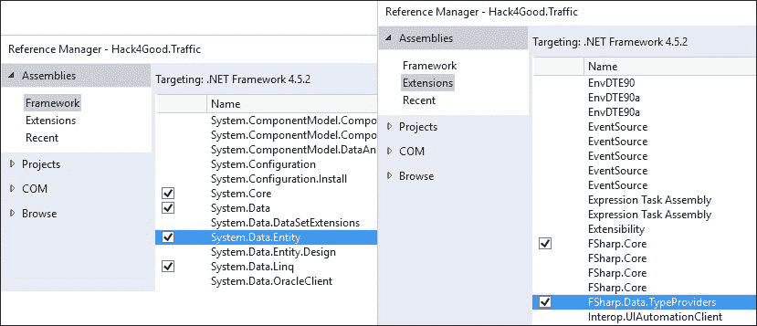

添加引用

进入`TrafficML.fs`文件并输入以下代码：

```py
namespace Hack4Good.Traffic

open System
open System.Linq
open System.Data.Linq
open System.Data.Entity
open Accord.MachineLearning
open System.Collections.Generic
open Accord.Statistics.Analysis
open Microsoft.FSharp.Data.TypeProviders

type Geolocation = {Latitude: float; Longitude: float}
type private EntityConnection = SqlEntityConnection<"data source=nc54a9m5kk.database.windows.net;initial catalog=Traffic;user id=chickenskills@nc54a9m5kk;password=sk1lzm@tter;",Pluralize = true>
type TrafficStop = {StopDateTime: DateTime; Geolocation: Geolocation; DispositionId: int}
type TrafficCrash = {CrashDateTime: DateTime;  Geolocation: Geolocation; CrashSeverityId: int; CrashTypeId: int; }
type GeoTraffic = {Geolocation:Geolocation; CrashCount: int; StopCount: int}
type GeoTraffic' = {Geolocation:Geolocation; CrashCount: int; StopCount: int; Cluster: int}
```

我知道不将你刚刚编写的代码发送到 FSI 感觉有点奇怪，但没有办法立即从可编译文件中获取你编写的代码的反馈。我们将在下一章讨论 TDD 时解决这个问题。在此之前，只需编译项目以确保你走在正确的轨道上。

返回到`TrafficML.fs`文件，输入以下代码块或从书籍的下载中复制：

```py
type TrafficML(connectionString:string) = 
    let context = EntityConnection.GetDataContext(connectionString)

        let trafficStops = 
        context.dbo_TrafficStops 
        |> Seq.map(fun ts -> {StopDateTime = ts.StopDateTime.Value; 
                             Geolocation = {Latitude =Math.Round(ts.Latitude.Value,3); 
                             Longitude=Math.Round(ts.Longitude.Value,3)}; 
                             DispositionId = ts.DispositionId.Value})
        |> Seq.toArray

    let trafficCrashes= 
        context.dbo_TrafficCrashes 
        |> Seq.filter(fun tc -> tc.MunicipalityId = Nullable<int>(13))
        |> Seq.filter(fun tc -> not (tc.Latitude = Nullable<float>()))
        |> Seq.map(fun tc -> {CrashDateTime=tc.CrashDateTime.Value; 
                            Geolocation = {Latitude =Math.Round(tc.Latitude.Value,3); 
                            Longitude=Math.Round(tc.Longitude.Value,3)};
                            CrashSeverityId=tc.CrashSeverityId.Value; 
                            CrashTypeId =tc.CrashTypeId.Value})
        |> Seq.toArray

    let stopData = 
        trafficStops
        |> Array.countBy(fun ts -> ts.Geolocation)

    let crashData =
        trafficCrashes
        |> Array.countBy(fun tc -> tc.Geolocation)

    let trafficGeo = 
        Enumerable.Join(crashData, stopData, 
                    (fun crashData -> fst crashData), 
                    (fun stopData -> fst stopData), 
                    (fun crashData stopData -> { GeoTraffic.Geolocation = fst crashData; 
                       StopCount = snd crashData ; 
                       CrashCount = snd stopData }))
                    |> Seq.toArray

    let kmeansInput = 
        trafficGeo 
        |> Array.map(fun cs -> [|float cs.CrashCount; float cs.StopCount |])

    let numberOfClusters = 3
    let kmeans = new KMeans(numberOfClusters)
    let labels = kmeans.Compute(kmeansInput.ToArray())
    let trafficGeo' = Array.zip trafficGeo labels
                      |> Array.map(fun (tg,l) -> {Geolocation=tg.Geolocation;CrashCount=tg.CrashCount;StopCount=tg.StopCount;Cluster=l} ) 
```

这段代码与我们之前在`Clustering.fsx`脚本文件中编写的 k-means 代码非常相似。请注意，获取数据、塑造数据和在其上运行 k-means 的所有工作都在`TrafficML`类型的构造函数中完成。这意味着每次从另一个位置创建类的新的实例时，你都在进行数据库调用并运行模型。此外，请注意，连接字符串被硬编码到`SqlEntity`类型提供者中，但在调用`GetDataContext()`时通过构造函数参数传递。这允许你在不同的环境中移动代码（开发/测试/生产）。缺点是您需要始终暴露您的开发环境，以便生成类型。避免这种情况的一种方法是将您的 Entity Framework `.edmx`/架构硬编码到项目中。

返回到`TrafficML.fs`文件，并在`TrafficML`类型中输入以下函数：

```py
    member this.GetCluster(latitude: float, longitude: float, distance: float) =
        let geolocation = {Latitude=latitude; Longitude=longitude}
        let found = trafficGeo' 
                    |> Array.map(fun gt -> gt,(haversine gt.Geolocation geolocation))
                    |> Array.filter(fun (gt,d) -> d < distance)
                    |> Array.sortByDescending(fun (gt,d) -> gt.Cluster)
        match found.Length with
        | 0 -> -1
        | _ -> let first = found |> Array.head
               let gt = fst first
               gt.Cluster
```

这将搜索地理位置。如果有匹配项，则返回簇。如果没有匹配项，则返回*a-1*，表示没有匹配项。我们现在有足够的内容来尝试创建一个实时“智能”交通应用程序。

## 用户界面

在**解决方案资源管理器**中，添加一个新的 Visual C# WPF 应用程序：

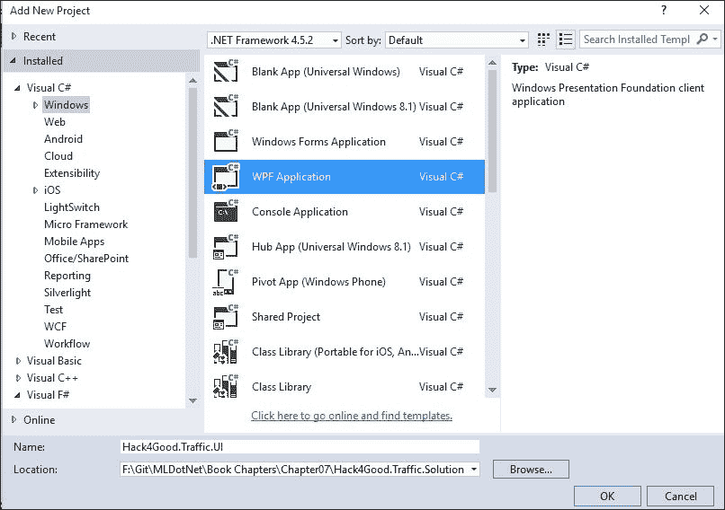

项目创建完成后，将 C# UI 项目添加到 F# 项目中，引用 `System.Configuration` 和 `System.Device`：

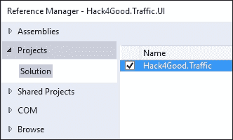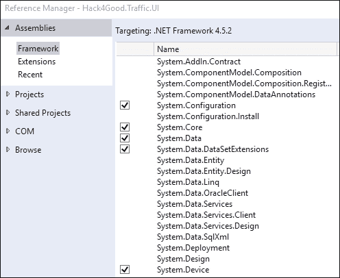

作为快速预备说明，当你编写 WFP 应用程序时，应该遵循 MVVM 和命令中继模式，这在本书中不会涉及。这是一本关于机器学习的书，而不是通过令人愉悦的 UI 来宠爱人类，所以我只编写足够的 UI 代码，以便使其工作。如果你对遵循最佳实践进行 WPF 开发感兴趣，可以考虑阅读 *Windows Presentation Foundation 4.5 Cookbook*。

在 UI 项目中，打开 `MainWindow.xaml` 文件，找到 `Grid` 元素，并在网格中输入以下 XAML：

```py
<Button x:Name="crashbutton" Content="Crash" Click="notifyButton_Click" HorizontalAlignment="Left" Height="41" Margin="31,115,0,0" VerticalAlignment="Top" Width="123"/>
<Button x:Name="stopButton" Content="Stop" Click="notifyButton_Click" HorizontalAlignment="Left" Height="41" Margin="171,115,0,0" VerticalAlignment="Top" Width="132"/>
<TextBlock x:Name="statusTextBlock" HorizontalAlignment="Left" Height="100" Margin="31,10,0,0" TextWrapping="Wrap" Text="Current Status: No Risk" VerticalAlignment="Top" Width="272"/>
```

接下来，打开 `MainWindow.xaml.cs` 文件，并将以下 `using` 语句添加到文件顶部的 `using` 块中：

```py
using System.Configuration;
using System.Device.Location;
```

你的文件应该看起来像下面这样：

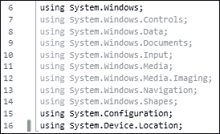

在 `MainWindow` 类内部，输入三个类级别变量：

```py
        TrafficML _trafficML = null;
        GeoCoordinateWatcher _watcher = null;
        String _connectionString = null;
```

你的文件应该看起来像下面这样：

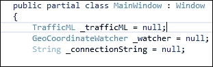

然后，在 `MainWindow()` 构造函数中，在 `InitializeComponent()` 下方添加以下代码：

```py
            InitializeComponent();
            _connectionString = ConfigurationManager.ConnectionStrings["trafficDatabase"].ConnectionString;
            _trafficML = new TrafficML(_connectionString);

            _watcher = new GeoCoordinateWatcher(GeoPositionAccuracy.High);
            _watcher.PositionChanged += Watcher_PositionChanged;
            bool started = this._watcher.TryStart(false, TimeSpan.FromMilliseconds(2000));
            StartUpdateLoop();
```

你的文件应该看起来像这样：


接下来，为事件处理器创建 `Watcher_PositionChanged` 方法：

```py
        private void Watcher_PositionChanged(object sender, GeoPositionChangedEventArgs<GeoCoordinate> e)
        {
            var location = e.Position.Location;
            var latitude = Double.Parse(location.Latitude.ToString("00.000"));
            var longitude = Double.Parse(location.Longitude.ToString("00.000"));

            var cluster = _trafficML.GetCluster(latitude, longitude);
            var status = "No Risk";
            switch(cluster)
            {
                case 0:
                    status = "Low Risk";
                    break;
                case 1:
                    status = "Medium Risk";
                    break;
                case 2:
                    status = "High Risk";
                    break;
                default:
                    status = "No Risk";
                    break;
            }
            this.statusTextBlock.Text = "Current Status: " + status;

        }
```

接下来，创建一个循环，每分钟刷新一次 `MachineLearning` 模型：

```py
        private async Task StartUpdateLoop()
        {
            while (true)
            {
                await Task.Delay(TimeSpan.FromMinutes(1.0));
                _trafficML = await Task.Run(() => new TrafficML(_connectionString));
            }
        }
```

最后，为屏幕上的按钮点击添加事件处理器占位符：

```py
        private void notifyButton_Click(object sender, RoutedEventArgs e)
        {
            //TODO
        }
```

如果你将代码折叠到定义中（*CTRL* + *M*, *L*），你的代码应该看起来如下：

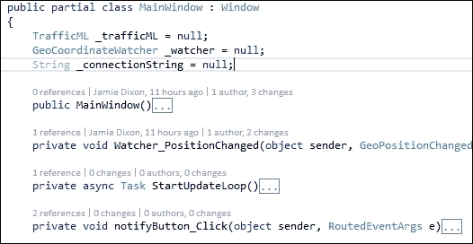

接下来，进入 **解决方案资源管理器**，右键单击以添加一个新的 **应用程序配置** 文件：

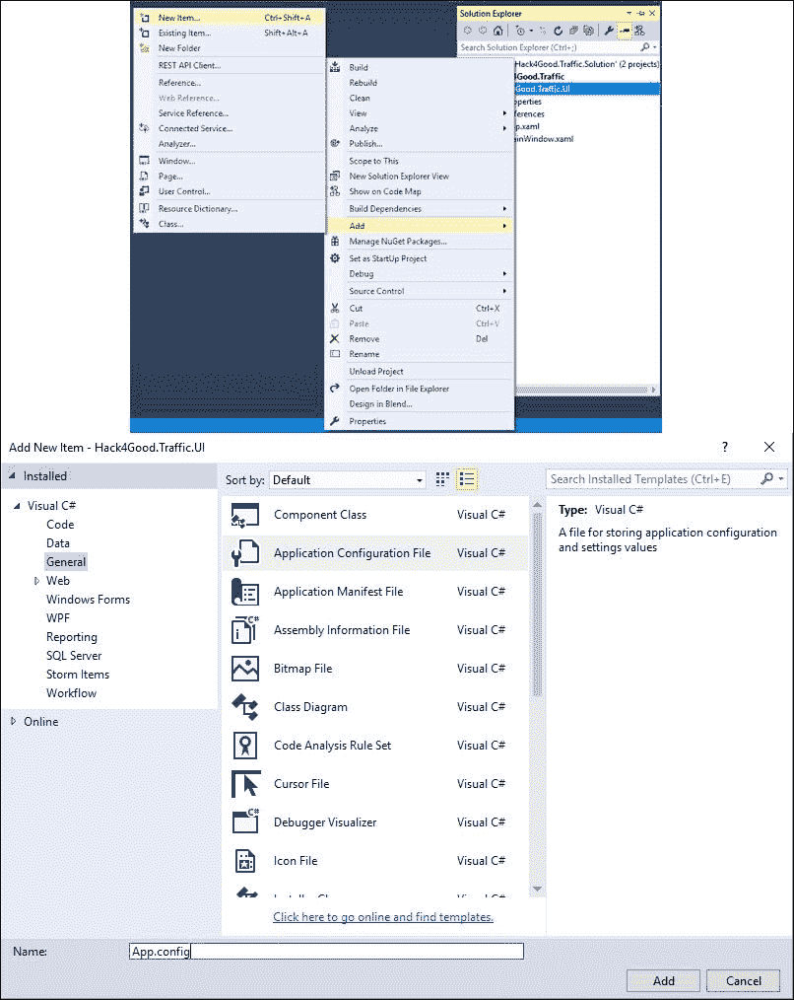

添加新的应用程序配置文件

在那个 `app.config` 文件中，将内容替换为以下 XML（如果你使用的是本地数据库实例，请将连接字符串替换为你的连接字符串）：

```py
<?xml version="1.0" encoding="utf-8" ?>
<configuration>
    <startup> 
        <supportedRuntime version="v4.0" sku=".NETFramework,Version=v4.5.2" />
    </startup>
  <connectionStrings>
    <add name="trafficDatabase" 
         connectionString="data source=nc54a9m5kk.database.windows.net;initial catalog=Traffic;
         user id=chickenskills@nc54a9m5kk;password=sk1lzm@tter;" />
  </connectionStrings>
</configuration>
```

前往 **解决方案资源管理器** 并将 UI 项目设置为启动项目：

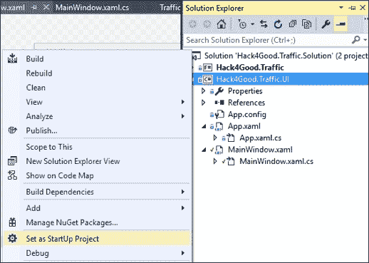

编译你的项目。如果一切顺利，尝试运行它。你应该会得到一个警告对话框，如下所示：


然后你会看到一个类似这样的屏幕：

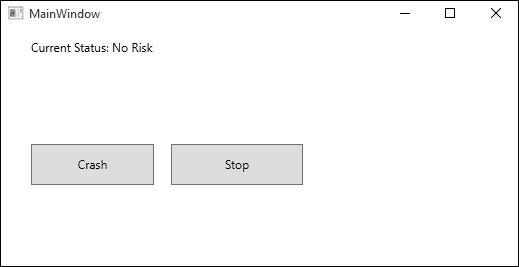

一旦你完全领略了用户体验的奇妙，停止运行应用程序。到目前为止，这已经相当不错了。如果我们把这个应用程序放在车载的位置感知设备（如 GPS）上并四处驾驶，状态栏会警告我们是否在可能发生事故或停车风险的地理位置四分之一英里范围内。然而，如果我们想给自己更多的提醒，我们需要添加更多的代码。

## 添加距离计算

返回 F# 项目并打开 `TrafficML.fs` 文件。找到构造函数的最后一行。代码看起来如下：

```py
    let trafficGeo' = Array.zip trafficGeo labels
                      |> Array.map(fun (tg,l) -> {Geolocation=tg.Geolocation;CrashCount=tg.CrashCount;StopCount=tg.StopCount;Cluster=l} ) 
```

在此行下方，输入以下内容：

```py
    let toRadian x = (Math.PI/180.0) * x

    let haversine x y =
        let dlon = toRadian (x.Longitude - y.Longitude)
        let dLat = toRadian (x.Latitude - y.Latitude)
        let a0 = pown (Math.Sin(dLat/2.0)) 2
        let a1 = Math.Cos(toRadian(x.Latitude)) * Math.Cos(toRadian(y.Latitude))
        let a2 = pown (Math.Sin(dlon/2.0)) 2
        let a = a0 + a1 * a2
        let c = 2.0 * Math.Atan2(sqrt(a),sqrt(1.0-a))
        let R = 3956.0
        R * c
```

这两个函数允许我们计算地理位置之间的距离。由于地球是弯曲的，我们不能简单地从两个地理位置的纬度和经度中减去。Haversine 公式是进行这种计算最常见的方法。

前往文件末尾并添加以下内容：

```py
    member this.GetCluster(latitude: float, longitude: float, distance: float) =
        let geolocation = {Latitude=latitude; Longitude=longitude}
        let found = trafficGeo' |> Array.map(fun gt -> gt,(haversine gt.Geolocation geolocation))
                                |> Array.filter(fun (gt,d) -> d < distance)
                                |> Array.sortByDescending(fun (gt,d) -> gt.Cluster)
        match found.Length with
        | 0 -> -1
        | _ -> let first = found |> Array.head
               let gt = fst first
               gt.Cluster 
```

我们正在做的是通过一个额外的参数`distance`来重载`GetCluster`函数。使用这个输入距离，我们可以计算出地理位置参数和我们的`trafficGeo`数组中的每个地理位置之间的距离。如果有任何匹配项，我们按簇数量最多的进行排序（`sortByDescending`），然后返回它。

返回我们的用户界面项目，打开`MainWindow.xaml.cs`文件，找到`Watcher_PositionChanged`方法。找到以下代码行：

```py
var cluster = _trafficML.GetCluster(latitude, longitude);
```

替换为以下代码行：

```py
var cluster = _trafficML.GetCluster(latitude, longitude, 2.0);
```

我们现在对道路上的任何问题区域都有了两英里的预警。

## 增加人工观察

我们还想对我们的用户界面做一些改动。如果你看看一些像 Waze 这样的*众包*道路应用，它们提供实时通知。我们的应用基于历史数据来进行分类。然而，如果我们正在一个被归类为*低风险*的地区街道上驾驶，并且我们看到一起交通事故，我们希望将这个位置提升到*高风险*。理想情况下，我们应用的所有用户都能收到这个更新，并覆盖模型对地理位置的分类（至少暂时如此），然后我们会更新我们的数据库，以便在我们重新训练模型时，信息变得更加准确。

前往`notifyButton_Click`事件处理程序，将`//TODO`替换为以下内容：

```py
            var location = _watcher.Position.Location;
            var latitude = Double.Parse(location.Latitude.ToString("00.000"));
            var longitude = Double.Parse(location.Longitude.ToString("00.000"));
            _trafficML.AddGeolocationToClusterOverride(latitude, longitude);
```

编译器会向你抱怨，因为我们还没有实现`AddGeolocationToClusterOverride`。回到 F#项目，打开`TrafficML.fs`文件。在文件的底部，添加以下内容：

```py
    member this.AddGeolocationToClusterOverride(latitude: float, longitude: float)  =
        let clusterOverride = EntityConnection.ServiceTypes.dbo_ClusterOverride()
        clusterOverride.Latitude <- latitude
        clusterOverride.Longitude <- longitude
        clusterOverride.Cluster <- 2
        clusterOverride.OverrideDateTime <- DateTime.UtcNow
        context.dbo_ClusterOverride.AddObject(clusterOverride)
        context.DataContext.SaveChanges() |> ignore
```

我们现在有一种方法可以更新任何覆盖的数据库。请注意，你将无法写入为这本书创建的 Azure 上的共享数据库，但你将能够写入你的本地副本。作为最后一步，回到我们创建`trafficGeo`的以下行：

```py
    let trafficGeo' = Array.zip trafficGeo labels
                      |> Array.map(fun (tg,l) -> {Geolocation=tg.Geolocation;CrashCount=tg.CrashCount;StopCount=tg.StopCount;Cluster=l} ) 
```

将该行替换为以下代码块：

```py
    let overrides = context.dbo_ClusterOverride
                    |> Seq.filter(fun co -> (DateTime.UtcNow - co.OverrideDateTime) > TimeSpan(0,5,0))
                    |> Seq.toArray

        let checkForOverride (geoTraffic:GeoTraffic') =
        let found = overrides
                    |> Array.tryFind(fun o -> o.Latitude = geoTraffic.Geolocation.Latitude && 
                    o.Longitude = geoTraffic.Geolocation.Longitude)
        match found.IsSome with
        | true -> {Geolocation=geoTraffic.Geolocation;
                  CrashCount=geoTraffic.CrashCount;
                  StopCount=geoTraffic.StopCount;
                  Cluster=found.Value.Cluster}
        | false -> geoTraffic

    let trafficGeo' = Array.zip trafficGeo labels
                      |> Array.map(fun (tg,l) -> {Geolocation=tg.Geolocation;
                       CrashCount=tg.CrashCount;
                       StopCount=tg.StopCount;
                       Cluster=l} ) 
                      |> Array.map(fun gt -> checkForOverride(gt))
```

此块将数据传输到数据库，并拉取过去 5 分钟内发生的所有覆盖项，并将它们放入覆盖数组中。然后，它创建了一个名为`checkForOverride`的函数，该函数接受`geoTraffic`值。如果纬度和经度与覆盖表匹配，则将`geoTraffic`值替换为数据库分配的新值，而不是来自 k-means 模型的新值。如果没有找到匹配项，则返回原始值。最后，我们将此函数管道到`trafficGeo`的创建中。请注意，如果您尝试在我们的共享服务器上执行此操作，它将抛出一个异常，因为您没有权限写入数据库。然而，通过这个例子，希望意图是清晰的。有了这个，我们有一个实时系统，它结合了机器学习和人类观察，为我们最终用户提供最佳的可能预测。

# 摘要

在本章中，我们涵盖了大量的内容。我们探讨了 k-means 和 PCA 算法，以帮助我们找到交通数据集中的隐藏关系。然后，我们构建了一个应用程序，利用我们获得的洞察力使驾驶员更加警觉，并希望他们能更安全。这个应用程序的独特之处在于它结合了实时机器学习建模和人类观察，为驾驶员提供最佳的可能结果。

在下一章中，我们将探讨我们在这本书中迄今为止的编码的一些局限性，并看看我们是否可以改进模型和特征选择。
