# 第八章。特征选择和优化

在软件工程中，有一句古老的谚语：*先让它工作，再让它变快*。在这本书中，我们采用了*先让它运行，再让它变得更好*的策略。我们在第一章中讨论的许多模型在非常有限的意义上是正确的，并且可以通过一些优化来使它们更加正确。这一章完全是关于*让它变得更好*的。

# 清洗数据

正如我们在第五章中看到的，*时间到 – 获取数据*，使用 F#类型提供者获取和塑造数据（这通常是许多项目中的最大问题）非常简单。然而，一旦我们的数据本地化和塑形，我们为机器学习准备数据的工作还没有完成。每个数据帧可能仍然存在异常。像空值、空值和超出合理范围的数据值等问题需要解决。如果你来自 R 背景，你将熟悉`null.omit`和`na.omit`，它们会从数据框中删除所有行。我们可以在 F#中通过应用一个过滤函数来实现功能等价。在过滤中，如果你是引用类型，可以搜索空值，如果是可选类型，则使用`.isNone`。虽然这很有效，但它有点像一把钝锤，因为你正在丢弃可能在其他字段中有有效值的行。

处理缺失数据的另一种方法是用一个不会扭曲分析的值来替换它。像数据科学中的大多数事情一样，关于不同技术的意见有很多，这里我不会过多详细说明。相反，我想让你意识到这个问题，并展示一种常见的补救方法：

进入 Visual Studio，创建一个名为`FeatureCleaning`的 Visual F# Windows 库项目：

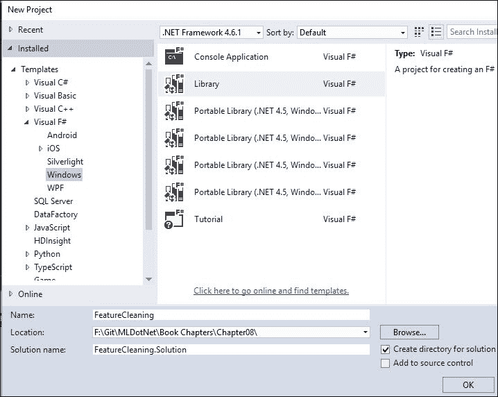

在**解决方案资源管理器**中定位`Script1.fsx`并将其重命名为`CleanData.fsx`：

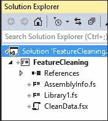

打开那个脚本文件，并用以下代码替换现有的代码：

```py
type User = {Id: int; FirstName: string; LastName: string; Age: float}
let users = [|{Id=1; FirstName="Jim"; LastName="Jones"; Age=25.5};
              {Id=2; FirstName="Joe"; LastName="Smith"; Age=10.25};
              {Id=3; FirstName="Sally"; LastName="Price"; Age=1000.0};|]
```

将其发送到 FSI 后，我们得到以下结果：

```py
type User =
 {Id: int;
 FirstName: string;
 LastName: string;
 Age: float;}
val users : User [] = [|{Id = 1;
 FirstName = "Jim";
 LastName = "Jones";
 Age = 25.5;}; {Id = 2;
 FirstName = "Joe";
 LastName = "Smith";
 Age = 10.25;}; {Id = 3;
 FirstName 
= "Sally";
 LastName = "Price";
 Age = 1000.0;}|]

```

`User`是一种记录类型，代表应用程序的用户，而`users`是一个包含三个用户的数组。它看起来相当普通，除了用户 3，莎莉·普莱斯，她的年龄为`1000.0`。我们想要做的是去掉这个年龄，但仍然保留莎莉的记录。要做到这一点，让我们将 1,000 替换为所有剩余用户年龄的平均值。回到脚本文件，输入以下内容：

```py
let validUsers = Array.filter(fun u -> u.Age < 100.0) users
let averageAge = Array.averageBy(fun u -> u.Age) validUsers

let invalidUsers = 
    users 
    |> Array.filter(fun u -> u.Age >= 100.0) 
    |> Array.map(fun u -> {u with Age = averageAge})

let users' = Array.concat [validUsers; invalidUsers]

```

将其发送到 FSI 应该得到以下结果：

```py
val averageAge : float = 17.875
val invalidUsers : User [] = [|{Id = 3;
 FirstName = "Sally";
 LastName = "Price";
 Age = 17.875;}|]
val users' : User [] = [|{Id = 1;
 FirstName = "Jim";
 LastName = "Jones";
 Age = 25.5;}; {Id = 2;
 FirstName = "Joe";
 LastName = "Smith";
 Age = 10.25;}; {Id = 3;
 FirstName = "Sally";
 LastName = "Price";
 Age = 17.875;}|]

```

注意，我们创建了一个有效用户的子数组，然后获取他们的平均年龄。然后我们创建了一个无效用户的子数组，并映射平均年龄。由于 F#不喜欢可变性，我们为每个无效用户创建了一个新记录，并有效地使用`with`语法，创建了一个具有所有相同值的新记录，除了年龄。然后我们通过将有效用户和更新的用户合并成一个单一数组来完成。尽管这是一种相当基础的技术，但它可以非常有效。当你进一步学习机器学习时，你会发展和完善自己的处理无效数据的技术——你必须记住，你使用的模型将决定你如何清理这些数据。在某些模型中，取平均值可能会使事情变得混乱。

# 选择数据

当我们面对大量独立变量时，我们常常会遇到选择哪些值的问题。此外，变量可能被分类、与其他变量结合或改变——这些都可能使某个模型成功或失败。

## 共线性

共线性是指我们有多多个彼此高度相关的`x`变量；它们有高度的关联度。在使用回归时，你总是要警惕共线性，因为你不能确定哪个个别变量真正影响了结果变量。这里有一个经典例子。假设你想测量大学生的幸福感。你有以下输入变量：年龄、性别、用于啤酒的可用资金、用于教科书的可用资金。在这种情况下，用于啤酒的可用资金和用于教科书的可用资金之间存在直接关系。用于教科书的资金越多，用于啤酒的资金就越少。为了解决共线性问题，你可以做几件事情：

+   删除一个高度相关的变量。在这种情况下，可能需要删除用于教科书的可用资金。

+   将相关的变量合并成一个单一变量。在这种情况下，可能只需要有一个检查账户中的金钱类别。

测试共线性的一个常见方法是多次运行你的多元回归，每次移除一个`x`变量。如果移除两个不同变量时没有显著变化，它们就是共线性的良好候选者。此外，你总是可以扫描`x`变量的相关矩阵，你可以使用 Accord.Net 的`Tools.Corrlelation`方法来做这件事。让我们看看这个。回到 Visual Studio，添加一个名为`Accord.fsx`的新脚本文件。打开 NuGet 包管理器控制台，并添加 Accord：

```py
PM> install-package Accord.Statistics
Next, go into the script file and enter this:
#r "../packages/Accord.Math.3.0.2/lib/net40/Accord.Math.dll"
#r "../packages/Accord.Statistics.3.0.2/lib/net40/Accord.Statistics.dll"

open Accord.Statistics

//Age 
//Sex - 1 or 0
//money for textbooks
//money for beer

let matrix = array2D [ [ 19.0;1.0;50.0;10.0]; 
                       [18.0;0.0;40.0;15.0]; 
                       [21.0;1.0;10.0;40.0]]
let correlation = Tools.Correlation(matrix)
```

这代表了我们采访的三名学生。我们询问了他们的年龄、性别、用于教科书的资金和用于啤酒的资金。第一位学生是 19 岁的女性，有 50.00 美元用于教科书，10.00 美元用于啤酒。

当你将此发送到 FSI 时，你会得到以下结果：

```py
val correlation : float [,] =
 [[1.0; 0.755928946; -0.8386278694; 0.8824975033]
 [0.755928946; 1.0; -0.2773500981; 0.3592106041]
 [-0.8386278694; -0.2773500981; 1.0; -0.9962709628]
 [0.8824975033; 0.3592106041; -0.9962709628; 1.0]]

```

这有点难以阅读，所以我重新格式化了它：

|   | 年龄 | 性别 | $ 书籍 | $ 啤酒 |
| --- | --- | --- | --- | --- |
| **年龄** | 1.0 | 0.76 | -0.84 | 0.88 |
| **性别** | 0.76 | 1.0 | -0.28 | 0.35 |
| **$ 书籍** | -0.84 | -0.28 | 1.0 | -0.99 |
| **$ 啤酒** | 0.88 | 0.35 | -0.99 | 1.0 |

注意矩阵中的对角线值，1.0，这意味着年龄与年龄完全相关，性别与性别完全相关，等等。从这个例子中，关键的一点是书籍金额和啤酒金额之间存在几乎完美的负相关：它是 `-0.99`。这意味着如果你为书籍有更多的钱，那么你为啤酒的钱就会更少，这是有道理的。通过阅读相关矩阵，你可以快速了解哪些变量是相关的，可能可以被移除。

与多重共线性相关的一个话题是始终尽可能使你的 `y` 变量与 `x` 变量独立。例如，如果你做了一个回归，试图挑选出我们学生的啤酒可用金额，你不会选择任何与该学生拥有的金额相关的独立变量。为什么？因为它们测量的是同一件事。

## 特征选择

与多重共线性相关的一个话题是特征选择。如果你有一堆 `x` 变量，你如何决定哪些变量最适合你的分析？你可以开始挑选，但这很耗时，可能还会出错。与其猜测，不如有一些建模技术可以在所有数据上运行模拟，以确定最佳的 `x` 变量组合。其中最常见的技术之一被称为前向选择逐步回归。考虑一个包含五个自变量和一个因变量的数据框：

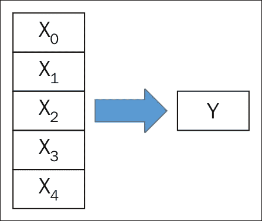

使用前向选择逐步回归，该技术从单个变量开始，运行回归，并计算（在这种情况下）均方根误差（rmse）：

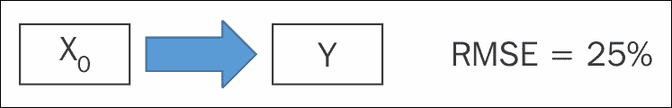

接下来，技术会回过头来添加另一个变量并计算 rmse：

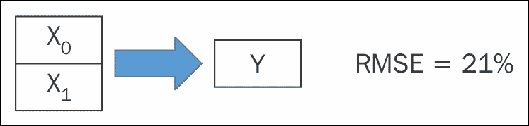

接下来，技术会回过头来添加另一个变量并计算 rmse：

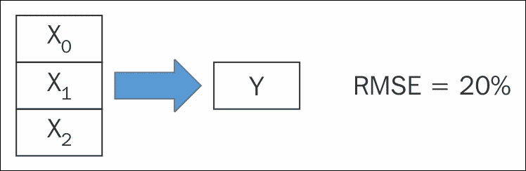

到现在为止，你可能已经明白了。根据实现方式，逐步回归可能会用不同的自变量组合和/或不同的测试和训练集重新运行。当逐步回归完成后，你就可以对哪些特征是重要的以及哪些可以被舍弃有一个很好的了解。

让我们来看看 Accord 中的逐步回归示例。回到你的脚本中，输入以下代码（注意，这直接来自 Accord 帮助文件中的逐步回归部分）：

```py
#r "../packages/Accord.3.0.2/lib/net40/Accord.dll"
open Accord.Statistics.Analysis

//Age/Smoking
let inputs = [|[|55.0;0.0|];[|28.0;0.0|];
               [|65.0;1.0|];[|46.0;0.0|];
               [|86.0;1.0|];[|56.0;1.0|];
               [|85.0;0.0|];[|33.0;0.0|];
               [|21.0;1.0|];[|42.0;1.0|];
               [|33.0;0.0|];[|20.0;1.0|];
               [|43.0;1.0|];[|31.0;1.0|];
               [|22.0;1.0|];[|43.0;1.0|];
               [|46.0;0.0|];[|86.0;1.0|];
               [|56.0;1.0|];[|55.0;0.0|];|]

//Have Cancer
let output = [|0.0;0.0;0.0;1.0;1.0;1.0;0.0;0.0;0.0;1.0;
               0.0;1.0;1.0;1.0;1.0;1.0;0.0;1.0;1.0;0.0|]

let regression = 
    StepwiseLogisticRegressionAnalysis(inputs, output, [|"Age";"Smoking"|],"Cancer")
```

将其发送到 FSI，得到以下结果：

```py
val inputs : float [] [] =
 [|[|55.0; 0.0|]; [|28.0; 0.0|]; [|65.0; 1.0|]; [|46.0; 0.0|]; [|86.0; 1.0|];
 [|56.0; 1.0|]; [|85.0; 0.0|]; [|33.0; 0.0|]; [|21.0; 1.0|]; [|42.0; 1.0|];
 [|33.0; 0.0|]; [|20.0; 1.0|]; [|43.0; 1.0|]; [|31.0; 1.0|]; [|22.0; 1.0|];
 [|43.0; 1.0|]; [|46.0; 0.0|]; [|86.0; 1.0|]; [|56.0; 1.0|]; [|55.0; 0.0|]|]
val output : float [] =
 [|0.0; 0.0; 0.0; 1.0; 1.0; 1.0; 0.0; 0.0; 0.0; 1.0; 0.0; 1.0; 1.0; 1.0; 1.0;
 1.0; 0.0; 1.0; 1.0; 0.0|]
val regression : StepwiseLogisticRegressionAnalysis

```

如代码中的注释所示，输入的是 20 个最近接受癌症筛查的虚构人物。特征包括他们的年龄和是否吸烟。输出是这个人是否真的患有癌症。

回到脚本中，添加以下内容：

```py
let results = regression.Compute()
let full = regression.Complete;
let best = regression.Current;

full.Coefficients

best.Coefficients
```

当你将这个数据发送到 FSI 时，你会看到一些非常有趣的东西。`full.Coefficients`返回所有变量，但`best.Coefficients`返回以下内容：

```py
val it : NestedLogisticCoefficientCollection =
 seq
 [Accord.Statistics.Analysis.NestedLogisticCoefficient
 {Confidence = 0.0175962716285245, 1.1598020423839;
 ConfidenceLower = 0.01759627163;
 ConfidenceUpper = 1.159802042;
 LikelihoodRatio = null;
 Name = "Intercept";
 OddsRatio = 0.1428572426;
 StandardError = 1.068502877;
 Value = -1.945909451;
 Wald = 0.0685832853132018;};
 Accord.Statistics.Analysis.NestedLogisticCoefficient
 {Confidence = 2.63490696729824, 464.911388747606;
 ConfidenceLower = 2.634906967;
 ConfidenceUpper = 464.9113887;
 LikelihoodRatio = null;
 Name = "Smoking";
 OddsRatio = 34.99997511;
 StandardError = 1.319709922;
 Value = 3.55534735;
 Wald = 0.00705923290736891;}]

```

现在，你可以看到`吸烟`是预测癌症时最重要的变量。如果有两个或更多变量被认为是重要的，Accord 会告诉你第一个变量，然后是下一个，依此类推。逐步回归分析在当今社区已经转向 Lasso 和其他一些技术的情况下，有点过时了。然而，它仍然是你的工具箱中的一个重要工具，并且是你应该了解的内容。

## 归一化

有时候，通过调整数据，我们可以提高模型的效果。我说的不是在安然会计或美国政治家意义上的“调整数字”。我指的是使用一些标准的科学技术来调整数据，这些技术可能会提高模型的准确性。这个过程的通用术语是*归一化*。

数据归一化的方法有很多种。我想向您展示两种与回归分析效果良好的常见方法。首先，如果你的数据是聚集在一起的，你可以对数值取对数，以帮助揭示可能被隐藏的关系。例如，看看我们来自第二章的开头的产品评论散点图，*AdventureWorks 回归*。注意，大多数订单数量集中在 250 到 1,000 之间。

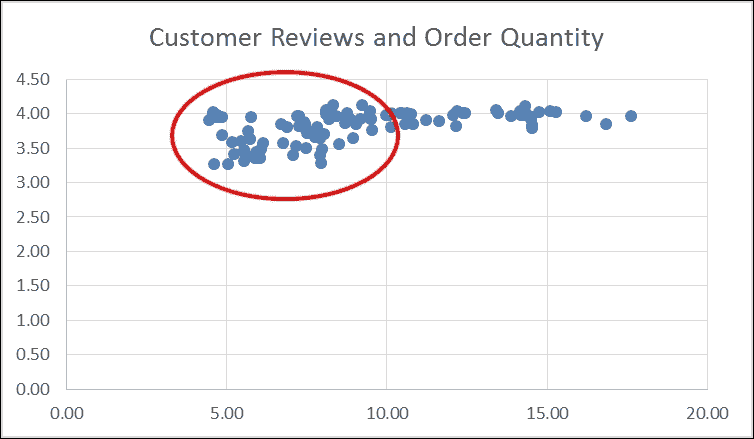

通过对订单数量取对数并执行类似的散点图，你可以更清楚地看到关系：

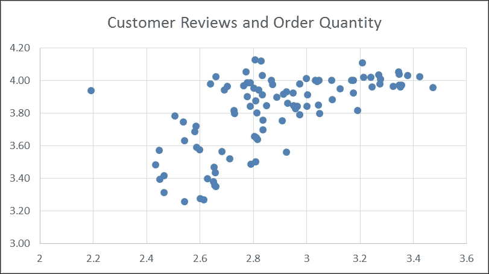

注意，取对数通常不会改变因变量和自变量之间的关系，因此你可以在回归分析中安全地用它来替换自然值。

如果你回到第二章的解决方案，*AdventureWorks 回归*，你可以打开回归项目并添加一个名为`Accord.Net4.fsx`的新文件。将`Accord.Net2.fsx`中的内容复制并粘贴进来。接下来，用以下代码替换数据读取器的代码行：

```py
while reader.Read() do
    productInfos.Add({ProductID=reader.GetInt32(0);
       AvgOrders=(float)(reader.GetDecimal(1));
       AvgReviews=log((float)(reader.GetDecimal(2)));
       ListPrice=(float)(reader.GetDecimal(3));})
```

将此发送到 REPL，我们得到以下结果：

```py
val regression : MultipleLinearRegression =
 y(x0, x1) = 35.4805245757214*x0 + -0.000897944878777119*x1 + -36.7106228824185
val error : float = 687.122625
val a : float = 35.48052458
val b : float = -0.0008979448788
val c : float = -36.71062288
val mse : float = 7.083738402
val rmse : float = 2.661529335
val r2 : float = 0.3490097415

```

注意变化。我们正在对`x`变量取对数。同时，注意我们的`r2`略有下降。原因是尽管对数没有改变`AvgReviews`之间的关系，但它确实影响了它与其他`x`变量以及可能`y`变量的关系。你可以看到，在这种情况下，它并没有做什么。

除了使用对数，我们还可以修剪异常值。回到我们的图表，你注意到那个平均订单数量为 2.2、平均评论为 3.90 的孤独点吗？

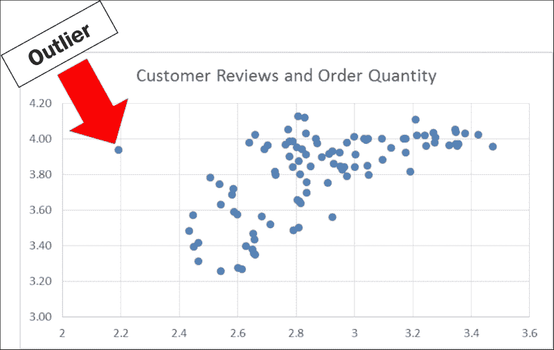

观察所有其他数据点，我们预计平均评论为 3.90 应该至少有 2.75 的平均订单数量。尽管我们可能想深入了解以找出问题所在，但我们将其留到另一天。现在，它实际上正在破坏我们的模型。确实，回归分析的最大批评之一就是它们对异常值过于敏感。让我们看看一个简单的例子。转到第二章，*AdventureWorks 回归*回归项目，创建一个新的脚本，命名为`Accord5.fsx`。将`Accord1.fsx`中的代码的第一部分复制到其中：

```py
#r "../packages/Accord.3.0.2/lib/net40/Accord.dll"
#r "../packages/Accord.Statistics.3.0.2/lib/net40/Accord.Statistics.dll"
#r "../packages/Accord.Math.3.0.2/lib/net40/Accord.Math.dll"

open Accord
open Accord.Statistics.Models.Regression.Linear

let xs = [| [|15.0;130.0|];[|18.0;127.0|];[|15.0;128.0|]; [|17.0;120.0|];[|16.0;115.0|] |]
let y = [|3.6;3.5;3.8;3.4;2.6|]

let regression = MultipleLinearRegression(2,true)
let error = regression.Regress(xs,y)

let a = regression.Coefficients.[0]
let b = regression.Coefficients.[1]

let sse = regression.Regress(xs, y)
let mse = sse/float xs.Length 
let rmse = sqrt(mse)
let r2 = regression.CoefficientOfDetermination(xs,y)
```

接下来，让我们加入一个对学校感到无聊的天才儿童，他的平均绩点（GPA）很低。加入一个 10 岁的学生，智商（IQ）为 150，平均绩点（GPA）为 1.0：

```py
let xs = [| [|15.0;130.0|];[|18.0;127.0|];[|15.0;128.0|]; [|17.0;120.0|];[|16.0;115.0|];[|10.0;150.0|] |]

let y = [|3.6;3.5;3.8;3.4;2.6;1.0|]
```

将整个脚本发送到 REPL，我们得到以下结果：

```py
val regression : MultipleLinearRegression =
 y(x0, x1) = 0.351124295971452*x0 + 0.0120748957392838*x1 + -3.89166344210844
val error : float = 1.882392837
val a : float = 0.351124296
val b : float = 0.01207489574
val sse : float = 1.882392837
val mse : float = 0.3137321395
val rmse : float = 0.5601179693
val r2 : float = 0.6619468116

```

注意我们的模型发生了什么。我们的`r2`从 0.79 降至 0.66，我们的均方根误差（rmse）从 0.18 升至 0.56！天哪，这是多么戏剧性的变化！正如你所猜到的，你如何处理异常值将对你的模型产生重大影响。如果模型的目的是预测大多数学生的平均绩点，我们可以安全地移除这个异常值，因为它并不典型。另一种处理异常值的方法是使用一个在处理它们方面做得更好的模型。

在掌握这些知识后，让我们用实际数据来尝试。添加一个新的脚本文件，并将其命名为`AccordDotNet6.fsx`。将`AccordDotNet2.fsx`中的所有内容复制并粘贴到其中。接下来，找到以下这些行：

```py
        while reader.Read() do
            productInfos.Add({ProductID=reader.GetInt32(0);
                                AvgOrders=(float)(reader.GetDecimal(1));
                                AvgReviews=(float)(reader.GetDecimal(2));
                                ListPrice=(float)(reader.GetDecimal(3));})

        let xs = productInfos |> Seq.map(fun pi -> [|pi.AvgReviews; pi.ListPrice|]) |> Seq.toArray
        let y = productInfos |> Seq.map(fun pi -> pi.AvgOrders) |> Seq.toArray

And replace them with these:
        while reader.Read() do
            productInfos.Add({ProductID=reader.GetInt32(0);
                                AvgOrders=(float)(reader.GetDecimal(1));
                                AvgReviews=(float)(reader.GetDecimal(2));
                                ListPrice=(float)(reader.GetDecimal(3));})

        let productInfos' = productInfos |> Seq.filter(fun pi -> pi.ProductID <> 757)

        let xs = productInfos' |> Seq.map(fun pi -> [|pi.AvgReviews; pi.ListPrice|]) |> Seq.toArray
        let y = productInfos' |> Seq.map(fun pi -> pi.AvgOrders) |> Seq.toArray
```

将这些内容发送到 REPL，我们得到以下结果：

```py
val regression : MultipleLinearRegression =
 y(x0, x1) = 9.89805316193142*x0 + -0.000944004141999501*x1 + -26.8922595356297
val error : float = 647.4688586
val a : float = 9.898053162
val b : float = -0.000944004142
val c : float = -26.89225954
val mse : float = 6.744467277
val rmse : float = 2.59701122
val r2 : float = 0.3743706412

```

`r2`从 0.35 升至 0.37，我们的 rmse 从 2.65 降至 2.59。删除一个数据点就有如此大的改进！如果你愿意，可以将这个更改应用到 AdventureWorks 项目中。我不会带你走这一步，但现在你有了独立完成它的技能。删除异常值是使回归分析更准确的一种非常强大的方法，但这也存在代价。在我们开始从模型中删除不起作用的数据元素之前，我们必须做出一些判断。事实上，有一些教科书专门讨论处理异常值和缺失数据的科学。在这本书中，我们不会深入探讨这个问题，只是承认这个问题存在，并建议你在删除元素时使用一些常识。

## 缩放

我想承认关于归一化和度量单位的一个常见误解。你可能会注意到，在第二章，*AdventureWorks 回归*和第三章中，不同的 `x` 变量具有显著不同的度量单位。在我们的示例中，客户评论的单位是 1-5 的评分，自行车的价格是 0-10,000 美元。你可能会认为比较这样大的数字范围会对模型产生不利影响。不深入细节，你可以放心，回归对不同的度量单位具有免疫力。

然而，其他模型（尤其是分类和聚类模型，如 k-NN、k-means 和 PCA）会受到 影响。当我们创建这些类型的模型在第六章和第七章中时，*Traffic Stops and Crash Locations – When Two Datasets Are Better Than One*，我们面临的风险是得到错误的结果，因为数据没有缩放。幸运的是，我们选择的功能和使用的库（Numl.net 和 Accord）帮助我们摆脱了困境。Numl.NET 自动对所有分类模型中的输入变量进行缩放。根据模型类型，Accord 可能会为你进行缩放。例如，在我们在第七章中编写的 PCA 中，我们在这行代码中传递了一个名为 `AnalysisMethod.Center` 的输入参数：

```py
let pca = new PrincipalComponentAnalysis(pcaInput.ToArray(), AnalysisMethod.Center)
```

这将输入变量缩放到平均值，这对我们的分析来说已经足够好了。当我们使用 Accord 在第六章中执行 k-NN 时，*AdventureWorks Redux – k-NN 和朴素贝叶斯分类器*，我们没有缩放数据，因为我们的两个输入变量是分类变量（`MartialStatus` 和 `Gender`），只有两种可能性（已婚或未婚，男或女），并且你只需要缩放连续变量或具有两个以上值的分类变量。如果我们使用了连续变量或三个因子的分类变量在 k-NN 中，我们就必须对其进行缩放。

让我们通过一个使用 Accord 的快速缩放示例来了解一下。打开本章的 `FeatureCleaning` 解决方案，并添加一个名为 `AccordKNN` 的新脚本文件：

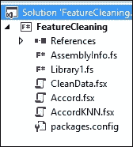

进入 NuGet 包管理器控制台，输入以下内容：

```py
PM> install-package Accord.MachineLearning

```

进入`AccordKNN.fsx`文件，并添加我们在第六章中使用的代码，*AdventureWorks Redux – k-NN 和朴素贝叶斯分类器*，供那些学习和喝酒的学生使用：

```py
#r "../packages/Accord.3.0.2/lib/net40/Accord.dll"
#r "../packages/Accord.Math.3.0.2/lib/net40/Accord.Math.dll"
#r "../packages/Accord.Statistics.3.0.2/lib/net40/Accord.Statistics.dll"
#r "../packages/Accord.MachineLearning.3.0.2/lib/net40/Accord.MachineLearning.dll"

open Accord
open Accord.Math
open Accord.MachineLearning
open Accord.Statistics.Analysis

let inputs = [|[|5.0;1.0|];[|4.5;1.5|];
             [|5.1;0.75|];[|1.0;3.5|];
             [|0.5;4.0|];[|1.25;4.0|]|]
let outputs = [|1;1;1;0;0;0|]

let classes = 2
let k = 3
let knn = KNearestNeighbors(k, classes, inputs, outputs)

let input = [|5.0;0.5|]
let output = knn.Compute(input)
```

现在，让我们将数据缩放，使得学习和喝酒相当。我们将采用最简单的缩放方法，称为*均值缩放*。回到脚本中，输入以下内容：

```py
let studyingAverage = inputs |> Array.map(fun i -> i.[0]) |> Array.average
let drinkingAverage = inputs |> Array.map(fun i -> i.[1]) |> Array.average

let scaledInputs = inputs |> Array.map(fun i -> [|i.[0]/studyingAverage; i.[1]/drinkingAverage|])
let scaledKNN = KNearestNeighbors(k, classes, scaledInputs, outputs)
```

当你将其发送到 REPL 时，你会看到以下内容：

```py
val studyingAverage : float = 2.891666667
val drinkingAverage : float = 2.458333333
val scaledInputs : float [] [] =
 [|[|1.729106628; 0.406779661|]; [|1.556195965; 0.6101694915|];
 [|1.763688761; 0.3050847458|]; [|0.3458213256; 1.423728814|];
 [|0.1729106628; 1.627118644|]; [|0.4322766571; 1.627118644|]|]
val scaledKNN : KNearestNeighbors

```

注意，输入现在相对于它们的平均值。那个学习了五小时并喝了一杯啤酒的人现在比平均水平多学习了 73%，比平均水平少喝了 41%。这个 k-NN 模型现在已缩放，当实际应用时将提供更好的“苹果对苹果”的比较。

# 过度拟合与交叉验证

如果你记得第 2、3 和 4 章，我们在构建模型时遇到的一个问题是过度拟合。过度拟合，预测分析的祸害，是指当我们构建一个在历史数据上做得很好的模型，但在引入新数据时却崩溃的现象。这种现象不仅限于数据科学；在我们的社会中发生得很多：职业运动员获得丰厚的合同，却未能达到先前的表现；基金经理因为去年的表现而获得大幅加薪，等等。

## 交叉验证 – 训练与测试

与从不学习的洋基队不同，我们的职业从错误中吸取了教训，并拥有一个伟大的、尽管不完美的工具来对抗过拟合。我们使用训练/测试/评估的方法构建多个模型，然后选择最佳模型，而不是基于它对现有数据集的表现，而是基于它对之前未见过的数据的表现。为了实现这一点，我们取我们的源数据，导入它，清理它，并将其分成两个子集：训练和测试。然后我们在训练集上构建我们的模型，如果它看起来可行，就将测试数据应用到模型上。如果模型仍然有效，我们可以考虑将其推向生产。这可以用以下图形表示：

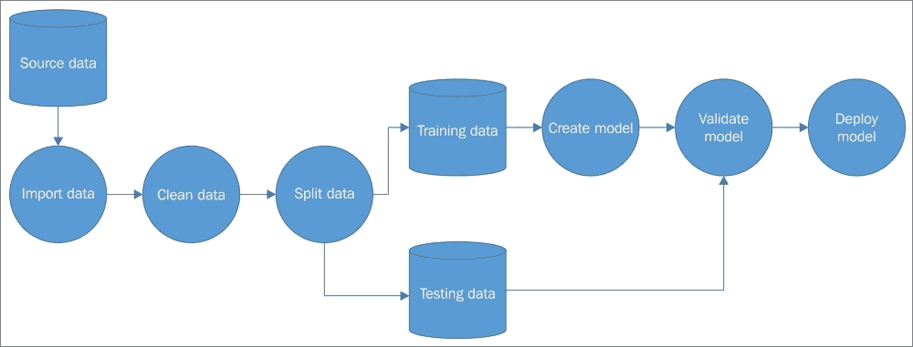

但我们还可以添加一个额外的步骤。我们可以将数据分割多次，并构建新的模型进行验证。实际分割数据集本身就是一门科学，但通常每次将基本数据集分割成**训练**和**测试**子集时，记录都是随机选择的。这意味着如果你将基本数据分割五次，你将拥有五个完全不同的训练和测试子集：


这种技术可能比实际模型选择更重要。Accord 和 Numl 在底层都进行了一些分割，在这本书中，我们将相信它们正在做好这项工作。然而，一旦你开始在野外工作模型，你将希望在每个项目上投入一定的时间进行交叉验证。

## 交叉验证 – 随机和平均测试

回到我们关于学生学习和喝酒的 k-NN 示例，我们如何知道我们是否预测准确？如果我们想猜测一个学生是否通过，我们只需抛硬币：正面通过，反面失败。我们分析中的假设是，学习的小时数和喝的啤酒数对考试成绩有一定的影响。如果我们的模型不如抛硬币，那么它不是一个值得使用的模型。打开 Visual Studio 并回到`AccordKNN.fsx`文件。在底部，输入以下代码：

```py
let students = [|0..5|]
let random = System.Random()
let randomPrediction = 
    students 
    |> Array.map(fun s -> random.Next(0,2))
```

将这些发送到 FSI，我们得到以下结果（你的结果将不同）：

```py
val students : int [] = [|0; 1; 2; 3; 4; 5|]
val random : System.Random
val randomPrediction : int [] = [|0; 1; 0; 0; 1; 1|]

```

现在，让我们输入有关每个学生的信息：他们学习的小时数和他们喝的啤酒数，并运行未缩放的 k-NN：

```py
let testInputs = [|[|5.0;1.0|];[|4.0;1.0|];
                 [|6.2;0.5|];[|0.0;2.0|];
                 [|0.5;4.0|];[|3.0;6.0|]|]

let knnPrediction =
    testInputs
    |> Array.map(fun ti -> knn.Compute(ti))
```

将这些发送到 REPL，我们得到以下结果：

```py
val testInputs : float [] [] =
 [|[|5.0; 1.0|]; [|4.0; 1.0|]; [|6.2; 0.5|]; [|0.0; 2.0|]; [|0.5; 4.0|];
 [|3.0; 6.0|]|]
val knnPrediction : int [] = [|1; 1; 1; 0; 0; 0|]

```

最后，让我们看看它们在考试中的实际表现。将以下内容添加到脚本中：

```py
let actual = [|1;1;1;0;0;0|]
```

将这些发送到 FSI，我们得到以下结果：

```py
val actual : int [] = [|1; 1; 1; 0; 0; 0|]

```

将这些数组组合在一起在图表中，我们将得到以下结果：

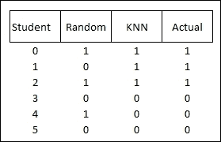

如果我们评分随机测试和 k-NN 在预测实际结果方面的表现，我们可以看到随机测试正确预测结果 66%的时间，而 k-NN 正确预测结果 100%的时间：

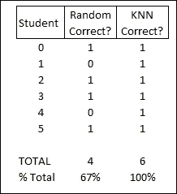

因为我们的 k-NN 比随机抛硬币做得更好，我们可以认为这个模型是有用的。

这种是/否随机测试在我们的模型是逻辑回归或 k-NN 这样的分类模型时效果很好，但当我们依赖的(*Y*)变量是像线性回归中的连续值时怎么办？在这种情况下，我们不是使用随机抛硬币，而是可以插入已知值的平均值。如果结果预测比平均值好，我们可能有一个好的模型。如果它比平均值差，我们需要重新思考我们的模型。例如，考虑从 AdventureWorks 预测平均自行车评论：

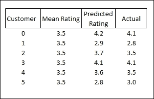

当你将预测值与实际值（考虑到可能更高或更低）进行比较，然后汇总结果时，你可以看到我们的线性回归在预测评分方面做得比平均值更好：

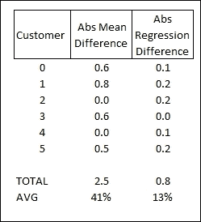

如果你认为我们在第二章和第三章已经做过类似的事情，你是正确的——这与 RMSE 的概念相同。

## 交叉验证 – 混淆矩阵和 AUC

回到我们的 k-NN 示例，想象一下我们对许多学生运行了 k-NN。有时 k-NN 猜对了，有时 k-NN 没有。实际上有四种可能的结果：

+   k-NN 预测学生会通过，他们确实通过了

+   k-NN 预测学生会失败，他们确实失败了

+   k-NN 预测学生会通过，但他们失败了

+   k-NN 预测学生会失败，但他们通过了

每个这些结果都有一个特殊的名称：

+   **预测通过且实际通过**：真阳性

+   **预测失败且实际失败**：真阴性

+   **预测通过但失败了**：假阳性

+   **预测失败但通过了**：假阴性

以图表形式，它看起来是这样的：

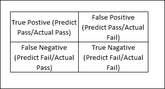

有时，假阳性被称为 I 型错误，而假阴性被称为 II 型错误。

如果我们对 100 名学生运行 k-NN，我们可以在图表中添加如下值：

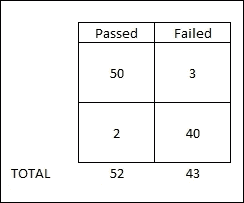

阅读这张图表，52 名学生通过了考试。其中，我们正确预测了 50 人会通过，但错误地预测了两个通过的学生会失败。同样，43 名学生没有通过考试（肯定是一场艰难的考试！），其中我们正确预测了 40 人会失败，而三个我们错误地预测了会通过。这个矩阵通常被称为*混淆矩阵*。

使用这个混淆矩阵，我们可以进行一些基本的统计，例如：

*准确率 = 真阳性 + 真阴性 / 总人口 = (50 + 40) / 100 = 90%*

*真阳性率 (TPR) = 真阳性 / 总阳性 = 50 / 52 = 96%*

*假阴性率 (FNR) = 假阴性 / 总阳性 = 2 / 52 = 4%*

*假阳性率 (FPR) = 假阳性 / 总阴性 = 3 / 43 = 7%*

*真阴性率 (TNR) = 真阴性 / 总阴性 = 40 / 43 = 93%*

（注意，TPR 有时被称为灵敏度，FNR 有时被称为漏报率，假阳性率有时被称为逃逸率，而 TNR 有时被称为特异性。）

*阳性似然比 (LR+) = TPR / FPR = 96% / (1 – 93%) = 13.8*

*阴性似然比 (LR-) = FNR / TNR = 4% / 93% = 0.04*

*诊断优势比 (DOR) = LR+ / LR- = 33.3*

由于 DOR 大于 1，我们知道模型运行良好。

将这些放入代码中，我们可以手动写下这些公式，但 Accord.Net 已经为我们处理好了。回到 Visual Studio，打开`AccordKNN.fsx`。在底部，输入以下代码：

```py
let positiveValue = 1
let negativeValue = 0

let confusionMatrix = ConfusionMatrix(knnPrediction,actual,positiveValue,negativeValue)
```

在下一行，输入`confusionMatrix`并按点号以查看所有可用的属性：

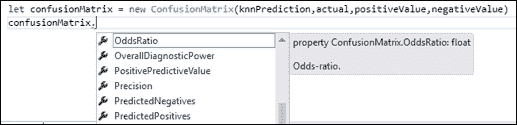

这确实是一个非常实用的课程。让我们选择优势比：

```py
confusionMatrix.OddsRatio
```

然后将整个代码块发送到 FSI：

```py
val positiveValue : int = 1
val negativeValue : int = 0
val confusionMatrix : ConfusionMatrix = TP:3 FP:0, FN:0 TN:3
val it : float = infinity

```

由于我们的 k-NN 是 100%准确的，我们得到了一个无限大的优势比（甚至更多）。在现实世界的模型中，优势比显然会低得多。

## 交叉验证 – 无关变量

还有一个技术我想介绍，用于交叉验证——添加无关变量并观察对模型的影响。如果你的模型真正有用，它应该能够处理额外的“噪声”变量，而不会对模型的结果产生重大影响。正如我们在第二章中看到的，*AdventureWorks 回归*，任何额外的变量都会对大多数模型产生积极影响，所以这是一个程度的衡量。如果添加一个无关变量使模型看起来更加准确，那么模型本身就有问题。然而，如果额外变量只有轻微的影响，那么我们的模型可以被认为是可靠的。

让我们看看实际效果。回到 `AccordKNN.fsx` 并在底部添加以下代码：

```py
let inputs' = [|[|5.0;1.0;1.0|];[|4.5;1.5;11.0|];
               [|5.1;0.75;5.0|];[|1.0;3.5;8.0|];
               [|0.5;4.0;1.0|];[|1.25;4.0;11.0|]|]

let knn' = KNearestNeighbors(k, classes, inputs', outputs)

let testInputs' = [|[|5.0;1.0;5.0|];[|4.0;1.0;8.0|];
                   [|6.2;0.5;12.0|];[|0.0;2.0;2.0|];
                   [|0.5;4.0;6.0|];[|3.0;6.0;5.0|]|]

let knnPrediction' =
    testInputs'
    |> Array.map(fun ti -> knn'.Compute(ti))
```

我添加了一个代表每个学生的星座符号的第三个变量（1.0 = 水瓶座，2.0 = 双鱼座，等等）。当我传入相同的测试输入（也带有随机的星座符号）时，预测结果与原始的 k-NN 相同。

```py
val knnPrediction' : int [] = [|1; 1; 1; 0; 0; 0|]
```

我们可以得出结论，尽管额外变量在建模过程中某个时刻产生了影响，但它并不足以改变我们的原始模型。然后我们可以用更高的信心使用这个模型。

# 摘要

本章与其他你可能读过的机器学习书籍略有不同，因为它没有介绍任何新的模型，而是专注于脏活累活——收集、清理和选择你的数据。虽然不那么光鲜，但绝对有必要掌握这些概念，因为它们往往会使项目成功或失败。事实上，许多项目花费超过 90% 的时间在获取数据、清理数据、选择正确的特征和建立适当的交叉验证方法上。在本章中，我们探讨了数据清理以及如何处理缺失和不完整的数据。接下来，我们探讨了多重共线性化和归一化。最后，我们总结了常见的交叉验证技术。

我们将在接下来的章节中应用所有这些技术。接下来，让我们回到 AdventureWorks 公司，看看我们是否可以用基于人类大脑工作原理的机器学习模型帮助他们改进生产流程。
